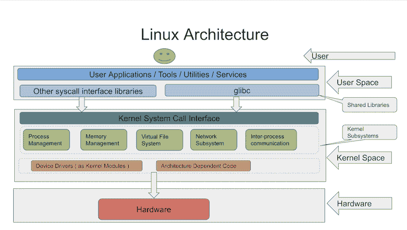

# Linux 基础知识

> 原文：<https://linkedin.github.io/school-of-sre/level101/linux_basics/intro/>

## 介绍

### 先决条件

*   应该能够熟练使用任何操作系统，如 Windows、Linux 或 Mac
*   期望对操作系统有基本的了解

## 从本课程中可以期待什么

本课程分为三个部分。在第一部分中，我们介绍了 Linux 操作系统的基础知识。我们将讨论 Linux 体系结构、Linux 发行版和 Linux 操作系统的使用。我们还将讨论 GUI 和 CLI 之间的区别。

在第二部分中，我们将介绍 Linux 中使用的一些基本命令。我们将关注用于导航文件系统、查看和操作文件、I/O 重定向等的命令。

在第三部分中，我们将介绍 Linux 系统管理。这包括由 Linux 管理员执行的日常任务，如管理用户/组、管理文件权限、监控系统性能、日志文件等。

在第二和第三部分，我们将举例来理解这些概念。

## 本课程不包括哪些内容

在本课程中，我们不涉及高级 Linux 命令和 bash 脚本。我们也不会讨论 Linux 的内部机制。

## 课程内容

本课程涵盖了以下主题:

*   [Linux 简介](https://linkedin.github.io/school-of-sre/level101/linux_basics/intro/)
    *   [什么是 Linux 操作系统](https://linkedin.github.io/school-of-sre/level101/linux_basics/intro/#what-are-linux-operating-systems)
    *   [什么是流行的 Linux 发行版](https://linkedin.github.io/school-of-sre/level101/linux_basics/intro/#what-are-popular-linux-distributions)
    *   [Linux 操作系统的使用](https://linkedin.github.io/school-of-sre/level101/linux_basics/intro/#uses-of-linux-operating-systems)
    *   [Linux 架构](https://linkedin.github.io/school-of-sre/level101/linux_basics/intro/#linux-architecture)
    *   [图形用户界面(GUI)与命令行界面(CLI)](https://linkedin.github.io/school-of-sre/level101/linux_basics/intro/#graphical-user-interface-gui-vs-command-line-interface-cli)
*   [命令行基础知识](https://linkedin.github.io/school-of-sre/level101/linux_basics/command_line_basics/)
    *   [实验室环境设置](https://linkedin.github.io/school-of-sre/level101/linux_basics/command_line_basics/#lab-environment-setup)
    *   [什么是命令](https://linkedin.github.io/school-of-sre/level101/linux_basics/command_line_basics/#what-is-a-command)
    *   [文件系统组织](https://linkedin.github.io/school-of-sre/level101/linux_basics/command_line_basics/#file-system-organization)
    *   [导航文件系统](https://linkedin.github.io/school-of-sre/level101/linux_basics/command_line_basics/#commands-for-navigating-the-file-system)
    *   [操作文件](https://linkedin.github.io/school-of-sre/level101/linux_basics/command_line_basics/#commands-for-manipulating-files)
    *   [查看文件](https://linkedin.github.io/school-of-sre/level101/linux_basics/command_line_basics/#commands-for-viewing-files)
    *   [回显命令](https://linkedin.github.io/school-of-sre/level101/linux_basics/command_line_basics/#echo-command)
    *   [文本处理命令](https://linkedin.github.io/school-of-sre/level101/linux_basics/command_line_basics/#text-processing-commands)
    *   [输入/输出重定向](https://linkedin.github.io/school-of-sre/level101/linux_basics/command_line_basics/#io-redirection)
*   [Linux 系统管理](https://linkedin.github.io/school-of-sre/level101/linux_basics/linux_server_administration/)
    *   [实验室环境设置](https://linkedin.github.io/school-of-sre/level101/linux_basics/linux_server_administration/#lab-environment-setup)
    *   [用户/群组管理](https://linkedin.github.io/school-of-sre/level101/linux_basics/linux_server_administration/#usergroup-management)
    *   [成为超级用户](https://linkedin.github.io/school-of-sre/level101/linux_basics/linux_server_administration/#becoming-a-superuser)
    *   [文件权限](https://linkedin.github.io/school-of-sre/level101/linux_basics/linux_server_administration/#file-permissions)
    *   [SSH 命令](https://linkedin.github.io/school-of-sre/level101/linux_basics/linux_server_administration/#ssh-command)
    *   [套餐管理](https://linkedin.github.io/school-of-sre/level101/linux_basics/linux_server_administration/#package-management)
    *   [流程管理](https://linkedin.github.io/school-of-sre/level101/linux_basics/linux_server_administration/#process-management)
    *   [内存管理](https://linkedin.github.io/school-of-sre/level101/linux_basics/linux_server_administration/#memory-management)
    *   [守护程序和系统 d](https://linkedin.github.io/school-of-sre/level101/linux_basics/linux_server_administration/#daemons)
    *   [日志](https://linkedin.github.io/school-of-sre/level101/linux_basics/linux_server_administration/#logs)
*   [结论](https://linkedin.github.io/school-of-sre/level101/linux_basics/conclusion)
    *   [SRE 角色中的应用](https://linkedin.github.io/school-of-sre/level101/linux_basics/conclusion/#applications-in-sre-role)
    *   [有用的课程和教程](https://linkedin.github.io/school-of-sre/level101/linux_basics/conclusion/#useful-courses-and-tutorials)

## 什么是 Linux 操作系统

我们大多数人都熟悉 75%以上的个人电脑使用的 Windows 操作系统。Windows 操作系统基于 Windows NT 内核。

内核是操作系统中最重要的部分——它执行重要的功能，如进程管理、内存管理、文件系统管理等。

Linux 操作系统基于 Linux 内核。基于 Linux 的操作系统将由 Linux 内核、GUI/CLI、系统库和系统实用程序组成。Linux 内核由 Linus Torvalds 独立开发和发布。Linux 内核是免费和开源的-[`github.com/torvalds/linux`](https://github.com/torvalds/linux)

Linux 是一个内核，而不是一个完整的操作系统。Linux 内核与 GNU 系统结合在一起，构成一个完整的操作系统。因此，基于 linux 的操作系统也被称为 GNU/Linux 系统。GNU 是一个广泛的自由软件集合，如编译器、调试器、C 库等。 [Linux 和 GNU 系统](https://www.gnu.org/gnu/linux-and-gnu.en.html)

Linux 历史-[`en.wikipedia.org/wiki/History_of_Linux`](https://en.wikipedia.org/wiki/History_of_Linux)

## 什么是流行的 Linux 发行版

Linux 发行版是一个基于 Linux 内核的操作系统和一个软件包管理系统。软件包管理系统由帮助在操作系统上安装、升级、配置和删除软件的工具组成。

软件通常采用发行版，并以发行版特有的格式打包。这些包可以通过发行版特定的库获得。软件包由软件包管理器在操作系统中安装和管理。

**流行的 Linux 发行版列表:**

*   一种男式软呢帽

*   人的本质

*   一种自由操作系统

*   摘录

*   红帽企业版 Linux

*   苏塞

*   Arch Linux

| 包系统 | 分布 | 包管理器 |
| --- | --- | --- |
| Debian 风格(。deb) | Debian，Ubuntu | 恰当的 |
| 红帽风格(。rpm) | Fedora、CentOS、Red Hat Enterprise Linux | 妙的 |

## Linux 架构

*   Linux 内核在本质上是单一的。

*   系统调用用于与 Linux 内核空间进行交互。

*   内核代码只能在内核模式下执行。非内核代码在用户模式下执行。

*   设备驱动程序用于与硬件设备通信。

## Linux 操作系统的使用

基于 Linux 内核的操作系统广泛应用于:

*   个人电脑

*   服务器

*   手机——Android 是基于 Linux 操作系统的

*   嵌入式设备-手表、电视、交通灯等

*   卫星

*   网络设备-路由器、交换机等。

## 图形用户界面(GUI)与命令行界面(CLI)

用户在用户界面的帮助下与计算机交互。用户界面可以是 GUI 或 CLI。

图形用户界面允许用户使用诸如图标和图像的图形与计算机进行交互。当用户点击图标打开计算机上的应用时，他或她实际上是在使用 GUI。使用 GUI 很容易执行任务。

命令行界面允许用户使用命令与计算机进行交互。用户在终端中键入命令，系统帮助执行这些命令。对 GUI 有经验的新用户可能会发现很难与 CLI 交互，因为他/她需要知道执行特定操作的命令。

## 外壳与终端

Shell 是一个程序，它从用户那里获取命令，并将它们交给操作系统进行处理。Shell 是 CLI(命令行界面)的一个例子。Bash 是 Linux 服务器上最流行的 shell 程序之一。其他流行的 shell 程序有 zsh、ksh 和 tcsh。

终端是一个打开窗口并让你与外壳交互的程序。一些流行的终端例子有 gnome-terminal、xterm、konsole 等。

Linux 用户确实使用外壳、终端、提示符、控制台等术语。可互换。简单来说，这些都是指从用户那里获取命令的方式。