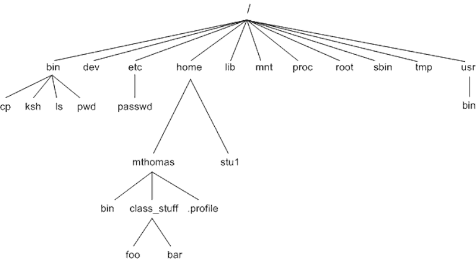
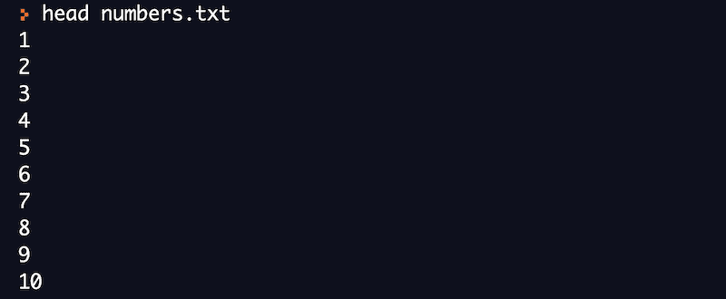
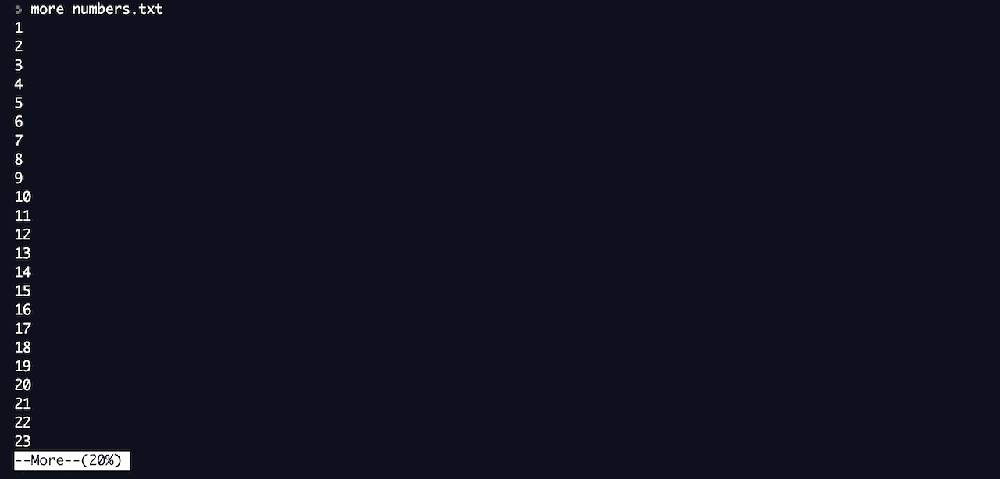
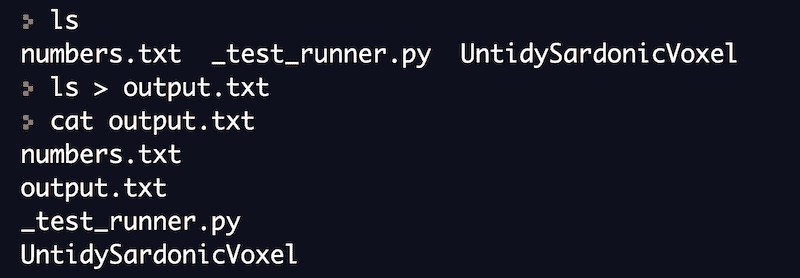

# 命令行基础

> 原文：<https://linkedin.github.io/school-of-sre/level101/linux_basics/command_line_basics/>

## 实验室环境设置

您可以使用在线 bash 解释器来运行本课程中作为示例提供的所有命令。这也将帮助您获得各种 linux 命令的实践经验。

REPL 是一个流行的运行 linux 命令的在线 bash 解释器。我们将使用它来运行本课程中提到的所有命令。

## 什么是命令

命令是告诉操作系统执行特定工作的程序。在 linux 中，程序是作为文件存储的。因此，命令也是存储在磁盘某处的文件。

命令也可以接受额外的参数作为用户的输入。这些参数称为命令行参数。知道如何使用命令很重要，在 Linux 中有很多方法可以获得帮助，尤其是命令。几乎每个命令都有某种形式的文档，大多数命令都有一个命令行参数-h 或- help，可以显示合理数量的文档。但是 Linux 中最流行的文档系统叫做 man pages——手册页的缩写。

使用- help 显示 ls 命令的文档。


## 文件系统组织

linux 文件系统有一个分层(或树状)结构，它的最高层目录称为 root(用/)表示。根目录中的目录存储与系统相关的文件。这些目录又可以存储系统文件、应用文件或用户相关文件。



bin |最常用命令的可执行程序位于 bin 目录中

dev |该目录包含与系统上的设备相关的文件

etc |该目录包含所有系统配置文件

home |此目录包含与用户相关的文件和目录。

lib |该目录包含所有的库文件

mnt |该目录包含与系统上安装的设备相关的文件

proc |该目录包含与系统上正在运行的进程相关的文件

root |此目录包含与 root 用户相关的文件和目录。

sbin |该目录包含用于系统管理的程序。

tmp |该目录用于存储系统中的临时文件

usr |该目录用于存储系统上的应用

## 用于导航文件系统的命令

有三个常用于导航文件系统的基本命令:

*   限位开关（Limit Switch）

*   显示当前工作目录

*   激光唱片

我们现在将尝试理解每个命令的作用以及如何使用这些命令。您还应该在在线 bash shell 上练习给出的示例。

### 打印工作目录

在任何给定的时刻，我们都将站在某个目录中。要获得我们所在目录的名称，我们可以在 linux 中使用 pwd 命令。


我们现在将使用 cd 命令移动到不同的目录，然后打印工作目录。


### 光盘(更改目录)

cd 命令可用于更改工作目录。使用命令，您可以从一个目录移动到另一个目录。

在下面的例子中，我们最初在根目录中。然后，我们使用 cd 命令来更改目录。


### ls(列出文件和目录)**

ls 命令用于列出目录的内容。它将列出给定目录中的所有文件和文件夹。

如果我们在 shell 中键入 ls，它将列出当前目录中的所有文件和目录。


我们还可以提供目录名作为 ls 命令的参数。然后，它将列出给定目录中的所有文件和目录。


## 用于操作文件的命令

有五个常用于操作文件的基本命令:

*   触控

*   mkdir

*   丙酸纤维素

*   平均变化

*   空间

我们现在将尝试理解每个命令的作用以及如何使用这些命令。您还应该在在线 bash shell 上练习给出的示例。

### 触摸(创建新文件)

触摸命令可用于创建一个空的新文件。该命令对于许多其他目的非常有用，但是我们将讨论创建新文件的最简单的用例。

使用触摸命令的一般语法

```sh
touch <file_name> 
```


### mkdir(创建新目录)

mkdir 命令用于创建目录。您可以使用 ls 命令来验证新目录是否已创建。

使用 mkdir 命令的一般语法

```sh
mkdir <directory_name> 
```


### rm(删除文件和目录)

rm 命令可用于删除文件和目录。请务必注意，该命令会永久删除文件和目录。一旦对这些文件和目录成功执行了 rm 命令，就几乎不可能恢复它们。一定要小心运行这个命令。

使用 rm 命令的一般语法:

```sh
rm <file_name> 
```

让我们试着用一个例子来理解 rm 命令。我们将尝试分别删除使用 touch 和 mkdir 命令创建的文件和目录。


### 复制文件和目录

cp 命令用于将文件和目录从一个位置复制到另一个位置。请注意，cp 命令不会对原始文件或目录做任何更改。成功运行 cp 命令后，原始文件或目录及其副本将共存。

使用 cp 命令的一般语法:

```sh
cp <source_path> <destination_path> 
```

我们目前在“/home/runner”目录中。我们将使用 mkdir 命令创建一个名为“test_directory”的新目录。我们现在将尝试将“_test_runner.py”文件复制到我们刚才创建的目录中。


请注意，原始的“_test_runner.py”文件没有发生任何变化。它仍然在当前目录中。在“test_directory”中创建了一个新的副本。


我们还可以使用 cp 命令将整个目录从一个位置复制到另一个位置。我们试着用一个例子来理解这一点。


我们再次使用 mkdir 命令创建一个名为“another_directory”的新目录。然后，我们使用 cp 命令和一个附加参数'-r '来复制“test_directory”。

**mv(移动文件和目录)**

mv 命令既可以用于将文件或目录从一个位置移动到另一个位置，也可以用于重命名文件或目录。请注意，移动文件和复制文件是非常不同的。当您移动文件或目录时，原始副本会丢失。

使用 mv 命令的一般语法:

```sh
mv <source_path> <destination_path> 
```

在本例中，我们将使用 mv 命令将“_test_runner.py”文件移动到“test_directory”中。在这种情况下，这个文件已经存在于“test_directory”中。mv 命令将替换它。**请注意，mv 命令成功运行后，当前目录中不存在原始文件。**


我们还可以使用 mv 命令将目录从一个位置移动到另一个位置。在这种情况下，我们不需要像使用 cp 命令时那样使用'-r '标志。请注意，如果我们使用 mv 命令，原始目录将不存在。

mv 命令的一个重要用途是重命名文件和目录。让我们看看如何使用这个命令进行重命名。

我们首先将我们的位置更改为“test_directory”。然后，我们使用 mv 命令将“_test_runner.py”文件重命名为“test.py”。


## 查看文件的命令

有五个常用于查看文件的基本命令:

*   猫

*   头

*   尾巴

*   更多

*   较少的

我们现在将尝试理解每个命令的作用以及如何使用这些命令。您还应该在在线 bash shell 上练习给出的示例。

我们将创建一个名为“numbers.txt”的新文件，并在该文件中插入从 1 到 100 的数字。每个数字将在一个单独的行。


现在不要担心上面的命令。这是一个用于生成数字的高级命令。然后，我们使用重定向操作符将这些数字推送到文件中。我们将在后面的章节中讨论 I/O 重定向。

### 猫

cat 命令最简单的用法是在输出屏幕上打印文件的内容。这个命令非常有用，可以用于许多其他目的。稍后我们将学习其他用例。


你可以试着运行上面的命令，你会在屏幕上看到从 1 到 100 的数字。你需要向上滚动才能看到所有的数字。

### 头

默认情况下，head 命令显示文件的前 10 行。我们可以包含额外的参数，从顶部开始显示任意多的行。

在这个例子中，当我们使用 head 命令时，我们只能看到文件的前 10 行。



默认情况下，head 命令将只显示前 10 行。如果我们想要指定我们想要从开始看到的行数，使用'-n '参数来提供输入。


### 尾巴

默认情况下，tail 命令显示文件的最后 10 行。我们可以包含额外的参数，从文件末尾开始显示任意多的行。


默认情况下，tail 命令将只显示最后 10 行。如果我们想指定我们想从末尾看到的行数，使用'-n '参数来提供输入。


在本例中，当我们使用带有 explicit -n 选项的 tail 命令时，我们只能看到文件的最后 5 行。

### 更多

More command 显示文件或命令输出的内容，如果文件很大(例如:日志文件)，则一次显示一个屏幕。它还允许在文件中向前导航和有限的向后导航。



More command 尽可能多地显示在当前屏幕上，并等待用户输入前进。向前导航可以通过按 Enter 键来完成，这将使输出前进一行，按 Space 键将输出前进一屏。

### 较少的

Less command 是 more 的改进版本。它显示文件或命令输出的内容，一次显示一页。它允许在文件中向后导航和向前导航，也有搜索选项。我们可以使用箭头键向前或向后移动一行。向前移动一页，按空格键；向后移动一页，按键盘上的 b 键。您可以立即转到文件的开头和结尾。

## Linux 中的 Echo 命令

echo 命令是 shell 中使用的最简单的命令之一。这个命令相当于我们在其他编程语言中拥有的<print>。</print>

echo 命令在屏幕上打印给定的输入字符串。


## 文本处理命令

在上一节中，我们学习了如何查看文件的内容。在许多情况下，我们会对执行以下操作感兴趣:

*   仅打印包含特定单词的行

*   用文件中的另一个单词替换特定的单词

*   按特定顺序对行进行排序

有三个常用于处理文本的基本命令:

*   可做文件内的字符串查找

*   一项 Linux 指令

*   分类

我们现在将尝试理解每个命令的作用以及如何使用这些命令。您还应该在在线 bash shell 上练习给出的示例。

我们将创建一个名为“numbers.txt”的新文件，并在该文件中插入从 1 到 10 的数字。每个数字将在一个单独的行。


### 可做文件内的字符串查找

grep 命令最简单的形式可以用来搜索文本文件中的特定单词。它将显示包含特定输入的文件中的所有行。我们要搜索的单词作为 grep 命令的输入提供。

使用 grep 命令的一般语法:

```sh
grep <word_to_search> <file_name> 
```

在这个例子中，我们试图在这个文件中搜索一个字符串“1”。grep 命令输出找到该字符串的行。


### 一项 Linux 指令

最简单的 sed 命令可以用来替换文件中的文本。

使用 sed 命令进行替换的一般语法:

```sh
sed 's/<text_to_replace>/<replacement_text>/' <file_name> 
```

让我们尝试使用 sed 命令将文件中出现的“1”替换为“3”。


在上面的例子中，文件的内容不会改变。为此，我们必须使用一个额外的参数'-i '，以便将更改反映到文件中。

### 分类

sort 命令可用于对作为参数提供给它的输入进行排序。默认情况下，它将按升序排序。

在尝试对文件进行排序之前，让我们先看看文件的内容。


现在，我们将尝试使用 sort 命令对文件进行排序。sort 命令按字典顺序对内容进行排序。


在上面的例子中，文件的内容不会改变。

## 输入输出重定向

每个打开的文件被分配一个文件描述符。文件描述符是系统中打开文件的唯一标识符。总是有三个默认文件打开，stdin(键盘)、stdout(屏幕)和 stderr(输出到屏幕的错误消息)。这些文件可以被重定向。

Linux-[https://UNIX . stack exchange . com/questions/225537/everything-is-a-file](https://unix.stackexchange.com/questions/225537/everything-is-a-file)

到目前为止，我们已经在屏幕上显示了所有的输出，这是标准输出。我们可以使用一些特殊的操作符将命令的输出重定向到文件，甚至重定向到其他命令的输入。I/O 重定向是一个非常强大的功能。

在下面的例子中，我们使用了'>'操作符将 ls 命令的输出重定向到 output.txt 文件。



在下面的例子中，我们将 echo 命令的输出重定向到一个文件。


我们还可以将一个命令的输出重定向为另一个命令的输入。借助管道，这是可能的。

在下面的示例中，我们使用管道(|)操作符将 cat 命令的输出作为输入传递给 grep 命令。


在下面的例子中，我们使用管道(|)操作符将 sort 命令的输出作为输入传递给 uniq 命令。uniq 命令只打印输入中的唯一数字。


输入/输出重定向-[https://tldp.org/LDP/abs/html/io-redirection.html](https://tldp.org/LDP/abs/html/io-redirection.html)