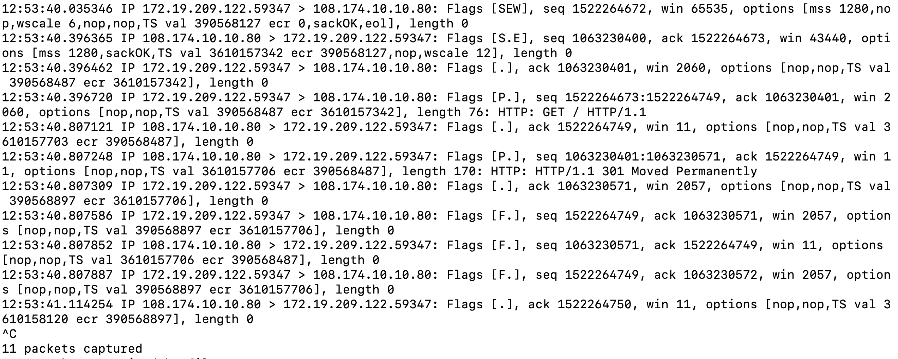

# 传输控制协议（Transmission Control Protocol）

> 原文：<https://linkedin.github.io/school-of-sre/level101/linux_networking/tcp/>

TCP 是像 UDP 一样的传输层协议，但是它保证可靠性、流量控制和拥塞控制。TCP 通过使用序列号来保证可靠的传输。TCP 连接是通过三次握手建立的。在我们的例子中，客户机发送一个 SYN 包和它计划使用的起始序列号，服务器确认这个 SYN 包并发送一个 SYN 和它的序列号。一旦客户端确认了 syn 数据包，连接就建立了。一旦相关方收到对该序列的确认，则从此传输的每个数据都被认为是可靠地传递了


```sh
#To understand handshake run packet capture on one bash session
tcpdump -S -i any port 80
#Run curl on one bash session
curl www.linkedin.com 
```



在这里，客户端发送一个由[S] flag 表示的 syn 标志，序列号为 1522264672。服务器用 ack 确认收到 SYN。]标志和用于其序列号的 Syn 标志。服务器使用序列号 1063230400，并向客户机确认它期望的序列号 1522264673(客户机序列+1)。客户端向服务器发送一个零长度确认数据包(服务器序列+1 ),连接建立。这被称为三次握手。此后，客户端发送一个 76 字节长的数据包，并将其序列号递增 76。服务器发送一个 170 字节的响应并关闭连接。这就是我们所说的 HTTP/1.1 和 HTTP/1.0 之间的区别。在 HTTP/1.1 中，可以重用相同的连接，这减少了每个 HTTP 请求的 3 次握手的开销。如果客户端和服务器之间的数据包丢失，服务器不会向客户端发送 ack，客户端将重试发送数据包，直到收到 ACK。这保证了可靠性。流量控制由每个段中的 win size 字段建立。win 大小表示内核中可用的 TCP 缓冲区长度，可用于缓冲接收到的数据段。大小为 0 意味着接收方需要从套接字缓冲区捕捉大量的延迟，发送方必须暂停发送数据包，以便接收方能够应付。这种流量控制避免了慢速接收者和快速发送者的问题

TCP 还进行拥塞控制，确定在没有 ack 的情况下可以传输多少数据段。Linux 为我们提供了配置拥塞控制算法的能力，我们不在这里讨论。

关闭连接时，客户机/服务器调用 close syscall。让我们假设客户这样做。客户端的内核将发送一个 FIN 包给服务器。在服务器应用程序调用 close syscall 之前，服务器内核无法关闭连接。一旦服务器应用程序调用 close，服务器也发送 FIN 数据包，客户端进入 2 * MSS(120 秒)的时间等待状态，以便该套接字在该时间段内不能重复使用，以防止由于分散的陈旧数据包导致任何 TCP 状态损坏。


用我们的 TCP 和 HTTP 知识武装起来，让我们看看 sre 在他们的角色中是如何使用它的

## SRE 角色中的应用

1.  使用负载平衡器扩展 HTTP 性能需要对 TCP 和 HTTP 有一致的了解。有[种不同的负载平衡](https://blog.envoyproxy.io/introduction-to-modern-network-load-balancing-and-proxying-a57f6ff80236?gi=428394dbdcc3)，如 L4、L7 负载平衡、直接服务器返回等。根据性能和合规性需求，HTTPs 卸载可以在负载平衡器上完成，也可以直接在服务器上完成。
2.  像我们对 UDP 那样调整 rmem 和 wmem 的 sysctl 变量可以提高发送方和接收方的吞吐量。
3.  Sysctl 变量 tcp_max_syn_backlog 和 socket 变量 somax_conn 确定在 app 调用 accept syscall 之前内核可以完成 3 次握手的连接数。这在单线程应用程序中非常有用。一旦积压满了，新的连接就保持在 SYN_RCVD 状态(当您运行 netstat 时),直到应用程序调用接受 syscall
4.  如果有太多的短期连接，应用程序可能会用完文件描述符。深入研究 [tcp_reuse 和 tcp_recycle](http://lxr.linux.no/linux+v3.2.8/Documentation/networking/ip-sysctl.txt#L464) 有助于减少处于时间等待状态的时间(它有自己的风险)。让应用程序重用连接池而不是创建临时连接也会有所帮助
5.  通过查看指标了解性能瓶颈，并分类是应用还是网络方面的问题。示例:太多套接字处于 Close_wait 状态是应用程序的问题，而重新传输可能是网络或操作系统堆栈的问题，而不是应用程序本身的问题。理解基本原理可以帮助我们缩小瓶颈所在