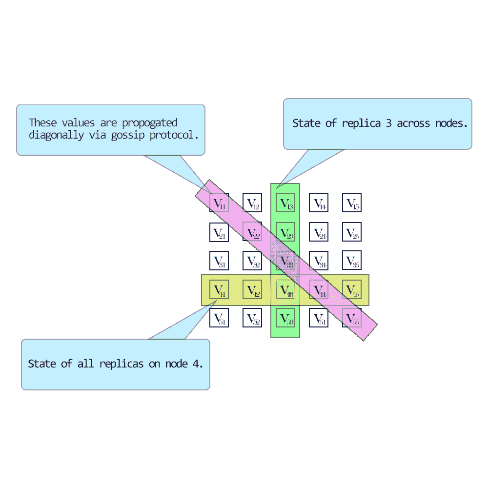
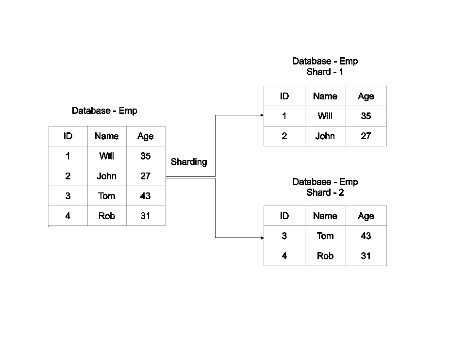
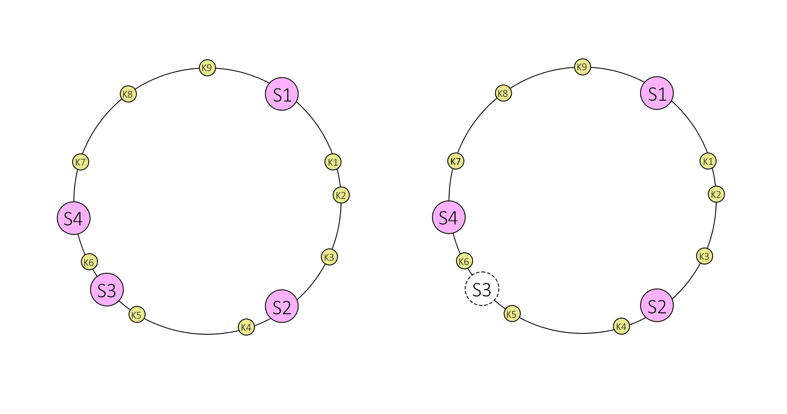
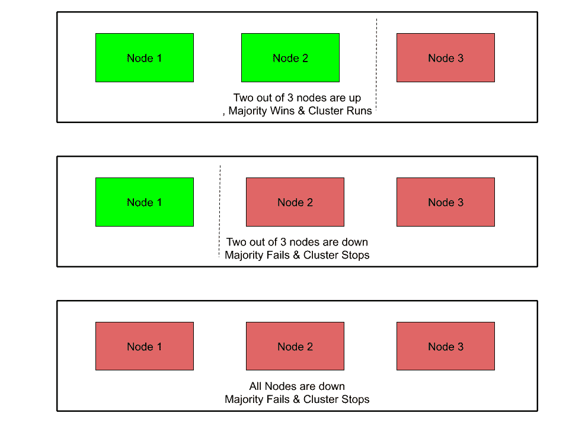
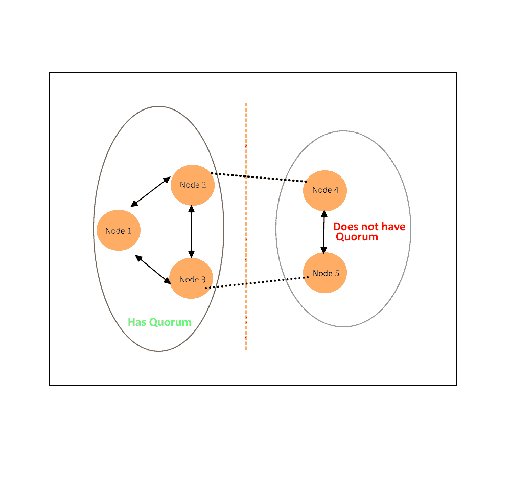

# 关键概念

> 原文：<https://linkedin.github.io/school-of-sre/level101/databases_nosql/key_concepts/>

当我们谈论 NoSQL 或分布式系统时，让我们看看一些关键概念

### CAP 定理

在 2000 年 ACM 的 PODC 研讨会上，Eric Brewer 提出了所谓的 CAP-theorem(CAP-theorem ),这是一个被大型网络公司和 NoSQL 社区广泛采用的主题。CAP 首字母缩写代表 **C** 一致性， **A** 可用性&T6】P 分割公差。

*   **一致性**

    它指的是系统在执行后的一致性。当一个源所做的写操作对该共享数据的所有读者都可用时，分布式系统被称为一致的。不同的 NoSQL 系统支持不同级别的一致性。

*   **可用性**

    它是指系统如何应对由于硬件和软件故障导致的不同系统的功能丧失。高可用性意味着当系统的某个部分由于故障或升级而停机时，系统仍然可以处理操作(读取和写入)。

*   **分区公差**

    它是系统在网络分区的情况下继续运行的能力。当一个故障导致两个或多个网络孤岛，系统暂时或永久无法通过孤岛相互通信时，就会发生网络分区。

布鲁尔声称，在共享数据系统中，人们最多只能选择这三个特征中的两个。CAP 定理指出，出于一致性、可用性和分区容差，只能对两个选项进行选择。大规模应用程序中越来越多的用例倾向于重视可靠性，这意味着可用性和冗余比一致性更有价值。因此，这些系统很难满足酸性。他们通过放松一致性要求(即最终一致性)来实现这一点。

**最终一致性**意味着随着时间的推移，所有的读者都将看到写入:“在稳定状态下，系统最终将返回最后写入的值”。因此，在更新过程中，客户端可能会面临数据不一致的状态。例如，在复制的数据库中，更新可以进行到一个节点，该节点将最新版本复制到包含修改的数据集的副本的所有其他节点，使得副本节点最终将具有最新版本。

NoSQL 系统支持不同级别的最终一致性模型。例如:

*   **读自己写的一致性**

    客户端将在更新完成后立即看到它们。读取操作可能会命中除写入节点之外的节点。但是，他们可能不会立即看到其他客户端的更新。

*   **会话一致性**

    客户端将在会话范围内看到对其数据的更新。这通常表示读取和写入发生在同一个服务器上。使用相同节点的其他客户端将收到相同的更新。

*   **偶然的一致性**

    如果以下条件成立，则系统提供因果一致性:由潜在因果关系相关的写操作被系统的每个进程按顺序看到。不同的进程可能以不同的顺序观察并发写入

如果对相同数据分区的并发更新不太可能，并且如果客户端不立即依赖于读取由它们自己或由其他客户端发出的更新，则最终一致性是有用的。

根据为系统(或部分系统)选择的一致性模型，确定请求的路由位置，例如复制副本。

**瓶盖替代品图解**

| 选择 | 特征 | 例子 |
| Consistency + Availability(放弃分区) | 2-phase commits缓存失效协议 | Single-site databases Cluster databases轻量级目录访问协议xFS 文件系统 |
| Consistency + Partition tolerance(丧失可用性) | Pessimistic locking使少数分区不可用 | 分布式数据库分布式锁定多数协议 |
| 可用性+分区容差(丧失一致性) | expirations/leases冲突解决乐观 | DNSWeb 缓存 |

### 分布式系统中数据的版本控制

当数据分布在不同的节点上时，可以同时在不同的节点上对其进行修改(假设实施了严格的一致性)。并发更新的冲突解决出现了问题。一些流行的冲突解决机制有

*   **时间戳**

    这是最明显的解决方案。您根据时间顺序对更新进行排序，并选择最新的更新。然而，这依赖于基础设施不同部分之间的时钟同步。当系统的各个部分分布在不同的地理位置时，这变得更加复杂。

*   **乐观锁定**

    您将一个唯一的值(如时钟或计数器)与每次数据更新相关联。当客户机想要更新数据时，它必须指定需要更新哪个版本的数据。这意味着您需要跟踪数据版本的历史。

*   **矢量时钟**

    向量时钟被定义为来自每个节点的时钟值的元组。在分布式环境中，每个节点维护这样的时钟值的元组，该元组表示节点本身及其对等体/副本的状态。时钟值可以是从本地时钟或版本号导出的真实时间戳



矢量时钟插图

与其他冲突解决机制相比，矢量时钟具有以下优势

1.  不依赖同步时钟
2.  临时推理不需要修订号的总排序

不需要在不同的节点上存储和维护数据的多个版本。

### 分割

当数据量超过单个节点的容量时，我们需要考虑拆分数据，为负载平衡和灾难恢复创建副本。根据基础设施的动态性，我们有几种方法可以采用。

1.  **内存缓存**

    这些是分区的内存数据库，主要用于临时数据。这些数据库通常被用作传统 RDBMS 的前台。最常用的数据从 rdbms 复制到内存数据库中，以便于快速查询，并减轻后端数据库的负担。一个非常常见的例子是 memcached 或 couchbase。

2.  **聚类**

    传统的集群机制从客户端抽象出集群拓扑。客户端不需要知道实际数据驻留在哪里，也不需要知道它正在与哪个节点通信。集群在传统的 RDBMS 中非常常用，它可以在一定程度上帮助扩展持久层。

3.  **将读写分离**

    在这种方法中，您将拥有托管相同数据的多个副本。传入的写入通常发送到单个节点(主节点)或多个节点(多主节点)，而其余的副本(从节点)处理读取请求。领导者将写入异步复制到所有追随者。然而，写入延迟无法完全避免。有时领导者会在将所有数据复制给追随者之前崩溃。当这种情况发生时，一个拥有最一致数据的追随者可以转变为领导者。正如您现在所意识到的，在这个模型中很难实现完全的一致性。您还需要考虑读写流量的比率。当写操作高于读操作时，这种模式没有意义。复制方法也可能千差万别。一些系统定期进行完整的状态转移，而其他系统使用增量状态转移方法。您也可以通过按顺序转移操作来转移状态。然后，跟随者可以应用与领导者相同的操作来赶上。

4.  **分片**

    共享是指以这样一种方式划分数据，即数据均匀地分布在一个节点群集中(就存储和处理能力而言)。它还可能意味着数据局部性，这意味着相似和相关的数据存储在一起，以促进更快的访问。反过来，可以进一步复制一个碎片来满足负载平衡或灾难恢复需求。单个碎片复制副本可以接收所有写入(单个领导者)，或者多个复制副本可以接收写入(多个领导者)。读取可以分布在多个副本上。由于数据现在分布在多个节点上，客户端应该能够始终如一地找出数据托管的位置。我们将在下面看看一些常见的技术。分片的缺点是分片之间的连接是不可能的。因此，上游/下游应用程序必须聚合来自多个碎片的结果。



分片示例

### 散列法

哈希函数是将一段数据(通常描述某种对象，通常为任意大小)映射到另一段数据(通常为整数，称为*哈希代码*，或简称为*哈希*的函数。在分区数据库中，将一个键一致地映射到一个服务器/副本是很重要的。

例如:你可以使用一个非常简单的散列作为取模函数。

```sh
_p = k mod n_ 
```

在哪里

```sh
p -> partition,

k -> primary key

n -> no of nodes 
```

这个简单散列的缺点是，每当集群拓扑发生变化时，数据分布也会发生变化。当您处理内存缓存时，将分区分布在各处会很容易。每当一个节点加入/离开拓扑时，分区可以重新排序，缓存未命中可以从后端数据库重新填充。然而，当您查看持久数据时，这是不可能的，因为新节点没有为其提供服务所需的数据。这给我们带来了一致散列。

#### 一致散列法

一致散列是一种分布式散列方案，通过在抽象圆或*散列环*上给它们分配一个位置，独立于分布式*散列表*中的服务器或对象的数量进行操作。这允许服务器和对象在不影响整个系统的情况下进行扩展。

假设我们的散列函数 h()生成一个 32 位整数。然后，为了确定我们将向哪个服务器发送密钥 k，我们找到其散列 h(s)是大于 h(k)的最小整数的服务器 s。为了简化这个过程，我们假设这个表是循环的，这意味着如果我们找不到一个散列值大于 h(k)的服务器，我们就绕回并从数组的开头开始查找。



一致散列图

在一致散列中，当服务器被移除或添加时，只有来自该服务器的密钥被重定位。例如，如果服务器 S3 被移除，则来自服务器 S3 的所有密钥将被移动到服务器 S4，但是存储在服务器 S4 和 S2 上的密钥不会被重新定位。但是有一个问题，当服务器 S3 被移除时，来自 S3 的密钥不能在剩余的服务器 S4 和 S2 之间平均分配。它们仅被分配给服务器 S4，这增加了服务器 S4 的负载。

为了在添加或删除服务器时在服务器之间平均分配负载，它会为每个服务器创建固定数量的副本(称为虚拟节点),并沿圆圈分布。因此，代替服务器标签 S1、S2 和 S3，我们将有 S10 S11…S19、S20 S21…S29 和 S30 S31…S39。根据具体情况，多个副本的系数也称为*重量*。

映射到复制品 Sij 的所有密钥都存储在服务器 Si 上。要找到一个密钥，我们做同样的事情，找到圆上的密钥的位置，然后向前移动，直到找到一个服务器副本。如果服务器复制品是 Sij，则密钥存储在服务器 Si 中。

假设服务器 S3 被移除，那么所有带有标签 S30 S31 … S39 的 S3 复制品必须被移除。现在，邻近 S3X 标签的对象关键点将自动重新分配给 S1X、S2X 和 S4X。最初分配给 S1、S2 和 S4 的所有密钥都不会被移动。

如果我们添加一个服务器，类似的事情也会发生。假设我们想要添加服务器 S5 作为 S3 的替代，那么我们需要添加标签 S50 S51 … S59。在理想情况下，来自 S1、S2 和 S4 的四分之一的密钥将被重新分配给 S5。

当应用于持久存储时，进一步的问题出现了:如果一个节点已经离开场景，存储在这个节点上的数据变得不可用，除非它之前已经被复制到其他节点；在新节点加入其他节点的相反情况下，相邻节点不再负责它们仍然存储但不再被请求的一些数据，因为相应的对象不再被请求客户端散列到它们。为了解决这个问题，可以引入复制因子(r)。

在分区方案中引入副本，除了可靠性优势之外，还可以将读取请求的工作负载分散到负责所请求数据的任何物理节点。如果客户端必须在数据集的多个版本之间做出决定，则可伸缩性不起作用，因为它们需要从服务器的仲裁中读取，这反过来降低了负载平衡的效率。

### 法定人数

Quorum 是群集中必须联机并且能够相互通信的最小节点数。如果超过此阈值出现任何额外的节点故障，群集将停止运行。

要获得法定人数，您需要大多数节点。通常是(N/2 + 1)，其中 N 是系统中节点的总数。对于 ex 来说，

在 3 节点集群中，大多数情况下需要 2 个节点，

在 5 节点集群中，大多数情况下需要 3 个节点，

在 6 节点群集中，大多数情况下需要 4 个节点。



法定人数示例

网络问题会导致群集节点之间的通信失败。一组节点可能能够在网络的功能部分一起通信，但是不能与网络的另一部分中的不同组节点通信。这就是众所周知的在集群或集群分割中的裂脑。

现在，具有仲裁的分区被允许继续运行应用程序。其他分区将从集群中删除。

例如:在一个 5 节点集群中，考虑如果节点 1、2 和 3 可以相互通信，但不能与节点 4 和 5 通信，会发生什么情况。节点 1、2 和 3 构成了大多数，它们继续作为一个集群运行。作为少数，节点 4 和 5 停止作为集群运行。如果节点 3 失去与其他节点的通信，所有节点将停止作为群集运行。但是，所有运行的节点将继续侦听通信，以便当网络重新开始工作时，群集可以形成并开始运行。

下图演示了在分为两个集的集群上选择仲裁。



**集群定额示例**