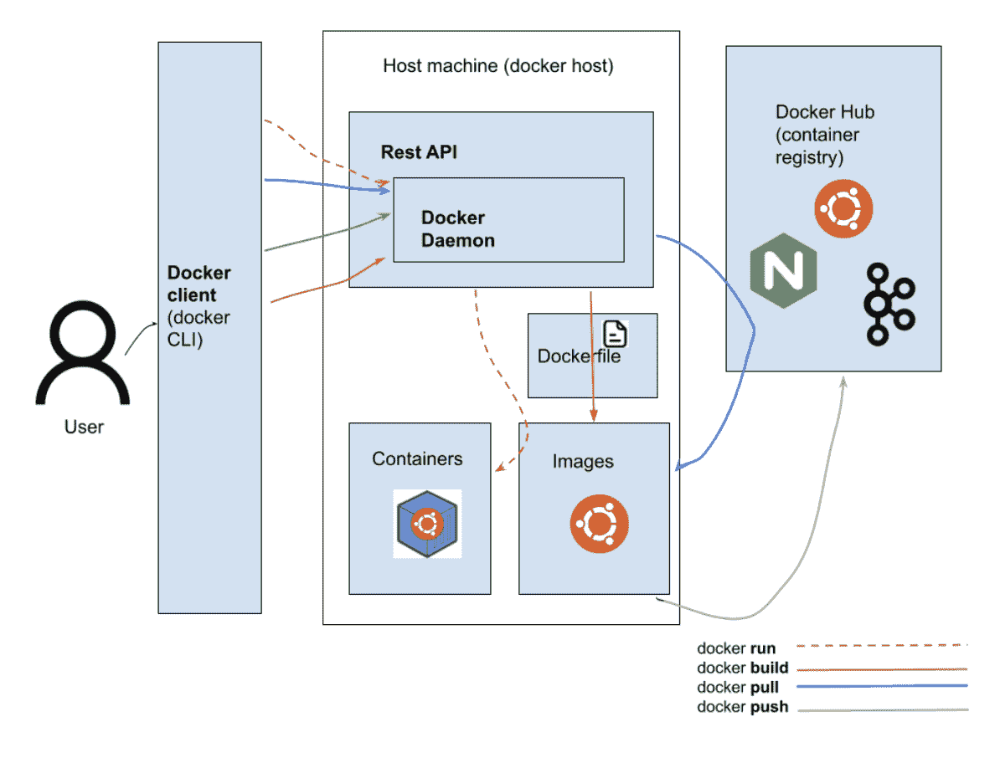

# Docker容器化

> 原文：<https://linkedin.github.io/school-of-sre/level102/containerization_and_orchestration/containerization_with_docker/>

## 介绍

自 2013 年向公众发布以来，Docker 在其他容器引擎中获得了巨大的人气。以下是 Docker 如此受欢迎的一些原因:

*   *改进的便携性*

Docker 容器可以以 Docker 映像的形式跨环境运输和运行，无论是本地机器、本地还是云实例。相比Docker容器，LXC 容器有更多的机器规格。- *重量更轻*

与虚拟机映像相比，Docker 映像是轻量级的。例如，Ubuntu 18.04 虚拟机的大小约为 3GB，而 docker 映像的大小为 45MB！

*   *容器图像的版本控制*

Docker 支持维护映像的多个版本，这使得查找映像的历史甚至回滚变得更加容易。

*   *图像的再利用*

由于 Docker 图像是以层的形式出现的，所以一个图像可以用作构建新图像的基础。例如， [Alpine](https://hub.docker.com/_/alpine) 是常用作基础图像的轻量图像(5MB)。Docker 层使用[存储驱动](https://docs.docker.com/storage/storagedriver/)进行管理。

*   *社区支持*

Docker hub 是一个容器注册中心，任何登录的人都可以上传或下载容器映像。流行的操作系统发行版的 Docker 镜像会在 docker hub 中定期更新，并获得大量的社区支持。

让我们看看在讨论 Docker 时出现的一些术语。

## Docker术语

*   *Docker 图像*

Docker 映像包含应用的可执行版本，以及应用作为独立容器运行所需的依赖项(配置文件、库、二进制文件)。可以理解为容器的快照。Docker 图像作为基础层之上的层出现。这些图层是版本化的图层。图层的最新版本是在基础图像上使用的版本。

`docker image ls`列出主机中存在的图像。

*   *Docker容器*

Docker 容器是 docker 映像的运行实例。虽然图像是静态的，但是从图像创建的容器可以被执行并与之交互。这实际上是本模块前面部分中的“容器”。

`docker run`是用于从图像实例化容器的命令。

`docker ps`列出当前在主机上运行的 docker 容器。

*   *Docker 文件*

它是一个指令的纯文本文件，docker 引擎(确切地说是守护进程)基于它来组装图像。它包含关于基础图像的信息，以及要注入的环境变量。

`docker build`用于从 dockerfile 构建图像。

*   坞站枢纽

这是 Docker 的官方图像容器注册表。任何拥有 docker 登录的用户都可以使用`docker push`将自定义图像上传到 Docker hub，并使用`docker pull`获取图像。

了解了基本术语之后，让我们看看 docker 引擎是如何工作的；如何解释 CLI 命令以及如何管理容器生命周期。

## Docker 引擎的组件

让我们从 Docker 引擎的示意图开始，以便更好地理解:

docker 引擎遵循客户端-服务器架构。它由 3 个部分组成:

*   *Docker 客户端*

这是用户直接与之交互的组件。当您执行我们之前看到的 docker 命令(push、pull、container ls、image ls)时，我们实际上是在使用 docker 客户端。一个 docker 客户端可以与多个 docker 守护进程通信。

*   *REST API*

为 docker 客户端和守护进程提供了一个通信接口。

*   *坞站守护程序(服务器)*

这是 docker 引擎的主要组件。它从 dockerfile 构建图像，从 docker registry 获取图像，将图像推送到 registry，停止、启动容器等。它还管理容器之间的网络。

## 实验室

官方 [docker github](https://github.com/docker/labs) 为学习 docker 提供了几个级别的实验室。我们正在链接一个实验室，我们发现它非常适合从零开始的人。请按照以下顺序完成实验:

1.  [为实验室设置本地环境](https://github.com/docker/labs/blob/master/beginner/chapters/setup.md)

2.  [docker CLI 使用基础](https://github.com/docker/labs/blob/master/beginner/chapters/alpine.md)

3.  [创建并封装一个基本的 Flask 应用](https://github.com/docker/labs/blob/master/beginner/chapters/webapps.md)

这是另一个[初级实验室](https://github.com/docker/awesome-compose/tree/master/react-express-mongodb)，用于编写 MERN (Mongo + React + Express)应用，很容易上手。

## Docker 的高级功能

虽然我们已经介绍了容器化的基础知识以及如何将一个独立的应用 dockerized 化，但是现实世界中的进程需要相互通信。这种需求在遵循微服务架构的应用中尤其普遍。

**Docker networks**

Docker 网络促进了运行在相同主机甚至不同主机上的容器之间的交互。docker network 命令提供了几个选项，用于指定容器如何与主机和其他容器进行交互。`host`选项允许与主机共享网络堆栈，`bridge`允许在同一主机上运行但不在主机外部的容器之间进行通信，`overlay`促进连接到同一网络的主机之间的容器之间的交互，以及`macvlan`为传统容器分配单独的 MAC 地址，这些是 Docker 支持的一些重要网络类型。然而，这超出了本模块的范围。在 [docker networks](https://docs.docker.com/network/) 上的官方文档本身就是一个很好的起点。

**卷**

除了映像、容器和网络，Docker 还提供了在容器中创建和挂载卷的选项。一般来说，docker 容器中的数据是非持久的，也就是说，一旦你取消了容器，数据就会丢失。卷用于在容器中存储持久数据。这个 [Docker 实验室](https://dockerlabs.collabnix.com/beginners/volume/creating-volume-mount-from-dockercli.html)是开始玩体积的好地方。

在下一节中，我们将看到 Kubernetes 是如何协调容器部署的。