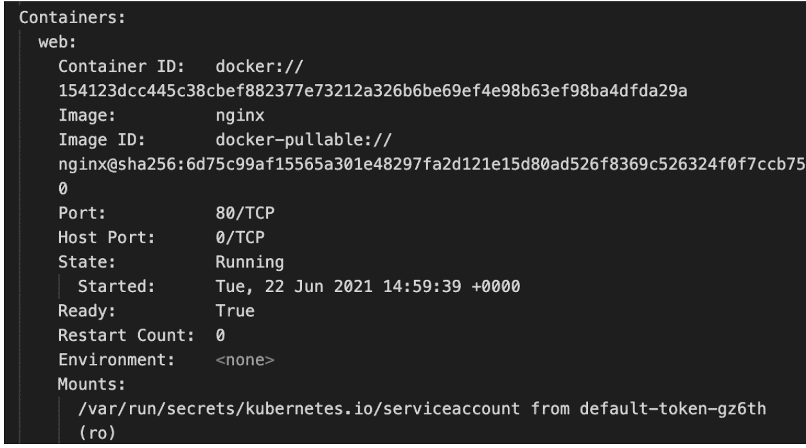
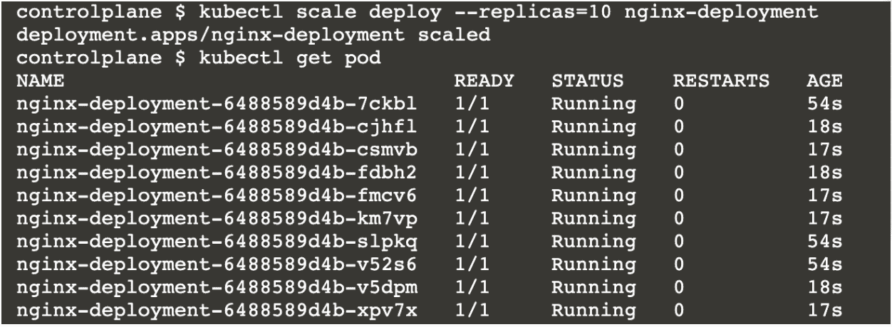

# 使用 Kubernetes 进行编排

> 原文：<https://linkedin.github.io/school-of-sre/level102/containerization_and_orchestration/orchestration_with_kubernetes/>

## 介绍

现在我们终于到了最期待的部分:大规模运行和管理容器。到目前为止，我们已经看到了 Docker 如何帮助管理容器的生命周期，以及如何提高应用程序的可移植性。Docker 确实提供了一个解决方案来简化容器的大规模部署(如果感兴趣，您可以查看 Docker Swarm ),它与 Docker 容器集成得很好。然而，Kubernetes 已经成为在大型分布式环境中编排微服务(作为容器)管理的事实上的工具。

让我们来看看 SREs 对使用容器编排工具特别是 Kubernetes 的兴趣点。

## 使用 Kubernetes 的动机

*   *易用性*

虽然 Kubernetes 有一个陡峭的学习曲线，但一旦学会，就可以作为一站式工具来管理您的微服务。只需一个命令，就可以部署成熟的生产就绪环境。应用程序的期望状态需要记录为 YAML 清单，Kubernetes 为您管理应用程序。

*   *确保资源的最佳利用*

我们可以指定部署中每个容器使用的资源限制。我们还可以指定我们选择的节点，Kubernetes 可以在这些节点上调度要部署的节点(例如，具有高 CPU 消耗的微服务可以被指示部署在高计算节点中)。

*   *容错*

自我修复是 Kubernetes 的基本资源类型。这消除了从头开始设计容错应用系统的麻烦。这尤其适用于无状态应用程序。

*   *与基础设施无关*

Kubernetes 没有供应商锁定。它可以设置在多个云环境或本地数据中心。

*   *强大的社区支持和文档*

Kubernetes 是开源的，有很多技术，比如运营商、服务网格等。由社区构建，用于更好地管理和监控 Kubernetes 编排的应用程序。

*   *可扩展和定制*

我们可以构建我们的定制资源定义，这些定义符合我们管理应用程序的用例，并使用 Kubernetes 来管理它们(使用定制控制器)。

如果你对这个话题比较感兴趣，可以看看[这篇文章](https://hackernoon.com/why-and-when-you-should-use-kubernetes-8b50915d97d8)。

## 库伯内特斯的建筑

这里有一个图表(来自 Kubernetes 官方文档)包含了使 Kubernetes 工作的不同组件:


Kubernetes 组件可以分为两部分:[控制平面组件](https://kubernetes.io/docs/concepts/overview/components/#control-plane-components)和[数据平面组件](https://kubernetes.io/docs/concepts/overview/components/#node-components)。

Kubernetes 集群由一台或多台主机(称为节点)组成，Kubernetes 管理的容器在这些主机上运行。这构成了数据平面(或节点平面)。

Kuberentes 的大脑对来自节点平面的事件作出响应(例如创建一个 pod，副本不匹配)并进行主要编排，它被称为控制平面。所有控制平面组件通常安装在主节点中。这个主节点不运行任何用户容器。

kubernetes 组件本身作为包装在 pod 中的容器运行(这是最基本的 Kubernetes 资源对象)。

*   控制平面组件:
*   kube-apiserver
*   etcd
*   kube-scheduler
*   kube-控制器-管理器
*   节点平面组件
*   库伯莱
*   kube-proxy

此工作流程可能有助于您更好地理解组件的工作:

*   一个 SRE 在他们的本地机器上安装`kubectl`。这是与 Kubernetes 控制平面(以及集群)交互的客户端。

*   他们创建一个名为 manifest 的 YAML 文件，该文件指定了所需的资源状态(例如，名为“frontend”的部署需要 3 个 pod 才能始终运行)

*   当他们发出命令创建基于 YAML 文件的对象时，kubectl CLI 工具向`kube-apiserver`发送一个 rest API 请求。

*   如果清单有效，它将作为键值对存储在控制平面上的`etcd`服务器中。

*   选择将容器放在哪个节点上(基本上是调度它们)

*   有控制器进程(由`kube-controller`管理器管理)确保集群的当前状态等同于期望的状态(这里，3 个 pod 确实在集群中运行- >一切正常)。

*   在节点平面侧，`kubelet`确保 pod 在本地保持运行状态。

## 实验室

### 先决条件

开始这项练习的最佳方式是使用 kubernetes lab 的[游戏。](https://labs.play-with-k8s.com/)

环境在 4 小时后被破坏。因此，如果您想恢复这些文件，请务必保存它们。对于持久的 kubernetes 集群，您可以在您的本地(使用 [minikube](https://minikube.sigs.k8s.io/docs/start/) )或者您可以在 Azure 、GCP 或任何其他云提供商创建一个 [kubernetes 集群。](https://docs.microsoft.com/en-us/azure/aks/kubernetes-walkthrough-portal)

了解 YAML 有助于理解清单文件。

### 亲自动手

#### 实验 1:

我们将创建一个名为 Pod 的对象，它是在 Kubernetes 中运行容器的最基本单元。这里，我们将创建一个名为“nginx-pod”的 pod，它包含一个名为“web”的 nginx 容器。我们还将在容器中公开端口 80，以便我们可以与 nginx 容器交互。将下面的清单保存在一个名为 nginx-pod.yaml 的文件中

```sh
apiVersion: v1                  #[1]
kind: Pod                       #[2]
metadata:                       #[3]
 name: nginx-pod                #[4]
 labels:                        #[5]
   app: nginx      
spec:                           #[6]
 containers:                    #[7]
   - name: web                  #[8]
     image: nginx               #[9]
     ports:                     #[10]
       - name: web              #[11]
         containerPort: 80      #[12]
         protocol: TCP          #[13] 
```

让我们简单了解一下这里有什么:

*   种类:正在被创建的对象的“种类”。这是一个豆荚
*   `#[1]`-apiVersion:“Pod”资源的 API version。如果版本不同，yaml 文件中的值或键可能会有微小的变化。
*   `#[3]` -元数据:给出 pod 标签和名称的文件的元数据部分
*   规格:这是定义 pod 内部事物的主要部分

这些不是随机的键值对！它们必须能够被 kubeapiserver 解释。您可以使用`kubectl explain pod`命令检查哪些键值对是可选的/强制的。一定要试一试！

*   使用命令`kubectl apply -f nginx-pod.yaml`应用清单。这在 kubernetes 集群中创建了“nginx-pod”pod。


*   使用`kubectl get pod`确认 pod 处于运行状态。


说明 nginx-pod 处于运行状态。1/1 表示容器内 1 个容器中有 1 个是健康的。

*   为了检查在“nginx-pod”中运行的容器是否确实是“web ”,我们执行了`kubectl describe pod/nginx-pod`命令。这将给出一个冗长的输出，其中详细描述了 pod 以及自 pod 创建以来发生的事件。这个命令对于调试非常有用。我们关心的是:



您可以在 Containers 部分看到“web ”,图像为 nginx。这就是我们正在寻找的。

*   我们如何访问 nginx“web”容器的欢迎页面？在 describe 命令中，您可以看到 pod 的 IP 地址。每个 pod 在创建时都会分配一个 IP 地址。


这里是 10.244.1.3

*   从主机发出 curl 请求`curl 10.244.1.3:80`。您将看到欢迎页面！

*   假设我们想在同一个 pod 中使用 nginx 的特定标签(比如 1.20.1 ),也就是说，我们想修改 pod 的某些属性。你可以尝试编辑 nginx-pod.yaml(图片:nginx:1.20.1 in #[9])并重新应用(步骤 2。).它将使用新图像在同一个 pod 中创建一个新容器。

在 pod 内创建了一个容器，但 pod 是相同的。您可以通过在 describe 命令中检查 pod 开始时间来验证。它会显示一个更古老的时代。

如果我们想把 1000 个 nginx pods 的图像改成 1.20.1 呢？退一步讲，如果我们想制造 1000 个 nginx pods 会怎么样。当然，我们可以写一个脚本，但是 Kubernetes 已经提供了一个名为“deployment”的资源类型来更好地管理大规模部署。

* * *

#### 实验 2:

我们将进一步了解如何同时创建多个 nginx pod 实例。

*   我们将首先在一个名为 *nginx-deploy.yaml* 的文件中创建并保存下面的清单

```sh
apiVersion: apps/v1
kind: Deployment             #[1]
metadata:
 name: nginx-deployment
 labels:
   app: nginx     
spec:
 replicas: 3                 #[2]
 selector:
   matchLabels:
     app: nginx              #[3]
 template:                   #[4]
   metadata:
     labels:
       app: nginx            #[5]
   spec:
     containers:
     - name: web
       image: nginx
       ports:
       - name: web
         containerPort: 80
         protocol: "TCP" 
```

您可以看到它类似于一个 pod 定义，直到 spec ( `#[1]`将 Deployment 作为种类，api 版本也不同)。

另一个有趣的观察是`#[4]`下的元数据和规范部分几乎与实验 1 中 Pod 定义下的*元数据*和*规范*部分相同(请继续交叉检查)。这意味着我们正在部署 3 个类似于 Lab1 的 nginx pods。另外，matchLabels 中的标签应该与`#[4]`下的标签相同。

*   现在使用`kubectl apply -f nginx-deploy.yaml`应用清单


验证确实创建了 3 个 pod。


如果你很好奇，检查一下`kubectl get deploy`和`kubectl describe deploy nginx-deployment`的输出。

*   使用`kubectl delete pod <pod name>`删除 3 个 pod 中的一个。几秒钟后再次做`kubectl get pod`。


你可以看到一个新的豆荚产生了，以保持豆荚的总数为 3(见年龄 15 与其他 27 分钟前创建的)！这是 Kubernetes 如何实现容错的演示。

这是 Kubernetes 部署对象的一个属性(从 Lab1 中删除 pod，它将不会被重新应用:)

*   假设我们希望将 pod 的数量增加到 10 个。试用`kubectl scale deploy --replicas=10 nginx-deployment`。



你可以看到 3/10 的豆荚比其余的都要老。这意味着 Kubernetes 增加了 7 个额外的单元，将部署规模扩大到 10 个。这显示了使用 Kubernetes 放大和缩小容器是多么简单。

*   让我们将所有这些 pod 放在一个 ClusterIP 服务后面。执行`kubectl expose deployment nginx-deployment --name=nginx-service`。


卷曲 10.96.114.184 对应的 IP。这个 curl 请求以循环方式到达部署“nginx-deployment”中的 10 个 pod 之一。当我们执行`expose`命令时，会发生这样的情况:创建一个集群 IP 类型的 kubernetes `Service`,以便可以通过一个本地 IP(这里是 10.96.114.184)访问该服务背后的所有 pods。

通过创建类型为 [LoadBalancer](https://kubernetes.io/docs/tasks/access-application-cluster/create-external-load-balancer/) 的服务，可以拥有一个公共 IP(即一个实际的外部负载平衡器)。请随意使用它！

上面的练习很好地展示了如何使用 Kubernetes 来管理大规模部署。相信我，这个过程与上面操作 1000 个部署和容器的过程非常相似！虽然部署对象对于管理无状态应用程序已经足够好了，但是 Kuberenetes 还提供了其他资源，如 Job、Daemonset、Cronjob、Statefulset 等。管理特殊用例。

**额外实验室:**https://kubernetes.courselabs.co/(与 Kubernetes 一起玩的大量免费后续练习)

## 高级主题

大多数情况下，与 Kubernetes 协调的微服务包含几十个资源实例，如部署、服务和配置。这些应用程序的清单可以使用舵模板自动生成，并作为舵图表传递。类似于我们如何为 python 包提供 PiPy，还有像 Bitnami 这样的远程存储库，在那里可以下载和使用 Helm charts(例如，只需单击一下就可以设置一个生产就绪的 Prometheus 或 Kafka)。这是一个开始的好地方。

Kuberenetes 提供了创建定制资源的灵活性(类似于我们看到的部署或 Pod)。例如，如果你想创建一个资源的 5 个实例，你可以！唯一的问题是你必须为它编写自定义资源。您还可以为自定义资源构建一个自定义操作符，以便对资源实例执行某些操作。你可以查看[这里的](https://www.redhat.com/en/topics/containers/what-is-a-kubernetes-operator)了解更多信息。