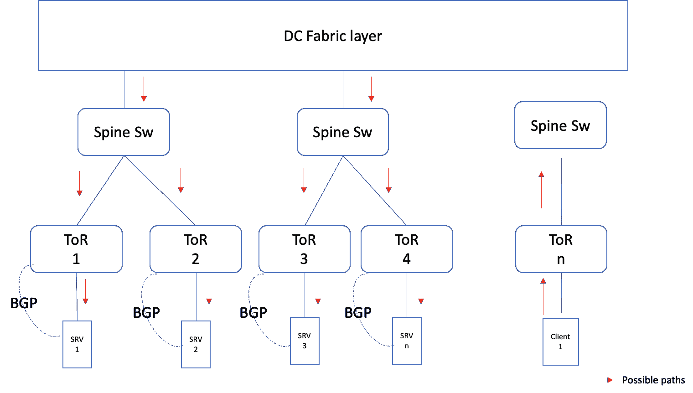
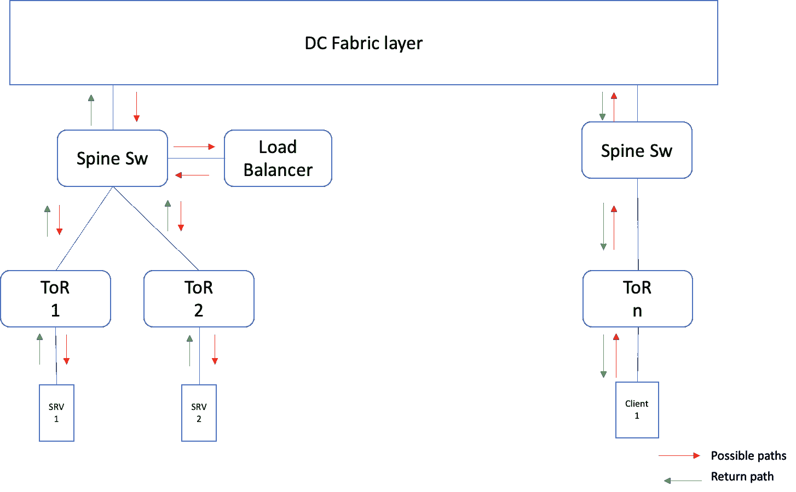

# 规模

> 原文：<https://linkedin.github.io/school-of-sre/level102/networking/scale/>

> *部署大规模应用需要更好地了解基础设施的能力，包括资源可用性、故障域、扩展选项，如使用任播、第 4/7 层负载平衡器、基于 DNS 的负载平衡。*

构建大规模的应用是一项复杂的活动，应该涵盖设计、开发和运营的许多方面。本节将讨论部署它们时需要考虑的事项。

### 故障域

在任何基础架构中，由硬件或软件问题导致的故障都很常见。虽然从服务可用性的角度来看，这可能是一个难题，但是这些故障确实会发生，一个实用的目标是尽量将这些故障降到最低。因此，在部署任何服务时，需要考虑一些节点的故障/不可用性。

#### 服务器故障

由于电源、网卡或软件缺陷，服务器可能会出现故障。有时，它可能不是完全的故障，但可能是网卡中的错误，这会导致一些数据包丢失。这是一个非常常见的场景，对有状态服务的影响更大。在设计此类服务时，对这类故障提供一定程度的容忍度非常重要。

#### ToR 故障

这是一种常见的情况，连接服务器的边缘交换机发生故障，同时整个机柜也随之关闭。在这种情况下，同一服务可能会有多个服务器停机。它需要计划决定在不使其他服务器过载的情况下可以处理多少服务器丢失。基于此，服务可以分布在许多机柜中。根据 ToR 设计中的弹性，这些计算可能会有所不同，这将在 [ToR 连通性](https://linkedin.github.io/school-of-sre/level102/networking/infrastructure-features/#dual-tor)一节中介绍。

#### 站点故障

在这里，站点故障是一个通用术语，它可能意味着站点中的特定服务停止运行，这可能是由于新版本的推出，或者防火墙、负载平衡器等设备的故障(如果服务依赖它们)，或者与远程站点的连接丢失(这可能具有有限的弹性选项)，或者 DNS 等关键服务的问题。虽然这些事件可能并不常见，但它们可能会产生重大影响。

总之，在设计应用本身时，必须考虑如何处理这些故障场景。这将在应用中提供从意外故障中恢复所需的容差。这不仅有助于故障，甚至有助于计划的维护工作，因为这将更容易使部分基础设施停止服务。

### 资源可用性

大规模部署应用时要考虑的另一个方面是所需基础设施和服务所依赖的功能的可用性。例如，对于机柜的弹性，如果决定将服务分配给 5 个机柜，但服务需要负载平衡器(将传入的连接分配给不同的服务器)，如果负载平衡器不是在所有机柜中都受支持，这可能会变得具有挑战性。或者可能存在没有足够的机柜可用(满足要设置的服务的最低要求规格)的情况。在这些情况下，最好的方法是确定需求和差距，然后与基础结构团队合作，以最好的方式解决它们。

#### 缩放选项

将应用分发到不同的机柜时，这些服务的传入流量必须分布在这些服务器上。为了实现这一点，可以考虑以下几点

##### 任播

这是在多个机柜间实现流量分配的最快方式之一。在这种情况下，作为集群一部分的每个服务器(在其中设置服务)向 DC 交换结构通告一个环回地址(/32 IPv4 或/128 IPv6 地址)(通常 BGP 用于此目的)。该服务必须设置为侦听此环回地址。当客户端尝试连接到服务时，解析到这个虚拟地址并转发它们的查询。DC 交换结构将每个流分发到不同的可用下一跳(最终分发到该服务群集中的所有服务器)。

注意:DC 交换机根据 IP 数据包报头计算哈希，这可能包括源地址和目的地址、源端口和目的端口、mac 地址和 IP 协议号的任意组合。基于这个散列值，选择特定的下一跳。由于通信流中的所有数据包都带有相同的报头值，因此该流中的所有数据包都将被映射到相同的路径。

*图 1:选播设置*

为了在这些服务器之间实现均衡的流量分配，保持每个机柜和机架的一致性非常重要。但是请记住，分发仅基于流，如果有任何大的流，一些服务器可能会收到更大的流量。

如果有任何服务器或 ToR 故障，将停止向交换机通告环回地址，从而新的数据包将被转发到剩余的可用服务器。

##### 负载平衡

另一种常见的方法是使用负载平衡器。在负载平衡器中设置一个虚拟 IP，客户端在尝试访问服务时连接到该虚拟 IP。负载平衡器进而将这些连接重定向到运行服务的实际服务器之一。为了验证服务器是否处于可服务状态，负载平衡器会定期进行健康检查，如果检查失败，LB 会停止将连接重定向到这些服务器。

负载平衡器可以部署在单臂模式下，在这种模式下，到 VIP 的流量由 LB 重定向，从服务器到客户端的返回流量直接发送。另一个选项是双臂模式，返回流量也通过 LB。

图 2:单臂模式

图 3:双臂模式

这种方法的缺点之一是，在更高的规模下，负载平衡器可能会成为瓶颈，以支持更高的流量或每秒并发连接数。

##### 基于 DNS 的负载平衡

这与上述方法类似，唯一的区别是负载平衡是在 DNS 上完成的，而不是在设备上。当客户端查询服务的 DNS 记录时，它们获得不同的 IP 来连接。DNS 服务器必须进行健康检查，以了解哪些服务器处于良好状态。

这种方法缓解了负载平衡器解决方案的瓶颈。但是 DNS 记录需要更短的 TTL，因此有问题的服务器可以快速退出轮换，这意味着将会有更多的 DNS 查询。