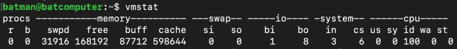
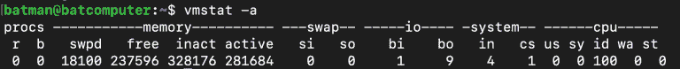
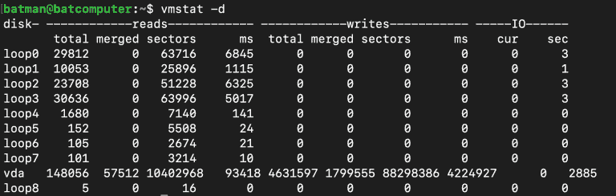

# `vmstat` 命令

`vmstat` 命令让您监控您系统的性能。它显示了有关您的内存、磁盘、进程、CPU 调度、分页和块 IO 的信息。此命令也被称为**虚拟内存统计报告**。

产生的第一个报告显示了自上次重启以来的平均详细信息，之后，其他报告会随着时间的推移而生成。

### `vmstat`

如您所见，这是一个非常实用的命令。上面我们看到的最重要的事情是 `free`，它显示了未被使用的空闲空间，`si` 显示了每秒交换进来的内存量（以 KB 为单位），而 `so` 显示了每秒交换出去的内存量（以 KB 为单位）。

### `vmstat -a`

如果我们运行 `vmstat -a`，它将显示正在运行的系统的活跃和空闲内存。

### `vmstat -d`

`vmstat -d` 命令显示了所有磁盘统计信息。

如您所见，这是一个非常实用的命令，显示了有关您虚拟内存的不同统计信息
