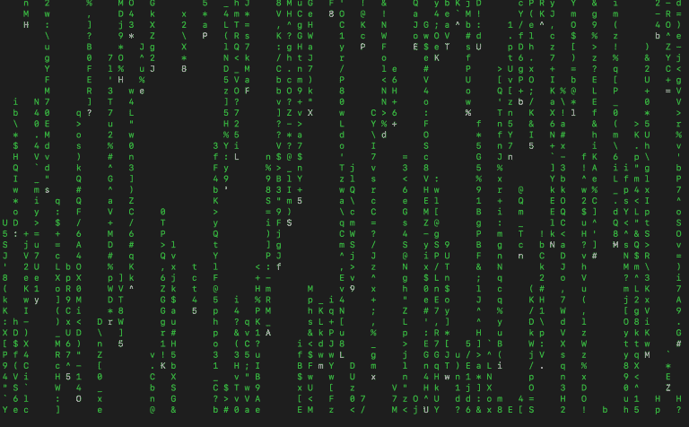

# `cmatrix`命令

这个命令在 Linux 中不是默认安装的。它需要安装，如第五十二章中所述，我们需要运行以下命令：

```sh
      sudo apt-get install cmatrix 

```

安装完所有东西后，你就变成了一个“合法的黑客”。为了使用这个命令，只需输入`cmatrix`并按回车键：

```sh
      cmatrix 

```

这就是你应该看到的内容：



如你所见，你现在可以访问矩阵了。嗯，其实并不是。

实际上这只是个好玩的小命令，可以用来恶作剧。实际上有几个选项你可以使用。例如，你可以更改文本颜色。你可以选择**绿色、红色、蓝色、白色、黄色、青色、品红色和黑色**。

```sh
      cmatrix -C red 

```


下落的人物将会是红色的。这个命令其实并不是什么能帮助你工作或什么的工具，但知道你可以在 Linux 中找点乐子还是挺有趣的。
