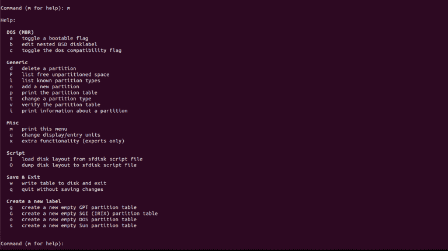

# `fdisk` 命令

`fdisk` 命令用于控制磁盘分区表并对它进行修改，以下是一些它提供的选项列表：

+   为新驱动器组织空间。

+   修改旧驱动器。

+   为新分区创建空间。

+   将数据移动到新分区。

### 示例：

1.  要查看系统上所有可用分区的详细信息：

```sh
      fdisk -l 

```

1.  要显示分区的大小：

```sh
      fdisk -s /dev/sda 

```

1.  要查看帮助信息和命令的所有选项：

```sh
      fdisk -h 

```

### 语法：

```sh
      fdisk [options] device 

```

### 一些命令选项：

在写入以下命令

```sh
      fdisk /dev/sdb 

```

窗口如下所示：，然后你输入 m，这将显示你需要的所有选项，例如创建新分区和删除分区，如下图所示：
