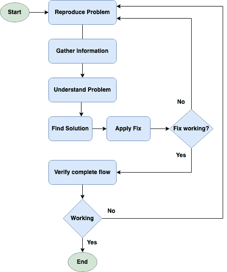

# 解决纷争

> 原文：<https://linkedin.github.io/school-of-sre/level102/system_troubleshooting_and_performance/troubleshooting/>

排除系统故障有时会很棘手或乏味。在本练习中，我们需要检查服务的端到端流及其所有下游，分析日志、内存泄漏、CPU 使用、磁盘 IO、网络故障、主机问题等。了解某些实践和工具有助于更快地发现和减少故障。以下是高级故障排除流程图:

### 故障排除流程图

### 一般惯例

不同的系统需要不同的方法来发现问题。这方面的范围是有限的，并给出了一个问题，可以有更多的点可以研究。以下几点将着眼于查找 webapp 故障和修复故障的一些高级实践。

**重现问题**

*   尝试中断的请求以重现问题，例如尝试命中失败的 http/s 请求。
*   检查请求的端到端流程，并寻找返回代码，主要是 [3xx、4xx 或 5xx](https://en.wikipedia.org/wiki/List_of_HTTP_status_codes) 。3xx 主要是关于重定向，4xx 是关于未授权、错误请求、禁止等，5xx 主要是关于服务器端问题。根据返回代码，您可以寻找下一步。
*   客户端问题主要是关于静态内容的缺失或错误，比如 javascript 问题、坏图像、异步调用导致的 json 错误等，这些都会导致浏览器上的页面呈现不正确。

**收集信息**

*   在应用程序日志中查找错误/异常，如“无法分配内存”或“内存不足”错误，或类似“磁盘 I/O 错误”的错误，或 DNS 解析错误。
*   检查应用程序和主机指标，查找服务和主机图表中的异常。从 CPU 使用率增加的时候开始，从内存使用率增加的时候开始，从磁盘空间减少或磁盘 I/O 增加的时候开始，从平均负载开始上升的时候开始等等。请阅读 SRE 学院链接，了解有关[指标和监控](https://linkedin.github.io/school-of-sre/level101/metrics_and_monitoring/introduction)的更多详细信息。
*   查找最近可能破坏系统的代码或配置更改。

**理解问题**

*   尝试将收集的数据与最近的操作相关联，比如在配置/代码部署后日志中显示的异常。
*   是由于 [QPS](https://en.wikipedia.org/wiki/Queries_per_second) 的增加吗？是糟糕的 SQL 查询吗？最近的代码更改需要更好还是更多的硬件？

**找到解决方案并应用补丁**

*   基于上述发现，如果可能的话，寻找一个快速的解决方案，例如，如果错误/异常相关，就回滚更改。
*   尝试修补或热修复代码，如果你想向前修复的话，可能是在阶段设置中。
*   尝试纵向扩展系统，如果高 QPS 是系统故障的原因，则尝试根据需要添加资源(计算、存储、内存等)。
*   如果需要，优化 SQL 查询。

**验证完整的请求流程**

*   再次点击请求并确保返回成功(返回代码 2xx)。
*   检查日志以确保不再出现之前发现的异常/错误。
*   确保指标恢复正常。

### 一般主机问题

要了解主机运行状况是否良好，请查找任何硬件故障或其性能问题，可以尝试以下方法:

*   Dmesg -:显示内核最近抛出的错误/失败。这有助于了解硬件故障(如果有)
*   ls 命令-: lspci，lsblk，lscpu，lsscsi，这些命令列出了 pci，磁盘，cpu 信息。
*   /var/log/messages -:显示与系统应用程序/服务相关的错误/警告，还显示内核问题。
*   Smartd -:检查磁盘运行状况。