# 简介#

> 原文：[`4ed.computer-networking.info/syllabus/default/hosts/introduction.html`](https://4ed.computer-networking.info/syllabus/default/hosts/introduction.html)

建立网络的第一步，即使是像互联网这样的全球网络，也是连接两个主机。这如图 图 1 所示。

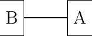

图 1 连接两个主机

为了使两个主机能够交换信息，它们需要通过某种物理介质连接在一起。计算机网络已经使用了各种类型的物理介质来交换信息，特别是：

> +   电线电缆。信息可以通过不同类型的电线电缆进行传输。最常见的是双绞线（在电话网络中使用，也用于企业网络）和同轴电缆（仍在有线电视网络中使用，但不再用于企业网络）。一些网络技术是在传统的电线电缆上运行的。
> +   
> +   光纤。当通信设备之间的距离大于一公里时，光纤通常用于公共和企业网络。光纤主要有两种类型：多模光纤和单模光纤。多模光纤比单模光纤便宜得多，因为 LED 可以用来在多模光纤上发送信号，而单模光纤必须由激光驱动。由于光传播的不同模式，多模光纤的传输距离限制在几公里以内，而单模光纤可以用于超过几十公里的距离。在这两种情况下，都可以使用中继器在光纤的一端再生光信号，以便通过另一根光纤发送。
> +   
> +   无线。在这种情况下，使用无线电信号来编码通信设备之间交换的信息。许多类型的调制技术用于在无线信道上发送信息，并且在这一领域有大量的创新，每年都有新技术出现。虽然大多数无线网络依赖于无线电信号，但一些使用激光向远程探测器发送光脉冲。这些光技术使我们能够创建点对点连接，而基于无线电的技术可以用来构建包含分散在较小地理区域内的设备的网络。

## 物理层#

这些物理媒体可以在信息被转换成合适的电信号后用来交换信息。整个电信课程和教科书都致力于将模拟或数字信息转换成电信号，以便通过给定的物理链路进行传输的问题。在这本书中，我们只考虑两种非常简单的方案，这些方案允许我们通过电电缆传输信息。这使得我们能够突出在物理链路上传输信息时的关键问题。我们只对允许通过电线传输数字信息的技术感兴趣。在这里，我们将关注比特的传输，即 0 或 1。

注意

比特率

在计算机网络中，物理层的比特率总是以每秒比特数来表示。1 Mbps 表示每秒一百万比特，1 Gbps 表示每秒十亿比特。这与通常以字节（8 比特）、千字节（1024 字节）或兆字节（1048576 字节）来表示的内存规格形成对比。通过 1 Mbps 链路传输 1 兆字节需要 8.39 秒。

> | 比特率 | 每秒比特数 |
> | --- | --- |
> | 1 Kbps | $ 10³ $ |
> | 1 Mbps | $ 10⁶ $ |
> | 1 Gbps | $ 10⁹ $ |
> | 1 Tbps | $ 10^{12} $ |

为了理解信息物理传输背后的某些原理，让我们考虑一个简单的例子，即用于传输比特的电线路。假设两个通信主机想要以每秒一千比特的速度传输比特。为了传输这些比特，两个主机可以同意以下规则：

> +   在发送方：
> +   
>     +   在一个毫秒内将电线的电压设置为`+5V`以传输设置为 1 的比特。
>     +   
>     +   在一个毫秒内将电线的电压设置为`-5V`以传输设置为 0 的比特。
>     +   
> +   在接收方：
> +   
>     +   每毫秒，记录电线上施加的电压。如果电压设置为`+5V`，则记录接收到的比特 1。否则，记录接收到的比特 0。

这种传输方案被用于一些早期的网络。我们将其作为理解主机如何通信的基础。从计算机科学的角度来看，处理电压是不寻常的。计算机科学家经常依赖于能够使他们推理所面临问题的模型，而无需考虑所有实现细节。上述物理传输方案可以用时间序列图来表示。

时间序列图描述了通信主机之间的交互。按照惯例，通信主机表示在图的左侧和右侧，而电连接占据图的中间部分。在这种时间序列图中，时间从图的顶部流向底部。一个信息位的传输由三个箭头表示。从左侧开始，第一个水平箭头表示请求传输一个信息位。这个请求由一个原语表示，可以将其视为一种过程调用。这个原语有一个参数（要传输的位）和一个名称（例如，本例中的 DATA.request）。按照惯例，所有命名为某种.request 的原语对应于传输某些信息的要求。虚线箭头表示在电线上传输相应的电信号。电和光信号不会瞬间传播。对角虚线箭头表示电信号从主机 A 传输到主机 B 需要一些时间。在接收到电信号后，主机 B 网络接口上的电子设备检测电压并将其转换为位。这个位作为 DATA.indication 原语传递。所有命名为某种.indication 的原语对应于接收某些信息。虚线还表示两个（或更多）原语之间的关系。这种时间序列图提供了关于不同原语顺序的信息，但两个原语之间的距离并不代表精确的时间量。

> ![msc {
> 
> a [标签="", 线颜色=白色],
> 
> b [标签="主机 A", 线颜色=黑色],
> 
> z [标签="物理链路", 线颜色=白色],
> 
> c [标签="主机 B", 线颜色=黑色],
> 
> d [标签="", 线颜色=白色];
> 
> a=>b [标签 = "DATA.req(0)" ] ,
> 
> b>>c [标签 = "0", 弧跳="1"];
> 
> c=>d [标签 = "DATA.ind(0)" ];
> 
> }](../Images/de5f31954ab1b61192e389ebb30fe49c.png)

时间序列图在试图理解给定通信方案的特征时非常有用。在考虑上述传输方案时，评估该方案是否允许两个通信主机可靠地交换信息是有用的。当主机通过一条线正确接收到由主机发送的位序列时，数字传输被认为是可靠的。在实践中，使用上述方案传输信息时实现完美的可靠性是困难的。这种传输方案可能会出现几个问题。

第一个问题在于电传输可能会受到电磁干扰的影响。干扰可能来源于自然现象（如雷暴、磁场变化等）以及其他电气信号（如邻近电缆的干扰、邻近天线的干扰等）。由于这些不同类型的干扰，很遗憾，当主机在一条电线上传输一个比特时，并不能保证在另一端接收到的比特是相同的。这在下图中得到了说明，其中左侧主机的 DATA.request(0) 导致右侧主机的 Data.indication(1)。

> ![msc {
> 
> a [label="", linecolour=white],
> 
> b [label="主机 A", linecolour=black],
> 
> z [label="物理链路", linecolour=white],
> 
> c [label="主机 B", linecolour=black],
> 
> d [label="", linecolour=white];
> 
> a=>b [ label = "DATA.req(0)" ] ,
> 
> b>>c [ label = "", arcskip="1"];
> 
> c=>d [ label = "DATA.ind(1)" ];
> 
> }](../Images/72b158d7806ce66e42f4a20fa43137df.png)

在上述传输方案中，一个比特是通过在一段时间内将电气电缆上的电压设置为特定值来传输的。我们已经看到，由于电磁干扰，接收器测量的电压可能与发送器设置的电压不同。这是传输错误的主要原因。然而，这并不是唯一可能出现的问题类型。除了定义比特 0 和 1 的电压外，上述传输方案还指定了每个比特的持续时间。如果每秒发送一百万比特，那么每个比特持续 1 微秒。在每个主机上，每个比特的传输（或接收）都是由一个具有 1 MHz 频率的本地时钟触发的。这些时钟是传输比特时的第二个问题来源。尽管这两个时钟具有相同的规格，但它们运行在不同的主机上，可能处于不同的温度和不同的能源来源。实际上，两个时钟可能不会以完全相同的频率运行。假设发送主机的时钟运行在 1000000 Hz，而接收时钟运行在 999999 Hz。这两个时钟之间的差异非常小。然而，当使用时钟来传输比特时，这个差异很重要。具有 1000000 Hz 时钟的发送主机将在一秒钟内生成一百万比特。在同一时间内，接收主机将检测电线 999999 次，因此将接收到的比特比原始发送的比特少一个。这种时钟频率的小差异意味着比特在通过电气电缆传输过程中可能会“消失”。这在下图中得到了说明。

> ![msc {
> 
> a [label="", linecolour=white],
> 
> b [label="主机 A", linecolour=black],
> 
> z [label="物理链路", linecolour=white],
> 
> c [label="主机 B", linecolour=black],
> 
> d [label="", linecolour=white];
> 
> a=>b [ label = "DATA.req(0)" ] ,
> 
> b>>c [ label = "", arcskip="1"];
> 
> c=>d [ label = "DATA.ind(0)" ];
> 
> a=>b [ label = "DATA.req(0)" ];
> 
> a=>b [ label = "DATA.req(1)" ] ,
> 
> b>>c [ label = "", arcskip="1"];
> 
> c=>d [ label = "DATA.ind(1)" ];
> 
> }](../Images/d5c344293b247f77b1781cce32dd951f.png)

当发送主机的时钟比接收主机的时钟慢时，类似的推理也适用。在这种情况下，接收者将感知到比发送者已传输的比特更多的比特。这在下图中得到说明，其中右侧接收到的第二个比特并未由左侧主机传输。

> ![msc {
> 
> a [label="", linecolour=white],
> 
> b [label="主机 A", linecolour=black],
> 
> z [label="物理链路", linecolour=white],
> 
> c [label="主机 B", linecolour=black],
> 
> d [label="", linecolour=white];
> 
> a=>b [ label = "DATA.req(0)" ] ,
> 
> b>>c [ label = "", arcskip=1];
> 
> c=>d [ label = "DATA.ind(0)" ];
> 
> c=>d [ label = "DATA.ind(0)" ];
> 
> a=>b [ label = "DATA.req(1)" ] ,
> 
> b>>c [ label = "", arcskip=1];
> 
> c=>d [ label = "DATA.ind(1)" ];
> 
> }](../Images/e6f2fc97b4f52f1569c9da37e0a7c885.png)

从计算机科学的角度来看，通过电线传输信息通常被视为一个黑盒，它允许传输比特。这个黑盒通常被称为物理层服务，并且通过使用之前引入的 DATA.request 和 DATA.indication 原语来表示。这个物理层服务通过抽象实际比特电磁信号传输所涉及的技术细节来促进比特的发送和接收。然而，重要的是要记住，物理层服务是不完美的，并具有以下特性：

> +   物理层服务可能会改变，例如，由于电磁干扰，正在传输的比特值
> +   
> +   物理层服务可能向接收者交付的比特数多于发送者发送的比特数
> +   
> +   物理层服务可能向接收者交付的比特数少于发送者发送的比特数。

已经定义了许多其他类型的编码方案，用于在电线上传输信息。所有物理层都能够发送和接收代表值 0 和 1 的物理符号。然而，由于本章范围之外的各种原因，几个物理层也交换其他物理符号。例如，在几个物理层中使用的曼彻斯特编码可以发送四个不同的符号。曼彻斯特编码是一种差分编码方案，其中时间被分为固定长度的周期。每个周期被分为两个半周期，并且可以应用两种不同的电压水平。为了发送一个符号，发送者必须在每个半周期中设置这两种电压水平之一。为了发送 1（或 0），发送者必须在周期的第一个半周期中设置高（或低）电压，在第二个半周期中设置低（或高）电压。这种编码确保在每个周期的中间会有一个转换，并允许接收者将时钟与发送者的时钟同步。除了 0 和 1 的编码之外，曼彻斯特编码还支持两个额外的符号：InvH 和 InvB，其中两个半周期使用相同的电压水平。根据定义，这两个符号不能出现在仅由 0 和 1 组成的帧中。一些技术使用这些特殊符号作为帧的开始或结束的标记。这种编码在图 2 中展示。


图 2 曼彻斯特编码#

当物理层使用光或电磁信号传输一个信息位时，不能保证发送者发送的位会被接收者以相同的方式接收。几种类型的错误可能会影响这种传输。

信息论定义了两种机制，这些机制可以用于在受随机错误影响的信道上传输信息。这两种机制向传输的信息中添加冗余，以便接收者能够检测或有时甚至纠正传输错误。对这些机制的详细讨论超出了本章的范围，但考虑一个简单的机制来理解其操作和限制是有用的。

信息论定义了编码方案。存在不同类型的编码方案，但让我们关注在二进制字符串上操作的编码方案。编码方案是一个函数，它将编码为 m 位字符串的信息映射到 n 位字符串。最简单的编码方案是（偶数）奇偶校验编码。这种编码方案接受一个 m 位源字符串，并生成一个 m+1 位的编码字符串，其中编码字符串的前 m 位是源字符串的位，编码字符串的最后一位被选择，使得编码字符串将始终包含偶数个设置为 1 的位。例如：

> +   1001 编码为 10010
> +   
> +   1101 被编码为 11011

这种奇偶校验方案已被用于一些 RAM 以及通过串行线发送的字符编码。很容易证明这种编码方案允许接收者检测单个传输错误，但不能纠正它。然而，如果有两个或更多比特出错，接收者可能无法总是检测到错误。

一些编码方案允许接收者纠正一些传输错误。例如，考虑以下编码方案，它将每个源比特编码如下：

> +   1 被编码为 111
> +   
> +   0 被编码为 000

例如，考虑一个发送 111 的发送者。如果有一个比特出错，接收者可能会收到 011 或 101 或 110。在这三种情况下，接收者将解码接收到的比特模式为 1，因为它包含大多数设置为 1 的比特。如果有两个比特出错，接收者将无法从传输错误中恢复。

这种简单的编码方案迫使发送者对每个源比特传输三个比特。然而，它允许接收者纠正单个比特错误。在多种类型的物理层中，使用了一些允许从错误中恢复的更高级的编码系统。

为了理解错误检测码，让我们考虑两个交换包含 N 比特的比特字符串的设备。为了允许接收者检测传输错误，发送者将每个 N 比特的字符串转换为 N+r 比特的字符串。通常，r 个冗余比特被添加到传输比特字符串的开始或结束处，但某些技术将冗余比特与原始比特交织。错误检测码可以定义为计算每个 N 比特字符串对应的 r 个冗余比特的函数。最简单的错误检测码是奇偶校验位。有两种类型的奇偶校验方案：偶校验和奇校验。在偶校验（分别奇校验）方案中，冗余比特被选择，使得在 N+r 比特的传输字符串中设置 1 的比特数为偶数（分别奇数）。接收者可以轻松地重新计算每个接收到的比特字符串的奇偶校验，并丢弃无效奇偶校验的字符串。奇偶校验方案通常用于交换 7 位字符的情况。在这种情况下，第八位通常是一个奇偶校验位。下表显示了包含三个比特的比特字符串计算出的奇偶校验位。

> | 3 比特字符串 | 奇偶校验 | 偶校验 |
> | --- | --- | --- |
> | 000 | 1 | 0 |
> | 001 | 0 | 1 |
> | 010 | 0 | 1 |
> | 100 | 0 | 1 |
> | 111 | 0 | 1 |
> | 110 | 1 | 0 |
> | 101 | 1 | 0 |
> | 011 | 1 | 0 |

奇偶校验位允许接收器检测到影响传输的 N+r 位中单个位的传输错误。如果有两个或更多位出错，接收器可能无法必然检测到传输错误。已经定义了更强大的错误检测方案。循环冗余校验（CRC）在数据链路层协议中得到广泛应用。N 位 CRC 可以检测到影响传输帧中少于 N 位的突发错误以及影响奇数位数的传输错误。有关 CRC 的更多详细信息，请参阅[[Williams1993]](../bibliography.html#williams1993)。

还可以设计一种代码，允许接收器纠正传输错误。最简单的纠错码是三模冗余（TMR）。要传输设置为 1 的位（分别对应 0），发送方发送 111（分别对应 000）。在没有传输错误的情况下，接收器可以将 111 解码为 1。如果传输错误影响了一个位，接收器将执行如以下表格所示的多数投票。这种方案允许接收器纠正影响单个位的所有传输错误。

> | 接收到的位 | 解码位 |
> | --- | --- |
> | 000 | 0 |
> | 001 | 0 |
> | 010 | 0 |
> | 100 | 0 |
> | 111 | 1 |
> | 110 | 1 |
> | 101 | 1 |
> | 011 | 1 |

还提出了其他更强大的纠错码，并在某些应用中使用。[汉明码](https://en.wikipedia.org/wiki/Hamming_code)是奇偶校验位的巧妙组合，提供了错误检测和纠正能力。

所有与通过电线（或无线链路）进行物理传输或信息相关的功能通常被称为物理层。物理层允许直接连接到同一传输介质的两个或多个实体交换位。能够交换位很重要，因为几乎任何信息都可以编码为位序列。电气工程师习惯于处理位流，但计算机科学家通常更喜欢处理更高级的概念。

在文件存储方面也存在类似的问题。硬盘等存储设备也存储位流。有硬件设备可以处理硬盘产生的位流，但计算机科学家设计了文件系统，以便应用程序可以轻松访问这些存储设备。这些文件系统通常分为几个层次。硬盘存储 512 字节或更多的扇区。Unix 文件系统将扇区分组到更大的块中，这些块可以包含数据或表示文件系统结构的 inode。最后，应用程序操作文件和目录，这些文件和目录由操作系统转换为块、扇区和最终位。

计算机网络使用类似的方法。每一层都提供了一种服务，该服务建立在底层之上，更接近应用的需求。图 3 表示协议栈的底层。我们将在这本书中探讨这个栈的不同层。

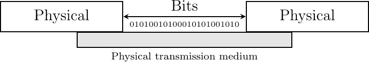

图 3 物理层  ## 数据链路层#

计算机科学家通常对在两个主机之间交换比特不感兴趣。他们更愿意编写处理更大数据块以传输消息或完成文件的软件。多亏了物理层服务，才有可能在两个主机之间发送连续的比特流。这个比特流可以包括逻辑数据块，但我们需要能够从比特流中提取每个数据块，尽管物理层存在缺陷。在许多网络中，两个直接连接的主机之间交换的基本信息单位通常被称为帧。帧可以被定义为具有特定语法或结构的比特序列。我们将在本章后面看到此类帧的示例。

为了实现帧的传输/接收，首先要解决的问题是如何将帧编码为比特序列，以便接收器可以轻松地从物理层接收到的比特流中恢复接收到的帧，尽管物理层存在限制。

如果物理层是完美的，问题将会非常简单。我们只需定义如何将每个帧编码为一系列连续的比特。接收器随后将能够轻松地从接收到的比特中提取帧。不幸的是，物理层的缺陷使得这个问题稍微复杂一些。已经提出了几种解决方案，并在不同的网络技术中得到了实际应用。

### 帧问题#

帧问题可以定义为：“发送者如何编码帧，以便接收者可以从它从物理层接收到的比特流中有效地提取它们”。

解决这个问题的第一个方案是要求物理层在每个帧传输后保持一段时间空闲。接收器可以检测到这些空闲时间段，并作为标记来界定帧边界。不幸的是，这个解决方案不可接受，有两个原因。首先，某些物理层不能保持空闲，并且总是需要传输比特。其次，在帧之间插入空闲时间段会降低可以达到的最大比特率。

注意

比特率和带宽

比特率和带宽通常用于表征物理服务的传输能力。在[韦伯斯特词典](https://www.merriam-webster.com/dictionary)中列出的[带宽](https://www.merriam-webster.com/dictionary/bandwidth)的原始定义是一个被调制载波波占用的无线电频率范围，该频率范围分配给某个服务，或者设备可以在其上运行。这个定义对应于特定传输介质或接收器的特性。例如，人耳能够解码大约 0-20 KHz 频率范围内的声音。通过扩展，带宽也用来表示通信系统每秒的比特容量。例如，千兆以太网链路理论上能够每秒传输十亿比特。

由于多符号编码不能被所有物理层使用，因此需要一个通用的解决方案，该方案可以与任何只能传输和接收 0 和 1 比特的物理层一起使用。这个通用解决方案被称为填充，并且存在两种变体：比特填充和字符填充。为了使接收器能够轻松地划分帧边界，这两种技术保留特殊的比特串作为帧边界标记，并编码帧，以确保这些特殊的比特串不会出现在帧内部。

比特填充保留 01111110 比特串作为帧边界标记，并确保物理层在帧内不会连续传输六个 1 符号。使用比特填充时，帧的发送方式如下。首先，发送者传输标记，即 01111110。然后，它发送帧的所有比特，并在每个连续五个 1 比特的序列后插入一个额外的设置为 0 的比特。这确保发送的帧永远不会包含连续六个设置为 1 的比特序列。因此，标记模式不能出现在发送的帧内部。标记也被发送以标记帧的结束。接收器执行相反的操作来解码接收到的帧。它首先通过 01111110 标记检测到帧的开始。然后，它处理接收到的比特并计算连续设置为 1 的比特数量。如果一个 0 跟在五个连续设置为 1 的比特之后，这个比特被移除，因为它是由发送者插入的。如果一个 1 跟在五个连续设置为 1 的比特之后，并且后面跟着一个设置为 0 的比特，它表示一个标记。下表说明了比特填充在几个帧中的应用。

> | 原始帧 | 传输帧 |
> | --- | --- |
> | 0001001001001001001000011 | 01111110000100100100100100100001101111110 |
> | 0110111111111111111110010 | 01111110011011111011111011111011001001111110 |
> | 0111110 | 011111100111110001111110 |
> | 01111110 | 0111111001111101001111110 |

例如，考虑传输 0110111111111111111110010。发送者将首先发送 01111110 标记，然后是 011011111。在这些五个连续的设置为 1 的比特之后，它插入一个设置为 0 的比特，然后是 11111。插入一个新的 0，然后是 11111。插入一个新的 0，然后是帧的结束 110010 和 01111110 标记。

比特填充增加了传输每个帧所需的比特数。比特填充的最坏情况当然是帧内连续的设置为 1 的比特序列。如果发生传输错误，填充的比特或标记可能会出错。在这些情况下，受错误影响的帧以及可能的下一个帧将不会被接收者正确解码，但它将在下一个有效的标记处重新同步自己。

比特填充可以在硬件中轻松实现。然而，考虑到在软件中执行位操作复杂性，在软件中实现它则较为困难。基于软件的实现更倾向于处理字符而不是比特；基于软件的数据链路层通常使用字符填充。这种技术作用于包含整数个字符的帧。在计算机网络中，字符通常通过依赖于 ASCII 表进行编码。该表定义了各种字母数字字符的编码为一系列比特。[**RFC 20**](https://datatracker.ietf.org/doc/html/rfc20.html)提供了许多互联网协议使用的 ASCII 表。例如，该表定义了以下二进制表示：

> +   A : 1000011 b
> +   
> +   0 : 0110000 b
> +   
> +   z : 1111010 b
> +   
> +   @ : 1000000 b
> +   
> +   space : 0100000 b

此外，ASCII 表还定义了几个不可打印或控制字符。这些字符被设计为允许应用程序控制打印机或终端。这些控制字符包括 CR 和 LF，用于结束一行，以及引起终端发出声音的 BEL 字符。

> +   NUL: 0000000 b
> +   
> +   BEL: 0000111 b
> +   
> +   CR : 0001101 b
> +   
> +   LF : 0001010 b
> +   
> +   DLE: 0010000 b
> +   
> +   STX: 0000010 b
> +   
> +   ETX: 0000011 b

一些字符用作标记以界定帧边界。许多字符填充技术使用 ASCII 字符集中的 DLE、STX 和 ETX 字符。DLE STX（分别 DLE ETX）用于标记帧的开始（结束）。在传输帧时，发送者在每个传输的 DLE 字符后添加一个 DLE 字符。这确保了没有标记可以出现在传输的帧中。接收者检测帧边界，并在接收到两个连续的 DLE 字符时移除第二个 DLE。例如，为了传输帧 1 2 3 DLE STX 4，发送者将首先发送 DLE STX 作为标记，然后是 1 2 3 DLE。然后，发送者传输一个额外的 DLE 字符，然后是 STX 4 和 DLE ETX 标记。

> | 原始帧 | 传输帧 |
> | --- | --- |
> | **1** **2** **3** **4** | DLE STX **1** **2** **3** **4** DLE ETX |
> | **1** **2** **3** **DLE** **STX** **4** | DLE STX **1** **2** **3** **DLE** DLE **STX** **4** DLE ETX |
> | **DLE STX DLE ETX** | DLE STX **DLE** DLE **STX** **DLE** DLE **ETX** DLE ETX |

类似于位填充，字符填充增加了传输帧的长度。对于字符填充，最糟糕的帧是包含许多 DLE 字符的帧。当发生传输错误时，接收器可能会错误地解码一个或两个帧（例如，如果错误发生在标记处）。然而，它将能够通过下一个正确接收到的标记与自身重新同步。

位填充和字符填充允许从位或字节流中恢复帧。这种帧机制比物理层提供了更丰富的服务。通过帧服务，可以发送和接收完整的帧。这种帧服务也可以通过使用 DATA.request 和 DATA.indication 原语来表示。这在下图中说明，假设包含四个有效位和一个用于图形原因的帧填充位。

> ![msc {
> 
> a [label="", linecolour=white],
> 
> bf [label="Framing-A", linecolour=black],
> 
> bp [label="Phys-A", linecolour=black],
> 
> cp [label="Phys-B", linecolour=black],
> 
> cf [label="Framing-B", linecolour=black],
> 
> d [label="", linecolour=white];
> 
> a=>bf [ label = "DATA.req(1...1)", textcolour=red ];
> 
> bf=>bp [label="DATA.req(0)"],
> 
> bp>>cp [label="0", arcskip=1];
> 
> cp=>cf [label="DATA.ind(0)"];
> 
> bf=>bp [label="DATA.req(1)"],
> 
> bp>>cp [label="1", arcskip=1];
> 
> cp=>cf [label="DATA.ind(1)"];
> 
> ...;
> 
> bf=>bp [label="DATA.req(1)"],
> 
> bp>>cp [label="1", arcskip=1];
> 
> cp=>cf [label="DATA.ind(1)"];
> 
> bf=>bp [label="DATA.req(0)"],
> 
> bp>>cp [label="0", arcskip=1];
> 
> cp=>cf [label="DATA.ind(0)"];
> 
> cf=>d [ label = "DATA.ind(1...1)", textcolour=red ];
> 
> 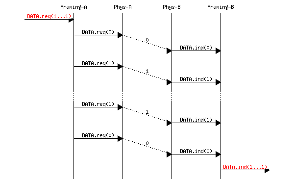

我们现在可以基于帧机制来允许主机交换包含整数个位或字节的帧。一旦解决了帧问题，我们就可以使用这些帧来携带互联网数据包。

### 应对传输错误#

如前所述，物理层可能受到各种类型的影响，这些类型会影响发送器发送的位。物理链路上的数据传输可能受到以下错误的影响：

> +   由于传输错误而修改单个位值的随机孤立错误
> +   
> +   由于传输错误而改变 n 个连续位值的随机突发错误
> +   
> +   由于传输错误而添加或删除位导致的随机位创建和随机位删除

除了帧定界外，数据链路层还包括检测和有时甚至从传输错误中恢复的机制。为了使接收器注意到传输错误，发送器必须在发送的帧中添加一些冗余信息作为错误检测码。这个错误检测码是由发送器在其发送的帧上计算的。当接收器收到带有错误检测码的帧时，它会重新计算它并验证接收到的错误检测码是否与计算出的错误检测码匹配。如果它们匹配，则认为该帧是有效的。

```sh
Please log in to see this exercise
```

```sh
Please log in to see this exercise
```

注意

互联网上的帧定界

上文所述的位填充和字符填充是各种协议中应用的通用解决方案。当互联网主机使用拨号调制解调器或串行传输交换数据时，它们使用了在[**RFC 1035**](https://datatracker.ietf.org/doc/html/rfc1035.html)中定义的 SLIP 协议或在[**RFC 1661**](https://datatracker.ietf.org/doc/html/rfc1661.html)中定义的 PPP 协议。

串行线路 IP（SLIP）协议使用两个特殊字符（`END`，十进制 192 和`ESC`，十进制 219）进行字符填充。

点对点协议（PPP）支持不同的帧定界技术。[**RFC 1662**](https://datatracker.ietf.org/doc/html/rfc1662.html)描述了 PPP 如何使用字符填充和位填充。

图 126 说明了使用物理层提供的服务的协议栈的第二层，该层交换帧。在这本书中，我们将使用“帧”一词来指代两个数据链路层实体之间交换的信息单元。

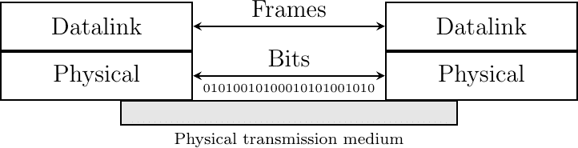

图 4 协议栈中的数据链路层

## 网络层#

数据链路层允许直接连接的主机交换信息，但通常需要在未连接到同一物理介质的主机之间交换信息。这是网络层的任务。网络层建立在数据链路层之上。网络层实体交换数据包。数据包是由数据链路层在一个或多个帧内传输的有限字节序列。数据包通常包含有关其来源和目的地的信息，并且在从其来源到其目的地的过程中通常通过几个称为路由器的中间设备。这如图 5 所示。

> 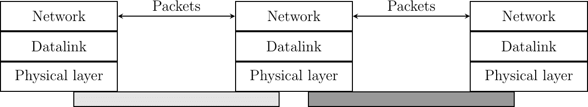
> 
> 图 5 网络层

互联网主机，如笔记本电脑、智能手机、PC、服务器以及各种物联网（IoT）设备，通过各种类型的链路层技术连接到互联网。流行的链路层技术包括 Wi-Fi、以太网、蓝牙以及不同类型的蜂窝网络技术，如 4G 和 5G。本书的第二部分将讨论其中一些技术。它们具有非常具体的特性，本书的这一部分将忽略。

互联网依赖于几个架构原则。首先，主机交换的所有信息必须分为 IP 数据包。IP 代表互联网协议。这是协议或主机在交换信息时应用的规则集。一个 IP 数据包是一个可变长度的字节序列，包含两个主要部分：

> +   一个包含控制信息的报头，指定了有效载荷的源和目的
> +   
> +   一个包含要交换数据的有效载荷

第二个原则是每个主机都有一个唯一的 IP 地址。IP 地址是一个固定长度的位串，用于标识主机。每个互联网主机都有一个唯一的 IP 地址。每个 IP 数据包都包含数据包的源或原始地址以及数据包的目的或接收者地址。网络使用目的地址将每个数据包交付给其最终接收者。

在本部分中，我们将互联网视为一个黑盒，如图 6 所示。图 6。我们将关注主机之间的交互，并在本书的第二部分揭示网络的实际运作方式。

> 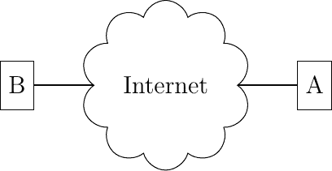
> 
> 图 6 互联网主机可以交换数据包

多亏了这些架构原则，任何互联网主机都可以在任何时候向任何其他互联网主机发送 IP 数据包。一个主机可以向美国的服务器发送一个数据包，然后不久再向澳大利亚或非洲的服务器发送另一个数据包。对于主机来说，发送数据包是一个低成本的操作。它创建了一个包含报头和有效载荷的字节序列，并将其传递给网络接口卡。网络的其余部分将处理数据包并将其交付到最终目的地。

### IP 版本 4 入门#

在今天的互联网上使用了两种不同的互联网协议版本。第一个版本，称为 IP 版本 4，使用 32 位长地址。IPv4 地址通常以点分十进制格式表示，由四个整数序列组成，每个整数之间用一个点分隔。第一个整数是 32 位 IPv4 地址最高有效字节的十进制表示，……例如，

> +   `1.2.3.4` 对应于 `00000001 00000010 00000011 00000100`
> +   
> +   `127.0.0.1`对应于`01111111 00000000 00000000 00000001`
> +   
> +   `255.255.255.255`对应于`1111111 1111111 11111111 1111111111`

这个版本是在互联网还是一个连接大学和研究实验室计算机的研究网络时设计的。当时，拥有最多$ 2^{32} $个 IPv4 地址并不被认为是一个严重的限制。今天，几乎所有可用的 IPv4 地址都已分配给各种组织，从企业或大学到互联网服务提供商。

IPv4 地址由两部分组成：子网标识符和主机标识符。子网标识符由地址的高位比特组成，而主机标识符编码在地址的低位比特中。这如图图 7 所示，其中 22 位的子网标识符以蓝色显示，12 位的主机标识符以红色显示。


图 7 IPv4 地址内的子网（蓝色）和主机标识符（红色）

在引入可变长度子网后，IPv4 寻址架构的灵活性得到了增强，这在[**RFC 1519**](https://datatracker.ietf.org/doc/html/rfc1519.html)中得到体现。IPv4 支持可变长度子网，其中子网标识符可以是 1 到 31 位中的任何大小。可变长度子网允许网络操作员使用与子网内放置的主机数量更好地匹配的子网。子网标识符或 IPv4 前缀通常表示为`A.B.C.D/p`，其中`A.B.C.D`是通过将子网标识符与仅包含 0 的主机标识符连接而获得的网络地址，p 是子网标识符的位数。下表提供了 IP 子网的示例。

| 子网 | 地址数量 | 最小地址 | 最大地址 |
| --- | --- | --- | --- |
| 10.0.0.0/8 | 16,777,216 | 10.0.0.0 | 10.255.255.255 |
| 192.168.0.0/16 | 65,536 | 192.168.0.0 | 192.168.255.255 |
| 198.18.0.0/15 | 131,072 | 198.18.0.0 | 198.19.255.255 |
| 192.0.2.0/24 | 256 | 192.0.2.0 | 192.0.2.255 |
| 10.0.0.0/30 | 4 | 10.0.0.0 | 10.0.0.3 |
| 10.0.0.0/31 | 2 | 10.0.0.0 | 10.0.0.1 |

注意

特殊 IPv4 地址

> 大多数单播 IPv4 地址都可以出现在全球互联网上的数据包的源地址和目的地址中。然而，值得注意的是，某些 IPv4 地址块有特殊用途，如 RFC 5735 中所述。这包括：

+   保留用于自识别的`0.0.0.0/8`，其中常用的地址是`0.0.0.0`，有时在主机启动且尚未知道其 IPv4 地址时使用。

+   127.0.0.0/8，这是为环回地址保留的。每个实现 IPv4 的主机都必须有一个环回接口（即未连接到数据链路层）。按照惯例，IPv4 地址 127.0.0.1 被分配给此接口。这允许在主机上运行的过程使用 TCP/IP 来联系同一主机上运行的其他过程。这对于测试目的非常有用。

+   10.0.0.0/8, 172.16.0.0/12, 和 192.168.0.0/16 被保留用于非直接连接到互联网的私有网络。这些地址通常被称为私有地址或[**RFC 1918**](https://datatracker.ietf.org/doc/html/rfc1918.html)地址。

+   169.254.0.0/16 用于链路本地地址[**RFC 3927**](https://datatracker.ietf.org/doc/html/rfc3927.html)。当某些主机连接到一个未按预期分配地址的网络时，它们会使用此块中的地址。

+   192.0.2.0/24, 198.51.100.0/24, 和 203.0.113.0/24 被保留用于文档用途。这些地址不能在公共互联网上使用，主机不应接受这些地址。本书在提供示例时理想情况下应使用这些地址。

IPv4 的信息单位是数据包。一个 IPv4 数据包有一个 20 字节的头部，包含数据包的源地址和目的地址以及一些控制信息。IPv4 头部的一个控制字段是一个 16 位的字段，包含数据包的总长度（包括头部）。IPv4 数据包的长度不能超过 65535 字节，包括头部。在实际应用中，主机很少发送真正长的数据包，大多数 IPv4 数据包的长度都小于约 1500 字节。IPv4 数据包头部在图 8 中显示。


图 8 IP 版本 4 头部#

### IP 版本 6 入门指南#

IP 的第二种部署版本是 IP 版本 6。与 IP 版本 4 相比，这一版本的 IP 引入了几个变化，将在后面讨论。其中最重要的是 IPv6 地址的长度。IPv6 地址是 128 位长。这意味着在理论上，有 $ 2¹²⁸=340,282,366,920,938,463,463,374,607,431,768,211,456 $ 个唯一的 IPv6 地址。IPv6 地址的数量远大于 IPv4 地址的数量，我们预计 IPv6 地址空间不会在某一天耗尽。

注意

IPv6 地址的文本表示

> > 有时需要以文本格式编写 IPv6 地址，例如在手动配置地址或用于文档目的时。编写 IPv6 地址的首选格式是 `x:x:x:x:x:x:x:x`，其中 `x` 是表示地址八个 16 位部分的十六进制数字。以下是一些 IPv6 地址的示例：
> > 
> +   `abcd:ef01:2345:6789:abcd:ef01:2345:6789`
> +   
> +   `2001:db8:0:0:8:800:200c:417a`
> +   
> +   `fe80:0:0:0:219:e3ff:fed7:1204`

IPv6 地址通常包含一串设置为 `0` 的位。在这种情况下，已经定义了一种紧凑的表示法。使用这种表示法，:: 用于表示一个或多个只包含设置为 `0` 的位的 16 位块组。例如，

> +   `2001:db8:0:0:8:800:200c:417a` 表示为 `2001:db8::8:800:200c:417a`
> +   
> +   `ff01:0:0:0:0:0:0:101` 表示为 `ff01::101`
> +   
> +   `0:0:0:0:0:0:0:1` 表示为 `::1`
> +   
> +   `0:0:0:0:0:0:0:0` 表示为 `::`

一个 IPv6 前缀可以表示为地址/长度，其中长度是前缀的位数。例如，以下三种表示法对应于相同的 IPv6 前缀：

> +   `2001:0db8:0000:cd30:0000:0000:0000:0000` / `60`
> +   
> +   `2001:0db8::cd30:0:0:0:0` / `60`
> +   
> +   `2001:0db8:0:cd30::` / `60`

一个 IPv6 数据包以至少 40 字节的头部开始。它包含源和目的 IPv6 地址以及一个 16 位长的长度字段。这意味着 IPv6 数据包不能超过 65535 字节。至于 IPv4，大多数观察到的 IPv6 数据包长度小于约 1500 字节。

在 [**RFC 2460**](https://datatracker.ietf.org/doc/html/rfc2460.html) 中定义的标准 IPv6 报头占用 40 字节，包含 8 个不同的字段，如图 9 所示。本书的第二部分将更详细地解释此数据包的结构。


图 9 IP 版本 6 报头#

## 传输层#

网络层使主机能够通过中间路由器相互通信。然而，同一主机之间可以发生不同的通信流。这些通信流可能有不同的需求（一些需要可靠交付，其他则不需要），并且需要区分。确保两个给定主机之间通信流的识别是传输层的任务。传输层实体交换段。段是在一个或多个数据包内部传输的有限字节序列。传输层实体将段（或有时是段的一部分）作为 Data.request 发送到下层的网络层实体。这如图 10 所示。

存在着不同类型的传输层。在互联网上最广泛使用的传输层是 TCP，它提供了一种可靠的面向连接的字节流传输服务，以及 UDP，它提供了一种不可靠的无连接传输服务。

> 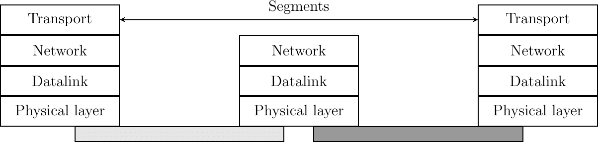
> 
> 图 10 传输层

网络总是被设计和构建来允许在主机上运行的应用程序交换信息。在前面的一章中，我们解释了网络层原理，该原理允许连接到不同类型数据链路层的主机通过路由器交换信息。这些路由器在网络层充当中继，确保网络中任何一对连接的主机之间数据包的交付。

网络层通过中间节点按跳步确保数据包的交付。因此，它为上层提供了一种服务。在实践中，这一层通常是传输层，它改进了网络层提供的服务，使其适用于应用程序。这如图图 11 所示。

> 
> 
> 图 11 传输层

大多数网络使用数据报组织并提供一种简单的服务，称为无连接服务。

由于传输层建立在网络层之上，了解网络层服务的关键特征很重要。在这本书中，我们只考虑最广泛使用的无连接网络层服务。其主要特征包括：

> +   无连接网络层服务只能传输*有限大小*的 SDU
> +   
> +   无连接网络层服务可能会丢弃 SDU
> +   
> +   无连接网络层服务可能会损坏 SDU
> +   
> +   无连接网络层服务可能会延迟、重新排序或甚至重复 SDU

这些无连接网络层服务的不完善是由网络层的操作引起的。该层能够将数据包发送到预期的目的地，但不能保证它们的交付。数据包丢失和错误的主要原因是网络节点上使用的缓冲区。如果这些节点中的一个缓冲区满了，所有到达的数据包都必须被丢弃。这种情况在实践中经常发生。传输错误也可能影响在未启用可靠传输技术或由于网络节点缓冲区错误的情况下进行的数据包传输。

有三种主要的传输服务类型：

> +   无连接服务
> +   
> +   面向连接（字节流或消息模式）服务
> +   
> +   请求-响应服务

### 无连接传输服务#

无连接服务允许应用程序轻松交换消息或服务数据单元。在互联网上，这种服务由 UDP 协议提供，将在下一章中解释。互联网上的无连接传输服务是不可靠的，但能够检测传输错误。这意味着应用程序不会接收到由于传输错误而损坏的数据。

下面的图提供了无连接服务作为时间序列图的表示。左侧的用户，地址为 S，发出一个包含服务数据单元（SDU）M 的数据请求原语，该数据单元必须由服务提供商交付到目的地 D。两个原语之间的虚线表示发送到右侧用户的 Data.indication 原语对应于左侧用户发送的 Data.request 原语。

![msc {

a1 [label="", linecolour=white],

a [label="", linecolour=white],

b [label="源", linecolour=black],

z [label="", linecolour=white],

c [label="目的地", linecolour=black],

d [label="", linecolour=white],

d1 [label="", linecolour=white];

a1=>b [ label = "DATA.req(S,D,\"M\")" ] ,

b>>c [ label = "", arcskip="1"];

c=>d1 [ label = "DATA.ind(S,D,\"M\")" ];

}](../Images/4ee9488e106e721d3505acd29c04b209.png)

无连接服务有几种可能的实现方式。在研究这些实现之前，讨论无连接服务的可能特性是有用的。一个可靠的无连接服务是一个服务，其中服务提供商保证用户通过数据请求提交的所有 SDU 最终将被交付到目的地。这样的服务对用户非常有用，但在实践中保证完美的交付是困难的。因此，网络层通常支持不可靠的无连接服务。

一个不可靠的无连接服务与一个可靠的无连接服务相比可能会遇到各种类型的问题。首先，一个不可靠的无连接服务不能保证所有 SDU 的交付。这可以通过下面的时间序列图来图形化表示。

![msc {

a1 [label="", linecolour=white],

a [label="", linecolour=white],

b [label="源", linecolour=black],

z [label="", linecolour=white],

c [label="目的地", linecolour=black],

d [label="", linecolour=white],

d1 [label="", linecolour=white];

a1=>b [ label = "DATA.req(S,D,\"M\")" ] ,

b-x c [ label = "D(b)", arcskip="2", linecolour=red];

c=>d1 [ label = "",linecolour=white ];

}](../Images/177cb46396d45f08e9d7545e3154e18b.png)

在实践中，不可靠的无连接服务通常会交付大部分 SDU。然而，由于 SDU 的交付没有保证，用户必须能够从任何 SDU 的丢失中恢复。

可能影响不可靠的无连接服务的第二个缺陷是它可能会重复 SDU。一些数据包可能在网络中被重复，并两次被发送到目的地。这可以通过下面的时间序列图来说明。

![msc {

a1 [label="", linecolour=white],

a [label="", linecolour=white],

b [label="源", linecolour=black],

z [label="", linecolour=white],

c [label="目的地", linecolour=black],

d [label="", linecolour=white],

d1 [label="", linecolour=white];

a1=>b [ label = "DATA.req(S,D,\"M\")" ] ,

b>>c [ label = "", arcskip="1"];

c=>d1 [ label = "DATA.ind(S,D,\"M\")" ];

z>>c [ label = "", arcskip="1"];

c=>d1 [ label = "DATA.ind(S,D,\"M\")" ];

}](../Images/f44769bd9ed127c07d494406222a612b.png)

最后，一些不可靠的无连接服务提供商可能会将一个与在 Data.request 中提供的不同的 SDU 发送到目的地。这在下图中得到了说明。

![msc {

a1 [label="", linecolour=white],

a [label="", linecolour=white],

b [label="源", linecolour=black],

z [label="", linecolour=white],

c [label="目的地", linecolour=black],

d [label="", linecolour=white],

d1 [label="", linecolour=white];

a1=>b [ label = "DATA.req(S,D,\"abc\")" ] ,

b>>c [ label = "", arcskip="1"];

c=>d1 [ label = "DATA.ind(S,D,\"xyz\")" ];

}](../Images/d960a02633797ef9170e30439eb112b8.png)

无连接传输服务允许网络应用程序交换消息。单个主机上可能同时运行多个网络应用程序。每个应用程序都必须能够与远程应用程序交换 SDU。为了实现这些 SDU 的交换，运行在主机上的每个网络应用程序都通过以下信息进行标识：

> +   运行应用程序的主机
> +   
> +   应用程序监听数据传输的端口号

在互联网上，端口号是一个整数，主机通过其 IPv4 或 IPv6 地址进行识别。只有 IPv4 地址的主机无法与只有 IPv6 地址的主机通信。图 12 说明了两个在仅使用 IPv4 地址的主机上使用 UDP 提供的数据报服务的应用程序。

> 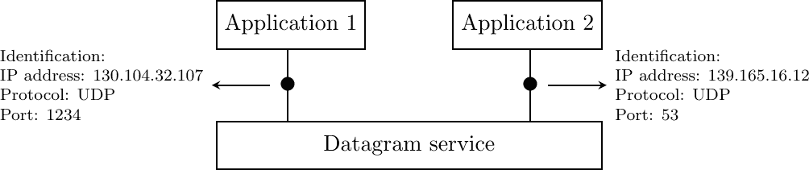
> 
> 图 12 无连接或数据报服务

### 面向连接的传输服务#

连接导向服务的调用分为三个阶段。第一阶段是建立连接。连接是通过服务提供商在两个用户之间建立的临时关联。在任何一对用户之间可能同时存在多个连接。一旦建立，连接用于传输 SDU。连接通常提供一条双向流，支持通过连接关联的两个用户之间的 SDU 交换。此流用于连接的第二阶段，即数据传输阶段。第三阶段是连接的终止。一旦用户完成 SDU 的交换，他们请求服务提供商终止连接。正如我们稍后将会看到的，也有一些情况是服务提供商可能需要自己终止连接。

建立连接可以通过使用四个原语来建模：Connect.request、Connect.indication、Connect.response 和 Connect.confirm。Connect.request 原语用于请求建立连接。此原语的主要参数是目标用户的地址。服务提供商向目标用户发送 Connect.indication 原语以通知连接尝试。如果目标用户接受建立连接，则通过 Connect.response 原语进行响应。此时，连接被认为是建立的，并且目标用户可以开始通过连接发送 SDU。服务提供商处理 Connect.response 并将 Connect.confirm 传递给发起连接的用户。此原语的传递终止了连接建立阶段。此时，连接被认为是打开的，并且两个用户都可以发送 SDU。以下是一个成功的连接建立的示例。

![msc {

a1 [label="", linecolour=white],

a [label="", linecolour=white],

b [label="源", linecolour=black],

z [label="服务提供商", linecolour=white],

c [label="目标", linecolour=black],

d [label="", linecolour=white],

d1 [label="", linecolour=white];

a1=>b [ label = "CONNECT.req" ] ,

b>>c [ label = "", arcskip="1"];

c=>d1 [ label = "CONNECT.ind" ];

d1=>c [ label = "CONNECT.resp" ] ,

c>>b [ label = "", arcskip="1"];

b=>a1 [ label = "CONNECT.conf" ];

}](../Images/12de7a0d5f3487e2a782a5860da72cff.png)

上面的示例展示了成功建立连接的过程。然而，在实际操作中，并非所有连接都能成功建立。一个原因可能是目标用户可能因为策略或性能原因，不同意在此时刻与发起用户建立连接。在这种情况下，目标用户会通过包含表示连接被拒绝原因的参数的 Disconnect.request 原语来响应 Connect.indication 原语。服务提供商随后将发送 Disconnect.indication 原语来通知发起用户。

![msc {

a1 [label="", linecolour=white],

a [label="", linecolour=white],

b [label="源", linecolour=black],

z [label="提供者", linecolour=white],

c [label="目的地", linecolour=black],

d [label="", linecolour=white],

d1 [label="", linecolour=white];

a1=>b [ label = "CONNECT.req" ] ,

b>>c [ label = "", arcskip="1"];

c=>d1 [ label = "CONNECT.ind" ];

d1=>c [ label = "DISCONNECT.req" ] ,

c>>b [ label = "", arcskip="1"];

b=>a1 [ label = "DISCONNECT.ind" ];

}](../Images/d7cf3fe0981d29ac305e476158ad3202.png)

第二个原因是当服务提供商无法到达目标用户时。这可能是因为目标用户当前未连接到网络，或者由于拥塞。在这些情况下，服务提供商会对 Connect.request 响应一个包含有关连接失败额外信息的 Disconnect.indication 原语。

![msc {

a1 [label="", linecolour=white],

a [label="", linecolour=white],

b [label="源", linecolour=black],

z [label="提供者", linecolour=white],

c [label="目的地", linecolour=black],

d [label="", linecolour=white],

d1 [label="", linecolour=white];

a1=>b [ label = "CONNECT.req" ] ,

b-x c [ label = "", arcskip="1"];

c-x b [ label="",linecolour=white];

b=>a1 [ label = "DISCONNECT.ind" ];

}](../Images/a6977804391f666738b97b912ff2c561.png)

一旦建立连接，服务提供商向通信用户供应两个数据流。第一个数据流可以被发起用户用来发送 SDUs。第二个数据流允许响应用户向发起用户发送 SDUs。数据流可以以不同的方式组织。第一种组织方式是消息模式传输。在消息模式传输中，服务提供商保证对于其他端点发出的每个数据请求原语，只向数据流端点传递一个且仅有一个数据指示。消息模式传输在下图中展示。消息传输模式的主要优点是接收者接收到的 SDUs 正好是其他用户发送的。如果每个 SDU 包含一个命令，接收用户可以在接收到 SDU 后立即处理每个命令。

![msc {

a1 [label="", linecolour=white],

a [label="", linecolour=white],

b [label="Source", linecolour=black],

z [label="Provider", linecolour=white],

c [label="Destination", linecolour=black],

d [label="", linecolour=white],

d1 [label="", linecolour=white];

a1=>b [ label = "CONNECT.req" ] ,

b>>c [ label = "", arcskip="1"];

c=>d1 [ label = "CONNECT.ind" ];

d1=>c [ label = "CONNECT.resp" ] ,

c>>b [ label = "", arcskip="1"];

b=>a1 [ label = "CONNECT.conf" ];

a1=>b [ label = "DATA.req(\"A\")" ] ,

b>>c [ label = "", arcskip="1"];

c=>d1 [ label = "DATA.ind(\"A\")" ];

a1=>b [ label = "DATA.req(\"BCD\")" ] ,

b>>c [ label = "", arcskip="1"];

c=>d1 [ label = "DATA.ind(\"BCD\")" ];

a1=>b [ label = "DATA.req(\"EF\")" ] ,

b>>c [ label = "", arcskip="1"];

c=>d1 [ label = "DATA.ind(\"EF\")" ];

}](../Images/2592ed60d53be2396fda0643ecb35744.png)

很遗憾，消息模式传输在互联网上并不常用。在互联网上，最流行的面向连接的服务以流模式传输 SDU。使用流模式，服务提供商提供字节流，将两个通信用户连接起来。发送用户通过包含字节序列的 SDU 的数据请求原语发送字节。服务提供商通过数据指示原语将包含连续字节的 SDU 传递给接收用户。服务提供商确保流一端发送的所有字节以相同的顺序正确地传递到流的另一端。然而，服务提供商并不试图保留 SDU 的边界。服务提供商之间没有强制执行与数据请求原语数量和数据指示原语数量之间的关联。流模式在下图中展示。在实践中，流模式的使用导致的一个后果是，如果用户想要交换结构化的 SDU，他们需要提供允许接收用户在接收到的字节流中分离连续 SDU 的机制。应用层协议通常使用特定的分隔符，如行结束字符，在字节流中划分 SDU。

![msc {

a1 [label="", linecolour=white],

a [label="", linecolour=white],

b [label="源", linecolour=black],

z [label="提供者", linecolour=white],

c [label="目的", linecolour=black],

d [label="", linecolour=white],

d1 [label="", linecolour=white];

a1=>b [ label = "CONNECT.req" ] ,

b>>c [ label = "", arcskip="1"];

c=>d1 [ label = "CONNECT.ind" ];

d1=>c [ label = "CONNECT.resp" ] ,

c>>b [ label = "", arcskip="1"];

b=>a1 [ label = "CONNECT.conf" ];

a1=>b [ label = "DATA.req(\"AB\")" ],

b>>c [ label = "", arcskip="1"];

c=>d1 [ label = "DATA.ind(\"A\")" ];

c=>d1 [ label = "DATA.ind(\"B\")" ];

a1=>b [ label = "DATA.req(\"CD\")" ] ,

b>>c [ label = "", arcskip="1"];

c=>d1 [ label = "DATA.ind(\"C\")" ];

a1=>b [ label = "DATA.req(\"EF\")" ] ,

b>>c [ label = "", arcskip="1"];

c=>d1 [ label = "DATA.ind(\"DEF\")" ];

}](../Images/2db37b2091c6c91af8c65803fadd75dc.png)

连接的第三阶段是其释放。由于连接涉及三方（两个用户和一个服务提供商），任何一方都可以请求终止连接。通常，一旦数据传输完成，就会根据一方的请求终止连接。然而，有时服务提供商可能被迫终止连接。这可能是因为服务提供商内部资源不足，或者因为用户之一无法通过网络再次访问。在这种情况下，服务提供商将向两个用户发出 Disconnect.indication 原语。这些原语将包含有关连接终止原因的一些信息。不幸的是，如图所示，当服务提供商被迫终止连接时，它不能保证每个用户发送的所有 SDU 都已传递给另一方。这种连接释放被称为突然释放，因为它可能导致数据丢失。

![msc {

a1 [label="", linecolour=white],

a [label="", linecolour=white],

b [label="Source", linecolour=black],

z [label="Provider", linecolour=white],

c [label="Destination", linecolour=black],

d [label="", linecolour=white],

d1 [label="", linecolour=white];

a1=>b [ linecolour=white, textcolour=blue, label = "Connection\nestablished" ] ,

c=>d1 [ linecolour=white, textcolour=blue, label = "Connection\nestablished" ];

a1=>b [ label = "DATA.req(\"A\")" ],

b>>c [ label = "", arcskip="1"];

c=>d1 [ label = "DATA.ind(\"A\")" ];

a1=>b [ label = "DATA.req(\"B\")" ] ,

b-x z [ label = "", arcskip="1", linecolour=red];

a1=>b [ label = "", linecolour=white];

d1=>c [ label = "DATA.req(\"C\")" ] ,

c-x z [ label = "", arcskip="1", linecolour=red];

a1=>b [ label = "", linecolour=white];

b=>a1 [ linecolour=red, label = "DISCONNECT.ind" , textcolour=red] ,

c=>d1 [ linecolour=red, label = "DISCONNECT.ind", textcolour=red ];

}](../Images/e332fc75c845caae3e5d76447bc8fb22.png)

突然的连接释放也可以由用户之一触发。如果用户出于任何原因需要快速终止连接，它可以发出 Disconnect.request 原语并请求突然释放。服务提供商将处理请求，停止两个数据流，并尽快将 Disconnect.indication 原语传递给远程用户。如图所示，这种突然的连接释放可能会导致 SDUs 的丢失。

![msc {

a1 [label="", linecolour=white],

a [label="", linecolour=white],

b [label="Source", linecolour=black],

z [label="Provider", linecolour=white],

c [label="Destination", linecolour=black],

d [label="", linecolour=white],

d1 [label="", linecolour=white];

a1=>b [ linecolour=white, textcolour=blue, label = "Connection\nestablished" ] ,

c=>d1 [ linecolour=white, textcolour=blue, label = "Connection\nestablished" ];

a1=>b [ label = "DATA.req(\"A\")" ],

b>>c [ label = "", arcskip="1"];

c=>d1 [ label = "DATA.ind(\"A\")" ];

a1=>b [ label = "DATA.req(\"B\")" ] ,

b-x z [ label = "", arcskip="1", linecolour=red];

a1=>b [ label = "", linecolour=white];

d1=>c [ label = "DATA.req(\"C\")" ] ,

c-x z [ label = "", arcskip="1", linecolour=red];

a1=>b [ label = "", linecolour=white];

a1=>b [ linecolour=red, label = "DISCONNECT.req(abrupt)" , textcolour=red] ,

b>>c [ label = "", arcskip="1",linecolour=red];

c=>d1 [ linecolour=red, label = "DISCONNECT.ind", textcolour=red ];

}](../Images/bcaa45e4382eb9e52c93458a974ea97e.png)

为了确保每个用户通过连接发送的 SDU（服务数据单元）的可靠交付，我们需要将构成连接的两个流视为独立的。一旦用户发送了它计划通过此连接发送的所有 SDU，它应该能够释放它用来发送 SDU 的流，但仍然可以通过相反的流接收 SDU。这种优雅的连接释放通常如图所示执行。一旦用户发出所有其 Data.request 原语，它就会向其提供者发出 Disconnect.request 原语。服务提供者将在发出 Disconnect.indication 原语之前等待所有 Data.indication 原语都已被发送到接收用户。此原语通知接收用户它将不再通过此连接接收 SDU，但它仍然能够在相反方向的流上发出 Data.request 原语。一旦用户发出所有其 Data.request 原语，它就会发出 Disconnect.request 原语以请求终止剩余的流。服务提供者将在发送所有挂起的 Data.indication 原语后处理请求并向另一个用户发送相应的 Disconnect.indication。此时，所有数据都已发送，两个流已成功释放，连接已完全关闭。

![msc {

a1 [label="", linecolour=white],

a [label="", linecolour=white],

b [label="源", linecolour=black],

z [label="提供者", linecolour=white],

c [label="目的地", linecolour=black],

d [label="", linecolour=white],

d1 [label="", linecolour=white];

a1=>b [ linecolour=white, textcolour=blue, label = "连接已建立" ] ,

c=>d1 [ linecolour=white, textcolour=blue, label = "连接已建立" ];

a1=>b [ label = "DATA.req(\"A\")" ],

b>>c [ label = "", arcskip="1"];

c=>d1 [ label = "DATA.ind(\"A\")" ];

a1=>b [ label = "DATA.req(\"B\")" ],

b>>c [ label = "", arcskip="1"];

c=>d1 [ label = "DATA.ind(\"B\")" ];

a1=>b [ label = "DISCONNECT.req(graceful)",textcolour=red, linecolour=red ],

b>>c [ label = "", arcskip="1", linecolour=red];

c=>d1 [ label = "DISCONNECT.ind(graceful)",linecolour=red, textcolour=red ];

d1=>c [ label = "DATA.req(\"C\")" ] ,

c>>b [ label = "", arcskip="1"];

b=>a1 [标签 = "DATA.ind(\"C\")" ];

d1=>c [标签 = "DISCONNECT.req(优雅)", 文字颜色=蓝色, 线颜色=蓝色 ] ,

c>>b [标签 = "", 跳过弧线="1"，线颜色=蓝色];

b=>a1 [标签 = "DISCONNECT.ind(优雅)" ];

a1=>b [线颜色=白色，文字颜色=蓝色，标签 = "连接已关闭"] ,

c=>d1 [线颜色=白色，文字颜色=蓝色，标签 = "连接已关闭"];

}](../Images/93d7ca8af6d44432fde8748dc0e2f7d9.png)

注意

面向连接服务的可靠性

关于面向连接服务的一个重要观点是其可靠性。面向连接的服务只能保证在连接优雅释放的情况下，所有 SDU 的正确交付。这意味着在连接活动期间，没有保证实际交付交换的 SDU，因为连接可能需要随时突然释放。

第二个传输服务是面向连接的服务。在互联网上，这种服务通常被称为字节流服务，因为它在通过传输连接连接的两个应用程序之间创建了一个可靠的字节流。像数据报服务一样，使用字节流服务的网络应用程序可以通过它们运行的宿主机和端口号来识别。这些宿主机可以通过地址或名称来识别。图 13 展示了两个正在使用通过 IPv6 宿主机提供的 TCP 协议字节流服务的应用程序。TCP 提供的字节流服务是可靠且双向的。

> 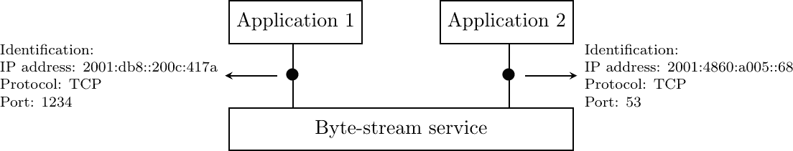
> 
> 图 13 面向连接或字节流服务

### 请求-响应服务#

请求-响应服务是无连接服务和面向连接服务之间的折中方案。许多应用程序需要发送少量数据并接收少量信息。这类似于编程语言中的过程调用。对过程的调用传递几个参数并返回一个简单的答案。在网络中，有时在另一台主机上执行过程并接收计算结果是有用的。在另一台主机上执行过程通常被称为远程过程调用。可以使用无连接服务来处理这种应用。然而，由于此服务通常不可靠，这会迫使应用程序处理可能发生的任何类型的错误。使用面向连接的服务是另一种选择。此服务确保数据的可靠交付，但在数据传输开始之前必须创建连接。对于仅交换少量数据的应用程序来说，这种开销可能很重要。

请求-响应服务允许在请求中高效地交换少量信息，并将其与相应的响应关联。此服务可以通过下面的时序图来表示。

> ![msc {
> 
> a [label="", linecolour=white],
> 
> b [label="主机 A", linecolour=black],
> 
> z [label="Service", linecolour=white],
> 
> c [label="主机 B", linecolour=black],
> 
> d [label="", linecolour=white];
> 
> a=>b [ label = "DATA.req(request)" ] ,
> 
> b>>c [ arcskip="1"];
> 
> c=>d [ label = "DATA.ind(request)" ];
> 
> d=>c [ label = "DATA.resp(response)" ] ,
> 
> c>>b [ arcskip="1"];
> 
> b=>a [ label = "DATA.confirm(response)" ];
> 
> }](../Images/414d09372f22c44dc624c0b21cae0fdc.png)

注意

服务和层

在前面的章节中，我们描述了传输层提供的服务。然而，需要注意的是，服务的概念比传输层更一般。如前所述，网络层也提供了一种服务，在大多数网络中这是一种不可靠的无连接服务。有些网络层提供面向连接的服务。同样，数据链路层也提供服务。有些数据链路层将提供无连接服务。例如，在局域网中就是这样。其他数据链路层，例如在公共网络中，提供面向连接的服务。

## 传输层#

传输层实体与应用层中的用户和网络层进行交互。它提高了网络层服务，使其可供应用程序使用。从应用程序的角度来看，网络层服务的主要限制来自其不可靠的服务：

> +   网络层可能会损坏数据；
> +   
> +   网络层可能会丢失数据；
> +   
> +   网络层可能不会按顺序交付数据；
> +   
> +   网络层对数据最大长度有一个上限；
> +   
> +   网络层可能会重复数据。

为了处理这些问题，传输层包括几个依赖于它所提供服务的机制。它与应用程序和底层网络层进行交互。


图 14 传输层、其用户及其网络层提供者之间的交互#

我们已经在数据链路层中描述了处理数据丢失和传输错误的机制。这些技术也用于传输层。

### 无连接传输#

在传输层可以提供的最简单的服务是无连接传输服务。与无连接网络层服务相比，此传输服务包括两个额外的特性：

> +   一个错误检测机制，允许检测损坏的数据
> +   
> +   一种多路复用技术，它使得运行在一个主机上的多个应用程序能够与其他主机交换信息

为了交换数据，传输协议将其用户产生的 SDU 封装在一个段中。段是传输层中信息传输的单位。传输层实体总是交换段。当一个传输层实体创建一个段时，这个段被网络层封装成一个包含段的负载和网络头部的数据包。然后，这个数据包被封装在帧中，以便在数据链路层传输。

> 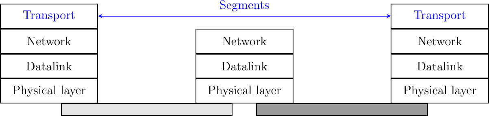
> 
> 图 15 段是传输层传输的单位

段还包含控制信息，通常存储在头部和来自应用程序的有效负载中。为了检测传输错误，传输协议依赖于校验和或 CRC，就像数据链路层协议一样。

与无连接的网络层服务相比，传输层服务允许主机上运行的多达几个应用程序与远程主机上运行的其他几个应用程序交换 SDU。让我们考虑两个主机，例如一个客户端和一个服务器。网络层服务允许客户端向服务器发送信息，但如果客户端上运行的应用程序想要联系服务器上运行的一个特定应用程序，则需要额外的寻址机制。网络层地址标识一个主机，但它不足以区分主机上运行的应用程序。端口号提供了这种额外的寻址。当服务器应用程序在主机上启动时，它会注册一个端口号。这个端口号将被客户端用来联系服务器进程。

下图展示了端口号的典型用法。客户端进程使用端口号 1234，而服务器进程使用端口号 5678。当客户端发送请求时，它被识别为来自客户端主机的端口号 1234，并指向服务器主机的端口号 5678。当服务器进程回复此请求时，服务器的传输层将回复作为来自服务器主机的端口号 5678，并指向客户端主机的端口号 1234。

> 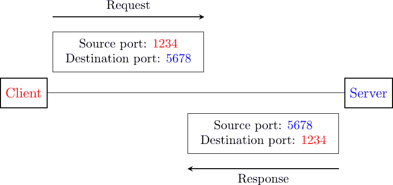
> 
> 图 16 端口号的利用

### 用户数据报协议#

用户数据报协议（UDP）在[**RFC 768**](https://datatracker.ietf.org/doc/html/rfc768.html)中定义。它在不可靠的网络层无连接服务之上提供了一种不可靠的无连接传输服务。UDP 服务的主要特性包括：

> +   UDP 服务无法传输大于 65467 字节的 SDU [[1]](#fmtuudp)
> +   
> +   UDP 服务不保证 SDU 的交付（可能会发生丢失，SDU 可能会乱序到达）
> +   
> +   UDP 服务不会将损坏的 SDU 传递给目的地

与无连接网络层服务相比，UDP 服务的主要优势在于它允许主机上运行的多项应用程序与其他主机上运行的多项应用程序交换 SDU。让我们考虑两个主机，例如一个客户端和一个服务器。网络层服务允许客户端向服务器发送信息，但如果客户端上运行的应用程序想要联系服务器上运行的一个特定应用程序，则需要一个额外的寻址机制，除了标识主机的 IP 地址外，还需要区分主机上运行的应用程序。这种额外的寻址由端口号提供。当主机上启用了使用 UDP 的服务器时，该服务器会注册一个端口号。这个端口号将被客户端用于通过 UDP 联系服务器进程。

图图 17 显示了 UDP 端口号的典型使用情况。客户端进程使用端口号 1234，而服务器进程使用端口号 5678。当客户端发送请求时，它被识别为来自客户端主机的端口号 1234，并指向服务器主机的端口号 5678。当服务器进程回复此请求时，服务器的 UDP 实现将回复作为来自服务器主机的端口号 5678 发送，并指向客户端主机的端口号 1234。

> 
> 
> 图 17 UDP 端口号的使用

UDP 使用图图 18 所示的单一段格式。

(../_images/udp.svg)

图 18 UDP 头部格式#

UDP 头部包含四个字段：

> +   一个 16 位的源端口号
> +   
> +   一个 16 位的端口号
> +   
> +   一个 16 位的长度字段
> +   
> +   一个 16 位的校验和

由于端口号被编码为 16 位字段，因此在给定服务器上，同时只能有最多 65535 个不同的服务器进程绑定到不同的 UDP 端口。在实践中，这个限制从未达到。然而，值得注意的是，大多数实现将允许的 UDP 端口号范围分为三个不同的范围：

> +   特权端口号（1 < 端口 < 1024）
> +   
> +   临时端口号（官方规定：49152 <= 端口 <= 65535）
> +   
> +   已注册的端口号（官方规定：1024 <= 端口 < 49152）

在大多数 Unix 变体中，只有具有系统管理员权限的进程才能绑定小于 1024 的端口号。知名服务器，如 DNS、NNTP 或 RPC，使用特权端口号。当客户端需要使用 UDP 时，通常不需要特定的端口号。在这种情况下，UDP 实现将分配 ephemeral 范围内的第一个可用端口号。服务器应使用已注册端口号的范围。理论上，网络服务器的开发人员应通过 IANA 正式注册他们的端口号 [[3]](#fportnum)，但很少有开发人员这样做。

UDP 可以在 IPv4 或 IPv6 上使用。当主机接收到一个 IP 数据包时，它需要确定这个数据包应该由 UDP 还是其他传输协议处理。这是通过使用 IPv4 报头中的协议字段来完成的。互联网编号分配机构（Internet Assigned Numbers Authority）(IANA) 维护一个[分配的互联网协议号注册表](https://www.iana.org/assignments/protocol-numbers/protocol-numbers.xhtml)，为每个可以包含在 IP 数据包内的协议分配一个整数。此注册表指定 `17` 是保留用于表示 UDP 段的。图 图 19 展示了 IPv4 数据包内的 UDP 段。


图 19 包含空 UDP 段的 IPv4 数据包#

注意

UDP 校验和的计算

许多互联网协议使用在 [**RFC 1071**](https://datatracker.ietf.org/doc/html/rfc1071.html) 中定义的互联网校验和来检测传输错误。此校验和由发送方计算并由接收方验证。在 [**RFC 1071**](https://datatracker.ietf.org/doc/html/rfc1071.html) 中定义的算法使用模运算。它在一个字节序列上计算，如果包含奇数个字节，则进行填充。校验和是 16 位字之和的 1 的补码，模 $ 2¹⁶ $。下面的 Python 代码计算互联网校验和。

> ```sh
> def  internet_checksum(data: bytes) -> int:
>   """
>  Compute the Internet Checksum of the supplied data.
>  :param data: The input data as bytes
>  :return: The checksum as an integer (16-bit)
>  """
>     if len(data) % 2:
>       data += b'\x00'  # pad to even length
> 
>     checksum = 0
>     for i in range(0, len(data), 2):
>         word = (data[i] << 8) + data[i+1]
>         checksum += word
>         # carry around
>         checksum = (checksum & 0xFFFF) + (checksum >> 16)
> 
>     return ~checksum & 0xFFFF  # one's complement
> 
> # Example usage
> if __name__ == "__main__":
>     test_data = b"a sequence of bytes"
>     chk = internet_checksum(test_data)
>     print(f"Checksum: 0x{chk:04X}") 
> ```

用于计算 UDP 段校验和的字节数组包含：

> +   一个包含源地址、目的地址、以 32 位数字编码的包长度以及一个 32 位字段（最高三位字节设置为 0，最低字节设置为 17）的伪头部 [**RFC 2460**](https://datatracker.ietf.org/doc/html/rfc2460.html)
> +   
> +   整个 UDP 段，包括其报头

几种类型的应用依赖于 UDP。一般来说，UDP 用于需要最小化延迟或应用本身可以恢复丢失的应用。基于 UDP 的第一类应用是客户端发送简短请求并期望快速简短回答的应用。例如，DNS 是一种常用于广域网的 UDP 应用。然而，在局域网中，许多分布式系统依赖于通常在 UDP 之上使用的远程过程调用(RPC)。在 Unix 环境中，网络文件系统(NFS)建立在 RPC 之上，并经常在 UDP 之上运行。基于 UDP 的第二类应用是需要频繁交换小消息的交互式计算机游戏，例如玩家的位置或他们的最近动作。许多这些游戏使用 UDP 来最小化延迟并从丢失中恢复。第三类应用是多媒体应用，如交互式 VoIP 或交互式 VoIP 视频。这些交互式应用期望发送方和接收方之间的延迟短于大约 200 毫秒，并且可以直接在应用中恢复丢失。

脚注

## 物理层#

这些物理媒体可以在将信息转换为合适的电信号后用于交换信息。整个电信课程和教科书都致力于将模拟或数字信息转换为电信号以便通过给定的物理链路传输的问题。在这本书中，我们只考虑两种非常简单的方案，使我们能够通过电电缆传输信息。这使得我们能够突出在物理链路上传输信息时的关键问题。我们只对允许通过电线传输数字信息的技术感兴趣。在这里，我们将关注比特的传输，即 0 或 1。

注意

比特率

在计算机网络中，物理层的比特率总是以每秒比特数来表示。1 Mbps 等于每秒一百万比特，1 Gbps 等于每秒十亿比特。这与通常以字节（8 比特）、千字节（1024 字节）或兆字节（1048576 字节）来表示的内存规格形成对比。通过 1 Mbps 链路传输 1 兆字节需要 8.39 秒。

> | 比特率 | 每秒比特数 |
> | --- | --- |
> | 1 Kbps | $ 10³ $ |
> | 1 Mbps | $ 10⁶ $ |
> | 1 Gbps | $ 10⁹ $ |
> | 1 Tbps | $ 10^{12} $ |

为了理解信息物理传输背后的某些原理，让我们考虑一个简单的案例：一个用于传输比特的电信号线。假设两个通信主机想要以每秒一千比特的速度传输比特。为了传输这些比特，两个主机可以同意以下规则：

> +   在发送方：
> +   
>     +   在一个毫秒内将电气线上的电压设置为 `+5V` 以传输设置为 1 的位
>     +   
>     +   在一个毫秒内将电气线上的电压设置为 `-5V` 以传输设置为 0 的位
>     +   
> +   在接收端：
> +   
>     +   每个毫秒，记录电气线上的电压应用。如果电压设置为 `+5V`，则记录接收到的位 1。否则，记录接收到的位 0

这种传输方案已被一些早期网络使用。我们将其作为理解主机如何通信的基础。从计算机科学的角度来看，处理电压是不寻常的。计算机科学家经常依赖于能够使他们推理面对的问题而无需考虑所有实现细节的模型。上述物理传输方案可以通过使用时间序列图来表示。

时间序列图描述了通信主机之间的交互。按照惯例，通信主机表示在图的左右两侧，而电气链路占据图的中间部分。在这样的时间序列图中，时间从图的顶部流向底部。一个信息位的传输由三个箭头表示。从左侧开始，第一个水平箭头表示请求传输一个信息位。这个请求由一个原始操作表示，可以将其视为一种过程调用。这个原始操作有一个参数（传输的位）和一个名称（例如，本例中的 DATA.request）。按照惯例，所有命名为 something.request 的原始操作都对应于传输某些信息。虚线箭头表示在电线上传输相应的电气信号。电气和光信号不会瞬间传播。对角虚线箭头表示电气信号从主机 A 传输到主机 B 需要一些时间。在接收到电气信号后，主机 B 的网络接口上的电子设备检测电压并将其转换为位。这个位作为 DATA.indication 原始操作传递。所有命名为 something.indication 的原始操作都对应于接收某些信息。虚线还表示两个（或更多）原始操作之间的关系。这样的时间序列图提供了不同原始操作的顺序信息，但两个原始操作之间的距离并不代表精确的时间量。

> ![msc {
> 
> a [label="", linecolour=white],
> 
> b [label="Host A", linecolour=black],
> 
> z [label="Physical link", linecolour=white],
> 
> c [label="Host B", linecolour=black],
> 
> d [label="", linecolour=white];
> 
> a=>b [ label = "DATA.req(0)" ] ,
> 
> b>>c [ label = "0", arcskip="1"];
> 
> c=>d [ label = "DATA.ind(0)" ];
> 
> }](../Images/de5f31954ab1b61192e389ebb30fe49c.png)

时间序列图在试图理解给定通信方案的特征时很有用。在考虑上述传输方案时，评估该方案是否允许两个通信主机可靠地交换信息是有用的。当主机通过电线发送的位序列在另一端正确接收时，数字传输被认为是可靠的。在实践中，使用上述方案传输信息时实现完美可靠性是困难的。这种传输方案可能会出现几个问题。

第一个问题是在电传输中可能会受到电磁干扰的影响。干扰可能来自各种来源，包括自然现象（如雷暴、磁场变化等）以及其他电气信号（如邻近电缆的干扰、邻近天线的干扰等）。由于这些各种类型的干扰，不幸的是，无法保证当主机在电线上发送一个位时，相同的位在另一端被接收。这在下图中得到了说明，其中左侧主机的 DATA.request(0) 导致右侧主机的 Data.indication(1)。

> ![msc {
> 
> a [标签="", 线颜色=白色],
> 
> b [标签="主机 A", 线颜色=黑色],
> 
> z [标签="物理链路", 线颜色=白色],
> 
> c [标签="主机 B", 线颜色=黑色],
> 
> d [标签="", 线颜色=白色];
> 
> a=>b [标签 = "DATA.req(0)" ] ,
> 
> b>>c [标签 = "", 弧跳过="1"];
> 
> c=>d [标签 = "DATA.ind(1)" ];
> 
> }](../Images/72b158d7806ce66e42f4a20fa43137df.png)

在上述传输方案中，通过在一段时间内将电线的电压设置为特定值来传输一个比特。我们已经看到，由于电磁干扰，接收器测量的电压可能不同于发送器设置的电压。这是传输错误的主要原因。然而，这并不是可能发生的唯一类型的问题。除了定义比特 0 和 1 的电压外，上述传输方案还指定了每个比特的持续时间。如果每秒发送一百万比特，那么每个比特持续 1 微秒。在每个主机上，每个比特的传输（或接收）由一个 1 MHz 频率的本地时钟触发。这些时钟是传输比特时的第二个问题来源。尽管这两个时钟具有相同的规格，但它们在不同的主机上运行，可能处于不同的温度和不同的能源来源。在实践中，两个时钟可能不会以完全相同的频率运行。假设发送主机的时钟以 1000000 Hz 的精确频率运行，而接收时钟以 999999 Hz 运行。这两个时钟之间的差异非常小。然而，当使用时钟来传输比特时，这个差异很重要。具有 1000000 Hz 时钟的发送主机将在一秒钟内生成一百万比特。在同一时间内，接收主机将检测电线 999999 次，因此将接收比原始发送的比特少一个比特。这种时钟频率的小差异意味着比特在电线上传输过程中可能会“消失”。这在下图中得到了说明。

> ![msc {
> 
> a [label="", linecolour=white],
> 
> b [label="Host A", linecolour=black],
> 
> z [label="Physical link", linecolour=white],
> 
> c [label="Host B", linecolour=black],
> 
> d [label="", linecolour=white];
> 
> a=>b [ label = "DATA.req(0)" ] ,
> 
> b>>c [ label = "", arcskip="1"];
> 
> c=>d [ label = "DATA.ind(0)" ];
> 
> a=>b [ label = "DATA.req(0)" ];
> 
> a=>b [ label = "DATA.req(1)" ] ,
> 
> b>>c [ label = "", arcskip="1"];
> 
> c=>d [ label = "DATA.ind(1)" ];
> 
> }](../Images/d5c344293b247f77b1781cce32dd951f.png)

当发送主机的时钟比接收主机的时钟慢时，类似的推理也适用。在这种情况下，接收器将检测到比发送者发送的比特更多的比特。这在下图中得到了说明，其中右侧接收到的第二个比特并未由左侧主机发送。

> ![msc {
> 
> a [label="", linecolour=white],
> 
> b [label="Host A", linecolour=black],
> 
> z [label="Physical link", linecolour=white],
> 
> c [label="Host B", linecolour=black],
> 
> d [label="", linecolour=white];
> 
> a=>b [ label = "DATA.req(0)" ] ,
> 
> b>>c [ label = "", arcskip=1];
> 
> c=>d [ label = "DATA.ind(0)" ];
> 
> c=>d [ label = "DATA.ind(0)" ];
> 
> a=>b [ label = "DATA.req(1)" ] ,
> 
> b>>c [ label = "", arcskip=1];
> 
> c=>d [ label = "DATA.ind(1)" ];
> 
> }](../Images/e6f2fc97b4f52f1569c9da37e0a7c885.png)

从计算机科学的角度来看，通过电线物理传输信息通常被视为一个黑盒，它允许传输比特。这个黑盒通常被称为物理层服务，并且通过之前引入的 DATA.request 和 DATA.indication 原语来表示。这个物理层服务通过抽象实际传输比特作为电磁信号所涉及的技术细节，从而简化了比特的发送和接收。然而，重要的是要记住，物理层服务是不完美的，并且具有以下特性：

> +   物理层服务可能会改变，例如，由于电磁干扰，传输的比特值可能会发生变化
> +   
> +   物理层服务可能向接收器交付的比特数多于发送器发送的比特数
> +   
> +   物理层服务可能向接收器交付的比特数少于发送器发送的比特数。

已经定义了许多其他类型的编码来通过电电缆传输信息。所有物理层都能够发送和接收代表值 0 和 1 的物理符号。然而，由于本章范围之外的各种原因，一些物理层也交换其他物理符号。例如，在多个物理层中使用的曼彻斯特编码可以发送四个不同的符号。曼彻斯特编码是一种差分编码方案，其中时间被分为固定长度的周期。每个周期被分为两个半周期，并且可以应用两种不同的电压水平。为了发送一个符号，发送者必须在每个半周期中设置这两种电压水平之一。为了发送 1（或 0），发送者必须在周期的第一个半周期中设置高电压（或低电压），在第二个半周期中设置低电压（或高电压）。这种编码确保在每个周期中间会有一个转换，并允许接收器将其时钟与发送者的时钟同步。除了 0 和 1 的编码之外，曼彻斯特编码还支持两个额外的符号：InvH 和 InvB，其中两个半周期使用相同的电压水平。根据定义，这两个符号不能出现在仅由 0 和 1 组成的帧中。一些技术使用这些特殊符号作为帧的开始或结束的标记。这种编码在图 2 中展示。

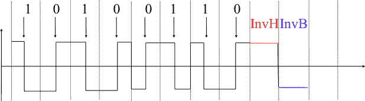

图 2 曼彻斯特编码#

当物理层使用光或电磁信号传输一个比特信息时，无法保证发送者发送的比特会被接收者以相同的方式接收。多种类型的错误可能会影响这种传输。

信息论定义了两种机制，可以用于在受随机错误影响的信道上传输信息。这两种机制向传输信息添加冗余，以便接收者能够检测或有时甚至纠正传输错误。这些机制的详细讨论超出了本章的范围，但考虑一个简单的机制来理解其操作和限制是有用的。

信息论定义了编码方案。存在不同类型的编码方案，但让我们专注于操作在二进制字符串上的编码方案。编码方案是一个函数，它将编码为 m 比特字符串的信息映射到 n 比特字符串。最简单的编码方案是（偶数）奇偶校验编码。这种编码方案将 m 比特源字符串转换为 m+1 比特的编码字符串，其中编码字符串的前 m 比特是源字符串的比特，编码字符串的最后一位是选择，使得编码字符串总是包含偶数个设置为 1 的比特。例如：

> +   1001 编码为 10010
> +   
> +   1101 编码为 11011

这种奇偶校验方案已在一些 RAM 中使用，也用于编码通过串行线发送的字符。很容易证明这种编码方案允许接收者检测单个传输错误，但不能纠正它。然而，如果有两个或更多比特错误，接收者可能无法总是检测到错误。

一些编码方案允许接收者纠正某些传输错误。例如，考虑以下编码方案的编码方式：

> +   1 编码为 111
> +   
> +   0 编码为 000

例如，考虑一个发送 111 的发送者。如果有一个比特错误，接收者可能会收到 011、101 或 110。在这三种情况下，接收者会将接收到的比特模式解码为 1，因为其中包含多数设置为 1 的比特。如果有两个比特错误，接收者将无法从传输错误中恢复。

这种简单的编码方案迫使发送者对每个源比特传输三个比特。然而，它允许接收者纠正单个比特错误。更高级的编码系统，允许从错误中恢复，被用于多种类型的物理层。

为了理解错误检测码，让我们考虑两个交换包含 N 位比特串的设备。为了使接收者能够检测传输错误，发送者将每个 N 位比特串转换为 N+r 位比特串。通常，r 个冗余位被添加到传输比特串的开始或末尾，但某些技术将冗余位与原始位交织。错误检测码可以定义为计算与每个 N 位比特串对应的 r 个冗余位的函数。最简单的错误检测码是奇偶校验位。有两种类型的奇偶校验方案：偶校验和奇校验。在偶校验（分别奇校验）方案中，冗余位被选择，使得在 N+r 位传输比特串中设置 1 的比特数为偶数（分别奇数）。接收者可以轻松地重新计算每个接收比特串的奇偶校验，并丢弃奇偶校验无效的字符串。奇偶校验方案通常用于交换 7 位字符。在这种情况下，第八位通常是奇偶校验位。下表显示了为包含三个比特的比特串计算的奇偶校验位。

> | 3 位字符串 | 奇校验 | 偶校验 |
> | --- | --- | --- |
> | 000 | 1 | 0 |
> | 001 | 0 | 1 |
> | 010 | 0 | 1 |
> | 100 | 0 | 1 |
> | 111 | 0 | 1 |
> | 110 | 1 | 0 |
> | 101 | 1 | 0 |
> | 011 | 1 | 0 |

奇偶校验位允许接收者检测影响传输的 N+r 比特中单个比特的传输错误。如果有两个或更多比特出错，接收者可能无法必然检测到传输错误。已经定义了更强大的错误检测方案。循环冗余校验（CRC）在数据链路层协议中得到广泛应用。N 位 CRC 可以检测影响传输帧中小于 N 位突发传输的所有传输错误，以及影响奇数个比特的所有传输错误。有关 CRC 的更多详细信息，请参阅 [[Williams1993]](../bibliography.html#williams1993)。

还可以设计一种代码，允许接收者纠正传输错误。最简单的纠错码是三模冗余（TMR）。要传输设置为 1（分别 0）的比特，发送者传输 111（分别 000）。在没有传输错误的情况下，接收者可以将 111 解码为 1。如果传输错误影响了一个比特，接收者将执行下表所示的多数投票。此方案允许接收者纠正影响单个比特的所有传输错误。

> | 接收比特 | 解码比特 |
> | --- | --- |
> | 000 | 0 |
> | 001 | 0 |
> | 010 | 0 |
> | 100 | 0 |
> | 111 | 1 |
> | 110 | 1 |
> | 101 | 1 |
> | 011 | 1 |

已经提出了其他更强大的纠错码，并在某些应用中使用。汉明码（[Hamming Code](https://en.wikipedia.org/wiki/Hamming_code)）是奇偶校验位的巧妙组合，提供了错误检测和纠正功能。

所有与通过电线（或无线链路）进行物理传输或信息相关的功能通常被称为物理层。物理层允许直接连接到同一传输介质的两个或多个实体交换比特。能够交换比特很重要，因为几乎任何信息都可以编码成比特序列。电气工程师习惯于处理比特流，但计算机科学家通常更喜欢处理更高级的概念。

在文件存储方面也存在类似的问题。硬盘等存储设备也存储比特流。有硬件设备可以处理硬盘产生的比特流，但计算机科学家已经设计了文件系统，以便应用程序可以轻松访问这些存储设备。这些文件系统通常也分为几个层次。硬盘存储 512 字节或更多的扇区。Unix 文件系统将扇区分组到更大的块中，这些块可以包含数据或表示文件系统结构的 inode。最后，应用程序操作文件和目录，这些文件和目录由操作系统转换为块、扇区和最终比特。

计算机网络使用类似的方法。每一层都提供一种服务，该服务建立在底层之上，更接近应用的需求。图 3 表示协议栈的底层。我们将在这本书中探讨这个栈的不同层。


图 3 物理层  ## 数据链路层#

计算机科学家通常对在两个主机之间交换比特不感兴趣。他们更倾向于编写处理更大数据块软件，以便传输消息或完成文件。得益于物理层服务，两个主机之间可以发送连续的比特流。这个比特流可以包括数据逻辑块，但我们需要能够从比特流中提取每个数据块，尽管物理层存在不完美之处。在许多网络中，两个直接连接的主机之间交换信息的基本单位通常被称为帧。帧可以被定义为具有特定语法或结构的比特序列。我们将在本章后面看到此类帧的示例。

为了实现帧的传输/接收，首先要解决的问题是如何将一个帧编码成一系列比特，以便接收方能够在物理层的限制下轻松恢复接收到的帧。

如果物理层是完美的，问题将会非常简单。我们只需定义如何将每个帧编码为一系列连续的比特。接收器随后可以轻松地从接收到的比特流中提取帧。不幸的是，物理层的缺陷使得这个问题稍微复杂一些。已经提出了几种解决方案，并在不同的网络技术中得到了实际应用。

### 帧同步#

帧同步问题可以这样定义：“发送者如何编码帧，以便接收者能够有效地从它从物理层接收到的比特流中提取它们”。

解决这个问题的第一个方案是要求物理层在每个帧传输后保持一段时间空闲。接收器可以检测到这些空闲时间段，并作为标记来界定帧边界。不幸的是，这个方案有两个不可接受的原因。首先，某些物理层不能保持空闲，并且总是需要传输比特。其次，在帧之间插入空闲时间段会降低可以达到的最大比特率。

注意

比特率和带宽

比特率和带宽经常被用来表征物理服务的传输能力。带宽的原始定义，如[韦伯斯特词典](https://www.merriam-webster.com/dictionary)中列出，是指被调制载波波占用的无线电频率范围，该载波波被分配给服务，或设备可以在此范围内操作。这个定义对应于给定传输介质或接收器的特性。例如，人耳能够解码大约 0-20 KHz 频率范围内的声音。通过扩展，带宽也被用来表示通信系统的容量，以每秒比特数表示。例如，千兆以太网链路理论上能够每秒传输十亿比特。

由于多符号编码不能被所有物理层使用，需要一个通用的解决方案，该方案可以与任何只能传输和接收 0 和 1 比特的物理层一起使用。这个通用解决方案被称为填充，存在两种变体：比特填充和字符填充。为了使接收器能够轻松地界定帧边界，这两种技术保留特殊的比特字符串作为帧边界标记，并编码帧，以确保这些特殊的比特字符串不会出现在帧内部。

位填充保留了 01111110 位字符串作为帧边界标记，并确保在帧内部物理层永远不会传输六个连续的 1 符号。使用位填充，帧的发送如下。首先，发送者发送标记，即 01111110。然后，它发送帧的所有位，并在每个连续五个 1 位的序列后插入一个额外的设置为 0 的位。这确保发送的帧永远不会包含连续六个设置为 1 的位。因此，标记模式不能出现在发送的帧内部。标记也被发送以标记帧的结束。接收者执行相反的操作来解码接收到的帧。它首先通过 01111110 标记检测帧的开始。然后，它处理接收到的位并计算连续设置为 1 的位的数量。如果 0 跟在五个连续的 1 位之后，则该位被移除，因为它是由发送者插入的。如果 1 跟在五个连续的 1 位之后，并且后面跟着一个设置为 0 的位，则它表示一个标记。下表说明了位填充在几个帧中的应用。

> | 原始帧 | 传输帧 |
> | --- | --- |
> | 0001001001001001001000011 | 01111110000100100100100100100001101111110 |
> | 0110111111111111111110010 | 01111110011011111011111011111011001001111110 |
> | 0111110 | 011111100111110001111110 |
> | 01111110 | 0111111001111101001111110 |

例如，考虑传输 0110111111111111111110010。发送者首先发送 01111110 标记，然后是 011011111。在这些五个连续的 1 位之后，它插入一个设置为 0 的位，然后是 11111。插入一个新的 0，然后是 11111。插入一个新的 0，然后是帧的结束 110010 和 01111110 标记。

位填充增加了传输每个帧所需的位数。当然，位填充的最坏情况是帧内有一长串设置为 1 的位。如果发生传输错误，填充位或标记可能会出错。在这些情况下，受错误影响的帧以及可能的后一个帧将不会被接收者正确解码，但它将在下一个有效的标记处重新同步自己。

位填充可以在硬件中轻松实现。然而，考虑到在软件中执行位操作复杂性，在软件中实现它则较为困难。软件实现更倾向于处理字符而不是位；基于软件的数据链路层通常使用字符填充。这种技术作用于包含整数个字符的帧。在计算机网络中，字符通常通过依赖 ASCII 表进行编码。该表定义了各种字母数字字符的编码为位序列。[**RFC 20**](https://datatracker.ietf.org/doc/html/rfc20.html)提供了许多互联网协议使用的 ASCII 表。例如，该表定义了以下二进制表示：

> +   A : 1000011 b
> +   
> +   0 : 0110000 b
> +   
> +   z : 1111010 b
> +   
> +   @ : 1000000 b
> +   
> +   空格 : 0100000 b

此外，ASCII 表还定义了几个不可打印或控制字符。这些字符被设计用来允许应用程序控制打印机或终端。这些控制字符包括 CR 和 LF，用于结束一行，以及引起终端发出声音的 BEL 字符。

> +   NUL: 0000000 b
> +   
> +   BEL: 0000111 b
> +   
> +   CR : 0001101 b
> +   
> +   LF : 0001010 b
> +   
> +   DLE: 0010000 b
> +   
> +   STX: 0000010 b
> +   
> +   ETX: 0000011 b

一些字符用作标记以界定帧边界。许多字符填充技术使用 ASCII 字符集中的 DLE、STX 和 ETX 字符。DLE STX（分别对应 DLE ETX）用于标记帧的开始（结束）。在传输帧时，发送方在每个传输的 DLE 字符后添加一个 DLE 字符。这确保了标记中没有任何一个可以出现在传输的帧内。接收方检测帧边界，并在接收到两个连续的 DLE 字符时移除第二个 DLE。例如，要传输帧 1 2 3 DLE STX 4，发送方首先发送 DLE STX 作为标记，然后是 1 2 3 DLE。然后，发送方传输一个额外的 DLE 字符，后跟 STX 4 和 DLE ETX 标记。

> | 原始帧 | 传输帧 |
> | --- | --- |
> | **1** **2** **3** **4** | DLE STX **1** **2** **3** **4** DLE ETX |
> | **1** **2** **3** **DLE** **STX** **4** | DLE STX **1** **2** **3** **DLE** DLE **STX** **4** DLE ETX |
> | **DLE STX DLE ETX** | DLE STX **DLE** DLE **STX** **DLE** DLE **ETX** DLE ETX |

字符填充，就像位填充一样，会增加传输帧的长度。对于字符填充，最糟糕的帧是包含许多 DLE 字符的帧。当传输错误发生时，接收方可能会错误地解码一个或两个帧（例如，如果错误发生在标记中）。然而，它将能够与下一个正确接收的标记重新同步。

位填充和字符填充允许从位或字节流中恢复帧。这种帧机制比物理层提供了更丰富的服务。通过帧服务，可以发送和接收完整的帧。这种帧服务也可以通过使用 DATA.request 和 DATA.indication 原语来表示。如图所示，假设包含四个有效位和一个用于图形原因的帧。

> ![msc {
> 
> a [label="", linecolour=white],
> 
> bf [label="Framing-A", linecolour=black],
> 
> bp [label="Phys-A", linecolour=black],
> 
> cp [label="Phys-B", linecolour=black],
> 
> cf [label="Framing-B", linecolour=black],
> 
> d [label="", linecolour=white];
> 
> a=>bf [ label = "DATA.req(1...1)", textcolour=red ];
> 
> bf=>bp [label="DATA.req(0)"],
> 
> bp>>cp [label="0", arcskip=1];
> 
> cp=>cf [label="DATA.ind(0)"];
> 
> bf=>bp [label="DATA.req(1)"],
> 
> bp>>cp [label="1", arcskip=1];
> 
> cp=>cf [label="DATA.ind(1)"];
> 
> ...;
> 
> bf=>bp [label="DATA.req(1)"],
> 
> bp>>cp [label="1", arcskip=1];
> 
> cp=>cf [label="DATA.ind(1)"];
> 
> bf=>bp [label="DATA.req(0)"],
> 
> bp>>cp [label="0", arcskip=1];
> 
> cp=>cf [label="DATA.ind(0)"];
> 
> cf=>d [ label = "DATA.ind(1...1)", textcolour=red ];
> 
> }](../Images/d93486326d5734107393c5cb08e5b59f.png)

我们现在可以基于帧机制来允许主机交换包含整数个位数或字节的帧。一旦解决了帧问题，我们就可以使用这些帧来携带互联网数据包。

### 应对传输错误#

如前所述，物理层可能受到各种类型的影响，这些类型会影响发送器发送的位。物理链路上的数据传输可能受到以下错误的影响：

> +   由于传输错误，单个位值被修改的随机孤立错误
> +   
> +   由于传输错误，n 个连续位值发生变化的随机突发错误
> +   
> +   由于传输错误，随机生成位和随机删除位，位因为传输错误而被添加或删除

除了帧之外，数据链路层还包括检测和有时甚至从传输错误中恢复的机制。为了使接收器注意到传输错误，发送器必须在发送的帧中添加一些冗余信息作为错误检测码。这个错误检测码是由发送器在它发送的帧上计算的。当接收器收到带有错误检测码的帧时，它会重新计算它并验证接收到的错误检测码是否与计算出的错误检测码匹配。如果它们匹配，则认为该帧是有效的。

```sh
Please log in to see this exercise
```

```sh
Please log in to see this exercise
```

注意

互联网上的帧

上文所述的比特填充和字符填充是各种协议应用的通用解决方案。当互联网主机使用拨号调制解调器或串行传输交换数据时，它们使用了在[**RFC 1035**](https://datatracker.ietf.org/doc/html/rfc1035.html)中定义的 SLIP 协议或在[**RFC 1661**](https://datatracker.ietf.org/doc/html/rfc1661.html)中定义的 PPP 协议。

串行线 IP（SLIP）协议使用两个特殊字符（`END`，十进制 192 和`ESC`，十进制 219）进行字符填充。

点对点协议（PPP）支持不同的帧定界技术。[**RFC 1662**](https://datatracker.ietf.org/doc/html/rfc1662.html)描述了 PPP 如何使用字符填充和比特填充。

图 126 说明了使用物理层提供的服务的协议栈的第二层，用于交换帧。在这本书中，我们将使用“帧”一词来指代两个数据链路层实体之间交换的信息单元。


图 4 协议栈中的数据链路层

### 帧定界#

帧定界问题可以定义为：“发送者如何编码帧，以便接收者可以从它从物理层接收到的比特流中有效地提取它们”。

解决这个问题的第一个方案是要求物理层在每个帧传输后保持一段时间空闲。这些空闲期可以被接收者检测到，并作为标记来界定帧边界。不幸的是，这个方案不可接受，有两个原因。首先，某些物理层不能保持空闲，总是需要传输比特。其次，在帧之间插入空闲期会降低可以达到的最大比特率。

注意

比特率和带宽

比特率和带宽常用于表征物理服务的传输能力。带宽的原始定义，如[Webster 词典](https://www.merriam-webster.com/dictionary)中列出，是指被调制载波波占用的无线电频率范围，该频率范围分配给服务，或设备可以在此范围内操作。这个定义对应于给定传输介质或接收器的特性。例如，人耳能够解码大约 0-20 KHz 频率范围内的声音。通过扩展，带宽也用来表示通信系统的容量，以每秒比特数表示。例如，千兆以太网链路理论上能够每秒传输十亿比特。

由于多符号编码不能被所有物理层使用，需要一个通用的解决方案，该解决方案可以与任何能够仅传输和接收位 0 和 1 的物理层一起使用。这个通用解决方案被称为填充，并且存在两种变体：位填充和字符填充。为了使接收者能够轻松地划分帧边界，这两种技术保留特殊的位字符串作为帧边界标记，并编码帧，以便这些特殊的位字符串不会出现在帧内部。

位填充保留了 01111110 位字符串作为帧边界标记，并确保在帧内部物理层永远不会传输六个连续的 1 符号。使用位填充，帧的发送如下。首先，发送者发送标记，即 01111110。然后，它发送帧的所有位，并在每个连续五个 1 位的序列之后插入一个额外的设置为 0 的位。这确保发送的帧永远不会包含连续六个设置为 1 的位序列。因此，标记模式不能出现在发送的帧内部。标记也被发送以标记帧的结束。接收者执行相反的操作来解码接收到的帧。它首先通过 01111110 标记检测到帧的开始。然后，它处理接收到的位并计算连续设置为 1 的位的数量。如果 0 跟在五个连续设置为 1 的位之后，则该位被移除，因为它是由发送者插入的。如果 1 跟在五个连续设置为 1 的位之后，则它表示一个标记，如果它后面跟着一个设置为 0 的位。下表说明了位填充在几个帧中的应用。

> | 原始帧 | 传输帧 |
> | --- | --- |
> | 0001001001001001001000011 | 01111110000100100100100100100001101111110 |
> | 0110111111111111111110010 | 01111110011011111011111011111011001001111110 |
> | 0111110 | 011111100111110001111110 |
> | 01111110 | 0111111001111101001111110 |

例如，考虑传输 0110111111111111111110010。发送者首先发送 01111110 标记，然后是 011011111。在这些五个连续设置为 1 的位之后，它插入一个设置为 0 的位，然后是 11111。插入一个新的 0，然后是 11111。插入一个新的 0，然后是帧的结束 110010 和 01111110 标记。

位填充增加了传输每个帧所需的位数。当然，位填充的最坏情况是帧内部一个长的连续 1 位序列。如果发生传输错误，填充位或标记可能会出错。在这些情况下，受错误影响的帧以及可能的下一个帧将不会被接收者正确解码，但它将在下一个有效的标记处重新同步自己。

位填充可以在硬件中轻松实现。然而，考虑到在软件中执行位操作复杂性，在软件中实现它是有困难的。软件实现更倾向于处理字符而不是位；基于软件的数据链路层通常使用字符填充。这种技术作用于包含整数个字符的帧。在计算机网络中，字符通常通过依赖于 ASCII 表来进行编码。该表定义了各种字母数字字符的编码为位序列。[**RFC 20**](https://datatracker.ietf.org/doc/html/rfc20.html)提供了许多互联网协议使用的 ASCII 表。例如，该表定义了以下二进制表示：

> +   A : 1000011 b
> +   
> +   0 : 0110000 b
> +   
> +   z : 1111010 b
> +   
> +   @ : 1000000 b
> +   
> +   space : 0100000 b

此外，ASCII 表还定义了几个不可打印或控制字符。这些字符被设计成允许应用程序控制打印机或终端。这些控制字符包括 CR 和 LF，用于结束一行，以及引起终端发出声音的 BEL 字符。

> +   NUL: 0000000 b
> +   
> +   BEL: 0000111 b
> +   
> +   CR : 0001101 b
> +   
> +   LF : 0001010 b
> +   
> +   DLE: 0010000 b
> +   
> +   STX: 0000010 b
> +   
> +   ETX: 0000011 b

一些字符用作标记以界定帧边界。许多字符填充技术使用 ASCII 字符集中的 DLE、STX 和 ETX 字符。DLE STX（分别 DLE ETX）用于标记帧的开始（结束）。在传输帧时，发送器在每个传输的 DLE 字符后添加一个 DLE 字符。这确保了没有标记可以出现在传输帧内。接收器检测帧边界并在接收到两个连续的 DLE 字符时移除第二个 DLE。例如，要传输帧 1 2 3 DLE STX 4，发送器首先发送 DLE STX 作为标记，然后是 1 2 3 DLE。然后，发送器传输一个额外的 DLE 字符，后跟 STX 4 和 DLE ETX 标记。

> | 原始帧 | 传输帧 |
> | --- | --- |
> | **1** **2** **3** **4** | DLE STX **1** **2** **3** **4** DLE ETX |
> | **1** **2** **3** **DLE** **STX** **4** | DLE STX **1** **2** **3** **DLE** DLE **STX** **4** DLE ETX |
> | **DLE STX DLE ETX** | DLE STX **DLE** DLE **STX** **DLE** DLE **ETX** DLE ETX |

字符填充，类似于位填充，会增加传输帧的长度。对于字符填充，最糟糕的帧是包含许多 DLE 字符的帧。当传输错误发生时，接收器可能会错误地解码一个或两个帧（例如，如果错误发生在标记处）。然而，它将能够通过下一个正确接收到的标记来重新同步自己。

比特填充和字符填充允许从比特或字节流中恢复帧。这种帧机制比物理层提供了更丰富的服务。通过帧服务，可以发送和接收完整的帧。这种帧服务也可以通过使用 DATA.request 和 DATA.indication 原语来表示。如图所示，假设假设的帧包含四个有用的比特和一个用于图形原因的帧比特。

> ![msc {
> 
> a [label="", linecolour=white],
> 
> bf [label="Framing-A", linecolour=black],
> 
> bp [label="Phys-A", linecolour=black],
> 
> cp [label="Phys-B", linecolour=black],
> 
> cf [label="Framing-B", linecolour=black],
> 
> d [label="", linecolour=white];
> 
> a=>bf [ label = "DATA.req(1...1)", textcolour=red ];
> 
> bf=>bp [label="DATA.req(0)"],
> 
> bp>>cp [label="0", arcskip=1];
> 
> cp=>cf [label="DATA.ind(0)"];
> 
> bf=>bp [label="DATA.req(1)"],
> 
> bp>>cp [label="1", arcskip=1];
> 
> cp=>cf [label="DATA.ind(1)"];
> 
> ...;
> 
> bf=>bp [label="DATA.req(1)"],
> 
> bp>>cp [label="1", arcskip=1];
> 
> cp=>cf [label="DATA.ind(1)"];
> 
> bf=>bp [label="DATA.req(0)"],
> 
> bp>>cp [label="0", arcskip=1];
> 
> cp=>cf [label="DATA.ind(0)"];
> 
> cf=>d [ label = "DATA.ind(1...1)", textcolour=red ];
> 
> }](../Images/d93486326d5734107393c5cb08e5b59f.png)

我们现在可以基于帧机制来允许主机交换包含整数个比特或字节的帧。一旦帧问题得到解决，我们就可以使用这些帧来携带互联网数据包。

### 应对传输错误#

如前所述，物理层可能受到各种类型的影响，这些类型会影响发送器发送的比特。物理链路上的数据传输可能受到以下错误的影响：

> +   随机孤立错误，由于传输错误导致单个比特的值被修改
> +   
> +   随机突发错误，由于传输错误导致 n 个连续比特的值发生变化
> +   
> +   随机比特生成和随机比特删除，由于传输错误导致比特被添加或删除

除了帧之外，数据链路层还包括检测传输错误以及有时甚至从中恢复的机制。为了使接收器能够注意到传输错误，发送器必须在发送的帧中添加一些冗余信息作为错误检测码。这个错误检测码是由发送器在它发送的帧上计算的。当接收器接收到带有错误检测码的帧时，它会重新计算它并验证接收到的错误检测码是否与计算出的错误检测码匹配。如果它们匹配，则认为该帧是有效的。

```sh
Please log in to see this exercise
```

```sh
Please log in to see this exercise
```

注意

互联网上的帧

上文中描述的比特填充和字符填充是各种协议应用的通用解决方案。当互联网主机使用拨号调制解调器或串行传输交换数据时，它们使用了在 [**RFC 1035**](https://datatracker.ietf.org/doc/html/rfc1035.html) 中定义的 SLIP 或在 [**RFC 1661**](https://datatracker.ietf.org/doc/html/rfc1661.html) 中定义的 PPP 等协议。

串行线路 IP (SLIP) 协议使用两个特殊字符（`END`，十进制 192 和 `ESC`，十进制 219）进行字符填充。

点对点协议 (PPP) 支持不同的帧定界技术。[**RFC 1662**](https://datatracker.ietf.org/doc/html/rfc1662.html) 描述了 PPP 如何使用字符填充和比特填充。

图 126 展示了使用物理层提供的服务的协议栈的第二层，用于交换帧。在这本书中，我们将使用“帧”一词来指代两个数据链路层实体之间交换的信息单元。


图 4 协议栈中的数据链路层

## 网络层# 

数据链路层允许直接连接的主机交换信息，但通常需要在连接到同一物理介质的不同主机之间交换信息。这是网络层的任务。网络层建立在数据链路层之上。网络层实体交换数据包。数据包是由数据链路层在一个或多个帧内传输的有限字节序列。数据包通常包含有关其来源和目的地的信息，并且在从其来源到目的地的过程中通常通过几个称为路由器的中间设备。这如图 图 5 所示。

> 
> 
> 图 5 网络层

互联网主机，如笔记本电脑、智能手机、PC、服务器以及各种物联网 (IoT) 设备，通过各种类型的数据链路层技术连接到互联网。流行的数据链路层技术包括 Wi-Fi、以太网、蓝牙以及不同类型的蜂窝网络技术，如 4G 和 5G。本书的第二部分将讨论其中一些技术。它们具有非常具体的特性，本书的这一部分将忽略它们。

互联网依赖于几个架构原则。首先，主机交换的所有信息都必须划分为 IP 数据包。IP 代表 互联网协议。这是主机在交换信息时应用的 协议 或规则集。IP 数据包是一个可变长度的字节序列，包含两个主要部分：

> +   一个包含控制信息的头部，这些信息特别指定了有效负载的源和目的地
> +   
> +   一个包含要交换的数据的有效负载

第二个原则是每个主机由一个唯一的 IP 地址标识。一个 IP 地址是一个固定长度的位串，用于标识一个主机。每个互联网主机都有一个唯一的 IP 地址。每个 IP 数据包都包含数据包的源或原始地址以及数据包的目的地或接收者的 IP 地址。网络使用目的地地址将每个数据包交付给其最终接收者。

在本部分中，我们将把互联网视为一个黑盒，如图 6 所示。图 6。我们将关注主机之间的交互，并在本书的第二部分揭示网络的实际运作方式。

> 
> 
> 图 6 互联网主机可以交换数据包

多亏了这些架构原则，任何互联网主机都可以在任何时候向任何其他互联网主机发送一个 IP 数据包。一个主机可以向美国的服务器发送一个数据包，紧接着又向澳大利亚或非洲的服务器发送另一个数据包。对于主机来说，发送一个数据包是一个低成本的操作。它创建了一个包含头部和有效负载的字节序列，并将其传递给网络接口卡。网络的其余部分将处理该数据包并将其交付到最终目的地。

### IP 版本 4 简介

在今天的互联网上使用了两种不同的互联网协议版本。第一个版本，称为 IP 版本 4，使用 32 位长地址。IPv4 地址通常以点分十进制格式表示，为四个由点分隔的整数序列。第一个整数是 32 位 IPv4 地址最高有效字节的十进制表示，……例如，

> +   `1.2.3.4` 对应于 `00000001 00000010 00000011 00000100`
> +   
> +   `127.0.0.1` 对应于 `01111111 00000000 00000000 00000001`
> +   
> +   `255.255.255.255` 对应于 `1111111 1111111 11111111 1111111111`

这个版本是在互联网还是一个连接大学和研究实验室计算机的研究网络时设计的。当时，拥有最多 $ 2^{32} $ 个 IPv4 地址并不被认为是一个严重的限制。今天，几乎所有可用的 IPv4 地址都已分配给各种组织，从企业或大学到互联网服务提供商。

一个 IPv4 地址由两部分组成：子网标识符和主机标识符。子网标识符由地址的高位组成，而主机标识符编码在地址的低位中。这如图 图 7 所示，其中 22 位子网标识符以蓝色显示，12 位主机标识符以红色显示。


图 7 IPv4 地址内的子网（蓝色）和主机标识符（红色）

在 [**RFC 1519**](https://datatracker.ietf.org/doc/html/rfc1519.html) 中引入可变长度子网后，IPv4 地址架构中增加了灵活性。IPv4 支持可变长度子网，其中子网标识符可以是 1 到 31 位的任何大小。可变长度子网允许网络运营商使用更适合子网内放置的主机数量的子网。子网标识符或 IPv4 前缀通常表示为 `A.B.C.D/p`，其中 `A.B.C.D` 是通过将子网标识符与仅包含 0 和 p 的主机标识符连接而获得的网络地址，p 是子网标识符的位数长度。下表提供了 IP 子网的示例。

| 子网 | 地址数量 | 最小地址 | 最大地址 |
| --- | --- | --- | --- |
| 10.0.0.0/8 | 16,777,216 | 10.0.0.0 | 10.255.255.255 |
| 192.168.0.0/16 | 65,536 | 192.168.0.0 | 192.168.255.255 |
| 198.18.0.0/15 | 131,072 | 198.18.0.0 | 198.19.255.255 |
| 192.0.2.0/24 | 256 | 192.0.2.0 | 192.0.2.255 |
| 10.0.0.0/30 | 4 | 10.0.0.0 | 10.0.0.3 |
| 10.0.0.0/31 | 2 | 10.0.0.0 | 10.0.0.1 |

注意

特殊的 IPv4 地址

> 大多数单播 IPv4 地址可以出现在全球互联网上的数据包的源地址和目的地址中。然而，值得注意的是，某些 IPv4 地址块有特殊用途，如 RFC 5735 所述。这些包括：

+   0.0.0.0/8，保留用于自我标识。此块中的一个常见地址是 0.0.0.0，有时在主机启动且尚未知道其 IPv4 地址时使用。

+   127.0.0.0/8，保留用于回环地址。每个实现 IPv4 的主机必须有一个回环接口（即未连接到数据链路层）。按照惯例，IPv4 地址 127.0.0.1 被分配给此接口。这允许在主机上运行的过程使用 TCP/IP 来联系同一主机上运行的其他过程。这在测试目的上非常有用。

+   10.0.0.0/8、172.16.0.0/12 和 192.168.0.0/16 保留用于不直接连接到互联网的私有网络。这些地址通常被称为私有地址或[**RFC 1918**](https://datatracker.ietf.org/doc/html/rfc1918.html)地址。

+   169.254.0.0/16 用于链路本地地址 [**RFC 3927**](https://datatracker.ietf.org/doc/html/rfc3927.html)。当某些主机连接到未按预期分配地址的网络时，它们会使用此块中的地址。

+   192.0.2.0/24、198.51.100.0/24 和 203.0.113.0/24 保留用于文档用途。这些地址不能在公共互联网上使用，主机也不应接受这些地址。本书在提供示例时理想情况下应使用这些地址。

IPv4 的信息单位是 数据包。IPv4 数据包有一个 20 字节的首部，其中包含数据包的源地址和目标地址以及一些控制信息。IPv4 首部的一个控制字段是一个 16 位字段，包含数据包的总长度（包括首部）。IPv4 数据包的长度不能超过 65535 字节（包括首部）。在实际中，主机很少发送真正长的数据包，大多数 IPv4 数据包的长度都小于约 1500 字节。IPv4 数据包首部在 图 8 中显示。


图 8 IPv4 头部版本#

### IPv6 入门#

IP 的第二个部署版本是 IP 版本 6。与 IP 版本 4 相比，IP 版本 6 引入了一些变化，这些变化将在后面讨论。其中最重要的是 IPv6 地址的长度。IPv6 地址是 128 位长。这意味着在理论上，有 $ 2¹²⁸=340,282,366,920,938,463,463,374,607,431,768,211,456 $ 个唯一的 IPv6 地址。IPv6 地址的数量远大于 IPv4 地址的数量，我们也不期望 IPv6 地址空间有一天会耗尽。

注意

IPv6 地址的文本表示

> > 有时需要以文本格式编写 IPv6 地址，例如在手动配置地址或用于文档目的时。编写 IPv6 地址的首选格式是 `x:x:x:x:x:x:x:x`，其中 `x` 是表示地址八个 16 位部分的十六进制数字。以下是一些 IPv6 地址的示例：
> > 
> +   `abcd:ef01:2345:6789:abcd:ef01:2345:6789`
> +   
> +   `2001:db8:0:0:8:800:200c:417a`
> +   
> +   `fe80:0:0:0:219:e3ff:fed7:1204`

IPv6 地址通常包含一个长的位序列，这些位被设置为 `0`。在这种情况下，已经定义了一种紧凑的表示法。使用这种表示法，:: 用于表示一个或多个只包含位设置为 `0` 的 16 位块的组。例如，

> +   `2001:db8:0:0:8:800:200c:417a` 表示为 `2001:db8::8:800:200c:417a`
> +   
> +   `ff01:0:0:0:0:0:0:101` 表示为 `ff01::101`
> +   
> +   `0:0:0:0:0:0:0:1` 表示为 `::1`
> +   
> +   `0:0:0:0:0:0:0:0` 表示为 `::`

一个 IPv6 前缀可以表示为地址/长度，其中长度是前缀的位数长度。例如，以下三种表示法对应相同的 IPv6 前缀：

> +   `2001:0db8:0000:cd30:0000:0000:0000:0000` / `60`
> +   
> +   `2001:0db8::cd30:0:0:0:0` / `60`
> +   
> +   `2001:0db8:0:cd30::` / `60`

一个 IPv6 数据包以至少 40 字节的首部开始。它包含源和目的 IPv6 地址以及一个 16 位长的长度字段。这意味着 IPv6 数据包的长度不能超过 65535 字节。至于 IPv4，大多数观察到的 IPv6 数据包的长度都短于大约 1500 字节。

标准的 IPv6 首部，如 [**RFC 2460**](https://datatracker.ietf.org/doc/html/rfc2460.html) 所定义，占用 40 字节，包含 8 个不同的字段，如图 图 9 所示。这本书的第二部分将更详细地解释这个数据包的结构。


图 9 IPv6 版本 6 首部#

### IP 版本 4 入门#

在今天的互联网上使用了两种不同的互联网协议版本。第一个版本被称为 IP 版本 4，它使用 32 位长的地址。IPv4 地址通常以点分十进制格式表示，为四个由点分隔的整数序列。第一个整数是 32 位 IPv4 地址最高字节十进制表示，……例如，

> +   `1.2.3.4` 对应于 `00000001 00000010 00000011 00000100`
> +   
> +   `127.0.0.1` 对应于 `01111111 00000000 00000000 00000001`
> +   
> +   `255.255.255.255` 对应于 `1111111 1111111 11111111 1111111111`

这个版本是在互联网还是一个连接大学和研究实验室计算机的研究网络时设计的。当时，拥有 $ 2^{32} $ 个 IPv4 地址被认为不是严重的限制。今天，几乎所有可用的 IPv4 地址都已分配给各种组织，从企业或大学到 互联网服务提供商。

一个 IPv4 地址由两部分组成：子网标识符和主机标识符。子网标识符由地址的高位位组成，而主机标识符编码在地址的低位位中。这如图 图 7 所示，其中蓝色表示 22 位子网标识符，红色表示 12 位主机标识符。


图 7 IPv4 地址内的子网（蓝色）和主机标识符（红色）

在引入可变长度子网后，IPv4 寻址架构增加了灵活性，如[**RFC 1519**](https://datatracker.ietf.org/doc/html/rfc1519.html)所述。IPv4 支持可变长度子网，其中子网标识符可以是 1 到 31 位中的任何大小。可变长度子网允许网络操作员使用与子网内放置的主机数量更好地匹配的子网。子网标识符或 IPv4 前缀通常表示为 `A.B.C.D/p`，其中 `A.B.C.D` 是通过将子网标识符与仅包含 0 的主机标识符连接而获得的网络地址，p 是子网标识符的位数。下表提供了 IP 子网的示例。

| 子网 | 地址数量 | 最小地址 | 最大地址 |
| --- | --- | --- | --- |
| 10.0.0.0/8 | 16,777,216 | 10.0.0.0 | 10.255.255.255 |
| 192.168.0.0/16 | 65,536 | 192.168.0.0 | 192.168.255.255 |
| 198.18.0.0/15 | 131,072 | 198.18.0.0 | 198.19.255.255 |
| 192.0.2.0/24 | 256 | 192.0.2.0 | 192.0.2.255 |
| 10.0.0.0/30 | 4 | 10.0.0.0 | 10.0.0.3 |
| 10.0.0.0/31 | 2 | 10.0.0.0 | 10.0.0.1 |

注意

特殊 IPv4 地址

> 大多数单播 IPv4 地址可以出现在全球互联网上的数据包的源地址和目的地址中。然而，值得注意的是，某些 IPv4 地址块有特殊用途，如 RFC 5735 所述。这些包括：

+   0.0.0.0/8，保留用于自我标识。此块中的常见地址是 0.0.0.0，有时在主机启动且尚未知道其 IPv4 地址时使用。

+   127.0.0.0/8，保留用于环回地址。每个实现 IPv4 的主机都必须有一个环回接口（即未连接到数据链路层）。按照惯例，IPv4 地址 127.0.0.1 分配给此接口。这允许在主机上运行的过程使用 TCP/IP 来联系同一主机上运行的其他过程。这对于测试目的非常有用。

+   10.0.0.0/8, 172.16.0.0/12, 和 192.168.0.0/16 保留用于不直接连接到互联网的私有网络。这些地址通常被称为私有地址或[**RFC 1918**](https://datatracker.ietf.org/doc/html/rfc1918.html)地址。

+   169.254.0.0/16 用于链路本地地址[**RFC 3927**](https://datatracker.ietf.org/doc/html/rfc3927.html)。一些主机在连接到未按预期分配地址的网络时使用此块中的地址。

+   192.0.2.0/24, 198.51.100.0/24, 和 203.0.113.0/24 保留用于文档用途。这些地址不能在公共互联网上使用，主机不应接受这些地址。本书在提供示例时理想情况下应使用这些地址。

IPv4 的信息单位是数据包。一个 IPv4 数据包包含一个 20 字节的头部，其中包含数据包的源地址和目的地址以及一些控制信息。IPv4 头部的一个控制字段是一个 16 位的字段，包含数据包的总长度（包括头部）。IPv4 数据包的长度不能超过 65535 字节，包括头部。在实际应用中，主机很少发送真正长的数据包，大多数 IPv4 数据包的长度都小于约 1500 字节。IPv4 数据包头部在图 8 中展示。


图 8 IP 版本 4 头部#

### IPv6 版本入门#

IP 的第二种部署版本是 IPv6 版本。与 IPv4 相比，IPv6 引入了几个变化，将在后面讨论。其中最重要的是 IPv6 地址的长度。IPv6 地址是 128 位长。这意味着在理论上，有$ 2¹²⁸=340,282,366,920,938,463,463,374,607,431,768,211,456 $个唯一的 IPv6 地址。IPv6 地址的数量远大于 IPv4 地址的数量，我们并不期望 IPv6 地址空间有一天会耗尽。

注意

IPv6 地址的文本表示

> > 有时需要以文本格式编写 IPv6 地址，例如手动配置地址或用于文档目的。编写 IPv6 地址的首选格式是`x:x:x:x:x:x:x:x`，其中`x`是表示地址八个 16 位部分的十六进制数字。以下是一些 IPv6 地址的示例：
> > 
> +   `abcd:ef01:2345:6789:abcd:ef01:2345:6789`
> +   
> +   `2001:db8:0:0:8:800:200c:417a`
> +   
> +   `fe80:0:0:0:219:e3ff:fed7:1204`

IPv6 地址通常包含一系列设置为`0`的位。在这种情况下，已经定义了一种紧凑的表示法。使用这种表示法，::用于表示一个或多个只包含设置为 0 的位的 16 位块组。例如，

> +   `2001:db8:0:0:8:800:200c:417a`表示为`2001:db8::8:800:200c:417a`
> +   
> +   `ff01:0:0:0:0:0:0:101`表示为`ff01::101`
> +   
> +   `0:0:0:0:0:0:0:1`表示为`::1`
> +   
> +   `0:0:0:0:0:0:0:0`表示为`::`

一个 IPv6 前缀可以表示为地址/长度，其中长度是前缀的位数长度。例如，以下三种表示法对应于相同的 IPv6 前缀：

> +   `2001:0db8:0000:cd30:0000:0000:0000:0000` / `60`
> +   
> +   `2001:0db8::cd30:0:0:0:0` / `60`
> +   
> +   `2001:0db8:0:cd30::` / `60`

IPv6 数据包以至少 40 字节的头部开始。它包含源 IPv6 地址和目的 IPv6 地址以及一个 16 位长的长度字段。这意味着 IPv6 数据包的长度不能超过 65535 字节。与 IPv4 类似，观察到的大多数 IPv6 数据包的长度都小于约 1500 字节。

标准 IPv6 头部在[**RFC 2460**](https://datatracker.ietf.org/doc/html/rfc2460.html)中定义，占用 40 字节，包含 8 个不同的字段，如图 9 所示。这本书的第二部分将更详细地解释这种数据包的结构。

(../_images/ipv6.svg)

图 9 IP 版本 6 头部#

## 传输层#

网络层使主机能够通过中间路由器相互连接。然而，同一主机之间可以发生不同的通信流。这些通信流可能有不同的需求（一些需要可靠交付，其他则不需要）并且需要区分。确保在两个给定主机之间识别通信流是传输层的任务。传输层实体交换段。段是在一个或多个数据包内部传输的字节有限序列。传输层实体将段（或有时是段的一部分）作为 Data.request 发送到下层的网络层实体。这如图 10 所示。

存在着不同类型的传输层。在互联网上最广泛使用的传输层是 TCP，它提供了一种可靠的面向连接的字节流传输服务，以及 UDP，它提供了一种不可靠的无连接传输服务。

> 
> 
> 图 10 传输层

网络总是被设计和构建，以使在主机上运行的应用程序能够交换信息。在前面的一章中，我们解释了网络层的原理，该原理使连接到不同类型数据链路层的主机能够通过路由器交换信息。这些路由器在网络层中充当中继，确保网络中任何一对连接的主机之间数据包的交付。

网络层通过中间节点按跳步确保数据包的交付。因此，它为上层提供服务。在实践中，这一层通常是传输层，它改进了网络层提供的服务，使其可供应用程序使用。这如图 11 所示。

> 
> 
> 图 11 传输层

大多数网络使用数据报组织并提供一种简单的服务，这种服务被称为无连接服务。

由于传输层建立在网络层之上，了解网络层服务的关键特征很重要。在这本书中，我们只考虑最广泛使用的无连接网络层服务。其主要特征如下：

> +   无连接网络层服务只能传输**有限大小**的 SDU
> +   
> +   无连接网络层服务可能会丢弃 SDU
> +   
> +   无连接网络层服务可能会损坏 SDU
> +   
> +   无连接网络层服务可能会延迟、重排或甚至重复 SDU

这些无连接网络层服务的不完美是由网络层的操作引起的。该层能够将数据包递送到其预期目的地，但不能保证其递送。数据包丢失和错误的主要原因是在网络节点上使用的缓冲区。如果这些节点中的一个缓冲区满了，所有到达的数据包都必须被丢弃。这种情况在实践中经常发生。传输错误也可能影响在未启用可靠传输技术的链路上的数据包传输，或者是因为网络节点缓冲区中的错误。

传输服务主要有三种类型：

> +   无连接服务
> +   
> +   有连接的（字节流或消息模式）服务
> +   
> +   请求-响应服务

### 无连接传输服务#

无连接服务允许应用程序轻松交换消息或服务数据单元。在互联网上，此服务由将在下一章解释的 UDP 协议提供。互联网上的无连接传输服务是不可靠的，但能够检测传输错误。这意味着应用程序不会接收到因传输错误而损坏的数据。

下图提供了一个无连接服务作为时序图的表示。左侧的用户，地址为 S，发出包含必须由服务提供商递送到目的地 D 的服务数据单元（SDU）M 的数据请求原语。两个原语之间的虚线表示发送到右侧用户的 Data.indication 原语对应于左侧用户发送的 Data.request 原语。

![msc {

a1 [label="", linecolour=white],

a [label="", linecolour=white],

b [label="源", linecolour=black],

z [label="", linecolour=white],

c [label="目的地", linecolour=black],

d [label="", linecolour=white],

d1 [label="", linecolour=white];

a1=>b [ label = "DATA.req(S,D,\"M\")" ] ,

b>>c [ label = "", arcskip="1"];

c=>d1 [ label = "DATA.ind(S,D,\"M\")" ];

}](../Images/4ee9488e106e721d3505acd29c04b209.png)

连接无关服务的几种可能的实现方式。在研究这些实现之前，讨论连接无关服务的可能特性是有用的。可靠的连接无关服务是一种服务，服务提供商保证用户通过 Data.requests 提交的所有 SDU 最终将被交付到目的地。这种服务对用户非常有用，但在实践中保证完美交付是困难的。因此，网络层通常支持不可靠的连接无关服务。

与可靠连接无关服务相比，不可靠连接无关服务可能会遭受各种类型的问题。首先，不可靠连接无关服务不保证所有 SDU 的交付。这可以通过下面的时序图来图形化表示。

![msc {

a1 [label="", linecolour=white],

a [label="", linecolour=white],

b [label="源", linecolour=black],

z [label="", linecolour=white],

c [label="目的地", linecolour=black],

d [label="", linecolour=white],

d1 [label="", linecolour=white];

a1=>b [ label = "DATA.req(S,D,\"M\")" ] ,

b-x c [ label = "D(b)", arcskip="2", linecolour=red];

c=>d1 [ label = "",linecolour=white ];

}](../Images/177cb46396d45f08e9d7545e3154e18b.png)

在实践中，不可靠的连接无关服务通常会交付大部分 SDU。然而，由于 SDU 的交付没有保证，用户必须能够从任何 SDU 的丢失中恢复。

不可靠的连接无关服务的第二个可能影响其性能的不完美之处是它可能会重复 SDU。一些数据包可能在网络中被重复，并两次交付到目的地。这由下面的时序图所示。

![msc {

a1 [label="", linecolour=white],

a [label="", linecolour=white],

b [label="源", linecolour=black],

z [label="", linecolour=white],

c [label="目的地", linecolour=black],

d [label="", linecolour=white],

d1 [label="", linecolour=white];

a1=>b [ label = "DATA.req(S,D,\"M\")" ] ,

b>>c [ label = "", arcskip="1"];

c=>d1 [ label = "DATA.ind(S,D,\"M\")" ];

z>>c [ label = "", arcskip="1"];

c=>d1 [ label = "DATA.ind(S,D,\"M\")" ];

}](../Images/f44769bd9ed127c07d494406222a612b.png)

最后，一些不可靠的连接无关服务提供商可能会将不同的 SDU 交付到目的地，而不是在 Data.request 中提供的 SDU。这由下面的图所示。

![msc {

a1 [label="", linecolour=white],

a [label="", linecolour=white],

b [label="源", linecolour=black],

z [label="", linecolour=white],

c [label="目的地", linecolour=black],

d [label="", linecolour=white],

d1 [label="", linecolour=white];

a1=>b [ label = "DATA.req(S,D,\"abc\")" ] ,

b>>c [ label = "", arcskip="1"];

c=>d1 [ label = "DATA.ind(S,D,\"xyz\")" ];

}](../Images/d960a02633797ef9170e30439eb112b8.png)

无连接传输服务允许网络应用程序交换消息。单个主机上可能同时运行多个网络应用程序。这些应用程序中的每一个都必须能够与远程应用程序交换 SDU。为了启用这些 SDU 交换，运行在主机上的每个网络应用程序都通过以下信息进行标识：

> +   运行应用程序的主机
> +   
> +   应用程序监听数据所在的端口号

在互联网上，端口号是一个整数，主机通过其 IPv4 或 IPv6 地址进行标识。仅具有 IPv4 地址的主机无法与仅具有 IPv6 地址的主机通信。图 12 说明了两个正在使用 IPv4 地址的主机上由 UDP 提供的数据报服务提供的数据报服务。

> 
> 
> 图 12 无连接或数据报服务

### 有连接传输服务#

有连接服务调用分为三个阶段。第一阶段是建立连接。连接是通过服务提供商在两个用户之间建立的临时关联。在任何一对用户之间可能同时存在多个连接。一旦建立，连接就用于传输 SDU。连接通常提供一条双向流，支持通过连接关联的两个用户之间的 SDU 交换。此流用于连接的第二阶段，即数据传输阶段。第三阶段是连接的终止。一旦用户完成交换 SDU，他们就会请求服务提供商终止连接。正如我们稍后将会看到的，也有一些情况下服务提供商可能需要自己终止连接。

连接的建立可以通过使用四个原语来建模：Connect.request、Connect.indication、Connect.response 和 Connect.confirm。Connect.request 原语用于请求建立连接。此原语的主要参数是目标用户的地址。服务提供商将发送一个 Connect.indication 原语来通知目标用户连接尝试。如果它接受建立连接，则通过 Connect.response 原语进行响应。此时，连接被认为是建立的，目标用户可以开始通过连接发送 SDU。服务提供商处理 Connect.response 并将 Connect.confirm 发送给发起连接的用户。此原语的发送标志着连接建立阶段的结束。此时，连接被认为是打开的，两个用户都可以发送 SDU。以下是一个成功建立连接的示例。

![msc {

a1 [label="", linecolour=white],

a [label="", linecolour=white],

b [label="Source", linecolour=black],

z [label="Provider", linecolour=white],

c [label="Destination", linecolour=black],

d [label="", linecolour=white],

d1 [label="", linecolour=white];

a1=>b [ label = "CONNECT.req" ] ,

b>>c [ label = "", arcskip="1"];

c=>d1 [ label = "CONNECT.ind" ];

d1=>c [ label = "CONNECT.resp" ] ,

c>>b [ label = "", arcskip="1"];

b=>a1 [ label = "CONNECT.conf" ];

}](../Images/12de7a0d5f3487e2a782a5860da72cff.png)

上述示例展示了成功建立连接的过程。然而，在实际操作中，并非所有连接都能成功建立。其中一个原因可能是目标用户可能因为策略或性能原因，不同意在此时刻与发起用户建立连接。在这种情况下，目标用户会通过一个包含表示连接被拒绝原因的参数的 Disconnect.request 原语来响应 Connect.indication 原语。服务提供商随后将发送一个 Disconnect.indication 原语来通知发起用户。

![msc {

a1 [label="", linecolour=white],

a [label="", linecolour=white],

b [label="Source", linecolour=black],

z [label="Provider", linecolour=white],

c [label="Destination", linecolour=black],

d [label="", linecolour=white],

d1 [label="", linecolour=white];

a1=>b [ label = "CONNECT.req" ] ,

b>>c [ label = "", arcskip="1"];

c=>d1 [ label = "CONNECT.ind" ];

d1=>c [ label = "DISCONNECT.req" ] ,

c>>b [ label = "", arcskip="1"];

b=>a1 [ label = "DISCONNECT.ind" ];

}](../Images/d7cf3fe0981d29ac305e476158ad3202.png)

第二个原因是当服务提供商无法到达目标用户时。这可能是因为目标用户当前未连接到网络，或者由于拥塞。在这些情况下，服务提供商会对 Connect.request 响应一个 Disconnect.indication 原语，其 reason 参数包含有关连接失败附加信息的额外信息。

![msc {

a1 [label="", linecolour=white],

a [label="", linecolour=white],

b [label="Source", linecolour=black],

z [label="Provider", linecolour=white],

c [label="Destination", linecolour=black],

d [label="", linecolour=white],

d1 [label="", linecolour=white];

a1=>b [ label = "CONNECT.req" ] ,

b-x c [ label = "", arcskip="1"];

c-x b [ label="",linecolour=white];

b=>a1 [ label = "DISCONNECT.ind" ];

}](../Images/a6977804391f666738b97b912ff2c561.png)

一旦建立连接，服务提供商向通信用户供应两个数据流。第一个数据流可以被发起用户用来发送 SDUs。第二个数据流允许响应用户向发起用户发送 SDUs。数据流可以以不同的方式组织。第一种组织方式是消息模式传输。在消息模式传输中，服务提供商保证对于其他端点发出的每个 Data.request 原语，只向数据流端点传递一个且仅一个 Data.indication。消息模式传输在下图所示。消息传输模式的主要优点是接收者接收到的正是其他用户发送的 SDUs。如果每个 SDU 包含一个命令，接收用户可以在接收到 SDU 后立即处理每个命令。

![msc {

a1 [label="", linecolour=white],

a [label="", linecolour=white],

b [label="Source", linecolour=black],

z [label="Provider", linecolour=white],

c [label="Destination", linecolour=black],

d [label="", linecolour=white],

d1 [label="", linecolour=white];

a1=>b [ label = "CONNECT.req" ] ,

b>>c [ label = "", arcskip="1"];

c=>d1 [ label = "CONNECT.ind" ];

d1=>c [ label = "CONNECT.resp" ] ,

c>>b [ label = "", arcskip="1"];

b=>a1 [ label = "CONNECT.conf" ];

a1=>b [ label = "DATA.req(\"A\")" ] ,

b>>c [ label = "", arcskip="1"];

c=>d1 [ label = "DATA.ind(\"A\")" ];

a1=>b [ label = "DATA.req(\"BCD\")" ] ,

b>>c [ label = "", arcskip="1"];

c=>d1 [ label = "DATA.ind(\"BCD\")" ];

a1=>b [ label = "DATA.req(\"EF\")" ] ,

b>>c [ label = "", arcskip="1"];

c=>d1 [ label = "DATA.ind(\"EF\")" ];

}](../Images/2592ed60d53be2396fda0643ecb35744.png)

很遗憾，消息模式传输在互联网上并不常用。在互联网上，最流行的面向连接的服务以流模式传输 SDU（服务数据单元）。使用流模式，服务提供商提供字节流，将两个通信用户连接起来。发送用户通过包含字节序列的 SDU 的 Data.request 原语发送字节。服务提供商通过使用 Data.indication 原语将包含连续字节的 SDU 传递给接收用户。服务提供商确保流一端发送的所有字节以相同的顺序正确地传递到流的另一端。然而，服务提供商并不试图保留 SDU 的边界。服务提供商之间没有强制执行与 Data.request 原语数量和 Data.indication 原语数量之间的关联。流模式在下图中展示。在实践中，流模式的使用导致的一个后果是，如果用户想要交换结构化的 SDU，他们需要提供允许接收用户在接收到的字节流中分离连续 SDU 的机制。应用层协议通常使用特定的分隔符，如行结束字符，在字节流中划分 SDU。

![msc {

a1 [label="", linecolour=white],

a [label="", linecolour=white],

b [label="源", linecolour=black],

z [label="服务提供商", linecolour=white],

c [label="目标", linecolour=black],

d [label="", linecolour=white],

d1 [label="", linecolour=white];

a1=>b [ label = "CONNECT.req" ] ,

b>>c [ label = "", arcskip="1"];

c=>d1 [ label = "CONNECT.ind" ];

d1=>c [ label = "CONNECT.resp" ] ,

c>>b [ label = "", arcskip="1"];

b=>a1 [ label = "CONNECT.conf" ];

a1=>b [ label = "DATA.req(\"AB\")" ],

b>>c [ label = "", arcskip="1"];

c=>d1 [ label = "DATA.ind(\"A\")" ];

c=>d1 [ label = "DATA.ind(\"B\")" ];

a1=>b [ label = "DATA.req(\"CD\")" ] ,

b>>c [ label = "", arcskip="1"];

c=>d1 [ label = "DATA.ind(\"C\")" ];

a1=>b [ label = "DATA.req(\"EF\")" ] ,

b>>c [ label = "", arcskip="1"];

c=>d1 [ label = "DATA.ind(\"DEF\")" ];

}](../Images/2db37b2091c6c91af8c65803fadd75dc.png)

连接的第三阶段是其释放。由于连接涉及三方（两个用户和一个服务提供商），任何一方都可以请求终止连接。通常，一旦数据传输完成，就会根据一方的请求终止连接。然而，有时服务提供商可能被迫终止连接。这可能是由于服务提供商内部资源不足，或者因为用户之一无法通过网络再被访问。在这种情况下，服务提供商将向两个用户发出 Disconnect.indication 原语。这些原语将包含有关连接终止原因的一些信息作为参数。不幸的是，如图所示，当服务提供商被迫终止连接时，它不能保证每个用户发送的所有 SDUs 都已传递给另一方。这种连接释放被称为突然释放，因为它可能导致数据丢失。

![msc {

a1 [label="", linecolour=white],

a [label="", linecolour=white],

b [label="源", linecolour=black],

z [label="提供商", linecolour=white],

c [label="目标", linecolour=black],

d [label="", linecolour=white],

d1 [label="", linecolour=white];

a1=>b [ linecolour=white, textcolour=blue, label = "连接建立" ] ,

c=>d1 [ linecolour=white, textcolour=blue, label = "连接建立" ];

a1=>b [ label = "DATA.req(\"A\")" ],

b>>c [ label = "", arcskip="1"];

c=>d1 [ label = "DATA.ind(\"A\")" ];

a1=>b [ label = "DATA.req(\"B\")" ] ,

b-x z [ label = "", arcskip="1", linecolour=red];

a1=>b [ label = "", linecolour=white];

d1=>c [ label = "DATA.req(\"C\")" ] ,

c-x z [ label = "", arcskip="1", linecolour=red];

a1=>b [ label = "", linecolour=white];

b=>a1 [ linecolour=red, label = "DISCONNECT.ind" , textcolour=red] ,

c=>d1 [ linecolour=red, label = "DISCONNECT.ind", textcolour=red ];

}](../Images/e332fc75c845caae3e5d76447bc8fb22.png)

连接的突然释放也可能由用户之一触发。如果用户出于任何原因需要快速终止连接，它可以发出 Disconnect.request 原语并请求突然释放。服务提供商将处理请求，停止两个数据流，并尽快将 Disconnect.indication 原语传递给远程用户。如图所示，这种突然的连接释放可能会导致 SDUs 的丢失。

![msc {

a1 [label="", linecolour=white],

a [label="", linecolour=white],

b [label="源", linecolour=black],

z [label="提供商", linecolour=white],

c [label="目标", linecolour=black],

d [label="", linecolour=white],

d1 [label="", linecolour=white];

a1=>b [ linecolour=white, textcolour=blue, label = "连接建立" ] ,

c=>d1 [ linecolour=white, textcolour=blue, label = "连接建立" ];

a1=>b [ label = "DATA.req(\"A\")" ],

b>>c [ label = "", arcskip="1"];

c=>d1 [ label = "DATA.ind(\"A\")" ];

a1=>b [ label = "DATA.req(\"B\")" ] ,

b-x z [ label = "", arcskip="1", linecolour=red];

a1=>b [ label = "", linecolour=white];

d1=>c [ label = "DATA.req(\"C\")" ] ,

c-x z [ label = "", arcskip="1", linecolour=red];

a1=>b [ label = "", linecolour=white];

a1=>b [ linecolour=red, label = "DISCONNECT.req(abrupt)" , textcolour=red] ,

b>>c [ label = "", arcskip="1",linecolour=red];

c=>d1 [ linecolour=red, label = "DISCONNECT.ind", textcolour=red ];

}](../Images/bcaa45e4382eb9e52c93458a974ea97e.png)

为了确保每个用户通过连接发送的 SDU（服务数据单元）的可靠交付，我们需要将构成连接的两个流视为独立的。一旦用户发送了它计划通过此连接发送的所有 SDU，它应该能够释放它用来发送 SDU 的流，但仍然可以通过相反的流接收 SDU。这种优雅的连接释放通常如图所示执行。一旦用户发出所有其 Data.request 原语，它就会向其提供者发出 Disconnect.request 原语。服务提供者将在发出 Disconnect.indication 原语之前等待所有 Data.indication 原语都已被发送到接收用户。此原语通知接收用户它将不再通过此连接接收 SDU，但它仍然能够在相反方向的流上发出 Data.request 原语。一旦用户发出所有其 Data.request 原语，它就会发出 Disconnect.request 原语以请求终止剩余的流。服务提供者将在发送所有挂起的 Data.indication 原语后处理请求并向另一个用户发送相应的 Disconnect.indication。此时，所有数据都已发送，两个流已成功释放，连接已完全关闭。

![msc {

a1 [label="", linecolour=white],

a [label="", linecolour=white],

b [label="源端", linecolour=black],

z [label="提供者", linecolour=white];

c [label="目的端", linecolour=black],

d [label="", linecolour=white],

d1 [label="", linecolour=white];

a1=>b [ linecolour=white, textcolour=blue, label = "Connection\nestablished" ] ,

c=>d1 [ linecolour=white, textcolour=blue, label = "Connection\nestablished" ];

a1=>b [ label = "DATA.req(\"A\")" ],

b>>c [ label = "", arcskip="1"];

c=>d1 [ label = "DATA.ind(\"A\")" ];

a1=>b [ label = "DATA.req(\"B\")" ],

b>>c [ label = "", arcskip="1"];

c=>d1 [ label = "DATA.ind(\"B\")" ];

a1=>b [ label = "DISCONNECT.req(graceful)",textcolour=red, linecolour=red ],

b>>c [ label = "", arcskip="1", linecolour=red];

c=>d1 [ label = "DISCONNECT.ind(graceful)",linecolour=red, textcolour=red ];

d1=>c [ label = "DATA.req(\"C\")" ] ,

c>>b [ label = "", arcskip="1"];

b=>a1 [label = "DATA.ind(\"C\")" ];

d1=>c [ label = "DISCONNECT.req(graceful)", textcolour=blue, linecolour=blue ] ,

c>>b [ label = "", arcskip="1", linecolour=blue];

b=>a1 [label = "DISCONNECT.ind(graceful)" ];

a1=>b [ linecolour=white, textcolour=blue, label = "连接\n 关闭" ] ,

c=>d1 [ linecolour=white, textcolour=blue, label = "连接\n 关闭" ];

}](../Images/93d7ca8af6d44432fde8748dc0e2f7d9.png)

注意

面向连接服务的可靠性

关于面向连接服务的一个重要观点是其可靠性。面向连接的服务只能保证在连接优雅释放的情况下，正确地交付所有 SDU。这意味着在连接活跃期间，由于连接可能随时需要被突然释放，因此无法保证交换的 SDU 的实际交付。

第二个传输服务是面向连接的服务。在互联网上，这种服务通常被称为字节流服务，因为它在通过传输连接连接的两个应用程序之间创建了一个可靠的字节流。像数据报服务一样，使用字节流服务的网络应用程序由它们运行的主机和端口号标识。这些主机可以通过地址或名称来识别。图 13 说明了两个正在使用 IPv6 主机上由 TCP 协议提供的字节流服务的应用程序。TCP 提供的字节流服务是可靠且双向的。

> 
> 
> 图 13 面向连接或字节流服务

### 请求-响应服务#

请求-响应服务是在无连接服务和面向连接的服务之间的一种折衷方案。许多应用程序需要发送少量数据并接收少量信息反馈。这类似于编程语言中的过程调用。对过程的调用需要几个参数并返回一个简单的答案。在网络中，有时在另一个主机上执行一个过程并接收计算结果是有用的。在另一个主机上执行过程通常被称为远程过程调用。对于这种应用，可以使用无连接服务。然而，由于这种服务通常不可靠，这会迫使应用程序处理可能发生的任何类型的错误。使用面向连接的服务是另一种选择。这种服务确保数据的可靠传输，但在数据传输开始之前必须创建连接。对于仅交换少量数据的应用程序来说，这种开销可能很重要。

请求-响应服务允许在请求中高效地交换少量信息，并将其与相应的响应关联。此服务可以通过下面的时序图来表示。

> ![msc {
> 
> a [label="", linecolour=white],
> 
> b [label="主机 A", linecolour=black],
> 
> z [label="服务", linecolour=white],
> 
> c [label="主机 B", linecolour=black],
> 
> d [label="", linecolour=white];
> 
> a=>b [ label = "DATA.req(request)" ] ,
> 
> b>>c [ arcskip="1"];
> 
> c=>d [ label = "DATA.ind(request)" ];
> 
> d=>c [ label = "DATA.resp(response)" ] ,
> 
> c>>b [ arcskip="1"];
> 
> b=>a [ label = "DATA.confirm(response)" ];
> 
> }](../Images/414d09372f22c44dc624c0b21cae0fdc.png)

注意

服务和层

在前面的章节中，我们描述了传输层提供的服务。然而，需要注意的是，服务的概念比传输层更广泛。如前所述，网络层也提供了一种服务，在大多数网络中这是一种不可靠的无连接服务。有些网络层提供面向连接的服务。同样，数据链路层也提供服务。有些数据链路层将提供无连接服务。例如，在局域网中就是这样。其他数据链路层，例如在公共网络中，提供面向连接的服务。

### 无连接传输服务#

无连接服务允许应用程序轻松交换消息或服务数据单元。在互联网上，此服务由 UDP 协议提供，将在下一章中解释。互联网上的无连接传输服务是不可靠的，但能够检测传输错误。这意味着应用程序不会接收到由于传输错误而损坏的数据。

下面的图提供了无连接服务作为时序图的表示。左侧的用户，地址为 S，发出包含服务数据单元（SDU）M 的数据请求原语，该数据单元必须由服务提供商交付到目的地 D。两个原语之间的虚线表示，发送给右侧用户的 Data.indication 原语对应于左侧用户发送的 Data.request 原语。

![msc {

a1 [label="", linecolour=white],

a [label="", linecolour=white],

b [label="源", linecolour=black],

z [label="", linecolour=white],

c [label="目的", linecolour=black],

d [label="", linecolour=white],

d1 [label="", linecolour=white];

a1=>b [ label = "DATA.req(S,D,\"M\")" ] ,

b>>c [ label = "", arcskip="1"];

c=>d1 [ label = "DATA.ind(S,D,\"M\")" ];

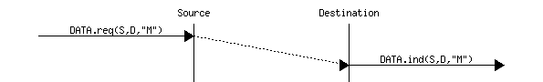

在研究这些实现之前，讨论无连接服务的可能特性是有用的。一个可靠的无连接服务是一种服务，服务提供商保证用户通过 Data.requests 提交的所有 SDU 最终将被交付到目的地。这种服务对用户非常有用，但在实践中保证完美的交付是困难的。因此，网络层通常支持不可靠的无连接服务。

与可靠的无连接服务相比，不可靠的无连接服务可能会遇到各种类型的问题。首先，不可靠的无连接服务不能保证所有 SDU 的交付。这可以通过下述时间序列图来图形化表示。

![msc {

a1 [label="", linecolour=white],

a [label="", linecolour=white],

b [label="源", linecolour=black],

z [label="", linecolour=white],

c [label="目的地", linecolour=black],

d [label="", linecolour=white],

d1 [label="", linecolour=white];

a1=>b [ label = "DATA.req(S,D,\"M\")" ] ,

b-x c [ label = "D(b)", arcskip="2", linecolour=red];

c=>d1 [ label = "",linecolour=white ];

}](../Images/177cb46396d45f08e9d7545e3154e18b.png)

在实践中，不可靠的无连接服务通常会交付大部分 SDU。然而，由于 SDU 的交付不能保证，用户必须能够从任何 SDU 的丢失中恢复。

另一个可能影响不可靠的无连接服务的不完美之处是它可能会重复 SDU。一些数据包可能在网络中被重复，并两次发送到目的地。下述时间序列图说明了这一点。

![msc {

a1 [label="", linecolour=white],

a [label="", linecolour=white],

b [label="源", linecolour=black],

z [label="", linecolour=white],

c [label="目的地", linecolour=black],

d [label="", linecolour=white],

d1 [label="", linecolour=white];

a1=>b [ label = "DATA.req(S,D,\"M\")" ] ,

b>>c [ label = "", arcskip="1"];

c=>d1 [ label = "DATA.ind(S,D,\"M\")" ];

z>>c [ label = "", arcskip="1"];

c=>d1 [ label = "DATA.ind(S,D,\"M\")" ];

}](../Images/f44769bd9ed127c07d494406222a612b.png)

最后，一些不可靠的无连接服务提供商可能会向目的地发送与在 Data.request 中提供的不同的 SDU。这在下图中有说明。

![msc {

a1 [label="", linecolour=white],

a [label="", linecolour=white],

b [label="源", linecolour=black].

z [label="", linecolour=white],

c [label="目的地", linecolour=black],

d [label="", linecolour=white],

d1 [label="", linecolour=white];

a1=>b [ label = "DATA.req(S,D,\"abc\")" ] ,

b>>c [ label = "", arcskip="1"];

c=>d1 [标签 = "DATA.ind(S,D,\"xyz\")"]; 

}](../Images/d960a02633797ef9170e30439eb112b8.png)

无连接传输服务允许网络应用程序交换消息。单个主机上可能同时运行多个网络应用程序。这些应用程序中的每一个都必须能够与远程应用程序交换 SDU。为了实现这些 SDU 的交换，运行在主机上的每个网络应用程序都通过以下信息进行标识：

> +   运行应用程序的主机
> +   
> +   应用程序监听数据所在的端口号

在互联网上，端口号是一个整数，主机通过其 IPv4 或 IPv6 地址进行标识。仅具有 IPv4 地址的主机无法与仅具有 IPv6 地址的主机通信。图 12 说明了两个应用程序正在使用 IPv4 地址的主机上由 UDP 提供的数据报服务。

> 
> 
> 图 12 无连接或数据报服务

### 连接型传输服务#

连接型服务的调用分为三个阶段。第一阶段是建立连接。连接是通过服务提供商在两个用户之间建立的一个临时关联。在任何一对用户之间可能同时存在多个连接。一旦建立，连接就用于传输 SDU。连接通常提供一条双向流，支持通过连接关联的两个用户之间 SDU 的交换。此流用于连接的第二阶段，即数据传输阶段。第三阶段是连接的终止。一旦用户完成交换 SDU，他们就会请求服务提供商终止连接。正如我们稍后将会看到的，也有一些情况下服务提供商可能需要自己终止连接。

建立连接可以通过使用四个原语来建模：Connect.request、Connect.indication、Connect.response 和 Connect.confirm。Connect.request 原语用于请求建立连接。此原语的主要参数是目标用户的地址。服务提供商将 Connect.indication 原语传递给目标用户，以通知其连接尝试。如果目标用户同意建立连接，则通过 Connect.response 原语进行响应。此时，连接被认为是建立的，并且目标用户可以开始通过连接发送 SDU。服务提供商处理 Connect.response 并将 Connect.confirm 传递给发起连接的用户。此原语的传递终止了连接建立阶段。此时，连接被认为是打开的，并且两个用户都可以发送 SDU。以下是一个成功的连接建立的示例。

![msc {

a1 [label="", linecolour=white],

a [label="", linecolour=white],

b [label="源", linecolour=black],

z [label="提供者", linecolour=white],

c [label="目标", linecolour=black],

d [label="", linecolour=white],

d1 [label="", linecolour=white];

a1=>b [ label = "CONNECT.req" ] ,

b>>c [ label = "", arcskip="1"];

c=>d1 [ label = "CONNECT.ind" ];

d1=>c [ label = "CONNECT.resp" ] ,

c>>b [ label = "", arcskip="1"];

b=>a1 [ label = "CONNECT.conf" ];

}](../Images/12de7a0d5f3487e2a782a5860da72cff.png)

上面的示例显示了一个成功的连接建立。然而，在实践中，并非所有连接都能成功建立。一个原因是目标用户可能不同意，出于策略或性能原因，在此时刻与发起用户建立连接。在这种情况下，目标用户通过包含表示连接被拒绝原因的参数的 Disconnect.request 原语来响应 Connect.indication 原语。然后，服务提供商将 Disconnect.indication 原语传递给发起用户。

![msc {

a1 [label="", linecolour=white],

a [label="", linecolour=white],

b [label="源", linecolour=black],

z [label="提供者", linecolour=white],

c [label="目标", linecolour=black],

d [label="", linecolour=white],

d1 [label="", linecolour=white];

a1=>b [ label = "CONNECT.req" ] ,

b>>c [ label = "", arcskip="1"];

c=>d1 [ label = "CONNECT.ind" ];

d1=>c [ label = "DISCONNECT.req" ] ,

c>>b [ label = "", arcskip="1"];

b=>a1 [ label = "DISCONNECT.ind" ];

}](../Images/d7cf3fe0981d29ac305e476158ad3202.png)

第二个原因是当服务提供商无法到达目标用户时。这可能是因为目标用户当前未连接到网络，或者由于拥塞。在这些情况下，服务提供商会对连接请求（Connect.request）响应一个断开连接指示（Disconnect.indication）原语，其理由参数包含有关连接失败附加信息的额外信息。

![msc {

a1 [label="", linecolour=white],

a [label="", linecolour=white],

b [label="Source", linecolour=black],

z [label="Provider", linecolour=white],

c [label="Destination", linecolour=black],

d [label="", linecolour=white],

d1 [label="", linecolour=white];

a1=>b [ label = "CONNECT.req" ] ,

b-x c [ label = "", arcskip="1"];

c-x b [ label="",linecolour=white];

b=>a1 [ label = "DISCONNECT.ind" ];

}](../Images/a6977804391f666738b97b912ff2c561.png)

一旦建立连接，服务提供商向通信用户供应两个数据流。第一个数据流可以被发起用户用来发送 SDU。第二个数据流允许响应用户向发起用户发送 SDU。数据流可以以不同的方式组织。第一种组织方式是消息模式传输。在消息模式传输中，服务提供商保证对于其他端点发出的每个数据请求（Data.request）原语，只向数据流端点传递一个且仅一个数据指示（Data.indication）。消息模式传输在下图所示。消息传输模式的主要优点是接收者接收到的 SDU 正好是其他用户发送的 SDU。如果每个 SDU 包含一个命令，接收用户可以在接收到 SDU 后立即处理每个命令。

![msc {

a1 [label="", linecolour=white],

a [label="", linecolour=white],

b [label="Source", linecolour=black],

z [label="Provider", linecolour=white],

c [label="Destination", linecolour=black],

d [label="", linecolour=white],

d1 [label="", linecolour=white];

a1=>b [ label = "CONNECT.req" ] ,

b>>c [ label = "", arcskip="1"];

c=>d1 [ label = "CONNECT.ind" ];

d1=>c [ label = "CONNECT.resp" ] ,

c>>b [ label = "", arcskip="1"];

b=>a1 [ label = "CONNECT.conf" ];

a1=>b [ label = "DATA.req(\"A\")" ] ,

b>>c [ label = "", arcskip="1"];

c=>d1 [ label = "DATA.ind(\"A\")" ];

a1=>b [ label = "DATA.req(\"BCD\")" ] ,

b>>c [ label = "", arcskip="1"];

c=>d1 [ label = "DATA.ind(\"BCD\")" ];

a1=>b [ label = "DATA.req(\"EF\")" ] ,

b>>c [ label = "", arcskip="1"];

c=>d1 [ label = "DATA.ind(\"EF\")" ];

}](../Images/2592ed60d53be2396fda0643ecb35744.png)

很遗憾，消息模式传输在互联网上并不常用。在互联网上，最流行的面向连接的服务以流模式传输 SDU。使用流模式，服务提供商提供一个字节流，将两个通信用户连接起来。发送用户通过包含字节序列的 SDU 作为原始数据请求来发送字节。服务提供商通过使用数据指示原始数据将包含连续字节的 SDU 传递给接收用户。服务提供商确保流一端发送的所有字节以相同的顺序正确地传递到流的另一端。然而，服务提供商并不试图保留 SDU 的边界。服务提供商之间没有强制执行与数据请求和数据指示原始数据数量之间的关系。流模式在下图中说明。实际上，流模式的使用导致的一个后果是，如果用户想要交换结构化的 SDU，他们需要提供允许接收用户在接收到的字节流中分离连续 SDU 的机制。应用层协议通常使用特定的分隔符，如行结束字符，在字节流中划分 SDU。

![msc {

a1 [label="", linecolour=white],

a [label="", linecolour=white],

b [label="源", linecolour=black],

z [label="提供者", linecolour=white],

c [label="目的地", linecolour=black],

d [label="", linecolour=white],

d1 [label="", linecolour=white];

a1=>b [ label = "CONNECT.req" ] ,

b>>c [ label = "", arcskip="1"];

c=>d1 [ label = "CONNECT.ind" ];

d1=>c [ label = "CONNECT.resp" ] ,

c>>b [ label = "", arcskip="1"];

b=>a1 [ label = "CONNECT.conf" ];

a1=>b [ label = "DATA.req(\"AB\")" ],

b>>c [ label = "", arcskip="1"];

c=>d1 [ label = "DATA.ind(\"A\")" ];

c=>d1 [ label = "DATA.ind(\"B\")" ];

a1=>b [ label = "DATA.req(\"CD\")" ] ,

b>>c [ label = "", arcskip="1"];

c=>d1 [ label = "DATA.ind(\"C\")" ];

a1=>b [ label = "DATA.req(\"EF\")" ] ,

b>>c [ label = "", arcskip="1"];

c=>d1 [ label = "DATA.ind(\"DEF\")" ];

}](../Images/2db37b2091c6c91af8c65803fadd75dc.png)

连接的第三阶段是其释放。由于连接涉及三方（两个用户和一个服务提供商），任何一方都可以请求终止连接。通常，数据传输完成后，一旦用户请求，就会终止连接。然而，有时服务提供商可能被迫终止连接。这可能是因为服务提供商内部资源不足，或者因为用户无法通过网络再访问。在这种情况下，服务提供商将向两个用户发出 Disconnect.indication 原语。这些原语将包含有关连接终止原因的一些信息。不幸的是，如图所示，当服务提供商被迫终止连接时，它不能保证每个用户发送的所有 SDU 都已传递给另一个用户。这种连接释放被称为突然释放，因为它可能导致数据丢失。

![msc {

a1 [label="", linecolour=white],

a [label="", linecolour=white],

b [label="源", linecolour=black],

z [label="提供者", linecolour=white],

c [label="目的地", linecolour=black],

d [label="", linecolour=white],

d1 [label="", linecolour=white];

a1=>b [ linecolour=white, textcolour=blue, label = "连接建立" ] ,

c=>d1 [ linecolour=white, textcolour=blue, label = "连接建立" ];

a1=>b [ label = "DATA.req(\"A\")" ],

b>>c [ label = "", arcskip="1"];

c=>d1 [ label = "DATA.ind(\"A\")" ];

a1=>b [ label = "DATA.req(\"B\")" ] ,

b-x z [ label = "", arcskip="1", linecolour=red];

a1=>b [ label = "", linecolour=white];

d1=>c [ label = "DATA.req(\"C\")" ] ,

c-x z [ label = "", arcskip="1", linecolour=red];

a1=>b [ label = "", linecolour=white];

b=>a1 [ linecolour=red, label = "DISCONNECT.ind" , textcolour=red] ,

c=>d1 [ linecolour=red, label = "DISCONNECT.ind", textcolour=red ];

}](../Images/e332fc75c845caae3e5d76447bc8fb22.png)

如果用户需要，出于任何原因，快速终止连接，可以发出 Disconnect.request 原语并请求突然释放。服务提供商将处理请求，停止两个数据流，并尽快将 Disconnect.indication 原语传递给远程用户。如图所示，这种突然的连接释放可能会导致 SDU 的丢失。

![msc {

a1 [label="", linecolour=white],

a [label="", linecolour=white],

b [label="源", linecolour=black],

z [label="提供者", linecolour=white],

c [label="目的地", linecolour=black],

d [label="", linecolour=white],

d1 [label="", linecolour=white];

a1=>b [ linecolour=white, textcolour=blue, label = "连接建立" ] ,

c=>d1 [ linecolour=white, textcolour=blue, label = "连接建立" ];

a1=>b [ label = "DATA.req(\"A\")" ],

b>>c [ label = "", arcskip="1"];

c=>d1 [ label = "DATA.ind(\"A\")" ];

a1=>b [ label = "DATA.req(\"B\")" ] ,

b-x z [ label = "", arcskip="1", linecolour=red];

a1=>b [ label = "", linecolour=white];

d1=>c [ label = "DATA.req(\"C\")" ] ,

c-x z [ label = "", arcskip="1", linecolour=red];

a1=>b [ label = "", linecolour=white];

a1=>b [ linecolour=red, label = "DISCONNECT.req(abrupt)" , textcolour=red] ,

b>>c [ label = "", arcskip="1",linecolour=red];

c=>d1 [ linecolour=red, label = "DISCONNECT.ind", textcolour=red ];

}](../Images/bcaa45e4382eb9e52c93458a974ea97e.png)

为了确保每个用户通过连接发送的 SDU（服务数据单元）的可靠交付，我们需要将构成连接的两个流视为独立的。一旦用户发送了它计划通过此连接发送的所有 SDU，它应该能够释放它用于发送 SDU 的流，但仍然可以通过相反的流接收 SDU。这种优雅的连接释放通常如图所示执行。一旦用户发出所有其 Data.request 原语，它就会向其提供者发出 Disconnect.request 原语。服务提供者将在发出 Disconnect.indication 原语之前等待所有 Data.indication 原语都已被发送到接收用户。此原语通知接收用户它将不再通过此连接接收 SDU，但它仍然能够在相反方向的流上发出 Data.request 原语。一旦用户发出所有其 Data.request 原语，它就会发出 Disconnect.request 原语以请求终止剩余的流。服务提供者将在发送所有挂起的 Data.indication 原语后处理请求并向另一个用户发送相应的 Disconnect.indication。此时，所有数据都已交付，两个流已成功释放，连接已完全关闭。

![msc {

a1 [label="", linecolour=white],

a [label="", linecolour=white],

b [label="Source", linecolour=black],

z [label="Provider", linecolour=white],

c [label="Destination", linecolour=black],

d [label="", linecolour=white],

d1 [label="", linecolour=white];

a1=>b [ linecolour=white, textcolour=blue, label = "Connection\nestablished" ] ,

c=>d1 [ linecolour=white, textcolour=blue, label = "Connection\nestablished" ];

a1=>b [ label = "DATA.req(\"A\")" ],

b>>c [ label = "", arcskip="1"];

c=>d1 [ label = "DATA.ind(\"A\")" ];

a1=>b [ label = "DATA.req(\"B\")" ],

b>>c [ label = "", arcskip="1"];

c=>d1 [ label = "DATA.ind(\"B\")" ];

a1=>b [ label = "DISCONNECT.req(graceful)",textcolour=red, linecolour=red ];

b>>c [ label = "", arcskip="1", linecolour=red];

c=>d1 [ label = "DISCONNECT.ind(graceful)",linecolour=red, textcolour=red ];

d1=>c [ label = "DATA.req(\"C\")" ] ,

c>>b [ label = "", arcskip="1"];

b=>a1 [label = "DATA.ind(\"C\")" ];

d1=>c [ label = "DISCONNECT.req(graceful)", textcolour=blue, linecolour=blue ] ,

c>>b [ label = "", arcskip="1", linecolour=blue];

b=>a1 [label = "DISCONNECT.ind(graceful)" ];

a1=>b [ linecolour=white, textcolour=blue, label = "Connection\nclosed" ] ,

c=>d1 [ linecolour=white, textcolour=blue, label = "Connection\nclosed" ];

}](../Images/93d7ca8af6d44432fde8748dc0e2f7d9.png)

注意

面向连接服务的可靠性

关于面向连接服务的一个重要观点是其可靠性。面向连接的服务只能保证在连接优雅地释放的情况下，所有 SDU 的正确交付。这意味着在连接活动期间，没有保证交换的 SDU 的实际交付，因为连接可能需要随时突然释放。

第二个传输服务是面向连接的服务。在互联网上，这种服务通常被称为字节流服务，因为它在通过传输连接连接的两个应用程序之间创建了一个可靠的字节流。像数据报服务一样，使用字节流服务的网络应用程序可以通过它们运行的宿主机和端口号来识别。这些宿主机可以通过地址或名称来识别。图 13 展示了两个正在使用在 IPv6 宿主机上由 TCP 协议提供的字节流服务的应用程序。TCP 提供的字节流服务是可靠且双向的。

> 
> 
> 图 13 面向连接或字节流服务

### 请求-响应服务#

请求-响应服务是无连接服务和面向连接服务之间的折中方案。许多应用程序需要发送少量数据并接收少量信息。这类似于编程语言中的过程调用。对过程的调用传递几个参数并返回一个简单的答案。在网络中，有时在另一台主机上执行一个过程并接收计算结果是有用的。在另一台主机上执行过程通常被称为远程过程调用。可以使用无连接服务来处理这种应用。然而，由于这种服务通常不可靠，这会迫使应用程序处理可能发生的任何类型的错误。使用面向连接的服务是另一种选择。这种服务确保数据的可靠交付，但在数据传输开始之前必须创建连接。对于仅交换少量数据的应用程序来说，这种开销可能很重要。

请求-响应服务允许在请求中高效地交换少量信息，并将其与相应的响应关联。此服务可以通过下面的时序图来表示。

> ![msc {
> 
> a [label="", linecolour=white],
> 
> b [label="主机 A", linecolour=black],
> 
> z [label="服务", linecolour=white],
> 
> c [label="主机 B", linecolour=black],
> 
> d [label="", linecolour=white];
> 
> a=>b [ label = "DATA.req(request)" ] ,
> 
> b>>c [ arcskip="1"];
> 
> c=>d [ label = "DATA.ind(request)" ];
> 
> d=>c [ label = "DATA.resp(response)" ] ,
> 
> c>>b [ arcskip="1"];
> 
> b=>a [ label = "DATA.confirm(response)" ];
> 
> }](../Images/414d09372f22c44dc624c0b21cae0fdc.png)

注意

服务和层

在前面的章节中，我们描述了传输层提供的服务。然而，需要注意的是，服务的概念比传输层更一般。如前所述，网络层也提供了一种服务，在大多数网络中这是一种不可靠的无连接服务。有些网络层提供面向连接的服务。同样，数据链路层也提供服务。有些数据链路层将提供无连接服务。例如，在局域网中就是这样。其他数据链路层，例如在公共网络中，提供面向连接的服务。

## 传输层#

传输层实体与应用层的用户和网络层进行交互。它提高了网络层服务，使其对应用程序可用。从应用程序的角度来看，网络层服务的主要限制来自其不可靠的服务：

> +   网络层可能会损坏数据；
> +   
> +   网络层可能会丢失数据；
> +   
> +   网络层可能无法按顺序交付数据；
> +   
> +   网络层对数据最大长度有一个上限；
> +   
> +   网络层可能会重复数据。

为了处理这些问题，传输层包括一些依赖于它所提供服务的机制。它与应用程序和底层网络层进行交互。


图 14 传输层、其用户及其网络层提供者之间的交互#

我们已经在数据链路层中描述了处理数据丢失和传输错误的机制。这些技术也用于传输层。

### 无连接传输#

在传输层可以提供的最简单的服务是无连接传输服务。与无连接网络层服务相比，此传输服务包括两个额外的特性：

> +   一种错误检测机制，可以检测损坏的数据
> +   
> +   一种多路复用技术，它使得一个主机上运行的多项应用能够与其他主机交换信息

为了交换数据，传输协议将其用户产生的 SDU 封装在段中。段是传输层中信息传输的单位。传输层实体总是交换段。当一个传输层实体创建一个段时，这个段被网络层封装成一个包含段的负载和网络头部的数据包。然后，这个数据包被封装在帧中，以便在数据链路层传输。

> 
> 
> 图 15 传输层的数据传输单位是段

段还包含控制信息，通常存储在头部和来自应用程序的有效负载中。为了检测传输错误，传输协议依赖于校验和或 CRC，就像数据链路层协议一样。

与无连接的网络层服务相比，传输层服务允许主机上运行的多项应用与远程主机上运行的其他多项应用交换 SDU。让我们考虑两个主机，例如一个客户端和一个服务器。网络层服务允许客户端向服务器发送信息，但如果客户端上运行的应用程序想要联系服务器上运行的一个特定应用程序，则需要额外的寻址机制。网络层地址标识一个主机，但它不足以区分主机上运行的应用程序。端口号提供了这种额外的寻址。当服务器应用程序在主机上启动时，它会注册一个端口号。这个端口号将被客户端用来联系服务器进程。

下图展示了端口号的典型用法。客户端进程使用端口号 1234，而服务器进程使用端口号 5678。当客户端发送请求时，它被识别为来自客户端主机的端口号 1234，并指向服务器主机的端口号 5678。当服务器进程回复此请求时，服务器的传输层将回复作为来自服务器主机的端口号 5678，并指向客户端主机的端口号 1234。

> 
> 
> 图 16 端口号的利用

### 用户数据报协议#

用户数据报协议（UDP）在[**RFC 768**](https://datatracker.ietf.org/doc/html/rfc768.html)中定义。它在上层不可靠的网络层无连接服务之上提供了一种不可靠的无连接传输服务。UDP 服务的主要特性包括：

> +   UDP 服务无法交付大于 65467 字节的 SDU [[1]](#fmtuudp)
> +   
> +   UDP 服务不保证 SDU 的交付（可能会发生丢失，SDU 可能会乱序到达）
> +   
> +   UDP 服务不会将损坏的 SDU 传递到目的地

与无连接的网络层服务相比，UDP 服务的主要优势是它允许主机上运行的应用程序与远程主机上运行的其他应用程序交换 SDU。让我们考虑两个主机，例如一个客户端和一个服务器。网络层服务允许客户端向服务器发送信息，但如果客户端上运行的应用程序想要联系服务器上运行的一个特定应用程序，那么除了标识主机的 IP 地址之外，还需要一个额外的寻址机制来区分主机上运行的应用程序。这种额外的寻址由端口号提供。当主机上启用了使用 UDP 的服务器时，该服务器注册一个端口号。这个端口号将被客户端用来通过 UDP 联系服务器进程。

图图 17 显示了 UDP 端口号的典型使用情况。客户端进程使用端口号 1234，而服务器进程使用端口号 5678。当客户端发送请求时，它被识别为来自客户端主机的端口号 1234，并指向服务器主机的端口号 5678。当服务器进程回复此请求时，服务器的 UDP 实现将回复作为来自服务器主机的端口号 5678，并指向客户端主机的端口号 1234。

> 
> 
> 图 17 UDP 端口号的使用

UDP 使用图图 18 所示的单一段格式。


图 18 UDP 头格式#

UDP 头包含四个字段：

> +   16 位源端口
> +   
> +   16 位目的端口
> +   
> +   16 位长度字段
> +   
> +   16 位校验和

由于端口号被编码为 16 位字段，因此同一服务器上最多只能有 65535 个不同的服务器进程绑定到不同的 UDP 端口。在实际应用中，这个限制从未达到。然而，值得注意的是，大多数实现将允许的 UDP 端口号范围分为三个不同的范围：

> +   特权端口号（1 < 端口 < 1024）
> +   
> +   临时端口号（官方定义为 [[2]](#fephemeral) 49152 <= 端口 <= 65535）
> +   
> +   已注册的端口号（官方定义为 1024 <= 端口 < 49152）

在大多数 Unix 变体中，只有具有系统管理员权限的进程才能绑定到小于 1024 的端口号。知名服务器，如 DNS、NNTP 或 RPC，使用特权端口号。当客户端需要使用 UDP 时，通常不需要特定的端口号。在这种情况下，UDP 实现将分配第一个可用的临时端口号。注册端口号的范围应由服务器使用。理论上，网络服务器的开发人员应通过 IANA 正式注册他们的端口号[[3]](#fportnum)，但很少有开发人员这样做。

UDP 可以在 IPv4 或 IPv6 上使用。当主机接收到一个 IP 数据包时，它需要确定这个数据包应该由 UDP 还是其他传输协议处理。这是通过使用 IPv4 头部中的协议字段来完成的。互联网编号分配机构(Internet Assigned Numbers Authority (IANA))维护一个[分配的互联网协议号注册表](https://www.iana.org/assignments/protocol-numbers/protocol-numbers.xhtml)，为每个可以包含在 IP 数据包内的协议分配一个整数。该注册表指定`17`被保留以指示 UDP 段。图图 19 显示了 IPv4 数据包内的 UDP 段。


图 19 包含空 UDP 段的 IPv4 数据包#

注意

UDP 校验和的计算

许多互联网协议使用在[**RFC 1071**](https://datatracker.ietf.org/doc/html/rfc1071.html)中定义的互联网校验和来检测传输错误。这个校验和由发送方计算并由接收方验证。在[**RFC 1071**](https://datatracker.ietf.org/doc/html/rfc1071.html)中定义的算法使用模运算。它在一个字节序列上计算，如果包含奇数个字节，则进行填充。校验和是 16 位字和的模$ 2¹⁶ $的一的补码。下面的 Python 代码计算互联网校验和。

> ```sh
> def  internet_checksum(data: bytes) -> int:
>   """
>  Compute the Internet Checksum of the supplied data.
>  :param data: The input data as bytes
>  :return: The checksum as an integer (16-bit)
>  """
>     if len(data) % 2:
>       data += b'\x00'  # pad to even length
> 
>     checksum = 0
>     for i in range(0, len(data), 2):
>         word = (data[i] << 8) + data[i+1]
>         checksum += word
>         # carry around
>         checksum = (checksum & 0xFFFF) + (checksum >> 16)
> 
>     return ~checksum & 0xFFFF  # one's complement
> 
> # Example usage
> if __name__ == "__main__":
>     test_data = b"a sequence of bytes"
>     chk = internet_checksum(test_data)
>     print(f"Checksum: 0x{chk:04X}") 
> ```

用于计算 UDP 段校验和的字节数组包含：

> +   一个包含源地址、目的地址、以 32 位数字编码的包长度以及一个 32 位位字段（三个最高有效字节设置为 0，最低有效字节设置为 17）的伪头部[**RFC 2460**](https://datatracker.ietf.org/doc/html/rfc2460.html)
> +   
> +   整个 UDP 段，包括其头部

许多类型的应用程序依赖于 UDP。一般来说，UDP 用于需要最小化延迟或应用程序本身可以恢复丢失的应用程序。基于 UDP 的第一类应用程序是客户端发送简短请求并期望快速简短回答的应用程序。DNS 是广泛使用的一种 UDP 应用程序的例子。然而，在局域网中，许多分布式系统依赖于通常在 UDP 之上使用的远程过程调用(RPC)。在 Unix 环境中，网络文件系统(NFS)建立在 RPC 之上，并经常在 UDP 之上运行。基于 UDP 的第二类应用程序是需要频繁交换小消息的交互式计算机游戏，例如玩家的位置或他们的最近动作。许多这些游戏使用 UDP 来最小化延迟并从丢失中恢复。第三类应用程序是多媒体应用程序，如交互式 VoIP 或交互式 VoIP 视频。这些交互式应用程序期望发送者和接收者之间有小于约 200 毫秒的延迟，并且可以直接在应用程序中恢复丢失。

脚注

### 无连接传输#

传输层可以提供的最简单服务是无连接传输服务。与无连接网络层服务相比，这种传输服务包括两个附加功能：

> +   一种错误检测机制，允许检测损坏的数据
> +   
> +   一种允许多个运行在一个主机上的应用程序与另一个主机交换信息的复用技术

为了交换数据，传输协议将其用户产生的 SDU 封装在段中。段是传输层中信息传输的单位。传输层实体总是交换段。当一个传输层实体创建一个段时，这个段被网络层封装成一个包含段的负载和网络头部的数据包。然后，这个数据包被封装在帧中，以便在数据链路层传输。

> 
> 
> 图 15 传输层的数据传输单位是段

段还包含控制信息，通常存储在头部和来自应用程序的有效负载中。为了检测传输错误，传输协议依赖于校验和或 CRC，就像数据链路层协议一样。

与无连接的网络层服务相比，传输层服务允许主机上运行的多达几个应用程序与其他主机上运行的多达几个其他应用程序交换 SDU。让我们考虑两个主机，例如客户端和服务器。网络层服务允许客户端向服务器发送信息，但如果客户端上运行的应用程序想要联系服务器上运行的一个特定应用程序，则需要额外的寻址机制。网络层地址标识一个主机，但不足以区分主机上运行的应用程序。端口号提供了这种额外的寻址。当服务器应用程序在主机上启动时，它会注册一个端口号。这个端口号将被客户端用来联系服务器进程。

下图展示了端口号的典型用法。客户端进程使用端口号 1234，而服务器进程使用端口号 5678。当客户端发送请求时，它被识别为来自客户端主机的端口号 1234，并指向服务器主机的端口号 5678。当服务器进程回复此请求时，服务器的传输层将回复返回为来自服务器主机的端口号 5678，并指向客户端主机的端口号 1234。

> 
> 
> 图 16 端口号的利用

### 用户数据报协议#

用户数据报协议（UDP）在[**RFC 768**](https://datatracker.ietf.org/doc/html/rfc768.html)中定义。它在上层不可靠的网络层无连接服务之上提供不可靠的无连接传输服务。UDP 服务的主要特性包括：

> +   UDP 服务无法交付大于 65467 字节的 SDU [[1]](#fmtuudp)
> +   
> +   UDP 服务不保证 SDU（数据单元）的交付（可能会发生丢失，SDU 可能会乱序到达）
> +   
> +   UDP 服务不会将损坏的 SDU 交付到目的地

与无连接的网络层服务相比，UDP 服务的主要优势是它允许主机上运行的多达几个应用程序与其他主机上运行的多达几个其他应用程序交换 SDU。让我们考虑两个主机，例如客户端和服务器。网络层服务允许客户端向服务器发送信息，但如果客户端上运行的应用程序想要联系服务器上运行的一个特定应用程序，那么除了标识主机的 IP 地址之外，还需要额外的寻址机制来区分主机上运行的应用程序。这种额外的寻址由端口号提供。当在主机上启用 UDP 服务器时，此服务器会注册一个端口号。这个端口号将被客户端用来通过 UDP 联系服务器进程。

图 图 17 展示了 UDP 端口号的典型用法。客户端进程使用端口号 1234，而服务器进程使用端口号 5678。当客户端发送请求时，它被识别为来自客户端主机的端口号 1234，并指向服务器主机的端口号 5678。当服务器进程回复此请求时，服务器的 UDP 实现将回复发送为来自服务器主机的端口号 5678，并指向客户端主机的端口号 1234。

> 
> 
> 图 17 UDP 端口号的用法

UDP 使用图 图 18 中所示的单一段格式。


图 18 UDP 头格式#

UDP 头包含四个字段：

> +   16 位源端口
> +   
> +   16 位目的端口
> +   
> +   16 位长度字段
> +   
> +   16 位校验和

由于端口号被编码为 16 位字段，因此同一服务器上最多只能有 65535 个不同的服务器进程绑定到不同的 UDP 端口。在实践中，这个限制从未达到。然而，值得注意的是，大多数实现将允许的 UDP 端口号范围分为三个不同的范围：

> +   特权端口号（1 < 端口 < 1024）
> +   
> +   临时端口号（官方规定 [[2]](#fephemeral) 49152 <= 端口 <= 65535）
> +   
> +   已注册的端口号（官方规定 1024 <= 端口 < 49152）

在大多数 Unix 变体中，只有具有系统管理员权限的进程才能绑定到小于 1024 的端口号。知名服务器如 DNS、NNTP 或 RPC 使用特权端口号。当客户端需要使用 UDP 时，通常不需要特定的端口号。在这种情况下，UDP 实现将分配临时范围内的第一个可用端口号。服务器应使用已注册端口号的范围。理论上，网络服务器的开发人员应通过 IANA [[3]](#fportnum) 正式注册他们的端口号，但很少有开发人员这样做。

UDP 可以在 IPv4 或 IPv6 上使用。当主机接收到 IP 数据包时，它需要确定该数据包是否应由 UDP 或其他传输协议处理。这是通过使用 IPv4 头中的协议字段来完成的。互联网名称和数字地址分配机构（IANA）维护一个[分配的互联网协议号注册表](https://www.iana.org/assignments/protocol-numbers/protocol-numbers.xhtml)，为每个可以包含在 IP 数据包内的协议分配一个整数。此注册表指定`17`被保留以指示 UDP 段。图 图 19 展示了 IPv4 数据包内的 UDP 段。

(../_images/udp-ipv4.svg)

图 19 包含空 UDP 数据段的 IPv4 数据包#

注意

UDP 校验和的计算

许多互联网协议使用在[**RFC 1071**](https://datatracker.ietf.org/doc/html/rfc1071.html)中定义的互联网校验和来检测传输错误。这个校验和由发送者计算并由接收者验证。在[**RFC 1071**](https://datatracker.ietf.org/doc/html/rfc1071.html)中定义的算法使用模运算。它是在一个字节序列上计算的，如果包含奇数个字节，则进行填充。校验和是 16 位字和的模$ 2¹⁶ $的一的补码。下面的 Python 代码计算互联网校验和。

> ```sh
> def  internet_checksum(data: bytes) -> int:
>   """
>  Compute the Internet Checksum of the supplied data.
>  :param data: The input data as bytes
>  :return: The checksum as an integer (16-bit)
>  """
>     if len(data) % 2:
>       data += b'\x00'  # pad to even length
> 
>     checksum = 0
>     for i in range(0, len(data), 2):
>         word = (data[i] << 8) + data[i+1]
>         checksum += word
>         # carry around
>         checksum = (checksum & 0xFFFF) + (checksum >> 16)
> 
>     return ~checksum & 0xFFFF  # one's complement
> 
> # Example usage
> if __name__ == "__main__":
>     test_data = b"a sequence of bytes"
>     chk = internet_checksum(test_data)
>     print(f"Checksum: 0x{chk:04X}") 
> ```

用于计算 UDP 数据段校验和的字节数组包含：

> +   包含源地址、目的地址、以 32 位数字编码的包长度以及一个 32 位位字段（三个最高字节设置为 0，最低字节设置为 17）的伪头部[**RFC 2460**](https://datatracker.ietf.org/doc/html/rfc2460.html)
> +   
> +   整个 UDP 数据段，包括其头部

几种类型的应用依赖于 UDP。一般来说，UDP 用于需要最小化延迟或应用本身可以恢复丢失的应用。基于 UDP 的第一类应用是客户端发送简短请求并期望快速简短回答的应用。DNS（域名系统）是广泛使用的一个 UDP 应用示例。然而，在局域网中，许多分布式系统依赖于通常在 UDP 之上使用的远程过程调用（RPC）。在 Unix 环境中，网络文件系统（NFS）建立在 RPC 之上，并经常在 UDP 之上运行。基于 UDP 的第二类应用是需要频繁交换小消息的交互式计算机游戏，例如玩家的位置或他们的最近动作。许多这些游戏使用 UDP 来最小化延迟并能够从丢失中恢复。第三类应用是多媒体应用，如交互式 VoIP 或交互式 VoIP 视频。这些交互式应用期望发送者和接收者之间延迟短于大约 200 毫秒，并且可以直接在应用中恢复丢失。

脚注
