# 网络应用程序

> [`4ed.computer-networking.info/syllabus/default/hosts/applications.html`](https://4ed.computer-networking.info/syllabus/default/hosts/applications.html)

网络应用程序中有两种重要的模型用于组织。第一个也是最古老的模型是客户端-服务器模型。在这个模型中，服务器为与它交换信息的客户端提供服务。这个模型高度不对称：客户端发送请求，服务器执行操作并返回响应。这可以通过图 20 来说明。

> 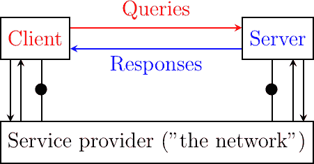
> 
> 图 20 客户端-服务器模型

客户端-服务器模型是第一个用于开发网络应用程序的模型。这个模型自然来源于 20 世纪 80 年代之前唯一使用的网络计算机——大型机和小型机。小型机是一个多用户系统，同时被数十个或更多的用户使用。每个用户通过终端与小型机交互。这样的终端主要是一个屏幕、一个键盘和直接连接到小型机的电缆。

服务器和客户端都有各种类型。一个 Web 服务器对其客户端发送的查询提供信息。一个打印服务器打印客户端发送的查询文档。一个电子邮件服务器将作为查询发送的电子邮件消息转发给其收件人。一个音乐服务器提供客户端请求的音乐。从应用开发者的角度来看，客户端和服务器应用程序直接交换消息（如图中标记为查询和响应的水平箭头），但在实践中，这些消息是通过底层（如图中垂直箭头所示）交换的。在本章中，我们关注这些水平消息交换。

网络应用程序不会交换随机消息。为了确保服务器能够理解客户端发送的查询，并且客户端能够理解服务器发送的响应，它们必须就一套句法和语义规则达成一致。这些规则定义了交换消息的格式以及它们的顺序。这套规则被称为应用层协议。

应用层协议类似于人类之间的结构化对话。假设 Alice 想知道当前时间，但没有手表。如果 Bob 经过，可能会发生以下对话：

> +   Alice : 你好
> +   
> +   Bob : 你好
> +   
> +   Alice : 现在几点了？
> +   
> +   Bob : 11:55
> +   
> +   Alice : 谢谢
> +   
> +   Bob : 不客气

这样的对话如果 Alice 和 Bob 说的是同一种语言就会成功。如果 Alice 遇到只会说中文的 Tchang，她将无法询问他当前时间。人类之间的对话可能更复杂。例如，假设 Bob 是一名保安，他的职责是只允许信任的秘密特工进入会议室。如果所有特工都知道一个秘密密码，Bob 和 Trudy 之间的对话可能如下：

> +   Bob：什么才是秘密密码？
> +   
> +   Trudy：1234
> +   
> +   Bob：这是正确的密码，不客气

如果 Alice 想进入会议室但不知道密码，她的对话可能如下：

> +   Bob：什么才是秘密密码？
> +   
> +   Alice：3.1415
> +   
> +   Bob：这不是正确的密码。

人类对话可以是非常正式的，例如当士兵与他们的指挥层沟通时，或者非正式的，例如当朋友讨论时。通信的计算机更类似于士兵，需要明确的规定来确保信息交换的成功。定义信息如何在计算机之间交换的规则有两种：

> +   精确定义交换消息格式的句法规则。由于计算机只处理比特，句法规则指定了信息如何编码为比特串。
> +   
> +   信息流的组织。对于许多应用，信息流必须是有结构的，并且不同类型的信息之间存在优先级关系。在上面的时间例子中，Alice 必须在询问当前时间之前问候 Bob。Alice 不会先询问当前时间，然后才问候 Bob。网络应用中也存在这样的优先级关系。例如，服务器必须在接收用户名和有效密码之后，才能接受来自其客户端的更复杂的命令。

让我们先讨论句法规则。我们将在分析真实网络应用后解释如何组织信息流。

应用层协议交换两种类型的消息。一些协议，如用于支持电子邮件交换的协议，将消息表示为字符串或字符行。由于传输层允许主机交换字节，它们需要就字符的通用表示达成一致。编码字符的第一种和最简单的方法是使用 ASCII 表。[**RFC 20**](https://datatracker.ietf.org/doc/html/rfc20.html)提供了许多互联网协议使用的 ASCII 表。例如，该表定义了以下二进制表示：

> +   A：1000011b
> +   
> +   0：0110000b
> +   
> +   z：1111010b
> +   
> +   @：1000000b
> +   
> +   空间：0100000b

此外，ASCII 表还定义了几个不可打印或控制字符。这些字符被设计用来允许一个应用程序控制打印机或终端。这些控制字符包括用于结束行的回车符 (CR) 和换行符 (LF)，以及引起终端发出声音的铃声字符。

> +   回车符 (CR) : 0001101b
> +   
> +   换行符 (LF) : 0001010b
> +   
> +   铃声: 0000111b

ASCII 字符被编码为七位字段，但以八位字节的形式传输，其最高位通常设置为 0。字节总是从最高位或最显著位开始传输。

大多数应用程序交换由固定或可变数量的字符组成的字符串。定义可接受的字符字符串的常见解决方案是使用 Backus-Naur 形式 (BNF) 定义语法，例如在 [**RFC 5234**](https://datatracker.ietf.org/doc/html/rfc5234.html) 中定义的增强 BNF。BNF 是一组生成所有有效字符字符串的生产规则。例如，考虑一个使用两个命令的联网应用程序，用户可以提供用户名和密码。该应用程序的 BNF 可以定义如图 21 所示。


图 21 简单的 BNF 规范#

上面的示例定义了几个终端和两个命令：usercommand 和 passwordcommand。ALPHA 终端包含所有大写和小写字母。在 ALPHAR 规则中，%x41 对应于十六进制的 ASCII 字符代码 41，即大写字母 A。CR 和 LF 终端对应于回车和换行控制字符。CRLF 规则将这两个终端连接起来以匹配标准的行结束终止符。DIGIT 终端包含所有数字。SP 终端对应于空白字符。usercommand 由两个由空格分隔的字符串组成。在定义互联网应用程序使用的消息的 ABNF 规则中，命令是不区分大小写的。规则“user”对应于构成方括号内单词的所有可能字母的大小写，例如 user, uSeR, USER, usER，…… 用户名至少包含一个字母，最多 8 个字母。用户名是区分大小写的，因为它们没有被定义为括号内的字符串。密码规则表示密码以字母开头，可以包含任意数量的字母或数字。根据上述规则定义的密码中不允许出现空白字符和控制字符。

除了字符串之外，一些应用还需要交换 16 位和 32 位字段，如整数。一个简单的解决方案是将 16 位或 32 位字段按其在主机内存中的编码方式发送。不幸的是，在内存中存储 16 位或 32 位字段的方法有很多。一些 CPU 将 16 位字段的最显著字节存储在字段的第一地址，而其他 CPU 则将最低有效字节存储在这个位置。当运行在不同 CPU 上的网络应用交换 16 位字段时，有两种可能性将它们通过传输服务传输：

> +   先发送最高有效字节，然后是最低有效字节
> +   
> +   先发送最低有效字节，然后是最高有效字节

第一种可能性在科恩（Cohen）的笔记中被命名为大端序，而第二种被命名为小端序。使用大端序内存的 CPU 供应商坚持在网络应用中使用大端序编码，而使用小端序的 CPU 供应商则推荐相反的做法。关于每种编码相对优缺点的几项研究被撰写出来，但讨论几乎变成了一个宗教问题 [[Cohen1980]](../bibliography.html#cohen1980)。最终，互联网选择了大端序编码，即多字节字段总是通过先发送最高有效字节来传输，[**RFC 791**](https://datatracker.ietf.org/doc/html/rfc791.html) 将这种编码称为 网络字节序。大多数用于编写网络应用的库 [[9]](#fhtonl) 都包含将多字节字段从内存转换为网络字节序以及反向转换的函数。

除了 16 位和 32 位字之外，一些应用还需要交换包含各种长度位字段的复杂数据结构。例如，一个消息可能由一个 16 位字段、八个一位标志、一个 24 位字段和两个 8 位字节组成。互联网协议规范将使用如图 22 所示的表示法来定义此类消息。在这个表示法中，每一行对应 32 位，垂直线用于划分字段。线条上方的数字表示 32 位字中的位位置，最高位在位置 0。


图 22 消息格式#

上文提到的消息将按照网络字节序从最高 32 位字开始传输。第一个字段以 16 位编码。其后是八个一位标志（A-H），一个 24 位字段，其高位字节显示在第一行，两个低位字节显示在第二行，接着是两个单字节字段。这种 ASCII 表示法在定义二进制协议时经常被使用。我们将用它来讨论本书中所有讨论的二进制协议。

在过去十年中，对等模型作为网络应用程序的另一种可能架构出现。在传统的客户端-服务器模型中，主机要么充当服务器，要么充当客户端，服务器为大量客户端提供服务。在对等模型中，所有主机都既是服务器又是客户端，并扮演这两个角色。对等模型已被用于开发各种网络应用程序，从互联网电话到文件共享或互联网级文件系统。有关对等应用的详细描述，请参阅[[BYL2008]](../bibliography.html#byl2008)。有关对等协议和应用的调查，请参阅[[AS2004]](../bibliography.html#as2004)和[[LCP2005]](../bibliography.html#lcp2005)。

## 命名和寻址#

网络和传输层依赖于编码为固定大小位字符串的地址。网络层地址唯一标识一个主机。多个传输层实体可以使用同一网络层的服务。例如，可靠的传输协议和无连接的传输协议可以在同一主机上共存。在这种情况下，网络层将这两个协议产生的段进行多路复用。这种多路复用通常是通过在网络数据包头部放置一个字段来实现的，该字段指示哪个传输协议应该处理该段。鉴于不同的传输协议很少，这个字段不需要很长。端口号在传输层中也扮演着类似的角色，因为它们使传输层能够多路复用来自多个应用程序进程的数据。

虽然地址对于网络和传输层实体来说是自然的，但人类在与网络服务交互时更喜欢使用名称。名称可以编码为字符串，映射服务允许应用程序将名称映射到相应的地址。使用名称对人类来说更加友好，但它也提供了一种间接性，这在许多情况下非常有用。

在互联网的早期，只有少数主机（主要是小型计算机）连接到网络。最受欢迎的应用程序是远程登录和文件传输。到 1983 年，已有五百台主机连接到互联网[[Zakon]](../bibliography.html#zakon)。这些主机中的每一台都有一个唯一的地址。强迫用户记住他们想要使用的宿主机的地址并不友好。人类更喜欢记住名称并在需要时使用它们。将名称用作地址的别名是计算机科学中的一种常见技术。它简化了应用程序的开发，并允许开发者忽略低级细节。例如，通过使用编程语言而不是编写机器代码，开发者可以编写软件而无需知道它所使用的变量是存储在内存中还是寄存器内。

由于名称位于地址之上，它们允许（在上述编程示例和互联网上）将地址视为仅是技术标识符，可以随意更改。只有名称是稳定的。

首个允许应用程序使用名称的解决方案是 hosts.txt 文件。此文件类似于编译代码中找到的符号表。它包含每个互联网主机名称与其相关地址之间的映射 [[1]](#fhosts)。该文件由 SRI 国际网络信息中心（NIC）维护。当新的主机连接到网络时，系统管理员必须在 NIC 上注册其名称和地址。NIC 会更新其服务器上的 hosts.txt 文件。所有互联网主机定期从[SRI](https://www.sri.com)服务器检索更新的 hosts.txt 文件。此文件存储在每个互联网主机的一个知名位置（见[**RFC 952**](https://datatracker.ietf.org/doc/html/rfc952.html)），网络应用程序可以使用它来查找与名称对应的地址。

当网络上有数百个主机时，可以使用 hosts.txt 文件。然而，显然它不适用于包含数千或数百万主机的网络。大型网络中的一个关键问题是定义一个合适的命名方案。ARPANet 最初使用平面命名空间，即每个主机都被分配了一个唯一的名称。为了限制名称之间的冲突，这些名称通常包含机构的名称以及一个后缀来识别机构内的主机（一种简陋的分层命名方案）。在 ARPANet 上，很少有机构有多个主机连接到网络。

然而，在 ARPANet 结束之前，扁平命名方案的局限性变得明显，[**RFC 819**](https://datatracker.ietf.org/doc/html/rfc819.html)提出了分层命名方案。虽然[**RFC 819**](https://datatracker.ietf.org/doc/html/rfc819.html)讨论了将名称组织为有向图的可能性，但互联网选择了能够包含所有名称的树状结构。在这个树中，顶级域名是直接连接到根的。第一个顶级域名是.arpa [[2]](#fdnstimeline)。这个顶级名称最初被添加为 ARPANet 上连接的主机名称的后缀，并在 hosts.txt 文件中列出。1984 年，添加了.gov、.edu、.com、.mil 和.org 等通用顶级域名。[**RFC 1032**](https://datatracker.ietf.org/doc/html/rfc1032.html)提出了使用两字母 ISO-3166 国家代码作为顶级域名的建议。由于 ISO-3166 为联合国认可的每个国家定义了一个两字母代码，这允许所有国家自动拥有顶级域名。这些域名包括比利时为.be，法国为.fr，美国为.us，爱尔兰为.ie，或图瓦卢为.tv，这是一个太平洋上的小岛群，或土库曼斯坦为.tm。顶级域名集合由互联网名称与数字地址分配机构(ICANN)管理。ICANN 添加了与国家无关的通用顶级域名，并为加泰罗尼亚语注册了.cat 顶级域名。在 ICANN 内部正在进行增加顶级域名数量的讨论。

每个顶级域名由一个组织管理，该组织决定子域名名称的注册方式。大多数顶级域名使用先到先得系统，允许任何人注册域名，但也有例外。例如，.gov 是为美国政府保留的，.int 是为国际组织保留的，而.ca 中的名称主要[保留](http://en.wikipedia.org/wiki/.ca)给在加拿大存在的公司或用户。

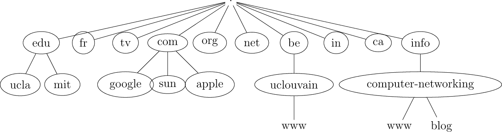

图 23 域名树

域名语法在[**RFC 1035**](https://datatracker.ietf.org/doc/html/rfc1035.html)中被定义得更加精确。本文件推荐以下 BNF 用于完全限定的域名（域名本身具有更丰富的语法）。

列表 1 完全限定主机名的 BNF#

```sh
domain  ::=  subdomain  |  " "
subdomain  ::=  label  |  subdomain  "."  label
label  ::=  letter  [  [  ldh-str  ]  let-dig  ]
ldh-str  ::=  let-dig-hyp  |  let-dig-hyp  ldh-str
let-dig-hyp  ::=  let-dig  |  "-"
let-dig  ::=  letter  |  digit
letter  ::=  any  one  of  the  52  alphabetic  characters  A  through  Z  in  upper  case  and  a  through  z  in  lower  case
digit  ::=  any  one  of  the  ten  digits  0  through  9 
```

此语法指定主机名是由点（.）字符分隔的标签有序列表。每个标签可以包含字母、数字和连字符字符 (-) [[3]](#fidn)。完全限定的域名从左到右读取。第一个标签是主机名或域名，后面跟着域的层次结构，并以右侧隐含的根结束。顶级域名必须是已注册的 TLD 之一 [[4]](#ftld)。例如，在上面的图中，www.computer-networking.info 对应于 info 顶级域中 computer-networking 域内的一个名为 www 的主机。

注意

一些视觉上相似的字符有不同的字符代码

域名系统是在互联网主要在北美使用的时候创建的。最初的设计假设所有域名都由字母和数字组成 [**RFC 1035**](https://datatracker.ietf.org/doc/html/rfc1035.html)。随着互联网在其他地区的使用增长，支持非 ASCII 字符变得很重要。为此，对域名系统提出了扩展 [**RFC 3490**](https://datatracker.ietf.org/doc/html/rfc3490.html)。简而言之，用于支持国际化域名的解决方案工作原理如下。首先，可以使用大多数 Unicode 字符来编码域名和主机名，但有少数例外（例如，点字符不能是名称的一部分，因为它用作分隔符）。一旦域名被编码为一系列 Unicode 字符，它就会被转换成一个包含 `xn--` 前缀和一系列 ASCII 字符的字符串。有关这些算法的更多详细信息，请参阅[**RFC 3490**](https://datatracker.ietf.org/doc/html/rfc3490.html)和[**RFC 3492**](https://datatracker.ietf.org/doc/html/rfc3492.html)。

使用所有 Unicode 字符创建域名的新形式攻击被称为[同音攻击](https://en.wikipedia.org/wiki/IDN_homograph_attack)。这种攻击发生在两个字符串或域名在视觉上相似，但并不对应同一服务器时。一个简单的例子是[`G00GLE.COM`](https://G00GLE.COM)和[`GOOGLE.COM`](https://GOOGLE.COM)。这两个 URL 在视觉上非常接近，但它们对应不同的名称（第一个不指向有效的服务器 [[5]](#fg00gle)）。使用其他 Unicode 字符，可以构建与现有域名在视觉上等效的域名。有关此攻击的更多详细信息，请参阅[[Zhe2017]](../bibliography.html#zhe2017)。

这种分层命名方案是域名系统（DNS）的关键组成部分。DNS 是一个分布式数据库，包含完全合格域名与地址之间的映射。DNS 使用客户端-服务器模型。客户端是需要检索给定名称映射的主机或应用程序。每个 域名服务器 存储分布式数据库的一部分，并回答客户端发送的查询。每个域名至少有一个 域名服务器 负责处理。如图所示，域名用圆圈表示，在域名 dom 内有三个主机（h1、h2 和 h3），在域名 a.sdom1.dom 内有三个主机。如图所示，子域名可能包含主机名和子域名。

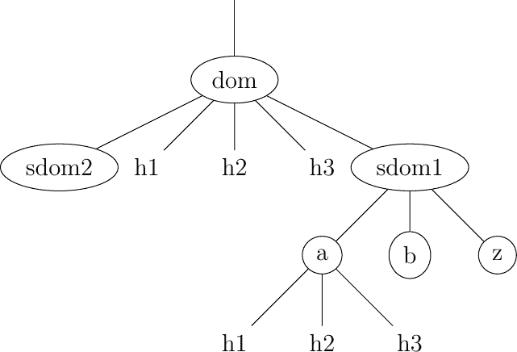

图 24 域名简单树

负责域名 dom 的 域名服务器 可以直接回答以下查询：

> +   直接位于域名 dom 内的任何主机的地址（例如，图中的 h2.dom）
> +   
> +   负责域名 dom 任何直接子域的域名服务器（即图中的 sdom1.dom 和 sdom2.dom，但不包括 z.sdom1.dom）

要检索主机 h2.dom 的映射，客户端将查询发送到负责 .dom 域的域名服务器。域名服务器直接回答查询。要检索 h3.a.sdom1.dom 的映射，DNS 客户端首先向负责 .dom 域的域名服务器发送查询。此域名服务器返回负责 sdom1.dom 域域的域名服务器。现在可以通过联系此域名服务器来获取负责 a.sdom1.dom 域域的域名服务器。此域名服务器可以用来检索 h3.a.sdom1.dom 名称的映射。多亏了这种结构，DNS 客户端可以获取 .dom 域及其子域名中任何主机的映射。为了确保任何 DNS 客户端都能解析任何完全合格域名，存在专门负责域名名称层次结构根部的域名服务器。这些域名服务器被称为 根域名服务器。

每个根域名服务器维护着所有负责每个顶级域名及其地址的域名服务器的列表 [[6]](#froot)。所有根域名服务器协同工作并提供相同的答案。通过查询任何一个根域名服务器，DNS 客户端可以获取负责任何顶级域名名称的域名服务器。从这个域名服务器，可以解析任何域名。

为了能够联系根名称服务器，每个 DNS 客户端都必须知道它们的地址。这意味着 DNS 客户端必须维护根名称服务器地址的最新列表。没有这个列表，就无法联系根名称服务器。强制所有互联网主机维护这个列表的最新版本在操作上会很困难。为了解决这个问题，DNS 的设计者引入了一种特殊的 DNS 服务器类型：DNS 解析器。一个解析器是为一组客户端提供名称解析服务的服务器。一个网络通常包含几个解析器。这些网络中的每个主机都被配置为通过其本地解析器发送所有的 DNS 查询。这些查询被称为递归查询，因为解析器必须递归地向名称服务器层次结构发送请求以获得答案。

DNS 解析器相对于让每个互联网主机直接查询名称服务器有几个优势。首先，常规互联网主机不需要维护根服务器的地址列表。其次，常规互联网主机不需要向互联网上的所有名称服务器发送查询。此外，由于 DNS 解析器为大量主机提供服务，它可以缓存收到的答案。这使得解析器能够快速返回常见 DNS 查询的答案，并减少所有 DNS 服务器的负载 [[JSBM2002]](../bibliography.html#jsbm2002)。

### 名称的好处#

除了更符合人性化的设计外，在应用程序中使用名称而不是地址还有几个重要的好处。为了理解这些好处，让我们考虑一个提供存储在服务器上信息的流行应用程序。这个应用程序涉及客户端和服务器。服务器根据客户端进程的请求提供信息。这个应用程序的第一个部署方案是仅依赖于地址。在这种情况下，服务器进程将安装在一台主机上，客户端将连接到这台服务器以检索信息。这种部署方案有几个缺点：

> +   如果服务器进程转移到另一台物理服务器，所有客户端都必须被告知新的服务器地址。
> +   
> +   如果有大量并发客户端，服务器负载会增加，而没有任何可能在不更改客户端使用的服务器地址的情况下添加另一个服务器。

使用名称解决了这些问题，并提供了额外的优势。如果客户端配置了服务器的名称，它们将在联系服务器之前查询名称服务。名称服务将解析名称为相应的地址。如果一个服务器进程需要从一个物理服务器移动到另一个物理服务器，只需更新名称服务上的名称到地址映射，就可以允许所有客户端连接到新的服务器。名称服务还使服务器能够更好地承受负载。假设一个非常受欢迎的服务器，被数百万用户访问。由于性能限制，这项服务不能由单个物理服务器提供。多亏了名称的使用，可以通过将给定的名称映射到一组地址来扩展这项服务。当客户端查询名称服务以获取服务器的名称时，名称服务返回该组中的一个地址。可以使用各种策略来选择地址集中的特定地址。第一种策略是在集合中随机选择一个地址。第二种策略是维护有关服务器负载的信息，并返回负载较轻的服务器的地址。请注意，服务器地址列表不需要保持固定。可以添加和删除地址以应对负载波动。另一种策略是从名称请求中推断客户端的位置，并返回最近的服务器地址。

将单个名称映射到一组地址允许流行的服务器动态扩展。将多个名称，可能是一大批名称，映射到单个地址也有好处。考虑个人或中小企业运行的信息服务器的情况。其中一些服务器每天只吸引少数客户。为每个这样的服务使用单个物理服务器将是资源的浪费。更好的方法是使用单个服务器为多个服务提供服务，这些服务都由不同的名称标识。这使得服务提供商能够在单个物理服务器上支持大量由不同名称标识的服务进程。如果这些服务进程中的一个变得非常受欢迎，就有可能将其名称映射到一组地址，以便能够承受负载。有些部署中，这种映射是动态地在负载函数下进行的。

与地址相比，名称提供了很多灵活性。对于网络来说，它们在编程语言中的作用类似于变量。没有使用高级编程语言的程序员会考虑使用硬编码的值而不是变量。出于同样的原因，所有网络应用程序都应依赖于名称，并尽可能避免处理地址。

### 域名系统#

域名系统（DNS）的最后一部分是 DNS 协议。原始 DNS 协议在数据报和字节流服务之上运行。在实践中，当交换短查询和响应时使用数据报服务，当期望更长的响应时使用字节流服务。在本节中，我们首先关注在数据报服务之上 DNS 协议的利用。我们将在后面讨论其他最近提出的用于携带 DNS 信息的协议。

DNS 消息由五个部分组成，这些部分在 RFC 1035 中被称为节：第一、二、三节是必需的，最后两节是可选的。DNS 消息的第一节是其头部。它包含有关消息类型和其他节内容的信息。第二节包含发送给名称服务器或解析器的查询。第三节包含对查询的答案。当客户端发送 DNS 查询时，答案节为空。第四节，称为授权，包含有关可以提供权威答案的服务器信息。最后一节包含由解析器或名称服务器提供但未在问题中请求的附加信息。

DNS 消息的头部由 12 个字节组成。下面的图展示了其结构。

(../_images/dnsheader.svg)

图 25 DNS 头部#

事务 ID（事务标识符）是客户端选择的一个 16 位随机值。当客户端向 DNS 服务器发送一个问题时，它会记住该问题和其标识符。当服务器返回一个答案时，它会在事务 ID 字段返回客户端选择的标识符。多亏了这个标识符，客户端可以将收到的答案与其发送的问题匹配起来。

DNS 头部包含一系列标志。QR 标志用于区分查询和响应。在 DNS 查询中设置为 0，在 DNS 响应中设置为 1。操作码用于指定查询类型。例如，当客户端发送一个名称并且服务器返回对应的数据时，使用标准查询（../glossary.html#term-standard-query）。当客户端发送名称和新数据时，使用更新请求，然后服务器更新其数据库。

当发送响应的服务器对问题部分中找到的域名具有权威性时，AA 位被设置。在原始 DNS 部署中，考虑了两种类型的服务器：权威服务器和非权威服务器。权威服务器由负责特定域的系统管理员管理。它们始终存储有关域的最新信息。非权威服务器是存储关于外部域的 DNS 信息但不由域所有者管理的服务器或解析器。因此，它们可能提供过时的答案。从安全角度来看，权威位并不是关于答案有效性的绝对指示。确保域名系统的安全是一个复杂的问题，直到最近才通过在 DNSSEC 扩展中使用加密签名得到满意的解决，这些扩展在：RFC:4033 中描述。

当客户端向解析器发送查询时，RD（递归所需）位被设置。这种查询被称为递归查询，因为解析器将递归遍历 DNS 层次结构以代表客户端检索答案。在过去，所有解析器都被配置为代表任何互联网主机执行递归查询。然而，这使解析器面临多个安全风险。最简单的一个是解析器可能会因为处理过多的递归查询而超载。大多数解析器 8 只允许来自其公司或网络的客户端进行递归查询，并丢弃所有其他递归查询。RA 位指示服务器是否支持递归。RCODE 用于区分不同类型的错误。有关详细信息，请参阅：RFC:1035。最后四个字段指示 DNS 消息中问题、答案、授权和附加部分的尺寸。

DNS 消息的最后四个部分包含资源记录（RR）。所有 RR 都具有以下图中所示的同级格式。


图 26 DNS 资源记录#

在资源记录（RR）中，名称字段指示此资源记录所属节点的名称。两字节的类型字段指示资源记录的类型。类字段用于支持在除互联网以外的环境中使用 DNS。IN 类指的是互联网名称。

TTL 字段表示资源记录的生命周期（以秒为单位）。该字段由返回答案的服务器设置，并指示客户端或解析器可以在其缓存中存储资源记录的时间长度。较长的 TTL 表示稳定的 RR。一些公司为移动主机和流行的服务器使用较短的 TTL 值。例如，一家希望将负载分散在一百台服务器池中的网络托管公司可以配置其名称服务器向不同的客户端返回不同的答案。如果每个答案都有一个小的 TTL，客户端将被迫定期发送 DNS 查询。名称服务器将通过提供较不繁忙服务器的地址来回复这些查询。

RDLength 字段是包含在 Type 字段中指定类型信息的 RData 字段的长度。

实际应用中使用了多种类型的 DNS RR。A 类型编码与指定名称相对应的 IPv4 地址。AAAA 类型编码与指定名称相对应的 IPv6 地址。NS 记录包含负责特定域的 DNS 服务器的名称。例如，查询与 www.ietf.org 名称关联的 AAAA 记录返回了以下答案：


图 27 查询 www.ietf.org 的 AAAA 记录#

这个答案包含了几条信息。首先，域名 www.ietf.org 与 IP 地址 2001:1890:123a::1:1e 相关联。其次，ietf.org 域由六个不同的名称服务器管理。其中五个名称服务器可以通过 IPv4 和 IPv6 访达。

CNAME（或规范名称）用于定义别名。例如，www.example.com 可以是 pc12.example.com 的 CNAME，而 pc12.example.com 是运行 www.example.com 网站的实际服务器名称。

注意

反向 DNS

DNS 主要用于查找与给定名称相对应的地址。然而，有时获取与 IP 地址相对应的名称也是有用的。这可以通过使用 PTR（指针）RR 来实现。PTR RR 的 RData 部分包含名称，而 RR 的 Name 部分包含编码在 in-addr.arpa 域中的 IP 地址。IPv4 地址通过反转组成地址点分十进制表示的四个数字来编码在 in-addr.arpa 中。例如，考虑 IPv4 地址 192.0.2.11。与该地址关联的主机名可以通过请求对应于 11.2.0.192.in-addr.arpa 的 PTR RR 来找到。类似的解决方案用于支持 IPv6 地址：RFC:3596，但由于 IPv6 地址的长度，这稍微复杂一些。例如，考虑 IPv6 地址 2001:1890:123a::1:1e。要获取与该地址相对应的名称，首先需要将其转换为反向点分十进制表示：e.1.0.0.1.0.0.0.0.0.0.0.0.0.0.0.0.0.0.a.3.2.1.0.9.8.1.1.0.0.2。在这个表示法中，每个点之间的每个字符对应一个四位的十六进制数，即四个比特。最低有效字节（e）首先出现，最高有效字节（2）最后出现。要获取与该地址相对应的名称，需要将 ip6.arpa 域名添加到后面，并查询 e.1.0.0.1.0.0.0.0.0.0.0.0.0.0.0.0.0.0.0.a.3.2.1.0.9.8.1.1.0.0.2.ip6.arpa。在实际应用中，工具和库会自动进行转换，用户无需担心这一点。

关于域名系统的一个重要注意事项是它具有可扩展性。多亏了类型和 RDLength 字段，资源记录的格式可以轻松扩展。此外，一个接收到它不理解的新资源记录的 DNS 实现可以忽略该记录，同时仍然能够处理消息的其他部分。例如，一个仅支持 IPv6 的 DNS 服务器可以安全地忽略 DNS 回复中列出的 www.ietf.org 的 IPv4 地址，同时仍然能够正确解析它理解的资源记录。这使得域名系统在多年间得以演变，同时仍然与已经部署的 DNS 实现保持向后兼容。## 电子邮件#

电子邮件，或称电子邮件，是互联网等计算机网络中非常流行的应用。电子邮件在 20 世纪 70 年代初出现，允许用户交换基于文本的消息。最初，它主要用于交换简短的消息，但经过多年的发展，其用途已经增长。现在，它不仅用于交换小消息，还可以交换由多个部分组成的长消息，正如我们稍后将要看到的。

在查看互联网电子邮件的细节之前，让我们考虑一个简单场景，如图 28 所示，其中 Alice 向 Bob 发送电子邮件。Alice 通过使用[电子邮件客户端](https://en.wikipedia.org/wiki/Comparison_of_email_clients)准备她的电子邮件并将其发送到她的电子邮件服务器。Alice 的[电子邮件服务器](http://en.wikipedia.org/wiki/Comparison_of_mail_servers)从电子邮件中提取 Bob 的地址并将消息发送到 Bob 的服务器。Bob 在他的服务器上检索 Alice 的消息并通过他最喜欢的电子邮件客户端或通过他的网络邮件界面阅读它。

> 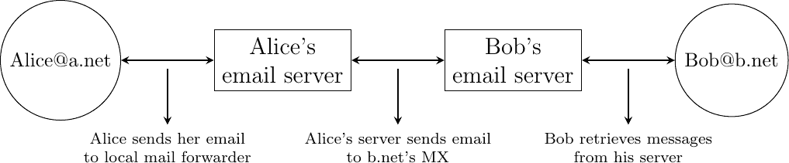
> 
> 图 28 互联网电子邮件的简化架构

我们在这本书中考虑的电子邮件系统由四个组件组成：

> +   一个消息格式，它定义了有效电子邮件消息的编码方式
> +   
> +   协议，允许主机和服务器交换电子邮件消息
> +   
> +   客户端软件，允许用户轻松创建和阅读电子邮件消息
> +   
> +   软件，允许服务器高效地交换电子邮件消息

我们首先讨论电子邮件的格式，然后讨论今天互联网上用于交换和检索电子邮件的协议。过去已经开发了其他电子邮件系统 [[Bush1993]](../bibliography.html#bush1993) [[Genilloud1990]](../bibliography.html#genilloud1990) [[GC2000]](../bibliography.html#gc2000)，但今天大多数电子邮件解决方案都已迁移到互联网电子邮件。有关用于编写和发送电子邮件的软件的信息，可以在[维基百科](https://en.wikipedia.org)等地方找到，包括[电子邮件客户端](https://en.wikipedia.org/wiki/Comparison_of_email_clients)和[电子邮件服务器](http://en.wikipedia.org/wiki/Comparison_of_mail_servers)。有关完整互联网邮件架构的更详细信息，可以在[**RFC 5598**](https://datatracker.ietf.org/doc/html/rfc5598.html)中找到。

电子邮件消息，像邮政邮件一样，由两部分组成：

> +   一个标题，它在常规邮件中扮演信头的作用。它包含有关消息的元数据。
> +   
> +   包含消息本身的正文。

电子邮件消息完全由 ASCII 字符的行组成。每行可以包含多达 998 个字符，并以 CR 和 LF 控制字符终止 [**RFC 5322**](https://datatracker.ietf.org/doc/html/rfc5322.html)。组成标题的行出现在消息正文之前。一个只包含 CR 和 LF 字符的空行标志着标题的结束。这如图 29 所示。

> 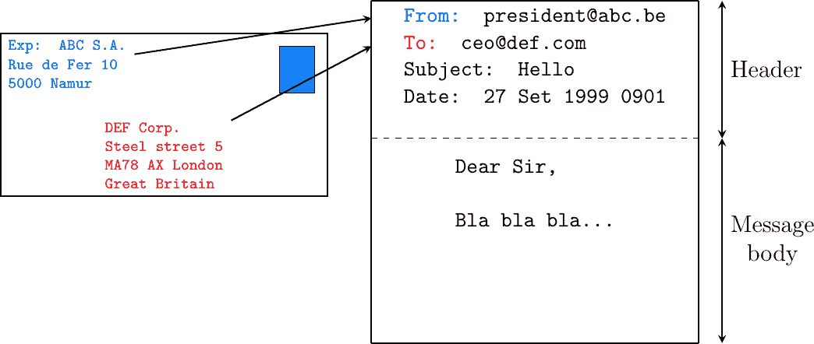
> 
> 图 29 电子邮件的结构

邮件标题包含几行，都以一个关键字开头，后跟一个冒号和附加信息。电子邮件消息的格式和不同类型的标题行在[**RFC 5322**](https://datatracker.ietf.org/doc/html/rfc5322.html)中定义。其中两行是强制性的，必须出现在所有电子邮件消息中：

> +   发件人地址。这个标题行以 From:开头。它包含发件人的（可选）姓名，后跟其电子邮件地址，地址在<和>之间。电子邮件地址总是由用户名后跟@符号和域名组成。
> +   
> +   日期。这个标题行以 Date:开头。[**RFC 5322**](https://datatracker.ietf.org/doc/html/rfc5322.html)精确地定义了编码日期所使用的格式。

其他标题行出现在大多数电子邮件消息中。Subject:标题行允许发件人指明电子邮件中讨论的主题。可以使用三种类型的标题行来指定消息的收件人：

> +   “To：”标题行包含消息的主要收件人的电子邮件地址[[10]](#fto)。可以使用逗号分隔多个地址。
> +   
> +   “cc：”标题行由发件人使用，以提供必须接收邮件副本的电子邮件地址列表。此标题行中可以列出多个地址，用逗号分隔。所有电子邮件消息的收件人都收到 To:和 cc:标题行。
> +   
> +   “bcc：”标题行由发件人使用，以提供必须接收邮件盲副本的逗号分隔的电子邮件地址列表。“bcc：”标题行不会发送给电子邮件消息的收件人。

下面是一个简单的电子邮件消息示例，包含 From:、To:、Subject:和 Date:标题行以及两行正文。

```sh
From: Bob Smith <Bob@machine.example>
To: Alice Doe <alice@example.net>, Alice Smith <Alice@machine.example>
Subject: Hello
Date: Mon, 8 Mar 2010 19:55:06 -0600

This is the "Hello world" of email messages.
This is the second line of the body 
```

注意在“日期：”标题行之后有一个空行；这个空行只包含 CR 和 LF 字符，标志着标题和消息主体的分界。

在[**RFC 5322**](https://datatracker.ietf.org/doc/html/rfc5322.html)和其他地方定义了几个其他可选标题行。此外，许多电子邮件客户端和服务器定义了从 X-开始的自己的标题行。以下讨论[**RFC 5322**](https://datatracker.ietf.org/doc/html/rfc5322.html)中定义的几个可选标题行：

> +   “Message-Id：”标题行用于将一个“唯一”标识符关联到每个电子邮件。电子邮件标识符通常结构为 string@domain，其中 string 是发件人选择的唯一字符字符串或序列号，domain 是发件人的域名。由于域名是唯一的，主机可以通过将本地唯一标识符与其域名连接起来生成全局唯一的消息标识符。
> +   
> +   “In-reply-to：”标题行在创建回复先前的消息时使用。在这种情况下，“In-reply-to：”行的末尾包含原始消息的标识符。
> +   
> +   当一封电子邮件在到达目的地之前由多个服务器处理时，会使用 Received:标题行。每个中间电子邮件服务器都会添加一个 Received:标题行。这些标题行对于调试电子邮件投递问题非常有用。

下图显示了某封电子邮件的标题行。该邮件起源于名为 wira.firstpr.com.au 的主机，并由 smtp3.sgsi.ucl.ac.be 接收。为了便于阅读，Received:行已被换行。

```sh
Received: from smtp3.sgsi.ucl.ac.be (Unknown [10.1.5.3])
    by mmp.sipr-dc.ucl.ac.be
    (Sun Java(tm) System Messaging Server 7u3-15.01 64bit (built Feb 12 2010))
    with ESMTP id <0KYY00L85LI5JLE0@mmp.sipr-dc.ucl.ac.be>; Mon,
    08 Mar 2010 11:37:17 +0100 (CET)
Received: from mail.ietf.org (mail.ietf.org [64.170.98.32])
    by smtp3.sgsi.ucl.ac.be (Postfix) with ESMTP id B92351C60D7; Mon,
    08 Mar 2010 11:36:51 +0100 (CET)
Received: from [127.0.0.1] (localhost [127.0.0.1])     by core3.amsl.com (Postfix)
    with ESMTP id F066A3A68B9; Mon, 08 Mar 2010 02:36:38 -0800 (PST)
Received: from localhost (localhost [127.0.0.1])       by core3.amsl.com (Postfix)
    with ESMTP id A1E6C3A681B  for <rrg@core3.amsl.com>; Mon,
    08 Mar 2010 02:36:37 -0800 (PST)
Received: from mail.ietf.org ([64.170.98.32])
    by localhost (core3.amsl.com [127.0.0.1]) (amavisd-new, port 10024)
    with ESMTP id erw8ih2v8VQa for <rrg@core3.amsl.com>; Mon,
    08 Mar 2010 02:36:36 -0800 (PST)
Received: from gair.firstpr.com.au (gair.firstpr.com.au [150.101.162.123])
    by core3.amsl.com (Postfix) with ESMTP id 03E893A67ED      for <rrg@irtf.org>; Mon,
    08 Mar 2010 02:36:35 -0800 (PST)
Received: from [10.0.0.6] (wira.firstpr.com.au [10.0.0.6])
    by gair.firstpr.com.au (Postfix) with ESMTP id D0A49175B63; Mon,
    08 Mar 2010 21:36:37 +1100 (EST)
Date: Mon, 08 Mar 2010 21:36:38 +1100
From: Robin Whittle <rw@firstpr.com.au>
Subject: Re: [rrg] Recommendation and what happens next
In-reply-to: <C7B9C21A.4FAB%tony.li@tony.li>
To: RRG <rrg@irtf.org>
Message-id: <4B94D336.7030504@firstpr.com.au>

Message content removed 
```

最初，电子邮件被用于在计算机科学家之间交换 ASCII 文本的小型消息。然而，随着互联网的发展，仅支持 ASCII 文本变得严重限制了两个原因。首先，非英语使用者希望用他们的母语写电子邮件，这通常需要比 ASCII 字符表更多的字符。其次，许多用户希望通过电子邮件发送除了 ASCII 文本之外的内容，例如二进制文件、图像或声音。

为了解决这个问题，[IETF](https://www.ietf.org)开发了多用途互联网邮件扩展(MIME)。这些扩展被精心设计，以便互联网电子邮件能够携带非 ASCII 字符和二进制文件，而不会破坏当时部署的电子邮件服务器。这种向后兼容性的要求迫使 MIME 设计者开发了对现有电子邮件消息格式[**RFC 822**](https://datatracker.ietf.org/doc/html/rfc822.html)的扩展，而不是定义一个更适合支持新类型电子邮件的全新格式。

**[RFC 2045**](https://datatracker.ietf.org/doc/html/rfc2045.html)定义了三种新的标题行类型以支持 MIME：

> +   MIME-Version:标题行指示用于编码电子邮件消息的 MIME 规范的版本。当前 MIME 的版本是 1.0。未来可能会定义 MIME 的其他版本。多亏了这个标题行，处理电子邮件消息的软件将能够适应用于编码消息的 MIME 版本。不包含此标题的消息应按照原始的[**RFC 822**](https://datatracker.ietf.org/doc/html/rfc822.html)规范进行格式化。
> +   
> +   Content-Type:标题行指示消息内部携带的数据类型（见下文）。
> +   
> +   Content-Transfer-Encoding:标题行用于指定消息的编码方式。当 MIME 被设计时，一些电子邮件服务器只能处理包含使用 7 位 ASCII 字符集编码的字符的消息。MIME 允许使用其他字符编码。

在电子邮件标题内部，Content-Type:标题行指示 MIME 电子邮件消息的结构。**[RFC 2046**](https://datatracker.ietf.org/doc/html/rfc2046.html)定义了此标题行的使用。MIME 消息的两种最常见结构是：

> +   Content-Type: multipart/mixed. 这个头部行表示 MIME 消息包含几个独立的部分。例如，这样的消息可能包含纯文本部分和二进制文件。
> +   
> +   Content-Type: multipart/alternative. 这个头部行表示 MIME 消息包含相同信息的几个表示。例如，multipart/alternative 消息可能包含相同文本的纯文本和 HTML 版本。

为了支持这两种类型的 MIME 消息，消息的接收者必须能够从消息中提取不同的部分。在 [**RFC 822**](https://datatracker.ietf.org/doc/html/rfc822.html) 中，使用空行来分隔头部行和正文。使用空行来分隔电子邮件正文的各个部分将很困难，因为电子邮件的正文通常包含一个或多个空行。另一个可能的选项是定义一个特殊的行，例如 *-LAST_LINE-* 来标记 MIME 消息两个部分之间的边界。不幸的是，这是不可能的，因为一些电子邮件可能在它们的正文中包含这个字符串（例如，发送给学生解释 MIME 消息格式的电子邮件）。为了解决这个问题，Content-Type: 头部行包含一个第二个参数，该参数指定了 MIME 消息的发送者用来分隔不同部分的字符串。实际上，这个字符串通常由邮件客户端随机选择。

以下电子邮件消息，复制自 [**RFC 2046**](https://datatracker.ietf.org/doc/html/rfc2046.html)，显示了一个包含两个部分的 MIME 消息，这两个部分都是纯文本，并使用 ASCII 字符集编码。字符串 simple boundary 在 Content-Type: 头部中定义为两个连续部分之间的边界标记。MIME 消息的另一个例子可以在 [**RFC 2046**](https://datatracker.ietf.org/doc/html/rfc2046.html) 中找到。

```sh
Date: Mon, 20 Sep 1999 16:33:16 +0200
From: Nathaniel Borenstein <nsb@bellcore.com>
To: Ned Freed <ned@innosoft.com>
Subject: Test
MIME-Version: 1.0
Content-Type: multipart/mixed; boundary="simple boundary"

preamble, to be ignored

--simple boundary
Content-Type: text/plain; charset=us-ascii

First part

--simple boundary
Content-Type: text/plain; charset=us-ascii

Second part
--simple boundary 
```

Content-Type: 头部也可以在 MIME 部分内部使用。在这种情况下，它表示放置在此部分中的数据类型。每种数据类型都指定为一个类型后跟一个子类型。更详细的描述可以在 [**RFC 2046**](https://datatracker.ietf.org/doc/html/rfc2046.html) 中找到。一些最受欢迎的 Content-Type: 头部行如下：

> +   text. 消息部分包含文本格式的信息。有几种子类型：text/plain 用于常规 ASCII 文本，text/html 定义在 [**RFC 2854**](https://datatracker.ietf.org/doc/html/rfc2854.html) 中，用于 HTML 格式的文档或 text/enriched 格式，该格式定义在 [**RFC 1896**](https://datatracker.ietf.org/doc/html/rfc1896.html) 中。Content-Type: 头行可能包含一个第二个参数，用于指定编码文本所使用的字符集。charset=us-ascii 是标准的 ASCII 字符表。其他常见的字符集包括 charset=UTF8 或 charset=iso-8859-1。标准字符集的 [列表](http://www.iana.org/assignments/character-sets) 由 IANA 维护。
> +   
> +   image. 消息部分包含图像的二进制表示。子类型指示图像的格式，如 [gif](http://en.wikipedia.org/wiki/Graphics_Interchange_Format)，[jpg](http://en.wikipedia.org/wiki/Jpeg) 或 [png](http://en.wikipedia.org/wiki/Portable_Network_Graphics)。
> +   
> +   audio. 消息部分包含音频剪辑。子类型指示音频剪辑的格式，如 [wav](http://en.wikipedia.org/wiki/Wav) 或 [mp3](http://en.wikipedia.org/wiki/Mp3)。
> +   
> +   video. 消息部分包含视频剪辑。子类型指示视频剪辑的格式，如 [avi](http://en.wikipedia.org/wiki/Audio_Video_Interleave) 或 [mp4](http://en.wikipedia.org/wiki/Mp4)。
> +   
> +   application. 消息部分包含由子类型中列出的特定应用程序产生的二进制信息。电子邮件客户端使用子类型来启动能够解码接收到的二进制信息的应用程序。

注意

从 ASCII 到 Unicode

最初的计算机使用不同的技术来表示内存和磁盘上的字符。在 1960 年代，计算机开始通过磁带或电话线路交换信息。不幸的是，每个供应商都有自己的专有字符集，不同供应商的计算机之间的数据交换往往很困难。7 位 ASCII 字符表 [**RFC 20**](https://datatracker.ietf.org/doc/html/rfc20.html) 被几家供应商和许多互联网协议采用。然而，随着互联网的国际化以及越来越多的用户希望使用支持他们自己书写语言的字符集，ASCII 变成了一个问题。解决这个问题的第一个尝试是 ISO [ISO-8859](https://en.wikipedia.org/wiki/ISO_8859) 字符集的定义。这个标准系列指定了各种字符集，通过使用 8 位字符可以表示许多欧洲书写语言。不幸的是，8 位字符集不足以支持一些广泛使用的语言，例如亚洲国家使用的语言。幸运的是，在 1980 年代末，几位计算机科学家提出了开发一个支持地球上今天使用的所有书写语言的标准。Unicode 标准现在已被大多数计算机和软件供应商采用。例如，Java 总是使用 Unicode 来操作字符，Python 可以处理 ASCII 和 Unicode 字符。互联网应用程序正逐渐转向对 Unicode 字符集的完全支持，但从 ASCII 到 Unicode 的转变是一个重要的变化，可能会对当前部署的实施产生巨大影响。例如，查看完全国际化电子邮件 [**RFC 4952**](https://datatracker.ietf.org/doc/html/rfc4952.html) 和域名 [**RFC 5890**](https://datatracker.ietf.org/doc/html/rfc5890.html) 的工作。

最后一个 MIME 头行是 Content-Transfer-Encoding:. 这个头行在 Content-Type: 头行之后，在消息部分内使用，并指定了消息部分是如何被编码的。默认编码是使用 7 位 ASCII。最常用的编码是 quoted-printable 和 Base64。两者都支持将一系列字节编码成一组 ASCII 行，这些行可以通过电子邮件服务器安全传输。quoted-printable 定义在 [**RFC 2045**](https://datatracker.ietf.org/doc/html/rfc2045.html)。我们简要描述 base64，它定义在 [**RFC 2045**](https://datatracker.ietf.org/doc/html/rfc2045.html) 和 [**RFC 4648**](https://datatracker.ietf.org/doc/html/rfc4648.html)。

Base64 将要编码的字节序列分成三字节的组（最后一个组可能是不完整的）。然后，每个三字节的组被分成四个六位字段，每个六位字段被编码为下表中的一个字符。

| 值 | 编码 | 值 | 编码 | 值 | 编码 | 值 | 编码 |
| --- | --- | --- | --- | --- | --- | --- | --- |
| 0 | A | 17 | R | 34 | i | 51 | z |
| 1 | B | 18 | S | 35 | j | 52 | 0 |
| 2 | C | 19 | T | 36 | k | 53 | 1 |
| 3 | D | 20 | U | 37 | l | 54 | 2 |
| 4 | E | 21 | V | 38 | m | 55 | 3 |
| 5 | F | 22 | W | 39 | n | 56 | 4 |
| 6 | G | 23 | X | 40 | o | 57 | 5 |
| 7 | H | 24 | Y | 41 | p | 58 | 6 |
| 8 | I | 25 | Z | 42 | q | 59 | 7 |
| 9 | J | 26 | a | 43 | r | 60 | 8 |
| 10 | K | 27 | b | 44 | s | 61 | 9 |
| 11 | L | 28 | c | 45 | t | 62 | + |
| 12 | M | 29 | d | 46 | u | 63 | / |
| 13 | N | 30 | e | 47 | v |  |  |
| 14 | O | 31 | f | 48 | w |  |  |
| 15 | P | 32 | g | 49 | x |  |  |
| 16 | Q | 33 | h | 50 | y |  |  |

下面的示例，来自[**RFC 4648**](https://datatracker.ietf.org/doc/html/rfc4648.html)，说明了 Base64 编码。

> | 输入数据 | 0x14fb9c03d97e |
> | --- | --- |
> | 8-bit | 00010100 11111011 10011100 00000011 11011001 01111110 |
> | 6-bit | 000101 001111 101110 011100 000000 111101 100101 111110 |
> | 十进制 | 5 15 46 28 0 61 37 62 |
> | 编码 | F P u c A 9 l + |

基于 Base64 的最后一点要讨论的是，当要编码的字节序列长度不是 3 的倍数时会发生什么。在这种情况下，最后一组字节可能包含一个或两个字节而不是三个。Base64 将等号（=）字符保留为填充字符。当最后一组包含两个字节时，该字符使用一次；当它包含一个字节时，该字符使用两次，如下面的两个示例所示。

> | 输入数据 | 0x14 |
> | --- | --- |
> | 8-bit | 00010100 |
> | 6-bit | 000101 000000 |
> | 十进制 | 5 0 |
> | 编码 | F A = = |
> | 输入数据 | 0x14b9 |
> | 8-bit | 00010100 11111011 |
> | 6-bit | 000101 001111 101100 |
> | 十进制 | 5 15 44 |
> | 编码 | F P s = |

现在我们已经解释了电子邮件消息的格式，我们可以讨论这些消息如何通过互联网进行交换。图 30 展示了当爱丽丝向鲍勃发送电子邮件消息时使用的协议。爱丽丝使用电子邮件客户端或网页邮件界面准备她的电子邮件。为了将她的电子邮件发送给鲍勃，爱丽丝的客户端将使用简单邮件传输协议 (SMTP) 将她的消息发送到她的 SMTP 服务器。爱丽丝的电子邮件客户端配置了她的域的默认 SMTP 服务器名称。通常每个域至少有一个 SMTP 服务器。为了投递消息，爱丽丝的 SMTP 服务器必须找到包含鲍勃邮箱的 SMTP 服务器。这可以通过使用 DNS 的邮件交换 (MX) 记录来完成。一组 MX 记录可以与每个域相关联。每个 MX 记录包含一个数值优先级和一个能够投递发送到该域所有有效电子邮件地址的电子邮件消息的 SMTP 服务器的完全限定域名。DNS 可以为给定域返回多个 MX 记录。在这种情况下，数值优先级最低的服务器首先使用 [**RFC 2821**](https://datatracker.ietf.org/doc/html/rfc2821.html)。如果此服务器不可达，则使用次优先的服务器等。鲍勃的 SMTP 服务器将存储爱丽丝发送的消息，直到鲍勃使用网页邮件界面或邮局协议 (POP) 或互联网消息访问协议 (IMAP) 获取它。

> 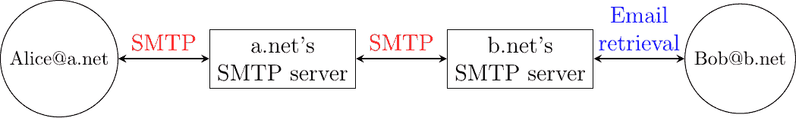
> 
> 图 30 电子邮件投递协议

### 简单邮件传输协议#

在 [**RFC 5321**](https://datatracker.ietf.org/doc/html/rfc5321.html) 中定义的简单邮件传输协议 (SMTP) 是一种客户端-服务器协议。SMTP 规范区分了在电子邮件消息投递中涉及的五种类型的过程。电子邮件消息是在邮件用户代理 (MUA) 上编写的。MUA 通常是一个电子邮件客户端或网页邮件。MUA 将电子邮件消息发送到邮件提交代理 (MSA)。MSA 处理接收到的电子邮件并将其转发到邮件传输代理 (MTA)。MTA 负责电子邮件的传输，直接或通过中间 MTA 传输到目标域的 MTA。然后，目标 MTA 将消息转发到邮件投递代理 (MDA)，在那里它将被收件人的 MUA 访问。SMTP 用于 MUA 和 MSA [[12]](#fsmtpauth)，MSA-MTA 和 MTA-MTA 之间的交互。

SMTP 是一种基于文本的协议，类似于互联网上许多其他应用层协议。它依赖于字节流服务。服务器监听端口 25。客户端发送由一行 ASCII 文本组成并终止于 CR+LF 的命令。服务器通过发送包含三位数字错误/成功代码和可选注释的 ASCII 行进行回复。

SMTP 协议，类似于大多数基于文本的协议，被指定为 BNF。完整的 BNF 定义在 [**RFC 5321**](https://datatracker.ietf.org/doc/html/rfc5321.html) 中。主要的 SMTP 命令由 图 31 中显示的 BNF 规则定义。


图 31 SMTP 命令的 BNF 规范#

在这个 BNF 中，atext 对应于可打印的 ASCII 字符。这个 BNF 规则定义在 [**RFC 5322**](https://datatracker.ietf.org/doc/html/rfc5322.html) 中。五个主要命令是 EHLO [[13]](#fehlo)，MAIL FROM:，RCPT TO:，DATA 和 QUIT。Postmaster 是负责特定域名或 SMTP 服务器的系统管理员的别名。所有域名都必须有一个 Postmaster 别名。SMTP 响应由 图 32 中显示的 BNF 定义。


图 32 SMTP 响应的 BNF 规范#

SMTP 服务器使用包含三位数字和可选注释的结构化响应代码。响应代码的第一位数字表示命令是否成功。2xy 的响应代码表示命令已被接受。3xy 的响应代码表示命令已被接受，但需要客户端提供更多信息。4xy 的响应代码表示暂时性负面响应。这意味着由于某种原因（由其他数字或注释指示），命令不能立即处理，但仍有希望问题只是暂时的。这基本上是在告诉客户端稍后再尝试相同的命令。相比之下，5xy 的响应代码表示永久性失败或错误。在这种情况下，客户端稍后重试相同的命令是无用的。其他应用层协议，如 FTP [**RFC 959**](https://datatracker.ietf.org/doc/html/rfc959.html) 或 HTTP [**RFC 2616**](https://datatracker.ietf.org/doc/html/rfc2616.html)，它们的响应代码使用类似的结构。有关其他响应代码的更多详细信息，请参阅 [**RFC 5321**](https://datatracker.ietf.org/doc/html/rfc5321.html)。

SMTP 响应代码的示例包括以下内容：

```sh
220  <domain> Service ready
221  <domain> Service closing transmission channel
250  Requested mail action okay, completed
354  Start mail input; end with <CRLF>.<CRLF>
421  <domain> Service not available, closing transmission channel
450  Requested mail action not taken: mailbox unavailable
452  Requested action not taken: insufficient system storage
500  Syntax error, command unrecognized
501  Syntax error in parameters or arguments
502  Command not implemented
503  Bad sequence of commands
550  Requested action not taken: mailbox unavailable 
```

服务器在同意与客户端交互时，会使用回复代码 220 作为第一条消息。在关闭底层传输连接之前，服务器会发送回复代码 221。回复代码 250 是标准的积极回复，表示前一个命令的成功执行。回复代码 354 表示客户端可以开始传输其电子邮件消息。当存在阻止服务器接受传输连接的问题（例如内存/磁盘资源不足）时，会返回回复代码 421。回复代码 450 和 452 表示目标邮箱因各种原因暂时不可用，而回复代码 550 表示邮箱不存在或因策略原因无法使用。500 到 503 的回复代码对应于客户端发送的命令错误。当客户端以错误的顺序发送命令时（例如，客户端在提供消息的目标地址之前尝试发送电子邮件），服务器会发送 503 回复代码。

电子邮件消息的传输分为三个阶段。在第一阶段，客户端与服务器建立传输连接。一旦连接建立，客户端和服务器交换问候消息（EHLO 命令）。大多数服务器坚持要求接收有效的问候消息，如果它们没有收到有效的问候消息，其中一些服务器会丢弃底层的传输连接。问候交换完成后，电子邮件传输阶段可以开始。在这个阶段，客户端通过指示发送者的电子邮件地址（MAIL FROM: 命令）、收件人的电子邮件地址（RCPT TO: 命令）以及电子邮件消息的头部和正文（DATA 命令）来传输一个或多个电子邮件消息。一旦客户端将其所有排队电子邮件消息发送到 SMTP 服务器，它将终止 SMTP 协议（QUIT 命令）。

以下是一个成功的电子邮件传输示例

```sh
S: 220 smtp.example.com ESMTP MTA information
C: EHLO mta.example.org
S: 250 Hello mta.example.org, glad to meet you
C: MAIL FROM:<alice@example.org>
S: 250 Ok
C: RCPT TO:<bob@example.com>
S: 250 Ok
C: DATA
S: 354 End data with <CR><LF>.<CR><LF>
C: From: "Alice Doe" <alice@example.org>
C: To: Bob Smith <bob@example.com>
C: Date: Mon, 9 Mar 2010 18:22:32 +0100
C: Subject: Hello
C:
C: Hello Bob
C: This is a small message containing 4 lines of text.
C: Best regards,
C: Alice
C: .
S: 250 Ok: queued as 12345
C: QUIT
S: 221 Bye 
```

在上面的示例中，运行在 mta.example.org 上的 MTA 打开到主机 smtp.example.com 上 SMTP 服务器的 TCP 连接。带有 S:（分别对应 C:）前缀的行是服务器（分别对应客户端）发送的响应。服务器在 TCP 连接建立后立即发送其问候。然后客户端发送带有其完全限定域名（FQDN）的 EHLO 命令。服务器以回复代码 250 响应并发送其问候。现在可以使用 SMTP 协议交换电子邮件。

要发送电子邮件，客户端必须首先使用 RCPT TO:提供收件人的地址。然后它使用 MAIL FROM:发送发送者的地址。服务器接受收件人和发送者。现在客户端可以发出 DATA 命令以开始电子邮件消息的传输。在收到 354 回复代码后，客户端发送其电子邮件消息的标题和正文。客户端通过发送只包含.（点）字符的行来指示消息的结束[[14]](#fdot)。服务器通过回复代码 250 确认电子邮件消息已被排队等待发送或传输。客户端发出 QUIT 命令来关闭会话，服务器在关闭 TCP 连接之前以回复代码 221 进行确认。

备注

开放 SMTP 中继和垃圾邮件

自 1971 年创建以来，电子邮件已经成为一个非常有用的工具，许多用户用它来交换大量信息。在早期，所有的 SMTP 服务器都是开放的，任何人都可以使用它们将电子邮件转发到最终目的地。不幸的是，多年来，一些不择手段的用户找到了利用电子邮件进行营销或发送恶意软件的方法。第一个有记录的将电子邮件用于营销目的的滥用发生在 1978 年，当时一位为计算机供应商工作的营销人员向许多 ARPANET 用户发送了一封[营销电子邮件](http://www.templetons.com/brad/spamreact.html#msg)。当时，ARPANET 只能用于研究目的，这违反了可接受的使用政策。遗憾的是，由于发送电子邮件的成本极低，未经请求的电子邮件问题并未停止。未经请求的电子邮件现在被称为垃圾邮件，[ENISA](https://www.enisa.europa.eu/)在 2009 年进行的一项[研究](http://www.enisa.europa.eu/act/res/other-areas/anti-spam-measures)显示，95%的电子邮件都是垃圾邮件，并且这个数字似乎还在继续增长。这给互联网服务提供商和需要处理大量无用信息的公司带来了负担。

由于垃圾邮件的数量，SMTP 服务器现在不再开放[**RFC 5068**](https://datatracker.ietf.org/doc/html/rfc5068.html)。近年来已经开发了几种 SMTP 的扩展来解决这个问题。例如，[**RFC 4954**](https://datatracker.ietf.org/doc/html/rfc4954.html)中定义的 SMTP 身份验证方案可以被 SMTP 服务器用来验证客户端。还提出了几种技术，允许 SMTP 服务器验证用户发送的消息[**RFC 4870**](https://datatracker.ietf.org/doc/html/rfc4870.html) [**RFC 4871**](https://datatracker.ietf.org/doc/html/rfc4871.html)。### 邮政协议#

当设计 SMTP 的第一个版本时，互联网由被整个大学系或研究实验室使用的迷你计算机组成。这些迷你计算机被许多用户同时使用。电子邮件主要用于从一个主机上的用户发送消息到远程主机上的另一个用户。当时，SMTP 是唯一涉及电子邮件投递的协议，因为所有连接到网络的宿主都在运行 SMTP 服务器。在这些主机上，发往本地用户的电子邮件通过将电子邮件放入用户拥有的特殊目录或文件中来进行投递。然而，20 世纪 80 年代个人电脑的引入改变了这一环境。最初，这些个人电脑的用户使用诸如 telnet 之类的应用程序在本地迷你计算机上打开远程会话以阅读他们的电子邮件。这并不友好。随着在个人电脑上开发用户友好的电子邮件客户端应用程序，出现了一个更好的解决方案。设计了几种协议，允许这些客户端应用程序从用户的邮件服务器检索发往用户的电子邮件消息。其中两种协议变得流行，并且至今仍在使用。定义在[**RFC 1939**](https://datatracker.ietf.org/doc/html/rfc1939.html)中的邮局协议（POP）是最简单的一个。它允许客户端从其电子邮件服务器下载所有发往特定用户的邮件。我们在此节中简要描述 POP。第二种协议是互联网消息访问协议（IMAP），定义在[**RFC 3501**](https://datatracker.ietf.org/doc/html/rfc3501.html)。IMAP 比 POP 更强大，但也更复杂。IMAP 旨在允许客户端高效地实时访问服务器上存储在各个文件夹中的消息。IMAP 假设特定用户的全部消息都存储在服务器上，并提供搜索、下载、删除或过滤消息所需的函数。

POP 是另一种简单的基于行的协议示例。POP 在字节流服务之上运行。一个 POP 服务器通常监听 110 端口。一个 POP 会话由三个部分组成：一个授权阶段，在此期间服务器验证客户端的凭证；一个事务阶段，在此期间客户端下载消息；以及一个更新阶段，它结束了会话。客户端发送命令，服务器的回复以+OK 为前缀表示命令成功，以-ERR 为前缀表示错误。

当客户端与 POP 服务器建立传输连接时，服务器会发送一个以+OK 开头的 ASCII 行作为横幅。此时，POP 会话处于授权阶段。在这个阶段，客户端可以使用 USER（或 PASS）命令发送其用户名（或密码）。如果用户名（或密码）有效，服务器会回复+OK，否则回复-ERR。

一旦用户名和密码得到验证，POP 会话进入事务阶段。在此阶段，客户端可以发出多个命令。STAT 命令用于检索服务器的状态。在接收到此命令后，服务器会回复一行，其中包含+OK，后面跟着邮箱中的消息数量和邮箱的总字节数。RETR 命令后跟一个空格和一个整数，用于检索邮箱中的第 n 条消息。DELE 命令用于标记邮箱中的第 n 条消息以供删除。

一旦客户端检索并可能删除邮箱中的电子邮件，它必须发出 QUIT 命令。此命令终止 POP 会话，并允许服务器删除所有已通过 DELE 命令标记为删除的消息。

下图提供了一个简单的 POP 会话。所有以 C:（分别对应 S:）为前缀的行都是由客户端（分别对应服务器）发送的。

```sh
S:    +OK POP3 server ready
C:    USER alice
S:    +OK
C     PASS 12345pass
S:    +OK alice's maildrop has 2 messages (620 octets)
C:    STAT
S:    +OK 2 620
C:    LIST
S:    +OK 2 messages (620 octets)
S:    1 120
S:    2 500
S:    .
C:    RETR 1
S:    +OK 120 octets
S:    <the POP3 server sends message 1>
S:    .
C:    DELE 1
S:    +OK message 1 deleted
C:    QUIT
S:    +OK POP3 server signing off (1 message left) 
```

在此示例中，一个名为 alice 的 POP 客户端代表该用户联系 POP 服务器。请注意，在此示例中，Alice 的密码由客户端明文发送。这意味着如果有人能够捕获 Alice 发送的包，他将知道 Alice 的密码 [[15]](#fapop)。然后 Alice 的客户端发出 STAT 命令以了解其邮箱中存储的消息数量。然后检索并删除邮箱中的第一条消息。  ## 互联网世界#

在早期，互联网主要用于远程终端访问，如[telnet](https://en.wikipedia.org/wiki/Telnet)、电子邮件和文件传输。默认的文件传输协议 FTP，定义在[**RFC 959**](https://datatracker.ietf.org/doc/html/rfc959.html)，被广泛使用。FTP 客户端和服务器仍包含在一些操作系统中。

许多 FTP 客户端提供了类似于 Unix shell 的用户界面，并允许客户端浏览服务器上的文件系统，发送和检索文件。FTP 服务器可以配置为两种模式：

> +   认证：在此模式下，FTP 服务器仅接受具有有效用户名和密码的用户。一旦认证，他们可以按照其权限访问文件和目录。
> +   
> +   匿名：在此模式下，客户端提供匿名用户标识和电子邮件地址作为密码。这些客户端被授予访问文件系统特殊区域的权限，该区域仅包含公共文件。

FTP 在 20 世纪 90 年代和 21 世纪初非常流行，但如今它已被更近期的协议所取代。文件的安全访问主要通过定义在[**RFC 4251**](https://datatracker.ietf.org/doc/html/rfc4251.html)并得到如[scp](https://www.openssh.org)或[sftp](https://www.openssh.org)等客户端支持的 Secure Shell ([ssh](https://en.wikipedia.org/wiki/Secure_Shell))协议来实现。如今，匿名访问主要由 Web 协议提供。

在 20 世纪 80 年代末，在[欧洲核子研究中心](https://www.cern.ch)工作的粒子物理学家需要高效地交换关于他们正在进行和计划中的实验的文档。[蒂姆·伯纳斯-李](https://www.w3.org/People/Berners-Lee/)评估了当时可用的几种文档共享技术[[B1989]](../bibliography.html#b1989)。由于现有的解决方案都不符合欧洲核子研究中心的要求，他们决定开发一个全新的文档共享系统。这个系统最初被称为网状系统。它很快被更名为万维网。万维网的起点是超文本文档。超文本文档是一种包含对其他文档的引用（超链接）的文档，读者可以立即访问这些文档。超文本不是为了万维网而发明的。超文本文档的想法是在 1945 年提出的[[Bush1945]](../bibliography.html#bush1945)，而第一次实验是在 20 世纪 60 年代进行的[[Nelson1965]](../bibliography.html#nelson1965) [[Myers1998]](../bibliography.html#myers1998)。与 20 世纪 80 年代末使用的超文本文档相比，万维网引入的主要创新是允许超链接引用存储在不同远程机器上的文档。这如图 33 所示。

> 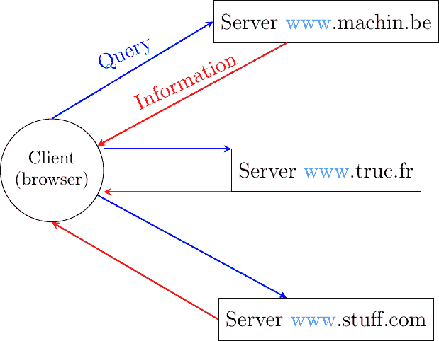
> 
> 图 33 万维网客户端和服务器

类似于万维网的文档共享系统由三个重要部分组成。

> 1.  一种标准化的寻址方案，可以明确地识别文档
> 1.  
> 1.  一种标准文档格式：[超文本标记语言](http://www.w3.org/MarkUp)
> 1.  
> 1.  一种标准化的协议，用于高效检索服务器上存储的文档

注释

开放标准和开放实现

开放标准在我们今天所知道的万维网的成功中扮演着关键角色。没有开放标准，万维网永远不会达到现在的规模。除了开放标准之外，另一个对网络成功至关重要的因素是这些标准的开放和高效实现。当欧洲核子研究中心开始研究网络时，他们的目标是构建一个可以由物理学家使用的运行系统。他们开发了[第一个网络服务器](http://www.w3.org/Daemon/)和[网络客户端](http://www.w3.org/Library/Activity.html)的开源实现。这些开源实现功能强大，可以被愿意共享信息的机构直接使用。它们也被其他开发者扩展，以贡献新的功能。例如，[NCSA](https://www.ncsa.illinois.edu)在其[Mosaic 浏览器](http://en.wikipedia.org/wiki/Mosaic_(web_browser))中增加了对图像的支持，该浏览器最终被用来创建[Netscape Communications](http://en.wikipedia.org/wiki/Netscape)和第一个商业浏览器和服务器。

万维网的第一个组成部分是统一资源标识符（URI），由 [**RFC 3986**](https://datatracker.ietf.org/doc/html/rfc3986.html) 定义。URI 是一个字符字符串，明确地标识了万维网上的资源。以下是 URI 的 BNF 子集。

```sh
URI           = scheme ":" "//" authority path [ "?" query ] [ "#" fragment ]
scheme        = ALPHA *( ALPHA / DIGIT / "+" / "-" / "." )
authority     = [ userinfo "@" ] host [ ":" port ]
query         = *( pchar / "/" / "?" )
fragment      = *( pchar / "/" / "?" )
pchar         = unreserved / pct-encoded / sub-delims / ":" / "@"
query         = *( pchar / "/" / "?" )
fragment      = *( pchar / "/" / "?" )
pct-encoded   = "%" HEXDIG HEXDIG
unreserved    = ALPHA / DIGIT / "-" / "." / "_" / "~"
reserved      = gen-delims / sub-delims
gen-delims    = ":" / "/" / "?" / "#" / "[" / "]" / "@"
sub-delims    = "!" / "$" / "&" / "'" / "(" / ")" / "*" / "+" / "," / ";" / "=" 
```

URI 的第一个组成部分是其方案。方案可以看作是一个选择器，指示其后字段的含义。在实践中，方案通常标识客户端必须使用的应用层协议来检索文档，但这并不总是如此。一些方案根本不暗示任何协议，而另一些则不指示可检索的文档 [[16]](#furiretrieve)。最常见的方案是 http 和 https。本节我们重点关注 http。可以为几乎任何应用层协议定义 URI 方案 [[17]](#furilist)。冒号（:）和双斜杠（//）跟在 URI 的方案之后。

URI 的第二部分是权限。对于可检索的 URI，这包括可以检索文档的服务器的主机名或 IP 地址，该文档可以通过方案中指定的协议来检索。这个名称可以由请求信息（例如用户名）的一些信息 precede。早期的 URI 定义允许在 @ 字符之前指定用户名和密码 ([**RFC 1738**](https://datatracker.ietf.org/doc/html/rfc1738.html))，但现在这已被弃用，因为将密码放在 URI 中是不安全的。主机名后面可以跟分号字符和端口号。某些协议定义了默认端口号，并且只有在使用非默认端口号时才应在 URI 中包含端口号（对于其他协议，可以使用服务 DNS 记录等技术）。

URI 的第三部分是文档的路径。这个路径的结构类似于 Unix 主机上的文件名（但这并不暗示文件确实以这种方式存储在服务器上）。如果未指定路径，服务器将返回默认文档。URI 的最后两个可选部分用于提供查询参数并指示请求文档的特定部分（例如文章中的某个部分）。以下是一些示例 URI。

```sh
http://tools.ietf.org/html/rfc3986.html
mailto:infobot@example.com?subject=current-issue
http://docs.python.org/library/basehttpserver.html?highlight=http#BaseHTTPServer.BaseHTTPRequestHandler
telnet://[2001:db8:3080:3::2]:2323/
ftp://cnn.example.com&story=breaking_news@10.0.0.1/top_story.htm 
```

第一个 URI 对应于一个名为 rfc3986.html 的文档，该文档存储在名为 tools.ietf.org 的服务器上，可以通过使用默认端口上的 http 协议来访问。第二个 URI 对应于一个主题为 current-issue 的电子邮件消息，该消息将被发送到 example.com 域中的用户 infobot。mailto: URI 方案在[**RFC 2368**](https://datatracker.ietf.org/doc/html/rfc2368.html)中定义。第三个 URI 引用的是存储在 docs.python.org 服务器上的库目录中的文档 basehttpserver.html 的部分 BaseHTTPServer.BaseHTTPRequestHandler。该文档可以通过使用 http 协议检索。查询参数 highlight=http 与该 URI 相关联。第四个例子是一个运行[telnet](https://en.wikipedia.org/wiki/Telnet)协议的服务器，使用 IPv6 地址 2001:db8:3080:3::2，并在 2323 端口上可达。最后一个 URI 有些特殊。大多数用户会认为它对应于存储在 cnn.example.com 服务器上的文档。然而，为了解析这个 URI，重要的是要记住，在 URI 的授权部分中，@字符用于将用户名与主机名分开。这意味着 URI 指向一个名为 top_story.htm 的文档，该文档存储在具有 IPv4 地址 10.0.0.1 的主机上。该文档将通过使用 ftp 协议并设置用户名为 cnn.example.com&story=breaking_news 来检索。

万维网的第二个组成部分是超文本标记语言（HTML）。HTML 定义了在网络上交换的文档的格式。[HTML 的第一个版本](http://www.w3.org/History/19921103-hypertext/hypertext/WWW/MarkUp/Tags.html)是从 1986 年由 ISO 标准化的通用标记语言（SGML）派生出来的。[SGML](https://en.wikipedia.org/wiki/Standard_Generalized_Markup_Language)是为了支持政府、律师事务所或航空航天公司维护的大型文档而设计的，这些文档必须以机器可读的方式高效共享。这些行业要求文档在十年甚至更长时间内保持可读和可编辑，并坚持使用由多个供应商支持的标准化格式。如今，[SGML](https://en.wikipedia.org/wiki/Standard_Generalized_Markup_Language)已不再在特定应用之外广泛使用，但其后裔包括 HTML 和 XML 现在却非常普遍。

标记语言是一种在文档内部添加关于文档格式化注释的结构化方式。示例标记语言包括 [troff](https://en.wikipedia.org/wiki/Troff)，它用于编写 Unix man 页面或 [Latex](https://en.wikipedia.org/wiki/Latex)。HTML 使用标记来注释文本，一个文档由 HTML 元素组成。每个元素通常由三部分组成：一个可能包含一些特定属性的起始标签，一些文本（通常包括其他元素），以及一个结束标签。HTML 标签是括号内的关键字。HTML 元素的通用形式是

```sh
<tag>Some text to be displayed</tag> 
```

更复杂的 HTML 元素也可以在起始标签中包含可选属性

```sh
<tag attribute1="value1" attribute2="value2">some text to be displayed</tag> 
```

如 图 34 所示的 HTML 文档由两部分组成：一个由 <head> 和 </head> 标记界定的标题，以及一个位于 <body> 和 </body> 标记之间的主体。在下面的示例中，标题只包含一个标题，但标题中可以包含其他类型的信息。主体包含一个图片、一些文本和一个包含三个超链接的列表。图片通过在  标记内的括号中指定其 URI 来包含在网页中。需要注意的是，图片可以存储在任何服务器上。当客户端渲染网页时，会自动下载它。<h1>…</h1> 标记用于指定第一级标题。<ul> 标记表示无序列表，而 <li> 标记表示列表项。《<a href=”URI”>text</a>》表示超链接。在渲染的网页中，文本会被下划线，当用户点击链接时，客户端会获取指定的 URI。


图 34 一个简单的 HTML 页面#

在过去的几年里，已经提出了各种 HTML 扩展并得到了实施。这些包括指定样式表以调整文档布局以及添加或引用 JavaScript 代码的可能性。有关 HTML 各类扩展的详细信息，可以在 [官方规范](http://www.w3.org/MarkUp/) 中找到，这些规范由 [W3C](https://www.w3.org) 维护。

### 超文本传输协议#

互联网的第三个组成部分是超文本传输协议 (HTTP)。HTTP 是一种基于文本的协议，类似于 SMTP。客户端发送请求，服务器返回响应。HTTP 在字节流服务之上运行，默认情况下 HTTP 服务器监听端口 80。HTTP 的设计在很大程度上受到了互联网电子邮件协议的启发。每个 HTTP 请求包含三个部分：

> +   一种方法，指示请求的类型、URI 以及客户端使用的 HTTP 协议版本
> +   
> +   一个标题，客户端用它来指定请求的可选参数。一个空行用于标记标题的结束
> +   
> +   附加到请求的可选 MIME 文档

服务器发送的响应还包含三个部分：

> +   状态行，表示请求是否成功
> +   
> +   一个标题，包含有关响应的附加信息。响应标题以空行结束。
> +   
> +   MIME 文档

图图 35 提供了示例 HTTP 请求和响应。

> 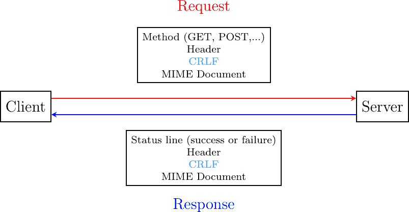
> 
> 图 35 HTTP 请求和响应

可以在 HTTP 请求中使用多种类型的方法。最重要的三种是：

> +   GET 方法是最受欢迎的方法之一。它用于从服务器检索文档。GET 方法编码为 GET，后跟请求文档的 URI 路径和客户端使用的 HTTP 版本。例如，要检索[`www.w3.org/MarkUp/`](http://www.w3.org/MarkUp/) URI，客户端必须在端口 80 上与主机 www.w3.org 建立 TCP 连接，并发送包含以下行的 HTTP 请求：
> +   
> ```sh
> GET /MarkUp/ HTTP/1.0 
> ```
> 
> +   HEAD 方法是 GET 方法的变体，允许检索给定 URI 的标题行，而不检索整个文档。它可以由客户端用于验证文档是否存在，例如。
> +   
> +   POST 方法可以由客户端用于向服务器发送文档。文档作为 MIME 文档附加到 HTTP 请求中。

HTTP 客户端和服务器可以在 HTTP 请求和响应中包含不同的 HTTP 标题。每个 HTTP 标题都编码为单个 ASCII 行，以 CR 和 LF 结尾。以下简要描述了其中一些标题。有关标准标题的详细讨论，请参阅[**RFC 1945**](https://datatracker.ietf.org/doc/html/rfc1945.html)。MIME 标题可以出现在 HTTP 请求和 HTTP 响应中。

> +   内容长度：标题是 MIME 标题，表示 MIME 文档的字节长度。
> +   
> +   内容类型：标题是 MIME 标题，表示附加 MIME 文档的类型。HTML 页面使用 text/html 类型。
> +   
> +   内容编码：标题表示 MIME 文档的编码方式。例如，此标题将设置为 x-gzip，用于使用[gzip](https://www.gzip.org)软件压缩的文档。

[**RFC 1945**](https://datatracker.ietf.org/doc/html/rfc1945.html)和[**RFC 2616**](https://datatracker.ietf.org/doc/html/rfc2616.html)定义了特定于 HTTP 响应的标题。这些服务器标题包括：

> +   服务器：标题表示生成 HTTP 响应的 Web 服务器的版本。一些服务器提供有关它们的软件版本和它们使用的可选模块的信息。出于安全原因，一些系统管理员禁用这些标题，以避免向潜在的攻击者透露太多关于其服务器的信息。
> +   
> +   日期：标题表示服务器何时生成了 HTTP 响应。
> +   
> +   Last-Modified: 头部指示附加到 HTTP 响应的文档的最后修改日期和时间。

类似地，以下头部行只能出现在客户端发送的 HTTP 请求中：

> +   User-Agent: 头部提供了有关生成 HTTP 请求的客户端的信息。一些服务器分析这一行头部并针对不同的用户代理返回不同的头部和有时不同的文档。
> +   
> +   If-Modified-Since: 头部后面跟着一个日期。它使客户端能够将最近或最常使用的文档缓存到内存或磁盘上。当客户端需要从服务器请求一个 URI 时，它首先检查文档是否已经在其缓存中。如果是，客户端会发送一个包含 If-Modified-Since: 头部的 HTTP 请求，指示缓存文档的日期。如果服务器缓存中的版本较新，它将只返回附加到 HTTP 响应中的文档。
> +   
> +   Referrer: 头部后面跟着一个 URI。它指示客户端在发送此 HTTP 请求之前访问的文档的 URI。多亏了这个头部，服务器可以知道客户端跟随的超链接所包含的文档的 URI，如果有的话。这些信息对于衡量在网站上放置的广告的影响非常有用。
> +   
> +   Host: 头部包含正在请求的 URI 的完全限定域名。

注意

Host: 头部行的重要性

HTTP 的第一个版本没有包括 Host: 头部行。这对网络托管公司来说是一个严重的限制。例如，考虑一个想要在同一个物理服务器上为 web.example.com 和 www.example.net 提供服务的网络托管公司。这两个网站都包含一个/index.html 文档。当客户端发送对 http://web.example.com/index.html 或 http://www.example.net/index.html 的请求时，HTTP 1.0 请求包含以下行：

```sh
GET /index.html HTTP/1.0 
```

通过解析这一行，服务器无法确定请求的是哪个 index.html 文件。多亏了 Host: 头部行，服务器知道请求的是 http://web.example.com/index.html 还是 http://www.dummy.net/index.html。没有 Host: 头部，这是不可能的。Host: 头部行允许网络托管公司通过在同一个物理服务器上支持大量的独立 Web 服务器来发展他们的业务。

HTTP 响应的状态行以服务器使用的 HTTP 版本（通常是定义在[**RFC 1945**](https://datatracker.ietf.org/doc/html/rfc1945.html)中的 HTTP/1.0 或定义在[**RFC 2616**](https://datatracker.ietf.org/doc/html/rfc2616.html)中的 HTTP/1.1）开头，后面跟着一个三位状态码和附加的英文信息。HTTP 状态码的结构与 SMTP 使用的回复码类似：

> +   所有以数字 2 开头的状态码表示有效的响应。200 Ok 表示服务器成功处理了 HTTP 请求，并且响应是有效的。
> +   
> +   所有以数字 3 开头的状态码表示请求的文档在服务器上不再可用。301 永久移动表示请求的文档不再在此服务器上可用。在 HTTP 响应中插入一个包含请求文档新 URI 的 Location: 标头。304 未修改用于响应包含 If-Modified-Since: 标头的 HTTP 请求。如果服务器上存储的文档的日期不晚于 If-Modified-Since: 标头中指示的日期，则服务器使用此状态行。
> +   
> +   所有以数字 4 开头的状态码表示服务器检测到客户端发送的 HTTP 请求中存在错误。400 错误请求表示 HTTP 请求中存在语法错误。404 未找到表示请求的文档在服务器上不存在。
> +   
> +   所有以数字 5 开头的状态码表示服务器上发生错误。500 内部服务器错误表示服务器由于自身错误无法处理请求。

在 HTTP 请求和响应中，MIME 文档指的是文档的表示，MIME 标头指示文档的类型和大小。

下面是 HTTP/1.0 的一个示例，显示了针对 [`www.ietf.org`](http://www.ietf.org) 的 HTTP 请求及其相应的 HTTP 响应。HTTP 请求是通过 [curl](https://curl.haxx.se/) 命令行工具发送的。User-Agent: 标头行包含有关此客户端软件的更多信息。此 HTTP 请求未附加 MIME 文档，并以一个空白行结束。

```sh
GET / HTTP/1.0
User-Agent: curl/7.19.4 (universal-apple-darwin10.0) libcurl/7.19.4 OpenSSL/0.9.8l zlib/1.2.3
Host: www.ietf.org 
```

HTTP 响应指示所使用的服务器软件版本以及包含的模块。Last-Modified: 标头指示请求的文档在大约一周前被修改。响应中附加了一个 HTML 文档（未显示）。注意 HTTP 响应标头和附加的 MIME 文档之间的空白行。在此输出中，Server: 标头行已被截断。

```sh
HTTP/1.1 200 OK
Date: Mon, 15 Mar 2010 13:40:38 GMT
Server: Apache/2.2.4 (Linux/SUSE) mod_ssl/2.2.4 OpenSSL/0.9.8e (truncated)
Last-Modified: Tue, 09 Mar 2010 21:26:53 GMT
Content-Length: 17019
Content-Type: text/html

<!DOCTYPE HTML PUBLIC .../HTML> 
```

HTTP 最初被设计用于共享文本文档。因此，为了简化客户端和服务器端的实现，HTTP 的设计者选择为每个 HTTP 请求打开一个 TCP 连接。这意味着客户端必须为它想要从服务器检索的每个 URI 打开一个 TCP 连接，如图所示，显示了 HTTP 1.0 和其下层的 TCP 连接。对于一个只包含文本文档的网页来说，这是一个合理的设计选择，因为当（人类）用户阅读检索到的文档时，客户端通常处于空闲状态。

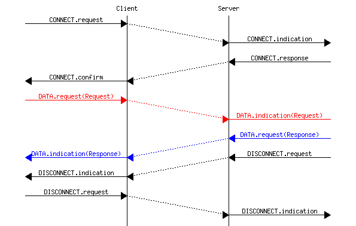

然而，随着网络的发展以支持包含图像等更丰富的文档，为每个 URI 打开 TCP 连接成为了一个性能问题[[Mogul1995]](../bibliography.html#mogul1995)。实际上，除了其 HTML 部分外，一个网页可能包含数十个或更多的图像。强迫客户端为网页的每个组件打开 TCP 连接有两个重要的缺点。首先，客户端和服务器必须交换数据包以打开和关闭 TCP 连接，正如我们稍后将要看到的。这增加了网络开销和完全检索网页所有组件的总延迟。其次，大量建立的 TCP 连接可能在服务器上成为性能瓶颈。

此问题通过扩展 HTTP 以支持持久 TCP 连接[**RFC 2616**](https://datatracker.ietf.org/doc/html/rfc2616.html)得到解决。持久连接是一个客户端可能发送多个 HTTP 请求的 TCP 连接。这在下图中说明了 HTTP 1.1 的持久连接。

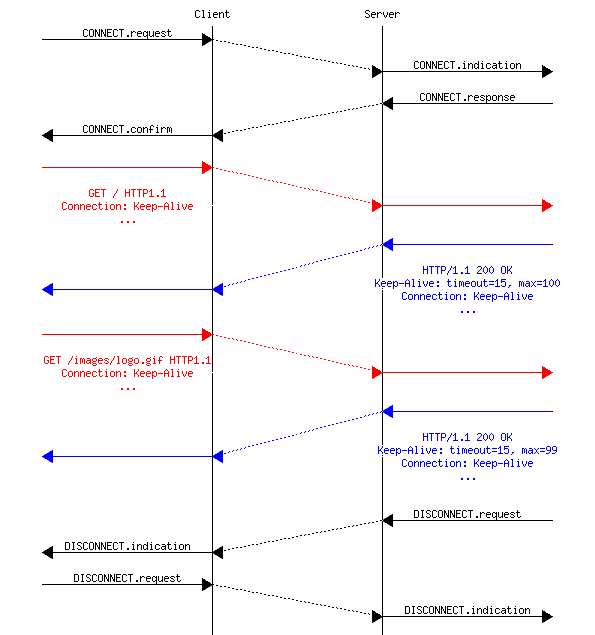

为了允许客户端和服务器控制这些持久 TCP 连接的利用率，HTTP 1.1 [**RFC 2616**](https://datatracker.ietf.org/doc/html/rfc2616.html) 定义了几个新的 HTTP 头部：

> +   Connection: 头部与 Keep-Alive 参数一起由客户端使用，以指示它期望底层 TCP 连接是持久的。当此头部与 Close 参数一起使用时，它表示发送此头部的实体将在 HTTP 响应结束时关闭底层 TCP 连接。
> +   
> +   Keep-Alive: 头部由服务器用于通知客户端它如何同意使用持久连接。一个典型的 Keep-Alive: 包含两个参数：服务器同意在底层 TCP 连接上服务的最大请求数量以及服务器将在多少秒后关闭一个空闲连接的超时时间

下面的示例显示了 HTTP/1.1 在持久 TCP 连接上操作以检索同一服务器上存储的三个 URI。一旦建立连接，客户端就发送带有 Connection: Keep-Alive 头部的第一个请求，以请求持久连接。

```sh
GET / HTTP/1.1
Host: www.kame.net
User-Agent: Mozilla/5.0 (Macintosh; U; Intel Mac OS X 10_6_2; en-us)
Connection: Keep-Alive 
```

服务器回复带有 Connection: Keep-Alive 头部的响应，并指示它接受通过此连接的最大 100 个 HTTP 请求，并且如果连接空闲 15 秒，它将关闭连接。

```sh
HTTP/1.1 200 OK
Date: Fri, 19 Mar 2010 09:23:37 GMT
Server: Apache/2.0.63 (FreeBSD) PHP/5.2.12 with Suhosin-Patch
Keep-Alive: timeout=15, max=100
Connection: Keep-Alive
Content-Length: 3462
Content-Type: text/html

<html>...   </html> 
```

客户端发送第二个请求以获取检索到的网页的样式表。

```sh
GET /style.css HTTP/1.1
Host: www.kame.net
Referer: http://www.kame.net/
User-Agent: Mozilla/5.0 (Macintosh; U; Intel Mac OS X 10_6_2; en-us)
Connection: keep-alive 
```

服务器回复请求的样式表并保持持久连接。请注意，服务器只接受通过此持久连接的 99 个剩余 HTTP 请求。

```sh
HTTP/1.1 200 OK
Date: Fri, 19 Mar 2010 09:23:37 GMT
Server: Apache/2.0.63 (FreeBSD) PHP/5.2.12 with Suhosin-Patch
Last-Modified: Mon, 10 Apr 2006 05:06:39 GMT
Content-Length: 2235
Keep-Alive: timeout=15, max=99
Connection: Keep-Alive
Content-Type: text/css

... 
```

然后客户端请求网页服务器的图标 [[18]](#ffavicon)。此服务器不包含此类图标，因此回复 404 HTTP 状态。然而，底层 TCP 连接不会立即关闭。

```sh
GET /favicon.ico HTTP/1.1
Host: www.kame.net
Referer: http://www.kame.net/
User-Agent: Mozilla/5.0 (Macintosh; U; Intel Mac OS X 10_6_2; en-us)
Connection: keep-alive

HTTP/1.1 404 Not Found
Date: Fri, 19 Mar 2010 09:23:40 GMT
Server: Apache/2.0.63 (FreeBSD) PHP/5.2.12 with Suhosin-Patch
Content-Length: 318
Keep-Alive: timeout=15, max=98
Connection: Keep-Alive
Content-Type: text/html; charset=iso-8859-1

<!DOCTYPE HTML PUBLIC "-//IETF//DTD HTML 2.0//EN"> ... 
```

如上图所示，客户端可以在同一个持久的 TCP 连接上发送多个 HTTP 请求。然而，需要注意的是，服务器将这些 HTTP 请求视为相互独立的。每个 HTTP 请求都必须是自包含的。这意味着每个请求必须包含服务器理解请求所需的所有头部行。这些请求的独立性是 HTTP 的关键设计选择之一。由于这个设计选择，当服务器处理一个 HTTP 请求时，它不会使用请求本身之外的其他任何信息。这也解释了为什么客户端会在它通过持久 TCP 连接发送的所有 HTTP 请求中添加其 User-Agent:头部。

然而，在实践中，一些服务器希望为每个用户提供定制的服务内容。例如，一些服务器可以提供多种语言的信息。其他服务器希望提供针对不同类型用户的定向广告。为了做到这一点，服务器需要维护有关每个用户偏好的某些信息，并使用这些信息来生成符合用户偏好的内容。HTTP 包含几个机制来解决此问题。我们下面讨论其中三个。

第一个解决方案是强制用户进行身份验证。这是 FTP 用来控制每个用户可以访问的文件所采用的解决方案。最初，用户名和密码可以包含在 URI 中[**RFC 1738**](https://datatracker.ietf.org/doc/html/rfc1738.html)。然而，将密码明文放在可能公开可见的 URI 中是完全不安全的，并且这种用法现在已经过时[**RFC 3986**](https://datatracker.ietf.org/doc/html/rfc3986.html)。HTTP 支持几个扩展头部[**RFC 2617**](https://datatracker.ietf.org/doc/html/rfc2617.html)，服务器可以通过提供其凭据来请求客户端进行身份验证。然而，用户名和密码在 Web 服务器上并不受欢迎，因为它们强迫人类用户为每个服务器记住一个用户名和一个密码。当用户需要访问受保护的内容时，记住密码是可以接受的，但用户不会接受为每个访问的网站记住一个唯一的用户名和密码。

允许服务器根据用户的需求和能力调整内容的第二个解决方案是依赖于不同类型的 Accept-* HTTP 头部。例如，Accept-Language:头部可以被客户端用来表示其首选的语言。不幸的是，在实践中，这个头部通常基于浏览器的默认语言来设置，用户很难通过为每个访问的 Web 服务器选择选项来表示其偏好的语言。

第三种广泛采用的方法是 HTTP cookie。HTTP cookie 最初是由[Netscape](https://en.wikipedia.org/wiki/Netscape)作为一个私有扩展开发的。现在它是标准[**RFC 6265**](https://datatracker.ietf.org/doc/html/rfc6265.html)的一部分。简而言之，cookie 是一个由服务器选择的短字符串，用来代表一个特定的客户端。使用了两个 HTTP 头：Cookie: 和 Set-Cookie:。当服务器收到一个来自新客户端的 HTTP 请求（即不包含 Cookie:头的 HTTP 请求）时，它会为该客户端生成一个 cookie，并将其包含在返回的 HTTP 响应的 Set-Cookie:头中。Set-Cookie:头包含多个附加参数，包括 cookie 有效的域名。客户端将所有接收到的 cookie 存储在磁盘上，每次它发送 HTTP 请求时，它都会验证是否已经知道该域名的 cookie。如果是这样，它会在 HTTP 请求中附加 Cookie:头。这如图所示，使用 HTTP 1.1，但 cookie 也适用于 HTTP 1.0。

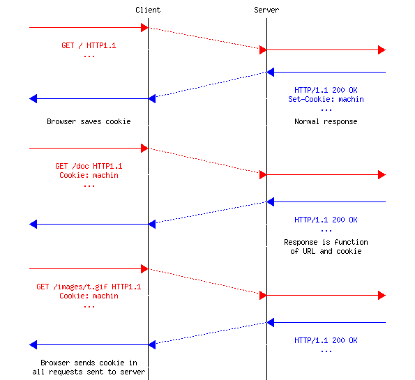

注意

HTTP 饼干带来的隐私问题

Netscape [Netscape](https://en.wikipedia.org/wiki/Netscape) 引入的 HTTP 饼干对于大型电子商务网站至关重要。然而，它们也引发了关于其[潜在滥用](http://www.nytimes.com/2001/09/04/technology/04COOK.html)的许多讨论。考虑 ad.com，这是一家在网站上投放大量广告的公司。一个希望在其内容旁边包含 ad.com 广告的网站将在其 HTML 页面中添加指向 ad.com 的链接。如果许多网站使用 ad.com，ad.com 可能能够跟踪访问其客户网站的用户的兴趣，并利用这些信息提供定向广告。隐私倡导者甚至[起诉](http://epic.org/privacy/internet/cookies/)在线广告公司，迫使他们遵守隐私法规。最近的相关技术也引发了[隐私担忧](http://www.eff.org/deeplinks/2009/09/new-cookie-technologies-harder-see-and-remove-wide)。

### HTTP 版本 2.0#

在过去十年中，越来越多的服务由万维网服务器支持。Web 协议不仅用于传输静态文档，还用于传输流媒体音乐或视频。它们还使客户端能够使用交互式应用程序，包括游戏或生产力应用程序。这些服务和应用程序的性能要求比静态文档的传输更为严格。在过去十年中，许多研究人员和公司提出了提高 Web 服务和协议性能的解决方案 [[KR2001]](../bibliography.html#kr2001) [[WBK2014]](../bibliography.html#wbk2014)。在本节中，我们讨论了其中的一部分。

提高 Web 协议性能的第一种方法是调整提供内容的服务器。在早期，文档存储在单个服务器上。客户端通过建立 TCP 连接到该服务器以检索每个文档。这种架构演变出几个方向。加快 Web 服务的一种方法是避免不必要的传输。多亏了 HEAD 方法以及 If-Modified-Since: 头部，Web 浏览器可以验证它们是否拥有缓存中最新版本的文档。

> 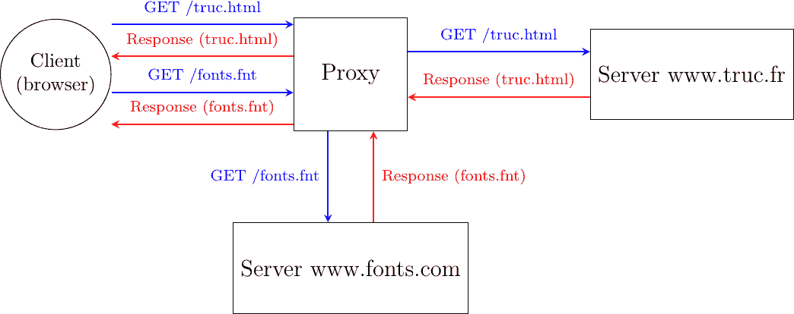
> 
> 图 36 代理将客户端请求转发到服务器，并返回接收到的响应

缓存也可以在网络内部使用。为了了解它们的益处，让我们考虑一个有十几名员工的小型企业，这些员工通过低速链路连接到互联网。这些员工经常访问类似的网站。考虑 Alice 和 Bob 想浏览今天的当地报纸。他们的浏览器将通过低带宽链路检索报纸的网站并将主要文档存储在他们的缓存中。不幸的是，相同的信息在低速链路上通过了两次。一些公司已经部署了 Web 代理来解决这个问题。Web 代理是一个位于企业网络中的服务器。所有员工的浏览器都被配置为将他们的 HTTP 请求发送到这个代理。当这样的代理收到请求时，它会检查内容是否已经存储在其自己的缓存中。如果是这样，它就直接返回。否则，请求被发送到远程服务器，信息被存储在代理缓存中。通过减少在低速链路上交换的 Web 对象数量，这样的代理可以显著提高性能。一些公司还使用它们来控制员工接触的网站，有时还会阻止非法访问。

代理也可以位于服务器之前。在这种情况下，它们被称为反向代理。考虑一个动态的 Web 服务器，它通过组装存储在不同数据库中的信息来生成网页。当这个服务器收到一个请求时，它必须向其数据库发送多个查询，然后创建 HTML 文档。这些查询和创建 HTML 文档需要时间，这限制了我们的服务器可以支持的请求数量。许多内容提供商会在这样的服务器前面放置一个反向代理。DNS 服务器被配置为指向反向代理。在接收到请求后，反向代理首先检查响应是否已经存储在其缓存中。如果是这样，它可以将其返回给客户端，而不与官方服务器交互。否则，反向代理会联系服务器，然后将响应返回给客户端。

这些反向代理也可以用来在不同服务器之间分配负载。在上面的例子中，考虑一个服务器需要 10 毫秒来处理每个请求，并且必须按顺序处理它们。这样的服务器不能支持每秒超过 100 个请求。如果服务变得流行，那么内容提供商将需要部署多个服务器。这些服务器可以服务于同一个反向代理。

注意

从多个服务器提供内容

当网络用户与 www.service.net 互动时，她期望所有信息都来自 www.service.net 服务器。如果该服务很受欢迎，可能存在数十、数百、数千甚至更多的物理服务器支持此服务。尽管如此，用户仍然有一种错觉，认为她正在与单个服务器互动。内容提供商已经部署了多种技术来扩展网络服务。考虑一个简单的服务，该服务从 N 个不同的服务器中提供文本文档。构建此类服务有几种不同的方式。

第一种方法是将在每个物理服务器上存储所有文件，并依赖 DNS 在它们之间分配负载。每个物理服务器都有自己的 IP 地址，当 DNS 服务器收到对 www.service.net 的查询时，它会返回它们的 IP 地址之一。一些 DNS 服务器使用轮询（Round-Robin）来返回这些 IP 地址中的一个。其他 DNS 服务器会测量物理服务器的负载，并返回负载较轻的那个地址。另一种可能性是将物理服务器放置在不同的地区，并配置 DNS 服务器以返回地理位置上更靠近客户端 IP 地址的服务器。

第二种方法是依赖 k 个反向代理和 N-k 个服务器。服务器存储内容，而代理缓存最常用的文件。代理可以地理位置上靠近客户端，而服务器可以位于内容提供商的数据中心。DNS 服务器还可以在不同代理之间分配负载，或者返回地理位置上最近的代理。关于反向代理的一个重要观点是，它们从客户端接收 HTTP 请求，并将 HTTP 请求发送到托管内容的原始服务器。一些公司，通常被称为内容分发网络，已经在全球范围内部署了这样的反向代理，以在终端用户附近缓存网页内容。在[[NSS2010]](../bibliography.html#nss2010)中可以找到对这种 CDN 的良好描述。

提高网页性能的第二种方法是减少检索网页对象所需的时间。虽然最初的网页服务器返回的是包含可能一些图片的 HTML 文档，但今天的丰富网页服务器返回的是一个包含相关样式表、JavaScript 代码、图片、字体等的 HTML 文档。其中一些网页对象来自原始服务器，而其他则托管在不同的服务器上。如今，一个典型的网页平均包含大约 2 MBytes 的数据。根据 httparchive.org 收集的统计数据，网页的大小持续增长，如图 37 所示。针对移动设备的网页略小一些。

(../_images/httparchive-bytes.png)

图 37 网页大小的演变（来源：[`httparchive.org/reports/page-weight`](https://httparchive.org/reports/page-weight))#

仔细观察平均网页，我们发现它平均包含 27 KBytes 的 HTML，120 KBytes 的字体，60 KBytes 的 CSS 信息，几乎 1 MBytes 的图像和超过 400 KBytes 的 javascript。每个网页都需要大约 70 个不同的 HTTP 请求。换句话说，浏览器需要平均发送 70 个请求来检索一个完整的网页。

为了提高这些网页的传输，已经探索了两个方向。第一个方向是调整 HTTP 协议。第二个方法是改变整个网络栈。这种方法在 QUIC 章节中讨论。

从性能角度来看，HTTP 的一个局限性是浏览器发送的请求必须是顺序的。通常，浏览器请求 HTML 页面。一旦页面被检索，浏览器会解析它以识别所有引用的对象，并依次请求它们。只有当所有必需的网页对象都被检索后，网页才能显示给用户。这意味着浏览器必须在接收每个响应之前等待发送下一个请求。另一种可能性是允许浏览器在不等待相应响应的情况下发送多个请求。这种方法在[**RFC 7230**](https://datatracker.ietf.org/doc/html/rfc7230.html)中被称为流水线。

要理解流水线的优势，让我们考虑一个简单但具有说明性的例子。一个客户端需要检索 5 个各为 100 字节的网页对象。底层传输连接具有 1 Gbps 的带宽，但单向延迟为 100 毫秒。一个普通的 HTTP/1.x 客户端会发送第一个请求，等待 200 毫秒以接收答案，然后发送另一个请求……它需要整整一秒来检索五个网页对象。这如图图 38 所示。

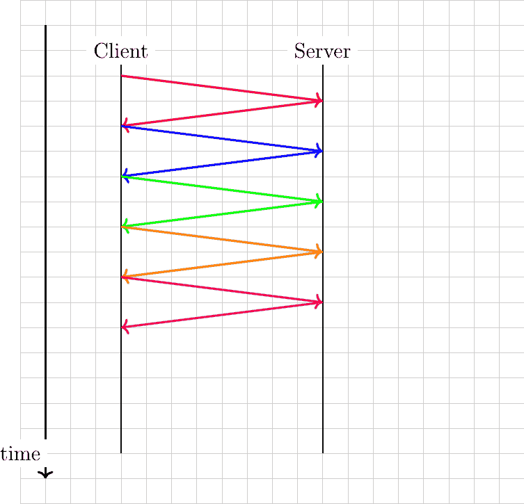

图 38 向给定服务器发送的 HTTP 请求序列

使用流水线，客户端立即发送五个请求，并在 200 毫秒后收到五个响应。图 39 说明了流水线的优势。

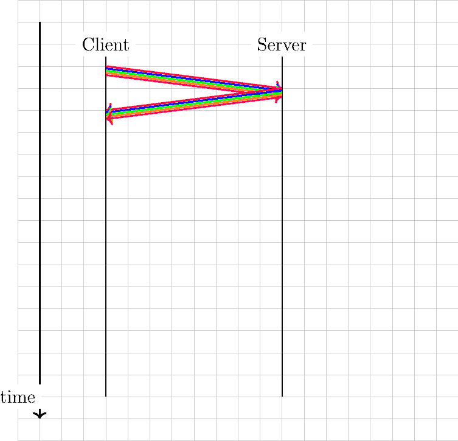

图 39 使用流水线向服务器发送的 HTTP 请求序列

然而，正如[**RFC 7230**](https://datatracker.ietf.org/doc/html/rfc7230.html)中解释的那样，流水线有一个重要的限制。它只能用于服务幂等的 HTTP 请求，即管道中的任何请求都不能依赖于之前的任何请求。结果发现，对于网络浏览器来说，正确支持这一要求很困难，而且其中很少实现了流水线[[19]](#fpipelining)。

HTTP/1.1 的另一个限制是所有命令和参数都编码为 ASCII 字符串。使用 ASCII 字符串使得编写简单的客户端或通过观察数据包来调试问题变得容易。不幸的是，这种负担落在了需要包含复杂解析器以接受广泛部分兼容实现的服务器上。此外，ASCII 编码的灵活性也使得一些针对服务器的安全攻击成为可能 [[CWE444]](../bibliography.html#cwe444)。

为了应对这两个问题，IETF HTTP 工作组开发了 HTTP 的 2.0 版本。HTTP/2.0 在两个重要方面与 HTTP/1.1 不同。首先，HTTP/2.0 依赖于二进制编码，这种编码既更紧凑又更容易解析。其次，HTTP/2.0 支持多个流，这使得在单个传输连接上同时传输不同的 Web 对象成为可能。此外，HTTP/2.0 还压缩 HTTP 头部以减少传输的数据量。这种技术描述在[**RFC 7541**](https://datatracker.ietf.org/doc/html/rfc7541.html)中，但本章没有讨论。

让我们先看看 HTTP/2.0 是如何结构化底层连接的字节流的。


图 40 HTTP/2.0 帧头#

在 HTTP/2.0 会话中交换的信息由帧组成。一个帧以一个 9 字节长的头部开始，它携带了多种类型的信息，如图 40 所示。图 40。HTTP/2.0 的帧长度是可变的。头部中的长度字段包含帧有效载荷的长度（以字节为单位）。由于该字段编码为 24 位字段，HTTP/2.0 的帧长度不能超过$ 2^{24} -1 $字节。需要注意的是，[**RFC 7540**](https://datatracker.ietf.org/doc/html/rfc7540.html)假设 HTTP/2.0 帧有效载荷的最大大小为$ 2^{14} $字节，即 16,384 字节，除非在会话开始时通过 HTTP/2.0 设置帧协商了一个更长的最大帧长度，该设置帧将在后面描述。帧头部的下一个字段指示帧类型。最初的帧类型是数据帧，它包含来自 Web 对象的数据，以及包含 HTTP/2.0 头部的头部帧。当客户端从服务器检索 Web 对象时，它总是接收到一个 HTTP/2.0 头部帧，然后是一个 HTTP/2.0 数据帧。头部帧信息基本上与 HTTP/1.1 支持的 HTTP 头部相同，但它们通过利用数据压缩技术进行编码，以最小化传输这些头部所需的字节数。

其他帧类型将在后面描述。标志用于某些帧类型，R 位必须设置为 0。HTTP/2.0 帧头中最后一个重要的字段是流标识符。在 HTTP/2.0 中，底层传输连接的字节流被划分为独立的流，这些流由一个整数标识。奇数（或偶数）流标识符由客户端（或服务器）管理。这使得服务器（或客户端）能够在一个字节流上多路复用对应不同帧的数据。

从性能角度来看，这种多路复用能力可能是 HTTP/2.0 最重要的特性。为了理解其好处，让我们考虑一个通过 1 Mbps 连接检索两个网页对象的客户端。客户端将这两个请求一起发送。第一个对象长度为 125 字节，而第二个对象长度为 12500 字节。在这种情况下，服务器将首先以单个帧的形式返回第一个对象，第二个对象将在后续帧中发送。

现在考虑第一个对象长度为 12500 字节，第二个对象长度为 125 字节，如图 41 所示。通过 1 Mbps 连接，这个对象将占用底层连接 100 毫秒。因此，客户端需要等待 100 毫秒才能检索第二个对象。这是首部阻塞（HoL）问题，它影响了许多网络服务的性能。如果短网页对象是请求其他网页对象的 javascript 代码，其检索可能对显示检索到的网页至关重要。

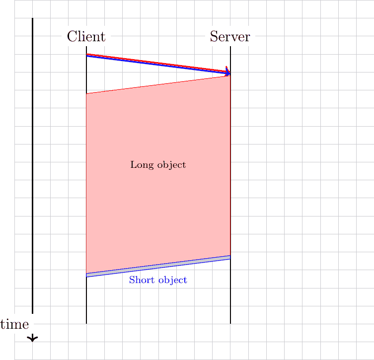

图 41 首部阻塞，大响应可能影响小响应

使用 HTTP/2.0 帧，服务器可以在 10 毫秒内发送长对象的第一个 1250 字节，然后发送一个包含短对象的第二个帧，持续一毫秒，之后发送一个包含长对象剩余 11250 字节的更长帧。这如图 42 所示。在这种情况下，客户端在 10 毫秒后收到了短对象。考虑到 HTTP/2.0 流，长网页对象的传输不再阻塞短对象的传输。

HTTP/2.0 帧的长度显然会影响不同网页对象如何在底层传输连接上多路复用。如果 HTTP/2.0 帧很长，帧头的开销最小，但长帧可能会阻塞短网页对象。另一方面，如果帧长度较小，那么 HTTP/2.0 帧头的开销可能会变得显著。

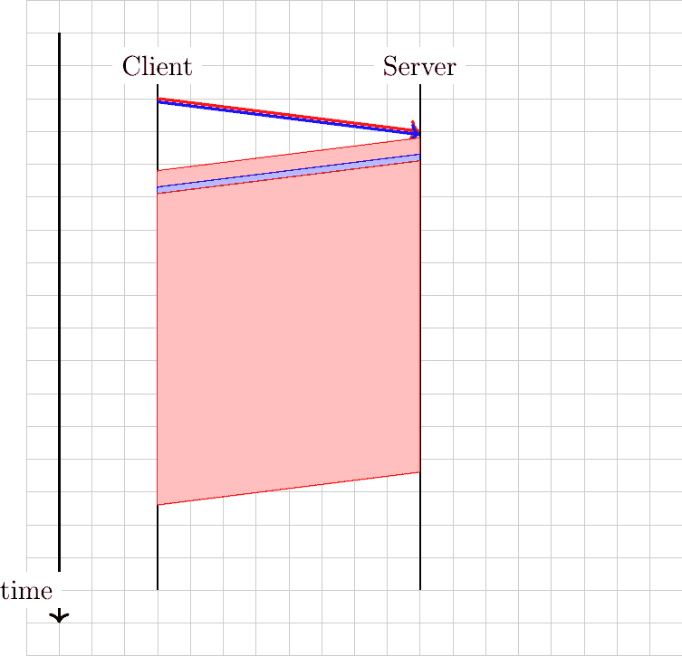

图 42 HTTP/2 帧中的数据可以交错以防止首部阻塞

HTTP/2.0 流可以提供性能优势，但它们也增加了实现的复杂性，因为 HTTP/2.0 接收器必须能够同时处理对应于不同网络对象的不同帧。这种复杂性主要存在于客户端。HTTP/2.0 协议包括一些技术，使客户端能够管理 HTTP/2.0 会话的利用率。

客户端在 HTTP/2.0 会话中发送的第一个帧是设置帧。这是一个控制帧，指示客户端为此次会话提出的某些参数。其中一些参数在 [**RFC 7540**](https://datatracker.ietf.org/doc/html/rfc7540.html) 中定义。其中最重要的可能是 `SETTINGS_MAX_FRAME_SIZE`，它指定了此实现支持的 HTTP/2.0 帧的最大长度，以及 `SETTINGS_MAX_CONCURRENT_STREAMS`，它指定了此实现可以管理的最大并行流数。`SETTINGS_MAX_FRAME_SIZE` 必须至少为 $ 2^{14} $ 字节，但可以高达 $ 2^{24} -1 $ 字节。`SETTINGS_MAX_CONCURRENT_STREAMS` 没有最小值，但 [**RFC 7540**](https://datatracker.ietf.org/doc/html/rfc7540.html) 建议至少支持 100 个不同的流标识符。

通过使用多个流，服务器可以在相同的底层传输连接上多路复用不同的网络对象。然而，这些对象仅在客户端请求时发送。有些情况下，服务器可能提前知道客户端将请求某个特定对象。它可以在收到客户端请求之前发送该对象，从而加快传输速度。这是 HTTP/2.0 的推送功能。服务器可以在没有收到任何请求的情况下独立地将网络对象推送到客户端。此功能只能在客户端通过在其设置帧中发送 `SETTINGS_ENABLE_PUSH` 启用它的情况下由服务器使用。此推送功能的经典用例是允许服务器在请求引用它的另一个网络对象时自动发送一个客户端无法缓存的对象，例如动态 JavaScript 代码。然而，测量研究表明，似乎很少有网络服务器采用了此功能 [[ZWH2018]](../bibliography.html#zwh2018)。

HTTP/2.0 的另一个特点是，可以为不同的流分配不同的优先级。高优先级的流应该携带比低优先级流更多的数据帧。HTTP/2.0 规范定义了用于此目的的优先级帧。

由于服务器可以同时发送多个对象，因此存在过载客户端缓冲区的风险。为了应对这个潜在问题，HTTP/2.0 包括它自己的流量控制机制。当 HTTP/2.0 会话开始时，接收方同意通过此连接接收最多 65,535 字节（除非它在设置帧中指示了不同的初始窗口）。这限制了发送方在 HTTP/2.0 会话中可以传输的数据量。接收方可以通过在任何时候发送 Window_Update 帧来宣传一个大的接收窗口。这种流量控制机制可以应用于整个连接或特定的流。在实践中，使用小的 HTTP/2.0 窗口可能会严重限制 HTTP/2.0 会话的吞吐量。

HTTP/2.0 包含的内容远不止我们在本简短介绍中涵盖的内容。例如，有一个允许测量客户端和服务器之间往返时间的 Ping 帧，或者表示 HTTP/2.0 会话终止的 GoAway 帧。这个帧包含一个错误代码，指示会话终止的原因。在[**RFC 7540**](https://datatracker.ietf.org/doc/html/rfc7540.html)中定义了多个错误代码，包括用于指示其他端点表现出可能导致过度负载的行为的 ENHANCE_YOUR_CALM。

注意

检测服务器是否支持 HTTP/2.0

HTTP/2.0 是 HTTP 协议的新版本，仍然使用端口 80。当客户端联系 HTTP 服务器时，它必须能够确定它是否支持 HTTP/1.x 或 HTTP/2.0。如果客户端向只支持 ASCII 编码的 HTTP/1.x 的服务器发送二进制编码的 HTTP/2.0 请求，可能会在服务器上引起问题，甚至导致其崩溃。为了最小化 HTTP/1.x 服务器崩溃的风险，HTTP/2.0 会话的启动方式类似于 HTTP/1.1 会话，第一个请求包含连接、升级和 HTTP2-Settings 头。下面是一个升级 HTTP 版本请求的示例。

```sh
GET /robots.txt HTTP/1.1
Host: nghttp2.org
User-Agent: curl/7.52.1
Connection: Upgrade, HTTP2-Settings
Upgrade: h2c
HTTP2-Settings: AAMAAABkAARAAAAA 
```

HTTP2-Settings 行包含客户端在 HTTP/2.0 会话中通过 Base64 编码发送的 HTTP/2.0 设置帧。服务器通过一个响应来表示它已接受升级连接到 HTTP/2.0。下面是一个示例响应。

```sh
HTTP/1.1 101 Switching Protocols
Connection: Upgrade
Upgrade: h2c 
```

最后，客户端和服务器需要确认 HTTP/2.0 的使用。客户端通过发送以下魔幻字符串 PRI * HTTP/2.0rnrnSMrnrn 或 0x505249202a20485454502f322e300d0a0d0a534d0d0a0d0a 十六进制来确认。这个字符串后面跟着一个设置帧。服务器必须发送一个可能为空的设置帧。

## 远程过程调用#

在前面的章节中，我们描述了几个协议，这些协议使人类能够交换消息和访问远程文档。这并不是计算机网络的唯一用途，在许多情况下，应用程序使用网络与其他应用程序交换信息。当一个应用程序需要在主机上执行大量计算时，有时从其他主机请求计算可能是有用的。许多分布式系统是通过在不同主机上分布应用程序并使用远程过程调用作为基本构建块来构建的。

在传统的编程语言中，过程调用允许程序员更好地组织他们的代码。每个过程都有一个名称、一个返回类型和一组参数。当调用一个过程时，程序执行的当前流程会被转移到执行该过程。这个过程使用提供的参数来执行其计算，并返回一个或多个值。这个编程模型是针对单个主机设计的。简而言之，大多数编程语言都支持它如下：

> 1.  调用者将参数的值放置在调用者可以访问的位置（寄存器、堆栈等）
> 1.  
> 1.  调用者将执行控制权转移到被调用者的过程
> 1.  
> 1.  被调用者访问参数并执行所需的计算
> 1.  
> 1.  被调用者将返回值（们）放置在调用者可以访问的位置（寄存器、堆栈等）
> 1.  
> 1.  被调用者将执行控制权返回给调用者

该模型是针对单个主机开发的。如果调用者和被调用者是通过网络连接的不同主机，应该如何修改？由于两个主机可能不同，两个主要问题就是它们不共享相同的内存，并且它们不一定使用相同的表示方式来表示数字、字符等。让我们来探讨如何通过网络支持上述确定的五个步骤。

需要解决的首要问题是如何将信息从调用者传输到被调用者。这个问题并不简单，包括两个子问题。第一个子问题是信息的编码。如何编码参数的值，以便它们可以通过网络正确传输？第二个问题是如何通过网络到达被调用者？被调用者通过一个过程名称来识别，但为了使用传输服务，我们需要将此名称转换为地址和端口号。

### 数据编码#

编码问题存在于广泛的应用中。在前几节中，我们描述了基于字符的编码如何在电子邮件和 HTTP 中应用。尽管已经定义了标准编码技术，如 ASN.1 [[Dubuisson2000]](../bibliography.html#dubuisson2000)，以覆盖大多数应用需求，但许多应用已经定义了它们自己的特定编码。远程过程调用也不例外。最流行的三种编码方法可能是 ONC-RPC [**RFC 1832**](https://datatracker.ietf.org/doc/html/rfc1832.html) 使用的 XDR，[**RFC 1831**](https://datatracker.ietf.org/doc/html/rfc1831.html)，以及 XML-RPC 使用的 XML 和 JSON [**RFC 4627**](https://datatracker.ietf.org/doc/html/rfc4627.html)。

外部数据表示（XDR）标准，在[**RFC 1832**](https://datatracker.ietf.org/doc/html/rfc1832.html)中定义，是一个早期规范，描述了在远程过程调用期间交换的信息在通过网络传输之前应该如何编码。由于传输服务允许传输一个字节块（通过无连接服务）或一个字节流（通过使用面向连接的服务），XDR 将每个数据类型映射到一系列字节。调用方将每个数据编码到适当的序列中，而被调用方解码接收到的信息。以下是从[**RFC 1832**](https://datatracker.ietf.org/doc/html/rfc1832.html)中提取的一些示例，以说明这种编码/解码是如何执行的。

对于基本数据类型，[**RFC 1832**](https://datatracker.ietf.org/doc/html/rfc1832.html) 简单地将它们的表示映射到一系列字节。例如，一个 32 位整数按照图 43（字节顺序从最高位开始，对应大端编码）所示的方式传输。


图 43 XDR 表示的 32 位整数#

XDR 还支持 64 位整数和布尔值。布尔值映射到整数（0 表示假，1 表示真）。对于浮点数，使用 IEEE 标准中定义的编码。在表示中，第一个位（S）是符号（0 表示正）。接下来的 11 位表示数字的指数（E），以 2 为基数，剩余的 52 位是数字的小数部分（F）。与这种表示相对应的浮点数是 $ (-1)^{S} \times 2^{E-1023} \times 1.F $。XDR 还允许编码复杂的数据类型。第一个例子是字节数组。字节数组由两部分组成：一个长度（编码为一个整数）和一个字节序列。出于性能考虑，字符串的编码对齐到 32 位边界。这意味着如果字符串的长度不是 4 的倍数，编码操作过程中可能会插入一些填充字节。字符串的结构如下所示（来源 [**RFC 1832**](https://datatracker.ietf.org/doc/html/rfc1832.html))。


图 44 XDR 表示浮点数#

在某些情况下，需要编码固定长度或可变长度的数组。XDR [**RFC 1832**](https://datatracker.ietf.org/doc/html/rfc1832.html) 支持此类数组。例如，图 45 中的编码对应于包含 n 个元素的数组。编码表示从包含元素数量的整数开始，随后是所有元素按顺序排列。


图 45 XDR 表示数组#

XDR 还支持联合、结构体等的定义。更多详细信息请参阅 [**RFC 1832**](https://datatracker.ietf.org/doc/html/rfc1832.html)。

编码数据的第二种流行方法是 JavaScript 对象表示法 (JSON)。这种语法最初是为了允许用 JavaScript 编写的应用程序交换数据而定义的，但现在它有更广泛的应用。JSON [**RFC 4627**](https://datatracker.ietf.org/doc/html/rfc4627.html) 是一种基于文本的表示。最简单的数据类型是整数。它以 ASCII 码中的数字序列表示。字符串也可以通过使用 JSON 进行编码。JSON 字符串始终以引号字符（”）开头和结尾，就像 C 语言一样。与 C 语言一样，如果某些字符（如 “ 或 \）出现在字符串中，则必须进行转义。[**RFC 4627**](https://datatracker.ietf.org/doc/html/rfc4627.html) 详细描述了这一点。布尔值也通过使用字符串 false 和 true 来支持。与 XDR 类似，JSON 支持更复杂的数据类型。结构或对象定义为用花括号括起来的元素列表，元素之间用逗号分隔。[**RFC 4627**](https://datatracker.ietf.org/doc/html/rfc4627.html) 提供了以下示例作为说明。

```sh
{
  "Image":  {
  "Width":  800,
  "Height":  600,
  "Title":  "View from 15th Floor",
  "Thumbnail":  {
  "Url":  "http://www.example.com/image/481989943",
  "Height":  125,
  "Width":  100
  },
  "ID":  1234
  }
} 
```

此对象有一个名为 Image 的字段。它有五个属性。第一个属性，Width，是一个设置为 800 的整数。第三个属性是一个字符串。第四个属性，Thumbnail，也是一个由三个不同属性组成的对象，包括一个字符串和两个整数。JSON 也可以用来编码数组或列表。在这种情况下，使用方括号作为分隔符。下面的代码片段显示了一个包含小于十的质数的数组。

```sh
{
  "Primes"  :  [  2,  3,  5,  7  ]
} 
```

与 XDR 相比，JSON 的主要优势是传输语法易于人类阅读。然而，这是以牺牲更紧凑的编码为代价的。一些用 JSON 编码的数据通常比用 XDR 编码时占用更多空间。已经定义了更紧凑的编码方案，例如 [[BH2013]](../bibliography.html#bh2013) 和其中的参考文献。

### 到达被调用方#

第二个子问题是如何到达被调用方。解决这个问题的简单方法是在远程机器上确保被调用方监听一个特定的端口，然后与这个服务器进程交换信息。这是 JSON-RPC [[JSON-RPC2]](../bibliography.html#json-rpc2) 所选择的解决方案。JSON-RPC 可以通过无连接或面向连接的传输服务使用。一个 JSON-RPC 请求包含以下字段：

> +   jsonrpc: 一个表示所使用的协议版本的字符串。这对于允许协议在未来进行演变非常重要。
> +   
> +   method: 一个包含被调用过程名称的字符串
> +   
> +   params: 一个包含传递给方法的参数值的结构
> +   
> +   id: 由调用者选择的标识符

JSON-RPC 被编码为一个 JSON 对象。例如，下面的示例展示了调用一个名为 sum 的方法，其参数为 1 和 3。

```sh
{  "jsonrpc":  "2.0",  "method":  "sum",  "params":  [1,  3],  "id":  1  } 
```

在接收到此 JSON 结构后，调用者解析对象，找到对应的方法，并传递参数。此方法返回一个响应，该响应也编码为 JSON 结构。此响应包含以下字段：

> +   jsonrpc：一个表示用于编码响应的协议版本的字符串
> +   
> +   id：与调用者选择的标识符相同的标识符
> +   
> +   结果：如果请求成功，此成员包含请求的结果（在我们的例子中，值为 4）。
> +   
> +   错误：如果调用不存在或其执行导致错误，结果元素将被错误元素替换，该错误元素包含以下成员：
> +   
>     > +   code：一个表示错误类型的数字。在[[JSON-RPC2]](../bibliography.html#json-rpc2)中定义了几个错误代码。例如，-32700 表示请求解析错误，-32602 表示参数无效，-32601 表示服务器上找不到该方法。其他错误代码在[[JSON-RPC2]](../bibliography.html#json-rpc2)中列出。
>     > +   
>     > +   消息：一个字符串（限于一句话），提供错误的简短描述。
>     > +   
>     > +   数据：一个可选字段，提供有关错误的附加信息。

回到我们关于求和过程调用的例子，它将返回以下 JSON 结构。

```sh
{  "jsonrpc":  "2.0",  "result":  4,  "id":  1  } 
```

如果服务器上未实现求和方法，它将回复以下响应。

```sh
{  "jsonrpc":  "2.0",  "error":  {"code":  -32601,  "message":  "Method not found"},  "id":  "1"  } 
```

id 字段，存在于请求和响应中，在 DNS 消息中的标识符字段中扮演相同的作用。它允许调用者将响应与其发送的请求匹配。当在不可靠的无连接传输服务上使用 JSON-RPC 时，此 id 非常重要。如果发送请求，它可能需要重新传输，并且可能调用者会收到两次相同的请求（例如，如果第一个请求的响应丢失）。在 DNS 中，当请求丢失时，可以重新传输而不会造成任何困难。然而，在一般远程过程调用中，丢失可能会引起一些问题。考虑一个用于在银行账户上存钱的函数。如果请求丢失，它将被重新传输，存款最终会完成。然而，如果响应丢失，调用者也会重新传输其请求。此请求将被调用者接收，并将再次存钱。为了防止这个问题影响应用程序，程序员必须确保它调用的远程过程可以安全地多次调用，或者应用程序必须验证请求是否已经传输。在大多数部署中，程序员使用可以安全多次调用而不破坏应用程序逻辑的远程方法。

ONC-RPC 使用一种更复杂的方法来允许调用者到达被调用者。在主机上，服务器进程可以运行在不同的端口上，鉴于端口号值的限制（因特网上的每个主机有 $ 2^{16} $ 个端口号），为每种方法预留一个端口号是不可能的。ONC-RPC [**RFC 1831**](https://datatracker.ietf.org/doc/html/rfc1831.html) 中使用的解决方案是使用一种特殊的方法，称为端口号映射器 [**RFC 1833**](https://datatracker.ietf.org/doc/html/rfc1833.html)。端口号映射器是一种在提供方法的服务器上运行的目录。端口号映射器运行在标准端口（ONC-RPC [**RFC 1833**](https://datatracker.ietf.org/doc/html/rfc1833.html) 的 111）上。实现方法的服务器进程在其本地端口号映射器上注册其方法。当调用者需要调用远程服务器上的方法时，它首先联系端口号映射器以获取实现该方法的服务器进程的端口号。端口号映射器的响应允许它直接联系实现该方法的服务器进程。

脚注

## 命名和寻址#

网络和传输层依赖于编码为固定大小位字符串的地址。网络层地址唯一标识一个主机。多个传输层实体可以使用同一网络层的服务。例如，可靠的传输协议和无连接的传输协议可以在同一主机上共存。在这种情况下，网络层会多路复用这两个协议产生的段。这种多路复用通常是通过在网络数据包头部放置一个字段来实现的，该字段指示哪个传输协议应该处理该段。鉴于不同的传输协议数量很少，这个字段不需要很长。端口号在传输层也扮演着类似的角色，因为它们使传输层能够多路复用来自多个应用程序进程的数据。

虽然地址对于网络和传输层实体来说是自然的，但人类在与网络服务交互时更喜欢使用名称。名称可以被编码为字符串，并且映射服务允许应用程序将名称映射到相应的地址。使用名称对人类来说更加友好，但它也提供了一种间接性，这在许多情况下非常有用。

在互联网的早期，只有少数主机（主要是小型计算机）连接到网络。最受欢迎的应用程序是远程登录和文件传输。到 1983 年，已有五百台主机连接到互联网 [[Zakon]](../bibliography.html#zakon)。这些主机中的每一台都有一个唯一的地址。强迫用户记住他们想要使用的宿主机的地址并不友好。人类更喜欢记住名称并在需要时使用它们。将名称用作地址的别名是计算机科学中的一种常见技术。它简化了应用程序的开发，并允许开发者忽略低级细节。例如，通过使用编程语言而不是编写机器代码，开发者可以编写软件而无需知道它所使用的变量是存储在内存中还是寄存器内。

由于名称比地址处于更高的层次，因此它们允许（在上述编程示例和互联网上）将地址视为仅是技术标识符，可以随意更改。只有名称是稳定的。

允许应用程序使用名称的第一个解决方案是 hosts.txt 文件。此文件类似于编译代码中找到的符号表。它包含每个互联网主机名称与其相关地址之间的映射 [[1]](#fhosts)。该文件由 SRI 国际网络信息中心（NIC）维护。当一个新的主机连接到网络时，系统管理员必须在该 NIC 上注册其名称和地址。NIC 会更新其服务器上的 hosts.txt 文件。所有互联网主机都会定期从[SRI](https://www.sri.com)服务器检索更新的 hosts.txt 文件。此文件存储在每个互联网主机的一个知名位置（见[**RFC 952**](https://datatracker.ietf.org/doc/html/rfc952.html)），网络应用程序可以使用它来查找与名称对应的地址。

当网络上有数百台主机时，可以使用 hosts.txt 文件。然而，显然它不适用于包含数千或数百万主机的网络。在大网络中的一个关键问题是定义一个合适的命名方案。ARPANet 最初使用平面命名空间，即每个主机都被分配了一个唯一的名称。为了限制名称之间的冲突，这些名称通常包含机构的名称以及一个后缀来识别机构内的主机（一种简陋的分层命名方案）。在 ARPANet 上，很少有机构有多个主机连接到网络。

然而，在 ARPANet 结束之前，扁平命名方案的局限性已经变得明显，[**RFC 819**](https://datatracker.ietf.org/doc/html/rfc819.html) 提出了一个分层命名方案。虽然 [**RFC 819**](https://datatracker.ietf.org/doc/html/rfc819.html) 讨论了将名称组织为有向图的可能性，但互联网选择了能够包含所有名称的树状结构。在这个树中，顶级域名是直接连接到根的。第一个顶级域名是 .arpa [[2]](#fdnstimeline)。这个顶级域名最初被添加到连接到 ARPANet 的主机名称之后，并在 hosts.txt 文件中列出。1984 年，添加了 .gov、.edu、.com、.mil 和 .org 通用顶级域名。[**RFC 1032**](https://datatracker.ietf.org/doc/html/rfc1032.html) 提出了使用两个字母的 ISO-3166 国家代码作为顶级域名。由于 ISO-3166 为联合国认可的每个国家定义了一个两字母代码，这允许所有国家自动拥有顶级域名。这些域名包括 .be（比利时）、.fr（法国）、.us（美国）、.ie（爱尔兰）或 .tv（图瓦卢），太平洋上的一组小岛屿，或 .tm（土库曼斯坦）。顶级域名集合由互联网名称与数字地址分配机构 (ICANN) 管理。ICANN 添加与国家无关的通用顶级域名，并为加泰罗尼亚语注册了 .cat 顶级域名。在 ICANN 内部正在进行增加顶级域名数量的讨论。

每个顶级域名都由一个组织管理，该组织决定子域名名的注册方式。大多数顶级域名采用先到先得系统，允许任何人注册域名，但也有例外。例如，.gov 保留给美国政府，.int 保留给国际组织，而 .ca 域名主要 [保留](http://en.wikipedia.org/wiki/.ca) 给在加拿大存在的公司或用户。


图 23 域名树

域名语法已在 [**RFC 1035**](https://datatracker.ietf.org/doc/html/rfc1035.html) 中定义得更加精确。本文件推荐以下 BNF 用于完全限定域名（域名本身具有更丰富的语法）。

列表 1 完全限定主机名的 BNF 格式#

```sh
domain  ::=  subdomain  |  " "
subdomain  ::=  label  |  subdomain  "."  label
label  ::=  letter  [  [  ldh-str  ]  let-dig  ]
ldh-str  ::=  let-dig-hyp  |  let-dig-hyp  ldh-str
let-dig-hyp  ::=  let-dig  |  "-"
let-dig  ::=  letter  |  digit
letter  ::=  any  one  of  the  52  alphabetic  characters  A  through  Z  in  upper  case  and  a  through  z  in  lower  case
digit  ::=  any  one  of  the  ten  digits  0  through  9 
```

此语法指定主机名是由点（.）字符分隔的标签有序列表。每个标签可以包含字母、数字和连字符字符 (-) [[3]](#fidn)。完全限定的域名从左到右读取。第一个标签是主机名或域名，后面跟着域名的层次结构，并以右侧隐含的根结束。顶级域名必须是已注册的 TLD 之一 [[4]](#ftld)。例如，在上面的图中，www.computer-networking.info 对应于 info 顶级域中 computer-networking 域内的一个名为 www 的主机。

注意

一些视觉上相似的字符有不同的字符编码

域名系统是在互联网主要在北美使用的时候创建的。最初的设计假设所有域名都由字母和数字组成 [**RFC 1035**](https://datatracker.ietf.org/doc/html/rfc1035.html)。随着互联网在其他地区的使用增长，支持非 ASCII 字符变得很重要。为此，对域名系统提出了扩展 [**RFC 3490**](https://datatracker.ietf.org/doc/html/rfc3490.html)。简而言之，用于支持国际化域名的解决方案工作原理如下。首先，可以使用大多数 Unicode 字符来编码域名和主机名，但有少数例外（例如，点字符不能是名称的一部分，因为它用作分隔符）。一旦域名被编码为一系列 Unicode 字符，它就会被转换成一个包含 `xn--` 前缀和一系列 ASCII 字符的字符串。有关这些算法的更多详细信息，请参阅[**RFC 3490**](https://datatracker.ietf.org/doc/html/rfc3490.html)和[**RFC 3492**](https://datatracker.ietf.org/doc/html/rfc3492.html)。

使用所有 Unicode 字符创建域名的可能性开启了一种新的攻击形式，称为[同音攻击](https://en.wikipedia.org/wiki/IDN_homograph_attack)。这种攻击发生在两个字符串或域名在视觉上相似，但并不对应同一服务器的情况下。一个简单的例子是[`G00GLE.COM`](https://G00GLE.COM)和[`GOOGLE.COM`](https://GOOGLE.COM)。这两个 URL 在视觉上非常接近，但它们对应不同的名称（第一个不指向一个有效的服务器 [[5]](#fg00gle)）。使用其他 Unicode 字符，可以构建与现有域名视觉上等效的域名。有关此攻击的更多详细信息，请参阅[[Zhe2017]](../bibliography.html#zhe2017)。

这种分层命名方案是域名系统 (DNS) 的关键组成部分。DNS 是一个分布式数据库，包含完全限定域名和地址之间的映射。DNS 使用客户端-服务器模型。客户端是需要检索给定名称映射的主机或应用程序。每个 域名服务器 存储分布式数据库的一部分，并回答客户端发送的查询。每个域至少有一个 域名服务器。在下图中，域由圆圈表示，域 dom 内有三个主机（h1、h2 和 h3），域 a.sdom1.dom 内有三个主机。如图所示，子域可能包含主机名和子域。


图 24 域名的一个简单树结构

负责域 dom 的 域名服务器 可以直接回答以下查询：

> +   直接位于域 dom 内的任何主机的地址（例如，上图中的 h2.dom）
> +   
> +   负责域 dom 任何直接子域的域名服务器（即上图中的 sdom1.dom 和 sdom2.dom，但不包括 z.sdom1.dom）

要检索主机 h2.dom 的映射，客户端将其查询发送给负责 .dom 域的域名服务器。域名服务器直接回答查询。要检索 h3.a.sdom1.dom 的映射，DNS 客户端首先向负责 .dom 域的域名服务器发送查询。此域名服务器返回负责 sdom1.dom 域域的域名服务器。现在可以通过联系此域名服务器来获取负责 a.sdom1.dom 域域的域名服务器。可以通过联系此域名服务器来检索 h3.a.sdom1.dom 名称的映射。多亏了这种结构，DNS 客户端可以获取 .dom 域域内或其任何子域内的任何主机的映射。为确保任何 DNS 客户端都能解析任何完全限定的域名，存在负责域名层次结构根部的特殊域名服务器。这些域名服务器被称为 根域名服务器。

每个根域名服务器维护所有顶级域名及其地址的域名服务器列表 [[6]](#froot)。所有根域名服务器合作并提供相同的答案。通过查询任何根域名服务器，DNS 客户端可以获取负责任何顶级域名的域名服务器。从这个域名服务器，可以解析任何域名。

为了能够联系根名称服务器，每个 DNS 客户端都必须知道它们的地址。这意味着 DNS 客户端必须维护根名称服务器地址的最新列表。没有这个列表，就无法联系根名称服务器。强制所有互联网主机维护这个列表的最新版本在操作上会很困难。为了解决这个问题，DNS 的设计者引入了一种特殊的 DNS 服务器类型：DNS 解析器。一个 解析器 是为客户端集提供名称解析服务的服务器。通常，网络中包含几个解析器。这些网络中的每个主机都被配置为通过其本地解析器发送所有其 DNS 查询。这些查询被称为递归查询，因为 解析器 必须递归地向名称服务器层次结构发送请求以获取答案。

DNS 解析器相较于让每个互联网主机直接查询名称服务器，具有几个优势。首先，常规互联网主机无需维护根服务器地址的最新列表。其次，常规互联网主机无需向互联网上的所有名称服务器发送查询。此外，由于 DNS 解析器为大量主机提供服务，它可以缓存收到的答案。这使得解析器能够快速返回常见 DNS 查询的答案，并减少所有 DNS 服务器的负载 [[JSBM2002]](../bibliography.html#jsbm2002)。

### 名称的好处#

除了更符合人类习惯外，在应用程序中使用名称而不是地址还有几个重要的好处。为了理解这些好处，让我们考虑一个提供存储在服务器上的信息的流行应用程序。这个应用程序涉及客户端和服务器。服务器根据客户端进程的请求提供信息。该应用程序的第一个部署将仅依赖于地址。在这种情况下，服务器进程将安装在单个主机上，客户端将连接到该服务器以检索信息。这种部署存在几个缺点：

> +   如果服务器进程转移到另一个物理服务器，所有客户端都必须被告知新的服务器地址。
> +   
> +   如果有大量并发客户端，服务器负载将增加，而没有任何可能添加另一个服务器而不改变客户端使用的服务器地址。

使用名称解决了这些问题，并提供了额外的优势。如果客户端配置了服务器的名称，它们在联系服务器之前将查询名称服务。名称服务会将名称解析为相应的地址。如果一个服务器进程需要从一个物理服务器移动到另一个服务器，只需更新名称服务中的名称到地址映射，就可以允许所有客户端连接到新的服务器。名称服务还使服务器能够更好地承受负载。假设有一个非常受欢迎的服务器，被数百万用户访问。由于性能限制，单个物理服务器无法提供这项服务。得益于名称的使用，可以将给定的名称映射到一组地址，从而实现服务的扩展。当客户端查询名称服务以获取服务器的名称时，名称服务会返回该组地址中的一个。可以使用各种策略来选择地址集中的特定地址。第一种策略是在集合中随机选择一个地址。第二种策略是维护关于服务器负载的信息，并返回负载较轻的服务器的地址。请注意，服务器地址列表不需要保持固定。可以添加和删除地址以应对负载波动。另一种策略是从名称请求中推断客户端的位置，并返回最近的服务器地址。

将单个名称映射到一组地址允许热门服务器动态扩展。将多个名称，可能是一大批名称，映射到单个地址也有好处。考虑个人或中小企业运行的信息服务器的情况。其中一些服务器每天只吸引少量客户端。为每个这样的服务使用单个物理服务器将是资源的浪费。更好的方法是使用单个服务器为多个服务提供服务，这些服务都由不同的名称识别。这使得服务提供商能够在单个物理服务器上支持大量由不同名称识别的服务器进程。如果这些服务器进程中的任何一个变得非常受欢迎，就可以将其名称映射到一组地址，以承受负载。在某些部署中，这种映射是动态进行的，取决于负载。

相比于地址，名称提供了很多灵活性。对于网络来说，它们在编程语言中的角色类似于变量。没有程序员会考虑在高级编程语言中使用硬编码的值而不是变量。出于同样的原因，所有网络应用程序都应依赖于名称，并尽可能避免处理地址。

### 域名系统#

域名系统（DNS）的最后一部分是 DNS 协议。原始 DNS 协议在数据报和字节流服务之上运行。在实践中，当交换短查询和响应时使用数据报服务，当期望更长的响应时使用字节流服务。在本节中，我们首先关注在数据报服务之上 DNS 协议的利用。我们将在稍后讨论其他最近提出的用于携带 DNS 信息的协议。

DNS 消息由 RFC 1035 中命名的五个部分组成。前三个部分是必需的，最后两个部分是可选的。DNS 消息的第一个部分是其头部。它包含有关消息类型和其他部分内容的信息。第二部分包含发送给名称服务器或解析器的查询。第三部分包含对查询的答案。当客户端发送 DNS 查询时，答案部分为空。第四部分，称为授权部分，包含有关可以提供权威答案的服务器信息。最后一部分包含由解析器或名称服务器提供但未在问题中请求的附加信息。

DNS 消息的头部由 12 个字节组成。下面的图展示了其结构。


图 25 DNS 头部#

事务 ID（事务标识符）是客户端选择的一个 16 位随机值。当客户端向 DNS 服务器发送一个问题，它会记住问题和其标识符。当服务器返回答案时，它在事务 ID 字段返回客户端选择的标识符。多亏了这个标识符，客户端可以将接收到的答案与其发送的问题匹配。

DNS 头部包含一系列标志。QR 标志用于区分查询和响应。在 DNS 查询中，它被设置为 0，在 DNS 响应中设置为 1。操作码用于指定查询类型。例如，当客户端发送一个名称并且服务器返回相应的数据时，使用标准查询。当客户端发送名称和新数据时，使用更新请求，并且服务器随后更新其数据库。

当发送响应的服务器对问题部分中找到的域名具有权威性时，会设置 AA 位。在原始 DNS 部署中，考虑了两种类型的服务器：权威服务器和非权威服务器。权威服务器由负责特定域的系统管理员管理。它们始终存储有关域的最新信息。非权威服务器是存储关于外部域的 DNS 信息但不由域所有者管理的服务器或解析器。因此，它们可能提供过时的答案。从安全角度来看，权威位并不是关于答案有效性的绝对指示。确保域名系统的安全是一个复杂的问题，直到最近才通过在 DNSSEC 扩展中利用加密签名在 RFC:4033 中描述的 DNS 中得到了满意的解决。

当客户端向解析器发送查询时，会设置 RD（递归所需）位。这种查询被称为递归查询，因为解析器将递归遍历 DNS 层次结构以代表客户端检索答案。在过去，所有解析器都被配置为代表任何互联网主机执行递归查询。然而，这使解析器面临多个安全风险。最简单的一个是解析器可能会因为处理过多的递归查询而变得过载。大多数解析器 8 只允许来自其公司或网络的客户端进行递归查询，并丢弃所有其他递归查询。RA 位指示服务器是否支持递归。RCODE 用于区分不同类型的错误。有关详细信息，请参阅：RFC:1035。最后四个字段表示 DNS 消息中问题、答案、授权和附加部分的尺寸。

DNS 消息的最后四个部分包含资源记录（RR）。所有 RR 都具有以下图中所示的同级格式。


图 26 DNS 资源记录#

在资源记录（RR）中，名称指示与该资源记录相关的节点名称。两个字节的类型字段指示资源记录的类型。类字段用于支持在除互联网以外的环境中使用 DNS。IN 类指的是互联网名称。

TTL 字段表示资源记录的生命周期（以秒为单位）。该字段由返回答案的服务器设置，并指示客户端或解析器可以在其缓存中存储资源记录多长时间。较长的 TTL 表示稳定的 RR。一些公司为移动主机和流行的服务器使用较短的 TTL 值。例如，一家希望将负载分散在一百台服务器池中的网络托管公司可以配置其名称服务器向不同客户端返回不同的答案。如果每个答案都有一个小的 TTL，客户端将被迫定期发送 DNS 查询。名称服务器将通过提供较轻负载服务器的地址来回复这些查询。

RDLength 字段是包含在 Type 字段中指定的类型信息的 RData 字段的长度。

实际应用中使用了多种 DNS RR 类型。A 类型编码与指定名称相对应的 IPv4 地址。AAAA 类型编码与指定名称相对应的 IPv6 地址。NS 记录包含负责给定域的 DNS 服务器的名称。例如，查询与 www.ietf.org 名称关联的 AAAA 记录返回以下答案：


图 27 查询 www.ietf.org 的 AAAA 记录#

此答案包含多个信息片段。首先，名称 www.ietf.org 与 IP 地址 2001:1890:123a::1:1e 相关联。其次，ietf.org 域名由六个不同的名称服务器管理。其中五个名称服务器可以通过 IPv4 和 IPv6 访问。

CNAME（或规范名称）用于定义别名。例如，www.example.com 可以是 pc12.example.com 的 CNAME，后者是运行 www.example.com 的 Web 服务器的实际名称。

注意

反向 DNS

DNS 主要用于查找与给定名称相对应的地址。然而，有时获取与 IP 地址相对应的名称也是有用的。这是通过使用 PTR（指针）RR 来完成的。PTR RR 的 RData 部分包含名称，而 RR 的 Name 部分包含编码在 in-addr.arpa 域中的 IP 地址。IPv4 地址通过反转组成地址点分十进制表示的四个数字来编码在 in-addr.arpa 中。例如，考虑 IPv4 地址 192.0.2.11。与该地址关联的主机名可以通过请求对应于 11.2.0.192.in-addr.arpa 的 PTR RR 来找到。类似的解决方案用于支持 IPv6 地址：RFC:3596，但考虑到 IPv6 地址的长度，这稍微复杂一些。例如，考虑 IPv6 地址 2001:1890:123a::1:1e。为了获取与该地址相对应的名称，我们首先需要将其转换为反向点分十进制表示：e.1.0.0.1.0.0.0.0.0.0.0.0.0.0.0.0.0.0.a.3.2.1.0.9.8.1.1.0.0.2。在这个表示法中，每个点之间的每个字符对应一个四分位，即四个比特。最低有效字节（e）首先出现，最高有效字节（2）最后出现。为了获取与该地址相对应的名称，需要将 ip6.arpa 域名追加到后面，并查询 e.1.0.0.1.0.0.0.0.0.0.0.0.0.0.0.0.0.0.0.a.3.2.1.0.9.8.1.1.0.0.2.ip6.arpa。在实际应用中，工具和库会自动进行转换，用户无需担心。

关于域名系统的一个重要点是它是可扩展的。多亏了类型和 RDLength 字段，资源记录的格式可以很容易地扩展。此外，一个接收了它不理解的新资源记录的 DNS 实现可以忽略该记录，同时仍然能够处理消息的其他部分。例如，一个仅支持 IPv6 的 DNS 服务器可以安全地忽略 DNS 回复中列出的 IPv4 地址，同时仍然能够正确解析它理解的资源记录。这使得域名系统在多年间得以演变，同时仍然与已部署的 DNS 实现保持向后兼容。

### 使用名称而不是地址的优点#

除了更符合人类习惯之外，在应用程序中使用名称而不是地址还有几个重要的好处。为了理解这些好处，让我们考虑一个流行的应用程序，该应用程序提供存储在服务器上的信息。这个应用程序涉及客户端和服务器。服务器根据客户端进程的请求提供信息。这个应用程序的首次部署将仅依赖于地址。在这种情况下，服务器进程将安装在单个主机上，客户端将连接到该服务器以检索信息。这种部署有几个缺点：

> +   如果服务器进程转移到另一个物理服务器，所有客户端都必须被告知新的服务器地址。
> +   
> +   如果有大量的并发客户端，服务器负载将增加，而没有任何可能在不更改客户端使用的服务器地址的情况下添加另一个服务器。

使用名称解决了这些问题，并提供了额外的优势。如果客户端配置了服务器的名称，它们将在联系服务器之前查询名称服务。名称服务将解析名称为相应的地址。如果服务器进程需要从一个物理服务器移动到另一个物理服务器，只需更新名称服务上的名称到地址映射，就可以允许所有客户端连接到新的服务器。名称服务还使服务器能够更好地承受负载。假设有一个非常受欢迎的服务器，被数百万用户访问。由于性能限制，这项服务不能由单个物理服务器提供。得益于名称的使用，可以通过将给定的名称映射到一组地址来扩展这项服务。当客户端查询名称服务以获取服务器的名称时，名称服务返回该组中的一个地址。可以使用各种策略来选择地址集中的特定地址。第一种策略是在集合中随机选择一个地址。第二种策略是维护有关服务器负载的信息，并返回负载较轻的服务器的地址。请注意，服务器地址列表不需要保持固定。可以添加和删除地址以应对负载波动。另一种策略是从名称请求中推断客户端的位置，并返回最近的服务器地址。

将单个名称映射到一组地址允许流行的服务器动态扩展。将多个名称，可能是一大批名称，映射到单个地址也有好处。考虑个人或中小企业运行的信息服务器的情况。其中一些服务器每天只吸引少数客户端。为每个这样的服务使用单个物理服务器将是资源的浪费。更好的方法是使用单个服务器为一系列由不同名称标识的服务提供服务。这使得服务提供商能够在单个物理服务器上支持大量由不同名称标识的服务进程。如果这些服务进程中的任何一个变得非常受欢迎，就可以将其名称映射到一组地址，以能够承受负载。在一些部署中，这种映射是动态地在负载函数下进行的。

与地址相比，名称提供了更多的灵活性。对于网络来说，它们在编程语言中的角色类似于变量。任何使用高级编程语言的程序员都不会考虑使用硬编码的值而不是变量。出于同样的原因，所有网络应用程序都应该依赖于名称，并尽可能避免处理地址。

### 域名系统#

域名系统（DNS）的最后一部分是 DNS 协议。原始的 DNS 协议运行在数据报和字节流服务之上。在实践中，当交换短查询和响应时使用数据报服务，而当期望更长的响应时使用字节流服务。在本节中，我们首先关注在数据报服务之上 DNS 协议的利用。我们将在稍后讨论其他最近提出的用于携带 DNS 信息的协议。

DNS 消息由五个部分组成，在 RFC 1035 中被称为部分：前三个部分是必需的，后两个部分是可选的。DNS 消息的第一个部分是其头部。它包含有关消息类型和其他部分内容的信息。第二个部分包含发送给名称服务器或解析器的查询。第三个部分包含对查询的答案。当客户端发送 DNS 查询时，答案部分是空的。第四个部分，称为授权部分，包含有关可以提供权威答案的服务器的信息。最后一部分包含由解析器或名称服务器提供但未在问题中请求的附加信息。

DNS 消息的头部由 12 个字节组成。下面的图展示了其结构。


图 25 DNS 头部#

事务 ID（事务标识符）是由客户端选择的 16 位随机值。当客户端向 DNS 服务器发送一个查询时，它会记住查询及其标识符。当服务器返回一个答案时，它会在事务 ID 字段中返回客户端选择的标识符。多亏了这个标识符，客户端可以将其收到的答案与它发送的查询匹配。

DNS 头部包含一系列标志。QR 标志用于区分查询和响应。在 DNS 查询中它被设置为 0，在 DNS 答案中设置为 1。操作码用于指定查询类型。例如，当客户端发送一个名称并且服务器返回相应的数据时，使用标准查询（standard query）。当客户端发送一个名称和新数据，并且服务器随后更新其数据库时，使用更新请求。

当响应服务器对问题部分中找到的域名具有权威性时，AA 位被设置。在原始 DNS 部署中，考虑了两种类型的服务器：权威服务器和非权威服务器。权威服务器由负责特定域的系统管理员管理。它们始终存储有关域的最新信息。非权威服务器是存储关于外部域的 DNS 信息但不受域所有者管理的服务器或解析器。因此，它们可能提供过时的答案。从安全角度来看，权威位并不是关于答案有效性的绝对指示。保护域名系统是一个复杂的问题，直到最近才通过在 DNSSEC 扩展中利用加密签名得到满意的解决，这些扩展在 RFC:4033 中描述。

当客户端向解析器发送查询时，RD（递归所需）位由客户端设置。这种查询被称为递归查询，因为解析器将递归遍历 DNS 层次结构以代表客户端检索答案。在过去，所有解析器都被配置为代表任何互联网主机执行递归查询。然而，这使解析器面临多种安全风险。最简单的一种是解析器可能会因为处理过多的递归查询而超载。大多数解析器 [[8]](#f8888) 只允许来自其公司或网络客户端的递归查询，并丢弃所有其他递归查询。RA 位指示服务器是否支持递归。RCODE 用于区分不同类型的错误。有关详细信息，请参阅 : RFC:1035。最后四个字段指示 DNS 消息的问题、答案、权威和附加部分的尺寸。

DNS 消息的最后四个部分包含资源记录 (RR)。所有 RR 都具有以下图中所示的同级格式。


图 26 DNS 资源记录#

在资源记录 (RR) 中，名称字段指示与该资源记录相关的节点名称。两个字节的类型字段指示资源记录的类型。类字段用于支持在除互联网以外的环境中使用 DNS。IN 类指的是互联网名称。

TTL 字段表示资源记录的生命周期（以秒为单位）。此字段由返回答案的服务器设置，并指示客户端或解析器可以在其缓存中存储资源记录多长时间。较长的 TTL 表示稳定的 RR。一些公司为移动主机和热门服务器使用较短的 TTL 值。例如，一家希望将负载分散在一百台服务器池中的网络托管公司可以配置其名称服务器以向不同客户端返回不同的答案。如果每个答案都有一个小的 TTL，客户端将被迫定期发送 DNS 查询。名称服务器将通过提供较不繁忙服务器的地址来回复这些查询。

RDLength 字段是包含在 Type 字段中指定类型信息的 RData 字段长度。

实际应用中使用了多种类型的 DNS RR（资源记录）。A 类型编码与指定名称相对应的 IPv4 地址。AAAA 类型编码与指定名称相对应的 IPv6 地址。NS 记录包含负责特定域的 DNS 服务器的名称。例如，查询与 www.ietf.org 名称关联的 AAAA 记录返回以下答案：


图 27 查询 www.ietf.org 的 AAAA 记录#

此答案包含多个信息片段。首先，名称 www.ietf.org 与 IP 地址 2001:1890:123a::1:1e 相关联。其次，ietf.org 域由六个不同的名称服务器管理。其中五个名称服务器可以通过 IPv4 和 IPv6 访问。

CNAME（或规范名称）用于定义别名。例如，www.example.com 可以是 pc12.example.com 的 CNAME，后者是运行 www.example.com 网站服务器的实际名称。

注意

反向 DNS

DNS 主要用于查找与给定名称相对应的地址。然而，有时获取与 IP 地址相对应的名称也是有用的。这可以通过使用 PTR（指针）RR 来实现。PTR RR 的 RData 部分包含名称，而 RR 的 Name 部分包含编码在 in-addr.arpa 域中的 IP 地址。IPv4 地址通过反转组成地址点分十进制表示的四个数字来编码在 in-addr.arpa 中。例如，考虑 IPv4 地址 192.0.2.11。与该地址关联的主机名可以通过请求对应于 11.2.0.192.in-addr.arpa 的 PTR RR 来找到。类似的方法用于支持 IPv6 地址：RFC:3596，但由于 IPv6 地址的长度，这稍微复杂一些。例如，考虑 IPv6 地址 2001:1890:123a::1:1e。为了获取与该地址相对应的名称，我们首先需要将其转换为反向点分十进制表示：e.1.0.0.1.0.0.0.0.0.0.0.0.0.0.0.0.0.0.a.3.2.1.0.9.8.1.1.0.0.2.在这个表示法中，每个点之间的每个字符对应一个四位的十六进制数，即四个比特。最低有效字节（e）首先出现，最高有效字节（2）最后出现。为了获取与该地址相对应的名称，需要将 ip6.arpa 域名附加到后面，并查询 e.1.0.0.1.0.0.0.0.0.0.0.0.0.0.0.0.0.0.0.a.3.2.1.0.9.8.1.1.0.0.2.ip6.arpa。在实际应用中，工具和库会自动进行转换，用户无需担心。

关于域名系统的一个重要观点是它是可扩展的。多亏了类型和 RDLength 字段，资源记录的格式可以很容易地扩展。此外，一个接收了它不理解的新资源记录的 DNS 实现可以忽略该记录，同时仍然能够处理消息的其他部分。例如，一个仅支持 IPv6 的 DNS 服务器可以安全地忽略 DNS 回复中列出的 IPv4 地址，同时仍然能够正确解析它理解的资源记录。这使得域名系统在多年中得以发展，同时仍然与已经部署的 DNS 实现保持向后兼容。

## 电子邮件#

电子邮件，或称电子邮件，是计算机网络（如互联网）中一个非常流行的应用。电子邮件在 20 世纪 70 年代初出现，允许用户交换基于文本的消息。最初，它主要用于交换简短的消息，但经过多年的发展，其用途已经增长。现在，它不仅用于交换小的消息，还可以交换由多个部分组成的较长的消息，正如我们稍后将要看到的。

在查看互联网电子邮件的细节之前，让我们考虑一个如图 28（#fig-email-arch）所示的简单场景，其中 Alice 向 Bob 发送电子邮件。Alice 通过使用[电子邮件客户端](https://en.wikipedia.org/wiki/Comparison_of_email_clients)准备她的电子邮件并将其发送到她的电子邮件服务器。Alice 的[电子邮件服务器](http://en.wikipedia.org/wiki/Comparison_of_mail_servers)从电子邮件中提取 Bob 的地址并将消息发送到 Bob 的服务器。Bob 在他的服务器上检索 Alice 的消息并通过他最喜欢的电子邮件客户端或通过他的网络邮件界面阅读它。

> 
> 
> 图 28 互联网电子邮件的简化架构。

本书所考虑的电子邮件系统由四个组件组成：

> +   一个消息格式，它定义了有效电子邮件消息的编码方式。
> +   
> +   允许主机和服务器交换电子邮件消息的协议。
> +   
> +   允许用户轻松创建和阅读电子邮件消息的客户端软件。
> +   
> +   允许服务器高效交换电子邮件消息的软件。

我们首先讨论电子邮件消息的格式，然后讨论今天互联网上用于交换和检索电子邮件的协议。过去已经开发了其他电子邮件系统 [[Bush1993]](../bibliography.html#bush1993) [[Genilloud1990]](../bibliography.html#genilloud1990) [[GC2000]](../bibliography.html#gc2000)，但如今大多数电子邮件解决方案都已迁移到互联网电子邮件。有关用于编写和发送电子邮件的软件的信息，可以在[维基百科](https://en.wikipedia.org)等地方找到，包括[电子邮件客户端](https://en.wikipedia.org/wiki/Comparison_of_email_clients)和[电子邮件服务器](http://en.wikipedia.org/wiki/Comparison_of_mail_servers)。有关完整互联网邮件架构的更详细信息，可以在[**RFC 5598**](https://datatracker.ietf.org/doc/html/rfc5598.html)中找到。

电子邮件消息，就像邮政邮件一样，由两部分组成：

> +   一个与普通邮件信头具有相同作用的标题。它包含有关消息的元数据。
> +   
> +   包含消息本身的正文。

电子邮件消息完全由 ASCII 字符的行组成。每行可以包含多达 998 个字符，并以 CR 和 LF 控制字符结束 [**RFC 5322**](https://datatracker.ietf.org/doc/html/rfc5322.html)。构成标题的行出现在消息正文之前。一个只包含 CR 和 LF 字符的空行标志着标题的结束。这如图 29（#fig-email-msg）所示。

> 
> 
> 图 29 电子邮件消息的结构。

电子邮件头部包含几行，所有这些行都以一个关键字后跟一个冒号和附加信息开始。电子邮件消息的格式和不同类型的头部行在 [**RFC 5322**](https://datatracker.ietf.org/doc/html/rfc5322.html) 中定义。其中两行是强制性的，必须在所有电子邮件消息中出现：

> +   发件人地址。此头部行以 From: 开头。它包含发件人的（可选）名称，后面是其电子邮件地址，位于 < 和 > 之间。电子邮件地址始终由用户名后跟 @ 符号和域名组成。
> +   
> +   日期。此头部行以 Date: 开头。[**RFC 5322**](https://datatracker.ietf.org/doc/html/rfc5322.html) 精确定义了编码日期所使用的格式。

其他头部行出现在大多数电子邮件消息中。Subject: 头部行允许发件人指明电子邮件中讨论的主题。可以使用三种类型的头部行来指定消息的收件人：

> +   To: 头部行包含消息的主要收件人的电子邮件地址 [[10]](#fto)。可以使用逗号分隔来列出多个地址。
> +   
> +   cc: 头部行由发件人使用，以提供必须接收消息副本的电子邮件地址列表。此头部行中可以列出多个地址，用逗号分隔。所有电子邮件消息的收件人都收到 To: 和 cc: 头部行。
> +   
> +   bcc: 头部行由发件人使用，以提供必须接收消息盲碳副本的逗号分隔的电子邮件地址列表。bcc: 头部行不会发送给电子邮件消息的收件人。

下面是一个简单的电子邮件消息示例，包含 From:、To:、Subject: 和 Date: 头部行以及两行正文。

```sh
From: Bob Smith <Bob@machine.example>
To: Alice Doe <alice@example.net>, Alice Smith <Alice@machine.example>
Subject: Hello
Date: Mon, 8 Mar 2010 19:55:06 -0600

This is the "Hello world" of email messages.
This is the second line of the body 
```

注意 Date: 头部行之后的空行；这个空行只包含 CR 和 LF 字符，并标志着头部和消息主体的边界。

在 [**RFC 5322**](https://datatracker.ietf.org/doc/html/rfc5322.html) 和其他地方定义了几个其他可选的头部行 [[11]](#femailheaders)。此外，许多电子邮件客户端和服务器定义了从 X- 开始的自己的头部行。以下讨论 [**RFC 5322**](https://datatracker.ietf.org/doc/html/rfc5322.html) 中定义的几个可选头部行：

> +   Message-Id: 头部行用于将一个“唯一”的标识符关联到每个电子邮件。电子邮件标识符通常结构为 string@domain，其中 string 是发件人选择的唯一字符字符串或序列号，domain 是发件人的域名。由于域名是唯一的，一个主机可以通过将本地唯一标识符与其域名连接起来生成全局唯一的消息标识符。
> +   
> +   In-reply-to: 头部行用于在回复先前的消息时创建消息。在这种情况下，In-reply-to: 行的末尾包含原始消息的标识符。
> +   
> +   当电子邮件消息在到达目的地之前由多个服务器处理时，会使用 `Received:` 头行。每个中间电子邮件服务器都会添加一个 `Received:` 头行。这些头行对于调试电子邮件消息传递中的问题很有用。

下图显示了电子邮件消息的头行。该消息起源于名为 wira.firstpr.com.au 的主机，并由 smtp3.sgsi.ucl.ac.be 接收。为了便于阅读，`Received:` 行已被换行。

```sh
Received: from smtp3.sgsi.ucl.ac.be (Unknown [10.1.5.3])
    by mmp.sipr-dc.ucl.ac.be
    (Sun Java(tm) System Messaging Server 7u3-15.01 64bit (built Feb 12 2010))
    with ESMTP id <0KYY00L85LI5JLE0@mmp.sipr-dc.ucl.ac.be>; Mon,
    08 Mar 2010 11:37:17 +0100 (CET)
Received: from mail.ietf.org (mail.ietf.org [64.170.98.32])
    by smtp3.sgsi.ucl.ac.be (Postfix) with ESMTP id B92351C60D7; Mon,
    08 Mar 2010 11:36:51 +0100 (CET)
Received: from [127.0.0.1] (localhost [127.0.0.1])     by core3.amsl.com (Postfix)
    with ESMTP id F066A3A68B9; Mon, 08 Mar 2010 02:36:38 -0800 (PST)
Received: from localhost (localhost [127.0.0.1])       by core3.amsl.com (Postfix)
    with ESMTP id A1E6C3A681B  for <rrg@core3.amsl.com>; Mon,
    08 Mar 2010 02:36:37 -0800 (PST)
Received: from mail.ietf.org ([64.170.98.32])
    by localhost (core3.amsl.com [127.0.0.1]) (amavisd-new, port 10024)
    with ESMTP id erw8ih2v8VQa for <rrg@core3.amsl.com>; Mon,
    08 Mar 2010 02:36:36 -0800 (PST)
Received: from gair.firstpr.com.au (gair.firstpr.com.au [150.101.162.123])
    by core3.amsl.com (Postfix) with ESMTP id 03E893A67ED      for <rrg@irtf.org>; Mon,
    08 Mar 2010 02:36:35 -0800 (PST)
Received: from [10.0.0.6] (wira.firstpr.com.au [10.0.0.6])
    by gair.firstpr.com.au (Postfix) with ESMTP id D0A49175B63; Mon,
    08 Mar 2010 21:36:37 +1100 (EST)
Date: Mon, 08 Mar 2010 21:36:38 +1100
From: Robin Whittle <rw@firstpr.com.au>
Subject: Re: [rrg] Recommendation and what happens next
In-reply-to: <C7B9C21A.4FAB%tony.li@tony.li>
To: RRG <rrg@irtf.org>
Message-id: <4B94D336.7030504@firstpr.com.au>

Message content removed 
```

最初，电子邮件被用于在计算机科学家之间交换 ASCII 文本的简短消息。然而，随着互联网的发展，仅支持 ASCII 文本变得严重限制了两个原因。首先，非英语使用者希望用他们的母语写电子邮件，这通常需要比 ASCII 字符表更多的字符。其次，许多用户希望通过电子邮件发送除了 ASCII 文本之外的内容，例如二进制文件、图像或声音。

为了解决这个问题，[IETF](https://www.ietf.org) 开发了多用途互联网邮件扩展 (MIME)。这些扩展被精心设计，以允许互联网电子邮件携带非 ASCII 字符和二进制文件，而不会破坏当时部署的电子邮件服务器。这种向后兼容性的要求迫使 MIME 设计者开发了对现有电子邮件消息格式的扩展 [**RFC 822**](https://datatracker.ietf.org/doc/html/rfc822.html)，而不是定义一个更适合支持新类型电子邮件的全新格式。

[**RFC 2045**](https://datatracker.ietf.org/doc/html/rfc2045.html) 定义了三种新的头行类型以支持 MIME：

> +   `MIME-Version:` 头行指示用于编码电子邮件消息的 MIME 规范版本。当前的 MIME 版本是 1.0。未来可能会定义 MIME 的其他版本。多亏了这个头行，处理电子邮件消息的软件将能够适应用于编码消息的 MIME 版本。不包含此头行的消息应按照原始 [**RFC 822**](https://datatracker.ietf.org/doc/html/rfc822.html) 规范进行格式化。
> +   
> +   `Content-Type:` 头行指示消息内部携带的数据类型（见下文）。
> +   
> +   `Content-Transfer-Encoding:` 头行用于指定消息的编码方式。当 MIME 被设计时，一些电子邮件服务器只能处理包含使用 7 位 ASCII 字符集编码的字符的消息。MIME 允许使用其他字符编码。

在电子邮件头信息中，`Content-Type:` 头行指示 MIME 电子邮件消息的结构。[**RFC 2046**](https://datatracker.ietf.org/doc/html/rfc2046.html) 定义了此头行的使用。MIME 消息的两种最常见结构是：

> +   Content-Type: multipart/mixed. 这个头部行表示 MIME 消息包含几个独立的部分。例如，这样的消息可能包含一个纯文本部分和一个二进制文件。
> +   
> +   Content-Type: multipart/alternative. 这个头部行表示 MIME 消息包含相同信息的几个表示。例如，multipart/alternative 消息可能包含相同文本的纯文本和 HTML 版本。

为了支持这两种类型的 MIME 消息，消息的接收者必须能够从消息中提取不同的部分。在 [**RFC 822**](https://datatracker.ietf.org/doc/html/rfc822.html) 中，使用空行来分隔头部行和正文。使用空行来分隔电子邮件正文的各个部分将很困难，因为电子邮件消息的正文通常包含一个或多个空行。另一个可能的选项是定义一个特殊的行，例如 *-LAST_LINE-* 来标记 MIME 消息两部分之间的边界。不幸的是，这是不可能的，因为一些电子邮件可能在它们的正文中包含这个字符串（例如，发送给学生解释 MIME 消息格式的电子邮件）。为了解决这个问题，Content-Type: 头部行包含一个第二个参数，该参数指定 MIME 消息的发送者用来分隔不同部分的字符串。实际上，这个字符串通常由邮件客户端随机选择。

以下电子邮件消息，摘自 [**RFC 2046**](https://datatracker.ietf.org/doc/html/rfc2046.html)，显示了一个包含两个部分的 MIME 消息，这两个部分都是纯文本，并使用 ASCII 字符集进行编码。字符串 simple boundary 在 Content-Type: 头部中定义为两个连续部分之间的标记。另一个 MIME 消息的例子可以在 [**RFC 2046**](https://datatracker.ietf.org/doc/html/rfc2046.html) 中找到。

```sh
Date: Mon, 20 Sep 1999 16:33:16 +0200
From: Nathaniel Borenstein <nsb@bellcore.com>
To: Ned Freed <ned@innosoft.com>
Subject: Test
MIME-Version: 1.0
Content-Type: multipart/mixed; boundary="simple boundary"

preamble, to be ignored

--simple boundary
Content-Type: text/plain; charset=us-ascii

First part

--simple boundary
Content-Type: text/plain; charset=us-ascii

Second part
--simple boundary 
```

Content-Type: 头部也可以在 MIME 部分内部使用。在这种情况下，它表示放置在这个部分中的数据类型。每种数据类型都指定为一个类型后跟一个子类型。更详细的描述可以在 [**RFC 2046**](https://datatracker.ietf.org/doc/html/rfc2046.html) 中找到。一些最受欢迎的 Content-Type: 头部行如下：

> +   文本。消息部分包含以文本格式的信息。有几种子类型：text/plain 用于常规 ASCII 文本，text/html 由[**RFC 2854**](https://datatracker.ietf.org/doc/html/rfc2854.html)定义，用于 HTML 格式的文档，或由[**RFC 1896**](https://datatracker.ietf.org/doc/html/rfc1896.html)定义的 text/enriched 格式。Content-Type:头行可能包含一个第二个参数，用于指定编码文本所使用的字符集。charset=us-ascii 是标准的 ASCII 字符表。其他常见的字符集包括 charset=UTF8 或 charset=iso-8859-1。[标准字符集列表](http://www.iana.org/assignments/character-sets)由 IANA 维护。
> +   
> +   图片。消息部分包含图像的二进制表示。子类型表示图像的格式，如[gif](http://en.wikipedia.org/wiki/Graphics_Interchange_Format)、[jpg](http://en.wikipedia.org/wiki/Jpeg)或[png](http://en.wikipedia.org/wiki/Portable_Network_Graphics)。
> +   
> +   音频。消息部分包含音频剪辑。子类型表示音频剪辑的格式，如[wav](http://en.wikipedia.org/wiki/Wav)或[mp3](http://en.wikipedia.org/wiki/Mp3)。
> +   
> +   视频部分。消息部分包含一个视频剪辑。子类型表示视频剪辑的格式，如[avi](http://en.wikipedia.org/wiki/Audio_Video_Interleave)或[mp4](http://en.wikipedia.org/wiki/Mp4)。
> +   
> +   应用。消息部分包含由特定子类型列出的应用程序产生的二进制信息。电子邮件客户端使用子类型来启动能够解码接收到的二进制信息的应用程序。

注意

从 ASCII 到 Unicode

最初，计算机使用不同的技术来在内存和磁盘上表示字符。在 20 世纪 60 年代，计算机开始通过磁带或电话线路交换信息。不幸的是，每个供应商都有自己的专用字符集，不同供应商的计算机之间交换数据通常很困难。7 位 ASCII 字符表[**RFC 20**](https://datatracker.ietf.org/doc/html/rfc20.html)被多个供应商和许多互联网协议采用。然而，随着互联网的国际化以及越来越多的用户希望使用支持自己书写语言的字符集，ASCII 成为了一个问题。解决这个问题的第一个尝试是 ISO 定义的[ISO-8859](https://en.wikipedia.org/wiki/ISO_8859)字符集。这个标准系列指定了各种字符集，通过使用 8 位字符可以表示许多欧洲书写语言。不幸的是，8 位字符集不足以支持一些广泛使用的语言，例如亚洲国家使用的语言。幸运的是，在 20 世纪 80 年代末，几位计算机科学家提出了开发一个支持地球上今天使用的所有书写语言的标准。Unicode 标准[[Unicode]](../bibliography.html#unicode)现在已被大多数计算机和软件供应商采用。例如，Java 始终使用 Unicode 来操作字符，Python 可以处理 ASCII 和 Unicode 字符。互联网应用正在缓慢地向完全支持 Unicode 字符集的方向发展，但从 ASCII 到 Unicode 的转换是一个重要的变化，可能会对当前部署的实施产生巨大影响。例如，查看完全国际化电子邮件[**RFC 4952**](https://datatracker.ietf.org/doc/html/rfc4952.html)和域名[**RFC 5890**](https://datatracker.ietf.org/doc/html/rfc5890.html)的工作。

最后一个 MIME 头行是 Content-Transfer-Encoding:. 这个头行在 Content-Type:头行之后，在消息部分内使用，并指定了消息部分是如何编码的。默认编码是使用 7 位 ASCII。最常用的编码是 quoted-printable 和 Base64。两者都支持将一系列字节编码成一组 ASCII 行，这些行可以通过电子邮件服务器安全传输。quoted-printable 在[**RFC 2045**](https://datatracker.ietf.org/doc/html/rfc2045.html)中定义。我们简要描述 base64，它在[**RFC 2045**](https://datatracker.ietf.org/doc/html/rfc2045.html)和[**RFC 4648**](https://datatracker.ietf.org/doc/html/rfc4648.html)中定义。

Base64 将待编码的字节序列分成三字节的组（最后一个组可能是不完整的）。然后，每个三字节的组被分成四个六位字段，每个六位字段被编码为下表中对应的字符。

| 值 | 编码 | 值 | 编码 | 值 | 编码 | 值 | 编码 |
| --- | --- | --- | --- | --- | --- | --- | --- |
| 0 | A | 17 | R | 34 | i | 51 | z |
| 1 | B | 18 | S | 35 | j | 52 | 0 |
| 2 | C | 19 | T | 36 | k | 53 | 1 |
| 3 | D | 20 | U | 37 | l | 54 | 2 |
| 4 | E | 21 | V | 38 | m | 55 | 3 |
| 5 | F | 22 | W | 39 | n | 56 | 4 |
| 6 | G | 23 | X | 40 | o | 57 | 5 |
| 7 | H | 24 | Y | 41 | p | 58 | 6 |
| 8 | I | 25 | Z | 42 | q | 59 | 7 |
| 9 | J | 26 | a | 43 | r | 60 | 8 |
| 10 | K | 27 | b | 44 | s | 61 | 9 |
| 11 | L | 28 | c | 45 | t | 62 | + |
| 12 | M | 29 | d | 46 | u | 63 | / |
| 13 | N | 30 | e | 47 | v |  |  |
| 14 | O | 31 | f | 48 | w |  |  |
| 15 | P | 32 | g | 49 | x |  |  |
| 16 | Q | 33 | h | 50 | y |  |  |

以下示例，来自[**RFC 4648**](https://datatracker.ietf.org/doc/html/rfc4648.html)，说明了 Base64 编码。

> | 输入数据 | 0x14fb9c03d97e |
> | --- | --- |
> | 8-bit | 00010100 11111011 10011100 00000011 11011001 01111110 |
> | 6-bit | 000101 001111 101110 011100 000000 111101 100101 111110 |
> | 十进制 | 5 15 46 28 0 61 37 62 |
> | 编码 | F P u c A 9 l + |

关于 base64 的最后一点要讨论的是，当要编码的字节序列长度不是三的倍数时会发生什么。在这种情况下，最后一组字节可能包含一个或两个字节而不是三个。Base64 将=字符保留为填充字符。当最后一组包含两个字节时，该字符使用一次；当它包含一个字节时，使用两次，如下面的两个示例所示。

> | 输入数据 | 0x14 |
> | --- | --- |
> | 8-bit | 00010100 |
> | 6-bit | 000101 000000 |
> | 十进制 | 5 0 |
> | 编码 | F A = = |
> | 输入数据 | 0x14b9 |
> | 8-bit | 00010100 11111011 |
> | 6-bit | 000101 001111 101100 |
> | 十进制 | 5 15 44 |
> | 编码 | F P s = |

现在我们已经解释了电子邮件消息的格式，我们可以讨论这些消息如何通过互联网进行交换。图 30 展示了当 Alice 向 Bob 发送电子邮件消息时使用的协议。Alice 使用电子邮件客户端或网页邮箱界面准备她的电子邮件。为了将她的电子邮件发送给 Bob，Alice 的客户端将使用简单邮件传输协议 (SMTP) 将她的消息发送到她的 SMTP 服务器。Alice 的电子邮件客户端配置了她的域的默认 SMTP 服务器名称。通常每个域至少有一个 SMTP 服务器。为了投递消息，Alice 的 SMTP 服务器必须找到包含 Bob 邮箱的 SMTP 服务器。这可以通过使用 DNS 的邮件交换 (MX) 记录来完成。每个域可以关联一组 MX 记录。每个 MX 记录包含一个数值优先级和一个能够投递发送到该域所有有效电子邮件地址的电子邮件消息的 SMTP 服务器的完全限定域名。DNS 可以为给定域返回多个 MX 记录。在这种情况下，使用数值优先级最低的服务器首先 [**RFC 2821**](https://datatracker.ietf.org/doc/html/rfc2821.html)。如果此服务器不可达，则使用次优服务器等。Bob 的 SMTP 服务器将存储 Alice 发送的消息，直到 Bob 使用网页邮箱界面或如邮局协议 (POP) 或互联网消息访问协议 (IMAP) 获取它。

> 
> 
> 图 30 邮件投递协议

### 简单邮件传输协议#

在 [**RFC 5321**](https://datatracker.ietf.org/doc/html/rfc5321.html) 中定义的简单邮件传输协议 (SMTP) 是一种客户端-服务器协议。SMTP 规范区分了在电子邮件消息投递过程中涉及的五种类型的过程。电子邮件消息是在邮件用户代理 (MUA) 上编写的。MUA 通常是一个电子邮件客户端或网页邮箱。MUA 将电子邮件消息发送到邮件提交代理 (MSA)。MSA 处理接收到的电子邮件并将其转发到邮件传输代理 (MTA)。MTA 负责电子邮件的传输，直接或通过中间 MTA 传输到目标域的 MTA。然后，目标 MTA 将消息转发到邮件投递代理 (MDA)，在那里收件人的 MUA 将可以访问它。SMTP 用于 MUA 和 MSA 之间的交互 [[12]](#fsmtpauth)，MSA-MTA 和 MTA-MTA。

SMTP 是一种基于文本的协议，类似于互联网上许多其他应用层协议。它依赖于字节流服务。服务器监听 25 号端口。客户端发送由 ASCII 文本行组成、以 CR+LF 结尾的命令。服务器通过发送包含三位数字错误/成功代码和可选注释的 ASCII 行进行回复。

SMTP 协议，像大多数基于文本的协议一样，被指定为 BNF。完整的 BNF 在[**RFC 5321**](https://datatracker.ietf.org/doc/html/rfc5321.html)中定义。主要的 SMTP 命令由图 31 中显示的 BNF 规则定义。


图 31 SMTP 命令的 BNF 规范#

在此 BNF 中，atext 对应于可打印的 ASCII 字符。此 BNF 规则在[**RFC 5322**](https://datatracker.ietf.org/doc/html/rfc5322.html)中定义。五个主要命令是 EHLO [[13]](#fehlo)，MAIL FROM:，RCPT TO:，DATA 和 QUIT。Postmaster 是负责特定域名或 SMTP 服务器的系统管理员的别名。所有域名都必须有 Postmaster 别名。SMTP 响应由图 32 中显示的 BNF 定义。


图 32 SMTP 响应的 BNF 规范#

SMTP 服务器使用包含三位数字和可选注释的结构化回复代码。回复代码的第一位数字表示命令是否成功。回复代码 2xy 表示命令已被接受。回复代码 3xy 表示命令已被接受，但需要客户端提供更多信息。回复代码 4xy 表示暂时性负面回复。这意味着由于某种原因（由其他数字或注释指示），命令无法立即处理，但仍有希望问题只是暂时的。这基本上是在告诉客户端稍后再次尝试相同的命令。相比之下，回复代码 5xy 表示永久性失败或错误。在这种情况下，客户端稍后重试相同的命令是无用的。其他应用层协议，如 FTP [**RFC 959**](https://datatracker.ietf.org/doc/html/rfc959.html) 或 HTTP [**RFC 2616**](https://datatracker.ietf.org/doc/html/rfc2616.html)，它们的回复代码使用类似的结构。有关其他回复代码的详细信息，请参阅[**RFC 5321**](https://datatracker.ietf.org/doc/html/rfc5321.html)。

SMTP 回复代码的示例包括以下内容：

```sh
220  <domain> Service ready
221  <domain> Service closing transmission channel
250  Requested mail action okay, completed
354  Start mail input; end with <CRLF>.<CRLF>
421  <domain> Service not available, closing transmission channel
450  Requested mail action not taken: mailbox unavailable
452  Requested action not taken: insufficient system storage
500  Syntax error, command unrecognized
501  Syntax error in parameters or arguments
502  Command not implemented
503  Bad sequence of commands
550  Requested action not taken: mailbox unavailable 
```

服务器在同意与客户端交互时，将回复代码 220 作为第一条消息。在关闭底层传输连接之前，服务器会发送回复代码 221。回复代码 250 是标准的积极回复，表示前一个命令的成功执行。回复代码 354 表示客户端可以开始传输其电子邮件消息。当存在阻止服务器接受传输连接的问题（例如内存/磁盘资源不足）时，会返回回复代码 421。回复代码 450 和 452 表示目标邮箱因各种原因暂时不可用，而回复代码 550 表示邮箱不存在或因策略原因无法使用。500 到 503 的回复代码对应于客户端发送的命令错误。当客户端以错误的顺序发送命令时（例如，客户端在提供消息的目标地址之前尝试发送电子邮件），服务器会发送 503 回复代码。

电子邮件消息的传输分为三个阶段。在第一阶段，客户端与服务器建立传输连接。一旦连接建立，客户端和服务器会交换问候消息（EHLO 命令）。大多数服务器坚持要求接收有效的问候消息，如果它们没有收到有效的问候消息，其中一些服务器会丢弃底层的传输连接。一旦问候消息交换完毕，电子邮件传输阶段就可以开始。在这个阶段，客户端通过指示发送者的电子邮件地址（MAIL FROM: 命令）、收件人的电子邮件地址（RCPT TO: 命令）以及电子邮件消息的头部和正文（DATA 命令）来传输一个或多个电子邮件消息。一旦客户端将其所有排队电子邮件消息发送到 SMTP 服务器，它将终止 SMTP 关联（QUIT 命令）。

以下是一个成功的电子邮件消息传输示例

```sh
S: 220 smtp.example.com ESMTP MTA information
C: EHLO mta.example.org
S: 250 Hello mta.example.org, glad to meet you
C: MAIL FROM:<alice@example.org>
S: 250 Ok
C: RCPT TO:<bob@example.com>
S: 250 Ok
C: DATA
S: 354 End data with <CR><LF>.<CR><LF>
C: From: "Alice Doe" <alice@example.org>
C: To: Bob Smith <bob@example.com>
C: Date: Mon, 9 Mar 2010 18:22:32 +0100
C: Subject: Hello
C:
C: Hello Bob
C: This is a small message containing 4 lines of text.
C: Best regards,
C: Alice
C: .
S: 250 Ok: queued as 12345
C: QUIT
S: 221 Bye 
```

在上面的示例中，运行在 mta.example.org 上的 MTA 打开到主机 smtp.example.com 上 SMTP 服务器的 TCP 连接。带有 S:（分别对应 C:）前缀的行是服务器（分别对应客户端）发送的响应。服务器在 TCP 连接建立后立即发送其问候。然后客户端发送带有其完全限定域名（FQDN）的 EHLO 命令。服务器以回复代码 250 回复并发送其问候。现在可以使用 SMTP 关联来交换电子邮件。

要发送电子邮件，客户端必须首先使用 RCPT TO: 提供收件人的地址。然后它使用 MAIL FROM: 提供发送者的地址。服务器接受收件人和发送者。客户端现在可以发出 DATA 命令以开始电子邮件消息的传输。在收到 354 回复代码后，客户端发送其电子邮件消息的标题和正文。客户端通过发送只包含 .（点）字符的行来指示消息的结束 [[14]](#fdot)。服务器通过回复代码 250 确认电子邮件消息已被排队等待投递或传输。客户端发出 QUIT 命令以关闭会话，服务器在关闭 TCP 连接前以回复代码 221 确认。

注意

开放 SMTP 中继和垃圾邮件

自 1971 年创建以来，电子邮件一直是一个非常有用的工具，许多用户用它来交换大量信息。在早期，所有 SMTP 服务器都是开放的，任何人都可以使用它们将电子邮件转发到最终目的地。不幸的是，多年来，一些不道德的用户找到了利用电子邮件进行营销或发送恶意软件的方法。1978 年，一名为计算机供应商工作的营销人员向许多 ARPANET 用户发送了一封 [营销电子邮件](http://www.templetons.com/brad/spamreact.html#msg)，这是有记录的首次将电子邮件用于营销目的。当时，ARPANET 只能用于研究目的，这违反了可接受的使用政策。不幸的是，由于发送电子邮件的成本极低，未经请求的电子邮件问题并未停止。未经请求的电子邮件现在被称为垃圾邮件，[ENISA](https://www.enisa.europa.eu/) 在 2009 年进行的一项 [研究](http://www.enisa.europa.eu/act/res/other-areas/anti-spam-measures) 显示，95% 的电子邮件是垃圾邮件，并且这个数字似乎还在继续增长。这给互联网服务提供商和需要处理大量无用消息的大公司的电子邮件基础设施带来了负担。

由于垃圾邮件的数量，SMTP 服务器现在不再开放 [**RFC 5068**](https://datatracker.ietf.org/doc/html/rfc5068.html)。近年来已经开发了几个 SMTP 扩展来解决此问题。例如，[**RFC 4954**](https://datatracker.ietf.org/doc/html/rfc4954.html) 中定义的 SMTP 认证方案可以被 SMTP 服务器用于验证客户端。还提出了几种技术，允许 SMTP 服务器验证其用户发送的消息 [**RFC 4870**](https://datatracker.ietf.org/doc/html/rfc4870.html) [**RFC 4871**](https://datatracker.ietf.org/doc/html/rfc4871.html) 。  ### 邮政协议#

当设计 SMTP 的第一个版本时，互联网由被整个大学系或研究实验室使用的迷你计算机组成。这些迷你计算机被许多用户同时使用。电子邮件主要用于从一个主机上的用户发送消息到远程主机上的另一个用户。当时，SMTP 是唯一涉及电子邮件投递的协议，因为所有连接到网络的宿主都在运行 SMTP 服务器。在这些主机上，发往本地用户的电子邮件通过将电子邮件放入用户拥有的特殊目录或文件中来进行投递。然而，20 世纪 80 年代个人电脑的引入改变了这一环境。最初，这些个人电脑的用户使用诸如 telnet 之类的应用程序在本地迷你计算机上打开远程会话以阅读他们的电子邮件。这并不友好。随着在个人电脑上开发用户友好的电子邮件客户端应用程序，出现了一个更好的解决方案。设计了几种协议，允许这些客户端应用程序从用户的邮件服务器检索发往用户的电子邮件消息。其中两种协议变得流行，并且至今仍在使用。定义在[**RFC 1939**](https://datatracker.ietf.org/doc/html/rfc1939.html)中的邮局协议（POP）是最简单的一个。它允许客户端从其电子邮件服务器下载所有发往特定用户的邮件。我们在此节中简要描述 POP。第二种协议是互联网消息访问协议（IMAP），定义在[**RFC 3501**](https://datatracker.ietf.org/doc/html/rfc3501.html)。IMAP 比 POP 更强大，但也更复杂。IMAP 旨在允许客户端高效地实时访问服务器上存储在各个文件夹中的消息。IMAP 假设特定用户的全部消息都存储在服务器上，并提供搜索、下载、删除或过滤消息所需的函数。

POP 是另一种简单的基于行的协议示例。POP 在字节流服务之上运行。一个 POP 服务器通常监听 110 端口。一个 POP 会话由三个部分组成：一个授权阶段，在此期间服务器验证客户端的凭证；一个事务阶段，在此期间客户端下载消息；以及一个更新阶段，它结束了会话。客户端发送命令，服务器的回复以+OK 为前缀表示命令成功，以-ERR 为前缀表示错误。

当客户端与 POP 服务器建立传输连接时，服务器会发送一个以+OK 开头的 ASCII 行作为横幅。此时，POP 会话处于授权阶段。在这个阶段，客户端可以使用 USER（或 PASS）命令发送其用户名（或密码）。如果用户名（或密码）有效，服务器会回复+OK，否则回复-ERR。

一旦用户名和密码得到验证，POP 会话进入事务阶段。在这个阶段，客户端可以发出多个命令。STAT 命令用于检索服务器的状态。在接收到此命令后，服务器回复一行，其中包含+OK，后面跟着邮箱中的消息数量和邮箱的总字节数。RETR 命令后跟一个空格和一个整数，用于检索邮箱中的第 n 条消息。DELE 命令用于标记邮箱中的第 n 条消息为删除。

一旦客户端检索并可能删除了邮箱中的电子邮件，它必须发出 QUIT 命令。此命令终止 POP 会话，并允许服务器使用 DELE 命令删除所有已标记为删除的消息。

下图提供了一个简单的 POP 会话。所有以 C:（分别对应 S:）为前缀的行都是由客户端（分别对应服务器）发送的。

```sh
S:    +OK POP3 server ready
C:    USER alice
S:    +OK
C     PASS 12345pass
S:    +OK alice's maildrop has 2 messages (620 octets)
C:    STAT
S:    +OK 2 620
C:    LIST
S:    +OK 2 messages (620 octets)
S:    1 120
S:    2 500
S:    .
C:    RETR 1
S:    +OK 120 octets
S:    <the POP3 server sends message 1>
S:    .
C:    DELE 1
S:    +OK message 1 deleted
C:    QUIT
S:    +OK POP3 server signing off (1 message left) 
```

在这个例子中，一个 POP 客户端代表名为 alice 的用户联系了一个 POP 服务器。请注意，在这个例子中，Alice 的密码由客户端明文发送。这意味着如果有人能够捕获 Alice 发送的包，他将知道 Alice 的密码 [[15]](#fapop)。然后 Alice 的客户端发出 STAT 命令以了解其邮箱中存储的消息数量。然后它检索并删除邮箱中的第一条消息。  ### 简单邮件传输协议#

在[**RFC 5321**](https://datatracker.ietf.org/doc/html/rfc5321.html)中定义的简单邮件传输协议(SMTP)是一个客户端-服务器协议。SMTP 规范区分了参与电子邮件消息投递的五种类型的过程。电子邮件消息是在邮件用户代理（MUA）中编写的。MUA 通常是电子邮件客户端或网页邮箱。MUA 将电子邮件消息发送到邮件提交代理（MSA）。MSA 处理接收到的电子邮件并将其转发到邮件传输代理（MTA）。MTA 负责电子邮件的传输，直接或通过中间 MTA 传输到目标域的 MTA。然后，目标 MTA 将消息转发到邮件投递代理（MDA），在那里它将被收件人的 MUA 访问。SMTP 用于 MUA 和 MSA [[12]](#fsmtpauth)，MSA-MTA 和 MTA-MTA 之间的交互。

SMTP 类似于许多其他互联网应用层协议的基于文本的协议。它依赖于字节流服务。服务器监听端口 25。客户端发送由一个 ASCII 文本行组成并终止于 CR+LF 的命令。服务器通过发送包含三位数字错误/成功代码和可选注释的 ASCII 行进行回复。

SMTP 协议，像大多数基于文本的协议一样，被指定为 BNF。完整的 BNF 定义在[**RFC 5321**](https://datatracker.ietf.org/doc/html/rfc5321.html)中。主要的 SMTP 命令由图 31 中显示的 BNF 规则定义。


图 31 SMTP 命令的 BNF 规范#

在此 BNF 中，atext 对应于可打印的 ASCII 字符。此 BNF 规则在[**RFC 5322**](https://datatracker.ietf.org/doc/html/rfc5322.html)中定义。五个主要命令是 EHLO [[13]](#fehlo), MAIL FROM:, RCPT TO:, DATA 和 QUIT。Postmaster 是负责特定域名或 SMTP 服务器的系统管理员的别名。所有域名都必须有一个 Postmaster 别名。SMTP 响应由图 32 中显示的 BNF 定义。


图 32 SMTP 响应的 BNF 规范#

SMTP 服务器使用包含三位数字和可选注释的结构化回复代码。回复代码的第一位数字表示命令是否成功。回复代码为 2xy 表示命令已被接受。回复代码为 3xy 表示命令已被接受，但需要客户端提供更多信息。回复代码为 4xy 表示暂时性负面回复。这意味着由于某种原因（由其他数字或注释指示），命令无法立即处理，但仍有希望问题只是暂时的。这基本上是在告诉客户端稍后再次尝试相同的命令。相比之下，回复代码为 5xy 表示永久性失败或错误。在这种情况下，客户端稍后重试相同的命令是无用的。其他应用层协议，如 FTP [**RFC 959**](https://datatracker.ietf.org/doc/html/rfc959.html) 或 HTTP [**RFC 2616**](https://datatracker.ietf.org/doc/html/rfc2616.html)，它们的回复代码使用类似的结构。有关其他回复代码的详细信息，请参阅[**RFC 5321**](https://datatracker.ietf.org/doc/html/rfc5321.html)。

SMTP 回复代码的示例包括以下内容：

```sh
220  <domain> Service ready
221  <domain> Service closing transmission channel
250  Requested mail action okay, completed
354  Start mail input; end with <CRLF>.<CRLF>
421  <domain> Service not available, closing transmission channel
450  Requested mail action not taken: mailbox unavailable
452  Requested action not taken: insufficient system storage
500  Syntax error, command unrecognized
501  Syntax error in parameters or arguments
502  Command not implemented
503  Bad sequence of commands
550  Requested action not taken: mailbox unavailable 
```

回复码 220 是服务器在与客户端交互同意时作为第一条消息使用的。回复码 221 是在关闭底层传输连接之前由服务器发送的。回复码 250 是标准的积极回复，表示前一个命令的成功。回复码 354 表示客户端可以开始传输其电子邮件消息。当存在阻止服务器接受传输连接的问题（例如内存/磁盘资源不足）时，返回回复码 421。回复码 450 和 452 表示目标邮箱因各种原因暂时不可用，而回复码 550 表示邮箱不存在或无法使用，原因可能是策略问题。回复码 500 到 503 对应于客户端发送的命令中的错误。当客户端以错误的顺序发送命令时（例如，客户端在提供消息的目标地址之前尝试发送电子邮件），服务器会发送 503 回复码。

电子邮件消息的传输分为三个阶段。在第一阶段，客户端与服务器建立传输连接。一旦连接建立，客户端和服务器交换问候消息（EHLO 命令）。大多数服务器坚持要求接收有效的问候消息，如果它们没有收到有效的问候，其中一些服务器会丢弃底层的传输连接。一旦问候交换完成，电子邮件传输阶段就可以开始。在这个阶段，客户端通过指示发送者的电子邮件地址（MAIL FROM: 命令）、接收者的电子邮件地址（RCPT TO: 命令）以及电子邮件消息的头部和正文（DATA 命令）来传输一个或多个电子邮件消息。一旦客户端将其所有排队电子邮件消息发送到 SMTP 服务器，它将终止 SMTP 协议（QUIT 命令）。

以下是一个成功的电子邮件消息传输示例

```sh
S: 220 smtp.example.com ESMTP MTA information
C: EHLO mta.example.org
S: 250 Hello mta.example.org, glad to meet you
C: MAIL FROM:<alice@example.org>
S: 250 Ok
C: RCPT TO:<bob@example.com>
S: 250 Ok
C: DATA
S: 354 End data with <CR><LF>.<CR><LF>
C: From: "Alice Doe" <alice@example.org>
C: To: Bob Smith <bob@example.com>
C: Date: Mon, 9 Mar 2010 18:22:32 +0100
C: Subject: Hello
C:
C: Hello Bob
C: This is a small message containing 4 lines of text.
C: Best regards,
C: Alice
C: .
S: 250 Ok: queued as 12345
C: QUIT
S: 221 Bye 
```

在上面的示例中，运行在 mta.example.org 上的 MTA 打开到主机 smtp.example.com 上 SMTP 服务器的 TCP 连接。带有 S:（分别对应 C:）前缀的行是服务器（分别对应客户端）发送的响应。服务器在 TCP 连接建立后立即发送其问候。客户端随后发送带有其完全限定域名（FQDN）的 EHLO 命令。服务器以回复码 250 响应并发送其问候。现在可以使用 SMTP 协议交换电子邮件。

要发送电子邮件，客户端必须首先提供收件人的地址，使用 RCPT TO:.然后它使用 MAIL FROM:发送发送者的地址。服务器接受收件人和发送者。现在，客户端可以发出 DATA 命令以开始电子邮件消息的传输。在收到 354 回复代码后，客户端发送其电子邮件消息的标题和正文。客户端通过发送只包含.（点）字符的行来指示消息的结束[[14]](#fdot)。服务器通过回复代码 250 确认电子邮件消息已被排队等待发送或传输。客户端发出 QUIT 命令来关闭会话，服务器在关闭 TCP 连接之前以回复代码 221 进行确认。

注意

开放 SMTP 中继和垃圾邮件

自 1971 年创建以来，电子邮件已经成为一个非常有用的工具，许多用户用它来交换大量信息。在早期，所有的 SMTP 服务器都是开放的，任何人都可以使用它们将电子邮件转发到最终目的地。不幸的是，多年来，一些不道德的用户找到了利用电子邮件进行营销或发送恶意软件的方法。1978 年，一名为计算机供应商工作的营销人员向许多 ARPANET 用户发送了一封[营销邮件](http://www.templetons.com/brad/spamreact.html#msg)，这是首次有记录的将电子邮件用于营销目的的滥用行为。当时，ARPANET 只能用于研究目的，这违反了可接受的使用政策。遗憾的是，由于发送电子邮件的成本极低，未经请求的电子邮件问题并未停止。现在，未经请求的电子邮件被称为垃圾邮件，[ENISA](https://www.enisa.europa.eu/)在 2009 年进行的一项[研究](http://www.enisa.europa.eu/act/res/other-areas/anti-spam-measures)显示，95%的电子邮件是垃圾邮件，并且这个数字似乎还在继续增长。这给互联网服务提供商和需要处理大量无用信息的公司带来了负担。

由于垃圾邮件的数量，SMTP 服务器已不再开放[**RFC 5068**](https://datatracker.ietf.org/doc/html/rfc5068.html)。近年来，已经开发出几个 SMTP 扩展来处理这个问题。例如，[**RFC 4954**](https://datatracker.ietf.org/doc/html/rfc4954.html)中定义的 SMTP 身份验证方案可以被 SMTP 服务器用来验证客户端。还提出了几种技术，允许 SMTP 服务器验证用户发送的邮件[**RFC 4870**](https://datatracker.ietf.org/doc/html/rfc4870.html) [**RFC 4871**](https://datatracker.ietf.org/doc/html/rfc4871.html)。

### 邮局协议#

当 SMTP 的第一个版本被设计时，互联网由被整个大学部门或研究实验室使用的迷你计算机组成。这些迷你计算机被许多用户同时使用。电子邮件主要用于从一个主机上的用户向远程主机上的另一个用户发送消息。当时，SMTP 是唯一涉及电子邮件投递的协议，因为所有连接到网络的宿主都在运行 SMTP 服务器。在这样的主机上，电子邮件通过将电子邮件放入用户拥有的特殊目录或文件中，以供本地用户接收。然而，20 世纪 80 年代个人计算机的引入改变了这一环境。最初，这些个人计算机的用户使用诸如 telnet 之类的应用程序在本地迷你计算机上打开远程会话来阅读他们的电子邮件。这并不友好。随着在个人计算机上开发用户友好的电子邮件客户端应用程序，出现了更好的解决方案。设计了几种协议，允许这些客户端应用程序从用户的邮件服务器检索指向用户的电子邮件消息。其中两种协议变得流行，并且至今仍在使用。邮局协议（POP），在[**RFC 1939**](https://datatracker.ietf.org/doc/html/rfc1939.html)中定义，是最简单的一个。它允许客户端从其电子邮件服务器下载所有指向特定用户的消息。我们在此节中简要描述 POP。第二种协议是互联网消息访问协议（IMAP），在[**RFC 3501**](https://datatracker.ietf.org/doc/html/rfc3501.html)中定义。IMAP 比 POP 更强大，但也更复杂。IMAP 被设计成允许客户端高效地实时访问服务器上存储在各个文件夹中的消息。IMAP 假设特定用户的全部消息都存储在服务器上，并提供搜索、下载、删除或过滤消息所需的函数。

POP 是另一种简单的基于行的协议示例。POP 在字节流服务之上运行。一个 POP 服务器通常监听 110 端口。一个 POP 会话由三个部分组成：一个授权阶段，在此期间服务器验证客户端的凭证；一个事务阶段，在此期间客户端下载消息；以及一个更新阶段，它结束了会话。客户端发送命令，服务器的回复以+OK 开头，表示命令成功，或以-ERR 开头，表示错误。

当客户端与 POP 服务器建立传输连接时，服务器发送一个以+OK 开始的 ASCII 行作为横幅。此时，POP 会话处于授权阶段。在这个阶段，客户端可以使用 USER（resp. PASS）命令发送其用户名（resp. 密码）。如果用户名（resp. 密码）有效，服务器会回复+OK，否则回复-ERR。

一旦用户名和密码得到验证，POP 会话进入事务阶段。在这个阶段，客户端可以发出多个命令。STAT 命令用于检索服务器的状态。在接收到此命令后，服务器会回复一行，其中包含+OK，后面跟着邮箱中的消息数量和邮箱的总字节数。RETR 命令后跟一个空格和一个整数，用于检索邮箱中的第 n 条消息。DELE 命令用于标记邮箱中的第 n 条消息为删除。

一旦客户端检索并可能删除邮箱中的电子邮件，它必须发出 QUIT 命令。此命令终止 POP 会话，并允许服务器使用 DELE 命令删除所有已标记为删除的消息。

下图提供了一个简单的 POP 会话。所有以 C:（分别对应 S:）为前缀的行都是由客户端（分别对应服务器）发送的。

```sh
S:    +OK POP3 server ready
C:    USER alice
S:    +OK
C     PASS 12345pass
S:    +OK alice's maildrop has 2 messages (620 octets)
C:    STAT
S:    +OK 2 620
C:    LIST
S:    +OK 2 messages (620 octets)
S:    1 120
S:    2 500
S:    .
C:    RETR 1
S:    +OK 120 octets
S:    <the POP3 server sends message 1>
S:    .
C:    DELE 1
S:    +OK message 1 deleted
C:    QUIT
S:    +OK POP3 server signing off (1 message left) 
```

在这个例子中，一个名为 alice 的 POP 客户端代表该用户联系 POP 服务器。请注意，在这个例子中，Alice 的密码是由客户端明文发送的。这意味着如果有人能够捕获 Alice 发送的包，他将知道 Alice 的密码 [[15]](#fapop)。然后 Alice 的客户端发出 STAT 命令以了解其邮箱中存储的消息数量。然后它检索并删除邮箱中的第一条消息。

## 全球万维网#

在早期，互联网主要用于远程终端访问，如[telnet](https://en.wikipedia.org/wiki/Telnet)、电子邮件和文件传输。默认的文件传输协议 FTP，定义在[**RFC 959**](https://datatracker.ietf.org/doc/html/rfc959.html)，被广泛使用。FTP 客户端和服务器仍包含在一些操作系统中。

许多 FTP 客户端提供了类似于 Unix shell 的用户界面，并允许客户端浏览服务器上的文件系统，发送和检索文件。FTP 服务器可以配置为两种模式：

> +   认证模式：在此模式下，FTP 服务器只接受具有有效用户名和密码的用户。一旦认证成功，他们可以按照其权限访问文件和目录。
> +   
> +   匿名模式：在此模式下，客户端提供匿名用户标识符和电子邮件地址作为密码。这些客户端被授予访问文件系统特定区域的权限，该区域仅包含公共文件。

FTP 在 20 世纪 90 年代和 21 世纪初非常流行，但如今它已被更近期的协议所取代。文件认证访问主要通过使用定义在[**RFC 4251**](https://datatracker.ietf.org/doc/html/rfc4251.html)并得到如[scp](https://www.openssh.org)或[sftp](https://www.openssh.org)等客户端支持的 Secure Shell ([ssh](https://en.wikipedia.org/wiki/Secure_Shell))协议来实现。如今，匿名访问主要由 Web 协议提供。

在 20 世纪 80 年代末，在[欧洲核子研究中心](https://www.cern.ch)工作的粒子物理学家必须有效地交换有关他们正在进行和计划中的实验的文档。[蒂姆·伯纳斯-李](https://www.w3.org/People/Berners-Lee/)评估了当时可用的几种文档共享技术[[B1989]](../bibliography.html#b1989)。由于现有的所有解决方案都不符合欧洲核子研究中心的要求，他们选择开发一个全新的文档共享系统。这个系统最初被称为网状系统。它很快被更名为万维网。万维网的起点是超文本文档。超文本文档是一种包含对其他文档的引用（超链接）的文档，读者可以立即访问。超文本不是为了万维网而发明的。超文本文档的想法是在 1945 年[[Bush1945]](../bibliography.html#bush1945)提出的，而第一个实验是在 20 世纪 60 年代[[Nelson1965]](../bibliography.html#nelson1965) [[Myers1998]](../bibliography.html#myers1998)进行的。与 20 世纪 80 年代末使用的超文本文档相比，万维网引入的主要创新是允许超链接引用存储在不同远程机器上的文档。这如图 33 所示。

> 
> 
> 图 33 万维网客户端和服务器

一个文档共享系统，如万维网，由三个重要部分组成。

> 1.  一个标准化的寻址方案，可以明确地识别文档
> 1.  
> 1.  标准文档格式：[超文本标记语言](http://www.w3.org/MarkUp)
> 1.  
> 1.  一个标准化的协议，以有效地检索存储在服务器上的文档

注意

开放标准和开放实现

开放标准在我们今天所知的万维网的成功中扮演着关键角色。没有开放标准，万维网不可能达到其当前规模。除了开放标准之外，另一个对万维网成功至关重要的因素是这些标准的开放和高效实现。当欧洲核子研究中心（CERN）开始研究万维网时，他们的目标是构建一个可以被物理学家使用的运行系统。他们开发了[第一个万维网服务器](http://www.w3.org/Daemon/)和[万维网客户端](http://www.w3.org/Library/Activity.html)的开源实现。这些开源实现功能强大，可以被愿意共享信息的机构直接使用。它们也被其他开发者扩展，以贡献新的功能。例如，[NCSA](https://www.ncsa.illinois.edu) 在他们的 [Mosaic 浏览器](http://en.wikipedia.org/wiki/Mosaic_(web_browser)) 中增加了对图像的支持，该浏览器最终被用来创建 [Netscape Communications](http://en.wikipedia.org/wiki/Netscape) 和第一个商业浏览器和服务器。

互联网世界的第一个组成部分是统一资源标识符（URI），它在[**RFC 3986**](https://datatracker.ietf.org/doc/html/rfc3986.html)中定义。URI 是一个字符字符串，它明确地标识了互联网上的一个资源。以下是 URI 的 BNF 子集。

```sh
URI           = scheme ":" "//" authority path [ "?" query ] [ "#" fragment ]
scheme        = ALPHA *( ALPHA / DIGIT / "+" / "-" / "." )
authority     = [ userinfo "@" ] host [ ":" port ]
query         = *( pchar / "/" / "?" )
fragment      = *( pchar / "/" / "?" )
pchar         = unreserved / pct-encoded / sub-delims / ":" / "@"
query         = *( pchar / "/" / "?" )
fragment      = *( pchar / "/" / "?" )
pct-encoded   = "%" HEXDIG HEXDIG
unreserved    = ALPHA / DIGIT / "-" / "." / "_" / "~"
reserved      = gen-delims / sub-delims
gen-delims    = ":" / "/" / "?" / "#" / "[" / "]" / "@"
sub-delims    = "!" / "$" / "&" / "'" / "(" / ")" / "*" / "+" / "," / ";" / "=" 
```

URI 的第一个组成部分是其方案。方案可以被视为一个选择器，指示其后字段的含义。在实践中，方案通常标识客户端必须使用的应用层协议来检索文档，但这并不总是如此。某些方案根本不暗示任何协议，而某些方案则不指示可检索的文档[[16]](#furiretrieve)。最频繁使用的方案是 http 和 https。在本节中，我们重点关注 http。可以为几乎任何应用层协议定义 URI 方案。冒号(:)和双斜杠(//)跟在 URI 的方案之后。

URI 的第二部分是权限部分。对于可检索的 URI，这包括可以检索文档的服务器 DNS 名称或 IP 地址，该服务器通过方案指定的协议来检索文档。这个名称可以由请求信息（例如用户名）的用户信息 precede。早期的 URI 定义允许在@字符之前指定用户名和密码（[**RFC 1738**](https://datatracker.ietf.org/doc/html/rfc1738.html)），但现在这已被弃用，因为将密码放在 URI 中是不安全的。主机名后面可以跟分号字符和端口号。某些协议定义了默认端口号，并且只有在使用非默认端口号时才应在 URI 中包含端口号（对于其他协议，可以使用服务 DNS 记录等技术）。

URI 的第三部分是文档的路径。这个路径的结构类似于 Unix 主机上的文件名（但这并不意味着文件确实以这种方式存储在服务器上）。如果未指定路径，服务器将返回默认文档。URI 的最后两个可选部分用于提供查询参数并指示请求文档的特定部分（例如文章中的某个部分）。以下显示了示例 URI。

```sh
http://tools.ietf.org/html/rfc3986.html
mailto:infobot@example.com?subject=current-issue
http://docs.python.org/library/basehttpserver.html?highlight=http#BaseHTTPServer.BaseHTTPRequestHandler
telnet://[2001:db8:3080:3::2]:2323/
ftp://cnn.example.com&story=breaking_news@10.0.0.1/top_story.htm 
```

第一个 URI 对应于一个名为 rfc3986.html 的文档，该文档存储在名为 tools.ietf.org 的服务器上，可以通过使用默认端口上的 http 协议来访问。第二个 URI 对应于一个主题为 current-issue 的电子邮件消息，该消息将被发送到 example.com 域中的用户 infobot。mailto: URI 方案在[**RFC 2368**](https://datatracker.ietf.org/doc/html/rfc2368.html)中定义。第三个 URI 引用的是存储在 docs.python.org 服务器上的库目录中的文档 basehttpserver.html 的部分 BaseHTTPServer.BaseHTTPRequestHandler。该文档可以通过使用 http 协议检索。查询参数 highlight=http 与该 URI 相关联。第四个例子是一个运行[telnet](https://en.wikipedia.org/wiki/Telnet)协议的服务器，使用 IPv6 地址 2001:db8:3080:3::2，并在 2323 端口上可达。最后一个 URI 有些特殊。大多数用户会认为它对应于存储在 cnn.example.com 服务器上的文档。然而，为了解析这个 URI，重要的是要记住，在 URI 的授权部分中，@字符用于将用户名与主机名分开。这意味着 URI 指向一个名为 top_story.htm 的文档，该文档存储在具有 IPv4 地址 10.0.0.1 的主机上。该文档将通过使用 ftp 协议并设置用户名为 cnn.example.com&story=breaking_news 来检索。

万维网的第二个组成部分是超文本标记语言（HTML）。HTML 定义了在网络上交换的文档的格式。[HTML 的第一个版本](http://www.w3.org/History/19921103-hypertext/hypertext/WWW/MarkUp/Tags.html)是从 1986 年由 ISO 标准化的通用标记语言（SGML）派生出来的。[SGML](https://en.wikipedia.org/wiki/Standard_Generalized_Markup_Language)是为了支持政府、律师事务所或航空航天公司维护的大型文档而设计的，这些文档必须以机器可读的方式高效共享。这些行业要求文档在十年甚至更长时间内保持可读和可编辑，并坚持使用由多个供应商支持的标准化格式。如今，[SGML](https://en.wikipedia.org/wiki/Standard_Generalized_Markup_Language)已不再在特定应用之外广泛使用，但其后裔包括 HTML 和 XML 现在却非常普遍。

标记语言是一种在文档内部对文档格式进行注释的结构化方式。例如，标记语言包括[troff](https://en.wikipedia.org/wiki/Troff)，它用于编写 Unix 手册页或[Latex](https://en.wikipedia.org/wiki/Latex)。HTML 使用标记来注释文本，一个文档由 HTML 元素组成。每个元素通常由三部分组成：一个可能包含一些特定属性的起始标签，一些文本（通常包括其他元素），以及一个结束标签。HTML 标签是包含在尖括号内的关键字。HTML 元素的通用形式是

```sh
<tag>Some text to be displayed</tag> 
```

更复杂的 HTML 元素也可以在起始标签中包含可选属性

```sh
<tag attribute1="value1" attribute2="value2">some text to be displayed</tag> 
```

在图 34 中显示的 HTML 文档由两部分组成：一个由<head>和</head>标记界定的标题，以及一个主体（在<body>和</body>标记之间）。在下面的例子中，标题只包含一个标题，但标题中可以包含其他类型的信息。主体包含一个图像，一些文本和一个包含三个超链接的列表。图像通过在标记内的括号中指定其 URI 来包含在网页中。需要注意的是，图像可以位于任何服务器上。当客户端渲染网页时，它会自动下载图像。《h1>…</h1>标记用于指定第一级标题。《ul>标记表示无序列表，而《li>标记表示列表项。《a href=”URI”>text</a>表示超链接。在渲染的网页中，文本将被下划线，当用户点击链接时，客户端将获取指定的 URI。

(../_images/html-page.png)

图 34 一个简单的 HTML 页面#

在过去的几年里，针对 HTML 的各种扩展已经被提出并实施。这包括指定样式表以调整文档布局以及添加或引用 javascript 代码的可能性。有关 HTML 各种扩展的更多详细信息，可以在由[W3C](https://www.w3.org)维护的[官方规范](http://www.w3.org/MarkUp/)中找到。

### 超文本传输协议#

万维网的第三个组成部分是超文本传输协议（HTTP）。HTTP 是一种基于文本的协议，类似于 SMTP。客户端发送请求，服务器返回响应。HTTP 运行在字节流服务之上，默认情况下 HTTP 服务器监听端口 80。HTTP 的设计在很大程度上受到了互联网电子邮件协议的启发。每个 HTTP 请求包含三个部分：

> +   一个方法，它指示请求的类型、URI 以及客户端使用的 HTTP 协议版本
> +   
> +   一个标题，客户端用它来指定请求的可选参数。一个空行用来标记标题的结束
> +   
> +   请求中附加的可选 MIME 文档

服务器发送的响应还包含三个部分：

> +   一个状态行，它指示请求是否成功
> +   
> +   一个包含有关响应的附加信息的头部。响应头以一个空行结束。
> +   
> +   一个 MIME 文档

图 图 35 提供了示例 HTTP 请求和响应。

> 
> 
> 图 35 HTTP 请求和响应

HTTP 请求可以使用多种类型的方法。其中三种最重要的是：

> +   GET 方法是最受欢迎的方法之一。它用于从服务器检索文档。GET 方法编码为 GET，后跟请求文档的 URI 路径和客户端使用的 HTTP 版本。例如，要检索 [`www.w3.org/MarkUp/`](http://www.w3.org/MarkUp/) URI，客户端必须在端口 80 上打开到主机 www.w3.org 的 TCP 连接，并发送包含以下行的 HTTP 请求：
> +   
> ```sh
> GET /MarkUp/ HTTP/1.0 
> ```
> 
> +   HEAD 方法是 GET 方法的变体，允许检索给定 URI 的头部行，而不检索整个文档。它可以由客户端用于验证文档是否存在，例如。
> +   
> +   POST 方法可以由客户端用于向服务器发送文档。文档作为 MIME 文档附加到 HTTP 请求中。

HTTP 客户端和服务器可以在 HTTP 请求和响应中包含不同的 HTTP 头。以下简要描述了这些头的一些。有关标准头的详细讨论，请参阅 [**RFC 1945**](https://datatracker.ietf.org/doc/html/rfc1945.html)。MIME 头可以出现在 HTTP 请求和 HTTP 响应中。

> +   Content-Length: 头是 MIME 头，它指示 MIME 文档的字节数。
> +   
> +   Content-Type: 头是 MIME 头，它指示附加 MIME 文档的类型。HTML 页面使用 text/html 类型。
> +   
> +   Content-Encoding: 头指示 MIME 文档 的编码方式。例如，此头将设置为 x-gzip，用于使用 [gzip](https://www.gzip.org) 软件压缩的文档。

[**RFC 1945**](https://datatracker.ietf.org/doc/html/rfc1945.html) 和 [**RFC 2616**](https://datatracker.ietf.org/doc/html/rfc2616.html) 定义了特定于 HTTP 响应的头部。这些服务器头部包括：

> +   Server: 头指示生成 HTTP 响应的 Web 服务器的版本。一些服务器提供有关它们的软件版本和它们使用的可选模块的信息。出于安全原因，一些系统管理员禁用这些头，以避免向潜在的攻击者透露太多关于其服务器的信息。
> +   
> +   Date: 头指示服务器何时生成 HTTP 响应。
> +   
> +   Last-Modified:头指示附加到 HTTP 响应的文档的最后修改日期和时间。

类似地，以下头行只能出现在客户端发送的 HTTP 请求中：

> +   User-Agent:头提供了有关生成 HTTP 请求的客户端的信息。一些服务器分析这一行头，并为不同的用户代理返回不同的头和有时不同的文档。
> +   
> +   If-Modified-Since:头后面跟着一个日期。它使客户端能够将最近或最常使用的文档缓存到内存或磁盘上。当客户端需要从服务器请求一个 URI 时，它首先检查文档是否已经在它的缓存中。如果是，客户端会发送一个带有 If-Modified-Since:头的 HTTP 请求，指示缓存文档的日期。如果服务器响应的文档比客户端缓存中的版本新，它才会返回附加到 HTTP 响应的文档。
> +   
> +   Referrer:头后面跟着一个 URI。它表示客户端在发送此 HTTP 请求之前访问的文档的 URI。多亏了这个头，服务器可以知道客户端随后跟的超链接所指向的文档的 URI，如果有的话。这个信息对于衡量在网站上放置的广告的影响非常有用。
> +   
> +   Host:头包含正在请求的 URI 的完全限定域名。

注意

Host:头行的重要性

HTTP 的第一个版本没有包括 Host:头行。这对网络托管公司来说是一个严重的限制。例如，考虑一个想要在同一个物理服务器上为 web.example.com 和 www.example.net 提供服务的网络托管公司。这两个网站都包含一个/index.html 文档。当客户端发送对 http://web.example.com/index.html 或 http://www.example.net/index.html 的请求时，HTTP 1.0 请求包含以下行：

```sh
GET /index.html HTTP/1.0 
```

通过解析这一行，服务器无法确定请求的是哪个 index.html 文件。多亏了 Host:头行，服务器才能知道请求是针对 http://web.example.com/index.html 还是 http://www.dummy.net/index.html。没有 Host:头行，这是不可能的。Host:头行允许网络托管公司通过在同一个物理服务器上支持大量独立的网络服务器来发展他们的业务。

HTTP 响应的状态行以服务器使用的 HTTP 版本（通常是定义在[**RFC 1945**](https://datatracker.ietf.org/doc/html/rfc1945.html)中的 HTTP/1.0 或定义在[**RFC 2616**](https://datatracker.ietf.org/doc/html/rfc2616.html)中的 HTTP/1.1）开头，后跟三位状态码和用英语表示的附加信息。HTTP 状态码的结构与 SMTP 使用的回复码类似：

> +   所有以数字 2 开头的状态码都表示有效的响应。200 Ok 表示 HTTP 请求已被服务器成功处理，并且响应是有效的。
> +   
> +   所有以数字 3 开头的状态码表示请求的文档在服务器上不再可用。301 永久移动表示请求的文档不再在此服务器上可用。在 HTTP 响应中插入一个包含请求文档新 URI 的 Location: 头部。304 未修改用于响应包含 If-Modified-Since: 头部的 HTTP 请求。此状态行由服务器使用，如果服务器上存储的文档的日期不晚于 If-Modified-Since: 头部中指示的日期。
> +   
> +   所有以数字 4 开头的状态码表示服务器检测到客户端发送的 HTTP 请求中存在错误。400 错误请求表示 HTTP 请求中存在语法错误。404 未找到表示请求的文档在服务器上不存在。
> +   
> +   所有以数字 5 开头的状态码表示服务器上发生错误。500 内部服务器错误表示服务器由于自身错误无法处理请求。

在 HTTP 请求和响应中，MIME 文档指的是具有指示文档类型和大小的 MIME 头部的文档表示。

As an illustration of HTTP/1.0, the transcript below shows a HTTP request for [`www.ietf.org`](http://www.ietf.org) and the corresponding HTTP response. The HTTP request was sent using the [curl](https://curl.haxx.se/) command line tool. The User-Agent: header line contains more information about this client software. There is no MIME document attached to this HTTP request, and it ends with a blank line.

```sh
GET / HTTP/1.0
User-Agent: curl/7.19.4 (universal-apple-darwin10.0) libcurl/7.19.4 OpenSSL/0.9.8l zlib/1.2.3
Host: www.ietf.org 
```

HTTP 响应指示使用的服务器软件版本以及包含的模块。Last-Modified: 头部指示请求的文档在大约一周前被修改。一个 HTML 文档（未显示）附加到响应中。注意 HTTP 响应头部和附加的 MIME 文档之间的空白行。Server: 头部行在此输出中被截断。

```sh
HTTP/1.1 200 OK
Date: Mon, 15 Mar 2010 13:40:38 GMT
Server: Apache/2.2.4 (Linux/SUSE) mod_ssl/2.2.4 OpenSSL/0.9.8e (truncated)
Last-Modified: Tue, 09 Mar 2010 21:26:53 GMT
Content-Length: 17019
Content-Type: text/html

<!DOCTYPE HTML PUBLIC .../HTML> 
```

HTTP 最初被设计用于共享文本文档。因此，为了简化客户端和服务器实现，HTTP 的设计者选择为每个 HTTP 请求打开一个 TCP 连接。这意味着客户端必须为它想要从服务器检索的每个 URI 打开一个 TCP 连接，如图所示，显示了 HTTP 1.0 和其下层的 TCP 连接。对于只包含文本文档的网页，这是一个合理的设计选择，因为客户端通常在用户阅读检索到的文档时处于空闲状态。


然而，随着网络的发展以支持包含图像等更丰富的文档，为每个 URI 打开 TCP 连接成为了一个性能问题[[Mogul1995]](../bibliography.html#mogul1995)。实际上，除了 HTML 部分，一个网页可能包含数十个或更多的图像。强迫客户端为网页的每个组件打开 TCP 连接有两个重要的缺点。首先，客户端和服务器必须交换数据包以打开和关闭 TCP 连接，正如我们稍后将要看到的。这增加了网络开销和完全检索网页所有组件的总延迟。其次，大量建立的 TCP 连接可能在服务器上成为性能瓶颈。

此问题通过扩展 HTTP 以支持持久 TCP 连接[**RFC 2616**](https://datatracker.ietf.org/doc/html/rfc2616.html)得到解决。持久连接是指客户端可以通过该连接发送多个 HTTP 请求的 TCP 连接。这在下图中展示了 HTTP 1.1 的持久连接。


为了允许客户端和服务器控制这些持久 TCP 连接的利用率，HTTP 1.1 [**RFC 2616**](https://datatracker.ietf.org/doc/html/rfc2616.html) 定义了几个新的 HTTP 标头：

> +   Connection: 标头由客户端与 Keep-Alive 参数一起使用，以指示它期望底层 TCP 连接是持久的。当此标头与 Close 参数一起使用时，它表示发送此标头的实体将在 HTTP 响应结束时关闭底层 TCP 连接。
> +   
> +   Keep-Alive: 标头由服务器用于通知客户端它如何同意使用持久连接。典型的 Keep-Alive: 包含两个参数：服务器同意在底层 TCP 连接上服务的最大请求数量以及服务器将在多少秒后关闭空闲连接的超时时间。

下面示例展示了 HTTP/1.1 在持久 TCP 连接上操作以检索同一服务器上存储的三个 URI。一旦建立连接，客户端发送第一个请求，并在 Connection: Keep-Alive 标头中请求持久连接。

```sh
GET / HTTP/1.1
Host: www.kame.net
User-Agent: Mozilla/5.0 (Macintosh; U; Intel Mac OS X 10_6_2; en-us)
Connection: Keep-Alive 
```

服务器回复 Connection: Keep-Alive 标头，并指示它接受通过此连接的最大 100 个 HTTP 请求，并且如果连接空闲 15 秒，它将关闭连接。

```sh
HTTP/1.1 200 OK
Date: Fri, 19 Mar 2010 09:23:37 GMT
Server: Apache/2.0.63 (FreeBSD) PHP/5.2.12 with Suhosin-Patch
Keep-Alive: timeout=15, max=100
Connection: Keep-Alive
Content-Length: 3462
Content-Type: text/html

<html>...   </html> 
```

客户端发送第二个请求，请求检索到的网页的样式表。

```sh
GET /style.css HTTP/1.1
Host: www.kame.net
Referer: http://www.kame.net/
User-Agent: Mozilla/5.0 (Macintosh; U; Intel Mac OS X 10_6_2; en-us)
Connection: keep-alive 
```

服务器回复请求的样式表并保持持久连接。请注意，服务器只接受通过此持久连接的 99 个剩余 HTTP 请求。

```sh
HTTP/1.1 200 OK
Date: Fri, 19 Mar 2010 09:23:37 GMT
Server: Apache/2.0.63 (FreeBSD) PHP/5.2.12 with Suhosin-Patch
Last-Modified: Mon, 10 Apr 2006 05:06:39 GMT
Content-Length: 2235
Keep-Alive: timeout=15, max=99
Connection: Keep-Alive
Content-Type: text/css

... 
```

然后，客户端请求网页服务器的图标 [[18]](#ffavicon)。该服务器不包含此类图标，因此以 404 HTTP 状态码回复。然而，底层的 TCP 连接并没有立即关闭。

```sh
GET /favicon.ico HTTP/1.1
Host: www.kame.net
Referer: http://www.kame.net/
User-Agent: Mozilla/5.0 (Macintosh; U; Intel Mac OS X 10_6_2; en-us)
Connection: keep-alive

HTTP/1.1 404 Not Found
Date: Fri, 19 Mar 2010 09:23:40 GMT
Server: Apache/2.0.63 (FreeBSD) PHP/5.2.12 with Suhosin-Patch
Content-Length: 318
Keep-Alive: timeout=15, max=98
Connection: Keep-Alive
Content-Type: text/html; charset=iso-8859-1

<!DOCTYPE HTML PUBLIC "-//IETF//DTD HTML 2.0//EN"> ... 
```

如上图所示，客户端可以在同一个持久的 TCP 连接上发送多个 HTTP 请求。然而，重要的是要注意，服务器认为所有这些 HTTP 请求都是独立的。每个 HTTP 请求都必须是自包含的。这意味着每个请求必须包含服务器理解请求所需的所有头部行。这些请求的独立性是 HTTP 的关键设计选择之一。由于这个设计选择，当服务器处理 HTTP 请求时，它不会使用请求本身之外的其他任何信息。这解释了为什么客户端会在它通过持久 TCP 连接发送的所有 HTTP 请求中添加其 User-Agent:头部。

然而，在实践中，一些服务器希望为每个用户提供定制的服务内容。例如，一些服务器可以提供多种语言的信息。其他服务器则希望提供针对不同类型用户的广告。为了做到这一点，服务器需要维护有关每个用户偏好的某些信息，并使用这些信息来生成符合用户偏好的内容。HTTP 包含几个机制来解决此问题。以下我们讨论其中三个。

第一个解决方案是强制用户进行身份验证。这是 FTP 用来控制每个用户可以访问的文件所采用的解决方案。最初，用户名和密码可以包含在 URI 中[**RFC 1738**](https://datatracker.ietf.org/doc/html/rfc1738.html)。然而，在可能公开可见的 URI 中明文放置密码是完全不安全的，并且这种用法现在已经过时[**RFC 3986**](https://datatracker.ietf.org/doc/html/rfc3986.html)。HTTP 支持几个扩展头部[**RFC 2617**](https://datatracker.ietf.org/doc/html/rfc2617.html)，服务器可以使用这些头部请求客户端通过提供其凭据进行身份验证。然而，用户名和密码在 Web 服务器上并不受欢迎，因为它们强迫人类用户为每个服务器记住一个用户名和一个密码。当用户需要访问受保护的内容时，记住密码是可以接受的，但用户不会接受为每个他们访问的网站记住一个唯一的用户名和密码。

允许服务器根据用户的需求和能力调整内容的第二种解决方案是依赖于不同的 Accept-* HTTP 头部。例如，Accept-Language:头部可以被客户端用来表示其首选的语言。不幸的是，在实践中，这个头部通常是基于浏览器的默认语言设置的，用户很难通过为每个访问的 Web 服务器选择选项来表明他们偏好的语言。

第三种广泛采用的方法是 HTTP cookie。HTTP cookie 最初是由[Netscape](https://en.wikipedia.org/wiki/Netscape)作为私有扩展开发的。现在它是标准[**RFC 6265**](https://datatracker.ietf.org/doc/html/rfc6265.html)的一部分。简而言之，cookie 是一个由服务器选择的短字符串，用于表示特定的客户端。使用了两个 HTTP 头：Cookie: 和 Set-Cookie:。当服务器收到来自新客户端的 HTTP 请求（即不包含 Cookie:头的 HTTP 请求）时，它会为该客户端生成一个 cookie，并将其包含在返回的 HTTP 响应的 Set-Cookie:头中。Set-Cookie:头包含多个附加参数，包括 cookie 有效的域名。客户端将所有接收到的 cookie 存储在磁盘上，每次它发送 HTTP 请求时，它都会验证是否已经知道该域的 cookie。如果是这样，它将 Cookie:头附加到 HTTP 请求中。这如图所示，使用 HTTP 1.1，但 cookie 也适用于 HTTP 1.0。


注意

HTTP cookies 的隐私问题

Netscape [网景](https://en.wikipedia.org/wiki/Netscape) 引入的 HTTP cookies 对于大型电子商务网站至关重要。然而，它们也引发了关于其[潜在滥用](http://www.nytimes.com/2001/09/04/technology/04COOK.html)的许多讨论。以 ad.com 公司为例，该公司在网站上投放大量广告。一个希望在其内容旁边包含 ad.com 广告的网站将在其 HTML 页面中添加指向 ad.com 的链接。如果许多网站都使用 ad.com，那么 ad.com 可能能够追踪访问其客户网站的用户的兴趣，并利用这些信息提供定向广告。隐私倡导者甚至已对在线广告公司提起[诉讼](http://epic.org/privacy/internet/cookies/)，强迫它们遵守隐私法规。最近的相关技术也引发了[隐私担忧](http://www.eff.org/deeplinks/2009/09/new-cookie-technologies-harder-see-and-remove-wide)。

### HTTP 版本 2.0#

在过去十年中，越来越多的服务得到了全球互联网服务器的支持。Web 协议不仅用于传输静态文档，还用于传输流媒体音乐或视频。它们还使客户端能够使用交互式应用程序，包括游戏或生产力应用程序。这些服务和应用程序的性能要求比静态文档的传输更为严格。在过去十年中，许多研究人员和公司提出了提高 Web 服务和协议性能的解决方案 [[KR2001]](../bibliography.html#kr2001) [[WBK2014]](../bibliography.html#wbk2014)。在本节中，我们讨论了其中的一部分。

提高 Web 协议性能的第一种方法是调整提供内容的服务器。在早期，文档存储在单个服务器上。客户端通过建立到该服务器的 TCP 连接来检索每个文档。这种架构演变出几个方向。加快 Web 服务的一种方法是避免不必要的传输。多亏了 HEAD 方法以及 If-Modified-Since: 头部，Web 浏览器可以验证它们是否拥有缓存中最新的文档版本。

> 
> 
> 图 36 代理将客户端请求转发到服务器，并返回接收到的响应

缓存也可以在网络内部使用。为了理解它们的益处，让我们考虑一个拥有十几名员工的小型和中型企业（SME），这些员工通过低速链路连接到互联网。这些员工经常访问相似的网站。假设 Alice 和 Bob 想要浏览今天的当地报纸。他们的浏览器将通过低速带宽链路检索报纸的网站并将主要文档存储在他们的缓存中。不幸的是，相同的信息在低速链路上传输了两次。一些公司已经部署了网络代理来解决此问题。网络代理是一个位于企业网络中的服务器。所有员工的浏览器都配置为将他们的 HTTP 请求发送到这个代理。当这样的代理收到请求时，它会检查内容是否已经存储在其自己的缓存中。如果是这样，它将直接返回。否则，请求将被发送到远程服务器，信息将被存储在代理缓存中。通过减少在低速链路上交换的 Web 对象数量，此类代理可以显著提高性能。一些公司还使用它们来控制员工接触的网站，有时还会阻止非法访问。

代理也可以位于服务器之前。在这种情况下，它们被称为反向代理。考虑一个动态 Web 服务器，它通过组装存储在不同数据库中的信息来生成网页。当这个服务器收到请求时，它必须向其数据库发送多个查询，然后创建 HTML 文档。这些查询和 HTML 文档的创建需要时间，这限制了服务器可以处理的请求数量。许多内容提供商会在这样的服务器前面放置一个反向代理。DNS 服务器被配置为指向反向代理。在收到请求后，反向代理首先检查响应是否已经存储在其缓存中。如果是这样，它可以返回给客户端而不与官方服务器交互。否则，反向代理会联系服务器，然后将响应返回给客户端。

这些反向代理也可以用来在不同服务器之间分配负载。在上面的例子中，假设服务器需要 10 毫秒来处理每个请求，并且必须按顺序处理它们。这样的服务器每秒不能支持超过 100 个请求。如果服务变得流行，那么内容提供商将需要部署多个服务器。这些服务器可以服务于同一个反向代理。

注意

从多个服务器提供内容

当 Web 用户与 www.service.net 交互时，她期望所有信息都来自 www.service.net 服务器。如果该服务很受欢迎，可能有一百台、一千台或更多的物理服务器支持此服务。尽管如此，用户仍然有一种错觉，认为她正在与单个服务器交互。内容提供商已经部署了多种技术来扩展 Web 服务。考虑一个简单的服务，该服务从 N 个不同的服务器中提供文本文档。构建此类服务有不同方式。

第一种方法是将所有文件存储在每个物理服务器上，并依赖 DNS 在它们之间分配负载。每个物理服务器都有自己的 IP 地址，当 DNS 服务器收到对 www.service.net 的查询时，它返回其中之一。一些 DNS 服务器使用轮询（Round-Robin）来返回这些 IP 地址中的一个。其他 DNS 服务器会测量物理服务器的负载，并返回负载较轻的那个地址。另一种可能性是将物理服务器放置在不同的地区，并配置 DNS 服务器以返回地理位置上更靠近客户端 IP 地址的服务器。

第二种方法依赖于 k 个反向代理和 N-k 个服务器。服务器存储内容，而代理缓存最常使用的文件。代理可以地理位置上靠近客户端，而服务器可以位于内容提供商的数据中心。DNS 服务器也可以在多个代理之间分配负载，或者返回地理位置上最近的代理。关于反向代理的一个重要观点是，它们从客户端接收 HTTP 请求，并将 HTTP 请求发送到托管内容的原始服务器。一些公司，通常被称为内容分发网络，已经在全球范围内部署了这样的反向代理，以缓存靠近最终用户的网络内容。在[[NSS2010]](../bibliography.html#nss2010)中可以找到对这种 CDN 的良好描述。

提高网络性能的第二种方法是减少检索网络对象所需的时间。虽然最初的 Web 服务器返回了带有可能是一些图像的 HTML 文档，但今天的丰富 Web 服务器返回一个包含相关样式表、javascript 代码、图像、字体等的 HTML 文档。其中一些网络对象来自原始服务器，而其他则托管在不同的服务器上。今天，一个典型的 Web 页面平均包含大约 2 MBytes 的数据。根据 httparchive.org 收集的统计数据，Web 页面的尺寸持续增长，如图 37 所示。针对移动设备的 Web 页面略小。


图 37 Web 页面尺寸的演变（来源：[`httparchive.org/reports/page-weight`](https://httparchive.org/reports/page-weight))#

仔细观察平均网页，可以发现它平均包含 27 KBytes 的 HTML，120 KBytes 的字体，60 KBytes 的 CSS 信息，几乎 1 MBytes 的图像和超过 400 KBytes 的 javascript。每个网页都需要大约 70 个不同的 HTTP 请求。换句话说，浏览器需要平均发送 70 个请求来检索一个完整的网页。

为了提高这些网页的传输，已经探索了两个方向。第一个方向是调整 HTTP 协议。第二个方法是改变整个网络栈。这种方法在 QUIC 章节中进行了讨论。

从性能角度来看，HTTP 的一个局限性是浏览器发送的请求必须是顺序的。通常，浏览器请求 HTML 页面。一旦页面被检索到，浏览器会解析它以识别所有引用的对象，并依次请求它们。只有当所有必要的 Web 对象都被检索到后，网页才能显示给用户。这意味着浏览器必须在接收每个响应之前等待发送下一个请求。另一种可能性是允许浏览器在不等待相应响应的情况下发送多个请求。这种方法在[**RFC 7230**](https://datatracker.ietf.org/doc/html/rfc7230.html)中被称为管道化。

为了理解管道化的好处，让我们考虑一个简单但具有说明性的例子。一个客户端需要检索 5 个各为 100 字节的 Web 对象。底层传输连接具有 1 Gbps 的带宽，但单向延迟为 100 毫秒。一个正常的 HTTP/1.x 客户端会发送第一个请求，等待 200 毫秒以接收答案，然后发送另一个请求……它需要整整一秒钟来检索五个 Web 对象。这如图 38 所示(#fig-http-nopipelining)。


图 38 对给定服务器的 HTTP 请求序列

使用管道化，客户端立即发送五个请求，并在 200 毫秒后收到五个响应。图 39 说明了管道化的好处。


图 39 带有管道化的服务器 HTTP 请求序列

然而，如[**RFC 7230**](https://datatracker.ietf.org/doc/html/rfc7230.html)中所述，管道化有一个重要的限制。它只能用于服务幂等的 HTTP 请求，即请求中没有任何一个必须依赖于管道中的任何前一个请求。结果发现，网络浏览器正确支持这一要求非常困难，而且其中非常少的部分实现了管道化 [[19]](#fpipelining)。

HTTP/1.1 的另一个限制是所有命令和参数都编码为 ASCII 字符串。使用 ASCII 字符串可以轻松编写简单的客户端或通过观察数据包来调试问题。不幸的是，服务器需要承担负担，包括复杂的解析器，以接受广泛的部分兼容实现。此外，ASCII 编码的灵活性使得一些服务器上的安全攻击成为可能 [[CWE444]](../bibliography.html#cwe444)。

为了应对这两个问题，IETF HTTP 工作组开发了 HTTP 的 2.0 版本。HTTP/2.0 在两个重要方面与 HTTP/1.1 不同。首先，HTTP/2.0 依赖于二进制编码，这种编码既更紧凑又更容易解析。其次，HTTP/2.0 支持多个流，这使得在单个传输连接上同时传输不同的 Web 对象成为可能。此外，HTTP/2.0 还压缩 HTTP 头，以减少传输的数据量。这项技术描述在[**RFC 7541**](https://datatracker.ietf.org/doc/html/rfc7541.html)中，但本章没有讨论。

让我们先来考察一下 HTTP/2.0 是如何对底层连接的字节流进行结构的。


图 40 HTTP/2.0 帧头#

在 HTTP/2.0 会话中交换的信息由帧组成。一个帧以一个 9 字节长的头部开始，它携带了如图 40 所示的多类信息。HTTP/2.0 帧的长度是可变的。头部中的长度字段包含帧有效载荷的长度（以字节为单位）。由于该字段编码为 24 位字段，HTTP/2.0 帧的长度不能超过$ 2^{24} -1 $字节。需要注意的是，[**RFC 7540**](https://datatracker.ietf.org/doc/html/rfc7540.html)假设 HTTP/2.0 帧有效载荷的最大大小为$ 2^{14} $字节，即 16,384 字节，除非在会话开始时通过 HTTP/2.0 设置帧协商了一个更长的最大帧长度，该设置帧将在后面描述。帧头部的下一个字段指示帧类型。最初的帧类型是 Data，它包含来自 Web 对象的数据，以及 Headers，包含 HTTP/2.0 头。当客户端从服务器检索 Web 对象时，它总是接收到一个 HTTP/2.0 Headers 帧，然后是一个 HTTP/2.0 Data 帧。Headers 帧信息基本上与 HTTP/1.1 支持的 HTTP 头相同，但它们通过利用数据压缩技术进行编码，以最小化传输这些头所需的字节数。

其他帧类型将在后面进行描述。标志用于某些帧类型，并且 R 位必须设置为 0。HTTP/2.0 帧头中最后一个重要的字段是流标识符。在 HTTP/2.0 中，底层传输连接的字节流被划分为独立的流，这些流由一个整数标识。奇数（或偶数）流标识符由客户端（或服务器）管理。这使得服务器（或客户端）能够在单个字节流上多路复用对应不同帧的数据。

这种多路复用能力可能是从性能角度来看 HTTP/2.0 最重要的特性。为了理解其优势，让我们考虑一个通过 1 Mbps 连接检索两个网页对象的客户端。这两个请求由客户端一起发送。第一个对象长度为 125 字节，而第二个对象长度为 12500 字节。在这种情况下，服务器将首先以单个帧的形式返回第一个对象，第二个对象将在后续帧中发送。

现在考虑第一个对象长度为 12500 字节，第二个对象长度为 125 字节，如图 41 所示。在 1 Mbps 连接下，这个对象将占用底层连接 100 毫秒。因此，客户端需要等待 100 毫秒才能检索第二个对象。这是首部阻塞（HoL）问题，它影响了许多网络服务的性能。如果短网页对象是请求其他网页对象的 javascript 代码，其检索可能对于显示检索到的网页至关重要。


图 41 首部阻塞，大响应可能影响小响应

使用 HTTP/2.0 帧，服务器可以在 10 毫秒内发送长对象的第一个 1250 字节，然后发送一个包含短对象的第二个帧，持续一毫秒，之后发送一个包含长对象剩余 11250 字节的更长的帧。这如图 42 所示。在这种情况下，客户端在 10 毫秒后收到了短对象。考虑到 HTTP/2.0 流，长网页对象的传输不再会阻塞短对象的传输。

HTTP/2.0 帧的长度显然会影响不同网页对象如何在底层传输连接上多路复用。如果 HTTP/2.0 帧很长，帧头的开销最小，但长帧可能会阻塞短网页对象。另一方面，如果帧长度较小，那么由于 HTTP/2.0 帧头引起的开销可能会变得显著。


图 42 HTTP/2.0 帧中的数据可以交错，以防止首部阻塞

HTTP/2.0 流可以提供性能优势，但它们也增加了实现的复杂性，因为 HTTP/2.0 接收器必须能够同时处理对应于不同网页对象的帧。这种复杂性主要存在于客户端。HTTP/2.0 协议包括一些技术，使客户端能够管理 HTTP/2.0 会话的利用率。

客户端在 HTTP/2.0 会话中发送的第一个帧是设置帧。这是一个控制帧，指示客户端为此次会话提出的某些参数。其中一些参数在 [**RFC 7540**](https://datatracker.ietf.org/doc/html/rfc7540.html) 中定义。其中最重要的可能是 SETTINGS_MAX_FRAME_SIZE，它指定了此实现支持的 HTTP/2.0 帧的最大长度，以及 SETTINGS_MAX_CONCURRENT_STREAMS，它指定了此实现可以管理的最大并行流数。SETTINGS_MAX_FRAME_SIZE 必须至少为 $ 2^{14} $ 字节，但可以高达 $ 2^{24} -1 $ 字节。SETTINGS_MAX_CONCURRENT_STREAMS 没有最小值，但 [**RFC 7540**](https://datatracker.ietf.org/doc/html/rfc7540.html) 建议至少支持 100 个不同的流标识符。

通过使用多个流，服务器可以在相同的底层传输连接上多路复用不同的网页对象。然而，这些对象只有在客户端请求时才会发送。有些情况下，服务器可能事先知道客户端将请求某个特定对象。它可以在收到客户端请求之前发送该对象，从而加快传输速度。这是 HTTP/2.0 的推送功能。服务器可以在没有收到任何请求的情况下独立地将网页对象推送到客户端。如果客户端通过在它的设置帧中发送 SETTINGS_ENABLE_PUSH 来启用它，则服务器可以使用此功能。此推送功能的经典用例是使服务器能够自动发送客户端无法缓存的对象，例如动态 JavaScript 代码，当请求引用它的另一个网页对象时。然而，测量研究表明，似乎很少有网页服务器采用了此功能 [[ZWH2018]](../bibliography.html#zwh2018)。

HTTP/2.0 的另一个特性是，可以为不同的流分配不同的优先级。高优先级的流应该携带比低优先级流更多的数据帧。HTTP/2.0 规范定义了用于此目的的优先级帧。

由于服务器可以同时发送多个对象，客户端缓冲区过载的风险存在。为了应对这种潜在问题，HTTP/2.0 包含了自己的流量控制机制。当 HTTP/2.0 会话开始时，接收方同意通过此连接接收最多 65,535 字节（除非它在其设置帧中指示了不同的初始窗口）。这限制了发送方在 HTTP/2.0 会话中可以传输的数据量。接收方可以通过在任何时候发送 Window_Update 帧来宣传一个大的接收窗口。这种流量控制机制可以应用于整个连接或特定的流。在实践中，使用小的 HTTP/2.0 窗口可能会严重限制 HTTP/2.0 会话的吞吐量。

HTTP/2.0 包含的内容远不止我们在本简要介绍中涵盖的内容。例如，有一个允许测量客户端和服务器之间往返时间的 Ping 帧，或者表示 HTTP/2.0 会话终止的 GoAway 帧。此帧包含一个错误代码，指示会话终止的原因。在 [**RFC 7540**](https://datatracker.ietf.org/doc/html/rfc7540.html) 中定义了几个错误代码，包括用于指示其他端点表现出可能导致过度负载行为的 ENHANCE_YOUR_CALM。

注意

检测服务器是否支持 HTTP/2.0

HTTP/2.0 是 HTTP 协议的新版本，仍然使用端口 80。当客户端联系 HTTP 服务器时，它必须能够确定它是否支持 HTTP/1.x 或 HTTP/2.0。如果客户端向只支持 ASCII 编码的 HTTP/1.x 服务器发送二进制编码的 HTTP/2.0 请求，可能会在服务器上引起问题，甚至导致其崩溃。为了最小化 HTTP/1.x 服务器崩溃的风险，HTTP/2.0 会话以 HTTP/1.1 会话的方式开始，第一个请求包含连接、升级和 HTTP2-Settings 标头。以下是一个升级 HTTP 版本的请求示例。

```sh
GET /robots.txt HTTP/1.1
Host: nghttp2.org
User-Agent: curl/7.52.1
Connection: Upgrade, HTTP2-Settings
Upgrade: h2c
HTTP2-Settings: AAMAAABkAARAAAAA 
```

HTTP2-Settings 行包含客户端在 HTTP/2.0 会话中通过 Base64 编码的 HTTP/2.0 设置帧。服务器通过响应表示它已接受升级连接到 HTTP/2.0。以下是一个示例响应。

```sh
HTTP/1.1 101 Switching Protocols
Connection: Upgrade
Upgrade: h2c 
```

最后，客户端和服务器需要确认 HTTP/2.0 的使用。客户端通过发送以下魔法字符串 PRI * HTTP/2.0rnrnSMrnrn 或 0x505249202a20485454502f322e300d0a0d0a534d0d0a0d0a 以十六进制表示来确认。此字符串后面跟着一个设置帧。服务器必须发送一个可能为空的设置帧。

### 超文本传输协议#

互联网的第三个组成部分是超文本传输协议（HTTP）。HTTP 是一种基于文本的协议，类似于 SMTP。客户端发送请求，服务器返回响应。HTTP 在字节流服务之上运行，并且 HTTP 服务器默认监听端口 80。HTTP 的设计在很大程度上受到了互联网电子邮件协议的启发。每个 HTTP 请求包含三个部分：

> +   一个方法，它指示请求的类型、URI 以及客户端使用的 HTTP 协议版本
> +   
> +   一个头，客户端用它来指定请求的可选参数。一个空行用于标记头的结束
> +   
> +   可选的 MIME 文档附加到请求中

服务器发送的响应也包含三个部分：

> +   一个状态行，指示请求是否成功
> +   
> +   一个头，包含有关响应的附加信息。响应头以一个空行结束。
> +   
> +   一个 MIME 文档

图 图 35 提供了示例 HTTP 请求和响应。

> 
> 
> 图 35 HTTP 请求和响应

在 HTTP 请求中可以使用多种类型的方法。其中最重要的三种是：

> +   GET 方法是最受欢迎的一种。它用于从服务器检索文档。GET 方法编码为 GET，后跟请求文档的 URI 路径和客户端使用的 HTTP 版本。例如，要检索 [`www.w3.org/MarkUp/`](http://www.w3.org/MarkUp/) URI，客户端必须在端口 80 上打开到主机 www.w3.org 的 TCP 连接，并发送包含以下行的 HTTP 请求：
> +   
> ```sh
> GET /MarkUp/ HTTP/1.0 
> ```
> 
> +   HEAD 方法是 GET 方法的变体，允许在不检索整个文档的情况下检索给定 URI 的头行。它可以由客户端用于验证文档是否存在，例如。
> +   
> +   POST 方法可以由客户端用于将文档发送到服务器。文档作为 MIME 文档附加到 HTTP 请求中。

HTTP 客户端和服务器可以在 HTTP 请求和响应中包含不同的 HTTP 头。每个 HTTP 头都编码为单个以 CR 和 LF 结尾的 ASCII 行。以下简要描述了这些头的一些。有关标准头的详细讨论，请参阅 [**RFC 1945**](https://datatracker.ietf.org/doc/html/rfc1945.html)。MIME 头可以出现在 HTTP 请求和 HTTP 响应中。

> +   Content-Length: 头是 MIME 头，它指示 MIME 文档的字节数。
> +   
> +   Content-Type: 头是 MIME 头，它指示附加 MIME 文档的类型。HTML 页面使用 text/html 类型。
> +   
> +   Content-Encoding: 头指示 MIME 文档 的编码方式。例如，此头将被设置为 x-gzip，用于使用 [gzip](https://www.gzip.org) 软件压缩的文档。

[**RFC 1945**](https://datatracker.ietf.org/doc/html/rfc1945.html) 和 [**RFC 2616**](https://datatracker.ietf.org/doc/html/rfc2616.html) 定义了特定于 HTTP 响应的头。这些服务器头包括：

> +   服务器头（Server）指示生成 HTTP 响应的 Web 服务器的版本。一些服务器提供有关它们的软件版本和它们使用的可选模块的信息。出于安全原因，一些系统管理员禁用这些头，以避免向潜在的攻击者透露太多关于其服务器的信息。
> +   
> +   日期头（Date）指示服务器生成 HTTP 响应的时间。
> +   
> +   最后修改时间头（Last-Modified）指示附加到 HTTP 响应的文档的最后修改日期和时间。

类似地，以下头行只能出现在客户端发送的 HTTP 请求中：

> +   用户代理头（User-Agent）提供了有关生成 HTTP 请求的客户端的信息。一些服务器分析这个头行，并为不同的用户代理返回不同的头和有时不同的文档。
> +   
> +   如果修改了自上次以来（If-Modified-Since）头后面跟着一个日期。它使客户端能够将最近或最常使用的文档缓存到内存或磁盘上。当客户端需要从服务器请求一个 URI 时，它首先检查该文档是否已经在它的缓存中。如果是，客户端会发送一个带有 If-Modified-Since 头的 HTTP 请求，指示缓存文档的日期。如果服务器上的文档比客户端缓存中的版本新，服务器才会返回附加到 HTTP 响应的文档。
> +   
> +   引用头（Referrer）后面跟着一个 URI。它指示客户端在发送此 HTTP 请求之前访问的文档的 URI。多亏了这个头，服务器可以知道客户端跟随的超链接所包含的文档的 URI，如果有的话。这个信息对于衡量在网站上放置的广告中包含的超链接的影响非常有用。
> +   
> +   主机头（Host）包含正在请求的 URI 的完全限定域名。

注意

Host 头行的重要性

HTTP 的第一个版本没有包括 Host 头行。这对网络托管公司来说是一个严重的限制。例如，考虑一个想要在同一个物理服务器上同时托管 web.example.com 和 www.example.net 的网络托管公司。这两个网站都包含一个 /index.html 文档。当客户端发送对 http://web.example.com/index.html 或 http://www.example.net/index.html 的请求时，HTTP 1.0 请求包含以下行：

```sh
GET /index.html HTTP/1.0 
```

通过解析此行，服务器无法确定请求的是哪个 index.html 文件。多亏了 Host：头行，服务器知道请求是针对 http://web.example.com/index.html 还是 http://www.dummy.net/index.html。没有 Host：头，这是不可能的。Host：头行允许网络托管公司通过在同一个物理服务器上支持大量独立的 Web 服务器来发展他们的业务。

HTTP 响应的状态行以服务器使用的 HTTP 版本开始（通常是定义在[**RFC 1945**](https://datatracker.ietf.org/doc/html/rfc1945.html)中的 HTTP/1.0 或定义在[**RFC 2616**](https://datatracker.ietf.org/doc/html/rfc2616.html)中的 HTTP/1.1），后面跟着一个三位数的状态码和用英语表示的附加信息。HTTP 状态码的结构与 SMTP 使用的回复码类似：

> +   所有以数字 2 开头的状态码表示有效的响应。200 正常表示 HTTP 请求已被服务器成功处理，并且响应是有效的。
> +   
> +   所有以数字 3 开头的状态码表示请求的文档在服务器上不再可用。301 永久移动表示请求的文档不再在此服务器上可用。HTTP 响应中插入一个包含请求文档新 URI 的 Location：头。304 未修改用于响应包含 If-Modified-Since：头的 HTTP 请求。如果服务器上存储的文档的日期不晚于 If-Modified-Since：头中指示的日期，则服务器使用此状态行。
> +   
> +   所有以数字 4 开头的状态码表示服务器检测到客户端发送的 HTTP 请求中存在错误。400 错误请求表示 HTTP 请求中存在语法错误。404 未找到表示请求的文档在服务器上不存在。
> +   
> +   所有以数字 5 开头的状态码表示服务器上发生错误。500 服务器内部错误表示服务器由于自身错误无法处理请求。

在 HTTP 请求和响应中，MIME 文档指的是具有 MIME 头指示文档类型和大小的文档表示。

以下是一个 HTTP/1.0 的示例，展示了针对[`www.ietf.org`](http://www.ietf.org)的 HTTP 请求及其相应的 HTTP 响应。HTTP 请求是通过[curl](https://curl.haxx.se/)命令行工具发送的。User-Agent：头行包含有关此客户端软件的更多信息。此 HTTP 请求没有附加 MIME 文档，并以一个空行结束。

```sh
GET / HTTP/1.0
User-Agent: curl/7.19.4 (universal-apple-darwin10.0) libcurl/7.19.4 OpenSSL/0.9.8l zlib/1.2.3
Host: www.ietf.org 
```

HTTP 响应指示了所使用的服务器软件版本以及包含的模块。Last-Modified:头指示请求的文档在大约一周前被修改。附带的 HTML 文档（未显示）包含在响应中。注意 HTTP 响应头和附加的 MIME 文档之间的空白行。Server:头行在此输出中被截断。

```sh
HTTP/1.1 200 OK
Date: Mon, 15 Mar 2010 13:40:38 GMT
Server: Apache/2.2.4 (Linux/SUSE) mod_ssl/2.2.4 OpenSSL/0.9.8e (truncated)
Last-Modified: Tue, 09 Mar 2010 21:26:53 GMT
Content-Length: 17019
Content-Type: text/html

<!DOCTYPE HTML PUBLIC .../HTML> 
```

HTTP 最初被设计用于共享文本文档。因此，为了简化客户端和服务器的设计实现，HTTP 的设计者选择了为每个 HTTP 请求打开一个 TCP 连接。这意味着客户端必须为它从服务器检索的每个 URI 打开一个 TCP 连接，如图所示，显示了 HTTP 1.0 及其底层的 TCP 连接。对于一个只包含文本文档的网页，这是一个合理的设计选择，因为客户端通常在用户阅读检索到的文档时处于空闲状态。


然而，随着网络的发展以支持包含图像等更丰富的文档，为每个 URI 打开 TCP 连接成为了一个性能问题 [[Mogul1995]](../bibliography.html#mogul1995)。实际上，除了 HTML 部分，一个网页可能包含数十个甚至更多的图像。强迫客户端为网页的每个组件打开 TCP 连接有两个重要的缺点。首先，客户端和服务器必须交换数据包以打开和关闭 TCP 连接，正如我们稍后将要看到的。这增加了网络开销和完全检索网页所有组件的总延迟。其次，大量建立的 TCP 连接可能在服务器上成为性能瓶颈。

此问题通过扩展 HTTP 以支持持久 TCP 连接[**RFC 2616**](https://datatracker.ietf.org/doc/html/rfc2616.html)得到解决。持久连接是指客户端可以通过该连接发送多个 HTTP 请求的 TCP 连接。这在下图中展示了 HTTP 1.1 的持久连接。


为了允许客户端和服务器控制这些持久 TCP 连接的利用率，HTTP 1.1 [**RFC 2616**](https://datatracker.ietf.org/doc/html/rfc2616.html)定义了几个新的 HTTP 头：

> +   Connection: 头部与 Keep-Alive 参数一起使用时，客户端用来表示它期望底层的 TCP 连接是持久的。当此头部与 Close 参数一起使用时，表示发送此头部的实体将在 HTTP 响应结束时关闭底层的 TCP 连接。
> +   
> +   Keep-Alive: 头部由服务器用于通知客户端它如何同意使用持久连接。典型的 Keep-Alive: 包含两个参数：服务器同意在底层 TCP 连接上服务的最大请求数量以及服务器将在多少秒后关闭空闲连接的超时时间。

下面的示例显示了通过持久 TCP 连接操作 HTTP/1.1 以检索存储在同一服务器上的三个 URI。一旦建立连接，客户端就发送带有 Connection: Keep-Alive 头部的第一个请求，以请求持久连接。

```sh
GET / HTTP/1.1
Host: www.kame.net
User-Agent: Mozilla/5.0 (Macintosh; U; Intel Mac OS X 10_6_2; en-us)
Connection: Keep-Alive 
```

服务器回复带有 Connection: Keep-Alive 头部信息，并表明它接受通过此连接发送的最大 100 个 HTTP 请求，并且如果连接空闲 15 秒后，它将关闭连接。

```sh
HTTP/1.1 200 OK
Date: Fri, 19 Mar 2010 09:23:37 GMT
Server: Apache/2.0.63 (FreeBSD) PHP/5.2.12 with Suhosin-Patch
Keep-Alive: timeout=15, max=100
Connection: Keep-Alive
Content-Length: 3462
Content-Type: text/html

<html>...   </html> 
```

客户端发送第二个请求，以获取检索到的网页的样式表。

```sh
GET /style.css HTTP/1.1
Host: www.kame.net
Referer: http://www.kame.net/
User-Agent: Mozilla/5.0 (Macintosh; U; Intel Mac OS X 10_6_2; en-us)
Connection: keep-alive 
```

服务器回复请求的样式表，并保持持久连接。请注意，服务器在此持久连接上仅接受 99 个剩余的 HTTP 请求。

```sh
HTTP/1.1 200 OK
Date: Fri, 19 Mar 2010 09:23:37 GMT
Server: Apache/2.0.63 (FreeBSD) PHP/5.2.12 with Suhosin-Patch
Last-Modified: Mon, 10 Apr 2006 05:06:39 GMT
Content-Length: 2235
Keep-Alive: timeout=15, max=99
Connection: Keep-Alive
Content-Type: text/css

... 
```

然后，客户端请求网站的图标 [[18]](#ffavicon)。该服务器不包含此类图标，因此回复 404 HTTP 状态。然而，底层的 TCP 连接不会立即关闭。

```sh
GET /favicon.ico HTTP/1.1
Host: www.kame.net
Referer: http://www.kame.net/
User-Agent: Mozilla/5.0 (Macintosh; U; Intel Mac OS X 10_6_2; en-us)
Connection: keep-alive

HTTP/1.1 404 Not Found
Date: Fri, 19 Mar 2010 09:23:40 GMT
Server: Apache/2.0.63 (FreeBSD) PHP/5.2.12 with Suhosin-Patch
Content-Length: 318
Keep-Alive: timeout=15, max=98
Connection: Keep-Alive
Content-Type: text/html; charset=iso-8859-1

<!DOCTYPE HTML PUBLIC "-//IETF//DTD HTML 2.0//EN"> ... 
```

如上图所示，客户端可以在同一持久 TCP 连接上发送多个 HTTP 请求。然而，重要的是要注意，服务器将这些 HTTP 请求视为相互独立。每个 HTTP 请求都必须是自包含的。这意味着每个请求必须包含服务器理解请求所需的所有头部行。这些请求的独立性是 HTTP 的关键设计选择之一。由于这个设计选择，当服务器处理 HTTP 请求时，它不会使用请求本身之外的其他任何信息。这也解释了为什么客户端在通过持久 TCP 连接发送的所有 HTTP 请求中都添加了 User-Agent: 头部。

然而，在实际应用中，一些服务器希望为每个用户提供定制的内容。例如，一些服务器可以提供多种语言的信息。其他服务器则希望提供针对不同类型用户的广告。为此，服务器需要维护有关每个用户偏好的某些信息，并使用这些信息生成符合用户偏好的内容。HTTP 包含几个机制来解决此问题。以下我们讨论其中的三个。

第一个解决方案是强制用户进行身份验证。这是 FTP 用于控制每个用户可以访问的文件所采用的解决方案。最初，用户名和密码可以包含在 URI 中 [**RFC 1738**](https://datatracker.ietf.org/doc/html/rfc1738.html)。然而，在可能公开可见的 URI 中明文放置密码是完全不安全的，并且这种用法现在已经过时 [**RFC 3986**](https://datatracker.ietf.org/doc/html/rfc3986.html)。HTTP 支持几个扩展头部 [**RFC 2617**](https://datatracker.ietf.org/doc/html/rfc2617.html)，服务器可以通过提供其凭据来请求客户端进行身份验证。然而，用户名和密码在 Web 服务器上并不受欢迎，因为它们强迫人类用户为每个服务器记住一个用户名和一个密码。当用户需要访问受保护的内容时，记住密码是可以接受的，但用户不会接受为每个他们访问的网站记住一个唯一的用户名和密码。

允许服务器根据用户的需求和能力调整内容的第二个解决方案是依赖于不同的 Accept-* HTTP 头部。例如，Accept-Language: 头部可以被客户端用来表示其首选的语言。不幸的是，在实践中，这个头部通常基于浏览器的默认语言来设置，用户很难通过为每个访问的网站选择选项来表明他们偏好的语言。

第三个并且被广泛采用的解决方案是 HTTPCookies。HTTPCookies 最初是由[Netscape](https://en.wikipedia.org/wiki/Netscape)作为一个私有扩展开发的。它们现在是标准的组成部分 [**RFC 6265**](https://datatracker.ietf.org/doc/html/rfc6265.html)。简而言之，cookie 是服务器选择的一个短字符串，用来代表一个特定的客户端。使用了两个 HTTP 头部：Cookie: 和 Set-Cookie:。当服务器收到来自新客户端的 HTTP 请求（即不包含 Cookie:头部的 HTTP 请求）时，它会为客户端生成一个 cookie，并将其包含在返回的 HTTP 响应的 Set-Cookie:头部中。Set-Cookie:头部包含多个附加参数，包括 cookie 有效的域名。客户端将所有接收到的 cookie 存储在磁盘上，每次它发送 HTTP 请求时，它都会验证是否已经知道该域名的 cookie。如果是这样，它会在 HTTP 请求中附加 Cookie:头部。这在上面的图中用 HTTP 1.1 进行了说明，但 cookie 也可以与 HTTP 1.0 一起工作。


注意

HTTP cookies 的隐私问题

Netscape [公司](https://en.wikipedia.org/wiki/Netscape)引入的 HTTP cookies 对于大型电子商务网站至关重要。然而，它们也引发了关于其[潜在滥用](http://www.nytimes.com/2001/09/04/technology/04COOK.html)的许多讨论。考虑 ad.com，这是一家在网站上投放大量广告的公司。一个希望在其内容旁边包含 ad.com 广告的网站将在其 HTML 页面内添加指向 ad.com 的链接。如果许多网站使用 ad.com，ad.com 可能能够跟踪访问其客户网站的用户的兴趣，并利用这些信息提供定向广告。隐私倡导者甚至已对在线广告公司提起[诉讼](http://epic.org/privacy/internet/cookies/)，强迫它们遵守隐私法规。更近期的相关技术也引发了[隐私担忧](http://www.eff.org/deeplinks/2009/09/new-cookie-technologies-harder-see-and-remove-wide)。

### HTTP 版本 2.0#

在过去的十年里，越来越多的服务由全球范围内的 Web 服务器支持。Web 协议不仅用于交付静态文档，还用于交付流媒体音乐或视频。它们还使客户端能够使用交互式应用程序，包括游戏或生产力应用程序。这些服务和应用程序的性能要求比静态文档的交付更为严格。在过去十年中，许多研究人员和公司提出了提高 Web 服务和协议性能的解决方案 [[KR2001]](../bibliography.html#kr2001) [[WBK2014]](../bibliography.html#wbk2014)。在本节中，我们讨论了其中的一部分。

提高 Web 协议性能的第一种方法是对提供内容的服务器进行调整。在早期，文档存储在单个服务器上。客户端建立 TCP 连接到该服务器以检索每个文档。这种架构在几个方向上进行了演变。加快 Web 服务的一种方法是不进行不必要的传输。多亏了 HEAD 方法和 If-Modified-Since:头，Web 浏览器可以验证它们是否已经拥有缓存中最新的文档版本。

> 
> 
> 图 36 代理将客户端请求转发到服务器，并返回接收到的响应

缓存也可以在网络内部使用。为了理解它们的益处，让我们考虑一个有十几名员工的小型和中型企业（SME），这些员工通过低速链路连接到互联网。这些员工经常访问类似的网站。假设爱丽丝和鲍勃想浏览今天的当地报纸。他们的浏览器将通过低速带宽链路检索报纸的网站并将主要文档存储在他们的缓存中。不幸的是，相同的信息在低速链路上传输了两次。一些公司已经部署了网络代理来解决这个问题。网络代理是位于企业网络中的服务器。所有员工的浏览器都配置为将他们的 HTTP 请求发送到这个代理。当这样的代理收到请求时，它会检查内容是否已经存储在其自己的缓存中。如果是这样，它将直接返回。否则，请求将被发送到远程服务器，信息将被存储在代理缓存中。通过减少在低速链路上交换的 Web 对象数量，此类代理可以显著提高性能。一些公司还使用它们来控制员工接触的网站，有时还会阻止非法访问。

代理也可以位于服务器之前。在这种情况下，它们被称为反向代理。考虑一个动态的 Web 服务器，它通过组装存储在不同数据库中的信息来生成网页。当这个服务器收到请求时，它必须向其数据库发送多个查询，然后创建 HTML 文档。这些查询和 HTML 文档的创建需要时间，这限制了服务器可以维持的请求数量。许多内容提供商会在这样的服务器前面放置一个反向代理。DNS 服务器被配置为指向反向代理。在收到请求后，反向代理首先检查响应是否已经存储在其缓存中。如果是这样，它可以将其返回给客户端，而无需与官方服务器交互。否则，反向代理会联系服务器，然后将响应返回给客户端。

这些反向代理也可以用来在不同服务器之间分配负载。在上面的例子中，假设一个服务器需要 10 毫秒来处理每个请求，并且必须按顺序处理它们。这样的服务器每秒最多只能支持 100 个请求。如果服务变得流行，那么内容提供商将需要部署多个服务器。这些服务器可以提供相同的反向代理。

注意

从多个服务器提供内容

当网络用户与 www.service.net 互动时，她期望所有信息都来自 www.service.net 服务器。如果该服务很受欢迎，可能存在数十、数百、数千甚至更多的物理服务器来支持这项服务。然而，用户仍然有一种错觉，认为她正在与单个服务器互动。内容提供商已经部署了多种技术来扩展网络服务。考虑一个简单的服务，该服务从 N 个不同的服务器提供文本文档。构建此类服务有不同方式。

第一种方法是将在每个物理服务器上存储所有文件，并依赖 DNS 在它们之间分配负载。每个物理服务器都有自己的 IP 地址，当 DNS 服务器收到对 www.service.net 的查询时，它会返回它们的 IP 地址之一。一些 DNS 服务器使用轮询（Round-Robin）来返回这些 IP 地址中的一个。其他 DNS 服务器会测量物理服务器的负载，并返回负载较轻的那个服务器的地址。另一种可能性是将物理服务器放置在不同的地区，并配置 DNS 服务器以返回地理上更接近客户端 IP 地址的服务器 IP 地址。

第二种方法是依赖 k 个反向代理和 N-k 个服务器。服务器存储内容，而代理缓存最常用的文件。代理可以地理位置上靠近客户端，而服务器可以位于内容提供商的数据中心。DNS 服务器还可以在不同代理之间分配负载或返回地理位置上最近的代理。关于反向代理的一个重要观点是，它们从客户端接收 HTTP 请求，并将 HTTP 请求发送到托管内容的原始服务器。一些公司，通常被称为内容分发网络，已经在全球范围内部署了这样的反向代理，以在终端用户附近缓存网页内容。在[[NSS2010]](../bibliography.html#nss2010)中可以找到对这种 CDN 的良好描述。

提高网页性能的第二种方法是减少检索网页对象所需的时间。虽然最初的网页服务器返回的是包含可能几张图片的 HTML 文档，但今天的丰富网页服务器返回的是一个包含相关样式表、javascript 代码、图片、字体等的 HTML 文档。其中一些网页对象来自原始服务器，而其他则托管在不同的服务器上。如今，一个典型的网页平均包含大约 2 MBytes 的数据。根据 httparchive.org 收集的统计数据，网页的大小持续增长，如图 37 所示。针对移动设备的网页略小。

](../_images/httparchive-bytes.png)

图 37 网页大小的演变（来源：[`httparchive.org/reports/page-weight`](https://httparchive.org/reports/page-weight))#

仔细观察平均网页，可以发现它平均包含 27 KBytes 的 HTML，120 KBytes 的字体，60 KBytes 的 CSS 信息，几乎 1 MBytes 的图片和超过 400 KBytes 的 javascript。每个网页都需要大约 70 个不同的 HTTP 请求。换句话说，浏览器需要平均发送 70 个请求来检索一个完整的网页。

为了改进这些网页的交付，已经探索了两个方向。第一个方向是调整 HTTP 协议。第二个方法是改变整个网络栈。这种方法在 QUIC 章节中进行了讨论。

从性能角度来看，HTTP 的一些限制之一是浏览器发送的请求必须是顺序的。通常，浏览器会请求 HTML 页面。一旦页面被检索到，浏览器会解析它以识别所有引用的对象，并依次请求它们。只有当所有所需的网络对象都被检索到后，网页才能向用户显示。这意味着浏览器必须在接收每个响应之前等待发送下一个请求。另一种可能性是允许浏览器在不等待相应响应的情况下发送多个请求。这种方法被称为 [**RFC 7230**](https://datatracker.ietf.org/doc/html/rfc7230.html) 中的流水线。

为了理解流水线的优势，让我们考虑一个简单但具有说明性的例子。客户端需要检索 5 个各为 100 字节的网络对象。底层传输连接具有 1 Gbps 的带宽，但单向延迟为 100 毫秒。一个正常的 HTTP/1.x 客户端会发送第一个请求，等待 200 毫秒以接收答案，然后发送另一个请求……它需要整整一秒来检索五个网络对象。这如图 图 38 所示。


图 38 对给定服务器的 HTTP 请求序列

使用流水线，客户端会立即发送五个请求，并在 200 毫秒后收到五个响应。图 39 说明了流水线的优势。


图 39 带有流水线的服务器的 HTTP 请求序列

然而，正如 [**RFC 7230**](https://datatracker.ietf.org/doc/html/rfc7230.html) 中所述，流水线有一个重要的限制。它只能用于服务幂等的 HTTP 请求，即管道中的任何请求都不能依赖于之前的任何请求。结果发现，网络浏览器正确支持这一要求非常困难，并且其中很少实现了流水线 [[19]](#fpipelining)。

HTTP/1.1 的另一个限制是，所有命令和参数都编码为 ASCII 字符串。使用 ASCII 字符串使得编写简单的客户端或通过观察数据包来调试问题变得容易。不幸的是，服务器需要承担负担，因为它们需要包含能够接受广泛部分兼容实现的复杂解析器。此外，ASCII 编码的灵活性已经使得一些针对服务器的安全攻击成为可能 [[CWE444]](../bibliography.html#cwe444)。

为了应对这两个问题，IETF HTTP 工作组开发了 HTTP 的 2.0 版本。HTTP/2.0 在两个重要方面与 HTTP/1.1 不同。首先，HTTP/2.0 依赖于二进制编码，这种编码既更紧凑又更容易解析。其次，HTTP/2.0 支持多个流，这使得在单个传输连接上同时传输不同的 Web 对象成为可能。此外，HTTP/2.0 还压缩 HTTP 头信息以减少传输的数据量。这项技术描述在[**RFC 7541**](https://datatracker.ietf.org/doc/html/rfc7541.html)中，但本章不会进行讨论。

让我们先来考察一下 HTTP/2.0 是如何对底层连接的字节流进行结构的。


图 40 HTTP/2.0 帧头#

在 HTTP/2.0 会话中交换的信息由帧组成。一个帧以一个 9 字节长的头部开始，它携带了如图 40 所示的多种类型的信息。图 40。HTTP/2.0 帧的长度是可变的。头部中的长度字段包含帧有效载荷的长度（以字节为单位）。由于该字段编码为 24 位字段，HTTP/2.0 帧的长度不能超过$ 2^{24} -1 $字节。需要注意的是，[**RFC 7540**](https://datatracker.ietf.org/doc/html/rfc7540.html)假设 HTTP/2.0 帧有效载荷的最大大小为$ 2^{14} $字节，即 16,384 字节，除非在会话开始时通过 HTTP/2.0 设置帧协商了一个更长的最大帧长度，该设置帧将在后面进行描述。帧头中的下一个字段指示帧类型。最初的帧类型是数据帧，它包含来自 Web 对象的数据，以及包含 HTTP/2.0 头部的头部帧。当客户端从服务器检索 Web 对象时，它总是先接收到一个 HTTP/2.0 头部帧，然后是一个 HTTP/2.0 数据帧。头部帧信息基本上与 HTTP/1.1 支持的 HTTP 头部相同，但它们通过利用数据压缩技术进行编码，以最小化传输这些头部所需的字节数。

其他帧类型将在后面进行描述。标志位用于某些帧类型，并且 R 位必须设置为 0。HTTP/2.0 帧头中最后一个重要的字段是流标识符。在 HTTP/2.0 中，底层传输连接的字节流被划分为独立的流，这些流通过一个整数进行标识。奇数（或偶数）流标识符由客户端（或服务器）管理。这使得服务器（或客户端）能够在单个字节流上多路复用对应不同帧的数据。

这种复用能力可能是从性能角度来看 HTTP/2.0 最重要的特性。为了理解其优势，让我们考虑一个通过 1 Mbps 连接检索两个网页对象的客户端。这两个请求由客户端一起发送。第一个对象长度为 125 字节，而第二个对象长度为 12500 字节。在这种情况下，服务器将首先以单个帧返回第一个对象，第二个对象将在后续帧中发送。

现在考虑第一个对象长度为 12500 字节，第二个对象长度为 125 字节，如图图 41 所示。在有 1 Mbps 连接的情况下，此对象将在 100 毫秒内使用底层连接。因此，客户端需要等待 100 毫秒才能检索第二个对象。这就是影响许多网络服务性能的首部阻塞（HoL）问题。如果短网页对象是请求其他网页对象的 javascript 代码，其检索可能对显示检索到的网页至关重要。


图 41 首部阻塞，大响应可能处理小的一个

使用 HTTP/2.0 帧，服务器可以在 10 毫秒内发送长对象的第一个 1250 字节，然后发送一个包含短对象的第二个帧，持续一毫秒，之后发送一个包含长对象剩余 11250 字节的更长帧。这如图图 42 所示。在这种情况下，客户端在 10 毫秒后收到了短对象。考虑到 HTTP/2.0 流，长网页对象的传输不再阻塞短网页对象的传输。

HTTP/2.0 帧的长度显然会影响不同网页对象如何在底层传输连接上复用。如果 HTTP/2.0 帧很长，帧头部的开销最小，但长帧可能会阻塞短网页对象。另一方面，如果帧长度较小，那么由于 HTTP/2.0 帧头部的开销可能会变得显著。


图 42 HTTP/2 帧中的数据可以交错以防止首部阻塞

HTTP/2.0 流可以提供性能优势，但它们也增加了实现的复杂性，因为 HTTP/2.0 接收器必须能够同时处理对应不同网页对象的帧。这种复杂性主要存在于客户端。HTTP/2.0 协议包括几种技术，使客户端能够管理 HTTP/2.0 会话的利用率。

客户端在 HTTP/2.0 会话中发送的第一个帧是设置帧。这是一个控制帧，它指示客户端为此次会话提出的某些参数。其中一些参数在[**RFC 7540**](https://datatracker.ietf.org/doc/html/rfc7540.html)中定义。其中最重要的可能是 SETTINGS_MAX_FRAME_SIZE，它指定了此实现支持的 HTTP/2.0 帧的最大长度，以及 SETTINGS_MAX_CONCURRENT_STREAMS，它指定了此实现可以管理的最大并行流数量。SETTINGS_MAX_FRAME_SIZE 至少为 $ 2^{14} $ 字节，但可以高达 $ 2^{24} -1 $ 字节。SETTINGS_MAX_CONCURRENT_STREAMS 没有最小值，但[**RFC 7540**](https://datatracker.ietf.org/doc/html/rfc7540.html)建议至少支持 100 个不同的流标识符。

通过使用多个流，服务器可以在相同的底层传输连接上多路复用不同的网页对象。然而，这些对象只有在客户端请求时才会发送。在某些情况下，服务器可能事先知道客户端将请求某个对象。它可以在收到客户端请求之前发送该对象，从而加快传输速度。这是 HTTP/2.0 的推送功能。服务器可以在没有收到任何请求的情况下独立地将网页对象推送到客户端。如果客户端通过在设置帧中发送 SETTINGS_ENABLE_PUSH 启用它，则该功能只能由服务器使用。此推送功能的经典用例是使服务器能够在请求引用它的另一个网页对象时自动发送一个客户端无法缓存的对象，例如动态 JavaScript 代码。然而，测量研究表明，似乎很少有网页服务器采用了此功能 [[ZWH2018]](../bibliography.html#zwh2018)。

HTTP/2.0 的另一个特性是，可以为不同的流分配不同的优先级。高优先级的流应该携带比低优先级流更多的数据帧。HTTP/2.0 规范定义了用于此目的的优先级帧。

由于服务器可以同时发送多个对象，因此存在过载客户端缓冲区的风险。为了应对这种潜在问题，HTTP/2.0 包含了自己的流量控制机制。当 HTTP/2.0 会话开始时，接收方同意通过此连接接收最多 65,535 字节（除非它在设置帧中指明了不同的初始窗口）。这限制了发送方在 HTTP/2.0 会话中可以传输的数据量。接收方可以通过在任何时候发送 Window_Update 帧来宣传一个大的接收窗口。这种流量控制机制可以应用于整个连接或特定的流。实际上，使用小的 HTTP/2.0 窗口可能会严重限制 HTTP/2.0 会话的吞吐量。

HTTP/2.0 包含的内容远不止我们在本简短介绍中涵盖的内容。例如，有一个允许测量客户端和服务器之间往返时间的 Ping 帧，或者表示 HTTP/2.0 会话终止的 GoAway 帧。此帧包含一个错误代码，指示会话终止的原因。定义了多个错误代码，包括用于指示其他端点表现出可能导致过度负载行为的 ENHANCE_YOUR_CALM，在 [**RFC 7540**](https://datatracker.ietf.org/doc/html/rfc7540.html) 中定义。

注意

检测服务器是否支持 HTTP/2.0

HTTP/2.0 是 HTTP 协议的新版本，仍然使用端口 80。当客户端联系 HTTP 服务器时，它必须能够确定它是否支持 HTTP/1.x 或 HTTP/2.0。如果客户端向只支持 ASCII 编码的 HTTP/1.x 服务器发送二进制编码的 HTTP/2.0 请求，可能会在服务器上引起问题，甚至导致其崩溃。为了最小化 HTTP/1.x 服务器崩溃的风险，HTTP/2.0 会话的启动方式类似于 HTTP/1.1 会话，第一个请求包含连接、升级和 HTTP2-Settings 标头。以下是一个升级 HTTP 版本的请求示例。

```sh
GET /robots.txt HTTP/1.1
Host: nghttp2.org
User-Agent: curl/7.52.1
Connection: Upgrade, HTTP2-Settings
Upgrade: h2c
HTTP2-Settings: AAMAAABkAARAAAAA 
```

HTTP2-Settings 行包含客户端在 HTTP/2.0 会话中通过 Base64 编码发送的 HTTP/2.0 设置帧。服务器通过一个响应来表示它已接受升级连接到 HTTP/2.0。以下是一个示例响应。

```sh
HTTP/1.1 101 Switching Protocols
Connection: Upgrade
Upgrade: h2c 
```

最后，客户端和服务器需要确认使用 HTTP/2.0。客户端通过发送以下魔法字符串 PRI * HTTP/2.0rnrnSMrnrn 或 0x505249202a20485454502f322e300d0a0d0a534d0d0a0d0a 以十六进制表示。该字符串之后是一个设置帧。服务器必须发送一个可能为空的设置帧。

## 远程过程调用#

在前面的章节中，我们描述了几个协议，这些协议使人类能够交换消息和访问远程文档。这并不是计算机网络使用的唯一用途，在许多情况下，应用程序使用网络与其他应用程序交换信息。当一个应用程序需要在主机上执行大量计算时，有时从其他主机请求计算可能是有用的。许多分布式系统是通过在不同主机上分布应用程序并使用远程过程调用作为基本构建块来构建的。

在传统的编程语言中，过程调用允许程序员更好地组织他们的代码。每个过程通过一个名称、一个返回类型和一组参数来标识。当调用一个过程时，程序执行的当前流程会被转移到执行该过程。这个过程使用提供的参数来执行其计算，并返回一个或多个值。这个编程模型是以单个主机为设计目标的。简而言之，大多数编程语言都支持它，如下所示：

> 1.  调用者将参数的值放置在（寄存器、堆栈等）一个位置，以便被调用者可以访问它们
> 1.  
> 1.  调用者将执行控制权转移到被调用者的过程
> 1.  
> 1.  被调用者访问参数并执行所需的计算
> 1.  
> 1.  被调用者将返回值放置在（寄存器、堆栈等）一个位置，以便调用者可以访问它们
> 1.  
> 1.  被调用者将执行控制权返回给调用者

这个模型是以单个主机为设计目标的。如果调用者和被调用者是通过网络连接的不同主机，应该如何修改？由于两个主机可能不同，两个主要问题就是它们不共享相同的内存，并且它们不一定使用相同的表示来处理数字、字符等。让我们看看上述确定的五个步骤如何通过网络得到支持。

需要解决的首要问题是如何将信息从调用者传输到被调用者。这个问题并不简单，包括两个子问题。第一个子问题是信息的编码。如何编码参数的值，以便它们可以通过网络正确传输？第二个问题是如何通过网络到达被调用者？被调用者通过一个过程名称来标识，但为了使用传输服务，我们需要将此名称转换为地址和端口号。

### 数据编码#

编码问题存在于广泛的应用中。在前面的章节中，我们描述了基于字符的编码如何被电子邮件和 HTTP 使用。尽管已经定义了标准编码技术，如 ASN.1 [[Dubuisson2000]](../bibliography.html#dubuisson2000) 来覆盖大多数应用需求，但许多应用已经定义了它们自己的特定编码。远程过程调用也不例外。最流行的三种编码方法可能是 ONC-RPC [**RFC 1832**](https://datatracker.ietf.org/doc/html/rfc1832.html) 使用的 XDR，XML [**RFC 1831**](https://datatracker.ietf.org/doc/html/rfc1831.html) 用于 XML-RPC，以及 JSON [**RFC 4627**](https://datatracker.ietf.org/doc/html/rfc4627.html)。

外部数据表示（XDR）标准，在 [**RFC 1832**](https://datatracker.ietf.org/doc/html/rfc1832.html) 中定义，是一个早期规范，描述了在远程过程调用期间交换的信息在通过网络传输之前应该如何编码。由于传输服务允许传输一个字节数组块（使用无连接服务）或一个字节数据流（通过使用面向连接的服务），XDR 将每个数据类型映射到一系列字节。调用方将每个数据编码到适当的序列中，而被调用方解码接收到的信息。以下是从 [**RFC 1832**](https://datatracker.ietf.org/doc/html/rfc1832.html) 中提取的一些示例，以说明如何执行这种编码/解码。

对于基本数据类型，[**RFC 1832**](https://datatracker.ietf.org/doc/html/rfc1832.html) 简单地将它们的表示映射到一系列字节。例如，32 位整数按图 43 所示传输（最高有效字节在前，对应大端编码）。


图 43 XDR 表示的 32 位整数#

XDR 还支持 64 位整数和布尔值。布尔值映射到整数（0 表示假，1 表示真）。对于浮点数，使用 IEEE 标准中定义的编码。在表示中，第一个位（S）是符号（0 表示正）。接下来的 11 位表示数字的指数（E），以 2 为基数，剩余的 52 位是数字的小数部分（F）。与这种表示相对应的浮点数是 $ (-1)^{S} \times 2^{E-1023} \times 1.F $。XDR 还允许编码复杂的数据类型。第一个例子是字节数组字符串。字节数组字符串由两部分组成：一个长度（编码为一个整数）和一个字节序列。出于性能考虑，字符串的编码对齐到 32 位边界。这意味着如果字符串的长度不是 4 的倍数，编码操作过程中可能会插入一些填充字节。字符串的结构如下所示（来源 [**RFC 1832**](https://datatracker.ietf.org/doc/html/rfc1832.html))。

](../_images/xdr-float.svg)

图 44 XDR 表示的浮点数#

在某些情况下，需要对固定长度或可变长度数组进行编码。XDR [**RFC 1832**](https://datatracker.ietf.org/doc/html/rfc1832.html) 支持此类数组。例如，图 45 中的编码对应于包含 n 个元素的数组。编码表示从包含元素数量的整数开始，随后是所有元素的顺序。

](../_images/xdr-array.svg)

图 45 XDR 表示数组#

XDR 也支持联合、结构体等的定义。更多详细信息请参阅[**RFC 1832**](https://datatracker.ietf.org/doc/html/rfc1832.html)。

编码数据的第二种流行方法是 JavaScript 对象表示法（JSON）。这种语法最初是为了允许用 JavaScript 编写的应用程序交换数据而定义的，但现在它有更广泛的应用。JSON [**RFC 4627**](https://datatracker.ietf.org/doc/html/rfc4627.html)是一种基于文本的表示。最简单的数据类型是整数，它以 ASCII 码中的数字序列表示。字符串也可以通过使用 JSON 进行编码。JSON 字符串始终以引号字符（”）开头和结尾，就像 C 语言一样。与 C 语言一样，如果某些字符（如“或\）出现在字符串中，则必须进行转义。[**RFC 4627**](https://datatracker.ietf.org/doc/html/rfc4627.html)对此进行了详细描述。布尔值也通过使用字符串 false 和 true 来支持。与 XDR 一样，JSON 支持更复杂的数据类型。结构体或对象定义为用花括号括起来的元素列表，元素之间用逗号分隔。[**RFC 4627**](https://datatracker.ietf.org/doc/html/rfc4627.html)提供了以下示例作为说明。

```sh
{
  "Image":  {
  "Width":  800,
  "Height":  600,
  "Title":  "View from 15th Floor",
  "Thumbnail":  {
  "Url":  "http://www.example.com/image/481989943",
  "Height":  125,
  "Width":  100
  },
  "ID":  1234
  }
} 
```

此对象有一个名为 Image 的字段。它有五个属性。第一个属性，Width，是一个设置为 800 的整数。第三个属性是一个字符串。第四个属性，Thumbnail，也是一个由三个不同属性组成的对象，包括一个字符串和两个整数。JSON 也可以用来编码数组或列表。在这种情况下，使用方括号作为分隔符。下面的代码片段显示了一个包含小于十的质数的数组。

```sh
{
  "Primes"  :  [  2,  3,  5,  7  ]
} 
```

与 XDR 相比，JSON 的主要优势是传输语法易于人类阅读。然而，这是以牺牲更紧凑的编码为代价的。一些用 JSON 编码的数据通常比用 XDR 编码时占用更多空间。已经定义了更紧凑的编码方案，例如参见[[BH2013]](../bibliography.html#bh2013)及其参考文献。

### 到达被调用者#

第二个子问题是如何到达被调用者。这个问题的简单解决方案是确保被调用者在远程机器上的特定端口监听，然后与这个服务器进程交换信息。这是 JSON-RPC [[JSON-RPC2]](../bibliography.html#json-rpc2)所选择的解决方案。JSON-RPC 可以通过无连接或面向连接的传输服务使用。一个 JSON-RPC 请求包含以下字段：

> +   jsonrpc: 表示所使用的协议版本的字符串。这对于允许协议在未来进行演变非常重要。
> +   
> +   method: 包含被调用过程名称的字符串
> +   
> +   params: 包含传递给方法的参数值的结构体
> +   
> +   id: 由调用者选择的标识符

JSON-RPC 被编码为一个 JSON 对象。例如，下面的例子显示了调用一个名为 sum 的方法，参数为 1 和 3。

```sh
{  "jsonrpc":  "2.0",  "method":  "sum",  "params":  [1,  3],  "id":  1  } 
```

当接收到这个 JSON 结构时，调用者解析对象，找到对应的方法并传递参数。此方法返回一个响应，该响应也编码为 JSON 结构。此响应包含以下字段：

> +   jsonrpc: 一个字符串，表示用于编码响应的协议版本
> +   
> +   id: 与调用者选择的标识符相同的标识符
> +   
> +   result: 如果请求成功，此成员包含请求的结果（在我们的例子中，值为 4）。
> +   
> +   error: 如果调用不存在或其执行导致错误，结果元素将被替换为包含以下成员的错误元素：
> +   
>     > +   code: 一个数字，表示错误的类型。在[[JSON-RPC2]](../bibliography.html#json-rpc2)中定义了几个错误代码。例如，-32700 表示请求解析错误，-32602 表示参数无效，-32601 表示服务器上找不到该方法。其他错误代码在[[JSON-RPC2]](../bibliography.html#json-rpc2)中列出。
>     > +   
>     > +   message: 一个字符串（限于一句话），提供对错误的简短描述。
>     > +   
>     > +   data: 一个可选字段，提供有关错误的附加信息。

回到我们调用 sum 过程的例子，它将返回以下 JSON 结构。

```sh
{  "jsonrpc":  "2.0",  "result":  4,  "id":  1  } 
```

如果服务器上未实现 sum 方法，它将回复以下响应。

```sh
{  "jsonrpc":  "2.0",  "error":  {"code":  -32601,  "message":  "Method not found"},  "id":  "1"  } 
```

id 字段存在于请求和响应中，它在 DNS 消息中的标识符字段中扮演相同的角色。它允许调用者将响应与其发送的请求匹配。当在不可靠的无连接传输服务上使用 JSON-RPC 时，此 id 非常重要。如果发送了一个请求，它可能需要重新传输，并且可能调用者会收到两次相同的请求（例如，如果第一个请求的响应丢失了）。在 DNS 中，当请求丢失时，可以重新传输而不会造成任何困难。然而，在一般远程过程调用中，丢失可能会引起一些问题。考虑一个用于在银行账户上存钱的函数。如果请求丢失，它将被重新传输，存款最终会完成。然而，如果响应丢失，调用者也会重新传输其请求。这个请求将被调用者接收，并将再次存钱。为了防止这个问题影响应用程序，程序员必须确保它调用的远程过程可以安全地多次调用，或者应用程序必须验证请求是否已经传输过。在大多数部署中，程序员使用可以安全多次调用而不破坏应用程序逻辑的远程方法。

ONC-RPC 使用一种更复杂的方法来允许调用者到达被调用者。在主机上，服务器进程可以运行在不同的端口上，考虑到端口值的限制（因特网上的每个主机有$ 2^{16} $个端口值），不可能为每种方法保留一个端口号。ONC-RPC [**RFC 1831**](https://datatracker.ietf.org/doc/html/rfc1831.html)中使用的解决方案是使用一种特殊的方法，称为端口号映射器 [**RFC 1833**](https://datatracker.ietf.org/doc/html/rfc1833.html)。端口号映射器是一种在提供方法的主机上运行的目录。端口号映射器在一个标准端口上运行（ONC-RPC [**RFC 1833**](https://datatracker.ietf.org/doc/html/rfc1833.html)的 111 号端口）。实现方法的服务器进程在其本地端口号映射器上注册其方法。当调用者需要调用远程服务器上的方法时，它首先联系端口号映射器以获取实现该方法的进程的端口号。端口号映射器的响应允许它直接联系实现该方法的进程。

脚注

### 编码数据#

编码问题存在于广泛的应用中。在前面的章节中，我们描述了基于字符的编码如何被电子邮件和 HTTP 使用。尽管已经定义了标准编码技术，如 ASN.1 [[Dubuisson2000]](../bibliography.html#dubuisson2000)，以覆盖大多数应用需求，但许多应用已经定义了它们自己的特定编码。远程过程调用也不例外。最流行的三种编码方法可能是 XDR [**RFC 1832**](https://datatracker.ietf.org/doc/html/rfc1832.html)，它被 ONC-RPC [**RFC 1831**](https://datatracker.ietf.org/doc/html/rfc1831.html)使用，XML，它被 XML-RPC 使用，以及 JSON [**RFC 4627**](https://datatracker.ietf.org/doc/html/rfc4627.html)。

外部数据表示（XDR）标准，定义在[**RFC 1832**](https://datatracker.ietf.org/doc/html/rfc1832.html)中，是一个早期的规范，它描述了在远程过程调用期间交换的信息在通过网络传输之前应该如何编码。由于传输服务能够传输一个字节数组（通过无连接服务）或一个字节流（通过使用面向连接的服务），XDR 将每个数据类型映射到一个字节序列。调用者将每个数据编码到适当的序列中，而被调用者解码接收到的信息。以下是从[**RFC 1832**](https://datatracker.ietf.org/doc/html/rfc1832.html)中提取的一些示例，以说明这种编码/解码是如何进行的。

对于基本数据类型，[**RFC 1832**](https://datatracker.ietf.org/doc/html/rfc1832.html)简单地将它们的表示映射到一个字节序列。例如，一个 32 位整数按照图 43 所示的方式传输（最高有效字节在前，这对应于大端编码）。


图 43 XDR 表示 32 位整数#

XDR 还支持 64 位整数和布尔值。布尔值映射到整数（0 表示假，1 表示真）。对于浮点数，使用 IEEE 标准中定义的编码。在表示中，第一个位（S）是符号（0 表示正）。接下来的 11 位表示数字的指数（E），以 2 为基数，剩余的 52 位是数字的小数部分（F）。与这种表示相对应的浮点数是 $ (-1)^{S} \times 2^{E-1023} \times 1.F $。XDR 还允许编码复杂的数据类型。第一个例子是字节数组。字节数组由两部分组成：一个长度（编码为一个整数）和一个字节序列。出于性能考虑，字符串的编码对齐到 32 位边界。这意味着如果字符串的长度不是 4 的倍数，编码操作过程中可能会插入一些填充字节。字符串的结构如下所示（来源 [**RFC 1832**](https://datatracker.ietf.org/doc/html/rfc1832.html))。

](../_images/xdr-float.svg)

图 44 XDR 表示浮点数#

在某些情况下，需要编码固定长度或可变长度数组。XDR [**RFC 1832**](https://datatracker.ietf.org/doc/html/rfc1832.html) 支持此类数组。例如，图 45 中的编码对应于包含 n 个元素的数组。编码表示以一个包含元素数量的整数开始，随后是所有元素的顺序序列。

](../_images/xdr-array.svg)

图 45 XDR 表示数组#

XDR 还支持定义联合、结构体等。更多详细信息请参阅 [**RFC 1832**](https://datatracker.ietf.org/doc/html/rfc1832.html)。

编码数据的第二种流行方法是 JavaScript 对象表示法（JSON）。这种语法最初是为了允许用 JavaScript 编写的应用程序交换数据而定义的，但现在它有更广泛的应用。JSON [**RFC 4627**](https://datatracker.ietf.org/doc/html/rfc4627.html) 是一种基于文本的表示。最简单的数据类型是整数，它以 ASCII 码中的数字序列表示。字符串也可以通过使用 JSON 进行编码。JSON 字符串始终以引号字符（”）开头和结尾，就像 C 语言一样。与 C 语言一样，如果某些字符（如“或\）出现在字符串中，则必须进行转义。[**RFC 4627**](https://datatracker.ietf.org/doc/html/rfc4627.html) 详细描述了这一点。布尔值也通过使用字符串 false 和 true 来支持。与 XDR 一样，JSON 支持更复杂的数据类型。结构或对象定义为用花括号括起来的元素列表，元素之间用逗号分隔。[**RFC 4627**](https://datatracker.ietf.org/doc/html/rfc4627.html) 提供了以下示例作为说明。

```sh
{
  "Image":  {
  "Width":  800,
  "Height":  600,
  "Title":  "View from 15th Floor",
  "Thumbnail":  {
  "Url":  "http://www.example.com/image/481989943",
  "Height":  125,
  "Width":  100
  },
  "ID":  1234
  }
} 
```

此对象有一个名为 Image 的字段。它有五个属性。第一个属性，Width，是一个设置为 800 的整数。第三个属性是一个字符串。第四个属性，Thumbnail，也是一个由三个不同属性组成的对象，包括一个字符串和两个整数。JSON 也可以用来编码数组或列表。在这种情况下，方括号用作分隔符。下面的代码片段显示了一个包含小于十的质数的数组。

```sh
{
  "Primes"  :  [  2,  3,  5,  7  ]
} 
```

与 XDR 相比，JSON 的主要优势是传输语法易于人类阅读。然而，这是以牺牲更紧凑的编码为代价的。一些用 JSON 编码的数据通常比用 XDR 编码时占用更多空间。已经定义了更紧凑的编码方案，例如参见[[BH2013]](../bibliography.html#bh2013)及其参考文献。

### 达到被调用方#

第二个子问题是如何到达被调用方。解决这个问题的简单方法是在远程机器上的特定端口确保被调用方监听，然后与这个服务器进程交换信息。这是为 JSON-RPC [[JSON-RPC2]](../bibliography.html#json-rpc2) 选择的方法。JSON-RPC 可以通过无连接或面向连接的传输服务使用。一个 JSON-RPC 请求包含以下字段：

> +   jsonrpc: 表示所使用的协议版本的字符串。这对于允许协议在未来进行演变非常重要。
> +   
> +   method: 包含被调用的过程名称的字符串
> +   
> +   params: 包含传递给方法的参数值的结构
> +   
> +   id: 由调用者选择的标识符

JSON-RPC 被编码为一个 JSON 对象。例如，下面的示例显示了调用名为 sum 的方法，参数为 1 和 3。

```sh
{  "jsonrpc":  "2.0",  "method":  "sum",  "params":  [1,  3],  "id":  1  } 
```

在接收到这个 JSON 结构后，被调用者解析该对象，定位相应的函数并传递参数。此函数返回一个响应，该响应也编码为 JSON 结构。此响应包含以下字段：

> +   jsonrpc：一个字符串，表示用于编码响应的协议版本
> +   
> +   id：与调用者选择的标识符相同的标识符
> +   
> +   result：如果请求成功，此成员包含请求的结果（在我们的例子中，值为 4）。
> +   
> +   error：如果调用的方法不存在或其执行导致错误，结果元素将被替换为一个包含以下成员的错误元素：
> +   
>     > +   code：一个数字，表示错误的类型。在 [[JSON-RPC2]](../bibliography.html#json-rpc2) 中定义了几个错误代码。例如，-32700 表示请求解析错误，-32602 表示参数无效，-32601 表示服务器上找不到该函数。其他错误代码在 [[JSON-RPC2]](../bibliography.html#json-rpc2) 中列出。
>     > +   
>     > +   message：一个字符串（限于一句话），提供错误的简短描述。
>     > +   
>     > +   data：一个可选字段，提供有关错误的附加信息。

回到我们关于求和过程的调用示例，它将返回以下 JSON 结构。

```sh
{  "jsonrpc":  "2.0",  "result":  4,  "id":  1  } 
```

如果服务器上未实现求和方法，它将回复以下响应。

```sh
{  "jsonrpc":  "2.0",  "error":  {"code":  -32601,  "message":  "Method not found"},  "id":  "1"  } 
```

id 字段，存在于请求和响应中，在 DNS 消息中的标识符字段中扮演相同角色。它允许调用者将响应与它发送的请求匹配。当 JSON-RPC 在不可靠的无连接传输服务上使用时，此 id 非常重要。如果发送了一个请求，可能需要重新传输，并且可能调用者会收到两次相同的请求（例如，如果第一个请求的响应丢失）。在 DNS 中，当请求丢失时，可以重新传输而不会造成任何困难。然而，在一般远程过程调用中，丢失可能会引起一些问题。考虑一个用于在银行账户上存钱的函数。如果请求丢失，它将被重新传输，存款最终会完成。然而，如果响应丢失，调用者也会重新发送其请求。这个请求将被调用者接收，并将再次存钱。为了防止这个问题影响应用程序，程序员必须确保它调用的远程过程可以安全地多次调用，或者应用程序必须验证请求是否已经发送过。在大多数部署中，程序员使用可以安全多次调用而不破坏应用程序逻辑的远程方法。

ONC-RPC 使用一种更复杂的方法来允许调用者连接到被调用者。在主机上，服务器进程可以运行在不同的端口上，考虑到端口号的数量有限（每个互联网主机有$ 2^{16} $个端口号），为每种方法预留一个端口号是不可能的。ONC-RPC 中使用的解决方案是在[**RFC 1831**](https://datatracker.ietf.org/doc/html/rfc1831.html)中，采用一种特殊的方法，称为端口号映射器[**RFC 1833**](https://datatracker.ietf.org/doc/html/rfc1833.html)。端口号映射器是一种运行在提供方法的主机上的目录。端口号映射器运行在标准端口上（对于 ONC-RPC 是 111[**RFC 1833**](https://datatracker.ietf.org/doc/html/rfc1833.html)）。实现方法的服务器进程在其本地端口号映射器上注册其方法。当调用者需要远程服务器上的方法时，它首先联系端口号映射器以获取实现该方法的进程的端口号。端口号映射器的响应允许它直接联系实现该方法的进程。

脚注
