# 网络安全

> [`4ed.computer-networking.info/syllabus/default/hosts/security.html`](https://4ed.computer-networking.info/syllabus/default/hosts/security.html)

在早期，数据网络主要被研究人员使用，安全性并不是一个关注点。只有少数用户连接并能够使用网络。几乎所有连接到网络的设备都是公开可访问的，用户被信任。随着网络的利用增长，安全问题开始出现。在大学里，研究人员和教授并不总是信任他们的学生，并需要某种形式的访问控制。在独立计算机上，常见的访问控制机制是密码。每个用户都分配了一个用户名，当这个用户想要访问计算机时，他或她需要提供他的/她的用户名和密码。大多数密码由一系列字符组成。密码的强度取决于猜测每个用户选择的字符的难度。已经定义了各种关于如何选择一个好的密码的指南[[1]](#fpasswords)。一些系统要求用户定期更改他们选择的密码。

当第一台计算机连接到数据网络时，开发了应用程序以使它们能够通过网络访问远程计算机。为了验证远程用户，这些应用程序也依赖于用户名和密码。当用户连接到远程计算机时，她通过网络发送她的用户名，然后提供她的密码以确认她的身份。此身份验证方案在下方的时序图中展示。

> 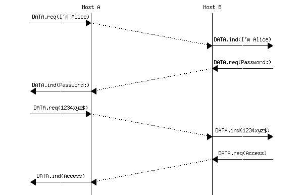

注意

Alice 和 Bob

Alice 和 Bob 是用于安全技术示例中的第一个名字。它们首次出现在 Diffie 和 Hellman 的一篇开创性论文中[[DH1976]](../bibliography.html#dh1976)。从那时起，Alice 和 Bob 成为表示与网络交互的用户时最常用的名字。多年来，还添加了其他角色，如 Eve 或 Mallory。我们将在后面解释它们各自的角色。

## 安全威胁#

在分析计算机网络中的安全问题时，考虑想要利用网络安全漏洞的攻击者的能力是有用的。存在不同类型的攻击者。一些具有通用能力，而另一些则特定于某种技术或网络协议。在本节中，我们将讨论网络架构师必须考虑的一些重要威胁。

第一种攻击者被称为被动攻击者。被动攻击者是指能够观察并通常存储在给定网络或其子集（例如，特定链路）中交换的信息（例如，数据包）的人。这种攻击者可以访问通过此特定链路的所有数据。这是最基本的攻击类型，许多网络技术都容易受到此类攻击。在上面的示例中，被动攻击者可以轻易地捕获 Alice 发送的密码，并在以后将其重用来在远程计算机上以 Alice 的身份进行认证。这在下图中得到了说明，其中我们不再显示`DATA.req`和`DATA.ind`原语，而只显示交换的消息。在本章中，我们将始终使用 Eve 作为能够监听她面前通过的数据的用户。

> 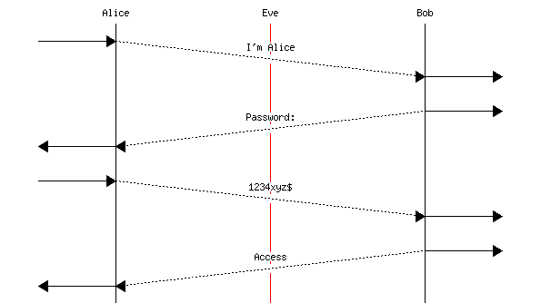

在上面的示例中，Eve 可以捕获 Bob 和 Alice 交换的所有数据包。这意味着 Eve 可以发现 Alice 的用户名和密码。有了这些信息，Eve 就可以在 Bob 的计算机上以 Alice 的身份进行认证，并执行 Alice 被授权执行的所有操作。这是一个重大的安全问题。为了防止这种攻击，Alice 永远不应该在网络中发送她的密码，因为有人可能会监听信息。在一些网络中，例如开放的无线网络，攻击者可以轻易地收集特定用户发送的所有数据。在其他网络中，这要复杂一些，具体取决于使用的网络技术，但存在各种软件包来自动化此过程。正如稍后将要描述的，防止此类攻击的最佳方法是依靠加密技术来确保密码永远不会以明文形式发送。

注意

普遍监控

在前面的例子中，我们解释了 Eve 如何捕获特定用户的数据。这不是这种类型攻击的唯一一种。2013 年，基于爱德华·斯诺登收集的文件，媒体揭露了几家政府机构正在收集全球互联网组成的各种链接的大量数据[[Greenwald2014]](../bibliography.html#greenwald2014)。得益于这大量数据，这些政府机构能够提取大量关于互联网用户行为的信息。像 Eve 一样，他们处于从他们捕获的所有数据包中提取密码、用户名和其他隐私敏感数据的位置。然而，似乎这些机构对各种元数据更感兴趣，例如显示特定用户与谁交流的信息，而不是实际交换的数据。这些揭露震惊了互联网社区和负责管理互联网协议标准化的[互联网工程任务组](https://www.ietf.org)，该组织在[**RFC 7258**](https://datatracker.ietf.org/doc/html/rfc7258.html)中声明，这种普遍监控是一种需要在开发新协议时进行反击的攻击。正在开发一些新的协议和对现有协议的扩展，以应对这些攻击。

监听和普遍监控并不是对网络发起攻击的唯一方式。还有一种攻击者是主动攻击者。在文献中，这类攻击通常被称为中间人攻击或 MITM 攻击。这种攻击发生在某个用户，让我们称他为 Mallory，成功配置了网络，使他能够捕获和修改两个用户之间交换的数据包。最简单的场景是当 Mallory 控制着一个同时被 Alice 和 Bob 使用的路由器。例如，Alice 可能连接到由 Mallory 控制的 WiFi 接入路由器，而 Bob 则是一个普通的互联网服务器。


由于 Mallory 接收到了 Bob 和 Alice 发送的所有数据包，他可以随意修改它们。例如，他可以修改 Alice 发送给 Bob 管理的服务器的命令，并更改服务器发送的响应。这种攻击非常强大，有时在没有依赖高级加密技术的情况下很难进行反击。

在本介绍中，我们考虑的最后一种攻击类型是拒绝服务或 DoS 攻击。在此类攻击期间，攻击者生成足够的数据包来饱和特定的服务，并阻止其正确运行。最简单的拒绝服务攻击就是发送比连接目标到网络的数据链带宽更多的数据包。目标可能是一台服务器、一家公司，甚至是一个整个国家。如果这些数据包都来自同一个源头，那么受害者可以识别攻击者并联系执法机构。在实践中，这种拒绝服务攻击并不来自单一源头。攻击者通常会破坏（可能非常大）的一组源头，并迫使它们向特定的目标发送数据包以饱和目标。由于攻击流量来自广泛的源头，受害者很难定位肇事者，也难以对抗攻击。饱和链路是分布式拒绝服务（DDoS）攻击的最简单例子。

在实践中，只要网络中某个地方存在有限的资源，就可能发生拒绝服务攻击。这种资源可以是数据链的带宽，但也可能是服务器的计算能力、其内存，甚至是特定协议实现使用的表的大小。防御真正的 DoS 攻击可能很困难，特别是如果攻击者控制了大量用于发起攻击的源头。从带宽的角度来看，由几 Gbps 到几十 Gbps 流量组成的 DoS 攻击在互联网上很常见。2015 年，[github.com](http://www.github.com)遭受了一次分布式 DoS 攻击，根据一些[报道](http://www.techworld.com/news/security/worlds-largest-ddos-attack-reached-400gbps-says-arbor-networks-3595715/)，其峰值带宽达到了 400 Gbps。

在设计将在大规模上部署的网络协议和应用时，考虑那些 DDoS 攻击是很重要的。攻击者使用不同的策略来发起 DDoS 攻击。有些人通过在这些设备上注入恶意软件，成功控制了大量来源。其他人，这也是协议设计者扮演重要角色的地方，只是利用某些协议的设计缺陷。考虑一个简单的请求-响应协议，其中客户端发送请求，服务器以响应的形式回复。通常，响应的大小大于或远大于客户端发送的请求。考虑这样一个简单的协议在数据报网络上的使用。当 Alice 向 Bob 发送包含其请求的数据报时，Bob 从数据包中提取请求和 Alice 的地址。然后，他发送一个单独的数据包作为对 Alice 的响应。Mallory 想要对 Alice 发起 DoS 攻击而不被识别。由于他已经研究了该协议的规范，他可以在一个数据包中向 Bob 发送请求，该数据包的源地址是 Alice 的地址。Bob 将处理请求，并将他的（大）响应发送给 Alice。如果响应的大小与请求相同，Mallory 正在产生一个反射攻击，因为他的数据包被 Bob 反射。Alice 会认为她被 Bob 攻击了。如果有许多服务器运行与 Bob 相同的服务，Mallory 可以隐藏在大量这样的反射器后面。不幸的是，反射攻击也可以变成放大攻击。这种情况发生在 Bob 发送的响应比它接收到的请求更大的情况下。如果响应是请求的$ k $倍大，那么当 Mallory 消耗 1 Gbps 的带宽来发送请求时，他的受害者会接收到$ k $ Gbps 的攻击流量。这种放大攻击是一个非常重要的问题，协议设计者应确保在收到请求已从请求中指示的源发出的证明之前，他们永远不会发送一个大的响应。

## 密码学原语#

密码技术最初是由间谍和军队定义和使用的，目的是以确保即使敌手截获了信息或携带信息的人，也无法解码信息的方式来交换秘密信息。已经定义了多种技术。最初的技术依赖于其保密性来运作。最早的加密方案之一归功于尤利乌斯·凯撒。当他向他的将军们发送机密信息时，他会通过将每个字母替换为字母表中该字母之后 $ n $ 个位置的字母来编码每条信息。例如，信息“SECRET”在凯撒密码编码后变为“VHFUHW”。这种技术在凯撒的战争中可能会让一些士兵感到困惑，但如今甚至小孩子也能从加密的信息中恢复出原始信息。

凯撒密码的安全性依赖于算法的保密性，但经验表明，即使对于军事应用，也无法假设算法会保持保密。相反，密码技术必须设计成假设算法将是公开的，并且任何人都能知道。然而，其行为必须由一个小的参数控制，即密钥，只有需要秘密通信的用户才知道。这个原理归功于法国密码学家奥古斯特·凯克霍夫，他首次记录了这一原理：

> 一个加密算法即使在攻击者知道系统的一切信息，除了被称为密钥的一个参数的情况下，也应该是安全的。

这个原理很重要，因为它仍然是所有密码学家的基本假设。任何依赖于其算法保密性来被认为是安全的系统注定会失败，并最终被破解。

根据凯克霍夫原理，我们现在可以讨论一个简单但强大的加密方案，该方案依赖于 XOR 逻辑运算。这种运算在硬件中很容易实现，并且所有微处理器都支持它。给定一个秘密，$ K $，可以通过计算 $ C_M = K \oplus M $ 来编码信息 $ M $。接收这条信息的接收者可以通过 $ M = K \oplus (K \oplus M) $ 恢复原始信息。这个 XOR 运算是完美密码（也称为 Vernam 密码或一次性密码）的关键操作。这种密码依赖于一个包含纯随机位的密钥。加密信息是通过将信息的所有位与密钥的所有位进行 XOR 运算来生成的。由于密钥是随机的，攻击者无法从加密的信息中恢复出原始文本（或明文）。从安全角度来看，只要密钥的长度与信息相同，一次性密码就是最佳解决方案。

很不幸，在实际应用中很难使用这种密码，因为密钥的长度必须与需要传输的消息长度相同。如果密钥的长度小于消息长度，并且消息被分成与密钥长度相同的块，那么该方案的安全性就会降低，因为相同的密钥被用来解密消息的不同部分。在实践中，XOR 通常是被加密方案中使用的最基本操作之一。为了能够使用，部署的加密方案使用由少量比特组成的密钥，通常是 56、64、128、256 位……

秘密密钥加密方案是一个完全可逆的函数，即给定一个加密函数 E，存在一个相关的解密函数 D，使得$ \forall K, \forall M : D(K, E(K,M))=M $。

已经提出了各种秘密密钥加密函数，并已实施和部署。其中最受欢迎的是：

> +   DES（数据加密标准），1977 年成为标准并被工业界广泛使用。它使用 56 位密钥，现在被认为不够安全，因为攻击者可以通过测试所有可能的密钥来发起暴力攻击。三重 DES 结合了三个 56 位密钥，使得暴力攻击更加困难。
> +   
> +   RC4 是由 Ron Rivest 在 1980 年代末为 RSA Security 定义的加密方案。由于其软件实现的快速性，它被包含在各种协议和实现中。然而，密码学家已经发现了该算法的几个弱点。现在它已被弃用，不应再使用[**RFC 7465**](https://datatracker.ietf.org/doc/html/rfc7465.html)。
> +   
> +   AES 或高级加密标准是由比利时密码学家 Joan Daemen 和 Vincent Rijmen 于 2001 年设计的加密方案[[DR2002]](../bibliography.html#dr2002)。该算法已被美国国家标准与技术研究院（NIST）标准化。现在它被广泛应用于各种应用和硬件及软件实现中。许多微处理器包括专门的指令，以简化 AES 的实现。AES 将待加密的消息分成 128 位的块，并使用 128、192 或 256 位的密钥。块大小和密钥长度是加密方案的重要参数。块大小表示可以加密的最小消息，并强制发送者将每条消息分成支持大小的块。如果消息的长度大于整数倍的块大小，那么在加密之前必须对消息进行填充，并且在解密后必须移除这种填充。密钥大小表示加密方案对暴力攻击的抵抗力，即攻击者尝试所有可能的密钥以找到正确密钥的攻击。

到本文写作时，AES 被广泛使用，但其他秘密密钥加密方案仍在出现。ChaCha20，由 D. Bernstein 提出，现在被几个互联网协议使用 [**RFC 7539**](https://datatracker.ietf.org/doc/html/rfc7539.html)。加密方案的详细讨论超出了本书的范围。我们将考虑加密方案作为黑盒，其操作依赖于单个密钥。这些方案中的几个详细概述可以在 [[MVV2011]](../bibliography.html#mvv2011) 中找到。

在 20 世纪 70 年代，Diffie 和 Hellman 在他们的开创性论文 [[DH1976]](../bibliography.html#dh1976) 中提出了不同类型的加密：公钥加密。在公钥加密中，每个用户都有两个不同的密钥：

> +   一个公钥 ($ K_{pub} $)，他可以向每个人分发
> +   
> +   一个私钥 ($ K_{priv} $)，他需要以安全的方式存储，并且永远不向任何人透露

这两个密钥一起生成，并且它们通过一个复杂的数学关系相互关联，这种关系使得从 $ K_{pub} $ 计算出 $ K_{priv} $ 在计算上是困难的。

公钥加密方案是两个函数的组合：

> +   一个加密函数，$ E_{p} $，它接受密钥和消息作为参数
> +   
> +   一个解密函数，$ D_{p} $，它接受密钥和消息作为参数

公钥用于加密消息，以便只有预期的接收者才能阅读。例如，让我们考虑两个用户：爱丽丝和鲍勃。爱丽丝（分别鲍勃）使用密钥 $ A_{priv} $ 和 $ A_{pub} $（分别 $ B_{priv} $ 和 $ B_{pub} $）。要向爱丽丝发送安全消息 M，鲍勃计算 $ CM=E_p(A_{pub},M) $，而爱丽丝可以通过使用 $ D_p(A_{priv},CM)=D_p(A_{priv},E_p(A_{pub},M))=M $ 来解密它。

已经提出了几种公钥加密方案。其中两个已经达到广泛部署：

> +   Rivest Shamir Adleman (RSA) 算法 [[2]](#frsa)，在 [[RSA1978]](../bibliography.html#rsa1978) 中提出，依赖于大整数的模幂运算。
> +   
> +   基于椭圆曲线特殊性质的椭圆曲线密码学技术 [[3]](#fecc)。

公钥密码学的另一个有趣特性是其计算签名的功能，这些签名可以用来验证消息。这种能力来自于两个不同密钥的利用，它们相互关联。如果爱丽丝想要签名消息 M，她可以计算 $ SM=E_p(A_{priv},M) $。任何收到这个签名消息的人都可以提取其内容作为 $ D_p(A_{pub},SM)=D_p(A_{pub},E_p(A_{priv},M))=M $。每个人都可以使用 $ A_{pub} $ 来检查消息是否由爱丽丝的私钥 ($ A_{priv} $) 签名。由于这个密钥只有爱丽丝知道，解密 SM 的能力是消息由爱丽丝本人签名的证明。

在实践中，为了签名而加密一条消息可能会造成计算上的开销，尤其是如果消息是一个大文件。一个更快的解决方案是对文档进行总结，并仅对文档的总结进行签名。一个简单的方法可能是基于对消息计算校验和或 CRC。Alice 会计算 $ C=Checksum(M) $ 和 $ SC=E_p(A_{priv},C) $。然后她会将 M 和 SC 发送给消息的接收者，接收者可以轻松地从 SC 计算出 C 并验证消息的真实性。不幸的是，这个解决方案并不能保护 Alice 和消息接收者免受中间人攻击。如果 Mallory 可以拦截 Alice 发送的消息，他可以轻松地修改 Alice 的消息，并调整它使其具有与原始消息相同的校验和。CRC 虽然计算起来更复杂，但存在同样的问题。

为了有效地签名消息，Alice 需要能够以阻止攻击者生成具有相同摘要的不同消息的方式计算她消息的摘要。加密哈希函数被设计来解决这个问题。理想的哈希函数是对于每个可能的输入都返回不同数字的函数。在实践中，找到这样的函数是不可能的。加密哈希函数是这个完美摘要函数的近似。它们计算给定消息的摘要，长度为 128 位、160 位、256 位或更多。它们还表现出雪崩效应。这种效应表明，消息中的微小变化会导致哈希值的大幅变化。最后，哈希函数非常难以逆向。知道哈希值，在计算上很难找到相应的输入消息。密码学家们提出了几种哈希函数。最受欢迎的包括：

> +   MD5，最初在 [**RFC 1321**](https://datatracker.ietf.org/doc/html/rfc1321.html) 中提出。它被广泛应用于各种应用中。2010 年，针对 MD5 的攻击被公布，这个哈希函数现在已被弃用。
> +   
> +   SHA-1 是一种由 NIST 在 1995 年标准化的加密哈希函数。它输出 160 位的结果。它现在被用于各种网络协议中。
> +   
> +   SHA-2 是由 NIST 设计的另一系列加密哈希函数。SHA-2 的不同变体可以生成 224 位、256 位、384 位或 512 位的哈希值。

关于加密算法的另一个重要点是，这些算法通常需要随机数来正确运行（例如，生成密钥）。生成好的随机数是困难的，任何加密算法的实现都应该包括一个安全的随机数生成器。[**RFC 4086**](https://datatracker.ietf.org/doc/html/rfc4086.html) 提供了有用的建议。

## 加密协议#

我们现在可以将上一节中描述的加密操作组合起来，构建一些用于安全交换信息的协议。让我们首先回到在 Bob 的计算机上验证爱丽丝身份的问题。我们之前已经表明，在存在攻击者的情况下，使用简单的密码来达到这个目的是不安全的。

一种简单的方法是依赖于哈希函数。由于哈希函数是不可逆的，爱丽丝和鲍勃可以决定使用它们以安全的方式交换爱丽丝的密码。然后，可以使用以下交换来验证爱丽丝。

> 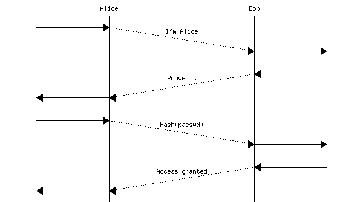

由于哈希函数不可逆，窃听者不能仅通过观察交换的数据来提取爱丽丝的密码。然而，攻击者的主要目标并不是爱丽丝的真实密码。Mallory 的主要目标是验证自己为爱丽丝。如果 Mallory 能够捕获到 Hash(密码)，他可以简单地重放这些数据，而无需能够逆转哈希函数。这被称为重放攻击。

为了对抗这种重放攻击，我们需要确保爱丽丝永远不会向鲍勃发送相同的信息两次。下面是一种可能的操作模式。

> 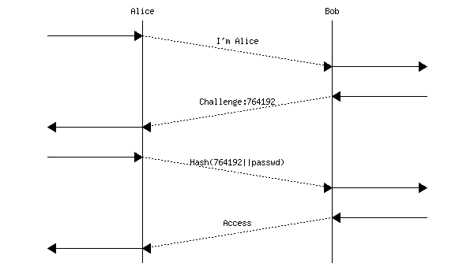

为了验证自己的身份，爱丽丝向鲍勃发送她的用户标识符。鲍勃回复一个随机数作为挑战，以验证爱丽丝知道共享的秘密（即她的密码）。爱丽丝回复计算出的哈希函数（例如 SHA-1）的结果，该函数作用在一个字符串上，该字符串是鲍勃选择的随机数和爱丽丝的密码的连接。鲍勃选择的随机数通常被称为 nonce，因为这个数字只能使用一次。鲍勃在本地执行相同的计算，并可以检查爱丽丝返回的消息。这种认证方案已在各种协议中使用。它防止重放攻击。如果伊芙捕获了爱丽丝和鲍勃之间交换的消息，她无法从这些消息中恢复爱丽丝的密码，因为哈希函数是不可逆的。此外，她无法重放哈希值，因为鲍勃总是会发送一个不同的 nonce。

不幸的是，这个解决方案迫使鲍勃在计算机上存储爱丽丝的明文密码。鲍勃计算机的安全漏洞会泄露爱丽丝的密码。不幸的是，这种漏洞确实发生了，其中一些导致了数百万个密码的泄露。

更好的方法是在鲍勃的计算机上不存储爱丽丝的明文密码来验证爱丽丝的身份。为此，爱丽丝计算一个哈希链，如 Lamport 在[[Lamport1981]](../bibliography.html#lamport1981)中提出的。哈希链是对输入字符串应用哈希函数（H）的序列。如果爱丽丝的密码是 P，那么她的 10 步哈希链是：$ H(H(H(H(H(H(H(H(H(H(P)))))))))) $。这个哈希链的结果将存储在鲍勃的计算机上，同时存储值 10。这个数字是爱丽丝在鲍勃的计算机上剩余的最大认证次数。为了验证爱丽丝，鲍勃发送剩余的认证次数，即本例中的 10。由于爱丽丝知道她的密码 P，她可以计算$ H⁹(P)=H(H(H(H(H(H(H(H(H(P))))))))) $并将此信息发送给鲍勃。鲍勃计算从爱丽丝那里收到的值的哈希（$ H(H⁹(P)) $）并验证这个值是否等于他数据库中存储的值。然后，他减少授权认证的次数并将$ H⁹(P) $存储在他的数据库中。现在鲍勃已准备好进行爱丽丝的下一个认证。当授权认证次数达到零时，需要重新初始化哈希链。如果伊芙捕获了$ (H^n(P)) $，她不能用它来在鲍勃的计算机上作为爱丽丝进行认证，因为鲍勃会减少其授权认证的次数。此外，鉴于哈希函数是不可逆的，伊芙不能从$ H^{n}(P) $计算出$ H^{n-1}(P) $。

上面的两种协议可以防止窃听攻击，但不能防止中间人攻击。如果 Mallory 可以拦截 Alice 发送的消息，他可以迫使她透露$ H^n(P) $，然后利用这些信息在 Bob 的计算机上冒充 Alice。在实践中，只有在通信用户知道他们的通信中不可能有中间人时，才应使用哈希链。

公钥密码学为 Alice 在 Bob 的计算机上验证自己的身份提供了另一种可能性。再次假设 Alice 和 Bob 从之前的接触中认识彼此。Alice 知道 Bob 的公钥（$ Bob_{pub} $），而 Bob 也知道 Alice 的密钥（$ Alice_{pub} $）。为了验证自己的身份，Alice 可以发送她的用户标识符。Bob 会用 Alice 的公钥加密一个随机数作为回复：$ E_p(Alice_{pub},R) $。Alice 可以解密这条消息以恢复 R，并发送$ E_p(Bob_{pub},R) $。Bob 解密这个随机数并确认 Alice 知道$ Alice_{priv} $。如果窃听者捕获了交换的消息，他无法恢复 R 的值，这个值可以用作密钥，通过秘密密钥算法加密信息。这在下方的时序图中得到了说明。

> 

这种方法的缺点是 Bob 被迫执行两次公钥计算：一次加密将随机数发送给 Alice，一次解密恢复 Alice 加密的随机数。如果这些计算从 CPU 的角度来看成本高昂，这就会产生拒绝服务攻击的风险，攻击者可能会尝试访问 Bob 的计算机并迫使其执行这些昂贵的计算。在这种情况下，Bob 比 Alice 风险更大，他应该在确定自己正在与 Alice 交谈之前不执行复杂操作。下方的时序图中展示了另一种方法。

> 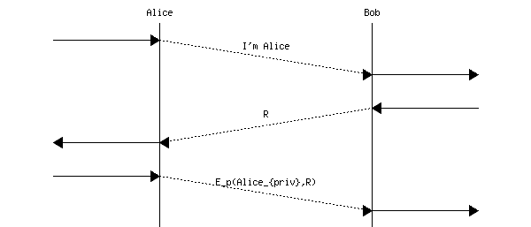

在这里，鲍勃简单地给爱丽丝发送一个随机数，并验证她的签名。由于随机数和签名可能被窃听者捕获，因此它们不能用作加密更多数据的密钥。然而，鲍勃可以提出一个密钥，并将其与爱丽丝的公钥一起加密，作为对收到的签名随机数的回应。

如上所述的解决方案在鲍勃和爱丽丝在通信前知道他们各自的公钥的情况下是有效的。否则，该协议不能抵御中间人攻击者。考虑玛洛里坐在爱丽丝和鲍勃之间的中间，并假设爱丽丝和鲍勃都不知道对方的公钥。

> 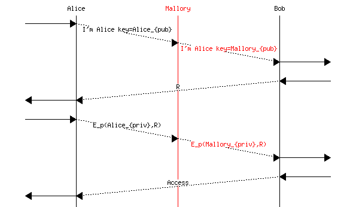

在上述示例中，爱丽丝在她的第一条消息中发送了她的公钥（$ Alice_{pub} $），以及她的身份。玛洛里拦截了消息，并用他自己的密钥（$ Mallory_{pub} $）替换了爱丽丝的密钥。鲍勃回复了一个随机数，R。然后爱丽丝对随机数进行签名以证明她知道 $ Alice_{priv} $。玛洛里丢弃了信息，并计算 $ E_p(Mallory_{priv},R) $。现在鲍勃认为他正在与爱丽丝交谈，而玛洛里坐在中间。

有时需要对称认证。在这种情况下，每个用户必须使用他的/她的私钥进行一些计算。一个可能的交换如下。爱丽丝将她的证书发送给鲍勃。鲍勃回复一个随机数，$ R1 $，并提供他的证书。爱丽丝使用她的私钥加密 $ R1 $ 并生成一个随机数，$ R2 $。鲍勃验证爱丽丝的计算，并使用他的私钥加密 $ R2 $。爱丽丝验证计算，双方都完成了认证。

> 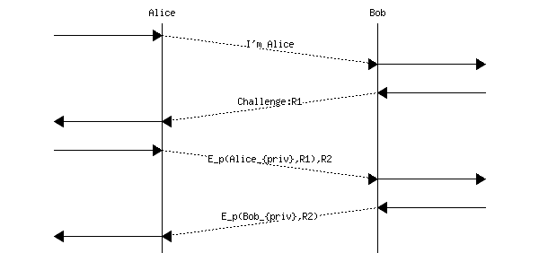

上文描述的协议是可行的，但鲍勃验证爱丽丝和爱丽丝验证鲍勃都需要很长时间。更快的验证方式可以是以下这样。

> 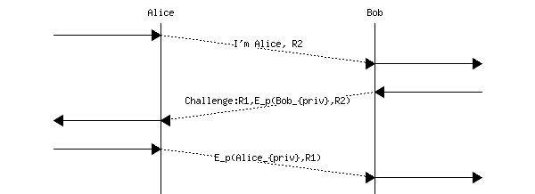

爱丽丝发送她的随机数，$ R2 $。鲍勃签署 $ R2 $ 并发送他的随机数：$ R1 $。爱丽丝签署 $ R1 $，双方都完成了验证。

现在考虑玛洛丽想要作为爱丽丝进行验证的情况。上述协议存在一个细微的缺陷，可能会被玛洛丽利用。如果爱丽丝和鲍勃可以同时作为客户端和服务器，这个缺陷就可以被利用。了解这一点后，玛洛丽可以如下操作。玛洛丽开始与鲍勃进行验证，假装自己是爱丽丝。他向鲍勃发送第一条消息，包括爱丽丝的身份。

> 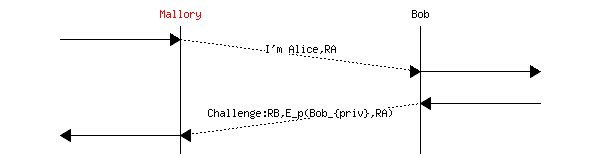

在这次交换中，鲍勃通过签署由玛洛丽发送的 $ RA $ 随机数来验证自己。现在，为了作为爱丽丝进行验证，玛洛丽需要使用爱丽丝的私钥计算随机数 $ RB $ 的签名。玛洛丽不知道爱丽丝的密钥，但他可以利用该协议强制爱丽丝执行所需的计算。为此，玛洛丽可以像下面这样开始对爱丽丝的验证。

> 

在这个例子中，Mallory 迫使 Alice 计算$ E_p(Alice_{priv},RB) $，这是完成第一次交换并验证为 Alice 所需的信息。这说明了当相同信息可用于不同目的时，认证方案中存在的一个常见问题。这个问题源于 Alice 同意在 Bob 选择的随机数（由 Mallory 中继）上计算她的签名。如果随机数是一个没有结构的简单整数，则会出现这个问题。如果随机数包含一些结构，例如关于 Alice 和 Bob 身份的信息，甚至是一个表示随机数是否由作为客户端的用户（即启动认证）或作为服务器选择的一个比特位，那么该协议就不再容易受到攻击。

为了解决上述提到的一些问题，通常将公钥密码学与证书结合使用。证书是一个包含来自可信第三方签名的数据结构。关于证书利用的简单解释是，Alice 和 Bob 都知道 Ted。这两个用户都信任 Ted，并且都存储了 Ted 的公钥：$ Ted_{pub} $。由于他们都知道 Ted 的密钥，他可以颁发证书。证书主要是用户身份与其公钥之间的加密链接。此类证书可以以不同的方式计算。一个简单的解决方案是 Ted 生成一个包含以下信息的文件，为每个认证用户：

> +   他的/她的身份
> +   
> +   他的/她的公钥
> +   
> +   使用 Ted 的私钥签名的整个文件的散列

然后，知道 Ted 的公钥，任何人都可以验证证书的有效性。当用户发送他的/她的公钥时，他/她必须也附加证书以证明其身份与公钥之间的联系。在实践中，证书比这更复杂。证书通常用于验证服务器，有时也用于验证客户端。

可能的协议可以是以下这样。Alice 发送$ Cert(Alice_{pub},Ted) $。Bob 回复一个随机随机数。

> 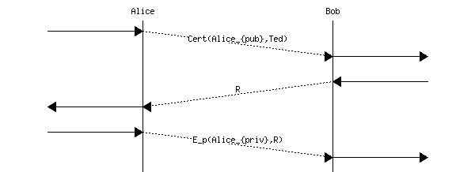

到目前为止，我们只讨论了认证问题。这是在不可靠的网络中两个用户之间进行安全通信的重要但不是充分的一步。为了安全地交换信息，爱丽丝和鲍勃都需要：

> +   互相验证对方的身份。
> +   
> +   约定一种加密他们将要交换的消息的方式。

让我们先探讨如何通过使用公钥密码学来实现这一点。我们假设爱丽丝和鲍勃都有由可信第三方泰德签名的公私钥对和相应的证书。

一个可能的协议如下。爱丽丝发送 $ Cert(Alice_{pub},Ted) $。这个证书提供了爱丽丝的身份和她的公钥。鲍勃回复包含他自己的公钥的证书：$ Cert(Bob_{pub},Ted) $。在这个时候，他们都知道对方的公钥，可以使用它来发送加密消息。爱丽丝会发送 $ E_p(Bob_{pub},M1) $，鲍勃会发送 $ E_p(Alice_{pub},M2) $。在实践中，使用公钥加密技术加密大量消息是不高效的，因为这些密码系统需要大量的计算。更有效的方法是使用对称密钥密码系统来加密大部分数据，仅使用公钥密码系统来加密将用于对称密钥加密方案的随机密钥。

## 密钥交换#

当用户想要通过网络安全地通信时，即使在窃听者的存在下，他们也需要交换信息，例如将要使用的加密算法的密钥。最广泛使用的算法是迪菲和赫尔曼提出的算法 [[DH1976]](../bibliography.html#dh1976)，它使用（大）整数。其中两个是公开的，模数 $ p $ 是一个质数，基数 $ g $ 必须是 $ p $ 的原根。通信用户选择一个随机整数 $ a $ 给爱丽丝和 $ b $ 给鲍勃。交换开始如下：

> +   爱丽丝选择一个随机整数 $ a $ 并将其发送给鲍勃。
> +   
> +   鲍勃选择一个随机整数 $ b $ 并将其发送给爱丽丝。
> +   
> +   从 $ a $ 和 $ B $ 的知识中，爱丽丝可以计算出 $ Secret=B^{a} \mod p= (g^{b} \mod p) ^{a} \mod p=g^{a \times b} \mod p $。
> +   
> +   从 $ b $ 和 $ A $ 的知识中，鲍勃可以计算出 $ Secret=A^{b} \mod p=(g^{a} \mod p) ^{b} \mod p=g^{a \times b} \mod p $。

该协议的安全性依赖于计算离散对数的难度，即已知 $ A $（分别 $ B $），很难提取 $ \log(A)=\log(g^{a} \mod p)=a $（分别 $ \log(B)=\log(g^{b} \mod p)=b $)。

下面展示了 Diffie-Hellman 密钥交换的利用示例。在开始交换之前，Alice 和 Bob 同意一个模数（$ p=23 $）和一个基数（$ g=5 $）。这两个数字是公开的。它们通常是定义使用密钥交换的协议的标准的一部分。

> +   Alice 选择一个秘密整数：$ a=8 $，并将$ A= g^{a} \mod p= 5^{8} \mod 23=16 $发送给 Bob
> +   
> +   Bob 选择一个秘密整数：$ b=13 $，并将$ B= g^{b} \mod p=5^{13} \mod 23=21 $发送给 Alice
> +   
> +   Alice 计算$ S_{A}=B^{a} \mod p= 21^{8} \mod 23=3 $
> +   
> +   Bob 计算$ S_{B}=A^{b} \mod p= 16^{13} \mod 23=3 $

Alice 和 Bob 已经同意了秘密信息$ 3 $，而没有通过网络明确发送。如果使用的整数足够大并且具有良好的属性，那么即使 Eve 能够捕获 Alice 和 Bob 发送的所有消息，也无法恢复他们交换的秘密密钥。没有关于算法安全性的正式证明，但数学家们已经尝试了几个世纪，用整数解决类似的问题，但没有找到有效的算法。只要使用的整数是随机的并且足够大，Eve 唯一可能的攻击就是测试 Alice 和 Bob 可能选择的所有可能的整数。这是计算上非常昂贵的。这个算法在安全协议中被广泛使用，以达成一个秘密密钥。

不幸的是，Diffie-Hellman 密钥交换本身无法应对中间人攻击。考虑 Mallory，他坐在 Alice 和 Bob 之间，可以轻易地捕获和修改他们的消息。模数和基数是公开的。因此，Mallory 也知道它们。他可以如下操作：

> +   Alice 选择一个秘密整数，并将$ A= g^{a} \mod p $发送给 Mallory
> +   
> +   Mallory 生成一个秘密整数，$ m $，并将$ M=g^{m} \mod p $发送给 Bob
> +   
> +   Bob 选择一个秘密整数，并将$ B=g^{b} \mod p $发送给 Mallory
> +   
> +   Mallory 计算$ S_{A}=A^{m} \mod p $和$ S_{B}=B^{m} \mod p $
> +   
> +   Alice 计算$ S_{A}=M^{a} \mod p $并使用这个密钥与 Mallory（充当 Bob）通信
> +   
> +   Bob 计算$ S_{B}=M^{b} \mod p $并使用这个密钥与 Mallory（充当 Alice）通信

当 Alice 发送消息时，她使用$ S_{A} $对其进行加密。Mallory 使用$ S_{A} $解密它，并用$ S_{B} $加密明文。当 Bob 收到消息时，他可以使用$ S_{B} $进行解密。

为了安全地使用 Diffie-Hellman 密钥交换，Alice 和 Bob 必须使用一个经过身份验证的交换。Alice 或 Bob 发送的一些信息必须使用另一个用户已知的公钥进行签名。在实践中，Alice 验证 Bob 的身份通常很重要。如果 Bob 有一个由 Ted 签发的证书，经过身份验证的密钥交换可以组织如下。

> +   Alice 选择一个秘密整数：$ a $，并将$ A= g^{a} \mod p $发送给 Bob
> +   
> +   Bob 选择一个秘密整数：$ b $，计算$ B= g^{b} \mod p $并将$ Cert(Bob,Bob_{pub},Ted), E_p(Bob_{priv},B) $发送给 Alice
> +   
> +   Alice 检查签名（使用$ Bob_{pub} $）和证书，并计算$ S_{A}=B^{a} \mod p $
> +   
> +   Bob 计算$ S_{B}=A^{b} \mod p $

这防止了上述攻击，因为 Mallory 无法创建伪造的证书，也无法使用 Bob 的私钥签名一个值。鉴于中间人攻击的风险，Diffie-Hellman 密钥交换机制在没有身份验证的情况下不应使用。

## 安全壳（ssh）#

建立计算机网络最初的动机之一是允许用户通过网络访问远程计算机。在 20 世纪 60 年代和 70 年代，大型机和新兴的小型机由一个中央单元和通过串行线路或调制解调器连接的一组终端组成。设计用于通过网络访问远程计算机的最简单协议可能是 telnet [**RFC 854**](https://datatracker.ietf.org/doc/html/rfc854.html)。telnet 通过 TCP 运行，默认情况下，telnet 服务器监听端口 23。telnet 使用的 TCP 连接是双向的，客户端和服务器都可以通过它发送数据。在这种连接上交换的数据基本上是用户在客户端机器上键入的字符以及服务器机器上运行的进程的文本输出，有一些例外（例如控制字符，用于控制终端的字符如 VT-100 等）……telnet 的默认字符集是 ASCII 字符集，但[**RFC 5198**](https://datatracker.ietf.org/doc/html/rfc5198.html)中指定的扩展支持 Unicode 字符的使用。

从安全角度来看，telnet 的主要缺点是所有信息，包括用户名、密码和命令，都在 TCP 连接中以明文形式发送。这意味着窃听者可以轻易地捕获在未受保护的网络上的任何人使用的密码。存在各种软件工具来自动收集这些信息。因此，telnet 今天很少用于访问远程计算机。它通常被 ssh 或类似协议所取代。

安全壳协议是在 1990 年代中期由 T. Ylonen 设计的，旨在对抗针对 telnet 和类似协议的窃听攻击 [[Ylonen1996]](../bibliography.html#ylonen1996)。`ssh` 迅速变得流行，系统管理员鼓励使用它。`ssh` 的原始版本是免费提供的。几年后，其作者创建了一家公司来商业分销它，但其他程序员继续开发了一个开源版本的 `ssh`，称为 `[OpenSSH](http://www.openssh.com)`。多年来，`ssh` 不断发展，并成为一个灵活适用的协议，其使用范围不仅限于远程登录，还支持文件传输、协议隧道等功能。在本节中，我们只讨论 `ssh` 的基本功能，并解释它与 `telnet` 的区别。关于 `ssh` 的详细描述已有整本书籍出版 [[BS2005]](../bibliography.html#bs2005)。该协议的概述出现在 [[Stallings2009]](../bibliography.html#stallings2009)。

`ssh` 协议直接运行在 TCP 协议之上。一旦 TCP 字节流建立，客户端和服务器交换消息。交换的第一条消息是一个 ASCII 行，宣布了协议版本和客户端及服务器使用的软件实现版本。这两行在调试互操作性问题和其它问题时非常有用。

下一条消息是用于协商 `ssh` 会话中将使用的加密算法的 `SSH_MSG_KEX_INIT` 消息。对于安全协议来说，包括允许协商所使用的加密算法的机制非常重要。首先，这些算法提供不同的安全级别。一些算法可能被认为是完全安全的，并且目前被推荐使用，但几年后，在发布了一些攻击之后可能会被弃用。其次，这些算法提供不同的性能级别，并且对 CPU 和内存有不同的影响。

在实践中，一个 `ssh` 实现支持四种类型的加密算法：

> +   密钥交换
> +   
> +   加密
> +   
> +   消息认证码 (MAC)
> +   
> +   压缩

`[IANA](https://www.iana.org)` 维护一个 `[加密算法列表](http://www.iana.org/assignments/ssh-parameters/ssh-parameters.xhtml#ssh-parameters-16)`，该列表可以被 `ssh` 实现使用。对于每种类型的算法，客户端提供一个按顺序排列的算法列表，并同意使用这些算法。服务器将收到的列表与其自己的列表进行比较。协商的结果是一组四个算法 [[4]](#fnull)，这些算法将用于本次会话。

> 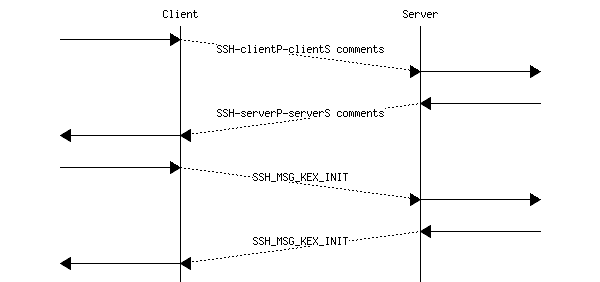

这种对加密算法的协商允许在提出新算法时实现进化。如果客户端进行了升级，即使服务器尚未升级，它也可以宣布一个新的算法作为其首选算法。

一旦协商了加密算法，就使用密钥交换算法协商一个将由客户端和服务器共享的秘密密钥。这些密钥交换算法在基本算法上有所变化。例如，让我们分析 Diffie-Hellman 密钥交换算法如何在`ssh`协议中使用。在这种情况下，每个主机都有一个私钥和一个公钥。（注意，$ g $ 是阶为 $ p $ 的伽罗瓦域子群的生成元，其中 $ p $ 是一个素数，而 || 是连接运算符。有关更多信息，请参阅 [[Schneier1996]](../bibliography.html#schneier1996)。)

> +   客户端生成随机数 $ a $ 并将 $ A=g^{a} \mod p $ 发送给服务器
> +   
> +   服务器生成随机数 $ b $。然后计算 $ B=g^{b} \mod p $、$ K=B^{a} \mod p $ 并使用其私钥对 $ hash(V_{Client} || V_{Server} || KEX\_INIT_{Client} || KEX\_INIT_{Server} || Server_{pub} || A || B || K ) $ 进行签名，其中 $ V_{Server} $（分别）是客户端（分别）发送的初始消息，$ KEX\_INIT_{Client} $（分别）是客户端（分别）发送的密钥交换消息，$ A $、$ B $ 和 $ K $ 是 Diffie-Hellman 密钥交换的消息
> +   
> +   客户端可以重新计算 $ K=A^{b} \mod p $ 并验证服务器提供的签名

这是一个略微修改过的认证 Diffie-Hellman 密钥交换，有两个有趣的观点。第一个观点是，当服务器验证密钥交换时，它不提供证书。这是因为`ssh`假设客户端会将其经常使用的服务器公钥存储在其缓存中。对于像`ssh`这样的协议，这个假设是有效的，因为用户通常用它与少量服务器交互，通常是几个或几十个。存储这些信息不需要太多的存储空间。在实践中，大多数`ssh`客户端都会接受在连接之前不知道远程服务器公钥的情况下连接到远程服务器。在这种情况下，客户端会向用户发出警告，用户可以决定接受或拒绝密钥。这个警告可以与密钥的指纹相关联，可以是字母序列或 ASCII 艺术，可以由服务器管理员在网络上或其他地方发布 [[5]](#fdnsssh)。如果一个客户端连接到一个公钥与存储的不匹配的服务器，会发出更强的警告，因为这可能表明中间人攻击或远程服务器已被入侵。它也可能表明服务器已升级，并且在升级过程中生成了新的密钥。

第二点是服务器不仅验证 Diffie-Hellman 交换的结果，还验证交换过程中发送和接收的所有信息的哈希值。这很重要，可以防止降级攻击。降级攻击是一种主动攻击者修改通信主机（通常是客户端）发送的消息，以请求使用较弱加密算法的攻击。考虑一个支持两种加密方案的客户端。首选方案使用 128 位密钥，第二个方案是一个旧的加密方案，使用 48 位密钥。这个第二个算法保留以与旧实现保持向后兼容。如果攻击者可以从客户端支持的加密算法列表中删除首选算法，他可以迫使服务器使用一个较弱的加密方案，这将更容易被破解。多亏了覆盖服务器交换的所有消息的哈希值，降级攻击无法针对`ssh`发生。算法敏捷性是安全协议的关键要求，当加密算法被研究人员破解时，这些协议需要进化。这种敏捷性不能不加考虑地使用，签署所有交换消息的哈希值是一种常用于防止降级攻击的技术。

注意

单次使用密钥

多亏了迪菲-赫尔曼密钥交换，客户端和服务器共享密钥 $ K $。一个简单的实现可能会直接使用这个密钥来为这个会话中协商的所有加密算法。像大多数安全协议一样，`ssh` 并不会直接使用密钥 $ K $。相反，它使用协商的哈希函数和不同的参数 [[6]](#fsshkeys) 来允许客户端和服务器从 $ K $ 计算出六个密钥：

> +   客户端（或服务器）用于加密发送数据的密钥
> +   
> +   客户端（或服务器）用于认证发送数据的密钥
> +   
> +   客户端（或服务器）用于初始化协商加密方案（如果该方案需要）的密钥

在安全协议的设计者中，通常的做法是永远不要为不同的目的使用相同的密钥。例如，允许客户端和服务器使用相同的密钥来加密数据可能会使攻击者能够通过向客户端发送它自己加密的数据来发起重放攻击。

在这一点上，通过 TCP 连接发送的所有消息都将使用协商的密钥进行加密。`ssh` 协议使用根据 [**RFC 4253**](https://datatracker.ietf.org/doc/html/rfc4253.html) 中定义的二进制数据包协议编码的消息。这些消息中的每一个都包含以下信息：

> +   `length`：这是消息的字节数，不包括 MAC 和长度字段
> +   
> +   `padding length`：这是添加到消息末尾的随机字节数。
> +   
> +   `payload`：用户传递的数据（在可选压缩之后）
> +   
> +   `padding`：在每条消息中添加的随机字节（至少四个），以确保消息长度是协商加密算法使用的块大小的倍数
> +   
> +   `MAC`：如果会话中协商了消息认证码，则此字段存在（在实践中，使用未经身份验证的 `ssh` 风险很大，并且此字段应始终存在）。请注意，为了计算 MAC，`ssh` 实现必须维护一个消息计数器。每次发送消息并计算 MAC 时，计数器都会增加一，并且使用协商的认证算法和 MAC 密钥通过消息计数器和明文消息的连接来计算 MAC。消息计数器不会传输，但接收方可以轻松恢复其值。`MAC` 的计算方式为 $ mac = MAC(key, sequence\_number || unencrypted\_message) $，其中密钥是协商的认证密钥。

备注

使用 HMAC 认证消息

`ssh`是使用消息认证码（MAC）来认证发送消息的协议的一个例子。这样一个 MAC 的简单实现可能是简单地使用一个像 SHA-1 这样的散列函数。然而，从安全角度来看，这种结构并不安全。互联网协议通常依赖于在[**RFC 2104**](https://datatracker.ietf.org/doc/html/rfc2104.html)中定义的 HMAC 构造。它适用于任何散列函数（H）和密钥（K）。作为一个例子，让我们考虑使用 SHA-1 散列函数的 HMAC。SHA-1 使用 20 字节块，块大小将在 HMAC 的操作中扮演重要角色。我们首先需要密钥的长度与块大小相同。由于这个密钥是密钥生成算法的输出，这是该算法的一个参数。

HMAC 使用两个填充字符串：ipad（resp. opad），它是一个包含 20 次字节`0x36`（resp. 字节`0x5C`）的字符串。然后计算 HMAC 为 $ H[K \oplus opad, H(K \oplus ipad, data) ] $ 其中 $ \oplus $ 表示位运算的异或操作。这种计算已被证明比简单的 $ H(K,data) $ 对抗某些类型的密码学攻击更强大。

在`ssh`协议的众多特性中，提及服务器如何对用户进行认证是非常有趣的。`ssh`协议支持经典的用户名/密码认证（但用户名和密码都是通过安全的加密通道传输的）。此外，`ssh`还支持两种基于公钥的认证机制。要使用第一种机制，每个用户都需要生成自己的公钥/私钥对，并将公钥存储在服务器上。为了进行认证，用户需要使用自己的私钥对包含其公钥的消息进行签名。由于服务器已经知道用户的公钥，它可以轻松地验证签名的有效性。第二种认证方案是为相互信任的主机设计的。每个主机都有一个公钥/私钥对，并存储它所信任的其他主机的公钥。这通常用于像大学实验室这样的环境，在那里每个用户都可以访问任何可用的计算机。如果 Alice 已经登录到`computer1`并想在`computer2`上执行命令，她可以在这个计算机上创建一个`ssh`会话，并再次输入她的密码。基于主机的认证方案中，`computer1`使用其私钥对消息进行签名，以确认它已经认证了 Alice。然后`computer2`将接受 Alice 的会话，而无需要求她的凭据。

`ssh`协议包括本书范围之外的其他特性。更多详细信息可以在[[BS2005]](../bibliography.html#bs2005)中找到。  ## 传输层安全性#

传输层安全（TLS）协议族最初以安全套接字层（SSL）的名义提出。最初的部署使用了这个名称，许多研究人员仍然将这个安全协议称为 SSL [[FKC1996]](../bibliography.html#fkc1996)。在本章中，我们使用由 IETF 标准化的官方名称：传输层安全（TLS）。

TLS 协议被设计成可以被广泛的应用程序使用，这些应用程序使用传输层来可靠地交换信息。TLS 主要在 TCP 协议上使用。TLS 有在 SCTP [**RFC 3436**](https://datatracker.ietf.org/doc/html/rfc3436.html) 或 UDP [**RFC 6347**](https://datatracker.ietf.org/doc/html/rfc6347.html) 上运行的变体，但这些超出了本章的范围。

TLS 会话在 TCP 连接上运行。TLS 负责对应用层协议交换的 SDUs 进行加密和认证，而 TCP 则提供加密和认证的字节流的可靠传输。TLS 被许多不同的应用层协议使用。最常见的是 HTTP（HTTP over TLS 称为 HTTPS），SMTP [**RFC 3207**](https://datatracker.ietf.org/doc/html/rfc3207.html) 或 POP 和 IMAP [**RFC 2595**](https://datatracker.ietf.org/doc/html/rfc2595.html)，但专有应用层协议也使用 TLS [[AM2019]](../bibliography.html#am2019)。

TLS 会话可以通过两种不同的方式启动。首先，应用程序可以使用为应用层协议 x-over-TLS 保留的专用 TCP 端口号。这是许多 HTTP 服务器使用的解决方案，它们为 HTTP over TLS 保留了端口$ 443 $。这个解决方案是可行的，但它要求为每个应用程序保留两个端口：一个用于直接在 TCP 上使用应用层协议，另一个用于在 TLS 上使用应用层协议。鉴于可用的 TCP 端口数量有限，这不是一个可扩展的解决方案。下表提供了在 TLS 之上应用层协议的一些保留端口号。

| 应用 | TCP 端口 | TLS 端口 |
| --- | --- | --- |
| POP3 | 110 | 995 |
| IMAP | 143 | 993 |
| NNTP | 119 | 563 |
| HTTP | 80 | 443 |
| FTP | 21 | 990 |

启动 TLS 会话的第二种方法是使用应用层协议的标准 TCP 端口号，并在该协议中定义一个特殊消息来触发 TLS 会话的开始。这是用于 SMTP 的`STARTTLS`消息的解决方案。这个对 SMTP 的扩展 [**RFC 3207**](https://datatracker.ietf.org/doc/html/rfc3207.html) 定义了新的 STARTTLS 命令。客户端可以发出此命令，向服务器指示它想要启动一个 TLS 会话，如下面在端口 25 上的会话中捕获的示例所示。

```sh
220 server.example.org ESMTP
EHLO client.example.net
250-server.example.org
250-PIPELINING
250-SIZE 250000000
250-ETRN
250-STARTTLS
250-ENHANCEDSTATUSCODES
250-8BITMIME
250 DSN
STARTTLS
220 2.0.0 Ready to start TLS 
```

在本章的剩余部分，我们假设 TLS 会话在 TCP 连接建立后立即开始。这对应于 Web 服务器的部署。我们专注于 TLS 的这种非常流行的用例。TLS 是一个复杂的协议，支持 Web 服务器使用的其他功能。更详细的 TLS 介绍可以在[[KPS2002]](../bibliography.html#kps2002)和[[Ristic2015]](../bibliography.html#ristic2015)中找到。

TLS 会话分为两个阶段：握手和数据传输。在握手阶段，客户端和服务器协商用于保护数据传输的安全参数和密钥。在第二阶段，所有交换的消息都使用协商的算法和密钥进行加密和认证。

### TLS 握手#

当用于与常规 Web 服务器交互时，TLS 握手有三个重要目标：

> 1.  在 TLS 会话中安全协商客户端和服务器将使用的加密算法
> 1.  
> 1.  验证客户端与有效的服务器交互
> 1.  
> 1.  在 TLS 会话中安全地商定用于加密和认证交换消息的密钥

TLS 握手是一个四路握手，如图所示。

> 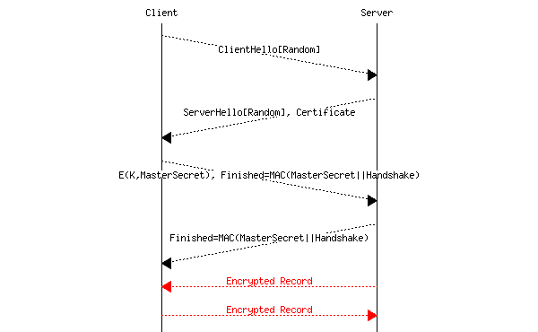

简而言之，客户端通过提出一个随机数来启动 TLS 握手。服务器回复其随机数和一个将名称绑定到公钥的证书。客户端生成一个 MasterSecret，稍后将用于派生会话密钥，并用服务器的公钥对其进行加密。它还生成一个包含所有交换消息的 MAC 的 Finished 消息，以便服务器检测客户端发送的消息的任何修改。服务器也发送其自己的 Finished 消息。在此阶段，客户端和服务器通过从 MasterSecret 派生的密钥发送加密记录。

让我们先讨论加密算法和参数的协商。像所有安全协议一样，TLS 在其设计中包含了一些灵活性，因为随着时间的推移，新的加密算法出现，一些较旧的算法一旦密码分析学家发现缺陷，就会变得过时。TLS 握手过程从客户端发送的 `ClientHello` 消息开始。此消息包含以下信息：

> +   协议版本号：这是客户端支持的 TLS 协议版本。服务器应使用与客户端相同的 TLS 协议版本，但可以选择较旧的版本。目前部署了 TLS 的 1.2 和 1.3 两个版本。旧版本正在被弃用。
> +   
> +   随机数：安全协议依赖于随机数。客户端发送一个 32 字节长的随机数，其中通常有四个字节对应于客户端的时钟。这个随机数与服务器端的随机数一起用作生成安全密钥的种子。
> +   
> +   密码套件：这个有序列表包含客户端支持的加密算法集合，最优先的算法列在第一位。与允许协商独立加密、密钥交换和认证算法的 `ssh` 不同，TLS 依赖于将这些算法组合在一起的套件。为 TLS 定义了许多密码套件。关于这些套件中的一些套件的安全性已经发布了各种建议 [**RFC 7525**](https://datatracker.ietf.org/doc/html/rfc7525.html)。
> +   
> +   压缩算法：客户端可能提议使用特定的压缩算法（例如 zlib）。理论上，在加密数据之前压缩数据是一种减少交换数据量的智能方式。不幸的是，TLS 中的实现引发了几个安全问题 [[PHG2013]](../bibliography.html#phg2013)。因此，压缩通常在 TLS 中被禁用 [**RFC 7525**](https://datatracker.ietf.org/doc/html/rfc7525.html)。
> +   
> +   扩展：TLS 支持在 `ClientHello` 消息中的各种扩展。这些扩展 [**RFC 6066**](https://datatracker.ietf.org/doc/html/rfc6066.html) 对于协议的演进至关重要，但其中许多超出了本章的范围。

注意

`Server Name Indication (SNI)`

在[**RFC 6066**](https://datatracker.ietf.org/doc/html/rfc6066.html)中定义的`Server Name Indication (SNI)`扩展是用于 Web 服务器的重要 TLS 扩展。客户端使用它来指示它希望联系的服务器名称。与该名称关联的 IP 地址已从 DNS 查询并用于建立 TCP 连接。为什么客户端需要在 TLS 的`ClientHello`中指示服务器名称呢？动机与 HTTP/1.0 中的`Host`头行相同。有了 SNI 扩展，单个 TLS 服务器可以支持使用不同域名的好几个网站。多亏了 SNI 扩展，服务器在 TLS 会话开始时就知道相关的域名。如果没有这个扩展，托管提供商将不得不为每个启用了 TLS 的服务器使用一个 IP 地址。

服务器用几条消息回复`ClientHello`：

> +   `ServerHello`消息包含服务器选择的协议版本（在本章中假设与客户端版本相同）、服务器选择的 32 个随机字节、从客户端广告的列表中选择的加密套件以及一个会话 ID。这个会话 ID 是一个由服务器选择的标识符。它标识 TLS 会话以及为此会话协商的安全参数（算法和密钥）。它用于支持会话恢复。
> +   
> +   `Certificate`消息提供了将域名绑定到服务器使用的公钥的证书（或通常是一系列证书）。TLS 使用服务器证书来验证服务器。它依赖于由一组根证书颁发机构组成的公钥基础设施，这些根证书颁发机构向证书颁发机构颁发证书，最终向服务器颁发证书。TLS 客户端通常配置有多个根证书颁发机构的公钥，并使用这些信息来验证从服务器收到的证书。由于历史原因，TLS 证书是以 ASN.1 格式编码的。ASN.1 语法的详细信息[[Dubuisson2000]](../bibliography.html#dubuisson2000)超出了本书的范围。
> +   
> +   `ServerKeyExchange`消息用于服务器传输执行密钥交换所需的信息。此消息的内容取决于所选的密钥交换算法。
> +   
> +   `ServerHelloDone`指示服务器已发送握手第一阶段的所有消息。

到目前为止，是时候描述 TLS 密钥交换了。TLS 支持不同的密钥交换机制，这些机制可以作为选择加密套件的一部分进行协商。我们关注其中的两个，以突出它们之间的差异：

> +   `RSA`。这个密钥交换算法使用了 RSA 公钥算法的加密能力。客户端通过`Certificate`消息验证了服务器的公钥。然后它生成一个（48 字节）的随机数，用服务器公钥加密它，并在`ClientKeyExchange`消息中将加密后的数字发送到服务器。服务器使用其私钥解密随机数。此时，客户端和服务器共享相同的（48 字节长）秘密，并使用它来推导出在第二阶段加密和验证数据所需的密钥。使用这个密钥交换算法，服务器不需要发送`ServerKeyExchange`消息。
> +   
> +   `DHE_RSA`。这个密钥交换算法是带有 RSA 签名的临时 Diffie-Hellman 密钥交换。它作为一个经典的认证 Diffie-Hellman 密钥交换操作。如果服务器选择了这个密钥交换，它将在`ServerKeyExchange`消息中发送其 Diffie-Hellman 参数，并用其私钥签名它们。然后客户端继续密钥交换，并在`ClientKeyExchange`消息中发送其计算结果。因此，`DHE_RSA`是一个认证的 Diffie-Hellman 密钥交换，其中初始消息是由服务器发送的（而不是像我们的第一个例子中的客户端，但由于协议是对称的，这并不重要）。

`DHE_RSA`和`RSA`之间的重要区别在于它们对攻击的反应。许多人认为`DHE_RSA`比`RSA`更强大，因为它支持完美前向安全性。这个特性对于能够监听服务器发送和接收的所有（加密）数据的攻击者来说非常重要。假设特伦斯是这样的一个攻击者，他在过去六个月里存储了鲍勃服务器交换的所有数据包。如果他通过任何手段获得了鲍勃的私钥，他将能够解密在此期间用于保护与鲍勃服务器 TLS 会话的所有密钥。使用`DHE_RSA`，类似的攻击破坏性较小。如果特伦斯知道鲍勃的私钥，他可以发起针对鲍勃服务器未来 TLS 会话的中间人攻击。然而，他无法恢复他捕获的所有过去会话中使用的密钥。

注意

完美前向安全性

完美前向安全性（PFS）是密钥交换协议的一个重要特性。如果一个协议的设计保证即使服务器的私钥被泄露，之前会话使用的密钥也不会受到损害，那么它就提供了 PFS。这是一个非常重要的特性。`DHE_RSA`提供了完美前向安全性，但`RSA`密钥交换不提供这个特性。在实践中，`DHE_RSA`在计算上成本较高。因此，最新的 TLS 实现当需要完美前向安全性时，更倾向于使用`ECDHE_RSA`或`ECDHE_ECDSA`。

所有用于密钥交换所需的信息现在都已传输。客户端和服务器将发送两条重要消息，以完成握手并开始数据传输阶段。

客户端发送`ChangeCipherSpec`消息，随后是`Finished`消息。`ChangeCipherSpec`消息表示客户端已接收到生成此 TLS 会话安全密钥所需的所有信息。此消息也可以在会话的后期出现，以指示加密算法的变化，但这种用法超出了本书的范畴。`Finished`消息更为重要。它向服务器确认 TLS 握手已正确执行，且没有攻击者能够修改客户端或服务器发送的数据。这是第一个使用所选安全密钥加密的消息。它包含握手期间交换的所有消息的哈希值。

服务器也会发送一个`ChangeCipherSpec`消息，随后是一个`Finished`消息。

注意

TLS 加密套件

TLS 加密套件通常表示为一个以 TLS 开头并包含密钥交换算法缩写、密钥大小和其操作模式的加密方案以及身份验证算法的 ASCII 字符串。例如，`TLS_DHE_RSA_WITH_AES_128_GCM_SHA256`是一个使用`DHE_RSA`密钥交换算法、128 位 AES 在 GCM 模式下加密和 SHA-256 进行身份验证的 TLS 加密套件。TLS 加密套件的官方列表由 IANA 维护 [[7]](#fianatls)。NULL 缩写表示未指定任何算法。例如，`TLS_ECDH_RSA_WITH_NULL_SHA`是一个不使用任何加密但仍然使用`ECDH_RSA`密钥交换和`SHA`进行身份验证的加密套件。

### TLS 记录协议#

握手现在已完成。客户端和服务器将交换经过身份验证和加密的记录。TLS 根据会话中协商的加密算法定义了不同的记录格式。这些不同类型记录的详细讨论超出了本介绍的范畴。为了说明，我们简要描述一种记录格式。

与其他安全协议一样，TLS 使用不同的密钥来加密和验证记录。这些密钥是从 MasterSecret 派生的，MasterSecret 是在`RSA`密钥交换之后由客户端随机生成的，或者在`DH_RSA`密钥交换之后从 Diffie Hellman 参数派生的。用于派生密钥的确切算法在[**RFC 5246**](https://datatracker.ietf.org/doc/html/rfc5246.html)中定义。

TLS 记录始终由四个不同的字段组成：

> +   一个指示记录类型的类型。最常见类型是应用数据，对应于包含加密数据的记录。其他类型是握手、更改密钥规范和警报。
> +   
> +   一个协议版本字段，表示所使用的 TLS 协议版本。这个版本由两个子字段组成：主版本号和次版本号。
> +   
> +   一个长度字段。TLS 记录的长度不能超过 16,384 字节。
> +   
> +   一个包含加密数据的 TLSPlainText

TLS 支持多种加密记录的方法。选择的方法取决于 TLS 会话中协商的加密算法。关于如何从用户数据生成 TLSPlainText 的不同方法的详细说明超出了本书的范围。作为一个例子，我们研究了一种方法：流加密。这种方法与可以操作字节流的加密算法一起使用。该方法从用户应用程序提供的字节序列开始：明文。第一步是计算认证码以验证数据的完整性。为此，TLS 使用 HMAC 计算 $ MAC(SeqNum, Header, PlainText) $，其中 SeqNum 是一个序列号，每次传输新的 TLS 记录时增加一。Header 是上述 TLS 记录的头部，PlainText 是需要加密的信息。请注意，序列号在 TLS 会话的两个端点维护，但不会在 TLS 记录中传输。这个序列号用于防止重放攻击。

注意

MAC 后加密或先加密后 MAC

当安全协议使用消息认证和加密时，它们需要指定这两种算法如何结合。一个解决方案是当前 TLS 版本所使用的，即先计算认证码，然后加密数据和认证码。这种方法的一个缺点是，加密的 TLS 记录的接收者必须首先尝试解密可能被攻击者修改过的数据，然后才能验证记录的真实性。一个更好的方法是发送者首先加密数据，然后对加密数据计算认证码。这就是在[**RFC 7366**](https://datatracker.ietf.org/doc/html/rfc7366.html)中提出的“先加密后 MAC”方法。使用先加密后 MAC，接收者首先检查认证码，然后再尝试解密记录。

### 改进 TLS#

在过去的二十年里，TLS 的部署持续增长。早期的 TLS 服务器仅用于关键服务，如电子商务网站或在线银行。随着 CPU 性能的提高，使用 TLS 来保护 Web 服务器上的非关键部分（包括 HTML 页面的交付甚至视频服务）变得更加经济高效。现在，越来越多的应用程序依赖于 TLS [[AM2019]](../bibliography.html#am2019)。

在 2013 年，Firefox 遥测项目 [[9]](#ftelemetry) 收集的统计数据显示，Firefox 用户加载的网页中有 30%是通过 HTTPS 完成的。到 2019 年 10 月，80%的网页是通过 HTTPS 加载的。在六年的时间里，HTTPS 已成为访问网络服务的占主导地位的协议。有关网站 HTTPS 部署的更多信息，请参阅 [[Helme2019]](../bibliography.html#helme2019)。

对 TLS 多年来演变进行分析的测量研究已经确定了 TLS 生态系统中的一些重要变化 [[KRA2018]](../bibliography.html#kra2018)。首先，首选的加密算法已经改变。虽然 2012 年 60%的连接使用了 RC4，但自 2015 年以来其使用率已经下降。AES 自 2013 年开始部署，现在被用于超过 90%的连接。TLS 的部署版本也已经改变。TLS 1.0 和 TLS 1.1 现在很少使用。TLS 1.2 的部署始于 2013 年，到 2015 年达到了 70%的连接。下面描述的 TLS 1.3 版本也得到了广泛部署。

另一个有趣的事实是密钥交换方案。在 2012 年，RSA 是主导解决方案，被观察到的超过 80%的连接使用 [[KRA2018]](../bibliography.html#kra2018)。在 2013 年，爱德华·斯诺登揭露了几个政府的监控活动。这些揭露对互联网社区产生了巨大影响。负责互联网协议标准化的 IETF 在[**RFC 7258**](https://datatracker.ietf.org/doc/html/rfc7258.html)中认为这种普遍监控是一种攻击。从那时起，几个 IETF 工作组开发了对抗普遍监控的解决方案。其中一种解决方案是鼓励完美前向安全性。在 TLS 中，这意味着用认证的 Diffie-Hellman 密钥交换（如 ECDHE）来替换 RSA。测量表明，自 2014 年夏季以来，ECDHE 比 RSA 更受欢迎。到 2018 年，观察到的超过 90%的 TLS 连接使用了 ECDHE。

最后一点是部署 TLS 服务器的难度 [[KMS2017]](../bibliography.html#kms2017)。当 TLS 服务器安装时，系统管理员需要获取证书并配置一系列服务器。最初，获取证书是复杂且昂贵的，但像[`letsencrypt.org`](https://letsencrypt.org)这样的倡议简化了这一工作流程。

在 2014 年，IETF 的 TLS 工作组开始着手开发 TLS 协议的 1.3 版本。他们为此新版本的主要目标 [[Rescorla2015]](../bibliography.html#rescorla2015) 是：

> +   通过移除未使用或不安全的协议功能来简化设计
> +   
> +   通过利用从 TLS 1.2 和某些已记录的攻击中学到的经验来提高 TLS 的安全性
> +   
> +   提高协议的隐私性
> +   
> +   降低 TLS 的延迟

自 2014 年以来，延迟已成为网络服务的一个重要关注点。随着接入网络的带宽持续增长，延迟正成为影响交互式网络服务性能的关键因素。TLS 1.2 要求下载一个网页至少需要四个往返时间，一个用于创建底层 TCP 连接，一个用于交换客户端问候/服务器问候，一个用于交换密钥，然后一个用于发送 HTTP GET 并检索响应。当服务器不在客户端附近时，这可能非常耗时。TLS 1.3 旨在通过将部分加密握手放在 TCP 握手中来将此握手减少到一个往返时间，甚至为零。这部分将在 TCP 章节中讨论。我们在这里关注的是将 TLS 握手减少到一个往返时间。

为了简化设计和实现，TLS 1.3 仅使用少量密钥套件。其中五个在 [**RFC 8446**](https://datatracker.ietf.org/doc/html/rfc8446.html) 中指定，并且所有实现都必须支持 `TLS_AES_128_GCM_SHA256`。为了确保隐私，所有不提供完美前向安全的密钥套件都已移除。自 TLS 1.2 被发现其压缩功能易受攻击以来，压缩也已被从 TLS 中移除 [**RFC 7457**](https://datatracker.ietf.org/doc/html/rfc7457.html)。

备注

企业、隐私和 TLS

通过仅支持在 TLS 1.3 中提供完美前向安全的密钥套件，IETF 旨在保护用户免受各种攻击的隐私。然而，这一选择在一些企业中引发了激烈的争论。一些企业，特别是在金融机构中，已经部署了 TLS，但希望能够解密 TLS 流量以进行各种安全相关活动。这些企业试图在 IETF 内进行游说，以维持不提供完美前向安全的基于 RSA 的密钥套件。他们的论点并没有说服 IETF。最终，这些企业转向了 ETSI，另一个标准化机构，并说服他们采用企业 TLS，这是一种不提供完美前向安全的 TLS 1.3 变体 [[eTLS2018]](../bibliography.html#etls2018)。

TLS 1.3 握手与 TLS 1.2 握手在几个方面有所不同。首先，当客户端首次连接到服务器时，TLS 1.3 握手需要单次往返时间。为了实现这一点，TLS 设计者详细研究了 TLS 1.2 握手，并发现第一次往返时间主要用于选择将在 TLS 会话中使用的加密算法和加密交换方案。TLS 1.3 通过要求使用具有小参数集的 Diffie-Hellman 交换来极大地简化了这种协商。这意味着客户端可以猜测服务器使用的参数（即模数 p 和底数 g），并立即开始 Diffie-Hellman 交换。下面图示展示了简化版的 TLS 1.3 握手。

> 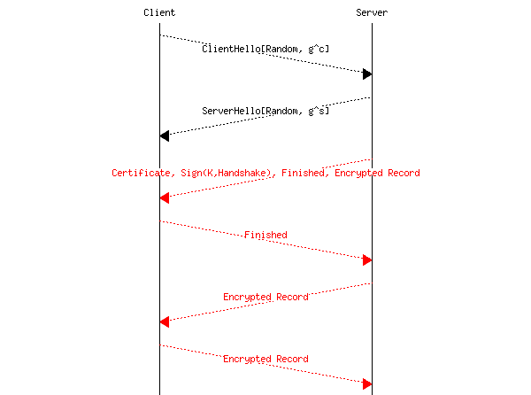

与 TLS 1.2 握手相比，有几个重要的不同之处。首先，TLS 1.3 需要 Diffie Hellman 密钥交换，并且这个交换是由客户端发起的（在验证服务器身份之前）。为了发起 Diffie Hellman 密钥交换，客户端需要猜测服务器可以接受的模数和基数。客户端要么使用大多数服务器支持的标准参数，要么记住与该特定服务器上次使用的最后一个模数/基数。如果客户端猜测错误，服务器将回复它期望的参数，这将导致丢失一个往返时间。当服务器发送其 ServerHello 时，它已经知道了会话密钥。这意味着服务器可以加密所有后续的消息。经过一个往返时间后，TLS 1.3 会话中交换的所有数据都是加密和认证的。在 TLS 1.3 中，服务器证书是用会话密钥加密的，以及 Finished 消息。服务器签署握手以确认它拥有其证书的公钥。如果服务器想要发送应用程序数据，它已经可以加密并发送给客户端。在接收到服务器证书后，客户端验证它并检查握手和 Finished 消息的签名。客户端通过发送自己的 Finished 消息来确认握手的结束。这时，客户端可以发送加密数据。这意味着客户端在发送加密数据之前只需等待一个往返时间。这比 TLS 1.2 快得多。

对于某些应用，在能够发送数据之前等待一个往返时间太长了。TLS 1.3 允许客户端在 ClientHello 之后立即发送加密数据，无需等待 ServerHello 消息。在这个握手阶段，客户端无法知道通过 Diffie Hellman 密钥交换将导出的密钥。技巧是服务器和客户端需要事先就预共享密钥达成一致。这个密钥可以通过非绑定方式协商，但通常是在客户端和服务器之间的先前 TLS 会话中交换。客户端和服务器都可以将此密钥存储在它们的缓存中。当客户端创建到服务器的新的 TLS 会话时，它会检查是否已经知道该服务器的预共享密钥。如果是这样，客户端将在其 ClientHello 消息中宣布此密钥的标识符。多亏了这个标识符，服务器可以恢复密钥并使用它来解密 0-rtt 加密记录。下面展示了简化版的 0-rtt TLS 1.3 握手 [[8]](#fhandshake)。

> 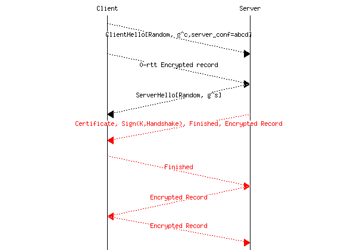

在网络上，TLS 客户端使用证书来验证服务器，但客户端没有被验证。然而，在企业网络等环境中，服务器可能还需要验证客户端。一种流行的部署是为希望通过虚拟专用网络服务访问企业网络的远程客户端进行验证。其中一些服务在 TLS 之上运行（或更精确地说，在 UDP 之上运行的 TLS 变体 DTLS，但超出了本章的范围[[MoR2004]](../bibliography.html#mor2004)）。在这些服务中，每个客户端都通过一个公钥和服务器信任的证书进行验证。为了建立 TLS 会话，这样的客户端需要证明它拥有与证书关联的公钥。这是通过服务器发送的证书请求消息来完成的。TLS 握手变为以下形式：

> 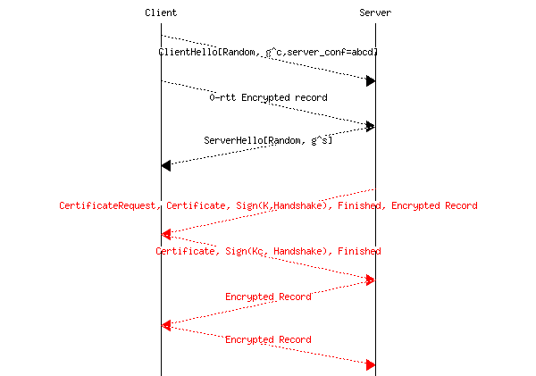

服务器发送一个证书请求消息。客户端返回其证书并使用其私钥签名握手。这向服务器确认客户端拥有其证书中指示的公钥。

TLS 1.2 和 TLS 1.3 之间有许多更多差异。更多详细信息可以在它们各自的规范中找到，分别是[**RFC 5246**](https://datatracker.ietf.org/doc/html/rfc5246.html)和[**RFC 8446**](https://datatracker.ietf.org/doc/html/rfc8446.html)。  # 保护域名系统#

域名系统在互联网基础设施中提供一项关键服务，因为它将终端用户使用的域名映射到 IP 地址。由于终端用户依赖于名称来识别他们要连接的服务器，DNS 分发的任何错误信息都会将终端用户的连接引导到无效的目的地。不幸的是，过去发生了几起此类攻击。关于 DNS 的安全威胁的详细分析出现在[**RFC 3833**](https://datatracker.ietf.org/doc/html/rfc3833.html)。我们在这部分考虑了其中的三个威胁，并将其他威胁留给[**RFC 3833**](https://datatracker.ietf.org/doc/html/rfc3833.html)。

第一种攻击类型是窃听。能够捕获发送到 DNS 解析器或 DNS 服务器的数据包的攻击者可以获取有关特定终端用户使用的 DNS 名称的有价值信息。如果攻击者可以捕获发送到 DNS 解析器的所有数据包，他/她可以收集大量关于终端用户使用的域名元数据。防止这种类型的攻击并不是 DNS 初始设计的目标。目前，正在与 IETF 讨论通过 TLS 会话传输 DNS 消息以保护此类攻击。然而，这些解决方案尚未得到广泛部署。

第二种攻击类型是中间人攻击。假设爱丽丝正在向她的 DNS 解析器发送 DNS 请求。不幸的是，Mallory 坐在解析器的前面，可以捕获和修改爱丽丝发送给解析器的所有数据包。在这种情况下，Mallory 可以轻松修改解析器发送的 DNS 响应，将爱丽丝的数据包重定向到 Mallory 控制的不同的 IP 地址。这使得 Mallory 能够观察（并可能修改）爱丽丝发送和接收的所有数据包。实际上，执行这种攻击并不简单，因为 DNS 解析器通常安装在受保护的数据中心中。然而，如果 Mallory 控制爱丽丝用来访问互联网的 WiFi 接入点，他可以轻松修改这个接入点上的数据包，并且一些软件包会自动化这种攻击类型。

如果 Mallory 无法控制爱丽丝和她的解析器之间的路由器，她仍然可以发起不同的攻击。要理解这种攻击，正确理解 DNS 协议的工作方式和 DNS 头部不同字段的角色非常重要，这些内容在图 46 中重现。


图 46 DNS 头部#

报头的第一字段是标识符字段。当 Alice 发送 DNS 请求时，她将一个 16 位的整数放入这个字段，并记住它。当她收到响应时，她使用这个标识符字段来定位她发送的初始 DNS 请求。只有当响应的标识符与挂起的 DNS 请求（包含相同的问题）匹配时，才使用该响应。

马洛里研究了 DNS 协议，并理解了它是如何工作的。如果他能够预测 Alice 将定期发送 DNS 请求的流行域名，那么他可以准备一组 DNS 响应，将 Alice 请求的域名映射到马洛里控制的 IP 地址，而不是合法的 DNS 响应。每个 DNS 响应都有一个不同的标识符。由于标识符字段只有 65,536 个值，马洛里可以向 Alice 发送这些值，希望其中之一在 Alice 等待具有相同标识符的 DNS 响应时被接收。在过去，快速发送 65,536 个 DNS 响应是困难的。然而，随着今天可用的高速链路，这不再是问题。马洛里的第二个担忧是，他必须能够发送 DNS 响应，就像它们直接来自 DNS 解析器一样。这意味着马洛里必须能够发送看起来来自不同地址的 IP 数据包。尽管网络应该配置为防止此类攻击，但这并不总是如此，有些网络允许主机发送具有不同源 IP 地址的数据包 [[10]](#fspoof)。如果攻击目标是单个最终用户，例如 Alice，这对该用户来说很烦人。然而，如果攻击者可以针对为整个公司或整个 ISP 提供服务的 DNS 解析器，攻击的影响可能会更大，特别是如果注入的 DNS 响应携带了长的 TTL，从而在解析器的缓存中保留较长时间。

幸运的是，DNS 服务器和解析器的设计者已经找到了缓解这种攻击的解决方案。最简单的方法是更新 DNS 请求和响应的格式，以包括一个更大的标识符字段。不幸的是，由于 DNS 消息不包含任何版本号，这种优雅的解决方案在 DNS 中是不可能的。由于 DNS 消息是在 UDP 段内交换的，DNS 开发者找到了一种替代方案来对抗这种攻击。Alice 使用的 DNS 库发送 DNS 请求有两种方式。第一种解决方案是绑定一个 UDP 源端口，并始终从这个源端口发送 DNS 请求（目标端口始终是端口`53`）。这种解决方案的优点是 Alice 的 DNS 库可以很容易地通过监听所选端口来接收 DNS 响应。不幸的是，一旦攻击者找到了 Alice 使用的源端口，他只需要发送 65,536 个 DNS 响应来注入一个无效的响应。幸运的是，Alice 可以通过不同的方式发送她的 DNS 请求。她不必为所有 DNS 请求使用相同的源端口，可以为每个请求使用不同的源端口。在实践中，每个 DNS 请求都会从一个不同的源端口发送。从实现的角度来看，这意味着 Alice 的 DNS 库需要为每个挂起的 DNS 请求监听一个不同的端口号。这增加了她实现的复杂性。从安全的角度来看，这有一个明显的优势，因为攻击者需要猜测 16 位的标识符和 16 位的 UDP 源端口来注入一个伪造的 DNS 响应。为了生成所有可能的 DNS 响应，攻击者需要生成几乎$ 2^{32} $个不同的消息，这在今天的网络中是过度的。大多数 DNS 实现使用第二种方法来防止这些缓存中毒攻击。

这些攻击影响客户端与其解析器之间或解析器与域名服务器之间交换的 DNS 消息。另一种攻击利用了在一个 DNS 响应中提供多个资源记录的可能性。DNS 服务器和解析器常用的一个优化方法是，在每次响应中包含多个相关的资源记录。例如，如果客户端发送一个 DNS 查询请求 NS 记录，它通常会在响应中接收到查询的记录，即提供查询域名的 DNS 服务器的名称，以及该服务器的 IP 地址。一些 DNS 服务器返回多个 NS 记录及其相关的 IP 地址。缓存中毒攻击就是利用这种 DNS 优化。

让我们通过一个例子来说明。假设 Alice 经常使用 example.net 域名，特别是名为 www.example.net 的 Web 服务器。Mallory 希望将 Alice 建立的指向 www.example.net 的 TCP 连接重定向到他控制的某个 IP 地址。假设 Mallory 控制 mallory.net 域名。Mallory 可以调整他域名的 DNS 服务器，并向发送的响应中添加特殊的 DNS 记录。攻击可能大致如下。Mallory 迫使 Alice 访问 www.mallory.net 网站。他可以通过向 Alice 发送垃圾邮件或购买 Alice 访问的网站上的广告，并将其中一条广告重定向到 www.mallory.net 来实现。当访问广告时，Alice 的 DNS 解析器将发送一个针对 www.mallory.net 的 DNS 请求。由于 Mallory 控制 DNS 服务器，他可以在响应中轻松添加一个 AAAA 记录，将 www.example.net 关联到 Mallory 控制的 IP 地址。如果 Alice 的 DNS 库没有检查返回的响应，则 www.example.net 的缓存条目将被 Mallory 发送的 AAAA 记录替换。

为了应对这些安全威胁并提高 DNS 的安全性，IETF 定义了几个被称为 DNSSEC 的扩展。DNSSEC 利用公钥加密来验证 DNS 服务器和解析器发送的 DNS 记录内容。DNSEC 定义在三个主要文档中[**RFC 4033**](https://datatracker.ietf.org/doc/html/rfc4033.html)、[**RFC 4034**](https://datatracker.ietf.org/doc/html/rfc4034.html)、[**RFC 4035**](https://datatracker.ietf.org/doc/html/rfc4035.html)。使用 DNSSEC，每个 DNS 区域使用一个公钥私钥对。这个密钥对仅用于签署和验证 DNS 记录。DNS 记录不会被加密，DNSSEC 也不提供任何机密性。其他 DNS 扩展正在开发中，以确保客户端与其解析器之间交换信息的机密性[**RFC 7626**](https://datatracker.ietf.org/doc/html/rfc7626.html)。其中一些扩展通过 TLS 会话交换 DNS 记录，这提供了所需的机密性，但它们尚未部署，也不在本章的范围内。

DNSSEC 定义了四种新的 DNS 记录类型，这些记录类型一起用于验证 DNS 分发的信息。

> +   DNSKEY 记录允许存储与区域关联的公钥。此记录以 TLV 编码，包括密钥的 Base64 表示形式和公钥算法的标识。这允许 DNSKEY 记录支持不同的公钥算法。
> +   
> +   RRSIG 记录用于编码 DNS 记录的签名。此记录包含几个子字段。其中最重要的包括生成签名的算法、用于签署记录的公钥标识符、签署记录的原始 TTL 以及签名的有效期。
> +   
> +   DS 记录包含一个公钥的哈希值。它被父区域用来认证其子区域使用的公钥。
> +   
> +   当查询不存在的域名时，使用 NSEC 记录。它的用法将在后面解释。

理解 DNSSEC 操作的最简单方法是通过一个简单的例子。让我们考虑 example.org 域名，并假设 Alice 想使用 DNSSEC 检索 www.example.org 的 AAAA 记录。

DNSSEC 的安全性依赖于锚定密钥。锚定密钥是一个被认为由解析器信任的公钥。在我们的例子中，我们假设 Alice 的解析器已经以安全的方式获得了管理根区域的服务器的公钥。这个密钥是在 DNS 之外分发的，例如，它已经在报纸上发布或通过密封信件接收。

要获取 www.example.org 的认证记录，Alice 的解析器首先需要检索负责.org 顶级域名(TLD)的 NS 记录。这个记录由 DNS 根服务器提供，Alice 的解析器可以检索这个 NS 记录的签名（RRSIG 记录）。由于 Alice 知道根的 DNSKEY，她可以验证这个签名的有效性。

下一步是与 ns.org 联系，这是负责.org TLD 的 NS 记录，以检索 example.org 域的 NS 记录。这个记录附带了认证它的 RRSIG 记录。这个 RRSIG 记录是用.org 域的密钥签名的。Alice 的解析器可以检索这个公钥作为.org 的 DNSKEY 记录，但如何信任这个密钥，因为它是通过 DNS 分发的，可能被攻击者修改过？DNSSEC 通过使用存储在父区域（在这种情况下，是根区域）中的 DS 记录来解决此问题。这个记录包含一个用 RRSIG 签名签名的公钥的哈希值。由于 Alice 的解析器信任根密钥，它可以验证.org 域的 DS 记录的签名。然后，它可以从 DNS 中检索这个域的 DNSKEY 记录，并将这个密钥的哈希值与 DS 记录进行比较。如果它们匹配，可以信任.org 域的公钥。相同的技巧用于获取和验证 example.org 域的密钥。一旦这个密钥被信任，Alice 的解析器就可以请求 www.example.org 的 AAAA 记录并验证其签名。

多亏了 DS 记录，解析器可以在存在从锚定密钥的 DS -> DNSKEY 记录链的情况下验证客户端区域的公钥。如果解析器信任根区域的公钥，它可以验证所有存在此链的 DNS 回复。

DNSSEC 运作中有几个细节值得讨论。首先，支持 DNSSEC 的服务器必须拥有一对公钥和私钥。公钥与 DNSKEY 记录一起分发。私钥永远不会分发，甚至不需要存储在使用公钥的服务器上。DNSSEC 不要求 DNSSEC 服务器实时执行任何需要私钥的操作。所有 RRSIG 记录都可以离线计算，可能是在返回 DNSSEC 响应的服务器之外的其他服务器上。这种设计选择的初始动机是计算包含数百万条记录的区域 RRSIG 签名的 CPU 复杂性。在 DNSSEC 的早期，这是一个操作限制。如今，这已不再是问题，但避免实时进行昂贵的签名操作有两个重要好处。首先，这降低了拒绝服务攻击的风险，因为攻击者无法迫使 DNSSEC 服务器执行计算密集型的签名操作。其次，私钥可以离线存储，这意味着即使攻击者获得了对 DNSSEC 服务器的访问权限，也无法检索其私钥。对于 RRSIG 记录使用离线签名有一些实际影响，这些影响反映在本记录的内容中。首先，每个 RRSIG 记录都包含所签记录的原始 TTL。当 DNS 解析器缓存记录时，它们会更改这些缓存记录的 TTL 值，然后将修改后的记录返回给客户端。当解析器收到一个签名的 DNS 记录时，它必须在检查签名之前用原始 TTL 替换收到的 TTL（并检查收到的 TTL 是否小于原始值）。其次，RRSIG 记录包含一个有效期，即签名的起始时间和结束时间。这个时间段仅指签名的有效期。它不影响所签记录的 TTL，并且独立于 TTL。在实践中，有效期对于允许 DNS 服务器操作员更新他们的公钥/私钥非常重要。当这样的密钥更改时，例如，因为私钥可能已被泄露，网络中存在两个密钥签名的记录共存的一段时间。有效期确保旧签名不会永远留在 DNS 缓存中。

DNSSEC 引入的最后一条记录是 NSEC 记录。它用于验证 DNS 服务器返回的负响应。如果解析器请求的区域中未定义的域名，服务器将回复错误信息。DNS 的原始版本的设计者认为这些错误不会非常频繁，解析器不需要缓存这些负响应。然而，运营经验表明，对无效域名的查询比最初预期的更频繁，一些服务器上的大量负载是由对无效名称的重复查询造成的。典型的例子包括对根 DNS 服务器无效顶级域名的查询或由配置错误引起的查询 [[WF2003]](../bibliography.html#wf2003)。当前的 DNS 部署允许解析器缓存这些负答案以减少整个 DNS 的负载 [**RFC 2308**](https://datatracker.ietf.org/doc/html/rfc2308.html)。

允许 DNSSEC 服务器返回签名负响应的最简单方法是为服务器返回一个包含接收到的查询和一些指示错误的信息的签名响应。然后客户端可以轻松地检查负响应的有效性。不幸的是，这将迫使 DNSSEC 服务器实时生成签名。这意味着私钥必须存储在服务器内存中，如果攻击者可以控制服务器，这将导致风险。此外，这些签名计算复杂，简单的拒绝服务攻击就是向 DNSSEC 服务器发送无效查询。

考虑到上述安全风险，DNSSEC 选择了不同的方法，允许使用离线签名对负回复进行验证。NSEC 记录利用了所有域名的字典顺序。为了理解其用法，考虑一个包含三个名称（未显示的关联 AAAA 记录和其他记录）的简单域：

```sh
alpha.example.org
beta.example.org
gamma.example.org 
```

在此域中，DNSSEC 服务器添加了三个 NSEC 记录。还为这些记录中的每一个计算了 RRSIG 签名。

```sh
alpha.example.org
alpha.example.org NSEC beta.example.org

beta.example.org
beta.example.org NSEC gamma.example.org

gamma.example.org
gamma.example.org NSEC alpha.example.org 
```

如果解析器查询 delta.example.org，服务器将解析其区域。如果该名称存在，它将在字典顺序中位于 beta.example.org 和 gamma.example.org 名称之间。为了确认 delta.example.org 名称不存在，服务器返回 beta.example.org 的 NSEC 记录，该记录表明 beta.example.org 之后的有效名称是 gamma.example.org。如果服务器收到对 pi.example.org 的查询，这将返回 gamma.example.org 的 NSEC 记录。由于此记录包含一个在字典顺序中位于 pi.example.org 之前的名称，这表明 pi.example.org 不存在。

脚注

## 安全威胁#

当分析计算机网络中的安全问题，考虑想要利用网络安全漏洞的攻击者的能力是有用的。攻击者有多种类型。一些具有通用能力，而另一些则特定于某种技术或网络协议。在本节中，我们将讨论网络架构师必须考虑的一些重要威胁。

第一种攻击者被称为被动攻击者。被动攻击者是指能够观察并通常存储在给定网络或其子集（例如，特定链路）中交换的信息（例如，数据包）的人。此攻击者可以访问通过此特定链路的所有数据。这是最基本的攻击类型，许多网络技术都容易受到此类攻击。在上面的示例中，被动攻击者可以轻易捕获 Alice 发送的密码，并在稍后将其重用来在远程计算机上以 Alice 的身份进行身份验证。这在下图中得到了说明，我们不再显示`DATA.req`和`DATA.ind`原语，而只显示交换的消息。在本章的整个过程中，我们始终使用 Eve 作为能够窃听她面前通过的数据的用户。

> 

在上述示例中，Eve 可以捕获 Bob 和 Alice 之间交换的所有数据包。这意味着 Eve 可以发现 Alice 的用户名和密码。有了这些信息，Eve 可以随后在 Bob 的计算机上以 Alice 的身份进行身份验证，并执行 Alice 被授权执行的所有操作。这是一个重大的安全问题。为了防止这种攻击，Alice 永远不应该在网络中发送她的密码，因为有人可能会窃听信息。在一些网络中，例如开放的无线网络，攻击者可以轻易收集特定用户发送的所有数据。在其他网络中，这要复杂一些，具体取决于所使用的网络技术，但存在各种软件包来自动化此过程。正如稍后所述，防止此类攻击的最佳方法是依靠加密技术，以确保密码永远不会以明文形式发送。

注意

普遍监控

在前面的例子中，我们解释了 Eve 如何捕获特定用户的数据。这并不是这种类型攻击的唯一例子。2013 年，基于爱德华·斯诺登收集的文件，媒体揭露了几家政府机构正在收集全球互联网构成的各种链接的大量数据 [[Greenwald2014]](../bibliography.html#greenwald2014)。得益于这大量数据，这些政府机构能够提取大量关于互联网用户行为的信息。像 Eve 一样，他们处于从他们捕获的所有数据包中提取密码、用户名和其他隐私敏感数据的位置。然而，似乎这些机构对各种元数据更感兴趣，例如显示特定用户与谁交流的信息，而不是实际交换的数据。这些揭露震惊了互联网社区，负责管理互联网协议标准化的[互联网工程任务组](https://www.ietf.org)在[**RFC 7258**](https://datatracker.ietf.org/doc/html/rfc7258.html)中宣布，这种普遍监控是一种需要在新协议开发中反击的攻击。正在开发几种新的协议和对现有协议的扩展来反击这些攻击。

窃听和普遍监控并不是针对网络的唯一可能攻击。另一种攻击者是主动攻击者。在文献中，这些攻击通常被称为中间人攻击或 MITM 攻击。这种攻击发生在一位用户，让我们称他为 Mallory，成功配置了网络，使他能够捕获和修改两个用户之间交换的数据包。最简单的场景是当 Mallory 控制了一个 Alice 和 Bob 都使用的路由器。例如，Alice 可能连接到由 Mallory 控制的 WiFi 接入路由器，而 Bob 则是一个互联网上的普通服务器。


随着 Mallory 接收了 Bob 和 Alice 发送的所有数据包，他可以随意修改它们。例如，他可以修改 Alice 发送给 Bob 管理的服务器的命令，并更改服务器发送的响应。这种攻击非常强大，有时在没有依赖高级加密技术的情况下很难反击。

在本介绍中，我们考虑的最后一种攻击类型是拒绝服务或 DoS 攻击。在此类攻击期间，攻击者生成足够的数据包来饱和特定服务并阻止其正确运行。最简单的拒绝服务攻击是发送比连接到网络的目标的链路带宽更多的数据包。目标可能是一台服务器、一家公司，甚至是一个整个国家。如果这些数据包都来自同一个来源，那么受害者可以识别攻击者并联系执法机构。实际上，这种拒绝服务攻击并非来自单一来源。攻击者通常破坏（可能非常大）的一组来源，并迫使它们向特定目标发送数据包以饱和。由于攻击流量来自广泛的来源，受害者很难定位肇事者，也难以对抗攻击。饱和链路是分布式拒绝服务（DDoS）攻击的最简单例子。

在实践中，一旦网络中某个地方资源有限，就可能出现拒绝服务攻击。这种资源可以是链路的带宽，但也可能是服务器的计算能力、内存，甚至是特定协议实现所使用的表的大小。防御真正的 DoS 攻击可能很困难，尤其是如果攻击者控制了用于发起攻击的大量来源。从带宽的角度来看，由几 Gbps 到几十 Gbps 流量组成的 DoS 攻击在互联网上很常见。2015 年，[github.com](http://www.github.com)据一些[报道](http://www.techworld.com/news/security/worlds-largest-ddos-attack-reached-400gbps-says-arbor-networks-3595715/)遭受了一次分布式 DoS 攻击，峰值带宽达到了 400 Gbps。

当设计将在大规模上部署的网络协议和应用时，考虑那些 DDoS 攻击是很重要的。攻击者使用不同的策略来发起 DDoS 攻击。有些人通过在这些源上注入恶意软件，成功控制了大量源。其他人，这也是协议设计者扮演重要角色的地方，只是利用某些协议的设计缺陷。考虑一个简单的请求-响应协议，其中客户端发送请求，服务器用响应来回复。通常，响应的大小大于或远大于客户端发送的请求。考虑这样一个简单的协议是在数据报网络中使用的。当 Alice 向 Bob 发送包含她的请求的数据报时，Bob 从数据包中提取出请求和 Alice 的地址。然后他发送一个单独的数据包，这个数据包的目的地是 Alice，以发送他的响应。Mallory 想要对 Alice 发起 DoS 攻击而不被识别。由于他已经研究了该协议的规范，他可以在一个数据包中向 Bob 发送一个请求，这个数据包的源地址是 Alice 的地址。Bob 将处理这个请求，并将他的（大）响应发送给 Alice。如果响应的大小与请求相同，Mallory 正在产生一个反射攻击，因为他的数据包被 Bob 反射。Alice 会认为她被 Bob 攻击了。如果有许多服务器运行与 Bob 相同的服务，Mallory 可以隐藏在大量这样的反射器后面。不幸的是，反射攻击也可以变成放大攻击。这种情况发生在 Bob 发送的响应比它接收到的请求更大的情况下。如果响应是请求的$ k $倍大，那么当 Mallory 消耗 1 Gbps 的带宽来发送请求时，他的受害者会接收到$ k $ Gbps 的攻击流量。这种放大攻击是一个非常重要的问题，协议设计者应该确保在收到请求的来源证明之前，他们永远不会发送一个大的响应。

## 密码学原语#

密码技术最初是由间谍和军队定义和使用的，以交换确保对手无法解码信息的方式。已经定义了广泛的技术。最初的技术依赖于它们的保密性来运行。最早的加密方案之一归功于尤利乌斯·凯撒。当他向他的将军们发送机密信息时，他会通过将每个字母替换为字母表中该字母后面的 $ n $ 个位置的字母来编码每条消息。例如，使用凯撒密码编码的消息 SECRET 变成 VHFUHW。这种技术在凯撒的战争中可能会让一些士兵感到困惑，但今天即使是小孩子也能从加密的消息中恢复原始信息。

凯撒密码的安全性依赖于算法的保密性，但经验表明，即使对于军事应用，也不可能假设一个算法会保持秘密。相反，必须设计加密技术，假设算法将是公开的，并且任何人都能知道。然而，其行为必须由一个称为密钥的小参数控制，只有需要秘密通信的用户才知道。这一原则归功于法国密码学家奥古斯特·Kerckhoff，他首次记录了这一原则：

> 即使攻击者知道系统的一切，除了称为密钥的一个参数外，密码算法也应该是安全的。

这一原则很重要，因为它仍然是所有密码学家的基本假设。任何依赖于其算法保密性来被认为是安全的系统注定会失败，并最终被破解。

根据 Kerckhoff 原则，我们现在可以讨论一个简单但强大的加密方案，该方案依赖于 XOR 逻辑运算。这种运算在硬件中很容易实现，并且所有微处理器都支持它。给定一个密钥 $ K $，可以通过计算 $ C_M = K \oplus M $ 来编码消息 M。接收者可以通过 $ M = K \oplus (K \oplus M) $ 恢复原始消息。这种 XOR 运算是完美密码（也称为 Vernam 密码或一次性密码）的关键操作。这种密码依赖于一个只包含纯随机位的密钥。加密消息是通过将消息的所有位与密钥的所有位进行 XOR 运算产生的。由于密钥是随机的，攻击者无法从加密的消息中恢复原始文本（或明文）。从安全角度来看，只要密钥的长度与消息相同，一次性密码就是最佳解决方案。

不幸的是，在实际中很难使用这种密码，因为密钥必须与需要传输的消息一样长。如果密钥小于消息，并且消息被分成与密钥长度相同的块，那么该方案的安全性会降低，因为相同的密钥用于解密消息的不同部分。在实践中，XOR 通常是加密方案中使用的基本操作之一。为了可用，部署的加密方案使用由少量位组成的密钥，通常是 56 位、64 位、128 位、256 位……

秘密密钥加密方案是一个完全可逆的函数，即给定一个加密函数 E，存在一个相关的解密函数 D，使得$ \forall K, \forall M : D(K, E(K,M))=M $。

已经提出了各种秘密密钥密码函数，并已实施和部署。其中最流行的是：

> +   DES，即数据加密标准，于 1977 年成为标准，并被工业界广泛使用。它使用 56 位密钥，现在被认为不够安全，因为攻击者可以通过测试所有可能的密钥来发起暴力攻击。三重 DES 结合了三个 56 位密钥，使得暴力攻击更加困难。
> +   
> +   RC4 是一种在 20 世纪 80 年代末由 Ron Rivest 为 RSA 安全公司定义的加密方案。鉴于其软件实现的快速性，它已被包含在各种协议和实现中。然而，密码学家已经发现了该算法的几个弱点。现在它已被弃用，不应再使用[**RFC 7465**](https://datatracker.ietf.org/doc/html/rfc7465.html)。
> +   
> +   AES 或高级加密标准是由比利时密码学家 Joan Daemen 和 Vincent Rijmen 于 2001 年设计的加密方案[[DR2002]](../bibliography.html#dr2002)。该算法已被美国国家标准与技术研究院（NIST）标准化。现在它被广泛应用于各种应用和硬件及软件实现中。许多微处理器包括专门的指令，以简化 AES 的实现。AES 将待加密的消息分成 128 位的块，并使用长度为 128 位、192 位或 256 位的密钥。块大小和密钥长度是加密方案的重要参数。块大小表示可以加密的最小消息，并迫使发送者将每条消息分成支持大小的块。如果消息大于整数个块，则必须在加密之前对消息进行填充，并且在解密后必须移除此填充。密钥大小表示加密方案对暴力攻击的抵抗力，即攻击者尝试所有可能的密钥以找到正确密钥的攻击。

到目前为止，AES 被广泛使用，但其他对称密钥加密方案仍在出现。ChaCha20，由 D.伯恩斯坦提出，现在被几个互联网协议使用[**RFC 7539**](https://datatracker.ietf.org/doc/html/rfc7539.html)。关于加密方案的详细讨论超出了本书的范围。我们将考虑加密方案作为黑盒，其操作依赖于单个密钥。关于这些方案中的几个的详细概述可以在[[MVV2011]](../bibliography.html#mvv2011)中找到。

在 20 世纪 70 年代，迪菲和赫尔曼在他们开创性的论文[[DH1976]](../bibliography.html#dh1976)中提出了一种不同类型的加密：公钥密码学。在公钥密码学中，每个用户都有两个不同的密钥：

> +   一个公钥（$ K_{pub} $），他可以向每个人分发
> +   
> +   一个私钥（$ K_{priv} $），他需要以安全的方式存储，并且永远不向任何人透露

这两个密钥一起生成，并且它们通过一个复杂的数学关系相互关联，这种关系使得从 $ K_{pub} $ 计算出 $ K_{priv} $ 是计算上困难的。

公钥密码学方案是两个函数的组合：

> +   一个加密函数，$ E_{p} $，它接受密钥和消息作为参数
> +   
> +   一个解密函数，$ D_{p} $，它接受密钥和消息作为参数

公钥用于加密消息，以便只有预期的接收者才能阅读。例如，让我们考虑两个用户：爱丽丝和鲍勃。爱丽丝（分别鲍勃）使用密钥 $ A_{priv} $ 和 $ A_{pub} $（分别 $ B_{priv} $ 和 $ B_{pub} $）。为了向爱丽丝发送安全消息 M，鲍勃计算 $ CM=E_p(A_{pub},M) $，而爱丽丝可以通过使用 $ D_p(A_{priv},CM)=D_p(A_{priv},E_p(A_{pub},M))=M $ 来解密它。

已经提出了几种公钥加密方案。其中两种已经得到广泛部署：

> +   Rivest Shamir Adleman (RSA) 算法[[2]](#frsa)在[[RSA1978]](../bibliography.html#rsa1978)中提出，该算法依赖于大整数的模幂运算。
> +   
> +   依赖于椭圆曲线特殊性质的椭圆曲线密码学技术[[3]](#fecc)。

公钥密码学另一个有趣的特性是其能够计算用于验证消息的签名。这种能力来自于使用两个相互关联的不同密钥。如果爱丽丝想要对消息 M 进行签名，她可以计算 $ SM=E_p(A_{priv},M) $。任何收到这个已签名消息的人都可以提取其内容，即 $ D_p(A_{pub},SM)=D_p(A_{pub},E_p(A_{priv},M))=M $。每个人都可以使用 $ A_{pub} $ 来检查消息是否由爱丽丝的私钥（$ A_{priv} $）签名。由于这个密钥只有爱丽丝知道，能够解密 SM 的能力就是消息由爱丽丝本人签名的证明。

在实践中，为了签名而加密一条消息可能会造成计算上的开销，尤其是如果消息是一个大文件。一个更快的解决方案是对文档进行总结，并仅对文档的总结进行签名。一个简单的方法可能是基于对消息计算校验和或 CRC。Alice 会计算 $ C=Checksum(M) $ 和 $ SC=E_p(A_{priv},C) $。然后她会将 M 和 SC 发送给消息的接收者，接收者可以轻松地从 SC 计算出 C 并验证消息的真实性。不幸的是，这个解决方案并不能保护 Alice 和消息接收者免受中间人攻击。如果 Mallory 可以拦截 Alice 发送的消息，他可以轻松地修改 Alice 的消息，并调整它使其具有与原始消息相同的校验和。CRC 虽然计算起来更复杂，但存在同样的问题。

为了有效地签名消息，Alice 需要能够以阻止攻击者生成具有相同摘要的不同消息的方式计算她消息的摘要。加密哈希函数被设计来解决这个问题。理想的哈希函数是对于每个可能的输入都返回不同数字的函数。在实践中，找到这样的函数是不可能的。加密哈希函数是这个完美摘要函数的近似。它们以 128 位、160 位、256 位或更多位计算给定消息的摘要。它们还表现出雪崩效应。这种效应表明，消息中的微小变化会导致哈希值的大幅变化。最后，哈希函数非常难以逆向。知道哈希值，在计算上很难找到相应的输入消息。密码学家们提出了几种哈希函数。最受欢迎的包括：

> +   MD5 是最初在 [**RFC 1321**](https://datatracker.ietf.org/doc/html/rfc1321.html) 中提出的。它被广泛应用于各种应用中。2010 年，针对 MD5 的攻击被公布，这个哈希函数现在已被弃用。
> +   
> +   SHA-1 是一种由 NIST 在 1995 年标准化的加密哈希函数。它输出 160 位的结果。它现在被用于各种网络协议中。
> +   
> +   SHA-2 是由 NIST 设计的另一系列加密哈希函数。SHA-2 的不同变体可以生成 224 位、256 位、384 位或 512 位的哈希值。

关于加密算法的另一个重要点是，这些算法通常需要随机数来正确运行（例如，生成密钥）。生成好的随机数是困难的，任何加密算法的实现都应该包括一个安全的随机数生成器。[**RFC 4086**](https://datatracker.ietf.org/doc/html/rfc4086.html) 提供了有用的建议。

## 加密协议#

我们现在可以将上一节中描述的加密操作组合起来，构建一些安全交换信息的协议。让我们首先回到在鲍勃的计算机上验证爱丽丝身份的问题。我们之前已经表明，在攻击者存在的情况下，使用简单的密码进行此目的是不安全的。

一种简单的方法是依赖于哈希函数。由于哈希函数是不可逆的，爱丽丝和鲍勃可以决定使用它们以安全的方式交换爱丽丝的密码。然后，爱丽丝可以通过以下交换进行身份验证。

> 

由于哈希函数不可逆，窃听者不能仅通过观察交换的数据来提取爱丽丝的密码。然而，攻击者的主要目标并不是爱丽丝的真实密码。马洛里（Mallory）的主要目标是验证自己为爱丽丝。如果马洛里能够捕获 Hash(passwd)，他可以简单地重放这些数据，而无需能够逆推哈希函数。这被称为重放攻击。

为了对抗这种重放攻击，我们需要确保爱丽丝永远不会向鲍勃发送相同的信息两次。下面是一种可能的操作模式。

> 

为了验证自己的身份，爱丽丝将她的用户标识发送给鲍勃。鲍勃回复一个随机数作为挑战，以验证爱丽丝知道共享的秘密（即她的密码）。爱丽丝回复一个哈希函数（例如 SHA-1）的计算结果，该计算结果是对一个字符串的哈希，该字符串是鲍勃选择的随机数和爱丽丝的密码的连接。鲍勃选择的随机数通常被称为 nonce，因为这个数字应该只使用一次。鲍勃在本地执行相同的计算并可以检查爱丽丝返回的消息。这种认证方案已在各种协议中使用。它防止重放攻击。如果伊芙捕获了爱丽丝和鲍勃之间交换的消息，由于哈希函数是不可逆的，她不能从交换的消息中恢复爱丽丝的密码。此外，她不能重放哈希值，因为鲍勃总是会发送一个不同的 nonce。

不幸的是，这个解决方案迫使鲍勃以明文形式存储爱丽丝的密码。鲍勃电脑的安全遭到任何破坏都会泄露爱丽丝的密码。不幸的是，这种情况确实发生了，其中一些事件导致了数百万个密码的泄露。

一个更好的方法是在不将爱丽丝的密码以明文形式存储在鲍勃的电脑上的情况下验证爱丽丝的身份。为此，爱丽丝计算了一个哈希链，这是 Lamport 在[[Lamport1981]](../bibliography.html#lamport1981)中提出的。哈希链是对输入字符串应用哈希函数（H）的序列。如果爱丽丝的密码是 P，那么她的 10 步哈希链是：$ H(H(H(H(H(H(H(H(H(H(P)))))))))) $。这个哈希链的结果将存储在鲍勃的电脑上，同时存储的值是 10。这个数字是爱丽丝在鲍勃电脑上剩余的最大认证次数。为了验证爱丽丝的身份，鲍勃发送剩余的认证次数，即在这个例子中是 10。由于爱丽丝知道她的密码 P，她可以计算$ H⁹(P)=H(H(H(H(H(H(H(H(H(P))))))))) $并将这个信息发送给鲍勃。鲍勃计算从爱丽丝那里收到的值的哈希（$ H(H⁹(P)) $）并验证这个值是否等于他数据库中存储的值。然后，他减少授权认证次数并将$ H⁹(P) $存储在他的数据库中。现在鲍勃已经准备好进行爱丽丝的下一个认证。当授权认证次数达到零时，需要重新初始化哈希链。如果伊芙捕获了$ (H^n(P)) $，她不能用它来在鲍勃的电脑上以爱丽丝的身份进行认证，因为鲍勃会减少其授权认证次数。此外，由于哈希函数是不可逆的，伊芙不能从$ H^{n}(P) $计算出$ H^{n-1}(P) $。

上面的两种协议可以防止窃听攻击，但不能防止中间人攻击。如果 Mallory 可以拦截爱丽丝发送的消息，他可以迫使她透露$ H^n(P) $，然后使用这些信息在鲍勃的计算机上冒充爱丽丝。在实践中，只有在通信用户知道他们的通信中不可能有中间人时，才应使用哈希链。

公钥密码学为爱丽丝在鲍勃的计算机上验证自己的身份提供了另一种可能性。再次假设爱丽丝和鲍勃从之前的接触中认识彼此。爱丽丝知道鲍勃的公钥（$ Bob_{pub} $），而鲍勃也知道爱丽丝的密钥（$ Alice_{pub} $）。为了验证自己的身份，爱丽丝可以发送她的用户标识符。鲍勃会回复一个用爱丽丝的公钥加密的随机数：$ E_p(Alice_{pub},R) $。爱丽丝可以解密这条消息以恢复 R，并发送$ E_p(Bob_{pub},R) $。鲍勃解密这个随机数并确认爱丽丝知道$ Alice_{priv} $。如果窃听者捕获了交换的消息，他无法恢复值 R，这个值可以用作使用秘密密钥算法加密信息的密钥。这在下方的时序图中进行了说明。

> 

这种方法的一个缺点是鲍勃被迫执行两次公钥计算：一次加密将随机数发送给爱丽丝，一次解密恢复爱丽丝加密的随机数。如果这些计算从 CPU 的角度来看成本高昂，这就会产生拒绝服务攻击的风险，攻击者可能会尝试访问鲍勃的计算机并迫使其执行这种昂贵的计算。在这种情况下，鲍勃比爱丽丝风险更大，他应该在确定自己正在与爱丽丝交谈之前不执行复杂的操作。下方的时序图中展示了另一种方法。

> 

在这里，Bob 只是简单地向 Alice 发送一个随机数，并验证她的签名。由于随机数和签名可能被窃听者捕获，因此它们不能用作加密进一步数据的密钥。然而，Bob 可以提出一个密钥，并将其与 Alice 的公钥一起加密，作为对已签名的随机数的响应。

如上所述的解决方案在 Bob 和 Alice 在通信之前知道他们各自的公钥的情况下是有效的。否则，该协议不能抵御中间人攻击者。考虑 Mallory 坐在 Alice 和 Bob 之间，假设 Alice 和 Bob 都不知道对方的公钥。

> 

在上述示例中，Alice 在她的第一条消息中发送她的公钥（$ Alice_{pub} $），以及她的身份。Mallory 拦截了消息，并用他自己的密钥（$ Mallory_{pub} $）替换了 Alice 的密钥。Bob 回复一个随机数 R。然后 Alice 签署随机数以证明她知道$ Alice_{priv} $。Mallory 丢弃了信息，而是计算$ E_p(Mallory_{priv},R) $。现在 Bob 认为他正在与 Alice 交谈，而 Mallory 坐在中间。

有时候需要对称认证。在这种情况下，每个用户必须使用他的/她的私钥进行一些计算。一个可能的交换如下。Alice 将她的证书发送给 Bob。Bob 回复一个随机数，$ R1 $，并提供他的证书。Alice 使用她的私钥加密$ R1 $并生成一个随机数，$ R2 $。Bob 验证 Alice 的计算，并使用他的私钥加密$ R2 $。Alice 验证计算，双方都完成了认证。

> 

上述协议是可行的，但 Bob 认证 Alice 和 Alice 认证 Bob 都需要很长时间。更快的认证方式可以是以下这样。

> 

Alice 发送她的随机非确定数，$ R2 $。Bob 签署$ R2 $并发送他的非确定数：$ R1 $。Alice 签署$ R1 $，双方都完成了认证。

现在考虑 Mallory 想要作为 Alice 进行认证。上述协议存在一个细微的漏洞，Mallory 可以利用这个漏洞。如果 Alice 和 Bob 可以同时作为客户端和服务器，这个漏洞就可以被利用。了解到这一点后，Mallory 可以按照以下方式操作。Mallory 开始与 Bob 进行认证，假装自己是 Alice。他向 Bob 发送第一条消息，包括 Alice 的身份。

> 

在这次交换中，Bob 通过签署 Mallory 发送的$ RA $非确定数来认证自己。现在，为了作为 Alice 进行认证，Mallory 需要使用 Alice 的私钥计算非确定数$ RB $的签名。Mallory 不知道 Alice 的密钥，但他可以利用协议强制 Alice 执行所需的计算。为此，Mallory 可以像下面这样开始对 Alice 进行认证。

> 

在这个例子中，Mallory 迫使 Alice 计算$ E_p(Alice_{priv},RB) $，这是完成第一次交换并验证为 Alice 所需的信息。这说明了当相同信息可用于不同目的时，认证方案中存在的一个常见问题。问题源于 Alice 同意在 Bob 选择的（并由 Mallory 转发的）随机数上计算她的签名。如果随机数是一个没有结构的简单整数，则会出现这个问题。如果随机数包含一些结构，例如关于 Alice 和 Bob 身份的信息，甚至是一个表示随机数是否由作为客户端的用户（即启动认证）或作为服务器选择的单个比特，那么协议就不再容易受到攻击。

为了应对上述提到的一些问题，通常将公钥密码学与证书结合使用。证书是一个包含来自可信第三方签名的数据结构。对证书利用的简单解释是考虑 Alice 和 Bob 都知道 Ted。这两个用户都信任 Ted，并且都存储了 Ted 的公钥：$ Ted_{pub} $。由于他们都知道 Ted 的密钥，他可以颁发证书。证书主要是用户身份与其公钥之间的加密链接。此类证书可以以不同的方式计算。一个简单的解决方案是 Ted 为每个认证用户生成一个包含以下信息的文件：

> +   他的/她的身份
> +   
> +   他的/她的公钥
> +   
> +   使用 Ted 的私钥签名的整个文件的哈希

然后，知道 Ted 的公钥，任何人都可以验证证书的有效性。当用户发送他的/她的公钥时，他/她必须也附加证书以证明他/她的身份与公钥之间的联系。在实践中，证书比这更复杂。证书通常用于验证服务器，有时也用于验证客户端。

可能的协议可以是以下。Alice 发送$ Cert(Alice_{pub},Ted) $。Bob 回复一个随机数。

> 

到目前为止，我们只讨论了认证问题。这是在通过不安全的网络在两个用户之间建立安全通信的重要但不是充分的一步。为了安全地交换信息，爱丽丝和鲍勃都需要：

> +   互相验证对方的身份
> +   
> +   约定一种加密他们将要交换的消息的方式

让我们先探讨如何通过使用公钥密码学来实现这一点。我们假设爱丽丝和鲍勃都有一对公钥私钥和由受信任的第三方泰德签署的相应证书。

一个可能的协议如下。爱丽丝发送 $ Cert(Alice_{pub},Ted) $。这个证书提供了爱丽丝的身份和她的公钥。鲍勃回复包含他自己的公钥的证书：$ Cert(Bob_{pub},Ted) $。在这个时候，他们都知道对方的公钥，可以使用它来发送加密消息。爱丽丝会发送 $ E_p(Bob_{pub},M1) $ 和鲍勃会发送 $ E_p(Alice_{pub},M2) $。在实践中，使用公钥加密技术加密大量消息是不高效的，因为这些密码系统需要大量的计算。更有效的方法是使用对称密钥密码系统来加密大部分数据，而只使用公钥密码系统来加密将用于对称密钥加密方案的随机密钥。

## 密钥交换#

当用户想要通过网络安全地通信时，即使在窃听者的存在下，他们也需要交换信息，例如将要使用的加密算法的密钥。在窃听者存在的情况下，允许两个用户安全交换整数的最广泛使用的算法是迪菲和赫尔曼提出的算法 [[DH1976]](../bibliography.html#dh1976)。它使用（大）整数。其中两个是公开的，一个是模数，$ p $，它必须是 $ p $ 的原根，另一个是基数，$ g $。通信用户选择一个随机整数，$ a $ 给爱丽丝，$ b $ 给鲍勃。交换开始如下：

> +   爱丽丝选择一个随机整数，$ a $ 并将 $ A=g^{a} \mod p $ 发送给鲍勃
> +   
> +   鲍勃选择一个随机整数，$ b $ 并将 $ B=g^{b} \mod p $ 发送给爱丽丝
> +   
> +   从她对 $ a $ 和 $ B $ 的知识出发，爱丽丝可以计算出 $ Secret=B^{a} \mod p= (g^{b} \mod p) ^{a} \mod p=g^{a \times b} \mod p $
> +   
> +   从对 $ b $ 和 $ A $ 的知识出发，鲍勃可以计算出 $ Secret=A^{b} \mod p=(g^{a} \mod p) ^{b} \mod p=g^{a \times b} \mod p $

该协议的安全性依赖于计算离散对数的难度，即从 $ A $（分别）的知识中，很难提取 $ \log(A)=\log(g^{a} \mod p)=a $（分别）$ \log(B)=\log(g^{b} \mod p)=b $。

下面展示了 Diffie-Hellman 密钥交换的应用示例。在开始交换之前，Alice 和 Bob 就模数($ p=23 $)和底数($ g=5 $)达成一致。这两个数字是公开的。它们通常是定义使用密钥交换的协议的标准的一部分。

> +   Alice 选择一个秘密整数：$ a=8 $，并将$ A= g^{a} \mod p= 5^{8} \mod 23=16 $发送给 Bob
> +   
> +   Bob 选择一个秘密整数：$ b=13 $，并将$ B= g^{b} \mod p=5^{13} \mod 23=21 $发送给 Alice
> +   
> +   Alice 计算$ S_{A}=B^{a} \mod p= 21^{8} \mod 23=3 $
> +   
> +   Bob 计算$ S_{B}=A^{b} \mod p= 16^{13} \mod 23=3 $

Alice 和 Bob 已经就秘密信息$ 3 $达成一致，而没有通过网络明确发送。如果使用的整数足够大且具有良好的属性，那么即使能够捕获 Alice 和 Bob 发送的所有消息的 Eve 也无法恢复他们交换的秘密密钥。该算法的安全性没有正式的证明，但数学家们已经尝试了几个世纪，试图用整数解决类似的问题，但没有找到有效的算法。只要使用的整数是随机的且足够大，Eve 唯一可能的攻击就是测试 Alice 和 Bob 可能选择的所有可能的整数。这在计算上非常昂贵。该算法在安全协议中被广泛用于达成秘密密钥。

很不幸，仅凭 Diffie-Hellman 密钥交换无法应对中间人攻击。考虑一下 Mallory，他坐在 Alice 和 Bob 之间，可以轻易地捕获并修改他们的消息。模数和底数是公开的。因此，Mallory 也知道它们。他可以这样做：

> +   Alice 选择一个秘密整数，并将$ A= g^{a} \mod p $发送给 Mallory
> +   
> +   Mallory 生成一个秘密整数$ m $，并将$ M=g^{m} \mod p $发送给 Bob
> +   
> +   Bob 选择一个秘密整数，并将$ B=g^{b} \mod p $发送给 Mallory
> +   
> +   Mallory 计算$ S_{A}=A^{m} \mod p $和$ S_{B}=B^{m} \mod p $
> +   
> +   Alice 计算$ S_{A}=M^{a} \mod p $，并使用这个密钥与 Mallory（充当 Bob）通信
> +   
> +   Bob 计算$ S_{B}=M^{b} \mod p $，并使用这个密钥与 Mallory（充当 Alice）通信

当 Alice 发送消息时，她用$ S_{A} $加密它。Mallory 用$ S_{A} $解密它，并用$ S_{B} $加密明文。当 Bob 收到消息时，他可以使用$ S_{B} $解密它。

为了安全地使用 Diffie-Hellman 密钥交换，Alice 和 Bob 必须使用认证交换。Alice 或 Bob 发送的一些信息必须使用其他用户已知的公钥进行签名。在实践中，Alice 认证 Bob 通常很重要。如果 Bob 有一个由 Ted 签名的证书，认证密钥交换可以组织如下。

> +   Alice 选择一个秘密整数：$ a $，并将$ A= g^{a} \mod p $发送给 Bob
> +   
> +   Bob 选择一个秘密整数：$ b $，计算$ B= g^{b} \mod p $，并将$ Cert(Bob,Bob_{pub},Ted), E_p(Bob_{priv},B) $发送给 Alice
> +   
> +   Alice 检查签名（使用$ Bob_{pub} $）和证书，并计算$ S_{A}=B^{a} \mod p $
> +   
> +   Bob 计算$ S_{B}=A^{b} \mod p $

这防止了上述提到的攻击，因为 Mallory 无法创建一个假的证书，也无法使用 Bob 的私钥来签名一个值。鉴于中间人攻击的风险，Diffie-Hellman 密钥交换机制在没有认证的情况下不应使用。

## 安全壳（ssh）#

建立计算机网络的一个初始动机是允许用户通过网络访问远程计算机。在 20 世纪 60 年代和 70 年代，大型机和新兴的小型机由一个中央单元和通过串行线路或调制解调器连接的一组终端组成。设计用来通过网络访问远程计算机的最简单协议可能是 telnet [**RFC 854**](https://datatracker.ietf.org/doc/html/rfc854.html)。telnet 在 TCP 上运行，默认情况下，telnet 服务器监听 23 号端口。telnet 使用的 TCP 连接是双向的，客户端和服务器都可以通过它发送数据。在这种连接上交换的数据基本上是用户在客户端机器上键入的字符以及服务器机器上运行的进程的文本输出，有一些例外（例如控制字符、控制 VT-100 等终端的字符……）。telnet 的默认字符集是 ASCII 字符集，但[**RFC 5198**](https://datatracker.ietf.org/doc/html/rfc5198.html)中指定的扩展支持 Unicode 字符的使用。

从安全角度来看，telnet 的主要缺点是所有信息，包括用户名、密码和命令，都在 TCP 连接中以明文形式发送。这意味着窃听者可以轻易地捕获在未受保护的网络中任何人使用的密码。存在各种软件工具来自动收集这些信息。因此，telnet 今天很少用于访问远程计算机。它通常被 ssh 或类似协议所取代。

安全壳协议是在 1990 年代中期由 T. Ylonen 设计的，旨在对抗针对 telnet 和类似协议的窃听攻击 [[Ylonen1996]](../bibliography.html#ylonen1996)。ssh 迅速变得流行，系统管理员鼓励使用它。最初的 ssh 版本是免费提供的。几年后，其作者创建了一家公司来商业分销它，但其他程序员继续开发了一个开源版本的 ssh，称为 [OpenSSH](http://www.openssh.com)。多年来，ssh 不断发展，成为了一个灵活适用的协议，其使用范围不仅限于远程登录，还包括文件传输、协议隧道等功能……在本节中，我们只讨论 ssh 的基本功能，并解释它与 telnet 的不同。关于 ssh 的详细描述已有整本书籍出版 [[BS2005]](../bibliography.html#bs2005)。该协议的概述出现在 [[Stallings2009]](../bibliography.html#stallings2009)。

ssh 协议直接运行在 TCP 协议之上。一旦 TCP 字节流建立，客户端和服务器交换消息。交换的第一个消息是一条 ASCII 行，宣布了协议版本以及客户端和服务器使用的软件实现版本。这两行在调试互操作性问题和其它问题时非常有用。

下一个消息是 `SSH_MSG_KEX_INIT` 消息，用于协商 `ssh` 会话将使用的加密算法。对于安全协议来说，包含允许协商所使用的加密算法的机制非常重要。首先，这些算法提供了不同级别的安全性。一些算法可能被认为是完全安全的，并且目前被推荐使用，但几年后，在发布了一些攻击之后可能会被弃用。其次，这些算法提供了不同级别的性能，并且对 CPU 和内存有不同的影响。

在实践中，一个 `ssh` 实现支持四种类型的加密算法：

> +   密钥交换
> +   
> +   加密
> +   
> +   消息认证码 (MAC)
> +   
> +   压缩

[IANA](https://www.iana.org) 维护了一个 [加密算法列表](http://www.iana.org/assignments/ssh-parameters/ssh-parameters.xhtml#ssh-parameters-16)，该列表可以被 `ssh` 实现使用。对于每种算法类型，客户端提供一个它支持的算法的有序列表，并同意使用这些算法。服务器将收到的列表与自己的列表进行比较。协商的结果是一组四个算法 [[4]](#fnull)，这些算法将用于本次会话。

> 

这种加密算法的协商允许在提出新算法时实现进化。如果客户端进行了升级，即使服务器尚未升级，它也可以宣布一个新的算法作为其首选算法。

一旦协商了加密算法，密钥交换算法就被用来协商一个客户端和服务器将共享的秘密密钥。这些密钥交换算法在基本算法的基础上有一些变体。例如，让我们分析 Diffie-Hellman 密钥交换算法如何在`ssh`协议中使用。在这种情况下，每个主机都有一个私钥和一个公钥。（注意，$ g $是阶为$ p $的伽罗瓦域子群的生成元，其中$ p $是一个素数，而||是连接运算符。有关更多信息，请参阅[[Schneier1996]](../bibliography.html#schneier1996)。)

> +   客户端生成随机数$ a $并将$ A=g^{a} \mod p $发送到服务器
> +   
> +   服务器生成随机数$ b $。然后计算$ B=g^{b} \mod p $，$ K=B^{a} \mod p $，并使用其私钥对$ hash(V_{Client} || V_{Server} || KEX\_INIT_{Client} || KEX\_INIT_{Server} || Server_{pub} || A || B || K ) $进行签名，其中$ V_{Server} $（分别对应$ V_{Client} $）是客户端（分别对应服务器）发送的初始消息，$ KEX\_INIT_{Client} $（分别对应$ KEX\_INIT_{Server} $）是客户端（分别对应服务器）发送的密钥交换消息，$ A $，$ B $和$ K $是 Diffie-Hellman 密钥交换的消息
> +   
> +   客户端可以重新计算$ K=A^{b} \mod p $并验证服务器提供的签名

这是一个略微修改过的认证 Diffie-Hellman 密钥交换，有两个有趣的观点。第一个观点是，当服务器验证密钥交换时，它不提供证书。这是因为`ssh`假设客户端会将其经常使用的服务器公钥存储在其缓存中。对于像`ssh`这样的协议，这个假设是有效的，因为用户通常用它与少量服务器交互，通常是几个或几十个。存储这些信息不需要大量的存储空间。在实践中，大多数`ssh`客户端都会接受在连接之前不知道远程服务器公钥的情况下连接到远程服务器。在这种情况下，客户端会向用户发出警告，用户可以决定接受或拒绝密钥。这个警告可以与密钥的指纹相关联，可以是字母序列，也可以是 ASCII 艺术，可以由服务器管理员在网络上或其他地方发布 [[5]](#fdnsssh)。如果一个客户端连接到一个公钥与存储的不匹配的服务器，会发出更强的警告，因为这可能表明中间人攻击或远程服务器已被入侵。它也可能表明服务器已升级，并且在升级过程中生成了新的密钥。

第二点是服务器不仅验证 Diffie-Hellman 交换的结果，还验证交换过程中发送和接收的所有信息的哈希值。这很重要，可以防止降级攻击。降级攻击是一种攻击，其中主动攻击者修改通信主机（通常是客户端）发送的消息，以请求使用较弱的加密算法。考虑一个支持两种加密方案的客户端。首选方案使用 128 位密钥，第二个方案是一个旧的加密方案，使用 48 位密钥。这个第二个算法保留以与较老的实施方案保持向后兼容。如果攻击者可以从客户端支持的加密算法列表中删除首选算法，他可以迫使服务器使用一个较弱的加密方案，这将更容易被破解。多亏了覆盖服务器交换的所有消息的哈希值，降级攻击无法针对`ssh`发生。算法敏捷性是安全协议的关键要求，当加密算法被研究人员破解时，这些协议需要进化。这种敏捷性不能不加考虑地使用，签署所有交换消息的哈希值是一种常用于防止降级攻击的技术。

注意

单次使用密钥

多亏了 Diffie-Hellman 密钥交换，客户端和服务器共享密钥 $ K $。一个简单的实现可能会直接使用这个密钥来执行会话中协商的所有加密算法。像大多数安全协议一样，`ssh`不会直接使用密钥 $ K $。相反，它使用协商的哈希函数和不同的参数 [[6]](#fsshkeys) 来允许客户端和服务器从 $ K $ 计算出六个密钥：

> +   客户端（或服务器）用于加密其发送数据的密钥
> +   
> +   客户端（或服务器）用于验证其发送数据的密钥
> +   
> +   客户端（或服务器）用于初始化协商的加密方案（如果该方案需要）

在安全协议的设计者中，通常的做法是不要为不同的目的使用相同的密钥。例如，允许客户端和服务器使用相同的密钥来加密数据可能会使攻击者能够通过向客户端发送它自己加密的数据来发起重放攻击。

在这一点上，通过 TCP 连接发送的所有消息都将使用协商的密钥进行加密。`ssh`协议使用根据[**RFC 4253**](https://datatracker.ietf.org/doc/html/rfc4253.html)中定义的二进制数据包协议编码的消息。这些消息中的每个都包含以下信息：

> +   `length`：这是消息的字节数，不包括 MAC 和长度字段
> +   
> +   `padding length`：这是添加到消息末尾的随机字节数。
> +   
> +   `payload`：用户传递的数据（在可选压缩之后）
> +   
> +   `padding`：在每个消息中添加的随机字节（至少四个），以确保消息长度是协商的加密算法使用的块大小的倍数
> +   
> +   `MAC`：如果会话已协商消息认证码，则此字段存在（在实践中，使用未经身份验证的`ssh`是危险的，并且此字段应始终存在）。请注意，为了计算 MAC，`ssh`实现必须维护一个消息计数器。每次发送消息并计算 MAC 时，计数器都会增加一，使用协商的认证算法和 MAC 密钥通过消息计数器和明文消息的连接来计算 MAC。消息计数器不传输，但接收方可以轻松恢复其值。`MAC`的计算方式为 $ mac = MAC(key, sequence\_number || unencrypted\_message) $，其中密钥是协商的认证密钥。

注意

使用 HMAC 验证消息

ssh 是一种使用消息认证码（MAC）来认证发送消息的协议的例子。这种 MAC 的一个简单实现可能是简单地使用像 SHA-1 这样的散列函数。然而，从安全角度来看，这种结构并不安全。互联网协议通常依赖于在 [**RFC 2104**](https://datatracker.ietf.org/doc/html/rfc2104.html) 中定义的 HMAC 构造。它可以使用任何散列函数（H）和密钥（K）。作为一个例子，让我们考虑使用 SHA-1 散列函数的 HMAC。SHA-1 使用 20 字节块，块大小将在 HMAC 的操作中扮演重要角色。我们首先需要密钥的长度与块大小相同。由于这个密钥是密钥生成算法的输出，这是该算法的一个参数。

HMAC 使用两个填充字符串：ipad（resp. opad），它是一个包含 20 个字节 `0x36`（resp. 字节 `0x5C`）的字符串。然后计算 HMAC 为 $ H[K \oplus opad, H(K \oplus ipad, data) ] $，其中 $ \oplus $ 表示位异或操作。这种计算已被证明比简单的 $ H(K,data) $ 对抗某些类型的密码学攻击更强大。

在 `ssh` 协议的众多特性中，值得一提的是用户是如何被服务器认证的。`ssh` 协议支持经典的用户名/密码认证（但用户名和密码都是通过安全的加密通道传输的）。此外，`ssh` 支持两种依赖于公钥的认证机制。要使用第一种，每个用户都需要生成自己的公钥/私钥对，并将公钥存储在服务器上。为了进行认证，用户需要使用自己的私钥签署包含其公钥的消息。由于服务器已经知道用户的公钥，它可以轻松地验证签名的有效性。第二种认证方案是为相互信任的主机设计的。每个主机都有一个公钥/私钥对，并存储它信任的其他主机的公钥。这通常用于像大学实验室这样的环境，其中每个用户都可以访问任何可用的计算机。如果 Alice 已经登录到 `computer1` 并想在 `computer2` 上执行命令，她可以在这个计算机上创建一个 `ssh` 会话并再次输入她的密码。使用基于主机的认证方案，`computer1` 使用其私钥签署一条消息以确认它已经认证了 Alice。然后 `computer2` 将接受 Alice 的会话而无需要求她的凭据。

`ssh` 协议包括其他一些超出了本书范围的功能。更多详细信息可以在 [[BS2005]](../bibliography.html#bs2005) 中找到。

## 传输层安全性#

传输层安全性（TLS）协议族最初以安全套接字层（SSL）的名义提出。最初的部署使用了这个名称，许多研究人员仍然将这个安全协议称为 SSL [FKC1996]。在本章中，我们使用由 IETF 标准化的官方名称：传输层安全性（TLS）。

TLS 协议被设计成可以被广泛使用传输层以可靠交换信息的各种应用程序使用。TLS 主要在 TCP 协议上使用。存在 TLS 的变体，它们在 SCTP [**RFC 3436**](https://datatracker.ietf.org/doc/html/rfc3436.html)或 UDP [**RFC 6347**](https://datatracker.ietf.org/doc/html/rfc6347.html)上运行，但这些超出了本章的范围。

TLS 会话在 TCP 连接上运行。TLS 负责加密和验证应用层协议交换的 SDU，而 TCP 提供加密和验证的字节流的可靠交付。TLS 被许多不同的应用层协议使用。最常见的是 HTTP（HTTP over TLS 称为 HTTPS）、SMTP [**RFC 3207**](https://datatracker.ietf.org/doc/html/rfc3207.html)或 POP 和 IMAP [**RFC 2595**](https://datatracker.ietf.org/doc/html/rfc2595.html)，但专有应用层协议也使用 TLS [AM2019]。

TLS 会话可以通过两种不同的方式启动。首先，应用程序可以使用为应用层协议 x-over-TLS 保留的专用 TCP 端口号。这是许多 HTTP 服务器使用的解决方案，它们为 TLS 上的 HTTP 保留了端口号$ 443 $。这个解决方案是可行的，但它需要为每个应用程序保留两个端口号：一个用于直接在 TCP 上使用应用层协议，另一个用于在 TLS 上使用应用层协议。鉴于可用的 TCP 端口号数量有限，这不是一个可扩展的解决方案。下表提供了 TLS 之上应用层协议的一些保留端口号。

| 应用 | TCP 端口号 | TLS 端口号 |
| --- | --- | --- |
| POP3 | 110 | 995 |
| IMAP | 143 | 993 |
| NNTP | 119 | 563 |
| HTTP | 80 | 443 |
| FTP | 21 | 990 |

启动 TLS 会话的第二种方法是使用应用层协议的标准 TCP 端口号，并在该协议中定义一个特殊消息来触发 TLS 会话的开始。这是用于 SMTP 的`STARTTLS`消息的解决方案。SMTP 的这种扩展[**RFC 3207**](https://datatracker.ietf.org/doc/html/rfc3207.html)定义了新的 STARTTLS 命令。客户端可以发出此命令，向服务器指示它想要启动一个 TLS 会话，如下面在端口 25 上的会话期间捕获的示例所示。

```sh
220 server.example.org ESMTP
EHLO client.example.net
250-server.example.org
250-PIPELINING
250-SIZE 250000000
250-ETRN
250-STARTTLS
250-ENHANCEDSTATUSCODES
250-8BITMIME
250 DSN
STARTTLS
220 2.0.0 Ready to start TLS 
```

在本章的剩余部分，我们假设 TLS 会话在 TCP 连接建立后立即开始。这对应于 Web 服务器的部署。我们专注于介绍 TLS 的非常流行的用例。TLS 是一个复杂的协议，支持除了 Web 服务器使用的功能之外的其他功能。更详细的 TLS 介绍可以在[[KPS2002]](../bibliography.html#kps2002)和[[Ristic2015]](../bibliography.html#ristic2015)中找到。

TLS 会话分为两个阶段：握手和数据传输。在握手阶段，客户端和服务器协商用于保护数据传输的安全参数和密钥。在第二阶段，所有交换的消息都使用协商的算法和密钥进行加密和验证。

### TLS 握手#

当用于与常规 Web 服务器交互时，TLS 握手有三个重要目标：

> 1.  安全协商客户端和服务器在 TLS 会话中将使用的加密算法
> 1.  
> 1.  验证客户端与有效的服务器交互
> 1.  
> 1.  安全地协商用于加密和验证 TLS 会话中交换的消息的密钥

TLS 握手是一个四路握手，如图所示。

> 

简而言之，客户端通过提出一个随机数来启动 TLS 握手。服务器回复其随机数和一个将名称绑定到公钥的证书。客户端生成一个 MasterSecret，稍后将用于派生会话密钥，并用服务器的公钥加密它。它还生成一个包含所有交换消息的 MAC 的 Finished 消息，以便服务器能够检测客户端发送的消息的任何修改。服务器也发送其自己的 Finished 消息。此时，客户端和服务器通过从 MasterSecret 派生的密钥发送加密记录。

首先，让我们讨论加密算法和参数的协商。像所有安全协议一样，TLS 在其设计中包含了一些灵活性，因为随着时间的推移，新的加密算法出现，而一些较老的算法一旦密码分析员发现漏洞，就会变得过时。TLS 握手过程从客户端发送的 `ClientHello` 消息开始。此消息包含以下信息：

> +   协议版本号：这是客户端支持的 TLS 协议版本。服务器应使用与客户端相同的 TLS 协议版本，但可以选择较旧的版本。目前部署了 TLS 的 1.2 和 1.3 两个版本。较旧的版本正在被弃用。
> +   
> +   随机数：安全协议依赖于随机数。客户端发送一个 32 字节长的随机数，其中通常有四个字节对应于客户端的时钟。这个随机数与服务器端的随机数一起用作生成安全密钥的种子。
> +   
> +   密码套件：这个有序列表包含客户端支持的加密算法集合，最优先的算法列在首位。与允许协商独立加密、密钥交换和认证算法的 `ssh` 相比，TLS 依赖于将这些算法组合在一起的套件。为 TLS 定义了许多密码套件。关于这些套件中的一些套件的安全性已经发布了各种建议 [**RFC 7525**](https://datatracker.ietf.org/doc/html/rfc7525.html)。
> +   
> +   压缩算法：客户端可以提议使用特定的压缩算法（例如 zlib）。理论上，在加密之前压缩数据是一种智能的方法来减少交换的数据量。不幸的是，TLS 中的实现导致了几个安全问题 [[PHG2013]](../bibliography.html#phg2013)。因此，压缩通常在 TLS 中被禁用 [**RFC 7525**](https://datatracker.ietf.org/doc/html/rfc7525.html)。
> +   
> +   扩展：TLS 支持在 `ClientHello` 消息中的各种扩展。这些扩展 [**RFC 6066**](https://datatracker.ietf.org/doc/html/rfc6066.html) 对于协议的演变很重要，但其中许多超出了本章的范围。

注意

`Server Name Indication (SNI)`

在 [**RFC 6066**](https://datatracker.ietf.org/doc/html/rfc6066.html) 中定义的 `Server Name Indication (SNI)` 扩展是针对 Web 服务器的关键 TLS 扩展。客户端使用它来指示它希望联系的服务器名称。与该名称关联的 IP 地址已从 DNS 中查询并用于建立 TCP 连接。为什么客户端需要在 TLS `ClientHello` 中指示服务器名称？动机与 HTTP/1.0 中的 `Host` 报头行相同。有了 SNI 扩展，单个 TLS 服务器可以支持使用不同域名的大量网站。多亏了 SNI 扩展，服务器在 TLS 会话开始时就知道相关的域名。如果没有这个扩展，托管提供商将被迫为每个启用了 TLS 的服务器使用一个 IP 地址。

服务器通过几条消息回复 `ClientHello`：

> +   包含服务器选择的协议版本（在本章中假设与客户端版本相同）、服务器选择的 32 个随机字节、从客户端广告的列表中选择的 Cipher Suite 以及会话 ID 的 `ServerHello` 消息。此会话 ID 是由服务器选择的标识符。它标识 TLS 会话以及为此会话协商的安全参数（算法和密钥）。它用于支持会话恢复。
> +   
> +   `Certificate` 消息提供了将域名绑定到服务器使用的公钥的证书（或通常是一系列证书）。TLS 使用服务器证书来验证服务器。它依赖于一个由一组根证书颁发机构组成的公钥基础设施，这些根证书颁发机构向证书颁发机构颁发证书，最终向服务器颁发证书。TLS 客户端通常配置有多个根证书颁发机构的公钥，并使用这些信息来验证从服务器收到的证书。由于历史原因，TLS 证书以 ASN.1 格式编码。ASN.1 语法的详细信息 [[Dubuisson2000]](../bibliography.html#dubuisson2000) 不在本书的范围之内。
> +   
> +   `ServerKeyExchange` 消息由服务器用来传输执行密钥交换所需的信息。此消息的内容是所选密钥交换算法的函数。
> +   
> +   `ServerHelloDone` 表示服务器已发送握手第一阶段的所有消息。

到此为止，是时候描述 TLS 密钥交换了。TLS 支持不同的密钥交换机制，这些机制可以作为选择加密套件的一部分进行协商。我们关注其中的两个，以突出它们之间的差异：

> +   `RSA`. 这种密钥交换算法使用了 RSA 公钥算法的加密能力。客户端通过`Certificate`消息验证了服务器的公钥。然后它生成一个（48 字节）的随机数，使用服务器公钥对其进行加密，并在`ClientKeyExchange`消息中将加密后的数字发送到服务器。服务器使用其私钥解密随机数。此时，客户端和服务器共享相同的（48 字节长）密钥，并使用它来生成第二阶段加密和验证数据所需的密钥。使用这种密钥交换算法，服务器不需要发送`ServerKeyExchange`消息。
> +   
> +   `DHE_RSA`。这种密钥交换算法是带有 RSA 签名的临时 Diffie-Hellman 密钥交换，用于验证密钥交换。它作为一个经典的认证 Diffie-Hellman 密钥交换操作。如果服务器选择了这种密钥交换，它将在`ServerKeyExchange`消息中发送其 Diffie-Hellman 参数，并使用其私钥对其进行签名。然后客户端继续密钥交换，并在`ClientKeyExchange`消息中发送其计算结果。因此，`DHE_RSA`是一个认证的 Diffie-Hellman 密钥交换，其中初始消息是由服务器发送的（而不是像我们的第一个示例中的客户端，但由于协议是对称的，这并不重要）。

`DHE_RSA`和`RSA`之间的重要区别在于它们对攻击的反应。许多人认为`DHE_RSA`比`RSA`更强大，因为它支持完美前向安全性。这种特性对于能够监听服务器发送和接收的所有（加密）数据的攻击者来说非常重要。假设特伦斯是这样的攻击者，他在过去六个月内存储了鲍勃服务器交换的所有数据包。如果他设法以任何方式获得鲍勃的私钥，他将能够解密在此期间用于保护与鲍勃服务器 TLS 会话的所有密钥。使用`DHE_RSA`，类似的攻击破坏性较小。如果特伦斯知道鲍勃的私钥，他将对鲍勃服务器的未来 TLS 会话发起中间人攻击。然而，他无法恢复他捕获的所有过去会话中使用的密钥。

注意

完美前向安全性

完美前向安全性（PFS）是密钥交换协议的重要特性。如果协议的设计保证即使服务器的私钥被泄露，以前会话使用的密钥也不会受到损害，则该协议提供 PFS。这是一个非常重要的特性。`DHE_RSA`提供完美前向安全性，但`RSA`密钥交换不提供此特性。在实践中，`DHE_RSA`在计算上成本较高。因此，最新的 TLS 实现当需要完美前向安全性时，更倾向于使用`ECDHE_RSA`或`ECDHE_ECDSA`。

所有用于密钥交换所需的信息现在都已传输。客户端和服务器将发送两个重要消息来结束握手并开始数据传输阶段。

客户端发送`ChangeCipherSpec`消息，随后是`Finished`消息。`ChangeCipherSpec`消息表示客户端已接收到生成此 TLS 会话安全密钥所需的所有信息。此消息也可以在会话的后期出现，以指示加密算法的改变，但这种用法超出了本书的范围。`Finished`消息更为重要。它向服务器确认 TLS 握手已正确执行，且没有攻击者能够修改客户端或服务器发送的数据。这是第一个使用所选安全密钥加密的消息。它包含握手期间交换的所有消息的散列值。

服务器还会发送一个`ChangeCipherSpec`消息，随后是一个`Finished`消息。

注意

TLS 加密套件

TLS 加密套件通常表示为一个以 TLS 开头并包含密钥交换算法缩写、密钥大小的加密方案及其操作模式和认证算法的 ASCII 字符串。例如，`TLS_DHE_RSA_WITH_AES_128_GCM_SHA256`是一个使用`DHE_RSA`密钥交换算法，以 128 位 AES 在 GCM 模式下加密，并使用 SHA-256 进行认证的 TLS 加密套件。TLS 加密套件的官方列表由 IANA 维护[[7]](#fianatls)。NULL 缩写表示未指定任何算法。例如，`TLS_ECDH_RSA_WITH_NULL_SHA`是一个不使用任何加密但仍然使用`ECDH_RSA`密钥交换和`SHA`进行认证的加密套件。

### TLS 记录协议#

现在握手已经完成。客户端和服务器将交换经过验证和加密的记录。TLS 根据会话中协商的加密算法定义了记录的不同格式。这些不同类型记录的详细讨论超出了本介绍的范畴。为了说明，我们简要描述一种记录格式。

与其他安全协议一样，TLS 使用不同的密钥来加密和验证记录。这些密钥是从 MasterSecret 派生出来的，MasterSecret 是在`RSA`密钥交换后由客户端随机生成的，或者在`DH_RSA`密钥交换后从 Diffie Hellman 参数派生出来的。用于派生密钥的确切算法在[**RFC 5246**](https://datatracker.ietf.org/doc/html/rfc5246.html)中定义。

TLS 记录始终由四个不同的字段组成：

> +   一个类型，表示记录的类型。最常见的是应用数据，对应于包含加密数据的记录。其他类型包括握手、更改密钥规范和警报。
> +   
> +   一个表示 TLS 协议版本的协议版本字段。这个版本由两个子字段组成：主版本号和次版本号。
> +   
> +   一个长度字段。TLS 记录的长度不能超过 16,384 字节。
> +   
> +   一个包含加密数据的 TLSPlainText

TLS 支持多种加密记录的方法。选择的方法取决于 TLS 会话中协商的加密算法。关于如何从用户数据生成 TLSPlainText 的不同方法的详细说明超出了本书的范围。作为一个例子，我们研究了一种方法：流加密。这种方法与可以操作字节流的加密算法一起使用。该方法从用户应用程序提供的字节序列开始：明文。第一步是计算认证码以验证数据的完整性。为此，TLS 使用 HMAC 计算 $ MAC(SeqNum, Header, PlainText) $，其中 SeqNum 是一个序列号，每次传输一个新的 TLS 记录时增加一。Header 是上述 TLS 记录的头部，PlainText 是需要加密的信息。请注意，序列号在 TLS 会话的两个端点维护，但不会在 TLS 记录中传输。这个序列号用于防止重放攻击。

注意

MAC-then-encrypt 或 Encrypt-then-MAC

当安全协议使用消息认证和加密时，它们需要指定这两个算法如何结合。一个解决方案，即当前 TLS 版本所使用的，是先计算认证码，然后加密数据和认证码。这种方法的一个缺点是，接收加密 TLS 记录的接收者必须首先尝试解密可能被攻击者修改过的数据，然后才能验证记录的真实性。一个更好的方法是发送者首先加密数据，然后对加密数据计算认证码。这就是在[**RFC 7366**](https://datatracker.ietf.org/doc/html/rfc7366.html)中提出的 encrypt-then-MAC 方法。使用 encrypt-then-MAC，接收者首先检查认证码，然后再尝试解密记录。

### 改进 TLS#

在过去的二十年里，TLS 的部署持续增长。早期的 TLS 服务器仅用于关键服务，如电子商务网站或在线银行。随着 CPU 性能的提高，使用 TLS 来保护 Web 服务器上的非关键部分，包括 HTML 页面的交付甚至视频服务，变得更加经济高效。现在有越来越多的应用程序依赖于 TLS [[AM2019]](../bibliography.html#am2019)。

2013 年，Firefox 遥测项目 [[9]](#ftelemetry) 收集的统计数据显示，Firefox 用户加载的网页中有 30%是通过 HTTPS 完成的。到 2019 年 10 月，80%的网页是通过 HTTPS 加载的。在六年的时间里，HTTPS 已成为访问网络服务的占主导地位的协议。有关网站 HTTPS 部署的另一个看法可以在 [[Helme2019]](../bibliography.html#helme2019) 中找到。

分析了多年来 TLS 演变的测量研究已经确定了 TLS 生态系统中的一些重要变化 [[KRA2018]](../bibliography.html#kra2018)。首先，首选的加密算法已经改变。虽然 2012 年 60%的连接使用了 RC4，但自 2015 年以来其使用率已经下降。AES 自 2013 年开始部署，现在被用于超过 90%的连接。部署的 TLS 版本也有所改变。TLS 1.0 和 TLS 1.1 现在很少使用。TLS 1.2 的部署始于 2013 年，到 2015 年达到了 70%的连接。下面描述的 TLS 1.3 版本也得到了广泛部署。

另一个有趣的事实是密钥交换方案。2012 年，RSA 是主导解决方案，被观察到的超过 80%的连接使用 [[KRA2018]](../bibliography.html#kra2018)。2013 年，爱德华·斯诺登揭露了几个政府的监控活动。这些揭露对互联网社区产生了巨大影响。作为互联网协议标准化的机构，IETF 在 [**RFC 7258**](https://datatracker.ietf.org/doc/html/rfc7258.html) 中认为这种普遍的监控是一种攻击。从那时起，几个 IETF 工作组开发了对抗普遍监控的解决方案。其中一种解决方案是鼓励完美前向安全性。在 TLS 中，这意味着用经过身份验证的 Diffie-Hellman 密钥交换（如 ECDHE）来替换 RSA。测量表明，自 2014 年夏季以来，ECDHE 比 RSA 更受欢迎。到 2018 年，观察到的超过 90%的 TLS 连接使用了 ECDHE。

最后一点是部署 TLS 服务器的难度 [[KMS2017]](../bibliography.html#kms2017)。当 TLS 服务器安装后，系统管理员需要获取证书并配置一系列服务器。最初，获取证书是复杂且昂贵的，但诸如[`letsencrypt.org`](https://letsencrypt.org)这样的倡议简化了这一工作流程。

2014 年，IETF TLS 工作组开始致力于开发 TLS 协议的 1.3 版本。他们为此新版本的主要目标 [[Rescorla2015]](../bibliography.html#rescorla2015) 是：

> +   通过删除未使用或不安全的协议功能来简化设计
> +   
> +   通过利用从 TLS 1.2 和某些已记录的攻击中学到的经验来提高 TLS 的安全性
> +   
> +   提高协议的隐私性
> +   
> +   减少 TLS 的延迟

自 2014 年以来，延迟已成为网络服务的一个重要关注点。随着接入网络的带宽持续增长，延迟正成为影响交互式网络服务性能的关键因素。使用 TLS 1.2 时，下载一个网页至少需要四次往返时间，一次用于创建底层 TCP 连接，一次用于交换 ClientHello/ServerHello，一次用于交换密钥，然后一次用于发送 HTTP GET 请求并检索响应。当服务器不在客户端附近时，这可能非常耗时。TLS 1.3 旨在通过将部分加密握手操作放在 TCP 握手中来将此握手减少到一次往返时间甚至零。这部分内容将在 TCP 章节中讨论。我们在这里关注的是将 TLS 握手减少到单次往返时间。

为了简化设计和实现，TLS 1.3 仅使用少量加密套件。其中五个在[**RFC 8446**](https://datatracker.ietf.org/doc/html/rfc8446.html)中指定，并且所有实现都必须支持`TLS_AES_128_GCM_SHA256`。为了确保隐私，所有未提供完美前向安全的加密套件都已移除。自 TLS 1.2 的压缩功能被多次攻击利用以来，压缩也已被从 TLS 中移除[**RFC 7457**](https://datatracker.ietf.org/doc/html/rfc7457.html)。

注意

企业、隐私和 TLS

通过仅支持在 TLS 1.3 中提供完美前向安全的加密套件，IETF 旨在保护用户免受各种攻击的隐私。然而，这种选择在一些企业中引发了激烈的辩论。一些企业，特别是在金融机构中，已经部署了 TLS，但希望能够解密 TLS 流量以进行各种安全相关活动。这些企业试图在 IETF 内部游说，以维持不提供完美前向安全的基于 RSA 的加密套件。他们的论点没有说服 IETF。最终，这些企业转向了 ETSI，另一个标准化机构，并说服他们采用企业 TLS，这是一种不提供完美前向安全的 TLS 1.3 变体[[eTLS2018]](../bibliography.html#etls2018)。

TLS 1.3 握手与 TLS 1.2 握手在几个方面有所不同。首先，当客户端首次连接到服务器时，TLS 1.3 握手需要单次往返时间。为了实现这一点，TLS 设计者详细研究了 TLS 1.2 握手，并发现第一次往返时间主要用于选择将在 TLS 会话中使用的加密算法和加密交换方案。TLS 1.3 通过要求使用具有小参数集的 Diffie-Hellman 交换来极大地简化了这一协商过程。这意味着客户端可以猜测服务器使用的参数（即模数 p 和基数 g），并立即开始 Diffie-Hellman 交换。下面图示展示了简化版的 TLS 1.3 握手。

> 

与 TLS 1.2 握手相比，有几个重要的区别。首先，TLS 1.3 需要 Diffie Hellman 密钥交换，并且这个交换是由客户端发起的（在验证服务器身份之前）。为了发起 Diffie Hellman 密钥交换，客户端需要猜测服务器可以接受的模数和基数。客户端要么使用大多数服务器支持的标准参数，要么记住与该特定服务器上次使用的最后一个模数/基数。如果客户端猜测错误，服务器将回复它期望的参数，并且会丢失一个往返时间。当服务器发送其 ServerHello 时，它已经知道了会话密钥。这意味着服务器可以加密所有后续的消息。经过一个往返时间后，TLS 1.3 会话中交换的所有数据都是加密和认证的。在 TLS 1.3 中，服务器证书是用会话密钥加密的，以及 Finished 消息。服务器签署握手以确认它拥有其证书的公钥。如果服务器想要发送应用程序数据，它已经可以加密并发送给客户端。在接收到服务器证书后，客户端验证它并检查握手和 Finished 消息的签名。客户端通过发送自己的 Finished 消息来确认握手的结束。这时，客户端可以发送加密数据。这意味着客户端在发送加密数据之前只需等待一个往返时间。这比 TLS 1.2 快得多。

对于某些应用，在能够发送数据之前等待一个往返时间太长了。TLS 1.3 允许客户端在 ClientHello 之后立即发送加密数据，而无需等待 ServerHello 消息。在这个握手阶段，客户端无法知道通过 Diffie Hellman 密钥交换将导出的密钥。技巧是服务器和客户端需要事先商定一个预共享密钥。这个密钥可以通过非绑定方式协商，但通常是在客户端和服务器之间的先前 TLS 会话中交换。客户端和服务器都可以将此密钥存储在它们的缓存中。当客户端创建到服务器的新的 TLS 会话时，它会检查是否已经知道该服务器的预共享密钥。如果是这样，客户端将在其 ClientHello 消息中宣布此密钥的标识符。多亏了这个标识符，服务器可以恢复密钥并使用它来解密 0-rtt 加密记录。下面展示了简化版的 0-rtt TLS 1.3 握手 [[8]](#fhandshake)。

> 

在网络上，TLS 客户端使用证书来验证服务器，但客户端没有被验证。然而，在企业网络等环境中，服务器可能还需要验证客户端。一种常见的部署是为那些希望通过虚拟专用网络服务访问企业网络的远程客户端进行验证。其中一些服务运行在 TLS 之上（或更精确地说，是在 UDP 之上的 TLS 变体 DTLS [[MoR2004]](../bibliography.html#mor2004)，但超出了本章的范围）。在这些服务中，每个客户端都通过一个由服务器信任的公钥和证书进行验证。为了建立 TLS 会话，这样的客户端需要证明它拥有与证书关联的公钥。这是通过服务器发送的 CertificateRequest 消息来完成的。TLS 握手变为以下形式：

> 

服务器发送一个 CertificateRequest 消息。客户端返回其证书并使用其私钥对握手进行签名。这向服务器确认客户端拥有其证书中指示的公钥。

TLS 1.2 和 TLS 1.3 之间有许多更多差异。更多详细信息可以在它们各自的规范中找到，[**RFC 5246**](https://datatracker.ietf.org/doc/html/rfc5246.html) 和 [**RFC 8446**](https://datatracker.ietf.org/doc/html/rfc8446.html)。

### TLS 握手#

当用于与常规 Web 服务器交互时，TLS 握手有三个重要目标：

> 1.  安全地协商客户端和服务器在 TLS 会话中将使用的加密算法
> 1.  
> 1.  验证客户端与有效服务器交互
> 1.  
> 1.  安全地协商用于加密和验证 TLS 会话中交换的消息的密钥

TLS 握手是一个四步握手，如图所示。

> 

简而言之，客户端通过提出一个随机数来启动 TLS 握手。服务器回复其随机数和一个证书，该证书将其名称绑定到一个公钥。客户端生成一个 MasterSecret，稍后将用于派生会话密钥，并用服务器的公钥加密它。它还生成一个包含所有交换消息的 MAC 的 Finished 消息，以便服务器能够检测客户端发送的消息的任何修改。服务器也发送它自己的 Finished 消息。此时，客户端和服务器通过从 MasterSecret 派生的密钥发送加密记录。

让我们先讨论加密算法和参数的协商。像所有安全协议一样，TLS 在其设计中包含了一些灵活性，因为随着时间的推移，新的加密算法出现，一些较旧的算法一旦密码分析学家发现缺陷，就会变得过时。TLS 握手从客户端发送的 `ClientHello` 消息开始。此消息包含以下信息：

> +   协议版本号：这是客户端支持的 TLS 协议版本。服务器应使用与客户端相同的 TLS 协议版本，但可以选择较旧版本。目前部署了 TLS 1.2 和 1.3 两个版本。较旧版本正在被弃用。
> +   
> +   随机数：安全协议依赖于随机数。客户端发送一个 32 字节长的随机数，其中通常有四个字节对应于客户端的时钟。这个随机数与服务器随机数一起用作生成安全密钥的种子。
> +   
> +   Cipher suites：这个有序列表包含客户端支持的加密算法集合，最优先的算法列在第一位。与允许独立协商加密、密钥交换和认证算法的`ssh`不同，TLS 依赖于将这些算法组合在一起的套件。为 TLS 定义了许多加密套件。关于这些套件中的一些套件的安全性已经发布了各种建议 [**RFC 7525**](https://datatracker.ietf.org/doc/html/rfc7525.html)。
> +   
> +   压缩算法：客户端可以提议使用特定的压缩算法（例如 zlib）。理论上，在加密之前压缩数据是一种减少交换数据量的智能方式。不幸的是，TLS 中的实现导致了几个安全问题 [[PHG2013]](../bibliography.html#phg2013)。因此，压缩通常在 TLS 中是禁用的 [**RFC 7525**](https://datatracker.ietf.org/doc/html/rfc7525.html)。
> +   
> +   扩展：TLS 在`ClientHello`消息中支持各种扩展。这些扩展 [**RFC 6066**](https://datatracker.ietf.org/doc/html/rfc6066.html) 对于允许协议发展很重要，但其中许多超出了本章的范围。

注意

`Server Name Indication (SNI)`

在[**RFC 6066**](https://datatracker.ietf.org/doc/html/rfc6066.html)中定义的`Server Name Indication (SNI)`扩展是用于 Web 服务器的重要 TLS 扩展。客户端使用它来指示它希望联系的服务器名称。与该名称关联的 IP 地址已从 DNS 查询并用于建立 TCP 连接。为什么客户端需要在 TLS 的`ClientHello`中指示服务器名称呢？动机与 HTTP/1.0 中的`Host`头行相同。有了 SNI 扩展，单个 TLS 服务器可以支持使用不同域名的好几个网站。多亏了 SNI 扩展，服务器在 TLS 会话开始时就知道相关的域名。如果没有这个扩展，托管提供商将不得不为每个启用了 TLS 的服务器使用一个 IP 地址。

服务器用几条消息回复`ClientHello`：

> +   包含服务器选择的协议版本（在本章中假设与客户端版本相同）、服务器选择的 32 个随机字节、从客户端广告的列表中选择的 Cipher Suite 以及一个 Session Id 的`ServerHello`消息。这个 Session Id 是一个由服务器选择的标识符。它标识 TLS 会话以及为该会话协商的安全参数（算法和密钥）。它用于支持会话恢复。
> +   
> +   `Certificate`消息提供了将域名绑定到服务器使用的公钥的证书（或通常是一系列证书）。TLS 使用服务器证书来验证服务器。它依赖于一个由一组根证书颁发机构组成的公钥基础设施，这些根证书颁发机构向证书颁发机构颁发证书，最终向服务器颁发证书。TLS 客户端通常配置有多个根证书颁发机构的公钥，并使用这些信息来验证他们从服务器收到的证书。由于历史原因，TLS 证书是以 ASN.1 格式编码的。ASN.1 语法的详细信息[[Dubuisson2000]](../bibliography.html#dubuisson2000)超出了本书的范围。
> +   
> +   `ServerKeyExchange`消息用于服务器传输执行密钥交换所需的信息。此消息的内容取决于所选的密钥交换算法。
> +   
> +   `ServerHelloDone`表示服务器已发送握手第一阶段的所有消息。

到目前为止，是时候描述 TLS 密钥交换了。TLS 支持不同的密钥交换机制，这些机制可以作为选择加密套件的一部分进行协商。我们关注其中的两个，以突出它们之间的差异：

> +   `RSA`。这个密钥交换算法使用了 RSA 公钥算法的加密能力。客户端通过`Certificate`消息验证了服务器的公钥。然后它生成一个（48 字节）的随机数，使用服务器公钥加密它，并在`ClientKeyExchange`消息中将加密后的数字发送到服务器。服务器使用其私钥解密随机数。在这个时候，客户端和服务器共享相同的（48 字节长）秘密，并使用它来生成第二阶段加密和验证数据所需的密钥。
> +   
> +   `DHE_RSA`。这个密钥交换算法是带有 RSA 签名的临时 Diffie-Hellman 密钥交换，用于验证密钥交换。它作为一个经典的认证 Diffie-Hellman 密钥交换操作。如果服务器选择了这个密钥交换，它将在`ServerKeyExchange`消息中发送其 Diffie-Hellman 参数，并使用其私钥对它们进行签名。然后客户端继续密钥交换，并在`ClientKeyExchange`消息中发送其自己计算的结果。因此，`DHE_RSA`是一个认证的 Diffie-Hellman 密钥交换，其中初始消息是由服务器发送的（而不是客户端，如我们的第一个示例，但由于协议是对称的，这并不重要）。

`DHE_RSA` 和 `RSA` 之间的重要区别在于它们对攻击的反应。许多人认为 `DHE_RSA` 比较于 `RSA` 更强，因为它支持完美前向安全性。这一特性对于能够监听服务器发送和接收的所有（加密）数据的攻击者来说非常重要。假设特伦斯是这样的攻击者，他在过去六个月内存储了鲍勃服务器交换的所有数据包。如果他设法以任何方式获得鲍勃的私钥，他将能够解密在此期间用于保护与鲍勃服务器 TLS 会话的所有密钥。使用 `DHE_RSA`，类似的攻击破坏性较小。如果特伦斯知道鲍勃的私钥，他将能够对鲍勃服务器的未来 TLS 会话发起中间人攻击。然而，他无法恢复他捕获的所有过去会话中使用的密钥。

注意

完美前向安全性

完美前向安全性（PFS）是密钥交换协议的一个重要特性。如果协议的设计保证即使服务器的私钥被泄露，以前会话使用的密钥也不会受到损害，则该协议提供 PFS。这是一个非常重要的特性。`DHE_RSA` 提供完美前向安全性，但 `RSA` 密钥交换不提供这一特性。在实践中，`DHE_RSA` 从计算角度来看成本较高。因此，TLS 的最新实现当需要完美前向安全性时，更倾向于使用 `ECDHE_RSA` 或 `ECDHE_ECDSA`。

所有用于密钥交换所需的信息现已传输。客户端和服务器将发送两条重要消息，以完成握手并开始数据传输阶段。

客户端发送 `ChangeCipherSpec` 消息，随后是 `Finished` 消息。`ChangeCipherSpec` 消息表示客户端已收到生成此 TLS 会话安全密钥所需的所有信息。此消息也可以在会话的后期出现，以指示加密算法的改变，但这种用法超出了本书的范围。`Finished` 消息更为重要。它向服务器确认 TLS 握手已正确执行，并且没有攻击者能够修改客户端或服务器发送的数据。这是第一个使用所选安全密钥加密的消息。它包含握手期间交换的所有消息的散列值。

服务器还会发送一个 `ChangeCipherSpec` 消息，随后是一个 `Finished` 消息。

注意

TLS 加密套件

TLS 加密套件通常表示为一个以 TLS 开头并包含密钥交换算法缩写、密钥大小和其操作模式的加密方案以及认证算法的 ASCII 字符串。例如，`TLS_DHE_RSA_WITH_AES_128_GCM_SHA256`是一个使用`DHE_RSA`密钥交换算法，以 128 位 AES 在 GCM 模式下加密，并使用 SHA-256 进行认证的 TLS 加密套件。TLS 加密套件的官方列表由 IANA 维护[[7]](#fianatls)。NULL 缩写表示未指定任何算法。例如，`TLS_ECDH_RSA_WITH_NULL_SHA`是一个不使用任何加密但仍然使用`ECDH_RSA`密钥交换和`SHA`进行认证的加密套件。

### TLS 记录协议#

握手现在已完成。客户端和服务器将交换经过认证和加密的记录。TLS 根据会话中协商的加密算法定义了记录的不同格式。这些不同类型记录的详细讨论超出了本介绍的范畴。为了说明，我们简要描述一种记录格式。

与其他安全协议一样，TLS 使用不同的密钥来加密和验证记录。这些密钥是从 MasterSecret 派生出来的，MasterSecret 要么是在`RSA`密钥交换后由客户端随机生成的，要么是在`DH_RSA`密钥交换后从 Diffie Hellman 参数派生出来的。用于派生密钥的确切算法在[**RFC 5246**](https://datatracker.ietf.org/doc/html/rfc5246.html)中定义。

TLS 记录始终由四个不同的字段组成：

> +   一个类型字段，表示记录的类型。最常见类型是应用程序数据，对应包含加密数据的记录。其他类型是握手、更改密钥规范和警报。
> +   
> +   一个协议版本字段，表示使用的 TLS 协议版本。这个版本由两个子字段组成：主版本号和次版本号。
> +   
> +   一个长度字段。TLS 记录的长度不能超过 16,384 字节。
> +   
> +   一个包含加密数据的 TLSPlainText

TLS 支持多种加密记录的方法。选择的方法取决于 TLS 会话中协商的加密算法。本书不涉及如何从用户数据生成 TLSPlainText 的不同方法的详细说明。作为一个例子，我们研究了一种方法：流加密。这种方法与可以操作字节流的加密算法一起使用。该方法从用户应用程序提供的字节序列开始：明文。第一步是计算认证码以验证数据的完整性。为此，TLS 使用 HMAC 计算 $ MAC(SeqNum, Header, PlainText) $，其中 SeqNum 是一个序列号，每次传输新的 TLS 记录时都会增加一。Header 是上述 TLS 记录的头部，PlainText 是需要加密的信息。请注意，序列号在 TLS 会话的两个端点维护，但它不会在 TLS 记录中传输。这个序列号用于防止重放攻击。

注意

MAC-then-encrypt 或 Encrypt-then-MAC

当安全协议使用消息认证和加密时，它们需要指定这两个算法如何结合。一个初步的解决方案，即当前 TLS 版本所使用的方案，是先计算认证码，然后对数据和认证码进行加密。这种方法的一个缺点是，加密的 TLS 记录的接收者必须首先尝试解密可能被攻击者修改过的数据，然后才能验证记录的真实性。一个更好的方法是发送者首先对数据进行加密，然后对加密数据计算认证码。这就是在[**RFC 7366**](https://datatracker.ietf.org/doc/html/rfc7366.html)中提出的 encrypt-then-MAC 方法。使用 encrypt-then-MAC 时，接收者首先检查认证码，然后再尝试解密记录。

### 改进 TLS#

在过去二十年里，TLS 的部署持续增长。早期的 TLS 服务器仅用于关键服务，如电子商务网站或在线银行。随着 CPU 性能的提高，使用 TLS 来保护非关键部分的 Web 服务器（包括 HTML 页面的交付甚至视频服务）变得更加经济高效。现在有越来越多的应用程序依赖于 TLS [[AM2019]](../bibliography.html#am2019)。

2013 年，Firefox 遥测项目收集的统计数据显示，Firefox 用户加载的网页中有 30%是通过 HTTPS 完成的。到 2019 年 10 月，80%的网页是通过 HTTPS 加载的。在六年里，HTTPS 已成为访问网络服务的占主导地位的协议。有关 HTTPS 在网站上的部署情况的更多信息，可以在[[Helme2019]](../bibliography.html#helme2019)中找到。

对 TLS 多年演变进行分析的测量研究已经确定了 TLS 生态系统中的一些重要变化 [[KRA2018]](../bibliography.html#kra2018)。首先，首选的加密算法已经改变。虽然 2012 年有 60%的连接使用了 RC4，但自 2015 年以来其使用率已经下降。AES 自 2013 年开始部署，现在被用于超过 90%的连接。部署的 TLS 版本也发生了变化。TLS 1.0 和 TLS 1.1 现在很少使用。TLS 1.2 的部署始于 2013 年，到 2015 年达到了 70%的连接。下面描述的 TLS 1.3 版本也得到了广泛部署。

另一个有趣的事实是密钥交换方案。2012 年，RSA 是主导解决方案，被观察到的超过 80%的连接使用 [[KRA2018]](../bibliography.html#kra2018)。2013 年，爱德华·斯诺登揭露了几个政府的监控活动。这些揭露对互联网社区产生了巨大影响。作为互联网协议标准化的机构，IETF 在[**RFC 7258**](https://datatracker.ietf.org/doc/html/rfc7258.html)中认为这种普遍监控是一种攻击。从那时起，几个 IETF 工作组开发了应对普遍监控的解决方案。其中一种解决方案是鼓励完美前向安全性。在 TLS 中，这意味着用认证的 Diffie-Hellman 密钥交换（如 ECDHE）来替换 RSA。测量表明，自 2014 年夏季以来，ECDHE 比 RSA 更受欢迎。到 2018 年，观察到的超过 90%的 TLS 连接使用了 ECDHE。

最后一点是部署 TLS 服务器的难度 [[KMS2017]](../bibliography.html#kms2017)。当 TLS 服务器安装时，系统管理员需要获取证书并配置一系列服务器。最初，获取证书既复杂又昂贵，但诸如[`letsencrypt.org`](https://letsencrypt.org)之类的倡议简化了这一工作流程。

2014 年，IETF 的 TLS 工作组开始着手开发 TLS 协议的 1.3 版本。他们为此新版本的主要目标 [[Rescorla2015]](../bibliography.html#rescorla2015) 是：

> +   通过删除未使用或不安全的协议功能来简化设计
> +   
> +   通过利用从 TLS 1.2 和某些已记录的攻击中学到的经验来提高 TLS 的安全性
> +   
> +   提高协议的隐私性
> +   
> +   减少 TLS 的延迟

自 2014 年以来，延迟已成为网络服务的一个重要关注点。随着接入网络带宽的持续增长，延迟正成为影响交互式网络服务性能的关键因素。TLS 1.2 要求下载一个网页至少需要四个往返时间，一个用于创建底层 TCP 连接，一个用于交换客户端问候/服务器问候，一个用于交换密钥，然后一个用于发送 HTTP GET 并检索响应。当服务器不在客户端附近时，这可能非常耗时。TLS 1.3 旨在将这个握手过程减少到一个往返时间，甚至通过在 TCP 握手过程中放置一些加密握手来达到零往返时间。这部分将在 TCP 章节中讨论。我们在这里关注的是将 TLS 握手减少到单个往返时间。

为了简化设计和实现，TLS 1.3 只使用了少量加密套件。其中五个在 [**RFC 8446**](https://datatracker.ietf.org/doc/html/rfc8446.html) 中指定，并且所有实现都必须支持 `TLS_AES_128_GCM_SHA256`。为了确保隐私，所有未提供完美前向安全的加密套件都已移除。压缩也已被从 TLS 中移除，因为几个针对 TLS 1.2 的攻击利用了其压缩功能 [**RFC 7457**](https://datatracker.ietf.org/doc/html/rfc7457.html)。

注意

企业、隐私和 TLS

通过仅支持在 TLS 1.3 中提供完美前向安全的加密套件，IETF 旨在保护用户免受各种攻击的隐私。然而，这一选择在一些企业中引发了激烈的辩论。一些企业，特别是在金融机构中，已经部署了 TLS，但希望能够解密 TLS 流量以进行各种安全相关活动。这些企业试图在 IETF 内进行游说，以维持不提供完美前向安全的基于 RSA 的加密套件。他们的论点并没有说服 IETF。最终，这些企业转向了 ETSI，另一个标准化机构，并说服他们采用企业 TLS，这是一种不提供完美前向安全的 TLS 1.3 变体 [[eTLS2018]](../bibliography.html#etls2018)。

TLS 1.3 握手与 TLS 1.2 握手在几个方面有所不同。首先，当客户端首次连接到服务器时，TLS 1.3 握手需要单次往返时间。为了实现这一点，TLS 设计者详细研究了 TLS 1.2 握手，并发现第一次往返时间主要用于选择将在 TLS 会话中使用的加密算法和加密交换方案。TLS 1.3 通过要求使用具有小参数集的 Diffie-Hellman 交换来极大地简化了这种协商。这意味着客户端可以猜测服务器使用的参数（即模数 p 和底数 g），并立即开始 Diffie-Hellman 交换。下面图示展示了简化版的 TLS 1.3 握手过程。

> 

与 TLS 1.2 握手相比，有几个重要的区别。首先，TLS 1.3 要求进行 Diffie Hellman 密钥交换，并且这个交换是由客户端发起的（在验证服务器身份之前）。为了发起 Diffie Hellman 密钥交换，客户端需要猜测服务器可以接受的模数和基数。客户端可以使用大多数服务器支持的标准参数，或者客户端记得与该特定服务器上次使用的最后一个模数/基数。如果客户端猜测错误，服务器会回复它期望的参数，并且会丢失一个往返时间。当服务器发送其 ServerHello 时，它已经知道了会话密钥。这意味着服务器可以加密所有后续的消息。经过一个往返时间后，TLS 1.3 会话中交换的所有数据都是加密和认证的。在 TLS 1.3 中，服务器证书是用会话密钥加密的，以及 Finished 消息。服务器签署握手以确认它拥有其证书的公钥。如果服务器想要发送应用程序数据，它已经可以加密并发送给客户端。在接收到服务器证书后，客户端会验证它并检查握手和 Finished 消息的签名。客户端通过发送自己的 Finished 消息来确认握手的结束。这时，客户端可以发送加密数据。这意味着客户端在发送加密数据之前只需要等待一个往返时间。这比 TLS 1.2 要快得多。

对于某些应用程序，在能够发送数据之前等待一个往返时间太长了。TLS 1.3 允许客户端在 ClientHello 之后立即发送加密数据，而无需等待 ServerHello 消息。在这个握手阶段，客户端无法知道 Diffie Hellman 密钥交换将导出的密钥。技巧是服务器和客户端需要事先就预共享密钥达成一致。这个密钥可以通过带外协商，但通常是在客户端和服务器之间的先前 TLS 会话中交换的。客户端和服务器都可以将其存储在缓存中。当客户端创建到服务器的新的 TLS 会话时，它会检查是否已经知道该服务器的预共享密钥。如果是这样，客户端会在其 ClientHello 消息中宣布这个密钥的标识符。多亏了这个标识符，服务器可以恢复密钥并使用它来解密 0-rtt Encrypted 记录。下面展示了简化版的 0-rtt TLS 1.3 握手[[8]](#fhandshake)。

> 

在网络上，TLS 客户端使用证书来验证服务器，但客户端本身不被验证。然而，在企业网络等环境中，服务器可能还需要验证客户端。一种常见的部署方式是验证通过虚拟专用网络服务访问企业网络的远程客户端。其中一些服务运行在 TLS 之上（或更精确地说，是在 UDP 之上运行的 TLS 变体 DTLS [[MoR2004]](../bibliography.html#mor2004)，但不在本章的范围内）。在这些服务中，每个客户端都通过一个由服务器信任的公钥和证书进行验证。为了建立 TLS 会话，这样的客户端需要证明它拥有与证书关联的公钥。这是通过服务器发送的 CertificateRequest 消息来完成的。TLS 握手变为以下形式：

> 

服务器发送一个 CertificateRequest 消息。客户端返回其证书并使用其私钥对握手进行签名。这向服务器确认客户端拥有其证书中指示的公钥。

TLS 1.2 和 TLS 1.3 之间还有许多其他差异。更多详细信息可以在它们各自的规范中找到，分别是[**RFC 5246**](https://datatracker.ietf.org/doc/html/rfc5246.html)和[**RFC 8446**](https://datatracker.ietf.org/doc/html/rfc8446.html)。

## 保护域名系统#

域名系统在互联网基础设施中提供一项关键服务，因为它将终端用户使用的域名映射到 IP 地址。由于终端用户依赖于名称来识别他们连接的服务器，DNS 分发的任何错误信息都会将终端用户的连接引导到无效的目的地。不幸的是，过去发生了几起这类攻击。关于 DNS 的安全威胁的详细分析出现在[**RFC 3833**](https://datatracker.ietf.org/doc/html/rfc3833.html)中。在本节中，我们讨论了其中三种威胁，并将其他威胁留给[**RFC 3833**](https://datatracker.ietf.org/doc/html/rfc3833.html)。

第一种攻击类型是窃听。能够捕获发送到 DNS 解析器或 DNS 服务器的数据包的攻击者可以获取有关特定终端用户使用的 DNS 名称的宝贵信息。如果攻击者可以捕获发送到 DNS 解析器的所有数据包，他/她可以收集大量关于终端用户使用的域名的元数据。防止此类攻击并非 DNS 初始设计的目标。目前，正在与 IETF 进行讨论，以在 TLS 会话中传输 DNS 消息，以防止此类攻击。然而，这些解决方案尚未得到广泛部署。

第二种攻击类型是中间人攻击。假设 Alice 正在向她的 DNS 解析器发送 DNS 请求。不幸的是，Mallory 坐在该解析器的前面，可以捕获和修改 Alice 发送给解析器的所有数据包。在这种情况下，Mallory 可以轻松修改解析器发送的 DNS 响应，将 Alice 的数据包重定向到 Mallory 控制的另一个 IP 地址。这使得 Mallory 能够观察（并可能修改）Alice 发送和接收的所有数据包。在实践中，执行这种攻击并不简单，因为 DNS 解析器通常安装在受保护的数据中心中。然而，如果 Mallory 控制 Alice 用来访问互联网的 WiFi 接入点，他可以轻松修改该接入点上的数据包，并且一些软件包会自动化这种攻击。

如果 Mallory 无法控制 Alice 和她的解析器之间的路由器，她仍然可以发起不同的攻击。要理解这种攻击，正确理解 DNS 协议的工作方式和 DNS 头部不同字段的角色非常重要，这些内容在图 46 中重现。


图 46 DNS 头部#

标题字段的第一字段是标识字段。当爱丽丝发送一个 DNS 请求时，她将一个 16 位的整数放入这个字段并记住它。当她收到响应时，她使用这个标识字段来定位她发送的初始 DNS 请求。只有当其标识与待处理的 DNS 请求（包含相同的问题）匹配时，响应才会被使用。

马洛里研究了 DNS 协议，并理解它是如何工作的。如果他能够预测一个爱丽丝会定期发送 DNS 请求的流行域名，那么他可以准备一组 DNS 响应，将爱丽丝请求的名称映射到马洛里控制的 IP 地址，而不是合法的 DNS 响应。每个 DNS 响应都有一个不同的标识。由于标识字段只有 65,536 个值，马洛里可以向爱丽丝发送它们，希望其中之一会在爱丽丝等待具有相同标识的 DNS 响应时被接收。在过去，快速发送 65,536 个 DNS 响应是困难的。然而，随着今天可用的高速链路，这不再是问题。马洛里的第二个担忧是，他必须能够发送 DNS 响应，就像它们直接来自 DNS 解析器一样。这意味着马洛里必须能够发送看起来来自不同地址的 IP 数据包。尽管网络应该配置为防止此类攻击，但这并不总是如此，有些网络允许主机发送具有不同源 IP 地址的数据包 [[10]](#fspoof)。如果攻击目标是单个最终用户，例如爱丽丝，这对该用户来说很烦人。然而，如果攻击者可以针对为整个公司或整个 ISP 提供服务的 DNS 解析器，攻击的影响可能会更大，特别是如果注入的 DNS 响应携带一个长的 TTL，从而在解析器的缓存中保留很长时间。

幸运的是，DNS 服务器和解析器的开发者已经找到了缓解此类攻击的解决方案。最简单的方法可能是更新 DNS 请求和响应的格式，以包括一个更大的标识符字段。不幸的是，由于 DNS 消息不包含任何版本号，这种优雅的解决方案在 DNS 中是不可能的。因为 DNS 消息是在 UDP 段内交换的，DNS 开发者找到了一种替代方案来对抗这种攻击。Alice 使用的 DNS 库发送 DNS 请求有两种方式。第一种解决方案是绑定一个 UDP 源端口，并始终从这个源端口发送 DNS 请求（目标端口始终是端口`53`）。这种解决方案的优势在于 Alice 的 DNS 库可以轻松地通过监听所选端口来接收 DNS 响应。不幸的是，一旦攻击者发现了 Alice 使用的源端口，他只需要发送 65,536 个 DNS 响应来注入一个无效的响应。幸运的是，Alice 可以通过不同的方式发送她的 DNS 请求。她不必为所有 DNS 请求使用相同的源端口，可以为每个请求使用不同的源端口。在实践中，每个 DNS 请求都将从一个不同的源端口发送。从实现的角度来看，这意味着 Alice 的 DNS 库需要为每个挂起的 DNS 请求监听一个不同的端口号。这增加了她实现的复杂性。从安全的角度来看，这有一个明显的优势，因为攻击者需要猜测 16 位的标识符和 16 位的 UDP 源端口来注入一个伪造的 DNS 响应。为了生成所有可能的 DNS 响应，攻击者需要生成几乎$ 2^{32} $个不同的消息，这在今天的网络中是过度的。大多数 DNS 实现都使用第二种方法来防止这些缓存中毒攻击。

这些攻击影响客户端与其解析器或解析器与名称服务器之间交换的 DNS 消息。另一种攻击类型利用了在一个 DNS 响应中提供多个资源记录的可能性。DNS 服务器和解析器常用的一个常见优化是在每个响应中包含多个相关的资源记录。例如，如果客户端发送一个 DNS 查询请求 NS 记录，它通常会在响应中接收到查询记录，即服务于查询域的 DNS 服务器的名称，以及该服务器的 IP 地址。一些 DNS 服务器返回多个 NS 记录及其相关的 IP 地址。缓存中毒攻击利用了这种 DNS 优化。

让我们用一个例子来说明。假设 Alice 经常使用 example.net 域名，特别是名为 www.example.net 的 Web 服务器。Mallory 希望将 Alice 建立的指向 www.example.net 的 TCP 连接重定向到他控制的某个 IP 地址。假设 Mallory 控制 mallory.net 域名。Mallory 可以调整他域名的 DNS 服务器，并向发送的响应中添加特殊的 DNS 记录。攻击可能大致如下。Mallory 迫使 Alice 访问 www.mallory.net 网站。他可以通过向 Alice 发送垃圾邮件或购买 Alice 访问的网站上的广告，并将其中一条广告重定向到 www.mallory.net 来实现。当访问广告时，Alice 的 DNS 解析器将发送一个针对 www.mallory.net 的 DNS 请求。由于 Mallory 控制 DNS 服务器，他可以轻松地在响应中添加一个 AAAA 记录，将 www.example.net 关联到 Mallory 控制的 IP 地址。如果 Alice 的 DNS 库没有检查返回的响应，则 www.example.net 的缓存条目将被 Mallory 发送的 AAAA 记录替换。

为了应对这些安全威胁并提高 DNS 的安全性，IETF 定义了几个被称为 DNSSEC 的扩展。DNSSEC 利用公钥密码学来验证 DNS 服务器和解析器发送的 DNS 记录的内容。DNSSEC 定义在三个主要文档中：[**RFC 4033**](https://datatracker.ietf.org/doc/html/rfc4033.html)、[**RFC 4034**](https://datatracker.ietf.org/doc/html/rfc4034.html)、[**RFC 4035**](https://datatracker.ietf.org/doc/html/rfc4035.html)。使用 DNSSEC，每个 DNS 区域使用一个公钥私钥对。这个密钥对仅用于签名和验证 DNS 记录。DNS 记录不会被加密，DNSSEC 也不提供任何机密性。其他 DNS 扩展正在开发中，以确保客户端与其解析器之间交换信息的机密性[**RFC 7626**](https://datatracker.ietf.org/doc/html/rfc7626.html)。其中一些扩展通过 TLS 会话交换 DNS 记录，这提供了所需的机密性，但它们尚未部署，也不在本章的范围内。

DNSSEC 定义了四种新的 DNS 记录类型，这些记录类型一起使用以验证 DNS 分发的信息。

> +   DNSKEY 记录允许存储与区域关联的公钥。此记录以 TLV 编码，包括密钥的 Base64 表示和公钥算法的标识。这允许 DNSKEY 记录支持不同的公钥算法。
> +   
> +   RRSIG 记录用于编码 DNS 记录的签名。此记录包含几个子字段。其中最重要的包括生成签名的算法、用于签名的公钥的标识符、签名的原始 TTL 以及签名的有效期。
> +   
> +   DS 记录包含一个公钥的哈希值。它被父区域用来证明其子区域使用的公钥。
> +   
> +   当查询不存在的域名时，会使用 NSEC 记录。其用法将在后面解释。

要理解 DNSSEC 的操作，最简单的方法是依靠一个简单的例子。让我们考虑 example.org 域，并假设 Alice 想使用 DNSSEC 检索 www.example.org 的 AAAA 记录。

DNSSEC 的安全性依赖于锚定密钥。锚定密钥是一个被认为由解析器信任的公钥。在我们的例子中，我们假设 Alice 的解析器已经以安全的方式获得了管理根区域的服务器的公钥。这个密钥是在 DNS 之外分发的，例如，它已经在报纸上发布过，或者通过密封的信件接收过。

要获取 www.example.org 的认证记录，Alice 的解析器首先需要检索负责.org 顶级域名(TLD)的 NS 记录。这个记录由 DNS 根服务器提供，Alice 的解析器可以检索这个 NS 记录的签名（RRSIG 记录）。由于 Alice 知道根的 DNSKEY，她可以验证这个签名的有效性。

下一步是联系 ns.org，负责.org TLD 的 NS 记录，以检索 example.org 域的 NS 记录。这个记录附带有验证其有效性的 RRSIG 记录。这个 RRSIG 记录是用.org 域的密钥签名的。Alice 的解析器可以检索这个公钥作为.org 的 DNSKEY 记录，但如何信任这个密钥，因为它是通过 DNS 分发的，可能已经被攻击者修改过？DNSSEC 通过使用存储在父区域（在这种情况下，是根区域）中的 DS 记录来解决此问题。这个记录包含一个用 RRSIG 签名签名的公钥哈希值。由于 Alice 的解析器信任根密钥，它可以验证.org 域的 DS 记录的签名。然后，它可以从 DNS 中检索这个域的 DNSKEY 记录，并将这个密钥的哈希值与 DS 记录进行比较。如果它们匹配，可以信任.org 域的公钥。相同的技巧用于获取和验证 example.org 域的密钥。一旦这个密钥被信任，Alice 的解析器可以请求 www.example.org 的 AAAA 记录并验证其签名。

多亏了 DS 记录，解析器可以在存在从锚定密钥的 DS -> DNSKEY 记录链的情况下验证客户端区域的公钥。如果解析器信任根区域的公钥，它可以验证所有存在此链的 DNS 回复。

DNSSEC 运作中有几个细节值得讨论。首先，支持 DNSSEC 的服务器必须拥有一对公钥和私钥。公钥与 DNSKEY 记录一起分发。私钥永远不会分发，甚至不需要存储在使用公钥的服务器上。DNSSEC 不要求 DNSSEC 服务器实时执行任何需要私钥的操作。所有 RRSIG 记录都可以离线计算，可能是在返回 DNSSEC 响应的服务器之外的其他服务器上。这种设计选择的初始动机是计算包含数百万条记录的区域 RRSIG 签名的 CPU 复杂性。在 DNSSEC 的早期，这是一个操作限制。如今，这已不再是问题，但避免实时进行昂贵的签名操作有两个重要好处。首先，这降低了拒绝服务攻击的风险，因为攻击者无法迫使 DNSSEC 服务器执行计算密集型的签名操作。其次，私钥可以离线存储，这意味着即使攻击者获得了对 DNSSEC 服务器的访问权限，也无法检索其私钥。对于 RRSIG 记录使用离线签名有一些实际影响，这些影响反映在本记录的内容中。首先，每个 RRSIG 记录都包含所签记录的原始 TTL。当 DNS 解析器缓存记录时，它们会更改这些缓存记录的 TTL 值，然后将修改后的记录返回给客户端。当解析器收到一个签名的 DNS 记录时，它必须在检查签名之前用原始 TTL 替换收到的 TTL（并检查收到的 TTL 是否小于原始值）。其次，RRSIG 记录包含一个有效期，即签名的起始时间和结束时间。这个时间段仅指签名的有效期。它不影响所签记录的 TTL，并且独立于 TTL。在实践中，有效期对于允许 DNS 服务器操作员更新他们的公钥/私钥非常重要。当这样的密钥更改时，例如，因为私钥可能已被泄露，网络中存在两个密钥签名的记录共存的一段时间。有效期确保旧签名不会永远留在 DNS 缓存中。

DNSSEC 引入的最后一条记录是 NSEC 记录。它用于验证 DNS 服务器返回的负响应。如果解析器请求一个在区域中未定义的域名，服务器会回复一个错误信息。DNS 原始版本的设计者认为这些错误不会非常频繁，解析器不需要缓存这些负响应。然而，运营经验表明，对无效域名的查询比最初预期的更频繁，一些服务器上的大量负载是由对无效名称的重复查询造成的。典型的例子包括对根 DNS 服务器无效顶级域名的查询或由配置错误引起的查询 [[WF2003]](../bibliography.html#wf2003)。当前的 DNS 部署允许解析器缓存这些负答案以减少整个 DNS 的负载 [**RFC 2308**](https://datatracker.ietf.org/doc/html/rfc2308.html)。

允许 DNSSEC 服务器返回签名负响应的最简单方法可能是服务器返回一个包含接收到的查询和一些指示错误的信息的签名响应。然后客户端可以轻松地检查负响应的有效性。不幸的是，这将迫使 DNSSEC 服务器实时生成签名。这意味着私钥必须存储在服务器内存中，如果攻击者可以控制服务器，这将导致风险。此外，这些签名计算复杂，一个简单的拒绝服务攻击可能是向 DNSSEC 服务器发送无效查询。

考虑到上述安全风险，DNSSEC 选择了一种不同的方法，允许使用离线签名来验证负回复。NSEC 记录利用了所有域名的字典顺序。为了理解其用法，考虑一个包含三个名称（未显示的关联 AAAA 和其他记录）的简单域：

```sh
alpha.example.org
beta.example.org
gamma.example.org 
```

在这个域中，DNSSEC 服务器添加了三个 NSEC 记录。还为这些记录中的每一个计算了一个 RRSIG 签名。

```sh
alpha.example.org
alpha.example.org NSEC beta.example.org

beta.example.org
beta.example.org NSEC gamma.example.org

gamma.example.org
gamma.example.org NSEC alpha.example.org 
```

如果解析器查询 delta.example.org，服务器将解析其区域。如果这个名称存在，它将按照字典顺序放置在 beta.example.org 和 gamma.example.org 名称之间。为了确认 delta.example.org 名称不存在，服务器返回 beta.example.org 的 NSEC 记录，该记录表明 beta.example.org 之后的下一个有效名称是 gamma.example.org。如果服务器收到对 pi.example.org 的查询，这将返回 gamma.example.org 的 NSEC 记录。由于这个记录包含一个在字典顺序上位于 pi.example.org 之前的名称，这表明 pi.example.org 不存在。

脚注
