# 可靠传输协议

> 原文：[`4ed.computer-networking.info/syllabus/default/hosts/reliability.html`](https://4ed.computer-networking.info/syllabus/default/hosts/reliability.html)

## 简单可靠协议#

在本节中，我们开发了一个在网络服务之上运行的简单可靠协议。为了设计这个协议，我们首先假设底层层提供完美服务。然后，我们将开发解决影响网络服务的不同类型错误的解决方案。

网络层被设计用来代表用户发送和接收数据包。我们通过使用 DATA.req 和 DATA.ind 原语来模拟这些交互。然而，为了简化演示并避免网络层用户发出的 DATA.req 原语与传输层实体本身发出的 DATA.req 原语之间的混淆，我们使用以下术语：

> +   用户与传输层实体之间的交互通过使用经典的 DATA.req 和 DATA.ind 原语来表示
> +   
> +   使用 send 代替 DATA.req 和使用 recvd 代替 DATA.ind 来表示传输层实体与子层之间的交互

在一个完美的网络之上运行时，传输实体可以在 DATA.req(SDU) 到达时简单地发出 send(SDU) [[1]](#fsdu)。同样，接收者在收到 recvd(SDU) 时发出 DATA.ind(SDU)。当发送单个 SDU 时，这样一个简单的协议就足够了。这在下图中有说明。

> 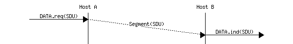

不幸的是，这并不总是足以确保 SDU 的可靠交付。考虑这样一个案例，一个客户端向服务器发送了数十个 SDU。如果服务器比客户端快，它将能够接收和处理客户端发送的所有段，并将内容交付给用户。然而，如果服务器比客户端慢，可能会出现问题。传输实体包含缓冲区以存储已作为数据请求接收但尚未发送的 SDU。如果应用程序比网络快，缓冲区可能会满。在这种情况下，操作系统将挂起应用程序，以便传输实体清空其传输队列。传输实体还使用缓冲区来存储尚未由应用程序处理的接收到的段。如果应用程序处理数据较慢，这个缓冲区可能会溢出，并且传输实体将无法接受任何额外的段。传输实体的缓冲区大小有限，如果它们溢出，到达的段将被丢弃，即使它们是正确的。

为了解决这个问题，可靠的协议必须包括一个反馈机制，允许接收方通知发送方它已处理一个段，并且可以发送另一个段。即使没有传输错误，也需要这种反馈。为了包含这种反馈，我们的可靠协议必须处理两种类型的段：

> +   带有 SDU 的数据段
> +   
> +   确认前一个段已被正确处理的控制段

这些控制段通常被称为确认，因为它们确认了数据的正确接收。

这两种类型的段可以通过将段分为两部分来区分：

> +   包含一个段类型位设置为 0 的数据段和设置为 1 的控制段的头部
> +   
> +   包含由应用程序提供的 SDU 的有效负载

然后，我们的传输实体可以被建模为一个有限状态机，包含接收方的两个状态和发送方的两个状态。图 47 提供了这个状态机的图形表示，发送方在上，接收方在下。

> 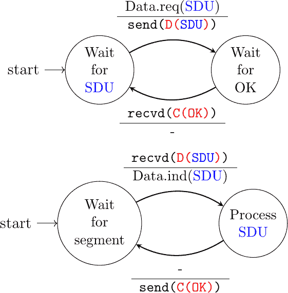
> 
> 图 47 最简单可靠协议的有限状态机（发送方在上，接收方在下）

发送方有限状态机显示，发送方必须等待接收方的确认才能传输下一个 SDU。下面的图示说明了两个主机之间的一些段交换。

> 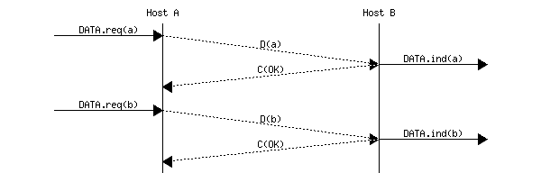

注意

服务和协议

在研究计算机网络时，理解*服务*和*协议*之间的区别是一个重要的方面。为此，从现实世界的例子开始是有用的。传统的邮政服务提供了一种服务，其中邮递员将信件递送给收件人。邮政精确地定义了可以使用标准邮件服务递送的信件类型（大小、重量等）。此外，信封的格式也被指定（发件人和收件人地址的位置，邮票的位置）。想要发送信件的人必须将信件放在邮局或专用的邮箱中。然后信件将被收集并递送到最终收件人处。请注意，对于常规服务，邮政通常不保证每封特定信件的递送。有些信件可能会丢失，有些信件可能会被递送到错误的邮箱。如果信件很重要，发件人可以使用挂号服务来确保信件能递送到收件人手中。一些邮政服务还提供确认服务或比常规服务更快的快递服务。

### 在不完美的链路上可靠传输#

传输层必须处理多种类型的错误，这些错误可能会影响它发送的段。在实践中，我们主要需要在传输层处理两种类型的错误：

> +   段可能会因为传输错误而损坏
> +   
> +   段可能会丢失或出现意外的段

为了检测错误，一个段通常被分为两部分：

> +   一个包含可靠协议用于确保可靠递送的字段头部。头部包含一个校验和或循环冗余校验（CRC）[[Williams1993]](../bibliography.html#williams1993)，用于检测传输错误
> +   
> +   包含用户数据的有效载荷

一些头部字段还包括一个长度字段，该字段指示段的总长度或有效载荷的长度。

最简单的错误检测方案是校验和。校验和基本上是构成段的全部字节的算术和。有不同类型的校验和。例如，一个 8 位校验和可以计算为段（包括头部和尾部）所有字节的算术和。校验和由发送者在发送段之前计算，接收者在接收段时验证校验和。接收者丢弃接收到的无效校验和的段。校验和可以很容易地在软件中实现，但它们的错误检测能力有限。循环冗余校验（CRC）具有更好的错误检测能力 [[SGP98]](../bibliography.html#sgp98)，但在软件实现时需要更多的 CPU。

注意

校验和、CRCs、…

TCP/IP 协议套件中的大多数协议都依赖于简单的互联网校验和来验证接收到的数据包在传输过程中没有受到影响。尽管它很受欢迎且易于实现，但互联网校验和并不是唯一的校验和机制。循环冗余校验（[CRC](https://en.wikipedia.org/wiki/Cyclic_redundancy_check)）是非常强大的错误检测方案，特别在磁盘、许多数据链路层协议和文件格式（如`zip`或`png`）中使用。它们可以很容易地在硬件中高效实现，并且比互联网校验和具有更好的错误检测能力 [[SGP98]](../bibliography.html#sgp98)。然而，CRC 有时被认为对软件实现来说 CPU 消耗过高，因此更倾向于其他校验和机制。TCP/IP 社区选择了互联网校验和，OSI 社区选择了 Fletcher 校验和 [[Sklower89]](../bibliography.html#sklower89)。如今，有高效的软件计算 CRC 的技术 [[Feldmeier95]](../bibliography.html#feldmeier95)。

由于接收者在收到每个数据段后都会发送一个确认，因此处理丢失的最简单方法是使用重传计时器。当发送者发送一个段时，它启动一个重传计时器。这个重传计时器的持续时间应该大于往返时间，即数据段传输和对应确认接收之间的延迟。当重传计时器到期时，发送者假定数据段已丢失，并重新发送它。这在下图中说明。

> 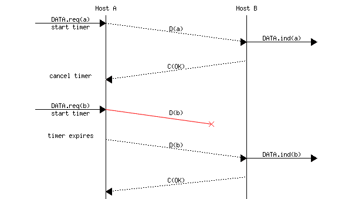

```sh
Please log in to see this exercise
```

不幸的是，仅重传计时器不足以从丢失中恢复。让我们考虑以下情况，如图所示，其中确认信息丢失。在这种情况下，发送方重新传输尚未确认的数据段。然而，如图所示，接收方将重传视为新的段，其有效载荷必须交付给其用户。

> 

为了解决这个问题，可靠的协议将序列号与每个数据段关联。这个序列号是数据段头部中找到的字段之一。我们使用记号 D(x,…)来表示序列号字段设置为值 x 的数据段。确认信息也包含一个序列号，表示它确认的数据段。我们使用 OKx 来表示确认接收了 D(x,…)的确认。序列号被编码为固定长度的比特串。最简单的可靠协议是交替位协议（ABP）。

### 交替位协议#

交替位协议使用一个比特来编码序列号。它可以很容易地实现。发送方（分别）只需要一个四状态（分别）有限状态机。发送方有限状态机在图 48 中表示，接收方有限状态机在图 49 中表示。

> 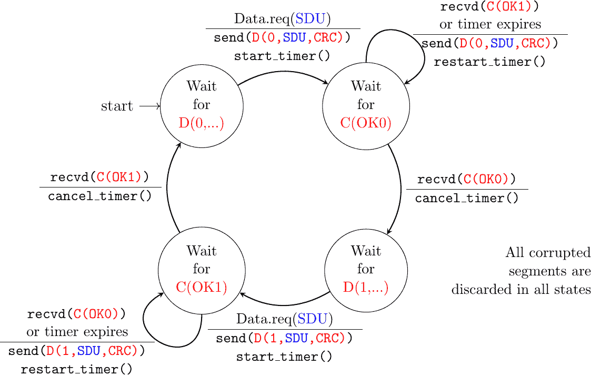
> 
> 图 48 交替位协议：发送方有限状态机

发送者的初始状态是等待 D(0,…). 在此状态下，发送者等待数据请求。它发送的第一个数据段使用序列号 0。发送此段后，发送者等待 OK0 确认。如果重传计时器到期或收到序列号不正确的确认，则重新传输数据段。

接收者首先等待 D(0,…). 如果段包含正确的 CRC 校验和，它将 SDU 传递给其用户并发送 OK0。如果段包含无效的 CRC 校验和，它将立即被丢弃。然后，接收者等待 D(1,…). 在此状态下，它可能接收到重复的 D(0,…)或包含无效 CRC 校验和的数据段。在这两种情况下，它都会返回一个 OK0 段，以便发送者可以从可能的上一 OK0 段丢失中恢复。

> 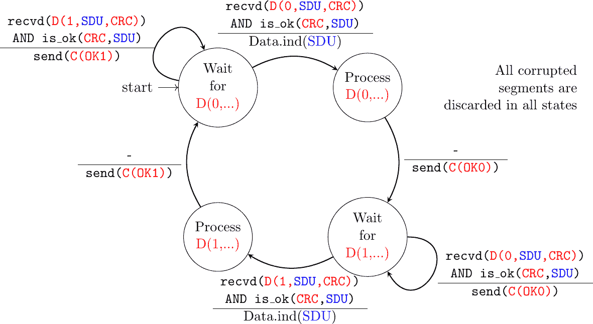
> 
> 图 49 交替位协议：接收器 FSM

注意

必须丢弃损坏的段

交替位协议的接收有限状态机（FSM）会丢弃所有包含无效 CRC 校验和的段。这是最安全的做法，因为接收到的段可能与远程主机发送的段完全不同。接收者不应该尝试从损坏的段中提取信息，因为它无法知道段的哪个部分受到了错误的影响。

下图说明了交替位协议的操作。


交替位协议可以从数据或控制段的丢失中恢复。这在下面的两个图中得到说明。第一个图显示了数据段的丢失。

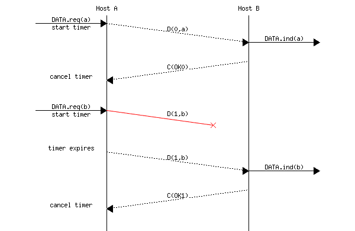

第二张图说明了主机如何处理一个控制段的丢失。

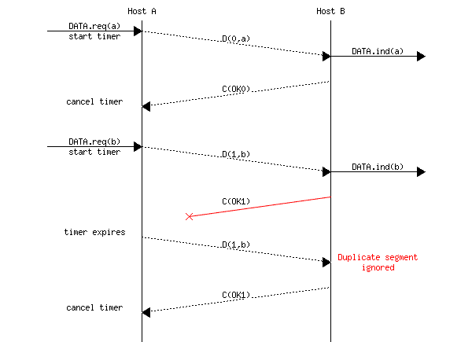

交替比特协议可以从传输错误和段丢失中恢复。然而，它有一个重要的缺点。考虑两个通过 50 Kbits/sec 卫星链路直接连接的主机，该链路具有 250 毫秒的传播延迟。如果这些主机发送 1000 比特的段，那么如果忽略确认的传输时间，交替比特协议可以达到的最大吞吐量是每 520 毫秒一个段，即$ 20+250+250=520 $毫秒。这还不到 2 Kbits/sec！

```sh
Please log in to see this exercise
```

```sh
Please log in to see this exercise
```

```sh
Please log in to see this exercise
```

### Go-back-n 和选择性重传#

为了克服交替比特协议的性能限制，可靠协议依赖于图 50 中所示的管道化技术。这项技术允许发送者在每个段之后不必等待确认就可以连续发送几个段。每个数据段包含一个序列号，该序列号编码为一个 n 比特字段。


图 50 管道化提高了可靠协议的性能#

管道化允许发送者以更高的速率传输段。然而，这种更高的传输速率可能会超载接收者。在这种情况下，发送者发送的段将不会被其最终目的地正确接收。依赖于管道化的可靠协议允许发送者在被迫等待接收实体确认之前发送 W 个未确认的段。

这是通过使用滑动窗口实现的。滑动窗口是发送者在发送段时可以使用的连续序列号集合，而无需被迫等待确认。图 51 图 51 展示了一个包含五个段（6,7,8,9 和 10）的滑动窗口。其中两个序列号（6 和 7）已被用于发送段，而滑动窗口中只剩下三个序列号（8, 9 和 10）。当滑动窗口中包含的所有序列号都被使用后，滑动窗口被认为是关闭的。

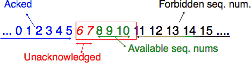

图 51 滑动窗口#

图 52 说明了滑动窗口的操作。它使用三个段的滑动窗口。因此，发送者可以在被迫等待确认之前发送三个段。在收到每个确认后，滑动窗口会移动到更高的序列号。当收到第一个确认（OK0）时，它允许发送者将其滑动窗口向右移动，序列号 3 变得可用。这个序列号后来被用来发送包含 d 的段。

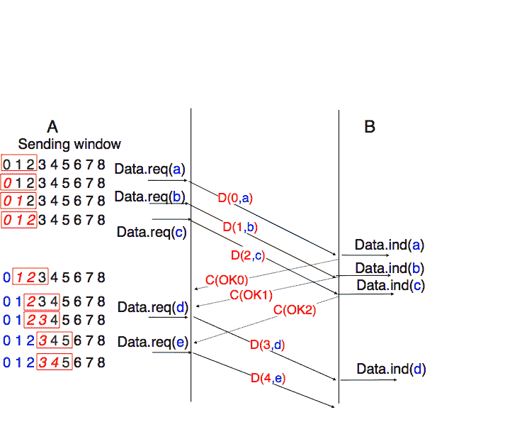

图 52 滑动窗口示例#

实际上，由于段头包括一个用于编码序列号的 n 位字段，因此只能使用 $ 0 $ 到 $ 2^{n}-1 $ 之间的序列号。这意味着，在长时间传输过程中，相同的序列号将被用于不同的段，滑动窗口将回绕。这如图 53 图 53 所示，假设在段头中使用 2 位来编码序列号。请注意，在收到 OK1 后，发送者滑动其窗口，并可以再次使用序列号 0。

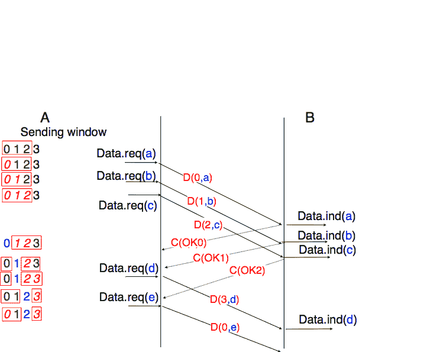

图 53 使用模运算的滑动窗口利用#

不幸的是，由于可靠协议使用滑动窗口，段丢失并不会消失。为了从丢失中恢复，滑动窗口协议必须定义：

> +   一种用于检测丢失的启发式方法
> +   
> +   一种重传策略，用于重传丢失的段

最简单的滑动窗口协议使用 go-back-n 恢复。直观地说，go-back-n 如下操作。Go-back-n 接收方尽可能简单。它只接受按顺序到达的段。Go-back-n 接收方丢弃它接收到的任何顺序错误的段。当 go-back-n 接收到数据段时，它总是返回一个包含它已接收的最后顺序段的序列号的确认。这种确认被称为累积的。当一个 go-back-n 接收方为序列号 x 发送确认时，它隐式地确认了所有序列号早于 x 的段的接收。这些累积确认的一个关键优点是，从确认丢失中恢复很容易。例如，考虑一个接收了段 1、2 和 3 的 go-back-n 接收方。它发送了 OK1、OK2 和 OK3。不幸的是，OK1 和 OK2 丢失了。多亏了累积确认，当发送方收到 OK3 时，它知道所有三个段都已正确接收。

图 54 显示了简单 go-back-n 接收方的状态机。此接收方使用两个变量：lastack 和 next。next 是下一个期望的序列号，lastack 是已确认的最后数据段的序列号。接收方只接受按顺序接收到的段。maxseq 是不同序列号的数量($ 2^n $)。

> 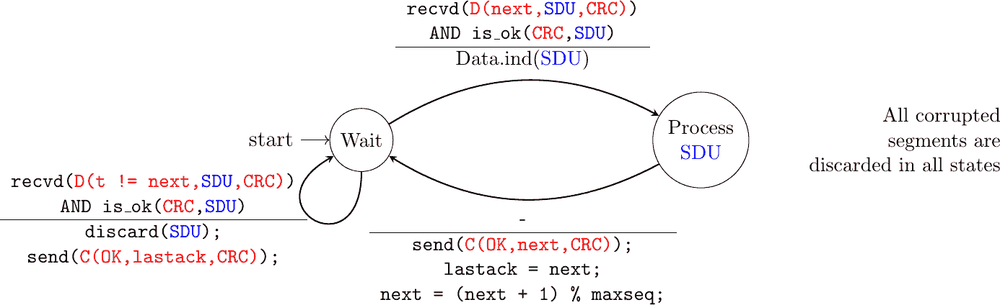
> 
> 图 54 Go-back-n：接收方状态机

Go-back-n 发送方也非常简单，如图 55 所示。它使用一个发送缓冲区，可以存储整个滑动窗口的段[[2]](#fsizesliding)。段以递增的序列号（模 maxseq）发送。发送方在其发送缓冲区满后必须等待确认。当 go-back-n 发送方收到确认时，它会从发送缓冲区中移除所有已确认的段，并使用重传计时器来检测段丢失。简单的 go-back-n 发送方为每个连接维护一个重传计时器。该计时器在发送第一个段时启动。当 go-back-n 发送方收到确认时，只有在其发送缓冲区中仍有未确认的段时，它才会重新启动重传计时器。当重传计时器超时，go-back-n 发送方假定其发送缓冲区中当前存储的所有未确认段都已丢失。因此，它重新传输缓冲区中的所有未确认段，并重新启动其重传计时器。

> 
> 
> 图 55 Go-back-n：发送方状态机

go-back-n 的操作在图 56 中说明。在此图中，请注意，在接收到乱序段 D(2,c)后，接收器返回累积确认 C(OK,0)，确认已按顺序接收的所有段。丢失的段在重传计时器到期后重新传输。


图 56 Go-back-n：示例#

go-back-n 的主要优势是它易于实现，并且当只有少量段丢失时，它也可以提供良好的性能。然而，当有大量丢失时，go-back-n 的性能会迅速下降，原因有两个：

> +   go-back-n 接收器不接受乱序段
> +   
> +   go-back-n 发送器在检测到丢失后，重新传输所有未确认的段

```sh
Please log in to see this exercise
```

选择重传是恢复丢失数据的一种更好的策略。直观地说，选择重传允许接收器接受乱序段。此外，当选择重传发送器检测到丢失时，它只重传丢失的段，而不是已经正确接收的段。

选择重传接收器维护一个包含 W 个段的滑动窗口，并将接收到的乱序段存储在缓冲区中。图 57 显示了一个接收器已经接收了段 7 和 9 的五个段接收窗口。


图 57 选择重传的接收窗口#

选择重传接收器丢弃所有具有无效 CRC 的段，并保持变量 lastack 为其已接收的最后有序段的序列号。接收器始终在其发送的确认中包含 lastack 的值。某些协议还允许选择重传接收器确认它已接收的乱序段。例如，可以通过在确认中将正确接收但乱序的段列表与 lastack 值一起放置来实现。

当选择重传接收器接收到一个数据段时，它首先验证该段是否在其接收窗口内。如果是，该段将被放置在接收缓冲区中。如果不是，接收到的段将被丢弃，并向发送者发送包含 lastack 的确认。接收器随后从接收缓冲区中移除从 lastack 开始的（如果有）所有连续段。这些段的负载被交付给用户，lastack 和接收窗口被更新，并发送一个确认，确认已按顺序接收的最后一段。

选择性重传发送者维护一个发送缓冲区，可以存储最多 W 个未确认的段。只要发送缓冲区不满，就会发送这些段。选择性重传发送者的几种实现方式是可能的。一种简单的实现方式是为每个段关联一个重传计时器。当发送段时启动计时器，并在接收到覆盖此段的确认时取消计时器。当重传计时器超时时，相应的段被重新传输，并且这个重传计时器被重新启动。当接收到确认时，所有被此确认覆盖的段将从发送缓冲区中移除，并且滑动窗口被更新。

图 58 展示了在数据段丢失时选择性重传的操作。在此图中，C(OK,x) 用于表示所有段，包括并至序列号 x 的段都已正确接收。


图 58 选择性重传：示例#

纯累积确认与回退 n 策略配合良好。然而，仅使用累积确认，选择性重传发送者无法轻易确定在数据段丢失后哪些段已被正确接收。例如，在上图中，第二个 C(OK,0) 并没有明确告知发送者 D(2,c) 的接收情况，而发送者可能会重新传输这个段，尽管它已经被接收。为了提高选择性重传的性能，一个可能的解决方案是在接收者返回的确认中提供关于已接收段的信息。例如，接收者可以在返回的确认中添加已接收所有段的序列号列表。这种确认有时被称为选择性确认。我们将在本书后面的 TCP 和 QUIC 协议中提供此类确认的示例。

```sh
Please log in to see this exercise
```

注意

回退 n 和选择性重传的最大窗口大小

使用 n 位来编码其序列号的可靠协议可以发送多达 $ 2^n $ 个连续的段。然而，为了确保段的可信传输，回退 n 和选择重传不能使用 $ 2^n $ 个段的发送窗口。首先考虑回退 n，假设发送者发送 $ 2^n $ 个段。这些段按顺序被目的地接收，但所有返回的确认信息都丢失了。发送者将重新传输所有段。这些段都将被接收器接受，并第二次交付给用户。很容易看出，如果发送窗口的最大大小是 $ {2^n}-1 $ 个段，则可以避免这个问题。选择重传也存在类似的问题。然而，由于接收器接受非顺序段，$ {2^n}-1 $ 个段的发送窗口不足以确保可靠交付。可以很容易地证明，为了避免这个问题，选择重传发送者不能使用大于 $ \frac{2^n}{2} $ 个段的窗口。

可靠协议通常需要在两个方向上发送数据。为了减少由确认信息引起的开销，大多数可靠协议使用尾随技术。多亏了这项技术，实体可以将确认信息和它为数据流相反方向所声明的接收窗口放置在它发送的数据段头部。尾随的主要优势在于它减少了开销，因为不需要发送一个完整的段来携带确认信息。这在下图中得到了说明，其中确认号在数据段中被加粗。尾随技术仅在数据双向流动时使用。当接收器在相反方向不发送数据时，如图底部所示，它将生成一个纯确认信息。


图 59 尾随示例#

```sh
Please log in to see this exercise
```

```sh
Please log in to see this exercise
```

## 建立传输连接#

与无连接服务类似，面向连接的服务允许在给定主机上运行的多个应用程序与其他主机交换数据。之前描述的无连接服务所用的端口号也被面向连接的服务用于多路复用多个应用程序。同样，面向连接的协议使用校验和/CRC 来检测传输错误并丢弃包含无效校验和/CRC 的段。

无连接服务和面向连接服务之间的重要区别在于，后者中的传输实体在连接的生命周期内保持一些状态。当建立连接时创建此状态，并在释放时删除。

建立传输连接的最简单方法可能是定义两个特殊的控制段：CR（连接请求）和 CA（连接确认）。CR 段由希望发起连接的传输实体发送。如果远程实体希望接受连接，它将通过发送 CA 段进行回复。CR 和 CA 段包含端口号，这允许识别通信的应用程序。一旦收到 CA 段，就认为传输连接已经建立。在此点，可以双向发送数据段。

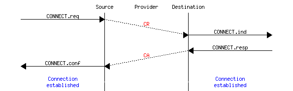

然而，考虑到网络层的不可靠性，这仍然是不够的。由于网络层不完美，CR 或 CA 段可能会丢失、延迟或出现传输错误。为了处理这些问题，控制段必须通过 CRC 或校验和来保护，以检测传输错误。此外，由于 CA 段确认了 CR 段的接收，CR 段应该使用重传定时器进行保护。

不幸的是，这个方案不足以确保运输服务的可靠性。例如，考虑一个短暂的运输连接，其中发送了一个单一但重要的传输（例如，从银行账户转账）。这样的短暂连接以一个由 CA 段确认的 CR 段开始，然后发送数据段，确认并终止连接。不幸的是，由于网络层服务不可靠，延迟加上重传可能导致下图中所示的情况，即接收实体将来自前一个连接的延迟 CR 和数据段作为有效段接受，并将相应的数据交付给用户。重复 SDU 是不可接受的，传输协议必须解决这个问题。

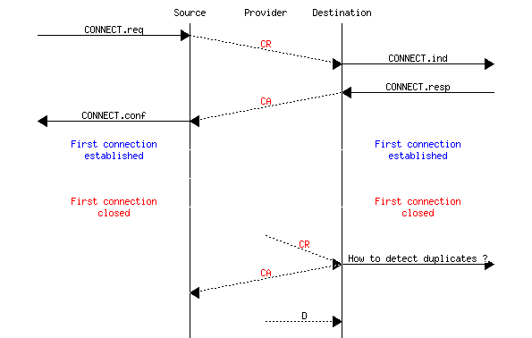

为了避免这些重复，传输协议要求网络层限制最大段生存时间（MSL）。网络的组织必须保证没有任何段在网络中停留超过 MSL 秒。例如，在今天的互联网上，MSL 预计为 2 分钟。为了避免重复的传输连接，传输协议实体必须能够安全地区分重复的 CR 段和新 CR 段，而无需迫使每个传输实体记住它过去建立的所有传输连接。

为了避免记住先前的传输连接以检测重复，一个经典的解决方案是在每个传输实体内部使用一个时钟。这个传输时钟具有以下特性：

> +   传输时钟实现为一个 k 位计数器，其时钟周期为$ 2^k \times cycle >> MSL $。此外，传输时钟计数器在每个时钟周期和每次连接建立后都会递增。此时钟如图 60 所示图 60。
> +   
> +   即使传输实体停止或重启，传输时钟也必须继续递增


图 60 传输时钟#

应当注意，传输时钟不需要，通常也不与实时时钟同步。精确同步实时时钟是一个有趣的问题，但它超出了本文档的范围。有关同步实时时钟的详细讨论，请参阅[[Mills2006]](../bibliography.html#mills2006)。

这个传输时钟可以与三个段的交换结合使用，称为三次握手，以检测重复。这个三次握手如下发生：

> 1.  初始传输实体发送一个 CR 段。此段请求建立传输连接。它包含一个端口号（图中未显示）和一个序列号（图下方的 seq=x），其值从传输时钟中提取。CR 段的传输由重传定时器保护。
> 1.  
> 1.  远程传输实体处理 CR 段并为连接尝试创建状态。在这个阶段，远程实体还不知道这是新的连接尝试还是重复的段。它返回一个包含确认号以确认 CR 段接收的 CA 段（图下方的 ack=x）和一个序列号（图下方的 seq=y），其值从其传输时钟中提取。在这个阶段，连接尚未建立。
> 1.  
> 1.  初始实体接收 CA 段。此段的确认号确认远程实体已正确接收 CR 段。初始实体认为传输连接已建立，数据段的编号从序列号 x 开始。在发送数据段之前，初始实体必须通过发送另一个 CA 段来确认接收到的 CA 段。
> 1.  
> 1.  远程实体在接收到确认其 CA 段的段落后，认为传输连接已经建立。远程实体发送的数据段编号从序列号 y 开始。

三次握手在图 61 中说明。


图 61 三次握手#

多亏了三次握手，传输实体避免了重复的传输连接。这可以通过考虑以下三个场景来说明。

第一个场景（图 62）是远程实体接收到一个旧的 CR 段。它认为这个 CR 段是连接建立尝试，并通过发送 CA 段进行回复。然而，初始主机无法将接收到的 CA 段与先前的连接尝试匹配。它发送一个控制段（图下方的 REJECT）来取消虚假的连接尝试。远程实体在接收到这个控制段后取消连接尝试。


图 62 三次握手：从重复的 CR 段恢复#

在图 63 中显示的第二个场景是，当发起实体发送的 CR 段没有到达远程实体，并从之前的连接尝试中收到一个重复的 CA 段。由于 CR 段的序列号是从发起实体的传输时钟中提取的，这个重复的 CA 段不能包含对 CR 段的有效确认。因此，CA 段被拒绝，并在重传计时器到期时重新传输 CR 段。

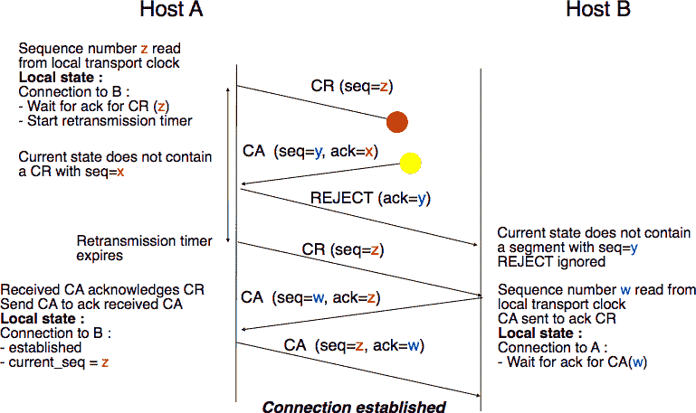(../_images/transport-twh-dup2.png)

图 63 三次握手：从重复的 CA 恢复#

在图 64 中显示的最后一个场景不太可能发生，但同样需要考虑。远程实体收到一个旧的 CR 段。它记录连接尝试并通过发送 CA 段来确认它。发起实体没有匹配的连接尝试，并通过发送 REJECT 进行回复。不幸的是，这个段从未到达远程实体。相反，远程实体收到一个包含与第一个 CR 段相同序列号的旧 CA 段的重新传输。由于确认号不能与第一个 CA 段的序列号相同，远程实体不能接受这个 CA 段作为传输连接的确认。

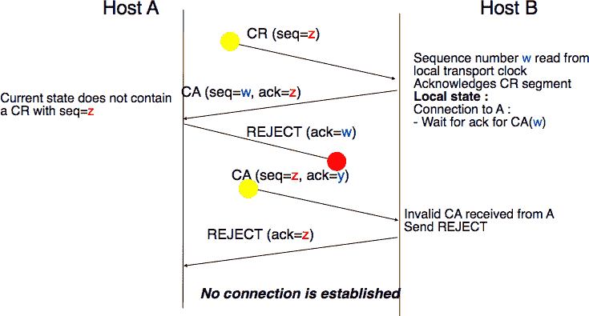(../_images/transport-twh-dup3.png)

图 64 三次握手：从重复的 CR 和 CA 恢复#

## 在传输连接上传输数据#

现在传输连接已经建立，它可以用来传输数据。为了确保数据的可靠传输，传输协议将包括滑动窗口、重传计时器和后退 N 或选择重传。然而，我们不能简单地重用这些技术，因为可靠的传输协议还需要处理三种额外的错误类型（i）可变延迟，（ii）出序交付和（iii）段重复。

当两个主机通过一个链路连接时，链路上的传输延迟或往返时间几乎是固定的。在一个可以跨越全球的网络中，延迟和往返时间可以基于每个数据包而显著变化。这种变化可以由两个因素引起。首先，通过网络发送的数据包不一定遵循相同的路径到达目的地。其次，当负载高时，一些数据包可能会在路由器的缓冲区中排队，这些排队延迟可能导致端到端延迟的增加。

另一个问题是一个网络并不总是按顺序交付数据包。这意味着数据包可能被网络重新排序。此外，网络有时可能会重复数据包。

在传输层需要处理最后一个问题，即大 SDU 的传输。在我们的例子中，我们使用了短 SDU，它们可以轻松地放入段中。某些应用程序生成的 SDU 比网络层中数据包的最大尺寸大得多。传输层需要包括机制来分片和重新组装这些大 SDU。

为了处理网络层的所有这些特性，我们需要调整我们之前介绍过的回退 N 和选择重传技术。

检测传输错误的能力仍然很重要。每个段都包含一个 CRC/校验和，这是由发送方在整个段（头部和有效载荷）上计算的，并插入到头部中。接收方将重新计算每个接收到的段的 CRC/校验和，并丢弃所有无效 CRC 的段。

可靠的传输协议也使用序列号和确认号。虽然我们的示例协议在每个段中使用一个序列号，但一些可靠的传输协议将所有传输的数据视为字节流。在这些协议中，放置在段头部的序列号对应于有效载荷中第一个字节的字节流位置。这个序列号允许检测丢失，同时也使接收方能够重新排序乱序的段。这在下图中得到了说明。

> 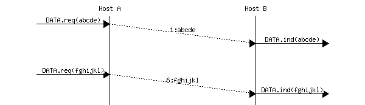

当传输层需要在多个段中分片 SDU 时，使用序列号来计数字节也有一个优点。下面的图示显示了将一个大 SDU 分片成两个段。在接收到段之后，接收方将使用序列号来正确地重新排序数据。

> 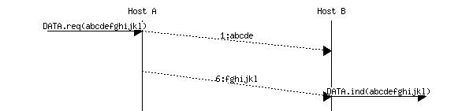

与我们的简单协议相比，可靠的传输协议使用更多的位来编码它们的序列号。32 位和 64 位序列号在传输层很常见。这个大的序列号空间有两个原因。首先，由于序列号对每个传输的字节进行递增，一个单独的段可能消耗一个或几个千个序列号。其次，可靠的传输协议必须能够检测延迟的段。这只能在 MSS 期间传输的字节数小于序列号空间的情况下完成。否则，存在接受重复段的风险。

回退 N 和选择重传可以在传输层使用，就像在数据链路层一样。由于网络层不保证数据包的有序交付，传输实体应该始终存储它接收到的非顺序段。因此，大多数传输协议将选择某种选择重传机制。

在简单的协议中，滑动窗口通常具有一个固定的大小，这个大小取决于可用缓冲区的大小。单个传输层实体服务于大量且变化的应用进程。每个传输层实体管理一个需要在这些所有进程间共享的缓冲区池。传输实体通常在操作系统内核内部实现，并与系统的其他部分共享内存。此外，传输层实体必须同时支持多个（可能是数百或数千个）传输连接。这意味着可以用于支持传输连接的发送或接收缓冲区的内存可能会在连接的生命周期内发生变化 [[3]](#fautotune)。因此，传输协议必须允许发送方和接收方调整它们的窗口大小。

为了处理这个问题，传输协议允许接收方在它发送的所有确认中宣布其当前接收窗口的大小。接收方宣布的接收窗口限制了发送方使用的发送缓冲区的大小。在实践中，发送方维护两个状态变量：swin，其发送窗口的大小（可能由系统调整）和 rwin，接收方宣布的接收窗口的大小。在任何时候，未确认段的数量不能超过 $ \min(swin,rwin) $ [[4]](#facklost)。动态窗口的使用在图图 65 中说明。


图 65 动态接收窗口#

接收器可能会根据其当前的内存消耗调整其声明的接收窗口，同时也为了限制发送者使用的带宽。在实践中，接收缓冲区也可能缩小，因为应用程序可能无法快速处理接收到的数据。在这种情况下，接收缓冲区可能会完全填满，声明的接收窗口可能会缩小到 0。当发送者收到一个将接收窗口设置为 0 的确认时，它会阻塞，直到它收到一个具有正接收窗口的确认。不幸的是，如图图 66 所示，这种确认的丢失可能导致死锁，因为发送者在等待确认的同时，接收者在等待数据段。

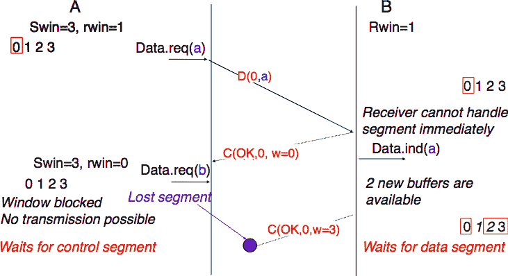

图 66 动态窗口的死锁风险#

为了解决这个问题，传输协议依赖于一个特殊的计时器：持久计时器。当发送者收到一个声明接收窗口设置为 0 的确认时，它会启动这个计时器。当计时器到期时，发送者重新传输一个旧的段，以迫使接收者发送一个新的确认，从而发送当前的接收窗口大小。

为了总结我们对传输协议中找到的基本机制的描述，我们还需要讨论段到达顺序错误的影响。如果两个连续的段被重新排序，接收器会依赖于它们的序列号在接收缓冲区中重新排序它们。不幸的是，由于传输协议为不同的段重复使用相同的序列号，如果一个段延迟了很长时间，它仍然可能被接收器接受。这如图图 67 所示，其中段 D(1,b)被延迟。

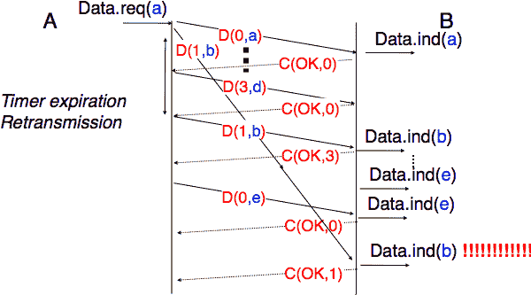

图 67 过度延迟引起的歧义#

为了处理这个问题，传输协议结合了两种解决方案。首先，它们使用 32 位或更多位来编码段头中的序列号。这增加了开销，但也增加了具有相同序列号的两个不同段之间的延迟。其次，传输协议要求网络层强制执行最大段生存时间（MSL）。网络层必须确保没有数据包在网络中超过 MSL 秒。在互联网中，MSL 被假定为 2 分钟 [[5]](#fmsl) [**RFC 793**](https://datatracker.ietf.org/doc/html/rfc793.html)。请注意，这限制了传输协议的最大带宽。如果它使用 n 位来编码其序列号，那么它就不能在每 MSL 秒内发送超过$ 2^n $个段。

## 关闭传输连接#

当我们讨论面向连接的服务时，我们提到有两种类型的连接释放：突然释放和优雅释放。

释放传输连接的第一个解决方案是定义一个新的控制段（例如，断开请求的 DR 段），并将连接视为在发送或接收此段之后已释放。这如图 68 所示。


图 68 突然连接释放#

由于发送 DR 段的实体无法知道另一个实体是否已经在连接上发送了所有其数据，因此在这样的突然连接释放过程中可能会丢失 SDUs。

释放传输连接的第二种方法是独立释放数据传输的两个方向。一旦传输服务的用户发送了所有其 SDUs，它就会为其数据传输方向执行 DISCONNECT.req。传输实体发送一个控制段，请求在将所有之前的 SDUs 交付给远程用户后释放连接。这通常是通过在 DR 中放置下一个序列号，并且只在所有之前的 DATA.ind 交付后发送 DISCONNECT.ind 来实现的。远程实体通过返回一个确认来确认接收 DR 段和释放相应的数据传输方向。这如图 69 所示。


图 69 优雅连接释放#

脚注

## 一种简单的可靠协议#

在本节中，我们开发了一个在网络服务之上运行的简单可靠协议。为了设计此协议，我们首先假设底层层提供完美服务。然后，我们将开发解决影响网络服务的不同类型错误的方法。

网络层被设计用来代表用户发送和接收数据包。我们通过使用 DATA.req 和 DATA.ind 原语来模拟这些交互。然而，为了简化演示并避免网络层用户发出的 DATA.req 原语与传输层实体本身发出的 DATA.req 之间的混淆，我们使用以下术语：

> +   用户与传输层实体之间的交互是通过使用经典的 DATA.req 和 DATA.ind 原语来表示的
> +   
> +   传输层实体与子层之间的交互是通过使用 send 代替 DATA.req 和使用 recvd 代替 DATA.ind 来表示的

当在完美的网络之上运行时，传输实体可以在接收到 DATA.req(SDU) [[1]](#fsdu)后简单地发出一个 send(SDU)。同样，接收者在收到 recvd(SDU)后发出 DATA.ind(SDU)。当只发送单个 SDU 时，这样一个简单的协议就足够了。这在下图中有说明。

> 

不幸的是，这并不总是足以确保 SDU 的可靠交付。考虑这样一个情况，客户端向服务器发送了数十个 SDU。如果服务器比客户端快，它将能够接收和处理客户端发送的所有段，并将它们的内容交付给用户。然而，如果服务器比客户端慢，可能会出现问题。传输实体包含缓冲区来存储已作为数据请求接收但尚未发送的 SDU。如果应用程序比网络快，缓冲区可能会满。在这种情况下，操作系统将挂起应用程序，让传输实体清空其传输队列。传输实体还使用缓冲区来存储尚未由应用程序处理的接收到的段。如果应用程序处理数据较慢，这个缓冲区可能会溢出，传输实体将无法接受任何额外的段。传输实体的缓冲区大小有限，如果它们溢出，到达的段将被丢弃，即使它们是正确的。

为了解决这个问题，一个可靠的协议必须包括一个反馈机制，允许接收者通知发送者它已经处理了一个段，并且可以发送另一个段。即使没有传输错误，这种反馈也是必需的。为了包含这种反馈，我们的可靠协议必须处理两种类型的段：

> +   携带 SDU 的数据段
> +   
> +   确认前一个段正确处理的控制段

这些控制段通常被称为确认，因为它们确认了数据的正确接收。

这两种类型的段可以通过将段分为两部分来区分：

> +   头部包含一个段类型位，在数据段中设置为 0，在控制段中设置为 1
> +   
> +   包含由应用程序提供的 SDU 的有效负载

然后，我们的传输实体可以被建模为一个有限状态机，包含接收者的两个状态和发送者的两个状态。图 47 提供了这个状态机的图形表示，发送者在上方，接收者在下方。

> 
> 
> 图 47 最简单可靠协议的有限状态机（发送者在上，接收者在下）

发送者有限状态机显示发送者必须在收到接收者的确认之前才能传输下一个 SDU。下面的图示了两个主机之间交换的一些段。

> 

注意

服务和协议

在研究计算机网络时，理解*服务*和*协议*之间的区别是一个重要的方面。为此，从现实世界的例子开始是有用的。传统的邮政提供一项服务，其中邮递员将信件递送给收件人。邮政精确地定义了可以使用标准邮件服务递送的信件类型（大小、重量等）。此外，信封的格式也被指定（发件人和收件人地址的位置，邮票的位置）。想要发送信件的人必须将信件放在邮局或专用的邮箱中。然后信件将被收集并递送到最终收件人。请注意，对于常规服务，邮政通常不保证每封特定信件的递送。有些信件可能会丢失，有些信件会被送到错误的邮箱。如果信件很重要，发送者可以使用挂号服务来确保信件将被递送到收件人。一些邮政服务还提供已确认服务或比常规服务更快的快递服务。

### 在不完美的链路上进行可靠传输#

传输层必须处理可能影响它发送的段落的几种类型的错误。在实践中，我们主要必须在传输层处理两种类型的错误：

> +   段落可能会因为传输错误而损坏
> +   
> +   段落可能会丢失或出现意外的段

为了检测错误，一个段通常被分为两部分：

> +   一个头部，它包含可靠协议使用的字段以确保可靠交付。头部包含一个校验和或循环冗余校验（CRC）[[Williams1993]](../bibliography.html#williams1993)，用于检测传输错误
> +   
> +   一个包含用户数据的有效载荷

一些头部还包括一个长度字段，它表示段的总长度或有效载荷的长度。

最简单的错误检测方案是校验和。校验和基本上是构成段的全部字节的算术和。存在不同类型的校验和。例如，一个 8 位校验和可以计算为段（包括头部和尾部）所有字节的算术和。发送方在发送段之前计算校验和，接收方在接收到段后验证校验和。接收方会丢弃校验和无效的段。校验和可以很容易地在软件中实现，但它们的错误检测能力有限。循环冗余校验（CRC）具有更好的错误检测能力 [[SGP98]](../bibliography.html#sgp98)，但在软件实现时需要更多的 CPU。

备注

校验和、CRC、…

TCP/IP 协议族中的大多数协议都依赖于简单的互联网校验和来验证接收到的数据包在传输过程中没有被错误影响。尽管其流行且易于实现，但互联网校验和并非唯一的校验和机制。循环冗余校验（[CRC](https://en.wikipedia.org/wiki/Cyclic_redundancy_check)）是一种非常强大的错误检测方案，特别用于磁盘、许多数据链路层协议以及`zip`或`png`等文件格式。它们可以很容易地在硬件中高效实现，并且比互联网校验和具有更好的错误检测能力 [[SGP98]](../bibliography.html#sgp98)。然而，CRC 有时被认为对软件实现过于 CPU 密集，因此更倾向于其他校验和机制。TCP/IP 社区选择了互联网校验和，OSI 社区选择了 Fletcher 校验和 [[Sklower89]](../bibliography.html#sklower89)。如今，有高效的软件计算 CRC 的技术 [[Feldmeier95]](../bibliography.html#feldmeier95)。

由于接收方在接收到每个数据段后发送确认，处理丢失的最简单方法是使用重传计时器。发送方在发送段时启动重传计时器。这个重传计时器的持续时间应该大于往返时间，即数据段传输和对应确认接收之间的延迟。当重传计时器到期时，发送方假定数据段已丢失并重新发送它。这在下图中进行了说明。

> 

```sh
Please log in to see this exercise
```

不幸的是，仅靠重传定时器不足以从丢失中恢复。让我们考虑以下情况，其中确认信息丢失。在这种情况下，发送器会重传尚未确认的数据段。然而，如图所示，接收器将重传视为新的数据段，其有效载荷必须交付给用户。

> 

为了解决这个问题，可靠的协议将序列号分配给每个数据段。这个序列号是数据段头部中的一个字段。我们使用 D(x,…)表示序列号字段设置为 x 值的数据段。确认信息也包含一个序列号，表示它确认的数据段。我们使用 OKx 表示确认接收了 D(x,…)的确认信息。序列号被编码为固定长度的位字符串。最简单的可靠协议是交替位协议（ABP）。

### 交替位协议#

交替位协议使用一个位来编码序列号。它可以很容易地实现。发送器（分别对应接收器）只需要一个四状态（分别对应三状态）的有限状态机。发送器有限状态机在图 48 中表示，接收器有限状态机在图 49 中表示。

> 
> 
> 图 48 交替位协议：发送器有限状态机

发送者的初始状态是等待 D(0,…)。在此状态下，发送者等待数据请求。它发送的第一个数据段使用序列号 0。发送此段后，发送者等待 OK0 确认。如果重传计时器到期或收到序列号不正确的确认，则重新传输数据段。

接收者首先等待 D(0,…)。如果段包含正确的 CRC，它将 SDU 传递给其用户并发送 OK0。如果段包含无效的 CRC，它将立即被丢弃。然后，接收者等待 D(1,…)。在此状态下，它可能接收到重复的 D(0,…)或包含无效 CRC 的数据段。在这两种情况下，它返回一个 OK0 段，以便发送者可以从可能的 OK0 段丢失中恢复。

> 
> 
> 图 49 交替位协议：接收有限状态机

注释

损坏的段必须被丢弃

交替位协议的接收有限状态机丢弃所有包含无效 CRC 的段。这是最安全的做法，因为接收到的段可能与远程主机发送的段完全不同。接收者不应尝试从损坏的段中提取信息，因为它无法知道段的哪个部分受到了错误的影响。

下图说明了交替位协议的操作。


交替位协议可以从数据或控制段丢失中恢复。这在下述两个图中得到了说明。第一个图显示了数据段丢失的情况。


第二个图示说明了主机如何处理一个控制段的丢失。


交替比特协议可以从传输错误和段丢失中恢复。然而，它有一个重要的缺点。考虑两个通过 50 Kbits/sec 卫星链路直接连接的主机，该链路具有 250 毫秒的传播延迟。如果这些主机发送 1000 比特的段，那么如果忽略确认的传输时间，交替比特协议可以达到的最大吞吐量是每 520 毫秒一个段，即$ 20+250+250=520 $毫秒。这还不到 2 Kbits/sec！

```sh
Please log in to see this exercise
```

```sh
Please log in to see this exercise
```

```sh
Please log in to see this exercise
```

### Go-back-n 和选择性重传#

为了克服交替比特协议的性能限制，可靠的协议依赖于图 50 中所示的流水线技术。这项技术允许发送者在每个数据段之后不必等待确认即可连续发送多个数据段。每个数据段包含一个序列号，该序列号编码为一个 n 位字段。


图 50 流水线提高了可靠协议的性能#

管道化允许发送方以更高的速率传输段。然而，这种更高的传输速率可能会超载接收方。在这种情况下，发送方发送的段将不会被其最终目的地正确接收。依赖于管道化的可靠协议允许发送方在被迫等待接收实体确认之前传输 W 个未确认的段。

这是通过使用滑动窗口来实现的。滑动窗口是发送方在无需等待确认的情况下可以使用的连续序列号集。 图 51 显示了一个包含五个段（6,7,8,9 和 10）的滑动窗口。其中两个序列号（6 和 7）已被用于发送段，而滑动窗口中只剩下三个序列号（8, 9 和 10）。当滑动窗口中的所有序列号都被使用后，滑动窗口被称为关闭。


图 51 滑动窗口#

图 52 展示了滑动窗口的操作。它使用三个段的滑动窗口。因此，发送方可以在被迫等待确认之前传输三个段。在接收到每个确认后，滑动窗口移动到更高的序列号。当接收到第一个确认（OK0）时，它允许发送方将其滑动窗口向右移动，序列号 3 变得可用。这个序列号后来被用来传输包含 d 的段。


图 52 滑动窗口示例#

在实践中，由于段头包含一个 n 位字段来编码序列号，因此只能使用介于 $ 0 $ 和 $ 2^{n}-1 $ 之间的序列号。这意味着，在长时间传输过程中，相同的序列号将被用于不同的段，滑动窗口将回绕。这如图 图 53 所示，假设在段头中使用 2 位来编码序列号。请注意，在接收到 OK1 后，发送方滑动其窗口并可以再次使用序列号 0。


图 53 使用模运算的滑动窗口利用情况#

不幸的是，由于可靠协议使用滑动窗口，段丢失并不会消失。为了从丢失中恢复，滑动窗口协议必须定义：

> +   一种启发式方法来检测丢失
> +   
> +   一种重传策略来重传丢失的段

最简单的滑动窗口协议使用回退 N 恢复。直观地说，回退 N 的操作如下。回退 N 接收器尽可能简单。它只接受按顺序到达的段。回退 N 接收器会丢弃它接收到的任何顺序错误的段。当回退 N 收到数据段时，它总是返回一个包含它已接收的最后顺序段序列号的确认。这种确认被称为累积确认。当一个回退 N 接收器为序列号 x 发送确认时，它隐式地确认了所有序列号早于 x 的段的接收。这些累积确认的一个关键优点是，从确认丢失中恢复很容易。例如，考虑一个接收了段 1、2 和 3 的回退 N 接收器。它发送了 OK1、OK2 和 OK3。不幸的是，OK1 和 OK2 丢失了。多亏了累积确认，当发送器收到 OK3 时，它知道所有三个段都已正确接收。

图 54 展示了一个简单的回退 N 接收器的有限状态机。该接收器使用两个变量：lastack 和 next。next 是下一个预期的序列号，lastack 是已确认的最后数据段的序列号。接收器只接受按顺序接收到的段。maxseq 是不同序列号的数量（$ 2^n $）。

> 
> 
> 图 54 回退 N：接收器有限状态机

回退 N 发送器也非常简单，如图 55 所示。它使用一个发送缓冲区，可以存储整个滑动窗口的段[[2]](#fsizesliding)。段以递增的序列号（模 maxseq）发送。发送器在其发送缓冲区满后必须等待确认。当回退 N 发送器收到确认时，它会从发送缓冲区中删除所有已确认的段，并使用重传定时器来检测段丢失。简单的回退 N 发送器为每个连接维护一个重传定时器。该定时器在发送第一个段时启动。当回退 N 发送器收到确认时，它只有在发送缓冲区中仍有未确认的段时才会重新启动重传定时器。当重传定时器超时，回退 N 发送器假定其发送缓冲区中当前存储的所有未确认段都已丢失。因此，它重新发送缓冲区中的所有未确认段，并重新启动其重传定时器。

> 
> 
> 图 55 回退 N：发送器有限状态机

go-back-n 的操作在图 56 中进行了说明。在这张图中，请注意，在接收到乱序段 D(2,c)后，接收器返回累积确认 C(OK,0)，确认所有已按顺序接收到的段。在重传计时器到期后，丢失的段会被重新传输。

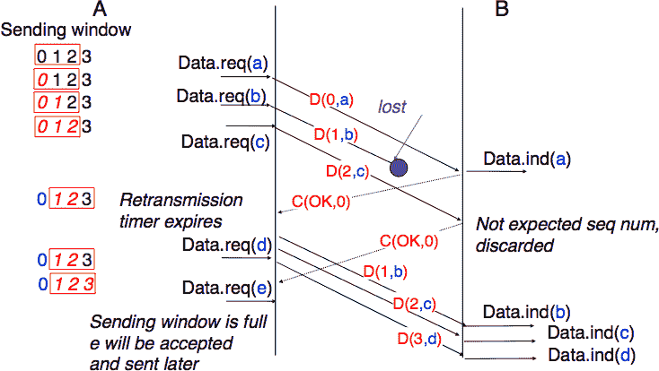

图 56 Go-back-n：示例#

go-back-n 的主要优势是它易于实现，并且当只有少量段丢失时，它可以提供良好的性能。然而，当丢失很多时，go-back-n 的性能会迅速下降，原因有两个：

> +   go-back-n 接收器不接受乱序段
> +   
> +   go-back-n 发送器一旦检测到丢失，就会重新传输所有未确认的段

```sh
Please log in to see this exercise
```

选择重传是一种更好的恢复丢失的策略。直观上，选择重传允许接收器接受乱序段。此外，当选择重传发送器检测到丢失时，它只会重新传输丢失的段，而不会重新传输已经正确接收的段。

选择重传接收器维护一个包含 W 个段的滑动窗口，并将它接收到的乱序段存储在缓冲区中。图 57 显示了一个接收器已经接收了段 7 和 9 的五个段接收窗口。


图 57 选择重传的接收窗口#

选择重传接收器会丢弃所有具有无效 CRC 的段，并保持变量 lastack 为其已接收的最后有序段的序列号。接收器始终在其发送的确认中包含 lastack 的值。一些协议还允许选择重传接收器确认它已接收的乱序段。例如，可以通过将正确接收但乱序的段列表与 lastack 值一起放入确认中来做到这一点。

当选择重传接收器接收到数据段时，它首先验证该段是否在其接收窗口内。如果是，该段将被放置在接收缓冲区中。如果不是，接收到的段将被丢弃，并向发送器发送包含 lastack 的确认。然后，接收器从接收缓冲区中移除从 lastack 开始的连续段（如果有）。这些段的负载被传递给用户，lastack 和接收窗口被更新，并发送一个确认，确认已按顺序接收的最后一段。

选择性重传发送者维护一个发送缓冲区，可以存储多达 W 个未确认的段。只要发送缓冲区不满，就会发送这些段。选择性重传发送者的几种实现方式是可能的。一种简单的实现方式是为每个段关联一个重传定时器。定时器在发送段时启动，并在接收到覆盖此段的确认时取消。当重传定时器超时时，相应的段被重新传输，并且这个重传定时器被重新启动。当接收到确认时，所有被此确认覆盖的段将从发送缓冲区中移除，并且滑动窗口被更新。

图 58 说明了段丢失时选择性重传的操作。在这个图中，C(OK,x)用来表示所有段，包括序列号 x 及其之前的段，都已正确接收。


图 58 选择性重传：示例#

纯累积确认与回退-n 策略配合良好。然而，仅使用累积确认，选择性重传发送者无法轻易确定在数据段丢失后哪些段已被正确接收。例如，在上面的图中，第二个 C(OK,0)并没有明确告知发送者 D(2,c)已被接收，因此发送者可能会重新传输这个段，尽管它已经被接收。为了提高选择性重传的性能，一个可能的解决方案是在接收者返回的确认中提供关于已接收段的额外信息。例如，接收者可以在返回的确认中添加已接收的所有段的序列号列表。这种确认有时被称为选择性确认。我们将在本书后面的 TCP 和 QUIC 协议中提供此类确认的示例。

```sh
Please log in to see this exercise
```

注意

go-back-n 和选择性重传的最大窗口大小

一个使用 n 位来编码其序列号的可靠协议可以发送多达 $ 2^n $ 个连续的段。然而，为了确保段的可靠交付，回退 n 和选择重传不能使用 $ 2^n $ 个段的发送窗口。首先考虑回退 n，并假设发送者发送 $ 2^n $ 个段。这些段按顺序被目的地接收，但所有返回的确认信息都丢失了。发送者将重新发送所有段。这些段都将被接收器接受，并第二次交付给用户。很容易看出，如果发送窗口的最大大小是 $ {2^n}-1 $ 个段，这个问题可以避免。与选择重传类似，也会出现类似的问题。然而，由于接收器接受非顺序的段，$ {2^n}-1 $ 个段的发送窗口不足以确保可靠的交付。可以很容易地证明，为了避免这个问题，选择重传发送者不能使用大于 $ \frac{2^n}{2} $ 个段的窗口。

可靠协议通常需要在两个方向上发送数据。为了减少由确认信息引起的开销，大多数可靠协议使用尾随技术。多亏了这项技术，实体可以将确认信息和它为数据流相反方向宣布的接收窗口放置在它发送的数据段头部。尾随的主要优势在于它减少了开销，因为不需要发送一个完整的段来携带确认信息。这在下图中得到了说明，其中确认号在数据段中被加粗。尾随技术仅在数据双向流动时使用。当接收器在相反方向不发送数据时，如图底部所示，它将生成一个纯确认信息。


图 59 尾随示例#

```sh
Please log in to see this exercise
```

```sh
Please log in to see this exercise
```

### 在不完美的链路上进行可靠传输#

传输层必须处理可能影响它发送的段的多种类型的错误。在实践中，我们主要必须在传输层处理两种类型的错误：

> +   段落可能会因为传输错误而损坏
> +   
> +   段落可能会丢失或出现意外的段

为了检测错误，一个段通常被分为两部分：

> +   一个包含可靠协议用于确保可靠交付的字段的头部。该头部包含一个校验和或循环冗余校验（CRC）[[Williams1993]](../bibliography.html#williams1993)，用于检测传输错误
> +   
> +   一个包含用户数据的有效载荷

一些头部还包括一个长度字段，该字段指示段的总体长度或有效载荷的长度。

最简单的错误检测方案是校验和。校验和基本上是构成段的全部字节的算术和。有不同类型的校验和。例如，一个 8 位校验和可以计算为段（包括头部和尾部）所有字节的算术和。校验和在发送段之前由发送者计算，接收者在收到段时验证校验和。接收者丢弃接收到的无效校验和的段。校验和可以很容易地在软件中实现，但它们的错误检测能力有限。循环冗余校验（CRC）具有更好的错误检测能力 [[SGP98]](../bibliography.html#sgp98)，但在软件实现时需要更多的 CPU。

备注

校验和、CRC、…

TCP/IP 协议族中的大多数协议都依赖于简单的互联网校验和来验证接收到的数据包在传输过程中没有被错误影响。尽管它很受欢迎且易于实现，但互联网校验和并不是唯一的校验和机制。循环冗余校验（[CRC](https://en.wikipedia.org/wiki/Cyclic_redundancy_check)）是非常强大的错误检测方案，特别在磁盘、许多数据链路层协议以及`zip`或`png`等文件格式中使用。它们可以很容易地在硬件中高效实现，并且比互联网校验和具有更好的错误检测能力 [[SGP98]](../bibliography.html#sgp98)。然而，CRC 有时被认为对软件实现来说 CPU 消耗过高，因此更倾向于使用其他校验和机制。TCP/IP 社区选择了互联网校验和，OSI 社区选择了 Fletcher 校验和 [[Sklower89]](../bibliography.html#sklower89)。如今，有高效的软件计算 CRC 的技术 [[Feldmeier95]](../bibliography.html#feldmeier95)。

由于接收者在收到每个数据段后发送确认，因此处理丢失的最简单方法是使用重传计时器。当发送者发送一个段时，它启动一个重传计时器。这个重传计时器的持续时间应该大于往返时间，即数据段传输和对应确认接收之间的延迟。当重传计时器到期时，发送者假设数据段已丢失并重新发送它。这在下图中进行了说明。

> 

```sh
Please log in to see this exercise
```

不幸的是，仅重传计时器不足以从丢失中恢复。让我们考虑以下情况，其中确认信息丢失。在这种情况下，发送方重新传输尚未确认的数据段。然而，如图所示，接收方将重传视为新的段，其有效载荷必须交付给用户。

> 

为了解决这个问题，可靠的协议将序列号分配给每个数据段。这个序列号是数据段头部中找到的字段之一。我们使用表示法 D(x,…)来表示序列号字段设置为值 x 的数据段。确认信息也包含一个序列号，表示它确认的数据段。我们使用 OKx 来表示确认接收了 D(x,…)的确认信息。序列号被编码为固定长度的比特串。最简单的可靠协议是交替位协议（ABP）。

### 交替位协议#

交替位协议使用一个比特来编码序列号。它可以很容易地实现。发送方（分别）只需要一个四状态（分别）有限状态机。发送方有限状态机在图 48 中表示，接收方有限状态机在图 49 中表示。

> 
> 
> 图 48 交替位协议：发送方有限状态机

发送者的初始状态是等待 D(0,…). 在此状态下，发送者等待 Data.request. 它发送的第一个数据段使用序列号 0. 发送此段之后，发送者等待 OK0 确认。如果重传计时器到期或收到带有错误序列号的确认，则重新传输数据段。

接收者首先等待 D(0,…). 如果段包含正确的 CRC，则将其 SDU 传递给其用户并发送 OK0. 如果段包含无效的 CRC，则立即丢弃。然后，接收者等待 D(1,…). 在此状态下，它可能收到重复的 D(0,…) 或包含无效 CRC 的数据段。在这两种情况下，它返回一个 OK0 段以允许发送者从可能丢失的前一个 OK0 段中恢复。

> 
> 
> 图 49 交替位协议：接收者有限状态机

注意

损坏的段必须被丢弃

交替位协议的接收者有限状态机丢弃所有包含无效 CRC 的段。这是最安全的做法，因为接收到的段可能与远程主机发送的段完全不同。接收者不应尝试从损坏的段中提取信息，因为它无法知道段的哪个部分受到了错误的影响。

下图说明了交替位协议的操作。


交替位协议可以从数据或控制段的丢失中恢复。这在下面的两个图中说明。第一个图显示了一个数据段的丢失。


第二个图示说明了主机如何处理一个控制段的丢失。


交替比特协议可以从传输错误和段丢失中恢复。然而，它有一个重要的缺点。考虑两个通过 50 Kbits/sec 卫星链路直接连接的主机，该链路具有 250 毫秒的传播延迟。如果这些主机发送 1000 比特的段，那么如果忽略确认的传输时间，交替比特协议可以达到的最大吞吐量是每 520 毫秒一个段，即$ 20+250+250=520 $毫秒！这还不到 2 Kbits/sec！

```sh
Please log in to see this exercise
```

```sh
Please log in to see this exercise
```

```sh
Please log in to see this exercise
```

### Go-back-n 和选择性重传#

为了克服交替比特协议的性能限制，可靠的协议依赖于如图 50 所示的流水线技术。这项技术允许发送者在每个段之后不必等待确认即可连续发送多个段。每个数据段包含一个序列号，该序列号编码为一个 n 位字段。


图 50 流水线提高了可靠协议的性能#

管道化允许发送者以更高的速率传输段。然而，这种更高的传输速率可能会超载接收者。在这种情况下，发送者发送的段将不会被其最终目的地正确接收。依赖于管道化的可靠协议允许发送者在被强制等待接收实体确认之前传输 W 个未确认的段。

这是通过使用滑动窗口实现的。滑动窗口是发送者在发送段时可以使用而不必等待确认的连续序列号集合。图 51 展示了一个包含五个段（6、7、8、9 和 10）的滑动窗口。其中两个序列号（6 和 7）已被用于发送段，而滑动窗口中只剩下三个序列号（8、9 和 10）。当滑动窗口中的所有序列号都被使用后，滑动窗口被认为是关闭的。


图 51 滑动窗口#

图 52 展示了滑动窗口的操作。它使用三个段的滑动窗口。因此，发送者可以在收到确认之前传输三个段。在收到每个确认后，滑动窗口会移动到更高的序列号。当收到第一个确认（OK0）时，它允许发送者将其滑动窗口向右移动，序列号 3 变得可用。这个序列号后来被用来传输包含 d 的段。


图 52 滑动窗口示例#

在实践中，由于段头包括一个用于编码序列号的 n 位字段，因此只能使用 $ 0 $ 到 $ 2^{n}-1 $ 之间的序列号。这意味着，在长时间传输过程中，相同的序列号将用于不同的段，滑动窗口将回绕。这通过 图 53 来说明，假设在段头中使用 2 位来编码序列号。请注意，在收到 OK1 后，发送者滑动其窗口，并可以再次使用序列号 0。


图 53 使用模运算的滑动窗口利用率#

不幸的是，由于可靠协议使用滑动窗口，段丢失并不会消失。为了从丢失中恢复，滑动窗口协议必须定义：

> +   一种用于检测丢失的启发式方法
> +   
> +   一种重传策略，用于重传丢失的段

最简单的滑动窗口协议使用 go-back-n 恢复。直观地说，go-back-n 的工作方式如下。Go-back-n 接收器尽可能简单。它只接受按顺序到达的段。Go-back-n 接收器会丢弃它接收到的任何顺序错误的段。当 go-back-n 接收到数据段时，它总是返回一个包含它已接收的最后顺序段的序列号的确认。这种确认被称为累积确认。当一个 go-back-n 接收器为序列号 x 发送确认时，它隐式地确认了所有序列号早于 x 的段的接收。这些累积确认的一个关键优点是，从确认丢失中恢复很容易。例如，考虑一个接收了段 1、2 和 3 的 go-back-n 接收器。它发送了 OK1、OK2 和 OK3。不幸的是，OK1 和 OK2 丢失了。多亏了累积确认，当发送器收到 OK3 时，它知道所有三个段都已正确接收。

图 54 展示了一个简单的 go-back-n 接收器的状态机。此接收器使用两个变量：lastack 和 next。next 是下一个期望的序列号，lastack 是已确认的最后数据段的序列号。接收器只接受按顺序接收到的段。maxseq 是不同序列号的数量 ($ 2^n $)。

> 
> 
> 图 54 Go-back-n：接收器状态机

如 图 55 所示，Go-back-n 发送器也非常简单。它使用一个发送缓冲区，可以存储整个滑动窗口的段 [[2]](#fsizesliding)。段以递增的序列号（模 maxseq）发送。发送器在其发送缓冲区满时必须等待确认。当 go-back-n 发送器收到确认时，它会从发送缓冲区中移除所有已确认的段，并使用重传计时器来检测段丢失。一个简单的 go-back-n 发送器为每个连接维护一个重传计时器。该计时器在发送第一个段时启动。当 go-back-n 发送器收到确认时，只有在其发送缓冲区中仍有未确认的段时，它才会重新启动重传计时器。当重传计时器超时时，go-back-n 发送器假定其发送缓冲区中当前存储的所有未确认段都已丢失。因此，它会重新传输缓冲区中的所有未确认段，并重新启动其重传计时器。

> 
> 
> 图 55 Go-back-n：发送器状态机

go-back-n 的操作在图 56 中说明。在此图中，请注意，在接收到非顺序段 D(2,c)后，接收器返回累积确认 C(OK,0)，确认已按顺序接收的所有段。丢失的段在重传计时器到期后重新传输。


图 56 go-back-n：示例#

go-back-n 的主要优势是它易于实现，并且当只有少量段丢失时，它也能提供良好的性能。然而，当有很多丢失时，go-back-n 的性能会迅速下降，原因有两个：

> +   go-back-n 接收器不接受非顺序段
> +   
> +   go-back-n 发送器一旦检测到丢失，就重新传输所有未确认的段

```sh
Please log in to see this exercise
```

选择重传是恢复丢失的更好策略。直观地讲，选择重传允许接收器接受非顺序段。此外，当选择重传发送器检测到丢失时，它只重传丢失的段，而不是已经正确接收的段。

选择重传接收器维护一个包含 W 个段的滑动窗口，并将它接收到的非顺序段存储在缓冲区中。图 57 显示了一个接收器已经接收了段 7 和 9 的五个段接收窗口。


图 57 选择重传的接收窗口#

选择重传接收器丢弃所有具有无效 CRC 的段，并将变量 lastack 保持为它已接收的最后顺序段的序列号。接收器始终在其发送的确认中包含 lastack 的值。某些协议还允许选择重传接收器确认它已接收的非顺序段。例如，可以通过在确认中将正确接收但顺序错误的段的列表与 lastack 值一起放置来实现。

当选择重传接收器接收到一个数据段时，它首先验证该段是否在其接收窗口内。如果是，该段将被放置在接收缓冲区中。如果不是，接收到的段将被丢弃，并向发送者发送包含 lastack 的确认。接收器随后从接收缓冲区中移除从 lastack 开始的（如果有）所有连续段。这些段的负载被交付给用户，lastack 和接收窗口被更新，并发送一个确认，确认已按顺序接收的最后一段。

选择重复发送者维护一个发送缓冲区，可以存储最多 W 个未确认的段。只要发送缓冲区不满，就会发送这些段。可能存在几种选择重复发送者的实现方式。一种简单的实现方式是为每个段关联一个重传定时器。当发送段时启动定时器，并在接收到覆盖此段的确认后取消定时器。当重传定时器超时时，相应的段被重传，并且重传定时器重新启动。当接收到确认时，所有被此确认覆盖的段将从发送缓冲区中移除，并且滑动窗口被更新。

图 58 展示了在数据段丢失时选择重复的操作。在此图中，C(OK,x)用于表示所有段，包括序列号 x 及其之前的所有段都已正确接收。

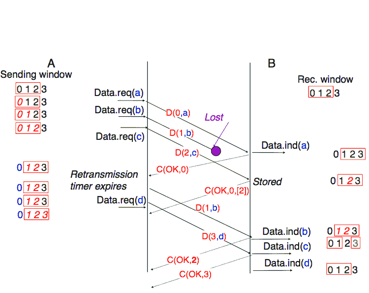

图 58 选择重复：示例#

纯累积确认与回退-n 策略配合良好。然而，仅使用累积确认，选择重复发送者无法轻易确定在数据段丢失后哪些段已被正确接收。例如，在上面的图中，第二个 C(OK,0)并没有明确通知发送者 D(2,c)已被接收，因此发送者可能会重传这个段，尽管它已经被接收。为了提高选择重复的性能，一种可能的解决方案是在接收者返回的确认中提供有关已接收段的一些额外信息。例如，接收者可以在返回的确认中添加已接收所有段的序列号列表。这种确认有时被称为选择确认。我们将在本书后面的 TCP 和 QUIC 协议中提供此类确认的示例。

```sh
Please log in to see this exercise
```

注意

带回退-n 和选择重复的最大窗口大小

一个使用 n 位来编码其序列号的可靠协议可以发送多达 $ 2^n $ 个连续的段。然而，为了确保段的可信传输，后退 N 次和选择重传不能使用 $ 2^n $ 个段的发送窗口。首先考虑后退 N 次方法，假设发送方发送 $ 2^n $ 个段。这些段按顺序被目的地接收，但所有返回的确认都丢失了。发送方将重新传输所有段。这些段都将被接收方接受，并第二次交付给用户。很容易看出，如果发送窗口的最大大小是 $ {2^n}-1 $ 个段，则可以避免这个问题。选择重传也会出现类似的问题。然而，由于接收方接受非顺序段，$ {2^n}-1 $ 个段的发送窗口不足以确保可靠交付。可以很容易地证明，为了避免这个问题，选择重传发送方不能使用大于 $ \frac{2^n}{2} $ 个段的窗口。

可靠协议通常需要在两个方向上发送数据。为了减少由确认引起的开销，大多数可靠协议使用 piggybacking（尾随）。多亏了这项技术，实体可以将确认和它为数据流相反方向声明的接收窗口放置在它发送的数据段的头部。尾随的主要优点是它减少了开销，因为不需要发送完整的段来携带确认。这在下图中得到了说明，其中确认号在数据段中被下划线标注。尾随仅在数据流双向流动时使用。当接收方在相反方向不发送数据时，如图底部所示，它将生成一个纯确认。


图 59 尾随示例#

```sh
Please log in to see this exercise
```

```sh
Please log in to see this exercise
```

## 建立传输连接#

与无连接服务一样，面向连接的服务允许在给定主机上运行的多个应用程序与其他主机交换数据。前面描述的无连接服务中的端口号也被面向连接的服务用于多路复用多个应用程序。同样，面向连接的协议使用校验和/CRC 来检测传输错误并丢弃包含无效校验和/CRC 的段。

无连接服务和面向连接服务之间的重要区别在于，后者在连接生命周期内维护一些状态。这种状态是在建立连接时创建的，并在释放时移除。

建立传输连接的最简单方法可能是定义两个特殊的控制段：CR（连接请求）和 CA（连接确认）。CR 段落由希望发起连接的传输实体发送。如果远程实体希望接受连接，它将通过发送 CA 段落进行回复。CR 和 CA 段落包含端口号，这允许识别通信的应用程序。一旦收到 CA 段落，传输连接就被认为是建立的。在此点，可以双向发送数据段。


不幸的是，考虑到网络层的不可靠性，这还不够。由于网络层不完美，CR 或 CA 段落可能会丢失、延迟或遭受传输错误。为了处理这些问题，控制段落必须通过 CRC 或校验和来保护，以检测传输错误。此外，由于 CA 段落确认了 CR 段落的接收，CR 段落应该使用重传计时器来保护。

不幸的是，这个方案不足以确保传输服务的可靠性。例如，考虑一个短暂的传输连接，其中发送了一个单一但重要的传输（例如，从银行账户转账）。这样的短暂连接以一个被 CA 段落确认的 CR 段落开始，然后发送数据段，确认并终止连接。不幸的是，由于网络层服务不可靠，延迟加上重传可能会导致下图中描述的情况，即延迟的 CR 和数据段被接收实体作为有效段接受，并将相应的数据交付给用户。重复 SDU 是不可接受的，传输协议必须解决这个问题。


为了避免这些重复，传输协议要求网络层限制最大段生存时间（MSL）。网络的组织必须保证没有任何段在网络中停留超过 MSL 秒。例如，在今天的互联网上，MSL 预计为 2 分钟。为了避免重复的传输连接，传输协议实体必须能够安全地区分重复的 CR 段和新的 CR 段，而无需强制每个传输实体记住它过去建立的所有传输连接。

避免记住之前的传输连接以检测重复的经典解决方案是在每个传输实体内部使用一个时钟。这个传输时钟具有以下特性：

> +   传输时钟被实现为一个 k 位计数器，其时钟周期为 $ 2^k \times cycle >> MSL $。此外，传输时钟计数器在每个时钟周期和每次连接建立后都会递增。这个时钟在图 60 中展示。
> +   
> +   即使传输实体停止或重启，传输时钟也必须继续递增


图 60 传输时钟#

应该注意的是，传输时钟不需要也不通常与实时时钟同步。精确同步实时时钟是一个有趣的问题，但它超出了本文档的范围。有关同步实时时钟的详细讨论，请参阅[[Mills2006]](../bibliography.html#mills2006)。

这个传输时钟可以与三个段交换相结合，称为三次握手，以检测重复。这个三次握手如下发生：

> 1.  初始化传输实体发送 CR 段。此段请求建立传输连接。它包含端口号（图中未显示）和一个序列号（如图下 seq=x 所示），其值从传输时钟中提取。CR 段的传输由重传定时器保护。
> 1.  
> 1.  远端传输实体处理 CR 段并为连接尝试创建状态。在此阶段，远端实体尚不知道这是新的连接尝试还是重复的段。它返回一个包含确认号以确认 CR 段的接收（如图下 ack=x 所示）和一个序列号（如图下 seq=y 所示）的 CA 段，其值从其传输时钟中提取。在此阶段，连接尚未建立。
> 1.  
> 1.  初始化实体接收 CA 段。此段的确认号确认远端实体已正确接收 CR 段。初始化实体认为传输连接已建立，数据段的编号从序列号 x 开始。在发送数据段之前，初始化实体必须通过发送另一个 CA 段来确认接收到的 CA 段。
> 1.  
> 1.  远端实体在接收到确认其 CA 段的段落后，认为传输连接已经建立。远端实体发送的数据段编号从序列号 y 开始。

三向握手机制在图 61 中展示。


图 61 三向握手机制#

多亏了三向握手机制，传输实体避免了重复的传输连接。这通过考虑以下三个场景来展示。

第一个场景(图 62)是当远端实体接收到旧的 CR 段。它将此 CR 段视为连接建立尝试，并通过发送 CA 段进行回复。然而，初始化主机无法将接收到的 CA 段与先前的连接尝试匹配。它发送一个控制段（如图下 REJECT 所示）以取消虚假的连接尝试。远端实体在接收到此控制段后取消连接尝试。


图 62 三向握手机制：从重复的 CR 段恢复#

第二种场景，如图 63 所示，是当发起实体发送的 CR 段没有到达远程实体，并从之前的连接尝试中收到一个重复的 CA 段。由于 CR 段的序列号是从发起实体的传输时钟中提取的，这个重复的 CA 段不能包含对 CR 段的有效确认。因此，CA 段被拒绝，CR 段在重传定时器到期时重新发送。


图 63 三向握手：从重复的 CA 恢复

在图 64 中显示的最后一种场景不太可能发生，但同样重要的是要考虑它。远程实体接收到一个旧的 CR 段。它记录了连接尝试并通过发送 CA 段来确认它。发起实体没有匹配的连接尝试，并通过发送 REJECT 来回复。不幸的是，这个段从未到达远程实体。相反，远程实体接收到了一个包含与第一个 CR 段相同序列号的旧 CA 段的重新传输。由于确认号不能与第一个 CA 段的序列号相同，远程实体不能接受这个 CA 段作为传输连接的确认。


图 64 三向握手：从重复的 CR 和 CA 恢复

## 在传输连接上传输数据#

现在传输连接已经建立，它可以用来传输数据。为了确保数据的可靠传输，传输协议将包括滑动窗口、重传定时器和后退 N 或选择重传。然而，我们不能简单地重用这些技术，因为可靠的传输协议还需要处理三种额外的错误类型：(i)可变延迟，(ii)出序交付和(iii)段重复。

当两个主机通过一个链路连接时，链路上的传输延迟或往返时间几乎是固定的。在一个可以跨越全球的网络中，延迟和往返时间可以基于每个数据包而显著变化。这种可变性可能由两个因素引起。首先，通过网络发送的数据包不一定遵循相同的路径到达其目的地。其次，当负载高时，一些数据包可能会在路由器的缓冲区中排队，这些排队延迟可能导致端到端延迟的增加。

另一个问题是一个网络并不总是按顺序交付数据包。这意味着数据包可能被网络重新排序。此外，网络有时可能会重复数据包。

在传输层需要处理的问题中，最后一个问题是大型 SDU 的传输。在我们的示例中，我们使用了短 SDU，它们很容易适应段。一些应用程序生成的 SDU 比网络层中数据包的最大尺寸大得多。传输层需要包括分割和重新组装这些大型 SDU 的机制。

为了处理网络层的所有这些特性，我们需要调整我们之前介绍过的回退 N 和选择重传技术。

检测传输错误的能力仍然很重要。每个段都包含一个 CRC/校验和，这是发送者通过整个段（头部和有效载荷）计算并插入头部的。接收者将重新计算每个接收到的段的 CRC/校验和，并丢弃所有 CRC 无效的段。

可靠传输协议也使用序列号和确认号。虽然我们的示例协议在每个段中使用了单个序列号，但一些可靠传输协议将所有传输的数据视为字节流。在这些协议中，放置在段头中的序列号对应于有效载荷中第一个字节的字节流位置。这个序列号允许检测丢失，同时也使接收者能够重新排序出序的段。这在下图中进行了说明。

> 

当传输层需要将 SDU 分成多个段时，使用序列号来计数字节也有一个优点。下图显示了将大型 SDU 分成两个段的过程。在接收到段后，接收者将使用序列号来正确地重新排序数据。

> 

与我们的简单协议相比，可靠的传输协议使用更多的位来编码它们的序列号。32 位和 64 位序列号在传输层很常见。这个大的序列号空间有两个原因。首先，由于序列号对每个传输的字节进行递增，一个段可能消耗一个或几个千个序列号。其次，可靠的传输协议必须能够检测延迟的段。这只能在 MSL 期间传输的字节数小于序列号空间的情况下完成。否则，存在接受重复段的风险。

Go-back-n 和选择重传可以在传输层和链路层中使用。由于网络层不保证数据包按顺序交付，传输实体应该始终存储它接收到的非顺序段。因此，大多数传输协议将选择某种选择重传机制。

在简单的协议中，滑动窗口通常具有固定的大小，这取决于可用缓冲区的大小。单个传输层实体为大量且变化的应用进程提供服务。每个传输层实体管理一个需要在这些所有进程之间共享的缓冲区池。传输实体通常在操作系统内核中实现，并与系统的其他部分共享内存。此外，传输层实体必须同时支持多个（可能是数百或数千个）传输连接。这意味着可以用于支持传输连接的发送或接收缓冲区的内存可能会在连接的生命周期内发生变化 [[3]](#fautotune) 。因此，传输协议必须允许发送方和接收方调整它们的窗口大小。

为了解决这个问题，传输协议允许接收方在它发送的所有确认中宣布其当前接收窗口的大小。接收方宣布的接收窗口限制了发送方使用的发送缓冲区的大小。在实践中，发送方维护两个状态变量：swin，其发送窗口的大小（可能由系统调整）和 rwin，接收方宣布的接收窗口的大小。在任何时候，未确认段的数量不能超过 $ \min(swin,rwin) $ [[4]](#facklost) 。动态窗口的使用在图图 65 中说明。

(../_images/transport-dwin.svg)

图 65 动态接收窗口#

接收者可能会根据其当前的内存消耗调整其广告接收窗口，但也可以限制发送者使用的带宽。在实践中，接收缓冲区也可能缩小，因为应用程序可能无法快速处理接收到的数据。在这种情况下，接收缓冲区可能会完全填满，广告接收窗口可能会缩小到 0。当发送者收到一个接收窗口设置为 0 的确认时，它会阻塞，直到它收到一个接收窗口为正的确认。不幸的是，如图 66 所示，这个确认的丢失可能导致死锁，因为发送者在等待确认的同时，接收者在等待数据段。


图 66 动态窗口的死锁风险#

为了解决这个问题，传输协议依赖于一个特殊的计时器：持久计时器。这个计时器由发送者在收到一个广告接收窗口设置为 0 的确认时启动。当计时器到期时，发送者重新传输一个旧的段，以迫使接收者发送一个新的确认，从而发送当前的接收窗口大小。

为了总结我们对传输协议中找到的基本机制的描述，我们还需要讨论段到达顺序错误的影响。如果两个连续的段被重新排序，接收者会根据它们的序列号在接收缓冲区中重新排序它们。不幸的是，由于传输协议为不同的段重复使用相同的序列号，如果一个段延迟了很长时间，它仍然可能被接收者接受。这如图 67 所示，其中段 D(1,b) 被延迟。


图 67 过度延迟引起的歧义#

为了解决这个问题，传输协议结合了两种解决方案。首先，它们使用 32 位或更多位来编码段头中的序列号。这增加了开销，但也增加了具有相同序列号的两个不同段之间的延迟。其次，传输协议要求网络层强制执行最大段生存时间（MSL）。网络层必须确保没有数据包在网络中超过 MSL 秒。在互联网中，MSL 被假设 [[5]](#fmsl) 为 2 分钟 [**RFC 793**](https://datatracker.ietf.org/doc/html/rfc793.html)。请注意，这限制了传输协议的最大带宽。如果它使用 n 位来编码其序列号，那么它不能在每 MSL 秒内发送超过 $ 2^n $ 个段。

## 关闭传输连接#

当我们讨论面向连接的服务时，我们提到有两种类型的连接释放：突然释放和优雅释放。

释放传输连接的第一个解决方案是定义一个新的控制段（例如，用于断开请求的 DR 段），一旦发送或接收了该段，就认为连接已释放。这如图 68 所示。

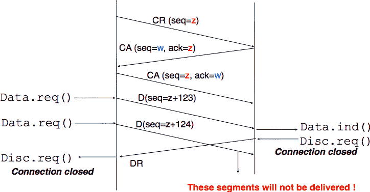

图 68 突然连接释放#

由于发送 DR 段的实体无法知道另一个实体是否已经在该连接上发送了所有数据，因此在这样的突然连接释放过程中可能会丢失 SDU。

释放传输连接的第二种方法是独立释放数据传输的两个方向。一旦传输服务的用户发送了所有其 SDU，它就为其数据传输方向执行 DISCONNECT.req。传输实体发送一个控制段，请求在将所有之前的 SDU 交付给远程用户后释放连接。这通常通过在 DR 中放置下一个序列号，并且只在所有之前的 DATA.ind 交付后发送 DISCONNECT.ind 来实现。远程实体通过返回一个确认来确认接收了 DR 段和释放相应的数据传输方向。这如图 69 所示。

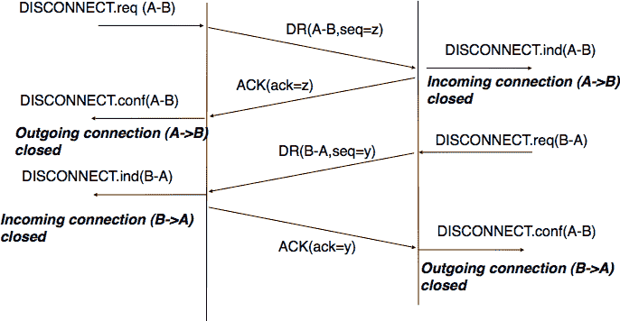

图 69 优雅连接释放#

脚注
