# 传输控制协议#

> 原文：[`4ed.computer-networking.info/syllabus/default/hosts/tcp.html`](https://4ed.computer-networking.info/syllabus/default/hosts/tcp.html)

传输控制协议（TCP）最初在[**RFC 793**](https://datatracker.ietf.org/doc/html/rfc793.html)中定义。自原始协议规范发布以来，该协议的几个部分已经得到改进[[1]](#ftcpspecs)。然而，协议的基本原理仍然存在，并且仅支持[**RFC 793**](https://datatracker.ietf.org/doc/html/rfc793.html)的实现应该能够与今天的实现进行互操作。

TCP 在不可靠的无连接网络服务之上提供了一种可靠的字节流、面向连接的传输服务，这种网络服务由 IP 提供。TCP 被大量应用程序使用，包括：

> +   电子邮件（SMTP，POP，IMAP）
> +   
> +   全球万维网（HTTP，…）
> +   
> +   大多数文件传输协议（ftp，对等文件共享应用程序，…）
> +   
> +   远程计算机访问：telnet，ssh，X11，VNC，…
> +   
> +   非交互式多媒体应用程序（Flash，…）

在全球互联网上，大多数在广域网中使用的应用程序都依赖于 TCP。许多研究[[2]](#ftcpusage)报告称，TCP 是全球互联网中交换数据的 90%以上。

为了提供这项服务，TCP 依赖于图下所示的简单分段格式。每个 TCP 分段包含以下描述的头部，以及可选的负载。TCP 头部的默认长度为 20 字节，但某些 TCP 头部包含选项。


图 70 TCP 头部格式#

TCP 头部包含以下字段：

> +   源端口和目标端口。在 TCP 中，源端口和目标端口起着重要作用，因为它们允许识别 TCP 分段所属的连接。当客户端打开 TCP 连接时，它通常会选择一个临时 TCP 端口号作为其源端口，并通过使用服务器的端口号来联系服务器。客户端在此连接上发送的所有分段都具有相同的源端口和目标端口。服务器发送包含源（分别。目标）端口的分段，即客户端发送的分段的目标（分别。源）端口（参见图 TCP 源和目标端口的利用）。一个 TCP 连接始终由以下四项信息标识：
> +   
>     +   客户端的地址
>     +   
>     +   服务器的地址
>     +   
>     +   客户端选择的端口
>     +   
>     +   服务器选择的端口
>     +   
> +   序列号（32 位）、确认号（32 位）和窗口（16 位）字段用于通过基于窗口的协议提供可靠的数据传输。在 TCP 字节流中，流中的每个字节消耗一个序列号。它们的用法在 TCP 可靠数据传输部分中更详细地描述。
> +   
> +   紧急指针用于指示某些数据应被视为 TCP 字节流中的紧急数据。然而，在实际应用中很少使用，此处不予描述。有关此指针的更多详细信息，请参阅[**RFC 793**](https://datatracker.ietf.org/doc/html/rfc793.html)、[**RFC 1122**](https://datatracker.ietf.org/doc/html/rfc1122.html)或[[Stevens1994]](../bibliography.html#stevens1994)
> +   
> +   标志字段包含一组位标志，指示 TCP 实体如何解释接收到的段：
> +   
>     > +   SYN 标志用于连接建立过程中
>     > +   
>     > +   FIN 标志用于连接释放过程中
>     > +   
>     > +   RST 在出现问题时或接收到无效段时使用
>     > +   
>     > +   当 ACK 标志被设置时，它表示确认字段包含一个有效的数字。否则，接收方必须忽略确认字段的内容
>     > +   
>     > +   URG 标志与紧急指针一起使用
>     > +   
>     > +   PSH 标志用作发送方向接收方发出的通知，指示接收方应将其接收到的所有数据传递给接收进程。然而，在实际中，TCP 实现不允许 TCP 用户指示何时设置 PSH 标志。
>     > +   
> +   校验和字段包含整个 TCP 段和伪头（与 UDP 类似）计算出的 Internet 校验和值
> +   
> +   保留字段最初是为未来使用预留的。现在它被[**RFC 3168**](https://datatracker.ietf.org/doc/html/rfc3168.html)使用。
> +   
> +   TCP 头长度（THL）或数据偏移字段是一个 4 位字段，指示 TCP 头的大小（以 32 位字为单位）。因此，TCP 头的最大大小为 64 字节。
> +   
> +   可选头扩展用于向 TCP 头添加可选信息。多亏了这个头扩展，才有可能向 TCP 头添加原始规范中没有计划的新字段。这使得 TCP 自 20 世纪 80 年代初以来得以发展。TCP 头扩展的详细信息在 TCP 连接建立和 TCP 可靠数据传输部分中解释。
> +   
>     > 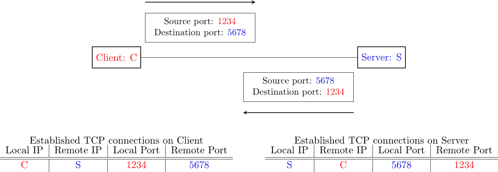
>     > 
>     > 图 71 TCP 源端口和目的端口的利用

本节的其余部分组织如下。我们首先解释 TCP 连接的建立和释放，然后讨论 TCP 提供可靠字节流服务所使用的机制。我们以讨论网络拥塞和 TCP 避免拥塞崩溃的机制结束本节。

## TCP 连接建立#

TCP 连接是通过使用三次握手建立的。连接建立阶段使用序列号、确认号和 SYN 标志。当 TCP 连接建立时，两个通信主机协商用于连接两个方向的初始序列号。为此，每个 TCP 实体维护一个 32 位计数器，该计数器至少每 4 微秒增加一次，并在每次连接建立后增加 [[3]](#ftcpclock)。当客户端主机想要与服务器主机建立 TCP 连接时，它创建一个包含以下内容的 TCP 段：

> +   设置 SYN 标志
> +   
> +   序列号设置为客户端主机 TCP 实体的 32 位计数器的当前值

在接收到这个段（通常称为 SYN 段）后，服务器主机回复一个包含以下内容的段：

> +   设置 SYN 标志
> +   
> +   序列号设置为服务器主机 TCP 实体的 32 位计数器的当前值
> +   
> +   设置 ACK 标志
> +   
> +   确认号设置为接收到的 SYN 段的序列号加 1 $ \pmod{2^{32}} $. 当一个 TCP 实体发送一个确认号为 x+1 的段时，这表示它已经接收了所有从序列号 x 开始及包括 x 的所有数据，并且正在等待序列号为 x+1 的数据。由于 SYN 标志在序列号为 x 的段中已设置，这意味着在段中设置 SYN 标志会消耗一个序列号。

这个段通常被称为 SYN+ACK 段。确认号确认服务器已正确接收了 SYN 段。SYN+ACK 段的序列号由服务器主机用于验证客户端是否已接收该段。在接收到 SYN+ACK 段后，客户端主机回复一个包含以下内容的段：

> +   设置 ACK 标志
> +   
> +   确认号设置为接收到的 SYN+ACK 段的序列号加 1 $ \pmod{2^{32}} $

到这一点，TCP 连接已打开，客户端和服务器都可以发送包含数据的 TCP 段。这在下图中表示。


图 72 TCP 连接建立#

在上面的图中，客户端一旦接收到 SYN+ACK 段，就认为连接已建立，而服务器在接收到 ACK 段后认为连接已建立。客户端（服务器）发送的第一个数据段的序列号设置为 x+1（分别对应 y+1）。

注意

计算 TCP 的初始序列号

在原始的 TCP 规范[**RFC 793**](https://datatracker.ietf.org/doc/html/rfc793.html)中，每个 TCP 实体维护一个时钟来计算放置在 SYN 和 SYN+ACK 段中的初始序列号(ISN)。这使得 ISN 可预测，并引发了安全问题。典型的安全问题如下。考虑一个基于其 IP 地址信任主机的服务器，并允许系统管理员无需密码即可从该主机登录[[4]](#frlogin)。现在考虑一个知道这种特定配置并能够发送具有客户端地址作为源地址的 IP 数据包的攻击者。他可以向服务器发送伪造的 TCP 段，但不会收到服务器的响应。如果他能够预测服务器选择的 ISN，他可以发送一个伪造的 SYN 段，并在稍后发送一个伪造的 ACK 段以确认接收服务器发送的 SYN+ACK 段。一旦 TCP 连接建立，他就可以用它向服务器发送任何命令。为了应对这种攻击，当前的 TCP 实现向 ISN 添加随机性。在[**RFC 1948**](https://datatracker.ietf.org/doc/html/rfc1948.html)中提出的解决方案之一是将 ISN 计算为

```sh
ISN = M + H(localhost, localport, remotehost, remoteport, secret). 
```

其中 M 是当前 TCP 时钟的值，H 是一个加密散列函数。localhost 和 remotehost（分别对应 localport 和 remoteport）是本地和远程主机的 IP 地址（端口号），secret 是一个只有服务器知道的随机数。这种方法允许服务器同时为不同的客户端使用不同的 ISN。[测量](http://lcamtuf.coredump.cx/newtcp/)表明，这种技术的首次实现很难正确实现，但今天的 TCP 实现现在生成好的 ISN。

当然，服务器可以在接收到 SYN 段后拒绝打开 TCP 连接。这种拒绝可能由于各种原因。可能没有监听 SYN 段目标端口的服务器进程。服务器可以始终拒绝来自特定客户端的连接建立（例如，由于安全原因）或服务器可能没有足够的资源在那时接受新的 TCP 连接。在这种情况下，服务器会回复一个设置了 RST 标志并包含接收到的 SYN 段序列号加一的确认号的 TCP 段。这在下图中说明。我们将在后面讨论 TCP RST 标志的其他用法（见 TCP 连接释放）。

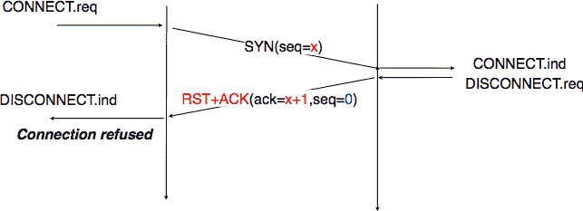(../_images/tcp-estab-rej.png)

图 73 TCP 连接被对等方拒绝#

TCP 连接建立可以描述为以下所示的四个状态有限状态机。在这个 FSM 中，!X（分别对应?Y）表示在相应的转换期间传输段 X（分别接收段 Y）。Init 是初始状态。

> 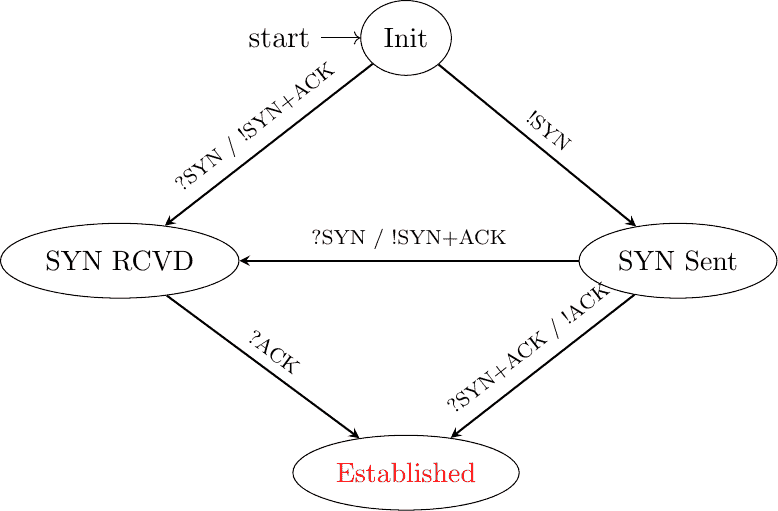
> 
> 图 74 TCP 连接建立 FSM

客户端主机从 Init 状态开始。然后它发送一个 SYN 段并进入 SYN Sent 状态，在那里它等待接收 SYN+ACK 段。然后，它回复一个 ACK 段并进入 Established 状态，在此状态下可以交换数据。另一方面，服务器主机从 Init 状态开始。当服务器进程开始监听目标端口时，底层的 TCP 实体创建一个 TCP 控制块和一个队列来处理传入的 SYN 段。在接收到 SYN 段后，服务器的 TCP 实体回复一个 SYN+ACK 并进入 SYN RCVD 状态。它保持在这个状态，直到它接收到一个确认其 SYN+ACK 段的 ACK 段，然后进入 Established 状态。

除了 TCP 连接建立有限状态机（FSM）中的这两条路径之外，还存在第三条路径，对应于客户端和服务器都发送 SYN 段以打开 TCP 连接的情况 [[5]](#ftcpboth)。在这种情况下，客户端和服务器发送 SYN 段并进入 SYN Sent 状态。在接收到来自另一主机的 SYN 段后，它们通过发送 SYN+ACK 段并进入 SYN RCVD 状态来回复。来自另一主机的 SYN+ACK 允许它过渡到 Established 状态。下面的图示说明了这种同时建立 TCP 连接的情况。

](../_images/tcp-estab-sim.png)

图 75 TCP 连接的同时建立#

如前所述，TCP 段可能包含可选的头部扩展。在 SYN 和 SYN+ACK 段中，这些选项用于协商一些参数以及基本 TCP 规范扩展的使用。

在建立 TCP 连接期间协商的第一个参数是最大段大小（MSS）。MSS 是 TCP 实体能够处理的最大段的大小。根据[**RFC 879**](https://datatracker.ietf.org/doc/html/rfc879.html)，所有 TCP 实现都必须能够接收包含 536 字节有效负载的 TCP 段。然而，大多数 TCP 实现能够处理更大的段。这样的 TCP 实现使用 SYN/SYN+ACK 段中的 TCP MSS 选项来指示它们能够处理的最大段。MSS 值指示 TCP 段有效负载的最大大小。客户端（分别对应服务器）在其 TCB 中存储服务器（分别对应客户端）宣布的 MSS 值。

在建立连接期间，TCP 选项的另一种用途是启用 TCP 扩展。例如，考虑 [**RFC 1323**](https://datatracker.ietf.org/doc/html/rfc1323.html)（在 TCP 可靠数据传输 中讨论）。[**RFC 1323**](https://datatracker.ietf.org/doc/html/rfc1323.html) 定义了 TCP 扩展以支持时间戳和更大的窗口。如果客户端支持 [**RFC 1323**](https://datatracker.ietf.org/doc/html/rfc1323.html)，它将在其 SYN 分段中添加一个 [**RFC 1323**](https://datatracker.ietf.org/doc/html/rfc1323.html) 选项。如果服务器理解这个 [**RFC 1323**](https://datatracker.ietf.org/doc/html/rfc1323.html) 选项并希望使用它，它将在 SYN+ACK 分段中回复一个 [**RFC 1323**](https://datatracker.ietf.org/doc/html/rfc1323.html) 选项，并且 [**RFC 1323**](https://datatracker.ietf.org/doc/html/rfc1323.html) 中定义的扩展将在整个 TCP 连接中使用。否则，如果服务器的 SYN+ACK 不包含 [**RFC 1323**](https://datatracker.ietf.org/doc/html/rfc1323.html) 选项，客户端不允许在整个 TCP 连接中使用此扩展和相应的 TCP 头部选项。TCP 的选项机制是灵活的，它允许扩展 TCP 同时保持与旧实现的兼容性。

TCP 选项通过使用类型长度值格式进行编码，其中：

> +   第一个字节指示选项的类型。
> +   
> +   第二个字节指示选项的总长度（包括前两个字节）以字节为单位
> +   
> +   剩余的字节针对每种选项类型是特定的

[**RFC 793**](https://datatracker.ietf.org/doc/html/rfc793.html) 定义了必须被所有 TCP 实现理解的 TCP 最大分段大小 (MSS) 选项。此选项（类型 2）长度为 4 字节，包含一个 16 位字，表示 SYN 分段发送者支持的 MSS。MSS 选项只能在设置了 SYN 标志的 TCP 分段中使用。

[**RFC 793**](https://datatracker.ietf.org/doc/html/rfc793.html) 还定义了两个所有 TCP 实现都必须支持的特别选项。第一个选项是选项结束。它编码为一个值为 0x00 的单字节，可以用来确保 TCP 头部扩展以 32 位边界结束。无操作选项，编码为一个值为 0x01 的单字节，可以在 TCP 头部扩展包含多个应按 32 位边界对齐的 TCP 选项时使用。所有其他选项 [[7]](#ftcpoptions) 都使用 TLV 格式进行编码。

注意

顽健性原则

TCP 实现对 TCP 选项的处理是顽健性原则的许多应用之一，该原则通常归功于 [Jon Postel](https://www.postel.org/postel.html)，常被引用为“在接受方面要宽容，在发送方面要保守” [**RFC 1122**](https://datatracker.ietf.org/doc/html/rfc1122.html)。

关于 TCP 选项，健壮性原则意味着 TCP 实现应该能够接受它不理解 TCP 选项，特别是在接收到的 SYN 段中，并且它应该能够解析任何接收到的段而不会崩溃，即使该段包含一个未知的 TCP 选项。此外，服务器不应在 SYN+ACK 段或之后发送客户端在 SYN 段中未提出的选项。## TCP 可靠数据传输#

原始的 TCP 数据传输机制在[**RFC 793**](https://datatracker.ietf.org/doc/html/rfc793.html)中定义。基于在日益增长的全球互联网上使用 TCP 的经验，TCP 规范的这一部分已经被更新和改进了好几次，始终在保持与较老 TCP 实现的向后兼容性。在本节中，我们回顾了 TCP 使用的主要数据传输机制。

TCP 是一种基于窗口的传输协议，提供双向字节流服务。这给 TCP 头部的字段和 TCP 使用的机制带来了一些影响。TCP 头部的三个字段是：

> +   序列号。TCP 使用 32 位序列号。放置在包含数据的 TCP 段头部的序列号是该 TCP 段有效载荷的第一个字节的序列号。
> +   
> +   确认号。TCP 使用累积的肯定确认。每个 TCP 段包含发送确认方期望从远程主机接收的下一个字节的序列号。理论上，确认号仅在 TCP 头部的 ACK 标志被设置时有效。在实践中，几乎所有[[8]](#fackflag) TCP 段都有其 ACK 标志被设置。
> +   
> +   window：TCP 接收器使用这个 16 位字段来指示当前接收窗口的大小，以字节为单位。

注意

传输控制块

对于每个建立的 TCP 连接，TCP 实现必须维护一个传输控制块（TCB）。TCB 包含在此连接上发送和接收段所需的所有信息[**RFC 793**](https://datatracker.ietf.org/doc/html/rfc793.html)。这包括[[9]](#ftcpurgent)：

> +   本地 IP 地址
> +   
> +   远程 IP 地址
> +   
> +   本地 TCP 端口号
> +   
> +   远程 TCP 端口号
> +   
> +   当前 TCP 状态机（FSM）的状态
> +   
> +   最大分段大小（MSS）
> +   
> +   snd.nxt：字节流中下一个字节的序列号（你发送的新数据段的第一字节使用此序列号）
> +   
> +   snd.una：已发送但尚未被确认的最早序列号
> +   
> +   snd.wnd：当前发送窗口的大小（以字节为单位）
> +   
> +   rcv.nxt：期望从远程主机接收的下一个字节的序列号
> +   
> +   rcv.wnd：远程主机当前宣布的接收窗口的大小
> +   
> +   发送缓冲区：用于存储所有未确认数据的缓冲区
> +   
> +   接收缓冲区：一个用于存储尚未传递给用户的从远程主机接收的所有数据的缓冲区。数据可能存储在接收缓冲区中，因为它要么不是按顺序接收的，要么是因为用户处理速度太慢。

原始的 TCP 规范可以概括为一个提供字节流服务并使用带重传的 n 次选择重传接收策略的传输协议。

要在建立的连接上发送新数据，TCP 实体将对相应的 TCB 执行以下操作。它首先检查发送缓冲区中的数据是否不大于远程主机声明的接收窗口（rcv.wnd）。如果窗口未满，则最多放置 MSS 字节的数据在 TCP 段的负载中。此段的序列号是负载的第一个字节的序列号。它被设置为第一个可用的序列号，snd.nxt，并且 snd.nxt 根据 TCP 段负载的长度增加。此段的确认号设置为当前 rcv.nxt 的值，并且 TCP 段的窗口字段基于接收缓冲区的当前占用情况计算。数据保留在发送缓冲区中，以防稍后需要重传。

当接收到一个 ACK 标志被设置的 TCP 段时，将执行以下操作。rcv.wnd 被设置为接收到的段的窗口字段值。确认号与 snd.una 进行比较。新确认的数据从发送缓冲区中移除，并且 snd.una 被更新。如果 TCP 段包含数据，序列号与 rcv.nxt 进行比较。如果它们相等，则段是按顺序接收的，数据可以被传递给用户，并且 rcv.nxt 被更新。检查接收缓冲区的内容以确定是否可以按顺序将此缓冲区中已存在的其他数据传递给用户。如果是这样，rcv.nxt 再次更新。否则，段的负载被放置在接收缓冲区中。

### 段传输策略#

在 TCP 这样的传输协议中，它提供了一个字节流，一个在[**RFC 793**](https://datatracker.ietf.org/doc/html/rfc793.html)中被留作实现选择的实际问题是在何时发送包含数据的新的 TCP 段。有两种简单且极端的实现选择。第一种实现选择是用户请求传输一些数据时立即发送 TCP 段。这允许 TCP 提供低延迟的服务。然而，如果用户逐字节发送数据，TCP 会将每个用户字节放在包含 20 字节 TCP 头部的段中 [[10]](#fnagleip)。这在广域网络中是一个巨大的开销，是不可接受的。第二种简单的解决方案是在用户产生 MSS 字节的数据后，才传输新的 TCP 段。这种解决方案减少了开销，但代价是可能非常高的延迟。

约翰·纳格尔在[**RFC 896**](https://datatracker.ietf.org/doc/html/rfc896.html)中提出了这个问题的优雅解决方案。约翰·纳格尔观察到，TCP 头部的开销在广域连接中是一个问题，但在通常可用带宽更高的局域网连接中则较小。他提出了以下规则，以决定在用户产生新的数据段或接收到新的确认段时发送新的数据段。

```sh
if rcv.wnd >= MSS and len(data) >= MSS:
    send one MSS-sized segment
else:
    if there are unacknowledged data:
        place data in buffer until acknowledgment has been received
    else:
        send one TCP segment containing all buffered data (up to rcv.wnd) 
```

第一条规则确保用于大量数据传输的 TCP 连接始终发送完整的 TCP 段。第二条规则在每个往返时间发送一个部分填充的 TCP 段。

这个算法被称为 Nagle 算法，在所有的 TCP 实现中只需要几行代码。这些代码对 TCP/IP 网络中交换的数据包产生了巨大影响。研究人员通过捕获和分析通过给定链路的所有数据包，分析了数据包大小的分布。这些研究表明了几个重要结果：

> +   在 TCP/IP 网络中，很大一部分的数据包是只包含确认的 TCP 段。这些数据包通常占通过研究链路的数据包的 40-50%。
> +   
> +   在 TCP/IP 网络中，大部分的字节都是在长数据包中交换的，通常这些数据包包含大约 1440 字节的负载，这是连接到以太网（最流行的局域网类型）的主机的默认 MSS。

[最近测量](http://www.caida.org/research/traffic-analysis/pkt_size_distribution/graphs.xml)表明，这些数据包大小分布仍然在今天的互联网中有效，尽管数据包分布趋向于成为双峰分布，小数据包对应于 TCP 纯确认，而大数据包（1440 字节）携带大部分用户数据 [[SMASU2012]](../bibliography.html#smasu2012)。  ## TCP 窗口#

从性能角度来看，原始 TCP 规范的一个主要限制是 TCP 头中的 16 位窗口字段。因为这个字段表示接收窗口的当前大小（以字节为单位），它将 TCP 接收窗口限制在 65535 字节。当 TCP 设计时，这个限制并不是一个严重的问题，因为当时高速广域网提供的最大带宽为 56 kbps。然而，在今天的网络中，这个限制已经不再可接受。下表提供了 TCP 连接在 64 KBytes 窗口大小下，根据连接的往返时间所能达到的粗略 [[11]](#faveragebandwidth) 最大吞吐量

| RTT | 最大吞吐量 |
| --- | --- |
| 1 毫秒 | 524 Mbps |
| 10 毫秒 | 52.4 Mbps |
| 100 毫秒 | 5.24 Mbps |
| 500 毫秒 | 1.05 Mbps |

为了解决这个问题，在[**RFC 1323**](https://datatracker.ietf.org/doc/html/rfc1323.html)中提出了一个向后兼容的扩展，允许 TCP 使用更大的接收窗口。今天，大多数 TCP 实现都支持这个选项。基本思想是，而不是将 snd.wnd 和 rcv.wnd 作为 16 位整数存储在 TCB 中，它们应该作为 32 位整数存储。因为 TCP 段头只包含 16 位来放置窗口字段，所以不可能在每个发送的 TCP 段中复制 snd.wnd 的值。相反，头包含 snd.wnd >> S，其中 S 是在连接建立期间协商的缩放因子（ $ 0 \le S \le 14 $）。客户端将其建议的缩放因子作为 TCP 选项添加到 SYN 段中。如果服务器支持 [**RFC 1323**](https://datatracker.ietf.org/doc/html/rfc1323.html)，它将在 SYN+ACK 段中放置它用于宣传其自己的接收窗口的缩放因子。本地和远程缩放因子包含在 TCB 中。如果服务器不支持 [**RFC 1323**](https://datatracker.ietf.org/doc/html/rfc1323.html)，它将忽略接收到的选项，并且不应用缩放。

通过使用在[**RFC 1323**](https://datatracker.ietf.org/doc/html/rfc1323.html)中定义的窗口缩放扩展，TCP 实现可以使用高达 1 GByte 的接收缓冲区。有了这样的接收缓冲区，单个 TCP 连接可以达到的最大吞吐量变为：

| RTT | 最大吞吐量 |
| --- | --- |
| 1 毫秒 | 8590 Gbps |
| 10 毫秒 | 859 Gbps |
| 100 毫秒 | 86 Gbps |
| 500 毫秒 | 17 Gbps |

这些吞吐量在今天的网络中是可以接受的。然而，已经有服务器配备了 10 Gbps 的接口…早期的 TCP 实现具有固定的接收和发送缓冲区 [[12]](#ftcphosts)。今天的高性能实现能够自动调整发送和接收缓冲区的大小，以更好地支持高带宽流 [[SMM1998]](../bibliography.html#smm1998)。

## TCP 的重传超时#

在像 TCP 这样的回退 N 协议中，为了实现良好的性能，必须正确设置重传超时。一方面，如果重传超时过早到期，则已正确接收的段的重传会浪费带宽。另一方面，如果重传超时过晚到期，则发送者空闲等待重传超时到期会浪费带宽。

重传超时的良好设置明显取决于对每个 TCP 连接往返时间的准确估计。往返时间在不同 TCP 连接之间可能不同，也可能在单个连接的生命周期内发生变化。例如，下面的图显示了两个主机在 45 秒期间往返时间的演变。

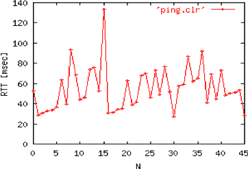

图 76 两个主机之间往返时间的演变#

在 TCP 连接上测量往返时间最简单的解决方案是测量数据段传输和相应确认接收之间的延迟[[13]](#frttmes)。如图所示，在没有数据段丢失的情况下，这种测量方法效果良好。

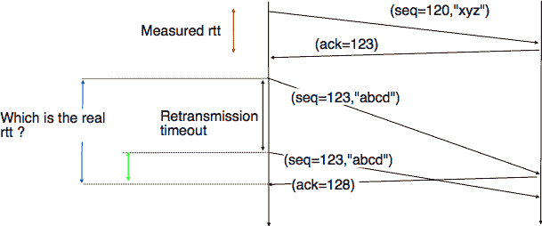

图 77 如何测量往返时间？#

然而，当数据段丢失时，如图中底部所示，测量结果是不明确的，因为发送者无法确定接收到的确认是来自段 123 的第一次传输还是其重传。使用不正确的往返时间估计可能会导致重传超时值不正确。因此，Phil Karn 和 Craig Partridge 在[[KP91]](../bibliography.html#kp91)中提出，在重传期间忽略进行的往返时间测量。

为了避免在段重传时估计往返时间的这种歧义，最近的 TCP 实现依赖于在[**RFC 1323**](https://datatracker.ietf.org/doc/html/rfc1323.html)中定义的时间戳选项。此选项允许 TCP 发送者在每个发送的 TCP 段中放置两个 32 位时间戳。第一个时间戳，TS 值（TSval），由段发送者选择。例如，它可以是其实时时钟的当前值[[14]](#ftimestamp)。第二个值，TS 回显应答（TSecr），是从远程主机接收到的最后一个 TSval，并存储在 TCB 中。下面的图显示了如何利用此时间戳选项在存在重传时消除往返时间测量的歧义。

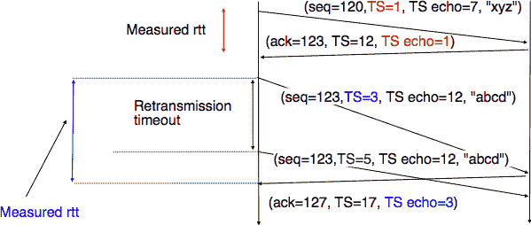

图 78 使用 [**RFC 1323**](https://datatracker.ietf.org/doc/html/rfc1323.html) 时间戳选项区分往返时间测量 #

一旦为给定的 TCP 连接收集了往返时间测量值，TCP 实体必须计算重传超时。由于往返时间测量值可能在连接的生命周期内发生变化，重传超时也可能发生变化。在连接开始时 [[15]](#ftcbtouch)，发送 SYN 段的 TCP 实体不知道到达远程主机的往返时间，并且初始重传超时通常设置为 3 秒 [**RFC 2988**](https://datatracker.ietf.org/doc/html/rfc2988.html)。

在 [**RFC 793**](https://datatracker.ietf.org/doc/html/rfc793.html) 中提出的原始 TCP 规范建议在 TCB 中包含两个额外的变量：

> +   srtt：平滑往返时间计算为 $ srtt=(\alpha \times srtt)+( (1-\alpha) \times rtt) $，其中 $ rtt $ 是根据上述程序测量的往返时间，$ \alpha $ 是平滑因子（例如 0.8 或 0.9）
> +   
> +   rto：重传超时计算为 $ rto=\min(60,\max(1,\beta \times srtt)) $，其中 $ \beta $ 用于考虑延迟变异性（值：1.3 到 2.0）。60 和 1 个常数用于确保 rto 不超过一分钟也不小于 1 秒。

然而，在实践中，对于重传超时的计算并没有很好地工作。主要问题是计算出的 rto 没有正确地考虑到测量到的往返时间的变异性。Van Jacobson 在他的开创性论文 [[Jacobson1988]](../bibliography.html#jacobson1988) 中提出了一种改进的算法来计算 rto，并在 BSD Unix 发行版中实现了它。这个算法现在是 TCP 标准的一部分 [**RFC 2988**](https://datatracker.ietf.org/doc/html/rfc2988.html)。

Jacobson 的算法使用两个状态变量，srtt（平滑 rtt）和 rttvar（rtt 的方差估计），以及两个参数：$ \alpha $ 和 $ \beta $。当 TCP 连接开始时，第一个 rto 设置为 3 秒。当有 rtt 的第一个估计值可用时，srtt、rttvar 和 rto 按以下方式计算：

```sh
srtt = rtt
rttvar = rtt/2
rto = srtt + 4*rttvar 
```

然后，当收集到其他 rtt 测量值时，srtt 和 rttvar 按以下方式更新：

> $ rttvar=(1-\beta) \times rttvar + \beta \times |srtt - rtt| $
> 
> $ srtt=(1-\alpha) \times srtt + \alpha \times rtt $
> 
> $ rto=srtt + 4 \times rttvar $

提出的参数值为 $ \alpha=\frac{1}{8} $ 和 $ \beta=\frac{1}{4} $。这允许在内核中实现的 TCP 实现通过使用移位操作而不是更昂贵的浮点操作来执行 rtt 计算 [[Jacobson1988]](../bibliography.html#jacobson1988)。下面的图示说明了在 rtt 变化时的 rto 计算。


图 79 示例计算 rto#

## 高级重传策略#

默认的回退 N 重传策略在[**RFC 793**](https://datatracker.ietf.org/doc/html/rfc793.html)中定义。当重传计时器超时时，TCP 重新传输第一个未确认的段（即序列号 snd.una 的段）。在每次重传超时后，[**RFC 2988**](https://datatracker.ietf.org/doc/html/rfc2988.html)建议将重传超时的值加倍。这被称为指数退避。在重传后加倍重传超时被包含在 TCP 中，以处理诸如网络/接收器过载和重传超时初始估计不正确等问题。如果相同的段被重传多次，重传超时在每次重传后会加倍，直到达到配置的最大值。[**RFC 2988**](https://datatracker.ietf.org/doc/html/rfc2988.html)建议最大重传超时至少为 60 秒。一旦重传超时达到这个配置的最大值，远程主机被认为是不可达的，TCP 连接被关闭。

这种重传策略是基于在互联网上使用 TCP 的经验进行优化的。第一次优化是对发送确认所使用的策略进行了澄清。由于 TCP 使用尾随，发送确认的最简单和成本最低的方法是将它们放在发送到另一方向的数据段中。然而，很少有应用层协议同时双向交换数据，因此这种方法很少有效。对于只向一个方向发送数据段的程序，远程 TCP 实体返回空 TCP 段，其中唯一有用的信息是它们的确认号。如果对每个接收到的数据段都发送纯 ACK 段，这可能会在广域网中造成大量开销。大多数 TCP 实现使用延迟确认策略。这种策略确保尽可能使用尾随，如果没有丢失，则在每两个接收到的数据段之间发送纯 ACK 段。当有丢失或重排序时，ACK 段对发送者来说更重要，并且它们会立即发送[**RFC 813**](https://datatracker.ietf.org/doc/html/rfc813.html) [**RFC 1122**](https://datatracker.ietf.org/doc/html/rfc1122.html)。这种策略依赖于一个具有短延迟（例如 50 毫秒）的新计时器以及在 TCB 中的一个额外标志。它可以如下实现。

```sh
reception of a data segment:
    if pkt.seq == rcv.nxt:  # segment received in sequence
        if delayed_ack:
            send pure ack segment
            delayed_ack = False
            ack_timer.cancel()
        else:
            delayed_ack = True
            ack_timer.start()
    else:  # out of sequence segment
        send pure ack segment
        if delayed_ack:
            delayed_ack = False
            ack_timer.cancel()

transmission of a data segment:  # piggyback ack
    if delayed_ack:
        delayed_ack = False
        ack_timer.cancel()

acktimer expiration:
    send pure ack segment
    delayed_ack = False 
```

由于这种延迟确认策略，在大量传输期间，TCP 实现通常每接收两个 TCP 段就确认一次。

TCP 使用的默认 go-back-n 重传策略具有易于实现的优点，尤其是在接收方，但当出现丢包时，go-back-n 策略的性能低于选择性重传策略。TCP 开发者设计了几个 TCP 扩展，以允许它使用选择性重传策略，同时保持与较老 TCP 实现的向后兼容性。这些 TCP 扩展假设接收方能够缓冲它接收到的乱序段。

提出的第一个扩展是快速重传启发式方法。这个扩展可以在 TCP 发送方上实现，因此不需要对协议进行任何更改。它只假设 TCP 接收方能够缓冲乱序段。

从性能角度来看，TCP 重传超时的问题之一是，当存在孤立段丢失时，TCP 发送方通常会空闲等待重传超时的到期。这种孤立丢失在全局互联网中很常见[[Paxson99]](../bibliography.html#paxson99)。自 20 世纪 90 年代初以来，许多 TCP 实现中已经包含了一种处理孤立丢失而不必等待重传超时到期的启发式方法。为了理解这个启发式方法，让我们考虑下面的图，它显示了当孤立段丢失时在 TCP 连接上交换的段。

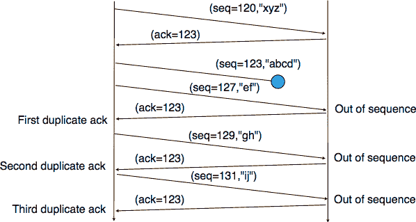

图 80 检测孤立段丢失#

如上图所示，当孤立段丢失时，发送方会收到几个重复确认，因为 TCP 接收方在接收到乱序段时会立即发送纯确认。重复确认是一个包含与先前段相同确认号的确认。单个重复确认并不一定意味着段已丢失，因为段的重排序也可能导致重复确认。测量[[Paxson99]](../bibliography.html#paxson99)表明，段重排序在互联网中很常见。基于这些观察，快速重传启发式方法已包含在大多数 TCP 实现中。它可以如下实现。

```sh
ack arrival:
    if tcp.ack == snd.una:  # duplicate acknowledgment
        dupacks += 1
        if dupacks == 3:
            retransmit segment(snd.una)
    else:
        dupacks = 0
        # process acknowledgment 
```

这个启发式方法需要在 TCB（dupacks）中添加一个额外的变量。大多数实现将触发重传的默认重复确认数设置为 3。现在，它已成为 TCP 标准规范的一部分[**RFC 2581**](https://datatracker.ietf.org/doc/html/rfc2581.html)。快速重传启发式方法在孤立段丢失且当前窗口足够大以允许发送方发送三个重复确认的情况下，可以提高 TCP 的性能。

下面的图展示了快速重传启发式方法的工作原理。

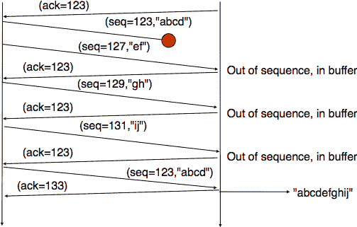

图 81 TCP 快速重传启发式方法#

当丢失不是隔离的或窗口较小时，快速重传启发式方法的表现会下降。在这样的环境中，有必要允许 TCP 发送者使用选择性重传策略而不是默认的回退 n 策略。实现选择性重传需要修改 TCP 协议，因为接收器需要能够通知发送者它已经接收到的乱序数据段。这可以通过使用在 [**RFC 2018**](https://datatracker.ietf.org/doc/html/rfc2018.html) 中定义的选择性确认（SACK）选项来完成。这个 TCP 选项在建立 TCP 连接期间协商。如果两个 TCP 主机都支持此选项，接收器可以将 SACK 数据块附加到它发送的段中。SACK 数据块允许 TCP 接收器指示它已正确接收但顺序不正确的数据块。下面的图示说明了 SACK 数据块的使用情况。

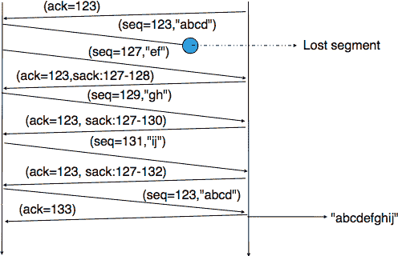

图 82 TCP 选择性确认#

SACK 选项包含一个或多个数据块。一个数据块对应于数据块左边缘和右边缘之间的所有序列号。数据块的这两个边缘在 SACK 选项中以 32 位数字（与 TCP 序列号大小相同）编码。由于 SACK 选项包含一个字节用于编码其类型和一个字节用于其长度，因此包含 b 个数据块的 SACK 选项被编码为 $ 2+8 \times b $ 字节序列。在实践中，SACK 选项的大小可能存在问题，因为可选的 TCP 头部扩展不能超过 40 字节。由于 SACK 选项通常与 [**RFC 1323**](https://datatracker.ietf.org/doc/html/rfc1323.html) 时间戳扩展结合使用，这意味着 TCP 段通常不能包含超过三个 SACK 数据块。这种限制意味着 TCP 接收器不能总是将其发送的 SACK 选项中包含有关所有接收到的数据块的信息。

为了处理 SACK 选项的有限大小，当前接收缓冲区内有超过 3 个数据块的网络连接器必须选择要放入 SACK 选项中的数据块。一个很好的启发式方法是放入最近更改的数据块，因为发送者可能已经知道较旧的数据块。

当发送方收到一个 SACK 选项，指示一个新的块以及新的可能的段丢失时，它通常不会立即重传丢失的段。为了处理重排序，TCP 发送方可以使用类似于快速重传的启发式方法，只在收到三个指示此间隙的 SACK 选项后重传一个间隙。应该注意的是，SACK 选项不取代 TCP 头部的确认号。TCP 发送方只能在 TCP 的累积确认已确认数据后从其发送缓冲区中删除数据。这种设计选择有两个原因。首先，它允许接收方在内存不足时丢弃其接收缓冲区的一部分，而不会丢失数据。其次，由于 SACK 选项不是可靠传输的，累积确认仍然需要处理只携带 SACK 信息的 ACK 段丢失。因此，SACK 选项仅作为提示，允许发送方优化其重传。

如前所述，TCP 时间戳选项 [**RFC 1323**](https://datatracker.ietf.org/doc/html/rfc1323.html) 防止在收集往返时间测量时产生歧义。它在今天的高带宽网络中扮演着另一个非常重要的角色。由于 TCP 使用 32 位长的序列号，序列号在传输 4 GBytes 的数据后会回绕。在 10 Gbps 和即将到来的 100 Gbps 接口上，TCP 只需要在几秒钟内传输，然后就可以重新使用相同的序列号。考虑到最大段生存期仍然是 2 分钟，属于同一 TCP 连接的几个数据包可能会使用相同的序列号。如果这些数据包中的一个在网络中严重延迟，它可能会与具有相同 TCP 序列号的数据包同时出现。为了防止这个问题，大多数现代 TCP 实现会在传输时将 TCP 时间戳选项与每个段关联。当 TCP 堆栈接收到一个 TCP 段时，它会检查其 TCP 时间戳是否有效，如果不是，则丢弃该段 [**RFC 7323**](https://datatracker.ietf.org/doc/html/rfc7323.html)。

## TCP 连接释放#

TCP，像大多数面向连接的传输协议一样，支持两种类型的连接释放：

> +   优雅的连接释放，其中每个 TCP 用户在传输所有数据后都可以释放其自己的数据传输方向
> +   
> +   突然的连接释放，其中任一用户关闭两个方向的数据传输，或者一个 TCP 实体被迫关闭连接（例如，因为远程主机不再回复或由于资源不足）

突然的连接释放机制非常简单，依赖于一个设置了 RST 位的单个段。包含 RST 位的 TCP 段可以发送的原因如下：

> +   接收到一个非 SYN 段，但该 TCP 连接不存在 [**RFC 793**](https://datatracker.ietf.org/doc/html/rfc793.html)
> +   
> +   通过扩展，一些实现会对在现有连接上接收到的但具有无效报头的段响应一个 RST 段 [**RFC 3360**](https://datatracker.ietf.org/doc/html/rfc3360.html)。这导致相应的连接被关闭，并导致了安全攻击 [**RFC 4953**](https://datatracker.ietf.org/doc/html/rfc4953.html)
> +   
> +   通过扩展，一些实现会在需要关闭现有的 TCP 连接时发送一个 RST 段（例如，因为没有足够的资源来支持此连接，或者因为远程主机被认为不可达）。测量表明，这种 TCP RST 的使用很普遍 [[AW05]](../bibliography.html#aw05)

当 TCP 实体发送 RST 段时，它应包含连接的当前序列号值（如果它不属于任何现有连接，则为 0）以及确认号应设置为在此连接上期望的下一个顺序序列号。

注意

TCP 重置战

TCP 实现的设计者应确保两个 TCP 实体永远不会进入一个 TCP 重置战，其中主机 A 正在发送一个 RST 段作为对主机 B 发送的先前的 RST 段的响应，而主机 B 发送该 RST 段是对主机 A 发送的 TCP RST 段的响应……为了避免这种不携带数据的 RST 段的无穷交换，TCP 实体*永远*不允许在响应另一个 RST 段时发送 RST 段。

终止 TCP 连接的正常方式是通过使用优雅的 TCP 连接释放。此机制使用 TCP 报头中的 FIN 标志，并允许每个主机释放其自己的数据传输方向。至于 SYN 标志，TCP 报头中 FIN 标志的使用消耗一个序列号。图 TCP 连接释放的有限状态机 显示了在释放 TCP 连接时使用的 TCP FSM 的部分。

> 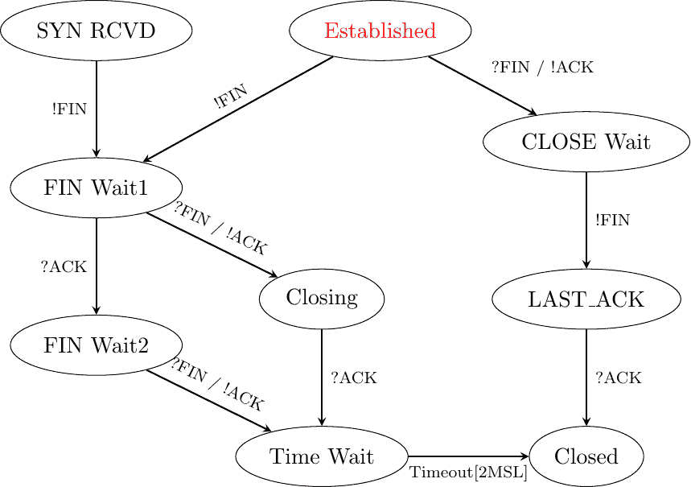
> 
> 图 83 TCP 连接释放的有限状态机

从已建立状态开始，通过此 FSM 有两条主要路径。

第一条路径是当主机收到一个序列号为 x 且设置了 FIN 标志的段。FIN 标志的使用表明序列号 x 之前的字节是远程主机发送的字节流的最后一个字节。一旦所有数据都交付给用户，TCP 实体发送一个 ack 字段设置为 $ (x+1) \pmod{2^{32}} $ 的 ACK 段来确认 FIN 段。FIN 段受到与正常 TCP 段相同的重传机制。特别是，它的传输受到重传计时器的保护。在此点，TCP 连接进入 CLOSE_WAIT 状态。在此状态下，主机仍然可以向远程主机发送数据。一旦它发送了所有数据，它发送一个 FIN 段并进入 LAST_ACK 状态。在此状态下，TCP 实体等待它的 FIN 段的确认。它仍然可以重传未确认的数据段，例如，如果重传计时器超时。收到对 FIN 段的确认后，TCP 连接完全关闭，并且可以丢弃其 TCB。

第二条路径是当主机已经传输了所有数据。假设最后一个传输的序列号是 z。然后，主机发送一个序列号为 $ (z+1) \pmod{2^{32}} $ 的 FIN 段，并进入 FIN_WAIT1 状态。在此状态下，它可以重传未确认的段，但不能发送新的数据段。它等待对它的 FIN 段的确认（即序列号 $ (z+1) \pmod{2^{32}} $），但可能会收到远程主机发送的 FIN 段。在第一种情况下，TCP 连接进入 FIN_WAIT2 状态。在此状态下，仍然接受来自远程主机的新的数据段，直到收到 FIN 段。一旦在 FIN 段之前接收到的所有数据都交付给用户，并且连接进入 TIME_WAIT 状态，就发送对该 FIN 段的确认。在第二种情况下，收到一个 FIN 段，并且一旦从远程主机接收到的所有数据都交付给用户，连接就进入关闭状态。在此状态下，不能发送新的数据段，主机在进入 TIME_WAIT 状态之前等待对它的 FIN 段的确认。

TIME_WAIT 状态与 TCP FSM 的其他状态不同。TCP 实体在发送了 TCP 连接上的最后一个 ACK 段后进入此状态。此段向远程主机指示它已正确接收了发送的所有数据，并且可以安全地释放 TCP 连接并丢弃相应的 TCB。在发送了最后一个 ACK 段之后，TCP 连接进入 TIME_WAIT 状态，并保持此状态$ 2*MSL $秒。在此期间，连接的 TCB 被维护。这确保了发送最后一个 ACK 段的 TCP 实体保持足够的状态，以便在 ACK 段丢失且远程主机重传其最后一个 FIN 段或其他段时能够重传此段。$ 2*MSL $秒的延迟确保了任何连接上的重复段都会被正确处理，而不会导致发送 RST 段。如果没有 TIME_WAIT 状态和$ 2*MSL $秒的延迟，当最后一个 ACK 段丢失时，连接释放将不会是优雅的。

注意

忙碌的 TCP 服务器上的 TIME_WAIT

在 TIME_WAIT 状态下的$ 2*MSL $秒延迟是拥有数千个同时打开的 TCP 连接的服务器上的一项重要操作问题 [[FTY99]](../bibliography.html#fty99)。以一个每秒处理 10,000 个 TCP 连接的繁忙的 Web 服务器为例。如果这些连接中的每一个都保持在 TIME_WAIT 状态 4 分钟，这意味着服务器在任何时候都需要维护超过 200 万个 TCB。因此，一些 TCP 实现更喜欢通过发送一个 RST 段来突然释放连接 [[AW05]](../bibliography.html#aw05)，并立即丢弃相应的 TCB。然而，如果 RST 段丢失，远程主机将继续维护一个不再存在的连接的 TCB。这种优化减少了发送 RST 段的主机维护的 TCB 数量，但可能会以远程主机在 RST 段丢失时处理增加的潜在成本为代价。

脚注  ## TCP 连接建立#

TCP 连接是通过使用三次握手来建立的。连接建立阶段使用序列号、确认号和 SYN 标志。当 TCP 连接建立时，两个通信主机协商在连接的两个方向上使用的初始序列号。为此，每个 TCP 实体维护一个 32 位计数器，该计数器至少每 4 微秒增加一次，并在每次连接建立后增加 [[3]](#ftcpclock)。当客户端主机想要与服务器主机建立 TCP 连接时，它创建一个带有 TCP 段：

> +   SYN 标志被设置
> +   
> +   序列号设置为客户端主机 TCP 实体的 32 位计数器的当前值

在接收到这个段（通常称为 SYN 段）后，服务器主机用一个包含以下内容的段进行回复：

> +   设置 SYN 标志
> +   
> +   序列号设置为服务器主机 TCP 实体的 32 位计数器的当前值
> +   
> +   设置 ACK 标志
> +   
> +   确认号设置为接收到的 SYN 段的序列号加 1 $ \pmod{2^{32}} $。当 TCP 实体发送一个确认号为 x+1 的段时，这表示它已经接收了所有从序列号 x 开始及包括 x 的所有数据，并且正在等待序列号为 x+1 的数据。由于 SYN 标志在序列号为 x 的段中被设置，这意味着在段中设置 SYN 标志消耗了一个序列号。

这个段通常被称为 SYN+ACK 段。确认号确认服务器已正确接收了 SYN 段。SYN+ACK 段的序列号由服务器主机用来验证客户端是否接收到了段。在接收到 SYN+ACK 段后，客户端主机用一个包含以下内容的段进行回复：

> +   设置 ACK 标志
> +   
> +   确认号设置为接收到的 SYN+ACK 段的序列号加 1 $ \pmod{2^{32}} $

在这一点上，TCP 连接已打开，客户端和服务器都可以发送包含数据的 TCP 段。这在下图中进行了说明。

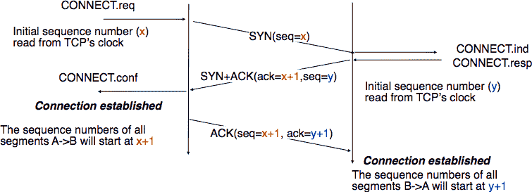

图 72 TCP 连接的建立#

在上图，客户端一旦接收到 SYN+ACK 段，就认为连接已经建立，而服务器在接收到 ACK 段后认为连接已经建立。客户端（服务器）发送的第一个数据段的序列号设置为 x+1（分别对应 y+1）。

注意

计算 TCP 的初始序列号

在原始的 TCP 规范[**RFC 793**](https://datatracker.ietf.org/doc/html/rfc793.html)中，每个 TCP 实体维护一个时钟来计算放置在 SYN 和 SYN+ACK 段中的初始序列号（ISN）。这使得 ISN 可预测，并引发了安全问题。典型的安全问题如下。考虑一个基于其 IP 地址信任主机的服务器，并允许系统管理员从该主机登录而不需要密码 [[4]](#frlogin)。现在考虑一个知道这种特定配置并能够发送具有客户端地址作为源地址的 IP 数据包的攻击者。他可以向服务器发送伪造的 TCP 段，但不会收到服务器的响应。如果他能够预测服务器选择的 ISN，他可以发送一个伪造的 SYN 段，并在稍后发送一个伪造的 ACK 段以确认接收服务器发送的 SYN+ACK 段。一旦 TCP 连接建立，他就可以用它向服务器发送任何命令。为了对抗这种攻击，当前的 TCP 实现向 ISN 添加随机性。在[**RFC 1948**](https://datatracker.ietf.org/doc/html/rfc1948.html)中提出的解决方案之一是将 ISN 计算如下

```sh
ISN = M + H(localhost, localport, remotehost, remoteport, secret). 
```

其中 M 是 TCP 时钟的当前值，H 是一个加密散列函数。localhost 和 remotehost（分别对应 localport 和 remoteport）是本地和远程主机的 IP 地址（端口号），secret 是只有服务器才知道的随机数。这种方法允许服务器同时为不同的客户端使用不同的 ISN。使用这种技术的首次实现进行的[测量](http://lcamtuf.coredump.cx/newtcp/)表明，正确实现它很困难，但今天的 TCP 实现现在生成良好的 ISN。

当然，服务器可以在收到 SYN 段后拒绝打开 TCP 连接。这种拒绝可能由于各种原因。可能没有监听 SYN 段目标端口的服务器进程。服务器可以始终拒绝来自该特定客户端的连接建立（例如，由于安全原因），或者服务器可能没有足够的资源在那时接受新的 TCP 连接。在这种情况下，服务器会回复一个设置了 RST 标志并包含接收到的 SYN 段序列号加一的确认号的 TCP 段。这在下图中说明。我们将在后面讨论 TCP RST 标志的其他用途（见 TCP 连接释放）。


图 73 对等方拒绝的 TCP 连接建立#

TCP 连接建立可以描述为下图中所示的四状态有限状态机。在这个有限状态机中，!X（分别对应?Y）表示在相应的转换期间传输段 X（分别接收段 Y）。Init 是初始状态。

> 
> 
> 图 74 TCP 连接建立 FSM

客户端主机从 Init 状态开始。然后它发送一个 SYN 段并进入 SYN Sent 状态，在那里它等待 SYN+ACK 段。然后，它回复一个 ACK 段并进入 Established 状态，在那里可以进行数据交换。另一方面，服务器主机从 Init 状态开始。当服务器进程开始监听目标端口时，底层的 TCP 实体创建一个 TCP 控制块和一个队列来处理传入的 SYN 段。在接收到 SYN 段后，服务器的 TCP 实体回复一个 SYN+ACK 并进入 SYN RCVD 状态。它保持在这个状态，直到它接收到一个确认其 SYN+ACK 段的 ACK 段，然后进入 Established 状态。

除了 TCP 连接建立有限状态机中的这两条路径之外，还存在第三条路径，对应于客户端和服务器都发送 SYN 段以打开 TCP 连接的情况[[5]](#ftcpboth)。在这种情况下，客户端和服务器发送 SYN 段并进入 SYN Sent 状态。在接收到来自另一主机的 SYN 段后，它们通过发送 SYN+ACK 段并进入 SYN RCVD 状态来回复。来自另一主机的 SYN+ACK 允许它过渡到 Established 状态。下图说明了这种同时建立 TCP 连接的情况。

](../_images/tcp-estab-sim.png)

图 75 TCP 连接同时建立#

如前所述，TCP 段可能包含可选的头部扩展。在 SYN 和 SYN+ACK 段中，这些选项用于协商一些参数和基本 TCP 规范扩展的使用。

在 TCP 连接建立过程中协商的第一个参数是最大段大小(MSS)。MSS 是 TCP 实体能够处理的最大段的大小。根据[**RFC 879**](https://datatracker.ietf.org/doc/html/rfc879.html)，所有 TCP 实现都必须能够接收包含 536 字节有效载荷的 TCP 段。然而，大多数 TCP 实现能够处理更大的段。这样的 TCP 实现使用 SYN/SYN+ACK 段中的 TCP MSS 选项来指示它们能够处理的最大段。MSS 值指示 TCP 段有效载荷的最大大小。客户端（分别对应服务器）在其 TCB 中存储服务器（分别对应客户端）宣布的 MSS 值。

在建立连接期间，TCP 选项的另一个用途是启用 TCP 扩展。例如，考虑[**RFC 1323**](https://datatracker.ietf.org/doc/html/rfc1323.html)（在 TCP 可靠数据传输中讨论）。[**RFC 1323**](https://datatracker.ietf.org/doc/html/rfc1323.html) 定义了支持时间戳和更大窗口的 TCP 扩展。如果客户端支持[**RFC 1323**](https://datatracker.ietf.org/doc/html/rfc1323.html)，它将在其 SYN 段中添加一个[**RFC 1323**](https://datatracker.ietf.org/doc/html/rfc1323.html)选项。如果服务器理解这个[**RFC 1323**](https://datatracker.ietf.org/doc/html/rfc1323.html)选项并希望使用它，它将在 SYN+ACK 段中回复一个[**RFC 1323**](https://datatracker.ietf.org/doc/html/rfc1323.html)选项，并在整个 TCP 连接中使用[**RFC 1323**](https://datatracker.ietf.org/doc/html/rfc1323.html)中定义的扩展。否则，如果服务器的 SYN+ACK 段不包含[**RFC 1323**](https://datatracker.ietf.org/doc/html/rfc1323.html)选项，客户端不允许在整个 TCP 连接中使用此扩展和相应的 TCP 头部选项。TCP 的选项机制是灵活的，它允许扩展 TCP 同时保持与旧实现的兼容性。

TCP 选项通过使用类型长度值格式进行编码，其中：

> +   第一个字节表示选项的类型。
> +   
> +   第二个字节表示选项的总长度（包括前两个字节）以字节为单位。
> +   
> +   剩余的字节是针对每种选项类型的特定字节。

[**RFC 793**](https://datatracker.ietf.org/doc/html/rfc793.html) 定义了必须由所有 TCP 实现理解的 TCP 最大分段大小（MSS）选项。此选项（类型 2）长度为 4 字节，包含一个 16 位字，表示发送 SYN 段的数据发送者支持的 MSS。MSS 选项只能在设置了 SYN 标志的 TCP 段中使用。

[**RFC 793**](https://datatracker.ietf.org/doc/html/rfc793.html) 还定义了两个所有 TCP 实现都必须支持的特殊选项。第一个选项是选项结束。它编码为一个值为 0x00 的单字节，可以用来确保 TCP 头部扩展以 32 位边界结束。无操作选项，编码为一个值为 0x01 的单字节，当 TCP 头部扩展包含多个应按 32 位边界对齐的 TCP 选项时可以使用。所有其他选项 [[7]](#ftcpoptions) 都使用 TLV 格式进行编码。

注意

稳健性原则

TCP 实现处理 TCP 选项是稳健性原则的许多应用之一，这一原则通常归功于[Jon Postel](https://www.postel.org/postel.html)，常被引用为“在接受方面要宽容，在发送方面要保守” [**RFC 1122**](https://datatracker.ietf.org/doc/html/rfc1122.html)。

关于 TCP 选项，健壮性原则意味着 TCP 实现应该能够接受它不理解 TCP 选项，特别是在接收到的 SYN 段中，并且它应该能够解析任何接收到的段而不会崩溃，即使该段包含未知的 TCP 选项。此外，服务器不应在 SYN+ACK 段或之后发送客户端在 SYN 段中未提出的选项。

## TCP 可靠数据传输#

原始 TCP 数据传输机制在[**RFC 793**](https://datatracker.ietf.org/doc/html/rfc793.html)中定义。基于在日益增长的全球互联网上使用 TCP 的经验，TCP 规范的这一部分已被更新和改进多次，始终同时保持与旧版 TCP 实现的向后兼容性。在本节中，我们回顾 TCP 使用的主要数据传输机制。

TCP 是一种基于窗口的传输协议，它提供双向字节流服务。这给 TCP 头部字段和 TCP 使用的机制带来了一些影响。TCP 头部的三个字段是：

> +   序列号。TCP 使用 32 位序列号。放置在包含数据的 TCP 段头部的序列号是 TCP 段有效载荷的第一个字节的序列号。
> +   
> +   确认号。TCP 使用累积的肯定确认。每个 TCP 段包含发送确认方期望从远程主机接收的下一个字节的序列号。理论上，确认号仅在 TCP 头部的 ACK 标志被设置时有效。在实践中，几乎所有[[8]](#fackflag) TCP 段都有其 ACK 标志被设置。
> +   
> +   窗口。TCP 接收方使用这个 16 位字段来指示当前接收窗口的大小，以字节为单位。

注意

传输控制块

对于每个建立的 TCP 连接，TCP 实现必须维护一个传输控制块(TCB)。TCB 包含在此连接上发送和接收段所需的所有信息[**RFC 793**](https://datatracker.ietf.org/doc/html/rfc793.html)。这包括[[9]](#ftcpurgent)：

> +   本地 IP 地址
> +   
> +   远程 IP 地址
> +   
> +   本地 TCP 端口号
> +   
> +   远程 TCP 端口号
> +   
> +   TCP FSM 的当前状态
> +   
> +   最大段大小（MSS）
> +   
> +   snd.nxt : 字节流中下一个字节的序列号（你发送的新数据段的第一字节使用此序列号）
> +   
> +   snd.una : 已发送但尚未被确认的最早序列号
> +   
> +   snd.wnd : 发送窗口的当前大小（以字节为单位）
> +   
> +   rcv.nxt : 预期从远程主机接收的下一个字节的序列号
> +   
> +   rcv.wnd : 远程主机宣布的接收窗口的当前大小
> +   
> +   发送缓冲区：用于存储所有未确认数据的缓冲区
> +   
> +   接收缓冲区：一个用于存储从远程主机接收但尚未交付给用户的所有数据的缓冲区。数据可能存储在接收缓冲区中，要么是因为它没有按顺序接收，要么是因为用户处理数据太慢。

原始的 TCP 规范可以概括为一个提供字节流服务的传输协议，并使用带有选择性重传接收策略的回退 N。

要在已建立的连接上发送新数据，TCP 实体对相应的 TCB 执行以下操作。它首先检查发送缓冲区中的数据是否不大于远程主机声明的接收窗口（rcv.wnd）。如果窗口未满，则最多放置 MSS 字节的数据在 TCP 段的负载中。此段的序列号是负载的第一个字节的序列号。它被设置为第一个可用的序列号，snd.nxt，并且 snd.nxt 增加 TCP 段负载的长度。此段的确认号设置为 rcv.nxt 的当前值，TCP 段的窗口字段根据接收缓冲区的当前占用情况计算。数据保留在发送缓冲区中，以防稍后需要重传。

当接收到设置 ACK 标志的 TCP 段时，执行以下操作。rcv.wnd 设置为接收到的段的窗口字段值。确认号与 snd.una 进行比较。新确认的数据从发送缓冲区中删除，并且 snd.una 更新。如果 TCP 段包含数据，则将序列号与 rcv.nxt 进行比较。如果它们相等，则段是按顺序接收的，并且可以将数据交付给用户，并且 rcv.nxt 更新。检查接收缓冲区的内容，以查看是否可以将其他已存在于该缓冲区中的数据按顺序交付给用户。如果是这样，则 rcv.nxt 再次更新。否则，将段的负载放置在接收缓冲区中。

### 分段传输策略#

在像 TCP 这样的提供字节流的传输协议中，[**RFC 793**](https://datatracker.ietf.org/doc/html/rfc793.html)中留下作为实现选择的实际问题是决定何时发送包含数据的新的 TCP 段。有两种简单且极端的实现选择。第一种实现选择是用户请求传输一些数据时立即发送 TCP 段。这允许 TCP 提供低延迟服务。然而，如果用户逐字节发送数据，TCP 会将每个用户字节放置在包含 20 字节 TCP 头部的段中 [[10]](#fnagleip)。这在广域网络中是一个巨大的开销，是不可接受的。第二种简单的解决方案是在用户产生 MSS 字节的数据后仅传输新的 TCP 段。这种解决方案减少了开销，但代价是可能非常高的延迟。

这个问题的优雅解决方案是由约翰·纳格尔在[**RFC 896**](https://datatracker.ietf.org/doc/html/rfc896.html)中提出的。约翰·纳格尔观察到，由 TCP 头部引起的开销在广域连接中是一个问题，但在通常可用带宽更高的局域网连接中则较少。他提出了以下规则，以决定在用户产生新的数据段或接收到新的确认段时发送新的数据段。

```sh
if rcv.wnd >= MSS and len(data) >= MSS:
    send one MSS-sized segment
else:
    if there are unacknowledged data:
        place data in buffer until acknowledgment has been received
    else:
        send one TCP segment containing all buffered data (up to rcv.wnd) 
```

第一条规则确保用于大量数据传输的 TCP 连接始终发送完整的 TCP 段。第二条规则在每个往返时间发送一个部分填充的 TCP 段。

这个算法被称为纳格尔算法，在所有 TCP 实现中只需要几行代码。这些代码行对 TCP/IP 网络中交换的数据包有巨大影响。研究人员通过捕获和分析通过给定链路的所有数据包来分析数据包大小的分布。这些研究表明了几个重要结果：

> +   在 TCP/IP 网络中，很大一部分的数据包是只包含确认的 TCP 段。这些数据包通常占通过研究链路的数据包的 40-50%
> +   
> +   在 TCP/IP 网络中，大多数字节是在长数据包中交换的，通常是包含大约 1440 字节有效载荷的包，这是连接到以太网的主机的默认 MSS，以太网是最流行的局域网类型。

[最近测量](http://www.caida.org/research/traffic-analysis/pkt_size_distribution/graphs.xml)表明，这些数据包大小分布在今天互联网中仍然有效，尽管数据包分布趋于双峰，小数据包对应于 TCP 纯确认，而大数据包（1440 字节）携带大部分用户数据 [[SMASU2012]](../bibliography.html#smasu2012)。

### 段传输策略#

在提供字节流的传输协议，如 TCP 中，[**RFC 793**](https://datatracker.ietf.org/doc/html/rfc793.html)中留下作为实现选择的实际问题是决定何时发送包含数据的新的 TCP 段。有两种简单且极端的实现选择。第一种实现选择是用户请求传输一些数据时立即发送 TCP 段。这允许 TCP 提供低延迟服务。然而，如果用户逐字节发送数据，TCP 会将每个用户字节放置在包含 20 字节 TCP 头部的段中 [[10]](#fnagleip)。这在广域网络中是一个巨大的开销，是不可接受的。第二种简单的解决方案是在用户产生 MSS 字节的数据后，才传输新的 TCP 段。这种解决方案减少了开销，但代价是可能非常高的延迟。

约翰·纳格尔在[**RFC 896**](https://datatracker.ietf.org/doc/html/rfc896.html)中提出了这个问题的优雅解决方案。约翰·纳格尔观察到，TCP 头部的开销在广域连接中是一个问题，但在通常可用带宽更高的局域网连接中则较少。他提出了以下规则，当用户产生新的数据段或接收到新的 ack 段时，决定是否发送新的数据段。

```sh
if rcv.wnd >= MSS and len(data) >= MSS:
    send one MSS-sized segment
else:
    if there are unacknowledged data:
        place data in buffer until acknowledgment has been received
    else:
        send one TCP segment containing all buffered data (up to rcv.wnd) 
```

第一条规则确保用于大量数据传输的 TCP 连接始终发送完整的 TCP 段。第二条规则在每个往返时间内发送一个部分填充的 TCP 段。

这个算法被称为纳格尔算法，在所有 TCP 实现中只需要几行代码。这些代码行对 TCP/IP 网络中交换的包产生了巨大影响。研究人员通过捕获和分析通过给定链路的所有包来分析包大小分布。这些研究表明了几个重要结果：

> +   在 TCP/IP 网络中，大部分的包是只包含确认信息的 TCP 段。这些包通常占通过研究链路传输的包的 40-50%。
> +   
> +   在 TCP/IP 网络中，大部分的字节是在长包中交换的，通常是包含大约 1440 字节有效载荷的包，这是连接到以太网的主机的默认 MSS，以太网是最流行的局域网类型。

[最近的研究测量](http://www.caida.org/research/traffic-analysis/pkt_size_distribution/graphs.xml)表明，这些包大小分布仍然在今天的互联网中有效，尽管包分布趋于双峰，小包对应于 TCP 纯确认，而大 1440 字节的包携带大部分用户数据 [[SMASU2012]](../bibliography.html#smasu2012)。

## TCP 窗口#

从性能角度来看，原始 TCP 规范的一个主要限制是 TCP 头中的 16 位窗口字段。因为这个字段指示当前接收窗口的字节数，它将 TCP 接收窗口限制在 65535 字节。当 TCP 被设计时，这个限制并不是一个严重的问题，因为当时高速广域网络提供的最大带宽为 56 kbps。然而，在今天的网络中，这个限制已经不再可接受。下表提供了 TCP 连接在 64 KBytes 窗口大小下，根据连接的往返时间所能实现的粗略 [[11]](#faveragebandwidth) 最大吞吐量。

| RTT | 最大吞吐量 |
| --- | --- |
| 1 毫秒 | 524 Mbps |
| 10 毫秒 | 52.4 Mbps |
| 100 毫秒 | 5.24 Mbps |
| 500 毫秒 | 1.05 Mbps |

为了解决这个问题，提出了一个向后兼容的扩展，允许 TCP 使用更大的接收窗口，这在 [**RFC 1323**](https://datatracker.ietf.org/doc/html/rfc1323.html) 中被提出。如今，大多数 TCP 实现都支持这个选项。基本思想是，而不是将 snd.wnd 和 rcv.wnd 作为 16 位整数存储在 TCB 中，它们应该作为 32 位整数存储。因为 TCP 段头只包含 16 位来放置窗口字段，所以不可能在每个发送的 TCP 段中复制 snd.wnd 的值。相反，头包含 snd.wnd >> S，其中 S 是在连接建立期间协商的缩放因子（ \(0 \le S \le 14\））。客户端将其提议的缩放因子作为 TCP 选项添加到 SYN 段中。如果服务器支持 [**RFC 1323**](https://datatracker.ietf.org/doc/html/rfc1323.html)，它将在 SYN+ACK 段中放置它用于宣传其自己的接收窗口的缩放因子。本地和远程缩放因子包含在 TCB 中。如果服务器不支持 [**RFC 1323**](https://datatracker.ietf.org/doc/html/rfc1323.html)，它将忽略接收到的选项，并且不应用缩放。

通过使用在 [**RFC 1323**](https://datatracker.ietf.org/doc/html/rfc1323.html) 中定义的窗口缩放扩展，TCP 实现可以使用高达 1 GByte 的接收缓冲区。有了这样的接收缓冲区，单个 TCP 连接可以达到的最大吞吐量变为：

| RTT | 最大吞吐量 |
| --- | --- |
| 1 毫秒 | 8590 Gbps |
| 10 毫秒 | 859 Gbps |
| 100 毫秒 | 86 Gbps |
| 500 毫秒 | 17 Gbps |

这些吞吐量在今天的网络中是可以接受的。然而，已经有服务器拥有 10 Gbps 的接口……早期的 TCP 实现具有固定的接收和发送缓冲区 [[12]](#ftcphosts)。今天的高性能实现能够自动调整发送和接收缓冲区的大小，以更好地支持高带宽流 [[SMM1998]](../bibliography.html#smm1998)。

## TCP 的重传超时#

在像 TCP 这样的回退 N 协议中，为了实现良好的性能，必须正确设置重传超时。一方面，如果重传超时过早到期，则已正确接收的段的重传会浪费带宽。另一方面，如果重传超时过晚到期，则发送者空闲等待重传超时到期会浪费带宽。

重传超时的良好设置明显取决于对每个 TCP 连接往返时间的准确估计。往返时间在不同 TCP 连接之间可能不同，也可能在单个连接的生命周期内发生变化。例如，下面的图显示了两个主机在 45 秒期间往返时间的演变。


图 76 两个主机之间往返时间的演变#

测量 TCP 连接上的往返时间最简单的方法是测量数据段传输和相应确认接收之间的延迟[[13]](#frttmes)。如图所示，在没有段丢失的情况下，这种测量方法效果良好。


图 77 如何测量往返时间？#

然而，当数据段丢失时，如图中底部部分所示，测量结果是不确定的，因为发送者无法确定接收到的确认是来自段 123 的第一次传输还是其重传。使用不正确的往返时间估计可能导致重传超时值不正确。因此，Phil Karn 和 Craig Partridge 在[[KP91]](../bibliography.html#kp91)中提出，在重传期间忽略往返时间测量。

为了避免在段重传时估计往返时间的这种歧义，最近的 TCP 实现依赖于在[**RFC 1323**](https://datatracker.ietf.org/doc/html/rfc1323.html)中定义的时间戳选项。此选项允许 TCP 发送者在每个发送的 TCP 段中放置两个 32 位时间戳。第一个时间戳，TS 值（TSval），由段发送者选择。例如，它可以是其实时时钟的当前值[[14]](#ftimestamp)。第二个值，TS 回显应答（TSecr），是从远程主机接收到的最后一个 TSval，并存储在 TCB 中。下面的图显示了如何利用此时间戳选项在存在重传时消除往返时间测量的歧义。


图 78 使用 [**RFC 1323**](https://datatracker.ietf.org/doc/html/rfc1323.html) 时间戳选项消除往返时间测量的歧义#

一旦收集了给定 TCP 连接的往返时间测量值，TCP 实体必须计算重传超时。由于往返时间测量值可能在连接的生命周期内发生变化，重传超时也可能发生变化。在连接开始时 [[15]](#ftcbtouch)，发送 SYN 段的 TCP 实体不知道到达远程主机的往返时间，初始重传超时通常设置为 3 秒 [**RFC 2988**](https://datatracker.ietf.org/doc/html/rfc2988.html)。

在 [**RFC 793**](https://datatracker.ietf.org/doc/html/rfc793.html) 中提出的原始 TCP 规范建议在 TCB 中包含两个额外的变量：

> +   srtt：平滑往返时间计算为 $ srtt=(\alpha \times srtt)+( (1-\alpha) \times rtt) $，其中 $ rtt $ 是根据上述程序测量的往返时间，$ \alpha $ 是平滑因子（例如 0.8 或 0.9）
> +   
> +   rto：重传超时时间计算为 $ rto=\min(60,\max(1,\beta \times srtt)) $，其中 $ \beta $ 用于考虑延迟方差（值：1.3 到 2.0）。常数 60 和 1 用于确保 rto 不超过一分钟也不小于 1 秒。

然而，在实践中，这个重传超时的计算并没有很好地工作。主要问题是计算出的 rto 没有正确地考虑测量往返时间的变化。Van Jacobson 在他的开创性论文 [[Jacobson1988]](../bibliography.html#jacobson1988) 中提出了一种改进的算法来计算 rto，并在 BSD Unix 分发中实现了它。现在，这个算法是 TCP 标准的一部分 [**RFC 2988**](https://datatracker.ietf.org/doc/html/rfc2988.html)。

Jacobson 的算法使用两个状态变量，srtt（平滑往返时间）和 rttvar（rtt 方差的估计），以及两个参数：$ \alpha $ 和 $ \beta $。当 TCP 连接开始时，第一个 rto 设置为 3 秒。当有第一个 rtt 估计值可用时，srtt、rttvar 和 rto 的计算如下：

```sh
srtt = rtt
rttvar = rtt/2
rto = srtt + 4*rttvar 
```

然后，当收集到其他 rtt 测量值时，srtt 和 rttvar 的更新如下：

> $ rttvar=(1-\beta) \times rttvar + \beta \times |srtt - rtt| $
> 
> $ srtt=(1-\alpha) \times srtt + \alpha \times rtt $
> 
> $ rto=srtt + 4 \times rttvar $

建议的参数值为 $ \alpha=\frac{1}{8} $ 和 $ \beta=\frac{1}{4} $。这允许在内核中实现的 TCP 实现通过使用移位操作而不是更昂贵的浮点运算来执行 rtt 计算 [[Jacobson1988]](../bibliography.html#jacobson1988)。下面的图示说明了在 rtt 变化时 rto 的计算。

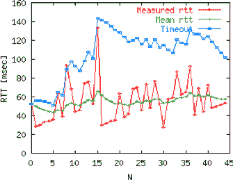(../_images/tcp-rto.png)

图 79 示例计算 rto#

## 高级重传策略#

默认的回退 N 重传策略在[**RFC 793**](https://datatracker.ietf.org/doc/html/rfc793.html)中定义。当重传计时器超时时，TCP 重新传输第一个未确认的段（即序列号 snd.una 的段）。在每次重传超时到期后，[**RFC 2988**](https://datatracker.ietf.org/doc/html/rfc2988.html)建议将重传超时的值加倍。这被称为指数退避。在重传后加倍重传超时被包含在 TCP 中，以处理诸如网络/接收器过载和重传超时初始估计不正确等问题。如果相同的段被重传多次，重传超时在每次重传后会加倍，直到达到配置的最大值。[**RFC 2988**](https://datatracker.ietf.org/doc/html/rfc2988.html)建议最大重传超时至少为 60 秒。一旦重传超时达到这个配置的最大值，远程主机被认为不可达，TCP 连接被关闭。

这种重传策略是基于在互联网上使用 TCP 的经验而细化的。第一次细化是对发送确认所使用的策略进行了澄清。由于 TCP 使用尾随，发送确认的最简单和成本最低的方法是将它们放在发送到另一方向的数据段中。然而，很少有应用层协议同时双向交换数据，因此这种方法很少有效。对于只向一个方向发送数据段的程序，远程 TCP 实体返回空 TCP 段，其中唯一有用的信息是它们的确认号。如果对每个接收到的数据段都发送纯 ACK 段，这可能会在广域网中造成大量开销。大多数 TCP 实现都使用延迟确认策略。这种策略确保尽可能使用尾随，如果没有丢失，则在每两个接收到的数据段之间发送纯 ACK 段。当有丢失或重排序时，ACK 段对发送者来说更重要，它们会立即发送[**RFC 813**](https://datatracker.ietf.org/doc/html/rfc813.html) [**RFC 1122**](https://datatracker.ietf.org/doc/html/rfc1122.html)。这种策略依赖于一个具有短延迟（例如 50 毫秒）的新计时器以及在 TCB 中的一个额外标志。它可以如下实现。

```sh
reception of a data segment:
    if pkt.seq == rcv.nxt:  # segment received in sequence
        if delayed_ack:
            send pure ack segment
            delayed_ack = False
            ack_timer.cancel()
        else:
            delayed_ack = True
            ack_timer.start()
    else:  # out of sequence segment
        send pure ack segment
        if delayed_ack:
            delayed_ack = False
            ack_timer.cancel()

transmission of a data segment:  # piggyback ack
    if delayed_ack:
        delayed_ack = False
        ack_timer.cancel()

acktimer expiration:
    send pure ack segment
    delayed_ack = False 
```

由于这种延迟确认策略，在大量传输期间，TCP 实现通常每接收两个 TCP 段就确认一次。

TCP 使用的默认 go-back-n 重传策略具有易于实现的优点，尤其是在接收方，但当出现丢包时，go-back-n 策略的性能低于选择性重传策略。TCP 开发者设计了几个 TCP 扩展，以允许它使用选择性重传策略，同时保持与较老 TCP 实现的向后兼容性。这些 TCP 扩展假设接收方能够缓冲它接收到的乱序段。

提出的第一个扩展是快速重传启发式算法。这个扩展可以在 TCP 发送方上实现，因此不需要对协议进行任何更改。它只假设 TCP 接收方能够缓冲乱序段。

从性能角度来看，TCP 重传超时的问题之一是，当出现孤立段丢失时，TCP 发送方通常会空闲等待重传超时的到期。这种孤立丢失在全局互联网中很常见[[Paxson99]](../bibliography.html#paxson99)。自 20 世纪 90 年代初以来，许多 TCP 实现中已经包含了一种处理孤立丢失而不等待重传超时到期的启发式算法。为了理解这个启发式算法，让我们考虑下面的图，它显示了当孤立段丢失时在 TCP 连接上交换的段。


图 80 检测孤立段丢失#

如上图所示，当一个孤立段丢失时，发送方会收到几个重复确认，因为 TCP 接收方在接收到乱序段时会立即发送纯确认。重复确认是一个包含与先前段相同确认号的确认。单个重复确认并不一定意味着一个段已丢失，因为段的重排序也可能导致重复确认。测量[[Paxson99]](../bibliography.html#paxson99)表明，段的重排序在互联网中很常见。基于这些观察，快速重传启发式算法已被包含在大多数 TCP 实现中。它可以如下实现。

```sh
ack arrival:
    if tcp.ack == snd.una:  # duplicate acknowledgment
        dupacks += 1
        if dupacks == 3:
            retransmit segment(snd.una)
    else:
        dupacks = 0
        # process acknowledgment 
```

这个启发式算法需要在 TCB（dupacks）中添加一个额外的变量。大多数实现将触发重传的默认重复确认数设置为 3。现在，它已成为 TCP 标准规范的一部分[**RFC 2581**](https://datatracker.ietf.org/doc/html/rfc2581.html)。只要丢失了孤立的段，并且当前窗口足够大，允许发送方发送三个重复确认，快速重传启发式算法就能提高 TCP 的性能。

下图说明了快速重传启发式算法的操作。


图 81 TCP 快速重传启发式算法#

当丢包不是孤立的或者窗口较小时，快速重传启发式算法的性能会下降。在这样的环境中，有必要允许 TCP 发送者使用选择性重传策略而不是默认的回退 N 策略。实现选择性重传需要修改 TCP 协议，因为接收器需要能够通知发送者它已经接收的乱序段。这可以通过使用在[**RFC 2018**](https://datatracker.ietf.org/doc/html/rfc2018.html)中定义的选择性确认（SACK）选项来完成。这个 TCP 选项在 TCP 连接建立期间协商。如果两个 TCP 主机都支持此选项，接收者可以将 SACK 块附加到它发送的段中。SACK 块允许 TCP 接收者指示它已正确接收但顺序错误的块。下面的图示说明了 SACK 块的使用情况。


图 82 TCP 选择性确认#

SACK 选项包含一个或多个块。一个块对应于块左边缘和右边缘之间的所有序列号。块的两侧在 SACK 选项中以 32 位数字（与 TCP 序列号大小相同）编码。由于 SACK 选项包含一个字节用于编码其类型和一个字节用于其长度，因此包含 b 个块的 SACK 选项被编码为$ 2+8 \times b $个字节的序列。在实践中，SACK 选项的大小可能存在问题，因为可选的 TCP 头部扩展不能超过 40 字节。由于 SACK 选项通常与[**RFC 1323**](https://datatracker.ietf.org/doc/html/rfc1323.html)时间戳扩展结合使用，这意味着 TCP 段通常不能包含超过三个 SACK 块。这种限制意味着 TCP 接收器不能总是将其发送的 SACK 选项中包含所有已接收块的信息。

为了处理 SACK 选项的有限大小，当前接收缓冲区中拥有超过 3 个块的 TCP 接收器必须选择要放入 SACK 选项中的块。一个很好的启发式方法是放入 SACK 选项中最近改变的块，因为发送者可能已经知道较旧的块。

当发送方收到一个 SACK 选项，表明一个新的数据块和可能的数据段丢失时，它通常不会立即重新传输丢失的数据段。为了处理重排序，TCP 发送方可以使用类似于快速重传的启发式方法，只在收到三个指示此间隔的 SACK 选项后，才重新传输间隔。需要注意的是，SACK 选项不取代 TCP 头部的确认号。TCP 发送方只能在 TCP 的累积确认已确认数据后，才能从其发送缓冲区中删除数据。这种设计选择有两个原因。首先，它允许接收方在内存不足时丢弃其接收缓冲区的一部分，而不会丢失数据。其次，由于 SACK 选项不是可靠传输的，因此仍然需要累积确认来处理仅携带 SACK 信息的 ACK 数据段的丢失。因此，SACK 选项仅作为提示，允许发送方优化其重传。

如前所述，TCP 时间戳选项[**RFC 1323**](https://datatracker.ietf.org/doc/html/rfc1323.html)在收集往返时间测量时防止了歧义。它在今天的高带宽网络中扮演着另一个非常重要的角色。由于 TCP 使用 32 位长的序列号，序列号在传输 4 GBytes 的数据后会回绕。在 10 Gbps 和即将到来的 100 Gbps 接口上，TCP 只需要在几秒钟内传输，然后就可以重新使用相同的序列号。考虑到最大段生存期仍然是 2 分钟，属于同一 TCP 连接的几个数据包可能会使用相同的序列号。如果其中任何一个数据包在网络中严重延迟，它可能会与具有相同 TCP 序列号的数据包同时出现。为了防止这个问题，大多数现代 TCP 实现会在传输时将 TCP 时间戳选项与每个数据段关联。当 TCP 堆栈接收到 TCP 数据段时，它会检查其 TCP 时间戳是否有效，如果不是，则丢弃该数据段[**RFC 7323**](https://datatracker.ietf.org/doc/html/rfc7323.html)。

## TCP 连接释放#

TCP，像大多数面向连接的传输协议一样，支持两种类型的连接释放：

> +   优雅连接释放，其中每个 TCP 用户在传输所有数据后都可以释放自己的数据传输方向
> +   
> +   突然连接释放，其中任一用户关闭两个方向的数据传输，或者一个 TCP 实体被迫关闭连接（例如，因为远程主机不再回复或由于资源不足）

突然连接释放机制非常简单，依赖于单个数据段设置 RST 位。包含 RST 位的数据段可以出于以下原因发送：

> +   接收到一个非存在的 TCP 连接的非-SYN 数据段[**RFC 793**](https://datatracker.ietf.org/doc/html/rfc793.html)
> +   
> +   通过扩展，一些实现会对在现有连接上接收到的但具有无效头部的段响应一个 RST 段 [**RFC 3360**](https://datatracker.ietf.org/doc/html/rfc3360.html)。这导致相应的连接被关闭，并导致了安全攻击 [**RFC 4953**](https://datatracker.ietf.org/doc/html/rfc4953.html)
> +   
> +   通过扩展，一些实现会在需要关闭现有 TCP 连接时发送 RST 段（例如，因为没有足够的资源来支持此连接或因为远程主机被认为不可达）。测量表明，这种 TCP RST 的使用非常普遍 [[AW05]](../bibliography.html#aw05)

当一个 TCP 实体发送 RST 段时，它应包含连接的当前序列号值（如果它不属于任何现有连接，则为 0）并且确认号应设置为在此连接上期望的下一个顺序序列号。

注意

TCP RST 战争

TCP 实现的设计者应确保两个 TCP 实体永远不会进入一个 TCP RST 战争，其中主机 A 发送 RST 段作为对主机 B 发送的先前 RST 段的响应，而主机 B 是作为对主机 A 发送的 TCP RST 段的响应而发送该 RST 段的……为了避免这种不携带数据的 RST 段的无穷交换，TCP 实体*永远*不允许对另一个 RST 段发送 RST 段。

终止 TCP 连接的正常方式是使用优雅的 TCP 连接释放。此机制使用 TCP 头部的 FIN 标志，并允许每个主机释放其自己的数据传输方向。至于 SYN 标志，TCP 头部中 FIN 标志的使用消耗一个序列号。图 TCP 连接释放的 FSM 显示了在释放 TCP 连接时使用的 TCP FSM 的部分。

> 
> 
> 图 83 TCP 连接释放的 FSM

从已建立状态开始，通过此 FSM 有两条主要路径。

第一条路径是当主机接收到一个带有序列号 x 和 FIN 标志的段时。FIN 标志的使用表明序列号 x 之前的字节是远程主机发送的字节流中的最后一个字节。一旦所有数据都已发送给用户，TCP 实体发送一个 ACK 段，其 ack 字段设置为 $ (x+1) \pmod{2^{32}} $ 以确认 FIN 段。FIN 段受到与正常 TCP 段相同的重传机制。特别是，其传输受到重传计时器的保护。此时，TCP 连接进入 CLOSE_WAIT 状态。在此状态下，主机仍然可以向远程主机发送数据。一旦所有数据都已发送，它发送一个 FIN 段并进入 LAST_ACK 状态。在此状态下，TCP 实体等待其 FIN 段的确认。它可能仍然会重传未确认的数据段，例如，如果重传计时器到期。收到 FIN 段确认后，TCP 连接完全关闭，其 TCB 可以被丢弃。

第二条路径是当主机已发送所有数据时。假设最后一个发送的序列号是 z。然后，主机发送一个序列号为 $ (z+1) \pmod{2^{32}} $ 的 FIN 段并进入 FIN_WAIT1 状态。在此状态下，它可以重传未确认的段，但不能发送新的数据段。它等待其 FIN 段的确认（即序列号 $ (z+1) \pmod{2^{32}} $），但可能收到远程主机发送的 FIN 段。在第一种情况下，TCP 连接进入 FIN_WAIT2 状态。在此状态下，直到接收到 FIN 段之前，仍然接受来自远程主机的新的数据段。一旦在 FIN 段之前接收到的所有数据都已发送给用户，并且连接进入 TIME_WAIT 状态，就发送此 FIN 段的确认。在第二种情况下，收到一个 FIN 段，并且一旦从远程主机接收到的所有数据都已发送给用户，连接进入 Closing 状态。在此状态下，不能发送新的数据段，并且主机在进入 TIME_WAIT 状态之前等待其 FIN 段的确认。

TIME_WAIT 状态与 TCP FSM 的其他状态不同。TCP 实体在发送了 TCP 连接上的最后一个 ACK 段后进入此状态。这个段向远程主机指示它发送的所有数据都已正确接收，并且它可以安全地释放 TCP 连接并丢弃相应的 TCB。在发送了最后一个 ACK 段之后，TCP 连接进入 TIME_WAIT 状态，并保持此状态$ 2*MSL $秒。在此期间，连接的 TCB 被维护。这确保了发送最后一个 ACK 段的 TCP 实体保持足够的状态，以便在 ACK 段丢失时能够重新传输此段。$ 2*MSL $秒的延迟确保了任何连接上的重复段都会被正确处理，而不会导致发送 RST 段。如果没有 TIME_WAIT 状态和$ 2*MSL $秒的延迟，当最后一个 ACK 段丢失时，连接释放将不会是优雅的。

注意

繁忙 TCP 服务器上的 TIME_WAIT 状态

在 TIME_WAIT 状态下的$ 2*MSL $秒延迟是拥有数千个同时打开的 TCP 连接的服务器上的一项重要操作问题 [[FTY99]](../bibliography.html#fty99)。以一个每秒处理 10,000 个 TCP 连接的繁忙的 Web 服务器为例。如果这些连接中的每一个都保持在 TIME_WAIT 状态 4 分钟，这意味着服务器在任何时候都需要维护超过 200 万个 TCB。因此，一些 TCP 实现更喜欢通过发送一个 RST 段来突然释放连接 [[AW05]](../bibliography.html#aw05)，并立即丢弃相应的 TCB。然而，如果 RST 段丢失，远程主机将继续维护一个不再存在的连接的 TCB。这种优化减少了发送 RST 段的主机维护的 TCB 数量，但可能会以远程主机在 RST 段丢失时处理增加为代价。

脚注
