# QUIC

> 原文：[`4ed.computer-networking.info/syllabus/default/hosts/quic.html`](https://4ed.computer-networking.info/syllabus/default/hosts/quic.html)

QUIC [**RFC 9000**](https://datatracker.ietf.org/doc/html/rfc9000.html) 是 IETF 标准化的最新传输协议。QUIC 与其他传输协议（如运行在 IP 之上的 TCP、SCTP 或 DCCP）相比，具有以下几个显著特点：

> +   QUIC 支持多个字节流，如 SCTP
> +   
> +   QUIC 包含了各种可靠性和拥塞控制机制，如 TCP
> +   
> +   QUIC 直接集成了 TLS 1.3 的安全特性 [**RFC 8446**](https://datatracker.ietf.org/doc/html/rfc8446.html)，而不是简单地在上层传输层之上叠加 TLS
> +   
> +   QUIC 也可以用来携带数据报 [**RFC 9221**](https://datatracker.ietf.org/doc/html/rfc9221.html)
> +   
> +   与运行在 IP 之上的其他传输协议（如 TCP、SCTP 或 DCCP）不同，QUIC 在 UDP 之上运行

从纯粹的分层角度来看，QUIC 可以如图 84 所示 图 84 展示。

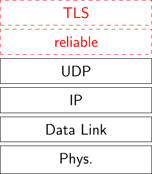

图 84 QUIC 在 TCP/IP 堆栈中的位置

在另一个传输协议之上分层一个传输协议是不寻常的。QUIC 选择这种解决方案主要有两个原因。首先，在大多数操作系统上，任何应用程序都可以直接使用 UDP，而不需要特殊权限。这意味着 QUIC 可以作为一个库实现，可以直接包含在应用程序中。这与 TCP、SCTP 或 DCCP 的实现形成对比，它们的实现要么是操作系统内核的一部分，要么需要特殊权限来发送原始数据包。第二个动机是 UDP（以及 TCP 和 ICMP）被大多数中间盒支持，而其中许多中间盒阻止了在设计时未定义的传输协议 [[BWFEDG2020]](../bibliography.html#bwfedg2020)。

有必要注意的是，使用 UDP，QUIC 稍微增加了其开销。每个 QUIC 数据包携带 8 字节的首部，包含源和目的端口、长度字段和校验和。与 TCP 相比，UDP 也带来了性能上的惩罚。在过去几十年中，操作系统内核已经通过 TCP 分段卸载（TSO）和通用接收卸载（GRO）等技术进行了优化，以提供高带宽。同时，UDP 的实现没有发生显著变化，大多数优化集中在请求-响应服务（如 DNS 服务器）上。最近，一些努力（特别是在 Linux 上）已经改变了这种状况，旨在提高 UDP 的原始吞吐量 [[DD2018]](../bibliography.html#dd2018)。

## 帧和包#

QUIC 与经典协议（如 TCP 或 UDP）之间存在一个重要的区别。TCP 和 UDP 发送由头部和随后的字节序列组成的段，这些字节序列构成了有效载荷。相比之下，类似于 SCTP，一个 QUIC 数据包包含一个头部，后面跟着一个或多个帧。QUIC 头部比 TCP 头部简单得多，也更短。它只携带所有 QUIC 数据包所需的信息。我们将在后面描述短和长 QUIC 头部。每个 QUIC 头部都以一个包含一些标志和一个 32 位版本字段的 1 字节类型字段开始。QUIC 定义了不同类型的帧，我们将在本章中讨论。某些类型的 QUIC 帧携带用户数据。其他类型的 QUIC 帧携带控制信息。其中一些帧仅在握手期间使用，而其他帧（如确认）可以在任何时候发送。每个 QUIC 帧是一系列字节，以一个 1 字节类型字段开始。图 85 显示了一个包含两个帧的 QUIC 数据包，该数据包位于 UDP 数据报内部。即使这种对齐对 图 85 有利，QUIC 头部或 QUIC 帧也不需要对齐在 32 位边界上。一个需要注意的重要点是，QUIC 数据包可以以任何顺序混合数据和控制帧。

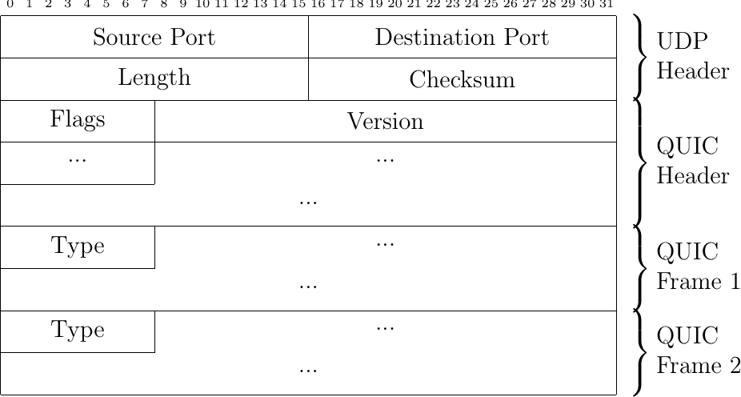

图 85 在 UDP 数据报内部发送的 QUIC 数据包包含一个或多个 QUIC 帧

## 连接建立#

QUIC 使用四次握手来创建 QUIC 连接。图 86 描述了此握手过程。QUIC 握手有三个主要目的。首先，它允许协商用于加密和验证随后在连接上发送的数据包所需的加密密钥。这主要使用 TLS 1.3 [**RFC 8446**](https://datatracker.ietf.org/doc/html/rfc8446.html)。其次，它允许使用传输参数协商不同的选项。第三，服务器可以验证客户端能否响应用于发送初始数据包的地址。这种验证可以防止使用伪造地址的拒绝服务攻击。

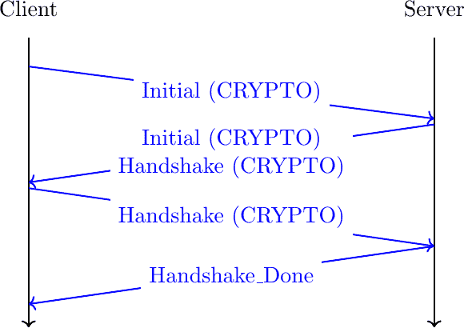

图 86 简化的 QUIC 握手

客户端发送一个包含`CRYPTO`帧的`Initial`数据包。此数据包携带客户端为此次连接提出的`TLS Client Hello`和传输参数。服务器以包含`CRYPTO`帧的`Initial`数据包作为回复。这个数据包包含`TLS Server Hello`。紧接着是一个或多个包含`TLS Encrypted Extensions`的`Handshake`数据包，这些数据包也包含`CRYPTO`帧。此帧的内容使用从`TLS Client Hello`和`TLS Server Hello`中提取的信息派生的会话密钥进行加密。它主要包含服务器的证书和传输参数。此帧可以分布在多个 QUIC 数据包中。客户端以包含带有`TLS Finished`消息的`CRYPTO`帧的`Handshake`数据包作为回复。服务器随后通过发送`Handshake_Done`帧来确认 TLS 握手的结束。

在查看加密参数协商的细节之前，了解 QUIC 如何抵御使用欺骗地址的拒绝服务攻击是有趣的。在此类攻击期间，主机 x 使用主机 y 的地址作为其源地址发送数据包。此类攻击的主要风险是，尽管拥有该地址的宿主机没有尝试与服务器建立 QUIC 连接，但服务器可能会向地址 y 发送大量数据包。QUIC 通过使用两种不同的技术来防止此类攻击。首先，对于传输协议来说这是不寻常的，客户端发送的初始 QUIC 数据包很大。创建 QUIC 连接时发送的第一个数据包必须包含至少 1200 字节的 UDP 有效载荷[**RFC 9000**](https://datatracker.ietf.org/doc/html/rfc9000.html)。这样的数据包包含一个如图所示的 CRYPTO 帧，但也包含填充帧以填充数据包。如果攻击者想要发送欺骗数据包以与服务器建立连接，它需要为每个连接尝试发送超过 1K 字节。这应该与必须发送以初始化 TCP 连接的 TCP 和 IPv4 头部的 40 字节进行比较。发送大初始数据包的另一个优点是，客户端还可以执行路径 MTU 发现并检测可能会分片 QUIC 数据包的路由器。

注意

地址欺骗

在理论上，一个互联网主机应该只使用其 IPv4 和 IPv6 源地址发送数据包。在实践中，配置错误的宿主机可能会使用除其分配地址之外的地址。此外，攻击者经常更改其源地址以隐藏其部分活动。一种常见的情况是拒绝服务（DoS）攻击。简单的 DoS 攻击是指一个宿主机向受害者发送大量数据包。如果攻击者使用除其官方 IP 地址之外的地址发送这些数据包，那么受害者识别攻击源将变得更加困难。

但还有一种更令人担忧的 DoS 攻击类别。如果攻击者可以使用受害者的源地址向服务器发送数据包，服务器就会向受害者返回响应。这些攻击者使用发送大量响应的互联网服务器，可能使用多个数据包对一个请求数据包进行响应。他们已经利用了 DNS、NTP 等协议，以及[memcached](https://www.memcached.org/)等应用程序。这类攻击的主要问题是服务器放大了客户端产生的攻击量。由于互联网上有非常强大的服务器，这可能会成为一个大问题，此类攻击的规模已经达到数百 Gbps。IETF 和网络运营商已经发布了配置接入网络以阻止伪造数据包的建议[**RFC 2827**](https://datatracker.ietf.org/doc/html/rfc2827.html)。不幸的是，互联网上仍有部分区域，攻击者可以发送伪造的数据包[[LBKKKC2019]](../bibliography.html#lbkkkc2019)。

第二种针对使用伪造数据包的拒绝服务攻击的缓解措施是在服务器端进行的。当服务器从客户端接收到一个初始数据包时，它可能会用一个初始数据包进行响应，如图图 86 所示。这可能是一个企业服务器从已知企业子网的主机接收请求的情况。服务器也可能想验证客户端并确认客户端可以接收它发送的数据包。为此，它返回一个 Retry 帧和一个 Token。这个 Token 是一个不透明的字段，其构造方式使得服务器很容易验证后续的客户端数据包，而客户端很难预测服务器将创建的 Token。一种可能的方法是计算包含客户端使用的源 IP 地址和端口号的消息的安全哈希值，这个秘密值只有服务器知道，可能还有一些时间信息，以便服务器能够忽略旧的 Token。面对相同的问题，TCP syn cookies 使用更少的位进行编码，因此本质上更不安全。图 87 显示了包含客户端地址验证的 QUIC 握手。


图 87 简化的带有地址验证的 QUIC 握手

地址验证提高了服务器对使用伪造地址的拒绝服务攻击的弹性，但这也带来了更长的连接建立延迟。QUIC 版本 1 包括几种额外的技术来减少地址验证的影响，同时仍然防止拒绝服务攻击。

### 识别 QUIC 连接#

TCP 连接由一个四元组 $ IP_{Client},IP_{Server},Port_{Client},Port_{Server} $ 来标识。属于给定连接的所有数据包在其 IP 和 TCP 头中都携带此信息。由于 QUIC 在 UDP 之上运行，一个简单的方法可能是使用 UDP 四元组来标识每个 QUIC 连接。虽然简单，但这个解决方案会严重限制 QUIC 的灵活性和 QUIC 服务器的可扩展性。QUIC 的设计者选择了由客户端和服务器选择的本地唯一连接标识符（CID）。这些标识符在握手过程中放置在 QUIC 数据包头中。在发送初始数据包时，客户端选择一个源 CID，该 CID 唯一标识客户端上的连接，以及一个随机的目标 CID。在接收到此数据包后，服务器选择自己的连接标识符。它回显客户端选择的 CID，并返回其选择的 CID。这如图图 88 所示。


图 88 简化 QUIC 握手过程中的连接标识符

客户端和服务器选择的连接标识符唯一标识 QUIC 连接。然而，与 TCP 和 UDP 不同，这两个标识符并不出现在所有数据包中。由于主机为每个连接选择一个唯一的标识符，它只需要这个标识符来识别一个数据包所属的连接。因此，握手之后在连接上交换的 QUIC 数据包只包含目标 CID，即接收数据包的主机选择的 CID。

注意

可变长度 CIDs

大多数传输协议依赖于固定长度的字段，因为这样可以简化数据包头的解析。例如，TCP 和 UDP 端口号被编码为 16 位字段。然而，使用固定长度字段也限制了协议的可扩展性。TCP 服务器无法监听超过 $ 2^{16} $ 个不同的端口。

QUIC 选择了可变长度的 CIDs 来支持非常不同的用例。在服务器端，所选连接标识符的长度将取决于服务器的架构。大型站点可能会使用负载均衡器，将连接分发到不同的物理服务器。这样的负载均衡器可以利用 CID 将每个传入的数据包直接导向处理该连接的服务器。一个简单的 CID 将包含由负载均衡器选择的服务器标识符，例如在 CID 的高位，后面跟着由物理服务器选择的连接标识符。其他设计也是可能的，例如通过加密 CID 来防止恶意客户端尝试针对特定服务器的攻击。

在客户端，可变长度的 CID 带来另一个好处。由于客户端通常管理少量 QUIC 连接，它们可以简单地依靠它们接收到的数据包的目标端口来识别相应的 QUIC 连接。这对应于零长度的连接标识符。这种 CID 在握手之后永远不会由服务器发送。这限制了客户端接收到的数据包的字节开销。

关于这些 CID 的最后一点是它们在 QUIC 数据包中的编码。初始数据包包含连接标识符的长度和值。CID 的最大长度为 20 字节。然而，在握手之后，通过 QUIC 连接交换的数据包只包含目标 CID，没有任何字段指示其长度。分配 CID 的主机知道它使用的 CID 的长度，因此可以在没有显式长度信息的情况下解析它接收到的数据包。

### 安全密钥#

我们现在可以讨论 QUIC 如何利用 TLS 1.3 协商用于验证和加密连接上交换的数据包的安全密钥。如图图 86 所示，QUIC 连接从交换四个帧开始，这些帧可以包含在四个或更多的数据包中。客户端发送的第一个数据包包含`ClientHello` TLS 记录。`ClientHello`包含使用 Diffie-Hellman 或类似协议推导会话密钥所需的信息。TLS 1.3 支持有限域 Diffie-Hellman 和椭圆曲线 Diffie-Hellman [**RFC 8446**](https://datatracker.ietf.org/doc/html/rfc8446.html)。`ClientHello`消息还包含客户端在连接期间提议使用的 TLS 或 QUIC 参数。服务器返回的`TLS Server Hello`包含证书，使客户端能够验证服务器的身份以及确定 Diffie-Hellman 密钥所需的信息。使用这些密钥，服务器还加密了包含服务器根据`ClientHello`中提出的参数选择的 TLS 和 QUIC 参数的`TLS Encrypted Extensions`消息。服务器还构建了包含整个 TLS 握手计算的消息认证码的`Finished`消息。此消息使用从 Diffie-Hellman 密钥推导出的会话密钥加密和验证。客户端和服务器重新计算整个握手的哈希值并验证两个`Finished`消息。如果其中一个消息不正确，这表明密钥没有被正确推导，或者某些 TLS 消息已被篡改。在这些情况下，QUIC 连接将终止并显示错误消息。QUIC 使用的简化 TLS 握手如图图 89 所示。以斜体显示的 TLS 消息使用会话密钥加密。

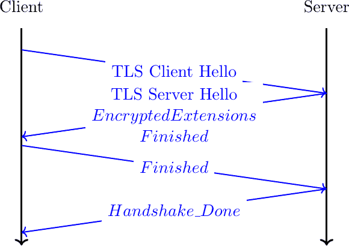

图 89：QUIC 连接中的简化 TLS 握手

备注

加密`TLS 客户端问候`和`TLS 服务器问候`

当 TLS 1.3 在 TCP 之上使用时，`TLS 客户端问候`和`TLS 服务器问候`消息以明文形式发送，因为客户端和服务器尚未交换会话密钥。对于 QUIC，也可以采用类似的方法，但担心中间盒可能分析这些初始 QUIC 消息的内容并试图干扰它们。为了给这些中间盒增加一些负担，QUIC 使用从客户端第一个初始数据包的目的连接 ID 派生出的秘密来加密初始数据包。下面的伪代码，摘自[**RFC 9001**](https://datatracker.ietf.org/doc/html/rfc9001.html)，展示了客户端和服务器密钥是如何派生的：

```sh
initial_salt = 0x38762cf7f55934b34d179ae6a4c80cadccbb7f0a
initial_secret = HKDF-Extract(initial_salt,
                        client_dst_connection_id)

client_initial_secret = HKDF-Expand-Label(initial_secret,
             "client in", "", Hash.length)
server_initial_secret = HKDF-Expand-Label(initial_secret,
                           "server in", "",Hash.length) 
```

由于用于保护初始数据包的密钥是从目的连接 ID 派生的，因此任何 QUIC 实现，包括那些用于中间盒的实现，都可以解密初始数据包的内容。

如前所述，客户端和服务器还可以使用 TLS 握手来就特定的 QUIC 参数达成一致。这些参数在 QUIC 中被称为传输参数[**RFC 9000**](https://datatracker.ietf.org/doc/html/rfc9000.html)。在 QUIC 版本 1 [**RFC 9000**](https://datatracker.ietf.org/doc/html/rfc9000.html)中定义了 17 个不同的传输参数，实现可以定义自己的传输参数。我们将在本文件的各个部分讨论其中的一些。第一个例子是`max_udp_payload_size`参数，它表示实现愿意接收的最大 UDP 有效载荷。此参数的最小值是 1200 字节。在支持巨型以太网帧的数据中心中使用的 QUIC 实现可以就一个更大的`max_udp_payload_size`达成一致，而不会存在数据包分片的风险。

QUIC 传输参数的另一个例子是 `initial_source_connection_id` 和 `original_destination_connection_id` 传输参数。如上所述，由于 TLS 握手的 `Finished` 消息，客户端和服务器可以验证他们的消息没有被篡改。不幸的是，包含在 `Finished` 消息中的认证代码仅基于 TLS 消息的内容（即 `ClientHello`、`ServerHello`、`EncryptedExtensions` 和 `Finished`）进行计算。在握手过程中，客户端和服务器还提出了他们计划用于识别 QUIC 会话的源和目的连接标识符。这些标识符放置在数据包头部，而不是 TLS 消息内部。因此，它们不受 `Finished` 消息中包含的认证代码的保护。为了仍然对这些标识符进行认证，QUIC 将它们编码为包含在 `ClientHello` 和 `EncryptedExtensions` 消息中的传输参数。客户端将其源连接标识符复制到其 `ClientHello` 中的 `initial_source_connection_id` 传输参数中。服务器在发送 `ServerHello` 时也这样做。它还在 `original_destination_connection_id` 传输参数中复制客户端用于发送包含 `ClientHello` 的数据包的目的标识符。

### QUIC 数据包头部#

在这一点上，QUIC 会话和 TLS 安全密钥由客户端和服务器所知。它们可以开始交换数据。在查看数据如何在 QUIC 数据包中传输之前，更深入地探索放置在每个数据包内的数据包头部是很有趣的。QUIC 使用可变长度的数据包头部。存在两种不同的头部格式。第一种头部格式是长头部。这是用于 QUIC 连接的第一个数据包的头部。

互联网协议规范通常包含图来表示数据包头部的格式。这种图形格式对于快速掌握包含固定大小字段的头部很有用。然而，当头部包含多个可变长度字段时，图形表示可能变得难以跟随。QUIC 规范 [**RFC 9000**](https://datatracker.ietf.org/doc/html/rfc9000.html) 使用了与 TLS 协议相同的文本表示。作为一个例子，让我们考虑众所周知的 TCP 头部。这个头部如图 90 所示进行图形表示。

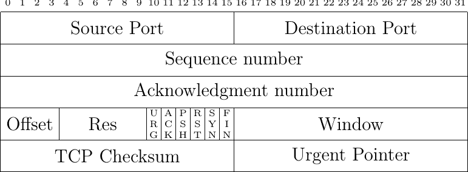

图 90 TCP 头部的图形表示 列表 2 TCP 头部的文本表示#

```sh
TCP Header Packet {
 Source Port (16),
 Destination Port (16),
 Sequence Number (32),
 Acknowledgment Number (32),
 Offset (4),
 Reserved (6),
 Urgent Flag (1),
 ACK Flag (1),
 Push Flag (1),
 RST Flag (1),
 SYN Flag (1),
 FIN Flag(1),
 Window (16),
 TCP Checksum (16),
 Urgent Pointer (16),
 TCP Options (..)
} 
```

仔细的读者会很容易理解两种格式之间的对应关系。在解释 QUIC 时，我们使用文本表示，而坚持使用图形表示来表示 TCP。

列表 3 展示了 QUIC 长头部。它以一个字节开始，这个字节中最显著的位包含头部类型，接下来是两位表示数据包类型，再接下来是四位，这四位对每个数据包都是特定的。然后，32 位携带 QUIC 版本号。当前 QUIC 版本，由 [**RFC 9000**](https://datatracker.ietf.org/doc/html/rfc9000.html) 定义，对应于版本 `0x00000001`。头部接着包含之前描述的目标和源连接标识符，然后是一个针对每种类型的特定有效载荷。

列表 3 QUIC 长头部 #

```sh
Long Header Packet {
 Header Form (1) = 1,                  /* high order bit of the first byte */
 Fixed Bit (1) = 1,                    /* second order bit of the first byte */
 Long Packet Type (2),                 /* third and fourth high order bits of the first byte */
 Type-Specific Bits (4),               /* low order four bits of the first byte */
 Version (32),                         /* 32 bits version number */
 Destination Connection ID Length (8), /* 8 bits */
 Destination Connection ID (0..160),   /* variable number from 0 up to 160 bits */
 Source Connection ID Length (8),
 Source Connection ID (0..160),
 Type-Specific Payload (..),           /* variable length */
} 
```

注意

编码数据包号

大多数传输协议使用固定字段来编码数据包号或字节偏移。这个字段的大小总是存在权衡。一方面，小的数据包号字段限制了每个数据包的额外开销。另一方面，需要较大的数据包号空间以确保携带不同数据的两个数据包不会使用相同的编号。TCP 使用一个 32 位的序列号字段，该字段指示有效载荷的第一个字节在字节流中的位置。随着带宽增加到 Gbps 及以上，这个 32 位字段引起了关注 [**RFC 7323**](https://datatracker.ietf.org/doc/html/rfc7323.html)。

QUIC 对序列号采取了不同的方法。每个数据包包含一个针对数据包的序列号。这个数字被编码为一个变长整数 (`varint`)。这样的 `varint` 在第一个字节的最显著两位中编码了长度。如果这些位被设置为 `00`，则 `varint` 使用一个字节进行编码，可以包含从 $ 0 $ 到 $ 2^{6}-1 $ 的值。如果两位最显著的位被设置为 `01`，则 `varint` 可以在两个字节内编码从 $ 0 $ 到 $ 2^{14}-1 $ 的值。当最高两位被设置为 `11` 时，`varint` 可以在四个字节内编码从 $ 0 $ 到 $ 2^{62}-1 $ 的值。

考虑到数据包号，QUIC 与其他传输协议之间存在其他重要差异。首先，QUIC 发送者必须 *永远* 不能为通过 QUIC 连接发送的两个不同数据包重用相同的包号。如果需要重传数据，它将以新数据包中的帧形式重新发送。此外，由于可能的最大包号是 $ 2^{62}-1 $，一旦发送了携带此包号的 QUIC 数据包，QUIC 发送者必须关闭相应的连接。这限制了 QUIC 连接的持续时间。它们不能像支持路由器之间 BGP 会话的 TCP 连接那样永远存在。使用 QUIC 的应用程序必须随时准备重新启动连接。

这个长头用于 `Initial`、`Handshake` 和 `Retry` 数据包。这些数据包类型中的一些在第一个字节中添加了新的标志，并在连接标识符之后添加了附加信息。列表 4 展示了 `Initial` 数据包的长头。它包含第一个字节中的两个位，指示包号字段长度。数据包特定部分包含一个选项令牌、一个长度字段、一个包号和有效载荷。令牌长度、长度和包号使用可变长度整数进行编码。

列表 4 初始数据包的 QUIC 长头#

```sh
Initial Packet {
 Header Form (1) = 1,                   /* High order bit first byte */
 Fixed Bit (1) = 1,
 Long Packet Type (2) = 0,
 Reserved Bits (2),
 Packet Number Length (2),              /* Low order 2 bits of first byte */
 Version (32),
 Destination Connection ID Length (8),
 Destination Connection ID (0..160),
 Source Connection ID Length (8),
 Source Connection ID (0..160),
 Token Length (i),
 Token (..),
 Length (i),
 Packet Number (8..32),
 Packet Payload (8..),
} 
```

QUIC 短头包含的字段较少。第一个字节的最显著位被设置为 1，以指示该数据包携带短头。其他标志将在稍后讨论。该字节最低的两个有效位包含包号字段长度。值得注意的是，与长头相比，没有明确指示目标连接标识符长度的信息。此连接标识符已由接收此数据包的主机分配，并且它已经知道它使用的连接标识符的长度。

列表 5 1-RTT 数据包使用的 QUIC 短头#

```sh
1-RTT Packet {
 Header Form (1) = 0,                /* High order bit of first byte */
 Fixed Bit (1) = 1,
 Spin Bit (1),
 Reserved Bits (2),
 Key Phase (1),
 Packet Number Length (2),           /* Low order bits of first byte */
 Destination Connection ID (0..160),
 Packet Number (8..32),
 Packet Payload (8..),
} 
```

短头格式，如 列表 5 所示，在会话密钥推导后由所有 QUIC 数据包使用。这通常发生在往返一次之后。这些数据包在 QUIC 规范中被称为 1-RTT 数据包 [**RFC 9000**](https://datatracker.ietf.org/doc/html/rfc9000.html)。这种表示法用于强调 QUIC 也支持 0-RTT 数据包，即携带数据并且可以与 TLS 握手并行交换的数据包。

注意

数据包合并

除了连接标识符之外，短头和长头之间的另一个区别是长头中存在 `Packet Length` 字段。这个字段可能会让熟悉 UDP 的读者感到惊讶，因为 UDP 也包含长度字段。由于每个 QUIC 数据包都放置在 UDP 消息中，因此 QUIC 长度字段可能看起来是多余的。这个长度字段被包含在 QUIC 长头中，以便允许 QUIC 发送者将多个连续的小数据包合并到单个 UDP 消息中。在握手过程中交换的一些帧相当小。为每个这些帧发送 UDP 消息将是资源的浪费。此外，在创建 QUIC 连接时，会交换 `Initial`、`Handshake` 和 `0-RTT` 数据包的混合。要求使用单个 UDP 消息发送这些数据包中的每一个是不明智的。您可能会在分析收集在 QUIC 服务器上的数据包跟踪时观察到这种优化。

### 0-RTT 数据#

延迟是传输协议的关键关注点。我们至今所描述的 QUIC/TLS 握手允许客户端和服务器在单程往返时间内就安全密钥达成一致。然而，对于某些应用程序来说，单程往返时间可能是一个较长的延迟。为了最小化连接设置时间的影响，QUIC 允许应用程序在 QUIC/TLS 握手期间交换数据。这种数据称为 0-RTT 数据。为了确保 0-RTT 数据的安全交换，客户端和服务器必须事先就一个可以用来加密和验证 0-RTT 数据的密钥达成一致。这样的 0-RTT 密钥可以是客户端和服务器在没有使用 QUIC 协议的情况下共享的预共享密钥，或者，这是最常见的方法，是他们在之前连接中协商的密钥。实际上，服务器通过向客户端发送 TLS 会话票据来启用 0-RTT [**RFC 8446**](https://datatracker.ietf.org/doc/html/rfc8446.html)。会话票据是一个包含使服务器能够恢复会话所有状态信息（包括其会话密钥）的加密记录。它还与客户端的地址相关联，以便服务器能够验证给定的客户端是否重复使用它之前收到的票据。通常，这些票据还包含一个过期日期。客户端将收到的票据放入它发送的第一个 `Initial` 数据包中的 `TLS Client Hello`。它使用与该票据对应的预共享密钥来加密数据并将其放入一个或多个 `0-RTT` 数据包中。服务器使用票据中包含的信息恢复密钥并解密 `0-RTT` 数据包的数据。列表 6 显示了 QUIC 的 0-RTT 数据包格式。

列表 6 QUIC 0-RTT 数据包#

```sh
0-RTT Packet {
 Header Form (1) = 1,                  /* High order bit of the first byte */
 Fixed Bit (1) = 1,
 Long Packet Type (2) = 1,
 Reserved Bits (2),
 Packet Number Length (2),            /* Low order bits of the first byte */
 Version (32),
 Destination Connection ID Length (8),
 Destination Connection ID (0..160),
 Source Connection ID Length (8),
 Source Connection ID (0..160),
 Length (i),
 Packet Number (8..32),
 Packet Payload (8..),
} 
```

这些 `0-RTT` 数据包的主要好处是客户端可以在发送其 `Initial` 数据包的同时立即发送加密数据。这在 图 91 中得到了说明，其中使用 0-RTT 密钥加密的帧以斜体显示。请注意，其中一些帧可以跨越多个数据包。`0-RTT` 数据包仅由 QUIC 客户端发送，因为服务器可以在发送其 `Handshake` 数据包后立即发送加密数据。如前所述，初始数据包也是加密的，但使用的是从连接标识符派生的密钥。

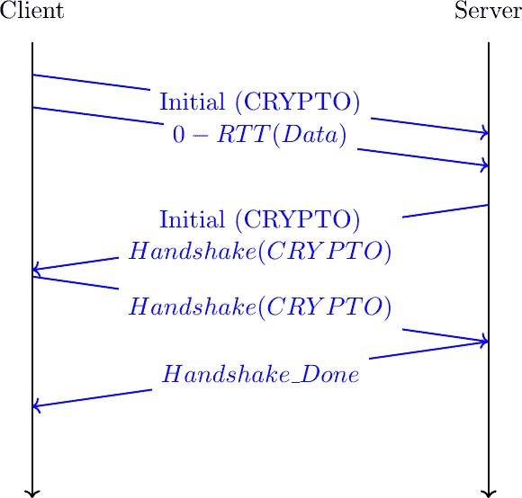

图 91 带有 0-RTT 数据的简化 QUIC 握手

注意

重放攻击和 0-RTT 数据包

多亏了 0-RTT 数据包，客户端可以在等待安全握手之前将加密数据发送到服务器。这减少了数据传输的延迟，但有一个重要的注意事项。QUIC 并不保证 0-RTT 数据不会被重放。QUIC 交换的 0-RTT 数据旨在用于幂等操作。关于重放攻击影响的具体讨论，可以在[[MacCarthaigh2017]](../bibliography.html#maccarthaigh2017)中找到。

为了理解这些重放攻击的重要性，让我们考虑一个简单的 HTTP GET 请求。这样的请求可以很容易地放入 0-RTT 数据包中，从而降低延迟。如果网页浏览器使用它来请求静态的`index.html`文件，如果服务器收到两次请求，则没有害处。然而，如果 GET 请求是 REST API 的一部分并且有副作用，那么问题可能会根据副作用类型而出现。考虑一个允许用户通过智能手机关闭灯光的 REST API。重放这个请求两到三次将始终导致灯光关闭。然而，如果用户请求将室温提高 1°C，那么多次重放显然会有不同的后果。

## 关闭 QUIC 连接#

在探索如何在 QUIC 连接上交换数据之前，让我们现在分析 QUIC 连接是如何终止的。QUIC 支持三种不同的方法来关闭 QUIC 连接。QUIC 终止连接的方法与传统传输协议所使用的方法非常不同。在查看这些技术之前，了解 QUIC 如何与网络地址转换（NAT）交互是非常重要的。

注意

QUIC 和网络地址转换

QUIC 在 UDP 之上运行，QUIC 的设计受到了 NAT 的存在的影响。NAT，就像其他中间盒一样，维护每个流的状态。对于 TCP 连接，许多 NAT 依赖于`SYN`、`FIN`和`RST`标志来确定何时为 TCP 连接创建或删除状态。对于 UDP，这种有状态的方法是不可能的，NAT 在观察到流的第一包时创建一个新的映射，一旦流空闲一段时间后，就删除该映射。IETF 建议至少保持 NAT 映射两分钟[**RFC 4787**](https://datatracker.ietf.org/doc/html/rfc4787.html)，但测量表明，一些部署的 NAT 使用更短的超时[[HNESSK2010]](../bibliography.html#hnessk2010) [[RWV+2016]](../bibliography.html#rwv-2016)。在实践中，UDP 流可能需要每 30 秒发送一个数据包，以确保路径上的 NAT 保留其状态。

为了防止 NAT 更改与用于 QUIC 连接的 IP 地址和端口号关联的映射，QUIC 主机需要定期通过每个建立的 QUIC 连接发送数据。QUIC 定义了一个`PING`帧，允许任何 QUIC 端点发送一个将触发另一端响应的帧。`PING`帧不携带数据，但接收`PING`帧的接收方需要确认包含此帧的包。这创建了一个双向通信，可以防止 NAT 丢弃与 QUIC 连接关联的映射。

### 隐式终止 QUIC 连接#

每个 QUIC 实现都会在其连接状态中保存通过此连接接收到的最后一个 QUIC 数据包的时间戳。在连接建立过程中，QUIC 主机还可以交换`max_idle_timeout`参数，该参数表示 QUIC 连接在自动关闭之前可以保持空闲多长时间（以秒为单位）。关闭 QUIC 连接的第一种方式是保持连接空闲这段时间。

### 显式终止 QUIC 连接#

终止 QUIC 连接的第二种技术是使用`CONNECTION_CLOSE`帧。此帧表示此连接已被突然关闭。接收`CONNECTION_CLOSE`帧的主机可以响应一个`CONNECTION_CLOSE`帧。之后，它必须停止发送任何额外的帧。它保持连接状态一段时间，但不接受任何新包也不重传其他包。发送`CONNECTION_CLOSE`帧的主机表示它将不会发送或接收更多数据。它保留 QUIC 连接状态的一部分，以便在需要时重新传输`CONNECTION_CLOSE`帧。

如果主机收到无效帧或检测到协议错误，它也会发送一个`CONNECTION_CLOSE`帧来突然终止连接。在这种情况下，`CONNECTION_CLOSE`帧包含一个可变长度的整数，表示终止的原因、触发错误的帧类型以及编码为文本字符串的附加信息。

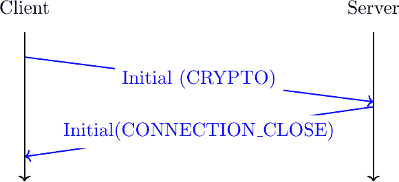

图 92 拒绝连接的服务器

QUIC 规范还定义了第三种技术，称为无状态重置，以应对在崩溃或故障后丢失连接状态的主机。它依赖于与连接标识符一起宣布的 16 字节无状态令牌。有关所有详细信息，请参阅[**RFC 9000**](https://datatracker.ietf.org/doc/html/rfc9000.html)。

## 在 QUIC 连接上交换数据#

在 QUIC 连接上交换的数据组织在不同的流中。流是一系列字节。QUIC 支持单向和双向流。客户端和服务器都可以在 QUIC 连接上创建新的流。每个流都有一个流标识符。为了避免客户端和服务器尝试使用相同的标识符创建流时出现的问题，QUIC 限制了基于其两个最低位的流标识符的使用。QUIC 客户端只能创建两个最低位设置为 `00`（双向流）或 `10`（单向流）的流。同样，服务器发起的流的最低位必须设置为 `01`（双向流）或 `11`（单向流）。QUIC 流通过发送具有选择标识符的数据隐式创建。流标识符使用变长整数进行编码。因此，最大的流标识符是 $ 2^{62}-1 $。

QUIC 将所有数据放在 `STREAM` 帧中，然后这些帧被放入 QUIC 数据包中。`STREAM` 帧的结构在 列表 7 中显示。此帧包含以下信息：

> +   流帧的类型 [[1]](#f-stream-type)
> +   
> +   流的标识符
> +   
> +   偏移量，即流数据第一个字节在字节流中的位置
> +   
> +   数据长度
> +   
> +   流数据

列表 7 QUIC 流帧#

```sh
STREAM Frame {
 Type (i) = 0x08..0x0f,
 Stream ID (i),
 Offset (i),
 Length (i),
 Stream Data (..),
} 
```

`STREAM` 帧携带数据，但它也可以终止相应的流。类型字段最低位的比特用作 `FIN` 比特。当设置为 0 时，表示后续数据将通过此流发送。当设置为 1 时，表示 `STREAM` 帧包含通过该流发送的最后一个字节。一旦将流的最后一个字节交付给用户应用，流就会被关闭。一旦一个 QUIC 流被关闭，它就不能再在此连接上重用。

使用这些信息，接收者可以轻松重新组装通过不同流接收到的数据。为了说明，让我们考虑一个创建了两个流（流 `1` 和 `5`）的服务器。服务器通过流 `1` 发送 `ABCD..`，通过流 `5` 发送 `123` 并在发送第三个数字后关闭它。这些流的数据可以编码如 列表 8 所示。

列表 8 通过两个不同流发送的数据#

```sh
STREAM Frame {
 Type (i) = 0x0e,
 Stream ID = 1,
 Offset = 0
 Length = 2
 Stream Data = AB
}
STREAM Frame {
 Type (i) = 0x0e,
 Stream ID = 5,
 Offset = 0
 Length = 1
 Stream Data = 1
}
STREAM Frame {
 Type (i) = 0x0e,
 Stream ID = 1,
 Offset = 2
 Length = 1
 Stream Data = C
}
STREAM Frame {
 Type (i) = 0x0f,   /* FIN bit is set, end of stream */
 Stream ID = 5,
 Offset = 1
 Length = 2
 Stream Data = 23
}
STREAM Frame {
 Type (i) = 0x0e,
 Stream ID = 1,
 Offset = 3
 Length = 4
 Stream Data = DEFG
} 
```

在列表 8 中显示的倒数第二个帧设置了 `FIN` 标志。它标志着传输了总共三个字节的流 `1` 的结束。`FIN` 标志是优雅地关闭 QUIC 流的标准方式。

然而，有些情况下，应用程序可能需要突然取消一个流，而不关闭相应的连接。首先，流的发送方可以决定重置该流。为此，它发送一个携带被取消流标识符的 `RESET_STREAM` 帧。流的接收方也可能需要停止接收给定流的数据。例如，考虑一个用户已经点击了同一服务器的另一个页面的网页浏览器，而浏览器已经开始下载组成网页的不同图像。对应这些图像的流变得无用。在这种情况下，我们的浏览器可以发送一个 `STOP_SENDING` 帧来指示它丢弃对应流的传入数据。在接收到此帧后，服务器发送一个 `RESET_STREAM` 帧来指示相应的流已被关闭。

### QUIC 中的流量控制#

传输协议通常为每个建立的连接分配一些资源。每个 QUIC 连接都需要内存来存储其状态，但也需要缓冲区来存储到达顺序错误的包。实际上，可用于 QUIC 实现的内存不是无限的，QUIC 接收方必须控制远程主机在任何时候可以发送的包的数量。QUIC 支持在不同级别操作的流量控制技术。

第一级是连接级别。在握手过程中，每个主机可以使用 `initial_max_data` 传输参数宣布它同意在连接上最初接收的最大字节数。此参数包含发送主机同意接收的字节数，无需进一步通知。如果连接使用的字节数超过了最初同意的数量，接收方可以在任何时候通过发送 `MAX_DATA` 帧来更新此限制。此帧包含一个可变长度的整数，它编码了可以通过连接发送的最大流数据量。

在 QUIC 主机上使用不同的流也会消耗资源。接收方还可以限制远程主机可以创建的流的数量。在握手过程中，`initial_max_streams_bidi` 和 `initial_max_streams_uni` 传输参数宣布接收主机可以接受的最多双向和单向流的数量。此限制可以在连接期间通过发送更新限制的 `MAX_STREAMS` 帧来修改。

流量控制也可以在流级别上进行。在握手期间，几个传输参数允许主机宣布它们同意在每条流上接收的最大字节数。不同的传输参数用于指定适用于本地/远程和单向/双向流的限制。这些限制可以通过发送`MAX_STREAM_DATA`帧在连接期间更新。这些帧中的每一个都指示了在给定流上可以接受的最大流数据量。

这些限制限制了主机可以创建的流数量以及它可以发送的字节数。如果一个主机被这些限制中的任何一个阻塞，它可能发送一个控制帧来请求远程主机扩展限制。对于每种类型的流量控制，都有一个相关的控制帧，可以用来请求扩展限制。

当主机达到由`initial_max_data`传输参数或之前接收到的`MAX_DATA`帧设定的最大数据量限制时，它应该发送一个`DATA_BLOCKED`帧。`DATA_BLOCKED`帧包含导致传输被阻塞的连接限制。在实践中，接收主机应在达到限制之前通过发送`MAX_DATA`帧来增加连接级别的限制。然而，由于这个限制是可用内存的函数，主机可能并不总是能够发送一个`MAX_DATA`帧。图 93 提供了使用这些帧的示例数据包流。我们假设客户端在握手期间将`initial_max_data`传输参数设置为`100`字节，而服务器需要发送 900 字节。服务器创建一个流，并在携带`STREAM`帧的`1-RTT`数据包中发送 100 字节。此时，服务器被阻塞。


图 93 QUIC 在连接的流量控制被阻塞时使用`DATA_BLOCKED`帧

当主机达到每流的限制时发送的`STREAM_DATA_BLOCKED`帧也是如此。当主机达到已建立流的最大数量时，使用`STREAMS_BLOCKED`帧。

注意

被流量控制阻塞的连接并非完全空闲

如果一个 QUIC 主机检测到连接被流量控制阻塞，它应该定期发送`DATA_BLOCKED`或`STREAM_DATA_BLOCKED`帧，以请求远程主机扩展当前限制。QUIC 规范[**RFC 9000**](https://datatracker.ietf.org/doc/html/rfc9000.html)没有明确推荐在连接被流量控制阻塞时这些帧应该发送的频率。QUIC 部署的经验将使 QUIC 开发者能够更精确地定义这些帧应该发送的频率。

一项测量研究[[MHLQ2020]](../bibliography.html#mhlq2020)揭示了 QUIC 实现使用了不同的流量控制策略。他们确定了三种主要的行为类型：

> +   静态流量控制：接收缓冲区的大小保持不变，接收方简单地线性增加最大允许量
> +   
> +   增长型流量控制：随着连接的进行，接收缓冲区的大小随时间增加
> +   
> +   自动调整：接收缓冲区的大小根据估计的带宽和往返时间动态调整

在 2020 年，三分之二的被研究实现使用了静态流量控制，只有一个是自动调整。静态流量控制可以工作，但这是一种内存浪费。例如，Google 的 Chrome 以 15 MBytes 的接收缓冲区开始，并线性更新它 [[MHLQ2020]](../bibliography.html#mhlq2020)。这应该与通常以几个十 KBytes 的窗口开始并使用自动调整来调整窗口大小的 TCP 实现进行对比。自动调整是现代 TCP 实现的关键特性 [[SMM1998]](../bibliography.html#smm1998)。预计 QUIC 实现将包括更高级的启发式方法来调整它们的流量控制机制。

### QUIC 丢包检测#

与其他传输协议一样，QUIC 包括检测传输错误和包丢失的机制。传输错误通常通过使用 UDP 校验和或使用 Wi-Fi 或以太网的 CRC 在数据链路层检测。当发生传输错误时，相应的包被丢弃，QUIC 将此错误视为包丢失。研究人员已经分析了校验和和 CRC 在真实数据上的性能 [[SGP98]](../bibliography.html#sgp98)。

其次，由于 QUIC 使用了 AEAD 加密方案，所有 QUIC 包都经过认证，接收方可以利用这一点来检测 UDP 校验和或下层 CRC 未检测到的传输错误。然而，这些未检测到的传输错误被认为是罕见的，如果 QUIC 检测到一个无效的 AEAD，它将认为这个错误是由攻击引起的，并将使用 TLS 警报停止连接 [**RFC 8446**](https://datatracker.ietf.org/doc/html/rfc8446.html)。

QUIC 与其他传输协议使用的丢包检测和重传机制之间存在几个重要差异。首先，QUIC 包号在 QUIC 连接中总是单调递增。QUIC 发送者永远不会在给定的连接中发送具有相同包号的包两次。QUIC 将包号编码为变长整数，并且与其他传输协议不同，它不支持回绕。QUIC 帧包含需要可靠传输的有价值信息。如果一个 QUIC 包丢失，包含该包的帧将在使用不同包号的另一个 QUIC 包中重新传输。因此，QUIC 包号充当包的唯一标识符。这简化了一些操作，例如测量往返时间，这在像 TCP 这样的协议中更困难，因为包被传输 [[KP91]](../bibliography.html#kp91)。

第二，QUIC 的确认携带的信息比 TCP 和相关协议使用的累积或选择性确认要多。这使得接收者能够提供对它接收到的数据包的更详细视图。与 TCP [**RFC 2018**](https://datatracker.ietf.org/doc/html/rfc2018.html) 相比，一旦接收者在确认中报告了一个数据包被正确接收，该数据包的发送者就可以丢弃相应的帧。

第三，QUIC 发送者自主决定在每个数据包内发送哪些帧。一个 QUIC 数据包可能包含数据和控制帧，或者只包含数据或只包含控制信息。如果一个 QUIC 数据包丢失，它所包含的帧可以在不同的数据包中重新传输。因此，QUIC 实现需要缓冲帧并标记正在传输的帧，以便在相应的数据包丢失时能够重新传输它们。

第四，大多数 QUIC 数据包都明确地被确认。唯一的例外是只包含`ACK`、`PADDING`或`CONNECTION_CLOSE`帧的数据包。包含任何其他 QUIC 帧的数据包被称为 ack-eliciting packet，因为它的交付将通过发送确认来确认。因此，携带`ACK`和`STREAM`帧的 QUIC 数据包将被确认。

考虑到这一点，研究 QUIC 确认的格式并分析它们如何被使用是非常有趣的。列表 9 提供了 ACK 帧的格式。它可以在 QUIC 数据包中的任何时间发送。使用两种类型来区分包含接收到的 ECN 标志信息的确认（类型`0x03`）或只有常规确认（类型`0x02`）。ACK 帧中包含的第一个信息是此 ACK 帧确认的最大数据包号。这通常是接收到的最高数据包号。第二个信息是 ACK 延迟。这是接收者接收具有最大确认号的数据包和发送确认之间的微秒延迟。这个信息对于确保往返时间被准确测量非常重要，即使接收者延迟确认也是如此。这如图 94 所示。`ACK Range Count`字段包含 QUIC ACK 帧中包含的`ACK 范围`数量。如果所有数据包都按顺序接收且没有间隙，则此数字可以设置为零。在这种情况下，`First ACK Range`字段包含在`Largest Acknowledged`数据包号之前到达的数据包号。

列表 9 QUIC ACK 帧格式#

```sh
ACK Frame {
 Type (i) = 0x02..0x03,
 Largest Acknowledged (i),
 ACK Delay (i),
 ACK Range Count (i),
 First ACK Range (i),
 ACK Range (..) ...,
 [ECN Counts (..)],
} 
```

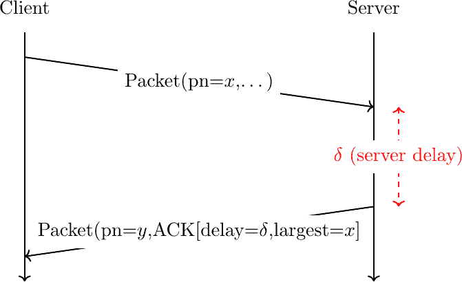

图 94 QUIC 确认延迟的利用

一个`ACK`帧包含 0 个或多个`ACK Ranges`。`ACK range`的格式在列表 10 中显示。每个范围首先指示自前一个范围中最小的已确认数据包以来的未确认数据包数量（或第一个`ACK`范围）。下一个字段指示连续已确认数据包的数量。

列表 10 一个 QUIC 确认范围#

```sh
ACK Range {
 Gap (i),
 ACK Range Length (i),
} 
```

例如，考虑一个接收了以下 QUIC 数据包的主机：`3,4,6,7,8,9,11,14,16,18`。为了报告所有接收到的数据包，它将生成列表 11 中显示的`ACK`帧。

列表 11 示例 QUIC 确认帧#

```sh
ACK Frame {
 Type (i) = 0x02,
 Largest Acknowledged=18,
 ACK Delay=x,
 ACK Range Count=5,
 First ACK Range=0,
 ACK Range #0 [Gap=2, ACK Range Length=1],
 ACK Range #1 [Gap=2, ACK Range Length=1],
 ACK Range #2 [Gap=3, ACK Range Length=1],
 ACK Range #3 [Gap=2, ACK Range Length=4],
 ACK Range #4 [Gap=2, ACK Range Length=2]
} 
```

QUIC 规范建议在收到两个诱发性数据包后发送一个`ACK`帧。这大致对应于 TCP 的延迟确认策略。然而，目前正在进行的工作是为了允许发送者提供更多关于何时以及如何发送`ACK`帧的指导。

注意

应该何时发送 QUIC 主机的确认

一项测量研究[[MHLQ2020]](../bibliography.html#mhlq2020)分析了 QUIC 实现如何生成确认。被研究的两种实现中，一种每 N 个数据包发送一次确认（一个实现为 2，另一个为 10）。其他实现使用了在数据传输过程中变化的确认频率。

(源代码, png, hires.png, pdf)

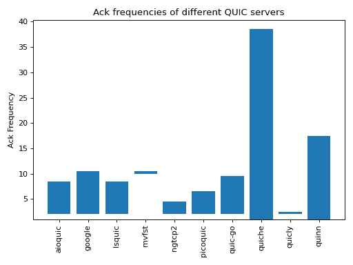

图 95 不同 QUIC 服务器的确认频率#

确认频率应该与通常每秒确认一个数据包的 TCP 进行比较。预计在未来的几年中，QUIC 实现将根据部署的反馈调整其确认的生成。

观察到，由于`ACK`帧是在 QUIC 数据包内部发送的，因此它们也可以被确认。对另一个`ACK`帧发送`ACK`可能会引起`ACK`帧的无穷交换。为了防止这个问题，QUIC 发送者不能对非诱发性 QUIC 数据包发送`ACK`帧，而`ACK`帧就是非诱发性帧类型之一。请注意，如果一个接收者接收了大量的`STREAM`帧并因此发送了大量的`ACK`帧，想要获取其`ACK`帧的接收信息，它可以在包含诱发性帧（例如`PING`帧）的数据包中简单地发送一个`ACK`帧。这个帧将触发接收者对其进行确认以及之前发送的`ACK`帧。

与其他可靠的传输协议相比，QUIC 不使用累积确认。如前所述，QUIC 从不重新传输具有相同包号的包。当一个包丢失时，这会创建一个接收方使用 `ACK Range` 报告的间隙。这样的间隙永远不会通过重传来填补，并且显然不应该由接收方永远报告。在实践中，接收方会发送与给定包号相对应的确认多次，然后假设确认已被接收。接收方还可以依靠其他启发式方法来确定给定的 `ACK Range` 不再需要报告。这种情况发生在 `ACK` 帧包含在一个已被另一对等方确认的包中时，也发生在间隙被注意到的几个往返时间之前。

QUIC 还允许接收方发送有关接收到的包中 ECN 标志的信息。IP 头部的两个标志 [**RFC 3168**](https://datatracker.ietf.org/doc/html/rfc3168.html) 保留以指示对显式拥塞通知的支持。在 列表 12 中显示的 QUIC ECN 计数字段包含三个计数器，用于不同 ECN 标志的值。这些计数器在接收每个 QUIC 包时根据接收到的包的 ECN 标志值递增。不幸的是，在全局互联网中使用 ECN 仍然存在许多操作问题 [[MLBBA2018]](../bibliography.html#mlbba2018)。时间将证明使用 QUIC 部署 ECN 是否比使用 TCP 更容易。

列表 12 A QUIC ECN Count#

```sh
ECN Counts {
 ECT0 Count (i),
 ECT1 Count (i),
 ECN-CE Count (i),
} 
```

注意

QUIC 也确认控制帧

除了携带用户数据的 STREAM 帧之外，QUIC 还使用几种不同的帧类型来交换控制信息。这些控制帧，就像数据帧一样，是请求确认的帧。这意味着接收此类帧的主机需要使用一个 `ACK` 帧来确认它。

图 97 展示了 QUIC 连接的开始，通过交换 `Initial` 包和相应的确认。客户端在一个 `Initial` 包中将其 `TLS Client Hello` 发送在一个 `CRYPTO` 帧内。这是客户端发送的第一个包，因此其包号为 0。服务器在一个 `Initial` 包中用 `CRYPTO` 帧回复一个 `TLS Server Hello`。由于这是服务器发送的第一个包，其包号也是 0。该包还包含一个 `ACK` 帧，确认接收到了包含 `TLS Client Hello` 的包。

`Handshake`、`0-RTT` 和 `1-RTT` 包也使用 `ACK` 帧以类似的方式进行确认。`Handshake` 包在其他 `Handshake` 包中确认，而 `0-RTT` 和 `1-RTT` 包在 `1-RTT` 包内确认。

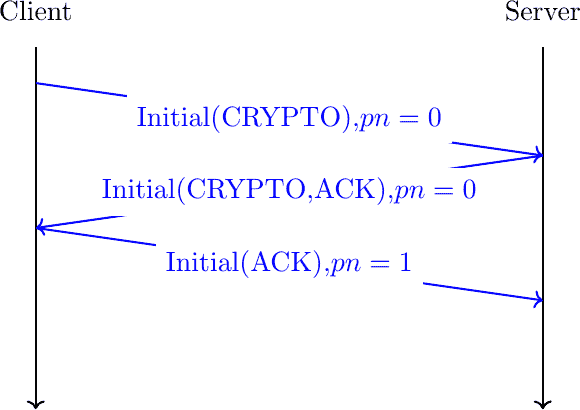

图 97 QUIC 也确认 Initial 帧内容

注意

并非所有 QUIC 服务器都将 0 用作它们第一个初始数据包的数据包编号

示例显示了一个 QUIC 连接，其中客户端发送了编号为 0 的初始数据包，服务器也以编号设置为 0 的数据包进行了回复。这是大多数 QUIC 实现的做法。然而，QUIC 规范并没有严格要求这样做。实际上，2022 年 10 月，`facebook`服务器似乎在响应客户端时，为发送的初始数据包使用了随机的数据包编号。这可能是用来检测或减轻某些形式的攻击，因为客户端必须接收到服务器的初始数据包才能产生有效的确认。

为了说明 QUIC 如何使用确认，让我们考虑一个简单的 QUIC 连接。客户端使用新服务器启动一个 QUIC 连接，发送一个请求，接收一个响应，然后关闭连接。在这个连接中没有数据丢失。图 98 展示了这个连接。

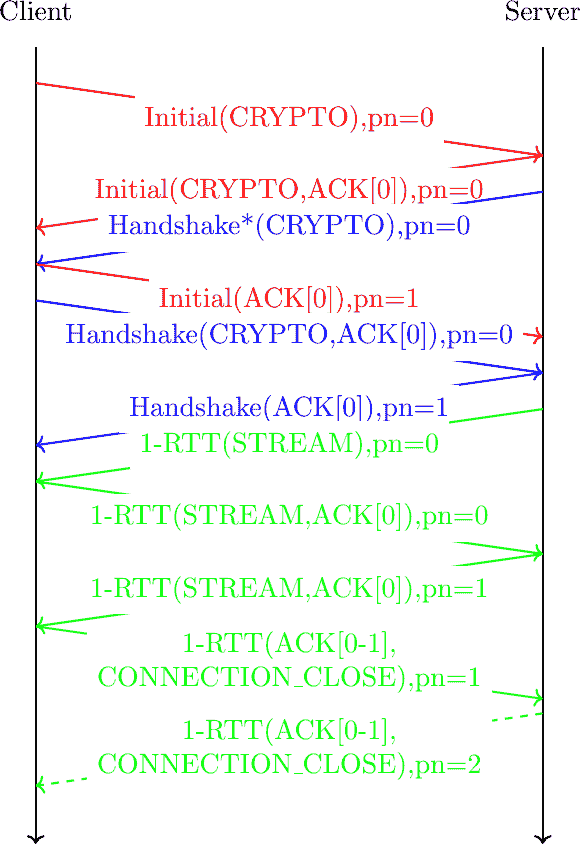

图 98 短 QUIC 连接中的致谢

连接开始于客户端发送包含带有`TLS 客户端问候`的`CRYPTO`帧的`Initial`数据包。服务器回复一个包含确认和一个带有`TLS 服务器问候`的`CRYPTO`帧的`Initial`数据包。然后服务器发送一个包含`TLS 加密扩展`的`Initial`数据包。由于这是第一个`Initial`数据包，其数据包编号被设置为 0。实际上，服务器可能需要发送多个数据包来携带这个数据包中包含的证书。请注意，服务器不能向客户端的`Initial`数据包发送超过 3 个数据包。这个限制是在 QUIC 规范中引入的，以限制攻击者通过向 QUIC 服务器发送伪造数据包来触发 DDoS 攻击的能力[**RFC 9000**](https://datatracker.ietf.org/doc/html/rfc9000.html)。如果包含证书的`CRYPTO`帧太长，服务器可能需要等待客户端的确认，然后才能发送最后的`握手`数据包。客户端通过发送包含`ACK`帧的最后`Initial`数据包来确认已接收到服务器的`Initial`数据包。这是客户端发送的第二个`Initial`数据包，因此其数据包编号为 1。由于这个数据包只包含`ACK`帧，服务器不需要返回确认来确认其接收。

客户端用包含 CRYPTO 帧的另一个 `Handshake` 数据包回复 `Handshake` 数据包，并确认服务器发送的 `Handshake` 数据包。服务器的 `Handshake` 数据包被客户端确认。服务器通过发送包含一个或多个流帧的 `1-RTT` 数据包来开始数据交换，创建所需的流。由于这是服务器发送的第一个 `1-RTT` 数据包，其数据包编号被设置为 0。然后客户端在 `STREAM` 帧中发送其请求。服务器用包含响应 `STREAM` 帧的 `1-RTT` 数据包回复。客户端通过发送 `CONNECTION_CLOSE` 帧来结束连接。在示例中，服务器用 `CONNECTION_CLOSE` 帧回复，但 QUIC 规范 [**RFC 9000**](https://datatracker.ietf.org/doc/html/rfc9000.html) 只指出在这种情况下，主机可以回复一个 `CONNECTION_CLOSE`。

### 观察 QUIC 连接#

我们现在已经审查了 QUIC 规范的主要组件。为了说明它，让我们考虑一个简单的场景，其中客户端与服务器建立一个 QUIC 连接。我们利用 Maxime Piraux 的 QUIC 跟踪器 [[PDB2018]](../bibliography.html#pdb2018)。在这个例子中，我们使用 2021 年 11 月 22 日 18:04:52 CET 在 `nghttp2.org` 服务器上收集的数据包跟踪。这个跟踪可以从 [`quic-tracker.info.ucl.ac.be/traces/20211122/148`](https://quic-tracker.info.ucl.ac.be/traces/20211122/148) 获取。您可以看到数据包的内容，将其下载为 `.pcap` 跟踪或使用 QLog/QViz [[MPQL2020]](../bibliography.html#mpql2020) 从这个网站进行可视化。

这个跟踪包含 16 个数据包。场景是一个简单的握手和数据交换。

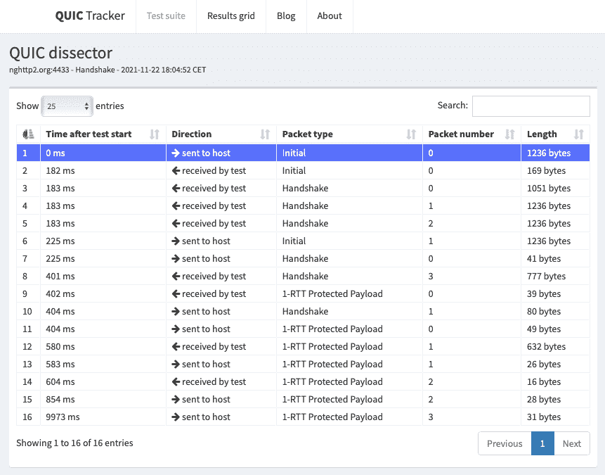

图 99 包含成功握手的 `nghttp2.org` 的样本 QUIC 跟踪器跟踪#

为了建立连接，客户端发送一个 `Initial` QUIC 数据包。分析这个数据包的内容很有趣。它以一个长的 QUIC 报头开始，如 列表 13 所示。

列表 13 客户端发送的第一个数据包的 QUIC 报头#

```sh
Long Header Packet {
 Header Form (1) = 1,
 Fixed Bit (1) = 1,
 Long Packet Type = 00,
 Type-Specific Bits (4) = 0000,
 Version (32) = 0xff00001d,
 Destination Connection ID Length (8) = 8,
 Destination Connection ID (0..160) = 0x6114ca6ecbe483bb,
 Source Connection ID Length (8) = 8,
 Source Connection ID (0..160) = 0xc9f54d3c298296b9,
 Token Length (i) = 0,
 Length (i) = 1226,
 Packet Number (8..32) = 0,
 Packet Payload (8..) = CRYPTO,
 Type-Specific Payload (..)
} 
```

客户端提出一个 64 位的连接标识符，并使用一个随机的 64 位的标识符作为目标连接标识符。由于这是客户端到服务器的第一个连接，这个数据包中没有令牌。值得注意的是，这个 `Initial` 数据包的数据包编号被设置为 0。与使用随机序列号的 TCP 相比，所有 QUIC 连接都以一个数据包编号设置为 0 的数据包开始。数据包包含一个在 列表 14 中显示的 `CRYPTO` 帧。

列表 14 客户端发送的第一个 QUIC 数据包的 CRYPTO 帧#

```sh
CRYPTO Frame {
 Type (i) = 0x06,
 Offset (i) = 0,
 Length (i) = 245,
 Crypto Data = ClientHello
} 
```

`CRYPTO` 数据帧从偏移量 0 开始，长度为`245`字节。它包含一个 TLS 1.3 `ClientHello` 消息，其格式在[**RFC 8446**](https://datatracker.ietf.org/doc/html/rfc8446.html)中指定。此`ClientHello`包括一个 32 字节的加密随机数，一组提议的加密套件和一系列 TLS 扩展。其中之一扩展携带客户端提出的 QUIC 传输参数。在此连接上，QUIC 跟踪器客户端提出了以下参数：

> +   `initial_max_stream_data_bidi_local` = 0x80004000
> +   
> +   `initial_max_stream_data_uni` = 0x80004000
> +   
> +   `initial_max_data` = 0x80008000
> +   
> +   `initial_max_streams_bidi` = 0x1
> +   
> +   `initial_max_streams_uni` = 0x3
> +   
> +   `max_idle_timeout` = 0x6710
> +   
> +   `active_connection_id_limit` = 0x4
> +   
> +   `max_packet_size` = 0x45c0
> +   
> +   `inital_source_connection_id` = 0xc9f54d3c298296b9

最后，第一个 QUIC 数据包包含一个包含 960 个空字节填充的`PADDING`数据帧。整个数据包长度为 1236 字节。

服务器用两个数据包响应这个`Initial`数据包。第一个是一个`Initial`数据包。它以列表 15 中显示的头部开始。

列表 15 客户端发送的第一个数据包的 QUIC 头部#

```sh
Long Header Packet {
 Header Form (1) = 1,
 Fixed Bit (1) = 1,
 Long Packet Type = 10,
 Type-Specific Bits (4) = 0000,
 Version (32) = 0xff00001d,
 Destination Connection ID Length (8) = 8,
 Destination Connection ID (0..160) = 0xc9f54d3c298296b9,
 Source Connection ID Length (8) = 18,
 Source Connection ID (0..160) = 0x8d3470255ae3b0b3fad3c40515132a813dfa,
 Token Length (i) = 0,
 Length (i) = 149,
 Packet Number (8..32) = 0,
 Packet Payload (...)
} 
```

此服务器使用 18 字节来编码其连接标识符，并在长头部中提出第一个标识符。数据包有效负载包含两个数据帧：一个`ACK`数据帧和一个`CRYPTO`数据帧。`ACK`数据帧(列表 16)确认接收了客户端发送的`Initial`数据包。`CRYPTO`数据帧包含 TLS ServerHello。

列表 16 服务器发送的第一个数据包的 ACK 帧#

```sh
ACK Frame {
 Type (i) = 0x02,
 Largest Acknowledged = 0,
 ACK Delay = 0,
 ACK Range Count = 0,
 First ACK Range = 0
} 
```

这些`Initial`数据包的有效负载使用从长头部中包含的连接标识符派生的静态密钥加密。

服务器随后发送三个携带`CRYPTO`数据帧的`Handshake`数据包，该数据帧包含`TLSEncryptedExtensions`。这些扩展使用 TLS 密钥加密。它们主要包含服务器证书。值得注意的是，服务器发送的第一个`Handshake`数据包的`packet_number`字段也设置为 0。这是第二个，但不是最后一个，我们观察到具有此`packet_number`的数据包。QUIC 处理数据包编号的方式与其他协议不同。QUIC 认为 QUIC 连接分为三个阶段：

> 1.  `Initial`数据包的交换
> 1.  
> 1.  `Handshake` 数据包的交换
> 1.  
> 1.  其他数据包的交换（`0-RTT`，`1-RTT`，… 数据包）

每个阶段，QUIC 主机都将`packet_number`重置为零。这解释了为什么可以在 QUIC 连接中观察到具有相同`packet_number`的不同类型的数据包。

服务器发送的三个`Handshake`数据包包含服务器发送的`TLSEncryptedExtensions`的开始部分。为了防止拒绝服务攻击，服务器不能在响应客户端发送的数据包时发送超过三个完整长度的数据包。因此，服务器在发送额外的数据包之前需要等待客户端的确认。

客户端发送两个数据包来携带这些确认信息。首先，它发送一个`Initial`数据包作为跟踪的第六个数据包。这个数据包属于`Initial`数据包的编号空间。它的数据包编号是 1，因为这是客户端发送的第二个`Initial`数据包。下一个确认信息包含在一个`Handshake`数据包中。它确认了服务器发送的 0-2 号`Handshake`数据包。由于这是客户端发送的第一个`Handshake`数据包，它的数据包编号也是 0。

然后，服务器发送包含`TLSEncryptedExtensions`最后部分的第八个数据包，在一个`CRYPTO`帧中。通过结合`Handshake`数据包和`Initial`数据包中包含的信息，客户端可以推导出会话密钥。

服务器立即发送其第一个`1-RTT`数据包。这个数据包包含一个简短的头，如列表 17 所示。

列表 17 服务器发送的第一个 1-RTT 数据包的 QUIC 简短头#

```sh
1-RTT Packet {
 Header Form (1) = 0,
 Fixed Bit (1) = 1,
 Spin Bit (1) = 0,
 Reserved Bits (2)= 00,
 Key Phase (1) = 0,
 Packet Number Length (2)= 0,
 Destination Connection ID = 0xc9f54d3c298296b9,
 Packet Number = 0,
} 
```

这个简短的头包含客户端在第一个`Initial`数据包中提出的连接标识符。有效载荷包含创建三个流的`STREAM`帧。客户端回复两个数据包。跟踪的第十个数据包是一个`Handshake`数据包，携带两个帧。`CRYPTO`帧包含`TLS Finished`消息，最终完成 TLS 握手。`ACK`帧确认了服务器发送的四个`Handshake`数据包。

客户端发送的第一个`1-RTT`数据包包含一个`ACK`帧，确认了服务器发送的`1-RTT`数据包和流量控制信息。客户端发送一个`MAX_DATA`帧来限制服务器可以发送的数据量，并为服务器创建的每个流发送一个`MAX_STREAM`帧。

跟踪的第十二个数据包更有趣。它包含由服务器发送的五个不同的帧。首先，服务器发送两个`NEW_CONNECTION_ID`帧，宣布了两个 18 字节长的连接标识符，客户端可以使用这些标识符在以后迁移连接。下一个帧是`HANDSHAKE_DONE`帧，确认了 TLS 握手。服务器还发送一个包含 57 字节长令牌的`NEW_TOKEN`帧，客户端将在随后的服务器连接中使用这个令牌。最后一个帧是一个`CRYPTO`帧，包含两个`TLS New Session Tickets`。

#### 深入了解其他 QUIC 握手#

分析不同服务器如何使用 QUIC tracker 进行握手很有趣。让我们首先探索同一天收集的[使用 cloudflare-quic.com 收集的跟踪](https://quic-tracker.info.ucl.ac.be/traces/20211122/140)，如图图 100 所示。与上面分析的 nghttp2 跟踪相比，有几个不同之处。首先，服务器向客户端的`Initial`响应发送了两个小数据包。第一个数据包只包含一个`ACK`帧。它宣布了一个 20 字节长的连接标识符。第二个数据包包含一个带有`TLS Hello Retry Request`的`CRYPTO`帧。这条消息表明服务器不同意第一个数据包中发送的`TLS Client Hello`的`key_share`参数。客户端确认这个数据包，并在第四个数据包中发送一个新的`TLS Client Hello`。服务器以`TLS Server Hello`响应，然后在三个 QUIC 数据包中发送`TLSEncryptedExtensions`。`cloudflare-quic.com`使用的证书比`nghttp2.org`使用的更紧凑。

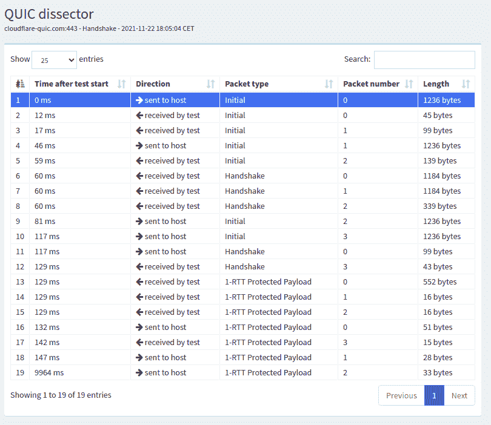

图 100：从 cloudflare-quic.com 获取的 quic tracker 跟踪示例，展示了成功的握手#

`1-RTT`数据包也有所不同。服务器发送的第一个`1-RTT`数据包包含`HANDSHAKE_DONE`帧，一个带有两个`TLS New Session Ticket`消息的`CRYPTO`帧和一个创建一个流的`STREAM`帧。然后服务器发送两个短数据包。每个数据包都包含一个创建新流的`STREAM`帧。这两个短数据包本可以打包在服务器发送的第一个`1-RTT`数据包中。与`nghttp2.org`相比，`cloudflare-quic.com`并没有宣布新的连接标识符。

我们的第三个例子是[picoquic](https://github.com/private-octopus/picoquic)。[使用 test.privateoctopus.com 进行的 QUIC tracker 跟踪](https://quic-tracker.info.ucl.ac.be/traces/20211122/159)包含 13 个数据包。

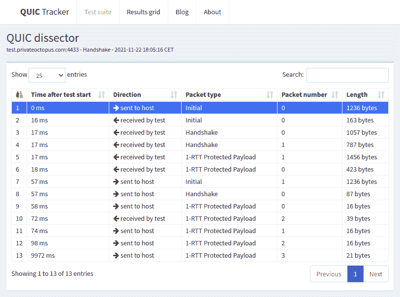

图 101：从`test.privateoctopus.com`获取的 QUIC tracker 跟踪示例，展示了成功的握手#

picoquic 使用 64 位长的连接标识符。它设法将其`TLS Encrypted Extensions`放入两个`Handshake`数据包中。它发送的第一个`1-RTT`数据包包含一个`PING`帧。第二个`1-RTT`数据包包含一个`CRYPTO`帧，宣布了一个`TLS New Session Ticket`，三个`NEW_CONNECTION_ID`帧和一个`NEW_TOKEN`帧。这个测试服务器与另外两个不同，没有尝试创建新的流。

注意

比较 QUIC 服务器

使用 QUIC 跟踪器收集的跟踪来分析不同服务器如何选择 QUIC 的一些可选功能是非常有趣的。服务器之间的第一个区别是服务器选择的连接标识符的长度。下面的图表显示，在 2021 年 11 月，许多服务器广告了 8 字节的 CIDs，但有些选择了更长的 CIDs。

(`源代码`, `png`, `hires.png`, `pdf`)

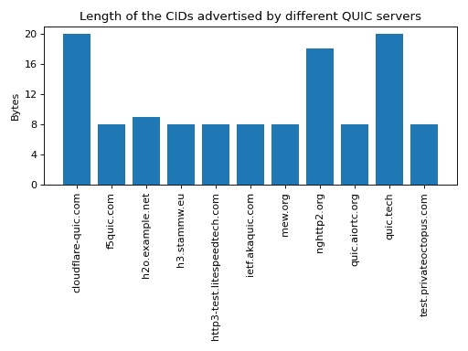

图 102 不同 QUIC 服务器广告的连接标识符长度（2021 年 11 月）#

#### 观察 QUIC 中的 0-RTT 数据#

能够立即发送数据是 QUIC 设计的要求之一。观察 QUIC 如何使用 `0-RTT` 数据包来实现这一目的是非常有趣的。我们使用了一个 [QUIC 跟踪器和 picoquic 之间的跟踪](https://quic-tracker.info.ucl.ac.be/traces/20211122/619)作为我们的例子。这个跟踪覆盖了 图 104 中显示的两个 QUIC 连接。

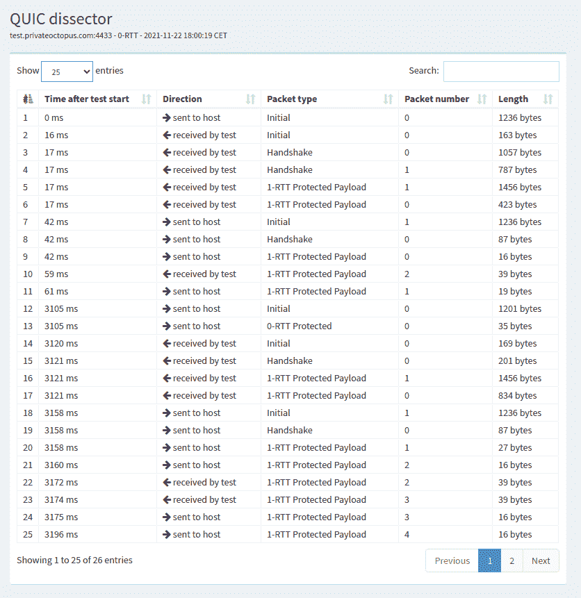

图 104 使用 `test.privateoctopus.com` 的示例 QUIC 跟踪，包含 0-RTT 数据包#

在第一次 QUIC 连接期间，QUIC 跟踪器在服务器发送的包含在 1-RTT 数据包中的 `CRYPTO` 帧中接收一个 TLS 会话票据，该数据包的包号设置为 0。这个票据包含服务器在后续连接中检索密钥所需的所有信息。QUIC 跟踪器通过发送一个 `Initial` 数据包开始第二个连接。这个数据包包含一个 `CRYPTO` 帧，其中包含 `TLS Client Hello` 消息。将这个 `TLS Client Hello` 与用于创建第一个连接的 `TLS Client Hello` 进行比较，可以看出后者包含 `psk_key_exchange_modes` TLS 扩展。这个扩展包含使服务器能够恢复用于解密 `0-RTT` 数据包所需的密钥的信息。在这个例子中，客户端发送了一个包含简单 `HTTP GET` 开始部分的 `0-RTT`。

#### QUIC 流#

由于 QUIC 支持多个流，分析如何在真实的 QUIC 连接中管理这些流是非常有趣的。在这个例子中，我们使用了一个 [QUIC 跟踪器和 quic.tech 之间的跟踪](https://quic-tracker.info.ucl.ac.be/traces/20211122/375)，总结在 图 105。在示例中，QUIC 跟踪器创建了四个流，并通过每个流发送一个 `HTTP GET` 请求。

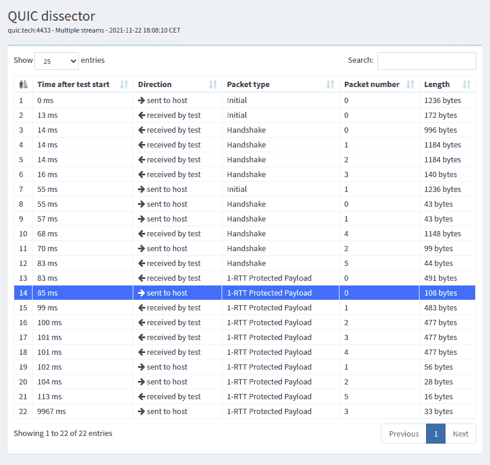

图 105 使用 quic.tech 的样本 QUIC 跟踪，包含多个流#

在这个跟踪中，客户端在其第一个 `STREAM` 帧中创建了四个流，这个 `STREAM` 帧是在第一个 `1-RTT` 数据包中发送的。列表 18 展示了这些 `STREAM` 帧中的第一个。`STREAM` 的 `Type` 字段是一个字节，结构为 `0b00001OLF`，其中 `O` 如果 `STREAM` 帧包含 `Offset` 字段则设置为 `1`。位 `L` 如果帧包含 `Length` 字段则设置为 `1`。最后，`F` 设置为 `1` 以标记 `STREAM` 的结束。在这个测试中，QUIC Tracker 通过每个流发送 17 字节并关闭它。

列表 18 由 QUIC Tracker 发送的第一个 QUIC STREAM 帧#

```sh
STREAM Frame {
 Type (i) = 0b00001011,  # Offset=0, Length=1, FIN=1
 Stream ID = 8,
 Length = 17,
 Stream Data = GET /index.html\r\n
} 
```

服务器在每个响应中发送一个 `STREAM` 帧。列表 19 展示了服务器返回的帧。其 `Offset` 位被设置为 `1`。它携带整个 HTML 页面，并且由于这是流的第一个帧，其 `Offset` 字段可以被忽略。

列表 19 服务器返回的 QUIC STREAM 帧#

```sh
STREAM Frame {
 Type (i) = 0b00001111,  # Offset=1, Length=1, FIN=1
 Stream ID = 8,
 Offset = 0,
 Length = 462,
 Stream Data = <!DOCTYPE html>...
} 
```

脚注

## 帧和包#

QUIC 与经典协议（如 TCP 或 UDP）之间存在一个重要的区别。TCP 和 UDP 发送由头部和随后构成有效载荷的字节序列组成的段。相比之下，类似于 SCTP，一个 QUIC 数据包包含一个头部后跟一个或多个帧。QUIC 头部比 TCP 头部简单得多，也更短。它只携带所有 QUIC 数据包所需的信息。我们将在后面描述短和长 QUIC 头部。每个 QUIC 头部以一个包含一些标志和 32 位版本字段的字节开始。QUIC 定义了不同类型的帧，我们将在本章中讨论。一些类型的 QUIC 帧携带用户数据。其他类型的 QUIC 帧携带控制信息。其中一些帧仅在握手期间使用，而其他如确认可以在任何时候发送。每个 QUIC 帧是一系列以一个字节类型字段开始的字节。图 85 展示了一个包含两个帧的 QUIC 数据包，这些帧被放置在一个 UDP 数据报中。即使这种对齐对 图 85 很方便，QUIC 头部或 QUIC 帧也不需要对齐在 32 位边界上。需要注意的是，一个 QUIC 数据包可以以任何顺序混合数据和控制帧。


图 85 一个 QUIC 数据包包含在一个 UDP 数据报中，并包含一个或多个 QUIC 帧

## 连接建立#

QUIC 使用四次握手来创建 QUIC 连接。图 86 描述了此握手过程。QUIC 握手有三个主要目的。首先，它允许协商用于加密和验证随后在连接上发送的数据包所需的加密密钥。这主要使用 TLS 1.3 [**RFC 8446**](https://datatracker.ietf.org/doc/html/rfc8446.html) 完成。其次，它允许使用传输参数协商不同的选项。第三，服务器可以验证客户端能否对发送初始数据包时使用的地址做出响应。这种验证可以防止使用伪造地址进行的拒绝服务攻击。


图 86 简化的 QUIC 握手

客户端发送一个包含 `CRYPTO` 帧的 `Initial` 数据包。此数据包携带客户端为该连接提出的 `TLS Client Hello` 和传输参数。服务器以包含 `CRYPTO` 帧的 `Initial` 数据包作为回复。这个数据包包含 `TLS Server Hello`。紧接着是一个或多个包含 `TLS Encrypted Extensions` 的 `Handshake` 数据包，这些数据包也包含 `CRYPTO` 帧。该帧的内容使用从 `TLS Client Hello` 和 `TLS Server Hello` 中提取的信息派生的会话密钥进行加密。它主要包含服务器的证书和传输参数。这个帧可以分布在多个 QUIC 数据包中。客户端以包含带有 `TLS Finished` 消息的 `CRYPTO` 帧的 `Handshake` 数据包作为回复。服务器随后通过发送 `Handshake_Done` 帧来确认 TLS 握手的结束。

在查看加密参数协商的细节之前，看看 QUIC 如何对抗使用伪造地址的拒绝服务攻击是有趣的。在此类攻击期间，主机 x 使用主机 y 的地址作为其源地址发送数据包。此类攻击的主要风险是，尽管拥有该地址的主机没有尝试与服务器建立 QUIC 连接，但服务器可能会向地址 y 发送大量数据包。QUIC 通过使用两种不同的技术来防止此类攻击。首先，这对于传输协议来说是不寻常的，客户端发送的初始 QUIC 数据包很大。创建 QUIC 连接时发送的第一个数据包必须包含至少 1200 字节的 UDP 有效负载[**RFC 9000**](https://datatracker.ietf.org/doc/html/rfc9000.html)。这样的数据包包含一个如图所示的 CRYPTO 帧，但也包含填充帧以填充数据包。如果攻击者想要发送伪造的数据包以与服务器建立连接，它需要为每个连接尝试发送超过 1K 字节。这应该与必须发送以启动 TCP 连接的 TCP 和 IPv4 头部 40 字节进行比较。发送大型初始数据包的另一个优点是，客户端还可以执行路径 MTU 发现并检测可能会分片 QUIC 数据包的路由器。

注意

地址伪造

理论上，一个互联网主机应该只使用其分配的 IPv4 和 IPv6 源地址发送数据包。实际上，配置错误的宿主机可能会使用除其分配地址以外的其他地址。此外，攻击者经常更改其源地址以隐藏其部分活动。常见的情况是拒绝服务（DoS）攻击。简单的 DoS 攻击是指一个主机向受害者发送大量数据包。如果攻击者使用除其官方 IP 地址以外的其他地址发送这些数据包，那么受害者识别攻击源会更加困难。

但还有一种更令人担忧的拒绝服务（DoS）攻击类别。如果一个攻击者可以使用受害者的源地址向服务器发送数据包，服务器就会向受害者返回响应。这些攻击者使用发送大量响应的互联网服务器，可能使用多个数据包来响应一个请求数据包。他们已经利用了 DNS、NTP 等协议，以及[memcached](https://www.memcached.org/)等应用程序。这类攻击的主要问题是服务器放大了客户端产生的攻击量。由于互联网上有非常强大的服务器，这可能会成为一个大问题，并且这种攻击的规模已经达到了数百 Gbps。IETF 和网络运营商已经发布了配置接入网络以阻止伪造数据包的建议[**RFC 2827**](https://datatracker.ietf.org/doc/html/rfc2827.html)。不幸的是，互联网上仍有部分区域，攻击者可以发送伪造的数据包[[LBKKKC2019]](../bibliography.html#lbkkkc2019)。

针对使用伪造数据包的拒绝服务攻击的第二种缓解措施在服务器端操作。当服务器从客户端接收到一个初始数据包时，它可能会以一个初始数据包作为响应，如图 图 86 所示。这可能是一个企业服务器从已知企业子网的主机接收请求的情况。服务器也可能想要验证客户端并确认客户端能够接收它发送的数据包。为此，它返回一个重试帧和一个令牌。这个令牌是一个不透明的字段，其构造方式使得服务器很容易验证随后的客户端数据包，而客户端很难预测服务器将创建的令牌。一种可能的方法是计算包含客户端使用的源 IP 地址和端口的消息的安全哈希值，这个秘密值只有服务器知道，并且可能包含一些时间信息，以便服务器能够忽略较旧的令牌。面对相同的问题，TCP syn cookies 使用更少的位进行编码，因此本质上更不安全。图 87 展示了一个包含客户端地址验证的 QUIC 握手。


图 87 带有地址验证的简化版 QUIC 握手

地址验证提高了服务器对使用伪造地址的拒绝服务攻击的弹性，但这也带来了更长的连接建立延迟。QUIC 版本 1 包含了多种额外的技术，以减少地址验证的影响，同时仍然防止拒绝服务攻击。

### 识别 QUIC 连接#

一个 TCP 连接由一个四元组 $ IP_{Client},IP_{Server},Port_{Client},Port_{Server} $ 确定。属于给定连接的所有数据包都在它们的 IP 和 TCP 头部中携带此信息。由于 QUIC 在 UDP 之上运行，一个简单的方法可能是使用 UDP 四元组来标识每个 QUIC 连接。虽然简单，但这个解决方案会严重限制 QUIC 的灵活性和 QUIC 服务器的可扩展性。QUIC 设计者选择了由客户端和服务器选择的本地唯一连接标识符（CID）。这些标识符在握手过程中放置在 QUIC 数据包头部。当发送初始数据包时，客户端选择一个源 CID，该 CID 在客户端上唯一标识连接，并选择一个随机的目标 CID。在接收到这个数据包后，服务器选择它自己的连接标识符。它回显客户端选择的 CID 并返回它选择的 CID。这如图 图 88 所示。


图 88 简化版 QUIC 握手过程中的连接标识符

客户端和服务器选择的连接标识符唯一地标识了 QUIC 连接。然而，与 TCP 和 UDP 不同，这两个标识符并不出现在所有数据包中。由于主机为每个连接选择一个唯一的标识符，它只需要这个标识符来识别一个数据包所属的连接。因此，握手之后在连接上交换的 QUIC 数据包只包含目的 CID，即接收数据包的主机选择的 CID。

注意

可变长度 CID

大多数传输协议依赖于固定长度的字段，因为这简化了数据包头的解析。例如，TCP 和 UDP 端口号被编码为 16 位字段。然而，使用固定长度的字段也限制了协议的可扩展性。TCP 服务器无法监听超过$ 2^{16} $个不同的端口。

QUIC 选择了可变长度的 CIDs 来支持非常不同的用例。在服务器端，所选连接标识符的长度将取决于服务器的架构。大型站点可能会使用负载均衡器，将连接分发到不同的物理服务器。这样的负载均衡器可以利用 CID 将每个传入的数据包直接导向处理该连接的服务器。一个简单的 CID 可以由负载均衡器选择的服务器标识符组成，例如在 CID 的高位，后面跟着物理服务器选择的连接标识符。其他设计也是可能的，例如通过加密 CID 来防止恶意客户端尝试针对特定服务器的攻击。

在客户端，可变长度的 CIDs 带来了另一个好处。由于客户端通常只管理少量 QUIC 连接，它们可以简单地依靠接收到的数据包的目的端口来识别相应的 QUIC 连接。这对应于零长度的连接标识符。这种 CID 在握手之后永远不会由服务器发送。这限制了客户端接收到的数据包的字节开销。

关于这些 CIDs 的最后一个要注意的点是在 QUIC 数据包中的编码。初始数据包包含两个连接标识符的长度和值。CID 的最大长度为 20 字节。然而，在握手之后，通过 QUIC 连接交换的数据包只包含目的 CID，没有任何字段指示其长度。分配了 CID 的主机知道它使用的 CID 的长度，因此可以在没有显式长度信息的情况下解析它接收到的数据包。

### 安全密钥#

我们现在可以讨论 QUIC 如何利用 TLS 1.3 协商用于验证和加密连接上交换的数据包的安全密钥。如图 86 所示，QUIC 连接从交换四个帧开始，这些帧可以包含在四个或更多数据包中。客户端发送的第一个数据包包含`ClientHello` TLS 记录。`ClientHello`包含使用 Diffie-Hellman 或类似协议派生会话密钥所需的信息。TLS 1.3 支持有限域 Diffie-Hellman 和椭圆曲线 Diffie-Hellman [**RFC 8446**](https://datatracker.ietf.org/doc/html/rfc8446.html)。`ClientHello`消息还包含客户端在连接期间提议使用的 TLS 或 QUIC 参数。服务器返回的`TLS 服务器问候`包含证书，使客户端能够验证服务器的身份以及确定 Diffie-Hellman 密钥所需的信息。使用这些密钥，服务器还加密了包含服务器根据`ClientHello`中提出的参数选择的 TLS 和 QUIC 参数的`TLS 加密扩展`消息。服务器还构建了包含整个 TLS 握手计算的消息认证码的`Finished`消息。此消息使用从 Diffie-Hellman 密钥派生的会话密钥加密和验证。客户端和服务器重新计算整个握手的哈希值并验证两个`Finished`消息。如果其中一个消息不正确，这表明密钥没有被正确派生，或者某些 TLS 消息已被篡改。在这些情况下，QUIC 连接将终止并显示错误消息。QUIC 使用的简化 TLS 握手如图 89 所示。以斜体显示的 TLS 消息使用会话密钥加密。


图 89 QUIC 连接中的简化 TLS 握手

注意

加密`TLS 客户端问候`和`TLS 服务器问候`

当 TLS 1.3 在 TCP 之上使用时，`TLS 客户端问候`和`TLS 服务器问候`消息以明文形式发送，因为客户端和服务器尚未交换会话密钥。对于 QUIC，也可以采用类似的方法，但担心中间盒可能会分析这些初始 QUIC 消息的内容并试图干扰它们。为了给这些中间盒增加一些负担，QUIC 使用从客户端的第一个初始数据包的目的连接 ID 派生出的秘密来加密初始数据包。下面的伪代码，摘自[**RFC 9001**](https://datatracker.ietf.org/doc/html/rfc9001.html)，展示了客户端和服务器密钥是如何派生的：

```sh
initial_salt = 0x38762cf7f55934b34d179ae6a4c80cadccbb7f0a
initial_secret = HKDF-Extract(initial_salt,
                        client_dst_connection_id)

client_initial_secret = HKDF-Expand-Label(initial_secret,
             "client in", "", Hash.length)
server_initial_secret = HKDF-Expand-Label(initial_secret,
                           "server in", "",Hash.length) 
```

由于用于保护初始数据包的密钥是从目标连接 ID 派生出来的，因此任何 QUIC 实现都可以解密初始数据包的内容，包括那些用于中间盒子的实现。

如前所述，客户端和服务器还可以使用 TLS 握手来协商特定的 QUIC 参数。这些参数在 QUIC 中被称为传输参数 [**RFC 9000**](https://datatracker.ietf.org/doc/html/rfc9000.html)。QUIC 版本 1 [**RFC 9000**](https://datatracker.ietf.org/doc/html/rfc9000.html) 中定义了 17 个不同的传输参数，实现者可以定义自己的传输参数。我们将在本文件的各个部分中讨论其中的一些。第一个例子是 `max_udp_payload_size` 参数，它表示实现者愿意接收的最大 UDP 有效载荷大小。此参数的最小值为 1200 字节。在支持巨型以太网帧的数据中心中使用的 QUIC 实现可以协商一个更大的 `max_udp_payload_size`，而不会存在数据包分片的风险。

QUIC 传输参数的另一个例子是 `initial_source_connection_id` 和 `original_destination_connection_id` 传输参数。如上所述，由于 TLS 握手中的 `Finished` 消息，客户端和服务器可以验证他们的消息没有被篡改。不幸的是，包含在 `Finished` 消息中的认证代码仅基于 TLS 消息的内容（即 `ClientHello`、`ServerHello`、`EncryptedExtensions` 和 `Finished`）进行计算。在握手过程中，客户端和服务器还提出了他们计划用于识别 QUIC 会话的源和目标连接标识符。这些标识符被放置在数据包头部，而不是 TLS 消息内部。因此，它们不受 `Finished` 消息中包含的认证代码的保护。为了仍然对这些标识符进行认证，QUIC 将它们编码为传输参数，这些参数包含在 `ClientHello` 和 `EncryptedExtensions` 消息中。客户端将其源连接标识符复制到 `initial_source_connection_id` 传输参数中，并在其 `ClientHello` 中进行操作。服务器在发送 `ServerHello` 时也这样做。它还在 `original_destination_connection_id` 传输参数中复制客户端用于发送包含 `ClientHello` 的数据包的目标标识符。

### QUIC 数据包头部#

在这个阶段，QUIC 会话和 TLS 安全密钥已由客户端和服务器所知。它们可以开始交换数据。在查看数据如何在 QUIC 数据包内部传输之前，深入探讨每个数据包内放置的数据包头部是非常有趣的。QUIC 使用可变长度的数据包头部。存在两种不同的头部格式。第一种头部格式是长头部。这是用于 QUIC 连接第一个数据包的头部。

互联网协议规范通常包含图表来表示数据包头部的格式。这种图形格式对于快速掌握包含固定大小字段的头部非常有用。然而，当头部包含多个可变长度字段时，图形表示可能变得难以追踪。QUIC 规范[**RFC 9000**](https://datatracker.ietf.org/doc/html/rfc9000.html)使用了与 TLS 协议相同的文本表示。作为一个例子，让我们考虑众所周知的 TCP 头部。该头部如图图 90 所示进行图形表示。


图 90：TCP 头部的图形表示 列表 2：TCP 头部的文本表示#

```sh
TCP Header Packet {
 Source Port (16),
 Destination Port (16),
 Sequence Number (32),
 Acknowledgment Number (32),
 Offset (4),
 Reserved (6),
 Urgent Flag (1),
 ACK Flag (1),
 Push Flag (1),
 RST Flag (1),
 SYN Flag (1),
 FIN Flag(1),
 Window (16),
 TCP Checksum (16),
 Urgent Pointer (16),
 TCP Options (..)
} 
```

仔细阅读的读者会很容易理解两种格式之间的对应关系。在解释 QUIC 时，我们使用文本表示，而坚持使用图形表示来解释 TCP。

列表 3 显示了 QUIC 长头部。它以一个字节开始，该字节包含在最高有效位中的头部类型，两个位表示数据包类型，以及四个位，这些位对每个数据包都是特定的。然后，32 位携带 QUIC 版本号。QUIC 的当前版本，定义在[**RFC 9000**](https://datatracker.ietf.org/doc/html/rfc9000.html)中，对应于版本`0x00000001`。然后头部包含之前描述的目标和源连接标识符，然后是一个针对每种类型的特定有效负载。

列表 3：QUIC 长头部#

```sh
Long Header Packet {
 Header Form (1) = 1,                  /* high order bit of the first byte */
 Fixed Bit (1) = 1,                    /* second order bit of the first byte */
 Long Packet Type (2),                 /* third and fourth high order bits of the first byte */
 Type-Specific Bits (4),               /* low order four bits of the first byte */
 Version (32),                         /* 32 bits version number */
 Destination Connection ID Length (8), /* 8 bits */
 Destination Connection ID (0..160),   /* variable number from 0 up to 160 bits */
 Source Connection ID Length (8),
 Source Connection ID (0..160),
 Type-Specific Payload (..),           /* variable length */
} 
```

注意

编码数据包编号

大多数传输协议使用固定字段来编码数据包编号或字节偏移。这个字段的大小始终是一个权衡。一方面，小的数据包编号字段限制了每个数据包的额外开销。另一方面，需要较大的数据包编号空间以确保携带不同数据的两个数据包不使用相同的数据包编号。TCP 使用 32 位序列号字段，该字段指示有效负载的第一个字节在字节流中的位置。随着带宽增加到 Gbps 及以上，这个 32 位字段引起了关注[**RFC 7323**](https://datatracker.ietf.org/doc/html/rfc7323.html)。

QUIC 对序列号采取了不同的方法。每个数据包包含一个按数据包序列号。这个数字被编码为一个可变长度整数(`varint`)。这样的`varint`在第一个字节的两个最高有效位中编码了长度。如果这些位设置为`00`，则`varint`在单个字节中编码，可以包含从$ 0 $到$ 2^{6}-1 $的值。如果两个最高有效位设置为`01`，则`varint`可以在两个字节内编码从$ 0 $到$ 2^{14}-1 $的值。当两个高阶位设置为`11`时，`varint`可以在四个字节内编码从$ 0 $到$ 2^{62}-1 $的值。

考虑到数据包编号时，QUIC 与其他传输协议之间存在其他重要差异。首先，QUIC 发送者必须**永远**不要在 QUIC 连接上发送的两个不同数据包中重复使用相同的包编号。如果需要重传数据，它将以新数据包中的帧形式重新发送。此外，由于可能的最大包编号是$ 2^{62}-1 $，一旦发送了携带此包编号的 QUIC 数据包，QUIC 发送者必须关闭相应的连接。这限制了 QUIC 连接的持续时间。与用于支持路由器之间 BGP 会话的 TCP 连接不同，它们不能永远持续。使用 QUIC 的应用程序必须随时准备重新启动连接。

这个长标题用于`Initial`、`Handhsake`和`Retry`数据包。这些数据包类型中的一些在第一个字节中添加了新的标志，并在连接标识符之后添加了附加信息。列表 4 显示了`Initial`数据包的长标题。它包含第一个字节中的两个位，表示数据包编号字段的长度。数据包特定部分包含一个选项令牌、一个长度字段、一个数据包编号和一个有效载荷。令牌长度、长度和数据包编号使用可变长度整数进行编码。

列表 4 QUIC `Initial`数据包的长标题#

```sh
Initial Packet {
 Header Form (1) = 1,                   /* High order bit first byte */
 Fixed Bit (1) = 1,
 Long Packet Type (2) = 0,
 Reserved Bits (2),
 Packet Number Length (2),              /* Low order 2 bits of first byte */
 Version (32),
 Destination Connection ID Length (8),
 Destination Connection ID (0..160),
 Source Connection ID Length (8),
 Source Connection ID (0..160),
 Token Length (i),
 Token (..),
 Length (i),
 Packet Number (8..32),
 Packet Payload (8..),
} 
```

QUIC 的短标题包含的字段较少。第一个字节的最显著位设置为 1，以指示该数据包携带短标题。其他标志将在后面讨论。这个字节的最不显著两位包含数据包编号字段的长度。值得注意的是，与长标题相比，没有明确指示目标连接标识符的长度。这个连接标识符已被接收此数据包的主机分配，并且它已经知道它使用的连接标识符的长度。

列表 5 1-RTT 数据包使用的 QUIC 短标题#

```sh
1-RTT Packet {
 Header Form (1) = 0,                /* High order bit of first byte */
 Fixed Bit (1) = 1,
 Spin Bit (1),
 Reserved Bits (2),
 Key Phase (1),
 Packet Number Length (2),           /* Low order bits of first byte */
 Destination Connection ID (0..160),
 Packet Number (8..32),
 Packet Payload (8..),
} 
```

短头格式，如图 列表 5 所示，在会话密钥生成后由所有 QUIC 数据包使用。这通常发生在一次往返时间之后。这些数据包在 QUIC 规范 [**RFC 9000**](https://datatracker.ietf.org/doc/html/rfc9000.html) 中被称为 1-RTT 数据包。这种表示法用于强调 QUIC 也支持 0-RTT 数据包，即携带数据并且可以与 TLS 握手并行交换的数据包。

注意

数据包合并

除了连接标识符之外，短头和长头之间的另一个区别是长头中存在 `数据包长度` 字段。这个字段可能会让熟悉 UDP 的读者感到惊讶，因为 UDP 也包含长度字段。由于每个 QUIC 数据包都放置在一个 UDP 消息中，QUIC 长度字段可能看起来是多余的。这个长度字段被包含在 QUIC 长头中，以便允许 QUIC 发送者将多个连续的小数据包合并成一个单独的 UDP 消息。在握手过程中交换的一些帧相当小。为每个这样的帧发送一个 UDP 消息将会是资源的浪费。此外，在创建 QUIC 连接时，会交换 `初始`、`握手` 和 `0-RTT` 数据包的混合。要求使用一个 UDP 消息来发送这些数据包中的每一个是不明智的。你可能会在分析收集在 QUIC 服务器上的数据包跟踪时观察到这种优化。

### 0-RTT 数据#

延迟是传输协议的关键关注点。我们至今所描述的 QUIC/TLS 握手允许客户端和服务器在单程往返时间内就安全密钥达成一致。然而，对于某些应用程序来说，单程往返时间可能是一个较长的延迟。为了最小化连接设置时间的影响，QUIC 允许应用程序在 QUIC/TLS 握手期间交换数据。这种数据称为 0-RTT 数据。为了确保 0-RTT 数据的安全交换，客户端和服务器必须事先就一个可以用来加密和验证 0-RTT 数据的密钥达成一致。这样的 0-RTT 密钥可以是客户端和服务器在没有使用 QUIC 协议的情况下共享的预共享密钥，或者，这是最常见的方法，是他们在之前连接中协商的密钥。在实践中，服务器通过向客户端发送 TLS 会话票据来启用 0-RTT[**RFC 8446**](https://datatracker.ietf.org/doc/html/rfc8446.html)。会话票据是一个包含使服务器能够恢复会话所有状态信息（包括其会话密钥）的加密记录。它还与客户端的地址相关联，以便服务器能够验证给定的客户端是否重用了它之前收到的票据。通常，这些票据还包含一个过期日期。客户端将收到的票据放入它发送的第一个 `Initial` 数据包中的 `TLS Client Hello`。它使用与该票据对应的预共享密钥来加密数据并将其放入一个或多个 `0-RTT` 数据包中。服务器使用票据中包含的信息恢复密钥并解密 `0-RTT` 数据包的数据。列表 6 显示了 QUIC 的 0-RTT 数据包格式。

列表 6 QUIC 0-RTT 数据包#

```sh
0-RTT Packet {
 Header Form (1) = 1,                  /* High order bit of the first byte */
 Fixed Bit (1) = 1,
 Long Packet Type (2) = 1,
 Reserved Bits (2),
 Packet Number Length (2),            /* Low order bits of the first byte */
 Version (32),
 Destination Connection ID Length (8),
 Destination Connection ID (0..160),
 Source Connection ID Length (8),
 Source Connection ID (0..160),
 Length (i),
 Packet Number (8..32),
 Packet Payload (8..),
} 
```

这些 `0-RTT` 数据包的主要好处是客户端可以在发送其 `Initial` 数据包的同时立即发送加密数据。这在图 91 中有说明，其中使用 0-RTT 密钥加密的帧以斜体显示。请注意，其中一些帧可以跨越多个数据包。`0-RTT` 数据包仅由 QUIC 客户端发送，因为服务器可以在发送其 `Handshake` 数据包后立即发送加密数据。如前所述，初始数据包也是加密的，但使用从连接标识符派生的密钥。


图 91 带有 0-RTT 数据的简化 QUIC 握手

注意

重放攻击和 0-RTT 数据包

多亏了 0-RTT 数据包，客户端可以在等待安全握手之前向服务器发送加密数据。这减少了数据传输的延迟，但有一个重要的注意事项。QUIC 不提供任何保证，0-RTT 数据不会被重放。QUIC 交换的 0-RTT 数据旨在用于幂等操作。关于重放攻击影响的具体讨论，请参阅[[MacCarthaigh2017]](../bibliography.html#maccarthaigh2017)。

为了理解这些重放攻击的重要性，让我们考虑一个简单的 HTTP GET 请求。这样的请求可以很容易地放入 0-RTT 数据包中，从而具有更低的延迟。如果网页浏览器使用它来请求静态`index.html`文件，如果服务器收到两次请求，则没有害处。然而，如果 GET 请求是 REST API 的一部分并且有副作用，那么问题将取决于副作用类型。考虑一个允许用户通过智能手机关闭灯光的 REST API。重放这个请求两到三次将始终导致灯光关闭。然而，如果用户请求将室温提高 1°C，那么多次重放显然会有不同的后果。

### 识别 QUIC 连接#

TCP 连接由一个四元组 $ IP_{Client},IP_{Server},Port_{Client},Port_{Server} $ 来标识。属于给定连接的所有数据包在其 IP 和 TCP 头部中携带此信息。由于 QUIC 在 UDP 之上运行，一个简单的方法本可以使用 UDP 四元组来标识每个 QUIC 连接。尽管简单，但这个解决方案会严重限制 QUIC 的灵活性和 QUIC 服务器的可扩展性。QUIC 的设计者选择了由客户端和服务器选择的本地唯一连接标识符（CID）。这些标识符在握手过程中放置在 QUIC 数据包头部。当发送初始数据包时，客户端选择一个源 CID，该 CID 唯一标识客户端上的连接，以及一个随机的目标 CID。在接收到这个数据包后，服务器选择它自己的连接标识符。它回显客户端选择的 CID 并返回它选择的 CID。这如图图 88 所示。


图 88 简化 QUIC 握手过程中的连接标识符

客户端和服务器选择的连接标识符唯一标识了 QUIC 连接。然而，与 TCP 和 UDP 不同，这两个标识符并不存在于所有数据包中。由于主机为每个连接选择一个唯一的标识符，它只需要这个标识符来识别一个数据包所属的连接。因此，握手之后在连接上交换的 QUIC 数据包只包含目标 CID，即接收数据包的主机选择的 CID。

注意

可变长度 CIDs

大多数传输协议依赖于固定长度的字段，因为这简化了数据包头的解析。例如，TCP 和 UDP 端口号被编码为 16 位字段。然而，使用固定长度字段也限制了协议的可扩展性。TCP 服务器不能监听超过$ 2^{16} $个不同的端口。

QUIC 选择了可变长度 CID 以支持非常不同的用例。在服务器端，所选连接标识符的长度将取决于服务器的架构。大型站点可能会使用负载均衡器，将连接分发到不同的物理服务器。这样的负载均衡器可以利用 CID 将每个传入的数据包定向到处理该连接的服务器。一个简单的 CID 可以由负载均衡器选择的服务器标识符组成，例如在 CID 的高位，然后是物理服务器选择的连接标识符。其他设计也是可能的，例如通过加密 CID 来防止恶意客户端尝试针对特定服务器的攻击。

在客户端，可变长度的 CIDs 带来了另一个好处。由于客户端通常管理少量 QUIC 连接，它们可以简单地依靠接收到的数据包的目的端口来识别相应的 QUIC 连接。这对应于零长度的连接标识符。这种 CID 在握手之后永远不会由服务器发送。这限制了客户端接收到的数据包的字节开销。

关于这些 CIDs 的最后一个需要注意的点是在 QUIC 数据包内的编码。初始数据包包含连接标识符的长度和值。CID 的最大长度为 20 字节。然而，在握手之后，通过 QUIC 连接交换的数据包只包含目的 CID，没有任何字段指示其长度。分配了 CID 的主机知道它使用的 CID 的长度，因此可以在没有显式长度信息的情况下解析它接收到的数据包。

### 安全密钥#

我们现在可以讨论 QUIC 如何利用 TLS 1.3 协商用于验证和加密连接上交换的数据包的安全密钥。如图图 86 所示，QUIC 连接从交换四个帧开始，这些帧可以包含在四个或更多数据包中。客户端发送的第一个数据包包含`ClientHello` TLS 记录。`ClientHello`包含使用 Diffie-Hellman 或类似协议派生会话密钥所需的信息。TLS 1.3 支持有限域 Diffie-Hellman 和椭圆曲线 Diffie-Hellman [**RFC 8446**](https://datatracker.ietf.org/doc/html/rfc8446.html)。`ClientHello`消息还包含客户端在连接期间提议使用的 TLS 或 QUIC 参数。服务器返回的`TLS 服务器问候`包含证书，使客户端能够验证服务器的身份以及确定 Diffie-Hellman 密钥所需的信息。使用这些密钥，服务器还加密了包含服务器根据`ClientHello`中提出的参数选择的 TLS 和 QUIC 参数的`TLS 加密扩展`消息。服务器还构建了包含整个 TLS 握手计算的消息认证码的`Finished`消息。此消息使用从 Diffie-Hellman 密钥派生的会话密钥加密和验证。客户端和服务器重新计算整个握手的哈希值并验证两个`Finished`消息。如果其中一个消息不正确，这表明密钥可能没有正确派生，或者某些 TLS 消息已被篡改。在这些情况下，QUIC 连接将终止并显示错误消息。QUIC 使用的简化 TLS 握手如图图 89 所示。以斜体显示的 TLS 消息使用会话密钥加密。


图 89：QUIC 连接中的简化 TLS 握手

注意

加密`TLS 客户端问候`和`TLS 服务器问候`

当 TLS 1.3 在 TCP 之上使用时，`TLS 客户端问候`和`TLS 服务器问候`消息以明文形式发送，因为客户端和服务器尚未交换会话密钥。对于 QUIC，也可以采用类似的方法，但担心中间盒可能会分析这些初始 QUIC 消息的内容并试图干扰它们。为了给这些中间盒增加一些负担，QUIC 使用从客户端的第一个初始数据包的目的连接 ID 派生出的秘密来加密初始数据包。下面的伪代码，摘自[**RFC 9001**](https://datatracker.ietf.org/doc/html/rfc9001.html)，展示了客户端和服务器密钥是如何派生的：

```sh
initial_salt = 0x38762cf7f55934b34d179ae6a4c80cadccbb7f0a
initial_secret = HKDF-Extract(initial_salt,
                        client_dst_connection_id)

client_initial_secret = HKDF-Expand-Label(initial_secret,
             "client in", "", Hash.length)
server_initial_secret = HKDF-Expand-Label(initial_secret,
                           "server in", "",Hash.length) 
```

由于用于保护初始数据包的密钥是从目的连接 ID 派生的，因此任何 QUIC 实现，包括那些用于中间盒子的实现，都可以解密初始数据包的内容。

如前所述，客户端和服务器还可以使用 TLS 握手来商定特定的 QUIC 参数。这些参数在 QUIC 中被称为传输参数[**RFC 9000**](https://datatracker.ietf.org/doc/html/rfc9000.html)。在 QUIC 版本 1 [**RFC 9000**](https://datatracker.ietf.org/doc/html/rfc9000.html)中定义了 17 个不同的传输参数，并且实现可以定义自己的传输参数。我们将在本文档的不同部分讨论其中的一些。第一个例子是`max_udp_payload_size`参数，它表示实现愿意接收的最大 UDP 有效负载。此参数的最小值是 1200 字节。在支持巨型以太网帧的数据中心中使用的 QUIC 实现可以商定一个更大的`max_udp_payload_size`，而不会存在数据包分片的风险。

QUIC 传输参数的另一个例子是`initial_source_connection_id`和`original_destination_connection_id`传输参数。如上所述，由于 TLS 握手中的`Finished`消息，客户端和服务器可以验证他们的消息没有被篡改。不幸的是，包含在`Finished`消息中的认证代码仅基于 TLS 消息的内容（即`ClientHello`、`ServerHello`、`EncryptedExtensions`和`Finished`）进行计算。在握手过程中，客户端和服务器还提出了他们计划使用的源和目的连接标识符，以识别 QUIC 会话。这些标识符被放置在数据包头部，而不是 TLS 消息内部。因此，它们不受`Finished`消息中包含的认证代码的保护。为了仍然对这些标识符进行认证，QUIC 将它们编码为包含在`ClientHello`和`EncryptedExtensions`消息中的传输参数。客户端将其源连接标识符复制到`initial_source_connection_id`传输参数中，并在其`ClientHello`中发送。服务器在发送`ServerHello`时也做同样的事情。它还在`original_destination_connection_id`传输参数中复制客户端用于发送包含`ClientHello`的数据包的目的标识符。

### QUIC 数据包头部#

到目前为止，客户端和服务器都知道了 QUIC 会话和 TLS 安全密钥。它们可以开始交换数据。在查看数据如何在 QUIC 数据包内部传输之前，更深入地探索放置在每个数据包内部的头部是有趣的。QUIC 使用可变长度数据包头部。存在两种不同的头部格式。第一种头部格式是长头部。这是用于 QUIC 连接第一个数据包的头部。

互联网协议规范通常包含图表来表示数据包头部的格式。这种图形格式对于快速掌握包含固定大小字段的头部非常有用。然而，当头部包含多个可变长度字段时，图形表示可能变得难以追踪。QUIC 规范 [**RFC 9000**](https://datatracker.ietf.org/doc/html/rfc9000.html) 使用了与 TLS 协议相同的文本表示。作为一个例子，让我们考虑众所周知的 TCP 头部。该头部在 图 90 中以图形方式表示。


图 90 TCP 头部的图形表示 列表 2 TCP 头部的文本表示#

```sh
TCP Header Packet {
 Source Port (16),
 Destination Port (16),
 Sequence Number (32),
 Acknowledgment Number (32),
 Offset (4),
 Reserved (6),
 Urgent Flag (1),
 ACK Flag (1),
 Push Flag (1),
 RST Flag (1),
 SYN Flag (1),
 FIN Flag(1),
 Window (16),
 TCP Checksum (16),
 Urgent Pointer (16),
 TCP Options (..)
} 
```

仔细阅读的读者会很容易理解两种格式之间的对应关系。当我们解释 QUIC 时，我们使用文本表示，而对于 TCP，我们坚持使用图形表示。

列表 3 展示了 QUIC 长头部。它以一个字节开始，该字节包含头部类型，最高位表示头部类型，接下来两位表示数据包类型，再接下来四位是每个数据包特有的位。然后，32 位携带 QUIC 版本号。当前版本的 QUIC，在 [**RFC 9000**](https://datatracker.ietf.org/doc/html/rfc9000.html) 中定义，对应版本 `0x00000001`。头部接着包含之前描述的目标和源连接标识符，然后是一个针对每种类型的特定有效载荷。

列表 3 QUIC 长头部#

```sh
Long Header Packet {
 Header Form (1) = 1,                  /* high order bit of the first byte */
 Fixed Bit (1) = 1,                    /* second order bit of the first byte */
 Long Packet Type (2),                 /* third and fourth high order bits of the first byte */
 Type-Specific Bits (4),               /* low order four bits of the first byte */
 Version (32),                         /* 32 bits version number */
 Destination Connection ID Length (8), /* 8 bits */
 Destination Connection ID (0..160),   /* variable number from 0 up to 160 bits */
 Source Connection ID Length (8),
 Source Connection ID (0..160),
 Type-Specific Payload (..),           /* variable length */
} 
```

注意

编码数据包编号

大多数传输协议使用固定字段来编码数据包编号或字节偏移。这个字段的大小始终是一个权衡。一方面，小的数据包编号字段限制了每个数据包的额外开销。另一方面，需要较大的数据包编号空间以确保携带不同数据的两个数据包不使用相同的数据包编号。TCP 使用 32 位序列号字段，该字段指示有效载荷的第一个字节在字节流中的位置。随着带宽增加到 Gbps 及以上，这个 32 位字段引起了关注 [**RFC 7323**](https://datatracker.ietf.org/doc/html/rfc7323.html)。

QUIC 对序列号采取了不同的方法。每个数据包包含一个按数据包序列号。此数字编码为变长整数 (`varint`)。这样的 `varint` 在第一个字节的两个最高有效位中编码长度。如果这些位设置为 `00`，则 `varint` 在一个字节中编码，可以包含 $ 0 $ 到 $ 2^{6}-1 $ 之间的值。如果两个最高有效位设置为 `01`，则 `varint` 可以在两个字节内编码 $ 0 $ 到 $ 2^{14}-1 $ 之间的值。当两个最高位设置为 `11` 时，`varint` 可以在四个字节内编码 $ 0 $ 到 $ 2^{62}-1 $ 之间的值。

考虑到包号时，QUIC 与其他传输协议之间存在其他重要差异。首先，QUIC 发送者必须 *永远* 不能在同一个 QUIC 连接上为两个不同的数据包重用相同的包号。如果需要重传数据，它将以新数据包中的帧形式重新发送。此外，由于最大的包号是 $ 2^{62}-1 $，QUIC 发送者必须在发送携带此包号的 QUIC 数据包后关闭相应的连接。这限制了 QUIC 连接的持续时间。与用于支持路由器之间 BGP 会话的 TCP 连接不同，它们不能永远持续。使用 QUIC 的应用程序必须随时准备重新启动连接。

此长头部用于 `Initial`、`Handshake` 和 `Retry` 数据包。这些数据包类型中的一些在第一个字节中添加了新的标志，并在连接标识符之后添加了附加信息。列表 4 展示了 `Initial` 数据包的长头部。它包含第一个字节中的两个位，指示包号字段长度。数据包特定部分包含一个选项令牌、一个长度字段、一个包号和有效载荷。令牌长度、长度和包号使用变长整数进行编码。

列表 4 初始数据包的 QUIC 长头部#

```sh
Initial Packet {
 Header Form (1) = 1,                   /* High order bit first byte */
 Fixed Bit (1) = 1,
 Long Packet Type (2) = 0,
 Reserved Bits (2),
 Packet Number Length (2),              /* Low order 2 bits of first byte */
 Version (32),
 Destination Connection ID Length (8),
 Destination Connection ID (0..160),
 Source Connection ID Length (8),
 Source Connection ID (0..160),
 Token Length (i),
 Token (..),
 Length (i),
 Packet Number (8..32),
 Packet Payload (8..),
} 
```

QUIC 短头部包含的字段较少。第一个字节的最显著位被设置为 1，以指示该数据包携带短头部。其他标志将在后面讨论。该字节两个最低有效位包含包号字段长度。值得注意的是，与长头部相比，没有明确指示目标连接标识符的长度。此连接标识符已由接收该数据包的主机分配，并且它已经知道它使用的连接标识符的长度。

列表 5 1-RTT 数据包使用的 QUIC 短头部#

```sh
1-RTT Packet {
 Header Form (1) = 0,                /* High order bit of first byte */
 Fixed Bit (1) = 1,
 Spin Bit (1),
 Reserved Bits (2),
 Key Phase (1),
 Packet Number Length (2),           /* Low order bits of first byte */
 Destination Connection ID (0..160),
 Packet Number (8..32),
 Packet Payload (8..),
} 
```

短头部格式，如图列表 5 所示，在会话密钥生成后由所有 QUIC 数据包使用。这通常发生在一次往返时间之后。这些数据包在 QUIC 规范中被称为 1-RTT 数据包[**RFC 9000**](https://datatracker.ietf.org/doc/html/rfc9000.html)。这种表示法用于强调 QUIC 也支持 0-RTT 数据包，即携带数据并能与 TLS 握手并行交换的数据包。

注意

合并数据包

除了连接标识符之外，短头部和长头部之间的另一个区别是长头部中存在“数据包长度”字段。这个字段可能会让熟悉 UDP 的读者感到惊讶，因为 UDP 也包含长度字段。由于每个 QUIC 数据包都放置在一个 UDP 消息中，QUIC 长度字段可能看起来是多余的。这个长度字段被包含在 QUIC 长头部中，以便允许 QUIC 发送者将多个连续的小数据包合并到单个 UDP 消息中。在握手过程中交换的一些帧相当小。为每个这样的帧发送一个 UDP 消息将是资源的浪费。此外，在创建 QUIC 连接时，会交换“初始”、“握手”和`0-RTT`数据包的混合。要求使用一个 UDP 消息发送这些数据包中的每一个是不明智的。您可能会在分析收集在 QUIC 服务器上的数据包跟踪时观察到这种优化。

### 0-RTT 数据#

延迟是传输协议的关键关注点。我们之前所描述的 QUIC/TLS 握手允许客户端和服务器在单程往返时间内就安全密钥达成一致。然而，对于某些应用来说，单程往返时间可能是一个较长的延迟。为了最小化连接建立时间的影响，QUIC 允许应用程序在 QUIC/TLS 握手期间交换数据。这种数据被称为 0-RTT 数据。为了确保 0-RTT 数据的安全交换，客户端和服务器必须事先就一个可以用来加密和验证 0-RTT 数据的密钥达成一致。这样的 0-RTT 密钥可以是客户端和服务器在没有使用 QUIC 协议的情况下共享的预共享密钥，或者，这是最常见的方法，是他们在之前的连接中协商的密钥。在实践中，服务器通过向客户端发送 TLS 会话票据来启用 0-RTT [**RFC 8446**](https://datatracker.ietf.org/doc/html/rfc8446.html)。会话票据是一个包含使服务器能够恢复会话所有状态信息（包括其会话密钥）的加密记录。它还与客户端的地址相关联，以便服务器能够验证给定的客户端是否重用了它之前收到的票据。通常，这些票据还包含一个过期日期。客户端将收到的票据放入它发送的第一个`Initial`数据包中的“TLS Client Hello”。它使用与该票据对应的预共享密钥来加密数据并将其放入一个或多个`0-RTT`数据包中。服务器使用票据中包含的信息恢复密钥并解密`0-RTT`数据包的数据。列表 6 展示了 QUIC 的 0-RTT 数据包格式。

列表 6 QUIC 0-RTT 数据包#

```sh
0-RTT Packet {
 Header Form (1) = 1,                  /* High order bit of the first byte */
 Fixed Bit (1) = 1,
 Long Packet Type (2) = 1,
 Reserved Bits (2),
 Packet Number Length (2),            /* Low order bits of the first byte */
 Version (32),
 Destination Connection ID Length (8),
 Destination Connection ID (0..160),
 Source Connection ID Length (8),
 Source Connection ID (0..160),
 Length (i),
 Packet Number (8..32),
 Packet Payload (8..),
} 
```

这些`0-RTT`数据包的主要好处是客户端可以在发送其`Initial`数据包的同时立即发送加密数据。这如图 91（#fig-quic-handshake-ortt）所示，其中用斜体显示了使用 0-RTT 密钥加密的帧。请注意，这些帧中的一些可以跨越多个数据包。`0-RTT`数据包仅由 QUIC 客户端发送，因为服务器可以在发送其`Handshake`数据包后立即发送加密数据。如前所述，Initial 数据包也是加密的，但使用的是从连接标识符派生的密钥。


图 91 带有 0-RTT 数据的简化 QUIC 握手

注意

重放攻击和 0-RTT 数据包

多亏了 0-RTT 数据包，客户端可以在等待安全握手之前向服务器发送加密数据。这降低了数据传输的延迟，但有一个重要的前提。QUIC 不提供任何保证，0-RTT 数据不会被重放。QUIC 交换的 0-RTT 数据旨在用于幂等操作。关于重放攻击影响的具体讨论，请参阅[[MacCarthaigh2017]](../bibliography.html#maccarthaigh2017)。

为了理解这些重放攻击的重要性，让我们考虑一个简单的 HTTP GET 请求。这样的请求可以很容易地放入 0-RTT 数据包中，从而降低延迟。如果网页浏览器使用它来请求静态的`index.html`文件，如果请求被服务器接收两次，则没有害处。然而，如果 GET 请求是 REST API 的一部分并且有副作用，那么问题将取决于副作用类型。考虑一个允许用户通过智能手机关闭灯光的 REST API。重放这个请求两到三次将始终导致灯光关闭。然而，如果用户请求将室温提高 1°C，那么多次重放显然会有不同的后果。

## 关闭 QUIC 连接#

在探索如何在 QUIC 连接上交换数据之前，现在让我们分析如何终止 QUIC 连接。QUIC 支持三种不同的方法来关闭 QUIC 连接。QUIC 终止连接的方法与传统传输协议使用的方法非常不同。在查看这些技术之前，了解 QUIC 如何与网络地址转换交互是非常重要的。

注意

QUIC 和网络地址转换

QUIC 在 UDP 之上运行，QUIC 的设计受到了 NAT（网络地址转换）的强烈影响。NAT 和其他中间盒一样，维护每个流的会话状态。对于 TCP 连接，许多 NAT 依赖于`SYN`、`FIN`和`RST`标志来确定何时为 TCP 连接创建或删除状态。对于 UDP，这种有状态的方法是不可能的，NAT 在观察到流的第一数据包时创建一个新的映射，一旦流空闲一段时间后，就删除该映射。IETF 建议至少保持 NAT 映射两分钟[**RFC 4787**](https://datatracker.ietf.org/doc/html/rfc4787.html)，但测量显示某些部署的 NAT 使用更短的超时[[HNESSK2010]](../bibliography.html#hnessk2010) [[RWV+2016]](../bibliography.html#rwv-2016)。在实践中，UDP 流可能需要每 30 秒发送一个数据包，以确保路径上的 NAT 保持其状态。

为了防止 NAT 改变用于 QUIC 连接的 IP 地址和端口的映射，QUIC 主机需要定期在每个建立的 QUIC 连接上发送数据。QUIC 定义了一个`PING`帧，允许任何 QUIC 端点发送一个将触发另一端响应的帧。`PING`帧不携带数据，但`PING`帧的接收者需要确认包含此帧的数据包。这创建了一个双向通信，可以防止 NAT 丢弃与 QUIC 连接相关的映射。

### QUIC 连接的隐式终止#

每个 QUIC 实现都会在其连接状态中保留通过此连接接收到的最后一个 QUIC 数据包的时间戳。在连接建立期间，QUIC 主机还可以交换`max_idle_timeout`参数，该参数表示 QUIC 连接在自动关闭之前可以保持空闲多长时间（以秒为单位）。关闭 QUIC 连接的第一种方式是保持它在这个时间段内空闲。

### 显式终止 QUIC 连接#

终止 QUIC 连接的第二种技术是使用`CONNECTION_CLOSE`帧。这个帧表示这个连接已被突然关闭。接收`CONNECTION_CLOSE`帧的主机可能会用一个`CONNECTION_CLOSE`帧进行响应。之后，它必须停止发送任何额外的帧。它保持连接状态一段时间，但不接受任何新的数据包也不重传其他数据包。发送`CONNECTION_CLOSE`帧的主机表示它将不会发送或接收更多数据。它保留 QUIC 连接状态的一部分，以便在需要时重新传输`CONNECTION_CLOSE`帧。

如果主机收到一个无效帧或检测到协议错误，它也会发送一个`CONNECTION_CLOSE`帧来突然终止连接。在这种情况下，`CONNECTION_CLOSE`帧包含一个可变长度的整数，表示终止的原因、触发错误的帧类型以及作为文本字符串编码的附加信息。


图 92 拒绝连接的服务器

QUIC 规范还定义了第三种技术，称为无状态重置，以应对在崩溃或故障后丢失连接状态的主机。它依赖于与连接标识符一起宣布的 16 字节无状态令牌。有关所有详细信息，请参阅[**RFC 9000**](https://datatracker.ietf.org/doc/html/rfc9000.html)。

### QUIC 连接的隐式终止#

每个 QUIC 实现都会在其连接状态中保留最后通过此连接接收到的 QUIC 数据包的时间戳。在连接建立过程中，QUIC 主机还可以交换`max_idle_timeout`参数，该参数表示 QUIC 连接在自动关闭之前可以保持空闲多长时间（以秒为单位）。关闭 QUIC 连接的第一种方式是保持连接空闲这段时间。

### 明确终止一个 QUIC 连接#

终止 QUIC 连接的第二种技术是使用`CONNECTION_CLOSE`帧。这个帧表示这个连接已被突然关闭。接收`CONNECTION_CLOSE`帧的主机可能会用一个`CONNECTION_CLOSE`帧进行响应。之后，它必须停止发送任何额外的帧。它保持连接状态一段时间，但不接受任何新的数据包也不重传其他数据包。发送`CONNECTION_CLOSE`帧的主机表明它将不会发送或接收更多数据。它保留 QUIC 连接状态的一部分，以便在需要时重新传输`CONNECTION_CLOSE`帧。

如果主机收到一个无效的帧或检测到协议错误，它也会发送一个`CONNECTION_CLOSE`帧来突然终止连接。在这种情况下，`CONNECTION_CLOSE`帧包含一个可变长度的整数，表示终止的原因、触发错误的帧类型以及以文本字符串编码的附加信息。


图 92 拒绝连接的服务器

QUIC 规范还定义了第三种技术，称为无状态重置，以应对在崩溃或中断后丢失连接状态的主机。它依赖于与连接标识符一起宣布的 16 字节无状态令牌。有关所有详细信息，请参阅[**RFC 9000**](https://datatracker.ietf.org/doc/html/rfc9000.html)。

## 在 QUIC 连接上交换数据#

在 QUIC 连接上交换的数据组织在不同的流中。流是一系列字节。QUIC 支持单向和双向流。客户端和服务器都可以在 QUIC 连接上创建新的流。每个流都有一个流标识符。为了防止客户端和服务器尝试使用相同的标识符创建流时出现问题，QUIC 限制了基于其两个低阶位的流标识符的使用。QUIC 客户端只能创建两个低阶位设置为 `00`（双向流）或 `10`（单向流）的流。同样，服务器发起的流的低阶位必须设置为 `01`（双向流）或 `11`（单向流）。QUIC 流通过在流上发送数据并使用选择的标识符隐式创建。流标识符使用可变长度整数进行编码。因此，最大的流标识符是 $ 2^{62}-1 $。

QUIC 将所有数据放在 `STREAM` 帧中，然后这些帧被放入 QUIC 数据包中。`STREAM` 帧的结构在 列表 7 中显示。此帧包含以下信息：

> +   流帧的类型 [[1]](#f-stream-type)
> +   
> +   流的标识符
> +   
> +   偏移量，即 Stream 数据的第一个字节在字节流中的位置
> +   
> +   数据长度
> +   
> +   流数据

列表 7 QUIC 流帧#

```sh
STREAM Frame {
 Type (i) = 0x08..0x0f,
 Stream ID (i),
 Offset (i),
 Length (i),
 Stream Data (..),
} 
```

`STREAM` 帧携带数据，但它也可以终止相应的流。类型字段中的最低阶位充当 `FIN` 位。当设置为 0 时，表示后续数据将通过此流发送。当设置为 1 时，表示 `STREAM` 帧包含该流发送的最后一个字节。一旦将流的最后一个字节交付给用户应用，流就会被关闭。一旦一个 QUIC 流被关闭，它就不能在此连接上再次使用。

使用这些信息，接收者可以轻松地重新组装通过不同流接收到的数据。为了说明，让我们考虑一个创建了两个流（流 `1` 和 `5`）的服务器。服务器通过流 `1` 发送 `ABCD..`，通过流 `5` 发送 `123` 并在发送第三个数字后关闭它。这些流的数据可以编码如 列表 8 所示。

列表 8 通过两个不同流发送的数据#

```sh
STREAM Frame {
 Type (i) = 0x0e,
 Stream ID = 1,
 Offset = 0
 Length = 2
 Stream Data = AB
}
STREAM Frame {
 Type (i) = 0x0e,
 Stream ID = 5,
 Offset = 0
 Length = 1
 Stream Data = 1
}
STREAM Frame {
 Type (i) = 0x0e,
 Stream ID = 1,
 Offset = 2
 Length = 1
 Stream Data = C
}
STREAM Frame {
 Type (i) = 0x0f,   /* FIN bit is set, end of stream */
 Stream ID = 5,
 Offset = 1
 Length = 2
 Stream Data = 23
}
STREAM Frame {
 Type (i) = 0x0e,
 Stream ID = 1,
 Offset = 3
 Length = 4
 Stream Data = DEFG
} 
```

在列表 8 中显示的倒数第二个帧设置了`FIN`标志。它标志着传输了总共三个字节的流`1`的结束。`FIN`标志是优雅地关闭 QUIC 流的标准方式。

然而，有些情况下，应用程序可能需要突然取消一个流，而不关闭相应的连接。首先，流的发送方可以决定重置该流。为此，它发送一个携带被取消流标识符的`RESET_STREAM`帧。流的接收方也可能需要停止接收给定流的数据。例如，考虑一个用户已经点击了同一服务器的另一个页面的网页浏览器，而浏览器已经开始下载组成网页的不同图像。对应这些图像的流变得无用。在这种情况下，我们的浏览器可以发送一个`STOP_SENDING`帧来指示它丢弃对应流的传入数据。在接收到此帧后，服务器发送一个`RESET_STREAM`帧来指示相应的流已被关闭。

### QUIC 中的流量控制#

传输协议通常为每个建立的连接分配一些资源。每个 QUIC 连接都需要内存来存储其状态，但也需要缓冲区来存储到达顺序错误的包。在实践中，可用于 QUIC 实现的内存不是无限的，QUIC 接收方必须控制远程主机在任何时候可以发送的包的数量。QUIC 支持在不同级别操作的流量控制技术。

第一层是连接层。在握手过程中，每个主机可以使用`initial_max_data`传输参数宣布它同意在连接上最初接收的最大字节数。此参数包含发送主机同意接收的字节数，无需进一步通知。如果连接使用的字节数超过了最初同意的数量，接收方可以在任何时候通过发送`MAX_DATA`帧来更新此限制。此帧包含一个可变长度的整数，它编码了可以通过连接发送的最大流数据量。

在 QUIC 主机上使用不同的流也会消耗资源。接收方还可以限制远程主机可以创建的流的数量。在握手过程中，`initial_max_streams_bidi`和`initial_max_streams_uni`传输参数宣布接收主机可以接受的最多双向和单向流的数量。此限制可以在连接期间通过发送更新限制的`MAX_STREAMS`帧来修改。

流量控制也可以在流级别上进行。在握手期间，几个传输参数允许主机宣布它们同意在每条流上接收的最大字节数。不同的传输参数用于指定适用于本地/远程和单向/双向流的限制。这些限制可以通过发送 `MAX_STREAM_DATA` 帧在连接期间更新。这些帧中的每一个都指示了在给定流上可以接受的最大流数据量。

这些限制限制了主机可以创建的流的数量以及它可以发送的字节数。如果一个主机被这些限制中的任何一个阻塞，它可能发送一个控制帧来请求远程主机扩展限制。对于每种类型的流量控制，都有一个相关的控制帧，可以用来请求扩展限制。

当一个主机达到由 `initial_max_data` 传输参数或之前接收到的 `MAX_DATA` 帧设定的最大数据量限制时，应该发送一个 `DATA_BLOCKED` 帧。这个 `DATA_BLOCKED` 帧包含了导致传输被阻塞的连接限制。在实践中，接收主机应该在达到限制之前通过发送 `MAX_DATA` 帧来增加连接级别的限制。然而，由于这个限制是可用内存的函数，主机可能并不总是能够发送一个 `MAX_DATA` 帧。图 93 展示了使用这些帧的示例数据包流。我们假设客户端在握手期间将 `initial_max_data` 传输参数设置为 `100` 字节，而服务器需要发送 900 字节。服务器创建了一个流，并在携带 `STREAM` 帧的 `1-RTT` 数据包中发送了 100 字节。此时，服务器被阻塞。


图 93 QUIC 在连接的流量控制被阻塞时使用 `DATA_BLOCKED` 帧进行流量控制

当一个主机达到每流的限制时发送的 `STREAM_DATA_BLOCKED` 帧也是如此。当一个主机达到已建立流的数量最大值时，使用 `STREAMS_BLOCKED` 帧。

注意

被流量控制阻塞的连接并非完全空闲

如果一个 QUIC 主机检测到连接被流量控制阻塞，它应该定期发送 `DATA_BLOCKED` 或 `STREAM_DATA_BLOCKED` 帧来请求远程主机扩展当前限制。QUIC 规范 [**RFC 9000**](https://datatracker.ietf.org/doc/html/rfc9000.html) 并没有推荐在连接被流量控制阻塞时这些帧应该发送的精确频率。QUIC 部署的经验将使 QUIC 开发者能够更精确地定义这些帧应该发送的频率。

一项测量研究 [[MHLQ2020]](../bibliography.html#mhlq2020) 表明，QUIC 实现使用了不同的流量控制策略。他们确定了三种主要的行为类型：

> +   静态流量控制：接收缓冲区的大小保持不变，接收方简单地线性增加最大允许量
> +   
> +   增长式流量控制：随着连接的进行，接收缓冲区的大小逐渐增加
> +   
> +   自动调整：接收缓冲区的大小根据估计的带宽和往返时间动态调整

在 2020 年，四分之三的研究实现使用了静态流量控制，只有一个使用了自动调整。静态流量控制可以工作，但这是一种内存浪费。例如，Google 的 Chrome 从 15 MBytes 的接收缓冲区开始，并线性更新它 [[MHLQ2020]](../bibliography.html#mhlq2020)。这应该与通常从几个十 KB 的窗口开始并使用自动调整进行调整的 TCP 实现进行对比。自动调整是现代 TCP 实现的关键特性 [[SMM1998]](../bibliography.html#smm1998)。预计 QUIC 实现将包括更高级的启发式方法来调整它们的流量控制机制。

### QUIC 丢包检测#

与其他传输协议一样，QUIC 包括检测传输错误和丢包的机制。传输错误通常通过使用 UDP 校验和或 Wi-Fi 或以太网的 CRC 校验在数据链路层检测。当发生传输错误时，相应的数据包将被丢弃，QUIC 将此错误视为丢包。研究人员已经分析了校验和和 CRC 在真实数据上的性能 [[SGP98]](../bibliography.html#sgp98)。

其次，由于 QUIC 使用了 AEAD 加密方案，所有 QUIC 数据包都经过认证，接收方可以利用这一点来检测 UDP 校验和或下层 CRC 未检测到的传输错误。然而，这些未检测到的传输错误被认为是罕见的，如果 QUIC 检测到一个无效的 AEAD，它将认为这个错误是由攻击引起的，并将使用 TLS 警报停止连接 [**RFC 8446**](https://datatracker.ietf.org/doc/html/rfc8446.html)。

QUIC 与其他传输协议使用的丢包检测和重传机制之间存在几个重要差异。首先，QUIC 数据包编号在 QUIC 连接中总是单调递增。QUIC 发送者永远不会在给定连接中发送具有相同数据包编号的同一个数据包。QUIC 将数据包编号编码为变长整数，并且与其他传输协议不同，它不支持回绕。QUIC 帧包含需要可靠传输的宝贵信息。如果一个 QUIC 数据包丢失，它所包含的帧将在使用不同数据包编号的另一个 QUIC 数据包中重新传输。因此，QUIC 数据包编号充当数据包的唯一标识符。这简化了一些操作，例如测量往返时间，这在 TCP 协议中当数据包传输时更为困难 [[KP91]](../bibliography.html#kp91)。

其次，QUIC 的确认信息比 TCP 和相关协议使用的累积或选择性确认信息包含更多信息。这使得接收者能够提供其接收到的数据包的更详细视图。与 TCP [**RFC 2018**](https://datatracker.ietf.org/doc/html/rfc2018.html) 相比，一旦接收者报告一个数据包在确认中已被正确接收，该数据包的发送者就可以丢弃相应的帧。

第三，QUIC 发送者自主决定在每个数据包中发送哪些帧。一个 QUIC 数据包可以包含数据和控制帧，或者只包含数据或只包含控制信息。如果一个 QUIC 数据包丢失，它包含的帧可以在不同的数据包中重新传输。因此，QUIC 实现需要缓冲帧并标记正在传输的帧，以便在相应的数据包丢失时能够重新传输它们。

第四，大多数 QUIC 数据包都明确地被确认。唯一的例外是只包含`ACK`、`PADDING`或`CONNECTION_CLOSE`帧的数据包。包含任何其他 QUIC 帧的数据包被称为 ack-eliciting packet，因为它的交付将通过发送确认来得到确认。因此，携带`ACK`和`STREAM`帧的 QUIC 数据包将被确认。

考虑到这一点，研究 QUIC 确认的格式并分析它们如何被使用是非常有趣的。列表 9 提供了 ACK 帧的格式。它可以在 QUIC 数据包中的任何时间发送。使用两种类型来区分包含接收到的 ECN 标志信息的确认（类型`0x03`）或仅包含常规确认（类型`0x02`）的确认。ACK 帧中包含的第一个信息是此 ACK 帧确认的最大数据包编号。这通常是接收到的最高编号的数据包。第二个信息是 ACK 延迟。这是接收者接收具有最大确认编号的包与发送确认之间的微秒延迟。这个信息对于确保往返时间被准确测量非常重要，即使接收者延迟确认也是如此。这如图 94 所示。`ACK Range Count`字段包含包含在 QUIC ACK 帧中的`ACK 范围`的数量。如果所有数据包都按顺序接收且没有间隙，则此数字可以设置为零。在这种情况下，`First ACK Range`字段包含在`Largest Acknowledged`包编号之前到达的包的编号。

列表 9 QUIC ACK 帧#

```sh
ACK Frame {
 Type (i) = 0x02..0x03,
 Largest Acknowledged (i),
 ACK Delay (i),
 ACK Range Count (i),
 First ACK Range (i),
 ACK Range (..) ...,
 [ECN Counts (..)],
} 
```


图 94 QUIC ACK 延迟的利用

一个 `ACK` 帧包含 0 个或多个 `ACK Ranges`。`ACK range` 的格式在 列表 10 中显示。每个范围首先指示自前一个范围中最小的已确认数据包以来的未确认数据包数量（或第一个 `ACK range`）。下一个字段指示连续已确认数据包的数量。

列表 10 一个 QUIC ACK range#

```sh
ACK Range {
 Gap (i),
 ACK Range Length (i),
} 
```

例如，考虑一个接收了以下 QUIC 数据包的主机：`3,4,6,7,8,9,11,14,16,18`。为了报告所有接收到的数据包，它将生成如 列表 11 所示的 `ACK` 帧。

列表 11 示例 QUIC ACK 帧#

```sh
ACK Frame {
 Type (i) = 0x02,
 Largest Acknowledged=18,
 ACK Delay=x,
 ACK Range Count=5,
 First ACK Range=0,
 ACK Range #0 [Gap=2, ACK Range Length=1],
 ACK Range #1 [Gap=2, ACK Range Length=1],
 ACK Range #2 [Gap=3, ACK Range Length=1],
 ACK Range #3 [Gap=2, ACK Range Length=4],
 ACK Range #4 [Gap=2, ACK Range Length=2]
} 
```

QUIC 规范建议在收到两个请求确认的数据包后发送一个 `ACK` 帧。这大致对应于 TCP 的延迟确认策略。然而，目前正在进行工作，以允许发送者提供更多关于何时以及如何发送 `ACK` 帧的指南。

注意

QUIC 主机何时应该发送确认

一项测量研究 [[MHLQ2020]](../bibliography.html#mhlq2020) 分析了 QUIC 实现如何生成确认。被研究的两种实现中，一种每 N 个数据包发送一次确认（一个实现为 2，另一个为 10）。其他实现使用了在数据传输过程中变化的确认频率。

(`源代码`, `png`, `hires.png`, `pdf`)


图 95 不同 QUIC 服务器的确认频率#

确认频率应该与通常每秒确认一个数据包的 TCP 进行比较。预计在接下来的几年中，QUIC 实现将根据部署的反馈调整其确认的生成。

观察到 `ACK` 帧是在 QUIC 数据包内部发送的，因此它们也可以被确认。对另一个 `ACK` 帧发送 `ACK` 可能会导致 `ACK` 帧的无穷交换。为了防止这个问题，QUIC 发送者不能对非请求的 QUIC 数据包发送 `ACK` 帧，而 `ACK` 帧是非请求帧类型之一。请注意，如果一个接收者接收了许多 `STREAM` 帧并因此发送了许多 `ACK` 帧，想要了解其 `ACK` 帧的接收情况，它可以在包含请求帧的数据包中简单地发送一个 `ACK` 帧，例如一个 `PING` 帧。这个帧将触发接收者对其进行确认以及之前发送的 `ACK` 帧。

与其他可靠传输协议相比，QUIC 不使用累积确认。如前所述，QUIC 从不重新传输具有相同包号的包。当一个包丢失时，这会创建一个接收方使用 `ACK Range` 报告的间隙。这样的间隙永远不会通过重传来填补，显然接收方不应该永远报告这个间隙。在实践中，接收方会发送与给定包号相对应的确认多次，然后假设确认已被接收。接收方还可以依靠其他启发式方法来确定某个 `ACK Range` 不再需要报告。这种情况发生在 `ACK` 帧包含在一个已被另一对等方确认的包中时，也发生在间隙被注意到几个往返时间之前。

QUIC 还允许接收方发送有关接收到的包中 ECN 标志的信息。IP 头部的两个标志 [**RFC 3168**](https://datatracker.ietf.org/doc/html/rfc3168.html) 保留以指示对显式拥塞通知的支持。在 列表 12 中显示的 QUIC ECN 计数字段包含三个计数器，用于表示 ECN 标志的不同值。这些计数器在接收到每个 QUIC 包时根据接收到的包的 ECN 标志值递增。不幸的是，在全球互联网中使用 ECN 仍然存在许多操作问题 [[MLBBA2018]](../bibliography.html#mlbba2018)。时间将证明使用 QUIC 部署 ECN 是否比使用 TCP 更容易。

列表 12 A QUIC ECN Count#

```sh
ECN Counts {
 ECT0 Count (i),
 ECT1 Count (i),
 ECN-CE Count (i),
} 
```

注意

QUIC 也确认控制帧

除了携带用户数据的 STREAM 帧之外，QUIC 还使用几种不同的帧类型来交换控制信息。这些控制帧，就像数据帧一样，是请求确认的帧。这意味着接收此类帧的主机需要使用一个 `ACK` 帧来确认它。

图 97 展示了 QUIC 连接的开始，通过交换 `Initial` 包和相应的确认。客户端在一个 `Initial` 包中将其 `TLS Client Hello` 放入一个 `CRYPTO` 帧中。这是客户端发送的第一个包，因此其包号为 0。服务器在一个 `Initial` 包中用 `CRYPTO` 帧回复一个 `TLS Server Hello`。由于这是服务器发送的第一个包，其包号也是 0。该包还包含一个 `ACK` 帧，确认接收到了包含 `TLS Client Hello` 的包。

`Handshake`、`0-RTT` 和 `1-RTT` 包也使用 `ACK` 帧进行类似的确认。`Handshake` 包在其他 `Handshake` 包中确认，而 `0-RTT` 和 `1-RTT` 包在 `1-RTT` 包内确认。


图 97 QUIC 也确认 Initial 帧的存在

注意

并非所有 QUIC 服务器都将 0 用作它们第一个初始数据包的数据包编号

示例展示了 QUIC 连接，其中客户端发送了编号为 0 的初始数据包，服务器也以编号设置为 0 的数据包进行了回复。这是大多数 QUIC 实现的做法。然而，QUIC 规范并没有严格要求这样做。实际上，2022 年 10 月，`facebook`服务器似乎在响应客户端时，为发送的初始数据包使用了随机的数据包编号。这可能是为了检测或减轻某些形式的攻击，因为客户端必须接收到服务器的初始数据包才能生成有效的确认。

为了说明 QUIC 如何使用确认，让我们考虑一个简单的 QUIC 连接。客户端与一个新服务器建立 QUIC 连接，发送一个请求，接收一个响应，然后关闭连接。在这个连接中没有数据丢失。图 98 展示了这个连接。


图 98 短 QUIC 连接中的确认

连接开始于客户端发送一个包含带有`TLS Client Hello`的`CRYPTO`帧的`Initial`数据包。服务器以包含确认和一个带有`TLS Server Hello`的`CRYPTO`帧的`Initial`数据包进行回复。然后服务器发送一个包含`TLS Encrypted Extensions`的`Initial`数据包。由于这是第一个`Initial`数据包，其数据包编号被设置为 0。实际上，服务器可能需要发送多个数据包来携带这个数据包中包含的证书。请注意，服务器不能向客户端的`Initial`数据包发送超过 3 个数据包。这个限制是在 QUIC 规范中引入的，以限制攻击者通过向 QUIC 服务器发送伪造数据包来触发 DDoS 攻击的能力[**RFC 9000**](https://datatracker.ietf.org/doc/html/rfc9000.html)。如果包含证书的`CRYPTO`帧太长，服务器可能需要等待客户端的确认，然后才能发送最后的`Handshake`数据包。客户端通过发送包含`ACK`帧的最后`Initial`数据包来确认已接收服务器的`Initial`数据包。这是客户端发送的第二个`Initial`数据包，因此其数据包编号为 1。由于这个数据包只包含`ACK`帧，服务器不需要返回确认来确认其接收。

客户端用包含 `CRYPTO` 帧的另一个 `Handshake` 数据包回复 `Handshake` 数据包，并确认服务器发送的 `Handshake` 数据包。服务器的 `Handshake` 数据包被客户端确认。服务器通过发送一个携带一个或多个流帧的 `1-RTT` 数据包来开始数据交换，创建所需的流。由于这是服务器发送的第一个 `1-RTT` 数据包，其包号被设置为 0。然后客户端在一个 `STREAM` 帧中发送其请求。服务器用一个包含 `STREAM` 帧的 `1-RTT` 数据包回复，其中包含其响应。客户端通过发送一个 `CONNECTION_CLOSE` 帧来结束连接。在示例中，服务器用一个 `CONNECTION_CLOSE` 帧回复，但 QUIC 规范 [**RFC 9000**](https://datatracker.ietf.org/doc/html/rfc9000.html) 只指出，在这种情况下，主机可以响应一个 `CONNECTION_CLOSE`。

### 观察 QUIC 连接#

我们现在已经回顾了 QUIC 规范的主要组成部分。为了说明它，让我们考虑一个简单的场景，其中客户端与服务器建立一个 QUIC 连接。我们利用 Maxime Piraux 的 QUIC 跟踪器 [[PDB2018]](../bibliography.html#pdb2018)。在这个例子中，我们使用 2021 年 11 月 22 日 18:04:52 CET 使用 `nghttp2.org` 服务器收集的包跟踪。这个跟踪可以从 [`quic-tracker.info.ucl.ac.be/traces/20211122/148`](https://quic-tracker.info.ucl.ac.be/traces/20211122/148) 获取。您可以看到数据包的内容，将其下载为 `.pcap` 跟踪，或使用 QLog/QViz [[MPQL2020]](../bibliography.html#mpql2020) 从此网站进行可视化。

这个跟踪包含 16 个数据包。场景是一个简单的握手和数据交换。


图 99 包含成功握手的 `nghttp2.org` 的样本 QUIC 跟踪器跟踪信息#

要初始化连接，客户端发送一个 `Initial` QUIC 数据包。分析这个数据包的内容很有趣。它以一个长的 QUIC 报头开始，如 列表 13 所示。

列表 13 客户端发送的第一个数据包的 QUIC 报头#

```sh
Long Header Packet {
 Header Form (1) = 1,
 Fixed Bit (1) = 1,
 Long Packet Type = 00,
 Type-Specific Bits (4) = 0000,
 Version (32) = 0xff00001d,
 Destination Connection ID Length (8) = 8,
 Destination Connection ID (0..160) = 0x6114ca6ecbe483bb,
 Source Connection ID Length (8) = 8,
 Source Connection ID (0..160) = 0xc9f54d3c298296b9,
 Token Length (i) = 0,
 Length (i) = 1226,
 Packet Number (8..32) = 0,
 Packet Payload (8..) = CRYPTO,
 Type-Specific Payload (..)
} 
```

客户端提出一个 64 位的连接标识符，并使用一个随机的 64 位的标识符作为目标连接标识符。由于这是客户端到服务器的第一个连接，这个数据包中没有令牌。值得注意的是，这个 `Initial` 数据包的包号被设置为 0。所有 QUIC 连接都以一个包号设置为 0 的数据包开始，这与使用随机序列号的 TCP 相比。数据包包含一个 `CRYPTO` 帧，如 列表 14 所示。

列表 14 客户端发送的第一个 QUIC 数据包的 CRYPTO 帧#

```sh
CRYPTO Frame {
 Type (i) = 0x06,
 Offset (i) = 0,
 Length (i) = 245,
 Crypto Data = ClientHello
} 
```

`CRYPTO` 帧从偏移量 0 开始，长度为 `245` 字节。它包含一个 TLS 1.3 的 `ClientHello` 消息，其格式在 [**RFC 8446**](https://datatracker.ietf.org/doc/html/rfc8446.html) 中指定。这个 `ClientHello` 包含一个 32 字节的加密随机数，一组提议的加密套件和一系列 TLS 扩展。其中之一携带了客户端提出的 QUIC 传输参数。在这个连接上，QUIC 追踪器客户端提出了以下内容：

> +   `initial_max_stream_data_bidi_local` = 0x80004000
> +   
> +   `initial_max_stream_data_uni` = 0x80004000
> +   
> +   `initial_max_data` = 0x80008000
> +   
> +   `initial_max_streams_bidi` = 0x1
> +   
> +   `initial_max_streams_uni` = 0x3
> +   
> +   `max_idle_timeout` = 0x6710
> +   
> +   `active_connection_id_limit` = 0x4
> +   
> +   `max_packet_size` = 0x45c0
> +   
> +   `inital_source_connection_id` = 0xc9f54d3c298296b9

最后，第一个 QUIC 数据包包含一个包含 960 个虚拟字节的 `PADDING` 帧整个数据包长度为 1236 字节。

服务器用两个数据包响应这个 `Initial` 数据包。第一个是一个 `Initial` 数据包。它以 列表 15 中显示的头部开始。

列表 15 客户端发送的第一个数据包的 QUIC 头部#

```sh
Long Header Packet {
 Header Form (1) = 1,
 Fixed Bit (1) = 1,
 Long Packet Type = 10,
 Type-Specific Bits (4) = 0000,
 Version (32) = 0xff00001d,
 Destination Connection ID Length (8) = 8,
 Destination Connection ID (0..160) = 0xc9f54d3c298296b9,
 Source Connection ID Length (8) = 18,
 Source Connection ID (0..160) = 0x8d3470255ae3b0b3fad3c40515132a813dfa,
 Token Length (i) = 0,
 Length (i) = 149,
 Packet Number (8..32) = 0,
 Packet Payload (...)
} 
```

服务器使用 18 字节来编码其连接标识符，并在长头部中提出第一个标识符。数据包有效负载包含两个帧：一个 `ACK` 帧和一个 `CRYPTO` 帧。`ACK` 帧(列表 16)确认接收了客户端发送的 `Initial` 数据包。`CRYPTO` 帧包含 TLS 服务器问候语。

列表 16 服务器发送的第一个数据包的 ACK 帧#

```sh
ACK Frame {
 Type (i) = 0x02,
 Largest Acknowledged = 0,
 ACK Delay = 0,
 ACK Range Count = 0,
 First ACK Range = 0
} 
```

这些 `Initial` 数据包的有效负载使用从长头部中包含的连接标识符派生的静态密钥进行加密。

然后，服务器发送三个携带 `CRYPTO` 帧的 `Handshake` 数据包，该帧包含 `TLSEncryptedExtensions`。这些扩展使用 TLS 密钥加密。它们主要包含服务器证书。值得注意的是，服务器发送的第一个 `Handshake` 数据包的 `packet_number` 字段也设置为零。这是第二个，但不是最后一个，我们观察到具有此 `packet_number` 的数据包。QUIC 以不同于其他协议的方式处理数据包编号。QUIC 认为 QUIC 连接分为三个阶段：

> 1.  交换 `Initial` 数据包
> 1.  
> 1.  交换 `Handshake` 数据包
> 1.  
> 1.  交换其他数据包（`0-RTT`、`1-RTT` 等数据包）

每个阶段，QUIC 主机都将 `packet_number` 重置为零。这解释了为什么可以在 QUIC 连接中观察到具有相同 `packet_number` 的不同数据包（不同类型）。 

服务器发送的三个`Handshake`数据包包含服务器发送的`TLSEncryptedExtensions`的开始部分。为了防止拒绝服务攻击，服务器不能在响应客户端发送的数据包时发送超过三个完整长度的数据包。因此，服务器在发送额外的数据包之前需要等待客户端的确认。

客户端发送两个数据包来携带这些确认信息。首先，它发送一个`Initial`数据包作为跟踪的第六个数据包。此数据包属于`Initial`数据包的包编号空间。其包编号为 1，因为这是客户端发送的第二个`Initial`数据包。下一个确认信息包含在一个`Handshake`数据包中。它确认了服务器发送的 0-2 号`Handshake`数据包。由于这是客户端发送的第一个`Handshake`数据包，其包编号也是 0。

然后，服务器发送第八个数据包，该数据包包含在`CRYPTO`帧中的`TLSEncryptedExtensions`的最后部分。通过结合`Handshake`数据包和`Initial`数据包中包含的信息，客户端可以推导出会话密钥。

服务器立即发送其第一个`1-RTT`数据包。此数据包包含一个短头，如列表 17 所示。

列表 17 服务器发送的第一个 1-RTT 数据包的 QUIC 短头#

```sh
1-RTT Packet {
 Header Form (1) = 0,
 Fixed Bit (1) = 1,
 Spin Bit (1) = 0,
 Reserved Bits (2)= 00,
 Key Phase (1) = 0,
 Packet Number Length (2)= 0,
 Destination Connection ID = 0xc9f54d3c298296b9,
 Packet Number = 0,
} 
```

此短头包含客户端在第一个`Initial`数据包中提出的连接标识符。有效载荷包含创建三个流的`STREAM`帧。客户端用两个数据包进行回复。跟踪的第十个数据包是一个`Handshake`数据包，携带两个帧。`CRYPTO`帧包含`TLS Finished`消息，用于完成 TLS 握手。`ACK`帧确认了服务器发送的四个`Handshake`数据包。

客户端发送的第一个`1-RTT`数据包包含一个`ACK`帧，确认了服务器发送的`1-RTT`数据包和流量控制信息。客户端发送一个`MAX_DATA`帧来限制服务器可以发送的数据量，并为服务器创建的每个三个流发送一个`MAX_STREAM`帧。

跟踪的第十二个数据包更有趣。它包含由服务器发送的五个不同帧。首先，服务器发送两个`NEW_CONNECTION_ID`帧，宣布了两个 18 字节长的连接标识符，客户端可以使用这些标识符在以后迁移连接。下一个帧是`HANDSHAKE_DONE`帧，确认了 TLS 握手。服务器还发送了一个`NEW_TOKEN`帧，其中包含一个 57 字节长的令牌，客户端将在随后的服务器连接中使用这个令牌。最后一个帧是一个`CRYPTO`帧，包含两个`TLS New Session Tickets`。

#### 仔细研究其他 QUIC 握手过程#

分析不同服务器如何使用 QUIC 跟踪器执行握手很有趣。让我们首先探索同一天显示在 图 100 中的 [cloudflare-quic.com 收集的跟踪](https://quic-tracker.info.ucl.ac.be/traces/20211122/140)。与上面分析的 nghttp2 跟踪相比，有几个不同之处。首先，服务器向客户端的 `Initial` 响应发送了两个小数据包。第一个数据包只包含一个 `ACK` 帧。它宣传了一个 20 字节长的连接标识符。第二个数据包包含一个带有 `TLS Hello Retry Request` 的 `CRYPTO` 帧。此消息表示服务器不同意第一个数据包中发送的 `TLS Client Hello` 的 `key_share` 参数。客户端确认此数据包，并在第四个数据包中发送一个新的 `TLS Client Hello`。服务器回复一个 `TLS Server Hello`，然后在三个 QUIC 数据包中发送 `TLSEncryptedExtensions`。`cloudflare-quic.com` 使用的证书比 `nghttp2.org` 使用的更紧凑。


图 100 来自 cloudflare-quic.com 的成功握手的 quic 跟踪器示例#

`1-RTT` 数据包也有一些不同。服务器发送的第一个 `1-RTT` 数据包包含一个 `HANDSHAKE_DONE` 帧，一个带有两个 `TLS New Session Ticket` 消息的 `CRYPTO` 帧，以及一个创建一个流的 `STREAM` 帧。然后服务器发送两个短数据包。每个数据包都包含一个创建新流的 `STREAM` 帧。这两个短数据包原本可以打包在服务器发送的第一个 `1-RTT` 数据包中。与 `nghttp2.org` 相比，`cloudflare-quic.com` 并没有宣传新的连接标识符。

我们的第三个例子是 [picoquic](https://github.com/private-octopus/picoquic)。[与 test.privateoctopus.com 的 QUIC 跟踪器跟踪](https://quic-tracker.info.ucl.ac.be/traces/20211122/159) 包含 13 个数据包。


图 101 来自 `test.privateoctopus.com` 的成功握手的 QUIC 跟踪器示例#

picoquic 使用 64 位长的连接标识符。它设法将其 `TLS Encrypted Extensions` 放在两个 `Handshake` 数据包中。它发送的第一个 `1-RTT` 数据包包含一个 `PING` 帧。第二个 `1-RTT` 数据包包含一个 `CRYPTO` 帧，该帧宣传了一个 `TLS New Session Ticket`，三个 `NEW_CONNECTION_ID` 帧和一个 `NEW_TOKEN` 帧。与此处的两个其他测试服务器不同，这个测试服务器并没有尝试创建新的流。

注意

比较 QUIC 服务器

使用 QUIC 跟踪器收集的跟踪记录来分析不同服务器如何选择 QUIC 的一些可选功能是非常有趣的。服务器之间的第一个区别是服务器选择的连接标识符的长度。下面的图表显示，在 2021 年 11 月，许多服务器宣布了 8 字节的 CIDs，但有些服务器选择了更长的 CIDs。

(`源代码`, `png`, `hires.png`, `pdf`)


图 102 不同 QUIC 服务器宣布的连接标识符长度（2021 年 11 月）#

#### 观察 QUIC 中的 0-RTT 数据#

能够立即发送数据是 QUIC 设计的要求之一。观察 QUIC 如何使用 `0-RTT` 数据包来完成这个目的是很有趣的。我们使用 [QUIC 跟踪器和 picoquic 之间的跟踪记录](https://quic-tracker.info.ucl.ac.be/traces/20211122/619) 作为我们的例子。这个跟踪记录涵盖了 图 104 中显示的两个 QUIC 连接。


图 104 使用 `test.privateoctopus.com` 的样本 QUIC 跟踪记录，包含 0-RTT 数据包#

在第一次 QUIC 连接期间，QUIC 跟踪器在服务器发送的包含在 1-RTT 数据包中的 `CRYPTO` 帧中接收到一个 TLS 会话票据。这个数据包的序号设置为 0。这个票据包含了服务器在后续连接中检索密钥所需的所有信息。QUIC 跟踪器通过发送一个 `Initial` 数据包来启动第二个连接。这个数据包包含一个 `CRYPTO` 帧，其中包含 `TLS Client Hello` 消息。将这个 `TLS Client Hello` 与用于创建第一个连接的 `TLS Client Hello` 进行比较，可以看出后者包含 `psk_key_exchange_modes` TLS 扩展。这个扩展包含了使服务器能够恢复用于解密 `0-RTT` 数据包所需的密钥的信息。在这个例子中，客户端发送了一个包含简单 `HTTP GET` 请求开始的 `0-RTT` 数据包。

#### QUIC 流#

由于 QUIC 支持多个流，分析在真实的 QUIC 连接中如何管理流是有趣的。对于这个例子，我们使用 [QUIC 跟踪器和 quic.tech 之间的跟踪记录](https://quic-tracker.info.ucl.ac.be/traces/20211122/375)，并在 图 105 中总结。在这个例子中，QUIC 跟踪器创建了四个流，并通过每个流发送一个 `HTTP GET` 请求。


图 105 使用 quic.tech 的多个流的示例 QUIC 跟踪#

在这个跟踪中，客户端在其第一个`STREAM`帧中创建了四个流，这个`STREAM`帧是在第一个`1-RTT`数据包中发送的。列表 18 显示了这些`STREAM`帧中的第一个。`STREAM`的`Type`是一个字节，结构为`0b00001OLF`，其中`O`如果`STREAM`帧包含`Offset`字段则设置为`1`。位`L`如果帧包含`Length`字段则设置为`1`。最后，将`F`设置为`1`以标记`STREAM`的结束。在这个测试中，QUIC Tracker 通过每个流发送 17 字节并关闭它。

列表 18 QUIC Tracker 发送的第一个 QUIC `STREAM`帧#

```sh
STREAM Frame {
 Type (i) = 0b00001011,  # Offset=0, Length=1, FIN=1
 Stream ID = 8,
 Length = 17,
 Stream Data = GET /index.html\r\n
} 
```

服务器在每个`STREAM`帧中发送每个响应。列表 19 显示了服务器返回的帧。其`Offset`位设置为`1`。它携带整个 HTML 页面，其`Offset`字段可以忽略，因为这是流的第一个帧。

列表 19 服务器返回的 QUIC `STREAM`帧#

```sh
STREAM Frame {
 Type (i) = 0b00001111,  # Offset=1, Length=1, FIN=1
 Stream ID = 8,
 Offset = 0,
 Length = 462,
 Stream Data = <!DOCTYPE html>...
} 
```

脚注

### QUIC 中的流量控制#

传输协议通常为每个已建立的连接分配一些资源。每个 QUIC 连接都需要内存来存储其状态，同时也需要缓冲区来存储到达顺序错误的包。在实践中，可用于 QUIC 实现的内存并非无限，QUIC 接收器必须控制远程主机在任何时刻可以发送的包的数量。QUIC 支持在不同级别上操作的流量控制技术。

第一级是连接级别。在握手过程中，每个主机可以使用`initial_max_data`传输参数宣布它同意在连接上最初接收的最大字节数。此参数包含发送主机同意接收的字节数，无需进一步通知。如果连接使用的字节数超过了最初同意的数量，接收器可以通过在任何时候发送一个`MAX_DATA`帧来更新此限制。此帧包含一个可变长度的整数，它编码了可以通过连接发送的最大流数据量。

不同流的利用率也会消耗 QUIC 主机上的资源。接收器还可以限制远程主机可以创建的流的数量。在握手过程中，`initial_max_streams_bidi`和`initial_max_streams_uni`传输参数宣布接收主机可以接受的最多双向和单向流的数量。这个限制可以在连接过程中通过发送一个更新限制的`MAX_STREAMS`帧来修改。

流量控制也可以在流级别上进行。在握手过程中，几个传输参数允许主机宣布它们同意在每个流上接收的最大字节数。不同的传输参数用于指定适用于本地/远程和单向/双向流的限制。这些限制可以通过发送 `MAX_STREAM_DATA` 帧在连接期间进行更新。每个这样的帧都指示在给定的流上可以接受的最大流数据量。

这些限制限制了主机可以创建的流数量以及它可以发送的字节数。如果一个主机被这些限制中的任何一个阻塞，它可能发送一个控制帧来请求远程主机扩展限制。对于每种类型的流量控制，都有一个相关的控制帧，可以用来请求扩展限制。

当主机达到由 `initial_max_data` 传输参数或之前接收到的 `MAX_DATA` 帧设定的最大数据量限制时，应该发送一个 `DATA_BLOCKED` 帧。`DATA_BLOCKED` 帧包含导致传输被阻塞的连接限制。在实践中，接收主机应在达到限制之前通过发送 `MAX_DATA` 帧来增加连接级别的限制。然而，由于这个限制是可用内存的函数，主机可能并不总是能够发送一个 `MAX_DATA` 帧。图 93 提供了一个使用这些帧的示例数据包流。我们假设客户端在握手期间将 `initial_max_data` 传输参数设置为 `100` 字节，而服务器需要发送 900 字节。服务器创建了一个流，并在携带 `STREAM` 帧的 `1-RTT` 数据包中发送了 100 字节。此时，服务器被阻塞。


图 93 当连接的流量控制被阻塞时，QUIC 使用 `DATA_BLOCKED` 帧进行响应

当主机达到每个流的限制时发送的 `STREAM_DATA_BLOCKED` 帧也是如此。当主机达到已建立流的数量最大值时，使用 `STREAMS_BLOCKED` 帧。

注意

被流量控制阻塞的连接并非完全空闲

如果一个 QUIC 主机检测到连接被流量控制阻塞，它应该定期发送 `DATA_BLOCKED` 或 `STREAM_DATA_BLOCKED` 帧来请求远程主机扩展当前限制。QUIC 规范 [**RFC 9000**](https://datatracker.ietf.org/doc/html/rfc9000.html) 并未明确推荐在连接被流量控制阻塞时这些帧应该发送的频率。QUIC 部署的经验将使 QUIC 开发者能够更精确地定义这些帧应该发送的频率。

一项测量研究 [[MHLQ2020]](../bibliography.html#mhlq2020) 揭示了 QUIC 实现使用了不同的流量控制策略。他们确定了三种主要的行为类型：

> +   静态流量控制：接收缓冲区的大小保持不变，接收方简单地线性增加最大允许量
> +   
> +   增长流量控制：随着连接的进行，接收缓冲区的大小会逐渐增加
> +   
> +   自动调整：根据估计的带宽和往返时间动态调整接收缓冲区的大小

在 2020 年，四分之三的研究实现使用了静态流量控制，只有一个使用了自动调整。静态流量控制可以工作，但这是一种内存浪费。例如，Google 的 Chrome 以 15 MBytes 的接收缓冲区开始，并线性更新它 [[MHLQ2020]](../bibliography.html#mhlq2020)。这应该与通常以几个十 KB 的窗口开始并使用自动调整的 TCP 实现进行对比。自动调整是现代 TCP 实现的关键特性 [[SMM1998]](../bibliography.html#smm1998)。预计 QUIC 实现将包括更高级的启发式方法来调整它们的流量控制机制。

### QUIC 丢包检测#

与其他传输协议一样，QUIC 包含检测传输错误和数据包丢失的机制。传输错误通常通过使用 UDP 校验和或在数据链路层使用 Wi-Fi 或以太网的 CRC 来检测。当发生传输错误时，相应的数据包将被丢弃，QUIC 将此错误视为数据包丢失。研究人员已经分析了校验和和 CRC 在实际数据上的性能 [[SGP98]](../bibliography.html#sgp98)。

其次，由于 QUIC 使用 AEAD 加密方案，所有 QUIC 数据包都经过认证，接收方可以利用这种 AEAD 来检测由 UDP 校验和或底层 CRC 的校验和未检测到的传输错误。然而，这些未检测到的传输错误被认为是罕见的，如果 QUIC 检测到无效的 AEAD，它将认为这种错误是由攻击引起的，并将使用 TLS 警报停止连接 [**RFC 8446**](https://datatracker.ietf.org/doc/html/rfc8446.html)。

QUIC 与其他传输协议在丢包检测和重传机制之间存在几个重要差异。首先，QUIC 数据包编号在 QUIC 连接中总是单调递增。QUIC 发送者永远不会在给定连接中发送两次具有相同数据包编号的数据包。QUIC 将数据包编号编码为变长整数，并且与其它传输协议不同，它不支持回绕。QUIC 帧包含需要可靠传输的宝贵信息。如果一个 QUIC 数据包丢失，它所包含的帧将在使用不同数据包编号的另一个 QUIC 数据包中重新传输。因此，QUIC 数据包编号充当数据包的唯一标识符。这简化了一些操作，例如测量往返时间，这在 TCP 等协议中更困难，因为数据包传输 [[KP91]](../bibliography.html#kp91)。

第二，QUIC 的确认信息比 TCP 和相关协议使用的累积或选择性确认信息包含更多信息。这使得接收者能够提供它接收到的数据包的更详细视图。与 TCP [**RFC 2018**](https://datatracker.ietf.org/doc/html/rfc2018.html) 相比，一旦接收者报告了一个数据包在确认中正确接收，该数据包的发送者就可以丢弃相应的帧。

第三，QUIC 发送者自主决定在每个数据包中发送哪些帧。一个 QUIC 数据包可以包含数据和控制帧，或者只包含数据或只包含控制信息。如果 QUIC 数据包丢失，它包含的帧可以在不同的数据包中重新传输。因此，QUIC 实现需要缓冲帧并标记正在传输的帧，以便在相应的数据包丢失时能够重新传输它们。

第四，大多数 QUIC 数据包都明确地被确认。唯一的例外是只包含 `ACK`、`PADDING` 或 `CONNECTION_CLOSE` 帧的数据包。包含任何其他 QUIC 帧的数据包被称为引发确认的数据包，因为它的交付将通过发送确认来得到确认。因此，携带 `ACK` 和 `STREAM` 帧的 QUIC 数据包将被确认。

考虑到这一点，研究 QUIC 确认的格式并分析它们如何被使用是非常有趣的。列表 9 提供了 ACK 帧的格式。它可以在 QUIC 数据包中的任何时间发送。使用两种类型来区分包含接收到的 ECN 标志信息（类型 `0x03`）或仅包含常规确认（类型 `0x02`）的确认。ACK 帧中包含的第一个信息是此 ACK 帧确认的最大数据包号。这通常是接收到的最高数据包号。第二个信息是 ACK 延迟。这是接收者接收具有最大确认号的数据包和发送确认之间的微秒延迟。这个信息对于确保往返时间被准确测量非常重要，即使接收者延迟确认也是如此。这如图 94 所示。图 94 中的 `ACK Range Count` 字段包含 QUIC ACK 帧中包含的 `ACK 范围` 数量。如果所有数据包都按顺序接收且没有间隙，则可以将此数字设置为零。在这种情况下，`First ACK Range` 字段包含在 `Largest Acknowledged` 数据包号之前到达的数据包号。

列表 9 QUIC ACK 帧结构#

```sh
ACK Frame {
 Type (i) = 0x02..0x03,
 Largest Acknowledged (i),
 ACK Delay (i),
 ACK Range Count (i),
 First ACK Range (i),
 ACK Range (..) ...,
 [ECN Counts (..)],
} 
```


图 94 QUIC ACK 延迟的利用

一个`ACK`帧包含 0 个或多个`ACK Ranges`。`ACK range`的格式在列表 10 中显示。每个范围首先指示自前一个范围中最小已确认数据包以来的未确认数据包数量（或第一个 ACK 范围）。下一个字段指示连续已确认数据包的数量。

列表 10 一个 QUIC ACK 范围#

```sh
ACK Range {
 Gap (i),
 ACK Range Length (i),
} 
```

以一个接收以下 QUIC 数据包的主机为例：`3,4,6,7,8,9,11,14,16,18`。为了报告所有接收到的数据包，它将生成如列表 11 所示的`ACK`帧。

列表 11 示例 QUIC ACK 帧#

```sh
ACK Frame {
 Type (i) = 0x02,
 Largest Acknowledged=18,
 ACK Delay=x,
 ACK Range Count=5,
 First ACK Range=0,
 ACK Range #0 [Gap=2, ACK Range Length=1],
 ACK Range #1 [Gap=2, ACK Range Length=1],
 ACK Range #2 [Gap=3, ACK Range Length=1],
 ACK Range #3 [Gap=2, ACK Range Length=4],
 ACK Range #4 [Gap=2, ACK Range Length=2]
} 
```

QUIC 规范建议在收到两个诱发性数据包后发送一个`ACK`帧。这大致对应于 TCP 的延迟确认策略。然而，目前正在进行的工作是为了允许发送者提供更多关于何时以及如何发送`ACK`帧的指导。

注意

QUIC 主机应该在何时发送确认

一项测量研究[[MHLQ2020]](../bibliography.html#mhlq2020)分析了 QUIC 实现如何生成确认。被研究的两种实现中，一种每 N 个数据包发送一次确认（一个实现为 2，另一个为 10）。其他实现使用了在数据传输过程中变化的确认频率。

(`源代码`, `png`, `hires.png`, `pdf`)


图 95 不同 QUIC 服务器的确认频率#

确认频率应与通常每秒确认一个数据包的 TCP 进行比较。预计在未来几年中，QUIC 的实现将根据部署反馈调整其确认的生成。

观察到，由于`ACK`帧是在 QUIC 数据包内发送的，它们也可以被确认。对另一个`ACK`帧发送`ACK`可能会导致无限交换`ACK`帧。为了防止这个问题，QUIC 发送者不能对非诱发性 QUIC 数据包发送`ACK`帧，而`ACK`帧就是非诱发性帧类型之一。注意，如果一个接收者接收了许多`STREAM`帧并因此发送了许多`ACK`帧，想要了解其`ACK`帧的接收情况，它可以在包含诱发性帧（例如`PING`帧）的数据包中简单地发送一个`ACK`帧。这个帧将触发接收者对其进行确认，并确认之前发送的`ACK`帧。

与其他可靠传输协议不同，QUIC 不使用累积确认。如前所述，QUIC 从不重新传输具有相同数据包编号的数据包。当数据包丢失时，这会创建一个接收方使用 `ACK Range` 报告的间隙。这样的间隙永远不会通过重传来填补，并且显然不应该由接收方永久报告。在实践中，接收方会发送与给定数据包编号对应的确认多次，然后假定确认已被接收。接收方还可以依靠其他启发式方法来确定是否应该不再报告给定的 `ACK Range`。这种情况发生在 `ACK` 帧包含在另一个对等方已确认的数据包中时，也发生在间隙被注意到几个往返时间之前。

QUIC 还允许接收方发送有关接收到的数据包中 ECN 标志的信息。IP 头部的两个标志 [**RFC 3168**](https://datatracker.ietf.org/doc/html/rfc3168.html) 保留用于指示对显式拥塞通知的支持。图 12 中显示的 QUIC ECN 计数字段包含三个计数器，用于表示 ECN 标志的不同值。这些计数器在接收到每个 QUIC 数据包时根据接收到的数据包中 ECN 标志的值进行递增。不幸的是，在全球互联网中使用 ECN 仍然存在许多操作问题 [[MLBBA2018]](../bibliography.html#mlbba2018)。时间将证明使用 QUIC 部署 ECN 是否比使用 TCP 更容易。

列表 12 一个 QUIC ECN 计数 #

```sh
ECN Counts {
 ECT0 Count (i),
 ECT1 Count (i),
 ECN-CE Count (i),
} 
```

注

QUIC 也确认控制帧

除了携带用户数据的 `STREAM` 数据包之外，QUIC 还使用几种不同的帧类型来交换控制信息。这些控制帧，就像数据帧一样，是引发确认的帧。这意味着接收此类帧的主机需要使用 `ACK` 帧来确认它。

图 97 展示了 QUIC 连接的开始，通过交换 `Initial` 数据包和相应的确认信息。客户端在 `Initial` 数据包中的 `CRYPTO` 帧内发送其 `TLS Client Hello`。这是客户端发送的第一个数据包，因此其数据包编号为 0。服务器在 `Initial` 数据包中的 `CRYPTO` 帧内回复 `TLS Server Hello`。由于这是服务器发送的第一个数据包，其数据包编号也是 0。数据包还包含一个 `ACK` 帧来确认接收包含 `TLS Client Hello` 的数据包。

`Handshake`、`0-RTT` 和 `1-RTT` 数据包也使用 `ACK` 帧进行类似的确认。`Handshake` 数据包在其他 `Handshake` 数据包中进行确认，而 `0-RTT` 和 `1-RTT` 数据包在 `1-RTT` 数据包中进行确认。


图 97 QUIC 也确认 Initial 帧的存在

注

并非所有 QUIC 服务器都将 0 用作它们第一个初始数据包的数据包编号

示例显示了一个 QUIC 连接，其中客户端发送了编号为 0 的初始数据包，服务器也以编号设置为 0 的数据包进行回复。这是大多数 QUIC 实现的做法。然而，QUIC 规范并没有严格要求这样做。实际上，2022 年 10 月，`facebook`服务器似乎在响应客户端时，为它们发送的初始数据包使用了随机的数据包编号。这可能是为了检测或减轻某些形式的攻击，因为客户端必须接收到服务器的初始数据包才能生成有效的确认。

为了说明 QUIC 如何使用确认，让我们考虑一个简单的 QUIC 连接。客户端与一个新服务器建立 QUIC 连接，发送一个请求，接收一个响应，然后关闭连接。在这个连接中没有数据丢失。图 98 展示了这个连接。


图 98 短 QUIC 连接中的确认

连接开始于客户端发送一个包含带有`TLS Client Hello`的`CRYPTO`帧的`Initial`数据包。服务器回复一个包含确认和一个带有`TLS Server Hello`的`CRYPTO`帧的`Initial`数据包。然后服务器发送一个包含`TLS Encrypted Extensions`的`Initial`数据包。由于这是第一个`Initial`数据包，其数据包编号被设置为 0。实际上，服务器可能需要发送多个数据包来携带这个数据包中包含的证书。请注意，服务器不能向客户端的`Initial`数据包发送超过 3 个数据包。这个限制是在 QUIC 规范中引入的，以限制攻击者通过向 QUIC 服务器发送伪造数据包来触发 DDoS 攻击的能力[**RFC 9000**](https://datatracker.ietf.org/doc/html/rfc9000.html)。如果包含证书的`CRYPTO`帧太长，服务器可能需要等待客户端的确认，然后才能发送最后的`Handshake`数据包。客户端通过发送包含`ACK`帧的最后`Initial`数据包来确认已接收服务器的`Initial`数据包。这是客户端发送的第二个`Initial`数据包，因此其数据包编号为 1。由于这个数据包只包含`ACK`帧，服务器不需要返回确认来确认其接收。

客户端用包含`CRYPTO`帧的另一个`Handshake`数据包回复`Handshake`数据包，并确认服务器发送的`Handshake`数据包。服务器的`Handshake`数据包被客户端确认。服务器通过发送一个携带一个或多个流帧的`1-RTT`数据包来开始数据交换，以创建所需的流。由于这是服务器发送的第一个`1-RTT`数据包，其包号被设置为 0。然后客户端在一个`STREAM`帧中发送其请求。服务器用一个包含`STREAM`帧的`1-RTT`数据包回复，其中包含其响应。客户端通过发送一个`CONNECTION_CLOSE`帧来结束连接。在示例中，服务器用一个`CONNECTION_CLOSE`帧回复，但 QUIC 规范[**RFC 9000**](https://datatracker.ietf.org/doc/html/rfc9000.html)仅指出，在此情况下，主机可以响应一个`CONNECTION_CLOSE`。

### 观察 QUIC 连接#

我们现在已经回顾了 QUIC 规范的主要组成部分。为了说明它，让我们考虑一个简单的场景，其中客户端与服务器建立 QUIC 连接。我们利用 Maxime Piraux 的 QUIC 跟踪器[[PDB2018]](../bibliography.html#pdb2018)。在这个例子中，我们使用 2021 年 11 月 22 日 18:04:52 CET 使用`nghttp2.org`服务器收集的数据包跟踪。这个跟踪可以从[`quic-tracker.info.ucl.ac.be/traces/20211122/148`](https://quic-tracker.info.ucl.ac.be/traces/20211122/148)获取。您可以看到数据包的内容，将其下载为`.pcap`跟踪或使用 QLog/QViz [[MPQL2020]](../bibliography.html#mpql2020)从该网站进行可视化。

此跟踪包含 16 个数据包。场景是一个简单的握手和数据交换。


图 99 使用`nghttp2.org`的 QUIC 跟踪器示例，包含成功的手动握手#

要初始化连接，客户端发送一个`Initial` QUIC 数据包。分析这个数据包的内容很有趣。它以一个长的 QUIC 头部开始，如列表 13 所示。

列表 13 客户端发送的第一个数据包的 QUIC 头部#

```sh
Long Header Packet {
 Header Form (1) = 1,
 Fixed Bit (1) = 1,
 Long Packet Type = 00,
 Type-Specific Bits (4) = 0000,
 Version (32) = 0xff00001d,
 Destination Connection ID Length (8) = 8,
 Destination Connection ID (0..160) = 0x6114ca6ecbe483bb,
 Source Connection ID Length (8) = 8,
 Source Connection ID (0..160) = 0xc9f54d3c298296b9,
 Token Length (i) = 0,
 Length (i) = 1226,
 Packet Number (8..32) = 0,
 Packet Payload (8..) = CRYPTO,
 Type-Specific Payload (..)
} 
```

客户端提出一个 64 位的连接标识符，并使用一个随机的 64 位标识符作为目标连接标识符。由于这是客户端到服务器的第一个连接，因此此数据包中没有令牌。值得注意的是，这个`Initial`数据包的包号被设置为 0。所有 QUIC 连接都以包号为 0 的数据包开始，这与使用随机序列号的 TCP 不同。数据包包含一个`CRYPTO`帧，如列表 14 所示。

列表 14 客户端发送的第一个 QUIC 数据包的 CRYPTO 帧#

```sh
CRYPTO Frame {
 Type (i) = 0x06,
 Offset (i) = 0,
 Length (i) = 245,
 Crypto Data = ClientHello
} 
```

`CRYPTO` 帧从偏移量 0 开始，长度为 `245` 字节。它包含一个 TLS 1.3 `ClientHello` 消息，其格式在 [**RFC 8446**](https://datatracker.ietf.org/doc/html/rfc8446.html) 中指定。此 `ClientHello` 包含一个 32 字节的加密随机数，一组提议的加密套件和一系列 TLS 扩展。其中之一携带客户端提出的 QUIC 传输参数。在此连接上，QUIC 追踪器客户端提出了以下参数：

> +   `initial_max_stream_data_bidi_local` = 0x80004000
> +   
> +   `initial_max_stream_data_uni` = 0x80004000
> +   
> +   `initial_max_data` = 0x80008000
> +   
> +   `initial_max_streams_bidi` = 0x1
> +   
> +   `initial_max_streams_uni` = 0x3
> +   
> +   `max_idle_timeout` = 0x6710
> +   
> +   `active_connection_id_limit` = 0x4
> +   
> +   `max_packet_size` = 0x45c0
> +   
> +   `inital_source_connection_id` = 0xc9f54d3c298296b9

最后，第一个 QUIC 数据包包含一个包含 960 个虚拟字节的 `PADDING` 帧。整个数据包长度为 1236 字节。

服务器对此 `Initial` 数据包响应两个数据包。第一个是一个 `Initial` 数据包。它以 列表 15 中显示的头部开始。

列表 15 客户端发送的第一个数据包的 QUIC 头部#

```sh
Long Header Packet {
 Header Form (1) = 1,
 Fixed Bit (1) = 1,
 Long Packet Type = 10,
 Type-Specific Bits (4) = 0000,
 Version (32) = 0xff00001d,
 Destination Connection ID Length (8) = 8,
 Destination Connection ID (0..160) = 0xc9f54d3c298296b9,
 Source Connection ID Length (8) = 18,
 Source Connection ID (0..160) = 0x8d3470255ae3b0b3fad3c40515132a813dfa,
 Token Length (i) = 0,
 Length (i) = 149,
 Packet Number (8..32) = 0,
 Packet Payload (...)
} 
```

此服务器使用 18 字节来编码其连接标识符，并在长头部中提出第一个标识符。数据包有效负载包含两个帧：一个 `ACK` 帧和一个 `CRYPTO` 帧。`ACK` 帧(列表 16)确认了客户端发送的 `Initial` 数据包的接收。`CRYPTO` 帧包含 TLS 服务器问候语。

列表 16 服务器发送的第一个数据包的 ACK 帧#

```sh
ACK Frame {
 Type (i) = 0x02,
 Largest Acknowledged = 0,
 ACK Delay = 0,
 ACK Range Count = 0,
 First ACK Range = 0
} 
```

这些 `Initial` 数据包的有效负载使用从长头部中包含的连接标识符派生的静态密钥加密。

然后，服务器发送三个携带 `CRYPTO` 帧的 `Handshake` 数据包，该帧包含 `TLSEncryptedExtensions`。这些扩展使用 TLS 密钥加密。它们主要包含服务器证书。值得注意的是，服务器发送的第一个 `Handshake` 数据包的 `packet_number` 字段也设置为零。这是第二个，但不是最后一个，我们观察到具有此 `packet_number` 的数据包。QUIC 对数据包编号的处理方式与其他协议不同。QUIC 认为 QUIC 连接分为三个阶段：

> 1.  `Initial` 数据包的交换
> 1.  
> 1.  `Handshake` 数据包的交换
> 1.  
> 1.  其他数据包（`0-RTT`、`1-RTT`、… 数据包）的交换

一个 QUIC 主机在每个阶段都将 `packet_number` 重置为零。这解释了为什么可以在 QUIC 连接上观察到具有相同 `packet_number` 的不同数据包（不同类型的数据包）。

服务器发送的三个`Handshake`数据包包含了服务器发送的`TLSEncryptedExtensions`的开始部分。为了防止拒绝服务攻击，服务器不能在响应客户端发送的数据包时发送超过三个完整长度的数据包。因此，服务器在发送额外的数据包之前需要等待客户端的确认。

客户端发送两个数据包来携带这些确认信息。首先，它发送一个`Initial`数据包作为跟踪的第六个数据包。这个数据包属于`Initial`数据包的编号空间。它的数据包编号是 1，因为这是客户端发送的第二个`Initial`数据包。下一个确认信息包含在一个`Handshake`数据包中。它确认了服务器发送的 0-2 号`Handshake`数据包。由于这是客户端发送的第一个`Handshake`数据包，它的数据包编号也是 0。

然后，服务器发送包含`TLSEncryptedExtensions`最后部分的第八个数据包，在一个`CRYPTO`帧中。通过结合`Handshake`数据包和`Initial`数据包中包含的信息，客户端可以推导出会话密钥。

服务器立即发送其第一个`1-RTT`数据包。这个数据包包含一个短头部，如列表 17 所示。

列表 17 服务器发送的第一个 1-RTT 数据包的 QUIC 短头部#

```sh
1-RTT Packet {
 Header Form (1) = 0,
 Fixed Bit (1) = 1,
 Spin Bit (1) = 0,
 Reserved Bits (2)= 00,
 Key Phase (1) = 0,
 Packet Number Length (2)= 0,
 Destination Connection ID = 0xc9f54d3c298296b9,
 Packet Number = 0,
} 
```

这个短头部包含了客户端在第一个`Initial`数据包中提出的连接标识符。有效载荷包含创建三个流的`STREAM`帧。客户端用两个数据包进行回复。跟踪的第十个数据包是一个携带两个帧的`Handshake`数据包。`CRYPTO`帧包含了最终化 TLS 握手的`TLS Finished`消息。`ACK`帧确认了服务器发送的四个`Handshake`数据包。

客户端发送的第一个`1-RTT`数据包包含一个`ACK`帧，确认了服务器发送的`1-RTT`数据包和流量控制信息。客户端发送一个`MAX_DATA`帧来限制服务器可以发送的数据量，并为服务器创建的每个流发送一个`MAX_STREAM`帧。

跟踪的第十二个数据包更有趣。它包含了服务器发送的五个不同的帧。首先，服务器发送两个`NEW_CONNECTION_ID`帧，宣传两个 18 字节长的连接标识符，客户端可以用这些标识符在以后迁移连接。下一个帧是`HANDSHAKE_DONE`帧，确认了 TLS 握手。服务器还发送一个包含 57 字节长令牌的`NEW_TOKEN`帧，客户端将在随后的服务器连接中使用这个令牌。最后一个帧是一个包含两个`TLS New Session Tickets`的`CRYPTO`帧。

#### 深入了解其他 QUIC 握手#

分析不同服务器如何使用 QUIC 跟踪器进行握手很有趣。让我们首先探索同一天显示在 图 100 中的 [使用 cloudflare-quic.com 收集的跟踪](https://quic-tracker.info.ucl.ac.be/traces/20211122/140)。与上面分析的 nghttp2 跟踪相比，有几个不同之处。首先，服务器向客户端的 `Initial` 响应发送了两个小数据包。第一个数据包只包含一个 `ACK` 帧。它宣布了一个 20 字节长的连接标识符。第二个数据包包含一个带有 `TLS Hello Retry Request` 的 `CRYPTO` 帧。这条消息表明服务器不同意第一个数据包中发送的 `TLS Client Hello` 的 `key_share` 参数。客户端确认此数据包，并在第四个数据包中发送一个新的 `TLS Client Hello`。服务器以 `TLS Server Hello` 响应，然后在三个 QUIC 数据包中发送 `TLSEncryptedExtensions`。`cloudflare-quic.com` 使用的证书比 `nghttp2.org` 使用的更紧凑。


图 100 从 cloudflare-quic.com 获取的 QUIC 跟踪器跟踪示例，成功握手#

`1-RTT` 数据包也有所不同。服务器发送的第一个 `1-RTT` 数据包包含 `HANDSHAKE_DONE` 帧，一个带有两个 `TLS New Session Ticket` 消息的 `CRYPTO` 帧，以及创建一个流的 `STREAM` 帧。然后服务器发送两个短数据包。每个数据包都包含一个创建新流的 `STREAM` 帧。这两个短数据包本可以打包在服务器发送的第一个 `1-RTT` 数据包中。与 `nghttp2.org` 相比，`cloudflare-quic.com` 并没有宣布新的连接标识符。

我们的第三个例子是 [picoquic](https://github.com/private-octopus/picoquic)。包含测试 `test.privateoctopus.com` 的 [QUIC 跟踪器跟踪](https://quic-tracker.info.ucl.ac.be/traces/20211122/159) 包含 13 个数据包。


图 101 从 `test.privateoctopus.com` 获取的 QUIC 跟踪器跟踪示例，成功握手#

picoquic 使用 64 位长的连接标识符。它设法将其 `TLS Encrypted Extensions` 放在两个 `Handshake` 数据包中。它发送的第一个 `1-RTT` 数据包包含一个 `PING` 帧。第二个 `1-RTT` 数据包包含一个 `CRYPTO` 帧，宣布了一个 `TLS New Session Ticket`，三个 `NEW_CONNECTION_ID` 帧和一个 `NEW_TOKEN` 帧。与此测试服务器不同，这两个其他服务器并没有尝试创建新的流。

注意

比较 QUIC 服务器

使用 QUIC 追踪器收集的跟踪来分析不同服务器如何选择 QUIC 的一些可选功能很有趣。服务器之间的第一个区别是服务器选择的连接标识符的长度。下面的图表显示，在 2021 年 11 月，许多服务器宣布了 8 字节的 CID，但有些选择了更长的 CID。

(`源代码`, `png`, `hires.png`, `pdf`)


图 102 不同 QUIC 服务器宣布的连接标识符的长度（2021 年 11 月）#

#### 观察 QUIC 中的 0-RTT 数据#

立即发送数据的能力是 QUIC 设计的要求之一。观察 QUIC 如何使用`0-RTT`数据包来实现这一目的很有趣。我们使用了一个[在 QUIC 追踪器和 picoquic 之间收集的跟踪作为我们的示例](https://quic-tracker.info.ucl.ac.be/traces/20211122/619)。这个跟踪覆盖了图 104 中显示的两个 QUIC 连接。


图 104 使用`test.privateoctopus.com`和 0-RTT 数据包的样本 QUIC 跟踪#

在第一次 QUIC 连接期间，QUIC 追踪器在服务器发送的包含在 1-RTT 数据包中的`CRYPTO`帧中接收了一个 TLS 会话票据，该数据包的包号设置为 0。这个票据包含服务器在后续连接中检索密钥所需的所有信息。QUIC 追踪器通过发送一个`Initial`数据包开始第二个连接。这个数据包包含一个`CRYPTO`帧，其中包含`TLS Client Hello`消息。将这个`TLS Client Hello`与用于创建第一个连接的`TLS Client Hello`进行比较，可以看出后者包含`psk_key_exchange_modes` TLS 扩展。这个扩展包含使服务器能够恢复用于解密`0-RTT`数据包所需的密钥的信息。在这个例子中，客户端发送了一个包含简单`HTTP GET`开始的`0-RTT`。

#### QUIC 流#

由于 QUIC 支持多个流，分析如何在真实的 QUIC 连接中管理这些流很有趣。对于这个例子，我们使用了一个[QUIC 追踪器和 quic.tech 之间的跟踪](https://quic-tracker.info.ucl.ac.be/traces/20211122/375)，总结在图 105 中。在这个例子中，QUIC 追踪器创建了四个流，并通过每个流发送一个`HTTP GET`请求。


图 105 使用 quic.tech 和多个流进行的样本 QUIC 跟踪#

在这个跟踪中，客户端在其第一个`1-RTT`数据包中发送的第一个`STREAM`帧中创建了四个流。列表 18 显示了这些`STREAM`帧中的第一个。`STREAM`的`Type`是一个字节，结构为`0b00001OLF`，其中`O`设置为`1`，如果`STREAM`帧包含`Offset`字段。位`L`设置为`1`，如果帧包含`Length`字段。最后，将`F`设置为`1`以标记`STREAM`的结束。在这个测试中，QUIC Tracker 在每个流上发送 17 字节并关闭它。

列表 18 QUIC Tracker 发送的第一个 QUIC STREAM 帧#

```sh
STREAM Frame {
 Type (i) = 0b00001011,  # Offset=0, Length=1, FIN=1
 Stream ID = 8,
 Length = 17,
 Stream Data = GET /index.html\r\n
} 
```

服务器在每个响应中都发送一个`STREAM`帧。列表 19 显示了服务器返回的帧。其`Offset`位设置为`1`。它携带整个 HTML 页面，其`Offset`字段可以忽略，因为这是流的第一个帧。

列表 19 服务器返回的 QUIC STREAM 帧#

```sh
STREAM Frame {
 Type (i) = 0b00001111,  # Offset=1, Length=1, FIN=1
 Stream ID = 8,
 Offset = 0,
 Length = 462,
 Stream Data = <!DOCTYPE html>...
} 
```

脚注

#### 仔细观察其他 QUIC 握手过程#

分析不同服务器如何使用 QUIC 跟踪器执行握手过程很有趣。让我们首先探索[使用 cloudflare-quic.com 收集的跟踪](https://quic-tracker.info.ucl.ac.be/traces/20211122/140)，如图图 100 所示，这是同一天的数据。与上面分析的 nghttp2 跟踪相比，有几个不同之处。首先，服务器向客户端的`Initial`响应发送两个小数据包。第一个数据包只包含一个`ACK`帧。它宣布了一个 20 字节长的连接标识符。第二个数据包包含一个带有`TLS Hello Retry Request`的`CRYPTO`帧。此消息表示服务器不同意第一个数据包中发送的`TLS Client Hello`的`key_share`参数。客户端确认此数据包，并在第四个数据包中发送一个新的`TLS Client Hello`。服务器以`TLS Server Hello`响应，然后在三个 QUIC 数据包中发送`TLSEncryptedExtensions`。`cloudflare-quic.com`使用的证书比`nghttp2.org`使用的更紧凑。


图 100 cloudflare-quic.com 的样本 quic tracker 跟踪，成功握手#

`1-RTT`数据包也有所不同。服务器发送的第一个`1-RTT`数据包包含`HANDSHAKE_DONE`帧，一个带有两个`TLS New Session Ticket`消息的`CRYPTO`帧和一个创建一个流的`STREAM`帧。然后服务器发送两个短的包。每个这些包都包含一个创建新流的`STREAM`帧。这两个短的包原本可以打包在服务器发送的第一个`1-RTT`数据包中。与`nghttp2.org`和`cloudflare-quic.com`不同，它们并没有宣布新的连接标识符。

我们的第三个例子是[picoquic](https://github.com/private-octopus/picoquic)。包含`test.privateoctopus.com`的[QUIC 追踪器跟踪](https://quic-tracker.info.ucl.ac.be/traces/20211122/159)包含 13 个数据包。


图 101 来自`test.privateoctopus.com`的样本 QUIC 追踪器跟踪，成功握手#

picoquic 使用 64 位长的连接标识符。它设法将其`TLS Encrypted Extensions`放入两个`Handshake`包中。它发送的第一个`1-RTT`包包含一个`PING`帧。第二个`1-RTT`包包含一个`CRYPTO`帧，宣布了一个`TLS New Session Ticket`，三个`NEW_CONNECTION_ID`帧和一个`NEW_TOKEN`帧。这个测试服务器与另外两个不同，它不尝试创建新的流。

注意

比较 QUIC 服务器

使用 QUIC 追踪器收集的跟踪来分析不同的服务器如何选择 QUIC 的一些可选功能很有趣。服务器之间的第一个区别是服务器选择的连接标识符的长度。下面的图表显示，在 2021 年 11 月，许多服务器宣布了 8 字节的 CID，但有些选择了更长的 CID。

(`源代码`, `png`, `hires.png`, `pdf`)


图 102 不同 QUIC 服务器宣布的连接标识符长度（2021 年 11 月）#

#### 观察 QUIC 中的 0-RTT 数据#

立即发送数据的能力是 QUIC 设计的要求之一。观察 QUIC 如何使用`0-RTT`数据包来实现这一目的很有趣。我们使用了一个[在 QUIC 追踪器和 picoquic 之间收集的跟踪作为我们的示例](https://quic-tracker.info.ucl.ac.be/traces/20211122/619)。这个跟踪覆盖了图 104 中显示的两个 QUIC 连接。


图 104 使用`test.privateoctopus.com`的 0-RTT 数据包的样本 QUIC 跟踪#

在第一次 QUIC 连接期间，QUIC 跟踪器在服务器发送的包含在 1-RTT 数据包中的 `CRYPTO` 帧中接收到一个 TLS 会话票据，该数据包的包号设置为 0。这个票据包含服务器在后续连接中检索密钥所需的所有信息。QUIC Tracker 通过发送一个 `Initial` 数据包开始第二个连接。这个数据包包含一个 `CRYPTO` 帧，其中包含 `TLS Client Hello` 消息。将这个 `TLS Client Hello` 与用于创建第一个连接的 `TLS Client Hello` 进行比较，后者包含 `psk_key_exchange_modes` TLS 扩展。这个扩展包含使服务器能够恢复用于解密 `0-RTT` 数据包所需的密钥的信息。在这个例子中，客户端发送了一个包含简单 `HTTP GET` 开始部分的 `0-RTT`。

#### QUIC 流#

由于 QUIC 支持多流，分析在真实 QUIC 连接中如何管理这些流是非常有趣的。对于这个例子，我们使用了一个 [QUIC 跟踪器和 quic.tech 之间的跟踪](https://quic-tracker.info.ucl.ac.be/traces/20211122/375)，总结在 图 105。在示例中，QUIC 跟踪器创建了四个流，并通过每个流发送一个 `HTTP GET` 请求。


图 105 使用 quic.tech 的多流 QUIC 跟踪示例#

在这个跟踪中，客户端在其第一个 `1-RTT` 数据包中发送的第一个 `STREAM` 帧中创建了四个流。列表 18 展示了这些 `STREAM` 帧中的第一个。`STREAM` 的 `Type` 是一个字节，结构为 `0b00001OLF`，其中 `O` 如果 `STREAM` 帧包含 `Offset` 字段则设置为 `1`。位 `L` 如果帧包含 `Length` 字段则设置为 `1`。最后，`F` 设置为 `1` 以标记 `STREAM` 的结束。在这个测试中，QUIC Tracker 通过每个流发送 17 字节并关闭它。

列表 18 QUIC Tracker 发送的第一个 QUIC STREAM 帧#

```sh
STREAM Frame {
 Type (i) = 0b00001011,  # Offset=0, Length=1, FIN=1
 Stream ID = 8,
 Length = 17,
 Stream Data = GET /index.html\r\n
} 
```

服务器在每个响应中发送一个 `STREAM` 帧。列表 19 展示了服务器返回的帧。其 `Offset` 位设置为 `1`。它携带整个 HTML 页面，并且由于这是流的第一个帧，其 `Offset` 字段可以被忽略。

列表 19 服务器返回的 QUIC STREAM 帧#

```sh
STREAM Frame {
 Type (i) = 0b00001111,  # Offset=1, Length=1, FIN=1
 Stream ID = 8,
 Offset = 0,
 Length = 462,
 Stream Data = <!DOCTYPE html>...
} 
```

脚注
