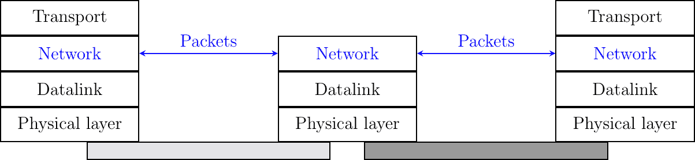
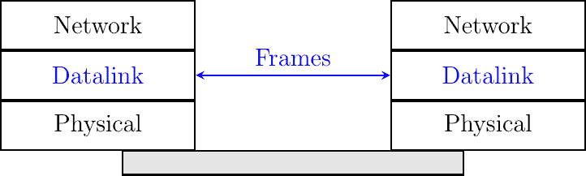
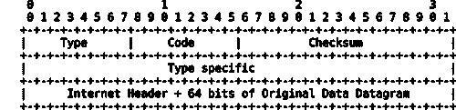
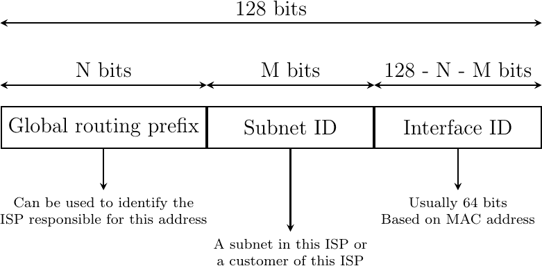
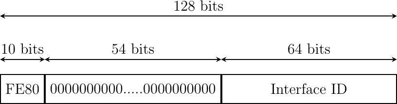
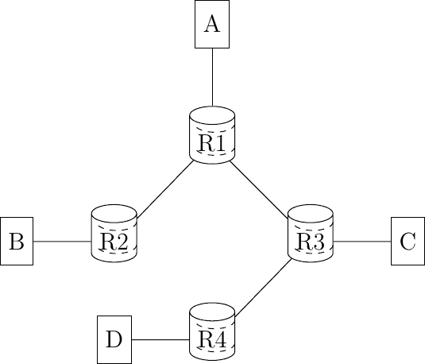
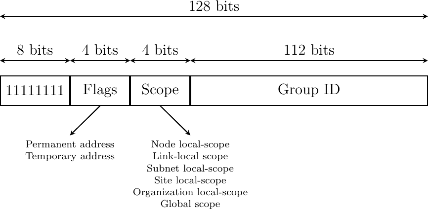
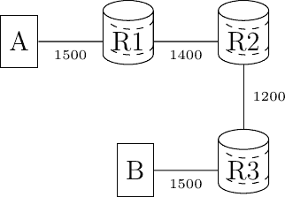
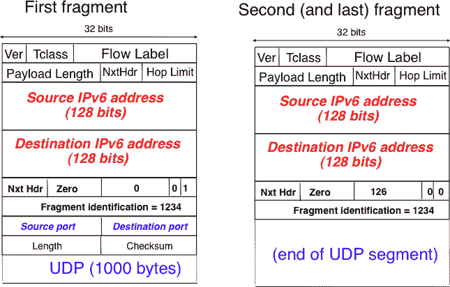

# 互联网协议

> [`4ed.computer-networking.info/syllabus/default/hosts/network-host.html`](https://4ed.computer-networking.info/syllabus/default/hosts/network-host.html)

网络层的主要目标是允许连接到不同网络的主机通过称为路由器的中间系统交换信息。网络层的信息单元称为数据包。

> 
> 
> 图 106 参考模型中的网络层

在详细解释网络层之前，先分析数据链路层提供的服务是有用的。数据链路层有许多变体。有些提供面向连接的服务，而有些提供无连接的服务。在本节中，我们专注于无连接的数据链路层服务，因为它们是最广泛使用的。使用面向连接的数据链路层会导致一些超出本章范围的问题。有关此主题的讨论，请参阅[**RFC 3819**](https://datatracker.ietf.org/doc/html/rfc3819.html)。

> 
> 
> 图 107 点对点数据链路层

数据链路层主要有三种类型。最简单的数据链路层是只有两个通信系统通过物理层直接连接的情况。这种数据链路层用于两个通信系统之间存在点对点连接时。这两个系统可以是主机或路由器。PPP，定义在[**RFC 1661**](https://datatracker.ietf.org/doc/html/rfc1661.html)，是这种点对点数据链路层的例子。数据链路层交换帧，一个数据链路层实体发送的数据链路帧通过物理层传输，以便它能够到达右侧的数据链路层实体。点对点数据链路层可以提供不可靠的服务（帧可能被损坏或丢失）或可靠的服务（在这种情况下，数据链路层包括与传输层使用的类似的重传机制）。不可靠的服务通常用于物理层（例如光纤、双绞线）具有低比特错误比率的物理层之上，而可靠性机制通常用于无线网络以从传输错误中本地恢复。

第二种类型的数据链路层是在局域网（LAN）中使用的。从概念上讲，一个 LAN 是一组通信设备，其中任何两个设备都可以通过数据链路层直接交换帧。主机和路由器都可以连接到 LAN。有些 LAN 只连接几个设备，但也有一些 LAN 可以连接数百甚至数千个设备。


图. 108 局域网#

在第二部分，我们描述了局域网的组织和操作。点对点数据链路层和局域网中使用的数据链路层之间的重要区别在于，在局域网中，每个通信设备都由一个独特的数据链路层地址标识。这个地址通常嵌入在设备的硬件中，不同类型的局域网使用不同类型的数据链路层地址。大多数局域网使用 48 位长的地址，通常称为 MAC 地址。连接到局域网的通信设备可以向连接到同一局域网的任何其他通信设备发送数据链路帧。大多数局域网还支持特殊的广播和多播数据链路层地址。发送到局域网广播地址的帧将被发送到连接到局域网的全部通信设备。多播地址用于标识通信设备组。当一个帧发送到多播数据链路层地址时，局域网会将它发送给属于相应组的所有通信设备。

第三种类型的数据链路层用于非广播多路访问（NBMA）网络。这些网络用于连接类似局域网的设备。连接到 NBMA 网络的所有设备都由一个独特的数据链路层地址标识。然而，这是 NBMA 网络与传统局域网之间的主要区别，NBMA 服务只支持单播。NBMA 网络提供的数据链路层服务既不支持广播也不支持多播。

不幸的是，没有数据链路层能够发送无限大小的帧。每个数据链路层都有一个最大帧大小。有十几种不同的数据链路层，不幸的是，它们大多数使用不同的最大帧大小。网络层必须处理数据链路层的异构性。

互联网上共存着两种不同的网络层协议：IP 版本 4 和 IP 版本 6。正如之前所解释的，这两个协议允许一个主机向任何其他主机发送数据包。这两个协议都支持可变长度的数据包。IPv4 和 IPv6 之间最重要的区别是 IP 地址的大小。IPv4 使用 32 位长（4 字节）的编码地址。IPv6 地址要长得多。一个 IPv6 地址被编码为 128 位长（16 字节）的位字符串。

在本节中，我们描述了主机如何使用这两个协议发送和接收数据包。我们不讨论 IP 地址的分配以及如何高效地将 IP 数据包通过互联网转发。IPv4 和 IPv6 的这些部分将在本书的第二部分讨论。

## IP 版本 4#

IP 版本 4 是 TCP/IP 协议套件中网络层数据平面协议。IP 版本 4 的设计基于以下假设：

> +   IP 应该提供不可靠的无连接服务（当应用程序需要时，TCP 提供可靠性）
> +   
> +   IP 以数据报传输模式运行
> +   
> +   IP 地址具有固定的 32 位大小
> +   
> +   IP 必须能在不同类型的链路层上使用
> +   
> +   IP 主机交换可变长度的数据包

IPv4 地址编码为 32 位字段。IPv4 地址通常以点分十进制格式表示，为四个整数序列，由点分隔。第一个整数是 32 位 IPv4 地址最高有效字节的十进制表示，……例如，

> +   1.2.3.4 对应于 00000001000000100000001100000100
> +   
> +   127.0.0.1 对应于 01111111000000000000000000000001
> +   
> +   255.255.255.255 对应于 11111111111111111111111111111111

IPv4 地址用于标识路由器或主机上的接口。因此，路由器拥有的 IPv4 地址数量与它在链路层上的接口数量相同。大多数主机只有一个链路层接口，因此只有一个 IPv4 地址。然而，随着无线技术的发展，越来越多的主机拥有多个链路层接口（例如，一个以太网接口和一个 WiFi 接口）。这些主机被称为多宿主。具有两个接口的多宿主主机因此有两个 IPv4 地址。

许多互联网主机连接到 局域网（LANs），如 Wi-Fi 或以太网网络。我们将在本书的第二部分更详细地描述这些网络的操作，但在此阶段，关于这些 LANs 的重要一点是它们提供无连接的链路层服务。在 LAN 上，每个设备都由一个唯一的 48 位长地址标识，称为 MAC 地址（MAC 代表 介质访问控制，将在第二部分中详细解释）。为了确保 MAC 地址的唯一性，这些地址通常直接硬编码在网络接口卡上。每个网络卡供应商都确保它销售的每个接口都有一个唯一的 MAC 地址。连接到 LAN 的设备可以轻松交换帧。一个 帧 是一个以固定长度头部开始，后面跟有效载荷，对于某些类型的 LAN，还有尾部。帧头部包含帧的源 MAC 地址和目标 MAC 地址。帧有效载荷携带交换的信息，尾部可以包含 CRC 以检测传输错误或其他类型的控制信息。


图 109 包含 IPv4 数据包的链路层帧#

当多个主机连接到同一局域网时，它们可以通过将这些数据包放入数据链路层帧中来快速交换 IP 数据包。如果主机 A 知道主机 B 的 MAC 地址，它可以发送一个 IP 数据包作为帧的有效负载，其源 MAC 地址是它自己的 MAC 地址，目标 MAC 地址是 B 的 MAC 地址。我们将在后面详细说明主机如何自动学习另一个主机的 MAC 地址。

当一个主机连接到局域网（LAN）时，它可以直接向同一局域网中连接的其他主机发送数据包。要到达远程主机，它必须首先将其数据包发送到也连接到局域网的路由器。路由器将能够将数据包转发到其他路由器，以便到达其最终目的地。

当连接到局域网的主机发送 IP 数据包时，它需要知道目的地是否连接到同一局域网。如果目的地连接到同一局域网，主机只需将数据包放入帧中，并使用数据链路层将其直接发送到最终目的地。否则，主机必须使用数据链路层将数据包放入帧中，发送到负责该数据包的局域网路由器。IPv4 和 IPv6 通过将 IP 地址分组到子网中解决了这个问题。一个 IP 子网 是具有相同前缀的所有 IP 地址的集合。它表示为一个 IP 地址后跟 n，表示公共前缀中的位数。

IPv4 地址由两部分组成：子网标识符和主机标识符。子网标识符由地址的高位比特组成，而主机标识符编码在地址的低位比特中。以下图示中，蓝色显示了 22 位子网标识符，红色显示了 12 位主机标识符。


图 110 IPv4 地址内的子网络（蓝色）和主机标识符（红色）

子网标识符或 IPv4 前缀通常 [[1]](#fnetmask) 表示为 A.B.C.D/p，其中 A.B.C.D 是通过将子网标识符与仅包含 0 的主机标识符连接而获得的网络地址，p 是子网标识符的位数。下表提供了 IP 子网的示例。

| 子网 | 地址数量 | 最小地址 | 最大地址 |
| --- | --- | --- | --- |
| 10.0.0.0/8 | 16,777,216 | 10.0.0.0 | 10.255.255.255 |
| 192.168.0.0/16 | 65,536 | 192.168.0.0 | 192.168.255.255 |
| 198.18.0.0/15 | 131,072 | 198.18.0.0 | 198.19.255.255 |
| 192.0.2.0/24 | 256 | 192.0.2.0 | 192.0.2.255 |
| 10.0.0.0/30 | 4 | 10.0.0.0 | 10.0.0.3 |
| 10.0.0.0/31 | 2 | 10.0.0.0 | 10.0.0.1 |

注意

A 类、B 类或 C 类地址

> 今天的 IPv4 实现使用在[**RFC 1519**](https://datatracker.ietf.org/doc/html/rfc1519.html)中定义的可变长度子网。使用可变长度子网，子网标识符可以是 1 到 31 位中的任何大小。可变长度子网允许网络运营商使用更适合子网内放置的主机数量的子网。在[**RFC 1519**](https://datatracker.ietf.org/doc/html/rfc1519.html)发布之前，IPv4 地址块是根据地址类别进行划分的。[**RFC 791**](https://datatracker.ietf.org/doc/html/rfc791.html)根据其最高位定义了三种 IPv4 地址类别：
> 
> > +   A 类地址是指最高位被设置为 0 的地址。这个地址的最高字节是网络标识符，而 24 个低字节是主机标识符。它们对应于今天的 `\8` 子网。
> > +   
> > +   B 类地址是指那些两个最高位被设置为 1，然后是 0 的地址。接下来的十四位是网络标识符，而最低的十六位是主机标识符。它们对应于今天的 `/16` 子网。
> > +   
> > +   C 类地址是指那些三个最高位被设置为 1，然后是 1，接着是 0 的地址。接下来的十四位是网络标识符，而最低的二十四位是主机标识符。它们对应于今天的 `/24` 子网。

最初，地址块是根据所需的地址类别分配的。大型公司、网络提供商和一些大学请求 C 类地址并获得了它。许多大学请求 B 类地址。然而，这种分配效率低下，因为 A 类地址块比大多数企业的需求大得多，而 C 类地址块又太小。[**RFC 1519**](https://datatracker.ietf.org/doc/html/rfc1519.html)抑制了这种低效的分配。如今，IPv4 地址空间几乎被完全利用，除了一些保留块。[IPv4 地址报告](https://ipv4.potaroo.net/)提供了关于分配的 IPv4 地址空间演变的详细报告。

注意

特殊 IPv4 地址

> 大多数单播 IPv4 地址都可以出现在全球互联网上的数据包的源地址和目的地址中。然而，值得注意的是，一些 IPv4 地址块有特殊用途，如[**RFC 5735**](https://datatracker.ietf.org/doc/html/rfc5735.html)中所述。这些包括：

+   `0.0.0.0/8`，这个地址块被保留用于自识别。这个块中的一个常见地址是 `0.0.0.0`，有时在主机启动且尚未知道其 IPv4 地址时使用。

+   `127.0.0.0/8`，这个地址块被保留用于环回地址。每个实现 IPv4 的主机都必须有一个环回接口（即未连接到数据链路层）。按照惯例，IPv4 地址 `127.0.0.1` 被分配给这个接口。这允许主机上运行的过程使用 TCP/IP 来联系同一主机上运行的其他过程。这对于测试目的非常有用。

+   10.0.0.0/8, 172.16.0.0/12 和 192.168.0.0/16 被保留用于不直接连接到互联网的私有网络。这些地址通常被称为私有地址或[**RFC 1918**](https://datatracker.ietf.org/doc/html/rfc1918.html)地址。

+   169.254.0.0/16 用于链路本地地址[**RFC 3927**](https://datatracker.ietf.org/doc/html/rfc3927.html)。一些主机在连接到未按预期分配地址的网络时，会使用此块中的地址。

### IPv4 数据包#

IPv4 数据包格式在[**RFC 791**](https://datatracker.ietf.org/doc/html/rfc791.html)中定义。它在图 111 中显示。除了少数澄清和一些向后兼容的更改外，自[**RFC 791**](https://datatracker.ietf.org/doc/html/rfc791.html)发布以来，IPv4 数据包格式没有发生重大变化。所有 IPv4 数据包都使用图图 111 中显示的 20 字节头部。一些 IPv4 数据包包含一个可选的头部扩展，将在后面描述。


图 111 IP 版本 4 头部#

IPv4 头部的主要字段包括：

> +   一个 4 位的版本号，指示构建头部所使用的 IP 版本。在头部中使用版本字段允许网络层协议进行演变。
> +   
> +   一个 4 位的 IP 头部长度（IHL），指示 IP 头部以 32 位字为单位的长度。此字段允许 IPv4 在需要时使用选项，但由于它编码为 4 位字段，IPv4 头部不能超过 64 字节。
> +   
> +   一个 8 位的 DS 字段，用于服务质量，其用法将在后面描述。
> +   
> +   一个 8 位的协议字段，指示必须在目的地处理数据包有效载荷的传输层协议。此字段的常见值 2 为 TCP 的 6 和 UDP 的 17。
> +   
> +   一个 16 位的长度字段，表示整个 IPv4 数据包（头部和有效载荷）的总长度，以字节为单位。这意味着 IPv4 数据包的长度不能超过 65535 字节。
> +   
> +   一个 32 位源地址字段，包含源主机的 IPv4 地址
> +   
> +   一个 32 位的目的地址字段，包含目标主机的 IPv4 地址
> +   
> +   一个 16 位的校验和，仅保护 IPv4 头部免受传输错误的影响。

IPv4 头部的其他字段用于特定目的。第一个是 8 位生存时间 (TTL) 字段。该字段由 IPv4 用于避免由于路由表中的暂时性或永久性错误而导致 IPv4 数据包陷入无限循环的风险 [[3]](#fttl)。我们将在第二部分讨论为什么会出现这样的问题。IPv4 头部的 TTL 字段确保即使网络中存在转发循环，数据包也不会无限循环。主机以正的 TTL（通常是 64 或更多 [[4]](#finitialttl)）发送其 IPv4 数据包。当路由器收到一个 IPv4 数据包时，它首先将 TTL 减少一个。如果 TTL 变为 0，则丢弃数据包并向数据包的源发送消息（见 ICMP 部分）。否则，路由器在其转发表中查找以转发数据包。

IPv4 的第二个问题是数据链路层的异构性。IPv4 在许多非常不同的数据链路层之上使用。每个数据链路层都有其自身的特性，如前所述，每个数据链路层的特点是最大帧大小。从 IP 的角度来看，数据链路层接口的特点是其最大传输单元 (MTU)。接口的 MTU 是它能够发送的最大 IPv4 数据包（包括头部）。下表提供了一些常见的 MTU 大小 [[5]](#f6lowpan)。

| 数据链路层 | MTU |
| --- | --- |
| 以太网 | 1500 字节 |
| WiFi | 2272 字节 |
| ATM (AAL5) | 9180 字节 |
| 802.15.4 | 102 或 81 字节 |
| 令牌环 | 4464 字节 |
| FDDI | 4352 字节 |

虽然从理论上讲，IPv4 主机可以发送长达 64 KBytes 的数据包，但今天使用的少数数据链路层技术能够在一个帧内发送 64 KBytes 的 IPv4 数据包。考虑一个连接到 Token Ring 网络的客户机，它希望向连接到以太网网络的服务器发送数据包。客户机可以发送一个 4 KBytes 的数据包，该数据包需要在网络内部进行分片才能到达服务器。

为了解决这些问题，IPv4 包含了数据包分片和重组机制。如果数据包太长而无法通过数据链路层发送，主机和中间路由器都可以分片 IPv4 数据包。在 IPv4 中，分片完全在 IP 层完成，一个大的 IPv4 数据包被分成两个或更多个 IPv4 数据包（称为分片）。大包的 IPv4 分片是正常的 IPv4 数据包，由中间路由器转发到大数据包的目的地。

IPv4 分片机制依赖于 IPv4 头部的四个字段：长度、标识、标志和分片偏移。IPv4 头部包含两个标志：更多分片和不要分片 (DF)。当 DF 标志被设置时，这表示数据包不能被分片。

IPv4 分段的基本操作如下。一个大的数据包被分成两个或更多个分段。除了最后一个分段外，所有分段的尺寸等于用于转发数据包的链路的最大传输单元。每个 IPv4 数据包包含一个 16 位的标识字段。当一个数据包被分段时，大包的标识被复制到所有分段中，以便目的地可以将接收到的分段重新组装在一起。在每个分段中，片段偏移以 8 字节为单位指示分段有效载荷在原始数据包有效载荷中的位置。每个分段中的长度字段指示分段有效载荷的长度，就像正常 IPv4 数据包一样。最后，更多片段标志仅在大型数据包的最后一个分段中设置。

以下伪代码详细说明了 IPv4 分段算法，假设数据包不包含 IP 选项。

```sh
#mtu : maximum size of the packet (including header) of outgoing link
if p.len <  mtu :
 send(p)
# packet is too large
maxpayload=8*int((mtu-20)/8)  # must be n times 8 bytes
if p.flags=='DF' :
 discard(p)
# packet must be fragmented
payload=p[IP].payload
pos=0
while len(payload) > 0 :
 if len(payload) > maxpayload :
    toSend=IP(dest=p.dest,src=p.src,
              ttl=p.ttl, id=p.id,
              frag=p.frag+(pos/8),
              len=mtu, proto=p.proto)/payload[0:maxpayload]
    pos=pos+maxpayload
    payload=payload[maxpayload+1:]
 else
    toSend=IP(dest=p.dest,src=p.src,
              ttl=p.ttl, id=p.id,
              frag=p.frag+(pos/8),
              flags=p.flags,
              len=len(payload), proto=p.proto)/payload
 forward(toSend) 
```

IPv4 数据包的分段可以以任何顺序到达目的地，因为每个分段在网络中独立转发，可能遵循不同的路径。此外，一些分段可能丢失，永远不会到达目的地。

目的主机使用的重组算法大致如下。首先，目的地可以通过检查更多片段标志和片段偏移的值来验证接收到的 IPv4 数据包是否为分段。如果片段偏移设置为 0 且更多片段标志被重置，则接收到的数据包没有被分段。否则，数据包已经被分段，必须进行重组。重组算法依赖于接收到的分段的标识字段来关联一个分段与正在重组的相应数据包。此外，片段偏移字段指示分段有效载荷在原始未分段数据包中的位置。最后，当更多片段标志被重置时，目的地可以确定原始未分段数据包的总长度。

注意，重组算法必须处理 IP 网络的不可靠性。这意味着一个分段可能被重复，或者一个分段可能永远无法到达目的地。目的地可以通过片段偏移轻松检测到分段重复。为了处理分段丢失，重组算法必须在数据包正在重组期间将其缓冲区中存储的分段的时间限制在合理范围内。这可以通过在接收到数据包的第一个分段时启动计时器来实现。如果在计时器到期之前数据包没有被重组，则丢弃所有分段，并认为数据包已丢失。

原始 IP 规范，在[**RFC 791**](https://datatracker.ietf.org/doc/html/rfc791.html)中，定义了可以添加到 IP 头部的一些选项类型。每个选项都使用类型长度值格式进行编码。它们今天并不广泛使用。更多详细信息可以在[**RFC 791**](https://datatracker.ietf.org/doc/html/rfc791.html)中找到。

## ICMP 版本 4#

有时，中间路由器或目标主机需要通知数据包的发送者处理数据包时发生的问题。在 TCP/IP 协议套件中，这种报告是通过互联网控制消息协议（ICMP）完成的。ICMP 在[**RFC 792**](https://datatracker.ietf.org/doc/html/rfc792.html)中定义。ICMP 消息作为 IP 数据包的有效负载（为 ICMP 保留的协议值为 1）传输。图. 112 说明了 IPv4 头部。一个 ICMP 消息由一个 8 字节头部和一个可变长度的有效负载组成，通常包含触发 ICMP 消息传输的数据包的前几个字节。



图. 112 ICMP 版本 4 [**RFC 792**](https://datatracker.ietf.org/doc/html/rfc792.html)#

在 ICMP 头部中，类型和代码字段指示了发送 ICMP 消息的发送者检测到的问题类型。校验和保护整个 ICMP 消息免受传输错误的影响，而数据字段包含一些 ICMP 消息的附加信息。

ICMP 消息的主要类型包括：

> +   目标不可达：当数据包由于路由问题无法送达其目标地址时，会发送一个目标不可达的 ICMP 消息。不同类型的不可达性被区分出来：
> +   
>     +   网络不可达：当路由器没有包含数据包目标地址子网的路径时，会发送此 ICMP 消息
>     +   
>     +   主机不可达：当路由器连接到包含数据包目标地址的子网，但此时无法到达该目标地址时，会发送此 ICMP 消息
>     +   
>     +   协议不可达：当目标主机收到一个数据包，但不支持数据包协议字段中指示的传输协议时，会发送此 ICMP 消息
>     +   
>     +   端口不可达：当目标主机收到一个目标端口号的数据包，但没有服务器进程绑定到该端口时，会发送此 ICMP 消息
>     +   
> +   需要分片：当路由器收到一个设置了不分片标志且大于出接口 MTU 的数据包时，会发送此 ICMP 消息

*ping(8)*常被网络操作员用来验证给定的 IP 地址是否可达。每个主机都应该[[6]](#fpingproblems)在收到 ICMP Echo 请求消息时回复一个 ICMP Echo 回复消息。以下是一个*ping(8)*的示例用法。

```sh
ping 130.104.1.1
PING 130.104.1.1 (130.104.1.1): 56 data bytes
64 bytes from 130.104.1.1: icmp_seq=0 ttl=243 time=19.961 ms
64 bytes from 130.104.1.1: icmp_seq=1 ttl=243 time=22.072 ms
64 bytes from 130.104.1.1: icmp_seq=2 ttl=243 time=23.064 ms
64 bytes from 130.104.1.1: icmp_seq=3 ttl=243 time=20.026 ms
64 bytes from 130.104.1.1: icmp_seq=4 ttl=243 time=25.099 ms
--- 130.104.1.1 ping statistics ---
5 packets transmitted, 5 packets received, 0% packet loss
round-trip min/avg/max/stddev = 19.961/22.044/25.099/1.938 ms 
```

另一个非常有用的调试工具是 *traceroute(8)*。traceroute 的 man 页面将此工具描述为“打印数据包到达网络主机的路由”。traceroute 使用 TTL 超过 ICMP 消息来发现通往目的地的路径上的中间路由器。traceroute 的原理非常简单。当一个路由器收到一个 TTL 设置为 1 的 IP 数据包时，它会递减 TTL 并被迫向发送主机返回一个包含头部和丢弃的 IP 数据包前几个字节的 TTL 超过 ICMP 消息。为了发现网络路径上的所有路由器，一个简单的解决方案是首先发送一个 TTL 设置为 1 的数据包，然后发送一个 TTL 设置为 2 的数据包，依此类推。下面是一个示例 traceroute 输出。

```sh
traceroute www.ietf.org
traceroute to www.ietf.org (64.170.98.32), 64 hops max, 40 byte packets
 1  CsHalles3.sri.ucl.ac.be (192.168.251.230)  5.376 ms  1.217 ms  1.137 ms
 2  CtHalles.sri.ucl.ac.be (192.168.251.229)  1.444 ms  1.669 ms  1.301 ms
 3  CtPythagore.sri.ucl.ac.be (130.104.254.230)  1.950 ms  4.688 ms  1.319 ms
 4  fe.m20.access.lln.belnet.net (193.191.11.9)  1.578 ms  1.272 ms  1.259 ms
 5  10ge.cr2.brueve.belnet.net (193.191.16.22)  5.461 ms  4.241 ms  4.162 ms
 6  212.3.237.13 (212.3.237.13)  5.347 ms  4.544 ms  4.285 ms
 7  ae-11-11.car1.Brussels1.Level3.net (4.69.136.249)  5.195 ms  4.304 ms  4.329 ms
 8  ae-6-6.ebr1.London1.Level3.net (4.69.136.246)  8.892 ms  8.980 ms  8.830 ms
 9  ae-100-100.ebr2.London1.Level3.net (4.69.141.166)  8.925 ms  8.950 ms  9.006 ms
 10  ae-41-41.ebr1.NewYork1.Level3.net (4.69.137.66)  79.590 ms
     ae-43-43.ebr1.NewYork1.Level3.net (4.69.137.74)  78.140 ms
     ae-42-42.ebr1.NewYork1.Level3.net (4.69.137.70)  77.663 ms
 11  ae-2-2.ebr1.Newark1.Level3.net (4.69.132.98)  78.290 ms  83.765 ms  90.006 ms
 12  ae-14-51.car4.Newark1.Level3.net (4.68.99.8)  78.309 ms  78.257 ms  79.709 ms
 13  ex1-tg2-0.eqnwnj.sbcglobal.net (151.164.89.249)  78.460 ms  78.452 ms  78.292 ms
 14  151.164.95.190 (151.164.95.190)  157.198 ms  160.767 ms  159.898 ms
 15  ded-p10-0.pltn13.sbcglobal.net (151.164.191.243)  161.872 ms  156.996 ms  159.425 ms
 16  AMS-1152322.cust-rtr.swbell.net (75.61.192.10)  158.735 ms  158.485 ms  158.588 ms
 17  mail.ietf.org (64.170.98.32)  158.427 ms  158.502 ms  158.567 ms 
```

上面的 *traceroute(8)* 输出显示了从 UCLouvain 的一个主机到主要 IETF 服务器之一的 17 个跳数路径。对于每个跳数，traceroute 会提供发送 ICMP 消息的路由器的 IPv4 地址以及源地址和该路由器之间的往返时间。traceroute 为每个 TTL 值发送三个探测。在某些情况下，例如上面的第十个跳数，可能会从不同的地址接收到 ICMP 消息。这通常是因为来自同一源的不同数据包在网络中遵循了不同的路径 [[7]](#ftraceroutemore)。

ICMP 消息的另一个重要用途是发现可以用来到达目的地而不需要分片的最大 MTU。如前所述，当一个 IPv4 路由器收到一个大于出链路 MTU 的数据包时，它必须对该数据包进行分片。不幸的是，分片是一个复杂的操作，路由器无法以线路速率执行 [[KM1995]](../bibliography.html#km1995)。此外，当 TCP 段在网络中通过分片的数据包传输时，单个分片的丢失会迫使 TCP 重新传输整个段（以及所有分片）。如果 TCP 能够发送不需要在网络中分片的数据包，它就只能重新传输在网络中丢失的信息。此外，如 [**RFC 4963**](https://datatracker.ietf.org/doc/html/rfc4963.html) 中讨论的那样，IP 重组在高速情况下会带来几个挑战。使用 IP 分片来允许 UDP 应用程序交换大型消息会引发几个安全问题 [[KPS2003]](../bibliography.html#kps2003)。

TCP 实现使用 ICMP 以及不分段（DF）IPv4 标志来发现允许到达目标主机而不引起网络分段的最大的 MTU 大小。这是在[**RFC 1191**](https://datatracker.ietf.org/doc/html/rfc1191.html)中定义的路径 MTU 发现机制。包含路径 MTU 发现（大多数都包含）的 TCP 实现请求 IPv4 层发送所有包含 DF 标志的 IPv4 数据包中的所有段。这禁止了中间路由器对这些数据包进行分段。如果路由器需要转发一个无法在较小 MTU 的链路上分段的包，它将返回一个需要分段的 ICMP 消息给源地址，指示其出链路的 MTU。此 ICMP 消息在其数据字段中包含路由器出链路的 MTU。在接收到此 ICMP 消息后，源 TCP 实现调整其最大分段大小（MSS），以便发送的包含这些段的包可以由该路由器转发，而无需分段。

### IPv4 主机的操作#

在描述 IPv4 的这一点上，详细查看 IPv4 实现如何发送、接收和转发 IPv4 数据包是有用的。最简单的情况是，当主机需要在一个 IPv4 数据包中发送一个段时。主机执行两个操作。首先，它必须决定数据包将通过哪个接口发送。其次，它必须创建相应的 IP 数据包（s）。

为了简化本节中的讨论，我们忽略了 IPv4 选项的利用。这并不是一个严重的限制，因为如今 IPv4 数据包很少包含选项。有关 IPv4 选项处理详情，可在相关 RFC 中找到，例如[**RFC 791**](https://datatracker.ietf.org/doc/html/rfc791.html)。

拥有$ n $个数据链路层接口的 IPv4 主机管理$ n+1 $个 IPv4 地址：

> +   按照**惯例**分配给回环地址的 127.0.0.1/32 IPv4 地址
> +   
> +   将 A.B.C.D/p IPv4 地址分配给其$ n $个数据链路层接口中的每一个

这样的主机维护一个路由表，包含一个条目用于其回环地址，以及一个条目用于分配给其接口的每个子网标识符。此外，主机通常在发送未直接连接到目标的数据包时使用其接口之一作为默认接口。这由关联到一个接口的默认路由：0.0.0.0/0 表示。

当在主机上运行的传输协议请求传输一个段时，它通常除了向 IPv4 层提供段之外，还会提供 IPv4 目标地址 [12]。IPv4 实现首先在其路由表中与目标地址执行最长前缀匹配。查找返回必须用于发送数据包的接口标识。然后，主机可以创建包含段的 IPv4 数据包。数据包的源 IPv4 地址是返回最长前缀匹配的主机接口的 IPv4 地址。数据包的协议字段设置为创建段的本地传输协议的标识。数据包的 TTL 字段设置为主机使用的默认 TTL。现在，主机必须选择数据包的标识。如果数据包在网络中分片，这个标识很重要，因为它确保目标能够重新组装接收到的片段。理想情况下，发送主机应该永远不要向同一目标主机发送具有相同标识的数据包两次，以确保所有片段都能被目标正确重新组装。不幸的是，由于 16 位标识字段和预期的 MSL 为 2 分钟，这意味着到给定目标的最大带宽限制在大约 286 Mbps。如果需要分片，并且 MTU 为 1500 字节，那么带宽会降低到 6.4 Mbps [**RFC 4963**](https://datatracker.ietf.org/doc/html/rfc4963.html) [12]。这非常低，这也是为什么强烈建议主机避免分片的原因之一。如果，尽管如此，出接口的 MTU 小于数据包的长度，数据包将被分片。最后，在传输之前计算数据包的校验和。

当一个主机接收到一个目的地为主机的 IPv4 数据包时，它必须执行几个操作。首先，它必须检查数据包的校验和。如果校验和不正确，则丢弃该数据包。然后，它必须检查数据包是否已分片。如果是，则将数据包传递给前面描述的重组算法。否则，必须将数据包传递给上层。这是通过查看协议字段（TCP 为 6，UDP 为 17）来完成的。如果主机没有实现与接收到的协议字段相对应的传输层协议，它将向发送主机发送一个协议不可达的 ICMP 消息。如果接收到的数据包包含一个 ICMP 消息（协议字段设置为 1），则处理更为复杂。Echo-request ICMP 消息触发 ICMP Echo-reply 消息的传输。其他类型的 ICMP 消息表明由先前传输的数据包引起的错误。这些 ICMP 消息通常被转发到发送错误数据包的传输协议。这可以通过检查包含头部和错误数据包前 64 位的内容的 ICMP 消息来完成。如果 IP 数据包没有包含选项，这是大多数 IPv4 数据包的情况，传输协议可以在传输头部的第一个 32 位中找到源端口和目的端口，以确定受影响的传输流。这对于路径 MTU 发现等来说很重要。

## IP 版本 6#

在 20 世纪 80 年代末和 90 年代初，互联网的增长在路由器上引发了几个操作问题。许多这些路由器只有一个 CPU 和高达 1 兆字节的 RAM 来存储它们的操作系统、数据包缓冲区和路由表。鉴于 IPv4 前缀分配给愿意加入互联网的公司和大学的速度，路由表增长非常快，有些人担心所有 IPv4 前缀很快就会被分配完毕。1987 年，[**RFC 1752**](https://datatracker.ietf.org/doc/html/rfc1752.html)中引用的一项研究估计，在不久的将来将有 10 万个网络。1990 年 8 月，估计表明 B 类地址空间将在 1994 年 3 月耗尽。

开发了两种类型的解决方案来解决这个问题。第一个短期解决方案是引入无类别域间路由(CIDR)。第二个短期解决方案是网络地址转换(NAT)机制，由[**RFC 1631**](https://datatracker.ietf.org/doc/html/rfc1631.html)定义。NAT 允许多个主机共享一个公共 IPv4 地址。

然而，与这些短期解决方案并行，这些解决方案使得 IPv4 互联网能够继续使用至今，互联网工程任务组开始着手开发 IPv4 的替代品。这项工作始于一个公开的提案征集，概述在[**RFC 1550**](https://datatracker.ietf.org/doc/html/rfc1550.html)中。几个小组对此征集做出了回应，提出了下一代互联网协议（IPng）的提案：

> +   TUBA 在[**RFC 1347**](https://datatracker.ietf.org/doc/html/rfc1347.html)和[**RFC 1561**](https://datatracker.ietf.org/doc/html/rfc1561.html)中提出
> +   
> +   PIP 在[**RFC 1621**](https://datatracker.ietf.org/doc/html/rfc1621.html)中提出
> +   
> +   SIPP 在[**RFC 1710**](https://datatracker.ietf.org/doc/html/rfc1710.html)中提出

IETF 决定根据 SIPP 提案推进 IPng 的发展。由于 IP 版本 5 已经被定义在[**RFC 1819**](https://datatracker.ietf.org/doc/html/rfc1819.html)中的实验性 ST-2 协议所使用，因此 IP 版本 4 的继任者是 IP 版本 6。最初在[**RFC 1752**](https://datatracker.ietf.org/doc/html/rfc1752.html)中定义的 IP 版本 6 是基于以下假设设计的：

> +   IPv6 地址编码为 128 位字段
> +   
> +   IPv6 头部具有简单的格式，可以很容易地被硬件设备解析
> +   
> +   主机应该能够自动配置其 IPv6 地址
> +   
> +   安全性必须是 IPv6 的一部分

注意

IPng 地址大小

当 IPng 的工作开始时，很明显 32 位对于编码 IPng 地址来说太小了，所有提案都使用了更长的地址。然而，关于最合适的地址长度有许多讨论。一种最初的方法，由 SIPP 在[**RFC 1710**](https://datatracker.ietf.org/doc/html/rfc1710.html)中提出，是使用 64 位地址。64 位地址空间比 IPv4 地址空间大 40 亿倍，而且从实现的角度来看，正在考虑 64 位 CPU，64 位地址自然适合它们的寄存器。另一种方法是使用现有的地址格式。这是 TUBA 提案([**RFC 1347**](https://datatracker.ietf.org/doc/html/rfc1347.html))，它重用了 ISO CLNP 20 字节地址。20 字节地址提供了增长空间，但使用 ISO CLNP 并不受 IETF 青睐，部分原因是政治原因，尽管成熟的 CLNP 实现已经可用。当时 128 位似乎是一个合理的折衷方案。

### IPv6 地址架构#

IPv4 的经验表明，网络层协议的可扩展性在很大程度上取决于其寻址架构。IPv6 的设计者投入了大量精力来定义其寻址架构 [**RFC 3513**](https://datatracker.ietf.org/doc/html/rfc3513.html)。所有 IPv6 地址都是 128 位宽。这意味着有 $ 340,282,366,920,938,463,463,374,607,431,768,211,456 (3.4 \times 10^{38}) $ 个不同的 IPv6 地址。由于地球的表面积约为 510,072,000 $ km² $，这意味着地球上每平方米大约有 $ 6.67 \times 10^{23} $ 个 IPv6 地址。与仅提供每平方公里 8 个地址的 IPv4 相比，这在纸上是一个显著的改进。

注

IPv6 地址的文本表示

> > 有时有必要以文本格式编写 IPv6 地址，例如在手动配置地址或用于文档目的时。编写 IPv6 地址的首选格式是 `x:x:x:x:x:x:x:x`，其中 `x` 是表示地址八个 16 位部分的十六进制数字。以下是一些 IPv6 地址的示例：
> > 
> +   `abcd:ef01:2345:6789:abcd:ef01:2345:6789`
> +   
> +   `2001:db8:0:0:8:800:200c:417a`
> +   
> +   `fe80:0:0:0:219:e3ff:fed7:1204`

IPv6 地址通常包含一个长的位序列，这些位被设置为 `0`。在这种情况下，已经定义了一种紧凑的表示法。使用这种表示法，:: 用于表示一个或多个只包含位设置为 `0` 的 16 位块组。例如，

> +   `2001:db8:0:0:8:800:200c:417a` 表示为 `2001:db8::8:800:200c:417a`
> +   
> +   `ff01:0:0:0:0:0:0:101` 表示为 `ff01::101`
> +   
> +   `0:0:0:0:0:0:0:1` 表示为 `::1`
> +   
> +   `0:0:0:0:0:0:0:0` 表示为 `::`

一个 IPv6 前缀可以表示为地址/长度，其中长度是前缀的位数。例如，以下三种表示法对应于相同的 IPv6 前缀：

> +   `2001:0db8:0000:cd30:0000:0000:0000:0000` / `60`
> +   
> +   `2001:0db8::cd30:0:0:0:0` / `60`
> +   
> +   `2001:0db8:0:cd30::` / `60`

IPv6 支持单播、多播和任播地址。IPv6 单播地址用于标识主机上的一个数据链路层接口。如果一个主机有多个数据链路层接口（例如，一个以太网接口和一个 Wi-Fi 接口），那么它需要多个 IPv6 地址。通常，IPv6 单播地址的结构如图 图 113 所示。

> 
> 
> 图 113 IPv6 单播地址结构

IETF 为特殊用途预留了一些 IPv6 地址。其中两个最重要的地址是：

> +   `0:0:0:0:0:0:0:1` （紧凑形式中的 `::1`）是 IPv6 环回地址。这是在启用 IPv6 的主机上始终处于开启状态的逻辑接口的地址。
> +   
> +   `0:0:0:0:0:0:0:0` （紧凑形式中的 `::`）是未指定 IPv6 地址。这是主机在尝试获取官方地址时可以用作源地址的 IPv6 地址。

最后一种单播 IPv6 地址是图图. 114 中所示的链路本地单播地址。这些地址是 fe80::/10 地址块的一部分，并在[**RFC 4291**](https://datatracker.ietf.org/doc/html/rfc4291.html)中定义。每个主机可以通过将 fe80::/64 前缀与其接口的 64 位标识符连接起来来计算自己的链路本地地址。链路本地地址可以在连接到同一链路（或局域网）的主机需要交换数据包时使用。它们特别用于地址发现和自动配置目的。它们的用途仅限于每个链路，并且路由器不能转发源地址或目的地址为链路本地地址的数据包。链路本地地址也已在 IPv4 中定义[**RFC 3927**](https://datatracker.ietf.org/doc/html/rfc3927.html)。然而，IPv4 链路本地地址仅在主机无法获得常规 IPv4 地址时使用，例如在孤立的局域网中。

> 
> 
> 图. 114 IPv6 链路本地地址结构

注意

所有 IPv6 主机都有多个地址

IPv6 单播寻址架构和链路本地地址的使用的一个重要后果是，每个 IPv6 主机都有多个 IPv6 地址。这意味着所有 IPv6 堆栈都必须能够处理多个 IPv6 地址。

上文所述的地址是单播地址。这些地址用于标识（主机和路由器的）接口。它们可以出现在 IPv6 数据包的源地址和目的地址中。当主机向单播地址发送数据包时，该数据包通过网络被交付到其最终目的地。在某些情况下，例如向大量接收器发送视频或电视信号时，拥有一个能够高效地将相同数据包发送给大量接收器的网络是有用的。这就是组播服务。组播服务可以在局域网中提供。在这种情况下，组播地址标识一组接收器，并且每个发送到该地址的帧都将被发送到组中的所有接收器。组播也可以用于包含路由器和主机的网络中。在这种情况下，组播地址也标识一组接收器，并且网络将高效地将每个组播数据包交付给组中的所有成员。例如，考虑图图. 115 所示的网络。

> 
> 
> 图. 115 带有主机和路由器的简单网络

假设`B`和`D`是组播组的一部分。如果`A`向该组发送一个组播数据包，那么`R1`将复制该数据包以转发给`R2`和`R3`。`R2`将数据包转发给`B`。`R3`将数据包转发给`R4`，`R4`将数据包交付给`D`。

最后，[**RFC 4291**](https://datatracker.ietf.org/doc/html/rfc4291.html)定义了 IPv6 多播地址的结构[[8]](#fmultiiana)。这种结构在图. 116 中展示。

> 
> 
> 图. 116 IPv6 多播地址结构

IPv6 多播地址的低 112 位是组的标识符。高位用作标记，以区分多播地址和单播地址。值得注意的是，4 位的标志字段指示地址是临时的还是永久的。最后，作用域字段指示特定地址的数据包转发的边界。链路本地作用域表示路由器不应转发目的地为这种多播地址的数据包。组织本地作用域表示发送到这种多播目的地地址的数据包不应离开组织。最后，全局作用域旨在用于跨越全球互联网的多播组。

在这些地址中，一些是众所周知的。例如，所有主机自动属于`ff02::1`多播组，而所有路由器自动属于`ff02::2`多播组。IPv6 多播的详细讨论超出了本章的范围。

### IPv6 数据包#

IPv6 数据包格式在很大程度上受到了为 SIPP 协议提出的[**RFC 1710**](https://datatracker.ietf.org/doc/html/rfc1710.html)数据包格式的启发。在[**RFC 2460**](https://datatracker.ietf.org/doc/html/rfc2460.html)中定义的标准 IPv6 头部占用 40 字节，包含 8 个不同的字段，如图图. 117 所示。


图. 117 IP 版本 6 头部 ([**RFC 2460**](https://datatracker.ietf.org/doc/html/rfc2460.html))#

除了源地址和目的地址之外，IPv6 头部还包含以下字段：

> +   版本：一个 4 位字段设置为 6，目的是在需要时允许 IP 进化。
> +   
> +   流量类别：这个 8 位字段表示此数据包期望的服务类型，并包含显式拥塞通知使用的`CE`和`ECT`标志。
> +   
> +   流标签：这个字段最初打算用来标记属于同一流的数据包。最近的一份文件，[**RFC 6437**](https://datatracker.ietf.org/doc/html/rfc6437.html)描述了该字段的一些可能的用途，但还太早判断它是否真的会被使用。
> +   
> +   有效载荷长度：这是数据包有效载荷的大小（以字节为单位）。由于长度被编码为 16 位字段，IPv6 数据包可以包含最多 65535 字节的有效载荷。
> +   
> +   下一个头部：这个 8 位字段指示 IPv6 头部后面的头部类型[[9]](#fianaprotocol)。它可以是传输层头部（例如，6 表示 TCP 或 17 表示 UDP）或 IPv6 选项。
> +   
> +   跳数限制：这个 8 位字段指示可以转发数据包的路由器数量。每个路由器将其减一，以防止数据包在网络内部无限循环。

值得注意的是，IPv6 头中没有校验和。这主要是因为所有数据链路层和传输协议都包含校验和或 CRC 来保护它们的帧/段免受传输错误的影响。在 IPv6 头中添加校验和将迫使每个路由器重新计算所有数据包的校验和，这在检测错误方面的好处有限。实际上，IP 校验和允许在数据包到达目的地之前捕获在路由器内部发生的错误（例如，由于内存损坏）。然而，鉴于当前内存的可靠性和在每个路由器上计算校验和的成本，这种好处被认为太小 [[10]](#fipv4checksum)。

当主机接收到一个 IPv6 数据包时，它需要确定哪个传输协议（UDP、TCP、SCTP 等）需要处理数据包的有效负载。这是下一个头部字段的第一种作用。管理互联网资源分配和协议参数分配的[IANA](https://www.iana.org)维护一个官方的传输协议列表 [[9]](#fianaprotocol)。以下协议号已被保留：

> +   `TCP`使用下一个头部编号`6`
> +   
> +   `UDP`使用下一个头部编号`17`
> +   
> +   `SCTP`使用下一个头部编号`132`

例如，包含 TCP 段的 IPv6 数据包将如图 118 所示图 118。


图 118 包含 TCP 段的 IPv6 数据包#

然而，下一个头部有比仅仅指示负责数据包有效负载的传输协议更广泛的使用。IPv6 数据包可以包含一系列头部，最后一个头部指示负责数据包有效负载的传输协议。从可扩展性的角度来看，支持一系列头部是一个巧妙的设计。正如我们将看到的，这个头部链有几个用途。

[**RFC 2460**](https://datatracker.ietf.org/doc/html/rfc2460.html)定义了可以添加到 IPv6 数据包的几种类型的 IPv6 扩展头部：

> +   跳到跳选项头。此选项由路由器和主机处理。
> +   
> +   目标选项头。此选项仅由主机处理。
> +   
> +   路由头。此选项由某些节点处理。
> +   
> +   分片头。此选项仅由主机处理。
> +   
> +   认证头。此选项仅由主机处理。
> +   
> +   封装安全负载。此选项仅由主机处理。

最后两个头部用于在 IPv6 之上添加安全性和实现 IPSec。它们在[**RFC 2402**](https://datatracker.ietf.org/doc/html/rfc2402.html)和[**RFC 2406**](https://datatracker.ietf.org/doc/html/rfc2406.html)中描述，并且超出了本文档的范围。

跳到跳选项头部被设计成使 IPv6 容易扩展。理论上，这个选项可以用来定义在设计 IPv6 时未预见的新字段。它旨在由路由器和主机处理。在实践中，将扩展部署到网络协议可能很困难，因为一些节点已经支持扩展，而其他节点仍在使用旧版本且不理解扩展。为了处理这个问题，IPv6 设计者选择了这些 IPv6 选项的类型-长度-值编码。跳到跳选项头部编码方式如图 119 所示。


图 119 IPv6 跳到跳选项头部#

在这个可选头部中，下一个头部字段用于支持头部的链。它指示链中下一个头部的类型。IPv6 头部有不同的长度。Hdr Ext Len 字段指示选项头部的总长度（以字节为单位）。Opt. Type 字段指示选项的类型。这些类型被编码，使得它们的高位位指定了节点在不识别它时如何处理头部。以下为两个高位位定义的值：

> +   `00`：如果一个节点不识别这个头部，它可以安全地跳过，并继续处理随后的头部
> +   
> +   `01`：如果一个节点不识别这个头部，则必须丢弃该数据包
> +   
> +   `10`（或`11`）：如果一个节点不识别这个头部，它必须将控制包（ICMP，见后文）返回到源（除非目的地是一个多播地址）

这种编码允许协议扩展的设计者指定选项是否必须由路径上的所有节点支持。然而，在实践中部署此类扩展可能很困难。

已经定义了两种跳到跳的选项。[**RFC 2675**](https://datatracker.ietf.org/doc/html/rfc2675.html) 规定了大封包，它使得 IPv6 能够支持包含大于 65535 字节数据包的负载。这些大封包将它们的负载长度设置为 0，而大封包选项包含一个 32 位的字段来表示数据包长度。只有当路径上的所有路由器都支持此选项时，这些数据包才能从源发送到目的地。然而，截至本文撰写时，似乎大封包选项尚未得到实现。在 [**RFC 2711**](https://datatracker.ietf.org/doc/html/rfc2711.html) 中定义的路由器警报选项是跳到跳选项的第二个例子。包含此选项的数据包应该由中间路由器以特殊方式处理。此选项用于携带资源预留协议 (RSVP) 消息的 IP 数据包，但这超出了本书的范围。

目的地选项头使用与跳到跳选项头相同的格式。它有一些用途，例如支持移动节点 [**RFC 6275**](https://datatracker.ietf.org/doc/html/rfc6275.html)，但这些超出了本文档的范围。

分片选项头更为重要。网络层中的一个重要问题是处理异构数据链路层的能力。大多数数据链路层技术只能传输和接收小于给定最大帧大小的帧。不幸的是，所有数据链路层技术使用不同的最大帧大小。

每个数据链路层都有其自身的特性，如前所述，每个数据链路层以其最大帧大小为特征。从 IP 的角度来看，数据链路层接口以其最大传输单元 (MTU) 为特征。接口的 MTU 是它可以发送的最大数据包（包括头部）。下表提供了一些常见的 MTU 大小。

| 数据链路层 | 最大传输单元 (MTU) |
| --- | --- |
| 以太网 | 1500 字节 |
| WiFi | 2272 字节 |
| ATM (AAL5) | 9180 字节 |
| 802.15.4 | 102 或 81 字节 |
| 令牌环 | 4464 字节 |
| FDDI | 4352 字节 |

尽管 IPv6 可以发送 64 KBytes 长的数据包，但今天使用的少数数据链路层技术能够在一个帧内发送 64 KBytes 的数据包。此外，如图 120 所示，另一个问题是主机可能发送一个对于中间路由器使用的数据链路层来说太大的数据包。

> 
> 
> 图 120 分片和重组的需求

为了解决这些问题，IPv6 包含了数据包分片和重组机制。在 IPv4 中，分片由主机和中间路由器共同执行。然而，IPv4 的经验表明，在路由器中分片数据包是昂贵的 [[KM1995]](../bibliography.html#km1995)。因此，IPv6 的开发者决定路由器将不再分片数据包。在 IPv6 中，分片仅由源主机执行。如果一个源必须发送一个大于出接口 MTU 的数据包，那么在传输之前需要分片该数据包。在 IPv6 中，每个数据包分片都是一个包含如图 121 所示的分片头的 IPv6 数据包。该头由源包含在每个数据包分片中。接收者使用它们来重组接收到的分片。


图 121 IPv6 分片头#

如果一个路由器收到一个太长无法转发的数据包，该数据包将被丢弃，路由器将返回一个 ICMPv6 消息来通知发送者问题。发送者可以随后对数据包进行碎片化或执行路径 MTU 发现。在 IPv6 中，数据包碎片化仅由源主机通过使用 IPv6 选项执行。

在 IPv6 中，碎片化仅由源主机执行，并依赖于碎片化头部。这个 64 位头部由六个字段组成：

> +   一个指示跟随碎片化头部之后头部类型的 Next Header 字段
> +   
> +   两个保留字段设置为 0。
> +   
> +   Fragment Offset 是一个 13 位的无符号整数，包含相对于原始数据包起始位置的偏移量，以 8 字节为单位。
> +   
> +   More 标志，在数据包的最后一个片段中设置为 0，在其他所有片段中设置为 1。
> +   
> +   32 位的 Identification 字段指示一个片段属于哪个原始数据包。当主机发送碎片化数据包时，它应确保在 MSL 秒内不会为发送到同一目的地的数据包重复使用相同的标识字段。与 IPv4 头部中的 16 位标识字段相比，IPv6 碎片化头部中使用的 32 位标识字段更容易做到这一点。

一些 IPv6 实现以递增的碎片偏移量顺序发送数据包的片段，从第一个片段开始。其他实现则以相反的顺序发送片段，从最后一个片段开始。后者对于需要重新组装片段的主机可能更有利，因为它可以在接收到最后一个片段后轻松分配所需的缓冲区来重新组装数据包的所有片段。当主机接收到 IPv6 数据包的第一个片段时，它无法事先知道整个 IPv6 数据包的长度。

图 122 提供了一个包含 UDP 段的碎片化 IPv6 数据包的示例。为 IPv6 碎片化选项保留的 Next Header 类型是 44。


图 122 IPv6 碎片化示例#

下面的伪代码详细说明了 IPv6 的碎片化，假设数据包不包含选项。

```sh
# mtu : maximum size of the packet (including header) of outgoing link
# In Scapy-like notation (see https://github.com/secdev/scapy)
if p.len < mtu:
    send(p)
else:
    # packet is too large
    # 40 refers to the size of the IPv6 header
    maxpayload = 8 * int((mtu - 40) / 8)  # must be n times 8 bytes
    # packet must be fragmented
    payload = p[IPv6].payload
    pos = 0
    id = globalCounter
    globalCounter += 1
    while len(payload) > 0:
        if len(payload) > maxpayload:
            toSend = IPv6(dst=p.dst, src=p.src, plen=mtu,
                          hlim=p.hlim, nh=44)/IPv6ExtHdrFrament(
                              id=id, offset=p.offset + (pos/8), m=True,
                              nh=p.nh)/payload[0:maxpayload]
            pos = pos + maxpayload
            payload = payload[maxpayload+1:]
        else:
            # The last fragment
            toSend = IPv6(dst=p.dst, src=p.src, plen=len(payload),
                          hlim=p.hlim, nh=44)/IPv6ExtHdrFrament(
                              id=id, offset=p.offset + (pos/8), m=False,
                              nh=p.nh)/payload
            payload = []

        forward(toSend) 
```

在上述伪代码中，我们维护一个 32 位计数器，每次需要碎片化的数据包都会增加。其他计算数据包标识的实现也是可能的。[**RFC 2460**](https://datatracker.ietf.org/doc/html/rfc2460.html)仅要求在同一对主机之间发送的、在 MSL 时间内发送的两个碎片化数据包具有不同的标识。

IPv6 数据包的片段可以以任何顺序到达目的地，因为每个片段在网络中独立转发，可能遵循不同的路径。此外，一些片段可能会丢失，永远无法到达目的地。

目的主机使用的重组算法大致如下。首先，目的地可以通过检查是否包含分片头来验证接收到的 IPv6 数据包是否为分片。如果是，则必须将具有相同标识符的所有分片一起重组。重组算法依赖于接收到的分片的标识符字段，以将分片与正在重组的相应数据包关联起来。此外，分片偏移量字段指示分片有效载荷在原始非分片数据包中的位置。最后，M 标志被重置的包允许目的地确定原始非分片数据包的总长度。

注意，重组算法必须处理 IP 网络的不可靠性。这意味着一个分片可能会被重复，或者一个分片可能永远无法到达目的地。由于分片偏移量，目的地可以轻松地检测到分片重复。为了处理分片丢失，重组算法必须在重组过程中将分片存储在缓冲区的时间绑定起来。这可以通过在接收到分片的第一部分时启动计时器来实现。如果在计时器到期之前没有重组数据包，则丢弃所有分片，并认为数据包已丢失。

注意

低带宽链路上的头部压缩

考虑到 IPv6 头部长度，它可能会在低带宽链路上造成巨大的开销，尤其是在交换小数据包的情况下，例如 VoIP 应用。在这样的环境中，可以使用几种技术来减少开销。第一个解决方案是在数据链路层使用数据压缩来压缩交换的所有信息 [[Thomborson1992]](../bibliography.html#thomborson1992)。这些技术与在*compress(1)*或*gzip(1)*等工具中使用的数据压缩算法类似 [**RFC 1951**](https://datatracker.ietf.org/doc/html/rfc1951.html)。它们压缩位流，而不利用这些流包含具有已知结构的 IP 数据包的事实。第二个解决方案是压缩 IP 和 TCP 头。这些头压缩技术，如[**RFC 5795**](https://datatracker.ietf.org/doc/html/rfc5795.html)中定义的，利用了来自同一流的连续数据包中的冗余，从而显著减小了协议头的大小。另一个解决方案是定义一个与底层数据链路层能力相匹配的 IPv6 头压缩编码 [**RFC 4944**](https://datatracker.ietf.org/doc/html/rfc4944.html)。

IPv6 头部扩展的最后一种类型是路由头。在[**RFC 2460**](https://datatracker.ietf.org/doc/html/rfc2460.html)中定义的`类型 0`路由头是一个必须由某些路由器处理的 IPv6 选项的例子。此选项的编码方式如图图 123 所示。

(../_images/ipv6-routing-0.svg)

图 123 类型 0 路由头部 ([**RFC 2460**](https://datatracker.ietf.org/doc/html/rfc2460.html))#

类型 0 路由选项旨在允许主机通过指定必须转发此数据包的一些路由器的地址来指示一个松散源路由，该路由应由数据包遵循。不幸的是，进一步对该路由头部的工作，包括使用 [scapy](https://www.secdev.org/projects/scapy/) 的娱乐性演示 [[BE2007]](../bibliography.html#be2007)，揭示了该路由头部存在严重的安全问题。因此，使用类型 0 路由头部的松散源路由已被从 IPv6 规范中删除 [**RFC 5095**](https://datatracker.ietf.org/doc/html/rfc5095.html)。### ICMP 版本 6#

有时，中间路由器或目的主机需要通知数据包的发送者处理数据包时发生的问题。在 TCP/IP 协议套件中，这种报告是通过互联网控制消息协议 (ICMP) 来完成的。ICMPv6 定义在 [**RFC 4443**](https://datatracker.ietf.org/doc/html/rfc4443.html)。它既用于报告处理 IPv6 数据包时发生的问题，也用于分配地址。

ICMPv6 消息承载在 IPv6 数据包内部（ICMPv6 的下一个头部字段为 `58`）。每个 ICMP 消息包含一个 32 位的头部，其中包含一个 8 位的类型字段、一个代码字段和一个覆盖整个 ICMPv6 消息的 16 位校验和。消息体包含错误 IPv6 数据包的副本。ICMPv6 头部如图 图 124 所示。


图 124 ICMP 版本 6 数据包格式#

ICMPv6 定义了两种消息类型：指示处理数据包时出现问题的错误消息和信息性消息。在 [**RFC 4443**](https://datatracker.ietf.org/doc/html/rfc4443.html) 中定义了四种类型的错误消息：

> +   `1`：目的地不可达。当数据包的目的地址不可达时，会发送此类 ICMPv6 消息。ICMP 头部的代码字段包含有关不可达类型的附加信息。以下代码在 [**RFC 4443**](https://datatracker.ietf.org/doc/html/rfc4443.html) 中指定。
> +   
>     +   `0`：无到目的地的路由。这表示发送 ICMPv6 消息的路由器没有到数据包目的地的路由。
>     +   
>     +   `1`：与目的地的通信被行政禁止。这表明防火墙已拒绝转发数据包到其最终目的地。
>     +   
>     +   `2`：源地址范围之外。如果源地址使用链路本地地址来访问其子网之外的全球单播地址，则可以发送此消息。
>     +   
>     +   `3`：地址不可达。此消息表示数据包已到达目的地的子网，但拥有此目的地址的主机无法到达。
>     +   
>     +   `4`：端口不可达。此消息表示 IPv6 数据包已由目的地接收，但没有应用程序监听指定的端口。
>     +   
> +   `2`：数据包过大。原本要发送 ICMPv6 消息的路由器收到了一个大于出链路 MTU 的 IPv6 数据包。ICMPv6 消息包含此链路的 MTU（以字节为单位）。这允许发送主机实现路径 MTU 发现[**RFC 1981**](https://datatracker.ietf.org/doc/html/rfc1981.html)。
> +   
> +   `3`：超时。此错误消息可以由路由器或主机发送。路由器会将代码设置为 0 来报告接收到的数据包的跳数限制达到 0。主机会将代码设置为 1 来报告它无法重新组装接收到的 IPv6 分片。
> +   
> +   `4`：参数问题。此 ICMPv6 消息用于报告接收到的 IPv6 数据包带有错误的首部字段（代码 0）或未知下一个头部或 IP 选项（代码 1 和 2）。在这种情况下，消息体包含错误的 IPv6 数据包，消息体的前 32 位包含一个指向错误的指针。

当一个数据包无法转发到其最终目的地时，会返回目标不可达 ICMP 错误消息。前四个 ICMPv6 错误消息（类型`1`，代码`0-3`）由路由器生成，而主机在没有应用程序绑定到相应端口号时可能会返回代码`4`。

数据包过大 ICMP 消息使源主机能够发现它可以安全使用的 MTU 大小，以到达给定的目的地。为了理解其操作，请考虑图 125 中所示的（学术）场景。在此图中，每个链路上的标签表示此链路支持的最大的数据包大小。

> 
> 
> 图 125 IPv6 MTU 发现示例

如果`A`发送一个 1500 字节的数据包，`R1`将返回一个指示最大数据包长度为 1400 字节的 ICMPv6 错误消息。然后`A`会在重新传输之前将数据包分片。小分片会通过，但大分片将被`R2`拒绝，`R2`将返回一个 ICMPv6 错误消息。`A`可以再次分片数据包，并将其作为两个分片发送到最终目的地。

在实践中，IPv6 实现不会存储要传输的数据包以便在需要时重新传输。然而，由于 TCP（和 SCTP）缓存它们传输的段，可以在传输协议中使用类似的方法来检测指向给定目的地的路径上的最大 MTU。这种技术称为路径 MTU 发现[**RFC 1981**](https://datatracker.ietf.org/doc/html/rfc1981.html)。

当一个 TCP 段在网络中通过一个分片的数据包传输时，单个分片丢失会迫使 TCP 重新传输整个段（以及所有分片）。如果 TCP 能够发送不需要在网络中分片的数据包，它只需重新传输在网络中丢失的信息。此外，如 [**RFC 4963**](https://datatracker.ietf.org/doc/html/rfc4963.html) 中讨论的那样，IP 重组在高速情况下会带来几个挑战。使用 IP 分片允许 UDP 应用程序交换大型消息，这会引发几个安全问题 [[KPS2003]](../bibliography.html#kps2003)。

ICMPv6 被 TCP 实现用来发现允许到达目的主机而不引起网络分片的最大 MTU 大小。TCP 实现解析它接收到的 Packets Too Big ICMP 消息。这些 ICMP 消息在其数据字段中包含路由器出链路的 MTU。在接收到此类 ICMP 消息后，源 TCP 实现调整其最大分段大小（MSS），以便包含它发送的段的数据包可以由该路由器转发，而无需分片。

在 [**RFC 4443**](https://datatracker.ietf.org/doc/html/rfc4443.html) 中定义了两种类型的信息性 ICMPv6 消息：回显请求和回显回复，它们用于通过 *ping6(8)* 测试目的地的可达性。当主机接收到 ICMP Echo 请求消息时，它应该回复一个 ICMP Echo 回复消息。以下是一个 *ping6(8)* 的示例用法。

```sh
#ping6  www.ietf.org
PING6(56=40+8+8 bytes) 2001:6a8:3080:2:3403:bbf4:edae:afc3 --> 2001:1890:123a::1:1e
16 bytes from 2001:1890:123a::1:1e, icmp_seq=0 hlim=49 time=156.905 ms
16 bytes from 2001:1890:123a::1:1e, icmp_seq=1 hlim=49 time=155.618 ms
16 bytes from 2001:1890:123a::1:1e, icmp_seq=2 hlim=49 time=155.808 ms
16 bytes from 2001:1890:123a::1:1e, icmp_seq=3 hlim=49 time=155.325 ms
16 bytes from 2001:1890:123a::1:1e, icmp_seq=4 hlim=49 time=155.493 ms
16 bytes from 2001:1890:123a::1:1e, icmp_seq=5 hlim=49 time=155.801 ms
16 bytes from 2001:1890:123a::1:1e, icmp_seq=6 hlim=49 time=155.660 ms
16 bytes from 2001:1890:123a::1:1e, icmp_seq=7 hlim=49 time=155.869 ms
^C
--- www.ietf.org ping6 statistics ---
8 packets transmitted, 8 packets received, 0.0% packet loss
round-trip min/avg/max/std-dev = 155.325/155.810/156.905/0.447 ms 
```

另一个非常有用的调试工具是 *traceroute6(8)*。traceroute 手册页将此工具描述为“打印数据包到达网络主机的路由”。traceroute 使用 Time exceeded ICMP 消息来发现通往目的地的路径上的中间路由器。traceroute 的原理非常简单。当一个路由器收到一个 Hop Limit 设置为 `1` 的 IP 数据包时，它被迫向发送主机返回一个包含头部和丢弃数据包的前几个字节的 Time exceeded ICMP 消息。为了发现网络路径上的所有路由器，一个简单的解决方案是首先发送一个 Hop Limit 设置为 1 的数据包，然后发送一个 Hop Limit 设置为 2 的数据包，依此类推。以下是一个 traceroute6 输出的示例。

```sh
#traceroute6  www.ietf.org
traceroute6 to www.ietf.org (2001:1890:1112:1::20) from 2001:6a8:3080:2:217:f2ff:fed6:65c0, 30 hops max, 12 byte packets
 1  2001:6a8:3080:2::1  13.821 ms  0.301 ms  0.324 ms
 2  2001:6a8:3000:8000::1  0.651 ms  0.51 ms  0.495 ms
 3  10ge.cr2.bruvil.belnet.net  3.402 ms  3.34 ms  3.33 ms
 4  10ge.cr2.brueve.belnet.net  3.668 ms 10ge.cr2.brueve.belnet.net  3.988 ms 10ge.cr2.brueve.belnet.net  3.699 ms
 5  belnet.rt1.ams.nl.geant2.net  10.598 ms  7.214 ms  10.082 ms
 6  so-7-0-0.rt2.cop.dk.geant2.net  20.19 ms  20.002 ms  20.064 ms
 7  kbn-ipv6-b1.ipv6.telia.net  21.078 ms  20.868 ms  20.864 ms
 8  s-ipv6-b1-link.ipv6.telia.net  31.312 ms  31.113 ms  31.411 ms
 9  s-ipv6-b1-link.ipv6.telia.net  61.986 ms  61.988 ms  61.994 ms
 10  2001:1890:61:8909::1  121.716 ms  121.779 ms  121.177 ms
 11  2001:1890:61:9117::2  203.709 ms  203.305 ms  203.07 ms
 12  mail.ietf.org  204.172 ms  203.755 ms  203.748 ms 
```

注意

ICMP 消息速率限制

高端硬件路由器在其接口上使用专用芯片以线路速率转发 IPv6 数据包。这些芯片针对处理正确的 IP 数据包进行了优化。它们无法以线路速率创建 ICMP 消息。当这样的芯片收到触发 ICMP 消息的 IP 数据包时，它会中断路由器的主 CPU，并且在此 CPU 上运行的软件处理该数据包。这个 CPU 比接口上发现的硬件加速要慢得多 [[Gill2004]](../bibliography.html#gill2004)。如果它必须以线路速率处理 IP 数据包并为每个接收到的数据包生成一个 ICMP 消息，它将会过载。为了保护这个 CPU，高端路由器限制了硬件中断主 CPU 的速率，从而限制了 ICMP 消息的生成速率。这意味着并非所有错误的 IP 数据包都会导致 ICMP 消息的传输。路由器主 CPU 过载的风险也是不建议使用跳到跳 IPv6 选项（包括路由器警报选项）的原因 [[#falert]_](#id49)。

脚注

## IP 版本 4#

IP 版本 4 是 TCP/IP 协议套件中网络层数据平面协议。IP 版本 4 的设计基于以下假设：

> +   IP 应该提供不可靠的无连接服务（当应用程序需要时，TCP 提供可靠性）
> +   
> +   IP 使用数据报传输模式
> +   
> +   IP 地址具有固定的 32 位大小
> +   
> +   IP 必须能在不同类型的链路层上使用
> +   
> +   IP 主机交换可变长度的数据包

IPv4 地址编码为 32 位字段。IPv4 地址通常以点分十进制格式表示，为四个整数序列，由点分隔。第一个整数是 32 位 IPv4 地址最高有效字节的十进制表示，… 例如，

> +   1.2.3.4 对应于 00000001000000100000001100000100
> +   
> +   127.0.0.1 对应于 01111111000000000000000000000001
> +   
> +   255.255.255.255 对应于 11111111111111111111111111111111

一个 IPv4 地址用于标识路由器或主机上的接口。因此，路由器具有与它在链路层上具有的接口数量一样多的 IPv4 地址。大多数主机只有一个链路层接口，因此只有一个 IPv4 地址。然而，随着无线技术的发展，越来越多的主机有多个链路层接口（例如，一个以太网接口和一个 WiFi 接口）。这些主机被称为多宿主。具有两个接口的多宿主主机因此有两个 IPv4 地址。

许多互联网主机连接到局域网（LANs），例如 Wi-Fi 或以太网网络。我们将在本书的第二部分更详细地描述这些网络的运行情况，但在此阶段，关于这些 LANs 的重要一点是它们提供无连接的数据链路层服务。在 LAN 中，每个设备都由一个唯一的 48 位长地址标识，这个地址被称为 MAC 地址（MAC 代表介质访问控制，将在第二部分中详细解释）。为了确保 MAC 地址的唯一性，这些地址通常直接硬编码在网络接口卡上。每个网络卡供应商都确保它销售的每个接口都有一个唯一的 MAC 地址。连接到 LAN 的设备可以轻松交换帧。一个帧是一系列字节，以固定长度的头部开始，后面是有效载荷，对于某些类型的 LAN，还有尾部。帧头部包含帧的源 MAC 地址和目标 MAC 地址。帧有效载荷携带交换的信息，尾部可以包含 CRC 以检测传输错误或其他类型的控制信息。


图 109 包含 IPv4 数据包的数据链路层帧#

当多个主机连接到同一 LAN 时，它们可以通过将这些数据包放入数据链路层帧中来快速交换 IP 数据包。如果主机 A 知道主机 B 的 MAC 地址，它可以发送一个 IP 数据包作为帧的有效载荷，其源 MAC 地址是它自己的 MAC 地址，目标 MAC 地址是 B 的 MAC 地址。我们将在后面详细说明主机如何自动学习另一个主机的 MAC 地址。

当一个主机连接到 LAN 时，它可以直接向同一 LAN 上连接的其他主机发送数据包。要到达远程主机，它必须首先将其数据包发送到也连接到 LAN 的网关。网关将能够将数据包转发到其他网关，以便到达其最终目的地。

当连接到 LAN 的主机发送 IP 数据包时，它需要知道目标是否连接到同一 LAN。如果目标连接到同一 LAN，主机只需将数据包放入帧中，并使用数据链路层直接将其发送到最终目的地。否则，主机必须使用数据链路层将数据包放入帧中发送到 LAN 网关，由网关负责处理数据包。IPv4 和 IPv6 通过将 IP 地址分组到子网中解决了这个问题。一个 IP 子网是具有相同前缀的所有 IP 地址的集合。它表示为一个 IP 地址后跟 n，表示公共前缀中的位数。

一个 IPv4 地址由两部分组成：子网标识符和主机标识符。子网标识符由地址的高阶位组成，而主机标识符编码在地址的低阶位中。下面用 22 位子网标识符（蓝色）和 12 位主机标识符（红色）说明了这一点。


图 110 IPv4 地址内的子网（蓝色）和主机标识符（红色）

子网标识符或 IPv4 前缀通常表示为 A.B.C.D/p，其中 A.B.C.D 是通过将子网标识符与只包含 0 的主机标识符连接起来得到的网络地址，p 是子网标识符的位数长度。下表提供了 IP 子网的示例。

| 子网 | 地址数量 | 最小地址 | 最大地址 |
| --- | --- | --- | --- |
| 10.0.0.0/8 | 16,777,216 | 10.0.0.0 | 10.255.255.255 |
| 192.168.0.0/16 | 65,536 | 192.168.0.0 | 192.168.255.255 |
| 198.18.0.0/15 | 131,072 | 198.18.0.0 | 198.19.255.255 |
| 192.0.2.0/24 | 256 | 192.0.2.0 | 192.0.2.255 |
| 10.0.0.0/30 | 4 | 10.0.0.0 | 10.0.0.3 |
| 10.0.0.0/31 | 2 | 10.0.0.0 | 10.0.0.1 |

注意

A 类、B 类或 C 类地址

> 今天 IPv4 的实现使用的是在[**RFC 1519**](https://datatracker.ietf.org/doc/html/rfc1519.html)中定义的可变长度子网。可变长度子网允许子网标识符的大小从 1 位到 31 位不等。可变长度子网使得网络操作员能够使用更符合子网内主机数量的子网。在[**RFC 1519**](https://datatracker.ietf.org/doc/html/rfc1519.html)发布之前，IPv4 地址块是根据地址类别划分的。[**RFC 791**](https://datatracker.ietf.org/doc/html/rfc791.html)根据高阶位定义了三种 IPv4 地址类别：
> 
> > +   A 类地址是那些高阶位设置为 0 的地址。这个地址的高阶字节是网络标识符，24 个低阶位是主机标识符。它们对应于今天的`\8`子网。
> > +   
> > +   B 类地址是那些高阶两位设置为 1 后跟 0 的地址。接下来的十四位是网络标识符，低阶十六位是主机标识符。它们对应于今天的`/16`子网。
> > +   
> > +   C 类地址是那些高阶三位设置为 1 后跟 1 再跟 0 的地址。接下来的十四位是网络标识符，低阶二十四位是主机标识符。它们对应于今天的`/24`子网。

最初，地址块是根据所需的地址类别分配的。大型公司、网络提供商和一些大学请求 A 类地址并获得了它。许多大学请求 B 类地址。然而，这种分配效率低下，因为 A 类地址块比大多数企业的需求大得多，而 C 类地址又太小。[**RFC 1519**](https://datatracker.ietf.org/doc/html/rfc1519.html)抑制了这种低效的分配。如今，IPv4 地址空间几乎被完全利用，除了一些保留块。[IPv4 地址报告](https://ipv4.potaroo.net/)提供了关于分配的 IPv4 地址空间演变的详细报告。

注意

特殊 IPv4 地址

> 大多数单播 IPv4 地址可以出现在全球互联网上的数据包的源地址和目的地址中。然而，值得注意的是，一些 IPv4 地址块有特殊用途，如[**RFC 5735**](https://datatracker.ietf.org/doc/html/rfc5735.html)中所述。这些包括：

+   0.0.0.0/8，保留用于自识别。此块中的一个常见地址是 0.0.0.0，有时在主机启动且尚未知道其 IPv4 地址时使用。

+   127.0.0.0/8，保留用于环回地址。每个实现 IPv4 的主机都必须有一个环回接口（即未连接到数据链路层）。按照惯例，IPv4 地址 127.0.0.1 分配给此接口。这允许主机上运行的过程使用 TCP/IP 来联系同一主机上运行的其他过程。这对于测试目的非常有用。

+   10.0.0.0/8、172.16.0.0/12 和 192.168.0.0/16 保留用于不直接连接到互联网的私有网络。这些地址通常被称为私有地址或[**RFC 1918**](https://datatracker.ietf.org/doc/html/rfc1918.html)地址。

+   169.254.0.0/16 用于链路本地地址[**RFC 3927**](https://datatracker.ietf.org/doc/html/rfc3927.html)。一些主机在连接到未按预期分配地址的网络时使用此块中的地址。

### IPv4 数据包#

IPv4 数据包格式在[**RFC 791**](https://datatracker.ietf.org/doc/html/rfc791.html)中定义。它在图 111 中显示。除了少数澄清和一些向后兼容的更改外，自[**RFC 791**](https://datatracker.ietf.org/doc/html/rfc791.html)发布以来，IPv4 数据包格式没有发生重大变化。所有 IPv4 数据包都使用图图 111 中所示的 20 字节头部。一些 IPv4 数据包包含一个可选的头部扩展，将在后面描述。


图 111 IP 版本 4 头部#

IPv4 头部的主要字段包括：

> +   一个 4 位的版本号，指示构建头部所使用的 IP 版本。在头部中使用版本字段允许网络层协议进行演变。
> +   
> +   一个 4 位的 IP 头部长度（IHL）字段，指示 IP 头部在 32 位字中的长度。该字段允许 IPv4 在需要时使用选项，但由于它编码为 4 位字段，IPv4 头部不能超过 64 字节。
> +   
> +   一个 8 位的 DS 字段，用于服务质量，其用法将在后面描述。
> +   
> +   一个 8 位的协议字段，指示必须在目的地处理数据包有效载荷的传输层协议。该字段的常见值 [[2]](#fprotocolnumber) 为 TCP 的 6 和 UDP 的 17
> +   
> +   一个 16 位的长度字段，指示整个 IPv4 数据包（头部和有效载荷）的总长度，以字节为单位。这意味着 IPv4 数据包不能超过 65535 字节。
> +   
> +   一个 32 位的源地址字段，包含源主机的 IPv4 地址
> +   
> +   一个 32 位的目的地址字段，包含目的主机的 IPv4 地址
> +   
> +   一个 16 位的校验和，仅用于保护 IPv4 头部免受传输错误的影响

IPv4 头部的其他字段用于特定目的。第一个是 8 位的生存时间（TTL）字段。该字段由 IPv4 用于避免因路由表中的暂时性或永久性错误而导致 IPv4 数据包陷入无限循环的风险 [[3]](#fttl)。我们将在第二部分讨论为什么会出现这样的问题。IPv4 头部的 TTL 字段确保即使网络中存在转发循环，数据包也不会无限循环。主机发送其 IPv4 数据包时，会带上一个正的 TTL（通常是 64 或更多 [[4]](#finitialttl)）。当一个路由器接收到一个 IPv4 数据包时，它首先将 TTL 减一。如果 TTL 变为 0，则丢弃该数据包，并向数据包的源发送一条消息（见 ICMP 部分）。否则，路由器在其转发表中查找以转发数据包。

IPv4 的第二个问题是数据链路层的异构性。IPv4 被用于许多非常不同的数据链路层之上。每个数据链路层都有其自身的特性，如前所述，每个数据链路层以其最大帧大小为特征。从 IP 的角度来看，数据链路层接口以其最大传输单元（MTU）为特征。接口的 MTU 是它可以发送的最大 IPv4 数据包（包括头部）。下表提供了一些常见的 MTU 大小 [[5]](#f6lowpan)。

| 数据链路层 | MTU |
| --- | --- |
| 以太网 | 1500 字节 |
| WiFi | 2272 字节 |
| ATM (AAL5) | 9180 字节 |
| 802.15.4 | 102 或 81 字节 |
| 令牌环 | 4464 字节 |
| FDDI | 4352 字节 |

虽然理论上 IPv4 主机可以发送长达 64 KBytes 的数据包，但今天使用的少数数据链路层技术能够在一个帧内发送 64 KBytes 的 IPv4 数据包。考虑一个连接到令牌环网络的客户端，它希望向连接到以太网网络的服务器发送数据包。客户端可以发送一个 4 KBytes 的数据包，该数据包需要在网络内部分片才能到达服务器。

为了解决这些问题，IPv4 包括一个数据包分片和重组机制。如果数据包太长而无法通过数据链路层发送，主机和中间路由器都可能分片 IPv4 数据包。在 IPv4 中，分片完全在 IP 层完成，一个大 IPv4 数据包被分成两个或更多个 IPv4 数据包（称为片段）。大包的 IPv4 片段是正常的 IPv4 数据包，由中间路由器转发到大数据包的目标。

IPv4 分片机制依赖于 IPv4 头部中的四个字段：长度、标识、标志和分片偏移。IPv4 头部包含两个标志：更多片段和不要分片（DF）。当 DF 标志被设置时，这表示数据包不能被分片。

IPv4 分片的基本操作如下。一个大的数据包被分成两个或更多个片段。除了最后一个片段外，所有片段的大小等于用于转发数据包的链路的最大传输单元。每个 IPv4 数据包包含一个 16 位的标识字段。当一个数据包被分片时，大包的标识被复制到所有片段中，以便目标能够将接收到的片段重新组装。在每个片段中，分片偏移指示，以 8 字节为单位，片段有效载荷在原始数据包有效载荷中的位置。每个片段中的长度字段指示片段有效载荷的长度，就像一个正常的 IPv4 数据包一样。最后，只有在大数据包的最后一个片段中设置更多片段标志。

以下伪代码详细说明了 IPv4 分片算法，假设数据包不包含 IP 选项。

```sh
#mtu : maximum size of the packet (including header) of outgoing link
if p.len <  mtu :
 send(p)
# packet is too large
maxpayload=8*int((mtu-20)/8)  # must be n times 8 bytes
if p.flags=='DF' :
 discard(p)
# packet must be fragmented
payload=p[IP].payload
pos=0
while len(payload) > 0 :
 if len(payload) > maxpayload :
    toSend=IP(dest=p.dest,src=p.src,
              ttl=p.ttl, id=p.id,
              frag=p.frag+(pos/8),
              len=mtu, proto=p.proto)/payload[0:maxpayload]
    pos=pos+maxpayload
    payload=payload[maxpayload+1:]
 else
    toSend=IP(dest=p.dest,src=p.src,
              ttl=p.ttl, id=p.id,
              frag=p.frag+(pos/8),
              flags=p.flags,
              len=len(payload), proto=p.proto)/payload
 forward(toSend) 
```

IPv4 数据包的片段可能以任何顺序到达目的地，因为每个片段在网络中独立转发，可能遵循不同的路径。此外，一些片段可能会丢失，永远不会到达目的地。

目的主机使用的重组算法大致如下。首先，目的地可以通过检查更多分片标志和分片偏移量的值来验证接收到的 IPv4 数据包是否为分片。如果分片偏移量设置为 0 且更多分片标志被重置，则接收到的数据包没有被分片。否则，数据包已被分片，必须进行重组。重组算法依赖于接收到的分片中的标识字段，以将分片与正在重组的相应数据包关联起来。此外，分片偏移量字段指示分片有效载荷在原始未分片数据包中的位置。最后，更多分片标志被重置的数据包允许目的地确定原始未分片数据包的总长度。

注意，重组算法必须处理 IP 网络的不可靠性。这意味着一个分片可能会被重复，或者一个分片可能永远无法到达目的地。由于分片偏移量，目的地可以轻松检测到分片重复。为了处理分片丢失，重组算法必须在数据包被重组期间限制其缓冲区中存储分片的时间。这可以通过在接收到数据包的第一个分片时启动计时器来实现。如果在计时器到期之前数据包没有被重组，则丢弃所有分片，并认为数据包已丢失。

原始 IP 规范，在[**RFC 791**](https://datatracker.ietf.org/doc/html/rfc791.html)中，定义了可以添加到 IP 头部的一些选项类型。每个选项都使用类型长度值格式进行编码。它们今天并不广泛使用。更多详细信息可以在[**RFC 791**](https://datatracker.ietf.org/doc/html/rfc791.html)中找到。

### IPv4 数据包#

IPv4 数据包格式在[**RFC 791**](https://datatracker.ietf.org/doc/html/rfc791.html)中定义。它在图. 111 中显示。除了少数澄清和一些向后兼容的更改外，自[**RFC 791**](https://datatracker.ietf.org/doc/html/rfc791.html)发布以来，IPv4 数据包格式没有发生重大变化。所有 IPv4 数据包都使用图图. 111 中显示的 20 字节头部。一些 IPv4 数据包包含一个可选的头部扩展，将在后面进行描述。


图. 111 IP 版本 4 头部#

IPv4 头部的主要字段包括：

> +   a 4 位版本号，表示构建头部所使用的 IP 版本。在头部中使用版本字段允许网络层协议进行演变。
> +   
> +   一个 4 位 IP 头部长度（IHL）字段，表示 IP 头部以 32 位字为单位的长度。该字段允许 IPv4 在需要时使用选项，但由于它编码为一个 4 位字段，IPv4 头部不能超过 64 字节。
> +   
> +   一个 8 位的 DS 字段，用于服务质量，其用法将在后面描述。
> +   
> +   一个 8 位的协议字段，表示必须在目的地处理分组有效载荷的传输层协议。此字段的常见值[[2]](#fprotocolnumber)为 6（TCP）和 17（UDP）。
> +   
> +   一个 16 位长度字段，表示整个 IPv4 分组（头部和有效载荷）的总长度（以字节为单位）。这意味着 IPv4 分组的长度不能超过 65535 字节。
> +   
> +   一个 32 位源地址字段，包含源主机的 IPv4 地址。
> +   
> +   一个 32 位目的地址字段，包含目的主机的 IPv4 地址。
> +   
> +   一个 16 位的校验和字段，仅用于保护 IPv4 头部免受传输错误的影响

IPv4 头部的其他字段用于特定目的。第一个是 8 位生存时间（TTL）字段。该字段由 IPv4 用于避免由于路由表中的暂时性或永久性错误而导致 IPv4 分组陷入无限循环的风险[[3]](#fttl)。我们将在第二部分讨论为什么会出现这样的问题。IPv4 头部的 TTL 字段确保即使网络中存在转发循环，分组也不会无限循环。主机以正的 TTL（通常是 64 或更多[[4]](#finitialttl)）发送它们的 IPv4 分组。当路由器接收到一个 IPv4 分组时，它首先将 TTL 减一。如果 TTL 变为 0，则丢弃该分组，并向分组源发送一条消息（见 ICMP 部分）。否则，路由器在其转发表中查找以转发分组。

IPv4 的第二个问题是数据链路层的异构性。IPv4 在许多非常不同的数据链路层之上使用。每个数据链路层都有自己的特性，如前所述，每个数据链路层由最大帧大小来表征。从 IP 的角度来看，数据链路层接口由其最大传输单元（MTU）来表征。接口的 MTU 是它可以发送的最大 IPv4 分组（包括头部）。下表提供了一些常见的 MTU 大小[[5]](#f6lowpan)。

| 数据链路层 | MTU |
| --- | --- |
| 以太网 | 1500 字节 |
| WiFi | 2272 字节 |
| ATM (AAL5) | 9180 字节 |
| 802.15.4 | 102 或 81 字节 |
| 令牌环 | 4464 字节 |
| FDDI | 4352 字节 |

尽管从理论上讲，IPv4 主机可以发送长达 64 KBytes 的分组，但今天使用的少数数据链路层技术能够在一个帧内发送 64 KBytes 的 IPv4 分组。考虑一个连接到令牌环网络的客户端，它希望向连接到以太网网络的服务器发送分组。客户端可以发送一个 4 KBytes 的分组，该分组需要在网络内部进行分片才能到达服务器。

为了解决这些问题，IPv4 包括一个数据包分片和重组机制。如果数据包太长而无法通过数据链路层发送，主机和中间路由器都可能对 IPv4 数据包进行分片。在 IPv4 中，分片完全在 IP 层完成，一个大的 IPv4 数据包被分成两个或更多 IPv4 数据包（称为分片）。大包的分片是正常的 IPv4 数据包，由中间路由器转发到大数据包的目的地。

IPv4 分片机制依赖于 IPv4 头部中的四个字段：长度、标识、标志和分片偏移。IPv4 头部包含两个标志：更多分片和不要分片（DF）。当 DF 标志被设置时，这表示数据包不能被分片。

IPv4 分片的基本操作如下。一个大数据包被分成两个或更多分片。除了最后一个分片外，所有分片的大小都等于用于转发数据包的链路的最大传输单元（MTU）。每个 IPv4 数据包包含一个 16 位的标识字段。当一个数据包被分片时，大数据包的标识被复制到所有分片中，以便目的地可以将接收到的分片重新组装在一起。在每个分片中，分片偏移以 8 字节为单位指示分片有效载荷在原始数据包有效载荷中的位置。每个分片中的长度字段指示分片有效载荷的长度，就像一个正常的 IPv4 数据包一样。最后，更多分片标志仅在大型数据包的最后一个分片中设置。

以下伪代码详细说明了 IPv4 分片算法，假设数据包不包含 IP 选项。

```sh
#mtu : maximum size of the packet (including header) of outgoing link
if p.len <  mtu :
 send(p)
# packet is too large
maxpayload=8*int((mtu-20)/8)  # must be n times 8 bytes
if p.flags=='DF' :
 discard(p)
# packet must be fragmented
payload=p[IP].payload
pos=0
while len(payload) > 0 :
 if len(payload) > maxpayload :
    toSend=IP(dest=p.dest,src=p.src,
              ttl=p.ttl, id=p.id,
              frag=p.frag+(pos/8),
              len=mtu, proto=p.proto)/payload[0:maxpayload]
    pos=pos+maxpayload
    payload=payload[maxpayload+1:]
 else
    toSend=IP(dest=p.dest,src=p.src,
              ttl=p.ttl, id=p.id,
              frag=p.frag+(pos/8),
              flags=p.flags,
              len=len(payload), proto=p.proto)/payload
 forward(toSend) 
```

IPv4 数据包的分片可能以任何顺序到达目的地，因为每个分片在网络中独立转发，可能遵循不同的路径。此外，一些分片可能丢失，永远不会到达目的地。

目的主机使用的重组算法大致如下。首先，目的地可以通过检查更多分片标志和分片偏移的值来验证接收到的 IPv4 数据包是否为分片。如果分片偏移设置为 0 且更多分片标志被重置，则接收到的数据包没有被分片。否则，数据包已经被分片，必须进行重组。重组算法依赖于接收到的分片的标识字段来关联一个分片与正在重组的相应数据包。此外，分片偏移字段指示分片有效载荷在原始未分片数据包中的位置。最后，更多分片标志被重置的数据包允许目的地确定原始未分片数据包的总长度。

注意，重组算法必须处理 IP 网络的不可靠性。这意味着一个分片可能会被重复，或者一个分片可能永远无法到达目的地。由于分片偏移量，目的地可以轻松检测到分片重复。为了处理分片丢失，重组算法必须在数据包正在重组期间限制其缓冲区中存储分片的时间。这可以通过在接收到数据包的第一个分片时启动计时器来实现。如果在计时器到期之前数据包没有被重组，则所有分片都将被丢弃，并且数据包被视为丢失。

原始 IP 规范，在[**RFC 791**](https://datatracker.ietf.org/doc/html/rfc791.html)中，定义了可以添加到 IP 头部的一些选项类型。每个选项都使用类型长度值格式进行编码。它们今天并不广泛使用。更多详细信息可以在[**RFC 791**](https://datatracker.ietf.org/doc/html/rfc791.html)中找到。

## ICMP 版本 4#

有时，中间路由器或目的地主机需要通知数据包的发送者处理数据包时发生的问题。在 TCP/IP 协议套件中，这种报告是通过互联网控制消息协议（ICMP）完成的。ICMP 在[**RFC 792**](https://datatracker.ietf.org/doc/html/rfc792.html)中定义。ICMP 消息作为 IP 数据包的有效负载（为 ICMP 保留的协议值为 1）传输。图 112 说明了 IPv4 头部。一个 ICMP 消息由一个 8 字节头部和一个可变长度的有效负载组成，通常包含触发 ICMP 消息传输的数据包的前几个字节。


图 112 ICMP 版本 4 [**RFC 792**](https://datatracker.ietf.org/doc/html/rfc792.html)#

在 ICMP 头部，类型和代码字段指示发送 ICMP 消息的发送者检测到的问题类型。校验和保护整个 ICMP 消息免受传输错误的影响，而数据字段包含一些 ICMP 消息的附加信息。

ICMP 消息的主要类型包括：

> +   目的地不可达：当数据包由于路由问题无法送达其目的地时，会发送一个目的地不可达的 ICMP 消息。区分不同类型的不可达性：
> +   
>     +   网络不可达：此 ICMP 消息由没有为包含数据包目的地地址的子网提供路由的路由器发送
>     +   
>     +   主机不可达：此 ICMP 消息由连接到包含数据包目的地地址的子网的路由器发送，但此时无法到达该目的地地址
>     +   
>     +   协议不可达：此 ICMP 消息由接收了数据包但未支持数据包协议字段中指示的传输协议的目标主机发送。
>     +   
>     +   端口不可达：此 ICMP 消息由接收了发送到端口号的数据包但没有任何服务器进程绑定到该端口的目标主机发送。
>     +   
> +   需要分片：此 ICMP 消息由接收了设置了“不要分片”标志但大于出接口 MTU 的数据包的路由器发送。

*ping(8)* 通常被网络操作员用来验证给定的 IP 地址是否可达。每个主机都应该 [[6]](#fpingproblems) 在收到 ICMP Echo 请求消息时回复一个 ICMP Echo 回显消息。下面是 *ping(8)* 的一个示例用法。

```sh
ping 130.104.1.1
PING 130.104.1.1 (130.104.1.1): 56 data bytes
64 bytes from 130.104.1.1: icmp_seq=0 ttl=243 time=19.961 ms
64 bytes from 130.104.1.1: icmp_seq=1 ttl=243 time=22.072 ms
64 bytes from 130.104.1.1: icmp_seq=2 ttl=243 time=23.064 ms
64 bytes from 130.104.1.1: icmp_seq=3 ttl=243 time=20.026 ms
64 bytes from 130.104.1.1: icmp_seq=4 ttl=243 time=25.099 ms
--- 130.104.1.1 ping statistics ---
5 packets transmitted, 5 packets received, 0% packet loss
round-trip min/avg/max/stddev = 19.961/22.044/25.099/1.938 ms 
```

另一个非常有用的调试工具是 *traceroute(8)*。traceroute 的 man 页面将此工具描述为“打印数据包到达网络主机的路由”。traceroute 使用 TTL 超过 ICMP 消息来发现通往目标的路由器。traceroute 的原理非常简单。当一个路由器收到一个 TTL 设置为 1 的 IP 数据包时，它会递减 TTL 并被迫向发送主机返回一个包含头部和丢弃的 IP 数据包前几个字节的 TTL 超过 ICMP 消息。为了发现网络路径上的所有路由器，一个简单的解决方案是首先发送一个 TTL 设置为 1 的数据包，然后发送一个 TTL 设置为 2 的数据包，依此类推。下面是一个 traceroute 输出的示例。

```sh
traceroute www.ietf.org
traceroute to www.ietf.org (64.170.98.32), 64 hops max, 40 byte packets
 1  CsHalles3.sri.ucl.ac.be (192.168.251.230)  5.376 ms  1.217 ms  1.137 ms
 2  CtHalles.sri.ucl.ac.be (192.168.251.229)  1.444 ms  1.669 ms  1.301 ms
 3  CtPythagore.sri.ucl.ac.be (130.104.254.230)  1.950 ms  4.688 ms  1.319 ms
 4  fe.m20.access.lln.belnet.net (193.191.11.9)  1.578 ms  1.272 ms  1.259 ms
 5  10ge.cr2.brueve.belnet.net (193.191.16.22)  5.461 ms  4.241 ms  4.162 ms
 6  212.3.237.13 (212.3.237.13)  5.347 ms  4.544 ms  4.285 ms
 7  ae-11-11.car1.Brussels1.Level3.net (4.69.136.249)  5.195 ms  4.304 ms  4.329 ms
 8  ae-6-6.ebr1.London1.Level3.net (4.69.136.246)  8.892 ms  8.980 ms  8.830 ms
 9  ae-100-100.ebr2.London1.Level3.net (4.69.141.166)  8.925 ms  8.950 ms  9.006 ms
 10  ae-41-41.ebr1.NewYork1.Level3.net (4.69.137.66)  79.590 ms
     ae-43-43.ebr1.NewYork1.Level3.net (4.69.137.74)  78.140 ms
     ae-42-42.ebr1.NewYork1.Level3.net (4.69.137.70)  77.663 ms
 11  ae-2-2.ebr1.Newark1.Level3.net (4.69.132.98)  78.290 ms  83.765 ms  90.006 ms
 12  ae-14-51.car4.Newark1.Level3.net (4.68.99.8)  78.309 ms  78.257 ms  79.709 ms
 13  ex1-tg2-0.eqnwnj.sbcglobal.net (151.164.89.249)  78.460 ms  78.452 ms  78.292 ms
 14  151.164.95.190 (151.164.95.190)  157.198 ms  160.767 ms  159.898 ms
 15  ded-p10-0.pltn13.sbcglobal.net (151.164.191.243)  161.872 ms  156.996 ms  159.425 ms
 16  AMS-1152322.cust-rtr.swbell.net (75.61.192.10)  158.735 ms  158.485 ms  158.588 ms
 17  mail.ietf.org (64.170.98.32)  158.427 ms  158.502 ms  158.567 ms 
```

上面的 *traceroute(8)* 输出显示了 UCLouvain 的一个主机与 IETF 的一些主要服务器之间的 17 个跳数路径。对于每个跳数，traceroute 提供了发送 ICMP 消息的路由器的 IPv4 地址以及源路由器与该路由器之间的往返时间。traceroute 使用每个 TTL 值发送三个探测。在某些情况下，例如上面的第十个跳数，可能会从不同的地址接收到 ICMP 消息。这通常是因为来自同一源的不同数据包在网络中遵循了不同的路径 [[7]](#ftraceroutemore)。

ICMP 消息的另一个重要用途是发现不产生分片的情况下可以到达目的地的最大 MTU。如前所述，当 IPv4 路由器收到一个大于出链路 MTU 的数据包时，它必须对该数据包进行分片。不幸的是，分片是一个复杂的操作，路由器无法以线路速率执行它 [[KM1995]](../bibliography.html#km1995)。此外，当 TCP 段在网络中通过分片的数据包传输时，单个分片的丢失会迫使 TCP 重新传输整个段（以及所有分片）。如果 TCP 能够发送不需要在网络中分片的数据包，它只需重新传输在网络中丢失的信息。此外，如[**RFC 4963**](https://datatracker.ietf.org/doc/html/rfc4963.html)中讨论的那样，在高速情况下，IP 重组引起了一些挑战。使用 IP 分片允许 UDP 应用程序交换大消息，这引发了一些安全问题 [[KPS2003]](../bibliography.html#kps2003)。

ICMP 结合使用“不分片”（DF）IPv4 标志，由 TCP 实现用来发现允许到达目的主机而不引起网络分片的最大 MTU 大小。这是在[**RFC 1191**](https://datatracker.ietf.org/doc/html/rfc1191.html)中定义的路径 MTU 发现机制。包含路径 MTU 发现（大多数都包含）的 TCP 实现请求 IPv4 层发送所有包含 DF 标志的 IPv4 数据包内的所有段。这禁止中间路由器对这些数据包进行分片。如果一个路由器需要转发一个无法在具有较小 MTU 的链路上分片的数据包，它将返回一个“需要分片”的 ICMP 消息给源地址，指示其出链路的 MTU。此 ICMP 消息在其数据字段中包含路由器出链路的 MTU。在接收到此 ICMP 消息后，源 TCP 实现调整其最大段大小（MSS），以便它发送的包含段的包可以由该路由器转发，而无需分片。

### IPv4 主机的操作#

在描述 IPv4 的这一阶段，详细了解一下 IPv4 实现如何发送、接收和转发 IPv4 数据包是有用的。最简单的情况是，当主机需要在一个 IPv4 数据包中发送一个段时。主机执行两个操作。首先，它必须决定数据包将通过哪个接口发送。其次，它必须创建相应的 IP 数据包（或数据包）。

为了简化本节中的讨论，我们忽略了 IPv4 选项的利用。这并不是一个严重的限制，因为如今 IPv4 数据包很少包含选项。有关 IPv4 选项处理详情，可在相关 RFC 中找到，例如[**RFC 791**](https://datatracker.ietf.org/doc/html/rfc791.html)。

拥有$ n $个数据链路层接口的 IPv4 主机管理$ n+1 $个 IPv4 地址：

> +   按照惯例分配给其回环地址的 127.0.0.1/32 IPv4 地址
> +   
> +   分配给其 $ n $ 个数据链路层接口之一的 A.B.C.D/p IPv4 地址

这样的主机维护一个路由表，包含一个条目用于其回环地址，以及一个条目用于分配给其接口的每个子网标识符。此外，当发送未指向直接连接目的地的数据包时，主机通常使用其接口之一作为默认接口。这由关联到一个接口的默认路由 0.0.0.0/0 表示。

当在主机上运行的数据传输协议请求传输一个段时，它通常除了向 IPv4 层提供段 [[12]](#fiddf) 的 IPv4 目的地址外，还提供段。IPv4 实现首先在其路由表中与目的地址执行最长前缀匹配。查找返回必须用于发送数据包的接口标识。然后，主机可以创建包含段的 IPv4 数据包。数据包的源 IPv4 地址是返回的最长前缀匹配接口上的主机的 IPv4 地址。数据包的协议字段设置为创建段的本地传输协议的标识。数据包的 TTL 字段设置为主机使用的默认 TTL。现在，主机必须选择数据包的标识。如果数据包在网络中分片，这个标识很重要，因为它确保目的地能够重新组装接收到的片段。理想情况下，发送主机应该永远不要向同一目的地主机发送具有相同标识的数据包两次，以确保所有片段都能被目的地正确重新组装。不幸的是，由于 16 位的标识字段和预期的 MSL 为 2 分钟，这意味着到给定目的地的最大带宽限制在大约 286 Mbps。如果必须可能分片，那么在更现实的 1500 字节 MTU 下，该带宽降低到 6.4 Mbps [**RFC 4963**](https://datatracker.ietf.org/doc/html/rfc4963.html) [[12]](#fiddf)。这非常低，这也是为什么强烈鼓励主机避免分片的原因之一。尽管如此，如果输出接口的 MTU 小于数据包的长度，数据包将被分片。最后，在传输之前计算数据包的校验和。

当主机收到一个目的地为自身的 IPv4 数据包时，它必须执行几个操作。首先，它必须检查数据包的校验和。如果校验和不正确，则丢弃数据包。然后，它必须检查数据包是否已分片。如果是，则将数据包传递给前面描述的重组算法。否则，数据包必须传递给上层。这是通过查看协议字段（TCP 为 6，UDP 为 17）来完成的。如果主机不实现与接收到的协议字段对应的传输层协议，它将向发送主机发送一个协议不可达的 ICMP 消息。如果接收到的数据包包含一个 ICMP 消息（协议字段设置为 1），则处理更为复杂。Echo-request ICMP 消息触发 ICMP Echo-reply 消息的传输。其他类型的 ICMP 消息表明由先前传输的数据包引起的错误。这些 ICMP 消息通常转发给发送错误数据包的传输协议。这可以通过检查包含头部和错误数据包前 64 位的内容的 ICMP 消息来完成。如果 IP 数据包没有包含选项，这是大多数 IPv4 数据包的情况，传输协议可以在传输头部的第一个 32 位中找到源端口和目的端口，以确定受影响的传输流。这对于路径 MTU 发现等来说很重要。

### IPv4 主机的操作#

在描述 IPv4 的这个阶段，详细了解一下 IPv4 实现如何发送、接收和转发 IPv4 数据包是有用的。最简单的情况是当主机需要在一个 IPv4 数据包中发送一个段。主机执行两个操作。首先，它必须决定数据包将通过哪个接口发送。其次，它必须创建相应的 IP 数据包（s）。

为了简化本节中的讨论，我们忽略 IPv4 选项的使用。这并不是一个严重的限制，因为今天 IPv4 数据包很少包含选项。有关 IPv4 选项处理的详细信息，可以在相关的 RFC 中找到，例如 [**RFC 791**](https://datatracker.ietf.org/doc/html/rfc791.html)。

拥有 $ n $ 个数据链路层接口的 IPv4 主机管理 $ n+1 $ 个 IPv4 地址：

> +   按照惯例分配给其回环地址的 127.0.0.1/32 IPv4 地址
> +   
> +   分配给其 $ n $ 个数据链路层接口的每个接口的 A.B.C.D/p IPv4 地址

这样的主机维护一个路由表，其中包含一个条目用于其回环地址，以及一个条目用于分配给其接口的每个子网标识符。此外，当发送未直接连接到目的地的数据包时，主机通常使用其接口之一作为默认接口。这通过关联到一个接口的默认路由：0.0.0.0/0 来表示。

当在主机上运行的传输协议请求传输一个段时，它通常除了向 IPv4 层提供段之外，还会提供 IPv4 目标地址 [12]。IPv4 实现首先在其路由表中与目标地址执行最长前缀匹配。查找返回必须用于发送数据包的接口标识。然后，主机可以创建包含段的 IPv4 数据包。数据包的源 IPv4 地址是返回最长前缀匹配的主机接口的 IPv4 地址。数据包的协议字段设置为创建段的本地传输协议的标识。数据包的 TTL 字段设置为主机使用的默认 TTL。现在，主机必须选择数据包的标识。如果数据包在网络中分片，这个标识很重要，因为它确保目标能够重新组装接收到的片段。理想情况下，发送主机应该永远不要向同一目标主机发送具有相同标识的数据包两次，以确保所有片段都能被目标正确重新组装。不幸的是，由于 16 位标识字段和预期的 MSL 为 2 分钟，这意味着到给定目标的最大带宽限制在大约 286 Mbps。如果需要分片，并且 MTU 为 1500 字节，那么带宽会降低到 6.4 Mbps [**RFC 4963**](https://datatracker.ietf.org/doc/html/rfc4963.html) [12]。这非常低，这也是为什么强烈建议主机避免分片的原因之一。如果，尽管如此，出接口的 MTU 小于数据包的长度，数据包将被分片。最后，在传输之前计算数据包的校验和。

当一个主机接收到一个目的地为自身的 IPv4 数据包时，它必须执行几个操作。首先，它必须检查数据包的校验和。如果校验和不正确，数据包将被丢弃。然后，它必须检查数据包是否已分片。如果是，数据包将被传递给前面描述的重组算法。否则，数据包必须传递到上层。这是通过查看协议字段（TCP 为 6，UDP 为 17）来完成的。如果主机没有实现对应于接收到的协议字段的传输层协议，它将向发送主机发送一个协议不可达的 ICMP 消息。如果接收到的数据包包含一个 ICMP 消息（协议字段设置为 1），处理将更加复杂。一个 Echo-request ICMP 消息将触发发送 ICMP Echo-reply 消息。其他类型的 ICMP 消息表明由先前传输的数据包引起的错误。这些 ICMP 消息通常被转发到发送错误数据包的传输协议。这可以通过检查包含头部和错误数据包前 64 位的内容的 ICMP 消息来完成。如果 IP 数据包没有包含选项，这是大多数 IPv4 数据包的情况，传输协议可以在传输头部的第一个 32 位中找到源端口和目的端口，以确定受影响的传输流。这对于路径 MTU 发现等来说很重要。

## IP 版本 6#

在 1980 年代后期和 1990 年代初期，互联网的增长在路由器上引起了几个操作问题。许多这些路由器只有一个 CPU 和高达 1 兆字节的 RAM 来存储它们的操作系统、数据包缓冲区和路由表。考虑到愿意加入互联网的公司和大学的 IPv4 前缀分配率，路由表增长非常快，有些人担心所有 IPv4 前缀很快就会被分配。1987 年，[**RFC 1752**](https://datatracker.ietf.org/doc/html/rfc1752.html) 中引用的一项研究估计，在不久的将来将有 100,000 个网络。1990 年 8 月，估计表明 B 类地址空间将在 1994 年 3 月耗尽。

为了解决这个问题，开发了两种类型的解决方案。第一种短期解决方案是引入无类别域间路由（CIDR）。第二种短期解决方案是网络地址转换（NAT）机制，由 [**RFC 1631**](https://datatracker.ietf.org/doc/html/rfc1631.html) 定义。NAT 允许多个主机共享一个单一的公共 IPv4 地址。

然而，与这些短期解决方案并行，这些解决方案使得 IPv4 互联网能够继续使用至今，互联网工程任务组开始着手开发 IPv4 的替代方案。这项工作始于一个公开的提案征集，具体内容在[**RFC 1550**](https://datatracker.ietf.org/doc/html/rfc1550.html)中概述。几个小组对此征集做出了回应，提出了下一代互联网协议（IPng）的提案：

> +   在[**RFC 1347**](https://datatracker.ietf.org/doc/html/rfc1347.html)和[**RFC 1561**](https://datatracker.ietf.org/doc/html/rfc1561.html)中提出的 TUBA
> +   
> +   在[**RFC 1621**](https://datatracker.ietf.org/doc/html/rfc1621.html)中提出的 PIP
> +   
> +   在[**RFC 1710**](https://datatracker.ietf.org/doc/html/rfc1710.html)中提出的 SIPP

IETF 决定基于 SIPP 提案开发 IPng。由于 IP 版本 5 已经被[**RFC 1819**](https://datatracker.ietf.org/doc/html/rfc1819.html)中定义的实验性 ST-2 协议所使用，因此 IPv4 的继任者是 IPv6。在[**RFC 1752**](https://datatracker.ietf.org/doc/html/rfc1752.html)中定义的初始 IPv6 是基于以下假设设计的：

> +   IPv6 地址编码为 128 位字段
> +   
> +   IPv6 头部具有简单的格式，可以很容易地被硬件设备解析
> +   
> +   主机应该能够自动配置其 IPv6 地址
> +   
> +   安全性必须是 IPv6 的一部分

备注

IPng 地址大小

当 IPng 的工作开始时，很明显 32 位对于编码 IPng 地址来说太小了，所有提案都使用了更长的地址。然而，关于最合适的地址长度有许多讨论。SIPP 在[**RFC 1710**](https://datatracker.ietf.org/doc/html/rfc1710.html)中提出的一个初步方法是使用 64 位地址。64 位地址空间比 IPv4 地址空间大 40 亿倍，而且从实现的角度来看，正在考虑 64 位 CPU，64 位地址自然适合它们的寄存器。另一种方法是使用现有的地址格式。这是 TUBA 提案([**RFC 1347**](https://datatracker.ietf.org/doc/html/rfc1347.html))，它重用了 ISO CLNP 20 字节地址。20 字节地址提供了增长空间，但使用 ISO CLNP 并不受 IETF 青睐，部分原因是政治原因，尽管成熟的 CLNP 实现已经可用。当时 128 位似乎是一个合理的折衷方案。

### IPv6 寻址架构#

IPv4 的经验表明，网络层协议的可扩展性在很大程度上取决于其寻址架构。IPv6 的设计者花费了大量精力来定义其寻址架构 [**RFC 3513**](https://datatracker.ietf.org/doc/html/rfc3513.html)。所有 IPv6 地址都是 128 位宽。这意味着有 $ 340,282,366,920,938,463,463,374,607,431,768,211,456 (3.4 \times 10^{38}) $ 个不同的 IPv6 地址。由于地球表面积约为 510,072,000 $ km² $，这意味着地球上每平方米大约有 $ 6.67 \times 10^{23} $ 个 IPv6 地址。与仅提供每平方公里 8 个地址的 IPv4 相比，这在纸上是一个显著的改进。

注意

IPv6 地址的文本表示

> > 有时需要以文本格式编写 IPv6 地址，例如在手动配置地址或用于文档目的时。编写 IPv6 地址的首选格式是 `x:x:x:x:x:x:x:x`，其中 `x` 是表示地址八个 16 位部分的十六进制数字。以下是一些 IPv6 地址的示例：
> > 
> +   `abcd:ef01:2345:6789:abcd:ef01:2345:6789`
> +   
> +   `2001:db8:0:0:8:800:200c:417a`
> +   
> +   `fe80:0:0:0:219:e3ff:fed7:1204`

IPv6 地址通常包含一串设置为 `0` 的位。在这种情况下，已定义了一种紧凑表示法。使用这种表示法，:: 用于表示一个或多个只包含设置为 `0` 的位的 16 位块组。例如，

> +   `2001:db8:0:0:8:800:200c:417a` 表示为 `2001:db8::8:800:200c:417a`
> +   
> +   `ff01:0:0:0:0:0:0:101` 表示为 `ff01::101`
> +   
> +   `0:0:0:0:0:0:0:1` 表示为 `::1`
> +   
> +   `0:0:0:0:0:0:0:0` 表示为 `::`

一个 IPv6 前缀可以表示为地址/长度，其中长度是前缀的位数。例如，以下三种表示法对应于相同的 IPv6 前缀：

> +   `2001:0db8:0000:cd30:0000:0000:0000:0000` / `60`
> +   
> +   `2001:0db8::cd30:0:0:0:0` / `60`
> +   
> +   `2001:0db8:0:cd30::` / `60`

IPv6 支持单播、多播和任播地址。IPv6 单播地址用于标识主机上的一个数据链路层接口。如果一个主机有多个数据链路层接口（例如，一个以太网接口和一个 Wi-Fi 接口），那么它需要多个 IPv6 地址。通常，IPv6 单播地址的结构如图 图 113 所示。

> 
> 
> 图 113 IPv6 单播地址结构

互联网工程任务组（IETF）为特殊用途预留了一些 IPv6 地址。其中最重要的两个是：

> +   `0:0:0:0:0:0:0:1` （紧凑形式为 `::1`）是 IPv6 环回地址。这是在启用 IPv6 的主机上始终处于开启状态和运行状态的逻辑接口的地址。
> +   
> +   `0:0:0:0:0:0:0:0` （紧凑形式为 `::`）是未指定 IPv6 地址。这是主机在尝试获取官方地址时可以用作源地址的 IPv6 地址。

最后一种单播 IPv6 地址是 图 114 中所示的链路本地单播地址。这些地址是 fe80::/10 地址块的一部分，并在 [**RFC 4291**](https://datatracker.ietf.org/doc/html/rfc4291.html) 中定义。每个主机都可以通过将 fe80::/64 前缀与其接口的 64 位标识符连接起来来计算自己的链路本地地址。链路本地地址可以在连接到同一链路（或局域网）的主机需要交换数据包时使用。它们特别用于地址发现和自动配置目的。它们的用途仅限于每个链路，并且路由器不能转发源地址或目的地址为链路本地地址的数据包。IPv4 也已为链路本地地址定义了 [**RFC 3927**](https://datatracker.ietf.org/doc/html/rfc3927.html)。然而，IPv4 链路本地地址仅在主机无法获取常规 IPv4 地址时使用，例如在孤立的局域网中。

> 
> 
> 图 114 IPv6 链路本地地址结构

注意

所有 IPv6 主机都有多个地址

IPv6 单播寻址架构和链路本地地址的利用的一个重要后果是，每个 IPv6 主机都有多个 IPv6 地址。这意味着所有 IPv6 堆栈都必须能够处理多个 IPv6 地址。

上文所述的地址是单播地址。这些地址用于标识（主机和路由器上的）主机。它们可以出现在 IPv6 数据包的源地址和目的地址中。当主机向单播地址发送数据包时，该数据包将通过网络交付到其最终目的地。在某些情况下，例如向大量接收器发送视频或电视信号时，拥有一个能够高效地将相同数据包发送到大量接收器的网络是有用的。这就是多播服务。多播服务可以在局域网中提供。在这种情况下，一个多播地址标识一组接收器，并且每个发送到该地址的帧都将交付给该组中的所有接收器。多播也可以在包含路由器和主机的网络中使用。在这种情况下，多播地址也标识一组接收器，并且网络将高效地将每个多播数据包交付给该组的所有成员。例如，考虑 图 115 中所示的网络。

> 
> 
> 图 115 一个包含主机和路由器的简单网络

假设 `B` 和 `D` 是一个多播组的成员。如果 `A` 向该组发送一个多播数据包，那么 `R1` 将复制数据包以将其转发到 `R2` 和 `R3`。`R2` 将将数据包转发到 `B`。`R3` 将将数据包转发到 `R4`，`R4` 将将其交付给 `D`。

最后，[**RFC 4291**](https://datatracker.ietf.org/doc/html/rfc4291.html)定义了 IPv6 多播地址的结构[[8]](#fmultiiana)。这个结构在图 116 中展示。

> 
> 
> 图 116 IPv6 多播地址结构

IPv6 多播地址的低 112 位是组的标识符。高位用作标记，以区分多播地址和单播地址。值得注意的是，4 位标志字段指示地址是临时的还是永久的。最后，范围字段指示特定地址的包转发的边界。链路本地范围表示路由器不应转发目的地为这种多播地址的包。组织本地范围表示发送到这种多播目的地址的包不应离开组织。最后，全局范围旨在用于跨越全球互联网的多播组。

在这些地址中，有些是众所周知的。例如，所有主机自动属于`ff02::1`多播组，而所有路由器自动属于`ff02::2`多播组。IPv6 多播的详细讨论超出了本章的范围。

### IPv6 数据包#

IPv6 数据包格式深受[**RFC 1710**](https://datatracker.ietf.org/doc/html/rfc1710.html)中为 SIPP 协议提出的包格式的启发。在[**RFC 2460**](https://datatracker.ietf.org/doc/html/rfc2460.html)中定义的标准 IPv6 头部占用 40 字节，包含 8 个不同的字段，如图 117 所示。


图 117 IP 版本 6 头部([**RFC 2460**](https://datatracker.ietf.org/doc/html/rfc2460.html))#

除了源地址和目的地址之外，IPv6 头部还包含以下字段：

> +   版本：一个设置为 6 的 4 位字段，旨在允许 IP 在需要时在未来进行演变。
> +   
> +   流量类别：这个 8 位字段表示此数据包期望的服务类型，并包含显式拥塞通知使用的`CE`和`ECT`标志。
> +   
> +   流标签：这个字段最初打算用来标记属于同一流的包。最近的一份文件，[**RFC 6437**](https://datatracker.ietf.org/doc/html/rfc6437.html)描述了该字段的一些可能用途，但还太早判断它是否真的会被使用。
> +   
> +   有效载荷长度：这是数据包有效载荷的大小（以字节为单位）。由于长度被编码为 16 位字段，IPv6 数据包可以包含多达 65535 字节的有效载荷。
> +   
> +   下一个头部：这个 8 位字段指示 IPv6 头部之后跟随的头部类型。它可以是传输层头部（例如，6 表示 TCP 或 17 表示 UDP）或 IPv6 选项。
> +   
> +   跳数限制：这个 8 位字段指示可以转发数据包的路由器数量。每个路由器将其减一，以防止数据包在网络内部无限循环。

有趣的是，IPv6 头部中没有校验和。这主要是因为所有数据链路层和传输协议都包含校验和或 CRC，以保护它们的帧/段免受传输错误的影响。在 IPv6 头部中添加校验和将迫使每个路由器重新计算所有数据包的校验和，这在检测错误方面的好处有限。在实践中，IP 校验和允许在数据包到达目的地之前捕获在路由器内部发生的错误（例如，由于内存损坏）。然而，鉴于当前内存的可靠性和在每个路由器上计算校验和的成本，这种好处被认为太小 [[10]](#fipv4checksum)。

当一个主机接收到 IPv6 数据包时，它需要确定需要处理数据包有效负载的哪个传输协议（UDP、TCP、SCTP 等）。这是下一个头部字段的第一种作用。负责互联网资源分配和协议参数分配的 [IANA](https://www.iana.org) 维护了一个官方的传输协议列表 [[9]](#fianaprotocol)。以下协议号已被保留：

> +   `TCP` 使用下一个头部编号 `6`
> +   
> +   `UDP` 使用下一个头部编号 `17`
> +   
> +   `SCTP` 使用下一个头部编号 `132`

例如，包含 TCP 数据段的 IPv6 数据包将显示如图 118 所示：


图 118 包含 TCP 数据段的 IPv6 数据包#

然而，下一个头部具有比仅仅指示负责数据包有效负载的传输协议更广泛的使用。IPv6 数据包可以包含一系列头部，最后一个头部指示负责数据包有效负载的传输协议。从可扩展性的角度来看，支持一系列头部是一个巧妙的设计。正如我们将看到的，这一系列头部有几个用途。

[**RFC 2460**](https://datatracker.ietf.org/doc/html/rfc2460.html) 定义了可以添加到 IPv6 数据包中的几种 IPv6 扩展头部类型：

> +   跳到跳选项头部。此选项由路由器和主机处理。
> +   
> +   目的选项头部。此选项仅由主机处理。
> +   
> +   路由头部。此选项由某些节点处理。
> +   
> +   片段头部。此选项仅由主机处理。
> +   
> +   认证头部。此选项仅由主机处理。
> +   
> +   封装安全载荷。此选项仅由主机处理。

最后两个头部用于在 IPv6 上添加安全性和实现 IPSec。它们在 [**RFC 2402**](https://datatracker.ietf.org/doc/html/rfc2402.html) 和 [**RFC 2406**](https://datatracker.ietf.org/doc/html/rfc2406.html) 中描述，并且超出了本文档的范围。

跳到跳选项头部被设计成使 IPv6 易于扩展。理论上，此选项可以用来定义在 IPv6 设计时未预见的新字段。它旨在由路由器和主机处理。在实践中，将扩展部署到网络协议可能很困难，因为一些节点已经支持扩展，而其他节点仍在使用旧版本且不理解扩展。为了处理这个问题，IPv6 设计者选择了这些 IPv6 选项的类型-长度-值编码。跳到跳选项头部编码方式如图 119 所示图. 119。


图 119 IPv6 跳到跳选项头部#

在这个可选头部中，Next Header 字段用于支持头部的链。它指示链中下一个头部的类型。IPv6 头部有不同的长度。Hdr Ext Len 字段指示可选头部的总长度（以字节为单位）。Opt. Type 字段指示选项的类型。这些类型被编码，使得它们的高位比特指定了节点在不识别它时如何处理头部。以下为两个高位比特定义的值：

> +   `00` : 如果一个节点不识别这个头部，它可以安全地跳过，并继续处理后续的头部
> +   
> +   `01` : 如果一个节点不识别这个头部，则必须丢弃该数据包
> +   
> +   `10`（或`11`）: 如果一个节点不识别这个头部，它必须返回一个控制包（ICMP，见后）回源（除非目的地址是组播地址）

这种编码允许协议扩展的设计者指定选项是否必须由路径上的所有节点支持。然而，在实践中部署此类扩展可能很困难。

定义了两种跳到跳的选项。[**RFC 2675**](https://datatracker.ietf.org/doc/html/rfc2675.html) 规定了使 IPv6 能够支持包含大于 65535 字节有效载荷的数据包的巨帧。这些巨帧将有效载荷长度设置为 0，巨帧选项包含一个 32 位字段表示数据包长度。只有当路径上的所有路由器都支持此选项时，才能从源发送到目的地的数据包。然而，截至本文撰写时，似乎巨帧选项尚未实现。在[**RFC 2711**](https://datatracker.ietf.org/doc/html/rfc2711.html)中定义的 router alert 选项是跳到跳选项的第二个例子。包含此选项的数据包应由中间路由器以特殊方式处理。此选项用于携带资源预留协议（RSVP）消息的 IP 数据包，但这超出了本书的范围。

目的地选项头部使用与跳到跳选项头部相同的格式。它有一些用途，例如支持移动节点[**RFC 6275**](https://datatracker.ietf.org/doc/html/rfc6275.html)，但这些超出了本文档的范围。

分片选项头部更为重要。网络层中的一个重要问题是处理异构数据链路层的能力。大多数数据链路层技术只能传输和接收小于给定最大帧大小的帧。不幸的是，所有数据链路层技术使用不同的最大帧大小。

每个数据链路层都有其自身的特性，如前所述，每个数据链路层以其最大帧大小为特征。从 IP 的角度来看，数据链路层接口以其最大传输单元（MTU）为特征。接口的 MTU 是它可以发送的最大数据包（包括头部）。下表提供了一些常见的 MTU 大小。

| 数据链路层 | MTU |
| --- | --- |
| 以太网 | 1500 字节 |
| WiFi | 2272 字节 |
| ATM (AAL5) | 9180 字节 |
| 802.15.4 | 102 或 81 字节 |
| 令牌环 | 4464 字节 |
| FDDI | 4352 字节 |

尽管 IPv6 可以发送长达 64 KBytes 的数据包，但今天使用的少数数据链路层技术能够在一个帧内发送 64 KBytes 的数据包。此外，如图 120 所示，另一个问题是主机可能发送一个对于中间路由器使用的数据链路层来说太大的数据包。

> 
> 
> 图 120 分片和重组的需求

为了解决这些问题，IPv6 包含了数据包分片和重组机制。在 IPv4 中，分片是由主机和中间路由器共同执行的。然而，IPv4 的经验表明，在路由器中分片数据包是昂贵的[[KM1995]](../bibliography.html#km1995)。因此，IPv6 的开发者决定路由器将不再分片数据包。在 IPv6 中，分片仅由源主机执行。如果一个源必须发送一个大于出接口 MTU 的数据包，那么在传输之前需要分片该数据包。在 IPv6 中，每个数据包分片都是一个包含如图 121 所示的分片头部（Fragmentation header）的 IPv6 数据包。该头部由源包含在每个数据包分片中。接收器使用它们来重组接收到的分片。


图 121 IPv6 分片头部#

如果一个路由器收到一个太长而无法转发的数据包，该数据包将被丢弃，路由器将返回一个 ICMPv6 消息来通知发送者问题。发送者可以随后分片数据包或执行路径 MTU 发现。在 IPv6 中，数据包分片仅由源宿主通过使用 IPv6 选项来执行。

在 IPv6 中，分片由源宿主独家执行，并依赖于分片头部。这个 64 位的头部由六个字段组成：

> +   一个指示随后的分片头部类型的一个 Next Header 字段
> +   
> +   两个保留字段设置为 0。
> +   
> +   分片偏移是一个 13 位的无符号整数，包含从该头部开始的数据偏移量，以 8 字节为单位，相对于原始数据包的开始。
> +   
> +   更多标志，在数据包的最后一个分片中设置为 0，在其他所有分片中设置为 1。
> +   
> +   32 位的标识字段指示分片属于哪个原始数据包。当宿主发送分片数据包时，它应确保在 MSL 秒内不会为发送到同一目的地的数据包重复使用相同的标识字段。与 IPv4 头部中的 16 位标识字段相比，使用 IPv6 分片头部中的 32 位标识更容易做到这一点。

一些 IPv6 实现按照递增的分片偏移顺序发送数据包的分片，从第一个分片开始。其他实现则按照相反的顺序发送分片，从最后一个分片开始。对于需要重新组装分片的宿主来说，后者解决方案可能更有优势，因为它可以在接收到最后一个分片后轻松地分配所需的缓冲区来重新组装数据包的所有分片。当一个宿主接收到一个 IPv6 数据包的第一个分片时，它无法事先知道整个 IPv6 数据包的长度。

图 122 展示了一个包含 UDP 段的已分片 IPv6 数据包的示例。为 IPv6 分片选项保留的 Next Header 类型是 44。


图 122 IPv6 分片示例#

以下伪代码详细说明了 IPv6 分片，假设数据包不包含选项。

```sh
# mtu : maximum size of the packet (including header) of outgoing link
# In Scapy-like notation (see https://github.com/secdev/scapy)
if p.len < mtu:
    send(p)
else:
    # packet is too large
    # 40 refers to the size of the IPv6 header
    maxpayload = 8 * int((mtu - 40) / 8)  # must be n times 8 bytes
    # packet must be fragmented
    payload = p[IPv6].payload
    pos = 0
    id = globalCounter
    globalCounter += 1
    while len(payload) > 0:
        if len(payload) > maxpayload:
            toSend = IPv6(dst=p.dst, src=p.src, plen=mtu,
                          hlim=p.hlim, nh=44)/IPv6ExtHdrFrament(
                              id=id, offset=p.offset + (pos/8), m=True,
                              nh=p.nh)/payload[0:maxpayload]
            pos = pos + maxpayload
            payload = payload[maxpayload+1:]
        else:
            # The last fragment
            toSend = IPv6(dst=p.dst, src=p.src, plen=len(payload),
                          hlim=p.hlim, nh=44)/IPv6ExtHdrFrament(
                              id=id, offset=p.offset + (pos/8), m=False,
                              nh=p.nh)/payload
            payload = []

        forward(toSend) 
```

在上述伪代码中，我们维护一个 32 位的计数器，每次需要分片的数据包都会增加计数。其他计算数据包标识的实现也是可能的。[**RFC 2460**](https://datatracker.ietf.org/doc/html/rfc2460.html) 只要求在同一对主机之间发送的、在 MSL 时间内分片的数据包具有不同的标识。

IPv6 数据包的分片可以以任何顺序到达目的地，因为每个分片在网络中独立转发，可能遵循不同的路径。此外，一些分片可能会丢失，永远不会到达目的地。

目的主机使用的重组算法大致如下。首先，目的地可以通过检查它是否包含分片头部来验证接收到的 IPv6 数据包是否为分片。如果是，则必须将具有相同标识符的所有分片一起重组。重组算法依赖于接收到的分片的标识符字段，以将分片与正在重组的相应数据包关联起来。此外，分片偏移字段指示分片有效载荷在原始非分片数据包中的位置。最后，M 标志被重置的包允许目的地确定原始非分片数据包的总长度。

注意，重组算法必须处理 IP 网络的不可靠性。这意味着一个分片可能会被重复，或者一个分片可能永远无法到达目的地。由于分片偏移量，目的地可以轻松地检测到分片重复。为了处理分片丢失，重组算法必须在重组过程中将分片存储在缓冲区的时间绑定起来。这可以通过在接收到分片的第一部分时启动计时器来实现。如果在计时器到期之前没有重组数据包，则丢弃所有分片，并认为数据包已丢失。

注意

在低带宽链路上的头部压缩

考虑到 IPv6 头部的尺寸，它可能会在低带宽链路上造成巨大的开销，尤其是在交换小数据包时，例如 VoIP 应用。在这样的环境中，可以使用几种技术来减少开销。第一个解决方案是在数据链路层使用数据压缩来压缩交换的所有信息[[Thomborson1992]](../bibliography.html#thomborson1992)。这些技术与在*compress(1)*或*gzip(1)*等工具中使用的数据压缩算法类似。它们压缩位流，而不利用这些流包含具有已知结构的 IP 数据包的事实。第二个解决方案是压缩 IP 和 TCP 头部。这些头部压缩技术，如[**RFC 5795**](https://datatracker.ietf.org/doc/html/rfc5795.html)中定义的，利用了来自同一流的连续数据包中的冗余，从而显著减小了协议头部的尺寸。另一个解决方案是定义一个与底层数据链路层能力相匹配的 IPv6 头部压缩编码[**RFC 4944**](https://datatracker.ietf.org/doc/html/rfc4944.html)。

IPv6 头部扩展的最后一类是路由头部。在[**RFC 2460**](https://datatracker.ietf.org/doc/html/rfc2460.html)中定义的`type 0`路由头部是一个 IPv6 选项的例子，该选项必须由某些路由器处理。此选项的编码方式如图图. 123 所示。


图 123 类型 0 路由头 ([**RFC 2460**](https://datatracker.ietf.org/doc/html/rfc2460.html))#

类型 0 路由选项旨在允许主机通过指定必须转发此数据包的一些路由器的地址来指示应遵循的松散源路由。不幸的是，包括使用 [scapy](https://www.secdev.org/projects/scapy/) 的有趣演示在内的进一步工作，揭示了此路由头存在严重的安全问题。因此，使用类型 0 路由头的松散源路由已被从 IPv6 规范中删除 [**RFC 5095**](https://datatracker.ietf.org/doc/html/rfc5095.html)。  ### ICMP 版本 6#

有时，中间路由器或目标主机需要通知数据包的发送者处理数据包时发生的问题。在 TCP/IP 协议套件中，这种报告是通过互联网控制消息协议 (ICMP) 完成的。ICMPv6 定义在 [**RFC 4443**](https://datatracker.ietf.org/doc/html/rfc4443.html) 中。它既用于报告处理 IPv6 数据包时出现的问题，也用于分配地址。

ICMPv6 消息包含在 IPv6 数据包中（ICMPv6 的下一个头部字段为 `58`）。每个 ICMP 消息包含一个 32 位头部，其中包含一个 8 位类型字段、一个代码字段和一个覆盖整个 ICMPv6 消息的 16 位校验和。消息体包含错误 IPv6 数据包的副本。ICMPv6 头部在 图 124 中显示。


图 124 ICMP 版本 6 数据包格式#

ICMPv6 定义了两种消息类型：指示处理数据包时出现问题的错误消息和信息消息。在 [**RFC 4443**](https://datatracker.ietf.org/doc/html/rfc4443.html) 中定义了四种错误消息类型：

> +   `1`：目标不可达。当数据包的目标地址不可达时，会发送此类 ICMPv6 消息。ICMP 头部的代码字段包含有关不可达类型的其他信息。以下代码在 [**RFC 4443**](https://datatracker.ietf.org/doc/html/rfc4443.html) 中指定
> +   
>     +   `0`：无到目标的路由。这表示发送 ICMPv6 消息的路由器没有通往数据包目标的路由
>     +   
>     +   `1`：与目标通信被管理员禁止。这表示防火墙拒绝转发数据包到其最终目的地。
>     +   
>     +   `2`：源地址超出范围。如果源地址使用链路本地地址来访问其子网外的全局单播地址，则可以发送此消息。
>     +   
>     +   `3`：地址不可达。此消息表示数据包已到达目的地的子网，但拥有此目的地址的主机无法到达。
>     +   
>     +   `4`：端口不可达。此消息表示 IPv6 数据包已到达目的地，但没有应用程序监听指定的端口。
>     +   
> +   `2`：数据包太大。原本要发送 ICMPv6 消息的路由器接收到了一个比出站链路 MTU 大的 IPv6 数据包。ICMPv6 消息包含此链路的 MTU 大小（以字节为单位）。这允许发送主机实现路径 MTU 发现 [**RFC 1981**](https://datatracker.ietf.org/doc/html/rfc1981.html)。
> +   
> +   `3`：时间超出。此错误消息可以由路由器或主机发送。路由器会将代码设置为 0 来报告接收到的数据包的跳数限制达到 0。主机会将代码设置为 1 来报告它无法重新组装接收到的 IPv6 片段。
> +   
> +   `4`：参数问题。此 ICMPv6 消息用于报告接收到的 IPv6 数据包带有错误的首部字段（代码 0）或未知下一个头部或 IP 选项（代码 1 和 2）。在这种情况下，消息体包含错误的 IPv6 数据包，消息体的前 32 位包含一个指向错误的指针。

当数据包无法转发到其最终目的地时，会返回目标不可达 ICMP 错误消息。前四个 ICMPv6 错误消息（类型 `1`，代码 `0-3`）由路由器生成，而主机在没有任何应用程序绑定到相应的端口号时可能会返回代码 `4`。

数据包太大 ICMP 消息使源主机能够发现它可以安全使用的 MTU 大小，以便到达给定的目的地。为了理解其操作，请考虑图 125 中所示的（学术）场景。图 125。在此图中，每个链路上的标签表示该链路支持的最大的数据包大小。

> 
> 
> 图 125 IPv6 MTU 发现示例

如果 `A` 发送一个 1500 字节的数据包，`R1` 将返回一个指示最大数据包长度为 1400 字节的 ICMPv6 错误消息。然后 `A` 将在重新传输之前将数据包分段。小片段将能够通过，但大片段将被 `R2` 拒绝，`R2` 将返回一个 ICMPv6 错误消息。`A` 可以再次将数据包分段并发送到最后目的地作为两个片段。

在实践中，IPv6 实现不会存储要传输的数据包以便在需要时重新传输。然而，由于 TCP（和 SCTP）会缓存它们传输的段，因此在传输协议中可以使用类似的方法来检测通往给定目的地的路径上的最大 MTU。这种技术称为路径 MTU 发现 [**RFC 1981**](https://datatracker.ietf.org/doc/html/rfc1981.html)。

当一个 TCP 段在网络中的 IP 数据包中传输并且被分片时，单个分片的丢失会迫使 TCP 重新传输整个段（以及所有分片）。如果 TCP 能够发送不需要在网络中分片的数据包，它就只能重新传输在网络中丢失的信息。此外，如 [**RFC 4963**](https://datatracker.ietf.org/doc/html/rfc4963.html) 中讨论的那样，IP 重组在高速情况下会带来几个挑战。使用 IP 分片来允许 UDP 应用程序交换大消息会引发几个安全问题 [[KPS2003]](../bibliography.html#kps2003)。

ICMPv6 被 TCP 实现用来发现允许到达目的主机而不引起网络分片的最大 MTU 大小。TCP 实现解析它接收到的 Packets Too Big ICMP 消息。这些 ICMP 消息在其数据字段中包含路由器出链路的 MTU。在接收到此类 ICMP 消息后，源 TCP 实现调整其最大段大小（MSS），以便包含它发送的段的包可以由该路由器转发，而无需分片。

在 [**RFC 4443**](https://datatracker.ietf.org/doc/html/rfc4443.html) 中定义了两种类型的信息性 ICMPv6 消息：echo 请求和 echo 响应，它们用于通过 *ping6(8)* 测试目的地的可达性。当每个主机接收到一个 ICMP Echo 请求消息时，它都应该回复一个 ICMP Echo 响应消息。以下是一个 *ping6(8)* 的示例用法。

```sh
#ping6  www.ietf.org
PING6(56=40+8+8 bytes) 2001:6a8:3080:2:3403:bbf4:edae:afc3 --> 2001:1890:123a::1:1e
16 bytes from 2001:1890:123a::1:1e, icmp_seq=0 hlim=49 time=156.905 ms
16 bytes from 2001:1890:123a::1:1e, icmp_seq=1 hlim=49 time=155.618 ms
16 bytes from 2001:1890:123a::1:1e, icmp_seq=2 hlim=49 time=155.808 ms
16 bytes from 2001:1890:123a::1:1e, icmp_seq=3 hlim=49 time=155.325 ms
16 bytes from 2001:1890:123a::1:1e, icmp_seq=4 hlim=49 time=155.493 ms
16 bytes from 2001:1890:123a::1:1e, icmp_seq=5 hlim=49 time=155.801 ms
16 bytes from 2001:1890:123a::1:1e, icmp_seq=6 hlim=49 time=155.660 ms
16 bytes from 2001:1890:123a::1:1e, icmp_seq=7 hlim=49 time=155.869 ms
^C
--- www.ietf.org ping6 statistics ---
8 packets transmitted, 8 packets received, 0.0% packet loss
round-trip min/avg/max/std-dev = 155.325/155.810/156.905/0.447 ms 
```

另一个非常有用的调试工具是 *traceroute6(8)*。traceroute 手册页将此工具描述为“打印数据包到达网络主机的路由”。traceroute 使用 Time exceeded ICMP 消息来发现通往目的地的路径上的中间路由器。traceroute 的原理非常简单。当一个路由器收到一个 Hop Limit 设置为 `1` 的 IP 数据包时，它被迫向发送主机返回一个包含头部和丢弃数据包的前几个字节的 Time exceeded ICMP 消息。为了发现网络路径上的所有路由器，一个简单的解决方案是首先发送一个 Hop Limit 设置为 1 的数据包，然后发送一个 Hop Limit 设置为 2 的数据包，依此类推。以下是一个 traceroute6 输出的示例。

```sh
#traceroute6  www.ietf.org
traceroute6 to www.ietf.org (2001:1890:1112:1::20) from 2001:6a8:3080:2:217:f2ff:fed6:65c0, 30 hops max, 12 byte packets
 1  2001:6a8:3080:2::1  13.821 ms  0.301 ms  0.324 ms
 2  2001:6a8:3000:8000::1  0.651 ms  0.51 ms  0.495 ms
 3  10ge.cr2.bruvil.belnet.net  3.402 ms  3.34 ms  3.33 ms
 4  10ge.cr2.brueve.belnet.net  3.668 ms 10ge.cr2.brueve.belnet.net  3.988 ms 10ge.cr2.brueve.belnet.net  3.699 ms
 5  belnet.rt1.ams.nl.geant2.net  10.598 ms  7.214 ms  10.082 ms
 6  so-7-0-0.rt2.cop.dk.geant2.net  20.19 ms  20.002 ms  20.064 ms
 7  kbn-ipv6-b1.ipv6.telia.net  21.078 ms  20.868 ms  20.864 ms
 8  s-ipv6-b1-link.ipv6.telia.net  31.312 ms  31.113 ms  31.411 ms
 9  s-ipv6-b1-link.ipv6.telia.net  61.986 ms  61.988 ms  61.994 ms
 10  2001:1890:61:8909::1  121.716 ms  121.779 ms  121.177 ms
 11  2001:1890:61:9117::2  203.709 ms  203.305 ms  203.07 ms
 12  mail.ietf.org  204.172 ms  203.755 ms  203.748 ms 
```

注意

ICMP 消息速率限制

基于高端硬件的路由器在其接口上使用专用芯片以线路速率转发 IPv6 数据包。这些芯片针对处理正确的 IP 数据包进行了优化。它们无法以线路速率创建 ICMP 消息。当这样的芯片接收到触发 ICMP 消息的 IP 数据包时，它会中断路由器的主 CPU，并且在此 CPU 上运行的软件处理该数据包。这个 CPU 比接口上发现的硬件加速要慢得多 [[Gill2004]](../bibliography.html#gill2004)。如果它必须以线路速率处理 IP 数据包并为每个接收到的数据包生成一个 ICMP 消息，它将会过载。为了保护这个 CPU，高端路由器限制了硬件中断主 CPU 的速率，从而限制了 ICMP 消息的生成速率。这意味着并非所有错误的 IP 数据包都会导致 ICMP 消息的传输。路由器主 CPU 过载的风险也是不建议使用跳到跳 IPv6 选项，包括路由器警报选项的原因 [[#falert]_](#id49)。

脚注

### IPv6 寻址架构#

IPv4 的经验表明，网络层协议的可扩展性在很大程度上取决于其寻址架构。IPv6 的设计者花费了大量精力来定义其寻址架构 [**RFC 3513**](https://datatracker.ietf.org/doc/html/rfc3513.html)。所有 IPv6 地址都是 128 位宽。这意味着有 $ 340,282,366,920,938,463,463,374,607,431,768,211,456 (3.4 \times 10^{38}) $ 个不同的 IPv6 地址。由于地球的表面积约为 510,072,000 $ km² $，这意味着地球上每平方米大约有 $ 6.67 \times 10^{23} $ 个 IPv6 地址。与仅提供每平方公里 8 个地址的 IPv4 相比，这在纸上是一个显著的改进。

注意

IPv6 地址的文本表示

> > 有时有必要以文本格式编写 IPv6 地址，例如在手动配置地址或用于文档目的时。编写 IPv6 地址的首选格式是 `x:x:x:x:x:x:x:x`，其中 `x` 是表示地址八个 16 位部分的十六进制数字。以下是一些 IPv6 地址的示例：
> > 
> +   `abcd:ef01:2345:6789:abcd:ef01:2345:6789`
> +   
> +   `2001:db8:0:0:8:800:200c:417a`
> +   
> +   `fe80:0:0:0:219:e3ff:fed7:1204`

IPv6 地址通常包含一个长的位序列，这些位被设置为 `0`。在这种情况下，已经定义了一种紧凑的表示法。使用这种表示法，:: 用于表示一个或多个只包含位设置为 `0` 的 16 位块组。例如，

> +   `2001:db8:0:0:8:800:200c:417a` 表示为 `2001:db8::8:800:200c:417a`
> +   
> +   `ff01:0:0:0:0:0:0:101` 表示为 `ff01::101`
> +   
> +   `0:0:0:0:0:0:0:1` 表示为 `::1`
> +   
> +   `0:0:0:0:0:0:0:0` 表示为 `::`

一个 IPv6 前缀可以表示为地址/长度，其中长度是前缀的位数长度。例如，以下三种表示法对应于相同的 IPv6 前缀：

> +   `2001:0db8:0000:cd30:0000:0000:0000:0000` / `60`
> +   
> +   `2001:0db8::cd30:0:0:0:0` / `60`
> +   
> +   `2001:0db8:0:cd30::` / `60`

IPv6 支持单播、多播和任播地址。IPv6 单播地址用于标识主机上的一个数据链路层接口。如果一个主机有多个数据链路层接口（例如，一个以太网接口和一个 Wi-Fi 接口），那么它需要多个 IPv6 地址。通常，IPv6 单播地址的结构如图 113 所示。

> 
> 
> 图 113 IPv6 单播地址结构

IETF 已经为一些 IPv6 地址保留了特殊用途。其中最重要的两个是：

> +   `0:0:0:0:0:0:0:1` （紧凑形式为 `::1`）是 IPv6 环回地址。这是在启用 IPv6 的主机上始终处于开启状态和运行状态的逻辑接口的地址。
> +   
> +   `0:0:0:0:0:0:0:0` （紧凑形式为 `::`）是未指定 IPv6 地址。这是主机在尝试获取官方地址时可以用作源地址的 IPv6 地址。

最后一种单播 IPv6 地址是图 114 所示 的链路本地单播地址。这些地址是 fe80::/10 地址块的一部分，并在 [**RFC 4291**](https://datatracker.ietf.org/doc/html/rfc4291.html) 中定义。每个主机可以通过将其接口的 64 位标识符与 fe80::/64 前缀连接起来来计算自己的链路本地地址。链路本地地址可以在连接到同一链路（或局域网）的主机需要交换数据包时使用。它们特别用于地址发现和自动配置目的。它们的用途仅限于每个链路，并且路由器不能转发源或目的地址为链路本地地址的数据包。IPv4 也已为链路本地地址定义了 [**RFC 3927**](https://datatracker.ietf.org/doc/html/rfc3927.html)。然而，IPv4 链路本地地址仅在主机无法获取常规 IPv4 地址时使用，例如在孤立的局域网中。

> 
> 
> 图 114 IPv6 链路本地地址结构

注释

所有 IPv6 主机都有多个地址

IPv6 单播寻址架构和链路本地地址的利用的重要后果是，每个 IPv6 主机都有多个 IPv6 地址。这意味着所有 IPv6 堆栈都必须能够处理多个 IPv6 地址。

上文所述的地址是单播地址。这些地址用于标识（主机和路由器上的）主机和路由器。它们可以出现在 IPv6 包的源地址和目的地址中。当主机向单播地址发送包时，该包通过网络被交付到其最终目的地。在某些情况下，例如向大量接收器发送视频或电视信号时，拥有一个能够高效地将相同包发送到大量接收器的网络是有用的。这就是组播服务。组播服务可以在局域网中提供。在这种情况下，组播地址标识一组接收器，并且每个发送到该地址的帧都发送到组中的所有接收器。组播也可以用于包含路由器和主机的网络。在这种情况下，组播地址也标识一组接收器，并且网络高效地将每个组播包发送到组的所有成员。例如，考虑 图 115 中显示的网络。

> 
> 
> 图 115 带有主机和路由器的简单网络

假设 `B` 和 `D` 是组播组的一部分。如果 `A` 向该组发送组播包，则 `R1` 将复制该包以将其转发到 `R2` 和 `R3`。`R2` 将将包转发到 `B`。`R3` 将将包转发到 `R4`，它将将其交付给 `D`。

最后，[**RFC 4291**](https://datatracker.ietf.org/doc/html/rfc4291.html) 定义了 IPv6 组播地址的结构 [[8]](#fmultiiana)。该结构在 图 116 中表示。

> 
> 
> 图 116 IPv6 组播地址结构

IPv6 组播地址的低序 112 位是组的标识符。高序位用作标记，以区分组播地址和单播地址。值得注意的是，4 位的标志字段表示地址是临时还是永久。最后，范围字段表示特定地址的包转发的边界。链路本地范围表示路由器不应转发目的地为这种组播地址的包。组织本地范围表示发送到这种组播目的地地址的包不应离开组织。最后，全局范围旨在用于跨越全球互联网的组播组。

在这些地址中，有些是众所周知的。例如，所有主机自动属于 `ff02::1` 组播组，而所有路由器自动属于 `ff02::2` 组播组。IPv6 组播的详细讨论超出了本章的范围。

### IPv6 包#

IPv6 数据包格式在很大程度上受到了为 SIPP 协议提出的[**RFC 1710**](https://datatracker.ietf.org/doc/html/rfc1710.html)数据包格式的启发。在[**RFC 2460**](https://datatracker.ietf.org/doc/html/rfc2460.html)中定义的标准 IPv6 头部占用 40 字节，包含 8 个不同的字段，如图图 117 所示。

(../_images/ipv6.svg)

图 117 IP 版本 6 头部 ([**RFC 2460**](https://datatracker.ietf.org/doc/html/rfc2460.html))#

除了源地址和目的地址之外，IPv6 头部还包含以下字段：

> +   版本：一个 4 位字段，设置为 6，旨在允许 IP 在需要时进行演变。
> +   
> +   流类别：这个 8 位字段指示此数据包期望的服务类型，并包含用于显式拥塞通知的`CE`和`ECT`标志。
> +   
> +   流标签：该字段最初旨在用于标记属于同一流的数据包。一份最近的文件，[**RFC 6437**](https://datatracker.ietf.org/doc/html/rfc6437.html)描述了该字段的一些可能的用途，但还太早判断它是否真的会被使用。
> +   
> +   有效载荷长度：这是数据包有效载荷的大小（以字节为单位）。由于长度被编码为 16 位字段，IPv6 数据包可以包含多达 65535 字节的负载。
> +   
> +   下一个头部：这个 8 位字段指示随后的 IPv6 头部类型 [[9]](#fianaprotocol)。它可以是传输层头部（例如，6 表示 TCP 或 17 表示 UDP）或 IPv6 选项。
> +   
> +   跳数限制：这个 8 位字段指示可以转发数据包的路由器数量。每个路由器将其减一，以防止数据包在网络内部无限循环。

值得注意的是，IPv6 头部中没有校验和。这主要是因为所有数据链路层和传输协议都包含校验和或 CRC，以保护它们的帧/段免受传输错误的影响。在 IPv6 头部中添加校验和将迫使每个路由器重新计算所有数据包的校验和，这在检测错误方面的好处有限。实际上，IP 校验和允许在数据包到达目的地之前捕获在路由器内部发生的错误（例如，由于内存损坏）。然而，鉴于当前内存的可靠性和在每个路由器上计算校验和的成本，这种好处被认为太小 [[10]](#fipv4checksum)。

当主机接收到一个 IPv6 数据包时，它需要确定需要处理数据包负载的传输协议（UDP、TCP、SCTP 等）。这是下一个头部字段的第一种作用。负责管理互联网资源分配和协议参数的[IANA](https://www.iana.org)，维护了一个官方的传输协议列表 [[9]](#fianaprotocol)。以下协议号已被保留：

> +   `TCP`使用下一个头部编号`6`
> +   
> +   `UDP` 使用下一个头部编号 `17`
> +   
> +   `SCTP` 使用下一个头部编号 `132`

例如，包含 TCP 片段的 IPv6 数据包将如图 118 所示。


图 118 包含 TCP 片段的 IPv6 数据包#

然而，下一个头部除了简单地指示负责数据包有效载荷的传输协议之外，还有更广泛的使用。IPv6 数据包可以包含一系列头部，最后一个头部指示负责数据包有效载荷的传输协议。从可扩展性的角度来看，支持一系列头部是一个巧妙的设计。正如我们将看到的，这个头部链有几种用途。

[**RFC 2460**](https://datatracker.ietf.org/doc/html/rfc2460.html) 定义了可以添加到 IPv6 数据包的几种类型的 IPv6 扩展头部：

> +   跳-跳选项头部。此选项由路由器和主机处理。
> +   
> +   目的地选项头部。此选项仅由主机处理。
> +   
> +   路由头部。此选项由某些节点处理。
> +   
> +   片段标题。此选项仅由主机处理。
> +   
> +   认证头部。此选项仅由主机处理。
> +   
> +   封装安全载荷。此选项仅由主机处理。

最后两个头部用于在 IPv6 上增加安全性并实现 IPSec。它们在 [**RFC 2402**](https://datatracker.ietf.org/doc/html/rfc2402.html) 和 [**RFC 2406**](https://datatracker.ietf.org/doc/html/rfc2406.html) 中描述，并且超出了本文档的范围。

跳-跳选项头部是为了使 IPv6 更容易扩展而设计的。理论上，此选项可以用来定义在设计 IPv6 时未预见的新字段。它旨在由路由器和主机共同处理。在实际部署网络协议的扩展时可能会很困难，因为一些节点已经支持扩展，而其他节点仍在使用旧版本且不理解扩展。为了处理这个问题，IPv6 设计者选择了这些 IPv6 选项的 Type-Length-Value 编码。跳-跳选项头部编码如图 119 所示。


图 119 IPv6 跳-跳选项头部#

在此可选头部中，下一个头部字段用于支持头部链。它指示链中下一个头部的类型。IPv6 头部有不同的长度。Hdr Ext Len 字段指示选项头部的总长度（以字节为单位）。Opt. Type 字段指示选项的类型。这些类型被编码，以便其高阶位指定节点在不识别它时如何处理头部。以下为两个高阶位定义的值：

> +   `00`：如果一个节点不识别这个头部，它可以安全地跳过，并继续处理随后的头部
> +   
> +   `01`：如果一个节点不识别这个头部，则必须丢弃该数据包
> +   
> +   `10`（或`11`）：如果一个节点不识别这个头部，它必须返回一个控制包（ICMP，见后）回源地址（除非目的地址是组播地址）

这种编码允许协议扩展的设计者指定选项是否必须由路径上的所有节点支持。尽管如此，在实践中部署此类扩展可能很困难。

已经定义了两种跳到跳的选项。[**RFC 2675**](https://datatracker.ietf.org/doc/html/rfc2675.html) 规定了大封包，使得 IPv6 能够支持包含大于 65535 字节有效载荷的数据包。这些大封包将有效载荷长度设置为 0，而大封包选项包含一个 32 位的字段表示数据包长度。只有当路径上的所有路由器都支持此选项时，才能从源发送到目的地的数据包。然而，截至本文撰写时，似乎大封包选项尚未实现。在[**RFC 2711**](https://datatracker.ietf.org/doc/html/rfc2711.html)中定义的“路由器警报”选项是跳到跳选项的第二个例子。包含此选项的数据包应由中间路由器以特殊方式处理。此选项用于携带资源预留协议（RSVP）消息的 IP 数据包，但这超出了本书的范围。

目的地选项头部使用与跳到跳选项头部相同的格式。它有一些用途，例如支持移动节点[**RFC 6275**](https://datatracker.ietf.org/doc/html/rfc6275.html)，但这些超出了本文档的范围。

分片选项头部更为重要。网络层的一个重要问题是处理异构数据链路层的能力。大多数数据链路层技术只能传输和接收小于给定最大帧大小的帧。不幸的是，所有数据链路层技术使用不同的最大帧大小。

每个数据链路层都有其自身的特性，如前所述，每个数据链路层的特性是由其最大帧大小决定的。从 IP 的角度来看，数据链路层接口的特性是由其最大传输单元（MTU）决定的。接口的 MTU 是指它可以发送的最大数据包（包括头部）。下表提供了一些常见的 MTU 大小。

| 数据链路层 | MTU |
| --- | --- |
| 以太网 | 1500 字节 |
| WiFi | 2272 字节 |
| ATM (AAL5) | 9180 字节 |
| 802.15.4 | 102 或 81 字节 |
| 令牌环 | 4464 字节 |
| FDDI | 4352 字节 |

尽管 IPv6 可以发送 64 KBytes 长的数据包，但今天使用的少数数据链路层技术能够在一个帧内发送 64 KBytes 的数据包。此外，如图 120 所示，另一个问题是主机可能发送一个对于中间路由器使用的数据链路层来说太大的数据包。

> 
> 
> 图 120 分片和重组的需求

为了解决这些问题，IPv6 包括数据包分片和重组机制。在 IPv4 中，分片由主机和中间路由器共同执行。然而，IPv4 的经验表明，在路由器中分片数据包是昂贵的[[KM1995]](../bibliography.html#km1995)。因此，IPv6 的开发者决定路由器将不再分片数据包。在 IPv6 中，分片仅由源主机执行。如果一个源必须发送一个大于出接口 MTU 的数据包，该数据包在传输之前需要被分片。在 IPv6 中，每个数据包分片都是一个包含图 121 中显示的分片头部的 IPv6 数据包。该头部由源包含在每个数据包分片中。接收者使用它们来重组接收到的分片。


图 121 IPv6 分片头部#

如果一个路由器收到一个太长而无法转发的数据包，该数据包将被丢弃，并且路由器将返回一个 ICMPv6 消息来通知发送者问题。发送者随后可以选择分片数据包或执行路径 MTU 发现。在 IPv6 中，数据包分片仅由源端通过使用 IPv6 选项来执行。

在 IPv6 中，分片仅由源主机执行，并依赖于分片头部。这个 64 位头部由六个字段组成：

> +   一个指示跟随分片头部之后头部长度的下一个头部字段
> +   
> +   两个保留字段设置为 0。
> +   
> +   分片偏移是一个 13 位的无符号整数，包含相对于原始数据包起始点的偏移量，以 8 字节为单位。
> +   
> +   更多的标志，在数据包的最后一个分片中设置为 0，在其他所有分片中设置为 1。
> +   
> +   32 位标识字段指示一个分片属于哪个原始数据包。当一个主机发送分片数据包时，它应确保在 MSL 秒内不会为发送到同一目的地的数据包重复使用相同的标识字段。与 IPv4 头部中的 16 位标识字段相比，IPv6 分片头部使用的 32 位标识字段更容易实现这一点。

一些 IPv6 实现按照递增的片段偏移顺序发送数据包的片段，从第一个片段开始。其他实现则按照相反的顺序发送片段，从最后一个片段开始。对于需要重新组装片段的主机来说，后者解决方案可能更有优势，因为它可以在接收到最后一个片段后轻松地分配所需的缓冲区来重新组装所有片段。当一个主机接收到 IPv6 数据包的第一个片段时，它无法事先知道整个 IPv6 数据包的长度。

图 122 展示了包含 UDP 段的分片 IPv6 数据包的示例。为 IPv6 分片选项保留的下一个头部类型是 44。

(../_images/ipv6-frag-example.png)

图 122 IPv6 分片示例#

以下伪代码详细说明了 IPv6 分片，假设数据包不包含选项。

```sh
# mtu : maximum size of the packet (including header) of outgoing link
# In Scapy-like notation (see https://github.com/secdev/scapy)
if p.len < mtu:
    send(p)
else:
    # packet is too large
    # 40 refers to the size of the IPv6 header
    maxpayload = 8 * int((mtu - 40) / 8)  # must be n times 8 bytes
    # packet must be fragmented
    payload = p[IPv6].payload
    pos = 0
    id = globalCounter
    globalCounter += 1
    while len(payload) > 0:
        if len(payload) > maxpayload:
            toSend = IPv6(dst=p.dst, src=p.src, plen=mtu,
                          hlim=p.hlim, nh=44)/IPv6ExtHdrFrament(
                              id=id, offset=p.offset + (pos/8), m=True,
                              nh=p.nh)/payload[0:maxpayload]
            pos = pos + maxpayload
            payload = payload[maxpayload+1:]
        else:
            # The last fragment
            toSend = IPv6(dst=p.dst, src=p.src, plen=len(payload),
                          hlim=p.hlim, nh=44)/IPv6ExtHdrFrament(
                              id=id, offset=p.offset + (pos/8), m=False,
                              nh=p.nh)/payload
            payload = []

        forward(toSend) 
```

在上述伪代码中，我们维护一个 32 位的计数器，每次需要分片的数据包都会增加。其他实现计算数据包标识的方法是可能的。[**RFC 2460**](https://datatracker.ietf.org/doc/html/rfc2460.html)仅要求在同一对主机之间发送的、在 MSL 时间内分片的两个数据包具有不同的标识符。

IPv6 数据包的片段可以以任何顺序到达目的地，因为每个片段在网络中独立转发，可能遵循不同的路径。此外，一些片段可能会丢失，永远不会到达目的地。

目的主机使用的重新组装算法大致如下。首先，目的地可以通过检查是否包含片段头部来验证接收到的 IPv6 数据包是否为片段。如果是，则必须将具有相同标识符的所有片段一起重新组装。重新组装算法依赖于接收到的片段的标识符字段来关联一个片段与正在重新组装的相应数据包。此外，片段偏移字段指示片段有效载荷在原始非分片数据包中的位置。最后，M 标志被重置的包允许目的地确定原始非分片数据包的总长度。

注意，重组算法必须处理 IP 网络的不可靠性。这意味着一个片段可能会被重复，或者一个片段可能永远无法到达目的地。目的地可以通过片段偏移量轻松检测到片段重复。为了处理片段丢失，重组算法必须在重组数据包期间将数据包的片段存储在其缓冲区中的时间绑定。这可以通过在接收到数据包的第一个片段时启动计时器来实现。如果在计时器到期之前数据包没有被重组，则丢弃所有片段，并认为数据包已丢失。

注意

低带宽链路上的头部压缩

考虑到 IPv6 头部的大小，它可能会在低带宽链路上造成巨大的开销，尤其是在交换小数据包的情况下，例如用于 VoIP 应用。在这样的环境中，可以使用几种技术来减少开销。第一个解决方案是在数据链路层使用数据压缩来压缩交换的所有信息 [[Thomborson1992]](../bibliography.html#thomborson1992)。这些技术与在 *compress(1)* 或 *gzip(1)* 等工具中使用的数据压缩算法类似 [**RFC 1951**](https://datatracker.ietf.org/doc/html/rfc1951.html)。它们压缩位流，而没有利用这些流包含具有已知结构的 IP 数据包的事实。第二个解决方案是压缩 IP 和 TCP 头部。这些头部压缩技术，例如在 [**RFC 5795**](https://datatracker.ietf.org/doc/html/rfc5795.html) 中定义的技术，利用了来自同一流的连续数据包中的冗余，从而显著减小了协议头部的大小。另一个解决方案是定义一个与底层数据链路层能力相匹配的 IPv6 头部压缩编码 [**RFC 4944**](https://datatracker.ietf.org/doc/html/rfc4944.html)。

IPv6 头部扩展的最后一类是路由头。在 [**RFC 2460**](https://datatracker.ietf.org/doc/html/rfc2460.html) 中定义的 `type 0` 路由头是一个必须由某些路由器处理的 IPv6 选项的例子。此选项的编码方式如图 123 所示。


图 123 类型 0 路由头 ([**RFC 2460**](https://datatracker.ietf.org/doc/html/rfc2460.html))#

类型 0 路由选项旨在允许主机通过指定必须转发此数据包的一些路由器的地址来指示应遵循的松散源路由。不幸的是，进一步使用此路由头的工作，包括使用 [scapy](https://www.secdev.org/projects/scapy/) 的娱乐性演示 [[BE2007]](../bibliography.html#be2007)，揭示了此路由头存在严重的安全问题。因此，使用类型 0 路由头进行的松散源路由已被从 IPv6 规范中删除 [**RFC 5095**](https://datatracker.ietf.org/doc/html/rfc5095.html)。

### ICMP 版本 6#

在处理数据包时，有时中间路由器或目的主机需要通知数据包发送者出现的问题。在 TCP/IP 协议套件中，这种报告是通过互联网控制消息协议 (ICMP) 来完成的。ICMPv6 定义在 [**RFC 4443**](https://datatracker.ietf.org/doc/html/rfc4443.html) 中。它既用于报告处理 IPv6 数据包时出现的问题，也用于分配地址。

ICMPv6 消息承载在 IPv6 数据包中（ICMPv6 的下一个头部字段为 `58`）。每个 ICMP 消息包含一个 32 位头部，其中包含一个 8 位类型字段、一个代码字段和一个覆盖整个 ICMPv6 消息的 16 位校验和。消息体包含错误 IPv6 数据包的副本。ICMPv6 头部在 图 124 中显示。


图 124 ICMP 版本 6 数据包格式#

ICMPv6 指定了两类消息：指示处理数据包问题时的问题消息和信息性消息。在 [**RFC 4443**](https://datatracker.ietf.org/doc/html/rfc4443.html) 中定义了四种类型的错误消息：

> +   `1` 目的地不可达。当数据包的目的地址不可达时，会发送此类 ICMPv6 消息。ICMP 头部的代码字段包含有关不可达类型的其他信息。以下代码在 [**RFC 4443**](https://datatracker.ietf.org/doc/html/rfc4443.html) 中指定
> +   
>     +   `0` : 无路由到达目的地。这表示发送 ICMPv6 消息的路由器没有通往数据包目的地的路由
>     +   
>     +   `1` : 管理上禁止与目的地通信。这表示防火墙拒绝转发数据包到其最终目的地。
>     +   
>     +   `2` : 源地址范围外。如果源使用链路本地地址来访问其子网之外的全球单播地址，则可以发送此消息。
>     +   
>     +   `3` : 地址不可达。此消息表示数据包已到达目的地的子网，但无法到达拥有此目的地址的主机。
>     +   
>     +   `4` : 端口不可达。此消息表示 IPv6 数据包已由目的地接收，但没有应用程序监听指定的端口。
>     +   
> +   `2` : 数据包太大。原本要发送 ICMPv6 消息的路由器接收到了一个大于出链路 MTU 的 IPv6 数据包。ICMPv6 消息包含此链路的 MTU（以字节为单位）。这允许发送主机实现路径 MTU 发现[**RFC 1981**](https://datatracker.ietf.org/doc/html/rfc1981.html)。
> +   
> +   `3` : 时间超限。此错误消息可以由路由器或主机发送。路由器会将代码设置为 0 以报告接收到的数据包的跳数限制达到 0。主机会将代码设置为 1 以报告它无法重新组装接收到的 IPv6 分片。
> +   
> +   `4` : 参数问题。此 ICMPv6 消息用于报告接收到的 IPv6 数据包带有错误的首部字段（代码 0）或未知下一个头部或 IP 选项（代码 1 和 2）。在这种情况下，消息体包含错误的数据包和消息体前 32 位包含一个指向错误的指针。

当数据包无法转发到其最终目的地时，会返回目标不可达 ICMP 错误消息。前四个 ICMPv6 错误消息（类型`1`，代码`0-3`）由路由器生成，而主机在没有任何应用程序绑定到相应的端口号时可能会返回代码`4`。

数据包太大 ICMP 消息使源主机能够发现它可以安全使用的 MTU 大小以到达给定目的地。为了理解其操作，考虑图 125 中所示的（学术）场景。在此图中，每个链路上的标签代表该链路支持的最大的数据包大小。

> 
> 
> 图 125：IPv6 MTU 发现的示例

如果`A`发送一个 1500 字节的数据包，`R1`将返回一个指示最大数据包长度为 1400 字节的 ICMPv6 错误消息。然后`A`将分片数据包并在重新传输之前发送。小分片将能够通过，但大分片将被`R2`拒绝，并返回一个 ICMPv6 错误消息。`A`可以再次分片数据包并将其作为两个分片发送到最终目的地。

在实践中，IPv6 实现不会存储要传输的数据包以便在需要时重新传输。然而，由于 TCP（和 SCTP）缓存它们传输的段，可以在传输协议中使用类似的方法来检测通向给定目的地的路径上的最大 MTU。这种技术称为路径 MTU 发现[**RFC 1981**](https://datatracker.ietf.org/doc/html/rfc1981.html)。

当 TCP 段在网络中通过分片的数据包传输时，单个分片丢失会迫使 TCP 重新传输整个段（以及所有分片）。如果 TCP 能够发送不需要在网络中分片的数据包，它只需重新传输在网络中丢失的信息。此外，如[**RFC 4963**](https://datatracker.ietf.org/doc/html/rfc4963.html)中讨论的那样，IP 重组在高速情况下引起了一些挑战。使用 IP 分片允许 UDP 应用程序交换大型消息，这引发了一些安全问题 [[KPS2003]](../bibliography.html#kps2003)。

ICMPv6 被 TCP 实现用于发现允许到达目标主机而不引起网络分片的最大 MTU 大小。TCP 实现解析它接收到的“数据包太大”ICMP 消息。这些 ICMP 消息在其数据字段中包含路由器出链路的 MTU。在接收到这样的 ICMP 消息后，源 TCP 实现调整其最大分段大小（MSS），以便包含它发送的段的数据包可以由该路由器转发，而无需分片。

在 [**RFC 4443**](https://datatracker.ietf.org/doc/html/rfc4443.html) 中定义了两种类型的信息 ICMPv6 消息：回显请求和回显回复，它们用于通过 *ping6(8)* 测试目标的可达性。每个主机在接收到 ICMP 回显请求消息时都应该回复一个 ICMP 回显回复消息。以下是一个 *ping6(8)* 的示例用法。

```sh
#ping6  www.ietf.org
PING6(56=40+8+8 bytes) 2001:6a8:3080:2:3403:bbf4:edae:afc3 --> 2001:1890:123a::1:1e
16 bytes from 2001:1890:123a::1:1e, icmp_seq=0 hlim=49 time=156.905 ms
16 bytes from 2001:1890:123a::1:1e, icmp_seq=1 hlim=49 time=155.618 ms
16 bytes from 2001:1890:123a::1:1e, icmp_seq=2 hlim=49 time=155.808 ms
16 bytes from 2001:1890:123a::1:1e, icmp_seq=3 hlim=49 time=155.325 ms
16 bytes from 2001:1890:123a::1:1e, icmp_seq=4 hlim=49 time=155.493 ms
16 bytes from 2001:1890:123a::1:1e, icmp_seq=5 hlim=49 time=155.801 ms
16 bytes from 2001:1890:123a::1:1e, icmp_seq=6 hlim=49 time=155.660 ms
16 bytes from 2001:1890:123a::1:1e, icmp_seq=7 hlim=49 time=155.869 ms
^C
--- www.ietf.org ping6 statistics ---
8 packets transmitted, 8 packets received, 0.0% packet loss
round-trip min/avg/max/std-dev = 155.325/155.810/156.905/0.447 ms 
```

另一个非常有用的调试工具是 *traceroute6(8)*。traceroute 手册页将此工具描述为“打印数据包到达网络主机的路由”。traceroute 使用超时 ICMP 消息来发现通往目标的路由器。traceroute 背后的原理非常简单。当一个路由器收到一个跳数限制设置为`1`的 IP 数据包时，它被迫向发送主机返回一个包含头部和丢弃数据包的前几个字节的超时 ICMP 消息。为了发现网络路径上的所有路由器，一个简单的解决方案是首先发送一个跳数限制设置为 1 的数据包，然后发送一个跳数限制设置为 2 的数据包，依此类推。以下是一个 traceroute6 输出的示例。

```sh
#traceroute6  www.ietf.org
traceroute6 to www.ietf.org (2001:1890:1112:1::20) from 2001:6a8:3080:2:217:f2ff:fed6:65c0, 30 hops max, 12 byte packets
 1  2001:6a8:3080:2::1  13.821 ms  0.301 ms  0.324 ms
 2  2001:6a8:3000:8000::1  0.651 ms  0.51 ms  0.495 ms
 3  10ge.cr2.bruvil.belnet.net  3.402 ms  3.34 ms  3.33 ms
 4  10ge.cr2.brueve.belnet.net  3.668 ms 10ge.cr2.brueve.belnet.net  3.988 ms 10ge.cr2.brueve.belnet.net  3.699 ms
 5  belnet.rt1.ams.nl.geant2.net  10.598 ms  7.214 ms  10.082 ms
 6  so-7-0-0.rt2.cop.dk.geant2.net  20.19 ms  20.002 ms  20.064 ms
 7  kbn-ipv6-b1.ipv6.telia.net  21.078 ms  20.868 ms  20.864 ms
 8  s-ipv6-b1-link.ipv6.telia.net  31.312 ms  31.113 ms  31.411 ms
 9  s-ipv6-b1-link.ipv6.telia.net  61.986 ms  61.988 ms  61.994 ms
 10  2001:1890:61:8909::1  121.716 ms  121.779 ms  121.177 ms
 11  2001:1890:61:9117::2  203.709 ms  203.305 ms  203.07 ms
 12  mail.ietf.org  204.172 ms  203.755 ms  203.748 ms 
```

注意

ICMP 消息的速率限制

基于高端硬件的路由器在其接口上使用专用芯片以线路速率转发 IPv6 数据包。这些芯片经过优化以处理正确的 IP 数据包。它们无法以线路速率创建 ICMP 消息。当这样的芯片接收到触发 ICMP 消息的 IP 数据包时，它会中断路由器的主 CPU，并且在此 CPU 上运行的软件处理该数据包。这个 CPU 比接口上发现的硬件加速要慢得多 [[Gill2004]](../bibliography.html#gill2004)。如果它必须以线路速率处理 IP 数据包并为每个接收到的数据包生成一个 ICMP 消息，它将会过载。为了保护这个 CPU，高端路由器限制了硬件中断主 CPU 的速率，从而限制了 ICMP 消息的生成速率。这意味着并非所有错误的 IP 数据包都会导致 ICMP 消息的传输。路由器主 CPU 过载的风险也是不建议使用跳到跳 IPv6 选项，包括路由器警报选项的原因 [[#falert]_](#id49)。

脚注
