# 构建网络

> 原文：[`4ed.computer-networking.info/syllabus/default/networks/network.html`](https://4ed.computer-networking.info/syllabus/default/networks/network.html)

在前面的部分中，我们已经解释了在将网络视为黑盒的情况下，主机是如何操作的。在本部分中，我们打开黑盒，描述网络是如何操作的。网络操作的关键层是图图 5 中展示的网络层。网络层的主要目标是允许连接到不同网络的主机通过称为路由器的中间系统交换信息。网络层的信息单元称为数据包。

在解释网络层的操作之前，记住数据链路层提供的服务特征是有用的。数据链路层有许多变体。一些提供可靠的服务，而另一些则不提供任何交付保证。可靠的链路层服务在无线网络等传输错误频繁的环境中很受欢迎。另一方面，当物理层提供几乎可靠的服务时（即只有极小一部分的帧受到传输错误的影响），通常使用不可靠的服务。这种几乎可靠的服务在有线和光纤网络中经常使用。在本章中，我们将假设数据链路层服务提供几乎可靠的服务，因为这是最一般的一种，也是部署最广泛的一种。

> 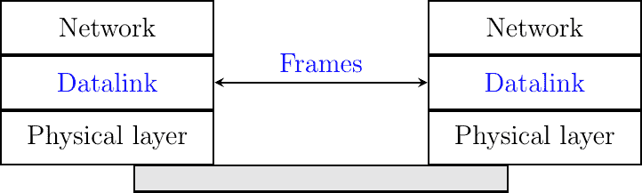
> 
> 图 126 点对点数据链路层

数据链路层主要有两种类型。最简单的数据链路层是当只有两个直接通过物理层连接的通信系统时。这种数据链路层在两个通信系统之间存在点对点链路时使用。这两个系统可以是主机或路由器。PPP（点对点协议），在[**RFC 1661**](https://datatracker.ietf.org/doc/html/rfc1661.html)中定义，是这种点对点数据链路层的例子。数据链路层实体交换帧。数据链路层实体发送的帧通过物理层传输，以便它能够到达右侧的数据链路层实体。点对点数据链路层可以提供不可靠的服务（帧可能被损坏或丢失）或可靠的服务（在这种情况下，数据链路层包括重传机制）。

第二种数据链路层是用于局域网（LAN）的。从概念上讲，局域网是一组通信设备，其中任何两个设备都可以通过数据链路层直接交换帧。主机和路由器都可以连接到局域网。有些局域网只连接少量设备，但也有一些局域网可以连接数百甚至数千个设备。在本章中，我们重点关注点对点数据链路层的利用。我们将在后面描述局域网的组织和操作及其对网络层的影响。

即使只考虑点对点数据链路层，这些层的一个重要特性我们也无法忽视。没有任何数据链路层能够发送无限大小的帧。每个数据链路层都有一个最大帧大小。有十几种不同的数据链路层，不幸的是，其中大多数使用不同的最大帧大小。这种最大帧大小的异质性在我们需要在不同类型的数据链路层连接的主机之间交换数据时会导致问题。

作为第一步，让我们假设我们只需要交换少量数据。在这种情况下，帧的最大长度没有问题。然而，还有其他更有趣的问题需要我们解决。为了理解这些问题，让我们考虑图图 127 中所示的网络。

> 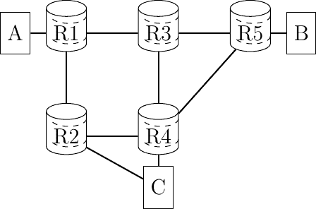
> 
> 图 127 包含三个主机和五个路由器的简单网络

该网络包含两种类型的设备。主机用圆圈表示，路由器用方框表示。主机是一种能够发送和接收数据以供自身使用的设备，与大多数时间只是简单地将数据转发到最终目的地的路由器形成对比。路由器与相邻的路由器或主机有多条链路。主机通常通过单个链路连接到网络。如今，随着无线网络的增长，越来越多的主机配备了多个物理接口。这些主机通常被称为多宿主。然而，同时使用多个接口往往会导致超出本文件范围的实际问题。因此，我们在这本电子书中专注于单宿主主机，即连接到单个网络的主机。

为了理解网络操作背后的关键原则，让我们分析所有需要执行的操作，以便允许上述网络中的主机 A 向主机 B 发送一个字节。多亏了 A-R1 链路上使用的链路层，主机 A 可以轻松地将一个字节封装在帧中发送给路由器 R1。然而，在接收到这个帧后，路由器 R1 需要理解这个字节是发送给主机 B 而不是给自己。这就是网络层的目标。

网络层使得在通过中间路由器不直接连接的主机之间传输信息成为可能。这种传输是通过将信息放入称为数据包的数据结构来实现的。作为一个包含有用数据和控制信息的数据帧，数据包同时包含用户提供的数据和控制信息。网络层的一个重要问题是能够识别网络内的一个节点（主机或路由器）。这种识别是通过将一个地址与每个节点关联来实现的。一个地址通常表示为一串比特。大多数网络使用固定长度的地址。在这个阶段，我们只需假设上述网络中的每个节点都有一个地址，该地址对应于图上其名称的二进制表示。

要向主机 B 发送一个字节的信息，主机 A 需要将此信息放入一个数据包中。除了传输的数据外，数据包还包含源节点和目的节点的地址，或者指示到达目的地的路径的信息。

网络层有两种可能的组织形式：

> +   数据报
> +   
> +   虚拟电路

## 数据报组织#

网络层最常见和最受欢迎的组织形式是数据报组织。这种组织形式受到了邮政服务组织的启发。每个主机都有一个网络层地址。要向远程主机发送信息，主机创建一个包含以下内容的数据包：

> +   目的主机的网络层地址
> +   
> +   它自己的网络层地址
> +   
> +   要发送的信息

为了理解数据报组织，让我们考虑图 128。每个主机和路由器都被分配了一个表示为字母的网络层地址。要向主机 J 发送一些信息，主机 A 创建一个包含其自己的地址、目的地址和要交换的信息的数据包。

> 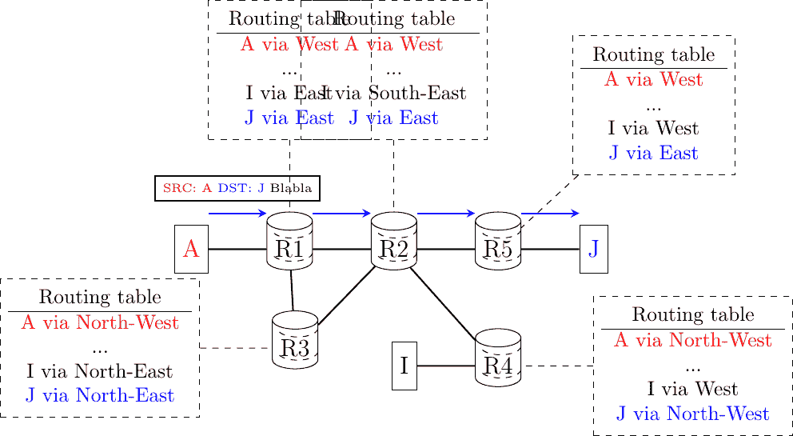
> 
> 图 128 简单的互联网

使用数据报组织，路由器使用逐跳转发。这意味着当路由器收到一个不是发送给它的数据包时，它会查找数据包的目的地址在其转发表中。转发表是一种数据结构，它将每个目的地址（或一组目的地址）映射到必须通过该接口转发的数据包，以便到达其最终目的地。路由器通过其转发表来转发它处理的每个数据包。

图形展示了该网络中一些可能的转发表。通过检查不同路由器的转发表，可以找到从源发送到特定目的地的数据包所遵循的路径。在上面的例子中，主机 A 将其数据包发送到路由器 R1。R1 查阅其转发表并将数据包转发到 R2。根据其自己的表，R2 决定将数据包转发到可以将其送达目的地的 R5。因此，从 A 到 J 的路径是 A -> R1 -> R2 -> R5 -> J。

计算网络内部所有路由器的转发表是网络正确运行的关键要素。此计算可以通过使用分布式或集中式算法来完成。这些算法提供不同的性能，可能导致不同类型的路径，但它们的组合必须导致有效的路径。

在网络中，路径可以定义为给定源/目的地址对的所有中间路由器的列表。对于给定的源/目的地址对，可以通过首先查阅连接到源的路由器的转发表，以确定所选目的地路径上的下一个路由器来推导路径。然后，查询此路由器的转发表以获取相同的目的地…查询会继续，直到到达目的地。在一个具有有效转发表的网络中，所有源/目的地址对之间的路径都包含有限数量的中间路由器。然而，如果转发表没有正确计算，可能会出现两种无效路径。

一条路径可能通向一个黑洞。在网络中，黑洞是一个接收至少一对给定源/目的地址数据包但在此目的地址的转发表中没有条目的路由器。由于它不知道如何到达目的地，该路由器无法转发接收到的数据包，必须丢弃它们。任何计算转发表的集中式或分布式算法都必须确保网络内部没有黑洞。

在使用数据报组织的网络中，可能存在第二种类型的问题。考虑一个包含循环的路径。例如，路由器 R1 通过路由器 R2 将所有数据包发送到目的地 D。路由器 R2 将这些数据包转发到路由器 R3，最终路由器 R3 的转发表使用路由器 R1 作为其下一跳以到达目的地 D。在这种情况下，如果目的地为 D 的数据包被路由器 R1 接收，它将在 R1 -> R2 -> R3 -> R1 的循环中循环，并且永远不会到达其最终目的地。与黑洞情况一样，目的地不是从网络中的所有源可达的。在实践中，循环问题比黑洞问题更令人烦恼，因为当数据包陷入转发循环时，它会无谓地消耗带宽。在黑洞情况下，有问题的数据包会迅速被丢弃。我们将在后面看到，网络层协议包括减少此类转发循环影响的技术。

任何用于计算网络转发表的解决方案都必须确保所有目的地都可以从任何源到达。这意味着它必须保证不存在黑洞和转发环路。

转发表和网络内部交换的数据包的精确格式是网络数据平面的一部分。这个数据平面包含所有主机和路由器使用的协议和算法，用于创建和处理包含用户数据的数据包。在高端路由器上，出于性能原因，数据平面通常在硬件中实现。

除了数据平面，网络还以其控制平面为特征。控制平面包括所有计算并安装在网络内部所有路由器上的转发表的协议和算法（通常是分布式的）。对于给定的网络技术，虽然只有一个可能的数据平面，但使用相同技术的不同网络可能使用不同的控制平面。

网络最简单的控制平面就是手动计算网络内部所有路由器的转发表。当网络（非常）小的时候，这种简单的控制平面是足够的，通常不超过几个路由器。

在大多数网络中，手动转发表不是解决方案，原因有两个。首先，大多数网络太大，无法手动计算转发表。其次，使用手动计算的转发表，处理链路和路由器故障非常困难。网络需要每天 24 小时，每年 365 天运行。许多事件都可能影响构成网络的链路和路由器。链路故障是部署网络中的常规事件。链路可能因为各种原因而失效，包括电磁干扰、光纤切割、终止路由器上的硬件或软件问题，……有些链路可能需要添加到网络中或从网络中移除，因为它们的利用率太低或成本太高。

同样，路由器也可能出现故障。影响路由器的有两种类型的故障。路由器可能因为硬件或软件问题（例如，由于操作系统的崩溃）而停止转发数据包。路由器也可能需要不时地停止运行（例如，升级其操作系统或安装新的接口卡）。这些计划和未计划的意外事件会影响可以用于在网络中转发数据包的链路和路由器的集合。尽管如此，大多数网络用户期望尽管所有这些事件，他们的网络仍然能够正确地转发数据包。使用手动计算的转发表，通常无法预先计算转发表，同时考虑到所有可能的故障场景。

手动计算转发表的替代方案是使用一个网络管理平台，该平台跟踪网络状态，并在检测到网络拓扑有任何修改时，能够将新的转发表推送到路由器。这种解决方案为网络管理员在计算其网络内部路径时提供了一定的灵活性。然而，这种解决方案仅在网络管理平台始终能够到达所有路由器，即使网络拓扑发生变化时也能工作。这可能需要一个专用网络，以便管理平台能够推送转发表信息。Openflow 是此类解决方案的现代例子[[MAB2008]](../bibliography.html#mab2008)。简而言之，Openflow 是一种协议，它使网络控制器能够安装远程路由器转发表中的特定条目，以及更多功能。

另一个值得讨论的有趣点是转发表的计算时机。一种广泛使用的解决方案是为所有路由器上的所有目的地计算转发表的条目。这确保了每个路由器都有通往每个目的地的有效路由。当发生事件且网络拓扑发生变化时，这些条目可以更新。这种方法的缺点是，在大规模网络中，转发表可能会变得很大，因为每个路由器必须始终在其转发表中为每个目的地维护一个条目。

一些网络使用数据包到达作为计算转发表中相应条目的触发器。基于此原理已经开发出多种技术。当数据包到达时，路由器会查阅其转发表以找到通往目的地的路径。如果目的地存在于转发表中，则转发数据包。否则，路由器需要找到转发数据包的方法并更新其转发表。

### 计算转发表#

部署网络时采用了多种技术来在数据包到达时更新转发表。在本节中，我们将简要介绍这三种技术背后的原理。

第一种技术假设底层网络拓扑是一个树。在转发数据包时，树是最简单的网络结构。使用树的主要优势是网络中任意两个节点之间只有一条路径。由于树不包含任何循环，因此在树形网络中不可能出现转发环路。

在树形网络中，每个节点通过检查它接收到的数据包自动计算其转发表相对简单。为此，每个节点使用每个数据包中存在的源和目的地地址。多亏了源地址，一个节点可以学习网络中不同源的位置。每个源都有一个唯一的地址。当一个节点通过某个接口收到一个数据包时，它了解到这个数据包的源（地址）可以通过这个接口访问。节点维护一个将每个已知源地址映射到入接口的数据结构。这个数据结构通常被称为端口地址表，因为它指示了到达给定地址的接口（或端口）。

仅学习源的位置是不够的，节点还需要将数据包转发到它们的目的地。当一个节点收到一个其目的地地址已经存在于其端口地址表中的数据包时，它只需将数据包转发到端口地址表中列出的接口。在这种情况下，数据包将遵循下游节点中的端口地址表条目，并到达目的地。如果目的地地址未包含在端口地址表中，节点只需将其数据包转发到所有接口，除了接收数据包的接口。在计算机网络术语中，将数据包转发到所有接口通常称为广播。将数据包发送到除一个接口之外的所有接口是一种昂贵的操作，因为数据包是通过无法到达目的地的链路发送的。鉴于网络的树形结构，数据包将探索树的所有下游分支，并最终到达目的地。在实践中，广播操作并不太常见，其性能影响仍然有限。

为了理解端口地址表的操作，让我们考虑图 129 中所示的示例网络。这个网络包含三个主机：A、B 和 C 以及五个路由器，R1 到 R5。当网络启动时，所有节点的转发表都是空的。

> 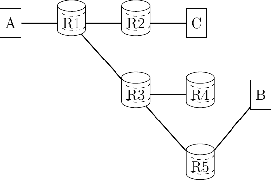
> 
> 图 129 一个简单的树形网络

主机 A 向 B 发送一个数据包。当收到这个数据包时，R1 了解到 A 可以通过其西接口到达。由于它在端口地址表中没有为目的地 B 的条目，它将数据包转发给 R2 和 R3。当 R2 收到数据包时，它更新自己的转发表并将数据包转发给 C。由于 C 不是预期的接收者，它简单地丢弃了接收到的数据包。路由器 R3 也收到了数据包。它了解到 A 可以通过其西北接口到达，并将数据包广播到 R4 和 R5。R5 也更新了其转发表，并最终将其转发到目的地 B。现在让我们考虑当 B 向 A 发送回复时会发生什么。R5 首先了解到 B 连接到其东北端口。然后它查阅其端口地址表，发现 A 可以通过其西北接口到达。然后数据包逐跳转发到 A，没有任何广播。稍后，如果 C 向 B 发送一个数据包，这个数据包将到达包含有效转发条目的 R1。

通过检查数据包的源地址和目的地址，网络节点可以自动推导出它们的转发表。正如我们稍后将要讨论的，这种技术在以太网网络中被使用。尽管这种技术被广泛使用，但它有两个重要的缺点。首先，发送到未知目的地的数据包即使在目的地未连接到网络的情况下也必须在网络中广播。考虑上面网络中发送到 Z 的十个数据包的传输。当一个节点收到指向该目的地的数据包时，它只能广播该数据包。由于 Z 未连接到网络，没有任何节点会收到源地址为 Z 的数据包来更新其转发表。第二个且更为重要的问题是，很少有网络具有树形拓扑结构。分析在包含环路的网络中使用端口地址表时发生的情况是很有趣的。考虑图 130 中显示的简单且冗余的网络。

> 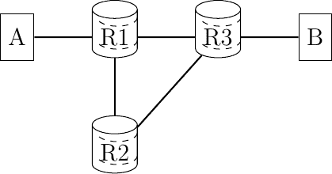
> 
> 图 130 简单且冗余的网络

假设网络已经开始运行，并且所有端口地址和转发表都是空的。主机 A 向 B 发送一个数据包。当收到这个数据包时，R1 更新其端口地址表。由于 B 不在端口地址表中，该数据包被广播。R2 和 R3 都收到了 A 发送的数据包副本。它们都更新了它们的端口地址表。不幸的是，它们也同时广播了接收到的数据包。B 收到了数据包的第一个副本，但 R3 和 R2 又收到了它。然后 R3 将这个数据包副本广播给 B 和 R1，而 R2 将其副本广播给 R1。尽管 B 已经收到了两个数据包副本，但它仍然在网络中，并继续循环。由于存在循环，一个未知目标的数据包会产生许多循环的数据包副本，最终会饱和网络。使用端口地址表来自动计算转发表的网络操作员也使用分布式算法来确保网络拓扑始终是树形结构。

另一种称为源路由的技术可以用来自动计算转发表。它已被用于连接令牌环网络和某些无线网络。直观地说，源路由允许目标自动发现从给定源到自身的路径。这种技术要求节点在数据包中编码信息。为了简单起见，让我们假设数据平面支持两种类型的数据包：

> +   数据包
> +   
> +   控制包

数据包用于交换数据，而控制包用于发现主机之间的路径。使用源路由，可以将路由器保持得尽可能简单，并将所有复杂性放在主机上。这与先前的技术形成对比，其中节点必须维护端口地址表和转发表，而主机只是发送和接收数据包。每个节点配置了一个唯一的地址，每个出链路都有一个标识符。为了简单起见，避免在图中添加这些标识符，我们假设每个节点使用北、西、南等作为链路标识符。在实际中，节点会将一个整数与每个出链路关联。这如图 图 131 所示。

> 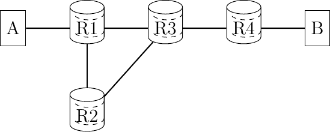
> 
> 图 131 一个包含两个主机和四个路由器的简单网络

在上述网络中，路由器 R2 连接了两个出链路。R2 与 R1 和 R3 都相连。R2 可以通过与它们交换数据包或观察每个接口接收到的数据包来轻松确定自己连接到这两个节点。例如，当一个节点（无论是主机还是路由器）启动时，它会通过每个接口发送一个特殊的控制数据包来向邻居通告自己的地址。当一个节点收到这样的数据包时，它会自动回复自己的地址。这种交换也可以用来验证邻居（无论是路由器还是主机）是否仍然存活。在源路由中，数据平面数据包包含一个标识符列表。这个列表被称为源路由，它指示数据包应遵循的路径，即一系列链路标识符。当一个节点收到这样的数据平面数据包时，它首先检查数据包的目的地是否是直接邻居。在这种情况下，数据包被转发到这个邻居。否则，节点从列表中提取下一个地址并将其转发给邻居。这允许源节点为每个数据包指定要遵循的显式路径。例如，在上面的图中，A 和 B 之间存在两条可能的路径。要使用通过 R2 的路径，A 会发送一个包含 R1、R2、R3 作为源路由的数据包。要避免通过 R2，A 会在其传输的数据包中将 R1、R3 作为源路由。如果 A 知道完整的网络拓扑和所有链路标识符，它可以轻松地计算到每个目的地的源路由。它甚至可以使用不同的路径，例如为了冗余，到达给定的目的地。然而，在现实网络中，主机通常不会拥有整个网络拓扑的映射。

在依赖于源路由的网络中，主机使用控制数据包来自动发现最佳路径。除了源地址和目的地址外，控制数据包还包含一个列表，记录中间节点。这个列表通常被称为记录路由，因为它允许记录给定数据包遵循的路径。当一个节点收到这样的控制数据包时，它首先检查自己的地址是否包含在记录路由中。如果是，则表示数据包已经被这个节点转发，并且它会被静默丢弃。否则，它会将自己的地址添加到记录路由中，并将数据包转发到所有接口，除了接收数据包的接口。因此，控制数据包可以探索源节点和给定目的地之间的所有路径。

例如，再次考虑上面的网络拓扑。A 向 B 发送一个控制包。初始记录路由为空。当 R1 接收到数据包时，它将自己的地址添加到记录路由中，并将一个副本转发给 R2，另一个转发给 R3。R2 接收到数据包，将其自身添加到记录路由中，并将其转发给 R3。R3 接收到两个数据包副本。第一个包含[R1,R2]记录路由，第二个包含[R1]。最终，B 将接收到包含[R1,R2,R3,R4]和[R1,R3,R4]作为记录路由的两个控制包。B 可以保留这两条路径或选择其中最好的一条并丢弃第二条。一种流行的启发式方法是选择第一个接收到的记录路由作为最佳路径，因为这很可能对应于最短延迟路径。

使用接收到的记录路由，B 可以向 A 发送一个数据包。为此，它只需简单地反转所选的记录路由。然而，我们仍然需要将所选路径传达给 A。这可以通过将记录路由放入一个控制包中来实现，该控制包通过反向路径发送回 A。另一种方法是简单地发送一个数据包回 A。这个数据包将返回到 A。为了允许 A 检查数据包所经过的整个路径，其源路由必须在 A 接收到时包含所有中间路由器。这可以通过使用包含索引和节点地址有序列表的数据结构来编码源路由来实现。索引始终指向源路由中的下一个地址。当创建数据包时，它初始化为 0，并且每个中间节点递增。

计算转发表的第三种技术是依赖于使用分布式算法的控制平面。路由器交换控制消息以发现网络拓扑并根据它们构建它们的转发表。我们将在本节稍后更详细地描述此类分布式算法。

### 平面或分层地址#

最后，但同样重要的是，关于依赖于数据报模式的网络的数据平面的讨论点是它们的寻址方案。在上面的例子中，我们使用字母来表示主机和网络节点的地址。在实践中，所有地址都被编码为一个位串。大多数网络技术使用固定大小的位串来表示源地址和目的地址。这些地址可以以两种不同的方式组织。

第一个组织，即我们直到现在都隐含假设的组织，是平面寻址方案。在这种方案下，每个主机和网络节点都有一个唯一的地址。地址的唯一性对于网络的运行非常重要。如果两个主机有相同的地址，网络转发数据包到该目的地可能会变得困难。平面地址通常用于网络节点和主机需要能够通过唯一地址立即通信的情况。这些平面地址通常嵌入在网络接口卡中。网络卡制造商为每个接口创建一个唯一的地址，并将该地址存储在接口的只读存储器中。这种寻址方案的一个优点是它很容易支持无结构和移动网络。当主机移动时，它可以连接到另一个网络，并确信其地址是唯一的，并且它能够在新网络中进行通信。

使用平面寻址，转发表中的查找操作可以实施为精确匹配。转发表包含所有已知目标地址的（排序）列表。当一个数据包到达时，网络节点只需检查此地址是否包含在转发表中。如果列表已排序，在软件中这是一个 O(log(n))的操作。在硬件中，内容可寻址存储器可以有效地执行此查找操作，但它们的大小通常有限。

平面寻址方案的缺点是，随着网络中设备数量的线性增长，转发表也会线性增长。这种寻址方案在以太网章节中描述的以太网网络中被特别使用。在这种寻址方案下，每个转发表必须包含一个指向网络内部可到达的每个地址的条目。由于大型网络可以包含数千万甚至更多的主机，这在需要能够快速转发数据包的路由器上是一个主要问题。作为一个例子，考虑一个以 10 Gbps 运行的接口是有趣的。这样的接口现在可以在高端服务器和各种路由器上找到。假设数据包大小为 1000 位，这是一个保守的数字，这样的接口每秒必须转发一千万个数据包。这意味着接收此类链路上的数据包的路由器必须每 100 纳秒转发一个 1000 位的数据包。这与旧 DRAM 的内存访问时间在同一数量级。当数据包更小或链路更快时，这种延迟会降低。今天的高端路由器支持 400 Gbps 或 800 Gbps 的线路卡。

广泛使用的平面寻址方案的替代方案是分层寻址方案。这种寻址方案基于这样一个事实：网络通常包含比路由器多得多的主机。在这种情况下，减少转发表大小的第一个解决方案是创建地址层次结构。这是邮局所选择的解决方案，因为邮政地址包含国家、有时是州或省、城市、街道，最后是街道号码。当一个信封被一个遥远国家的邮局转发时，它只查看目的地国家，而同一省份的邮局将查看城市信息。只有负责特定城市的邮局会查看街道名称，而只有邮递员会使用街道号码。分层地址为网络地址提供了类似的解决方案。例如，连接到校园网络的互联网主机的地址可以在高阶位中包含为该校园网络服务的互联网服务提供商（ISP）的标识。然后，随后的位块标识了校园网络，这是 ISP 的众多客户之一。最后，地址的低阶位标识了校园网络中的主机。IPv4 和 IPv6 都使用分层地址。

这种地址的分层分配可以应用于任何类型的网络。在实践中，地址的分配必须遵循网络拓扑。通常，这是通过将寻址空间划分为连续的块，然后将这些块分配给网络的不同部分来实现的。在一个小型网络中，最简单的解决方案是将一个地址块分配给每个网络节点，并从连接的节点分配主机地址。

> 
> 
> 图 132 一个包含两个主机和四个路由器的简单网络

在图 图 132 中，假设网络使用 16 位地址，并且前缀 01001010 已分配给整个网络。由于网络包含四个路由器，网络运营商可以为每个路由器分配一个包含 64 个地址的块。R1 将使用地址 0100101000000000，而 A 可以使用地址 0100101000000001。R2 可以分配从 0100101001000000 到 0100101001111111 的所有地址。然后，R4 可以使用 0100101011000000 并将 0100101011000001 分配给 B。其他分配方案也是可能的。例如，R3 可以分配比 R2 和 R4 更大的地址块，而 R4 可以使用 R3 地址块的一个子块。

分层地址的主要优点是，可以显著减少转发表的大小。在许多网络中，路由器的数量可以比主机数量小几个数量级。一个校园网络可能包含十几个路由器和数千个主机。最大的互联网服务提供商通常不超过几万个路由器，但仍为数千或数亿个主机提供服务。

尽管分层地址很受欢迎，但它们也有一些缺点。它们的首要缺点是，在转发表中查找比使用平面地址更复杂。例如，在互联网上，网络节点必须执行最长匹配来转发每个数据包。这通过减少转发表的大小部分得到补偿，但查找操作的额外复杂性一直是实现硬件支持数据包转发的难题。分层地址使用的第二个缺点是，当主机首次连接到网络时，它必须联系一个路由器以确定自己的地址。这需要在主机和某些路由器之间进行一些数据包交换。此外，如果主机移动并连接到另一个路由器，其网络地址将改变。这可能会对某些移动主机造成问题。

### 处理异构数据链路层#

有时，网络层需要处理异构数据链路层。例如，连接到不同数据链路层的两个主机通过使用其他类型数据链路层路由器交换数据包。多亏了网络层，只要每个数据包在传输前都能放入一个数据链路层帧中，这种数据包交换是可能的。如果所有数据链路层都支持相同的帧大小，这很简单。当一个节点接收到一个帧时，它会解封装包含的数据包，检查头部并转发它，封装在另一个帧中，发送到出口接口。不幸的是，封装操作并不总是可能的。每个数据链路层的特点是它所支持的最大的帧大小。数据链路层通常支持包含数百或数千字节的帧。一个特定数据链路层所支持的最大的帧大小取决于其底层技术。不幸的是，大多数数据链路层支持不同的最大帧大小。这意味着当主机在帧中发送一个大型数据包到其下一跳路由器时，存在这种数据包将不得不穿越无法在单个帧中转发该数据包的链路的风险。原则上，有三种可能性来解决此问题。为了讨论它们，我们考虑一个简单的场景，其中两个主机连接到一个路由器，如图所示。

> 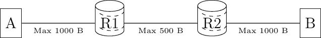
> 
> 图 133 一个简单的异构网络

在上面的网络中，假设主机 A 想要通过路由器 R1 向主机 B 发送一个 900 字节的分组（870 字节的负载和 30 字节的头部）。主机 A 将这个分组封装在一个单独的帧中。这个帧被路由器 R1 接收，并从中提取出分组。路由器 R1 有三个可能的选择来处理这个分组。

> 1.  分组太大，路由器 R1 无法将其转发到路由器 R2。它拒绝了这个分组，并向源（主机 A）发送一个控制分组，以表明它无法转发超过 500 字节（减去分组头部）的分组。源可以对此控制分组做出反应，通过将信息重传为更小的分组。
> 1.  
> 1.  网络层能够分片分组。在我们的例子中，路由器可以将分组分成两部分。第一部分包含负载的开始部分，第二部分包含结束部分。有两种可能的方法来进行这种分片。
> 1.  
> 1.  路由器 R1 在将分组传输到路由器 R2 之前将其分成两个分片。路由器 R2 在将分组传输到主机 B 的链路之前，将这两个分组分片重新组装成更大的分组。
> 1.  
> 1.  每个分组分片都是一个有效的分组，它包含一个带有源（主机 A）和目的（主机 B）地址的头部。当路由器 R2 接收到一个分组分片时，它将这个分组视为一个常规分组，并将其转发到其最终目的地（主机 B）。主机 B 重新组装接收到的分片。

这三种解决方案各有优缺点。第一种解决方案中，路由器保持简单，不需要执行任何分片操作。当路由器主要在硬件中实现时，这一点很重要。然而，主机必须复杂，因为它们需要存储它们产生的分组，如果它们需要通过不支持大分组的链路，这会增加主机上所需的缓冲区。

此外，一个单独的大分组可能需要被重传多次。例如，考虑一个类似于上面所示的网络，但包含四个路由器。假设 R1->R2 链路支持 1000 字节的分组，R2->R3 链路支持 800 字节的分组，R3->R4 链路支持 600 字节的分组。连接到 R1 的主机发送大分组时，首先尝试 1000 字节，然后是 800 字节，最后是 600 字节。幸运的是，这种情况在实践中并不常见，这也是为什么这种解决方案在真实网络中被使用的原因。

按链路分片数据包，如第二个解决方案中所示，可以最小化传输开销，因为数据包只在需要分片的地方进行分片。大数据包可以继续在只接受小数据包的链路下游使用。然而，这种开销的减少伴随着两个缺点。首先，在所有链路上分片数据包，可能会增加路由器的处理时间和缓冲区需求。其次，这个解决方案会导致更长的端到端延迟，因为下游路由器必须在转发数据包之前重新组装所有的数据包片段。

最后一种解决方案是介于其他两种解决方案之间的折衷方案。路由器需要执行分片，但不需要重新组装数据包片段。只有主机需要缓冲区来重新组装接收到的片段。这种解决方案具有更低的端到端延迟，并且需要路由器更少的处理时间和内存。

上文提出的分片问题第一种解决方案建议利用控制数据包通知源端关于接收到的过长数据包的情况。这只是网络层控制协议执行的功能之一。其他功能包括：

> +   如果路由器收到一个没有有效条目在其转发表中的数据包，则向源发送控制数据包
> +   
> +   如果路由器检测到数据包在网络内部循环，则向源发送控制数据包
> +   
> +   验证数据包能否到达指定的目的地

当我们描述 TCP/IP 协议套件网络层中使用的协议时，我们将更详细地讨论这些功能。

## 虚拟电路组织#

网络层的第二种组织方式，称为虚拟电路，其组织结构受到了电话网络组织的启发。电话网络的设计是为了承载通常持续几分钟的电话通话。每部电话通过电话号码进行标识，并连接到电话交换机。为了发起电话通话，电话首先需要将其目的地电话号码发送到其本地交换机。交换机与网络中的其他交换机合作，在网络中为两部电话之间创建一个双向通道。这个通道将在通话期间被两部电话使用，并在通话结束时释放。直到 20 世纪 60 年代，这些通道大多数都是通过电话操作员根据呼叫者的请求手动创建的。今天的电话网络使用自动化交换机，并允许在同一物理链路上传输多个通道，但基本原理大致相同。

在使用虚电路的网络中，所有主机也使用网络层地址进行标识。然而，数据包转发不是通过查看每个数据包的目的地址来进行的。在虚电路组织结构中，每个数据包包含一个标签 [[1]](#flabels)。标签是一个整数，它是数据包头部的一部分。路由器通过标签交换来转发标记数据包。在接收到数据包后，路由器会查阅其标签转发表以找到该数据包的出口接口。与数据报模式相比，这种查找非常简单。标签转发表是存储在内存中的数组，而进入数据包的标签是该数组的索引。这意味着查找操作具有 O(1)的复杂度，与其他数据包转发技术相比。为了确保在每个节点上数据包标签是标签转发表中的索引，每个转发数据包的路由器都会将转发数据包的标签替换为标签转发表中找到的标签。标签转发表的每个条目包含两份数据：

> +   数据包的出口接口
> +   
> +   出口数据包的标签

例如，考虑以下网络节点的标签转发表。

| 索引 | 出口接口 | 标签 |
| --- | --- | --- |
| 0 | 南 | 7 |
| 1 | 无 | 无 |
| 2 | 西 | 2 |
| 3 | 东 | 2 |

如果这个节点接收到标签=2 的数据包，它将在其西接口上转发数据包并将出口数据包的标签设置为 2。如果接收到的数据包的标签设置为 3，则数据包将通过东接口转发，出口数据包的标签也设置为 2。如果接收到标签字段设置为 1 的数据包，则该数据包将被丢弃，因为相应的标签转发表条目是无效的。

标签交换允许完全控制网络内部数据包的路径。考虑以下网络，并假设我们想使用两个虚电路：R1->R3->R4->R2->R5 和 R2->R1->R3->R4->R5。

> 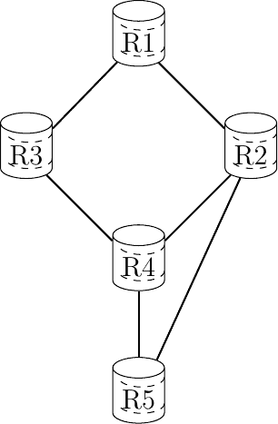
> 
> 图 134：一个可以应用标签交换来调整其路径的网络示例

要创建这些虚电路，我们需要配置所有路由器的标签转发表。为了简化，假设标签转发表只包含两个条目。假设 R5 想要接收由 R1（分别由 R2）创建的带有标签=1（标签=0）的虚电路中的数据包。R4 可以使用以下标签转发表：

| R4 的标签转发表 |
| --- |
| 索引 | 出口接口 | 标签 |
| 0 | ->R2 | 1 |
| 1 | ->R5 | 0 |

由于带有标签=1 的接收到的数据包必须转发到带有标签=1 的 R5，R2 的标签转发表可能包含：

| R2 的标签转发表 |
| --- |
| 索引 | 出口接口 | 标签 |
| 0 | 无 | 无 |
| 1 | ->R5 | 1 |

两个虚拟电路通过 R3。它们都需要转发到 R4，但 R4 期望来自 R2 的虚拟电路的数据包标签为 1，而来自其他虚拟电路的数据包标签为 0。R3 可以选择保持标签不变。

| R3 的标签转发表 |
| --- |
| 索引 | 输出接口 | 标签 |
| 0 | ->R4 | 0 |
| 1 | ->R4 | 1 |

在上述标签转发表中，R1 需要以标签=0 启动属于 R1->R3->R4->R2->R5 电路的数据包。然后从 R2 接收到的属于 R2->R1->R3->R4->R5 电路的数据包将在 R1-R3 链路上使用标签=1。R1 的标签转发表可以构建如下：

| R1 的标签转发表 |
| --- |
| 索引 | 输出接口 | 标签 |
| 0 | ->R3 | 0 |
| 1 | ->R3 | 1 |

下图展示了在 R1->R3->R4->R2->R5 路径上数据包的路径，用红色表示，每个箭头上的标签是数据包中使用的标签。

> 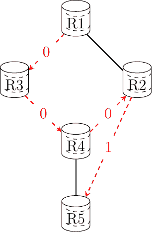
> 
> 图 135 特定电路的数据包路径

多协议标签交换（MPLS）是依赖于标签交换的已部署网络技术的例子。MPLS 比上述描述更复杂，因为它被设计成容易与数据报技术集成。然而，原则仍然是。异步传输模式（ATM）和帧中继是其他依赖于标签交换技术的例子。

现在，大多数部署的网络都依赖于称为路由协议的分布式算法来计算安装在路由器上的转发表。这些分布式算法是控制平面的一部分。它们通常在软件中实现，并在路由器的主 CPU 上执行。有两种主要的路由协议家族：距离矢量路由和链路状态路由。两者都能够自主发现网络，并能够动态地响应拓扑变化。

脚注

## 数据报组织#

网络层的第一种和最流行的组织形式是数据报组织。这种组织形式受到了邮政服务组织的启发。每个主机都由一个网络层地址标识。为了向远程主机发送信息，主机创建一个包含以下内容的数据包：

> +   目的主机的网络层地址
> +   
> +   它自己的网络层地址
> +   
> +   要发送的信息

要理解数据报组织，让我们考虑图 128。每个主机和路由器都分配了一个由字母表示的网络层地址。为了向主机 J 发送一些信息，主机 A 创建了一个包含其自己的地址、目标地址和要交换的信息的数据包。

> 
> 
> 图 128 简单的互联网

在数据报组织结构中，路由器使用逐跳转发。这意味着当一个路由器收到一个不是发往自己的数据包时，它会在其转发表中查找数据包的目的地址。转发表是一种数据结构，它将每个目的地址（或一组目的地址）映射到必须通过该接口转发数据包以到达其最终目的地的出口接口。路由器咨询其转发表以转发它处理的每个数据包。

图中说明了该网络中一些可能的转发表。通过检查不同路由器的转发表，可以找到从源发送到特定目的地的数据包所遵循的路径。在上面的例子中，主机 A 将其数据包发送到路由器 R1。R1 咨询其转发表并将数据包转发到 R2。根据其自己的表，R2 决定将数据包转发到可以将其交付到目的地的 R5。因此，从 A 到 J 的路径是 A -> R1 -> R2 -> R5 -> J。

在网络内部计算所有路由器的转发表是网络正确运行的关键要素。这个计算可以通过使用分布式或集中式算法来完成。这些算法提供不同的性能，可能会导致不同类型的路径，但它们的组合必须导致有效的路径。

在网络中，路径可以定义为给定源/目的对的所有中间路由器的列表。对于给定的源/目的对，路径可以通过首先咨询连接到源的路由器的转发表来确定通往所选目的地的路径上的下一个路由器。然后，查询此路由器的转发表以获取相同的目的地…查询会继续，直到达到目的地。在一个具有有效转发表的网络中，所有源/目的对之间的路径都包含有限数量的中间路由器。然而，如果转发表没有正确计算，可能会出现两种无效路径。

路径可能导致黑洞。在网络中，黑洞是至少接收一个给定源/目的对的数据包但在其转发表中没有该目的地的条目的路由器。由于它不知道如何到达目的地，该路由器无法转发接收到的数据包并必须丢弃它们。任何计算转发表的集中式或分布式算法都必须确保网络中没有黑洞。

在使用数据报组织的网络中可能存在第二种类型的问题。考虑一个包含循环的路径。例如，路由器 R1 通过路由器 R2 将所有数据包发送到目的地 D。路由器 R2 将这些数据包转发到路由器 R3，最后路由器 R3 的转发表使用路由器 R1 作为其下一跳来到达目的地 D。在这种情况下，如果路由器 R1 收到一个目的地为 D 的数据包，它将在 R1 -> R2 -> R3 -> R1 的循环中循环，并且永远不会到达其最终目的地。就像在黑洞案例中一样，目的地不是从网络中的所有源可达。在实践中，循环问题比黑洞问题更令人烦恼，因为当数据包陷入转发环路时，它会无谓地消耗带宽。在黑洞情况下，有问题的数据包会迅速被丢弃。我们将在后面看到，网络层协议包括技术来最小化这种转发环路的影响。

任何用于计算网络转发表的解决方案都必须确保所有目的地都可通过任何源到达。这意味着它必须保证不存在黑洞和转发环路。

转发表和在网络内部交换的数据包的精确格式是网络数据平面的一部分。这个数据平面包含所有主机和路由器使用的协议和算法，用于创建和处理包含用户数据的数据包。在高端路由器上，出于性能原因，数据平面通常在硬件中实现。

除了数据平面，网络还以其控制平面为特征。控制平面包括所有计算并安装在网络上所有路由器上的转发表的协议和算法（通常是分布式的）。对于给定的网络技术，可能只有一个可能的数据平面，但使用相同技术的不同网络可能使用不同的控制平面。

对于网络来说，最简单的控制平面是手动计算网络内部所有路由器的转发表。当网络（非常）小，通常不超过几个路由器时，这种简单的控制平面是足够的。

在大多数网络中，手动转发表不是解决方案，有两个原因。首先，大多数网络太大，无法手动计算转发表。其次，使用手动计算的转发表，很难处理链路和路由器故障。网络需要每天 24 小时，每年 365 天运行。许多事件可以影响构成网络的路由器和链路。链路故障是部署网络中的常规事件。链路可能因各种原因而失败，包括电磁干扰、光纤切割、终止路由器上的硬件或软件问题等。一些链路也需要添加到网络中或从网络中移除，因为它们的利用率太低或成本太高。

同样，路由器也可能出现故障。有两种类型的故障会影响路由器。路由器可能因为硬件或软件问题（例如，由于操作系统的崩溃）而停止转发数据包。路由器也可能需要不时地停止运行（例如，升级其操作系统或安装新的接口卡）。这些计划和未计划的事件会影响网络中可用于转发数据包的链路和路由器的集合。尽管如此，大多数网络用户都期望他们的网络将继续正确地转发数据包，尽管发生了所有这些事件。使用手动计算的转发表，通常不可能在考虑所有可能的故障场景的同时预先计算转发表。

手动计算转发表的替代方案是使用一个网络管理平台，该平台跟踪网络状态，并在检测到网络拓扑的任何修改时，可以在路由器上推送新的转发表。这种解决方案为网络管理员在计算其网络内部的路径时提供了一定的灵活性。然而，这种解决方案仅在网络管理平台始终能够到达所有路由器，即使网络拓扑发生变化时才有效。这可能需要一个专用网络，以便管理平台能够推送转发表信息。Openflow 是这类解决方案的现代例子 [[MAB2008]](../bibliography.html#mab2008)。简而言之，Openflow 是一种协议，它使网络控制器能够安装远程路由器转发表中的特定条目，以及更多功能。

另一个值得讨论的有趣点是转发表的计算时机。一个广泛使用的解决方案是为所有路由器上的所有目的地计算转发表的条目。这确保了每个路由器都对每个目的地有一个有效的路由。当发生事件且网络拓扑发生变化时，这些条目可以被更新。这种方法的缺点是，在大规模网络中，转发表可能会变得很大，因为每个路由器必须始终在其转发表中为每个目的地维护一个条目。

一些网络使用数据包到达作为计算转发表中相应条目的触发器。基于这一原则已经开发出几种技术。当数据包到达时，路由器会查阅其转发表以找到通往目的地的路径。如果目的地存在于转发表中，则转发数据包。否则，路由器需要找到一种方法来转发数据包并更新其转发表。

### 计算转发表#

部署网络使用了多种技术来在数据包到达时更新转发表。在本节中，我们将简要介绍这三种技术背后的原理。

第一种技术假设底层网络拓扑是树形。在转发数据包时，树形是最简单的网络。使用树的主要优点是网络中任意一对节点之间只有一条路径。由于树不包含任何循环，因此在树形网络中不可能有转发环路。

在树形网络中，每个节点通过检查它接收到的数据包，相对简单就能自动计算其转发表。为此，每个节点使用每个数据包中存在的源和目的地地址。多亏了源地址，节点可以学习网络中不同源的位置。每个源都有一个唯一的地址。当一个节点通过某个接口收到一个数据包时，它了解到这个数据包的源（地址）可以通过这个接口访问。节点维护一个将每个已知源地址映射到入接口的数据结构。这个数据结构通常被称为端地址表，因为它指示了到达给定地址的接口（或端口）。

仅学习源的位置是不够的，节点还需要将数据包转发到它们的目的地。当一个节点收到一个其目的地地址已经在其端地址表中存在的数据包时，它只需在端地址表中列出的接口上转发数据包。在这种情况下，数据包将遵循下游节点的端地址表条目并到达目的地。如果目的地地址未包含在端地址表中，节点只需在其所有接口上转发数据包，除了接收数据包的接口。在计算机网络术语中，将数据包转发到所有接口通常称为广播。通过所有接口发送数据包是一种昂贵的操作，因为数据包是通过无法到达目的地的链路发送的。鉴于网络的树形结构，数据包将探索树的所有下游分支，并最终到达目的地。在实践中，广播操作并不太常见，其性能影响仍然有限。

要理解端地址表的操作，让我们考虑图 Fig. 129 所示的示例网络。这个网络包含三个主机：A、B 和 C 以及五个路由器，R1 到 R5。当网络启动时，所有节点的转发表都是空的。

> 
> 
> 图 Fig. 129 一个简单的树形网络

主机 A 向 B 发送一个数据包。当收到这个数据包时，R1 了解到 A 可以通过其西接口到达。由于它在端口地址表中没有为目的地 B 的条目，它将数据包转发给 R2 和 R3。当 R2 收到数据包时，它更新自己的转发表并将数据包转发给 C。由于 C 不是预期的接收者，它简单地丢弃了接收到的数据包。路由器 R3 也收到了数据包。它了解到 A 可以通过其西北接口到达，并将数据包广播给 R4 和 R5。R5 也更新了其转发表，并最终将其转发到目的地 B。现在让我们考虑当 B 向 A 发送回复时会发生什么。R5 首先了解到 B 连接到其东北端口。然后它查阅其端口地址表，发现 A 可以通过其西北接口到达。然后数据包逐跳转发到 A，没有任何广播。稍后，如果 C 向 B 发送一个数据包，这个数据包将到达包含有效转发条目的 R1。

通过检查数据包的源地址和目的地址，网络节点可以自动推导出它们的转发表。正如我们稍后将要讨论的，这种技术在以太网网络中被使用。尽管这种技术被广泛使用，但它有两个重要的缺点。首先，即使目的地址未连接到网络，发送到未知目的地的数据包也必须在网络中广播。考虑网络中发送到 Z 的十个数据包的传输。当一个节点收到指向该目的地的数据包时，它只能广播该数据包。由于 Z 未连接到网络，没有任何节点会收到源地址为 Z 的数据包来更新其转发表。第二个且更为重要的问题是，很少有网络具有树形拓扑结构。分析在包含环路的网络中使用端口地址表时发生的情况是很有趣的。考虑图 130 中显示的简单且冗余的网络图。

> 
> 
> 图 130 简单且冗余的网络

假设网络已经开始，所有端口号和转发表都是空的。主机 A 向 B 发送一个数据包。当接收到这个数据包时，R1 更新其端口号表。由于 B 不在端口号表中，该数据包被广播。R2 和 R3 都收到了 A 发送的数据包副本。他们都更新了他们的端口号表。不幸的是，他们也同时广播了接收到的数据包。B 收到了数据包的第一个副本，但 R3 和 R2 又收到了它。然后 R3 将这个数据包副本广播给 B 和 R1，而 R2 将其副本广播给 R1。尽管 B 已经收到了两个数据包副本，但它仍然在网络中，并继续循环。由于存在循环，一个未知目标的数据包会产生许多循环的数据包副本，最终会饱和网络。使用端口号表来自动计算转发表的网络操作员也使用分布式算法来确保网络拓扑始终是树形结构。

另一种称为源路由的技术可以用来自动计算转发表。它已被用于连接令牌环网络和某些无线网络。直观地说，源路由允许目标自动发现从给定源到自身的路径。这种技术要求节点在数据包中编码信息。为了简单起见，让我们假设数据平面支持两种类型的数据包：

> +   数据包
> +   
> +   控制包

数据包用于交换数据，而控制包用于发现主机之间的路径。使用源路由时，可以将路由器保持得尽可能简单，并将所有复杂性放在主机上。这与之前的技巧形成对比，其中节点必须维护一个端口号和转发表，而主机只是简单地发送和接收数据包。每个节点配置有一个唯一的地址，每个出链路有一个标识符。为了简单起见，并避免在图中充斥着这些标识符，我们假设每个节点使用北、西、南等作为链路标识符。在实践中，节点会将一个整数与每个出链路关联起来。这如图图 131 所示。

> 
> 
> 图 131 具有两个主机和四个路由器的简单网络

在上述网络中，路由器 R2 连接到两个出链路。R2 连接到 R1 和 R3。R2 可以通过与它们交换数据包或观察每个接口接收到的数据包来轻松确定它连接到这两个节点。例如，假设当一个节点（无论是主机还是路由器）启动时，它会通过每个接口发送一个特殊控制数据包来向其邻居通告自己的地址。当一个节点收到这样的数据包时，它会自动回复自己的地址。这种交换也可以用来验证邻居（无论是路由器还是主机）是否仍然存活。在源路由中，数据平面数据包包含一个标识符列表。这个列表被称为源路由。它指示数据包应遵循的路径，作为一系列链路标识符的序列。当一个节点收到这样的数据平面数据包时，它首先检查数据包的目的地是否是直接邻居。在这种情况下，数据包将被转发到该邻居。否则，节点从列表中提取下一个地址并将其转发给邻居。这允许源为每个数据包指定要遵循的显式路径。例如，在上面的图中，A 和 B 之间存在两条可能的路径。要使用通过 R2 的路径，A 会发送一个包含 R1、R2、R3 作为源路由的数据包。要避免通过 R2，A 会在其传输的数据包中将 R1、R3 作为源路由。如果 A 知道完整的网络拓扑和所有链路标识符，它可以轻松计算到每个目的地的源路由。它甚至可以使用不同的路径，例如，为了冗余，到达给定的目的地。然而，在现实网络中，主机通常不会拥有整个网络拓扑的映射。

在依赖于源路由的网络中，主机使用控制数据包来自动发现最佳路径。除了源地址和目的地址外，控制数据包还包含一个列表，记录中间节点。这个列表通常被称为记录路由，因为它允许记录给定数据包所遵循的路径。当一个节点收到这样的控制数据包时，它首先检查其地址是否包含在记录路由中。如果是，则表示该数据包已被此节点转发，并且它将被静默丢弃。否则，它将自己的地址添加到记录路由中，并将数据包转发到所有接口，除了接收数据包的接口。正因为如此，控制数据包可以探索源和给定目的地之间的所有路径。

例如，再次考虑上面的网络拓扑。A 向 B 发送一个控制包。初始记录路由为空。当 R1 接收到数据包时，它将自己的地址添加到记录路由中，并将一个副本转发给 R2，另一个转发给 R3。R2 接收到数据包，将其自身添加到记录路由中，并将其转发给 R3。R3 接收到两个数据包副本。第一个包含[R1,R2]记录路由，第二个包含[R1]。最终，B 将接收到包含[R1,R2,R3,R4]和[R1,R3,R4]作为记录路由的两个控制包。B 可以保留这两条路径或选择其中最好的一条并丢弃第二条。一种流行的启发式方法是选择第一个接收到的记录路由作为最佳路径，因为这很可能对应于最短延迟路径。

接收到记录路由后，B 可以向 A 发送数据包。为此，它只需简单地反转所选的记录路由。然而，我们仍然需要将所选路径传达给 A。这可以通过将记录路由放入一个控制包中来实现，该控制包通过反向路径发送回 A。另一种选择是简单地向 A 发送一个数据包。这个数据包将返回到 A。为了允许 A 检查数据包所经过的整个路径，其源路由必须在 A 接收到时包含所有中间路由器。这可以通过使用包含索引和节点地址有序列表的数据结构来编码源路由来实现。索引始终指向源路由中的下一个地址。当创建数据包时，它初始化为 0，并且每个中间节点递增。

计算转发表的第三种技术是依赖于使用分布式算法的控制平面。路由器交换控制消息以发现网络拓扑并根据它们构建它们的转发表。我们将在本节稍后更详细地描述这类分布式算法。

### 平面或分层地址#

最后但同样重要的是，关于依赖于数据报模式的网络数据平面的讨论点是它们的寻址方案。在上面的示例中，我们使用字母来表示主机和网络节点的地址。在实践中，所有地址都被编码为一个位串。大多数网络技术使用固定大小的位串来表示源地址和目的地址。这些地址可以以两种不同的方式组织。

第一种组织方式，即我们至今为止隐含假设的方式，是扁平寻址方案。在这种方案下，每个主机和网络节点都有一个唯一的地址。地址的唯一性对于网络操作非常重要。如果两个主机具有相同的地址，网络转发数据包到该目的地可能会变得困难。扁平地址通常用于网络节点和主机需要能够通过唯一地址立即通信的情况。这些扁平地址通常嵌入在网络接口卡中。网络卡制造商为每个接口创建一个唯一的地址，并将此地址存储在接口的只读存储器中。这种寻址方案的一个优点是它易于支持无结构和移动网络。当主机移动时，它可以连接到另一个网络，并确信其地址是唯一的，并且能够在新网络中进行通信。

使用扁平寻址时，转发表中的查找操作可以实施为精确匹配。转发表包含所有已知目的地址的（排序）列表。当一个数据包到达时，网络节点只需检查此地址是否包含在转发表中。在软件中，如果列表已排序，这是一个 O(log(n)) 操作。在硬件中，可寻址存储器可以有效地执行此查找操作，但它们的大小通常有限。

扁平寻址方案的一个缺点是转发表会随着网络中设备数量的增加而线性增长。这种寻址方案特别用于第 以太网 章节中描述的以太网网络。使用这种寻址方案，每个转发表必须包含一个条目，指向网络内部可到达的每个地址。由于大型网络可以包含数千万甚至更多的主机，这对于需要能够快速转发数据包的路由器来说是一个主要问题。作为一个例子，考虑一个以 10 Gbps 运行的接口是有趣的。这样的接口现在可以在高端服务器和各种路由器上找到。假设数据包大小为 1000 位，这是一个保守的数字，这样的接口每秒必须转发一千万个数据包。这意味着接收通过此类链路的数据包的路由器必须每 100 纳秒转发一个 1000 位的数据包。这与旧 DRAM 的内存访问时间在同一数量级。当数据包更小或链路更快时，这种延迟会降低。今天的顶级路由器支持 400 Gbps 或 800 Gbps 的线路卡。

平面地址方案的一个广泛使用的替代方案是分层地址方案。这种地址方案基于这样一个事实：网络通常包含比路由器多得多的主机。在这种情况下，减少转发表大小的第一个解决方案是创建地址层次结构。这是邮局选择的方法，因为邮政地址包含国家、有时是州或省、城市、街道，最后是街道号码。当一个信封被一个遥远国家的邮局转发时，它只查看目的地国家，而同一省份的邮局将查看城市信息。只有负责特定城市的邮局会查看街道名称，而只有邮递员会使用街道号码。分层地址为网络地址提供了类似的解决方案。例如，连接到校园网络的互联网主机的地址可以在高阶位中包含为该校园网络服务的互联网服务提供商（ISP）的标识。然后，随后的位块标识了 ISP 的客户之一——校园网络。最后，地址的低阶位标识了校园网络中的主机。IPv4 和 IPv6 都使用分层地址。

这种地址的分层分配可以应用于任何类型的网络。在实践中，地址的分配必须遵循网络拓扑。通常，这是通过将地址空间划分为连续的块，然后将这些块分配给网络的不同部分来实现的。在一个小型网络中，最简单的解决方案是为每个网络节点分配一个地址块，并从连接的节点分配主机地址。

> 
> 
> 图. 132 具有两个主机和四个路由器的简单网络

在图 图. 132 中，假设该网络使用 16 位地址，并且前缀 01001010 已分配给整个网络。由于该网络包含四个路由器，网络运营商可以为每个路由器分配一个包含六十四个地址的块。R1 将使用地址 0100101000000000，而 A 可以使用地址 0100101000000001。R2 可以分配从 0100101001000000 到 0100101001111111 的所有地址。然后 R4 可以使用 0100101011000000 并将 0100101011000001 分配给 B。其他分配方案也是可能的。例如，R3 可以分配比 R2 和 R4 更大的地址块，而 R4 可以使用 R3 地址块的一个子块。

层次化地址的主要优势在于可以显著减少转发表的大小。在许多网络中，路由器的数量可以比主机数量小几个数量级。一个校园网络可能包含十几个路由器和数千个主机。最大的互联网服务提供商通常不超过几万个路由器，但仍为数千或数亿个主机提供服务。

尽管层次化地址很受欢迎，但它们也有一些缺点。它们的第一个缺点是，与使用平面地址相比，在转发表中查找更复杂。例如，在互联网上，网络节点必须执行最长匹配来转发每个数据包。这部分的补偿是通过减少转发表的大小，但查找操作的额外复杂性一直是实现硬件支持数据包转发的一个难题。层次化地址使用的第二个缺点是，当主机第一次连接到网络时，它必须联系一个路由器以确定自己的地址。这需要主机和某些路由器之间的一些数据包交换。此外，如果主机移动并连接到另一个路由器，其网络地址将改变。这可能会对某些移动主机造成问题。

### 处理异构数据链路层#

有时，网络层需要处理异构数据链路层。例如，连接到不同数据链路层的两个主机通过使用其他类型数据链路层的路由器交换数据包。多亏了网络层，只要每个数据包在传输前都能放入数据链路层帧中，这种数据包交换是可能的。如果所有数据链路层都支持相同的帧大小，这很简单。当一个节点接收到一个帧时，它会解封装包含的包，检查头部信息并将其封装在另一个帧中，然后转发到出口接口。不幸的是，封装操作并不总是可行的。每个数据链路层都有其支持的最大的帧大小。数据链路层通常支持包含数百或数千字节的帧。一个特定数据链路层支持的最大的帧大小取决于其底层技术。不幸的是，大多数数据链路层支持不同的最大帧大小。这意味着当一个主机在帧中发送一个大型数据包到其下一跳路由器时，存在这样的风险：这个数据包将不得不穿越一个无法在单个帧中转发数据包的链路。原则上，有三种可能性来解决此问题。为了讨论它们，我们考虑一个简单的场景，其中有两个主机连接到一个路由器，如图下所示。

> 
> 
> 图 133 一个简单的异构网络

考虑到上述网络中，主机 A 想要通过路由器 R1 向主机 B 发送一个 900 字节的数据包（870 字节的负载和 30 字节的头部）。主机 A 将这个数据包封装在一个单独的帧中。该帧被路由器 R1 接收，并从中提取数据包。路由器 R1 有三个可能处理这个数据包的选项。

> 1.  数据包太大，路由器 R1 无法将其转发到路由器 R2。它拒绝该数据包，并向源（主机 A）发送一个控制包，表示它无法转发超过 500 字节（减去数据包头部）的数据包。源可以对此控制包做出反应，通过重新传输更小的数据包来发送信息。
> 1.  
> 1.  网络层能够分片数据包。在我们的例子中，路由器可以将数据包分成两部分。第一部分包含负载的开始部分，第二部分包含结束部分。有两种可能的方法来进行这种分片。
> 1.  
> 1.  路由器 R1 在将数据包传输到路由器 R2 之前将其分成两个片段。路由器 R2 在将数据包片段重新组装成更大的数据包之前，将它们传输到主机 B 的链路上。
> 1.  
> 1.  每个数据包片段都是一个有效的数据包，它包含一个带有源地址（主机 A）和目标地址（主机 B）的头部。当路由器 R2 接收到一个数据包片段时，它将这个数据包视为一个普通的数据包，并将其转发到其最终目的地（主机 B）。主机 B 重新组装接收到的片段。

这三种解决方案都有优点和缺点。第一种解决方案中，路由器保持简单，不需要执行任何分片操作。这在路由器主要在硬件中实现时非常重要。然而，主机必须复杂，因为它们需要存储它们产生的数据包，如果它们需要通过不支持大数据包的链路，这会增加主机上所需的缓冲区。

此外，单个大数据包可能需要被重传多次。例如，考虑一个类似于上面显示的网络，但包含四个路由器。假设 R1->R2 链路支持 1000 字节的数据包，R2->R3 链路支持 800 字节的数据包，R3->R4 链路支持 600 字节的数据包。连接到 R1 的主机发送大数据包时，首先尝试 1000 字节，然后是 800 字节，最后是 600 字节。幸运的是，这种情况在实践中并不常见，这也是为什么这种解决方案在真实网络中被使用的原因。

在每个链路的基础上对数据包进行分片，正如第二个解决方案所展示的，可以最小化传输开销，因为数据包只在需要分片的情况下才会被分片。大数据包可以继续在只接受小数据包的链路下游使用。然而，这种减少开销的做法有两个缺点。首先，在所有链路上分片数据包，可能会增加路由器的处理时间和缓冲区需求。其次，这个解决方案会导致更长的端到端延迟，因为下游路由器必须在转发数据包之前重新组装所有的数据包片段。

最后一个解决方案是介于其他两个方案之间的折中方案。路由器需要执行分片，但不需要重新组装数据包片段。只有主机需要拥有缓冲区来重新组装接收到的片段。这个解决方案具有更低的端到端延迟，并且需要路由器更少的处理时间和内存。

上文提出的分片问题第一个解决方案建议利用控制包通知源端接收到的数据包过长。这只是网络层控制协议执行的功能之一。其他功能包括：

> +   如果数据包被没有有效条目的转发表的路由器接收，则向源发送控制包
> +   
> +   如果路由器检测到数据包在网络内部循环，则向源发送控制包
> +   
> +   验证数据包能否到达指定的目的地

当我们描述 TCP/IP 协议套件网络层中使用的协议时，我们将更详细地讨论这些功能。

### 计算转发表#

网络部署了多种技术来在数据包到达时更新转发表。在本节中，我们将简要介绍这些技术背后的原理。

第一种技术假设底层网络拓扑是一个树。在转发数据包时，树是最简单的网络结构。使用树的主要优势是网络中任意两个节点之间只有一条路径。由于树不包含任何循环，因此在树形网络中不可能出现转发环路。

在树形网络中，每个节点通过检查它接收到的数据包来自动计算其转发表相对简单。为此，每个节点使用每个数据包中存在的源和目的地地址。多亏了源地址，一个节点可以学习网络中不同源的位置。每个源都有一个唯一的地址。当一个节点通过某个接口收到一个数据包时，它了解到这个数据包的源（地址）可以通过这个接口访问。节点维护一个将每个已知源地址映射到入接口的数据结构。这个数据结构通常被称为端地址表，因为它指示了到达给定地址的接口（或端口）。

仅学习源的位置是不够的，节点还需要将数据包转发到它们的目的地。当一个节点收到一个其目的地地址已经在其端地址表中的数据包时，它只需在端地址表中列出的接口上转发数据包。在这种情况下，数据包将遵循下游节点的端地址表条目并到达目的地。如果目的地地址不包括在端地址表中，节点只需在其所有接口上转发数据包，除了接收数据包的接口。在计算机网络术语中，将数据包转发到所有接口通常称为广播。在除了一个接口之外的所有接口上发送数据包是一种昂贵的操作，因为数据包是通过无法到达目的地的链路发送的。鉴于网络的树形结构，数据包将探索树的所有下游分支，并最终到达目的地。在实践中，广播操作并不太常见，其性能影响仍然有限。

要理解端地址表的操作，让我们考虑图 图 129 中所示的示例网络。这个网络包含三个主机：A、B 和 C 以及五个路由器，R1 到 R5。当网络启动时，所有节点的转发表都是空的。

> 
> 
> 图 129 一个简单的树形网络

主机 A 向 B 发送一个数据包。当 R1 接收到这个数据包时，它了解到 A 可以通过其西接口到达。由于它在端口地址表中没有为目的地 B 的条目，它将数据包转发给 R2 和 R3。当 R2 接收到数据包时，它更新自己的转发表并将数据包转发给 C。由于 C 不是预期的接收者，它简单地丢弃了接收到的数据包。路由器 R3 也接收到了数据包。它了解到 A 可以通过其西北接口到达，并将数据包广播给 R4 和 R5。R5 也更新了其转发表，最终将数据包转发到目的地 B。现在让我们考虑当 B 向 A 发送回复时会发生什么。R5 首先了解到 B 连接到其东北端口。然后它查阅自己的端口地址表，发现 A 可以通过其西北接口到达。然后数据包逐跳转发到 A，没有任何广播。稍后，如果 C 向 B 发送一个数据包，这个数据包将到达包含有效转发条目的 R1。

通过检查数据包的源地址和目的地址，网络节点可以自动推导出它们的转发表。正如我们稍后将要讨论的，这种技术在以太网网络中使用。尽管这种方法被广泛使用，但它有两个重要的缺点。首先，即使目的地没有连接到网络，发送到未知目的地的数据包也必须在网络中广播。考虑在上述网络中向 Z 发送的十个数据包的传输。当一个节点收到指向该目的地的数据包时，它只能广播该数据包。由于 Z 没有连接到网络，没有任何节点会收到源地址为 Z 的数据包来更新其转发表。第二个且更为重要的问题是，很少有网络具有树形拓扑结构。分析在包含环路的网络中使用端口地址表时的情况是很有趣的。考虑图 130 中显示的简单且冗余的网络。

> 
> 
> 图 130 一个简单且冗余的网络

假设网络已启动，所有端口地址和转发表都是空的。主机 A 向 B 发送一个数据包。当接收到这个数据包时，R1 更新其端口地址表。由于 B 不在端口地址表中，该数据包被广播。R2 和 R3 都收到了 A 发送的数据包副本。它们都更新了它们的端口地址表。不幸的是，它们也同时广播了接收到的数据包。B 收到了数据包的第一个副本，但 R3 和 R2 又收到了它。然后 R3 将这个数据包副本广播给 B 和 R1，而 R2 将其副本广播给 R1。尽管 B 已经收到了两个数据包副本，但它仍然在网络中，并继续循环。由于存在循环，一个未知目标的数据包会产生许多循环的数据包副本，最终会饱和网络。使用端口地址表自动计算转发表的网络操作员也使用分布式算法来确保网络拓扑始终是树形结构。

另一种称为源路由的技术可以用来自动计算转发表。它已被用于连接令牌环网络和某些无线网络。直观地说，源路由允许目标自动发现从给定源到自身的路径。这种技术要求节点在数据包中编码信息。为了简单起见，让我们假设数据平面支持两种类型的数据包：

> +   数据包
> +   
> +   控制包

数据包用于交换数据，而控制包用于发现主机之间的路径。使用源路由，可以将路由器保持得尽可能简单，并将所有复杂性放在主机上。这与先前的技术形成对比，其中节点必须维护端口地址和转发表，而主机只是发送和接收数据包。每个节点配置了一个唯一的地址，每个出链路都有一个标识符。为了简单起见，避免在图中添加这些标识符，我们假设每个节点使用北、西、南等作为链路标识符。在实际中，节点会将一个整数与每个出链路关联。这如图 图 131 所示。

> 
> 
> 图 131 具有两个主机和四个路由器的简单网络

在上述网络中，路由器 R2 连接了两个出链路。R2 与 R1 和 R3 都相连。R2 可以通过与它们交换数据包或观察每个接口接收到的数据包来轻松确定自己连接到这两个节点。例如，当一个节点（无论是主机还是路由器）启动时，它会通过每个接口发送一个特殊的控制数据包来向邻居通告自己的地址。当一个节点收到这样的数据包时，它会自动回复自己的地址。这种交换也可以用来验证邻居（无论是路由器还是主机）是否仍然存活。在源路由中，数据平面数据包包含一个标识符列表。这个列表被称为源路由，它指示数据包应遵循的路径，即一系列链路标识符。当一个节点收到这样的数据平面数据包时，它首先检查数据包的目的地是否是直接邻居。在这种情况下，数据包被转发到这个邻居。否则，节点从列表中提取下一个地址并将其转发给邻居。这允许源节点为每个数据包指定要遵循的显式路径。例如，在上面的图中，A 和 B 之间存在两条可能的路径。要使用通过 R2 的路径，A 会发送一个包含 R1、R2、R3 作为源路由的数据包。要避免通过 R2，A 会在其传输的数据包中将 R1、R3 作为源路由。如果 A 知道完整的网络拓扑和所有链路标识符，它可以轻松地计算到每个目的地的源路由。它甚至可以使用不同的路径，例如为了冗余，到达给定的目的地。然而，在现实网络中，主机通常不会拥有整个网络拓扑的映射。

在依赖于源路由的网络中，主机使用控制数据包来自动发现最佳路径。除了源地址和目的地址外，控制数据包还包含一个列表，记录中间节点。这个列表通常被称为记录路由，因为它允许记录给定数据包遵循的路径。当一个节点收到这样的控制数据包时，它首先检查自己的地址是否包含在记录路由中。如果是，则表示数据包已经被这个节点转发，并且它会被静默丢弃。否则，它会将自己的地址添加到记录路由中，并将数据包转发到所有接口，除了接收数据包的接口。因此，控制数据包可以探索源节点和给定目的地之间的所有路径。

例如，再次考虑上面的网络拓扑。A 向 B 发送一个控制包。初始记录路由为空。当 R1 接收到数据包时，它将自己的地址添加到记录路由中，并将一个副本转发给 R2，另一个转发给 R3。R2 接收到数据包，将其自身添加到记录路由中，并将其转发给 R3。R3 接收到两个数据包副本。第一个包含[R1,R2]记录路由，第二个包含[R1]。最后，B 将接收到包含[R1,R2,R3,R4]和[R1,R3,R4]作为记录路由的两个控制包。B 可以保留这两条路径或选择其中最好的一条并丢弃第二条。一种流行的启发式方法是选择第一个接收到的记录路由作为最佳路径，因为这很可能对应于最短延迟路径。

使用接收到的记录路由，B 可以向 A 发送数据包。为此，它只需简单地反转所选的记录路由。然而，我们仍然需要将所选路径传达给 A。这可以通过将记录路由放入一个控制包中来实现，该控制包通过反向路径发送回 A。另一种选择是简单地向 A 发送一个数据包。这个数据包将返回到 A。为了允许 A 检查数据包所经过的整个路径，其源路由必须在 A 接收到时包含所有中间路由器。这可以通过使用包含索引和节点地址有序列表的数据结构来编码源路由来实现。索引始终指向源路由中的下一个地址。当创建数据包时，它初始化为 0，并且每个中间节点递增。

计算转发表的第三种技术是依赖于使用分布式算法的控制平面。路由器交换控制消息以发现网络拓扑并根据它们构建它们的转发表。我们将在本节稍后更详细地描述此类分布式算法。

### 平面或分层地址#

最后但同样重要的是，关于依赖于数据报模式的网络数据平面的讨论点是它们的寻址方案。在上面的例子中，我们使用字母来表示主机和网络节点的地址。在实践中，所有地址都被编码为一个位串。大多数网络技术使用固定大小的位串来表示源地址和目的地址。这些地址可以以两种不同的方式组织。

第一个组织，也就是我们至今隐含假设的那个，是平面寻址方案。在这种方案下，每个主机和网络节点都有一个唯一的地址。地址的唯一性对于网络的运行至关重要。如果两个主机拥有相同的地址，网络在转发数据包到该目的地时可能会变得困难。平面地址通常用于网络节点和主机需要能够立即通过唯一地址进行通信的情况。这些平面地址通常嵌入在网络接口卡中。网卡制造商为每个接口创建一个唯一的地址，并将该地址存储在接口的只读存储器中。这种寻址方案的一个优点是它很容易支持无结构和移动网络。当主机移动时，它可以连接到另一个网络，并且可以确信其地址是唯一的，并且能够使其在新网络中通信。

使用平面寻址，转发表中的查找操作可以实施为精确匹配。转发表包含所有已知目标地址的（排序）列表。当一个数据包到达时，网络节点只需检查此地址是否包含在转发表中。在软件中，如果列表已排序，这是一个 O(log(n))的操作。在硬件中，可寻址存储器可以有效地执行此查找操作，但它们的大小通常有限。

平面寻址方案的缺点是转发表会随着网络中设备数量的线性增长而增长。这种寻址方案特别用于第以太网章中描述的以太网网络。使用这种寻址方案，每个转发表必须包含一个指向网络内部可达的每个地址的条目。由于大型网络可以包含数千万甚至更多的主机，这对于需要能够快速转发数据包的路由器来说是一个主要问题。作为一个例子，考虑一个以 10 Gbps 运行的接口是有趣的。这样的接口现在可以在高端服务器和各种路由器上找到。假设数据包大小为 1000 位，这是一个保守的数字，这样的接口每秒必须转发一千万个数据包。这意味着接收通过这种链路的数据包的路由器必须每 100 纳秒转发一个 1000 位的数据包。这与旧 DRAM 的内存访问时间在同一数量级。当数据包更小或链路更快时，这种延迟会降低。今天的顶级路由器支持 400 Gbps 或 800 Gbps 的线路卡。

与平面地址方案广泛使用的替代方案是分层地址方案。这种地址方案基于这样一个事实，即网络通常包含比路由器多得多的主机。在这种情况下，减少转发表大小的第一个解决方案是创建地址的层次结构。这是邮局选择的方法，因为邮政地址包含国家、有时是州或省、城市、街道，最后是街道号码。当一个信封被一个遥远国家的邮局转发时，它只查看目的地国家，而同一个省份的邮局将查看城市信息。只有负责特定城市的邮局会查看街道名称，而只有邮递员会使用街道号码。分层地址为网络地址提供了类似的解决方案。例如，连接到校园网络的互联网主机的地址可以在高阶位中包含为该校园网络服务的互联网服务提供商（ISP）的标识。然后，随后的位块标识了 ISP 的客户之一——校园网络。最后，地址的低阶位标识了校园网络中的主机。IPv4 和 IPv6 都使用分层地址。

这种地址的分层分配可以应用于任何类型的网络。在实践中，地址的分配必须遵循网络拓扑。通常，这是通过将地址空间划分为连续的块，然后将这些块分配给网络的不同部分来实现的。在一个小型的网络中，最简单的解决方案是将一个地址块分配给每个网络节点，并从连接的节点分配主机地址。

> 
> 
> 图 132 一个包含两个主机和四个路由器的简单网络

在图 图 132 中，假设网络使用 16 位地址，并且前缀 01001010 已经分配给了整个网络。由于网络包含四个路由器，网络运营商可以为每个路由器分配一个包含 64 个地址的块。R1 将使用地址 0100101000000000，而 A 可以使用地址 0100101000000001。R2 可以分配从 0100101001000000 到 0100101001111111 的所有地址。然后 R4 可以使用 0100101011000000 并将 0100101011000001 分配给 B。其他分配方案也是可能的。例如，R3 可以分配比 R2 和 R4 更大的地址块，而 R4 可以使用 R3 地址块的一个子块。

分层地址的主要优点是，可以显著减少转发表的大小。在许多网络中，路由器的数量可以比主机数量小几个数量级。一个校园网络可能包含十几个路由器和数千个主机。最大的互联网服务提供商通常不超过几万个路由器，但仍然为数千或数亿个主机提供服务。

尽管分层地址很受欢迎，但它们也有一些缺点。它们的第一个缺点是，与使用平面地址相比，在转发表中查找更复杂。例如，在互联网上，网络节点必须执行最长匹配来转发每个数据包。这部分的补偿是通过减少转发表的大小，但查找操作的额外复杂性一直是实现硬件支持数据包转发的一个难题。分层地址使用的第二个缺点是，当主机第一次连接到网络时，它必须联系一个路由器以确定自己的地址。这需要主机和某些路由器之间的一些数据包交换。此外，如果主机移动并连接到另一个路由器，其网络地址将改变。这可能会对某些移动主机造成问题。

### 处理异构数据链路层#

有时，网络层需要处理异构的数据链路层。例如，连接到不同数据链路层的两个主机通过使用其他类型数据链路层的路由器交换数据包。多亏了网络层，只要每个数据包在传输前都能放入一个数据链路层帧中，这种数据包的交换就是可能的。如果所有数据链路层都支持相同的帧大小，这很简单。当一个节点接收到一个帧时，它会解封装包含的包，检查头部并转发它，封装在另一个帧中，发送到出口接口。不幸的是，封装操作并不总是可能的。每个数据链路层以其支持的最大帧大小为特征。数据链路层通常支持包含数百或数千字节的帧。一个特定数据链路层支持的最大帧大小取决于其底层技术。不幸的是，大多数数据链路层支持不同的最大帧大小。这意味着当一个主机在帧中发送一个大型数据包到其下一跳路由器时，存在这种数据包将不得不穿越一个无法转发单个帧中数据包的链路的风险。原则上，有三种可能性来解决此问题。为了讨论它们，我们考虑一个简单的场景，其中有两个主机连接到一个路由器，如图所示。

> 
> 
> 图 133 一个简单的异构网络

考虑到上面的网络，如果主机 A 想通过路由器 R1 向主机 B 发送一个 900 字节的数据包（870 字节的负载和 30 字节的头部），主机 A 将这个数据包封装在一个单独的帧中。该帧被路由器 R1 接收，并从中提取数据包。路由器 R1 有三种可能的处理这个数据包的方法。

> 1.  数据包太大，路由器 R1 无法将其转发到路由器 R2。它拒绝该数据包，并向源（主机 A）发送一个控制包，表明它无法转发超过 500 字节（减去数据包头部）的数据包。源可以对此控制包做出反应，通过发送更小的数据包重新传输信息。
> 1.  
> 1.  网络层能够分片数据包。在我们的例子中，路由器可以将数据包分成两部分。第一部分包含负载的开始部分，第二部分包含结束部分。有两种可能的方法来进行这种分片。
> 1.  
> 1.  路由器 R1 在将数据包传输到路由器 R2 之前将其分成两个片段。路由器 R2 在将数据包片段传输到主机 B 的链路之前，将这两个数据包片段重新组装成更大的数据包。
> 1.  
> 1.  每个数据包片段都是一个有效的数据包，它包含一个带有源（主机 A）和目的（主机 B）地址的头部。当路由器 R2 接收到一个数据包片段时，它将这个数据包视为一个常规数据包，并将其转发到其最终目的地（主机 B）。主机 B 将接收到的片段重新组装。

这三种解决方案各有优缺点。使用第一种解决方案时，路由器保持简单，不需要执行任何分片操作。当路由器主要在硬件中实现时，这一点很重要。然而，主机必须复杂，因为它们需要存储它们产生的数据包，如果需要通过不支持大包的链路传输。这增加了主机上所需的缓冲区大小。

此外，单个大包可能需要被重传多次。例如，考虑一个类似于上面显示的网络，但包含四个路由器。假设链路 R1->R2 支持最多 1000 字节的数据包，链路 R2->R3 支持 800 字节的数据包，链路 R3->R4 支持 600 字节的数据包。连接到 R1 的主机发送大包时，首先尝试 1000 字节，然后是 800 字节，最后是 600 字节。幸运的是，这种情况在实践中并不常见，这也是为什么这种解决方案在真实网络中被采用的原因。

按链路分片数据包，如第二种解决方案所示，可以最小化传输开销，因为数据包只在需要分片的链路上进行分片。大数据包可以在只接受小数据包的链路下游继续使用。然而，这种开销的减少伴随着两个缺点。首先，在所有链路上分片数据包可能会增加路由器的处理时间和缓冲区需求。其次，这种解决方案会导致更长的端到端延迟，因为下游路由器必须在转发数据包之前重新组装所有的数据包片段。

最后一种解决方案是在前两种方案之间的折衷。路由器需要执行分片操作，但它们不需要重新组装数据包片段。只有主机需要拥有缓冲区来重新组装接收到的片段。这种解决方案具有更低的端到端延迟，并且对路由器的处理时间和内存需求更少。

上文提出的分片问题第一种解决方案建议使用控制数据包来通知源端关于接收到的过长数据包的情况。这只是网络层控制协议执行的功能之一。其他功能包括：

> +   如果路由器收到一个在其转发表中没有有效条目的数据包，则向源端发送一个控制数据包
> +   
> +   如果路由器检测到数据包在网络内部循环，则向源端发送一个控制数据包
> +   
> +   验证数据包能否到达指定的目的地

当我们描述 TCP/IP 协议套件网络层中使用的协议时，我们将更详细地讨论这些功能。

## 虚拟电路组织#

网络层的第二种组织方式，称为虚拟电路，其灵感来源于电话网络的组织。电话网络被设计用来承载通常持续几分钟的电话通话。每部电话通过电话号码进行标识，并连接到电话交换机。为了发起电话通话，电话首先需要将其目的地的电话号码发送到其本地交换机。交换机与网络中的其他交换机合作，在网络中为两部电话创建一个双向通道。这个通道将在通话期间被两部电话使用，并在通话结束时释放。直到 20 世纪 60 年代，大多数这些通道都是通过电话操作员手动创建的，根据呼叫者的请求。今天的电话网络使用自动化交换机，并允许在相同的物理链路上传输多个通道，但基本原则大致相同。

在使用虚拟电路的网络中，所有主机也使用网络层地址进行标识。然而，数据包转发不是通过查看每个数据包的目的地址来完成的。在虚拟电路组织结构中，每个数据包包含一个标签 [[1]](#flabels)。标签是一个整数，它是数据包头部的一部分。路由器通过标签交换来转发标记数据包。在接收到数据包后，路由器会查阅其标签转发表以找到该数据包的输出接口。与数据报模式相比，这种查找非常简单。标签转发表是存储在内存中的数组，而进入数据包的标签是该数组的索引。这意味着查找操作具有 O(1)的复杂度，与其它数据包转发技术相比。为了确保每个节点上的数据包标签是标签转发表中的索引，每个转发数据包的路由器都会将转发数据包的标签替换为标签转发表中找到的标签。标签转发表的每个条目包含两块信息：

> +   数据包的输出接口
> +   
> +   输出数据包的标签

例如，考虑以下网络节点的标签转发表。

| 索引 | 输出接口 | 标签 |
| --- | --- | --- |
| 0 | South | 7 |
| 1 | none | none |
| 2 | West | 2 |
| 3 | East | 2 |

如果这个节点接收到标签=2 的数据包，它将数据包转发到其西接口，并将输出数据包的标签设置为 2。如果接收到的数据包的标签设置为 3，则数据包将通过东接口转发，输出数据包的标签也设置为 2。如果一个数据包的标签字段设置为 1，则该数据包将被丢弃，因为相应的标签转发表条目是无效的。

标签交换使得网络内部数据包所遵循的路径完全可控。考虑以下网络，并假设我们想要使用两个虚拟电路：R1->R3->R4->R2->R5 和 R2->R1->R3->R4->R5。

> 
> 
> 图 134：一个可以应用标签交换来调整其路径的网络示例

为了创建这些虚拟电路，我们需要配置所有路由器的标签转发表。为了简化，假设一个标签转发表只包含两个条目。假设 R5 想要接收由 R1（或 R2）创建的、标签=1（标签=0）的虚拟电路中的数据包。R4 可以使用以下标签转发表：

| R4 的标签转发表 |
| --- |
| 索引 | 输出接口 | 标签 |
| 0 | ->R2 | 1 |
| 1 | ->R5 | 0 |

由于带有标签=1 的数据包必须转发到 R5 且标签也为 1，R2 的标签转发表可能包含：

| R2 的标签转发表 |
| --- |
| 索引 | 输出接口 | 标签 |
| 0 | none | none |
| 1 | ->R5 | 1 |

两个虚拟电路通过 R3。它们都需要转发到 R4，但 R4 期望属于由 R2 发起的虚拟电路的数据包使用标签=1，而属于另一个虚拟电路的数据包使用标签=0。R3 可以选择保持标签不变。

| R3 的标签转发表 |
| --- |
| 索引 | 输出接口 | 标签 |
| 0 | ->R4 | 0 |
| 1 | ->R4 | 1 |

根据上述标签转发表，R1 需要发起属于 R1->R3->R4->R2->R5 电路且标签为 0 的数据包。从 R2 接收到的属于 R2->R1->R3->R4->R5 电路的数据包将在 R1-R3 链路上使用标签=1。R1 的标签转发表可以构建如下：

| R1 的标签转发表 |
| --- |
| 索引 | 输出接口 | 标签 |
| 0 | ->R3 | 0 |
| 1 | ->R3 | 1 |

下图显示了在 R1->R3->R4->R2->R5 路径上数据包所遵循的路径，用红色表示，每条箭头上的标签表示数据包中使用的标签。

> 
> 
> 图 135 特定电路的数据包所遵循的路径

多协议标签交换（MPLS）是依赖标签交换的已部署网络技术的例子。MPLS 比上述描述更复杂，因为它被设计成易于与数据报技术集成。然而，原理仍然是。异步传输模式（ATM）和帧中继是其他依赖标签交换技术的例子。

现在，大多数部署的网络都依赖于分布式算法，称为路由协议，来计算安装在路由器上的转发表。这些分布式算法是控制平面的一部分。它们通常在软件中实现，并在路由器的主 CPU 上执行。主要有两种路由协议家族：距离矢量路由和链路状态路由。两者都能够自主发现网络，并能够动态地响应拓扑变化。

脚注

# 控制平面

网络层控制平面的一个目标是在所有路由器上维护路由表。如前所述，路由表是一种数据结构，它包含路由器所知的每个目标地址（或地址块），以及路由器必须转发到该地址的输出接口。路由表还可以包含其他信息，例如路径上下一个路由器的地址或该路径成本的估计。

在本节中，我们讨论可以用来维护网络中转发表的主要技术。

## 距离矢量路由#

距离向量路由是一种简单的分布式路由协议。距离向量路由允许路由器自动发现网络内可达的目的地以及到达每个这些目的地的最短路径。最短路径是基于与每个链路关联的度量或成本计算的。我们使用 l.cost 来表示在路由器上为链路 l 配置的度量。

每个路由器维护一个路由表。路由表 R 可以建模为一个数据结构，它存储每个已知目的地地址 d 的以下属性：

> +   R[d].link 是路由器用于转发数据包到目的地 d 的出链路
> +   
> +   R[d].cost 是到达目的地 d 的最短路径上链路度量的总和
> +   
> +   R[d].time 是包含目的地 d 的最后距离向量的时间戳

使用距离向量路由的路由器定期通过其所有接口发送其距离向量。这个距离向量是路由表的一个总结，它指示每个已知目的地的距离。这个距离向量可以通过以下伪代码从路由表中计算得出。

```sh
Every N seconds:
    v = Vector()
    for d in R[]:
        # add destination d to vector
        v.add(Pair(d, R[d].cost))
    for i in interfaces
        # send vector v on this interface
        send(v, i) 
```

当路由器启动时，它不知道网络中的任何目的地，其路由表只包含其本地地址。因此，它向所有邻居发送一个只包含其地址且距离为 0 的距离向量。当路由器通过链路 l 接收到一个距离向量时，它按以下方式处理它。

```sh
# V : received Vector
# l : link over which vector is received
def  received(V, l):
    # received vector from link l
    for d in V[]
        if not (d in R[]):
            # new route
            R[d].cost = V[d].cost + l.cost
            R[d].link = l
            R[d].time = now
        else:
            # existing route, is the new better ?
            if ((V[d].cost + l.cost) < R[d].cost) or (R[d].link == l):
                # Better route or change to current route
                R[d].cost = V[d].cost + l.cost
                R[d].link = l
                R[d].time = now 
```

路由器遍历距离向量中包含的所有地址。如果距离向量包含路由器不知道的目的地地址，它通过链路 l 将其插入其路由表，距离是距离向量中指示的距离与链路 l 相关的成本之和。如果目的地已经由路由器知道，它只在其路由表中更新相应的条目，如果以下任一条件成立：

> +   新路由的成本小于已知路由的成本（(V[d].cost + l.cost) < R[d].cost）
> +   
> +   新路由是在与当前最佳路由到该目的地相同的链路上学习的（R[d].link == l）

第一个条件确保路由器发现到每个目的地的最短路径。第二个条件用于考虑在链路故障或链路相关度量变化后可能发生的路由变化。

为了理解距离向量协议的操作，让我们考虑图 Fig. 136 中显示的五个路由器的网络。

> 
> 
> 图 136 简单网络中距离向量路由的操作

假设路由器 A 是第一个发送其距离向量 [A=0] 的路由器。

> +   B 和 D 处理接收到的距离向量，并使用指向 A 的路由更新它们的路由表。
> +   
> +   D 向 A 和 E 发送其距离向量 [D=0,A=1]。现在 E 可以到达 A 和 D。
> +   
> +   C 向 B 和 E 发送其距离矢量[C=0]
> +   
> +   E 向 D、B 和 C 发送其距离矢量\[E=0,D=1,A=2,C=1\]。现在，B 可以到达 A、C、D 和 E。
> +   
> +   B 向 A、C 和 E 发送其距离矢量[B=0,A=1,C=1,D=2,E=1]。现在，A、B、C 和 E 可以到达这个网络中的所有五个路由器。
> +   
> +   A 向 B 和 D 发送其距离矢量[A=0,B=1,C=2,D=1,E=2]。

在这一点上，所有路由器都可以通过图图 137 中显示的路由表到达网络中的所有其他路由器。

> 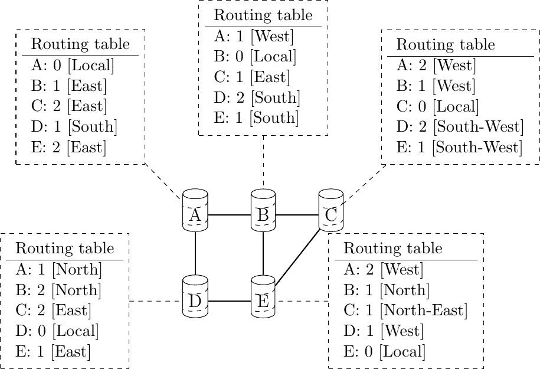
> 
> 图 137：简单网络中计算出的距离矢量路由表

```sh
Please log in to see this exercise
```

为了处理链路和路由器故障，路由器使用其路由表中存储的时间戳。由于所有路由器每 N 秒发送一次距离矢量，因此每个路由的时间戳应该定期刷新。因此，没有路由的时间戳应该早于 N 秒，除非该路由不再可达。在实践中，为了应对由于传输错误可能丢失的距离矢量，路由器每 N 秒检查其路由表中存储的路由的时间戳，并删除超过$ 3 \times N $秒的路由。

当一个路由器注意到通往目的地的路由已过期时，它必须首先将一个∞成本关联到这条路由，并将其距离矢量发送给其邻居以通知他们。然后，在一段时间后（例如，$ 3 \times N $秒），可以从路由表中删除该路由，以确保相邻的路由器已经收到了坏消息，即使由于传输错误，某些距离矢量没有到达它们。

考虑上述示例并假设路由器 A 和 B 之间的链路发生故障。在故障之前，A 使用 B 到达目的地 B、C 和 E，而 B 仅使用 A-B 链路到达 A。两个路由器通过它们路由表中受影响条目的超时来检测故障。A 和 B 两个路由器都发送它们的距离矢量。

> +   A 发送其距离矢量\[A=0,B=∞,C=∞,D=1,E=∞\]。D 知道它不能再通过 A 到达 B。
> +   
> +   D 向 A 和 E 发送其距离矢量\[D=0,B=∞,A=1,C=2,E=1\]。A 通过 D 恢复了通往 C 和 E 的路由。
> +   
> +   B 向 E 和 C 发送其距离矢量\[B=0,A=∞,C=1,D=2,E=1\]。C 了解到通过 B 到达 A 的路径不再存在。
> +   
> +   E 向 D、B 和 C 发送其距离矢量\[E=0,A=2,C=1,D=1,B=1\]。D 学习了一条通往 B 的路由。C 和 B 学习了一条通往 A 的路由。

在这一点上，所有路由器都有一个路由表，允许它们到达网络中的所有其他路由器，除了路由器 A，它还不能到达路由器 B。一旦路由器 D 发送其更新的距离矢量\[A=1,B=2,C=2,D=0,E=1\]，A 就恢复了通往 B 的路由。这一最后步骤在图图 138 中说明，该图显示了所有路由器上的路由表。

> 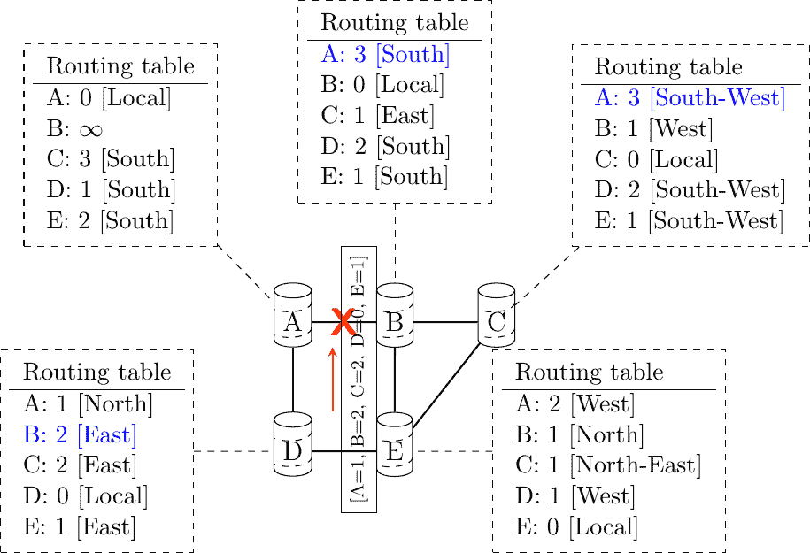
> 
> 图 138：故障后计算出的距离矢量路由表

现在考虑 D 和 E 之间的链路故障。网络现在被分割成两个不相交的部分：(A , D) 和 (B, E, C)。路由到 B、C 和 E 的路由在路由器 D 上首先过期。此时，路由器 D 更新其路由表。

如果 D 发送 $ [D=0, A=1, B=\infty, C=\infty, E=\infty] $，A 将了解到 B、C 和 E 不可达，并更新其路由表。

不幸的是，如果发送给 A 的距离矢量丢失，或者如果 A 在 D 发送其距离矢量（ $ [A=0,D=1,B=3,C=3,E=2] $ ）的同时发送自己的距离矢量，D 将更新其路由表以使用 A 向 B、C 和 E 通告的较短路由。经过一段时间后，D 发送新的距离矢量：$ [D=0,A=1,E=3,C=4,B=4] $。A 更新其路由表，并在一段时间后发送自己的距离矢量 $ [A=0,D=1,B=5,C=5,E=4] $，等等。这个问题在计算机网络文献中被称为无限计数问题。

路由器 A 和 D 以递增的成本交换距离矢量，直到这些成本达到 $ \infty $。这个问题可能发生在除了上述图示之外的其他场景中。事实上，距离矢量路由可能在网络中存在环的情况下立即遭受无限计数问题。不幸的是，环在网络中被广泛使用，因为它们提供了处理链路和路由器故障所需的红冗余。为了减轻无限计数的影响，一些距离矢量协议认为 $ 16=\infty $。不幸的是，这限制了网络运营商可以使用的方法和使用距离矢量的网络的直径。

这种无限计数问题发生是因为路由器 A 向路由器 D 通告了一条通过路由器 D 学习的路由。避免这种问题的可能解决方案之一是改变路由器创建其距离矢量的方式。而不是计算一个距离矢量并将其发送给所有邻居，路由器可以创建一个针对每个邻居的特定距离矢量，并且只包含通过此邻居未学习到的路由。这可以通过以下伪代码实现。

```sh
# split horizon
Every N seconds:
    # one vector for each interface
    for l in interfaces:
        v = Vector()
        for d in R[]:
            if (R[d].link != l):
                v = v + Pair(d, R[d].cost)
        send(v, l)
        # end for d in R[]
    # end for l in interfaces 
```

这种技术被称为分割视域。使用这种技术，在上述场景中不会发生无限计数问题，因为路由器 A 在故障后将会通告 $ [A=0] $，因为它通过路由器 D 学习了所有其他路由。另一种称为带毒回溯的分割视域的变体也是可能的。使用这种变体的路由器会通告通过它们发送距离矢量的路由器到达的目的地的成本为 $ \infty $。这可以通过以下伪代码实现。

```sh
# split horizon with poison reverse
Every N seconds:
    for l in interfaces:
        # one vector for each interface
        v = Vector()
        for d in R[]:
            if (R[d].link != l):
                v = v + Pair(d, R[d].cost)
            else:
                v = v + Pair(d, infinity)
        send(v, l)
        # end for d in R[]
    # end for l in interfaces 
```

不幸的是，分割视域（split-horizon）不足以避免距离矢量路由中所有无限计数问题。考虑图图 139 中所示的四路由器网络中链路 A-B 的故障。

> 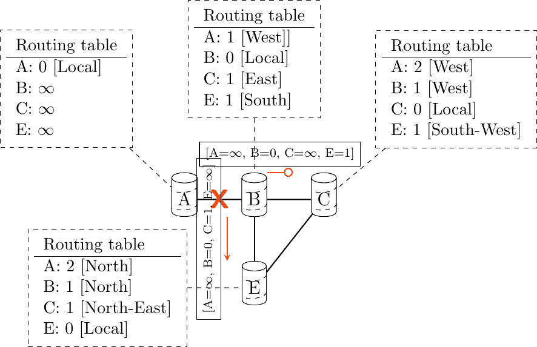
> 
> 图 139 无限计数问题

在检测到故障后，路由器 B 发送其距离矢量：

> +   $ [A=\infty,B=0,C=\infty,E=1] $ 到路由器 C
> +   
> +   $ [A=\infty,B=0,C=1,E=\infty] $ 到路由器 E

如果不幸的是，由于传输错误或路由器 C 过载，发送到路由器 C 的距离矢量丢失，可能会出现新的无限计数问题。如果路由器 C 将其距离矢量 $ [A=2,B=1,C=0,E=\infty] $ 发送到路由器 E，则该路由器安装了一条通过 C 到达 A 的距离为 3 的路由。路由器 E 将其距离矢量 $ [A=3,B=\infty,C=1,E=1] $ 发送到路由器 B，并将其 $ [A=\infty,B=1,C=\infty,E=0] $ 发送到路由器 C。这个距离矢量允许 B 恢复一条距离为 4 到达 A 的路由。

```sh
Please log in to see this exercise
```

注意

转发表与路由表

路由器通常维护至少两个包含可达目的地信息的数据结构。第一个数据结构是路由表。路由表是一种将目的地与出接口或下一跳路由器以及一组附加属性关联起来的数据结构。不同的路由协议可以为每个目的地关联不同的属性。距离矢量路由协议将存储到达目的地的最短路径的成本。其他路由协议可能存储有关最佳路径的跳数、其生存期或子路径数的信息。路由表可能存储到达给定目的地的不同路径，并将其中之一标记为最佳路径。

路由表是一种由（一个或多个）路由协议更新的软件数据结构。路由表通常在转发数据包时不会直接使用。数据包转发依赖于一个更紧凑的数据结构，即转发表。在高端路由器上，转发表直接在硬件中实现，而性能较低的路由器将使用软件实现。转发表包含路由表中找到的信息的子集。它只包含用于转发数据包的每个目的地的下一跳，没有属性。转发表通常将每个目的地关联到一个或多个出接口或下一跳路由器。  ## 链路状态路由#

链路状态路由是路由协议的第二大家族。虽然距离矢量路由器使用分布式算法来计算它们的路由表，但链路状态路由器通过交换消息来允许每个路由器学习整个网络拓扑。基于这个学习到的拓扑，每个路由器随后能够通过使用如迪杰斯特拉算法（Dijkstra’s algorithm）的最短路径计算来计算其路由表 [[Dijkstra1959]](../bibliography.html#dijkstra1959)。有关此最短路径算法的详细描述，可以在 [[维基百科:Dijkstra]](../bibliography.html#wikipedia-dijkstra) 中找到。

对于链路状态路由，网络被建模为一个有向加权图。每个路由器是一个节点，路由器之间的链路是图中的边。每个有向边都关联一个正权重，路由器使用最短路径到达每个目的地。在实践中，可以将不同类型的权重关联到每个有向边：

> +   单位权重。如果所有链路都具有单位权重，最短路径路由将优先选择中间路由器数量最少的路径。
> +   
> +   权重与链路上的传播延迟成正比。如果所有链路权重都这样配置，最短路径路由将使用传播延迟最小的路径。
> +   
> +   $ weight=\frac{C}{bandwidth} $ 其中 C 是一个大于网络中最高链路带宽的常数。如果所有链路权重都这样配置，最短路径路由将优先选择带宽较高的路径，而不是带宽较低的路径。

通常，相同的权重与对应于物理链路的两个有向边相关联（即 $ R1 \rightarrow R2 $ 和 $ R2 \rightarrow R1 $）。然而，链路状态协议中没有任何要求必须这样做。例如，如果权重是根据链路带宽设置的，那么不对称的 ADSL 链路在上行和下行方向上可能具有不同的权重。其他变体也是可能的。一些网络使用优化算法来找到最佳权重集，以最小化给定流量需求下的网络拥塞 [[FRT2002]](../bibliography.html#frt2002)。

当链路状态路由器启动时，它首先需要发现它与哪些路由器直接连接。为此，每个路由器在其所有接口上每 N 秒发送一个 HELLO 消息。此消息包含路由器的地址。每个路由器都有一个唯一的地址。随着其邻居路由器也发送 HELLO 消息，路由器自动发现其连接的邻居。这些 HELLO 消息仅发送给直接连接到路由器的邻居，路由器永远不会转发它接收到的 HELLO 消息。HELLO 消息还用于检测链路和路由器故障。如果一个邻居路由器在 $ k \times N $ 秒内没有收到 HELLO 消息，则认为链路已失败。这如图 图 140 所示。

> 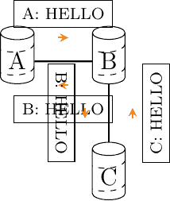
> 
> 图 140 HELLO 消息的交换

一旦路由器发现其邻居，它必须可靠地将所有其出边分发给网络中的所有路由器，以便它们计算其网络拓扑的本地视图。为此，每个路由器构建一个包含以下信息的链路状态包（LSP）：

> +   LSP.Router: LSP 发送者的标识（地址）
> +   
> +   LSP.age: LSP 的年龄或剩余寿命
> +   
> +   LSP.seq: LSP 的序列号
> +   
> +   LSP.Links[]: 在 LSP 中宣布的链路。每个有向链路用以下信息表示：
> +   
>     +   LSP.Links[i].Id: 邻居的标识
>     +   
>     +   LSP.Links[i].cost: 链路成本

这些 LSP 必须在网络内部可靠地分发，而不使用路由器的路由表，因为这些表只能在收到 LSP 之后计算。泛洪算法用于高效地分发所有路由器的 LSP。每个实现泛洪的路由器都维护一个包含每个路由器发送的最新 LSP 的链路状态数据库（LSDB）。当路由器收到一个 LSP 时，它首先验证这个 LSP 是否已经存储在其 LSDB 中。如果是这样，该路由器之前已经分发过这个 LSP，它不需要转发它。否则，路由器在其所有链路上转发 LSP，除了接收 LSP 的链路。可以通过以下伪代码实现泛洪。

```sh
# links is the set of all links on the router
# Router R's LSP arrival on link l
if newer(LSP, LSDB(LSP.Router)) :
    LSDB.add(LSP)  # implicitly removes older LSP from same router
    for i in links:
        if i!=l:
           send(LSP,i)
# else, LSP has already been flooded 
```

在这个伪代码中，LSDB(r) 返回存储在 LSDB 中的来自路由器 r 的最新 LSP。newer(lsp1, lsp2) 如果 lsp1 比 lsp2 更新则返回 true。有关如何实现 newer 的讨论，请参阅下面的注释。

注意

哪个是最新的 LSP？

实现泛洪的路由器必须能够检测接收到的 LSP 是否比存储的 LSP 更新。这需要比较接收到的 LSP 的序列号和链路状态数据库中存储的 LSP 的序列号。ARPANET 路由协议 [[MRR1979]](../bibliography.html#mrr1979) 使用 6 位序列号，并按以下方式实现比较 [**RFC 789**](https://datatracker.ietf.org/doc/html/rfc789.html)。

```sh
def  newer( lsp1, lsp2 ):
    return ( ((lsp1.seq > lsp2.seq) and ((lsp1.seq - lsp2.seq) <= 32)) or
           ( (lsp1.seq < lsp2.seq) and ((lsp2.seq - lsp1.seq) > 32)) ) 
```

这个比较考虑了用于增加序列号的模 $ 2^{6} $ 算术。直观上，比较将所有序列号的圆圈分成两半。通常，接收到的 LSP 的序列号等于存储的 LSP 的序列号加一，但有时两个连续的 LSP 的序列号可能不同，例如，如果一个路由器断开连接了一段时间。上述比较直到 1980 年 10 月 27 日一直有效。在这一天，ARPANET 完全崩溃。这次崩溃很复杂，涉及多个路由器。在某个时刻，来自一个路由器的 LSP 40 和 LSP 44 存储在 ARPANET 中一些路由器的链路状态数据库（LSDB）中。由于 LSP 44 是最新的，它应该在所有路由器上替换 LSP 40。不幸的是，ARPANET 中的一个路由器出现了内存问题，序列号 40（二进制为 101000）在有缺陷的路由器中被替换为 8（二进制为 001000）并进行了泛洪。网络中存在三个 LSP，44 比 40 更新，而 40 比 8 更新，但不幸的是，8 被认为是比 44 更新的……所有路由器开始永久交换这三个链路状态包，解决这个问题的唯一方法是关闭整个网络 [**RFC 789**](https://datatracker.ietf.org/doc/html/rfc789.html)。

当前的链路状态路由协议通常使用 32 位序列号，并在序列号达到最大值（在 32 位序列号空间中，如果每秒生成一个链路状态数据包，则需 136 年才能循环序列号）的不太可能情况下包含一个特殊机制。

为了处理内存损坏问题，链路状态数据包包含校验和或 CRC。这个校验和是由生成 LSP 的路由器计算的。每个路由器在接收或洪泛 LSP 时都必须验证校验和。此外，每个路由器必须定期验证其 LSDB 中存储的 LSP 的校验和。这使得它们能够应对可能损坏 LSDB 的内存错误，就像在 ARPANET 中发生的那样。

图 图 141 中展示了洪泛过程。通过交换 HELLO 消息，每个路由器学习到它的直接邻居。例如，路由器 E 学习到它与路由器 D、B 和 C 直接连接。它的第一个链路状态通告（LSP）的序列号为 0，包含有向链路 E->D、E->B 和 E->C。路由器 E 在所有链路上发送其 LSP，而路由器 D、B 和 C 则将 LSP 插入它们的链路状态数据库（LSDB）并通过它们的其它链路转发。

> 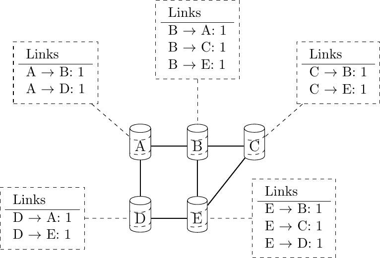
> 
> 图 141 洪泛：示例

洪泛允许 LSP 在网络内部的所有路由器之间分发，而不依赖于路由表。在上面的例子中，路由器 E 发送的 LSP 可能会在网络的一些链路上发送两次。例如，路由器 B 和 C 几乎同时接收到 E 的 LSP 并通过 B-C 链路转发它。为了避免在每个链路上发送相同的 LSP 两次，一个可能的解决方案是稍微修改上面的伪代码，使得路由器在转发每个链路上的 LSP 之前等待一些随机时间。这种解决方案的缺点是，将 LSP 洪泛到网络中所有路由器的延迟增加了。在实践中，路由器立即洪泛包含新信息（例如，链路的添加或删除）的 LSP，并延迟刷新 LSP（即包含与来自该路由器的上一个 LSP 完全相同信息的 LSP）的洪泛 [[FFEB2005]](../bibliography.html#ffeb2005)。

为了确保所有路由器都能接收到所有 LSP，即使在传输错误的情况下，链路状态路由协议使用可靠的洪泛。在可靠洪泛中，路由器使用确认和必要时重新传输来确保所有链路状态数据包都成功传输到每个相邻路由器。多亏了可靠洪泛，所有路由器都在它们的 LSDB 中存储了网络中每个路由器发送的最新 LSP。通过将接收到的 LSP 与其自身的 LSP 结合，每个路由器可以构建一个表示整个网络拓扑的图，如图 图 142 所示。

> 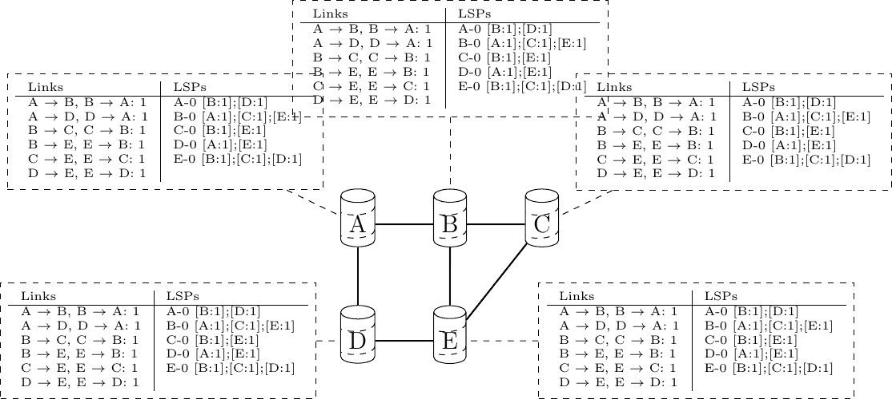
> 
> 图 142 所有路由器接收到的链路状态数据库

注意

静态或动态链路度量？

由于链路状态包定期传播，路由器能够测量它们链路的质量（例如延迟或负载），并根据其当前质量调整每个链路的度量。这种动态调整被包含在 ARPANET 路由协议中 [[MRR1979]](../bibliography.html#mrr1979)。然而，经验表明，调整动态调整并确保网络中不发生转发环路是困难的 [[KZ1989]](../bibliography.html#kz1989)。今天的链路状态路由协议使用的是在路由器上手动配置的度量，并且只有网络运营商或网络管理工具才能更改 [[FRT2002]](../bibliography.html#frt2002)。

当链路失败时，连接到该链路的两个路由器通过在最后 $ k \times N $ 秒内收不到 HELLO 消息来检测到故障。一旦一个路由器检测到其本地链路之一失败，它就会生成并传播一个新的 LSP，该 LSP 不再包含失败的链路。这个新的 LSP 替换了网络中的先前 LSP。在实践中，连接到链路的两个路由器并不完全同时检测到这个故障。在这段时间内，一些链路可能只在一个方向上宣布。这如图 图 143 所示。路由器 E 已经检测到链路 E-B 的故障并传播了一个新的 LSP，但路由器 B 还没有检测到这个故障。

> 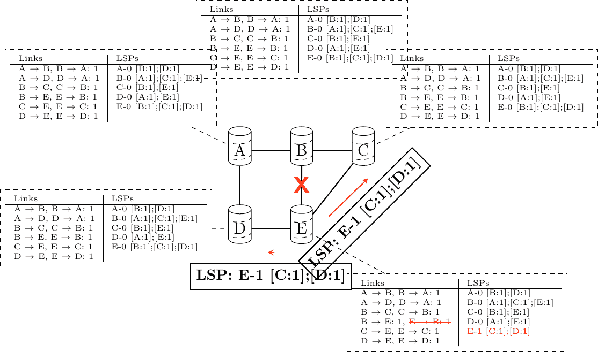
> 
> 图 143 双向连通性检查

当只有连接的其中一个路由器在链路状态协议（LSP）中报告了链路时，路由器会将该链路视为已失败，并从它们从链路状态数据库（LSDB）计算出的有向图中移除它。这被称为双向连通性检查。这个检查允许链路故障迅速地以单个 LSP 的形式传播，因为单个 LSP 足以宣布这样的坏消息。然而，当链路恢复时，它只能在两个连接的路由器都发送了它们的 LSP 之后才能使用。双向连通性检查还允许处理路由器故障。当一个路由器失败时，根据定义，所有连接的链路都会失败。这些故障由失败路由器的邻居在发送的 LSP 中报告。当然，失败的路由器不会发送新的 LSP 来宣布其故障。然而，在表示网络的图中，这个失败的路由器看起来像一个只有出边节点的节点。多亏了双向连通性检查，这个失败的路由器不能被视为到达任何目的地的中继路由器，因为它没有连接任何出边。

当一个路由器失败时，其 LSP 必须从所有路由器的 LSDB 中移除 [[2]](#foverload)。这可以通过使用包含在每个 LSP 中的年龄字段来完成。年龄字段用于限制网络中链路状态数据包的最大生存时间。当路由器生成 LSP 时，它将生存时间（通常以秒为单位）设置在年龄字段中。所有路由器都会定期减少其 LSDB 中 LSP 的年龄，一旦年龄达到 0，就会丢弃 LSP。多亏了年龄字段，失败路由器的 LSP 不会永远留在 LSDB 中。

为了计算其转发表，每个路由器通过使用迪杰斯特拉最短路径算法 [[Dijkstra1959]](../bibliography.html#dijkstra1959) 来计算以自身为根的生成树。转发表可以从生成树自动导出，如图 图 144 所示。

> 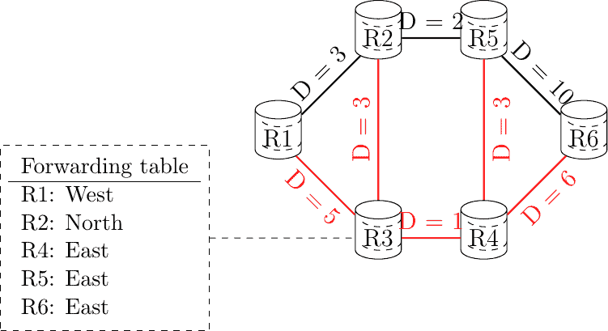
> 
> 图 144 转发表的计算，R3 发送的数据包所使用的路径用红色表示

```sh
Please log in to see this exercise
```

脚注  ## 距离矢量路由#

距离矢量路由是一种简单的分布式路由协议。距离矢量路由允许路由器自动发现网络内可达的目的地以及到达这些目的地的最短路径。最短路径是根据与每个链路关联的度量或成本来计算的。我们使用 l.cost 来表示在路由器上为链路 l 配置的度量。

每个路由器维护一个路由表。路由表 R 可以建模为一个数据结构，它存储每个已知目的地地址 d 的以下属性：

> +   R[d].link 是路由器用于将数据包转发到目的地 d 的出链路。
> +   
> +   R[d].cost 是到达目的地 d 的最短路径中链路度量的总和。
> +   
> +   R[d].time 是包含目的地 d 的最后一个距离矢量的时间戳。

使用距离矢量路由的路由器定期通过所有接口发送其距离矢量。这个距离矢量是路由器路由表的摘要，指示每个已知目的地的距离。这个距离矢量可以通过以下伪代码从路由表中计算得出。

```sh
Every N seconds:
    v = Vector()
    for d in R[]:
        # add destination d to vector
        v.add(Pair(d, R[d].cost))
    for i in interfaces
        # send vector v on this interface
        send(v, i) 
```

当路由器启动时，它不知道网络中的任何目的地，其路由表只包含其本地地址。因此，它向所有邻居发送一个距离矢量，该距离矢量只包含其地址，距离为 0。当路由器在链路 l 上接收到距离矢量时，它按以下方式处理。

```sh
# V : received Vector
# l : link over which vector is received
def  received(V, l):
    # received vector from link l
    for d in V[]
        if not (d in R[]):
            # new route
            R[d].cost = V[d].cost + l.cost
            R[d].link = l
            R[d].time = now
        else:
            # existing route, is the new better ?
            if ((V[d].cost + l.cost) < R[d].cost) or (R[d].link == l):
                # Better route or change to current route
                R[d].cost = V[d].cost + l.cost
                R[d].link = l
                R[d].time = now 
```

路由器遍历距离向量中包含的所有地址。如果距离向量包含路由器不知道的目的地址，它将通过链路 l 将其插入其路由表，距离是距离向量中指示的距离与链路 l 相关的成本之和。如果目的地已经由路由器知道，它只在其路由表中更新相应的条目，如果以下任一条件成立：

> +   新路由的成本小于已知路由的成本((V[d].cost + l.cost) < R[d].cost)
> +   
> +   新路由是通过与当前最佳路由到该目的地相同的链路学习的(R[d].link == l)

第一个条件确保路由器发现到每个目的地的最短路径。第二个条件用于考虑链路故障或与链路相关的度量值变化后可能发生的路由变化。

为了理解距离向量协议的操作，让我们考虑图图 136 中显示的五个路由器的网络。

> 
> 
> 图 136 简单网络中距离向量路由的操作

假设路由器 A 是第一个发送其距离向量[A=0]的路由器。

> +   B 和 D 处理接收到的距离向量，并使用指向 A 的路由更新其路由表。
> +   
> +   D 向 A 和 E 发送其距离向量[D=0,A=1]。现在 E 可以到达 A 和 D。
> +   
> +   C 向 B 和 E 发送其距离向量[C=0]。
> +   
> +   E 向 D、B 和 C 发送其距离向量[E=0,D=1,A=2,C=1]。现在 B 可以到达 A、C、D 和 E。
> +   
> +   B 向 A、C 和 E 发送其距离向量[B=0,A=1,C=1,D=2,E=1]。现在 A、B、C 和 E 可以到达这个网络中的所有五个路由器。
> +   
> +   A 向 B 和 D 发送其距离向量[A=0,B=1,C=2,D=1,E=2]。

到目前为止，所有路由器都可以通过图图 137 中显示的路由表到达网络中的其他所有路由器。

> 
> 
> 图 137 简单网络中通过距离向量计算的路由表

```sh
Please log in to see this exercise
```

为了处理链路和路由器的故障，路由器使用其路由表中存储的时间戳。由于所有路由器每 N 秒发送一次其距离向量，因此每个路由的时间戳应该定期刷新。因此，没有路由的时间戳应该早于 N 秒，除非该路由不再可达。在实际操作中，为了应对由于传输错误可能导致的距离向量丢失，路由器每 N 秒检查其路由表中存储的路由的时间戳，并删除超过$ 3 \times N $秒的路由。

当路由器注意到通往目的地的路由已过期时，它必须首先将一个$ \infty $成本关联到该路由，并将其距离向量发送给其邻居以通知他们。然后，该路由可以在一段时间后（例如 $ 3 \times N $ 秒）从路由表中删除，以确保相邻的路由器已经收到了坏消息，即使由于传输错误，某些距离向量没有到达它们。

考虑上述示例，并假设路由器 A 和 B 之间的链路故障。在故障之前，A 使用 B 到达目的地 B、C 和 E，而 B 仅使用 A-B 链路到达 A。两个路由器通过它们路由表中受影响条目的超时来检测故障。A 和 B 路由器都发送它们的距离向量。

> +   A 发送其距离向量 $ [A=0,B=\infty,C=\infty,D=1,E=\infty] $。D 知道它不能再通过 A 到达 B。
> +   
> +   D 向 A 和 E 发送其距离向量 $ [D=0,B=\infty,A=1,C=2,E=1] $。A 通过 D 恢复通往 C 和 E 的路径。
> +   
> +   B 向 E 和 C 发送其距离向量 $ [B=0,A=\infty,C=1,D=2,E=1] $。C 得知通过 B 到达 A 的路径已不存在。
> +   
> +   E 向 D、B 和 C 发送其距离向量 $ [E=0,A=2,C=1,D=1,B=1] $。D 学习到通往 B 的路径。C 和 B 学习到通往 A 的路径。

到这一点，所有路由器都有一个路由表，允许它们到达所有其他路由器，除了路由器 A，它还不能到达路由器 B。一旦路由器 D 发送其更新的距离向量 $ [A=1,B=2,C=2,D=0,E=1] $，A 就会恢复通往 B 的路径。这一最后步骤在图图 138 中说明，该图显示了所有路由器上的路由表。

> 
> 
> 图 138：故障后计算出的距离向量路由表

现在考虑 D 和 E 之间的链路故障。网络现在分为两个不相交的部分：（A , D）和（B, E, C）。路由到 B、C 和 E 的路径首先在路由器 D 上过期。此时，路由器 D 更新其路由表。

如果 D 发送 $ [D=0, A=1, B=\infty, C=\infty, E=\infty] $，A 就会知道 B、C 和 E 无法到达，并更新其路由表。

不幸的是，如果发送给 A 的距离向量丢失，或者 A 在与 D 发送其距离向量（ $ [A=0,D=1,B=3,C=3,E=2] $ ）的同时发送自己的距离向量，D 将更新其路由表以使用 A 向 B、C 和 E 宣布的较短路径。经过一段时间后，D 发送一个新的距离向量：$ [D=0,A=1,E=3,C=4,B=4] $。A 更新其路由表，并在一段时间后发送自己的距离向量 $ [A=0,D=1,B=5,C=5,E=4] $，等等。这个问题在计算机网络文献中被称为“计数到无穷大”问题。

路由器 A 和 D 交换距离矢量，随着成本的不断增加，这些成本达到 $ \infty $。这个问题可能出现在上述图示之外的其他场景中。实际上，只要网络中存在环路，距离矢量路由就可能遭受计数到无穷大问题。不幸的是，环路在网络中被广泛使用，因为它们提供了处理链路和路由器故障所需的红冗余。为了减轻计数到无穷大的影响，一些距离矢量协议认为 $ 16=\infty $。不幸的是，这限制了网络运营商可以使用的方法和采用距离矢量的网络的直径。

这个计数到无穷大问题发生是因为路由器 A 向路由器 D 宣告了一条通过路由器 D 学习的路由。避免这个问题的可能解决方案之一是改变路由器创建其距离矢量的方式。而不是计算一个距离矢量并发送给所有邻居，路由器可以创建一个针对每个邻居的特定距离矢量，并且只包含通过这个邻居未学习到的路由。这可以通过以下伪代码实现。

```sh
# split horizon
Every N seconds:
    # one vector for each interface
    for l in interfaces:
        v = Vector()
        for d in R[]:
            if (R[d].link != l):
                v = v + Pair(d, R[d].cost)
        send(v, l)
        # end for d in R[]
    # end for l in interfaces 
```

这种技术被称为分割水平（split-horizon）。使用这种技术，上述场景中就不会发生计数到无穷大问题，因为路由器 A 在故障后就会宣布 $ [A=0] $，因为它通过路由器 D 学习了所有其他路由。另一种称为带毒回溯的分割水平（split-horizon with poison reverse）的变体也是可能的。使用这种变体的路由器会向它们发送距离矢量的路由器宣布到达目的地的成本为 $ \infty $。这可以通过以下伪代码实现。

```sh
# split horizon with poison reverse
Every N seconds:
    for l in interfaces:
        # one vector for each interface
        v = Vector()
        for d in R[]:
            if (R[d].link != l):
                v = v + Pair(d, R[d].cost)
            else:
                v = v + Pair(d, infinity)
        send(v, l)
        # end for d in R[]
    # end for l in interfaces 
```

不幸的是，分割水平（split-horizon）并不能完全避免距离矢量路由中的所有计数到无穷大（count to infinity）问题。考虑图图 139 中所示的四路由器网络中链路 A-B 的故障。

> 
> 
> 图 139 计数到无穷大问题

在检测到故障后，路由器 B 发送其距离矢量：

> +   $ [A=\infty,B=0,C=\infty,E=1] $ 发送到路由器 C
> +   
> +   $ [A=\infty,B=0,C=1,E=\infty] $ 发送到路由器 E

如果不幸的是，发送到路由器 C 的距离矢量由于传输错误或因为路由器 C 过载而丢失，可能会出现新的计数到无穷大问题。如果路由器 C 向路由器 E 发送其距离矢量 $ [A=2,B=1,C=0,E=\infty] $，则该路由器将安装一条距离为 3 的路由，通过 C 达到 A。路由器 E 向路由器 B 发送其距离矢量 $ [A=3,B=\infty,C=1,E=1] $，并向路由器 C 发送 $ [A=\infty,B=1,C=\infty,E=0] $。这个距离矢量允许 B 恢复一条距离为 4 的路由，以到达 A。

```sh
Please log in to see this exercise
```

注意

转发表与路由表

路由器通常维护至少两个包含可达目的地信息的数据结构。第一个数据结构是路由表。路由表是一种将目的地与出接口或下一跳路由器以及一组附加属性关联起来的数据结构。不同的路由协议可以为每个目的地关联不同的属性。距离矢量路由协议将存储到达目的地的最短路径的成本。其他路由协议可能存储有关最佳路径的跳数、其生存期或子路径数量的信息。路由表可能存储指向给定目的地的不同路径，并将其中之一标记为最佳路径。

路由表是一种由（一个或多个）路由协议更新的软件数据结构。路由表通常在转发数据包时不会直接使用。数据包转发依赖于一个更紧凑的数据结构，即转发表。在高端路由器上，转发表直接在硬件中实现，而性能较低的路由器将使用软件实现。转发表包含路由表中找到的信息的子集。它仅包含用于转发数据包的下一跳目的地以及没有属性。转发表通常将每个目的地与一个或多个出接口或下一跳路由器关联。

## 链路状态路由#

链路状态路由是路由协议的第二类。虽然距离矢量路由器使用分布式算法来计算其路由表，但链路状态路由器交换消息以允许每个路由器学习整个网络拓扑。基于这种学习到的拓扑，每个路由器然后能够通过使用如迪杰斯特拉算法（Dijkstra’s algorithm）之类的最短路径计算来计算其路由表 [[Dijkstra1959]](../bibliography.html#dijkstra1959)。有关此最短路径算法的详细描述，请参阅 [[维基百科:Dijkstra]](../bibliography.html#wikipedia-dijkstra)。

对于链路状态路由，网络被建模为一个有向加权图。每个路由器是一个节点，路由器之间的链路是图中的边。每个有向边都关联一个正权重，路由器使用最短路径到达每个目的地。在实践中，可以给每个有向边关联不同类型的权重：

> +   单位权重。如果所有链路都具有单位权重，最短路径路由将优先选择具有最少中间路由器的路径。
> +   
> +   权重与链路上的传播延迟成正比。如果所有链路权重都按这种方式配置，最短路径路由将使用传播延迟最小的路径。
> +   
> +   $ weight=\frac{C}{bandwidth} $ 其中 C 是一个大于网络中最高链路带宽的常数。如果所有链路权重都这样配置，最短路径路由将优先选择带宽更高的路径，而不是带宽较低的路径。

通常，相同的权重与对应于物理链路的两个有向边相关联（即 $ R1 \rightarrow R2 $ 和 $ R2 \rightarrow R1 $）。然而，链路状态协议中没有任何要求必须这样做。例如，如果权重是根据链路带宽设置的，那么不对称的 ADSL 链路在上行和下行方向上可能具有不同的权重。其他变体也是可能的。一些网络使用优化算法来找到最佳权重集，以最小化给定流量需求下的网络内部拥塞 [[FRT2002]](../bibliography.html#frt2002)。

当链路状态路由器启动时，它首先需要发现它与哪些路由器直接连接。为此，每个路由器每 N 秒在其所有接口上发送一个 HELLO 消息。此消息包含路由器的地址。每个路由器都有一个唯一的地址。由于其相邻路由器也发送 HELLO 消息，因此路由器自动发现它与哪些邻居连接。这些 HELLO 消息仅发送给直接连接到路由器的邻居，路由器永远不会转发它接收到的 HELLO 消息。HELLO 消息还用于检测链路和路由器故障。如果一个相邻路由器在 $ k \times N $ 秒内没有收到 HELLO 消息，则认为链路已失败。这如图 图 140 所示。

> 
> 
> 图 140 HELLO 消息的交换

一旦路由器发现其邻居，它必须可靠地将所有其发出的边分发给网络中的所有路由器，以便它们计算其网络拓扑的本地视图。为此，每个路由器构建一个包含以下信息的链路状态数据包（LSP）：

> +   LSP.Router: LSP 发送者的标识（地址）
> +   
> +   LSP.age: LSP 的年龄或剩余寿命
> +   
> +   LSP.seq: LSP 的序列号
> +   
> +   LSP.Links[]: 在 LSP 中宣布的链路。每个有向链路都使用以下信息表示：
> +   
>     +   LSP.Links[i].Id: 邻居的标识
>     +   
>     +   LSP.Links[i].cost: 链路的成本

这些 LSP 必须在网络内部可靠地分发，而不使用路由器的路由表，因为这些表只能在接收到 LSP 之后才能计算。洪泛算法用于高效地分发所有路由器的 LSP。每个实现洪泛的交换机维护一个包含每个路由器发送的最新 LSP 的链路状态数据库（LSDB）。当交换机接收到一个 LSP 时，它首先验证这个 LSP 是否已经存储在其 LSDB 中。如果是这样，交换机之前已经分发了这个 LSP，它不需要转发它。否则，交换机在其所有链路上转发 LSP，除了接收 LSP 的链路。可以通过以下伪代码实现洪泛。

```sh
# links is the set of all links on the router
# Router R's LSP arrival on link l
if newer(LSP, LSDB(LSP.Router)) :
    LSDB.add(LSP)  # implicitly removes older LSP from same router
    for i in links:
        if i!=l:
           send(LSP,i)
# else, LSP has already been flooded 
```

在这个伪代码中，LSDB(r)返回存储在 LSDB 中由路由器 r 发出的最新 LSP。newer(lsp1, lsp2)如果 lsp1 比 lsp2 更新则返回 true。有关如何实现 newer 的讨论，请参阅下面的注释。

注释

哪个是最新的 LSP？

实现洪泛的交换机必须能够检测接收到的 LSP 是否比存储的 LSP 更新。这需要比较接收到的 LSP 的序列号和链路状态数据库中存储的 LSP 的序列号。ARPANET 路由协议[[MRR1979]](../bibliography.html#mrr1979)使用 6 位序列号，并按以下方式实现了比较[**RFC 789**](https://datatracker.ietf.org/doc/html/rfc789.html)

```sh
def  newer( lsp1, lsp2 ):
    return ( ((lsp1.seq > lsp2.seq) and ((lsp1.seq - lsp2.seq) <= 32)) or
           ( (lsp1.seq < lsp2.seq) and ((lsp2.seq - lsp1.seq) > 32)) ) 
```

这个比较考虑了用于递增序列号的模$ 2^{6} $算术。直观上，比较将所有序列号的圆圈分为两半。通常，接收到的 LSP 的序列号等于存储的 LSP 的序列号加一，但有时两个连续的 LSP 的序列号可能不同，例如，如果一个路由器断开连接了一段时间。上述比较在 1980 年 10 月 27 日之前工作得很好。在这一天，ARPANET 完全崩溃。这次崩溃很复杂，涉及多个路由器。在某个时刻，一个路由器的 LSP 40 和 LSP 44 存储在 ARPANET 中一些路由器的 LSDB 中。由于 LSP 44 是最新的，它应该在所有路由器上替换 LSP 40。不幸的是，ARPANET 中的一个路由器出现了内存问题，序列号 40（二进制为 101000）在有缺陷的路由器中被替换为 8（二进制为 001000）并进行了洪泛。网络中存在三个 LSP，44 比 40 更新，40 比 8 更新，但不幸的是，8 被认为比 44 更新……所有路由器开始永久交换这三个链路状态包，从这个问题中恢复的唯一方法是关闭整个网络[**RFC 789**](https://datatracker.ietf.org/doc/html/rfc789.html)。

当前链路状态路由协议通常使用 32 位序列号，并在序列号达到最大值（在 32 位序列号空间中，如果每秒生成一个链路状态包，则需 136 年才能循环序列号）的不太可能情况下包含一个特殊机制。

为了处理内存损坏问题，链路状态包包含校验和或 CRC。这个校验和是由生成 LSP 的路由器计算的。每个路由器在接收或洪泛 LSP 时必须验证校验和。此外，每个路由器必须定期验证其 LSDB 中存储的 LSP 的校验和。这使得它们能够应对可能损坏 LSDB 的内存错误，就像在 ARPANET 中发生的那样。

洪泛在图图 141 中展示。通过交换 HELLO 消息，每个路由器学习其直接邻居。例如，路由器 E 了解到它直接连接到路由器 D、B 和 C。它的第一个 LSP 序列号为 0，包含有向链路 E->D、E->B 和 E->C。路由器 E 在其所有链路上发送其 LSP，路由器 D、B 和 C 将其 LSP 插入到它们的 LSDB 中，并通过它们的其他链路转发它。

> 
> 
> 图 141 洪泛：示例

洪泛允许 LSP 在网络内部的所有路由器之间分发，而不依赖于路由表。在上面的例子中，路由器 E 发送的 LSP 可能在网络的一些链路上发送两次。例如，路由器 B 和 C 几乎同时接收到 E 的 LSP，并通过 B-C 链路转发它。为了避免在每个链路上发送相同的 LSP 两次，一个可能的解决方案是稍微修改上面的伪代码，使得路由器在转发每个链路上的 LSP 之前等待一些随机时间。这种解决方案的缺点是，将 LSP 洪泛到网络中所有路由器的延迟增加了。在实践中，路由器立即洪泛包含新信息（例如，链路的添加或删除）的 LSP，并延迟刷新 LSP（即包含与来自该路由器的上一个 LSP 完全相同信息的 LSP）的洪泛 [[FFEB2005]](../bibliography.html#ffeb2005)。

为了确保所有路由器都能接收到所有链路状态信息（LSP），即使在传输错误的情况下，链路状态路由协议使用可靠的洪泛。在可靠洪泛中，路由器使用确认和必要时重新传输来确保所有链路状态包都成功传输到每个相邻路由器。多亏了可靠洪泛，所有路由器都存储了它们 LSDB 中每个网络路由器发送的最新 LSP。通过将接收到的 LSP 与其自身的 LSP 相结合，每个路由器可以构建一个表示整个网络拓扑的图，如图图 142 所示。

> 
> 
> 图 142 所有路由器接收到的链路状态数据库

注意

静态或动态链路度量？

由于链路状态包被定期泛洪，因此路由器能够测量它们链路的质量（例如延迟或负载），并根据其当前质量调整每个链路的度量。这种动态调整被包含在 ARPANET 路由协议中 [[MRR1979]](../bibliography.html#mrr1979)。然而，经验表明，调整动态调整并确保网络中不发生转发环路是困难的 [[KZ1989]](../bibliography.html#kz1989)。今天的链路状态路由协议使用的是在路由器上手动配置的度量，并且只有网络运营商或网络管理工具才能更改 [[FRT2002]](../bibliography.html#frt2002)。

当链路失败时，连接到该链路的两个路由器通过在最后 $ k \times N $ 秒内收不到 HELLO 消息来检测故障。一旦一个路由器检测到其本地链路之一的故障，它就会生成并泛洪一个新的链路状态包，该包不再包含失败的链路。这个新的链路状态包替换了网络中的先前链路状态包。实际上，连接到链路的两个路由器并不完全同时检测到这个故障。在这段时间内，一些链路可能只在一个方向上宣布。这如图图 143 所示。路由器 E 已经检测到链路 E-B 的故障并泛洪了一个新的链路状态包，但路由器 B 还没有检测到这个故障。

> 
> 
> 图 143 双向连通性检查

当只有连接的其中一个路由器的链路状态包中报告了链路时，路由器会将该链路视为已失败，并从它们从 LSDB 计算出的有向图中移除它。这被称为双向连通性检查。这个检查允许链路故障迅速泛洪，因为单个链路状态包就足以宣布这样的坏消息。然而，当链路恢复时，它只能在两个连接的路由器都发送了它们的链路状态包之后才能使用。双向连通性检查还允许处理路由器故障。当一个路由器失败时，根据定义，所有链路都会失败。这些故障在失败路由器的邻居发送的链路状态包中报告。当然，失败的路由器不会发送新的链路状态包来宣布其故障。然而，在表示网络的图中，这个失败的路由器看起来像一个只有出边节点的节点。多亏了双向连通性检查，这个失败的路由器不能被视为到达任何目的地的中继路由器，因为它没有出边连接。

当一个路由器失败时，其 LSP 必须从所有路由器的 LSDB 中移除 [[2]](#foverload)。这可以通过使用包含在每个 LSP 中的年龄字段来完成。年龄字段用于限制网络中链路状态包的最大生存时间。当路由器生成一个 LSP 时，它将生存时间（通常以秒为单位）设置在年龄字段中。所有路由器定期减少其 LSDB 中 LSP 的年龄，一旦 LSP 的年龄达到 0，就丢弃该 LSP。多亏了年龄字段，失败路由器的 LSP 不会永远留在 LSDB 中。

为了计算其转发表，每个路由器通过使用迪杰斯特拉最短路径算法 [[Dijkstra1959]](../bibliography.html#dijkstra1959) 计算以自身为根的生成树。转发表可以从生成树自动导出，如图 图 144 所示。

> 
> 
> 图 144 转发表的计算，由 R3 发送的包所使用的路径用红色表示

```sh
Please log in to see this exercise
```

脚注
