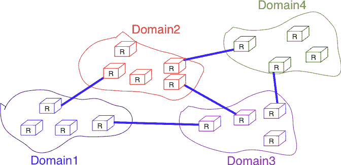
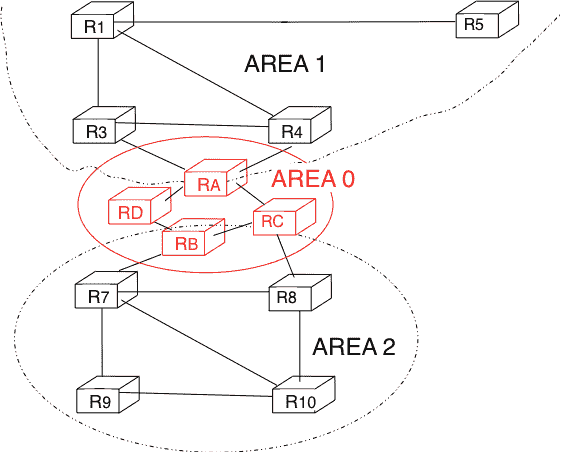
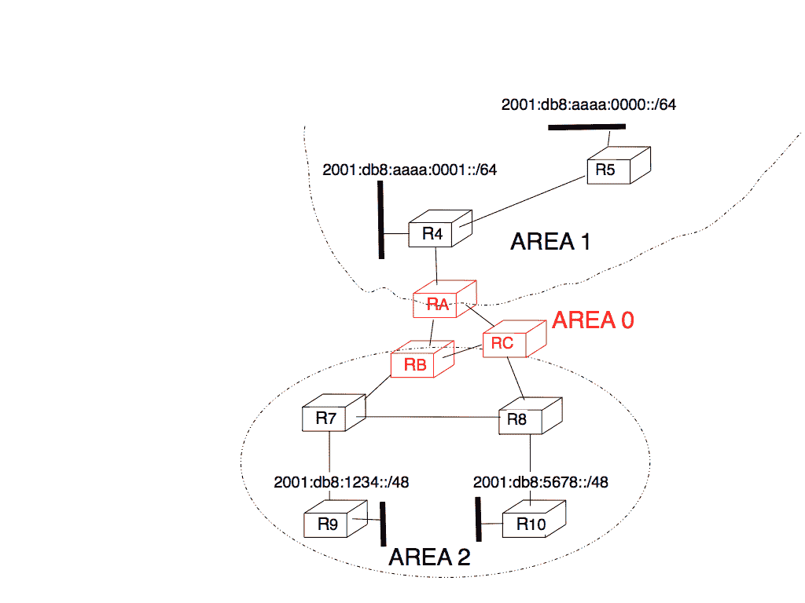
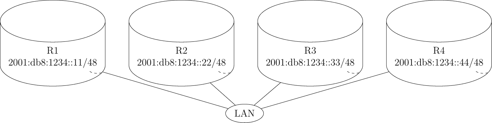

# IP 网络中的路由

> 原文：[`4ed.computer-networking.info/syllabus/default/networks/routing.html`](https://4ed.computer-networking.info/syllabus/default/networks/routing.html)

在像全球互联网这样的大型 IP 网络中，路由器需要交换路由信息。互联网是由不同责任下的网络互联而成的，通常称为域。截至 2025 年，互联网由超过 10 万个不同的域组成，并且这个数字仍在增长[[1]](#fas)。一个域可以是一个管理单个建筑中几个路由器的小型企业，一个拥有多个地点的百台路由器的大型企业，或者管理数千台路由器的大型互联网服务提供商。使用两类路由协议来允许这些域有效地交换路由信息。

(../_images/small-internet.png)

图 145 小型互联网的组织结构#

路由协议的第一类是域内路由协议（有时也称为内部网关协议或 IGP）。域内路由协议被域内所有路由器用来交换关于域内可达目的地的路由信息。存在几种域内路由协议。一些域使用 RIP，这是一个距离矢量协议。其他域使用链路状态路由协议，如 OSPF 或 IS-IS。最后，一些域使用静态路由或专有协议，如 IGRP 或 EIGRP。

这些域内路由协议通常有两个目标。首先，它们分发与域内两个路由器之间最短路径相对应的路由信息。其次，它们应该允许路由器快速从链路和路由器故障中恢复。

路由协议的第二类是域间路由协议（有时也称为外部网关协议或 EGP）。域间路由协议的目标是在域之间分发路由信息。出于可扩展性的原因，域间路由协议必须分发聚合的路由信息，并将每个域视为一个黑盒。

域内路由和域间路由之间一个非常重要的区别是每个域使用的路由策略。在单个域内，所有路由器都被视为平等，当有多个路由可供到达给定的目标前缀时，最佳路由是根据技术标准选择的，例如具有最短延迟的路由、具有最少跳数的路由或具有最高带宽的路由。

当我们考虑由不同组织管理的域之间的互联时，这一点就不再成立。每个域都实施自己的路由策略。路由策略由三个元素组成：一个导入过滤器，指定哪些路由可以被域接受；一个导出过滤器，指定哪些路由可以被域通告；以及一个选择算法，当域知道通往同一目标前缀的多个路由时，选择最佳路由。正如我们稍后将会看到的，另一个重要的区别是，域间路由协议的目标是找到通往每个目标的最便宜路由。只有一个域间路由协议：BGP。

## 域内路由#

在本节中，我们简要描述了两个主要域内单播路由协议（RIP 和 OSPF）的关键特性。距离矢量路由和链路状态路由的基本原理已在前面介绍。

### RIP#

路由信息协议（RIP）是为 TCP/IP 协议族标准化的最简单的路由协议。RIP 在[**RFC 2453**](https://datatracker.ietf.org/doc/html/rfc2453.html)中定义。有关 RIP 的更多信息，可以在[[Malkin1999]](../bibliography.html#malkin1999)中找到。

RIP 路由器定期交换 RIP 消息。以下显示了这些消息的格式。RIP 消息被发送在 UDP 段中，其目标端口设置为 521。RIP 消息包含几个字段。命令字段指示 RIP 消息是请求还是响应。当路由器启动时，其路由表为空，无法转发任何数据包。为了加快网络发现的进程，它可以向 RIP IPv6 多播地址`FF02::9`发送请求消息。所有 RIP 路由器都会监听这个多播地址，任何连接到子网的路由器都会通过发送自己的路由表作为一系列 RIP 消息来回复。在稳定状态下，路由器每 30 秒多播一个或多个 RIP 响应消息。这些消息包含总结路由器路由表的距离矢量。RIP 的当前版本是版本 2，定义在[**RFC 2453**](https://datatracker.ietf.org/doc/html/rfc2453.html)中，用于 IPv4，以及[**RFC 2080**](https://datatracker.ietf.org/doc/html/rfc2080.html)中，用于 IPv6。

图. 146 RIP 消息格式#

每个 RIP 消息包含一组路由条目。每个路由条目编码为一个 20 字节的字段，其格式如下所示。RIP 最初被设计为适用于不同的网络层协议。一些 RIP 的实现被用于 XNS 或 IPX 网络[**RFC 2453**](https://datatracker.ietf.org/doc/html/rfc2453.html)。[**RFC 2080**](https://datatracker.ietf.org/doc/html/rfc2080.html)所使用的路由条目格式如下所示。前缀长度是子网标识符的位数，度量值编码为一个字节。RIP 支持的最大度量值为 15。

图 147 RIP IPv6 路由条目格式#

备注

关于计时器的一个备注

最初的 RIP 实现每 30 秒发送一次它们的距离向量。这在大多数网络中都工作得很好，但一些研究人员注意到，由于同时处理过多的距离向量，路由器有时会过载[[FJ1994]](../bibliography.html#fj1994)。他们在这些网络中收集了数据包跟踪，并发现经过一段时间后，路由器的计时器变得同步，即几乎所有路由器都在几乎相同的时间发送它们的距离向量。这种距离向量传输时间的同步导致路由器 CPU 过载，在某些情况下也增加了协议的收敛时间。这主要是因为所有路由器在处理接收到的距离向量后都将它们的计时器设置为相同的过期时间。[Sally Floyd](https://www.icir.org/floyd/)和[Van Jacobson](https://en.wikipedia.org/wiki/Van_Jacobson)在[[FJ1994]](../bibliography.html#fj1994)中提出了一种简单的解决方案来解决这个同步问题。路由器不应该在 30 秒后精确地广告它们的距离向量，而应该在[15,45]区间内随机选择延迟后发送下一个距离向量[**RFC 2080**](https://datatracker.ietf.org/doc/html/rfc2080.html)。这种延迟的随机化防止了与固定延迟发生的同步，并且现在已成为协议设计者的推荐做法。### OSPF#

链路状态路由协议用于 IP 网络。定义在[**RFC 2328**](https://datatracker.ietf.org/doc/html/rfc2328.html)中的开放最短路径优先（OSPF）是 IETF 标准化的链路状态路由协议。支持 IPv6 的 OSPF 的最新版本定义在[**RFC 5340**](https://datatracker.ietf.org/doc/html/rfc5340.html)中。OSPF 常用于企业网络和一些 ISP 网络。然而，ISP 网络通常使用 IS-IS 链路状态路由协议 [[ISO10589]](../bibliography.html#iso10589)，该协议是为 ISO CLNP 协议开发的，但在 OSPF 标准化最终确定之前，已被修改以用于 IP [**RFC 1195**](https://datatracker.ietf.org/doc/html/rfc1195.html) 网络。ISIS 和 OSPF 的详细分析可以在[[BMO2006]](../bibliography.html#bmo2006)和[[Perlman2000]](../bibliography.html#perlman2000)中找到。有关 OSPF 的更多信息，可以在[[Moy1998]](../bibliography.html#moy1998)中找到。

与我们在链路状态路由部分讨论的链路状态路由协议的基本原理相比，OSPF 有一些值得讨论的特殊性。首先，在一个大型网络中，将所有路由器和链路的信息洪泛到数千个或更多的路由器可能会很昂贵，因为每个路由器都需要存储整个网络的所有信息。一个更好的方法是将网络划分为区域进行分层路由。分层路由将网络划分为区域。一个区域内的所有路由器都了解该区域的拓扑结构，但只学习其他区域拓扑结构和它们之间互连的汇总信息。OSPF 支持分层路由的受限变体。在 OSPF 术语中，一个区域被称为区域。

OSPF 对网络如何划分为区域施加了限制。一个区域是一组被分组在一起的路由器和链路。通常，一个区域的拓扑结构被选择，以便区域内一个路由器发送的数据包可以在不离开区域的情况下到达该区域内的任何其他路由器 [[2]](#fvirtual) 。OSPF 区域包含两种类型的路由器 [**RFC 2328**](https://datatracker.ietf.org/doc/html/rfc2328.html)：

> +   内部路由器：其直接连接的网络属于该区域的路由器。
> +   
> +   区域边界路由器：连接到多个区域的路由器。

例如，图 图 148 中所示的网络已被划分为三个区域：区域 0，包含路由器 RA、RB、RC 和 RD；区域 1，包含路由器 R1、R3、R4、R5 和 RA；以及区域 2，包含 R7、R8、R9、R10、RB 和 RC。OSPF 区域通过一个 32 位整数来识别，有时也用 IP 地址来表示。在 OSPF 区域中，区域 0，也称为骨干区域，具有特殊的作用。骨干区域将所有区域边界路由器（如图下所示的 RA、RB 和 RC 路由器）以及直接连接到骨干路由器但不属于另一个区域的路由器（如图下所示的 RD 路由器）组合在一起。OSPF 施加的一个重要限制是，属于两个不同区域的两台路由器之间的路径（例如图下所示的 R1 和 R8）必须通过骨干区域。

(../_images/ospf-areas.png)

图 148 OSPF 区域#

在每个非骨干区域内部，路由器通过与其他区域内的路由器交换链路状态包来分发该区域的拓扑结构。内部路由器不知道其他区域的拓扑结构，但每个路由器都知道如何到达骨干区域。在一个区域内部，路由器只交换链路状态包，以到达该区域内所有可达的目的地。在 OSPF 中，通过交换距离向量来实现跨区域路由。这由图 图 149 所示的网络拓扑结构进行了说明。

(../_images/ospf-area.png)

图 149 OSPF 的分层路由#

让我们先考虑区域 2 内部的 OSPF 路由。该区域内的所有路由器都学习到通往 2001:db8:1234::/48 和 2001:db8:5678::/48 的路由。两个区域边界路由器 RB 和 RC 创建网络汇总广告。假设所有链路都具有单位链路度量，这些汇总广告将是：

> +   RB 发布 2001:db8:1234::/48 的距离为 2，2001:db8:5678::/48 的距离为 3
> +   
> +   RC 发布 2001:db8:5678::/48 的距离为 2，2001:db8:1234::/48 的距离为 3

这些汇总广告通过连接到 RB 和 RC 路由器的骨干区域进行洪泛。在 RA 路由器的路由表中，RA 选择 RB 发布的汇总信息以到达 2001:db8:1234::/48，以及 RC 发布的汇总信息以到达 2001:db8:5678::/48。在区域 1 内部，RA 发布一个汇总信息，表明 2001:db8:1234::/48 和 2001:db8:5678::/48 都距离自身 3 距离。

另一方面，考虑位于区域 1 内部的前缀 2001:db8:aaaa:0000::/64 和 2001:db8:aaaa:0001::/64。RA 是唯一连接到该区域的区域边界路由器。该路由器可以创建两个不同的网络汇总广告：

> +   2001:db8:aaaa:0001::/64 距离 RA 为 1，2001:db8:aaaa:0000::/64 距离 RA 为 2
> +   
> +   2001:db8:aaaa:0000::/63 在距离 RA 2 的位置

第一个摘要通告提供了关于到达每个前缀所使用的距离的精确信息。然而，网络中的所有路由器都必须维护一个指向 2001:db8:aaaa:0000::/64 和一个指向 2001:db8:aaaa:0001::/64 的路由，这两个路由都通过路由器 RA。第二个通告将通过减少跨越区域边界的通告路由数量来提高 OSPF 的可扩展性。然而，在实践中这需要在边界路由器上进行手动配置。

值得讨论的第二个 OSPF 特殊性是支持本地局域网 (LAN)。如图 图 150 所示，多个路由器可能连接到同一个局域网。

图 150 带有路由器的局域网

支持此类局域网并使用链路状态路由协议的第一个解决方案是考虑局域网等同于一个全连接的点对点链路网，就像每个路由器可以直接到达局域网上的任何其他路由器一样。然而，这种方法有两个重要的缺点：

> 1.  每个路由器必须与局域网上的所有其他路由器交换 HELLO 和链路状态数据包。这增加了每个路由器发送和处理的 OSPF 数据包数量。
> 1.  
> 1.  远程路由器在查看 OSPF 分发的拓扑时，认为所有局域网路由器之间存在全连接的链路。这种全连接意味着在故障情况下存在大量的冗余，而在实际中整个局域网可能会完全失效。在局域网完全从远程路由器的 OSPF 拓扑中移除之前，所有路由器都需要检测故障并向其他路由器洪泛链路状态数据包。

为了更好地表示局域网并减少交换的 OSPF 数据包数量，OSPF 对局域网的处理方式不同。当 OSPF 路由器在局域网启动时，它们会选举 [[3]](#felection) 其中一个作为指定路由器 (DR) [**RFC 2328**](https://datatracker.ietf.org/doc/html/rfc2328.html)。DR 路由器代表本地局域网，并通告局域网的子网。此外，局域网路由器只与 DR 交换 HELLO 数据包。得益于 DR 的使用，局域网的拓扑结构看起来像是一组连接到 DR 路由器的点对点链路。

注意

如何快速检测链路故障？

网络运营商期望 OSPF 网络能够快速从链路或路由器故障中恢复 [[VPD2004]](../bibliography.html#vpd2004)。在 OSPF 网络中，故障后的恢复分为三个步骤 [[FFEB2005]](../bibliography.html#ffeb2005)：

> +   邻近故障的路由器可以快速检测到它。默认的解决方案是依赖于常规的 HELLO 数据包交换。然而，连续 HELLO 之间的间隔通常设置为 10 秒……将 HELLO 计时器降低到几毫秒是困难的，因为 HELLO 数据包是由路由器的主 CPU 创建和处理的，这些路由器无法轻易地在每个接口上每毫秒生成和处理一个 HELLO 数据包。一个更好的解决方案是使用专门的故障检测协议，例如在[[KW2009]](../bibliography.html#kw2009)中定义的双向转发检测（BFD）协议，该协议可以直接在路由器接口上实现。另一种能够检测故障的解决方案是对物理层和数据链路层进行仪器化，以便在链路失败时中断路由器。不幸的是，这种解决方案不能用于所有类型的物理层和数据链路层。
> +   
> +   检测到故障的路由器会在网络中洪泛它们的更新链路状态数据包
> +   
> +   所有路由器更新它们的路由表

最后，但也是操作上重要的一点，需要讨论关于 OSPF 和 IS-IS 等域内路由协议。域内路由协议总是为每个目的地选择最短路径。在实践中，往往有几种通往同一目的地的等价路径。当一个路由器计算通往一个目的地的几个等价成本路径时，它可以以不同的方式使用这些路径。

第一种方法是选择一条等价成本路径之一（例如，SPF 计算找到的第一条或最后一条路径）并将其安装到转发表中。在这种情况下，每个目的地只使用一条路径。

第二种方法是在转发表中安装所有等价成本路径 [[4]](#fmaxpaths) 并在各个路径上负载均衡数据包。考虑一个路由器有 N 个不同的出接口来达到目的地 d 的情况。在这些接口之间负载均衡流量的第一种可能性是使用轮询。轮询允许在 N 个出接口之间平均分配数据包。这种平均负载均衡在实践中非常重要，因为它允许更好地在整个网络中分散负载。然而，很少有网络使用这种轮询策略在路由器上负载均衡流量。轮询的主要缺点是，属于同一流（例如 TCP 连接）的数据包可能会被转发到不同的路径。如果属于同一 TCP 连接的数据包被发送到不同的路径，它们可能会经历不同的延迟，并在目的地以乱序到达。当 TCP 接收器检测到乱序段时，它会发送重复的确认，这可能导致发送方启动快速重传并进入拥塞避免。因此，乱序段可能会导致 TCP 性能降低。这对于旨在通过分散负载来提高网络性能的负载均衡技术来说是个麻烦。

为了有效地在不同路径上分散负载，路由器需要实现每流负载均衡。这意味着它们必须在同一路径上转发属于同一流的全部数据包。由于 TCP 连接始终由四元组（源和目的地址、源和目的端口）标识，一个可能的选择是在流的第一数据包到达时选择一个出接口，并将此决策存储在路由器的内存中。不幸的是，这种解决方案无法扩展，因为所需的内存会随着通过路由器的 TCP 连接数量增长。

幸运的是，可以在不维护任何路由器状态的情况下执行每流负载均衡。今天的大多数路由器都使用哈希函数来完成这项任务 [**RFC 2991**](https://datatracker.ietf.org/doc/html/rfc2991.html)。当一个数据包到达时，路由器会从数据包中提取下一个头部信息以及四元组，并计算：

> $ hash(NextHeader,IP_{src},IP_{dst},Port_{src},Port_{dst}) \pmod{N} $

在这个公式中，N 是指向数据包目的地的等价成本路径上的出接口数量。可能的哈希函数包括 CRC、校验和或 MD5 [**RFC 2991**](https://datatracker.ietf.org/doc/html/rfc2991.html)。由于哈希函数是在四元组上计算的，因此属于同一流的所有的数据包都会计算出相同的哈希值。这防止了由于网络内部的负载均衡而导致的重新排序。今天的大多数路由器都支持这种类型的负载均衡 [[ACO+2006]](../bibliography.html#aco-2006)。

脚注

## 域内路由#

在本节中，我们简要描述了两种主要域内单播路由协议（RIP 和 OSPF）的关键特性。距离矢量路由和链路状态路由的基本原理已在前面介绍。

### RIP#

路由信息协议（RIP）是标准化为 TCP/IP 协议套件的简单路由协议。RIP 定义在 [**RFC 2453**](https://datatracker.ietf.org/doc/html/rfc2453.html)。有关 RIP 的更多信息，请参阅 [[Malkin1999]](../bibliography.html#malkin1999)。

RIP 路由器定期交换 RIP 消息。这些消息的格式如下所示。RIP 消息在 UDP 段内发送，其目标端口设置为 521。RIP 消息包含几个字段。命令字段指示 RIP 消息是请求还是响应。当路由器启动时，其路由表为空，无法转发任何数据包。为了加快网络发现的进程，它可以向 RIP IPv6 多播地址`FF02::9`发送请求消息。所有 RIP 路由器都监听这个多播地址，任何连接到子网的路由器都会通过发送自己的路由表作为一系列 RIP 消息来回复。在稳定状态下，路由器每 30 秒多播一个或多个 RIP 响应消息。这些消息包含总结路由器路由表的距离矢量。RIP 的当前版本是版本 2，定义在 [**RFC 2453**](https://datatracker.ietf.org/doc/html/rfc2453.html) 中用于 IPv4，以及 [**RFC 2080**](https://datatracker.ietf.org/doc/html/rfc2080.html) 中用于 IPv6。

图 146 RIP 消息格式#

每个 RIP 消息包含一组路由条目。每个路由条目编码为一个 20 字节的字段，其格式如下所示。RIP 最初设计为适用于不同的网络层协议。一些 RIP 实现被用于 XNS 或 IPX 网络 [**RFC 2453**](https://datatracker.ietf.org/doc/html/rfc2453.html)。[**RFC 2080**](https://datatracker.ietf.org/doc/html/rfc2080.html) 所使用的路由条目格式如下。前缀长度是子网标识符的位数，度量值编码为一个字节。RIP 支持的度量值最大为 15。

图 147 RIP IPv6 路由条目格式#

注意

关于计时器

第一个 RIP 实现每 30 秒精确发送一次它们的距离矢量。这在大多数网络中都工作得很好，但一些研究人员注意到，由于同时处理过多的距离矢量，路由器有时会过载[[FJ1994]](../bibliography.html#fj1994)。他们在这些网络中收集了数据包跟踪，并发现经过一段时间后，路由器的计时器变得同步，即几乎所有路由器都在几乎相同的时间发送它们的距离矢量。这种距离矢量传输时间的同步导致路由器 CPU 过载，在某些情况下也增加了协议的收敛时间。这主要是因为所有路由器在处理接收到的距离矢量后都将它们的计时器设置为相同的过期时间。[Sally Floyd](https://www.icir.org/floyd/)和[Van Jacobson](https://en.wikipedia.org/wiki/Van_Jacobson)在[[FJ1994]](../bibliography.html#fj1994)中提出了一种简单的解决方案来解决这个同步问题。路由器不应在 30 秒后精确地广播它们的距离矢量，而应在[15,45]区间内随机选择延迟后发送下一个距离矢量[**RFC 2080**](https://datatracker.ietf.org/doc/html/rfc2080.html)。这种延迟的随机化防止了与固定延迟发生的同步，现在已成为协议设计者的推荐做法。### OSPF#

链路状态路由协议在 IP 网络中使用。定义在[**RFC 2328**](https://datatracker.ietf.org/doc/html/rfc2328.html)中的开放最短路径优先（OSPF）是已被 IETF 标准化的链路状态路由协议。支持 IPv6 的 OSPF 最后一个版本定义在[**RFC 5340**](https://datatracker.ietf.org/doc/html/rfc5340.html)中。OSPF 常在企业网络和一些 ISP 网络中使用。然而，ISP 网络通常使用 IS-IS 链路状态路由协议[[ISO10589]](../bibliography.html#iso10589)，该协议是为 ISO CLNP 协议开发的，但在 OSPF 标准化最终确定之前，已被调整为在 IP 网络[**RFC 1195**](https://datatracker.ietf.org/doc/html/rfc1195.html)中使用。ISIS 和 OSPF 的详细分析可以在[[BMO2006]](../bibliography.html#bmo2006)和[[Perlman2000]](../bibliography.html#perlman2000)中找到。有关 OSPF 的更多信息，可以在[[Moy1998]](../bibliography.html#moy1998)中找到。

与我们在 链路状态路由 部分讨论的链路状态路由协议的基本原理相比，OSPF 有一些值得讨论的特殊性。首先，在一个大型网络中，将所有路由器和链路的信息传播到成千上万的路由器可能成本高昂，因为每个路由器都需要存储整个网络的所有信息。一个更好的方法是将网络划分为区域。分层路由将网络划分为区域。区域内的所有路由器都了解该区域的拓扑结构，但只知道其他区域拓扑结构和它们之间互连的汇总信息。OSPF 支持分层路由的受限变体。在 OSPF 的术语中，一个区域被称为区域。

OSPF 对如何将网络划分为区域施加了限制。一个区域是一组组合在一起的路由器和链路。通常，选择一个区域的拓扑结构，使得该区域内发送的一个数据包可以到达该区域内的任何其他路由器，而无需离开该区域 [[2]](#fvirtual)。一个 OSPF 区域包含两种类型的路由器 [**RFC 2328**](https://datatracker.ietf.org/doc/html/rfc2328.html)：

> +   内部路由器：一个其直接连接的网络属于该区域的路由器。
> +   
> +   区域边界路由器：连接到多个区域的路由器。

例如，图 图 148 所示的网络已被划分为三个区域：区域 0，包含路由器 RA、RB、RC 和 RD；区域 1，包含路由器 R1、R3、R4、R5 和 RA；区域 2 包含 R7、R8、R9、R10、RB 和 RC。OSPF 区域通过一个 32 位整数来识别，有时也用 IP 地址来表示。在 OSPF 区域中，区域 0，也称为骨干区域，具有特殊的作用。骨干区域将所有区域边界路由器（如图下方的路由器 RA、RB 和 RC）以及直接连接到骨干路由器但不属于其他区域的路由器（如图下方的路由器 RD）组合在一起。OSPF 强制实施的一个重要限制是，属于两个不同区域（例如图下方的 R1 和 R8）的两个路由器之间的路径必须通过骨干区域。

(../_images/ospf-areas.png)

图 148 OSPF 区域#

在每个非骨干区域内部，路由器通过与其他区域内的路由器交换链路状态数据包来分发该区域的拓扑结构。内部路由器不知道其他区域的拓扑结构，但每个路由器都知道如何到达骨干区域。在一个区域内部，路由器只为区域内可达的所有目的地交换链路状态数据包。在 OSPF 中，区域间路由是通过交换距离向量来完成的。这可以通过图 图 149 所示的网络拓扑结构来说明。

图 149：使用 OSPF 的分层路由#

让我们先考虑区域 2 内的 OSPF 路由。该区域内的所有路由器都学习到到达 2001:db8:1234::/48 和 2001:db8:5678::/48 的路由。两个区域边界路由器 RB 和 RC 创建网络汇总广告。假设所有链路都具有单位链路度量，这些汇总广告将是：

> +   RB 在距离为 2 的地方发布 2001:db8:1234::/48，在距离为 3 的地方发布 2001:db8:5678::/48
> +   
> +   RC 在距离为 2 的地方发布 2001:db8:5678::/48，在距离为 3 的地方发布 2001:db8:1234::/48

这些汇总广告通过连接到路由器 RB 和 RC 的主干区域进行泛洪。在 RA 的路由表中，RA 选择 RB 发布的汇总广告来到达 2001:db8:1234::/48，选择 RC 发布的汇总广告来到达 2001:db8:5678::/48。在区域 1 内，RA 发布一个汇总广告，表明 2001:db8:1234::/48 和 2001:db8:5678::/48 都距离自身 3 个距离单位。

另一方面，考虑位于区域 1 内的前缀 2001:db8:aaaa:0000::/64 和 2001:db8:aaaa:0001::/64。路由器 RA 是唯一连接到该区域的区域边界路由器。该路由器可以创建两个不同的网络汇总广告：

> +   从 RA 的距离为 1 的 2001:db8:aaaa:0001::/64 和从 RA 的距离为 2 的 2001:db8:aaaa:0000::/64
> +   
> +   2001:db8:aaaa:0000::/63 在 RA 的距离为 2

第一个汇总广告提供了关于到达每个前缀所使用的距离的精确信息。然而，网络中的所有路由器都必须维护一个指向 2001:db8:aaaa:0000::/64 和指向 2001:db8:aaaa:0001::/64 的路由，这两个路由都通过路由器 RA。第二个广告将提高 OSPF 的可扩展性，通过减少跨区域边界发布的路由数量。然而，在实践中，这需要在边界路由器上进行手动配置。

值得讨论的第二个 OSPF 特性是支持本地局域网（LAN）。如图图 150 所示，多个路由器可能连接到同一个 LAN。

图 150：带有路由器的 LAN

支持此类 LAN 的链路状态路由协议的第一个解决方案是考虑 LAN 相当于一个全网的点对点链路，就像每个路由器可以直接到达 LAN 上的任何其他路由器一样。然而，这种方法有两个重要的缺点：

> 1.  每个路由器必须与 LAN 上所有其他路由器交换 HELLO 和链路状态数据包。这增加了每个路由器发送和处理的 OSPF 数据包数量。
> 1.  
> 1.  远程路由器在查看 OSPF 分发的拓扑时，认为所有局域网路由器之间存在全连接的链路。这种全连接意味着在故障情况下存在大量的冗余，而在实践中，整个局域网可能会完全失效。在局域网完全从远程路由器的 OSPF 拓扑中移除之前，所有路由器都需要检测故障并泛洪链路状态包。

为了更好地表示局域网并减少交换的 OSPF 数据包数量，OSPF 对局域网的处理方式不同。当 OSPF 路由器在局域网启动时，它们会选举[[3]](#felection)其中一个作为指定路由器（DR）[**RFC 2328**](https://datatracker.ietf.org/doc/html/rfc2328.html)。DR 路由器代表本地局域网，并通告局域网的子网。此外，局域网路由器只与 DR 交换 HELLO 包。得益于 DR 的使用，局域网的拓扑结构看起来像是一组连接到 DR 路由器的点对点链路。

注意

如何快速检测链路故障？

网络运营商期望 OSPF 网络能够快速从链路或路由器故障中恢复[[VPD2004]](../bibliography.html#vpd2004)。在 OSPF 网络中，故障后的恢复分为三个步骤[[FFEB2005]](../bibliography.html#ffeb2005) :

> +   邻近故障的路由器可以快速检测到它。默认的解决方案是依赖于定期的 HELLO 包交换。然而，连续 HELLO 包之间的间隔通常设置为 10 秒……将 HELLO 计时器降低到几毫秒是困难的，因为 HELLO 包是由路由器的主 CPU 创建和处理的，这些路由器无法轻易地在每个接口上每毫秒生成和处理一个 HELLO 包。一个更好的解决方案是使用专门的故障检测协议，例如在[[KW2009]](../bibliography.html#kw2009)中定义的双向转发检测（BFD）协议，该协议可以直接在路由器接口上实现。另一种能够检测故障的解决方案是对物理和链路层进行仪器化，以便在链路故障时中断路由器。不幸的是，这种解决方案不能用于所有类型的物理和链路层。
> +   
> +   检测到故障的路由器会将更新的链路状态包在网络中泛洪
> +   
> +   所有路由器都会更新它们的路由表

最后，但操作上很重要的一点是，需要讨论关于 OSPF 和 IS-IS 等域内路由协议的问题。域内路由协议始终为每个目的地选择最短路径。在实践中，往往有通往同一目的地的多条等价路径。当路由器计算通往一个目的地的多条等价成本路径时，它可以以不同的方式使用这些路径。

第一种方法是选择一条等价成本路径（例如，SPF 计算找到的第一条或最后一条路径）并将其安装到转发表中。在这种情况下，每个目的地只使用一条路径。

第二种方法是在转发表中安装所有等价成本路径 [[4]](#fmaxpaths) 并在这些不同路径上对数据包进行负载均衡。考虑一个路由器有 N 个不同的出接口来到达目的地 d 的情况。在这些接口之间负载均衡流量的第一种可能性是使用轮询。轮询允许在 N 个出接口之间平均分配数据包。这种负载均衡在实践中的重要性在于它允许更好地在整个网络中分配负载。然而，很少有网络使用这种轮询策略在路由器上负载均衡流量。轮询的主要缺点是，属于同一流（例如 TCP 连接）的数据包可能会被转发到不同的路径。如果属于同一 TCP 连接的数据包被发送到不同的路径，它们可能会经历不同的延迟，并在目的地以乱序到达。当 TCP 接收器检测到乱序段时，它会发送重复的确认，这可能导致发送方启动快速重传并进入拥塞避免状态。因此，乱序段可能会导致 TCP 性能降低。这对于一个旨在通过分散负载来提高网络性能的负载均衡技术来说是很烦恼的。

为了有效地在不同路径上分配负载，路由器需要实现按流负载均衡。这意味着它们必须在同一路径上转发属于同一流的全部数据包。由于 TCP 连接始终由四元组（源和目的地址、源和目的端口）标识，一个可能的方法是在流的第一数据包到达时选择一个出接口，并将此决策存储在路由器的内存中。不幸的是，这种解决方案无法扩展，因为所需的内存随着通过路由器的 TCP 连接数量增长而增长。

幸运的是，可以在不维护路由器上的任何状态的情况下执行按流负载均衡。今天的大多数路由器都使用哈希函数来完成此目的 [**RFC 2991**](https://datatracker.ietf.org/doc/html/rfc2991.html)。当一个数据包到达时，路由器从数据包中提取 Next Header 信息和四元组，并计算：

> $ hash(NextHeader,IP_{src},IP_{dst},Port_{src},Port_{dst}) \pmod{N} $

在此公式中，N 是通往数据包目的地的等价成本路径上的出接口数量。可能的哈希函数包括 CRC、校验和或 MD5[**RFC 2991**](https://datatracker.ietf.org/doc/html/rfc2991.html)。由于哈希函数是在四元组上计算的，因此对于属于同一流的所有数据包，将计算相同的哈希值。这防止了由于网络内部的负载均衡而导致的重新排序。大多数路由器今天都支持这种类型的负载均衡[[ACO+2006]](../bibliography.html#aco-2006)。

脚注  ### RIP#

路由信息协议（RIP）是标准化为 TCP/IP 协议套件的简单路由协议。RIP 在[**RFC 2453**](https://datatracker.ietf.org/doc/html/rfc2453.html)中定义。有关 RIP 的更多信息，请参阅[[Malkin1999]](../bibliography.html#malkin1999)。

RIP 路由器定期交换 RIP 消息。这些消息的格式如下所示。RIP 消息在 UDP 段内发送，其目标端口设置为 521。RIP 消息包含几个字段。命令字段指示 RIP 消息是请求还是响应。当路由器启动时，其路由表为空，它无法转发任何数据包。为了加快网络发现的进程，它可以向 RIP IPv6 多播地址`FF02::9`发送请求消息。所有 RIP 路由器都监听此多播地址，任何连接到子网的路由器都会通过发送自己的路由表作为一系列 RIP 消息来回复。在稳定状态下，路由器每 30 秒多播一个或多个 RIP 响应消息。这些消息包含总结路由器路由表的距离向量。RIP 的当前版本是版本 2，它定义在[**RFC 2453**](https://datatracker.ietf.org/doc/html/rfc2453.html)中用于 IPv4，在[**RFC 2080**](https://datatracker.ietf.org/doc/html/rfc2080.html)中用于 IPv6。

图 146 RIP 消息格式#

每个 RIP 消息包含一组路由条目。每个路由条目编码为一个 20 字节的字段，其格式如下所示。RIP 最初设计为适用于不同的网络层协议。一些 RIP 的实现被用于 XNS 或 IPX 网络[**RFC 2453**](https://datatracker.ietf.org/doc/html/rfc2453.html)。[**RFC 2080**](https://datatracker.ietf.org/doc/html/rfc2080.html)使用的路由条目格式如下所示。前缀长度是子网标识符的位数，度量值编码为一个字节。RIP 支持的最大度量值为 15。

图 147 RIP IPv6 路由条目格式#

注意

关于计时器的一个说明

第一个 RIP 实现每 30 秒精确发送一次它们的距离矢量。这在大多数网络中都工作得很好，但一些研究人员注意到，由于同时处理太多的距离矢量，路由器有时会过载[[FJ1994]](../bibliography.html#fj1994)。他们在这些网络中收集了数据包跟踪，并发现经过一段时间后，路由器的计时器变得同步，即几乎所有路由器都在几乎相同的时间发送它们的距离矢量。这种距离矢量传输时间的同步导致路由器 CPU 过载，在某些情况下也增加了协议的收敛时间。这主要是因为所有路由器在处理接收到的距离矢量后都将它们的计时器设置为相同的过期时间。[Sally Floyd](https://www.icir.org/floyd/)和[Van Jacobson](https://en.wikipedia.org/wiki/Van_Jacobson)在[[FJ1994]](../bibliography.html#fj1994)中提出了一种简单的解决方案来解决这个同步问题。路由器不应在 30 秒后精确地宣布它们的距离矢量，而应在[15,45]区间内随机选择延迟后发送下一个距离矢量[**RFC 2080**](https://datatracker.ietf.org/doc/html/rfc2080.html)。这种延迟的随机化防止了与固定延迟发生的同步，并且现在已成为协议设计者的推荐做法。

### OSPF#

链路状态路由协议在 IP 网络中使用。开放最短路径优先（OSPF），由[**RFC 2328**](https://datatracker.ietf.org/doc/html/rfc2328.html)定义，是已被 IETF 标准化的链路状态路由协议。支持 IPv6 的 OSPF 最后一个版本由[**RFC 5340**](https://datatracker.ietf.org/doc/html/rfc5340.html)定义。OSPF 经常在企业网络和一些 ISP 网络中使用。然而，ISP 网络通常使用 IS-IS 链路状态路由协议[[ISO10589]](../bibliography.html#iso10589)，该协议是为 ISO CLNP 协议开发的，但在 OSPF 标准化最终确定之前，已被调整为在 IP 网络[**RFC 1195**](https://datatracker.ietf.org/doc/html/rfc1195.html)中使用。ISIS 和 OSPF 的详细分析可以在[[BMO2006]](../bibliography.html#bmo2006)和[[Perlman2000]](../bibliography.html#perlman2000)中找到。有关 OSPF 的更多信息可以在[[Moy1998]](../bibliography.html#moy1998)中找到。

与我们在链路状态路由部分讨论的链路状态路由协议的基本原理相比，OSPF 有一些值得讨论的特殊性。首先，在一个大型网络中，将所有路由器和链路的信息传播到数千个或更多的路由器可能会很昂贵，因为每个路由器都需要存储整个网络的所有信息。一个更好的方法是将网络划分为区域。分层路由将网络划分为区域。一个区域内的所有路由器都对该区域的拓扑结构有详细的信息，但只知道其他区域拓扑结构和它们之间互连的汇总信息。OSPF 支持分层路由的受限变体。在 OSPF 术语中，一个区域被称为区域。

OSPF 对网络如何划分为区域施加了限制。一个区域是一组组合在一起的路由器和链路。通常，一个区域的拓扑结构被选择，以便区域内的一个路由器发送的数据包可以在不离开区域的情况下到达该区域内的任何其他路由器 [[2]](#fvirtual) 。OSPF 区域包含两种类型的路由器 [**RFC 2328**](https://datatracker.ietf.org/doc/html/rfc2328.html)：

> +   内部路由器：直接连接的网络属于该区域的路由器
> +   
> +   区域边界路由器：连接到多个区域的路由器。

例如，图图. 148 所示的网络已被划分为三个区域：区域 0，包含路由器 RA、RB、RC 和 RD；区域 1，包含路由器 R1、R3、R4、R5 和 RA；区域 2 包含 R7、R8、R9、R10、RB 和 RC。OSPF 区域由一个 32 位整数标识，有时表示为 IP 地址。在 OSPF 区域中，区域 0，也称为骨干区域，具有特殊的作用。骨干区域将所有区域边界路由器（如图下方的路由器 RA、RB 和 RC）以及直接连接到骨干路由器但不属于另一个区域的路由器（如图下方的路由器 RD）组合在一起。OSPF 施加的一个重要限制是，属于两个不同区域（例如图下方的 R1 和 R8）的两个路由器之间的路径必须通过骨干区域。

(../_images/ospf-areas.png)

图. 148 OSPF 区域#

在每个非骨干区域中，路由器通过与其他区域内的路由器交换链路状态数据包来分发区域的拓扑结构。内部路由器不知道其他区域的拓扑结构，但每个路由器都知道如何到达骨干区域。在一个区域内，路由器只为区域内可达的所有目的地交换链路状态数据包。在 OSPF 中，区域间路由是通过交换距离向量来完成的。这可以通过图图. 149 所示的网络安全拓扑来表示。

图 149 使用 OSPF 的分层路由#

让我们首先考虑区域 2 内的 OSPF 路由。该区域内的所有路由器都学习到指向 2001:db8:1234::/48 和 2001:db8:5678::/48 的路由。两个区域边界路由器 RB 和 RC 创建网络摘要广告。假设所有链路都具有单位链路度量，这些广告将是：

> +   RB 广告 2001:db8:1234::/48 距离为 2，2001:db8:5678::/48 距离为 3
> +   
> +   RC 广告 2001:db8:5678::/48 距离为 2，2001:db8:1234::/48 距离为 3

这些摘要广告将通过连接到路由器 RB 和 RC 的骨干区域进行泛洪。在其路由表中，路由器 RA 选择 RB 广告的摘要以到达 2001:db8:1234::/48，并选择 RC 广告的摘要以到达 2001:db8:5678::/48。在区域 1 内，路由器 RA 广告一个摘要，表明 2001:db8:1234::/48 和 2001:db8:5678::/48 都距离自身 3。

另一方面，考虑位于区域 1 内的前缀 2001:db8:aaaa:0000::/64 和 2001:db8:aaaa:0001::/64。RA 是唯一连接到该区域的区域边界路由器。该路由器可以创建两个不同的网络摘要广告：

> +   2001:db8:aaaa:0001::/64 距离 RA 为 1，2001:db8:aaaa:0000::/64 距离 RA 为 2
> +   
> +   2001:db8:aaaa:0000::/63 距离 RA 为 2

第一条摘要广告提供了关于到达每个前缀所使用的距离的精确信息。然而，网络中的所有路由器都必须维护指向 2001:db8:aaaa:0000::/64 和指向 2001:db8:aaaa:0001::/64 的路由，这两条路由都通过路由器 RA。第二条广告将通过减少跨区域边界广告的路由数量来提高 OSPF 的可扩展性。然而，在实践中，这需要在边界路由器上进行手动配置。

第二个值得讨论的 OSPF 特殊性是支持本地局域网（LAN）。如图 图 150 所示，多个路由器可能连接到同一个局域网。

图 150 带有路由器的局域网

支持此类局域网和链路状态路由协议的第一个解决方案是考虑局域网相当于一个点对点链路的全网状结构，就像每个路由器都可以直接到达局域网上的任何其他路由器一样。然而，这种方法有两个重要的缺点：

> 1.  每个路由器必须与局域网上的所有其他路由器交换 HELLO 和链路状态数据包。这增加了每个路由器发送和处理的 OSPF 数据包的数量。
> 1.  
> 1.  远程路由器在查看 OSPF 分发的拓扑时，认为所有局域网路由器之间存在全连接的链路。这种全连接意味着在故障情况下存在大量的冗余，而在实践中，整个局域网可能会完全失效。在局域网完全从远程路由器的 OSPF 拓扑中移除之前，所有路由器都需要检测故障并传播链路状态包。

为了更好地表示局域网并减少交换的 OSPF 数据包数量，OSPF 对局域网的处理方式不同。当 OSPF 路由器在局域网启动时，它们会选举 [[3]](#felection) 其中一个作为指定路由器（DR）[**RFC 2328**](https://datatracker.ietf.org/doc/html/rfc2328.html)。指定路由器代表本地局域网，并通告局域网的子网。此外，局域网路由器只与 DR 交换 HELLO 包。得益于 DR 的使用，局域网的拓扑结构看起来像是一组连接到 DR 路由器的点对点链路。

注意

如何快速检测链路故障？

网络运营商期望 OSPF 网络能够快速从链路或路由器故障中恢复 [[VPD2004]](../bibliography.html#vpd2004)。在 OSPF 网络中，故障后的恢复分为三个步骤 [[FFEB2005]](../bibliography.html#ffeb2005) :

> +   邻近故障的路由器能快速检测到故障。默认的解决方案是依赖于 HELLO 包的常规交换。然而，连续 HELLO 包之间的间隔通常设置为 10 秒……将 HELLO 计时器降低到几毫秒是困难的，因为 HELLO 包是由路由器的主 CPU 创建和处理的，这些路由器无法轻易地在每个接口上每毫秒生成和处理一个 HELLO 包。一个更好的解决方案是使用如双向转发检测（BFD）协议这样的专用故障检测协议，该协议在 [[KW2009]](../bibliography.html#kw2009) 中定义，可以直接在路由器接口上实现。另一种能够检测故障的解决方案是对物理层和数据链路层进行测量，以便在链路故障时中断路由器。不幸的是，这种解决方案不能用于所有类型的物理层和数据链路层。
> +   
> +   检测到故障的路由器会在网络中传播它们更新的链路状态包
> +   
> +   所有路由器更新它们的路由表

最后但同样重要的是，需要讨论关于 OSPF 和 IS-IS 等域内路由协议的一些问题。域内路由协议始终为每个目的地选择最短路径。在实践中，往往有多个通往同一目的地的等价路径。当路由器计算通往一个目的地的多个等价成本路径时，它可以以不同的方式使用这些路径。

首先的方法是选择一条等价成本路径（例如，SPF 计算找到的第一条或最后一条路径）并将其安装到转发表中。在这种情况下，每个目的地只使用一条路径。

第二种方法是将所有等价成本路径[[4]](#fmaxpaths)安装到转发表中，并在不同路径上负载均衡数据包。考虑一个路由器有 N 个不同的输出接口来到达目的地 d 的情况。在这些接口之间负载均衡流量的第一种可能性是使用轮询。轮询允许在 N 个输出接口之间平均分配数据包。这种负载均衡在实践中的重要性在于它允许更好地在整个网络中分散负载。然而，很少有网络使用这种轮询策略在路由器上负载均衡流量。轮询的主要缺点是，属于同一流（例如，TCP 连接）的数据包可能会被转发到不同的路径。如果属于同一 TCP 连接的数据包被发送到不同的路径，它们可能会经历不同的延迟，并在目的地以乱序到达。当 TCP 接收器检测到乱序段时，它会发送重复的确认，这可能导致发送方启动快速重传并进入拥塞避免。因此，乱序段可能会导致 TCP 性能降低。这对于旨在通过分散负载来提高网络性能的负载均衡技术来说是个麻烦事。

为了在不同路径上高效地分散负载，路由器需要实现按流负载均衡。这意味着它们必须在相同的路径上转发属于同一流的全部数据包。由于 TCP 连接始终由四元组（源和目的地址、源和目的端口）标识，一个可能的选择是在流的第一数据包到达时选择一个输出接口，并将此决策存储在路由器的内存中。不幸的是，这种解决方案无法扩展，因为所需的内存会随着通过路由器的 TCP 连接数量增长而增长。

幸运的是，可以在不维护任何路由器状态的情况下执行按流负载均衡。今天的大多数路由器都使用哈希函数来完成此目的[**RFC 2991**](https://datatracker.ietf.org/doc/html/rfc2991.html)。当一个数据包到达时，路由器从数据包中提取下一个头部信息以及四元组，并计算：

> $ hash(NextHeader,IP_{src},IP_{dst},Port_{src},Port_{dst}) \pmod{N} $

在这个公式中，N 是指向数据包目的地的等价成本路径上出接口的数量。可能的哈希函数包括 CRC、校验和或 MD5 [**RFC 2991**](https://datatracker.ietf.org/doc/html/rfc2991.html)。由于哈希函数是在四元组上计算的，因此属于同一流的所有数据包将计算相同的哈希值。这防止了由于网络内部负载均衡引起的重新排序。如今，大多数路由器都支持这种类型的负载均衡 [[ACO+2006]](../bibliography.html#aco-2006)。

脚注
