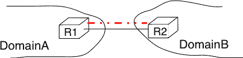
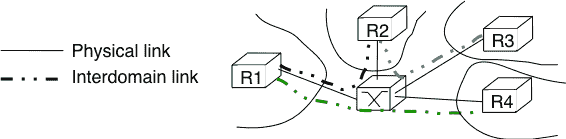
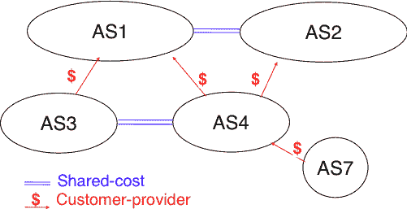
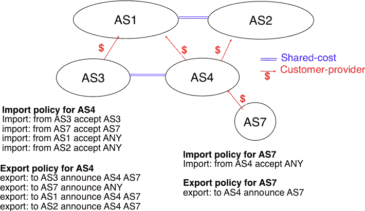
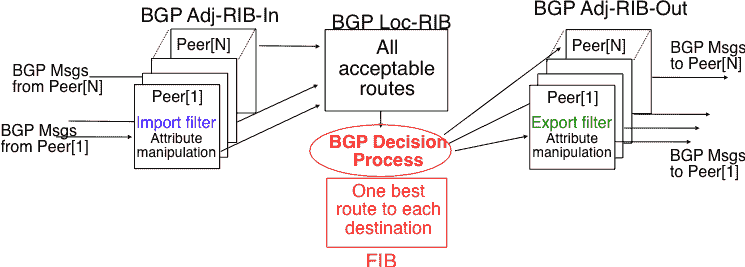

# 跨域路由

> [`4ed.computer-networking.info/syllabus/default/networks/bgp.html`](https://4ed.computer-networking.info/syllabus/default/networks/bgp.html)

如前所述，互联网由超过 10 万个不同的网络组成，这些网络被称为域 [[1]](#fasnum)。每个域由一组由同一组织管理的路由器和主机组成。示例域包括 [belnet](https://www.belnet.be), [sprint](https://www.sprint.net/), [level3](https://www.lumen.com), [geant](https://www.geant.net), [abilene](https://www.internet2.edu), [cisco](https://www.cisco.com) 或 [google](https://www.google.com) …

每个域都包含一组路由器。从路由的角度来看，这些域可以分为两类：中继域和末端域。末端域发送和接收的数据包的源或目的地是其自己的主机之一。中继域是为其他域提供中继服务的域，即该域中的路由器转发源和目的地不属于中继域的数据包。截至本文撰写时，互联网中大约 85%的域是末端域 [[2]](#fpotaroo)。连接到单个中继域的末端域被称为单宿主末端域（例如，图图 151 中的 S1）。多宿主末端域是连接到两个或更多中继提供商的末端域（例如，S2）。


图 151.中继域和末端域#

通过考虑这些末端域主要发送还是接收数据包，可以进一步对这些末端域进行分类。一个接入丰富的末端域是包含主要接收数据包的主机的域。典型的例子包括基于 ADSL 或电缆调制解调器的小型互联网服务提供商或企业网络。另一方面，一个内容丰富的末端域是主要产生数据包的域。内容丰富的末端域的例子包括 [google](https://www.google.com), [yahoo](https://www.yahoo.com), [microsoft](https://www.microsoft.com), [facebook](https://www.facebook.com) 或内容分发网络，如 [akamai](https://www.akamai.com) 或 [limelight](https://uk.limelightnetworks.com/index.php)。在过去的几年里，我们看到了这些内容丰富的末端域的快速增长。最近的测量 [[ATLAS2009]](../bibliography.html#atlas2009) 表明，在互联网上交换的所有数据包中，越来越多的数据包是在这些内容提供商管理的数据中心产生的。

域需要相互连接，以便域内的主机能够与其他域中的主机交换 IP 数据包。从物理角度来看，域可以通过两种不同的方式相互连接。第一种解决方案是直接将属于第一个域的路由器与第二个域内的路由器连接起来。这种域间的链接被称为私有域间链接或私有对等链接。在实际操作中，出于冗余或性能的考虑，通常会在两个相互连接的域中的不同路由器之间建立独立的物理链接。

(../_images/private-peer.png)

图 152 通过私有对等链接连接两个域#

这种私有对等链接在例如企业或大学网络需要连接到其互联网服务提供商时非常有用。然而，一些域连接到数百个其他域 [[3]](#fasrank)。对于这些域中的某些域，仅使用私有对等链接会过于昂贵。允许许多域以低成本相互连接的更好解决方案是互联网交换点 (IXP)。一个 IXP 通常是在数据中心中的一些空间，那里托管着属于不同域的路由器。一个愿意与其他在 IXP 出现的域交换数据包的域，会在 IXP 上安装其一个路由器并将其连接到其自己的网络内的其他路由器。IXP 包含一个局域网，所有参与的路由器都连接到这个局域网。当两个出现在 IXP 上的域希望 [[4]](#fwish) 交换数据包时，它们只需使用局域网。IXP 在欧洲非常流行，许多互联网服务提供商和内容提供商都存在于这些 IXP 中。

(../_images/ixp.png)

图 153 在互联网交换点连接两个域#

在互联网的早期，域会简单地交换它们所知道的所有路由，以便域内的主机能够到达全球互联网中的任何主机。然而，在今天的商业化程度很高的互联网中，这已不再成立，因为域间路由主要需要考虑域之间的经济关系。此外，虽然域内路由通常根据其技术优势（例如，优先选择跳数最少的路由，优先选择延迟最少的路由，优先选择带宽高的路由而不是带宽低的路由等）来优先选择某些路由，但域间路由主要处理经济问题。对于域间路由，使用路由的成本通常比通过其延迟或带宽来衡量的路由质量更重要。

域之间可以存在不同类型的经济关系。域间路由将这些关系转换为通过对等链接连接的域之间的对等关系。

对等关系的第一个类别是客户->提供商关系。当客户域支付互联网服务提供商以能够在域间链路上与全球互联网交换数据包时，使用这种关系。当小型互联网服务提供商支付大型互联网服务提供商以交换与全球互联网的数据包时，也使用类似的关系。

(../_images/cust-prov.png)

图 154 一个简单的具有对等关系的互联网#

要理解客户->提供商的关系，让我们考虑图 图 154 中所示的简单互联网。在这个互联网中，AS7 是一个连接到一个提供商：AS4 的末端域。AS4 和 AS7 之间的合同允许 AS7 内部的任何主机与互联网中的任何主机交换数据包。为了实现这种数据包交换，AS7 必须知道通往任何域的路由，并且互联网中的所有域都必须知道通过 AS4 的路由，以便它们能够到达 AS7 内部的主机。从路由的角度来看，AS7 和 AS4 之间的商业合同导致以下路由被交换：

> +   在客户->提供商的关系中，客户域向其提供商通告其自己的前缀以及从其客户那里学习到的所有路由。
> +   
> +   在提供商->客户的关系中，提供商向其客户通告它所知道的所有路由。

第二条规则确保客户域能够接收到通往所有可通过其提供商到达的目的地的路由。第一条规则允许客户域的前缀在整个互联网上分布。

回到图 图 154，AS4 向其两个提供商 AS1 和 AS2 通告其自己的前缀以及从其客户 AS7 学习到的路由。另一方面，AS4 向 AS7 通告它所知道的所有路由。

第二种对等关系类型是共享成本对等关系。与客户->提供商关系相比，这种关系通常不涉及一个域向另一个域支付费用。共享成本对等关系通常在具有相似规模和地理覆盖范围的域之间建立。例如，考虑图图.154。如果 AS3 和 AS4 通过 AS1 交换大量报文，他们都需要向 AS1 付费。AS3 和 AS4 的一个更便宜的替代方案是建立共享成本对等。这种对等可以在 IXP 处建立，其中 AS3 和 AS4 都存在，或者通过使用私有对等链路。这种共享成本对等应用于在 AS3 内部的主机和 AS4 内部的主机之间交换报文。然而，AS3 不希望在 AS3-AS4 共享成本对等链路上接收目的地属于 AS1 的报文，因为 AS3 将不得不支付将这些报文发送到 AS1 的费用。

从路由的角度来看，在共享成本对等关系中，一个域只通告其内部路由/前缀以及从其客户那里学习到的路由。这种限制确保只有目的地为本地域或其客户之一的报文会通过共享成本对等关系接收。这意味着从提供商或另一个共享成本对等方学习到的路由不会在共享成本对等关系中通告。这出于经济原因。如果一个域在不会带来收入的共享成本对等关系中通告从提供商那里学习到的路由，它就会允许其共享成本对等方免费使用其与提供商之间的链路而不支付任何费用。如果一个域在另一个共享成本对等关系中通告通过共享成本对等关系学习到的路由，它就会允许这些共享成本对等方免费使用其自己的网络（可能跨越一个或多个大陆）来交换报文。

最后，对等关系的最后一种类型是兄弟关系。这种关系用于两个域在两个方向上交换所有路由的情况。在实践中，这种关系通常只在属于同一公司的域之间使用。

这些不同类型的关系由每个域定义的域间路由策略实现。域的域间路由策略由三个主要部分组成：

> +   用于指定每个对等关系可以接受从相邻域的路由的导入过滤器（不可接受的路由被忽略，域永远不会使用它们来转发报文）
> +   
> +   用于指定每个对等关系可以通告给相邻域的路由的导出过滤器
> +   
> +   用于从域接收到的所有路由中选择最佳路由的排名算法，这些路由是针对同一目的地前缀的

可以使用在[**RFC 2622**](https://datatracker.ietf.org/doc/html/rfc2622.html)中指定的路由策略规范语言（RPSL）来定义域的导入和导出过滤器[[GAVE1999]](../bibliography.html#gave1999)。一些互联网服务提供商，特别是在欧洲，使用 RPSL 来记录[[5]](#fripedb)他们的导入和导出策略。有几个工具可以帮助轻松地将 RPSL 策略转换为路由器命令。

图图. 155 提供了一个简单互联网中两个域的导入和导出过滤器的示例。在 RPSL 中，关键字 ANY 用于替换来自任何域的任何路由。它通常由服务提供商用于表示它通过服务提供商->客户关系向客户宣布其所有路由。这是 AS4 的导出策略的案例。下面的示例清楚地显示了服务提供商->客户关系和共享成本对等关系的差异。AS4 的导出过滤器表明它只宣布其内部路由（AS4）和从其客户端（AS7）学习到的路由，通过其与 AS3 的共享成本对等。而它向 AS7 宣布了它使用的所有路由（包括从 AS3 学习到的路由）。

(../_images/bgp-policies.png)

图. 155 导入和导出策略#  ## 边界网关协议#

互联网使用单一的域间路由协议：边界网关协议（BGP）。BGP 的当前版本定义在[**RFC 4271**](https://datatracker.ietf.org/doc/html/rfc4271.html)中。BGP 与我们已经讨论过的域内路由协议在几个方面有所不同。首先，BGP 是一个路径向量协议。当一个 BGP 路由器宣布指向一个前缀的路由时，它会宣布 IP 前缀和用于到达该前缀的域间路径。从 BGP 的角度来看，每个域由一个唯一的自治系统（AS）编号[[6]](#fasdomain)标识，域间路径包含用于到达相关前缀的转接域的 AS 编号。这个域间路径被称为 AS 路径。多亏了这些 AS 路径，BGP 不会受到影响距离向量路由协议的无限计数问题。此外，AS 路径可以用来实现一些路由策略。BGP 与域内路由协议的另一个不同之处在于，BGP 路由器不会定期向其邻居发送其整个路由表的内容。考虑到全球互联网的规模，路由器会被需要处理的 BGP 消息数量所压垮。BGP 使用增量更新，即它只向邻居宣布已更改的路由。

图图 156 展示了域之间交换的 BGP 路由的简单示例。在这个例子中，前缀 2001:db8:cafe::/48 由 AS1 宣布。AS1 向 AS2 宣布了指向此前缀的 BGP 路由。此路由的 AS-Path 表明 AS1 是前缀的发起者。当 AS4 从 AS1 接收到 BGP 路由时，它会将其重新宣布给 AS2，并将自己的 AS 号添加到 AS-Path 中。AS2 已经学到了两条指向前缀 2001:db8:cafe::/48 的路由。它比较了这两条路由，并根据其自己的排名算法选择了从 AS4 学到的路由。AS2 向 AS5 宣布了一条指向 2001:db8:cafe::/48 的路由，其 AS-Path 设置为 AS2:AS4:AS1。多亏了 AS-Path，AS5 知道如果它向 2001:db8:cafe::/48 发送数据包，数据包首先会通过 AS2，然后通过 AS4，最后到达 AS1 内部的目的地。


图 156：简单的 BGP 路由交换#

BGP 路由器通过 BGP 会话交换路由。两个属于不同域且直接连接的路由器之间建立了 BGP 会话。如前所述，两个路由器之间的物理连接可以实施为私有对等链接或通过一个互联网交换点。两个相邻路由器之间的 BGP 会话运行在 TCP 连接之上（默认 BGP 端口为 179）。与交换 IP 数据包或 UDP 段的域内路由协议相比，BGP 运行在 TCP 之上，因为 TCP 确保了每个路由器发送的 BGP 消息的可靠交付，而不强迫路由器实现确认、校验和等。此外，只要 BGP 会话和底层的 TCP 连接保持开启，两个路由器就会认为对等链接是开启的 [[7]](#flifetimebgp)。BGP 会话的两个端点称为 BGP 对等体。


图 157：两个直接连接的路由器之间的 BGP 对等会话#

在实践中，为了在上图中的路由器 R1 和 R2 之间建立 BGP 会话，AS3 的网络管理员必须首先在 R1 上配置 R1-R2 链路上的 R2 的 IP 地址和 R2 的 AS 号。然后，路由器 R1 会定期尝试与 R2 建立 BGP 会话。只有当 R2 被配置了 R1 的 IP 地址和其 AS 号后，才会同意与 R1 建立 BGP 会话。出于安全考虑，路由器永远不会建立未在路由器上手动配置的 BGP 会话。

BGP 协议[**RFC 4271**](https://datatracker.ietf.org/doc/html/rfc4271.html)定义了可以在 BGP 会话中交换的几种消息类型：

> +   开启：此消息在两个路由器之间的 TCP 连接建立后立即发送。它初始化 BGP 会话并允许协商一些选项。有关此消息的详细信息，请参阅 [**RFC 4271**](https://datatracker.ietf.org/doc/html/rfc4271.html)。
> +   
> +   通知：此消息用于终止 BGP 会话，通常是因为 BGP 对等体检测到错误。发送或接收通知消息的路由器会立即关闭相应的 BGP 会话。
> +   
> +   更新：此消息用于通告新或修改过的路由，或撤销之前通告的路由。
> +   
> +   保持活动：此消息用于确保在 BGP 会话上定期交换消息，即使没有路由变化。当一个 BGP 路由器在最后 30 秒内没有发送更新消息时，它应发送一个保持活动消息，以确认它仍然处于活动状态。如果一个对等体在 90 秒内没有收到任何 BGP 消息 [[8]](#fdefaultkeepalive)，则认为 BGP 会话已断开，并且在此会话中学习的所有路由都将被撤销。

如前所述，BGP 依赖于增量更新。这意味着当 BGP 会话开始时，每个路由器首先发送 BGP 更新消息，向其他对等体通告它所知道的所有可导出路由。一旦所有这些路由都已通告，BGP 路由器只有在路由是新的、其属性之一已更改或路由变得不可达并必须撤销时，才会发送关于前缀的 BGP 更新消息。BGP 更新消息允许 BGP 路由器有效地交换此类信息，同时最大限度地减少交换的字节数。每个更新消息包含：

> +   一份撤销的 IP 前缀列表
> +   
> +   一份（重新）通告的 IP 前缀列表
> +   
> +   与通告前缀关联的属性集（例如 AS-Path）

在本章的剩余部分，尽管所有路由信息都是通过 BGP 更新消息交换的，但为了简单起见，我们假设一个 BGP 消息只包含有关一个前缀的信息，并使用以下词汇：

> +   撤销消息用于指示包含一个被撤销路由的 BGP 更新消息
> +   
> +   更新消息用于指示包含一个新或更新路由的 BGP 更新，该路由指向一个目的地前缀及其属性

从概念上讲，连接到 N 个 BGP 对等体的 BGP 路由器可以描述为由图下所示的四个部分组成。

(../_images/bgp-router.png)

图 158 BGP 路由器组织结构#

在此图中，路由器在图的左侧接收 BGP 消息，处理这些消息，并在图的右侧可能发送 BGP 消息。一个 BGP 路由器包含三个重要的数据结构：

> +   Adj-RIB-In 包含从每个 BGP 对等体接收到的 BGP 路由。在放入 BGP-Loc-RIB 之前，Adj-RIB-In 中的路由会经过导入过滤器的过滤。每个 BGP 对等体有一个导入过滤器。
> +   
> +   本地路由信息库（Loc-RIB）包含所有被路由器视为可接受的路由。Loc-RIB 可能包含多个路由，这些路由是从不同的 BGP 对等体学习到的，指向相同的目的地前缀。
> +   
> +   转发信息库（FIB）被数据平面用于将数据包转发到其目的地。对于每个目的地，FIB 包含由 BGP 决策过程选定的最佳路由。这个决策过程是一个算法，它为每个目的地前缀选择最佳路由，该路由是路由器策略的一部分，由其排名算法实现。
> +   
> +   Adj-RIB-Out 包含已向每个 BGP 对等体通告的 BGP 路由。对于特定对等体的 Adj-RIB-Out 是通过对 FIB 中已安装的路由应用该对等体的导出过滤器构建的。每个 BGP 对等体有一个导出过滤器。因此，一个对等体的 Adj-RIB-Out 可能包含与另一个对等体的 Adj-RIB-Out 不同的路由。

当 BGP 会话开始时，路由器首先交换 OPEN 消息以协商在整个会话中适用的选项。然后，每个路由器从其 FIB 中提取要向对等体通告的路由。重要的是要注意，对于每个已知的 destinations 前缀，BGP 路由器只能向对等体通告它自己在其 FIB 内安装的路由。通告给对等体的路由必须通过对等体的导出过滤器。导出过滤器是一组规则，定义了哪些路由可以在相应的会话中通告，可能是在修改了一些属性之后。每个 BGP 会话关联一个导出过滤器。例如，在共享成本对等连接中，导出过滤器只选择内部路由和从客户那里学习到的路由。下面的伪代码展示了 BGP 会话的初始化。

```sh
def  initialize_BGP_session(remoteAS, remoteIP):
    # Initialize and start BGP session
    # Send BGP OPEN Message to RemoteIP on port 179
    # Follow BGP state machine
    # Advertise local routes and routes learned from peers
    for d in BGPLocRIB:
        msg = build_BGP_update(d)
        msg_to_send = apply_export_filter(remoteAS, msg)
        if msg_to_send is not None:
            send_update(msg_to_send, remoteAS, remoteIP)
    # Entire RIB has now been sent. New updates will be sent
    # to reflect local or distant changes in routers. 
```

在上述伪代码中，build_BGP_update(d) 过程从 BGP Loc-RIB 中提取指向目的地 d 的最佳路径（即 FIB 中安装的路由），并准备相应的 BGP UPDATE 消息。然后，将此消息传递给导出过滤器，如果路由不能向对等体通告，则返回 None，或者返回要通告的（可能已修改的）BGP UPDATE 消息。BGP 路由器允许网络管理员指定非常复杂的导出过滤器，例如，参见 [[WMS2004]](../bibliography.html#wms2004)。下面展示了实现类似分割水平功能的简单导出过滤器的示例。

```sh
def  apply_export_filter(remoteAS, bgpMsg):
    # Check if RemoteAS already received route
    if remoteAS in bgpMsg.ASPath:
        bgpMsg = None
        # Many additional export policies can be configured:
        # accept or refuse the bgpMsg, modify selected attributes
        # inside bgpMsg, ...
    return bgpMsg 
```

在这一点上，远程路由器已经收到了所有可导出的 BGP 路由。在此初始交换之后，路由器只有在这些可导出路由中有一个发生变化（添加路由、删除路由或路由属性的变化）时才发送 BGP UPDATE 消息。这种变化可能发生在路由器收到 BGP 消息时。下面的伪代码总结了这些 BGP 消息的处理过程。

```sh
def  bgp_message_received(msg, remoteAS):
    filtered_msg = apply_import_filter(msg, remoteAS)
    if filtered_msg is None: # msg is not acceptable
        return

    if is_update(msg):
        old_route = best_route(msg.prefix)
        insert_in_RIB(msg)
        run_decision_process(RIB)
        if best_route(msg.prefix) != old_route:
            # Best route changed
            out_msg = build_BGP_message(msg.prefix)
            to_send = apply_export_filter(remoteAS, out_msg)
            if to_send is not None:
                # Announce best route
                send_update(to_send, remoteAS, remoteIP)
            elif old_route is not None:
                # Withdraw the route
                send_withdraw(msg.prefix, remoteAS, remoteIP)

    else:  # msg is WITHDRAW
        old_route = best_route(msg.prefix)
        remove_from_rib(msg)
        run_decision_process(RIB)
        if best_route(msg.prefix) != old_route:
            # Best route changed
            out_msg = build_BGP_message(msg.prefix)
            to_send = apply_export_filter(remoteAS, out_msg)
            if to_send is not None:
                # There is still one best route
                # towards msg.prefix
                send_update(to_send, remoteAS, remoteIP)
            elif old_route is not None:
                # No best route anymore
                send_withdraw(msg.prefix, remoteAS, remoteIP) 
```

当收到 BGP 消息时，路由器首先应用对等体的导入过滤器以验证消息是否可接受。如果消息不可接受，则处理停止。下面的伪代码显示了一个简单的导入过滤器。此导入过滤器接受所有路由，除了那些在其 AS-PATH 中已经包含本地 AS 的路由。如果使用了这样的路由，它将导致路由循环。另一个导入过滤器的例子是，互联网服务提供商在与客户的会话中使用的过滤器，仅接受由提供商分配给客户的 IP 前缀的路由。在实际的路由器上，导入过滤器可以更加复杂，并且一些导入过滤器会修改接收到的 BGP UPDATE 的属性[[WMS2004]](../bibliography.html#wms2004)。

```sh
def  apply_import_filter(remoteAS, bgpMsg):
    if my_AS in bgpMsg.ASPath:
        bgpMsg = None
        # Many additional import policies can be configured:
        # accept or refuse the bgpMsg, modify selected
        # attributes inside bgpMsg,...
    return bgpMsg 
```

注意

bogon 过滤器

另一个常用导入过滤器的例子是互联网服务提供商使用的过滤器，以忽略 bogon 路由。在 ISP 社区中，bogon 路由是指不应在全球互联网上公告的路由。典型的例子包括文档 IPv6 前缀（2001:db8::/32，本书中的大多数示例都使用），环回地址（::1/128）或尚未由 IANA 分配的 IPv6 前缀。一个管理良好的 BGP 路由器应确保它永远不会在全球互联网上公告 bogons。有关这些 bogons 的详细信息，可以在[[IMHM2013]](../bibliography.html#imhm2013)中找到。

如果导入过滤器接受 BGP 消息，伪代码区分两种情况。如果这是一个针对前缀 p 的更新消息，这可以是该前缀的新路由或路由属性的修改。路由器首先从其 RIB 中检索到前缀 p 的最佳路由。然后，新路由被插入到 RIB 中，并运行 BGP 决策过程以确定是否改变了到目的地 p 的最佳路由。只有当最佳路由改变时，才需要向路由器的对等体发送 BGP 消息。对于每个对等体，路由器应用导出过滤器以验证该路由是否可以公告。如果可以，则发送过滤后的 BGP 消息。否则，发送一个撤回消息。当路由器收到撤回消息时，它还验证从其 RIB 中删除路由是否导致其到该前缀的最佳路由改变。需要注意的是，根据 RIB 的内容和导出过滤器，BGP 路由器可能需要在收到来自另一个对等体的更新消息后向对等体发送一个撤回消息，反之亦然。

现在我们更详细地讨论 BGP 在 IPv6 网络中的操作。为此，让我们考虑由三个位于不同 AS 中的路由器组成的简单网络，如图所示。


图 159 BGP 下一跳属性的使用#

该网络包含三个路由器：R1、R2 和 R3。每个路由器连接到一个本地 IPv6 子网，它使用 BGP 来通告该子网。存在两个 BGP 会话，一个在 R1 和 R2 之间，另一个在 R2 和 R3 之间。每个域间链路使用/127 子网（R1-R2 为 2001:db8::4/127，R2-R3 为 2001:db8::0/127），符合最新的推荐[**RFC 6164**](https://datatracker.ietf.org/doc/html/rfc6164.html)。BGP 会话在相邻路由器之间建立的 TCP 连接之上运行（例如，R1-R2 会话为 2001:db8::5 - 2001:db8::6）。

假设 R1-R2 BGP 会话是第一个建立的。在这种会话上发送的 BGP 更新消息包含三个字段：

> +   广告前缀
> +   
> +   BGP 下一跳
> +   
> +   包含 AS-PATH 的属性

我们在本节中使用记号 U(prefix, nexthop, attributes)来表示此类 BGP 更新消息。同样，W(prefix)表示指定前缀的 BGP 撤销。一旦 R1-R2 会话建立，R1 向 R2 发送 U(2001:db8:1234::/48,2001:db8::5,AS10)和 R2 向 R2 发送 U(2001:db8:5678:/48,2001:db8::6,AS20)。此时，R1 可以通过 2001:db8::6 到达 2001:db8:5678::/48，R2 可以通过 2001:db8::5 到达 2001:db8:1234::/48。

一旦 R2-R3 会话建立，R3 发送 U(2001:db8:acbd::/48,2001:db8::2,AS30)。R2 在其 RIB 内的所有路由上通告 R2-R3 会话。因此，它向 R3 发送：U(2001:db8:1234::/48,2001:db8::1,AS20:AS10)和 U(2001:db8:5678::/48,2001:db8::1,AS20)。请注意，当 R2 通告从 R1 学习的路由时，它更新 BGP 下一跳并将其 AS 号码添加到 AS-PATH 中。R2 还向 R1 在 R1-R3 会话上发送 U(2001:db8:abcd::48,2001:db8::6,AS20:AS30)。此时，所有 BGP 路由都已交换，所有路由器都可以到达 2001:db8::1234/48、2001:db8:5678::/48 和 2001:db8:abcd::/48。

如果 R2 和 R3 之间的链路失败，R3 会检测到失败，因为它最近没有从 R2 收到 KEEPALIVE 消息。此时，R3 从其 RIB 中删除通过 R2-R3 BGP 会话学习的所有路由。R2 也从其 RIB 中删除从 R3 学习的路由。由于 R2 不再有指向该前缀的路由，它还通过 R1-R3 BGP 会话向 R1 发送 W(2001:db8:acbd::/48)。

注意

BGP 路由器通告的路由的起源

关于 BGP 操作的一个常见实际问题是如何决定 BGP 路由器首次发起或通告路由。在实践中，这发生在两种情况下：

> +   路由器已被网络运营商手动配置，始终在 BGP 会话中通告一个或多个路由。例如，在 UCLouvain 和其提供商 belnet（https://www.belnet.be）之间的 BGP 会话中，UCLouvain 的路由器始终通告分配给校园网络的 2001:6a8:3080/48 IPv6 前缀
> +   
> +   路由器已被网络运营商配置，在它的 BGP 会话中通告一些它通过域内路由协议学习到的路由。例如，企业路由器可能在其与提供商的 BGP 会话中通告远程站点的路由，当这些路由可通过域内路由协议到达并通告时。

第一个解决方案是最常见的。不建议通告从域内路由协议学习到的路由，这是因为如果路由发生波动 [[9]](#fflap)，这将在全球互联网中导致大量 BGP 消息交换。

### BGP 决策过程#

除了导入和导出过滤器之外，BGP 与域内路由协议之间的一个关键区别是，每个域都可以定义自己的排序算法，以确定在针对同一前缀学习到多个路由时选择哪个路由来转发数据包。这种排序取决于可以附加到 BGP 路由的多个 BGP 属性。

用于对 BGP 路由进行排序的第一个 BGP 属性是本地优先级（local-pref）属性。该属性是一个无符号整数，它附加到通过关联的导入过滤器接收到的每个通过 eBGP 会话接收到的 BGP 路由。

当比较指向同一目标前缀的路由时，BGP 路由器始终优先选择具有最高本地优先级的路由。如果 BGP 路由器知道具有相同本地优先级的多个路由，它将优先选择具有最短 AS-Path 的路由。

本地优先级属性通常用于优先选择某些路由而不是其他路由。

本地优先级的一个常见用途是支持备份链接。考虑下面图中描述的情况。AS1 总是希望使用高带宽链路通过 AS2 发送和接收数据包，并且仅在主链路故障时使用备份链路。


图 160 如何使用 BGP 创建备份链接？#

由于 BGP 路由器始终优先选择具有最高本地优先级属性的路线，因此可以使用以下 R1 上的导入过滤器来实现此策略

```sh
import: from  AS2 RA at R1 set localpref=100;
        from  AS2 RB at R1 set localpref=200;
        accept ANY 
```

使用此导入过滤器，从 RB 通过高带宽链路学习的所有 BGP 路由都优先于通过备份链路学习的路由。如果主链路故障，相应的路由将从 R1 的 RIB 中删除，R1 使用从 RA 学习的路由。一旦 R1-RB 链路恢复，R1 就会重新使用 RB 广告的路由。

上述导入过滤器修改了 AS1 内部 BGP 路由的选择。因此，它影响了由 AS1 转发的数据包所遵循的路由。除了使用主链路发送数据包外，AS1 还希望通过高带宽链路接收其数据包。为此，AS2 也需要在其导入过滤器中设置本地优先属性。

```sh
import: from  AS1 R1 at RA set localpref=100;
        from  AS1 R1 at RB set localpref=200;
        accept AS1 
```

有时，本地优先属性被用来偏好一个便宜链路而不是更昂贵的链路。例如，在下面的网络中，AS1 可能希望主要通过其与 AS4 的域间链路发送和接收数据包。


图 161 如何偏好一个便宜链路而不是更昂贵的链路？#

AS1 可以在 R1 上安装以下导入过滤器，以确保它在通过 AS2 和 AS4 学习到路由时始终通过 R2 发送数据包。

```sh
import: from  AS2 RA at R1 set localpref=100;
        from  AS4 R2 at R1 set localpref=200;
        accept ANY 
```

然而，这个导入过滤器不会影响 AS3（例如）如何偏好某些路由而不是其他路由。如果 AS3 与 AS2 之间的链路比 AS3 与 AS4 之间的链路更便宜，AS3 可以发送所有数据包通过 AS2，而 AS1 将通过其昂贵的链路接收数据包。关于本地优先属性的一个重要观点是，它可以用来偏好某些路由以发送数据包，但它对接收数据包所遵循的路由没有影响。

本地优先属性的一个重要用途是支持客户到提供商和共享成本对等关系。从经济角度来看，这三种对等关系之间存在重要差异。一个域在通过提供商到客户关系发送数据包时通常会赚钱。另一方面，当它通过客户到提供商关系发送数据包时，它必须向其提供商付费。使用共享成本对等关系发送数据包通常从经济角度来看是中性的。为了考虑这些经济问题，域通常会按照以下方式在其路由器上配置导入过滤器：

> +   在从客户学习到的路由中插入一个高本地优先属性
> +   
> +   在通过共享成本对等关系学习到的路由中插入一个中等本地优先属性
> +   
> +   在从提供商学习到的路由中插入一个低本地优先属性

使用这样的导入过滤器，一个域的路由器总是优先通过其客户到达目的地，只要存在这样的路由。否则，它们更喜欢使用共享成本对等关系，并且只有在不知道任何替代路由时才会通过其提供商发送数据包。设置本地优先属性的结果是，互联网路径通常是不对称的。例如，考虑下面图中的互联网。


图 162 互联网路径的不对称性#

在这个互联网络中，考虑 AS1 内部可用的路由，以到达 AS5。AS1 从 AS4 学习到 AS4:AS6:AS7:AS5 路径，从 AS3 学习到 AS3:AS8:AS5 路径，从 AS2 学习到 AS2:AS5 路径。第一条路径被选中，因为它是从客户那里学习的。另一方面，AS5 通过其提供商接收三条通往 AS1 的路径。它可以根据它对某个提供商相对于其他提供商的偏好选择这些路径中的任何一条来到达 AS1。

### BGP 收敛#

在前面的章节中，我们解释了 BGP 路由器的操作。与域内路由协议相比，BGP 的一个关键特性是它能够支持每个域定义的域间路由策略，这些策略作为其导入和导出过滤器以及排名过程。一个域可以定义自己的路由策略，路由器供应商已经实现了许多配置调整以支持复杂的路由策略。然而，一个域选择的路由策略可能会干扰另一个域选择的路由策略。为了理解这个问题，让我们首先考虑下面的简单互联网络。


图 163 不一致的互联网络#

在这个互联网络中，我们关注的是由 AS1 广告的指向 2001:db8::1234/48 的路由。让我们还假设 AS3（分别 AS4）出于经济原因，例如，更喜欢从 AS4（AS3）学习到的路由，而不是从 AS1 学习到的路由。当 AS1 向 AS3 和 AS4 发送 U(2001:db8::1234/48,AS1) 时，可能发生三种 BGP 消息交换的序列：

> 1.  AS3 首先向 AS4 发送 U(2001:db8:1234/48,AS3:AS1)。AS4 已学习到两条通往 2001:db8:1234/48 的路由。它运行其 BGP 决策过程，并选择通过 AS3 的路由，并不向 AS3 宣告路由。
> 1.  
> 1.  AS4 首先向 AS3 发送 U(2001:db8:1234/48,AS4:AS1)。AS3 已学习到两条通往 2001:db8:1234/48 的路由。它运行其 BGP 决策过程，并选择通过 AS4 的路由，并不向 AS4 宣告路由。
> 1.  
> 1.  AS3 向 AS4 发送 U(2001:db8:1234/48,AS3:AS1)，同时 AS4 向 AS3 发送 U(2001:db8:1234/48,AS4:AS1)。AS3 更喜欢通过 AS4 的路由，因此向 AS4 发送 W(2001:db8:1234/48)。与此同时，AS4 更喜欢通过 AS3 的路由，因此向 AS3 发送 W(2001:db8:1234/48)。在收到 BGP 撤回后，AS3 和 AS4 只知道通往 2001:db8:1234/48 的直接路由。AS3（分别 AS4）向 AS4（分别 AS3）发送 U(2001:db8:1234/48,AS3:AS1)（分别 U(2001:db8:1234/48,AS4:AS1))。从理论上讲，AS3 和 AS4 可以继续无限期地交换 BGP 消息。在实践中，其中之一发送消息的速度比另一个快，BGP 收敛。

上面的例子已经表明，BGP 路由器选择的路径有时可能取决于交换的 BGP 消息的顺序。其他类似的场景可以在 [**RFC 4264**](https://datatracker.ietf.org/doc/html/rfc4264.html) 中找到。

从操作角度来看，上述配置很烦人，因为网络运营商无法轻易预测哪些路径被选择。不幸的是，还有更多令人烦恼的 BGP 配置。例如，让我们考虑以下配置，通常被称为“坏设备”[GW1999]。


图 164 坏设备互连网络#

在这个互连网络中，有四个自治系统。AS0 通告一个前缀的路由，我们只分析指向这个前缀的路由。AS1、AS3 和 AS4 的路由优先级如下：

> +   AS1 优先选择 AS3:AS0 路径，而忽略所有其他路径
> +   
> +   AS3 优先选择 AS4:AS0 路径，而忽略所有其他路径
> +   
> +   AS4 优先选择 AS1:AS0 路径，而忽略所有其他路径

AS0 将 U(p,AS0)发送到 AS1、AS3 和 AS4。由于这是 AS1、AS3 和 AS4 知道指向 p 的唯一路由，它们都选择了直接路径。现在让我们考虑 BGP 消息的一个可能交换：

> 1.  AS1 将 U(p, AS1:AS0)发送到 AS3 和 AS4。AS4 选择通过 AS1 的路径，因为这是它首选的路径。AS3 仍然使用直接路径。
> 1.  
> 1.  AS4 向 AS3 通告 U(p,AS4:AS1:AS0)。
> 1.  
> 1.  AS3 将 U(p, AS3:AS0)发送到 AS1 和 AS4。AS1 选择通过 AS3 的路径，因为这是它首选的路径。AS4 仍然使用通过 AS1 的路径。
> 1.  
> 1.  由于 AS1 已经更改了路径，它将 U(p,AS1:AS3:AS0)发送到 AS4，将 W(p)发送到 AS3，因为它的新路径是通过 AS3。AS4 切换回直接路径。
> 1.  
> 1.  AS4 将 U(p,AS4:AS0)发送到 AS1 和 AS3。AS3 优先选择通过 AS4 的路径。
> 1.  
> 1.  AS3 将 U(p,AS3:AS4:AS0)发送到 AS1 和 W(p)发送到 AS4。AS1 切换回直接路径，我们回到了第一步。

这个例子表明，BGP 的收敛性并不总是可以保证的，因为在复杂的情况下，一些域间路由策略可能会相互干扰。GW1999 已经表明，检查全局收敛性要么是 NP 完全的，要么是 NP 困难的。参见 GSW2002 以获取更详细的讨论。

幸运的是，有一些操作指南[GR2001] [GGR2001]可以保证全球互联网中的 BGP 收敛性。为了确保 BGP 将收敛，这些指南考虑存在两种类型的对等关系：客户->提供商和共享成本。在这种情况下，只要满足以下条件，BGP 收敛就得到保证：

> 1.  由所有有向客户->提供商对等链接组成的拓扑是一个不包含任何环路的图。
> 1.  
> 1.  一个自治系统总是优先选择从客户那里接收的路由，而不是从共享成本对等体或提供商那里接收的路由。

第一条指南意味着 ASx 的提供商不能是 ASx 的客户。从经济角度来看，这种关系是没有意义的，因为它会暗示循环支付。此外，提供商通常比客户规模大。

第二条指南也符合经济偏好。由于提供商在向其客户之一发送数据包时赚钱，因此优先考虑从客户那里学习到的路由比从提供商那里学习到的路由更有意义。[[GR2001]](../bibliography.html#gr2001)也表明，即使一个 AS 将相同的优先级分配给从共享成本对等方和客户学习到的路由，BGP 收敛也是保证的。

从理论角度来看，这些指南应该自动验证以确保 BGP 在全球互联网中始终收敛。然而，在实际操作中，这种验证是无法进行的，因为这将迫使所有域公开其路由策略（而且很少有人愿意这样做），而且这个问题已知是 NP-hard [GW1999]。

在实践中，研究人员和运营商期望这些指南在大多数域中得到验证 [[10]](#fgranularity)。多亏了运营商和研究人员收集的大量 BGP 数据 [[11]](#fbgpdata)，已经进行了几项研究分析了互联网的 AS 级拓扑。[[SARK2002]](../bibliography.html#sark2002)是首次分析之一。更近期的包括[[COZ2008]](../bibliography.html#coz2008)和[[DKF+2007]](../bibliography.html#dkf-2007)。

基于这些研究和[[ATLAS2009]](../bibliography.html#atlas2009)，AS 级互联网拓扑可以总结如下图所示。


图 165 全球互联网的分层结构#

根据其在 AS 级拓扑中的角色和位置，互联网上的域可以大致分为四类。

由于互联网的这种组织和 BGP 决策过程，互联网上大多数 AS 级路径的长度为 3-5 个 AS 跳数。

脚注  ## 边界网关协议#

互联网使用单一的域间路由协议：边界网关协议（BGP）。BGP 的当前版本定义在[**RFC 4271**](https://datatracker.ietf.org/doc/html/rfc4271.html)中。BGP 与我们已经讨论过的域内路由协议在几个方面有所不同。首先，BGP 是一个路径向量协议。当一个 BGP 路由器宣布指向一个前缀的路由时，它会宣布 IP 前缀和用于到达该前缀的域间路径。从 BGP 的角度来看，每个域由一个唯一的自治系统（AS）编号[[6]](#fasdomain)标识，域间路径包含用于到达相关前缀的传输域的 AS 编号。这个域间路径被称为 AS 路径。多亏了这些 AS 路径，BGP 不会受到影响距离向量路由协议的无限计数问题。此外，AS 路径可以用来实现一些路由策略。BGP 与域内路由协议的另一个不同之处在于，BGP 路由器不会定期向其邻居发送其路由表的全部内容。考虑到全球互联网的规模，路由器会被需要处理的 BGP 消息数量所压垮。BGP 使用增量更新，即它只向邻居宣布已更改的路由。

图图 156 展示了域间交换的 BGP 路由的简单示例。在这个例子中，前缀 2001:db8:cafe::/48 由 AS1 宣布。AS1 向 AS2 宣布了指向该前缀的 BGP 路由。该路由的 AS 路径表明 AS1 是该前缀的发起者。当 AS4 从 AS1 接收到 BGP 路由时，它会将其重新宣布给 AS2，并将自己的 AS 编号添加到 AS 路径中。AS2 已经学到了两条指向前缀 2001:db8:cafe::/48 的路由。它比较了这两条路由，并根据其自己的排名算法偏好从 AS4 学到的路由。AS2 向 AS5 宣布了一条指向 2001:db8:cafe::/48 的路由，其 AS 路径设置为 AS2:AS4:AS1。多亏了 AS 路径，AS5 知道如果它向 2001:db8:cafe::/48 发送数据包，数据包首先会通过 AS2，然后通过 AS4，最后到达 AS1 内部的目的地。


图 156 简单的 BGP 路由交换#

BGP 路由器通过 BGP 会话交换路由。两个属于不同域且直接连接的路由器之间建立 BGP 会话。如前所述，两个路由器之间的物理连接可以实施为私有对等链接或通过互联网交换点。两个相邻路由器之间的 BGP 会话运行在 TCP 连接之上（默认 BGP 端口为 179）。与交换 IP 数据包或 UDP 数据段的域内路由协议相比，BGP 运行在 TCP 之上，因为 TCP 确保每个路由器发送的 BGP 消息的可靠传输，而不强迫路由器实现确认、校验和等。此外，只要 BGP 会话和底层的 TCP 连接保持活跃，两个路由器就会认为对等链接是活跃的 [[7]](#flifetimebgp)。BGP 会话的两个端点称为 BGP 对等体。


图 157 两个直接连接的路由器之间的 BGP 对等会话 #

在实践中，为了在上图中的路由器 R1 和 R2 之间建立 BGP 会话，AS3 的网络管理员必须首先在 R1 上配置 R2 在 R1-R2 链接上的 IP 地址和 R2 的 AS 号码。然后，路由器 R1 定期尝试与 R2 建立 BGP 会话。只有当 R2 配置了 R1 的 IP 地址和其 AS 号码后，才会同意与 R1 建立 BGP 会话。出于安全原因，路由器永远不会建立未在路由器上手动配置的 BGP 会话。

BGP 协议 [**RFC 4271**](https://datatracker.ietf.org/doc/html/rfc4271.html) 定义了可以在 BGP 会话中交换的几种消息类型：

> +   OPEN：此消息在两个路由器之间的 TCP 连接建立后立即发送。它初始化 BGP 会话并允许协商一些选项。有关此消息的详细信息，请参阅 [**RFC 4271**](https://datatracker.ietf.org/doc/html/rfc4271.html)。
> +   
> +   通知：此消息用于终止 BGP 会话，通常是因为 BGP 对等体检测到错误。发送或接收通知消息的路由器会立即关闭相应的 BGP 会话。
> +   
> +   更新：此消息用于通告新或修改后的路由，或撤销之前通告的路由。
> +   
> +   保持活动：此消息用于确保在 BGP 会话上定期交换消息，即使没有路由变化。当一个 BGP 路由器在最后 30 秒内没有发送 UPDATE 消息时，它应发送一个 KEEPALIVE 消息以确认它仍然处于活动状态。如果一个对等体在 90 秒内没有收到任何 BGP 消息 [[8]](#fdefaultkeepalive)，则认为 BGP 会话已断开，并且在此会话中学习的所有路由都将被撤销。

如前所述，BGP 依赖于增量更新。这意味着当 BGP 会话开始时，每个路由器首先发送 BGP UPDATE 消息，向其他对等体通告它所知道的所有可导出路由。一旦所有这些路由都已通告，BGP 路由器只有在路由是新的、其属性之一已更改或路由变得不可达并必须被撤回时，才会发送关于前缀的 BGP UPDATE 消息。BGP UPDATE 消息允许 BGP 路由器有效地交换此类信息，同时最大限度地减少交换的字节数。每个 UPDATE 消息包含：

> +   一系列被撤回的 IP 前缀
> +   
> +   一系列被（重新）通告的 IP 前缀
> +   
> +   与通告前缀关联的属性集（例如 AS-Path）

在本章的剩余部分，尽管所有路由信息都是通过 BGP UPDATE 消息交换的，但我们为了简单起见假设一个 BGP 消息只包含有关一个前缀的信息，并使用以下词语：

> +   撤回消息以指示包含一个被撤回路由的 BGP UPDATE 消息
> +   
> +   更新消息以指示包含指向一个目的地前缀的新或更新路由及其属性的 BGP UPDATE

从概念上讲，连接到 N 个 BGP 对等体的 BGP 路由器可以描述为由以下图中所示的四个部分组成。


图 158 BGP 路由器组织#

在此图中，路由器在图的左侧接收 BGP 消息，处理这些消息，并在图的右侧可能发送 BGP 消息。一个 BGP 路由器包含三个重要的数据结构：

> +   Adj-RIB-In 包含从每个 BGP 对等体接收到的 BGP 路由。在放入 BGP-Loc-RIB 之前，Adj-RIB-In 中的路由会被导入过滤器过滤。每个 BGP 对等体有一个导入过滤器。
> +   
> +   本地路由信息库（Loc-RIB）包含所有被路由器视为可接受的路由。Loc-RIB 可能包含多个路由，这些路由是从不同的 BGP 对等体学习到的，指向相同的目的地前缀。
> +   
> +   转发信息库（FIB）被数据平面用于转发数据包到其目的地。对于每个目的地，FIB 包含由 BGP 决策过程选定的最佳路由。这个决策过程是一个算法，它根据路由器的排名算法（这是其策略的一部分）为每个目的地前缀选择最佳路由。
> +   
> +   Adj-RIB-Out 包含已向每个 BGP 对等体通告的 BGP 路由。对于给定对等体的 Adj-RIB-Out 是通过对 FIB 中已安装的路由应用该对等体的导出过滤器来构建的。每个 BGP 对等体有一个导出过滤器。因此，对等体的 Adj-RIB-Out 可能包含与另一个对等体的 Adj-RIB-Out 不同的路由。

当 BGP 会话开始时，路由器首先交换 OPEN 消息来协商整个会话中适用的选项。然后，每个路由器从其 FIB 中提取要向对等体通告的路由。重要的是要注意，对于每个已知的目的地前缀，BGP 路由器只能向对等体通告它自己在其 FIB 内部安装的路由。通告给对等体的路由必须通过对等体的导出过滤器。导出过滤器是一组规则，定义了哪些路由可以在相应的会话中通告，可能是在修改了一些属性之后。每个 BGP 会话都关联一个导出过滤器。例如，在共享成本对等连接上，导出过滤器仅选择内部路由和从客户那里学习到的路由。下面的伪代码展示了 BGP 会话的初始化过程。

```sh
def  initialize_BGP_session(remoteAS, remoteIP):
    # Initialize and start BGP session
    # Send BGP OPEN Message to RemoteIP on port 179
    # Follow BGP state machine
    # Advertise local routes and routes learned from peers
    for d in BGPLocRIB:
        msg = build_BGP_update(d)
        msg_to_send = apply_export_filter(remoteAS, msg)
        if msg_to_send is not None:
            send_update(msg_to_send, remoteAS, remoteIP)
    # Entire RIB has now been sent. New updates will be sent
    # to reflect local or distant changes in routers. 
```

在上述伪代码中，build_BGP_update(d)过程从 BGP Loc-RIB 中提取到目的地 d 的最佳路径（即 FIB 中安装的路由），并准备相应的 BGP UPDATE 消息。然后，将此消息传递给导出过滤器，如果路由不能向对等体通告，则返回 None，或者返回要通告的（可能已修改的）BGP UPDATE 消息。BGP 路由器允许网络管理员指定非常复杂的导出过滤器，例如，参见[[WMS2004]](../bibliography.html#wms2004)。下面展示了一个简单的导出过滤器，它实现了类似分割水平的功能。

```sh
def  apply_export_filter(remoteAS, bgpMsg):
    # Check if RemoteAS already received route
    if remoteAS in bgpMsg.ASPath:
        bgpMsg = None
        # Many additional export policies can be configured:
        # accept or refuse the bgpMsg, modify selected attributes
        # inside bgpMsg, ...
    return bgpMsg 
```

在这一点上，远程路由器已经接收了所有可导出的 BGP 路由。在此初始交换之后，路由器仅在以下可导出路由之一发生变化（添加路由、删除路由或路由属性的变化）时发送 BGP UPDATE 消息。这种变化可能发生在路由器接收到一个 BGP 消息时。下面的伪代码总结了这些 BGP 消息的处理过程。

```sh
def  bgp_message_received(msg, remoteAS):
    filtered_msg = apply_import_filter(msg, remoteAS)
    if filtered_msg is None: # msg is not acceptable
        return

    if is_update(msg):
        old_route = best_route(msg.prefix)
        insert_in_RIB(msg)
        run_decision_process(RIB)
        if best_route(msg.prefix) != old_route:
            # Best route changed
            out_msg = build_BGP_message(msg.prefix)
            to_send = apply_export_filter(remoteAS, out_msg)
            if to_send is not None:
                # Announce best route
                send_update(to_send, remoteAS, remoteIP)
            elif old_route is not None:
                # Withdraw the route
                send_withdraw(msg.prefix, remoteAS, remoteIP)

    else:  # msg is WITHDRAW
        old_route = best_route(msg.prefix)
        remove_from_rib(msg)
        run_decision_process(RIB)
        if best_route(msg.prefix) != old_route:
            # Best route changed
            out_msg = build_BGP_message(msg.prefix)
            to_send = apply_export_filter(remoteAS, out_msg)
            if to_send is not None:
                # There is still one best route
                # towards msg.prefix
                send_update(to_send, remoteAS, remoteIP)
            elif old_route is not None:
                # No best route anymore
                send_withdraw(msg.prefix, remoteAS, remoteIP) 
```

当接收到一个 BGP 消息时，路由器首先应用对等体的导入过滤器来验证该消息是否可接受。如果消息不可接受，则处理停止。下面的伪代码展示了一个简单的导入过滤器。此导入过滤器接受所有路由，除了那些在其 AS-Path 中已经包含本地 AS 的路由。如果使用了这样的路由，它将导致路由循环。另一个导入过滤器的例子是，互联网服务提供商在与客户的会话中使用的过滤器，仅接受由提供商分配给客户的 IP 前缀的路由。在实际的路由器上，导入过滤器可以更加复杂，一些导入过滤器会修改接收到的 BGP UPDATE [[WMS2004]](../bibliography.html#wms2004) 的属性。

```sh
def  apply_import_filter(remoteAS, bgpMsg):
    if my_AS in bgpMsg.ASPath:
        bgpMsg = None
        # Many additional import policies can be configured:
        # accept or refuse the bgpMsg, modify selected
        # attributes inside bgpMsg,...
    return bgpMsg 
```

注意

bogon 过滤器

另一个常用导入过滤器的例子是互联网服务提供商使用的忽略 bogon 路由的过滤器。在 ISP 社区中，bogon 路由是指不应在全球互联网上广告的路由。典型例子包括文档 IPv6 前缀（本书大多数示例中使用的 2001:db8::/32）、环回地址（::1/128）或尚未由 IANA 分配的 IPv6 前缀。一个管理良好的 BGP 路由器应确保它永远不会在全球互联网上广告 bogons。有关这些 bogons 的详细信息，可以在[[IMHM2013]](../bibliography.html#imhm2013)中找到。

如果导入过滤器接受 BGP 消息，伪代码区分两种情况。如果是针对前缀 p 的更新消息，这可能是一条新的路由，或者是对路由属性进行的修改。路由器首先从其 RIB 中检索到前缀 p 的最佳路由。然后，将新路由插入 RIB，并运行 BGP 决策过程以确定是否更改了到目的地 p 的最佳路由。只有当最佳路由更改时，才需要向路由器的对等体发送 BGP 消息。对于每个对等体，路由器应用导出过滤器以验证路由是否可以广告。如果可以，则发送过滤后的 BGP 消息。否则，发送撤回消息。当路由器收到撤回消息时，它还验证从其 RIB 中删除路由是否导致其最佳路由发生变化。需要注意的是，根据 RIB 的内容和导出过滤器，BGP 路由器可能需要在收到来自另一个对等体的更新消息后向对等体发送撤回消息，反之亦然。

现在让我们更详细地讨论 BGP 在 IPv6 网络中的操作。为此，让我们考虑由三个位于不同 AS 中的路由器组成的简单网络，如图所示。


图 159 BGP 下一跳属性的使用#

该网络包含三个路由器：R1、R2 和 R3。每个路由器连接到一个本地 IPv6 子网，并使用 BGP 进行广告。存在两个 BGP 会话，一个在 R1 和 R2 之间，另一个在 R2 和 R3 之间。每个域间链路使用/127 子网（R1-R2 为 2001:db8::4/127，R2-R3 为 2001:db8::0/127），符合最新的推荐[**RFC 6164**](https://datatracker.ietf.org/doc/html/rfc6164.html)。BGP 会话在相邻路由器之间建立的 TCP 连接之上运行（例如，R1-R2 会话为 2001:db8::5 - 2001:db8::6）。

假设 R1-R2 BGP 会话是第一个建立的。在这样的会话上发送的 BGP 更新消息包含三个字段：

> +   广告前缀
> +   
> +   BGP 下一跳
> +   
> +   包含 AS-PATH 的属性

在本节中，我们使用表示法 U(prefix, nexthop, attributes) 来表示此类 BGP 更新消息。同样，W(prefix) 表示指定前缀的 BGP 撤回。一旦 R1-R2 会话建立，R1 向 R2 发送 U(2001:db8:1234::/48,2001:db8::5,AS10)，而 R2 向 R2 发送 U(2001:db8:5678:/48,2001:db8::6,AS20)。此时，R1 可以通过 2001:db8::6 达到 2001:db8:5678::/48，而 R2 可以通过 2001:db8::5 达到 2001:db8:1234::/48。

一旦 R2-R3 会话建立，R3 向 R2 发送 U(2001:db8:acbd::/48,2001:db8::2,AS30)。R2 在 R2-R3 会话上宣布其 RIB 内的所有路由。因此，它向 R3 发送：U(2001:db8:1234::/48,2001:db8::1,AS20:AS10) 和 U(2001:db8:5678::/48,2001:db8::1,AS20)。请注意，当 R2 通告从 R1 学习的路由时，它会更新 BGP 下一个跳和将其 AS 号添加到 AS-Path。R2 还在 R1-R3 会话上向 R1 发送 U(2001:db8:abcd::48,2001:db8::6,AS20:AS30)。此时，所有 BGP 路由都已交换，所有路由器都可以到达 2001:db8::1234/48、2001:db8:5678::/48 和 2001:db8:abcd::/48。

如果 R2 和 R3 之间的链路失败，R3 会检测到失败，因为它最近没有从 R2 收到 KEEPALIVE 消息。此时，R3 从其 RIB 中删除通过 R2-R3 BGP 会话学习的所有路由。R2 也从其 RIB 中删除从 R3 学习的路由。由于 R2 没有再向此前缀提供路由，它还通过 R1-R3 BGP 会话向 R1 发送 W(2001:db8:acbd::/48)。

注意

通告的 BGP 路由的起源

关于 BGP 运作的常见实际问题之一是 BGP 路由器如何决定首次发起或通告路由。在实践中，这发生在两种情况下：

> +   路由器已被网络运营商手动配置，以在 BGP 会话中始终通告一个或多个路由。例如，在 UCLouvain 和其提供商 belnet（[belnet](https://www.belnet.be)）之间的 BGP 会话中，UCLouvain 的路由器始终通告分配给校园网络的 2001:6a8:3080/48 IPv6 前缀。
> +   
> +   路由器已被网络运营商配置，以在其 BGP 会话中通告其通过域内路由协议学习的某些路由。例如，企业路由器可能在其与提供商的 BGP 会话中通告远程站点的路由，当这些路由可通过域内路由协议访问并通告时。

第一种解决方案是最常见的。不建议通告从域内路由协议学习的路由，这是因为如果路由出现波动 [[9]](#fflap)，这会导致在全局互联网中交换大量 BGP 消息。

### BGP 决策过程#

除了导入和导出过滤器之外，BGP 与域内路由协议的一个关键区别是，每个域都可以定义自己的排名算法，以确定在针对同一前缀学习到多个路由时选择哪个路由来转发数据包。这种排名取决于可以附加到 BGP 路由的多个 BGP 属性。

第一个用于对 BGP 路由进行排序的 BGP 属性是本地优先级（local-pref）属性。该属性是一个附加到通过相关导入过滤器接收的每个 BGP 路由上的无符号整数。

当比较指向同一目标前缀的路由时，BGP 路由器总是优先选择具有最高本地优先级的路由。如果 BGP 路由器知道具有相同本地优先级的多个路由，它将优先选择具有最短 AS-Path 的路由。

本地优先属性通常用于优先选择某些路由而不是其他路由。

本地优先（local-pref）的一个常见用途是支持备份链路。考虑下面图示的情况。AS1 总是希望使用高带宽链路通过 AS2 发送和接收数据包，只有在主链路故障时才使用备份链路。


图 160 如何使用 BGP 创建备份链路？#

由于 BGP 路由器总是优先选择具有最高本地优先级属性的路由，因此可以使用以下 R1 上的导入过滤器来实现此策略。

```sh
import: from  AS2 RA at R1 set localpref=100;
        from  AS2 RB at R1 set localpref=200;
        accept ANY 
```

使用此导入过滤器，所有从 RB 通过高带宽链路学到的 BGP 路由都优先于通过备份链路学到的路由。如果主链路故障，相应的路由将从 R1 的 RIB 中删除，R1 将使用从 RA 学到的路由。一旦 R1-RB 链路恢复，R1 就会立即重新使用 RB 通告的路由。

上述导入过滤器修改了 AS1 内部 BGP 路由的选择。因此，它影响了由 AS1 转发的数据包所遵循的路由。除了使用主链路发送数据包外，AS1 还希望通过高带宽链路接收其数据包。为此，AS2 也需要在其导入过滤器中设置本地优先级属性。

```sh
import: from  AS1 R1 at RA set localpref=100;
        from  AS1 R1 at RB set localpref=200;
        accept AS1 
```

有时，本地优先级属性用于优先选择比更昂贵的链路更便宜的链路。例如，在下面的网络中，AS1 可能希望主要通过与其 AS4 的域间链路发送和接收数据包。


图 161 如何优先选择比更昂贵的链路更便宜的链路？#

AS1 可以在 R1 上安装以下导入过滤器，以确保它在通过 AS2 和 AS4 学习到路由时始终通过 R2 发送数据包。

```sh
import: from  AS2 RA at R1 set localpref=100;
        from  AS4 R2 at R1 set localpref=200;
        accept ANY 
```

然而，这个导入过滤器不会影响 AS3（例如）如何偏好某些路由而不是其他路由。如果 AS3 和 AS2 之间的链路比 AS3 和 AS4 之间的链路便宜，AS3 可以发送所有数据包通过 AS2，而 AS1 将通过其昂贵的链路接收数据包。关于本地优先属性的一个重要观点是，它可以用来偏好某些路由而不是其他路由来发送数据包，但它对接收数据包所遵循的路由没有影响。

本地优先属性的一个重要用途是支持客户到提供商和共享成本对等关系。从经济角度来看，这三种对等关系之间存在重要差异。一个域在通过提供商到客户关系发送数据包时通常会赚钱。另一方面，当它通过客户到提供商关系发送数据包时，必须向其提供商付费。使用共享成本对等关系发送数据包通常从经济角度来看是中性的。为了考虑这些经济问题，域通常按照以下方式在其路由器上配置导入过滤器：

> +   在从客户学到的路由中插入一个高本地优先属性
> +   
> +   在通过共享成本对等关系学到的路由中插入一个中等本地优先属性
> +   
> +   在从提供商学到的路由中插入一个低本地优先属性

使用这样的导入过滤器，域的路由器总是优先通过其客户到达目的地，只要存在这样的路由。否则，它们更喜欢使用共享成本对等关系，并且只有在不知道任何替代路由时才会通过其提供商发送数据包。设置本地优先属性的结果是，互联网路径通常是不对称的。例如，考虑下面图中的互联网。


图 162 互联网路径的不对称性#

考虑在这个互联网中，AS1 内部可用的路由以到达 AS5。AS1 从 AS4 学习到 AS4:AS6:AS7:AS5 路径，从 AS3 学习到 AS3:AS8:AS5 路径，从 AS2 学习到 AS2:AS5 路径。第一条路径被选中，因为它是从客户那里学到的。另一方面，AS5 通过其提供商接收三条通往 AS1 的路径。它可以根据它对某个提供商相对于其他提供商的偏好选择其中任何一条路径来到达 AS1。

### BGP 收敛#

在前面的章节中，我们解释了 BGP 路由器的操作。与域内路由协议相比，BGP 的一个关键特性是它能够支持每个域定义的域间路由策略，作为其导入和导出过滤器以及排名过程。域可以定义自己的路由策略，路由器供应商已经实施了许多配置调整以支持复杂的路由策略。然而，一个域选择的路由策略可能会干扰另一个域选择的路由策略。为了理解这个问题，让我们首先考虑下面所示的简单互连网络。


图 163 不同意见的互连网络#

在这个互连网络中，我们关注的是由 AS1 通告的通往 2001:db8::1234/48 的路由。让我们还假设 AS3（分别对应 AS4）出于经济原因，例如，更喜欢从 AS4（AS3）学习到的路由，而不是从 AS1 学习到的路由。当 AS1 向 AS3 和 AS4 发送 U(2001:db8::1234/48,AS1)时，可能发生三种 BGP 消息交换的序列：

> 1.  AS3 首先向 AS4 发送 U(2001:db8:1234/48,AS3:AS1)。AS4 已经学习到了通往 2001:db8:1234/48 的两种路由。它运行其 BGP 决策过程，选择通过 AS3 的路由，并且不对 AS3 通告路由。
> 1.  
> 1.  AS4 首先向 AS3 发送 U(2001:db8:1234/48,AS4:AS1)。AS3 已经学习到了通往 2001:db8:1234/48 的两种路由。它运行其 BGP 决策过程，选择通过 AS4 的路由，并且不对 AS4 通告路由。
> 1.  
> 1.  AS3 向 AS4 发送 U(2001:db8:1234/48,AS3:AS1)并，同时，AS4 向 AS1 发送 U(2001:db8:1234/48,AS4:AS1)。AS3 更喜欢通过 AS4 的路由，因此向 AS4 发送 W(2001:db8:1234/48)。与此同时，AS4 更喜欢通过 AS3 的路由，因此向 AS3 发送 W(2001:db8:1234/48)。在接收到 BGP Withdraws 之后，AS3 和 AS4 只知道通往 2001:db8:1234/48 的直接路由。AS3（分别对应 AS4）向 AS4（分别对应 AS3）发送 U(2001:db8:1234/48,AS3:AS1)（分别对应 U(2001:db8:1234/48,AS4:AS1))。理论上，AS3 和 AS4 可以继续无限期地交换 BGP 消息。实际上，其中之一发送消息的速度比另一个快，BGP 就会收敛。

上面的例子表明，BGP 路由器选择的路径有时可能取决于交换的 BGP 消息的顺序。其他类似的场景可以在[**RFC 4264**](https://datatracker.ietf.org/doc/html/rfc4264.html)中找到。

从操作的角度来看，上述配置令人烦恼，因为网络运营商无法轻易预测哪些路径被选择。不幸的是，还有更多令人烦恼的 BGP 配置。例如，让我们考虑以下配置，通常被称为 Bad Gadget [[GW1999]](../bibliography.html#gw1999)。


图 164 恶劣的设备互连网络#

在这个互联网中，有四个 AS。AS0 向一个前缀广告一条路由，我们只分析这个前缀的路由。AS1、AS3 和 AS4 的路由偏好如下：

> +   AS1 优先选择 AS3:AS0 路径，而不是其他所有路径。
> +   
> +   AS3 优先选择 AS4:AS0 路径，而不是其他所有路径。
> +   
> +   AS4 优先选择 AS1:AS0 路径，而不是其他所有路径。

AS0 向 AS1、AS3 和 AS4 发送 U(p,AS0)。由于这是 AS1、AS3 和 AS4 通往 p 的唯一已知路由，因此它们都选择了直接路径。现在让我们考虑 BGP 消息的一个可能交换：

> 1.  AS1 向 AS3 和 AS4 发送 U(p, AS1:AS0)。AS4 选择通过 AS1 的路径，因为这是它的首选路径。AS3 仍然使用直接路径。
> 1.  
> 1.  AS4 向 AS3 广告 U(p,AS4:AS1:AS0)。
> 1.  
> 1.  AS3 向 AS1 和 AS4 发送 U(p, AS3:AS0)。AS1 选择通过 AS3 的路径，因为这是它的首选路径。AS4 仍然使用通过 AS1 的路径。
> 1.  
> 1.  由于 AS1 更改了路径，它向 AS4 发送 U(p,AS1:AS3:AS0)并向 AS3 发送 W(p)，因为它的新路径是通过 AS3。AS4 切换回直接路径。
> 1.  
> 1.  AS4 向 AS1 和 AS3 发送 U(p,AS4:AS0)。AS3 更喜欢通过 AS4 的路径。
> 1.  
> 1.  AS3 向 AS1 和 AS4 发送 U(p,AS3:AS4:AS0)并向 AS4 发送 W(p)。AS1 切换回直接路径，我们回到了第一步。

这个例子表明，BGP 的收敛性并不总是可以保证的，因为一些域间路由策略可能会以复杂的方式相互干扰。GW1999 已经表明，检查全局收敛性要么是 NP 完全的，要么是 NP 难的。参见 GSW2002 以获取更详细的讨论。

幸运的是，有一些操作指南 GR2001 GGR2001 可以保证全球互联网中的 BGP 收敛性。为了确保 BGP 将收敛，这些指南考虑存在两种类型的对等关系：客户->提供商和共享成本。在这种情况下，只要满足以下条件，BGP 收敛就得到了保证：

> 1.  由所有定向客户->提供商对等链路组成的拓扑是一个不包含任何环路的图。
> 1.  
> 1.  一个 AS 总是优先选择从客户那里接收的路由，而不是从共享成本对等方或提供商那里接收的路由。

第一个指导原则意味着 ASx 的提供商的提供商不能是 ASx 的客户。从经济角度来看，这种关系是没有意义的，因为它会意味着循环支付。此外，提供商通常比客户大。

第二个指导原则也对应于经济偏好。由于提供商在向其客户之一发送数据包时赚钱，因此优先选择从客户那里学习到的路由，而不是从提供商那里学习到的路由是有意义的。GR2001 还表明，即使一个 AS 将相同的优先级分配给从共享成本对等方和客户那里学习到的路由，BGP 收敛也是可以保证的。

从理论角度来看，这些指南应该自动得到验证，以确保 BGP 在全球互联网中始终收敛。然而，在实践中无法执行这种验证，因为这将迫使所有域公开其路由策略（而且很少有人愿意这样做），此外，这个问题已知是 NP-hard [GW1999]。

在实践中，研究人员和运营商期望这些指南在大多数领域得到验证 [[10]](#fgranularity)。多亏了运营商和研究人员收集的大量 BGP 数据 [[11]](#fbgpdata)，几项研究已经分析了互联网的 AS 级拓扑。[[SARK2002]](../bibliography.html#sark2002) 是最早的分析之一。更近期的研究包括 [[COZ2008]](../bibliography.html#coz2008) 和 [[DKF+2007]](../bibliography.html#dkf-2007)。

基于这些研究和 [[ATLAS2009]](../bibliography.html#atlas2009)，可以总结出 AS 级互联网拓扑结构，如图所示。

(../_images/bgp-hierarchy.svg)

图. 165 全球互联网的分层结构#

根据其在 AS 级拓扑中的角色和位置，可以将互联网上的域大致分为四类。

由于互联网的这种组织结构和 BGP 决策过程，互联网上的大多数 AS 级路径长度为 3-5 个 AS 跳数。

脚注

### BGP 决策过程#

除了导入和导出过滤器之外，BGP 与域内路由协议的一个关键区别是，每个域都可以定义自己的排名算法，以确定在针对同一前缀学习到多个路由时，选择哪个路由来转发数据包。这种排名取决于可以附加到 BGP 路由的几个 BGP 属性。

首先用于对 BGP 路由进行排名的 BGP 属性是本地优先级（local-pref）属性。这个属性是一个附加到通过相关导入过滤器接收的每个 BGP 路由上的无符号整数。

当比较指向同一目标前缀的路由时，BGP 路由器总是优先选择具有最高本地优先级的路由。如果 BGP 路由器知道具有相同本地优先级的多个路由，它将优先选择具有最短 AS 路径的路由。

本地优先级属性通常用于优先选择某些路由而不是其他路由。

本地优先级的一个常见用途是支持备份链路。考虑下面图中的情况。AS1 总是希望使用高带宽链路通过 AS2 发送和接收数据包，只有在主链路故障时才使用备份链路。

(../_images/bgp-backup.svg)

图. 160 如何使用 BGP 创建备份链路？#

由于 BGP 路由器始终优先选择具有最高本地优先级属性的路由，因此可以使用以下 R1 上的导入过滤器来实现此策略

```sh
import: from  AS2 RA at R1 set localpref=100;
        from  AS2 RB at R1 set localpref=200;
        accept ANY 
```

使用此导入过滤器，所有从 RB 通过高速链路学到的 BGP 路由都优先于通过备份链路学到的路由。如果主链路失败，相应的路由将从 R1 的 RIB 中删除，并且 R1 使用从 RA 学到的路由。一旦 R1-RB 链路恢复，R1 就会重新使用 RB 广告的路由。

上面的导入过滤器修改了 AS1 内部的 BGP 路由选择。因此，它影响了 AS1 转发的数据包所遵循的路由。除了使用主链路发送数据包外，AS1 还希望通过高速链路接收其数据包。为此，AS2 也需要在它的导入过滤器中设置本地优先级属性。

```sh
import: from  AS1 R1 at RA set localpref=100;
        from  AS1 R1 at RB set localpref=200;
        accept AS1 
```

有时，本地优先级属性被用来优先选择一个便宜的链路，而不是更昂贵的链路。例如，在下面的网络中，AS1 可能希望主要通过与其 AS4 的域间链路发送和接收数据包。


图 161 如何优先选择一个便宜的链路而不是更昂贵的链路？#

AS1 可以在 R1 上安装以下导入过滤器，以确保它在通过 AS2 和 AS4 学习到路由时始终通过 R2 发送数据包。

```sh
import: from  AS2 RA at R1 set localpref=100;
        from  AS4 R2 at R1 set localpref=200;
        accept ANY 
```

然而，此导入过滤器不会影响 AS3（例如）如何优先选择某些路由。如果 AS3 和 AS2 之间的链路比 AS3 和 AS4 之间的链路便宜，AS3 可以发送所有数据包通过 AS2，而 AS1 将通过其昂贵的链路接收数据包。关于本地优先级的一个重要观点是，它可以用来优先选择某些路由以发送数据包，但它对接收数据包所遵循的路由没有影响。

本地优先级属性的另一个重要用途是支持客户->提供商和共享成本对等关系。从经济角度来看，这三种对等关系之间存在重要的区别。一个域通常在通过提供商->客户关系发送数据包时赚钱。另一方面，当它通过客户->提供商关系发送数据包时，它必须向其提供商付费。使用共享成本对等关系发送数据包通常在经济上保持中立。为了考虑这些经济问题，域通常按照以下方式在其路由器上配置导入过滤器：

> +   在从客户学习到的路由中插入一个高本地优先级属性
> +   
> +   在通过共享成本对等关系学习到的路由中插入一个中等本地优先级属性
> +   
> +   在从提供商学习到的路由中插入一个低本地优先级属性

使用这样的导入过滤器，一个域的路由器总是偏好通过其客户到达目的地，只要存在这样的路由。否则，它们偏好使用共享成本对等关系，并且只有在不知道任何替代路由时才通过其提供商发送数据包。将本地优先级属性设置为这样的结果通常是互联网路径不对称。例如，考虑下面图中的互联网。


图 162 互联网路径的不对称#

在这个互联网中，考虑 AS1 内部到达 AS5 的可用路由。AS1 从 AS4 学习到 AS4:AS6:AS7:AS5 路径，从 AS3 学习到 AS3:AS8:AS5 路径，从 AS2 学习到 AS2:AS5 路径。第一条路径被选择，因为它是从客户那里学到的。另一方面，AS5 通过其提供商接收三条通往 AS1 的路由。它可以选择其中任何一条路径来到达 AS1，具体取决于它如何偏好某个提供商而不是其他提供商。

### BGP 收敛#

在前面的章节中，我们解释了 BGP 路由器的操作。与域内路由协议相比，BGP 的一个关键特性是它能够支持每个域定义的域间路由策略，这些策略作为其导入和导出过滤器以及排名过程。一个域可以定义自己的路由策略，路由器供应商已经实施了许多配置调整以支持复杂的路由策略。然而，一个域选择的路由策略可能会干扰另一个域选择的路由策略。为了理解这个问题，让我们首先考虑下面的简单互联网。


图 163 不一致互联网路径#

在这个互联网中，我们关注的是由 AS1 通告的通往 2001:db8::1234/48 的路由。让我们还假设 AS3（分别 AS4）出于经济原因等偏好从 AS4（AS3）学习到的路由，而不是从 AS1 学习到的路由。当 AS1 向 AS3 和 AS4 发送 U(2001:db8::1234/48,AS1)时，可能发生三种 BGP 消息交换序列：

> 1.  AS3 首先向 AS4 发送 U(2001:db8:1234/48,AS3:AS1)。AS4 已经学习了通往 2001:db8:1234/48 的两种路由。它运行其 BGP 决策过程，并选择通过 AS3 的路由，不对 AS3 通告路由。
> 1.  
> 1.  AS4 首先向 AS3 发送 U(2001:db8:1234/48,AS4:AS1)。AS3 已经学习了通往 2001:db8:1234/48 的两种路由。它运行其 BGP 决策过程，并选择通过 AS4 的路由，不对 AS4 通告路由。
> 1.  
> 1.  AS3 向 AS4 发送 U(2001:db8:1234/48,AS3:AS1)和同时，AS4 向 AS3 发送 U(2001:db8:1234/48,AS4:AS1)。AS3 更喜欢通过 AS4 的路径，因此向 AS4 发送 W(2001:db8:1234/48)。同时，AS4 更喜欢通过 AS3 的路径，因此向 AS3 发送 W(2001:db8:1234/48)。在收到 BGP Withdraws 后，AS3 和 AS4 只知道通往 2001:db8:1234/48 的直接路径。AS3（分别）向 AS4 发送 U(2001:db8:1234/48,AS3:AS1)（分别）向 AS3 发送 U(2001:db8:1234/48,AS4:AS1)。理论上，AS3 和 AS4 可以继续无限期地交换 BGP 消息。在实践中，其中一个发送消息的速度比另一个快，BGP 收敛。

上述示例表明，BGP 路由器选择的路径有时可能取决于交换的 BGP 消息的顺序。其他类似的场景可以在[**RFC 4264**](https://datatracker.ietf.org/doc/html/rfc4264.html)中找到。

从操作角度来看，上述配置很烦人，因为网络运营商无法轻易预测哪些路径被选择。不幸的是，还有更多令人烦恼的 BGP 配置。例如，让我们考虑以下配置，这通常被称为坏设备[[GW1999]](../bibliography.html#gw1999)


图 164 坏设备互联网络#

在这个互联网络中，有四个 AS。AS0 向一个前缀广告一条路由，我们只分析这条前缀的路由。AS1、AS3 和 AS4 的路由优先级如下：

> +   AS1 比所有其他路径更喜欢 AS3:AS0 的路径
> +   
> +   AS3 比所有其他路径更喜欢 AS4:AS0 的路径
> +   
> +   AS4 比所有其他路径更喜欢 AS1:AS0 的路径

AS0 向 AS1、AS3 和 AS4 发送 U(p,AS0)。由于这是 AS1、AS3 和 AS4 知道的唯一通往 p 的路由，它们都选择了直接路径。现在让我们考虑 BGP 消息的一个可能交换：

> 1.  AS1 向 AS3 和 AS4 发送 U(p, AS1:AS0)。AS4 选择通过 AS1 的路径，因为这正是它首选的路径。AS3 仍然使用直接路径。
> 1.  
> 1.  AS4 向 AS3 广告 U(p,AS4:AS1:AS0)。
> 1.  
> 1.  AS3 向 AS1 和 AS4 发送 U(p, AS3:AS0)。AS1 选择通过 AS3 的路径，因为这正是它首选的路径。AS4 仍然使用通过 AS1 的路径。
> 1.  
> 1.  由于 AS1 更改了路径，它向 AS4 发送 U(p,AS1:AS3:AS0)和向 AS3 发送 W(p)，因为它的新路径是通过 AS3。AS4 切换回直接路径。
> 1.  
> 1.  AS4 向 AS1 和 AS3 发送 U(p,AS4:AS0)。AS3 更喜欢通过 AS4 的路径。
> 1.  
> 1.  AS3 向 AS1 和 AS4 发送 U(p,AS3:AS4:AS0)和 W(p)。AS1 切换回直接路径，我们回到了第一步。

这个例子表明，BGP 的收敛性并不总是可以保证的，因为一些域间路由策略可能会以复杂的方式相互干扰。GW1999 已经表明，检查全局收敛性要么是 NP 完全的，要么是 NP 难的。参见[[GSW2002]](../bibliography.html#gsw2002)以获取更详细的讨论。

幸运的是，有一些操作指南 [[GR2001]](../bibliography.html#gr2001) [[GGR2001]](../bibliography.html#ggr2001) 可以保证全球互联网中的 BGP 收敛。为了确保 BGP 会收敛，这些指南考虑存在两种对等关系类型：客户->提供商和共享成本。在这种情况下，只要满足以下条件，BGP 收敛就得到保证：

> 1.  由所有有向客户->提供商对等链接组成的拓扑是一个不包含任何环的图。
> 1.  
> 1.  一个 AS 总是优先考虑从客户那里接收的路由，而不是从共享成本对等方或提供商那里接收的路由。

第一条指南意味着 ASx 的提供商不能是 ASx 的客户。从经济角度来看，这种关系是没有意义的，因为它会暗示循环支付。此外，提供商通常比客户规模大。

第二条指南也对应于经济偏好。由于提供商在向其客户之一发送数据包时赚钱，因此优先考虑从客户那里学习的路由而不是从提供商那里学习的路由是有意义的。[[GR2001]](../bibliography.html#gr2001) 也表明，即使一个 AS 将相同的优先级分配给从共享成本对等方和客户那里学习的路由，BGP 收敛也是保证的。

从理论角度来看，这些指南应该自动验证，以确保 BGP 在全球互联网中始终收敛。然而，在实践中，这种验证是无法进行的，因为这会迫使所有域披露它们的路由策略（而且很少有人愿意这样做），而且这个问题已知是 NP 难的 [GW1999]。

在实践中，研究人员和运营商期望这些指南在大多数域中得到验证 [[10]](#fgranularity)。多亏了运营商和研究人员收集的大量 BGP 数据 [[11]](#fbgpdata)，一些研究已经分析了互联网的 AS 级拓扑。[[SARK2002]](../bibliography.html#sark2002) 是最早的分析之一。更近的研究包括 [[COZ2008]](../bibliography.html#coz2008) 和 [[DKF+2007]](../bibliography.html#dkf-2007)。

基于这些研究和 [[ATLAS2009]](../bibliography.html#atlas2009)，AS 级互联网拓扑可以总结如下，如图所示。


图 165 全球互联网的分层结构#

根据它们在 AS 级拓扑中的角色和位置，互联网上的域可以大致分为四类。

由于互联网的这种组织结构和 BGP 决策过程，互联网上大多数 AS 级路径的长度为 3-5 个 AS 跳数。

脚注
