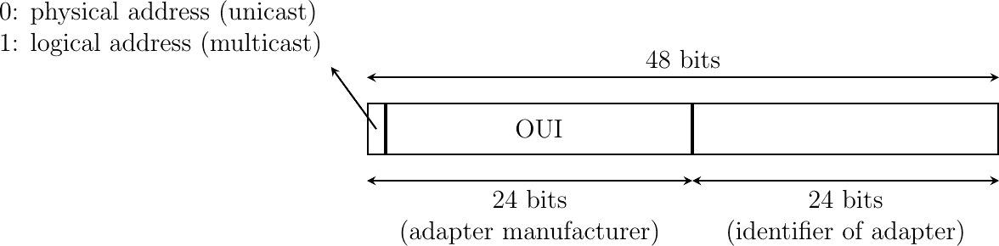
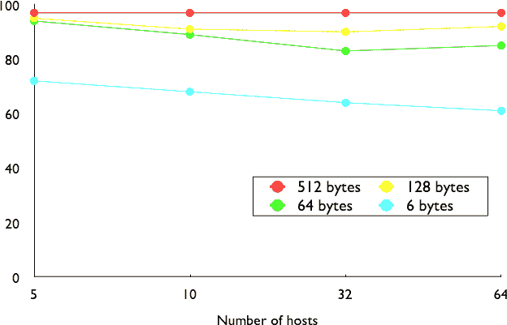
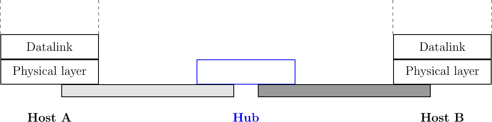
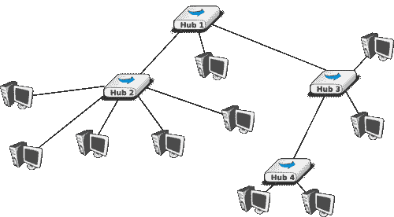
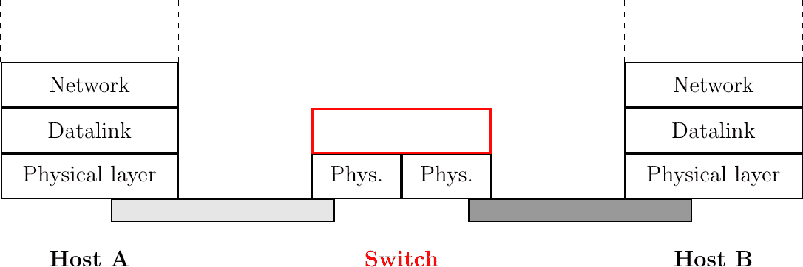
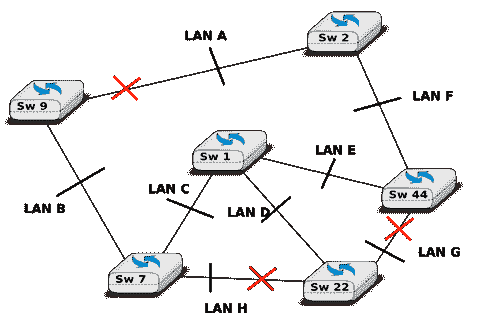
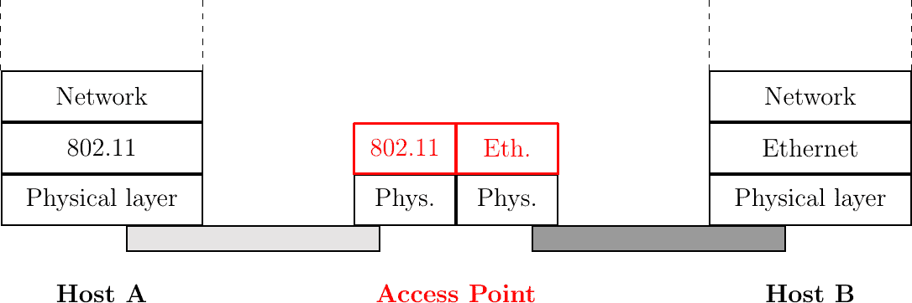
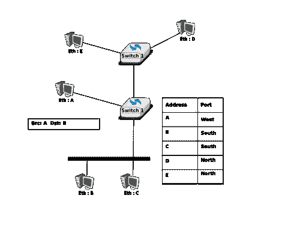
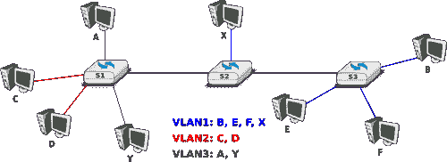

# 数据链路层技术

> [`4ed.computer-networking.info/syllabus/default/networks/lan.html`](https://4ed.computer-networking.info/syllabus/default/networks/lan.html)

在本章中，我们回顾了几种数据链路层技术的关键特性。我们更详细地讨论了今天广泛使用的这些技术。对所有数据链路层技术进行详细调查超出了本书的范围。

## 点对点协议#

从 20 世纪 60 年代开始，已经开发了多种点对点数据链路层[[1]](#flapb)。在本节中，我们专注于通常用于在通过点对点链路直接连接的主机或路由器之间传输 IP 数据包的协议。这种链路可以是一条专用物理电缆，通过电话网络租用的线路，或者两个通信主机上的调制解调器之间的拨号连接。

在[**RFC 1055**](https://datatracker.ietf.org/doc/html/rfc1055.html)中首次提出了在串行线路上传输 IP 数据包的解决方案，被称为串行线路 IP（SLIP）。SLIP 是对 IP 数据包应用的一种简单的字符填充技术。SLIP 定义了两个特殊字符：END（十进制 192）和 ESC（十进制 219）。END 出现在每个传输的 IP 数据包的开始和结束处，发送者在每个传输的 IP 数据包中的每个 END 字符之前添加 ESC。SLIP 仅支持 IP 数据包的传输，并假设两个通信的主机/路由器已经手动配置了彼此的 IP 地址。SLIP 主要在带宽通常小于 20 Kbps 的链路上使用。在这样的低带宽链路上，为每个 TCP 段发送 20 字节的 IP 头部，然后是 20 字节的 TCP 头部，需要花费很多时间。这促使开发了一系列压缩技术，以有效地压缩 TCP/IP 头部。在[**RFC 1144**](https://datatracker.ietf.org/doc/html/rfc1144.html)中提出的第一个头部压缩技术旨在利用属于同一 TCP 连接的几个连续段之间的冗余。在这些所有段中，IP 地址和端口号始终相同。此外，如序列号和确认号等字段不会以随机方式改变。[**RFC 1144**](https://datatracker.ietf.org/doc/html/rfc1144.html)定义了简单的技术来减少连续段中发现的冗余。头部压缩技术的发展仍在继续，现在仍在开发改进技术[**RFC 5795**](https://datatracker.ietf.org/doc/html/rfc5795.html)。

虽然 SLIP 在一些环境中得到了实现和使用，但它存在一些限制，这些限制在[**RFC 1055**](https://datatracker.ietf.org/doc/html/rfc1055.html)中进行了讨论。点对点协议（PPP）在之后不久被设计出来，并在[**RFC 1548**](https://datatracker.ietf.org/doc/html/rfc1548.html)中进行了规范。PPP 旨在支持 IP 和其他网络层协议通过各种类型的串行线路。PPP 实际上是一组三个协议，它们一起使用：

> 1.  点对点协议定义了用于传输网络层数据包的帧技术。
> 1.  
> 1.  链路控制协议，用于通过使用用户名和密码或其他类型的凭证协商选项并验证会话
> 1.  
> 1.  网络控制协议，针对每个网络层协议特定。它用于协商每个协议特定的选项。例如，IPv4 的 NCP [**RFC 1548**](https://datatracker.ietf.org/doc/html/rfc1548.html)可以协商要使用的 IPv4 地址，DNS 解析器的 IPv4 地址。IPv6 的 NCP 在[**RFC 5072**](https://datatracker.ietf.org/doc/html/rfc5072.html)中定义。

PPP 帧格式[**RFC 1662**](https://datatracker.ietf.org/doc/html/rfc1662.html)受到了 ITU-T 和 ISO 标准化的数据链路层协议的启发。一个典型的 PPP 帧由下面图中显示的字段组成。PPP 帧以一个包含 01111110 的一个字节标志开始。PPP 可以根据协议使用的环境使用位填充或字符填充。地址和控制字段的存在是为了向后兼容。16 位的协议字段包含承载在 PPP 帧中的网络层协议的标识符 [[2]](#fpppid)。0x002d 用于使用[**RFC 1144**](https://datatracker.ietf.org/doc/html/rfc1144.html)压缩的 IPv4 数据包，而 0x002f 用于未压缩的 IPv4 数据包。0xc021 由链路控制协议使用，0xc023 由密码认证协议（PAP）使用。0x0057 用于 IPv6 数据包。PPP 支持可变长度的数据包，但 LCP 可以协商最大数据包长度。PPP 帧以帧校验序列结束。默认是 16 位 CRC，但某些实现可以协商 32 位 CRC。帧以 01111110 标志结束。


图. 166 PPP 帧格式#

PPP 在 1990 年代末和 2000 年代初允许互联网服务提供商通过调制解调器提供拨号访问中发挥了关键作用。这些互联网服务提供商运营着连接到电话网络的调制解调器银行。对于这些互联网服务提供商来说，一个关键问题是验证通过电话网络连接的每个用户。这种验证是通过使用在[**RFC 3748**](https://datatracker.ietf.org/doc/html/rfc3748.html)中定义的可扩展认证协议（EAP）来完成的。EAP 是一个简单但可扩展的协议，最初被接入路由器用于验证通过拨号线路连接的用户。已经定义并实现了多种认证方法，从简单的用户名/密码对到更复杂的方案。当互联网服务提供商开始升级其物理基础设施以通过非对称数字用户线（ADSL）提供互联网访问时，他们试图重用他们现有的认证（和计费）系统。为了满足这些要求，IETF 开发了规范，允许 PPP 帧在 PPP 最初设计的点对点链路之外的其他网络上传输。如今，大多数 ADSL 部署都使用 PPP 在 ATM [**RFC 2364**](https://datatracker.ietf.org/doc/html/rfc2364.html)或以太网 [**RFC 2516**](https://datatracker.ietf.org/doc/html/rfc2516.html)上传输。

脚注  ## 以太网#

以太网是在 20 世纪 70 年代在帕洛阿托研究中心设计的 [[Metcalfe1976]](../bibliography.html#metcalfe1976)。第一个原型 [[3]](#fethernethistory) 使用同轴电缆作为共享介质，带宽为 3 Mbps。以太网在 20 世纪 70 年代末和 80 年代得到了改进，数字设备公司、英特尔和施乐发布了第一个官方以太网规范 [[DIX]](../bibliography.html#dix)。该规范定义了以太网网络的一些重要参数。第一个决定是将商业以太网标准化为 10 Mbps。第二个决定是时隙的持续时间。在以太网中，较长的时隙可以使网络跨越更长的距离，但迫使主机使用更大的最小帧大小。妥协方案是时隙为 51.2 微秒，对应的最小帧大小为 64 字节。

第三项决定是帧格式。施乐公司建立的实验性 3 Mbps 以太网网络使用了包含 8 位源和目的地址字段、16 位类型指示、最多 554 字节的负载和 16 位 CRC 的短帧。使用 8 位地址适合于实验网络，但显然对于商业部署来说太小了。尽管最初的以太网规范[[DIX]](../bibliography.html#dix)只允许以太网网络上有最多 1024 个主机，但它也对比当时可用的网络技术提出了三个重要变更。第一个变更要求连接到以太网网络的每个主机都必须有一个全局唯一的链路层地址。在此之前，链路层地址是在每个主机上手动配置的。[[DP1981]](../bibliography.html#dp1981)反对这种做法，并指出“为网络上的主机分配数字也需要适当的安装特定管理程序。如果主机从一个网络移动到另一个网络，如果其旧数字在新网络上已被使用，则可能需要更改其主机号。这比说起来容易，因为每个网络都必须有一个管理员，必须记录系统不断变化的状态（通常是一张贴在墙上的纸 !）。预计在未来办公室环境中，主机位置的变化将像现在办公室中电话的变化一样频繁。”以太网引入的第二个变更是将每个地址编码为 48 位字段[[DP1981]](../bibliography.html#dp1981)。与 20 世纪 80 年代的现有网络技术相比，48 位地址非常大，但巨大的地址空间有几个优点[[DP1981]](../bibliography.html#dp1981)，包括能够将大块地址分配给制造商。最终，其他局域网技术也选择了 48 位地址[[IEEE802]](../bibliography.html#ieee802)。以太网引入的第三个变更是对广播和多播地址的定义。在[[DP1981]](../bibliography.html#dp1981)中预见到了多播以太网的需求，并且由于地址空间的大小，可以为每个制造商预留一大块多播地址。

在以太网网络中使用的数据链路层地址通常被称为 MAC 地址。它们的结构如图图 167 所示。地址的第一位表示该地址是否标识一个网络适配器或一个多播组。高 24 位用于编码一个组织唯一标识符（OUI）。这个 OUI 标识了一个由负责以太网地址唯一性的秘书处[[4]](#foui)分配的地址块。一旦制造商收到一个 OUI，它就可以构建并销售该块中 1600 万个地址之一的产品。

> 
> 
> 图 167 48 位以太网地址格式

原始的 10 Mbps 以太网规范 [[DIX]](../bibliography.html#dix) 定义了一种简单的帧格式，其中每个帧由五个字段组成。以太网帧以预同步（在图 图 169 中未显示）开始，该预同步由接收器的物理层用于与发送器的时钟同步。帧的第一个字段是目标地址。由于此地址位于帧的开头，以太网接口可以快速验证它是否是帧的接收者，如果不是，则取消处理到达的帧。第二个字段是源地址。虽然目标地址可以是单播或组播/广播地址，但源地址必须是单播地址。第三个字段是一个 16 位整数，指示帧内携带哪种类型的网络层数据包。该字段通常称为 EtherType。常用的 EtherType 值 [[5]](#fethertype) 包括 0x0800 用于 IPv4，0x86DD 用于 IPv6 [[6]](#fipv6ether) 和 0x806 用于地址解析协议 (ARP)。

以太网帧的第四部分是有效载荷。有效载荷的最小长度为 46 字节，以确保最小帧大小，包括 512 位的头部。以太网有效载荷的长度不能超过 1500 字节。当首次编写以太网规范时，这个大小被认为是合理的。当时，施乐公司一直在使用其实验性的 3 Mbps 以太网，提供 554 字节的有效载荷，而 [**RFC 1122**](https://datatracker.ietf.org/doc/html/rfc1122.html) 要求 IPv4 的最小 MTU 为 572 字节。1500 字节足够大，可以满足这些需求，而不需要网络适配器包含过大的内存。此外，在以太网网络中进行的模拟和测量研究表明，CSMA/CD 能够实现非常高的利用率。这如图 图 168 所示，基于 [[SH1980]](../bibliography.html#sh1980)，它显示了包含不同数量主机且发送不同大小帧的以太网网络中实现的信道利用率。

(../_images/ethernet-util.png)

图 168 帧长度对最大信道利用率的影响 [[SH1980]](../bibliography.html#sh1980)#

以太网帧的最后一个字段是 32 位的循环冗余校验 (CRC)。这种 CRC 能够捕获比 IP、UDP 和 TCP 使用的互联网校验和更多的传输错误 [[SGP98]](../bibliography.html#sgp98)。以太网帧的格式如图 图 169 所示。

(../_images/ethernet-dix.svg)

图 169 以太网 DIX 帧格式#

注意

帧中的 CRC 应该放在哪里？

传输层和数据链路层通常选择不同的策略来放置它们的 CRC 或校验和。传输层协议通常将它们的 CRC 或校验和放在段头中。数据链路层协议有时将 CRC 放在帧头中，但通常放在帧末尾的尾部。这种选择反映了实现假设，但也影响了性能 [**RFC 893**](https://datatracker.ietf.org/doc/html/rfc893.html)。当 CRC 放在尾部时，如在以太网中，数据链路层可以在发送帧的同时计算它，并在传输结束时插入。今天所有以太网接口都使用这种优化。当校验和放在头部时，如在 TCP 段中，网络接口在发送段时无法计算它。一些网络接口提供硬件辅助来计算 TCP 校验和，但这比如果 TCP 校验和放在尾部要复杂 [[7]](#ftso)。

上文讨论的以太网帧格式由 [[DIX]](../bibliography.html#dix) 规定。这是用于发送 IPv4 [**RFC 894**](https://datatracker.ietf.org/doc/html/rfc894.html) 和 IPv6 数据包 [**RFC 2464**](https://datatracker.ietf.org/doc/html/rfc2464.html) 的格式。在 [[DIX]](../bibliography.html#dix) 发布后，电气和电子工程师协会 (IEEE) 开始标准化几种局域网技术。IEEE 从以太网、令牌环和令牌总线等局域网技术开始工作。这三种技术完全不同，但它们都同意使用最初为以太网指定的 48 位 MAC 地址 [[IEEE802]](../bibliography.html#ieee802)。在开发其以太网标准 [[IEEE802.3]](../bibliography.html#ieee802-3) 的过程中，IEEE 802.3 工作组面临了一个问题。以太网规定最小有效载荷大小为 46 字节，而一些公司正在寻找一种能够透明地传输仅包含几个字节有效载荷的短帧的局域网技术。这样的帧可以通过以太网主机通过填充来发送，以确保有效载荷至少为 46 字节长。然而，由于以太网头部 [[DIX]](../bibliography.html#dix) 中不包含长度字段，接收器无法确定有效载荷字段中放置了多少有用的字节。为了解决这个问题，IEEE 决定用长度字段替换以太网 [[DIX]](../bibliography.html#dix) 头部的类型字段 [[8]](#ftypelen)。这个长度字段包含帧有效载荷中的有用字节数。有效载荷仍然必须包含至少 46 字节，但填充字节由发送方添加并由接收方移除。为了在不显著改变帧格式的情况下添加长度字段，IEEE 必须移除类型字段。没有这个字段，接收主机无法识别接收帧中网络层数据包的类型。为了解决这个新问题，IEEE 开发了一个全新的子层，称为逻辑链路控制 [[IEEE802.2]](../bibliography.html#ieee802-2)。在这个子层中定义了几个协议。其中之一提供了原始以太网帧格式类型字段的略微不同版本。另一个包含了确认和重传，以提供可靠的服务……在实践中，[[IEEE802.2]](../bibliography.html#ieee802-2) 从未用于在以太网网络中支持 IP。图 图 170 显示了官方 [[IEEE802.3]](../bibliography.html#ieee802-3) 帧格式。

](../_images/ethernet-8023.svg)

图 170 802.3 以太网帧格式#

注意

什么是以太网服务？

以太网网络提供了一种不可靠的无连接服务。它支持三种不同的传输模式：单播、多播和广播。虽然以太网服务在理论上不可靠，但在实践中，一个好的以太网网络应该提供以下服务：

+   以非常高的概率将帧成功发送到目的地

+   不重新排序传输的帧

第一个属性是 CSMA/CD（载波侦听多路访问/碰撞检测）利用的结果。第二个属性是以太网网络作为共享总线物理组织的结果。这两个属性非常重要，并且所有对以太网技术的修订都保留了它们。

已经为以太网网络定义了几个物理层。第一个物理层通常称为 10Base5，通过粗同轴电缆提供 10 Mbps 的传输速率。当时使用的电缆和收发器的特性使得 500 米长的段可以被利用。10Base5 网络还可以在段之间包含中继器。

第二个物理层是 10Base2。这个物理层使用的是比 10Base5 电缆更容易安装的细同轴电缆，但其长度不能超过 185 米。还定义了一个 10BaseF 物理层，用于通过点对点光链路传输以太网。物理层的主要变化是在 10BaseT 规范中支持双绞线。双绞线电缆传统上用于支持办公楼中的电话服务。如今，大多数办公楼都配备了结构化布线。在大楼中，任何房间和中央电信室之间或每层楼之间都安装了几条双绞线电缆。这些电信室作为电话服务的集中点，同时也是局域网的集中点。

双绞线的引入导致了以太网的两个主要变化。第一个变化涉及网络的物理拓扑。10Base2 和 10Base5 网络是共享总线，同轴电缆通常穿过每个包含连接计算机的房间。10BaseT 网络是星形网络。连接到网络的全部设备都连接到一条以电信间为终点的双绞线。从维护的角度来看，这是一个重大的改进。电缆是 10Base2 和 10Base5 网络的弱点。任何电缆的物理损坏都会破坏整个网络，当发生此类故障时，网络管理员必须手动检查整个电缆以检测损坏的位置。在 10BaseT 中，当一条双绞线损坏时，只有连接到该双绞线的设备受到影响，这不会影响其他设备。10BaseT 引入的第二个主要变化是，不可能简单地通过连接所有双绞线来构建 10BaseT 网络。所有双绞线都必须连接到一个在物理层操作的继电器。这个继电器被称为以太网集线器。因此，集线器是一个物理层中继器，它在其中一个接口上接收电信号，再生信号并将其通过其所有其他接口传输。一些集线器还能够将一个物理层的电信号转换到另一个物理层（例如，10BaseT 到 10Base2 的转换）。以太网集线器是一个在物理层操作的继电器，如图 图 171 所示。

> 
> 
> 图 171 参考模型中的以太网集线器

计算机可以直接连接到以太网集线器。以太网集线器本身也可以连接到其他以太网集线器以构建更大的网络。然而，在构建由集线器组成的复杂网络时，必须遵循一些重要指南。首先，网络拓扑必须是树形结构。由于集线器是物理层的中继器，在图 图 172 的网络中在 Hub2 和 Hub3 之间添加一个链接将会创建一个电气短路，这将完全破坏网络。这意味着基于集线器的网络中不能有任何冗余。集线器或两个集线器之间的链接故障会将网络分割成两个孤立的网络。其次，由于集线器是物理层的中继器，可能会发生冲突，并且必须像在 10Base5 网络中那样由 CSMA/CD 处理。这意味着网络中任何一对设备之间的最大延迟不能超过 51.2 微秒的时隙时间。如果延迟更长，短帧之间的冲突可能无法正确检测。这个约束限制了包含集线器的 10BaseT 网络的地理分布。



图. 172 由集线器组成的分层以太网网络#

在 20 世纪 80 年代末，对于某些应用来说，10 Mbps 的速度变得太慢，因此网络制造商开发了多种局域网技术，提供了更高的带宽，例如使用光纤的 100 Mbps FDDI 局域网。随着 10Base5、10Base2 和 10BaseT 的发展，已经表明以太网可以适应不同的物理层，几家制造商开始致力于 100 Mbps 以太网，并说服 IEEE 标准化这一新技术，最初称为快速以太网。快速以太网在设计时受到两个约束。首先，快速以太网必须支持双绞线。尽管从物理层角度来看，在双绞线上支持比在同轴电缆上支持更高的带宽更容易，但同轴电缆在部署和维护方面是一个噩梦。其次，快速以太网必须与现有的 10 Mbps 以太网完全兼容，以便快速以太网技术最初可以作为骨干技术来互连 10 Mbps 以太网网络。这迫使快速以太网使用与 10 Mbps 以太网完全相同的帧格式。这意味着最小快速以太网帧大小保持在 512 位。为了保持最小帧大小为 512 位，并且将速率从 10 Mbps 提高到 100 Mbps，时隙时间被减少到 5.12 微秒。

以太网的演变并未停止。1998 年，IEEE 发布了一个最初标准，以提供通过光纤的千兆以太网。之后又增加了几种其他类型的物理层。2002 年出现了[10 千兆以太网](http://en.wikipedia.org/wiki/10_gigabit_Ethernet)标准。目前正在开发 40 千兆和 100 千兆以太网的标准，有些人正在考虑[太比特以太网](http://www.networkworld.com/news/2009/042009-terabit-ethernet.html)。下表列出了主要的以太网标准。更详细的列表可以在[`en.wikipedia.org/wiki/Ethernet_physical_layer`](http://en.wikipedia.org/wiki/Ethernet_physical_layer)找到。

| 标准 | 备注 |
| --- | --- |
| 10Base5 | 厚同轴电缆，500m |
| 10Base2 | 薄同轴电缆，185m |
| 10BaseT | 两对 3 类以上非屏蔽双绞线 |
| 10Base-F | 通过光纤的 10 Mb/s |
| 100Base-Tx | 5 类或超 5 类非屏蔽双绞线或屏蔽双绞线，最大距离 100 m |
| 100Base-FX | 两种多模光纤，最大距离 2 km |
| 1000Base-CX | 两对屏蔽双绞线，最大距离 25m |
| 1000Base-SX | 两种多模或单模光纤，带有激光 |
| 10 Gbps | 光纤以及 6 类非屏蔽双绞线 |
| 40-100 Gbps | 光纤（实验使用铜线） |

脚注

### 以太网交换机#

在快速以太网中增加物理层带宽只是提高以太网局域网性能的解决方案之一。第二个解决方案是用更智能的设备替换集线器。由于以太网集线器在物理层工作，它们只能再生电信号以扩展网络的地理覆盖范围。从性能角度来看，拥有在数据链路层工作并能分析每个帧的目的地址并选择性地在通往目的地的链路上转发帧的设备会更感兴趣。这类设备通常被称为以太网交换机 [[9]](#fbridges)。以太网交换机是一种在数据链路层工作的中继器，如图 图 173 所示。

> 
> 
> 图 173 参考模型中的以太网交换机

以太网交换机理解以太网帧的格式，并且可以针对每个接口选择性地转发帧。为此，每个以太网交换机维护一个 MAC 地址表。该表包含，对于交换机所知的每个 MAC 地址，一个标识符，表示发送到该地址的帧必须通过哪个交换机端口转发才能到达其目的地。这如图 图 174 中的底部交换机的 MAC 地址表所示。当交换机收到一个目的地为 B 的帧时，它会在其南端口转发该帧。如果它收到一个目的地为 D 的帧，它只会在其北端口转发该帧。


图 174 以太网交换机的工作原理#

以太网网络的一个卖点是由于使用了 48 位 MAC 地址，以太网局域网在数据链路层上可以即插即用。当两个主机连接到同一个以太网段或集线器时，它们可以立即交换以太网帧，而无需任何配置。对于以太网交换机来说，保留这种即插即用能力也很重要。这意味着以太网交换机必须能够自动构建它们的 MAC 地址表，而无需任何手动配置。这种自动配置是通过运行在每个以太网交换机上的 MAC 地址学习算法来完成的。该算法提取接收到的帧的源地址，并记住每个源以太网地址的帧是通过哪个端口接收到的。这些信息被插入到交换机使用的 MAC 地址表中，用于转发帧。这允许交换机自动学习它可以使用哪些端口到达每个目标地址，前提是此主机之前至少发送了一个帧。这并不是问题，因为大多数上层协议在某个层使用确认，因此即使是以太网打印机也会发送以太网帧。

下面的伪代码详细说明了以太网交换机如何转发以太网帧。它首先使用帧的源地址更新其 MAC 地址表。某些交换机使用的 MAC 地址表还包含一个时间戳，每次从每个已知源地址接收帧时都会更新。这个时间戳用于从 MAC 地址表中删除在过去 n 分钟内未活跃的条目。这限制了 MAC 地址表的增长，但同时也允许主机从一个端口移动到另一个端口。交换机使用其 MAC 地址表来转发接收到的单播帧。如果 MAC 地址表中存在帧目标地址的条目，则该帧将根据此条目中列出的端口进行选择性转发。否则，交换机不知道如何到达目标地址，它必须在除了接收帧的端口之外的所有端口上转发该帧。这确保了帧将到达其目标，但代价是会有一些不必要的传输。这些不必要的传输只会持续到目标发送其第一个帧。多播和广播帧也以类似的方式转发。

```sh
# Arrival of frame F on port P
# Table : MAC address table dictionary : addr->port
# Ports : list of all ports on the switch
src = F.SourceAddress
dst = F.DestinationAddress
Table[src] = P  #  src heard on port P
if is_unicast(dst):
    if dst in Table:
        forward_frame(F, Table[dst])
    else:
        for o in Ports:
          if o != P:
               forward_frame(F, o)
else:
    # multicast or broadcast destination
    for o in Ports:
        if o != P:
            forward_frame(F, o) 
```

注意

以太网集线器和交换机的安全问题

从安全角度来看，以太网集线器与较老的同轴电缆具有相同的缺点。连接到集线器的主机将能够捕获连接到同一集线器的任何一对主机之间交换的所有帧。由于选择性转发，以太网交换机在这方面要好得多，因为主机通常只会接收到目的地为自身的帧以及多播、广播和未知帧。然而，这并不意味着交换机是完全安全的。不幸的是，存在针对以太网交换机的攻击。从安全角度来看，MAC 地址表是以太网交换机的一个脆弱元素。这个表的大小是固定的。一些低端交换机可以存储几十个或几百个地址，而高端交换机可以存储数万个或更多的地址。从安全角度来看，有限的资源可能成为拒绝服务攻击的目标。不幸的是，这种攻击在以太网交换机上也是可能的。恶意主机可以通过生成带有随机源地址的数千个帧来溢出交换机的 MAC 地址表。一旦 MAC 地址表满了，交换机需要广播它接收到的所有帧。此时，攻击者将接收到不是发送给其地址的单播帧。上一章讨论的 ARP 攻击也可能发生在以太网交换机上 [[Vyncke2007]](../bibliography.html#vyncke2007)。最近的交换机实现了多种防御这些攻击的类型，但它们需要网络管理员仔细配置。参见 [[Vyncke2007]](../bibliography.html#vyncke2007) 以了解以太网交换机安全问题的详细讨论。

将 MAC 地址学习算法与转发算法结合使用在树形网络（如上图所示）中效果良好。然而，为了处理链路和交换机故障，网络管理员通常会添加冗余链路以确保网络在故障后仍然保持连接。让我们考虑一下图 图 175 中所示以太网网络会发生什么。


图 175 环形以太网交换机#

当所有交换机启动时，它们的 MAC 地址表都是空的。假设主机 A 向主机 C 发送一个帧。在接收到这个帧后，switch1 更新其 MAC 地址表以记住地址 A 可以通过其西端口到达。由于 switch1 的 MAC 地址表中没有地址 C 的条目，因此该帧被转发到 switch2 和 switch3。当 switch2 接收到帧时，它更新地址 A 的 MAC 地址表并将帧转发到主机 C 以及 switch3。因此，switch3 收到了两个相同的帧。由于 switch3 不知道如何到达目标地址，它将来自 switch1 的帧转发到 switch2，并将来自 switch2 的帧转发到 switch1……主机 A 发送的单个帧将被交换机不断复制，直到它们的 MAC 地址表中包含地址 C 的条目。很快，所有可用的链路带宽都将被用来转发这个帧的所有副本。由于以太网不包含任何 TTL 或跳数限制，这个环路将永远不会停止。

MAC 地址学习算法允许交换机即插即用。不幸的是，当网络拓扑不是树形时产生的环路是一个严重的问题。强迫交换机只能作为树形网络的中心使用将是一个严重的限制。为了解决这个问题，以太网交换机的发明者开发了生成树协议。该协议允许交换机自动关闭以太网交换机上的端口，以确保网络不包含任何可能导致帧无限循环的环路。

脚注

### 生成树协议（802.1d）#

生成树协议（STP），由[[Perlman1985]](../bibliography.html#perlman1985)提出，是一种分布式协议，交换机使用该协议将网络拓扑简化为生成树，从而在拓扑中不存在环路。例如，考虑图图.176 中所示的网络。在这个图中，每条粗线对应一个连接了两个以太网交换机的以太网。这个网络包含几个必须打破的环路，以便使用 MAC 地址学习算法的以太网交换机交换帧。



图.176 在交换式以太网网络中计算的生成树#

在这个网络中，STP 将计算以下生成树。Switch1 将是树的根。Switch1、Switch2 和 Switch7 的所有接口都是生成树的一部分。只有连接到 LAN B 的接口将在 Switch9 上激活。LAN H 只由 Switch7 服务，LAN G 上 Switch44 的端口将被禁用。一个从 LAN B 发起并指向 LAN A 的帧将通过 Switch7 在 LAN C 上转发，然后通过 Switch1 在 LAN E 上转发，然后通过 Switch44 在 LAN F 上转发，最终通过 Switch2 在 LAN A 上转发。

运行生成树协议的交换机交换 BPDUs。这些 BPDUs 总是以带有 ALL_BRIDGES 保留组播 MAC 地址的 MAC 地址作为目标地址的帧发送。每个交换机都有一个唯一的 64 位标识符。为确保唯一性，标识符的低位 48 位被设置为制造商分配给交换机的唯一 MAC 地址。交换机标识符的高位 16 位可以由网络管理员配置，以影响生成树的拓扑。这些高位位的默认值是 32768。

交换机交换 BPDUs 以构建生成树。直观地，生成树是通过首先选择具有最小标识符的交换机作为树的根来构建的。生成树的分支由允许到达构成网络的全部交换机的最短路径组成。交换机之间交换的 BPDUs 包含以下信息：

> +   根交换机的标识符（R）
> +   
> +   发送 BPDU 的交换机和根交换机之间的最短路径的成本（c）
> +   
> +   发送 BPDU 的交换机标识符（T）
> +   
> +   发送 BPDU 的交换机端口号（p）

我们将使用 <R,c,T,p> 表示一个根标识符为 R、成本为 c 并且是从交换机 T 的端口 p 发送的 BPDU。生成树的构建取决于 BPDU 之间的排序关系。这种排序关系可以通过下面的 Python 函数实现。

```sh
# returns True if bpdu b1 is better than bpdu b2
def  better(b1, b2):
    return ((b1.R < b2.R) or
            ((b1.R == b2.R) and (b1.c < b2.c)) or
            ((b1.R == b2.R) and (b1.c == b2.c) and (b1.T < b2.T)) or
            ((b1.R == b2.R) and (b1.c == b2.c) and (b1.T == b2.T) and (b1.p < b2.p))) 
```

除了上述标识符之外，网络管理员还可以为每个交换机端口配置一个与之关联的成本。通常，端口的成本取决于其带宽，IEEE802.1d 标准建议以下值。当然，网络管理员可以选择其他值。我们将使用 cost[p] 表示本节中与端口 p 关联的成本。

| 带宽 | 成本 |
| --- | --- |
| 10 Mbps | 2000000 |
| 100 Mbps | 200000 |
| 1 Gbps | 20000 |
| 10 Gbps | 2000 |
| 100 Gbps | 200 |

生成树协议使用其自己的术语，我们在上面的图中进行了说明。交换机端口可以处于三种不同的状态：根、指定和阻塞。根交换机的所有端口都处于指定状态。其他交换机端口的状态基于每个端口接收到的 BPDU 确定。

生成树协议使用排序关系来构建生成树。每个交换机在其端口上监听 BPDUs。当 BPDU = <R,c,T,p> 在端口 q 上接收时，交换机计算该端口的根优先级向量：V[q] = <R,c+cost[q],T,p,q>，其中 cost[q] 是与接收 BPDU 的端口相关的成本。交换机在表中存储每个端口上接收到的最后一个根优先级向量。然后，交换机将其自己的标识符与表中存储的最小根标识符进行比较。如果其自己的标识符更小，则该交换机是生成树的根，并且根据定义，距离根的距离为 0。因此，该交换机的 BPDU 是 <R,0,R,p>，其中 R 是交换机标识符，p 将设置为发送 BPDU 的端口编号。

否则，交换机从其表中选择最佳优先级向量，bv = <R,c+cost[q’],T,p,q’>。通过此最佳根优先级向量学习的端口 q’，是距离根交换机最近的交换机端口。该端口成为交换机的根端口。每个交换机只有一个根端口（除了根交换机的端口都是指定端口的情况）。然后，交换机可以计算自己的 BPDU，BPDU = <R,c’，S,p>，其中 R 是根标识符，c’ 是最佳根优先级向量的成本，S 是交换机标识符，p 将被替换为发送 BPDU 的端口编号。

为了确定其其他端口的状态，交换机将其自己的 BPDU 与每个端口上接收到的最后一个 BPDU 进行比较。请注意，比较是通过使用 BPDU 而不是根优先级向量进行的。如果交换机的 BPDU 比此端口的最后一个 BPDU 更好，则该端口变为指定端口。否则，该端口变为阻塞端口。

在考虑 BPDUs 传输时，每个端口的状况都很重要。根交换机定期将其自己的 BPDU 通过其所有（指定）端口发送。这个 BPDU 被所有直接连接到根交换机的交换机的根端口接收。这些交换机中的每一个都会计算自己的 BPDU，并通过其所有指定端口发送这个 BPDU。然后，这些 BPDU 被下游交换机的根端口接收，这些交换机随后计算自己的 BPDU，等等。当网络拓扑稳定时，交换机在其所有指定端口上发送自己的 BPDU，一旦它们在其根端口上接收到 BPDU。在阻塞端口上不会发送 BPDU。交换机在其阻塞和指定端口上监听 BPDUs，但在拓扑稳定时，不应通过这些端口接收任何 BPDU。端口用于 BPDUs 和数据帧的利用率总结在下表。

| 端口状态 | 接收 BPDUs | 发送 BPDU | 处理数据帧 |
| --- | --- | --- | --- |
| 阻塞 | 是 | 否 | 否 |
| 根 | 是 | 否 | 是 |
| 指定 | 是 | 是 | 是 |

为了说明生成树协议的操作，让我们考虑图 图 177 中的简单网络拓扑。


图 177 在交换式以太网网络中计算的简单生成树#

假设 Switch4 是第一个启动的。它在端口 1 上发送自己的 BPDU = <4,0,4,1>（或 BPDU = <4,0,4,2>）。当 Switch1 启动时，它发送 BPDU = <1,0,1,1>。这个 BPDU 被 Switch4 接收，它更新其 BPDU 和根优先级向量表，并在端口 1 上（或端口 2 上）计算新的 BPDU = <1,3,4,1>（或 BPDU = <1,3,4,2>）。实际上，只有一个根优先级向量，因此它是最好的。Switch4 的端口 1 成为根端口，而其第二个端口仍然处于指定状态。

假设现在 Switch9 启动并立即在端口 1 上接收到 Switch1 的 BPDU。Switch9 在端口 1 上计算自己的 BPDU = <1,1,9,1>（或 BPDU = <1,1,9,2>）并在端口 2 上（或端口 2 上）计算 BPDU，端口 1 成为此交换机的根端口。BPDU 在 Switch9 的端口 2 上发送并到达 Switch4。Switch4 比较优先级向量。它注意到最后一个计算的向量（即 V[2] = <1,2,9,2,2>）比 V[1] = <1,3,1,1,1>更好。因此，Switch4 的 BPDU 被重新计算，端口 2 成为 Switch4 的根端口。Switch4 将其新的 BPDU = <1,2,4,p>与每个端口上接收到的最后一个 BPDU（除了根端口）进行比较。端口 1 在 Switch4 上成为阻塞端口，因为在此端口上接收到的 BPDU=<1,0,1,1>更好。

在计算生成树期间，交换机丢弃所有接收到的数据帧，因为那时网络拓扑不保证是无环的。一旦拓扑稳定了一段时间，交换机再次开始使用 MAC 学习算法转发数据帧。只有根端口和指定端口用于转发数据帧。交换机丢弃其阻塞端口上接收到的所有数据帧，并且从不在这类端口上转发帧。

在交换式以太网网络中，交换机、端口和链路可能会出现故障。当发生故障时，交换机必须能够重新计算生成树以从故障中恢复。生成树协议依赖于 BPDUs（桥接协议数据单元）的定期传输来检测这些故障。BPDU 包含两个附加字段：BPDU 的年龄和最大年龄。年龄表示自根交换机最初生成 BPDU 以来经过的时间量。根交换机以年龄为零发送其 BPDU，每个计算自己 BPDU 的交换机将其年龄增加一。交换机上存储的 BPDU 年龄每秒也会增加。当 BPDU 的年龄达到最大年龄时，BPDU 将过期。当网络稳定时，这不会发生，因为 BPDU 由根交换机和下游交换机定期发送。然而，如果根交换机出现故障或网络变得分裂，BPDU 将过期，交换机将重新计算自己的 BPDU 并重新启动生成树协议。一旦检测到拓扑变化，数据帧的转发将停止，因为无法保证拓扑是无环的。有关对故障的反应的更多详细信息，请参阅 [[IEEE802.1d]](../bibliography.html#ieee802-1d)。

### 虚拟局域网#

以太网交换机的另一个重要优点是能够创建虚拟局域网（VLAN）。虚拟局域网可以定义为连接到一个或多个以太网交换机的一组端口。交换机可以支持多个 VLAN，并为每个虚拟局域网运行一个 MAC 学习算法。当交换机收到一个具有未知或组播目的地的帧时，它将转发到属于同一虚拟局域网的端口，但不转发到属于其他虚拟局域网的端口。同样，当交换机在端口上学习到一个源地址时，它将该地址关联到该端口的虚拟局域网，并在转发该虚拟局域网上的帧时使用此信息。

图 图 178 展示了一个包含三个虚拟局域网（VLAN）的交换式以太网网络。VLAN2 和 VLAN3 只需要交换机 S1 的本地配置。主机 C 可以与主机 D 交换帧，但不能与它所在 VLAN 外的主机交换帧。VLAN1 更为复杂，因为这个 VLAN 的端口分布在几个交换机上。为了支持这样的 VLAN，仅本地配置已不再足够。当交换机从另一个交换机接收帧时，它必须能够确定帧的来源 VLAN，以便使用正确的 MAC 表来转发帧。这是通过为每个虚拟局域网分配一个标识符，并将此标识符放置在交换机之间交换的帧的头部来实现的。


图 178 交换式以太网网络中的虚拟局域网#

IEEE 在 [[IEEE802.1q]](../bibliography.html#ieee802-1q) 标准中定义了一个特殊的头部来编码 VLAN 标识符。这个 32 位头部包括一个 12 位的 VLAN 字段，它包含每个帧的 VLAN 标识符。[[IEEE802.1q]](../bibliography.html#ieee802-1q) 头部的格式如图 图 179 所示。


图 179 802.1q 头部格式#

[[IEEE802.1q]](../bibliography.html#ieee802-1q) 头部被插入到以太网帧中的源 MAC 地址之后（即在 EtherType 字段之前）。最大帧大小增加了 4 个字节。它以 32 位编码，包含四个字段。标签协议标识符被设置为 0x8100，以便接收器检测到这个附加头部的存在。优先级代码点（PCP）是一个三位字段，用于支持帧的不同传输优先级。值 0 是最低优先级，值 7 是最高优先级。具有较高优先级的帧可以期望比具有较低优先级的帧更早地转发。C 位用于以太网和令牌环网络之间的兼容性。802.1q 头部的最后 12 位包含 VLAN 标识符。值 0 表示帧不属于任何 VLAN，而值 0xFFF 是保留的。这意味着在以太网网络中可以使用 4094 个不同的 VLAN 标识符。

## 802.11 无线网络#

无线电频谱是一种有限的资源，必须由每个人共享。在二十世纪的绝大部分时间里，政府和国际组织已经监管了大部分的无线电频谱。这种监管控制了无线电频谱的利用，以防止不同用户之间的干扰。任何想要在特定区域使用频段范围的公司必须向监管机构申请许可证。大多数监管机构对无线电频谱的利用收取费用，一些政府鼓励对同一频段进行投标的公司之间的竞争，以增加许可证费用。

在 20 世纪 70 年代，在首次进行 ALOHANet 实验之后，对无线网络产生了兴趣。许多实验在 ARPANet 内部和外部进行。其中之一是[第一台移动电话](http://news.bbc.co.uk/2/hi/programmes/click_online/8639590.stm)，它在 1973 年被开发和测试。这款实验性移动电话是第一代模拟移动电话的起点。鉴于对移动电话不断增长的需求，很明显，模拟移动电话技术不足以支持大量用户。为了支持更多用户和新服务，几个国家的科研人员致力于数字移动电话的开发。1987 年，几个欧洲国家决定开发一个覆盖整个欧洲的共同蜂窝电话系统标准：全球移动通信系统（GSM）。从那时起，这些标准已经发展，今天超过 30 亿用户连接到了 GSM 网络上。

尽管无线电频谱的大部分频段被保留用于特定应用并需要特殊许可证，但也有一些例外。这些例外被称为[工业、科学和医疗](http://en.wikipedia.org/wiki/ISM_band)（ISM）无线电频段。这些频段可以用于工业、科学和医疗应用，而无需从监管机构获得许可证。例如，一些无线电遥控模型使用 27 MHz ISM 频段，一些无绳电话在 915 MHz ISM 频段工作。1985 年，2.400-2.500 GHz 频段被添加到 ISM 频段列表中。这个频段对应于微波炉发出的频率。考虑到使用的微波炉数量众多，与授权应用共享这个频段可能会引起干扰。尽管存在与微波炉干扰的风险，但 2.400-2.500 GHz 频段的开放使得网络行业能够开发几种无线网络技术，允许计算机在不使用电缆的情况下交换数据。在本节中，我们将更详细地讨论最受欢迎的一种，即 WiFi [[IEEE802.11]](../bibliography.html#ieee802-11)无线网络家族。其他无线网络技术，如[蓝牙](http://en.wikipedia.org/wiki/BlueTooth)或[HiperLAN](http://en.wikipedia.org/wiki/HiperLAN)，使用相同的频段。

今天，WiFi 是一种非常流行的无线网络技术。WiFi 设备超过数亿台。这项技术的发展始于 20 世纪 80 年代末的[WaveLAN](http://en.wikipedia.org/wiki/WaveLAN)专有无线网络。WaveLAN 在 2 Mbps 的速度下运行，并在世界不同地区的不同频段上工作。在 20 世纪 90 年代初，[IEEE](https://www.ieee.org)创建了[802.11 工作组](http://www.ieee802.org/11/)，以标准化一系列无线网络技术。这个工作组非常活跃，产生了多个使用不同频段和不同物理层的无线网络标准。下表提供了主要 802.11 标准的总结。

| 标准 | 频率 | 典型吞吐量 | 最大带宽 | 范围（室内/室外） |
| --- | --- | --- | --- | --- |
| 802.11 | 2.4 GHz | 0.9 Mbps | 2 Mbps | 20/100 |
| 802.11a | 5 GHz | 23 Mbps | 54 Mbps | 35/120 |
| 802.11b | 2.4 GHz | 4.3 Mbps | 11 Mbps | 38/140 |
| 802.11g | 2.4 GHz | 19 Mbps | 54 Mbps | 38/140 |
| 802.11n | 2.4/5 GHz | 74 Mbps | 150 Mbps | 70/250 |

在开发其标准系列时，[IEEE 802.11 工作组](http://www.ieee802.org/11/)采取了与[IEEE 802.3 工作组](http://www.ieee802.org/3/)类似的方法，后者为以太网网络开发了各种类型的物理层。802.11 网络使用前面描述的 CSMA/CA 介质访问控制技术，并且它们都假设相同的架构并使用相同的帧格式。

WiFi 网络的架构与我们至今讨论的局域网略有不同。实际上，WiFi 网络主要有两种类型：独立或 ad-hoc 网络和基础设施网络[[10]](#fbss)。一个独立或 ad-hoc 网络由一组相互通信的设备组成。这些设备扮演相同的角色，ad-hoc 网络通常不连接到全球互联网。当例如几台笔记本电脑需要交换信息或连接一台计算机到 WiFi 打印机时，会使用 ad-hoc 网络。


图 180 一个 802.11 独立或 ad-hoc 网络#

大多数 WiFi 网络是基础设施网络。一个基础设施网络包含一个或多个接入点，这些接入点连接到一个固定的局域网（通常是一个以太网网络），该网络连接到其他网络，如互联网。图`fig-wifi-infra`显示了这样一个网络，有两个接入点和四个 WiFi 设备。每个 WiFi 设备都与一个接入点关联，并使用该接入点作为中继，与其他接入点关联的设备或通过局域网可达的设备交换帧。


图 181 802.11 基础设施网络#

802.11 接入点是一个在链路层像交换机一样工作的中继。图 `fig-wifi-ap` 表示当 WiFi 主机通过接入点与连接到以太网网络的宿主机通信时，涉及的参考模型层。

> 
> 
> 图 182 802.11 接入点

802.11 设备交换可变长度的帧，这些帧的结构与以太网局域网中使用的简单帧格式略有不同。我们回顾了 802.11 帧的关键部分。更多详细信息可以在 [[IEEE802.11]](../bibliography.html#ieee802-11) 和 [[Gast2002]](../bibliography.html#gast2002) 中找到。一个 802.11 帧包含一个固定长度的头部、一个可变长度的有效载荷，可能包含多达 2324 字节的用户数据，以及一个 32 位的 CRC 校验和。尽管有效载荷可以包含多达 2324 字节，但大多数 802.11 部署使用最大有效载荷大小为 1500 字节，因为它们用于连接到以太网局域网的基础设施网络。802.11 数据帧如图 `fig-80211-packet` 所示。


图 183 802.11 数据帧格式#

802.11 头部的前一部分是 16 位的帧控制字段。该字段包含指示帧类型（数据帧、RTS/CTS、确认、管理帧等）、帧是否发送到或来自固定 LAN 等标志。持续时间是一个 16 位的字段，用于保留传输通道。在数据帧中，持续时间字段通常设置为在 SIFS 延迟后传输一个确认帧所需的时间。请注意，在多播和广播帧中，持续时间字段必须设置为 0。因为这些帧不需要确认，所以在传输后没有必要保留传输通道。序列控制字段包含一个 12 位的序列号，该序列号在每个数据帧中递增，以及一个 4 位的分段号。

精明的读者可能已经注意到，802.11 数据帧包含三个 48 位的地址字段 [[11]](#f4addresses)。与其他网络和链路层协议相比，这些协议的头部只包含源地址和目的地址，这一点令人惊讶。802.11 头部中第三个地址的需求来自基础设施网络。在这样的网络中，帧通常在连接到 LAN 的路由器和服务器之间以及连接到接入点之一的 WiFi 设备之间交换。三个地址字段的作用由帧控制字段中的位标志指定。

当一个帧从一个 WiFi 设备发送到连接到同一 LAN 的服务器时，帧的第一个地址设置为接入点的 MAC 地址，第二个地址设置为源 WiFi 设备的 MAC 地址，第三个地址是 LAN 上的最终目的地地址。当服务器回复时，它发送一个以太网帧，其源地址是其 MAC 地址，目的地址是 WiFi 设备的 MAC 地址。这个帧被接入点捕获，并将以太网头部转换为 802.11 帧头部。接入点发送的 802.11 帧包含三个地址：第一个地址是目的 WiFi 设备的 MAC 地址，第二个地址是接入点的 MAC 地址，第三个地址是发送帧的服务器的 MAC 地址。

802.11 控制帧比数据帧简单。它们包含一个帧控制字段、一个持续时间字段和一个或两个地址。确认帧非常小。它们只包含确认帧目的地的地址。确认帧中没有源地址和序列控制字段。这是因为确认帧可以很容易地与它所确认的上一帧关联。确实，每个单播数据帧都包含一个用于保留传输通道以确保不会影响确认帧的碰撞的持续时间字段。序列控制字段主要被接收方用于移除重复帧。重复帧的检测方法如下。每个数据帧在序列控制字段中包含一个 12 位序列号，帧控制字段包含重试位标志，当帧被发送时设置。每个 802.11 接收器存储来自每个源地址的最新序列号，这些帧的 Retry 位被重置。当接收到一个 Retry 位被设置的帧时，接收器验证其序列号以确定它是否是重复帧。


图 184 IEEE 802.11 ACK 和 CTS 帧#

802.11 RTS/CTS 帧用于保留传输通道，以便传输一个数据帧及其确认帧。RTS 帧包含一个持续时间字段和发送方与接收方地址。RTS 帧的持续时间字段表示整个保留时间（即传输 CTS、数据帧、确认帧和所需的 SIFS 延迟所需的时间）。CTS 帧的格式与确认帧相同。


图 185 IEEE 802.11 RTS 帧格式#

注意

802.11 服务

尽管使用了确认，但 802.11 层仅提供类似于不使用确认的以太网网络的不可靠无连接服务。802.11 确认用于最小化帧重复的概率。它们不能保证所有帧都将被正确接收。像以太网一样，802.11 网络提供成功传输帧的高概率，而不是保证。此外，应注意 802.11 网络不使用确认进行多播和广播帧。这意味着在实践中，此类帧比单播帧更容易出现传输错误。

除了我们上面简要描述的数据和控制帧之外，802.11 网络还使用几种类型的管理帧。这些管理帧用于各种目的。以下简要描述了一些这些帧。更详细的讨论可以在[[IEEE802.11]](../bibliography.html#ieee802-11)和[[Gast2002]](../bibliography.html#gast2002)中找到。

第一种类型的管理帧是信标帧。这些帧由接入点定期广播。每个信标帧包含有关接入点功能的信息（例如，支持的 802.11 传输速率）以及一个服务集标识符（SSID）。SSID 是一个以空字符终止的 ASCII 字符串，可以包含多达 32 个字符。接入点可能支持多个 SSID 并在信标帧中宣布它们。接入点也可能选择保持沉默，不广播信标帧。在这种情况下，WiFi 站点可能会发送探测请求帧，迫使可用的接入点返回探测响应帧。

注意

802.11 上的 IP

为了在以太网网络中支持 IP，定义了两种封装方案：原始封装方案，建立在以太网 DIX 格式之上，在[**RFC 894**](https://datatracker.ietf.org/doc/html/rfc894.html)中定义；第二种封装[**RFC 1042**](https://datatracker.ietf.org/doc/html/rfc1042.html)方案，建立在 LLC/SNAP 协议[[IEEE802.2]](../bibliography.html#ieee802-2)之上。在 802.11 网络中，情况更简单，仅使用[**RFC 1042**](https://datatracker.ietf.org/doc/html/rfc1042.html)封装。实际上，这种封装在 802.11 头部增加了 6 个字节。前四个字节对应于 LLC/SNAP 头部。它们后面跟着两个字节的以太网类型字段（0x800 用于 IP，0x806 用于 ARP）。图`fig-ip-80211`显示了封装在 802.11 帧中的 IP 数据包。


图 186 IP 通过 IEEE 802.11#

管理帧的第二项重要用途是允许 WiFi 站点与接入点关联。当 WiFi 站点启动时，它会监听信标帧以找到可用的 SSID。要允许通过接入点发送和接收帧，WiFi 站点必须与该接入点关联。如果接入点不使用任何安全机制来保护无线传输，WiFi 站点只需向其首选接入点（通常是它接收到的具有最强无线电信号的接入点）发送一个关联请求帧。此帧包含 WiFi 站点选择的某些参数以及它请求加入的 SSID。如果接入点接受该 WiFi 站点，它会用一个关联响应帧回复。

脚注

## 点对点协议#

从 20 世纪 60 年代开始，已经开发了多种点对点数据链路层[[1]](#flapb)。在本节中，我们关注的是通常用于在通过点对点链路直接连接的主机或路由器之间传输 IP 数据包的协议。这种链路可以是一条专用物理电缆、通过电话网络租用的线路，或者两个通信主机上的调制解调器之间的拨号连接。

在 [**RFC 1055**](https://datatracker.ietf.org/doc/html/rfc1055.html) 中提出了在串行线上传输 IP 分组的第一个解决方案，被称为串行线路 IP (SLIP)。SLIP 是一种应用于 IP 分组的简单字符填充技术。SLIP 定义了两个特殊字符：END（十进制 192）和 ESC（十进制 219）。END 出现在每个传输的 IP 分组的开始和结束处，发送者在每个传输的 IP 分组中的每个 END 字符之前添加 ESC。SLIP 只支持 IP 分组的传输，并假设两个通信的主机/路由器已经手动配置了彼此的 IP 地址。SLIP 主要用于带宽通常低于 20 Kbps 的链路上。在这样的低带宽链路上，为每个 TCP 段发送 20 字节的 IP 头部，然后是 20 字节的 TCP 头部，需要花费很多时间。这促使一系列压缩技术被开发出来，以有效地压缩 TCP/IP 头部。在 [**RFC 1144**](https://datatracker.ietf.org/doc/html/rfc1144.html) 中提出的第一个头部压缩技术旨在利用属于同一 TCP 连接的几个连续段之间的冗余。在这些所有段中，IP 地址和端口号始终相同。此外，如序列号和确认号等字段不会以随机方式改变。[**RFC 1144**](https://datatracker.ietf.org/doc/html/rfc1144.html) 定义了简单的技术来减少连续段中发现的冗余。头部压缩技术的发展仍在继续，现在仍在开发改进技术 [**RFC 5795**](https://datatracker.ietf.org/doc/html/rfc5795.html)。

虽然 SLIP 在一些环境中得到了实施和使用，但它存在一些限制，这些限制在 [**RFC 1055**](https://datatracker.ietf.org/doc/html/rfc1055.html) 中进行了讨论。点对点协议（PPP）随后被设计出来，并在 [**RFC 1548**](https://datatracker.ietf.org/doc/html/rfc1548.html) 中进行了规定。PPP 的目的是在各种类型的串行线上支持 IP 和其他网络层协议。实际上，PPP 是一组三个协议，它们一起使用：

> 1.  点对点协议定义了用于传输网络层分组的帧技术。
> 1.  
> 1.  链路控制协议，用于通过使用用户名和密码或其他类型的凭证协商选项并验证会话
> 1.  
> 1.  网络控制协议，针对每个网络层协议特定。它用于协商针对每个协议的特定选项。例如，IPv4 的 NCP [**RFC 1548**](https://datatracker.ietf.org/doc/html/rfc1548.html) 可以协商要使用的 IPv4 地址，DNS 解析器的 IPv4 地址。IPv6 的 NCP 在 [**RFC 5072**](https://datatracker.ietf.org/doc/html/rfc5072.html) 中定义。

PPP 帧格式 [**RFC 1662**](https://datatracker.ietf.org/doc/html/rfc1662.html) 是受到 ITU-T 和 ISO 标准化的数据链路层协议的启发。一个典型的 PPP 帧由下面图中显示的字段组成。PPP 帧以一个包含 01111110 的一个字节标志开始。PPP 可以根据协议使用的环境使用位填充或字符填充。地址和控制字段的存在是为了向后兼容。16 位协议字段包含 PPP 帧中携带的网络层协议的标识符 [[2]](#fpppid)。0x002d 用于压缩的 IPv4 数据包，该数据包使用 [**RFC 1144**](https://datatracker.ietf.org/doc/html/rfc1144.html)。0x002f 用于未压缩的 IPv4 数据包。0xc021 由链路控制协议使用，0xc023 由密码认证协议 (PAP) 使用。0x0057 用于 IPv6 数据包。PPP 支持可变长度的数据包，但 LCP 可以协商最大数据包长度。PPP 帧以帧校验序列结束。默认是 16 位 CRC，但某些实现可以协商 32 位 CRC。帧以 01111110 标志结束。


图 166 PPP 帧格式#

PPP 在 1990 年代末和 2000 年代初允许互联网服务提供商通过调制解调器提供拨号访问中发挥了关键作用。互联网服务提供商运营着连接到电话网络的调制解调器银行。对于这些互联网服务提供商来说，一个关键问题是验证通过电话网络连接的每个用户。这种验证是通过使用在 [**RFC 3748**](https://datatracker.ietf.org/doc/html/rfc3748.html) 中定义的可扩展认证协议 (EAP) 来执行的。EAP 是一个简单但可扩展的协议，最初由接入路由器用于验证通过拨号线路连接的用户。已经定义并实现了多种认证方法，从简单的用户名/密码对到更复杂的方案。当互联网服务提供商开始升级其物理基础设施以通过非对称数字用户线路 (ADSL) 提供互联网访问时，他们试图重用现有的认证（和计费）系统。为了满足这些要求，IETF 开发了规范，允许 PPP 帧在 PPP 设计的点对点链路之外的其他网络上传输。如今，大多数 ADSL 部署使用 PPP 通过 ATM [**RFC 2364**](https://datatracker.ietf.org/doc/html/rfc2364.html) 或以太网 [**RFC 2516**](https://datatracker.ietf.org/doc/html/rfc2516.html)。

脚注

## 以太网#

以太网是在 20 世纪 70 年代在帕洛阿托研究中心设计的 [[Metcalfe1976]](../bibliography.html#metcalfe1976)。第一个原型 [[3]](#fethernethistory) 使用同轴电缆作为共享介质，带宽为 3 Mbps。以太网在 20 世纪 70 年代末和 80 年代得到了改进，数字设备公司、英特尔和施乐发布了第一个官方以太网规范 [[DIX]](../bibliography.html#dix)。该规范定义了以太网网络的一些重要参数。第一个决定是将商业以太网标准化为 10 Mbps。第二个决定是时隙的持续时间。在以太网中，较长的时隙允许网络跨越更长的距离，但迫使主机使用更大的最小帧大小。妥协方案是时隙为 51.2 微秒，这对应于最小帧大小为 64 字节。

第三项决定是帧格式。施乐公司建立的实验性 3 Mbps 以太网网络使用了包含 8 位源和目的地址字段、16 位类型指示、最多 554 字节的有效载荷和 16 位 CRC 校验的短帧。使用 8 位地址适合于实验性网络，但显然对于商业部署来说太小了。尽管最初的以太网规范[[DIX]](../bibliography.html#dix)只允许以太网网络上有最多 1024 个主机，但它也对比当时可用的网络技术提出了三个重要的改进。第一个改进是要求每个连接到以太网网络的主机都必须有一个全球唯一的链路层地址。在此之前，链路层地址是在每个主机上手动配置的。[[DP1981]](../bibliography.html#dp1981)反对这种做法，并指出“为分配网络上的主机编号也需要合适的安装特定管理程序。如果一个主机从一个网络移动到另一个网络，如果其原来的编号在新网络上已被使用，那么可能需要更改其主机编号。这比说起来容易做起来难，因为每个网络都必须有一个管理员，他必须记录系统不断变化的状态（通常是一张贴在墙上的纸 !）。预计在未来的办公环境中，主机的位置变化将像现在办公室里的电话变化一样频繁。”第二个由以太网引入的改进是将每个地址编码为 48 位字段[[DP1981]](../bibliography.html#dp1981)。与 20 世纪 80 年代的现有网络技术相比，48 位地址非常庞大，但巨大的地址空间有几个优点[[DP1981]](../bibliography.html#dp1981)，包括能够为制造商分配大量地址块。最终，其他局域网技术也选择了 48 位地址[[IEEE802]](../bibliography.html#ieee802)。以太网引入的第三个改进是广播和多播地址的定义。在[[DP1981]](../bibliography.html#dp1981)中预见到了多播以太网的需求，并且由于地址空间的大小，可以为每个制造商预留一大块多播地址。

在以太网网络中使用的链路层地址通常被称为 MAC 地址。它们的结构如图图 167 所示。地址的第一个比特表示该地址是否标识一个网络适配器或一个多播组。高 24 位用于编码组织唯一标识符（OUI）。这个 OUI 标识了一个由负责以太网地址唯一性的秘书处[[4]](#foui)分配的地址块。一旦制造商收到一个 OUI，它就可以使用这个块中的 1600 万个地址之一来构建和销售产品。

> 
> 
> 图. 167 48 位以太网地址格式


以太网帧的第四部分是有效载荷。有效载荷的最小长度为 46 字节，以确保最小帧大小，包括 512 位的头部。以太网有效载荷的长度不能超过 1500 字节。当首次编写以太网规范时，这个大小被认为是合理的。当时，施乐公司一直在使用其实验性的 3 Mbps 以太网，提供 554 字节的有效载荷，而[**RFC 1122**](https://datatracker.ietf.org/doc/html/rfc1122.html)要求 IPv4 的最小 MTU 为 572 字节。1500 字节足够大，可以满足这些需求，而不需要网络适配器包含过大的内存。此外，在以太网网络中进行的模拟和测量研究表明，CSMA/CD 能够实现非常高的利用率。这如图图. 168 所示，基于[SH1980]，它显示了包含不同数量主机且发送不同大小帧的以太网网络中实现的信道利用率。

原始的 10 Mbps 以太网规范[DIX]定义了一个简单的帧格式，其中每个帧由五个字段组成。以太网帧以预同步（在图图. 169 中未显示）开始，该预同步由接收器的物理层用于与发送器的时钟同步。帧的第一个字段是目的地址。由于该地址位于帧的开头，以太网接口可以快速验证它是否是帧的接收者，如果不是，则取消处理到达的帧。第二个字段是源地址。虽然目的地址可以是单播或组播/广播地址，但源地址必须是单播地址。第三个字段是一个 16 位的整数，指示帧内携带哪种类型的网络层数据包。这个字段通常被称为以太网类型。常用的以太网类型值包括 0x0800 用于 IPv4，0x86DD 用于 IPv6 [6]和 0x806 用于地址解析协议（ARP）。

图. 168 帧长度对最大信道利用率的影响[SH1980]#

以太网帧的最后一个字段是一个 32 位的循环冗余校验（CRC）。这个 CRC 能够捕获比 IP、UDP 和 TCP 使用的互联网校验和更多的传输错误[SGP98]。以太网帧的格式如图图. 169 所示。


图. 169 Ethernet DIX 帧格式#

注意

在一个帧中 CRC 应该放在哪里？

传输层和数据链路层通常选择不同的策略来放置它们的 CRC 或校验和。传输层协议通常将它们的 CRC 或校验和放在段头中。数据链路层协议有时将 CRC 放在帧头中，但通常放在帧末尾的尾部。这种选择反映了实现假设，但也影响了性能[**RFC 893**](https://datatracker.ietf.org/doc/html/rfc893.html)。当 CRC 放在尾部，如以太网中，数据链路层可以在发送帧的同时计算它，并在传输结束时插入。今天所有以太网接口都使用这种优化。当校验和放在头部，如在 TCP 段中，网络接口在发送段时无法计算它。一些网络接口提供硬件辅助来计算 TCP 校验和，但这比如果 TCP 校验和放在尾部要复杂[[7]](#ftso)。

上文讨论的以太网帧格式在 [[DIX]](../bibliography.html#dix) 中进行了规定。这是用于发送 IPv4 [**RFC 894**](https://datatracker.ietf.org/doc/html/rfc894.html) 和 IPv6 数据包 [**RFC 2464**](https://datatracker.ietf.org/doc/html/rfc2464.html) 的格式。在 [[DIX]](../bibliography.html#dix) 发布后，电气和电子工程师协会（IEEE）开始标准化几种局域网技术。IEEE 从以太网、令牌环和令牌总线等局域网技术开始工作。这三种技术完全不同，但它们都同意使用最初为以太网指定的 48 位 MAC 地址 [[IEEE802]](../bibliography.html#ieee802)。在开发其以太网标准 [[IEEE802.3]](../bibliography.html#ieee802-3) 的过程中，IEEE 802.3 工作组面临了一个问题。以太网规定最小有效载荷大小为 46 字节，而一些公司正在寻找一种能够透明地传输仅包含几个字节有效载荷的短帧的局域网技术。这样的帧可以通过以太网主机通过填充来发送，以确保有效载荷至少为 46 字节长。然而，由于以太网头部 [[DIX]](../bibliography.html#dix) 中不包含长度字段，接收器无法确定有效载荷字段中放置了多少有用的字节。为了解决这个问题，IEEE 决定用长度字段 [[8]](#ftypelen) 替换以太网 [[DIX]](../bibliography.html#dix) 头部的类型字段。这个长度字段包含帧有效载荷中的有用字节数。有效载荷仍然必须包含至少 46 字节，但填充字节由发送方添加并由接收方移除。为了在不显著改变帧格式的情况下添加长度字段，IEEE 必须移除类型字段。没有这个字段，接收主机无法识别接收帧中网络层数据包的类型。为了解决这个新问题，IEEE 开发了一个全新的子层，称为逻辑链路控制 [[IEEE802.2]](../bibliography.html#ieee802-2)。在这个子层中定义了几个协议。其中之一提供了原始以太网帧格式类型字段的略微不同版本。另一个包含了确认和重传，以提供可靠的服务……在实践中，[[IEEE802.2]](../bibliography.html#ieee802-2) 从未用于在以太网网络中支持 IP。图 图 170 展示了官方 [[IEEE802.3]](../bibliography.html#ieee802-3) 帧格式。

](../_images/ethernet-8023.svg)

图 170 以太网 802.3 帧格式#

注意

什么是以太网服务？

以太网网络提供一种不可靠的无连接服务。它支持三种不同的传输模式：单播、多播和广播。虽然以太网服务在理论上不可靠，但在实践中，一个好的以太网网络应该提供以下服务：

+   以非常高的概率将帧成功交付到目的地

+   不重新排序传输的帧

第一个特性是 CSMA/CD 利用的结果。第二个特性是以太网网络作为共享总线物理组织的结果。这两个特性非常重要，并且所有对以太网技术的修订都保留了它们。

已经为以太网网络定义了多个物理层。第一个物理层通常称为 10Base5，通过粗同轴电缆提供 10 Mbps 的传输速率。当时使用的电缆和收发器的特性使得 500 米长的段可以被利用。10Base5 网络还可以在段之间包含中继器。

第二个物理层是 10Base2。这个物理层使用的是比 10Base5 电缆更容易安装的细同轴电缆，但其长度不能超过 185 米。还定义了一个 10BaseF 物理层，用于通过点对点光链路传输以太网。物理层的主要变化是在 10BaseT 规范中支持双绞线。双绞线电缆传统上用于支持办公楼中的电话服务。如今，大多数办公楼都配备了结构化布线。在大楼中，任何房间和中央电信室之间或每层楼之间都安装了几条双绞线电缆。这些电信室作为电话服务的集中点，同时也是局域网的集中点。

双绞线的引入导致了以太网的两个主要变化。第一个变化涉及网络的物理拓扑。10Base2 和 10Base5 网络是共享总线，同轴电缆通常穿过包含连接计算机的每个房间。10BaseT 网络是星形网络。所有连接到网络的所有设备都连接到一条以电信间为终点的双绞线。从维护的角度来看，这是一个重大的改进。在 10Base2 和 10Base5 网络中，电缆是一个弱点。任何电缆上的物理损坏都会破坏整个网络，当发生此类故障时，网络管理员必须手动检查整个电缆以确定损坏的位置。在 10BaseT 中，当一条双绞线损坏时，只有连接到该双绞线的设备受到影响，这不会影响其他设备。10BaseT 引入的第二个主要变化是，不可能简单地通过连接所有双绞线来构建 10BaseT 网络。所有双绞线都必须连接到一个在物理层操作的继电器。这个继电器被称为以太网集线器。因此，集线器是一个物理层继电器，它在其中一个接口上接收电信号，再生信号并将其通过其所有其他接口传输。一些集线器还能够将一个物理层的电信号转换到另一个物理层（例如，10BaseT 到 10Base2 的转换）。以太网集线器是一个在物理层操作的继电器，如图 图 171 所示。

> 
> 
> 图 171 参考模型中的以太网集线器

计算机可以直接连接到以太网集线器。以太网集线器本身也可以连接到其他以太网集线器以构建更大的网络。然而，在构建由集线器组成的复杂网络时，必须遵循一些重要指南。首先，网络拓扑必须是树形。由于集线器是物理层的继电器，在图 图 172 的网络中在 Hub2 和 Hub3 之间添加一个链接将创建一个电气短路，这将完全破坏网络。这意味着在基于集线器的网络中不能有任何冗余。集线器或两个集线器之间链接的故障会将网络分割成两个孤立的网络。其次，由于集线器是物理层的继电器，可能会发生冲突，并且必须像在 10Base5 网络中那样由 CSMA/CD 处理。这意味着网络中任何一对设备之间的最大延迟不能超过 51.2 微秒的时隙时间。如果延迟更长，短帧之间的冲突可能无法正确检测。这个约束限制了包含集线器的 10BaseT 网络的地理分布。


图 172 由集线器组成的分层以太网网络#

在 20 世纪 80 年代末，10 Mbps 对于某些应用和网络制造商来说已经太慢了，因此他们开发了几个提供更高带宽的局域网技术，例如使用光纤的 100 Mbps FDDI 局域网。随着 10Base5、10Base2 和 10BaseT 的发展，已经表明以太网可以适应不同的物理层，几家制造商开始着手开发 100 Mbps 以太网，并说服 IEEE 标准化这一新技术，最初称为快速以太网。快速以太网是在两个约束下设计的。首先，快速以太网必须支持双绞线。尽管从物理层角度来看，在双绞线上支持比在同轴电缆上更高的带宽更容易，但同轴电缆在部署和维护方面却是一个噩梦。其次，快速以太网必须与现有的 10 Mbps 以太网完全兼容，以便快速以太网技术最初可以作为骨干技术来互连 10 Mbps 以太网网络。这迫使快速以太网使用与 10 Mbps 以太网完全相同的帧格式。这意味着最小快速以太网帧大小保持在 512 位。为了保持使用最小帧大小和 100 Mbps 而不是 10 Mbps 的 CSMA/CD，时隙时间被减少到 5.12 微秒。

以太网的演变并未停止。1998 年，IEEE 发布了一个最初标准，以提供通过光纤的千兆以太网。之后又增加了几种其他类型的物理层。2002 年出现了[10 千兆以太网](http://en.wikipedia.org/wiki/10_gigabit_Ethernet)标准。目前正在开发 40 千兆和 100 千兆以太网的标准，有些人正在考虑[太比特以太网](http://www.networkworld.com/news/2009/042009-terabit-ethernet.html)。下表列出了主要的以太网标准。更详细的列表可以在[`en.wikipedia.org/wiki/Ethernet_physical_layer`](http://en.wikipedia.org/wiki/Ethernet_physical_layer)找到。

| 标准 | 备注 |
| --- | --- |
| 10Base5 | 厚同轴电缆，500 米 |
| 10Base2 | 薄同轴电缆，185 米 |
| 10BaseT | 两对 3+类 UTP |
| 10Base-F | 通过光纤的 10 Mb/s |
| 100Base-Tx | 5 类 UTP 或 STP，最大 100 米 |
| 100Base-FX | 两个多模光纤，最大 2 公里 |
| 1000Base-CX | 两对屏蔽双绞线，最大 25 米 |
| 1000Base-SX | 两个多模或单模光纤，使用激光 |
| 10 Gbps | 光纤，但也包括 6 类 UTP |
| 40-100 Gbps | 光纤（实验使用铜线） |

脚注

### 以太网交换机#

在快速以太网中增加物理层带宽只是提高以太网局域网性能的解决方案之一。第二个解决方案是用更智能的设备替换集线器。由于以太网集线器在物理层工作，它们只能再生电信号以扩展网络的地理范围。从性能角度来看，拥有在数据链路层工作并能分析每个帧的目的地址，并在通往目的地的链路上选择性地转发帧的设备会更感兴趣。这类设备通常被称为以太网交换机 [[9]](#fbridges)。以太网交换机是一个在数据链路层工作的中继器，如图 图 173 所示。

> 
> 
> 图 173 参考模型中的以太网交换机

以太网交换机理解以太网帧的格式，并且可以针对每个接口选择性地转发帧。为此，每个以太网交换机维护一个 MAC 地址表。该表包含交换机所知的每个 MAC 地址，以及发送到该地址的帧必须转发到其目的地的交换机端口的标识符。这如图 图 174 所示，展示了底部交换机的 MAC 地址表。当交换机收到一个目的地为 B 的帧时，它会在其南端口上转发该帧。如果它收到一个目的地为 D 的帧，它只会在其北端口上转发。



图 174 交换机的操作#

以太网网络的一个卖点是由于使用了 48 位 MAC 地址，以太网局域网在数据链路层上可以即插即用。当两个主机连接到同一个以太网段或集线器时，它们可以立即交换以太网帧，而无需任何配置。对于以太网交换机来说，保留这种即插即用能力也很重要。这意味着以太网交换机必须能够自动构建它们的 MAC 地址表，而无需任何手动配置。这种自动配置是通过运行在每个以太网交换机上的 MAC 地址学习算法来执行的。该算法提取接收到的帧的源地址，并记住每个源以太网地址的帧是通过哪个端口接收到的。这些信息被插入到交换机使用的 MAC 地址表中，用于转发帧。这允许交换机自动学习它可以使用哪些端口到达每个目标地址，前提是此主机之前至少发送了一个帧。这不是问题，因为大多数上层协议在某个层使用确认，因此即使是以太网打印机也会发送以太网帧。

下面的伪代码详细说明了以太网交换机如何转发以太网帧。它首先使用帧的源地址更新其 MAC 地址表。某些交换机使用的 MAC 地址表还包含一个时间戳，每次从每个已知源地址接收帧时都会更新。这个时间戳用于从 MAC 地址表中删除在过去 n 分钟内未活跃的条目。这限制了 MAC 地址表的增长，但也允许主机从一个端口移动到另一个端口。交换机使用其 MAC 地址表来转发接收到的单播帧。如果 MAC 地址表中存在帧目标地址的条目，则该帧将根据此条目中列出的端口进行选择性转发。否则，交换机不知道如何到达目标地址，它必须在除了接收帧的端口之外的所有端口上转发该帧。这确保了帧将到达其目标，但代价是会有一些不必要的传输。这些不必要的传输只会持续到目标发送其第一个帧。多播和广播帧也以类似的方式转发。

```sh
# Arrival of frame F on port P
# Table : MAC address table dictionary : addr->port
# Ports : list of all ports on the switch
src = F.SourceAddress
dst = F.DestinationAddress
Table[src] = P  #  src heard on port P
if is_unicast(dst):
    if dst in Table:
        forward_frame(F, Table[dst])
    else:
        for o in Ports:
          if o != P:
               forward_frame(F, o)
else:
    # multicast or broadcast destination
    for o in Ports:
        if o != P:
            forward_frame(F, o) 
```

注意

以太网集线器和交换机的安全问题

从安全角度来看，以太网集线器与较老的同轴电缆有相同的缺点。连接到集线器的主机将能够捕获连接到同一集线器的任何一对主机之间交换的所有帧。由于选择性地转发，主机通常只会接收到目的地为自身的帧以及多播、广播和未知帧。然而，这并不意味着交换机是完全安全的。不幸的是，存在针对以太网交换机的攻击。从安全角度来看，MAC 地址表是以太网交换机的一个脆弱元素。这个表有固定的大小。一些低端交换机可以存储几十个或几百个地址，而高端交换机可以存储成千上万个地址或更多。从安全角度来看，有限的资源可能成为拒绝服务攻击的目标。不幸的是，这种攻击在以太网交换机上也是可能的。恶意主机可以通过生成带有随机源地址的数千个帧来溢出交换机的 MAC 地址表。一旦 MAC 地址表满了，交换机需要广播它接收到的所有帧。此时，攻击者将接收到不是发送给其地址的单播帧。上一章讨论的 ARP 攻击也可能发生在以太网交换机上 [[Vyncke2007]](../bibliography.html#vyncke2007)。最近的交换机实现了多种防御这些攻击的类型，但它们需要网络管理员仔细配置。参见 [[Vyncke2007]](../bibliography.html#vyncke2007) 以了解以太网交换机安全问题的详细讨论。

MAC 地址学习算法与转发算法结合在树形网络中如上图所示的工作良好。然而，为了处理链路和交换机故障，网络管理员通常会添加冗余链路以确保网络在故障后仍然保持连接。让我们考虑一下图图 175 中所示以太网网络会发生什么。


图 175 环形网络中的以太网交换机#

当所有交换机启动时，它们的 MAC 地址表为空。假设主机 A 向主机 C 发送一个帧。在接收到这个帧后，switch1 更新其 MAC 地址表以记住地址 A 可以通过其西端口到达。由于 switch1 的 MAC 地址表中没有地址 C 的条目，因此该帧被转发到 switch2 和 switch3。当 switch2 接收到帧时，它更新地址 A 的 MAC 地址表并将帧转发到主机 C 以及 switch3。因此，switch3 收到了两个相同的帧副本。由于 switch3 不知道如何到达目标地址，它将来自 switch1 的帧转发到 switch2，并将来自 switch2 的帧转发到 switch1……主机 A 发送的单个帧将由交换机不断复制，直到它们的 MAC 地址表中包含地址 C 的条目。很快，所有可用的链路带宽都将用于转发该帧的所有副本。由于以太网不包含任何 TTL 或跳数限制，这个循环永远不会停止。

MAC 地址学习算法允许交换机即插即用。不幸的是，当网络拓扑不是树形时产生的循环是一个严重的问题。强迫交换机只能像集线器一样在树形网络中使用将是一个严重的限制。为了解决这个问题，以太网交换机的发明者开发了广播树协议。该协议允许交换机自动关闭以太网交换机上的端口，以确保网络不包含任何可能导致帧无限循环的循环。

脚注

### 广播树协议（802.1d）#

广播树协议（STP），由[[Perlman1985]](../bibliography.html#perlman1985)提出，是一种分布式协议，交换机使用它将网络拓扑简化为广播树，从而在拓扑中消除循环。例如，考虑图图. 176。在此图中，每条粗线对应一个连接了两个以太网交换机的以太网。这个网络包含几个必须断开的循环，以便以太网交换机使用 MAC 地址学习算法交换帧。


图. 176 在交换式以太网网络中计算的广播树#

在这个网络中，STP 将计算以下生成树。Switch1 将成为树的根。Switch1、Switch2 和 Switch7 的所有接口都是生成树的一部分。只有连接到 LAN B 的接口将在 Switch9 上激活。LAN H 只由 Switch7 服务，而 LAN G 上 Switch44 的端口将被禁用。一个起源于 LAN B 并指向 LAN A 的帧将通过 LAN C 上的 Switch7 转发，然后通过 LAN E 上的 Switch1 转发，然后通过 LAN F 上的 Switch44 转发，最终通过 LAN A 上的 Switch2 转发。

运行生成树协议的交换机交换 BPDUs。这些 BPDUs 总是以帧的形式发送，目标 MAC 地址为 ALL_BRIDGES 保留的组播 MAC 地址。每个交换机都有一个唯一的 64 位标识符。为确保唯一性，标识符的低位 48 位被设置为交换机制造商分配给交换机的唯一 MAC 地址。交换机标识符的高位 16 位可以由网络管理员配置，以影响生成树的拓扑结构。这些高位位的默认值是 32768。

交换机交换 BPDUs 以构建生成树。直观地说，生成树是通过首先选择具有最小标识符的交换机作为树的根来构建的。生成树的分支由允许访问构成网络的全部交换机的最短路径组成。交换机之间交换的 BPDUs 包含以下信息：

> +   根交换机的标识符（R）
> +   
> +   发送 BPDU 的交换机与根交换机之间的最短路径的成本（c）
> +   
> +   发送 BPDU 的交换机的标识符（T）
> +   
> +   发送 BPDU 的交换机端口的数量（p）

我们将使用 <R,c,T,p> 的表示法来表示一个根标识符为 R、成本为 c 并且是从交换机 T 的端口 p 发送的 BPDU。生成树的构建取决于 BPDUs 之间的排序关系。这种排序关系可以通过下面的 Python 函数实现。

```sh
# returns True if bpdu b1 is better than bpdu b2
def  better(b1, b2):
    return ((b1.R < b2.R) or
            ((b1.R == b2.R) and (b1.c < b2.c)) or
            ((b1.R == b2.R) and (b1.c == b2.c) and (b1.T < b2.T)) or
            ((b1.R == b2.R) and (b1.c == b2.c) and (b1.T == b2.T) and (b1.p < b2.p))) 
```

除了上述的标识符之外，网络管理员还可以为每个交换机端口配置一个与之关联的成本。通常，端口的成本取决于其带宽，IEEE802.1d 标准建议以下值。当然，网络管理员可以选择其他值。我们将使用 cost[p] 的表示法来表示本节中与端口 p 相关的成本。

| 带宽 | 成本 |
| --- | --- |
| 10 Mbps | 2000000 |
| 100 Mbps | 200000 |
| 1 Gbps | 20000 |
| 10 Gbps | 2000 |
| 100 Gbps | 200 |

生成树协议使用其自己的术语，我们在上面的图中进行了说明。交换机端口可以处于三种不同的状态：根、指定和阻塞。根交换机的所有端口都处于指定状态。其他交换机端口的状况基于每个端口接收到的 BPDU 确定。

生成树协议使用排序关系来构建生成树。每个交换机在其端口上监听 BPDUs。当在端口 q 上接收到 BPDU = <R,c,T,p> 时，交换机计算端口的根优先级向量：V[q] = <R,c+cost[q],T,p,q>，其中 cost[q] 是与接收 BPDU 的端口相关的成本。交换机在表中存储每个端口上接收到的最后一个根优先级向量。然后，交换机将其自己的标识符与表中存储的最小根标识符进行比较。如果其自己的标识符更小，则该交换机是生成树的根，并且根据定义，距离根的距离为 0。交换机的 BPDU 是 <R,0,R,p>，其中 R 是交换机标识符，p 将设置为发送 BPDU 的端口号。

否则，交换机从其表中选择最佳优先级向量，bv = <R,c+cost[q’],T,p,q’>。通过此最佳根优先级向量学习到的端口 q’，是距离根交换机最近的交换机端口。该端口成为交换机的根端口。每个交换机只有一个根端口（除了所有端口都是指定的根交换机）。然后，交换机可以计算自己的 BPDU 作为 BPDU = <R,c’，S,p>，其中 R 是根标识符，c’ 是最佳根优先级向量的成本，S 是交换机标识符，p 将被替换为发送 BPDU 的端口号。

为了确定其其他端口的状况，交换机将其自己的 BPDU 与每个端口上接收到的最后一个 BPDU 进行比较。请注意，比较是通过 BPDUs 而不是根优先级向量进行的。如果交换机的 BPDU 比此端口的最后一个 BPDU 更好，则该端口成为指定端口。否则，该端口成为阻塞端口。

在考虑 BPDUs 传输时，每个端口的状况都很重要。根交换机定期通过其所有（指定的）端口发送自己的 BPDU。这个 BPDU 被连接到根交换机的所有交换机的根端口接收。每个这样的交换机计算自己的 BPDU 并通过其所有指定的端口发送这个 BPDU。然后，这些 BPDUs 被接收在下游交换机的根端口上，然后这些交换机计算自己的 BPDU，等等。当网络拓扑稳定时，交换机在其所有指定的端口上发送自己的 BPDU，一旦它们在根端口上接收到 BPDU。阻塞端口上不发送 BPDU。交换机在其阻塞和指定端口上监听 BPDUs，但在拓扑稳定时不应通过这些端口接收 BPDUs。端口用于 BPDUs 和数据帧的利用率总结在下表。

| 端口状态 | 接收 BPDUs | 发送 BPDU | 处理数据帧 |
| --- | --- | --- | --- |
| 阻塞 | 是 | 否 | 否 |
| 根 | 是 | 否 | 是 |
| 指定 | 是 | 是 | 是 |

为了说明生成树协议的操作，让我们考虑图 图 177 中的简单网络拓扑。


图 177 在交换式以太网网络中计算的简单生成树#

假设 Switch4 是第一个启动的。它会在端口 1（resp. 端口 2）发送自己的 BPDU = <4,0,4,1>（resp. BPDU = <4,0,4,2>）。当 Switch1 启动时，它会发送 BPDU = <1,0,1,1>。这个 BPDU 被 Switch4 接收，Switch4 更新其 BPDU 和根优先级向量表，并在端口 1（resp. 端口 2）计算新的 BPDU = <1,3,4,1>（resp. BPDU = <1,3,4,2>）。实际上，只有一个根优先级向量，因此它是最好的。Switch4 的端口 1 成为根端口，而其第二个端口仍然处于指定状态。

现在假设 Switch9 启动，并立即在端口 1 上接收 Switch1 的 BPDU。Switch9 在端口 1（resp. 端口 2）计算自己的 BPDU = <1,1,9,1>（resp. BPDU = <1,1,9,2>）并在端口 1（resp. 端口 2）上，端口 1 成为此交换机的根端口。BPDU 在 Switch9 的端口 2 上发送并到达 Switch4。Switch4 比较优先级向量。它注意到最后计算的向量（即 V[2] = <1,2,9,2,2>）比 V[1] = <1,3,1,1,1>更好。因此，Switch4 的 BPDU 被重新计算，端口 2 成为 Switch4 的根端口。Switch4 将其新的 BPDU = <1,2,4,p>与每个端口上接收到的最后 BPDU（除了根端口）进行比较。端口 1 在 Switch4 上成为阻塞端口，因为在此端口上接收到的 BPDU=<1,0,1,1>更好。

在计算生成树的过程中，交换机会丢弃所有接收到的数据帧，因为那时网络拓扑结构不一定是无环的。一旦拓扑结构稳定了一段时间，交换机再次开始使用 MAC 学习算法来转发数据帧。只有根端口和指定端口用于转发数据帧。交换机会丢弃在其阻塞端口上接收到的所有数据帧，并且永远不会在这些端口上转发帧。

在交换式以太网网络中，交换机、端口和链路可能会出现故障。当发生故障时，交换机必须能够重新计算生成树以从故障中恢复。生成树协议依赖于 BPDUs 的定期传输来检测这些故障。BPDU 包含两个附加字段：BPDU 的年龄和最大年龄。年龄表示自根交换机最初生成 BPDU 以来经过的时间量。根交换机发送其 BPDU 时年龄为零，每个计算其自身 BPDU 的交换机都会将其年龄增加一。存储在交换机表中的 BPDU 年龄也会每秒增加一次。当 BPDU 的年龄达到最大年龄时，BPDU 将过期。当网络稳定时，这不会发生，因为 BPDU 由根交换机和下游交换机定期发送。然而，如果根交换机出现故障或网络发生分区，BPDU 将过期，交换机将重新计算其自身的 BPDU 并重新启动生成树协议。一旦检测到拓扑结构发生变化，数据帧的转发就会停止，因为无法保证拓扑结构是无环的。有关对故障的反应的更多详细信息，请参阅 [[IEEE802.1d]](../bibliography.html#ieee802-1d)。

### 虚拟局域网#

以太网交换机的另一个重要优点是能够创建虚拟局域网 (VLAN)。虚拟局域网可以定义为连接到一个或多个以太网交换机的一组端口。交换机可以支持多个 VLAN，并为每个虚拟局域网运行一个 MAC 学习算法。当交换机收到一个具有未知或组播目的地的帧时，它会将该帧转发到属于同一虚拟局域网的端口上，而不是转发到属于其他虚拟局域网的端口上。同样，当交换机在端口上学习到一个源地址时，它会将其与该端口的虚拟局域网关联起来，并在转发该虚拟局域网上的帧时仅使用此信息。

图 图 178 展示了一个具有三个虚拟局域网的交换式以太网网络。VLAN2 和 VLAN3 只需要交换机 S1 的本地配置。主机 C 可以与主机 D 交换帧，但不能与位于其 VLAN 外的主机交换帧。VLAN1 更复杂，因为这个 VLAN 的端口分布在几个交换机上。为了支持这样的 VLAN，本地配置不再足够。当交换机从另一个交换机接收帧时，它必须能够确定帧的起源 VLAN，以便使用正确的 MAC 表来转发帧。这是通过为每个虚拟局域网分配一个标识符并将此标识符放置在交换机之间交换的帧的头部中实现的。


图 178 交换式以太网网络中的虚拟局域网#

IEEE 在 [[IEEE802.1q]](../bibliography.html#ieee802-1q) 标准中定义了一个特殊的报头来编码 VLAN 标识符。这个 32 位报头包括一个 12 位的 VLAN 字段，它包含每个帧的 VLAN 标识符。802.1q 报头的格式如图 图 179 所示。


图 179 802.1q 报头格式#

[[IEEE802.1q]](../bibliography.html#ieee802-1q) 报头被插入到以太网帧中的源 MAC 地址之后（即在 EtherType 字段之前）。最大帧大小增加了 4 字节。它以 32 位编码，包含四个字段。标签协议标识符设置为 0x8100，以便接收器检测到这个附加报头。优先级代码点 (PCP) 是一个三位字段，用于支持帧的不同传输优先级。值 0 是最低优先级，值 7 是最高优先级。具有较高优先级的帧可以期望比具有较低优先级的帧更早地转发。C 位用于以太网和令牌环网络之间的兼容性。802.1q 报头的最后 12 位包含 VLAN 标识符。值 0 表示帧不属于任何 VLAN，而值 0xFFF 是保留的。这意味着在以太网网络中可以使用 4094 个不同的 VLAN 标识符。

### 以太网交换机#

在快速以太网中增加物理层带宽只是提高以太网局域网性能的解决方案之一。第二个解决方案是用更智能的设备替换集线器。由于以太网集线器在物理层工作，它们只能再生电信号以扩展网络的地理范围。从性能角度来看，拥有在数据链路层工作并能分析每个帧的目的地址并选择性地在通往目的地的链路上转发帧的设备会更感兴趣。这类设备通常被称为以太网交换机 [[9]](#fbridges)。以太网交换机是一种在数据链路层工作的中继器，如图 图 173 所示。

> 
> 
> 图 173 参考模型中的以太网交换机

以太网交换机理解以太网帧的格式，并且可以针对每个接口选择性地转发帧。为此，每个以太网交换机维护一个 MAC 地址表。该表包含，对于交换机所知的每个 MAC 地址，都有一个标识符，表示发送到该地址的帧必须通过交换机的哪个端口转发才能到达目的地。这如图图. 174 中所示，展示了底部交换机的 MAC 地址表。当交换机收到一个目的地为 B 的帧时，它会在其南端口上转发该帧。如果它收到一个目的地为 D 的帧，它只会在其北端口上转发。

(../_images/datalink-fig-013-c.png)

图. 174 以太网交换机的工作原理#

以太网网络的一个卖点在于，由于使用了 48 位的 MAC 地址，以太网局域网在数据链路层上可以实现即插即用。当两个主机连接到同一个以太网段或集线器时，它们可以立即交换以太网帧，而无需任何配置。对于以太网交换机来说，保留这种即插即用能力也很重要。这意味着以太网交换机必须能够自动构建它们的 MAC 地址表，而无需任何手动配置。这种自动配置是通过运行在每个以太网交换机上的 MAC 地址学习算法来完成的。该算法提取接收到的帧的源地址，并记住每个源以太网地址的帧是通过哪个端口接收到的。这些信息被插入到交换机使用的 MAC 地址表中，用于转发帧。这使得交换机能够自动学习它可以使用哪些端口来到达每个目的地地址，前提是此主机之前至少发送了一个帧。这并不是问题，因为大多数上层协议在某个层使用确认，因此即使是以太网打印机也会发送以太网帧。

下面的伪代码详细说明了以太网交换机如何转发以太网帧。它首先使用帧的源地址更新其 MAC 地址表。一些交换机使用的 MAC 地址表还包含一个时间戳，每次从每个已知源地址接收帧时都会更新这个时间戳。这个时间戳用于从 MAC 地址表中删除在过去 n 分钟内未活跃的条目。这限制了 MAC 地址表的增长，但也允许主机从一个端口移动到另一个端口。交换机使用其 MAC 地址表来转发接收到的单播帧。如果 MAC 地址表中存在帧目标地址的条目，则该帧将根据此条目中列出的端口进行选择性转发。否则，交换机不知道如何到达目标地址，它必须在除了接收帧的端口之外的所有端口上转发该帧。这确保了帧将到达其目的地，但代价是会有一些不必要的传输。这些不必要的传输只会持续到目标发送其第一个帧。多播和广播帧也以类似的方式转发。

```sh
# Arrival of frame F on port P
# Table : MAC address table dictionary : addr->port
# Ports : list of all ports on the switch
src = F.SourceAddress
dst = F.DestinationAddress
Table[src] = P  #  src heard on port P
if is_unicast(dst):
    if dst in Table:
        forward_frame(F, Table[dst])
    else:
        for o in Ports:
          if o != P:
               forward_frame(F, o)
else:
    # multicast or broadcast destination
    for o in Ports:
        if o != P:
            forward_frame(F, o) 
```

注意

以太网集线器和交换机的安全问题

从安全角度来看，以太网集线器与较老的同轴电缆具有相同的缺点。连接到集线器的主机将能够捕获连接到同一集线器的任何一对主机之间交换的所有帧。由于选择性转发，主机通常只会接收到目的地为自身的帧以及多播、广播和未知帧。然而，这并不意味着交换机是完全安全的。不幸的是，存在针对以太网交换机的攻击。从安全角度来看，MAC 地址表是以太网交换机的一个脆弱元素。这个表有固定的大小。一些低端交换机可以存储几十个或几百个地址，而高端交换机可以存储数万个或更多的地址。从安全角度来看，有限的资源可能成为拒绝服务攻击的目标。不幸的是，这种攻击在以太网交换机上也是可能的。恶意主机可以通过生成具有随机源地址的数千个帧来溢出交换机的 MAC 地址表。一旦 MAC 地址表满了，交换机需要广播它接收到的所有帧。此时，攻击者将接收到不是发送到其地址的单播帧。上一章讨论的 ARP 攻击也可能发生在以太网交换机上 [[Vyncke2007]](../bibliography.html#vyncke2007)。最近的交换机实现了多种防御这些攻击的类型，但它们需要由网络管理员仔细配置。参见 [[Vyncke2007]](../bibliography.html#vyncke2007) 以获取关于以太网交换机安全问题的详细讨论。

MAC 地址学习算法与转发算法在树形网络（如上图所示）中运行良好。然而，为了处理链路和交换机故障，网络管理员通常会添加冗余链路以确保网络在故障后仍然保持连接。让我们考虑一下图图. 175 中所示以太网网络会发生什么。


图. 175 环形网络中的以太网交换机#

当所有交换机启动时，它们的 MAC 地址表都是空的。假设主机 A 向主机 C 发送一个帧。在接收到这个帧后，switch1 更新其 MAC 地址表以记住地址 A 可以通过其西端口到达。由于 switch1 的 MAC 地址表中没有地址 C 的条目，因此该帧被转发到 switch2 和 switch3。当 switch2 接收到帧时，它更新了地址 A 的 MAC 地址表并将帧转发到主机 C 以及 switch3。因此，switch3 收到了两个相同的帧。由于 switch3 不知道如何到达目标地址，它将来自 switch1 的帧转发到 switch2，将来自 switch2 的帧转发到 switch1……主机 A 发送的单个帧将被交换机不断复制，直到它们的 MAC 地址表中包含地址 C 的条目。很快，所有可用的链路带宽都将用于转发该帧的所有副本。由于以太网不包含任何 TTL 或 HopLimit，这个环路将永远不会停止。

MAC 地址学习算法允许交换机即插即用。不幸的是，当网络拓扑不是树形时，产生的环路是一个严重的问题。强迫交换机只能作为树形网络的中心使用将是一个严重的限制。为了解决这个问题，以太网交换机的发明者开发了生成树协议。该协议允许交换机自动关闭以太网交换机上的端口，以确保网络不包含任何可能导致帧无限循环的环路。

脚注

### 生成树协议（802.1d）#

生成树协议（STP），由[[Perlman1985]](../bibliography.html#perlman1985)提出，是一种分布式协议，交换机使用该协议将网络拓扑简化为生成树，从而在拓扑中不存在环路。例如，考虑图图. 176 中所示的网络。在此图中，每条粗线对应一个连接了两个以太网交换机的以太网。该网络包含几个必须断开的环路，以便使用 MAC 地址学习算法的以太网交换机交换帧。


图 176 在交换式以太网网络中计算的生成树#

在这个网络中，STP 将计算以下生成树。Switch1 将成为树的根。Switch1、Switch2 和 Switch7 的所有接口都是生成树的一部分。只有连接到 LAN B 的接口将在 Switch9 上激活。LAN H 只由 Switch7 服务，而 LAN G 上 Switch44 的端口将被禁用。从 LAN B 发起并指向 LAN A 的帧将由 Switch7 在 LAN C 上转发，然后由 Switch1 在 LAN E 上转发，然后由 Switch44 在 LAN F 上转发，最终由 Switch2 在 LAN A 上转发。

运行生成树协议的交换机交换 BPDUs。这些 BPDUs 总是以目标 MAC 地址为 ALL_BRIDGES 保留的组播 MAC 地址的帧发送。每个交换机都有一个唯一的 64 位标识符。为了确保唯一性，标识符的低位 48 位被设置为制造商分配给交换机的唯一 MAC 地址。交换机标识符的高位 16 位可以由网络管理员配置，以影响生成树的结构。这些高位位的默认值是 32768。

交换机通过交换 BPDUs 来构建生成树。直观上，生成树的构建首先选择具有最小标识符的交换机作为树的根。生成树的分支由允许访问组成网络的全部交换机的最短路径组成。交换机之间交换的 BPDUs 包含以下信息：

> +   根交换机的标识符（R）
> +   
> +   发送 BPDU 的交换机与根交换机之间最短路径的成本（c）
> +   
> +   发送 BPDU 的交换机标识符（T）
> +   
> +   发送 BPDU 的交换机端口号（p）

我们将使用表示法 <R,c,T,p> 来表示根标识符为 R、成本为 c 且从交换机 T 的端口 p 发送的 BPDU。生成树的构建取决于 BPDUs 之间的排序关系。这种排序关系可以通过下面的 Python 函数实现。

```sh
# returns True if bpdu b1 is better than bpdu b2
def  better(b1, b2):
    return ((b1.R < b2.R) or
            ((b1.R == b2.R) and (b1.c < b2.c)) or
            ((b1.R == b2.R) and (b1.c == b2.c) and (b1.T < b2.T)) or
            ((b1.R == b2.R) and (b1.c == b2.c) and (b1.T == b2.T) and (b1.p < b2.p))) 
```

除了上述标识符之外，网络管理员还可以为每个交换机端口配置一个与之关联的成本。通常，端口的成本取决于其带宽，[[IEEE802.1d]](../bibliography.html#ieee802-1d) 标准推荐以下值。当然，网络管理员可以选择其他值。在本节中，我们将使用表示法 cost[p] 来表示与端口 p 关联的成本。

| 带宽 | 成本 |
| --- | --- |
| 10 Mbps | 2000000 |
| 100 Mbps | 200000 |
| 1 Gbps | 20000 |
| 10 Gbps | 2000 |
| 100 Gbps | 200 |

生成树协议使用其自己的术语，我们在上图中进行说明。交换机端口可以处于三种不同的状态：根、指定和阻塞。根交换机的所有端口都处于指定状态。其他交换机端口的状况是基于每个端口接收到的 BPDU 来确定的。

生成树协议使用排序关系来构建生成树。每个交换机都会在其端口上监听 BPDUs。当在端口 q 上接收到 BPDU = <R,c,T,p> 时，交换机计算该端口的根优先级向量：V[q] = <R,c+cost[q],T,p,q>，其中 cost[q] 是与接收 BPDU 的端口相关的成本。交换机将每个端口上接收到的最后一个根优先级向量存储在表中。然后，交换机将其自己的标识符与表中存储的最小根标识符进行比较。如果其自己的标识符更小，则该交换机是生成树的根，并且根据定义，距离根的距离为 0。该交换机的 BPDU 则为 <R,0,R,p>，其中 R 是交换机标识符，p 将被设置为发送 BPDU 的端口编号。

否则，交换机从其表中选择最佳优先级向量，bv = <R,c+cost[q’],T,p,q’>。学习到这个最佳根优先级向量的端口 q’，是该交换机端口，它距离根交换机最近。这个端口成为交换机的根端口。每个交换机只有一个根端口（除了根交换机的端口都是指定的）。然后，交换机可以计算自己的 BPDU，BPDU = <R,c’，S,p>，其中 R 是根标识符，c’ 是最佳根优先级向量的成本，S 是交换机标识符，p 将被替换为发送 BPDU 的端口编号。

为了确定其其他端口的状况，交换机将其自己的 BPDU 与每个端口上接收到的最后一个 BPDU 进行比较。请注意，比较是通过使用 BPDUs 而不是根优先级向量进行的。如果交换机的 BPDU 比此端口的最后一个 BPDU 更好，则该端口变为指定端口。否则，该端口变为阻塞端口。

在考虑 BPDUs 传输时，每个端口的状况都很重要。根交换机定期将其自己的 BPDU 通过其所有（指定）端口发送。这个 BPDU 被所有直接连接到根交换机的交换机的根端口接收。这些交换机的每一个都会计算自己的 BPDU，并通过其所有指定端口发送这个 BPDU。然后，这些 BPDU 被下游交换机的根端口接收，这些交换机随后计算自己的 BPDU，等等。当网络拓扑稳定时，交换机在其所有指定端口上发送自己的 BPDU，一旦它们在其根端口上接收到 BPDU。在阻塞端口上不会发送 BPDU。交换机在其阻塞和指定端口上监听 BPDUs，但在拓扑稳定时，不应通过这些端口接收任何 BPDU。端口用于 BPDUs 和数据帧的利用率总结在下表之中。

| 端口状态 | 接收 BPDUs | 发送 BPDU | 处理数据帧 |
| --- | --- | --- | --- |
| 阻塞端口 | 是 | 否 | 否 |
| 根端口 | 是 | 否 | 是 |
| 指定端口 | 是 | 是 | 是 |

为了说明生成树协议的操作，让我们考虑图 图 177 中的简单网络拓扑。


图 177 在交换式以太网网络中计算的简单生成树#

假设 Switch4 是第一个启动的。它在端口 1 上发送自己的 BPDU = <4,0,4,1>（或 BPDU = <4,0,4,2>）。当 Switch1 启动时，它发送 BPDU = <1,0,1,1>。这个 BPDU 被 Switch4 接收，Switch4 更新其 BPDU 和根优先级向量表，并在端口 1 上（或端口 2）计算新的 BPDU = <1,3,4,1>（或 BPDU = <1,3,4,2>）。实际上，只有一个根优先级向量，因此它是最好的。Switch4 的端口 1 成为根端口，而其第二个端口仍然处于指定状态。

假设现在 Switch9 启动并立即在端口 1 上接收到 Switch1 的 BPDU。Switch9 在端口 1 上计算自己的 BPDU = <1,1,9,1>（或 BPDU = <1,1,9,2>）并在端口 2 上（或端口 2）发送 BPDU，端口 1 成为该交换机的根端口。BPDU 在 Switch9 的端口 2 上发送并到达 Switch4。Switch4 比较优先级向量。它注意到最后一个计算的向量（即 V[2] = <1,2,9,2,2>）比 V[1] = <1,3,1,1,1> 更好。因此，Switch4 的 BPDU 重新计算，端口 2 成为 Switch4 的根端口。Switch4 将其新的 BPDU = <1,2,4,p> 与每个端口上接收到的最后一个 BPDU（除了根端口）进行比较。端口 1 在 Switch4 上成为阻塞端口，因为在此端口上接收到的 BPDU=<1,0,1,1> 更好。

在计算生成树期间，交换机丢弃所有接收到的数据帧，因为那时网络拓扑不保证是无环的。一旦拓扑稳定了一段时间，交换机再次开始使用 MAC 学习算法转发数据帧。只有根端口和指定端口用于转发数据帧。交换机丢弃其阻塞端口上接收到的所有数据帧，并且从不在这类端口上转发帧。

在交换式以太网网络中，交换机、端口和链路可能会出现故障。当发生故障时，交换机必须能够重新计算生成树以从故障中恢复。生成树协议依赖于 BPDUs 的定期传输来检测这些故障。BPDU 包含两个附加字段：BPDU 的年龄和最大年龄。年龄包含自根交换机最初生成 BPDU 以来经过的时间量。根交换机以其年龄为零发送其 BPDU，并计算其自己的 BPDU 的每个交换机将其年龄增加一。存储在交换机表上的 BPDU 的年龄也会每秒增加。当 BPDU 的年龄达到最大年龄时，BPDU 将过期。当网络稳定时，这不会发生，因为 BPDU 由根交换机和下游交换机定期发送。然而，如果根交换机失败或网络变得分裂，BPDU 将过期，交换机将重新计算自己的 BPDU 并重新启动生成树协议。一旦检测到拓扑变化，数据帧的转发将停止，因为无法保证拓扑是无环的。有关对故障的反应的更多详细信息，请参阅 [[IEEE802.1d]](../bibliography.html#ieee802-1d)。

### 虚拟局域网#

以太网交换机的另一个重要优点是能够创建虚拟局域网（VLAN）。虚拟局域网可以被定义为连接到一个或多个以太网交换机的一组端口。一个交换机可以支持多个 VLAN，并为每个虚拟局域网运行一个 MAC 学习算法。当一个交换机收到一个具有未知或组播目的地的帧时，它会将该帧转发到属于同一虚拟局域网的全部端口，但不会转发到属于其他虚拟局域网的端口。同样，当一个交换机在端口上学习到一个源地址时，它会将该地址关联到该端口的虚拟局域网，并在转发该虚拟局域网的帧时使用此信息。

图 图 178 展示了一个具有三个虚拟局域网（VLAN）的交换式以太网网络。VLAN2 和 VLAN3 只需要交换机 S1 的本地配置。主机 C 可以与主机 D 交换帧，但不能与它所在 VLAN 外的主机交换帧。VLAN1 更为复杂，因为这个 VLAN 的端口分布在几个交换机上。为了支持这样的 VLAN，本地配置已不再足够。当一个交换机从另一个交换机接收一个帧时，它必须能够确定该帧起源于哪个 VLAN，以便使用正确的 MAC 表来转发该帧。这是通过为每个虚拟局域网分配一个标识符，并将此标识符放置在交换机之间交换的帧的头部来实现的。



图 178 交换式以太网网络中的虚拟局域网#

IEEE 在 [[IEEE802.1q]](../bibliography.html#ieee802-1q) 标准中定义了一个特殊的头部来编码 VLAN 标识符。这个 32 位的头部包含一个 12 位的 VLAN 字段，它包含每个帧的 VLAN 标识符。[[IEEE802.1q]](../bibliography.html#ieee802-1q) 头部的格式如图 图 179 所示。


图 179 802.1q 头部格式#

[[IEEE802.1q]](../bibliography.html#ieee802-1q) 头部被插入到以太网帧中的源 MAC 地址之后（即在 EtherType 字段之前）。最大帧大小增加了 4 个字节。它以 32 位编码，包含四个字段。标签协议标识符被设置为 0x8100，以便接收器检测到这个附加头部的存在。优先级代码点（PCP）是一个三位字段，用于支持帧的不同传输优先级。值 0 是最低优先级，值 7 是最高优先级。具有较高优先级的帧可以期望比具有较低优先级的帧更早地转发。C 位用于以太网和令牌环网络之间的兼容性。802.1q 头部的最后 12 位包含 VLAN 标识符。值 0 表示帧不属于任何 VLAN，而值 0xFFF 是保留的。这意味着在以太网网络中可以使用 4094 个不同的 VLAN 标识符。

## 802.11 无线网络#

无线电频谱是一种有限的资源，必须由每个人共享。在二十世纪的绝大部分时间里，政府和国际组织监管了大部分的无线电频谱。这种监管控制了无线电频谱的利用，以防止不同用户之间的干扰。任何想要在特定区域使用频率范围的公司必须向监管机构申请许可证。大多数监管机构对无线电频谱的利用收取费用，而一些政府鼓励在争夺相同频率的公司之间进行竞争，以提高许可证费用。

在 20 世纪 70 年代，在 ALOHA 网首次实验之后，对无线网络产生了兴趣。在 ARPANet 内部和外部进行了许多实验。其中之一是[第一代移动电话](http://news.bbc.co.uk/2/hi/programmes/click_online/8639590.stm)，该手机于 1973 年开发和测试。这款实验性移动电话是第一代模拟移动电话的起点。鉴于对移动电话不断增长的需求，很明显，模拟移动电话技术不足以支持大量用户。为了支持更多用户和新服务，多个国家的研究人员致力于数字移动电话的开发。1987 年，几个欧洲国家决定开发一个覆盖整个欧洲的共同蜂窝电话系统标准：全球移动通信系统（GSM）。从那时起，标准不断发展，今天超过 30 亿用户已连接到 GSM 网络。

尽管无线电频谱的大部分频段被预留用于特定应用并需要特殊许可证，但仍有一些例外。这些例外被称为[工业、科学和医疗](http://en.wikipedia.org/wiki/ISM_band)（ISM）无线电频段。这些频段可用于工业、科学和医疗应用，无需从监管机构获得许可证。例如，一些无线电遥控模型使用 27 MHz ISM 频段，一些无绳电话在 915 MHz ISM 频段工作。1985 年，2.400-2.500 GHz 频段被添加到 ISM 频段列表中。这个频段对应于微波炉发出的频率。考虑到大量使用的微波炉，与许可应用共享这个频段可能会引起干扰。尽管存在与微波炉干扰的风险，但 2.400-2.500 GHz 频段的开放使得网络行业能够开发出几种无线网络技术，允许计算机无需使用电缆交换数据。在本节中，我们将更详细地讨论最受欢迎的一种，即 WiFi [[IEEE802.11]](../bibliography.html#ieee802-11)无线网络家族。其他无线网络技术，如[蓝牙](http://en.wikipedia.org/wiki/BlueTooth)或[HiperLAN](http://en.wikipedia.org/wiki/HiperLAN)，也使用相同的频段。

今天，WiFi 是一种非常流行的无线网络技术。有超过数亿台 WiFi 设备。这项技术的发展始于 20 世纪 80 年代末的[WaveLAN](http://en.wikipedia.org/wiki/WaveLAN)专有无线网络。WaveLAN 在 2 Mbps 的速度下运行，并在世界不同地区的不同频段使用不同的频率。在 20 世纪 90 年代初，[IEEE](https://www.ieee.org)创建了[802.11 工作组](http://www.ieee802.org/11/)，以标准化一系列无线网络技术。这个工作组非常富有成效，并产生了几种使用不同频率范围和不同物理层的无线网络标准。下表提供了主要 802.11 标准的总结。

| 标准 | 频率 | 典型吞吐量 | 最大带宽 | 范围 (m) 室内/室外 |
| --- | --- | --- | --- | --- |
| 802.11 | 2.4 GHz | 0.9 Mbps | 2 Mbps | 20/100 |
| 802.11a | 5 GHz | 23 Mbps | 54 Mbps | 35/120 |
| 802.11b | 2.4 GHz | 4.3 Mbps | 11 Mbps | 38/140 |
| 802.11g | 2.4 GHz | 19 Mbps | 54 Mbps | 38/140 |
| 802.11n | 2.4/5 GHz | 74 Mbps | 150 Mbps | 70/250 |

在开发其标准系列时，[IEEE 802.11 工作组](http://www.ieee802.org/11/)采取了与[IEEE 802.3 工作组](http://www.ieee802.org/3/)类似的方法，后者为以太网网络开发了各种类型的物理层。802.11 网络使用前面描述的 CSMA/CA 介质访问控制技术，并且它们都假设相同的架构并使用相同的帧格式。

WiFi 网络的架构与我们至今讨论的局域网略有不同。在实践中，WiFi 网络主要有两种类型：独立或临时网络和基础设施网络 [[10]](#fbss)。一个独立或临时网络由一组相互通信的设备组成。这些设备扮演相同的角色，并且临时网络通常不连接到全球互联网。当例如几台笔记本电脑需要交换信息或连接一台 WiFi 打印机时，会使用临时网络。


图 180 802.11 独立或临时网络#

大多数 WiFi 网络都是基础设施网络。一个基础设施网络包含一个或多个接入点，这些接入点连接到一个固定的局域网（通常是一个以太网网络），该网络连接到其他网络，如互联网。图`fig-wifi-infra`展示了这样一个网络，有两个接入点和四个 WiFi 设备。每个 WiFi 设备都与一个接入点关联，并使用该接入点作为中继，与其他接入点关联的设备或通过局域网可达的设备交换帧。


图 181 802.11 基础设施网络#

802.11 接入点是一个在数据链路层工作的中继，就像交换机一样。图 `fig-wifi-ap` 表示当 WiFi 主机通过接入点与连接到以太网网络的宿主机通信时涉及的参考模型层。

> 
> 
> 图 182 802.11 接入点

802.11 设备交换可变长度的帧，其结构略不同于在以太网局域网中使用的简单帧格式。我们回顾了 802.11 帧的关键部分。更多详细信息可以在 [[IEEE802.11]](../bibliography.html#ieee802-11) 和 [[Gast2002]](../bibliography.html#gast2002) 中找到。一个 802.11 帧包含一个固定长度的头部，一个可变长度的有效载荷，可能包含最多 2324 字节的用户数据和一个 32 位 CRC。尽管有效载荷可以包含多达 2324 字节，但大多数 802.11 部署使用最大有效载荷大小为 1500 字节，因为它们用于连接到以太网局域网的基础设施网络。802.11 数据帧如图 `fig-80211-packet` 所示。


图 183 802.11 数据帧格式#

802.11 头部的第一部分是 16 位的帧控制字段。该字段包含指示帧类型（数据帧、RTS/CTS、确认、管理帧等）、帧是否发送到或来自固定局域网等标志 [[IEEE802.11]](../bibliography.html#ieee802-11)。持续时间是一个 16 位的字段，用于保留传输通道。在数据帧中，持续时间字段通常设置为在 SIFS 延迟后发送一个确认帧所需的时间。请注意，在多播和广播帧中，持续时间字段必须设置为零。因为这些帧不需要确认，所以在它们传输后不需要保留传输通道。序列控制字段包含一个 12 位的序列号，该序列号在每个数据帧中递增，以及一个 4 位的分段号。

聪明的读者可能已经注意到，802.11 数据帧包含三个 48 位的地址字段 [[11]](#f4addresses)。与其他网络和数据链路层中的协议相比，这些协议的头部只包含源地址和目的地址，这一点令人惊讶。802.11 头部中第三个地址的需求来自基础设施网络。在这样的网络中，帧通常在连接到局域网的路由器和服务器以及连接到接入点之一的 WiFi 设备之间交换。三个地址字段的作用由帧控制字段中的位标志指定。

当一个帧从一个 WiFi 设备发送到连接到同一局域网的接入点服务器时，帧的第一个地址设置为接入点的 MAC 地址，第二个地址设置为源 WiFi 设备的 MAC 地址，第三个地址是局域网上的最终目的地地址。当服务器回复时，它发送一个以太网帧，其源地址是它的 MAC 地址，目的地址是 WiFi 设备的 MAC 地址。这个帧被接入点捕获，并将以太网头部转换为 802.11 帧头部。接入点发送的 802.11 帧包含三个地址：第一个地址是目的 WiFi 设备的 MAC 地址，第二个地址是接入点的 MAC 地址，第三个地址是发送帧的服务器 MAC 地址。

802.11 控制帧比数据帧简单。它们包含一个帧控制字段、一个持续时间字段和一个或两个地址。确认帧非常小。它们只包含确认帧目的地的地址。确认帧中没有源地址和序列控制字段。这是因为确认帧可以很容易地与它所确认的上一帧关联。确实，每个单播数据帧都包含一个用于保留传输通道的持续时间字段，以确保不会发生碰撞影响确认帧。序列控制字段主要被接收器用于移除重复帧。重复帧的检测方法如下。每个数据帧在序列控制字段中包含一个 12 位序列号，帧控制字段包含重试位标志，当帧被发送时设置。每个 802.11 接收器存储来自每个源地址的最新序列号，这些帧的重试位被重置。当接收到重试位被设置的帧时，接收器验证其序列号以确定它是否是重复帧。


图 184 IEEE 802.11 ACK 和 CTS 帧

802.11 RTS/CTS 帧用于保留传输通道，以便传输一个数据帧及其确认帧。RTS 帧包含一个持续时间字段和发送方与接收方地址。RTS 帧的持续时间字段表示整个保留时间（即传输 CTS、数据帧、确认帧和所需的 SIFS 延迟所需的时间）。CTS 帧的格式与确认帧相同。


图 185 IEEE 802.11 RTS 帧格式

注意

802.11 服务

尽管使用了确认，但 802.11 层仅提供类似于不使用确认的以太网网络的不可靠无连接服务。802.11 确认用于最小化帧重复的概率。它们不能保证所有帧都将被正确接收。像以太网一样，802.11 网络提供成功传输帧的高概率，而不是保证。此外，应注意 802.11 网络不使用确认进行多播和广播帧。这意味着在实践中，此类帧比单播帧更容易出现传输错误。

除了我们上面简要描述的数据和控制帧之外，802.11 网络还使用几种类型的管理帧。这些管理帧用于各种目的。以下简要描述了一些这些帧。更详细的讨论可以在[[IEEE802.11]](../bibliography.html#ieee802-11)和[[Gast2002]](../bibliography.html#gast2002)中找到。

第一种管理帧类型是信标帧。这些帧由接入点定期广播。每个信标帧包含有关接入点功能的信息（例如，支持的 802.11 传输速率）以及一个服务集标识符（SSID）。SSID 是一个以空字符终止的 ASCII 字符串，可以包含多达 32 个字符。接入点可能支持多个 SSID 并在信标帧中宣布它们。接入点也可以选择保持沉默，不广播信标帧。在这种情况下，WiFi 站点可能会发送探测请求帧，迫使可用的接入点返回探测响应帧。

注意

802.11 上的 IP

为了在以太网网络中支持 IP，定义了两种封装方案：原始封装方案，建立在以太网 DIX 格式之上，在[**RFC 894**](https://datatracker.ietf.org/doc/html/rfc894.html)中定义，以及第二个封装[**RFC 1042**](https://datatracker.ietf.org/doc/html/rfc1042.html)方案，建立在 LLC/SNAP 协议之上[[IEEE802.2]](../bibliography.html#ieee802-2)。在 802.11 网络中，情况更简单，仅使用[**RFC 1042**](https://datatracker.ietf.org/doc/html/rfc1042.html)封装。实际上，这种封装在 802.11 头部增加了 6 个字节。前四个字节对应于 LLC/SNAP 头部。它们后面跟着两个字节的以太网类型字段（IP 为 0x800，ARP 为 0x806）。图`fig-ip-80211`显示了封装在 802.11 帧中的 IP 数据包。

(../_images/ip-80211.svg)

图 186 802.11 上的 IP#

管理帧的第二项重要用途是允许一个 WiFi 站点与接入点关联。当一个 WiFi 站点启动时，它会监听信标帧以查找可用的 SSID。要允许通过接入点发送和接收帧，一个 WiFi 站点必须与该接入点关联。如果接入点不使用任何安全机制来保护无线传输，WiFi 站点只需向其首选接入点（通常是它接收到的信号最强的接入点）发送一个关联请求帧。此帧包含 WiFi 站点选择的某些参数以及它请求加入的 SSID。如果接入点接受该 WiFi 站点，它会用一个关联响应帧回复。

脚注
