# 资源共享#

> 原文：[`4ed.computer-networking.info/syllabus/default/networks/sharing.html`](https://4ed.computer-networking.info/syllabus/default/networks/sharing.html)

网络被设计来支持大量潜在的用户，这些用户相互交换信息。这些用户产生和消费通过网络交换的信息。为了支持其用户，网络使用多种类型的资源。记住网络内部共享的不同资源是很重要的。

网络内部最重要的资源是链路带宽。链路带宽需要在不同用户之间共享的两种情况是：第一种情况是当多个主机连接到同一个物理链路时。这种情况主要发生在局域网（LAN）中。局域网是一种高效地将同一房间、建筑或校园中的多个主机（通常为数十到数百台）相互连接的网络。例如，考虑一个有五个主机的网络。这些主机中的任何一个都需要能够与其他主机交换信息。这个局域网的第一种组织形式是全网状。

> 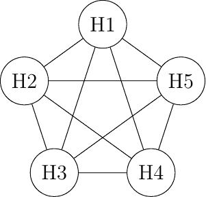
> 
> 图 187 全网状网络

全网状是连接这五个主机的最可靠和性能最高的网络组织形式。然而，这种网络组织有两个重要的缺点。首先，如果一个网络包含 n 个主机，则需要$ \frac{n\times(n-1)}{2} $个链路。如果网络包含的主机数量超过几个，就难以铺设所需的物理链路。其次，如果一个网络包含 n 个主机，那么每个主机必须拥有$ n-1 $个接口来终止$ n-1 $个链路。这对于大多数主机来说是不可能的。此外，如果网络中添加了新的主机，就需要铺设新的链路，并且每个参与的主机都需要添加一个接口。然而，全网状的优势在于提供了主机之间最低的延迟和最佳的抗链路故障恢复能力。在实践中，全网状网络很少使用，除非网络节点很少且恢复能力至关重要。

第二种可能的物理组织形式，也用于计算机内部连接不同的扩展卡，是总线。在总线网络中，所有主机都连接到一个共享介质上，通常是通过单个接口连接的电缆。当一个主机在总线上发送电信号时，该信号会被总线上的所有主机接收。基于总线的网络的缺点是，如果总线被物理切断，那么网络就会分裂成两个孤立的网络。因此，基于总线的网络有时被认为难以操作和维护，尤其是在电缆很长且有很多可能断裂的地方。这种基于总线的拓扑在早期的以太网网络中使用过。

> 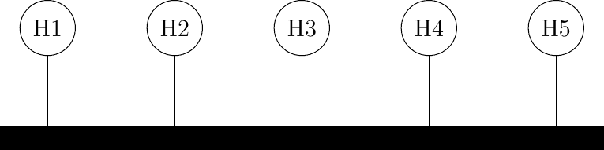
> 
> 图 188 总线形结构的网络

计算机网络的第三种组织形式是星形拓扑。在这种网络中，主机有一个单独的物理接口，每个主机与星形中心之间有一个物理链路。星形中心的节点可以是放大电信号的设备，或者是一个主动设备，例如理解通过网络交换的消息格式的设备。当然，中心节点的故障意味着网络的故障。然而，如果某个物理链路失效（例如，因为电缆被切断），那么只有一个节点会从网络中断开。实际上，星形网络比总线形网络更容易操作和维护。许多网络管理员也欣赏他们可以从一个中心点控制网络的事实。通过 Web 界面或通过类似控制台的联系进行管理，星形中心是一个有用的控制点（启用或禁用设备）和优秀的观察点（使用统计信息）。

> 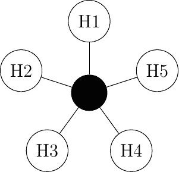
> 
> 图 189 星形结构的网络

网络的第四种物理组织形式是环形拓扑。与总线组织类似，每个主机都有一个单独的物理接口连接到环形。在环形上的任何主机发送的信号都将被连接到环上的所有主机接收。从冗余的角度来看，单个环形并不是最佳解决方案，因为信号只在环上单向传输；因此，如果组成环的某个链路被切断，整个网络将失效。在实际应用中，此类环形已在局域网中使用，但现在通常被星形网络所取代。在大都市网络中，环形常用于连接多个地点。在这种情况下，通常使用由不同电缆组成的两个并行链路来实现冗余。在这种双环中，当其中一个环形失效时，所有流量可以迅速切换到另一个环形。

> 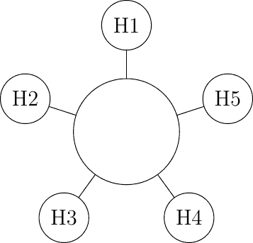
> 
> 图 190 环形结构的网络

网络的第五种物理组织形式是树形结构。这种网络通常用于需要以非常经济的方式连接大量客户的情况。有线电视网络通常组织成树形结构。

> 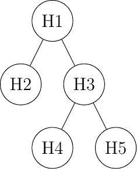
> 
> 图 191 树形结构的网络

## 分享带宽#

在所有这些网络中，除了全连接网络外，链路带宽在所有连接的主机之间共享。已经提出了各种算法，并用于有效地共享对这一资源的访问。我们将在下面的介质访问控制部分解释其中的一些。

注意

计算机网络的公平性

分享资源对于确保网络高效地为用户提供服务非常重要。在实践中，有许多方式可以共享资源。一些资源共享方案认为某些用户比其他用户更重要，应该获得更多资源。例如，在道路上，警车和救护车有优先权。在一些城市，交通车道被保留给公交车以促进公共服务，……在计算机网络中，同样的问题也会出现。鉴于资源有限，网络需要使用户能够高效地共享资源。在设计一个有效的资源共享方案之前，首先需要形式化其目标。在计算机网络中，资源共享方案最流行的目标就是它们必须是公平的。在简单的情况下，例如两个主机使用一个共享的 2 Mbps 链路，资源共享方案应该将相同的带宽分配给每个用户，在这种情况下是 1 Mbps。然而，在大规模网络中，仅仅将可用资源除以用户数量是不够的。考虑下面图中所示的网络，其中 A1 向 A2 发送数据，B1 向 B2 发送，……在这个网络中，我们应该如何在不同流之间分配带宽？一个初步的方法是将相同的带宽分配给每个流。在这种情况下，每个流都会获得 5 Mbps，R2 和 R3 之间的链路将不会完全负载。另一种方法是将 10 Mbps 分配给 A1-A2，20 Mbps 分配给 C1-C2，而 B1-B2 则不分配。这显然是不公平的。

> 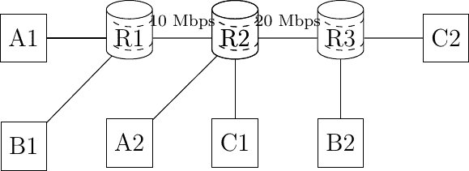
> 
> 图 192 小型网络

在大型网络中，公平性总是需要妥协。最广泛使用的公平性定义是最大最小公平性。如果一个网络中的带宽分配使得在不减少已经分配带宽小于我们想要增加的流量的带宽的情况下，无法将更多带宽分配给任何一个流，那么这种带宽分配就被认为是最大最小公平的。如果网络完全已知，可以推导出最大最小公平的分配如下。最初，所有流都有一个零带宽，并且它们被放置在候选集中。候选集中所有流的带宽分配都会增加，直到某个链路变得拥塞。在这个时候，使用拥塞链路的流已经达到了它们的最大分配。它们被从候选集中移除，这个过程会一直持续到候选集变为空。

在上述网络中，所有流的分配会增长，直到 A1-A2 和 B1-B2 达到 5 Mbps。在这个时候，R1-R2 链路变得拥塞，这两个流已经达到了它们的最大分配。C1-C2 流的分配可以增加到 15 Mbps。在这个时候，R2-R3 链路变得拥塞。要增加分配给 C1-C2 的带宽，就需要减少分配给 B1-B2 的带宽。同样，唯一增加 B1-B2 分配的方法是减少 A1-A2 的分配。

## 网络拥塞#

在直接连接到链路的主机之间共享带宽并不是计算机网络中发生的唯一共享问题。为了理解一般问题，让我们考虑一个非常简单的网络，该网络仅包含点对点链路。这个网络包含三个主机和两个路由器。网络内部的所有链路都具有相同的容量。例如，让我们假设所有链路的带宽为每秒 1000 比特，并且主机发送包含恰好一千比特的数据包。

> 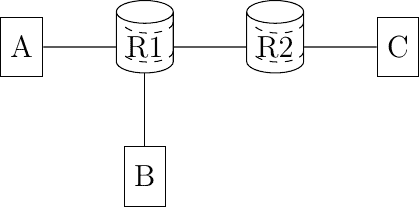
> 
> 图 193 一个小网络

在上述网络中，考虑主机 A 向目的地 C 传输数据包的情况。A 可以每秒发送一个数据包，并且其数据包将被发送到 C。现在，让我们探讨当主机 B 也开始传输数据包时会发生什么。节点 R1 将接收到两个必须转发到 R2 的数据包。不幸的是，由于 R1-R2 链路上的带宽有限，只能传输这两个数据包中的一个。第二个数据包的结果将取决于 R1 上可用的缓冲区。如果 R1 有一个可用的缓冲区，它可以存储在 R1-R2 链路上尚未传输的数据包，直到链路变得可用。如果 R1 没有可用的缓冲区，那么数据包需要被丢弃。

除了链路带宽之外，网络节点上的缓冲区是需要在网络内部共享的第二种资源。节点缓冲区在网络操作中起着重要作用，因为它们可以用来吸收瞬时的流量峰值。再次考虑上面的例子。假设主机 A 和主机 B 平均每十秒发送一组三个数据包。它们的组合传输速率（每秒 0.6 个数据包）平均低于网络容量（每秒 1 个数据包）。然而，如果它们同时开始传输，节点 R1 将不得不吸收一个数据包的突发。这种数据包的突发是一个小网络拥塞。当我们说网络拥塞时，是指来自主机的总流量需求大于网络容量 $ \sum{需求}>容量 $。这个网络拥塞问题是计算机网络中最难的资源共享问题之一。拥塞几乎发生在所有网络中。最小化拥塞量是许多网络运营商的关键目标。在大多数情况下，他们必须接受短暂的拥塞，即持续几秒或几分钟的拥塞，但希望防止持续数天或数月的拥塞。为此，他们可以依赖一系列广泛的解决方案。以下段落中简要介绍了其中的一些。

如果 R1 有足够的缓冲区，它将能够吸收负载而无需丢弃数据包。主机 A 和 B 发送的数据包将到达它们的最终目的地 C，但将经历比单独传输时更长的延迟。网络节点上的缓冲区数量是网络运营商可以调整以控制其网络内部拥塞的第一个参数。鉴于内存成本的降低，人们可能会倾向于在网络节点上放置尽可能多的缓冲区 [[1]](#fbufferbloat)。让我们考虑上述网络中的这种情况，并假设 R1 有无限的缓冲区。现在假设主机 A 和 B 尝试传输一个对应于一千个数据包的文件。它们都使用一种依赖于 go-back-n 从传输错误中恢复的可靠协议。传输开始，数据包开始积累在 R1 的缓冲区中。这些数据包在缓冲区中的存在增加了 A（以及 B）发送数据包和接收相应确认之间的延迟。鉴于延迟的增加，主机 A（以及 B）将认为它发送的一些数据包已经丢失。这些数据包将被重新传输并进入 R1 的缓冲区。R1 缓冲区的占用将继续增加，延迟也会增加。这将导致新的重传，…… 最后，只有一个文件（非常慢地）被发送到目的地，但由于相同数据包的多个副本，链路 R1-R2 将传输比文件大小更多的字节。这被称为拥塞崩溃问题 [**RFC 896**](https://datatracker.ietf.org/doc/html/rfc896.html)。拥塞崩溃是网络运营商的噩梦。当它发生时，网络携带数据包而不向最终用户提供有用的数据。

注意

互联网上的拥塞崩溃

拥塞崩溃（Congestion collapse）不幸地不仅仅是一种学术经验。Van Jacobson 在 [[Jacobson1988]](../bibliography.html#jacobson1988) 中报告了这样一件事件，它在他担任劳伦斯伯克利实验室（LBL）工作时发生。LBL 距离加州大学伯克利分校有两个网络节点。当时，两个地点之间的链路带宽为 32 Kbps，但一些主机已经连接到 10 Mbps 的局域网。 “1986 年 10 月，从 LBL 到加州大学的 … 数据吞吐量从 32 Kbps 降至 40 bps。我们对这种带宽突然降低到千分之一的现象感到着迷，并开始调查为什么事情变得如此糟糕。” 这项工作导致了各种拥塞控制技术的开发，这些技术使得互联网能够在不经历广泛的拥塞崩溃事件的情况下继续增长。

除了带宽和内存之外，网络内部需要共享的第三个资源是（数据包）处理能力。为了转发一个数据包，路由器需要在出链路上有带宽，但它还需要分析数据包头部以在其转发表中执行查找。执行这些查找操作需要资源，如 CPU 周期或内存访问。路由器通常设计为能够维持一定的数据包处理速率，以每秒数据包数（PPS）来衡量 [[2]](#fpps)。

注意

每秒数据包数与每秒比特数

网络节点（无论是路由器还是交换机）的性能可以通过两个关键指标来描述：

> +   以每秒比特数衡量的节点容量
> +   
> +   以每秒数据包数衡量的节点查找性能

节点的容量（以每秒比特数衡量）主要取决于它使用的物理接口，以及节点内部不同接口之间的内部互连（总线、交叉开关等）的容量。许多供应商，特别是对于低端设备，会将节点接口的带宽总和作为节点容量（以每秒比特数衡量）。测量结果并不总是与这个最大理论容量相匹配。一个设计良好的网络节点通常会有一个比其链路容量总和更大的比特每秒容量。这样的节点通常在转发大型数据包时达到这个最大容量。

当网络节点转发小型数据包时，其性能通常受限于它每秒可以执行查找操作的数量。这种查找性能以每秒数据包数来衡量。性能可能取决于转发数据包的长度。关键性能因素是节点每秒转发的最小尺寸数据包的数量。这个速率可能导致比特每秒的容量远低于节点链路带宽的总和。

现在我们尝试对网络拥塞问题进行广泛的概述。我们将假设网络由具有固定带宽的专用链路组成[[3]](#fadjust)。网络包含生成和接收数据包的主机以及转发数据包的节点（路由器和交换机）。假设每个主机通过单个链路连接到网络，最大的需求是$ \sum{访问链路} $。实际上，这个最大需求永远不会达到，网络将被设计成能够承受远低于最大交通需求。最坏情况下的交通需求与可持续交通需求之间的差异可能很大，高达几个数量级。幸运的是，主机并不完全愚蠢，它们可以根据网络的当前状态和可用带宽调整自己的交通需求。为此，主机需要感知当前的拥塞水平并根据估计的拥塞调整自己的交通需求。网络节点可以以不同的方式对网络拥塞做出反应，主机也可以以不同的方式感知拥塞水平。

让我们先探索在网络上可以使用哪些机制来控制拥塞，以及这些机制如何影响终端主机的行为。

如前所述，网络节点上拥塞的第一个表现是网络链路的饱和，这导致节点缓冲区占用率的增长。缓冲区占用率的增长意味着一些数据包将在缓冲区中花费更多时间，从而在网络中停留更长时间。如果主机测量网络延迟（例如，通过测量数据包传输和相应的确认返回之间的往返时间），它们可以开始感知拥塞。在低带宽链路上，缓冲区占用率的增长可能导致延迟的增加，这可以通过终端主机轻松测量。在高带宽链路上，缓冲区内的几个数据包可能导致延迟的小幅变化，这不一定比延迟测量的自然波动更大。

如果缓冲区的占用率持续增长，它将溢出，并且需要丢弃数据包。在拥塞期间丢弃数据包是网络节点对拥塞的第二种可能反应。在探讨节点如何丢弃数据包之前，讨论缓冲区占用对通过网络可靠传输数据的影响是有趣的。这可以通过图图 194，改编自[[Jain1990]](../bibliography.html#jain1990)来说明。

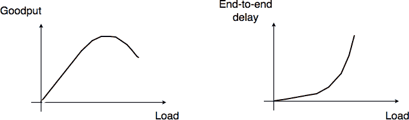

图 194 网络拥塞#

当网络负载较低时，缓冲区占用率和链路利用率都较低。网络节点的缓冲区主要用于吸收非常短的数据包突发，但平均而言，流量需求低于网络容量。如果需求增加，平均缓冲区占用率也会增加。测量表明，总吞吐量也会增加。如果缓冲区占用率为零或非常低，可能会错过网络链路上的传输机会。当缓冲区占用率较小但非零时，情况并非如此。然而，如果缓冲区占用率持续增加，缓冲区就会过载，吞吐量不再增加。当缓冲区占用率接近最大值时，吞吐量可能会下降。这种吞吐量下降可能是由于可靠协议的过度重传造成的，这些协议错误地假设之前发送的数据包已经丢失，而它们仍在缓冲区中等待。另一方面，网络延迟会随着缓冲区占用率的增加而增加。在实践中，网络缓冲区的一个良好工作点是低占用率，以实现高链路利用率和低延迟，这对于交互式应用来说也很重要。

丢弃数据包是网络节点可以用来通知主机当前拥塞水平的信号之一。网络节点的缓冲区通常用作 FIFO 队列以保持数据包顺序。已经为网络节点提出了几种数据包丢弃机制。这些技术基本上回答了两个不同的问题：

> +   什么触发数据包被丢弃？导致网络节点决定丢弃数据包的条件是什么？对这个问题的最简单回答是：当缓冲区满时。虽然这是一个很好的拥塞指示，但从性能角度来看，可能不是最好的。另一种选择是在缓冲区占用率增长过多时丢弃数据包。在这种情况下，缓冲区很快就会满。由于数据包丢弃是允许主机调整其传输速率的信息，因此提前丢弃数据包可以允许主机更早地做出反应，从而防止拥塞发生。
> +   
> +   应该丢弃哪些数据包？一旦网络节点决定丢弃数据包，它需要实际丢弃真实的数据包。

通过结合对这些问题的不同回答，网络研究人员已经开发出不同的数据包丢弃机制。

> +   尾丢弃是最简单的数据包丢弃技术。当缓冲区满时，到达的数据包将被丢弃。尾丢弃可以很容易地实现。到目前为止，这是最广泛使用的丢弃机制。然而，它有两个重要的缺点。首先，由于尾丢弃仅在缓冲区满时丢弃数据包，缓冲区往往会发生拥塞，实时应用可能会遭受增加的延迟。其次，尾丢弃在丢弃数据包时是盲目的。它可能会丢弃来自低带宽交互流的数据包，而此时缓冲区的大部分空间被大文件传输占用。
> +   
> +   前端丢弃是另一种数据包丢弃技术。它不是移除到达的数据包，而是移除队列头部的数据包。丢弃这个数据包而不是到达的数据包可以有两个优点。首先，它已经在缓冲区中停留了很长时间。其次，主机应该能够更早地检测到丢失（以及拥塞）。
> +   
> +   概率丢弃。已经提出了各种随机丢弃技术。经常引用的技术是随机早期丢弃（RED）[[FJ1993]](../bibliography.html#fj1993)。RED 测量平均缓冲区占用率，并在平均占用率过高时以一定的概率丢弃数据包。与尾丢弃和前端丢弃相比，RED 的一个优点是，由于概率丢弃，数据包应该按照它们带宽的比例从不同的流中丢弃。

丢弃数据包是对网络拥塞的常见反应。遗憾的是，丢弃数据包并不是最优的，因为已经在网络节点上丢弃的数据包已经在上游节点上消耗了资源。网络还有其他方式来通知终端主机当前的拥塞水平。第一个解决方案是在节点拥塞时标记数据包。几种网络技术都依赖于这种类型的包标记。

在数据报网络中，可以使用前向显式拥塞通知（FECN）。数据包头部的某个字段，通常是 1 位，用于指示拥塞。当主机发送数据包时，拥塞位被清除。如果数据包通过拥塞节点，拥塞位被设置。目的地可以通过测量收到拥塞位设置的数据包的比例来确定当前的拥塞水平。然后，它可以向发送主机返回此信息，以便它能够调整其重传速率。与数据包丢弃相比，FECN 的主要优点是主机可以明确地检测到拥塞，而无需依赖于数据包丢失。

在虚拟电路网络中，如果返回数据包遵循正向数据包的反向路径，则数据包标记可以得以改进。在这种情况下，网络节点可以检测到正向路径上的拥塞（例如，由于其缓冲区的大小），但在返回路径上标记数据包。与 FECN 相比，标记返回数据包（例如，可靠协议使用的确认）为发送主机提供了更快的反馈。这种技术通常被称为向后显式拥塞通知（BECN）。

如果数据包头部不包含任何表示当前拥塞级别的位，则一种替代方案是允许网络节点向源发送控制数据包以指示当前拥塞级别。一些网络技术使用此类控制数据包来显式调节源传输速率。然而，它们的用途主要限于小型网络。在大规模网络中，网络节点通常避免使用此类控制数据包。在某些网络中，这些控制数据包甚至被认为是有危险的。首先，在拥塞时使用它们会增加网络负载。其次，虽然网络节点优化了转发数据包，但它们在创建新数据包方面通常相当慢。

丢弃和标记数据包不是拥塞的路由器可能采取的唯一反应。路由器还可以选择性地延迟属于某些流的数据包。路由器可以使用不同的算法来延迟数据包。如果路由器的目标是公平地在竞争流之间分配输出链路的带宽，那么一种可能性是将路由器的缓冲区组织成一组队列。为了简单起见，让我们假设路由器能够支持固定数量的并发流，比如说 N。路由器的一个队列与每个流相关联，当数据包到达时，它被放置在相应队列的尾部。所有队列都由一个调度器控制。调度器是一种算法，每次有机会在出站链路上传输数据包时都会运行。科学文献中已经提出了各种调度器，其中一些被用于实际的路由器。

> 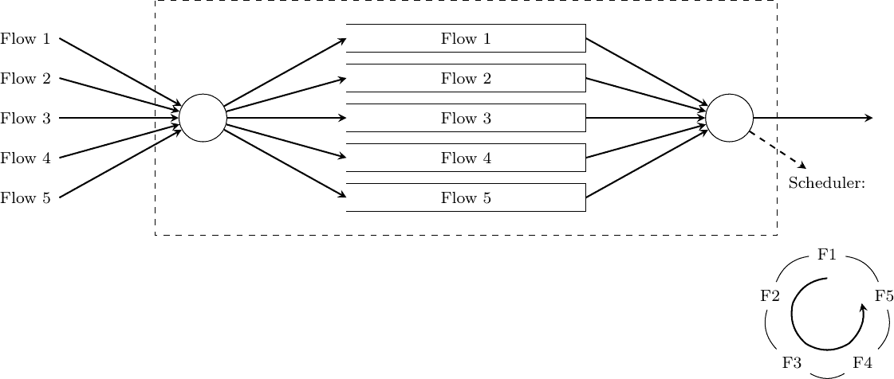
> 
> 图 195：循环调度器，其中 N = 5

一个非常简单的调度器是循环调度器。这种调度器以循环方式服务所有队列。如果所有流发送相同大小的数据包，那么循环调度器将公平地在不同流之间分配带宽。否则，它优先考虑使用较大数据包的流。已经提出了循环调度器的扩展，以提供可变长度数据包的公平带宽分配 [[SV1995]](../bibliography.html#sv1995)，但这些超出了本章的范围。

```sh
# N queues
# state variable : next_queue
next_queue = 0
while True:
    if isEmpty(buffer):
        # Wait for next packet in buffer
        wait()
    if not(isEmpty(queue[next_queue])):
        # Send packet at head of next_queue
        p = remove_packet(queue[next_queue])
        send(p)
    next_queue=(next_queue + 1) % N
# end while 
```

## 在网络中分配负载#

延迟、数据包丢弃、数据包标记和控制数据包是网络可以与终端主机交换的主要信息类型。如果拥塞过于严重，丢弃数据包是网络节点可以执行的主要操作。除了在每个节点解决拥塞外，还可以将一些流量从负载过重的链路中转移出来以减少拥塞。早期的路由算法 [[MRR1980]](../bibliography.html#mrr1980) 使用延迟测量来检测网络节点之间的拥塞并动态更新链路权重。通过将应用程序感知到的延迟反映在用于最短路径计算的链路权重中，这些路由算法能够动态地改变转发路径以应对拥塞。然而，部署经验表明，这些动态路由算法可能会引起振荡，并不一定能够降低拥塞。部署的数据报网络很少使用动态路由算法，除了在某些无线网络中。在数据报网络中，对长期拥塞（即持续数小时、数天或更长时间的拥塞）的最佳反应是测量流量需求，然后选择允许最小化最大链路负载的链路权重 [[FRT2002]](../bibliography.html#frt2002)。如果拥塞持续更长时间，改变权重就不再足够，网络需要通过添加额外的或更快的链路进行升级。然而，在广域网络中，添加新链路可能需要数月时间。

在虚拟电路网络中，管理或防止拥塞的另一种方法是限制在任何时候使用网络的电路数量。这种技术通常被称为连接接入控制。当主机请求在网络中创建新的电路时，它会指定目的地，在某些网络技术中还需要指定所需的带宽。有了这些信息，网络可以检查是否有足够的资源可用以到达这个特定的目的地。如果是的话，电路就会建立。如果不是，请求将被拒绝，主机将不得不推迟其虚拟电路的创建。连接接入控制方案在电话网络中得到广泛应用。在这些网络中，忙音表示不可用的目的地或拥塞的网络。

在数据报网络中，这种技术不能轻易使用，因为这种网络的基本假设是主机可以在任何时候向任何目的地发送任何数据包。主机不需要请求网络授权以向特定目的地发送数据包。

根据从网络收到的反馈，主机可以调整它们的传输速率。我们在“拥塞控制”一节中讨论了一些允许主机对拥塞做出反应的技术。

另一种共享网络资源的方法是将负载分配到多个链路上。已经设计了许多技术来在网络中分散负载。作为一个例子，让我们简要地考虑在访问某些内容时如何共享负载。考虑一个大型且受欢迎的文件，例如 Linux 发行版的镜像或商业操作系统的升级，许多用户将下载这些文件。有许多方法可以分发这个大文件。一个简单的方法是将文件的副本放在服务器上，并允许所有用户从服务器下载这个文件。如果文件很受欢迎，并且有数百万用户想要下载它，服务器将很快过载。有两种类型的解决方案可以用来服务大量的用户。第一种方法是将文件存储在客户端已知名称的服务器上。在检索文件之前，每个客户端都会查询名称服务以获取服务器的地址。如果文件可以从多个服务器获取，名称服务可以为不同的客户端提供不同的地址。这将自动分散负载，因为不同的客户端将从不同的服务器下载文件。大多数大型内容提供商使用这种解决方案来分发大文件或视频。

另一种解决方案允许在不依赖名称服务的情况下，将负载分散到多个来源。流行的[bittorent](https://www.bittorrent.com)服务就是这种方法的例子。使用这种解决方案，每个文件被分成固定大小的块。为了检索一个文件，客户端需要检索组成该文件的所有块。然而，没有任何东西强迫客户端按顺序从同一服务器检索所有块。每个文件都与元数据相关联，该元数据为每个块列出了一个存储该块的宿主机的地址列表。为了检索完整的文件，客户端首先下载元数据。然后，它尝试从存储该块的宿主机之一检索每个块。在实践中，实现通常尝试并行下载多个块。一旦成功下载了一个块，就可以请求下一个块。如果一个宿主机在提供某个块时速度较慢或变得不可用，客户端可以联系元数据中列出的另一个宿主机。大多数 bittorrent 部署允许客户端参与块的分发。一旦客户端下载了一个块，它就会联系存储元数据的服务器，表明它也可以提供这个块。使用这种方案，当一个文件很受欢迎时，它的块会被许多自动参与块分发的宿主机下载。因此，能够提供流行文件块的宿主机数量会随着文件受欢迎程度的增加而自动增加。

现在我们已经提供了关于如何在网络中分配资源的技术概述，让我们更详细地分析两种技术：介质访问控制和拥塞控制。

## 介质访问控制算法#

局域网中普遍存在的问题是如何有效地共享可用带宽。如果两个设备同时发送一个帧，对应这些帧的两个电、光或无线电信号将同时出现在传输介质上，接收器将无法解码任何一个帧。这种同时传输称为冲突。冲突可能涉及局域网中连接的两个或多个设备的帧。冲突是有线局域网中错误的主要原因。

所有局域网技术都依赖于介质访问控制算法来调节传输，以最小化或避免冲突。介质访问控制算法主要分为两大类：

> 1.  确定性或悲观的 MAC 算法。这些算法假设冲突是一个非常严重的问题，必须完全避免。这些算法确保在任何时候，最多只有一个设备被允许在局域网上发送帧。这通常是通过使用分布式协议来实现的，该协议在每个时间选择一个允许传输的设备。确定性 MAC 算法确保不会发生冲突，但调节局域网中所有设备的传输会有一些开销。
> 1.  
> 1.  随机或乐观的 MAC 算法。这些算法假设冲突是局域网正常操作的一部分。它们的目的是最小化冲突的数量，但它们并不试图避免所有冲突。随机算法通常比确定性算法更容易实现。

我们首先讨论一个简单的确定性 MAC 算法，然后描述几个重要的乐观算法，最后回到分布式和确定性 MAC 算法。

### 静态分配方法#

在一个局域网中，将可用资源在所有连接的设备之间共享的第一个解决方案是在事先定义不同设备之间的传输资源分配。如果 N 个设备需要共享一个以 b Mbps 运行的局域网的传输容量，每个设备可以分配到$ \frac{b}{N} $ Mbps 的带宽。

在局域网以外的其他环境中需要共享有限资源。自从一个多世纪前[马可尼](http://en.wikipedia.org/wiki/Guglielmo_Marconi)进行第一次无线电传输以来，已经开发了许多通过无线电信号交换信息的应用。每个无线电信号都是一个以给定频率为中心的电磁波。无线电频谱对应于大约 3 KHz 到 300 GHz 之间的频率。政府之间协商的频率分配计划为广播无线电、广播电视、移动通信、航空无线电导航、业余无线电、卫星等特定应用保留了大多数频率范围。然后，每个频率范围被细分为频道，每个频道可以保留给特定的应用，例如某个地区的广播电台。

频分复用（FDM）是一种静态分配方案，其中为连接到共享介质的每个设备分配一个频率。由于每个设备使用不同的传输频率，因此不会发生冲突。在光网络中，可以使用 FDM 的一种变体，称为波分复用（WDM）。光纤可以在不同的波长上传输光而不发生干扰。使用 WDM，为共享同一光纤的每个设备分配不同的波长。

时间分复用（TDM）是一种最初为电话网络定义的静态带宽分配方法。在固定电话网络中，语音对话通常以 64 Kbps 的信号传输。因此，电话对话每秒生成 8 KBytes 或每 125 微秒一个字节。电话对话通常需要在一个单独的线路上复用在一起。例如，在欧洲，三十个 64 Kbps 的语音信号通过一个 2 Mbps（E1）的单独线路复用。这是通过使用时间分复用（TDM）实现的。TDM 将传输机会划分为时隙。在电话网络中，一个时隙对应于 125 微秒。每个时隙内的一个位置为每个语音信号预留。下面的图示说明了用于携带四个语音对话的链路上的 TDM。垂直线代表时隙边界，字母代表不同的语音对话。每个语音对话的字节在每个 125 微秒的时隙中发送。对应于给定对话的字节总是在每个时隙中的相同位置发送。

> 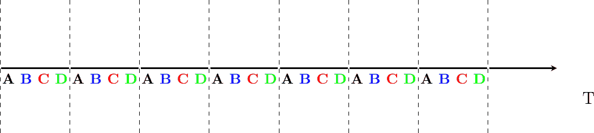
> 
> 图 196 时间分复用

如上图所示，TDM 可以是完全静态的，即相同的对话始终共享链路，也可以是动态的。在后一种情况下，链路的两个端点必须交换消息，指定每个对话在每个时隙中使用哪个字节。得益于这些控制消息，可以动态地向给定链路添加和删除语音对话。

TDM 和 FDM 在电话网络中被广泛用于支持固定带宽的通话。在支持计算机的局域网中使用它们可能会效率低下。计算机通常不会以固定速率发送信息。相反，它们往往具有开/关的行为。在开启期间，计算机试图以尽可能高的速率发送信息，例如传输文件。在关闭期间，这个期间通常比开启期间长得多，计算机不发送任何数据包。为连接到局域网的计算机使用静态分配方案会导致巨大的低效率，因为它们在开启期间只能以$ \frac{1}{N} $的总带宽进行传输，尽管其他计算机处于关闭期间，因此不需要传输任何信息。本章余下的部分讨论的动态 MAC 算法旨在解决这个问题。

### ALOHA#

在 20 世纪 60 年代，计算机主要是大型机，连接了几十个终端。这些终端通常位于主机的同一栋大楼内，并直接连接到它。在某些情况下，终端被安装在远程位置，并通过连接到拨号线路的调制解调器进行连接。夏威夷大学选择了不同的组织方式。他们没有使用电话线来连接远程终端，而是开发了第一种分组无线电技术[[Abramson1970]](../bibliography.html#abramson1970)。在此之前，计算机网络要么建立在电话网络之上，要么建立在物理电缆之上。ALOHA 网络表明，可以使用无线电信号来互联计算机。

ALOHANet 的第一个版本，如[[Abramson1970]](../bibliography.html#abramson1970)所述，其工作方式如下。首先，终端和主机交换由 704 位组成的固定长度帧。每个帧包含 80 个 8 位字符，一些控制位和奇偶校验信息以检测传输错误。400 MHz 范围内的两个信道被保留用于 ALOHANet 的操作。第一个信道由主机用于向所有终端发送帧。第二个信道由所有终端共享，用于向主机发送帧。由于所有终端共享相同的传输信道，因此存在碰撞的风险。为了处理这个问题以及传输错误，主机验证接收到的帧的奇偶校验位，并为每个正确接收到的帧在其信道上发送确认。另一方面，终端必须重新传输未确认的帧。对于 TCP 来说，在固定超时到期后立即重新传输这些帧并不是一个好的方法，因为多个终端可能会同时重新传输它们的帧，从而导致网络崩溃。一个更好的方法，尽管还远非完美，是每个终端在它的重新传输超时到期后等待一个随机的时间。这避免了多个重新传输终端之间的同步。

下面的伪代码显示了 ALOHANet 终端的操作。我们使用这种 Python 语法来描述本章中描述的所有介质访问控制算法。该算法应用于需要传输的每个新帧。它尝试最多 max 次（while 循环）传输一个帧。每次传输尝试如下进行。首先，发送帧。每个帧都有一个超时保护。然后，终端等待有效的确认帧或其超时的到期。如果终端收到确认，则帧已正确交付，算法终止。否则，终端等待随机时间并尝试重新传输帧。

```sh
# ALOHA
N = 1
while N <= max:
    send(frame)
    wait(ack_on_return_channel or timeout)
    if (ack_on_return_channel):
       break  # transmission was successful
    else:
             # timeout
             wait(random_time)
             N = N + 1
else:
    # Too many transmission attempts 
```

[[Abramson1970]](../bibliography.html#abramson1970)在特定假设下分析了 ALOHANet 的性能，并发现当信道负载较轻时，ALOHANet 工作得很好。在这种情况下，帧很少重新传输，信道流量，即单位时间内传输的（正确和重新传输的）帧的总数接近信道利用率，即单位时间内正确传输的帧的数量。不幸的是，分析还显示，信道利用率在达到其最大值时为信道带宽的$ \frac{1}{2 \times e}=0.186 $倍。在更高的利用率下，ALOHANet 变得不稳定，网络由于碰撞的重新传输而崩溃。

注意

业余分组无线电

自从在夏威夷大学进行首次实验以来，包无线电技术已经向多个方向发展。由业余无线电操作员开发的业余包无线电服务是 ALOHANet 的后裔之一。许多业余无线电操作员对新技术非常感兴趣，他们经常花费无数小时开发新的天线或收发器。当第一台个人计算机出现时，几位业余无线电操作员设计了无线电调制解调器和他们自己的数据链路层协议[[KPD1985]](../bibliography.html#kpd1985) [[BNT1997]](../bibliography.html#bnt1997)。这个网络不断发展，仅使用包无线电中继就可以连接到几个欧洲国家的服务器。一些业余无线电操作员还开发了在包无线电服务上使用的 TCP/IP 协议栈。[业余包无线电网络](http://www.ampr.org/)的一些部分连接到全球互联网，并使用 44.0.0.0/8 IPv4 前缀。

自从[[Abramson1970]](../bibliography.html#abramson1970)发表以来，针对 ALOHANet 的许多改进方案被提出，并且这种技术或其某些变体至今仍存在于无线网络中。[[Roberts1975]](../bibliography.html#roberts1975)提出的时隙技术非常重要，因为它表明简单的修改可以显著提高信道利用率。不是允许所有终端在任何时间传输，[[Roberts1975]](../bibliography.html#roberts1975)提出将时间划分为时隙，并允许终端只在每个时隙的开始传输。每个时隙对应于传输一个固定大小帧所需的时间。在实践中，这些时隙可以通过一个所有终端都能接收到的单一时钟来强制实施。在 ALOHANet 中，它可能位于中央主框上。[[Roberts1975]](../bibliography.html#roberts1975)的分析表明，这种简单的修改可以将信道利用率提高两倍。

### 载波侦听多路访问#

ALOHA 和时隙 ALOHA 可以很容易地实现，但不幸的是，它们只能用于非常轻载的网络。为非常低利用率设计网络是可能的，但它显然会增加网络的成本。为了克服 ALOHA 的问题，已经提出了许多介质访问控制机制，这些机制提高了信道利用率。与 ALOHA 相比，载波侦听多路访问（CSMA）是一个显著的改进。CSMA 要求所有节点在发送帧之前侦听传输信道以验证其是否空闲[[KT1975]](../bibliography.html#kt1975)。当一个节点侦测到信道繁忙时，它将推迟其传输，直到信道再次空闲。下面的伪代码提供了 CSMA 操作的更详细描述。

```sh
# persistent CSMA
N = 1
while N <= max:
    wait(channel_becomes_free)
    send(frame)
    wait(ack or timeout)
    if ack:
       break  # transmission was successful
    else:
             # timeout
             N = N + 1
else:
    # Too many transmission attempts 
```

上述伪代码通常被称为持续载波监听多路访问（CSMA）[[KT1975]](../bibliography.html#kt1975)，因为终端会持续监听信道，一旦信道空闲，就会立即发送其帧。CSMA 的另一个重要变体是非持续 CSMA [[KT1975]](../bibliography.html#kt1975)。以下伪代码中描述的持续和非持续 CSMA 之间的主要区别是，非持续 CSMA 节点不会持续监听信道以确定何时空闲。当一个非持续 CSMA 终端检测到传输信道忙碌时，它会在再次检测信道之前等待一个随机时间。这比持续 CSMA 提高了信道利用率。在持续 CSMA 中，当两个终端检测到信道忙碌时，它们会在信道空闲的瞬间同时发送（从而引起冲突）。而在非持续 CSMA 中，这种同步不会发生，因为终端在检测到传输信道后等待一个随机时间。然而，非持续 CSMA 通过提高信道利用率所实现的，是以网络轻载时终端稍微增加的等待时间为代价的。

```sh
# Non persistent CSMA
N = 1
while N <= max:
    listen(channel)
    if free(channel):
        send(frame)
        wait(ack or timeout)
        if received(ack):
           break  # transmission was successful
        else:
                 # timeout
                 N = N + 1
    else:
        wait(random_time)
else:
    # Too many transmission attempts 
```

[[KT1975]](../bibliography.html#kt1975) 详细分析了几个 CSMA 变体的性能。在关于传输信道和流量的某些假设下，该分析比较了 ALOHA、时隙 ALOHA、持续和非持续 CSMA。在这些假设下，ALOHA 的信道利用率仅为信道容量的 18.4%。时隙 ALOHA 能够使用 36.6%的容量。持续 CSMA 通过达到 52.9%的容量来提高利用率，而非持续 CSMA 实现了信道容量的 81.5%。  ### 带冲突检测的载波监听多路访问#

与 ALOHA 相比，CSMA 提高了信道利用率。然而，性能仍然可以进一步提高，尤其是在有线网络中。考虑两个终端连接到同一电缆的情况。例如，这条电缆可以是早期以太网中的同轴电缆 [[Metcalfe1976]](../bibliography.html#metcalfe1976)。它也可以由双绞线构建。在扩展 CSMA 之前，了解这样一个网络中帧的传输方式和碰撞如何发生是有用的。下面的图示说明了这样一个电缆上帧的物理传输。为了传输其帧，主机 A 必须在共享介质上发送一个电信号。因此，第一步是开始传输电信号。这在下面的图中表示为点（1）。这个电信号将沿着电缆传播。尽管电信号传播得很快，但我们知道信息不能比光速传播得更快（即每秒 300,000 公里）。在同轴电缆上，电信号略慢于光速，每秒 200,000 公里是一个合理的估计。这意味着如果电缆长度为一公里，电信号需要 5 微秒才能从电缆的一端传播到另一端。同轴电缆的末端装有终止点，以确保电信号不会反射回其源头。这在图中的点（3）中得到了说明，其中电信号已经到达左端点和主机 B。在这个时候，B 开始接收 A 正在传输的帧。请注意，在主机 A 上传输一个比特和主机 B 接收它之间存在延迟。如果有其他主机连接到电缆上，它们会在不同时间接收到帧的第一个比特。正如我们稍后将会看到的，这种时间差异是 MAC 算法的一个关键问题。在点（4）时，电信号已经到达电缆的两端并完全占据它。主机 A 继续传输电信号，直到帧的结束。如图（5）所示，当发送主机停止传输时，对应于帧结束的电信号离开同轴电缆。一旦整个电信号从电缆中移除，信道再次变为空闲。

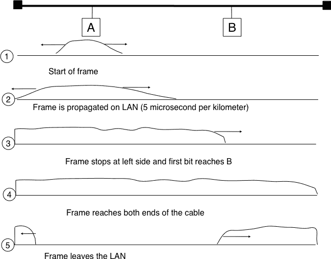(../_images/frame-bus.png)

图 197 共享总线上的帧传输#

现在我们已经了解了帧实际上是如何作为一个电信号在共享总线上传输的，那么更详细地看看当两个主机几乎同时发送一个帧时会发生什么，这很有趣。这在上面的图中得到了说明，其中主机 A 和主机 B 同时开始传输（点（1））。此时，如果主机 C 检测到信道，它会认为它是空闲的。但这不会持续太久，在点（2）处，主机 A 和主机 B 的电信号都到达了主机 C。组合电信号（在图中以两个曲线的叠加形式图形化表示）无法被主机 C 解码。主机 C 检测到冲突，因为它接收到了一个无法解码的信号。由于主机 C 无法解码帧，它无法确定哪些主机正在发送冲突帧。请注意，主机 A（以及主机 B）将在主机 C 之后检测到冲突（图图 198 中的点（3））。

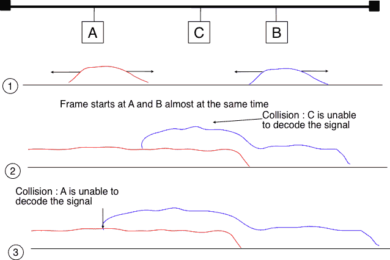](../_images/frame-collision.png)

图 198 共享总线上的帧冲突#

如上图所示，当主机接收到无法解码的电信号时，会检测到冲突。在有线的网络中，主机在监听时（例如上图中的主机 C）以及发送自己的帧时，都能够检测到这种冲突。当主机发送一个帧时，它可以比较自己发送的电信号与在电缆上感知到的电信号。在上图中的点（1）和（2）处，主机 A 只能感知到自己的信号。在点（3）处，它感知到一个与自己的信号不同的电信号，因此可以检测到冲突。在此点，它的帧被损坏，它可以停止传输。在传输过程中检测到冲突的能力是载波侦听多路访问与冲突检测（CSMA/CD）介质访问控制算法的起点，该算法用于以太网网络 [[Metcalfe1976]](../bibliography.html#metcalfe1976) [[IEEE802.3]](../bibliography.html#ieee802-3) 。当以太网主机在传输过程中检测到冲突时，它会立即停止传输。与纯 CSMA 相比，CSMA/CD 是一个重要的改进，因为当发生冲突时，它们只会持续到发生冲突的主机检测到并停止传输。在实践中，当主机检测到冲突时，它会在电缆上发送一个特殊的干扰信号，以确保所有主机都检测到冲突。

为了更好地理解这些碰撞，分析在共享总线网络中最糟糕的碰撞情况是有用的。让我们考虑一个两端连接有两个主机的电线，如图所示。主机 A 开始传输其帧，其电信号在电缆上传播。其传播时间取决于电缆的物理长度和电信号的速度。让我们用 $ \tau $ 来表示这种传播延迟（以秒为单位）。在 A 的帧传输开始后略少于 $ \tau $ 秒，B 决定开始传输自己的帧。经过 $ \epsilon $ 秒后，B 检测到 A 的帧，检测到碰撞并停止传输。B 的帧的开始在电缆上传播，直到它到达主机 A。因此，主机 A 可以在 $ \tau-\epsilon+\tau \approx 2\times\tau $ 时刻检测到碰撞。需要注意的是，碰撞只能在传输的前 $ 2\times\tau $ 秒内发生。如果在这一时期内没有发生碰撞，那么之后也不会发生，因为传输通道在 $ \tau $ 秒后变得繁忙，并且 CSMA/CD 主机在传输帧之前会检测传输通道。

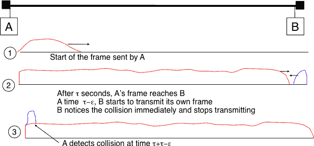

图 199 共享总线上的最糟糕的碰撞#

此外，在采用 CSMA/CD 的有线网络中，碰撞几乎是影响帧的传输错误的唯一原因。仅影响帧内少数比特的传输错误在这些有线网络中很少发生。因此，CSMA/CD 的设计者选择在数据链路层完全删除确认帧。当主机传输一个帧时，它会验证其传输是否受到碰撞的影响。如果没有，考虑到底层网络的几乎可以忽略的比特错误率，它假设帧已被正确接收。否则，帧将在一段时间后重新传输。

移除确认是一种有趣的优化，因为它减少了网络交换的帧数以及主机需要处理的帧数。然而，为了使用这种优化，我们必须确保所有主机都能检测到影响其帧的所有冲突。对于短帧来说，这是一个重要的问题。让我们考虑两个主机，A 和 B，它们正在向主机 C 发送一个小帧，如图所示。如果 A 和 B 发送的帧非常短，可能会出现以下情况。主机 A 和 B 发送它们的帧并停止传输（点（1））。当两个短帧到达主机 C 的位置时，它们发生冲突，主机 C 无法解码它们（点（2））。两个帧被线缆的末端吸收。主机 A 和主机 B 都没有检测到冲突。它们都认为它们的帧已经正确地被目的地接收。

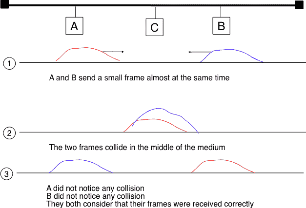(../_images/frame-collision-short.png)

图 200 短帧冲突问题#

为了解决这个问题，使用 CSMA/CD 的网络要求主机至少传输 $ 2\times\tau $ 秒。由于网络传输速度对于给定的网络技术是固定的，这意味着使用 CSMA/CD 的技术强制执行最小帧大小。在最受欢迎的 CSMA/CD 技术，以太网中，$ 2\times\tau $ 被称为时隙时间 [[4]](#fslottime)。

CSMA/CD 引入的最后一个创新是重传超时的计算。与 ALOHA 一样，这个超时不能是固定的，否则主机可能会同步并总是在同一时间重传。设置这样的超时总是在网络访问延迟和冲突数量之间做出妥协。超时短会导致网络访问延迟低，但碰撞风险高。另一方面，超时长会导致网络访问延迟长，但碰撞风险低。二进制指数退避算法被引入 CSMA/CD 网络以解决这个问题。

为了理解二进制指数退避，让我们考虑由恰好两个主机引起的冲突。一旦检测到冲突，主机可以立即重传其帧或延迟一段时间后重传。如果每个冲突的主机抛硬币来决定是否立即重传或延迟重传，可能出现四种情况：

> 1.  两个主机立即重传，并发生新的冲突
> 1.  
> 1.  第一个主机立即重传，第二个主机延迟重传
> 1.  
> 1.  第二个主机立即重传，第一个主机延迟重传
> 1.  
> 1.  两个主机都延迟重传，并发生新的冲突

在第二种和第三种情况下，两个主机都掷了不同的硬币。延迟选择推迟其重传的主机应该足够长，以确保其重传不会与另一个主机的即时重传冲突。然而，延迟不应超过避免冲突所需的时间，因为如果两个主机都决定推迟它们的传输，网络将在这段时间内空闲。时隙时间是最佳延迟，因为它是最短的延迟，可以确保第一个主机能够完全重传其帧而不会发生任何冲突。

如果两个主机正在竞争，上述算法将避免 50%的第二次冲突。然而，如果网络负载很重，可能同时有几个主机在竞争。在这种情况下，主机应该能够自动调整其重传延迟。二进制指数退避根据影响帧的冲突次数进行这种调整。第一次冲突后，主机掷硬币并等待 0 或 1 个时隙时间。第二次冲突后，它生成一个随机数并等待 0、1、2 或 3 个时隙时间，等等。每次冲突后，等待时间翻倍。CSMA/CD 算法的完整伪代码如图所示。

```sh
# CSMA/CD pseudo-code
N = 1
while N <= max:
    wait(channel_becomes_free)
    send(frame)
    wait_until (end_of_frame) or (collision)
    if collision detected:
        stop_transmitting()
        send(jamming)
        k = min(10, N)
        r = random(0, 2**k - 1)
        wait(r * slotTime)
        N = N + 1
    else:
        wait(inter-frame_delay)
        break  # transmission was successful
else:
    # Too many transmission attempts 
```

在此伪代码中使用的帧间延迟是一个短暂的延迟，对应于网络适配器从发送模式切换到接收模式所需的时间。它还用于防止主机发送连续的帧流，而不给网络上的其他主机留下任何传输机会。这有助于 CSMA/CD 的公平性。尽管有这个延迟，仍然存在 CSMA/CD 不完全公平的情况[[RY1994]](../bibliography.html#ry1994)。例如，考虑一个有两个主机的网络：一个服务器发送长帧，一个客户端发送确认。[[RY1994]](../bibliography.html#ry1994)中报告的测量结果表明，客户端可能会遭受重复的冲突，这导致它因指数退避算法而长时间等待。### 带有冲突避免的载波侦听多路访问#

带有冲突避免的载波侦听多路访问（CSMA/CA）介质访问控制算法是为流行的 WiFi 无线网络技术[[IEEE802.11]](../bibliography.html#ieee802-11)设计的。CSMA/CA 在发送帧之前也会侦听传输通道。此外，CSMA/CA 通过仔细调整 CSMA/CA 设备使用的计时器来尝试避免冲突。

CSMA/CA 使用类似于 CSMA 的确认机制。每个帧包含一个序列号和一个 CRC。CRC 用于检测传输错误，而序列号用于避免帧重复。当一个设备接收到正确的帧时，它会向发送者返回一个特殊的确认帧。CSMA/CA 在接收帧和发送确认帧之间引入了一个小的延迟，称为短帧间间隔（SIFS）。这个延迟对应于设备在接收和传输模式之间切换无线电所需的时间。

与 CSMA 相比，CSMA/CA 更精确地定义了设备何时可以发送帧。首先，CSMA/CA 定义了两个延迟：DIFS 和 EIFS。为了发送帧，设备必须首先等待信道空闲至少 Distributed Coordination Function Inter Frame Space (DIFS) 的时间，如果之前接收到的帧是正确的。然而，如果之前接收到的帧已损坏，这表明存在冲突，设备必须检测信道空闲至少 Extended Inter Frame Space (EIFS) 的时间，其中 $ SIFS<DIFS<EIFS $。SIFS、DIFS 和 EIFS 的确切值取决于底层物理层 [[IEEE802.11]](../bibliography.html#ieee802-11)。

下图显示了 CSMA/CA 设备的基本操作。在传输之前，主机 A 验证信道是否在足够长的时间内空闲。然后，它发送其数据帧。在检查接收到的帧的有效性后，接收者在短暂的 SIFS 延迟后发送一个确认帧。不参与帧交换的主机 C 在数据帧的开始时检测到信道忙。主机 C 可以使用此信息来确定信道将忙多久。请注意，由于 $ SIFS<DIFS<EIFS $，即使在数据帧的最后一位之后立即开始检测信道的设备也无法在确认帧传输期间决定发送自己的帧。

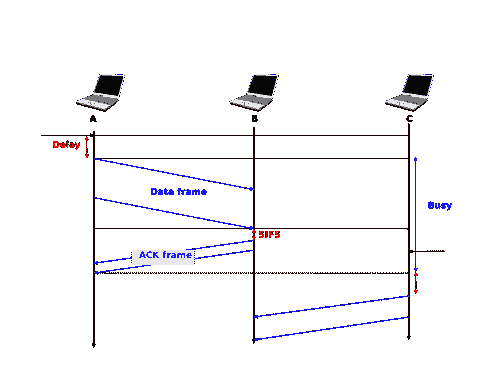

图 201 CSMA/CA 设备的操作#

CSMA/CA 的主要困难在于两个或更多设备同时传输并引起冲突的情况。这在下图中得到说明，假设在数据帧传输后有一个固定的超时时间。由于 CSMA/CA，数据帧传输后的超时时间非常小，因为它对应于 SIFS 加上发送确认帧所需的时间。

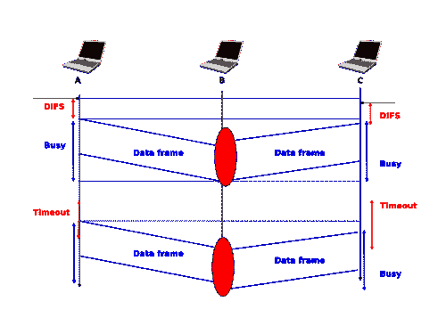

图 202 CSMA/CA 中的冲突#

为了解决这个问题，CSMA/CA 依赖于一个退避定时器。这个退避定时器是一个随机延迟，由每个设备在一个依赖于当前帧重传次数的范围中选择。范围随着重传次数呈指数增长，就像 CSMA/CD 一样。退避定时器的最小范围是$ [0,7*slotTime] $，其中 slotTime 是一个取决于底层物理层的参数。与 CSMA/CD 的指数退避相比，有两个重要的不同之处需要注意。首先，退避定时器的初始范围是七倍大。这是因为 CSMA/CA 无法检测到发生的碰撞。与 CSMA/CA 相比，一个碰撞可能影响整个帧，而与 CSMA/CD 相比，它只能影响帧的开始部分。其次，一个 CSMA/CA 设备必须在退避定时器期间定期检测传输通道。如果通道变得繁忙（即因为另一个设备正在传输），那么退避定时器必须冻结，直到通道再次空闲。一旦通道空闲，退避定时器重新启动。这与 CSMA/CD 不同，在 CSMA/CD 中，每次碰撞后都会重新计算退避。这在下图中得到了说明。主机 A 选择的退避时间比主机 C 小。当 C 检测到通道繁忙时，它会冻结其退避定时器，并且只有在通道再次空闲时才会重新启动。

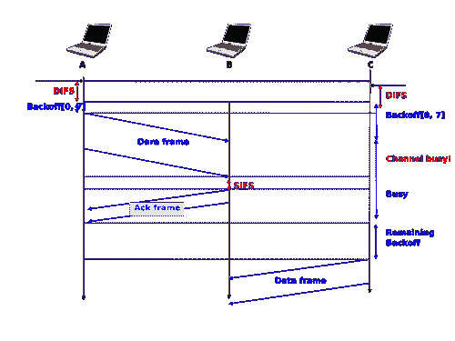

图 203：带有 CSMA/CA 的详细示例#

下面的伪代码总结了 CSMA/CA 设备的工作原理。SIFS、DIFS、EIFS 和$ slotTime $的值取决于底层物理层技术[[IEEE802.11]](../bibliography.html#ieee802-11)

```sh
# CSMA/CA simplified pseudo-code
N=1
while N <= max:
    wait_until(free(channel))
    if correct(last_frame):
        wait(channel_free_during_t >= DIFS)
    else:
        wait(channel_free_during_t >= EIFS)

    backoff_time = int(random(0, min(255, 7 * ( 2 ** (N - 1))))) * slotTime
    wait(channel free during backoff_time)
    # backoff timer is frozen while channel is sensed to be busy
    send(frame)
    wait(ack or timeout)
    if received(ack)
        # frame received correctly
        break
    else:
        # retransmission required
        N = N + 1
else:
    # Too many transmission attempts 
```

无线网络面临的一个常见问题通常被称为隐藏站问题。在无线网络中，无线电信号并不总是以相同的方式向所有方向传播。例如，被墙壁隔开的两个设备可能无法接收到对方的信号，尽管它们都能接收到由第三个主机产生的信号。这在下图中得到了说明，但这种情况也可能发生在其他环境中。例如，位于山的不同侧的两个设备可能无法接收到对方的信号，尽管它们都能接收到山顶上站点发送的信号。此外，无线电传播条件可能会随时间变化。例如，一辆卡车可能会暂时阻断两个附近设备之间的通信。

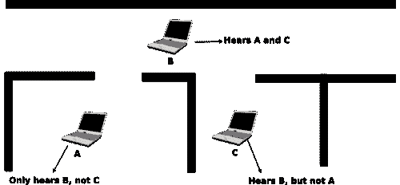

图 204：隐藏站问题#

为了避免在这些情况下发生冲突，CSMA/CA 允许设备预留传输信道一段时间。这是通过使用两个控制帧来完成的：请求发送（RTS）和清除发送（CTS）。这两个帧都非常短，以最大限度地减少冲突的风险。为了预留传输信道，设备向数据帧的预期接收者发送一个 RTS 帧。RTS 帧包含请求预留的持续时间。接收者在 SIFS 延迟后回复一个 CTS 帧，该帧也包含预留的持续时间。由于预留的持续时间已经在 RTS 和 CTS 中发送，所有可能与其他发送者或接收数据帧发生冲突的主机都会被告知预留情况。它们可以计算传输的总持续时间，并在那时推迟对传输信道的访问。这在下图中得到了说明，其中主机 A 预留传输信道以向主机 B 发送数据帧。主机 C 注意到预留并推迟了其传输。

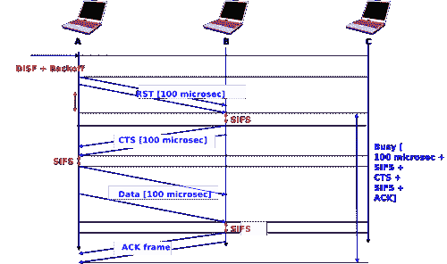(../_images/csmaca-reserv.png)

图 205 CSMA/CA 中的预留#

在冲突频繁的情况下，使用带有 CSMA/CA 的预留是一种有用的优化。如果冲突很少，传输 RTS 和 CTS 帧所需的时间可能会变得显著，尤其是在交换短帧时。一些设备仅在传输错误后开启 RTS/CTS。

### 确定性介质访问控制算法#

在 20 世纪 70 年代和 80 年代，网络社区就最适合局域网的介质访问控制算法进行了激烈的辩论。我们之前描述的乐观算法在它们设计时相对容易实现。从性能角度来看，数学模型和模拟显示了这些乐观技术维持负载的能力。然而，没有任何乐观技术能够保证在给定的延迟界限内交付帧，而某些应用程序需要可预测的传输延迟。确定性 MAC 算法被网络社区的一部分人视为满足局域网需求的最佳解决方案。

确定性技术和机会主义技术的支持者都游说制定标准，以将他们的解决方案纳入局域网。而不是试图在这两种相互矛盾的观点之间找到一个不可能的折中方案，负责制定局域网标准的 IEEE 802 委员会决定并行工作在三种不同的局域网技术上，并创建了三个工作组。[IEEE 802.3 工作组](http://www.ieee802.org/3/) 负责 CSMA/CD。确定性 MAC 算法的支持者就交换称为令牌的特殊帧以调节对传输介质访问的基本原则达成一致。然而，他们并没有就网络最合适的物理布局达成一致。IBM 支持环形网络，而由通用汽车领导的制造业则支持总线形网络。这导致了[IEEE 802.4 工作组](http://www.ieee802.org/4/)的创建，以标准化令牌总线网络，以及[IEEE 802.5 工作组](http://www.ieee802.org/5/)的创建，以标准化令牌环网络。尽管这些技术今天不再广泛使用，但基于令牌的协议背后的原理仍然很重要。

IEEE 802.5 令牌环技术定义在 [[IEEE802.5]](../bibliography.html#ieee802-5)。我们以令牌环为例来解释环形网络中基于令牌的 MAC 算法原理。其他环形网络包括已废弃的 FDDI [[Ross1989]](../bibliography.html#ross1989) 或弹性包环 [[DYGU2004]](../bibliography.html#dygu2004)。早期令牌环网络的良好综述可以在 [[Bux1989]](../bibliography.html#bux1989) 中找到。

令牌环网络由一组连接到单向环上的站点组成。令牌环 MAC 算法的基本原理是，两种类型的帧在环上传输：令牌和数据帧。当令牌环启动时，其中一个站点发送令牌。令牌是一个表示在环上传输数据帧的授权的小帧。要传输数据帧到环上，一个站点必须首先通过从环上移除令牌来捕获它。由于一次只能有一个站点捕获令牌，因此拥有令牌的站点可以在不冒风险发生冲突的情况下安全地在环上传输数据帧。在传输完其帧后，该站点必须将其从环上移除并重新发送令牌，以便其他站点可以传输它们自己的帧。


图 206 一个令牌环网络#

虽然令牌环的基本原理很简单，但有几个细微的实现细节增加了令牌环网络的复杂性。为了理解这些细节，让我们分析一个站点上令牌环接口的操作。令牌环接口有三个不同的用途。像其他局域网接口一样，它必须能够发送和接收帧。此外，令牌环接口是环的一部分，因此它必须能够在其站点断电时转发环上传递的电信号。

当启动时，令牌环接口以两种不同的模式运行：监听和传输。在监听模式下，令牌环接口从环上的上游邻居接收一个电信号，在环上引入一个等于一个比特传输时间的延迟，并在将其发送到环上的下游邻居之前再生该信号。

令牌环网络面临的第一问题是，作为传输授权的令牌，在没有数据帧传输时，它必须持续在环上传输。让我们假设一个令牌已经被一个站点产生并发送到环上。在令牌环网络中，令牌是一个 24 比特帧，其结构如下所示。


图. 207 802.5 令牌格式#

令牌由三个字段组成。首先，起始定界符是表示帧开始的标记。最初的令牌环网络使用曼彻斯特编码，起始定界符包含表示 0 的符号和不表示比特的符号。最后一个字段是结束定界符，它标记令牌的结束。访问控制字段存在于所有帧中，并包含几个标志。最重要的是令牌比特，它在令牌帧中设置，在其他帧中重置。

让我们考虑上面图 A Token Ring network 所示的五个站点网络，并假设站点 S1 发送一个令牌。如果我们忽略站点间链路上的传播延迟，因为每个站点引入一个比特延迟，帧的第一个比特会在发送令牌的第五比特时返回到 S1。如果那时站点 S1 断电，只有令牌的前五个比特会在环上传输。为了避免这个问题，每个令牌环上都有一个特殊的站点，称为监控器。为了确保令牌可以在环上永远传输，这个监控器插入一个等于至少 24 比特传输时间的延迟。如果图 A Token Ring network 中的监控器是站点 S3，S1 就能在收到上游邻居的第一个令牌比特之前发送整个令牌。

既然我们已经解释了如何在环上转发令牌，让我们分析一下站点如何捕获令牌以传输数据帧。为此，我们需要一些关于数据帧格式的信息。802.5 数据帧以起始定界符开头，后跟令牌位被重置的访问控制字段，一个帧控制字段，它允许定义多种类型的帧，目标地址和源地址，有效载荷，CRC，结束定界符和一个帧状态字段。令牌环数据帧的格式如下所示。


图 208 802.5 数据帧格式#

要捕获一个令牌，站点必须在监听模式下操作。在此模式下，站点从其上游邻居接收位。如果这些位对应于数据帧，它们必须转发给下游邻居。如果它们对应于令牌，站点可以捕获它并传输其数据帧。数据帧和令牌都编码为以起始定界符开头，后跟访问控制字段的位字符串。当站点接收到起始定界符的第一个位时，它无法知道这是一个数据帧还是一个令牌，必须将整个定界符转发给其下游邻居。只有当它接收到访问控制字段的第四位（即令牌位）时，站点才知道帧是数据帧还是令牌。如果令牌位被重置，它表示这是一个数据帧，数据帧的剩余位必须转发到下游站点。否则（令牌位被设置），这是一个令牌，站点可以通过重置其缓冲区中当前位的位来捕获它。多亏了这个修改，令牌的开始现在就是数据帧的开始，站点可以切换到传输模式，并从访问控制字段的第五位开始发送其数据帧。因此，每个令牌环站点引入的一个位延迟在使站点能够有效地捕获令牌方面发挥着关键作用。

在发送完其数据帧后，站点必须保持在传输模式下，直到它接收到其自身数据帧的最后一位。这确保了站点发送的位不会永远留在网络中。在令牌环网络中，由站点发送的数据帧会经过网络中连接的所有站点。每个站点都可以检测到数据帧并分析目标地址，以可能捕获该帧。

上文描述了当所有站点都正常工作时令牌环网络的基本操作。不幸的是，一个真实的令牌环网络必须能够处理各种类型的异常，这增加了令牌环站点的复杂性。我们简要列出问题及其解决方案如下。有关令牌环站点的详细操作描述，请参阅 [[IEEE802.5]](../bibliography.html#ieee802-5)。第一个问题是当所有连接到网络的站点启动时。其中之一必须通过发送第一个令牌来引导网络。为此，所有站点都实现了一种分布式选举机制，用于选择监控器。任何站点都可以成为监控器。监控器管理令牌环网络并确保其正确运行。它的第一个角色是引入 24 比特传输时间的延迟，以确保令牌可以在环上平稳地传输。其次，监控器在环上发送第一个令牌。它还必须验证令牌是否定期通过。根据令牌环标准 [[IEEE802.5]](../bibliography.html#ieee802-5)，一个站点不能保留令牌以传输数据帧的时间超过令牌保持时间（THT）（略小于 10 毫秒）。在一个包含 N 个站点的网络中，监控器必须至少每 $ N \times THT $ 秒接收令牌。如果在这样一个期间内监控器没有收到令牌，它将切断环一段时间，然后重新初始化环并发送令牌。

在令牌环网络中可能发生几种其他异常。例如，一个站点可能在重新发送令牌之前捕获令牌并关闭电源。另一个站点可能在收到所有数据帧之前捕获令牌、发送其数据帧并关闭电源。在这种情况下，对应于帧末尾的比特串将保留在环中，而不会被其发送者移除。在 [[IEEE802.5]](../bibliography.html#ieee802-5) 中定义了多种技术，以允许监控器处理所有这些问题。如果不幸的是监控器失败，另一个站点将被选为新的监控器。

## **拥塞控制**#

大多数网络包含具有不同带宽的链接。一些主机可以使用低带宽无线网络。一些服务器通过 10 Gbps 接口连接，而路由器之间的链接可能从每秒几十千比特到百吉比特不等。尽管这些性能差异巨大，但任何主机都应该能够高效地与高端服务器交换段。

为了更好地理解这个问题，让我们考虑以下图示的场景，其中一台连接到 10 Mbps 链路的服务器（A）需要通过包含 2 Mbps 链路的路径可靠地传输段到另一台计算机（C）。

> 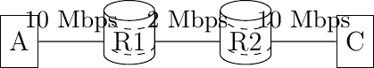
> 
> 图 209. 具有异构链接的可靠传输

在这个网络中，服务器发送的段到达路由器 R1。R1 将段转发到路由器 R2。路由器 R1 理论上可以以 10 Mbps 的速度接收段，但它只能以 2 Mbps 的速度将段转发到路由器 R2，然后转发到主机 C。路由器 R1 包含缓冲区，允许它存储那些不能立即转发到目的地的数据包。为了理解在这个环境中可靠传输协议的操作，让我们考虑一个简化的网络模型，其中主机 A 连接到一个 10 Mbps 的链路，该链路代表路由器 R1 的缓冲区队列。这个队列以 2 Mbps 的速度清空。

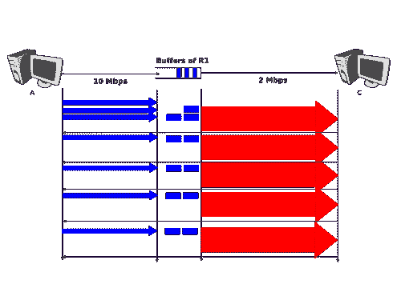

图. 210 自时钟#

让我们考虑主机 A 使用三个段的窗口。因此，它以 10 Mbps 的速度连续发送三个段，然后等待确认。当窗口满时，主机 A 停止发送段。这些段到达路由器 R1 的缓冲区。在这个缓冲区中存储的第一个段以 2 Mbps 的速度由路由器 R1 发送到目标主机。在接收到这个段后，目标发送一个确认。这个确认允许主机 A 传输一个新的段。这个段在传输由主机 A 发送的第二个段时存储在路由器 R1 的缓冲区中……因此，在第一个窗口段的传输之后，可靠传输协议在接收到来自目标每个返回的确认后发送一个数据段。在实践中，目标发送的确认充当一种时钟，允许发送主机根据目标接收段的速度调整其传输速率。这种自时钟是允许基于窗口的可靠传输协议适应异构网络的第一种机制 [[Jacobson1988]](../bibliography.html#jacobson1988)。它依赖于缓冲区的可用性来存储已由发送方发送但尚未传输到目标的数据段。

然而，传输协议不仅用于这个环境。在全球互联网中，大量主机向大量接收者发送段。例如，让我们考虑下面所示的网络，该网络类似于[[Jacobson1988]](../bibliography.html#jacobson1988)和[**RFC 896**](https://datatracker.ietf.org/doc/html/rfc896.html)中讨论的网络。在这个网络中，我们假设路由器的缓冲区是无限的，以确保没有数据包丢失。

> 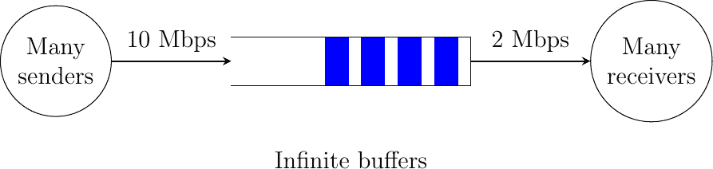
> 
> 图. 211 拥塞崩溃问题

如果许多发送器连接到上述网络的左侧部分，它们都会发送一个满窗口的段。这些段在传输到目的地之前被存储在路由器的缓冲区中。如果网络左侧有多个发送器，缓冲区的占用率会迅速增长。缓冲区占用的一个后果是，由传输协议测量的发送器和接收器之间的往返时间增加。考虑一个发送 10,000 比特段的网络。当缓冲区为空时，这样的段在 10 Mbps 链路上传输需要 1 毫秒，在 2 Mbps 链路上传输需要 5 毫秒。因此，如果我们忽略链路上的传播延迟，测量的往返时间大约是 6 毫秒。如果缓冲区包含 100 个段，往返时间变为 $ 1+100 \times 5+ 5 $ 毫秒，因为只有在所有之前的段都传输完毕后，新的段才会通过 2 Mbps 链路传输。不幸的是，如果可靠的传输协议使用重传计时器并执行回退-n 来从传输错误中恢复，它将重传一个完整的窗口段。这增加了缓冲区的占用率和通过缓冲区的延迟……此外，缓冲区可能在低带宽链路上存储和发送相同段的多个重传。这个问题被称为拥塞崩溃。在 20 世纪 80 年代末的互联网上发生了几次 [[Jacobson1988]](../bibliography.html#jacobson1988)。

拥塞崩溃是所有异构网络面临的问题。科学文献中已经提出了不同的机制来避免或控制网络拥塞。其中一些已经在实际网络中得到实现和部署。为了更详细地了解这个问题，让我们首先考虑一个简单的网络，其中两个主机连接到高速链路，并向连接到低速链路的 C 目的地发送段，如下所示。

> 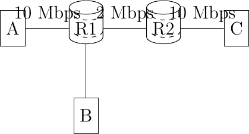
> 
> 图 212 拥塞问题

为了避免拥塞崩溃，主机必须通过使用拥塞控制机制来调节它们的传输速率 [[5]](#fcredit)。这样的机制可以在传输层或网络层实现。在 TCP/IP 网络中，它在传输层实现，但其他技术如异步传输模式（ATM）或帧中继在较低层包含拥塞控制机制。

让我们先考虑一个简单的例子，其中一组 $ i $ 个主机共享一个瓶颈链路，如上例所示。在这个网络中，拥塞控制方案必须实现以下目标 [[CJ1989]](../bibliography.html#cj1989) :

> 1.  网络拥塞控制方案必须避免拥塞。在实践中，这意味着瓶颈链路不能过载。如果 $ r_i(t) $ 是在时间 $ t $ 分配给主机 $ i $ 的传输速率，而 $ R $ 是瓶颈链路的带宽，那么拥塞控制方案应确保，平均而言，$ \forall{t} \sum{r_i(t)} \le R $。
> 1.  
> 1.  网络拥塞控制方案必须高效。瓶颈链路通常是共享且昂贵的资源。通常，瓶颈链路是广域链路，其升级成本远高于局域网。拥塞控制方案应确保这些链路得到有效利用。从数学上讲，控制方案应确保 $ \forall{t} \sum{r_i(t)} \approx R $。
> 1.  
> 1.  网络拥塞控制方案应该是公平的。大多数拥塞方案旨在实现最大最小公平性。如果将传输速率分配给源头的分配被认为是最大最小公平的，那么：
> 1.  
> > +   网络中的任何链路都没有拥塞
> > +   
> > +   分配给源 $ j $ 的速率不能增加，而不减少分配给源 $ i $ 的速率，其中 $ i $ 的分配小于源 $ j $ 的分配 [[Leboudec2008]](../bibliography.html#leboudec2008) 。

根据网络的不同，最大最小公平的分配可能并不总是存在。在实践中，最大最小公平是一个理想的目标，不一定能够实现。当存在单个瓶颈链路，如上述示例中那样时，最大最小公平意味着每个源头应分配相同的传输速率。

为了可视化不同的速率分配，考虑下面的图表是有用的。在这个图表中，我们在 x 轴（分别 y 轴）上绘制了分配给主机 B（分别 A）的速率。图中的点 $ (r_B,r_A) $ 对应于可能的传输速率分配。由于这个网络中有一个 2 Mbps 的瓶颈链路，因此图表可以分为两个区域。图表的左下部分包含所有不拥塞的分配 $ (r_B,r_A) $，即 $ r_A+r_B<2 $。这个区域的右边是效率线，即完全利用瓶颈链路的分配集合（$ r_A+r_B=2 $）。最后，公平线是公平分配的集合。


图. 213 可能的分配传输速率#

如上图所示，速率分配可能是公平但不高效的（例如 $ r_A=0.7,r_B=0.7 $），公平且高效的（例如 $ r_A=1,r_B=1 $）或高效但不公平的（例如 $ r_A=1.5,r_B=0.5 $）。理想情况下，分配应该是公平且高效的。不幸的是，在流量的数量波动中使用网络时保持这样的分配是一个具有挑战性的问题。此外，可能有数千个流量通过相同的链路 [[6]](#fflowslink)。

为了处理这些需求波动，这些波动导致可用带宽波动，计算机网络使用拥塞控制方案。这个拥塞控制方案应该实现上述三个目标。一些拥塞控制方案依赖于终端主机和路由器之间的紧密合作，而其他方案主要在终端主机上实现，并从路由器获得有限的支持。

拥塞控制方案可以建模为一个根据从网络接收到的反馈调整主机 $ i $ 的传输速率 ($ r_i(t) $) 的算法。可能存在不同类型的反馈。最简单的方案是二进制反馈 [[CJ1989]](../bibliography.html#cj1989) [[Jacobson1988]](../bibliography.html#jacobson1988)，其中主机简单地学习网络是否拥塞。一些拥塞控制方案允许网络定期向每个主机发送分配的传输速率，单位为 Mbps [[BF1995]](../bibliography.html#bf1995)。

让我们关注目前最广泛使用的二进制反馈方案。直观上，当检测到网络拥塞时，拥塞控制方案应该降低主机的传输速率，以避免拥塞崩溃。此外，当网络未拥塞时，主机应增加其传输速率。否则，主机将无法高效利用网络。分配给每个主机的速率会随着时间波动，取决于从网络接收到的反馈。图 图 214 展示了我们简单网络中分配给两个主机的传输速率的演变。最初，两个主机有较低的分配，但这并不高效。分配增加，直到网络变得拥塞。在此点，主机降低其传输速率以避免拥塞崩溃。如果拥塞控制方案工作良好，经过一段时间后，分配应该既公平又高效。

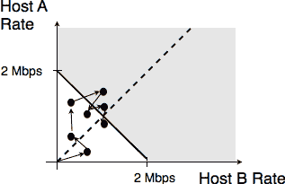

图 214 传输速率的演变#

可能存在多种类型的速率自适应算法。[Dah Ming Chiu](https://home.ie.cuhk.edu.hk/~dmchiu/) 和 [Raj Jain](https://www.cse.wustl.edu/~jain/) 在 [[CJ1989]](../bibliography.html#cj1989) 中分析了源可以使用以适应从网络接收到的反馈的不同类型的算法。直观上，这种速率自适应算法在网络未拥塞时增加传输速率（确保网络高效使用），在网络拥塞时降低传输速率（以避免拥塞崩溃）。

网络可以向源发送的最简单形式的反馈是二进制反馈（网络是否拥塞）。在这种情况下，线性速率自适应算法可以表示为：

> +   当网络拥塞时，$ rate(t+1)=\alpha_C + \beta_C rate(t) $
> +   
> +   当网络**不**拥塞时，$ rate(t+1)=\alpha_N + \beta_N rate(t) $

使用线性自适应算法时，$ \alpha_C,\alpha_N, \beta_C $ 和 $ \beta_N $ 是常数。[[CJ1989]](../bibliography.html#cj1989) 的分析表明，为了公平和高效，这种二进制速率自适应机制必须依赖于加性增加和乘性减少。当网络不拥塞时，主机应缓慢增加它们的传输速率（$ \beta_N=1~and~\alpha_N>0 $）。当网络拥塞时，主机必须乘性减少它们的传输速率（$ \beta_C < 1~and~\alpha_C = 0 $）。这样的 AIMD 速率自适应算法可以通过以下伪代码实现。

```sh
# Additive Increase Multiplicative Decrease
if congestion:
    rate = rate * betaC    # multiplicative decrease, betaC<1
else
    rate = rate + alphaN    # additive increase, alphaN > 0 
```

注意

哪种二进制反馈？

计算机网络中可能存在两种类型的二进制反馈。第一种解决方案是依赖于隐式反馈。这是 TCP 所选择的解决方案。TCP 的拥塞控制方案 [[Jacobson1988]](../bibliography.html#jacobson1988) 不需要来自路由器的任何合作。它只假设它们使用缓冲区，并在拥塞时丢弃数据包。TCP 使用段丢失作为拥塞的指示。当没有丢失时，假定网络不拥塞。这意味着拥塞是数据包丢失的主要原因。这在有线网络中是正确的，但不幸的是，在无线网络中并不总是如此。另一种解决方案是依赖于显式反馈。这是 DECBit 拥塞控制方案 [[RJ1995]](../bibliography.html#rj1995) 提出的解决方案，并在帧中继和 ATM 网络中使用。这种显式反馈可以通过两种方式实现。第一种解决方案是定义一种特殊消息，当路由器拥塞时可以发送给主机。不幸的是，生成此类消息可能会增加网络中的拥塞量。因此，这种拥塞指示数据包是不被鼓励的 [**RFC 1812**](https://datatracker.ietf.org/doc/html/rfc1812.html)。更好的方法是允许中间路由器在它们转发的数据包中指示它们当前的拥塞状态。二进制反馈可以通过在数据包头部使用一个比特来编码。在这种方案中，拥塞路由器在它们转发的数据包中设置一个特殊的比特，而非拥塞路由器则不修改此比特。目标主机在其发送的确认中返回网络的拥塞状态。有关 IP 网络中此类解决方案的详细信息，请参阅 [**RFC 3168**](https://datatracker.ietf.org/doc/html/rfc3168.html)。不幸的是，截至本文撰写时，尽管这种解决方案具有潜在的好处，但它仍未部署。

### 基于窗口的传输协议的拥塞控制#

AIMD 通过对当前拥塞水平做出反应来调整源头的传输速率以控制拥塞。如果网络没有拥塞，传输速率会增加。如果检测到拥塞，传输速率会乘性减少。在实践中，直接调整传输速率可能很困难，因为它需要使用细粒度计时器。在可靠的传输协议中，一个替代方案是动态调整发送窗口。这是 TCP 和 SCTP 等协议所选择的解决方案，这些协议将在稍后更详细地描述。为了了解基于窗口的协议如何调整它们的传输速率，让我们考虑一个非常简单的可靠传输协议场景，该协议使用 go-back-n。考虑图 图 215 中显示的非常简单的场景。

> 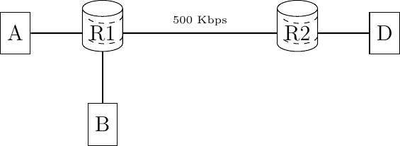
> 
> 图 215 一个简单的网络，主机共享瓶颈链路

主机与路由器之间的链路带宽为 1 Mbps，而两个路由器之间的链路带宽为 500 Kbps。在这个网络中没有显著的传播延迟。为了简单起见，假设主机 A 和 B 发送 1000 比特的包。在主机-路由器（分别。路由器-路由器）链路上传输这样的包需要 1 毫秒（分别。2 毫秒）。如果没有网络流量，主机 A 到达 D 的往返时间略大于 4 毫秒。让我们观察不同窗口大小的数据包流，以了解发送窗口和传输速率之间的关系。

首先考虑一个段窗口。这个段需要 4 毫秒才能到达主机 D。目的地用一个确认回复，然后可以传输下一个段。在这样的发送窗口下，传输速率大约是每秒 250 个段或 250 Kbps。这如图 图 216 所示，其中网格的每个方格对应于一毫秒。

> 
> 
> 图 216 从 A 到 D 的 Go-back-n 传输，一个段窗口

现在考虑一个两个段的窗口。主机 A 可以在其 1 Mbps 链路上在 2 毫秒内发送两个段。如果第一个段在时间 $ t_{0} $ 发送，它将在 $ t_{0}+4 $ 时到达主机 D。主机 D 用一个确认回复打开主机 A 的发送窗口，并允许它传输一个新的段。与此同时，第二个段被路由器 R1 缓冲。它将在 $ t_{0}+6 $ 时到达主机 D，并返回一个确认。在两个段窗口的情况下，主机 A 以大约 500 Kbps 的速度传输，即瓶颈链路的传输速率。

> 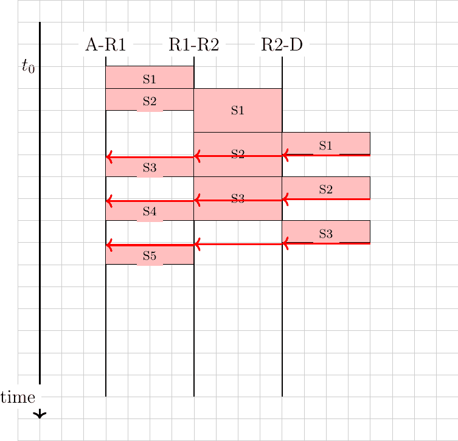
> 
> 图 217 从 A 到 D 的 Go-back-n 传输，两个段窗口

我们最后的例子是一个由四个部分组成的窗口。这些部分分别在 $ t_{0} $, $ t_{0}+1 $, $ t_{0}+2 $ 和 $ t_{0}+3 $ 时刻发送。第一个部分在 $ t_{0}+4 $ 时刻到达主机 D。主机 D 通过发送一个确认信息来回复这个部分，这个确认信息使得主机 A 能够发送其第五个部分。这个部分在 $ t_{0}+5 $ 时刻到达路由器 R1。那时，路由器 R1 正在将第三个部分发送到路由器 R2，而第四个部分仍然在其缓冲区中。在 $ t_{0}+6 $ 时刻，主机 D 接收到第二个部分并返回相应的确认信息。这个确认信息使得主机 A 能够发送其第六个部分。这个部分大约在 $ t_{0}+7 $ 时刻到达路由器 R1。那时，路由器开始将第四个部分发送到路由器 R2。由于 R1-R2 链路只能支持 500 Kbps，数据包将会在 R1 的缓冲区中积累。平均来说，将有两个数据包在 R1 的缓冲区中等待。这两个数据包的存在将导致传输协议测量的往返时间的增加。虽然第一个部分在 4 毫秒内得到了确认，但在 $ t_{0}+4 $ 时刻发送的第五个部分（数据(4)）直到 $ t_{0}+11 $ 时刻才得到确认。平均来说，发送方的发送速率为 500 Kbps，但大窗口的使用通过网络引入了更长的延迟。

> 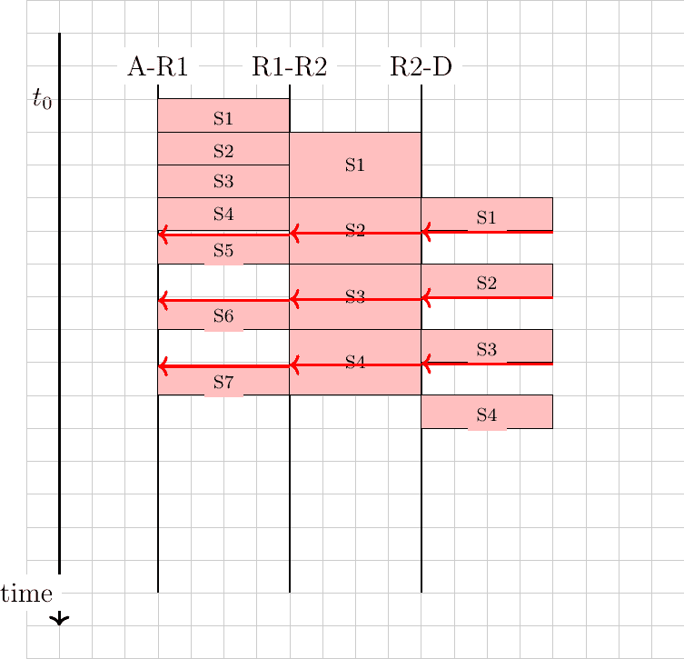
> 
> 图 218 从 A 到 D 的回退-n 传输，四个部分的窗口

从上面的例子中，我们可以通过调整可靠传输协议的发送窗口来调整传输速率。一个可靠的传输协议不能以每秒 $ \frac{window}{rtt} $ 个部分的速度发送数据，其中 $ window $ 是当前的发送窗口。为了控制传输速率，我们引入了拥塞窗口。这个拥塞窗口限制了发送窗口。在任何时候，发送窗口都被限制在 $ \min(swin,cwin) $，其中 swin 是发送窗口，cwin 是当前的拥塞窗口。当然，窗口还受到远程对端宣布的接收窗口的限制。通过使用拥塞窗口，一个使用固定大小数据包的简单可靠传输协议可以实现如下 AIMD。

对于 AIMD 的加性增加部分，我们的简单协议将每往返时间增加一个部分来增加其拥塞窗口。当检测到拥塞时，AIMD 的乘性减少部分可以通过将拥塞窗口减半来实现。为了简单起见，我们假设拥塞是通过二进制反馈检测到的，并且没有数据包丢失。我们将在后面的章节中更详细地讨论损失如何影响像 TCP 这样的实际传输协议。

我们简单传输协议的拥塞控制方案可以实施如下。

```sh
# Initialisation
cwin = 1  # congestion window measured in segments

# Ack arrival
if ack_received:
    if newack:  # new ack, no congestion
        # increase cwin by one every rtt
        cwin = cwin + (1/cwin)
    else:
        # no increase

if congestion_detected:
    cwin = cwin / 2 # only once per rtt 
```

在上述伪代码中，cwin 包含以段数为实数存储的拥塞窗口。该拥塞窗口在收到每个确认以及检测到拥塞时更新。为了简化，我们假设 cwin 以浮点数存储，但只能传输完整的段。

作为说明，让我们考虑上述网络场景，并假设路由器实现了 DECBit 二进制反馈方案 [[RJ1995]](../bibliography.html#rj1995)。该方案使用一种前向显式拥塞通知，当路由器的缓冲区包含一个或多个数据包时，路由器会在到达的数据包中标记拥塞位。在图 图 219 中，我们用 * 来表示标记的数据包。

> 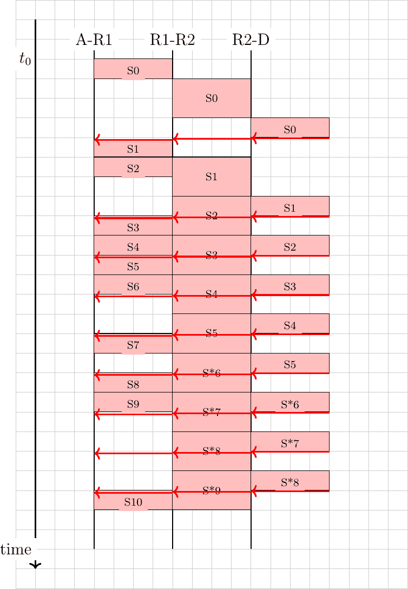
> 
> 图 219 从 A 到 D 的回退-n 传输，带有 AIMD 拥塞控制和 DecBit 二进制反馈方案

当连接开始时，其拥塞窗口设置为一段。段 S0 在大约 $ t_{0}+4 $ 时发送确认。拥塞窗口增加一段，S1 和 S2 在时间 $ t_{0}+4 $ 和 $ t_{0}+5 $ 时传输。相应的确认在时间 $ t_{0}+8 $ 和 $ t_{0}+10 $ 时收到。在收到最后一个确认后，拥塞窗口达到 3，可以发送段（S4 和 S5）。当段 S6 到达路由器 R1 时，其缓冲区已包含 S5。包含 S6 的数据包因此被标记，以通知发送者拥塞。请注意，发送者只有在收到时间 $ t_{0}+18 $ 的相应确认后才会注意到拥塞。在此期间，拥塞窗口继续增加。在 $ t_{0}+16 $，在收到 S5 的确认后，它达到 4。当检测到拥塞时，拥塞窗口降低到 2。这解释了从收到 S*6 的确认到发送 S10 之间的空闲时间。

在实践中，路由器连接到多个输入链路。图 图 220 展示了两个主机的示例。

> 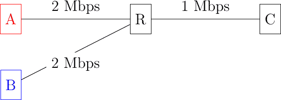
> 
> 图 220 具有主机共享瓶颈的简单网络
> 
> 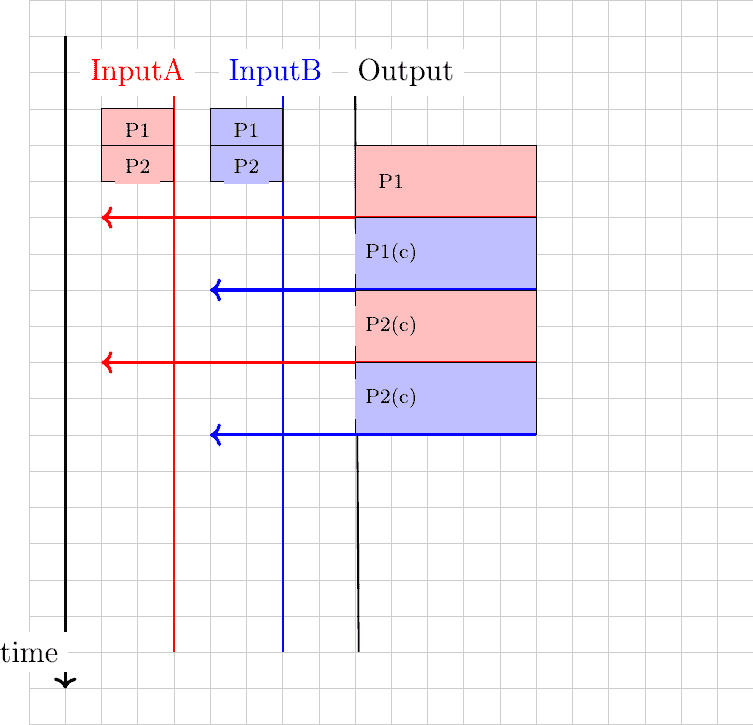
> 
> 图 221 不同输入之间共享瓶颈链路

通常，链路具有非零延迟。这在下图中得到了说明，其中在 R 和 C 之间的链路上添加了延迟。

> 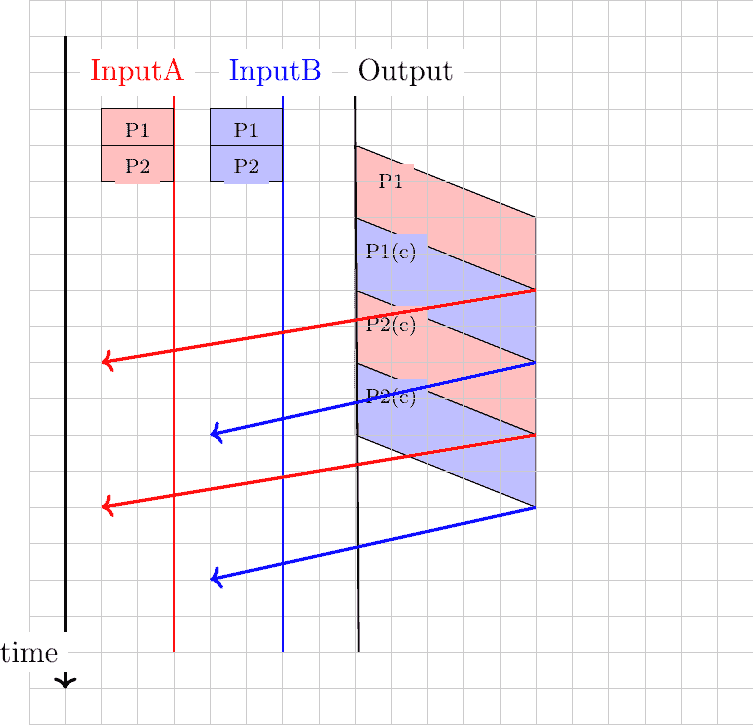
> 
> 图 222 不同输入之间共享瓶颈链路

### 拥塞控制#

在一个互联网中，即由不同类型的网络（如互联网）组成的网络，拥塞控制可以在网络层或传输层实现。拥塞问题在 20 世纪 80 年代末得到明确识别，开发了解决该问题技术的研究人员选择了传输层的解决方案。在传输层添加拥塞控制是有意义的，因为这一层提供可靠的数据传输，避免拥塞是这种可靠交付的一个因素。由于我们已经描述的自时钟特性，传输层已经处理了异构网络。在本节中，我们解释了如何将拥塞控制添加到 TCP，以及如何在未来改进这种机制。

TCP 拥塞控制方案最初由[Van Jacobson](https://en.wikipedia.org/wiki/Van_Jacobson)在[[Jacobson1988]](../bibliography.html#jacobson1988)中提出。当前规范可以在[**RFC 5681**](https://datatracker.ietf.org/doc/html/rfc5681.html)中找到。TCP 依赖于累加增加和乘性减少（AIMD）。为了实现 A IMD，TCP 主机必须能够控制其传输速率。一种初步的方法是使用计时器，并根据 A IMD 施加的速率调整它们的过期时间。不幸的是，维护大量 TCP 连接的此类计时器可能很困难。相反，[Van Jacobson](https://en.wikipedia.org/wiki/Van_Jacobson)指出，可以通过限制其发送窗口来人为地控制 TCP 拥塞的速率。TCP 连接的发送数据速率不能超过$ \frac{window}{rtt} $，其中$ window $是主机发送窗口和接收方广告窗口之间的最小值。

TCP 的拥塞控制方案基于拥塞窗口。拥塞窗口的当前值存储在每个 TCP 连接的 TCB 中，发送者可以使用的窗口由$ \min(cwnd,rwin,swin) $约束，其中$ swin $是当前发送窗口，$ rwin $是最后接收到的接收窗口。TCP 拥塞控制的累加增加部分在每个往返时间增加拥塞窗口 MSS 字节。在 TCP 文献中，这个阶段通常被称为拥塞避免阶段。TCP 拥塞控制的乘性减少部分在检测到拥塞后，将当前拥塞窗口的值除以一次。

当 TCP 连接开始时，发送主机不知道它用来到达目的地的网络部分是否拥塞。为了避免造成过多的拥塞，它必须从一个小的拥塞窗口开始。[[Jacobson1988]](../bibliography.html#jacobson1988)建议初始窗口为 MSS 字节。由于 TCP 拥塞控制方案的累加增加部分在每个往返时间增加 MSS 字节的拥塞窗口，TCP 连接可能需要等待多个往返时间才能有效地使用可用带宽。这在带宽乘以往返时间（$ bandwidth \times rtt $）乘积较高的环境中尤为重要。为了避免在达到足够大的拥塞窗口以有效地利用网络之前等待过多的往返时间，TCP 拥塞控制方案包括慢启动算法。TCP 慢启动阶段的目标是快速达到 cwnd 的可接受值。在慢启动期间，拥塞窗口在每个往返时间翻倍。慢启动算法在 TCB 中使用一个额外的变量：ssthresh（慢启动阈值）。ssthresh 是对未引起拥塞的 cwnd 最后值的估计。它初始化为发送窗口，并在每次拥塞事件后更新。

任何拥塞控制方案都必须回答的一个关键问题是如何检测拥塞。TCP 拥塞控制方案的第一种实现选择了简单而实用的方法：数据包丢失表示拥塞。如果网络拥塞，路由器缓冲区将满，数据包将被丢弃。在有线网络中，数据包丢失主要是由拥塞引起的。在无线网络中，数据包可能由于传输错误或其他与拥塞无关的原因而丢失。TCP 已经检测到段丢失以确保可靠交付。TCP 拥塞控制方案区分两种类型的拥塞：

> +   轻度拥塞。如果 TCP 收到三个重复的确认并执行快速重传，TCP 认为网络轻度拥塞。如果快速重传成功，这意味着只有一个数据段丢失。在这种情况下，TCP 执行乘性减少，拥塞窗口除以 2。慢启动阈值设置为新的拥塞窗口值。
> +   
> +   严重拥塞。当 TCP 的重传计时器超时时，TCP 认为网络严重拥塞。在这种情况下，TCP 会重传第一个数据段，将慢启动阈值设置为拥塞窗口的 50%。拥塞窗口重置为其初始值，TCP 执行慢启动。

下图说明了严重拥塞时拥塞窗口的演变。在连接开始时，发送者执行慢启动，直到第一个段丢失且重传计时器到期。此时，ssthresh 设置为当前拥塞窗口的一半，拥塞窗口重置为一个段。丢失的段被重传，因为发送者再次执行慢启动，直到拥塞窗口达到 sshtresh。然后它切换到拥塞避免，拥塞窗口线性增加，直到段丢失且重传计时器到期。

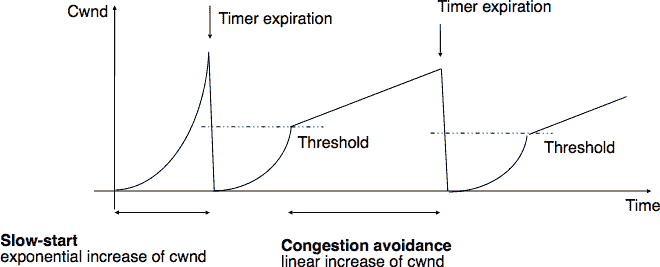(../_images/tcp-congestion-severe.png)

图 223 严重拥塞时 TCP 拥塞窗口的评估#

下图说明了网络轻微拥塞且所有丢失的段都可以使用快速重传重新传输时拥塞窗口的演变。发送者从慢启动开始。一个段丢失，但通过快速重传成功重传。由于这是轻微拥塞，拥塞窗口减半，发送者立即进入拥塞避免状态。

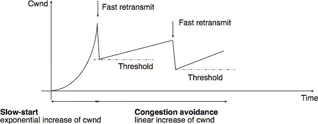(../_images/tcp-congestion-mild.png)

图 224 网络轻微拥塞时 TCP 拥塞窗口的评估#

大多数 TCP 实现会在收到确认时更新拥塞窗口。如果我们假设接收者确认每个接收到的段，并且发送者只发送 MSS 大小的段，则可以使用以下简化的伪代码实现 TCP 拥塞控制方案 [[7]](#fwrap)。此伪代码包括在[**RFC 3042**](https://datatracker.ietf.org/doc/html/rfc3042.html)中提出的优化，允许发送者在收到第一个或第二个重复确认后发送新的未发送数据。接收这些确认中的每一个都表明一个段已经离开网络，因此可以发送更多数据而不会造成更多拥塞。请注意，在收到这些第一个重复确认时，拥塞窗口不会增加。

```sh
# Initialization
cwnd = MSS  # congestion window in bytes
ssthresh= swin # in bytes

# Ack arrival
if tcp.ack > snd.una:  # new ack, no congestion
    if dupacks == 0:  # not currently recovering from loss
        if cwnd < ssthresh:
            # slow-start : quickly increase cwnd
            # double cwnd every rtt
            cwnd = cwnd + MSS
        else:
            # congestion avoidance : slowly increase cwnd
            # increase cwnd by one mss every rtt
            cwnd = cwnd + MSS * (MSS / cwnd)
    else:  # recovering from loss
        cwnd = ssthresh  # deflate cwnd RFC5681
        dupacks = 0
else:  # duplicate or old ack
    if tcp.ack == snd.una:  # duplicate acknowledgment
        dupacks += 1
        if dupacks == 1 or dupacks == 2:
            send_next_unacked_segment  # RFC3042
        if dupacks == 3:
            retransmitsegment(snd.una)
            ssthresh = max(cwnd/2, 2*MSS)
            cwnd = ssthresh
        if dupacks > 3:  # RFC5681
            cwnd = cwnd + MSS  # inflate cwnd
    else:
        # ack for old segment, ignored
        pass

Expiration of the retransmission timer:
    send(snd.una)  # retransmit first lost segment
    sshtresh = max(cwnd/2, 2*MSS)
    cwnd = MSS 
```

此外，当 TCP 连接空闲时间超过其当前的重传计时器时，它应将其拥塞窗口重置为连接开始时使用的拥塞窗口大小，因为它不再知道网络的当前拥塞状态。

注意

初始拥塞窗口

在 [[Jacobson1988]](../bibliography.html#jacobson1988) 中提出的原始 TCP 拥塞控制机制建议每个 TCP 连接应从设置 $ cwnd=MSS $ 开始。然而，在今天的宽带网络中，使用如此小的初始拥塞窗口严重影响了短 TCP 连接的性能，例如那些由 Web 服务器使用的连接。2002 年，[**RFC 3390**](https://datatracker.ietf.org/doc/html/rfc3390.html) 允许初始拥塞窗口约为 4 KBytes，这在许多环境中对应于 3 个段。最近，谷歌的研究人员提出了将初始窗口进一步增加到 15 KBytes [[DRC+2010]](../bibliography.html#drc-2010)。他们收集的测量数据显示，这种增加不会显著增加拥塞，但会显著减少短 HTTP 响应的延迟。不出所料，所选的初始窗口对应于搜索引擎的 HTTP 响应的平均大小。这种提出的修改已在 [**RFC 6928**](https://datatracker.ietf.org/doc/html/rfc6928.html) 中被采用，并且 TCP 实现支持它。

#### 无数据丢失地控制拥塞#

在今天的互联网中，通过定期以高于网络容量的速率发送数据包来控制拥塞。这些数据包填满了路由器的缓冲区，最终被丢弃。但不久之后，TCP 发送者会重新发送包含完全相同数据的数据包。这可能导致资源的浪费，因为这些连续的重传消耗了丢弃数据包的路由器上游的资源。数据包丢失并不是检测网络内部拥塞的唯一信号。一种替代方案是允许路由器在转发数据包时明确地指示其当前的拥塞水平。这种方法在 20 世纪 80 年代末被提出 [[RJ1995]](../bibliography.html#rj1995) 并在一些网络中使用。不幸的是，在互联网社区几乎经过十年才同意考虑这种方法。在此期间，大量的 TCP 实现和路由器被部署在互联网上。

如前所述，显式拥塞通知 [**RFC 3168**](https://datatracker.ietf.org/doc/html/rfc3168.html) 通过允许路由器在轻微拥塞时明确标记数据包来提高拥塞检测。理论上，数据包头部的一个比特 [[RJ1995]](../bibliography.html#rj1995) 就足以支持这种拥塞控制方案。当主机收到标记的数据包时，它会将拥塞信息返回给源主机，源主机据此调整其传输速率。尽管这个想法相对简单，但在整个互联网上部署它已被证明是具有挑战性的 [[KNT2013]](../bibliography.html#knt2013)。分析阻碍这种技术部署的不同因素是很有趣的。

在 TCP/IP 网络中添加显式拥塞通知 (ECN) 的第一个困难是修改网络数据包和传输段头的格式以携带所需的信息。在网络层，需要一个位来允许路由器在拥塞期间标记它们转发的数据包。在 IP 网络层，这个位被称为拥塞经历 (CE) 位，是数据包头部的一部分。然而，使用单个位来标记数据包是不够的。考虑一个有两个源、一个拥塞路由器和目的地简单的场景。假设第一个发送器和目的地支持 ECN，但第二个发送器不支持。如果路由器拥塞，它将标记来自两个发送器的数据包。第一个发送器将通过降低其传输速率来对数据包标记做出反应。然而，由于第二个发送器不支持 ECN，它不会对标记做出反应。此外，这个发送器可能会继续增加其传输速率，这将导致更多数据包被标记，第一个源将再次降低其传输速率，……最终，实现 ECN 的源与未实现 ECN 的源相比会受到惩罚。这个问题的不公平性是广泛部署 ECN 在公共互联网上的主要障碍 [[8]](#fprivate)。[**RFC 3168**](https://datatracker.ietf.org/doc/html/rfc3168.html) 中提出的解决这个问题的方案是在网络数据包头部使用第二个位。这个位被称为 ECN 兼容传输 (ECT) 位，表示数据包是否包含由支持 ECN 的传输协议产生的段。支持 ECN 的传输协议在所有数据包中设置 ECT 位。当路由器拥塞时，它首先验证 ECT 位是否设置。在这种情况下，数据包的 CE 位被设置为指示拥塞。否则，数据包将被丢弃。这简化了 ECN 的部署 [[9]](#fecnnonce)。

第二个困难是如何让接收方通知发送方已接收带有 CE 位标记的网络数据包。在像 TCP 和 SCTP 这样的可靠传输协议中，可以通过确认来提供这种反馈。对于 TCP 来说，有两种可能的选择：改变 TCP 段头中的某些位或定义一个新的 TCP 选项来携带这些信息。ECN 的设计者选择了在 TCP 头部重新使用空闲位。更确切地说，TCP 头部中增加了两个标志来支持 ECN。当在正向路径上接收到的数据包中的 CE 位被设置时，ECN-Echo (ECE) 标志会在确认中设置。


图 225 TCP 标志#

第三个困难是允许一个支持 ECN 的发送者检测远程主机是否也支持 ECN。这是一个经典的传输协议扩展协商。在 TCP 中，这可以通过在三次握手期间定义一个新的 TCP 选项来解决。为了避免在 TCP 选项中浪费空间，ECN 的设计者在 [**RFC 3168**](https://datatracker.ietf.org/doc/html/rfc3168.html) 中选择了使用 TCP 头部的 ECN-Echo 和 CWR 位来进行这种协商。最终，结果是相同的，但交换的位数更少。

多亏了 ECT、CE 和 ECE，路由器可以在拥塞期间标记数据包，接收器可以将拥塞信息返回给 TCP 发送者。然而，这三个位不足以让服务器可靠地向 TCP 发送者发送 ECE 位。TCP 确认不是可靠发送的。TCP 确认总是包含下一个期望的序列号。由于 TCP 确认是累积的，一个确认的丢失可以通过后续正确接收的确认来恢复。

如果将 TCP 确认过载用于携带 ECE 位，情况就不同了。考虑下面图中的示例。一个客户端通过路由器向服务器发送数据包。在下面的示例中，第一个数据包被标记。服务器返回一个设置了 ECE 位的确认。不幸的是，这个确认丢失了，并且从未到达客户端。不久之后，服务器发送了一个也携带累积确认的数据段。这个确认确认了数据已到达客户端，但它没有通过 ECE 位接收到拥塞信息。

> ![msc {
> 
> 客户端 [label="客户端", linecolour=black],
> 
> 路由器 [label="路由器", linecolour=black],
> 
> 服务器 [label="服务器", linecolour=black];
> 
> 客户端=>路由器 [ label = "data[seq=1,ECT=1,CE=0]", arcskip="1" ];
> 
> 路由器=>服务器 [ label = "data[seq=1,ECT=1,CE=1]", arcskip="1"];
> 
> |||;
> 
> 服务器=>路由器 [ label = "ack=2,ECE=1", arcskip="1" ];
> 
> 路由器 -x 客户端 [label="ack=2,ECE=1", arcskip="1" ];
> 
> |||;
> 
> 服务器=>路由器 [ label = "data[seq=x,ack=2,ECE=0,ECT=1,CE=0]", arcskip="1" ];
> 
> 路由器=>客户端 [ label = "data[seq=x,ack=2,ECE=0,ECT=1,CE=0]", arcskip="1"];
> 
> |||;
> 
> 客户端->服务器 [linecolour=white];
> 
> }](../Images/d2ed1589241adeb9e699082587d1916d.png)

为了解决这个问题，[**RFC 3168**](https://datatracker.ietf.org/doc/html/rfc3168.html) 在 TCP 头部中使用了额外的位：拥塞窗口减少 (CWR) 位。

> ![msc {
> 
> 客户端 [label="客户端", linecolour=black],
> 
> 路由器 [label="路由器", linecolour=black],
> 
> 服务器 [label="服务器", linecolour=black];
> 
> 客户端=>路由器 [ label = "data[seq=1,ECT=1,CE=0]", arcskip="1" ];
> 
> 路由器=>服务器 [ label = "data[seq=1,ECT=1,CE=1]", arcskip="1"];
> 
> |||;
> 
> 服务器=>路由器 [ label = "ack=2,ECE=1", arcskip="1" ];
> 
> 路由器 -x 客户端 [label="ack=2,ECE=1", arcskip="1" ];
> 
> |||;
> 
> server=>router [ label = "data[seq=x,ack=2,ECE=1,ECT=1,CE=0]", arcskip="1" ];
> 
> router=>client [ label = "data[seq=x,ack=2,ECE=1,ECT=1,CE=0]", arcskip="1"];
> 
> |||;
> 
> client=>router [ label = "data[seq=1,ECT=1,CE=0,CWR=1]", arcskip="1" ];
> 
> router=>server [ label = "data[seq=1,ECT=1,CE=1,CWR=1]", arcskip="1"];
> 
> |||;
> 
> client->server [linecolour=white];
> 
> }](../Images/36533b7c4d47ba50cac29ebf6ebcc1f1.png)

TCP 头部的 CWR 位为 ECE 位提供了一种确认形式。当 TCP 接收方检测到标记了 CE 位的分组时，它会将其返回给发送方的所有段中的 ECE 位置位。在收到 ECE 位已置位的确认后，发送方将其拥塞窗口减少以反映轻微的拥塞，并设置 CWR 位。只要接收到的段包含已置位的 ECE 位，此位将保持置位状态。发送方应仅对每个往返时间标记的分组做出一次反应。

需要讨论的最后一个关于显式拥塞通知的问题是路由器用于检测拥塞的算法。在路由器上，拥塞通过路由器缓冲区中存储的分组数量来体现。如前所述，我们需要区分两种类型的路由器：

> +   具有单个 FIFO 队列的路由器
> +   
> +   由轮询调度器服务的具有多个队列的路由器

使用单个队列的路由器将它们的缓冲区占用率测量为队列中存储的数据包字节数 [[10]](#fslot)。检测拥塞的一种方法是测量瞬时的缓冲区占用率，一旦这个占用率超过一个阈值，就认为路由器发生了拥塞。阈值的典型值可能是总缓冲区的 40%。测量瞬时的缓冲区占用率很简单，因为它只需要一个计数器。然而，从控制的角度来看，这个值是脆弱的，因为它会频繁变化。一个更好的解决方案是测量*平均*缓冲区占用率，并在这个平均占用率过高时认为路由器发生了拥塞。随机早期检测（RED）[[FJ1993]](../bibliography.html#fj1993) 是一个设计用来支持显式拥塞通知的算法。除了测量平均缓冲区占用率外，它还使用概率标记。当路由器拥塞时，到达的数据包会以随着平均缓冲区占用率增加的概率被标记。使用概率标记而不是标记所有到达的数据包的主要优点是，流量将被按它们传输的数据包数量成比例地标记。如果路由器在拥塞时标记了 10%的到达数据包，那么每秒发送一百个数据包的大流量将被标记 10 次，而每秒只发送一个数据包的流量则不会被标记。这种概率标记允许按数据包对网络资源使用的比例进行标记。

如果路由器使用由调度器服务的多个队列，情况就不同了。如果一个大型流量和一个小型流量在争夺带宽，调度器已经会偏向于使用带宽份额不足的小流量。小型流量的队列几乎会空，而大型流量的队列则会逐渐增加。在采用此类调度器的路由器上，标记数据包的一个好方法是设置每个队列的占用率阈值，并在特定队列的占用率超过配置的阈值时立即标记到达该队列的数据包。

#### 模拟 TCP 拥塞控制#

由于其拥塞控制方案，TCP 会根据网络中发生的损失来调整其传输速率。直观地说，当损失百分比增加时，TCP 的传输速率会降低。研究人员已经提出了详细的模型，允许预测 TCP 连接在发生损失时的吞吐量 [[MSMO1997]](../bibliography.html#msmo1997)。为了对影响 TCP 性能的因素有所了解，让我们考虑一个非常简单的模型。它的假设并不完全现实，但它能给我们良好的直觉，而不需要复杂的数学。

该模型考虑了一个假设的 TCP 连接，该连接遭受均匀分布的段丢失。如果 $ p $ 是段丢失率，那么 TCP 连接成功传输 $ \frac{1}{p}-1 $ 个段，下一个段丢失。如果我们忽略连接开始时的慢启动，由于只有可以通过快速重传恢复的孤立丢失，因此在此环境中 TCP 始终处于拥塞避免状态。因此，拥塞窗口的演变如图所示。请注意，该图的 x 轴表示以往返时间为单位的测量时间，在模型中应保持恒定，而 y 轴表示以 MSS 大小的段为单位的拥塞窗口大小。


图 226：规律性丢失下的拥塞窗口演变#

由于丢失是均匀分布的，拥塞窗口始终从某个值（$ \frac{W}{2} $）开始，并在每个往返时间增加一个 MSS，直到达到这个值的两倍（W）。此时，一个段被重传，周期重新开始。如果以 MSS 大小的段来衡量拥塞窗口，一个周期持续 $ \frac{W}{2} $ 个往返时间。TCP 连接的带宽是在给定时间段内已传输的字节数。在一个周期内，TCP 连接上发送的段数等于图中黄色梯形的面积。因此，其面积为：

> $ area=(\frac{W}{2})² + \frac{1}{2} \times (\frac{W}{2})² = \frac{3 \times W²}{8} $

然而，考虑到我们考虑的规律性丢失，两个丢失之间的段数（即在周期内）根据定义等于 $ \frac{1}{p} $。因此，$ W=\sqrt{\frac{8}{3 \times p}}=\frac{k}{\sqrt{p}} $。TCP 连接的吞吐量（以每秒字节数表示）等于传输的段数除以周期持续时间：

> $ Throughput=\frac{area \times MSS}{time} = \frac{ \frac{3 \times W²}{8}}{\frac{W}{2} \times rtt} $ 或者，在消除 W 之后，$ Throughput=\sqrt{\frac{3}{2}} \times \frac{MSS}{rtt \times \sqrt{p}} $

更详细的模型和模拟分析表明，当发生丢包时，TCP 吞吐量的首阶模型为 $ Throughput \approx \frac{k \times MSS}{rtt \times \sqrt{p}} $。这是一个重要的结果，它表明：

> +   当发生丢包时，具有较短往返时间的 TCP 连接可以比具有较长往返时间的 TCP 连接实现更高的吞吐量。这表明 TCP 拥塞控制方案并不完全公平，因为它有利于具有较短的往返时间的连接。
> +   
> +   使用较大 MSS 的 TCP 连接可以比使用较短 MSS 的 TCP 连接实现更高的吞吐量。这为 TCP 连接之间又增加了不平等的一个来源。然而，需要注意的是，如今大多数主机几乎都使用相同大小的 MSS，大约为 1460 字节。

通常，TCP 连接能够达到的最大吞吐量取决于其最大窗口大小和往返时间，如果没有丢失。如果有丢失，则取决于 MSS、往返时间和丢失率。

> $ Throughput<\min(\frac{window}{rtt},\frac{k \times MSS}{rtt \times \sqrt{p}}) $

注意

TCP 拥塞控制动物园

第一个 TCP 拥塞控制方案是由[Van Jacobson](https://en.wikipedia.org/wiki/Van_Jacobson)在[[Jacobson1988]](../bibliography.html#jacobson1988)提出的。除了撰写科学论文外，[Van Jacobson](https://en.wikipedia.org/wiki/Van_Jacobson)还在伯克利大学分发的 BSD Unix 的 4.3 Tahoe 版本中实现了慢启动和拥塞避免方案。后来，他在 4.3 BSD Unix 的 Reno 版本中通过添加快速重传和快速恢复机制来改进拥塞控制。从那时起，许多研究人员提出了、模拟并实现了对 TCP 拥塞控制方案的修改。其中一些修改至今仍在使用，例如：

> +   NewReno([**RFC 3782**](https://datatracker.ietf.org/doc/html/rfc3782.html))，它被提出作为 Reno 实现中快速恢复机制的改进。
> +   
> +   TCP Vegas 使用往返时间的变化来估计拥塞以避免它[[BOP1994]](../bibliography.html#bop1994)。这是基于延迟的拥塞控制算法的一个例子。Vegas 发送器持续测量往返时间的演变，并在往返时间显著增加时减速。这使得 Vegas 在单独使用时能够防止拥塞。不幸的是，如果 Vegas 发送器与仅对丢失做出反应的更具侵略性的 TCP 拥塞控制方案竞争，Vegas 发送器可能难以使用其应有的带宽份额。
> +   
> +   CUBIC 是为高带宽链路设计的，自 Linux 2.6.19 内核以来一直是 Linux 的默认拥塞控制方案[[HRX2008]](../bibliography.html#hrx2008)。现在它被几个操作系统使用，并正在成为默认的拥塞控制方案[**RFC 8312**](https://datatracker.ietf.org/doc/html/rfc8312.html)。CUBIC 与本章中描述的 TCP 拥塞控制方案的一个关键区别在于，CUBIC 在探测网络时更为激进。它不是在快速恢复后依赖加性增长，而是通过使用立方函数来调整拥塞。多亏了这个函数，拥塞窗口增长得更快。这在高带宽延迟网络中尤为重要。
> +   
> +   BBR 是由谷歌研究人员开发并包含在最近的 Linux 内核中的技术[[CCG+2016]](../bibliography.html#ccg-2016)。BBR 定期估计可用带宽和往返时间。为了适应网络条件的变化，BBR 定期尝试以当前带宽的 1.25 倍发送数据。这使 BBR 发送者能够探测网络，但也可能导致大量损失。最近的科学文章表明，在特定条件下，BBR 对其他拥塞控制方案是不公平的[[WMSS2019]](../bibliography.html#wmss2019)。

在科学文献中已经提出了多种拥塞控制方案，其中一些已经被广泛部署。这些拥塞控制方案的详细比较超出了本章的范围。一篇最近的研究综述描述了许多已实现的 TCP 拥塞控制方案，可以在[[TKU2019]](../bibliography.html#tku2019)中找到。

脚注

脚注

## 分享带宽#

在所有这些网络中，除了全网状网络外，链路带宽被所有连接的主机共享。已经提出了各种算法，并用于有效地共享对这一资源的访问。我们将在下面的介质访问控制部分解释其中的一些。

注释

计算机网络中的公平性

分享资源对于确保网络高效地为用户提供服务至关重要。在实践中，有许多共享资源的方法。一些资源共享方案认为某些用户比其他用户更重要，应该获得更多资源。例如，在道路上，警车和救护车有优先权。在一些城市，交通车道被保留给公交车以促进公共服务，……在计算机网络中，同样的问题也会出现。鉴于资源有限，网络需要使用户能够有效地共享资源。在设计一个有效的资源共享方案之前，首先需要形式化其目标。在计算机网络中，资源共享方案最流行的目标之一是它们必须是公平的。在简单的情况下，例如两个主机使用共享的 2 Mbps 链路，资源共享方案应该为每个用户分配相同的带宽，在这种情况下为 1 Mbps。然而，在大规模网络中，简单地按用户数量分配可用资源是不够的。考虑下面图中所示的网络，其中 A1 向 A2 发送数据，B1 向 B2 发送，……在这个网络中，我们应该如何在不同流之间分配带宽？一种初步的方法是为每个流分配相同的带宽。在这种情况下，每个流将获得 5 Mbps，R2 和 R3 之间的链路将不会完全负载。另一种方法是分配 10 Mbps 给 A1-A2，20 Mbps 给 C1-C2，而 B1-B2 则不分配。这显然是不公平的。

> 
> 
> 图 192 一个小网络

在大型网络中，公平性总是需要妥协的。最广泛使用的公平性定义是最大最小公平性。如果一个网络的带宽分配是最大最小公平的，那么它意味着不可能在不减少比我们想要增加的流量分配更小的流量带宽的情况下，为其中一个流量分配更多的带宽。如果网络完全已知，可以推导出最大最小公平分配如下。最初，所有流量都有一个零带宽，并且它们被放置在候选集中。候选集中所有流量的带宽分配都会增加，直到一个链路变得拥塞。此时，使用拥塞链路的流量已达到最大分配。它们被从候选集中移除，然后继续这个过程，直到候选集变为空。

在上述网络中，所有流量的分配会增长，直到 A1-A2 和 B1-B2 达到 5 Mbps。此时，R1-R2 链路变得拥塞，这两个流量已达到最大。C1-C2 流量的分配可以增加，直到达到 15 Mbps。此时，R2-R3 链路变得拥塞。要增加分配给 C1-C2 的带宽，需要减少分配给 B1-B2 的带宽。同样，增加 B1-B2 的分配的唯一方法需要减少 A1-A2 的分配。

## 网络拥塞#

在直接连接到链路的宿主机之间共享带宽并不是计算机网络中唯一出现的共享问题。为了理解一般问题，让我们考虑一个非常简单的网络，该网络只包含点对点链路。这个网络包含三个宿主机和两个路由器。网络内部的所有链路都有相同的容量。例如，让我们假设所有链路的带宽为每秒 1000 比特，并且宿主机发送包含恰好一千比特的数据包。

> 
> 
> 图 193 一个小网络

在上面的网络中，考虑宿主机 A 向目的地 C 传输数据包的情况。A 可以每秒发送一个数据包，并且其数据包将被送达 C。现在，让我们探索当宿主机 B 也开始传输数据包时会发生什么。节点 R1 将接收到两个必须转发到 R2 的数据包。不幸的是，由于 R1-R2 链路上的带宽有限，只能传输这两个数据包中的一个。第二个数据包的结果将取决于 R1 上的可用缓冲区。如果 R1 有一个可用缓冲区，它可以存储在 R1-R2 链路上尚未传输的数据包，直到链路变得可用。如果没有可用缓冲区，则该数据包需要被丢弃。

除了链路带宽外，网络节点上的缓冲区是需要在网络内部共享的第二类资源。节点缓冲区在网络操作中扮演着重要角色，因为它们可以用来吸收瞬时的流量峰值。再次考虑上述例子。假设主机 A 和主机 B 平均每十秒发送一组三个数据包。它们的总传输速率（每秒 0.6 个数据包）平均低于网络容量（每秒 1 个数据包）。然而，如果它们同时开始传输，节点 R1 将不得不吸收一个数据包的突发。这个数据包的突发是一个小的网络拥塞。我们将说网络拥塞，当来自主机的总流量需求大于网络容量时 $ \sum{demand}>capacity $。这个网络拥塞问题是计算机网络中最难的资源共享问题之一。拥塞几乎发生在所有网络中。最小化拥塞量是许多网络运营商的关键目标。在大多数情况下，他们必须接受短暂的拥塞，即持续几秒或几分钟的拥塞，但他们会希望防止持续数天或数月的拥塞。为此，他们可以依赖一系列广泛的解决方案。我们将在下面的段落中简要介绍其中的一些。

如果 R1 有足够的缓冲区，它将能够吸收负载而无需丢弃数据包。主机 A 和 B 发送的数据包将到达它们的最终目的地 C，但将比单独传输时经历更长的延迟。网络节点上的缓冲区数量是网络运营商可以调整以控制其网络内部拥塞的第一个参数。鉴于内存成本的降低，人们可能会倾向于在网络节点上放置尽可能多的缓冲区 [[1]](#fbufferbloat)。让我们考虑上述网络中的这种情况，并假设 R1 有无限的缓冲区。现在假设主机 A 和 B 尝试传输一个对应于一千个数据包的文件。两者都使用依赖回退 N 来恢复传输错误的可靠协议。传输开始，数据包开始积累在 R1 的缓冲区中。这些数据包在缓冲区中的存在增加了 A（以及 B）发送数据包和接收相应确认之间的延迟。鉴于延迟的增加，主机 A（以及 B）将认为它发送的一些数据包已经丢失。这些数据包将被重新传输并进入 R1 的缓冲区。R1 缓冲区的占用将继续增加，延迟也是如此。这将导致新的重传，……最终，只有一个文件（非常慢地）被发送到目的地，但 R1-R2 链路将传输比文件大小更多的字节，因为相同数据包的多个副本。这被称为拥塞崩溃问题 [**RFC 896**](https://datatracker.ietf.org/doc/html/rfc896.html)。拥塞崩溃是网络运营商的噩梦。当它发生时，网络携带数据包而不向最终用户传输有用数据。

注意

互联网上的拥塞崩溃

拥塞崩溃不幸地不仅仅是一种学术经验。Van Jacobson 在 [[Jacobson1988]](../bibliography.html#jacobson1988) 中报告了这样一件事件，当时他在劳伦斯伯克利实验室（LBL）工作。LBL 距离加州大学伯克利分校有两个网络节点。当时，两个站点之间的链路带宽为 32 Kbps，但一些主机已经连接到 10 Mbps 的局域网。 “1986 年 10 月，从 LBL 到加州大学伯克利的……数据吞吐量从 32 Kbps 下降到 40 bps。我们对这种带宽突然下降到千分之一的现象感到着迷，并开始调查为什么事情变得如此糟糕。” 这项工作导致了各种拥塞控制技术的发展，这些技术使得互联网能够在不经历广泛的拥塞崩溃事件的情况下继续增长。

除了带宽和内存之外，网络内部需要共享的第三个资源是（数据包）处理能力。为了转发一个数据包，路由器需要在出链路上有带宽，但它还需要分析数据包头部以在其转发表中执行查找。执行这些查找操作需要资源，如 CPU 周期或内存访问。路由器通常设计为能够维持一定的数据包处理速率，以每秒数据包数来衡量 [[2]](#fpps)。

注意

每秒数据包数与每秒比特数

网络节点（无论是路由器还是交换机）的性能可以通过两个关键指标来表征：

> +   节点的每秒比特数容量
> +   
> +   节点的每秒查找性能

节点的每秒比特数容量主要取决于它所使用的物理接口，以及节点内部不同接口之间的内部互连（总线、交叉开关等）的容量。许多供应商，特别是对于低端设备，会将节点接口的带宽总和作为节点的每秒比特数容量。测量结果并不总是与这个最大理论容量相匹配。一个设计良好的网络节点通常其每秒比特数容量会大于其链路容量的总和。这样的节点通常在转发大型数据包时达到这个最大容量。

当网络节点转发小型数据包时，其性能通常受限于它每秒可以执行查找操作的数量。这种查找性能以每秒数据包数来衡量。性能可能取决于转发数据包的长度。关键性能因素是节点每秒转发的最小尺寸数据包的数量。这个速率可能导致每秒比特数容量远低于节点链路带宽的总和。

现在，让我们尝试对网络中的拥塞问题进行广泛的概述。我们将假设网络由具有固定带宽的专用链路组成[[3]](#fadjust)。网络包含生成和接收数据包的主机以及转发数据包的节点（路由器和交换机）。假设每个主机通过单个链路连接到网络，最大的需求是 $ \sum{访问链路} $。实际上，这个最大的需求永远不会达到，网络将被设计成能够承受远低于最大交通需求。最坏情况下的交通需求与可持续的交通需求之间的差异可能很大，高达几个数量级。幸运的是，主机并不完全愚蠢，它们可以根据网络的当前状态和可用带宽调整自己的交通需求。为此，主机需要感知当前的拥塞水平并根据估计的拥塞调整自己的交通需求。网络节点可以以不同的方式对网络拥塞做出反应，主机也可以以不同的方式感知拥塞水平。

让我们先探索可以在网络内部使用的机制来控制拥塞，以及这些机制如何影响终端主机的行为。

如前所述，网络节点上拥塞的第一个表现是网络链路的饱和，这导致节点缓冲区占用率的增长。缓冲区占用率的增长意味着一些数据包将在缓冲区中花费更多的时间，从而在网络中停留更长时间。如果主机测量网络延迟（例如，通过测量数据包传输和相应的确认返回之间的往返时间），它们可以开始感知拥塞。在低带宽链路上，缓冲区占用率的增长可能导致延迟的增加，这可以通过终端主机轻松测量。在高带宽链路上，缓冲区内的几个数据包可能导致延迟的小幅变化，这不一定比延迟测量的自然波动更大。

如果缓冲区的占用率持续增长，它将溢出，并且需要丢弃数据包。在拥塞期间丢弃数据包是网络节点对拥塞的第二种可能反应。在探讨节点如何丢弃数据包之前，讨论缓冲区占用对通过网络可靠传输数据的影响是有趣的。这可以通过图图 194，改编自[[Jain1990]](../bibliography.html#jain1990)来说明。


图. 194 网络拥塞#

当网络负载较低时，缓冲区占用率和链路利用率都较低。网络节点上的缓冲区主要用于吸收非常短暂的数据包突发，但平均而言，流量需求低于网络容量。如果需求增加，平均缓冲区占用率也会增加。测量表明，总吞吐量也会增加。如果缓冲区占用率为零或非常低，可能会错过网络链路上的传输机会。然而，当缓冲区占用率较小但非零时，情况并非如此。但是，如果缓冲区占用率持续增加，缓冲区就会过载，吞吐量不再增加。当缓冲区占用率接近最大值时，吞吐量可能会下降。这种吞吐量下降可能是由于可靠协议的过度重传造成的，这些协议错误地假设之前发送的数据包已经丢失，而它们仍在缓冲区中等待。另一方面，网络延迟会随着缓冲区占用率的增加而增加。在实践中，网络缓冲区的一个良好工作点是低占用率，以实现高链路利用率和低延迟，这对于交互式应用来说也很重要。

丢弃数据包是网络节点可以用来通知主机当前拥塞程度的信号之一。网络节点上的缓冲区通常用作 FIFO 队列以保持数据包的顺序。已经为网络节点提出了几种数据包丢弃机制。这些技术基本上回答了两个不同的问题：

> +   什么触发了一个数据包被丢弃？导致网络节点决定丢弃数据包的条件是什么？对这个问题的最简单回答是：当缓冲区满时。虽然这是一个很好的拥塞指示，但从性能角度来看，可能不是最好的。另一种选择是在缓冲区占用率增长过多时丢弃数据包。在这种情况下，缓冲区很快就会满。由于数据包丢弃是一种允许主机调整其传输速率的信息，因此提前丢弃数据包可以允许主机更早地做出反应，从而防止拥塞发生。
> +   
> +   应该丢弃哪个（些）数据包？一旦网络节点决定丢弃数据包，它实际上需要丢弃真实的数据包。

通过结合对这些问题的不同回答，网络研究人员已经开发出了不同的数据包丢弃机制。

> +   尾部丢弃是最简单的数据包丢弃技术。当缓冲区满时，到达的数据包被丢弃。尾部丢弃可以很容易地实现。这到目前为止是最广泛使用的丢弃机制。然而，它有两个重要的缺点。首先，由于尾部丢弃仅在缓冲区满时丢弃数据包，缓冲区往往会拥塞，实时应用可能会遭受增加的延迟。其次，尾部丢弃在丢弃数据包时是盲目的。它可能会丢弃来自低带宽交互流的数据包，而大多数缓冲区被大文件传输占用。
> +   
> +   前端丢弃是另一种数据包丢弃技术。它不是移除到达的数据包，而是移除队列头部的数据包。丢弃这个数据包而不是到达的数据包可以有两个优点。首先，它已经在缓冲区中停留了很长时间。其次，主机应该能够更早地检测到丢失（以及拥塞）。
> +   
> +   概率丢弃。已经提出了各种随机丢弃技术。经常引用的技术是随机早期丢弃（RED）[[FJ1993]](../bibliography.html#fj1993)。RED 测量平均缓冲区占用率，并在平均占用率过高时以一定的概率丢弃数据包。与尾部丢弃和前端丢弃相比，RED 的一个优点是，由于概率丢弃，应该按不同流带宽的比例丢弃数据包。

丢弃数据包是应对网络拥塞的常见反应。不幸的是，丢弃数据包并不是最佳选择，因为在一个网络节点上被丢弃的数据包已经在上游节点上消耗了资源。网络还有其他方式来告知终端主机当前的拥塞水平。一种解决方案是在节点拥塞时标记数据包。几种网络技术都依赖于这种类型的数据包标记。

在数据报网络中，可以使用前向显式拥塞通知（FECN）。数据包头部的一个字段，通常是一个比特位，用于指示拥塞。当主机发送数据包时，拥塞位被清除。如果数据包通过一个拥塞节点，拥塞位被设置。目的地可以通过测量收到拥塞位设置的数据包的比例来确定当前的拥塞水平。然后，它可以向发送主机返回此信息，以便它能够调整其重传速率。与丢弃数据包相比，FECN 的主要优势是主机可以明确检测到拥塞，而无需依赖于数据包丢失。

在虚拟电路网络中，如果返回包遵循正向包的反向路径，则数据包标记可以得到改进。在这种情况下，网络节点可以检测到正向路径上的拥塞（例如，由于其缓冲区的大小），但在反向路径上标记数据包。与 FECN 相比，标记返回包（例如，可靠协议使用的确认）为发送主机提供了更快的反馈。这种技术通常称为向后显式拥塞通知（BECN）。

如果数据包头部不包含表示当前拥塞级别的任何位，则一种替代方法是允许网络节点向源发送控制包以指示当前拥塞级别。一些网络技术使用此类控制包来显式调节源头的传输速率。然而，它们的用途主要限于小型网络。在大规模网络中，网络节点通常避免使用此类控制包。在某些网络中，这些控制包甚至被认为是有危险的。首先，在拥塞时使用它们会增加网络负载。其次，虽然网络节点优化了转发数据包，但它们通常在创建新数据包方面相当慢。

当路由器出现拥塞时，丢弃和标记数据包并不是唯一的可能反应。路由器还可以选择性地延迟某些流的包。路由器可以使用不同的算法来延迟数据包。如果路由器的目标是公平地分配输出链路的带宽给竞争的流，一个可能的方法是将路由器的缓冲区组织成一组队列。为了简化，让我们假设路由器能够支持固定数量的并发流，比如说 N。路由器的一个队列与每个流相关联，当一个数据包到达时，它被放置在相应队列的尾部。所有队列都由一个调度器控制。调度器是一种算法，每次有机会在出站链路上传输数据包时都会运行。科学文献中已经提出了各种调度器，其中一些被用于实际的路由器中。

> 
> 
> 图 195：循环调度器，其中 N = 5

一个非常简单的调度器是循环调度器。这种调度器以循环方式服务于所有队列。如果所有流发送相同大小的数据包，那么循环调度器将带宽公平地分配给不同的流。否则，它更倾向于使用较大数据包的流。为了在具有可变长度数据包的情况下提供带宽的公平分配，已经提出了循环调度器的扩展方案 [[SV1995]](../bibliography.html#sv1995)，但这些内容超出了本章的范围。

```sh
# N queues
# state variable : next_queue
next_queue = 0
while True:
    if isEmpty(buffer):
        # Wait for next packet in buffer
        wait()
    if not(isEmpty(queue[next_queue])):
        # Send packet at head of next_queue
        p = remove_packet(queue[next_queue])
        send(p)
    next_queue=(next_queue + 1) % N
# end while 
```

## 在网络中分配负载#

延迟、数据包丢弃、数据包标记和控制数据包是网络可以与终端主机交换的主要信息类型。如果拥塞过于严重，丢弃数据包是网络节点可以执行的主要操作。除了在每个节点解决拥塞外，还可以将一些流量从负载过重的链路转移到其他链路以减少拥塞。早期的路由算法 [[MRR1980]](../bibliography.html#mrr1980) 使用延迟测量来检测网络节点之间的拥塞并动态更新链路权重。通过将应用程序感知到的延迟反映在用于最短路径计算的链路权重中，这些路由算法能够动态地改变转发路径以应对拥塞。然而，部署经验表明，这些动态路由算法可能会引起振荡，并不一定能够降低拥塞。部署的数据报网络很少使用动态路由算法，除了在一些无线网络中。在数据报网络中，对长期拥塞（即持续数小时、数天或更长时间的拥塞）的最佳反应是测量流量需求，然后选择允许最小化最大链路负载的链路权重 [[FRT2002]](../bibliography.html#frt2002)。如果拥塞持续更长时间，改变权重就不再足够，网络需要通过添加额外的或更快的链路进行升级。然而，在广域网络中，添加新链路可能需要数月时间。

在虚电路网络中，管理或防止拥塞的另一种方法是限制在任何时间使用网络的电路数量。这种技术通常被称为连接接纳控制。当主机请求在网络中创建新的电路时，它指定了目的地，在某些网络技术中还需要指定所需的带宽。有了这些信息，网络可以检查是否有足够的资源可用以到达该特定目的地。如果是的话，电路将被建立。如果不是，请求将被拒绝，主机将不得不推迟其虚拟电路的创建。连接接纳控制方案在电话网络中得到广泛应用。在这些网络中，忙音表示不可用的目的地或拥塞的网络。

在数据报网络中，这种技术不能轻易使用，因为这种网络的基本假设是主机可以在任何时间向任何目的地发送任何数据包。主机不需要请求网络授权以向特定目的地发送数据包。

基于从网络收到的反馈，主机可以调整它们的传输速率。我们在“拥塞控制”一节中讨论了一些允许主机对拥塞做出反应的技术。

另一种共享网络资源的方法是将负载分配到多个链接上。已经设计了许多技术来在网络中分散负载。作为一个例子，让我们简要地考虑在访问某些内容时如何共享负载。考虑一个大型且受欢迎的文件，例如 Linux 发行版的镜像或商业操作系统的升级，这些文件将被许多用户下载。有几种方法可以分发这个大文件。一个简单的方法是将文件的副本放置在服务器上，并允许所有用户从服务器下载此文件。如果文件很受欢迎，并且有数百万用户想要下载它，服务器将很快变得过载。有两种类型的解决方案可以用来服务大量用户。第一种方法是将文件存储在客户端已知名称的服务器上。在检索文件之前，每个客户端都会查询名称服务以获取服务器的地址。如果文件可以从多个服务器获取，名称服务可以为不同的客户端提供不同的地址。这将自动分散负载，因为不同的客户端将从不同的服务器下载文件。大多数大型内容提供商都使用这种解决方案来分发大文件或视频。

另一种解决方案允许在不依赖名称服务的情况下在多个源之间分散负载。流行的[bittorent](https://www.bittorrent.com)服务就是这种方法的例子。使用这种解决方案，每个文件都被分成固定大小的块。要检索一个文件，客户端需要检索组成该文件的所有块。然而，没有任何东西强迫客户端按顺序和从同一服务器检索所有块。每个文件都与元数据相关联，该元数据为每个块列出了存储该块的主机地址列表。为了检索完整的文件，客户端首先下载元数据。然后，它尝试从存储该块的某个主机检索每个块。在实践中，实现通常尝试并行下载多个块。一旦成功下载了一个块，就可以请求下一个块。如果一个主机在提供某个块时速度较慢或变得不可用，客户端可以联系元数据中列出的另一个主机。大多数 bittorrent 部署允许客户端参与块的分发。一旦客户端下载了一个块，它就会联系存储元数据的服务器，表明它也可以提供这个块。在这个方案中，当一个文件很受欢迎时，它的块被许多自动参与块分发的宿主机下载。因此，能够提供流行文件块的服务器数量会随着文件受欢迎程度的增加而自动增加。

现在我们已经提供了关于如何在网络中分配负载和资源的技术的广泛概述，让我们更详细地分析两种技术：介质访问控制和拥塞控制。

## 介质访问控制算法#

局域网中普遍存在的问题是如何有效地共享可用带宽。如果两个设备同时发送一个帧，对应这些帧的两个或多个设备传输的电气、光学或无线电信号将同时出现在传输介质上，接收器将无法解码任何一个帧。这种同时传输称为冲突。冲突可能涉及局域网中两个或多个设备传输的帧。冲突是有线局域网中错误的主要原因。

所有局域网技术都依赖于介质访问控制算法来调节传输，以最小化或避免冲突。介质访问控制算法分为两大类：

> 1.  确定性或悲观的 MAC 算法。这些算法假设冲突是一个非常严重的问题，必须完全避免。这些算法确保在任何时候，最多只允许一个设备在局域网上发送一个帧。这通常是通过使用分布式协议来实现的，该协议在每个时间点选择一个允许传输的设备。确定性 MAC 算法确保不会发生冲突，但调节局域网中所有设备传输的调节开销是有的。
> 1.  
> 1.  随机或乐观的 MAC 算法。这些算法假设冲突是局域网正常操作的一部分。它们的目的是最小化冲突的数量，但并不试图避免所有冲突。随机算法通常比确定性算法更容易实现。

我们首先讨论一个简单的确定性 MAC 算法，然后描述几个重要的乐观算法，最后再回到分布式和确定性 MAC 算法。

### 静态分配方法#

在一个局域网中共享所有设备的可用资源的一个初步解决方案是在事先定义不同设备之间的传输资源分配。如果 N 个设备需要共享一个以 b Mbps 运行的局域网的传输容量，每个设备可以分配到$ \frac{b}{N} $ Mbps 的带宽。

在局域网以外的其他环境中需要共享有限资源。自从一个多世纪前[马可尼](http://en.wikipedia.org/wiki/Guglielmo_Marconi)进行首次无线电传输以来，已经开发了许多通过无线电信号交换信息的应用。每个无线电信号都是一个以给定频率为中心的电磁波。无线电频谱对应于大约 3 KHz 到 300 GHz 之间的频率。政府之间协商的频率分配计划为广播无线电、广播电视、移动通信、航空无线电导航、业余无线电、卫星等特定应用保留了大多数频率范围。然后，每个频率范围被细分为频道，每个频道可以保留给特定的应用，例如某个地区的广播电台。

频分复用（Frequency Division Multiplexing, FDM）是一种静态分配方案，其中为连接到共享介质的每个设备分配一个频率。由于每个设备使用不同的传输频率，因此不会发生冲突。在光网络中，可以使用 FDM 的一种变体，称为波分复用（Wavelength Division Multiplexing, WDM）。光纤可以在不同的波长上传输光而不发生干扰。使用 WDM，为共享同一光纤的每个设备分配不同的波长。

时间分复用（Time Division Multiplexing, TDM）是一种最初为电话网络定义的静态带宽分配方法。在固定电话网络中，语音对话通常以 64 Kbps 的信号传输。因此，电话对话每秒生成 8 KBytes 或每 125 微秒一个字节。电话对话通常需要在一个单独的线路上复用。例如，在欧洲，三十个 64 Kbps 的语音信号通过一个 2 Mbps（E1）的单独线路复用。这是通过使用时间分复用（TDM）实现的。TDM 将传输机会划分为时隙。在电话网络中，一个时隙对应于 125 微秒。每个时隙内的一个位置为每个语音信号预留。下面的图示说明了用于携带四个语音对话的链路上的 TDM。垂直线代表时隙边界，字母代表不同的语音对话。每个语音对话的字节在每个 125 微秒的时隙中发送。对应于给定对话的字节总是在每个时隙中的相同位置发送。

> 
> 
> 图 196 时间分复用

如上图所示，TDM 可以是完全静态的，即相同的对话总是共享链路，或者动态的。在后一种情况下，链路的两个端点必须交换消息，指定每个对话在每个时隙中使用哪个字节。得益于这些控制消息，可以动态地向给定链路添加和删除语音对话。

TDM 和 FDM 在电话网络中被广泛用于支持固定带宽的通话。在支持计算机的局域网中使用它们可能会效率低下。计算机通常不会以固定速率发送信息。相反，它们往往具有开/关的行为。在开启期间，计算机试图以尽可能高的速率发送信息，例如传输文件。在关闭期间，这个期间通常比开启期间长得多，计算机不发送任何数据包。为连接到局域网的计算机使用静态分配方案会导致巨大的低效率，因为它们在开启期间只能以$ \frac{1}{N} $的总带宽进行传输，尽管其他计算机处于关闭期间，因此不需要传输任何信息。本章余下的部分讨论的动态 MAC 算法旨在解决这个问题。

### ALOHA#

在 20 世纪 60 年代，计算机主要是大型机，连接了几十个终端。这些终端通常位于主机的同一栋大楼内，并直接连接到它。在某些情况下，终端被安装在远程位置，并通过连接到调制解调器的拨号线路进行连接。夏威夷大学选择了不同的组织方式。他们没有使用电话线来连接远程终端，而是开发了第一种分组无线电技术[[Abramson1970]](../bibliography.html#abramson1970)。在此之前，计算机网络要么建立在电话网络之上，要么建立在物理电缆之上。ALOHA 网证明了使用无线电信号互联计算机是可能的。

ALOHANet 的第一个版本，如 [[Abramson1970]](../bibliography.html#abramson1970) 所述，操作如下。首先，终端和主机交换由 704 位组成的固定长度帧。每个帧包含 80 个 8 位字符，一些控制位和用于检测传输错误的奇偶校验信息。400 MHz 范围内的两个信道被保留用于 ALOHANet 的操作。第一个信道由主机用于向所有终端发送帧。第二个信道由所有终端共享，用于向主机发送帧。由于所有终端共享相同的传输信道，因此存在碰撞的风险。为了处理这个问题以及传输错误，主机验证接收到的帧的奇偶校验位，并为每个正确接收到的帧在其信道上发送确认。另一方面，终端必须重传未确认的帧。对于 TCP 来说，在固定超时到期后立即重传这些帧不是一个好的方法，因为多个终端可能同时重传它们的帧，从而导致网络崩溃。一个更好的方法，但仍然远非完美，是每个终端在其重传超时到期后等待随机的时间。这避免了多个重传终端之间的同步。

下面的伪代码显示了 ALOHANet 终端的操作。我们使用这种 Python 语法描述本章中所有介质访问控制算法。该算法应用于需要传输的每个新帧。它尝试最多 max 次传输一个帧（while 循环）。每次传输尝试如下进行。首先，发送帧。每个帧都有一个超时保护。然后，终端等待有效的确认帧或其超时的到期。如果终端收到确认，则帧已正确交付，算法终止。否则，终端等待随机时间并尝试重传帧。

```sh
# ALOHA
N = 1
while N <= max:
    send(frame)
    wait(ack_on_return_channel or timeout)
    if (ack_on_return_channel):
       break  # transmission was successful
    else:
             # timeout
             wait(random_time)
             N = N + 1
else:
    # Too many transmission attempts 
```

[[Abramson1970]](../bibliography.html#abramson1970) 在特定假设下分析了 ALOHANet 的性能，发现当信道负载较轻时，ALOHANet 工作良好。在这种情况下，帧很少需要重传，信道流量，即每单位时间内传输的（正确和重传）帧的总数接近信道利用率，即每单位时间内正确传输的帧数。不幸的是，分析还显示，信道利用率达到最大值时为信道带宽的 $ \frac{1}{2 \times e}=0.186 $ 倍。在更高的利用率下，ALOHANet 变得不稳定，网络因碰撞重传而崩溃。

注意

业余包交换无线电

自从在夏威夷大学进行首次实验以来，包无线电技术已经向多个方向发展。由业余无线电操作员开发的业余包无线电服务是 ALOHA 网络的继承者之一。许多业余无线电操作员对新技术非常感兴趣，他们经常花费无数小时开发新的天线或收发器。当第一台个人计算机出现时，几位业余无线电操作员设计了无线电调制解调器和他们自己的数据链路层协议 [[KPD1985]](../bibliography.html#kpd1985) [[BNT1997]](../bibliography.html#bnt1997)。这个网络不断发展，仅使用包无线电中继就可以连接到几个欧洲国家的服务器。一些业余无线电操作员还开发了在包无线电服务上使用的 TCP/IP 协议栈。[业余包无线电网络](http://www.ampr.org/)的一些部分连接到全球互联网，并使用 44.0.0.0/8 IPv4 前缀。

自从[[Abramson1970]](../bibliography.html#abramson1970)发表以来，针对 ALOHA 网络提出了许多改进，这种技术或其某些变体今天仍然存在于无线网络中。[[Roberts1975]](../bibliography.html#roberts1975)提出的时隙技术很重要，因为它表明简单的修改可以显著提高信道利用率。不是允许所有终端在任何时间传输，[[Roberts1975]](../bibliography.html#roberts1975)提出将时间划分为时隙，并允许终端只在每个时隙的开始传输。每个时隙对应于传输一个固定大小帧所需的时间。在实践中，这些时隙可以通过所有终端接收的单个时钟来强制执行。在 ALOHA 网络中，它可能位于中央主框上。[[Roberts1975]](../bibliography.html#roberts1975)的分析表明，这种简单的修改将信道利用率提高了两倍。

### 载波侦听多路访问#

ALOHA 和时隙 ALOHA 很容易实现，但遗憾的是，它们只能用于负载非常轻的网络。为非常低利用率设计网络是可能的，但这显然会增加网络的成本。为了克服 ALOHA 的问题，已经提出了许多介质访问控制机制，这些机制提高了信道利用率。与 ALOHA 相比，载波侦听多路访问（CSMA）是一个显著的改进。CSMA 要求所有节点在发送帧之前先监听传输信道以验证其是否空闲 [[KT1975]](../bibliography.html#kt1975)。当一个节点检测到信道繁忙时，它会推迟其传输，直到信道再次空闲。下面的伪代码提供了 CSMA 操作的更详细描述。

```sh
# persistent CSMA
N = 1
while N <= max:
    wait(channel_becomes_free)
    send(frame)
    wait(ack or timeout)
    if ack:
       break  # transmission was successful
    else:
             # timeout
             N = N + 1
else:
    # Too many transmission attempts 
```

上述伪代码通常被称为持续载波监听多路访问（CSMA）[[KT1975]](../bibliography.html#kt1975)，因为终端会持续监听信道，一旦信道空闲，就会立即发送其帧。CSMA 的另一个重要变体是非持续 CSMA [[KT1975]](../bibliography.html#kt1975)。以下伪代码中描述的持续和非持续 CSMA 之间的主要区别是，非持续 CSMA 节点不会持续监听信道以确定何时空闲。当一个非持续 CSMA 终端检测到传输信道忙碌时，它会在再次检测信道之前等待一个随机时间。这比持续 CSMA 提高了信道利用率。在持续 CSMA 中，当两个终端检测到信道忙碌时，它们会在信道空闲的瞬间同时发送（从而引起冲突）。而在非持续 CSMA 中，这种同步不会发生，因为终端在检测到传输信道后等待一个随机时间。然而，非持续 CSMA 通过提高信道利用率所实现的，是以网络轻载时终端稍微增加的等待时间为代价的。

```sh
# Non persistent CSMA
N = 1
while N <= max:
    listen(channel)
    if free(channel):
        send(frame)
        wait(ack or timeout)
        if received(ack):
           break  # transmission was successful
        else:
                 # timeout
                 N = N + 1
    else:
        wait(random_time)
else:
    # Too many transmission attempts 
```

[[KT1975]](../bibliography.html#kt1975) 详细分析了几个 CSMA 变体的性能。在关于传输信道和流量的某些假设下，该分析比较了 ALOHA、时隙 ALOHA、持续和非持续 CSMA。在这些假设下，ALOHA 的信道利用率仅为信道容量的 18.4%。时隙 ALOHA 能够使用 36.6%的容量。持续 CSMA 通过达到 52.9%的容量来提高利用率，而非持续 CSMA 实现了信道容量的 81.5%。  ### 带冲突检测的载波监听多路访问#

CSMA 相比 ALOHA 提高了信道利用率。然而，性能仍然可以进一步提高，尤其是在有线网络中。考虑两个终端连接到同一电缆的情况。例如，这条电缆可以是像以太网早期那样使用的同轴电缆 [[Metcalfe1976]](../bibliography.html#metcalfe1976)。它也可以由双绞线构建。在扩展 CSMA 之前，了解这样的网络中帧的传输方式和碰撞如何发生是有用的。下面的图示说明了在这样的电缆上帧的物理传输。为了传输其帧，主机 A 必须在共享介质上发送一个电信号。因此，第一步是开始传输电信号。这在下面的图中表示为点（1）。这个电信号将沿着电缆传播。尽管电信号传播得很快，但我们知道信息不能比光速传播得更快（即每秒 300,000 公里）。在同轴电缆上，电信号略慢于光速，每秒 200,000 公里是一个合理的估计。这意味着如果电缆长度为一公里，电信号需要 5 微秒才能从电缆的一端传播到另一端。同轴电缆的末端装有终止点，以确保电信号不会反射回其源头。这在图中的点（3）中得到了说明，其中电信号已经到达左端点和主机 B。在这个时候，B 开始接收 A 正在传输的帧。请注意，在主机 A 上传输一个比特和主机 B 接收它之间存在延迟。如果有其他主机连接到电缆上，它们会在不同时间接收到帧的第一个比特。正如我们稍后将会看到的，这种时间差异是 MAC 算法的一个关键问题。在点（4）处，电信号已经到达电缆的两端并完全占据它。主机 A 继续传输电信号，直到帧的结束。如图（5）所示，当发送主机停止传输时，对应于帧结束的电信号离开同轴电缆。一旦整个电信号从电缆中移除，信道再次变为空闲。


图 197 共享总线上的帧传输#

现在我们已经了解了帧是如何作为一个电信号在共享总线上传输的，那么详细观察当两个主机几乎同时发送帧时会发生什么就很有趣了。这如图所示，其中主机 A 和主机 B 同时开始传输（点（1））。在这个时候，如果主机 C 检测到信道，它将认为它是空闲的。这种情况不会持续太久，在点（2）时，主机 A 和主机 B 的电信号都到达了主机 C。合并后的电信号（如图中两个曲线的叠加所示）无法被主机 C 解码。主机 C 检测到冲突，因为它接收到了它无法解码的信号。由于主机 C 无法解码帧，它无法确定哪些主机正在发送冲突的帧。请注意，主机 A（以及主机 B）将在主机 C 之后检测到冲突（如图图 198 中的点（3））。


图 198 共享总线上的帧冲突#

如上所示，当主机接收到它无法解码的电信号时，它们会检测到冲突。在有线的网络中，主机能够在监听时（例如，如图中所示的主机 C）以及发送自己的帧时检测到这样的冲突。当主机发送一个帧时，它可以比较它发送的电信号与它在电线上感知到的电信号。在上图中的点（1）和（2）时，主机 A 只感知到它自己的信号。在点（3）时，它感知到一个与自己的信号不同的电信号，因此可以检测到冲突。在这个时候，它的帧被损坏，它可以停止传输。在传输过程中检测冲突的能力是载波侦听多路访问与冲突检测（CSMA/CD）介质访问控制算法的起点，该算法用于以太网网络[[Metcalfe1976]](../bibliography.html#metcalfe1976) [[IEEE802.3]](../bibliography.html#ieee802-3)。当以太网主机在传输过程中检测到冲突时，它会立即停止传输。与纯 CSMA 相比，CSMA/CD 是一个重要的改进，因为当发生冲突时，它们只会持续到冲突的主机检测到并停止它们的传输。实际上，当主机检测到冲突时，它会在电缆上发送一个特殊的干扰信号，以确保所有主机都检测到了冲突。

为了更好地理解这些碰撞，分析在共享总线网络中最糟糕的碰撞情况是有用的。让我们考虑一个两端连接有两个主机的电线，如图所示。主机 A 开始传输其帧，其电信号在电缆上传播。其传播时间取决于电缆的物理长度和电信号的速度。让我们用 $ \tau $ 来表示这种传播延迟（以秒为单位）。在 A 的帧传输开始后略少于 $ \tau $ 秒，B 决定开始传输自己的帧。经过 $ \epsilon $ 秒后，B 检测到 A 的帧，检测到碰撞并停止传输。B 的帧的开始在电缆上传播，直到它到达主机 A。因此，主机 A 可以在 $ \tau-\epsilon+\tau \approx 2\times\tau $ 时刻检测到碰撞。需要注意的是，碰撞只能在传输的前 $ 2\times\tau $ 秒内发生。如果在这一时期内没有发生碰撞，那么之后也不会发生，因为传输通道在 $ \tau $ 秒后变得繁忙，并且 CSMA/CD 主机在传输帧之前会检测传输通道。


图 199 共享总线上的最糟糕的碰撞#

此外，在采用 CSMA/CD 的有线网络中，碰撞几乎是影响帧的传输错误的唯一原因。在这些有线网络中，仅影响帧内少数比特的传输错误很少发生。因此，CSMA/CD 的设计者选择在数据链路层完全删除确认帧。当主机传输一个帧时，它会验证其传输是否受到碰撞的影响。如果没有，考虑到底层网络的几乎可以忽略不计的比特错误率，它假设帧已被正确接收。否则，帧将在一段时间后重新传输。

移除确认是一种有趣的优化，因为它减少了网络交换的帧数以及主机需要处理的帧数。然而，为了使用这种优化，我们必须确保所有主机都能检测到影响其帧的所有碰撞。对于短帧来说，这个问题很重要。让我们考虑两个主机，A 和 B，它们向主机 C 发送一个小帧，如图所示。如果 A 和 B 发送的帧非常短，可能会出现以下情况。主机 A 和 B 发送它们的帧并停止传输（点（1））。当两个短帧到达主机 C 的位置时，它们发生碰撞，主机 C 无法解码它们（点（2））。两个帧被线的两端吸收。主机 A 和主机 B 都没有检测到碰撞。他们都认为他们的帧已经正确地被其目的地接收。


图 200 短帧碰撞问题#

为了解决这个问题，使用 CSMA/CD 的网络要求主机至少传输$ 2\times\tau $秒。由于网络传输速度对于给定的网络技术是固定的，这意味着使用 CSMA/CD 的技术强制执行最小帧大小。在最受欢迎的 CSMA/CD 技术以太网中，$ 2\times\tau $被称为时隙时间 [[4]](#fslottime)。

CSMA/CD 引入的最后一个创新是重传超时的计算。至于 ALOHA，这个超时不能固定，否则主机可能会同步并且总是同时重传。设置这样的超时总是在网络访问延迟和碰撞数量之间做出妥协。超时时间短会导致网络访问延迟低，但碰撞风险高。另一方面，超时时间长会导致网络访问延迟长，但碰撞风险低。为了解决这个问题，CSMA/CD 网络中引入了二进制指数退避算法。

为了理解二进制指数退避，让我们考虑由恰好两个主机引起的碰撞。一旦检测到碰撞，主机可以立即重传其帧或推迟其传输一段时间。如果每个碰撞的主机抛硬币来决定是否立即重传或推迟重传，可能出现四种情况：

> 1.  两个主机立即重传，并发生新的碰撞
> 1.  
> 1.  第一个主机立即重传，而第二个主机推迟其重传
> 1.  
> 1.  第二个主机立即重传，而第一个主机推迟其重传
> 1.  
> 1.  两个主机推迟重传，并发生新的碰撞

在第二种和第三种情况下，两个主机抛出了不同的硬币。延迟选择延迟重传的主机应该足够长，以确保其重传不会与另一个主机的即时重传发生冲突。然而，延迟不应超过避免冲突所需的时间，因为如果两个主机都决定延迟它们的传输，网络将在这种延迟期间空闲。时隙时间是最佳延迟，因为它是最短的延迟，可以确保第一个主机能够完全重传其帧而不会发生任何冲突。

如果两个主机正在竞争，上述算法将避免 50%的第二次冲突。然而，如果网络负载很重，可能同时有多个主机在竞争。在这种情况下，主机应该能够自动调整它们的重传延迟。二进制指数退避算法根据受影响的帧的冲突次数进行这种调整。在第一次冲突后，主机抛硬币并等待 0 或 1 个时隙时间。在第二次冲突后，它生成一个随机数并等待 0、1、2 或 3 个时隙时间，等等。每次冲突后，等待时间都会加倍。等待时间的长度在每次冲突后都会加倍。CSMA/CD 算法的完整伪代码如图所示。

```sh
# CSMA/CD pseudo-code
N = 1
while N <= max:
    wait(channel_becomes_free)
    send(frame)
    wait_until (end_of_frame) or (collision)
    if collision detected:
        stop_transmitting()
        send(jamming)
        k = min(10, N)
        r = random(0, 2**k - 1)
        wait(r * slotTime)
        N = N + 1
    else:
        wait(inter-frame_delay)
        break  # transmission was successful
else:
    # Too many transmission attempts 
```

在此伪代码中使用的帧间延迟是一个短延迟，对应于网络适配器从发送模式切换到接收模式所需的时间。它还用于防止主机发送连续的帧流，而不给网络上的其他主机留下任何传输机会。这有助于 CSMA/CD 的公平性。尽管有这种延迟，仍然存在 CSMA/CD 不完全公平的情况[[RY1994]](../bibliography.html#ry1994)。例如，考虑一个有两个主机的网络：一个服务器发送长帧，一个客户端发送确认。[[RY1994]](../bibliography.html#ry1994)中报告的测量结果表明，存在客户端可能因指数退避算法而遭受重复冲突的情况，这导致它需要长时间等待。

带有冲突避免的载波侦听多路访问（CSMA/CA）介质访问控制算法是为流行的 WiFi 无线网络技术设计的[[IEEE802.11]](../bibliography.html#ieee802-11)。CSMA/CA 在发送帧之前也会侦听传输通道。此外，CSMA/CA 通过仔细调整 CSMA/CA 设备使用的计时器来尝试避免冲突。

CSMA/CA 使用类似于 CSMA 的确认。每个帧包含一个序列号和一个 CRC。CRC 用于检测传输错误，而序列号用于避免帧重复。当设备接收到正确的帧时，它会向发送者返回一个特殊的确认帧。CSMA/CA 在接收帧和传输确认帧之间引入了一个小的延迟，称为短帧间间隔（SIFS）。这个延迟对应于设备在接收和传输模式之间切换无线电所需的时间。

与 CSMA 相比，CSMA/CA 更精确地定义了设备何时可以发送帧。首先，CSMA/CA 定义了两个延迟：DIFS 和 EIFS。为了发送帧，设备必须首先等待信道至少空闲了分布式协调功能帧间空间（DIFS）的时间，如果之前接收到的帧是正确的。然而，如果之前接收到的帧已损坏，这表明存在冲突，设备必须检测信道空闲至少为扩展帧间空间（EIFS），其中$ SIFS<DIFS<EIFS $。SIFS、DIFS 和 EIFS 的确切值取决于底层物理层 [[IEEE802.11]](../bibliography.html#ieee802-11)。

下图显示了 CSMA/CA 设备的基本操作。在传输之前，主机 A 验证信道在足够长的时间内是空闲的。然后，它发送其数据帧。在检查接收到的帧的有效性后，接收者在短暂的 SIFS 延迟后发送一个确认帧。不参与帧交换的主机 C 在数据帧的开始时检测到信道是忙碌的。主机 C 可以使用这个信息来确定信道将忙碌多长时间。请注意，由于$ SIFS<DIFS<EIFS $，即使在数据帧的最后一位之后立即开始检测信道的设备，也无法在确认帧传输期间决定发送自己的帧。


图 201 CSMA/CA 设备的工作原理#

CSMA/CA 的主要困难在于当两个或更多设备同时传输并引起冲突时。这在下图中得到说明，假设在数据帧传输后有一个固定的超时时间。使用 CSMA/CA 时，数据帧传输后的超时时间非常小，因为它对应于 SIFS 加上传输确认帧所需的时间。


图 202 CSMA/CA 的冲突#

为了处理这个问题，CSMA/CA 依赖于一个退避计时器。这个退避计时器是一个随机延迟，由每个设备在当前帧的重传次数所决定的范围内选择。范围随着重传次数呈指数增长，就像在 CSMA/CD 中一样。退避计时器的最小范围是$ [0,7*slotTime] $，其中 slotTime 是一个依赖于底层物理层的参数。与 CSMA/CD 的指数退避相比，有两个重要的不同点需要注意。首先，退避计时器的初始范围是七倍之大。这是因为 CSMA/CA 中无法检测到发生的碰撞。使用 CSMA/CA 时，一个碰撞可能会影响整个帧，而 CSMA/CD 则只能影响帧的开始部分。其次，一个 CSMA/CA 设备必须在它的退避计时器期间定期检测传输通道。如果通道变得繁忙（即，因为另一个设备正在传输），那么退避计时器必须被冻结，直到通道再次变得空闲。一旦通道变得空闲，退避计时器重新启动。这与 CSMA/CD 不同，在每次碰撞后都会重新计算退避。这在下图中得到了说明。主机 A 选择的退避时间比主机 C 小。当 C 检测到通道繁忙时，它会冻结其退避计时器，并且只有在通道再次空闲时才会重新启动。


图 203 CSMA/CA 的详细示例#

下面的伪代码总结了 CSMA/CA 设备的工作原理。SIFS、DIFS、EIFS 和$ slotTime $的值取决于底层物理层技术 [[IEEE802.11]](../bibliography.html#ieee802-11)

```sh
# CSMA/CA simplified pseudo-code
N=1
while N <= max:
    wait_until(free(channel))
    if correct(last_frame):
        wait(channel_free_during_t >= DIFS)
    else:
        wait(channel_free_during_t >= EIFS)

    backoff_time = int(random(0, min(255, 7 * ( 2 ** (N - 1))))) * slotTime
    wait(channel free during backoff_time)
    # backoff timer is frozen while channel is sensed to be busy
    send(frame)
    wait(ack or timeout)
    if received(ack)
        # frame received correctly
        break
    else:
        # retransmission required
        N = N + 1
else:
    # Too many transmission attempts 
```

无线网络面临的另一个问题通常被称为隐藏站问题。在无线网络中，无线电信号并不总是以相同的方式向所有方向传播。例如，被墙壁隔开的两个设备可能无法接收彼此的信号，尽管它们都能接收由第三个主机产生的信号。这在下图中得到了说明，但这种情况也可能发生在其他环境中。例如，位于山的不同侧的两个设备可能无法接收彼此的信号，尽管它们都能接收山顶站发送的信号。此外，无线电传播条件可能会随时间变化。例如，一辆卡车可能会暂时阻断两个附近设备之间的通信。


图 204 隐藏站问题#

为了避免在这些情况下发生碰撞，CSMA/CA 允许设备预留传输信道一段时间。这是通过使用两个控制帧来完成的：请求发送（RTS）和允许发送（CTS）。这两个帧都非常短，以最大限度地减少碰撞的风险。为了预留传输信道，设备向数据帧的预期接收者发送一个 RTS 帧。RTS 帧包含请求预留的持续时间。接收者在 SIFS 延迟后回复一个 CTS 帧，该帧也包含预留的持续时间。由于预留的持续时间已经在 RTS 和 CTS 中发送，所有可能与其他发送者或接收数据帧的接收者发生碰撞的主机都会被告知预留情况。它们可以计算传输的总持续时间，并在那时推迟对传输信道的访问。这在下图中得到说明，其中主机 A 预留传输信道以向主机 B 发送数据帧。主机 C 注意到预留并推迟了其传输。

](../_images/csmaca-reserv.png)

图. 205 CSMA/CA 中的预留#

在碰撞频繁的情况下，使用 CSMA/CA 进行预留是一种有用的优化。如果碰撞很少，传输 RTS 和 CTS 帧所需的时间可能会变得显著，尤其是在交换短帧时。一些设备仅在传输错误后才会开启 RTS/CTS。

### 确定性介质访问控制算法#

在 20 世纪 70 年代和 80 年代，网络社区就最适合局域网的介质访问控制算法进行了激烈的辩论。我们之前描述的乐观算法在设计时相对容易实现。从性能角度来看，数学模型和模拟显示这些乐观技术能够维持负载。然而，没有任何一种乐观技术能够保证在给定的延迟界限内交付一个帧，而某些应用需要可预测的传输延迟。确定性 MAC 算法被网络社区中的一部分人视为满足局域网需求的最佳解决方案。

确定性技术和机会主义技术的支持者都游说制定适用于局域网的标准，以纳入他们的解决方案。而不是试图在这两种分歧的观点之间找到一个不可能的折中方案，负责制定局域网标准的 IEEE 802 委员会决定并行工作在三种不同的局域网技术上，并创建了三个工作组。[IEEE 802.3 工作组](http://www.ieee802.org/3/) 负责 CSMA/CD。确定性 MAC 算法的支持者就交换称为令牌的特殊帧以调节对传输介质访问的基本原则达成一致。然而，他们并没有就网络最合适的物理布局达成一致。IBM 支持环形网络，而由通用汽车领导的制造业则支持总线形网络。这导致了 [IEEE 802.4 工作组](http://www.ieee802.org/4/) 的成立，以标准化令牌总线网络，以及 [IEEE 802.5 工作组](http://www.ieee802.org/5/) 的成立，以标准化令牌环网络。尽管这些技术今天不再广泛使用，但基于令牌的协议背后的原理仍然很重要。

IEEE 802.5 令牌环技术定义在 [[IEEE802.5]](../bibliography.html#ieee802-5) 中。我们以令牌环为例来解释环形网络中基于令牌的 MAC 算法原理。其他环形网络包括已废弃的 FDDI [[Ross1989]](../bibliography.html#ross1989) 或弹性包环 [[DYGU2004]](../bibliography.html#dygu2004)。早期令牌环网络的良好综述可以在 [[Bux1989]](../bibliography.html#bux1989) 中找到。

令牌环网络由一组连接到单向环上的站点组成。令牌环 MAC 算法的基本原理是，两种类型的帧在环上传输：令牌和数据帧。当令牌环启动时，其中一个站点发送令牌。令牌是一个表示在环上传输数据帧的授权的小帧。要传输数据帧到环上，一个站点必须首先通过从环上移除它来捕获令牌。由于一次只能有一个站点捕获令牌，拥有令牌的站点可以在不冒风险发生冲突的情况下安全地在环上传输数据帧。在传输完其帧后，该站点必须将其从环上移除并重新发送令牌，以便其他站点可以传输它们自己的帧。

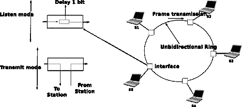

图 206 令牌环网络#

尽管令牌环的基本原理简单，但其中包含一些细微的实现细节，这些细节增加了令牌环网络的复杂性。为了理解这些细节，让我们分析一个站点上令牌环接口的操作。令牌环接口有三个不同的作用。与其他局域网接口一样，它必须能够发送和接收帧。此外，令牌环接口是环的一部分，因此它必须能够在其站点断电时转发环上传递的电气信号。

当开启电源时，令牌环接口以两种不同的模式运行：监听和传输。在监听模式下运行时，令牌环接口从环上的上游邻居接收一个电气信号，在环上引入一个等于一个比特传输时间的延迟，并在将其发送到环上的下游邻居之前再生信号。

令牌环网络面临的第一个问题是，由于令牌代表传输的授权，当没有数据帧正在传输时，令牌必须持续在环上传播。让我们假设一个令牌已经被一个站点产生并发送到环上。在令牌环网络中，令牌是一个 24 比特的帧，其结构如下所示。

](../_images/token-ring.svg)

图. 207 802.5 令牌格式#

令牌由三个字段组成。首先，起始定界符是表示帧开始的标记。最初的令牌环网络使用曼彻斯特编码，起始定界符包含表示 0 的符号和不表示比特的符号。最后一个字段是结束定界符，它标记令牌的结束。访问控制字段存在于所有帧中，并包含几个标志。最重要的是令牌位，它在令牌帧中设置，在其他帧中重置。

让我们考虑上图所示的五个站点网络，并假设站点 S1 发送一个令牌。如果我们忽略站点间链路上的传播延迟，因为每个站点引入一个比特延迟，帧的第一个比特会在发送令牌的第五比特时返回到 S1。如果那时站点 S1 断电，只有令牌的前五个比特会在环上传播。为了避免这个问题，每个令牌环上都有一个特殊的站点，称为监控器。为了确保令牌可以永远在环上传播，这个监控器插入一个等于至少 24 比特传输时间的延迟。如果图中的 A Token Ring 网络中的监控器是 S3，那么 S1 在从其上游邻居接收令牌的第一个比特之前就能够发送整个令牌。

现在我们已经解释了如何在环上转发令牌，让我们分析一个站点如何捕获令牌以发送数据帧。为此，我们需要一些关于数据帧格式的信息。802.5 数据帧以起始定界符开始，随后是令牌位被重置的访问控制字段，一个允许定义多种类型帧的帧控制字段，目的地址和源地址，有效载荷，CRC，结束定界符和一个帧状态字段。Token Ring 数据帧的格式如下所示。


图 208 802.5 数据帧格式#

要捕获令牌，站点必须处于监听模式。在这种模式下，站点从其上游邻居接收位。如果这些位对应于数据帧，它们必须转发给下游邻居。如果它们对应于令牌，站点可以捕获它并发送其数据帧。数据帧和令牌都编码为以起始定界符开始，后跟访问控制字段的位字符串。当站点接收到起始定界符的第一个位时，它无法知道这是一个数据帧还是一个令牌，必须将整个定界符转发给其下游邻居。只有当它接收到访问控制字段的第四位（即令牌位）时，站点才知道帧是数据帧还是令牌。如果令牌位被重置，它表示这是一个数据帧，数据帧的其余位必须转发给下游站点。否则（令牌位被设置），这是一个令牌，站点可以通过重置其缓冲区中当前位的位来捕获它。多亏了这个修改，令牌的开始现在就是数据帧的开始，站点可以切换到传输模式，并从访问控制字段的第五位开始发送其数据帧。因此，每个 Token Ring 站点引入的一个位延迟在使站点能够有效地捕获令牌方面起着关键作用。

在发送完其数据帧后，站点必须保持在传输模式，直到它接收到自己数据帧的最后一位。这确保了站点发送的位不会永远留在网络中。在 Token Ring 网络中，由站点发送的数据帧会经过网络中连接的所有站点。每个站点都可以检测到数据帧并分析目的地址，以可能捕获该帧。

上文描述了当所有站点正常工作时，令牌环网络的基本操作。不幸的是，一个真实的令牌环网络必须能够处理各种类型的异常，这增加了令牌环站点的复杂性。以下简要列出了一些问题和概述了解决方案。有关令牌环站点的详细操作描述，请参阅[[IEEE802.5]](../bibliography.html#ieee802-5)。第一个问题是当所有连接到网络的站点启动时。其中之一必须通过发送第一个令牌来引导网络。为此，所有站点都实现了一种分布式选举机制，用于选择监控器。任何站点都可以成为监控器。监控器管理令牌环网络并确保其正确运行。它的第一个角色是引入 24 位传输时间的延迟，以确保令牌可以在环上平稳地传输。其次，监控器在环上发送第一个令牌。它还必须验证令牌是否定期通过。根据令牌环标准[[IEEE802.5]](../bibliography.html#ieee802-5)，一个站点不能保留令牌超过令牌保持时间（THT）（略小于 10 毫秒）来传输数据帧。在一个包含 N 个站点的网络中，监控器必须至少每$ N \times THT $秒接收一次令牌。如果在这样的期间内监控器没有收到令牌，它将切断一段时间，然后重新初始化环并发送令牌。

令牌环网络中可能发生其他异常。例如，一个站点可能在重新发送令牌之前捕获令牌并断电。另一个站点可能在收到所有数据帧之前捕获令牌、发送其数据帧并断电。在这种情况下，对应于帧结束的比特串将留在环中，而不会被其发送者移除。[[IEEE802.5]](../bibliography.html#ieee802-5)中定义了多种技术，允许监控器处理所有这些问题。如果不幸的是监控器失败，另一个站点将被选为新的监控器。

### 静态分配方法#

在一个局域网中，将可用资源在所有连接的设备之间共享的第一个解决方案是事先定义不同设备之间的传输资源分配。如果需要 N 个设备共享一个以 b Mbps 运行的局域网的传输容量，每个设备可以分配到$ \frac{b}{N} $ Mbps 的带宽。

在局域网以外的其他环境中需要共享有限资源。自从一个多世纪前[马可尼](http://en.wikipedia.org/wiki/Guglielmo_Marconi)进行首次无线电传输以来，已经开发了许多通过无线电信号交换信息的应用。每个无线电信号都是一个以给定频率为中心的电磁波。无线电频谱对应于大约 3 KHz 到 300 GHz 之间的频率。政府之间协商的频率分配计划为广播无线电、广播电视、移动通信、航空无线电导航、业余无线电、卫星等特定应用保留了大多数频率范围。然后，每个频率范围被细分为频道，每个频道可以保留给特定的应用，例如某个地区的广播电台。

频分复用（Frequency Division Multiplexing, FDM）是一种静态分配方案，其中为连接到共享介质的每个设备分配一个频率。由于每个设备使用不同的传输频率，因此不会发生冲突。在光网络中，可以使用 FDM 的一种变体，称为波分复用（Wavelength Division Multiplexing, WDM）。光纤可以在不同的波长上传输光而不发生干扰。使用 WDM，为共享同一光纤的每个设备分配不同的波长。

时间分复用（Time Division Multiplexing, TDM）是一种最初为电话网络定义的静态带宽分配方法。在固定电话网络中，语音通话通常以 64 Kbps 的信号传输。因此，一次电话通话每秒生成 8 KBytes 或每 125 微秒一个字节。电话通话通常需要在一个单独的线路上复用在一起。例如，在欧洲，三十个 64 Kbps 的语音信号通过一个单独的 2 Mbps（E1）线路复用。这是通过使用时间分复用（TDM）来实现的。TDM 将传输机会划分为槽位。在电话网络中，一个槽位对应 125 微秒。每个语音信号在每个槽位内部保留一个位置。下面的图示说明了用于携带四个语音通话的链路上的 TDM。垂直线代表槽位边界，字母代表不同的语音通话。每个语音通话的字节在每个 125 微秒的槽位中发送。对应于给定通话的字节总是在每个槽位中的相同位置发送。

> 
> 
> 图 196 时间分复用

如上图所示，TDM 可以是完全静态的，即相同的通话总是共享链路，也可以是动态的。在后一种情况下，链路的两个端点必须交换消息，指定每个通话在每个槽位内使用哪个字节。得益于这些控制消息，可以动态地向链路添加和删除语音通话。

TDM 和 FDM 在电话网络中被广泛用于支持固定带宽的通话。在支持计算机的局域网中使用它们可能会效率低下。计算机通常不会以固定速率发送信息。相反，它们通常具有开/关的行为。在开启期间，计算机试图以尽可能高的速率发送信息，例如传输文件。在关闭期间，这通常比开启期间长得多，计算机不发送任何数据包。为连接到局域网的计算机使用静态分配方案会导致巨大的效率低下，因为它们在开启期间只能以$ \frac{1}{N} $的总带宽进行传输，尽管其他计算机处于关闭期间，因此不需要传输任何信息。本章余下的部分讨论的动态 MAC 算法旨在解决这个问题。

### ALOHA#

在 20 世纪 60 年代，计算机主要是大型机，连接了几十个终端。这些终端通常位于主机的同一栋建筑内，并直接连接到主机。在某些情况下，终端被安装在远程位置，并通过连接到调制解调器的拨号线路进行连接。夏威夷大学选择了不同的组织方式。他们没有使用电话线来连接远程终端，而是开发了第一种分组无线电技术[[Abramson1970]](../bibliography.html#abramson1970)。在此之前，计算机网络都是建立在电话网络或物理电缆之上的。ALOHA 网证明了使用无线电信号互联计算机是可能的。

ALOHANet 的第一个版本，如[[Abramson1970]](../bibliography.html#abramson1970)所述，其工作方式如下。首先，终端和主机交换由 704 位组成的固定长度帧。每个帧包含 80 个 8 位字符，一些控制位和奇偶校验信息以检测传输错误。400 MHz 范围内的两个信道被保留用于 ALOHANet 的操作。第一个信道由主机用于向所有终端发送帧。第二个信道由所有终端共享，用于向主机发送帧。由于所有终端共享相同的传输信道，因此存在碰撞的风险。为了处理这个问题以及传输错误，主机验证接收到的帧的奇偶校验位，并在其信道上为每个正确接收到的帧发送一个确认。另一方面，终端必须重新传输未确认的帧。至于 TCP，在固定超时到期后立即重新传输这些帧并不是一个好的方法，因为多个终端可能会同时重新传输它们的帧，从而导致网络崩溃。一个更好的方法，尽管还远非完美，是每个终端在重新传输超时到期后等待一个随机的时间。这避免了多个重新传输终端之间的同步。

下面的伪代码显示了 ALOHANet 终端的操作。我们使用这种 Python 语法描述本章中描述的所有介质访问控制算法。该算法应用于需要传输的每个新帧。它尝试最多 max 次（while 循环）传输一个帧。每次传输尝试如下进行。首先，发送帧。每个帧都由一个超时保护。然后，终端等待有效的确认帧或其超时的到期。如果终端收到确认，则帧已正确交付，算法终止。否则，终端等待随机时间并尝试重新传输帧。

```sh
# ALOHA
N = 1
while N <= max:
    send(frame)
    wait(ack_on_return_channel or timeout)
    if (ack_on_return_channel):
       break  # transmission was successful
    else:
             # timeout
             wait(random_time)
             N = N + 1
else:
    # Too many transmission attempts 
```

[[Abramson1970]](../bibliography.html#abramson1970)在特定假设下分析了 ALOHANet 的性能，并发现当信道负载较轻时，ALOHANet 工作得很好。在这种情况下，帧很少重新传输，信道流量，即单位时间内传输的（正确和重新传输的）帧的总数接近信道利用率，即单位时间内正确传输的帧的数量。不幸的是，分析还显示，信道利用率在达到其最大值时为信道带宽的$ \frac{1}{2 \times e}=0.186 $倍。在更高的利用率下，ALOHANet 变得不稳定，网络由于碰撞的重新传输而崩溃。

注意

业余数据包无线电

自从在夏威夷大学进行首次实验以来，包无线电技术已经向多个方向发展。由业余无线电操作员开发的业余包无线电服务是 ALOHANet 的后裔之一。许多业余无线电操作员对新技术非常感兴趣，他们经常花费无数小时开发新的天线或收发器。当第一台个人计算机出现时，几位业余无线电操作员设计了无线电调制解调器和他们自己的数据链路层协议[[KPD1985]](../bibliography.html#kpd1985) [[BNT1997]](../bibliography.html#bnt1997)。这个网络不断发展，仅使用包无线电中继就可以连接到几个欧洲国家的服务器。一些业余无线电操作员还开发了在包无线电服务上使用的 TCP/IP 协议栈。[业余包无线电网络](http://www.ampr.org/)的一些部分连接到全球互联网，并使用 44.0.0.0/8 IPv4 前缀。

自从[[Abramson1970]](../bibliography.html#abramson1970)发表以来，针对 ALOHANet 的许多改进方案被提出，并且这种技术或其某些变体至今仍存在于无线网络中。[[Roberts1975]](../bibliography.html#roberts1975)提出的时隙技术非常重要，因为它表明简单的修改可以显著提高信道利用率。不是允许所有终端在任何时间传输，[[Roberts1975]](../bibliography.html#roberts1975)提出将时间划分为时隙，并允许终端只在每个时隙的开始传输。每个时隙对应于传输一个固定大小帧所需的时间。在实践中，这些时隙可以通过一个所有终端都能接收到的单一时钟来强制执行。在 ALOHANet 中，它可能位于中央主框上。[[Roberts1975]](../bibliography.html#roberts1975)的分析表明，这种简单的修改可以将信道利用率提高两倍。

### 载波侦听多路访问#

ALOHA 和时隙 ALOHA 可以很容易地实现，但不幸的是，它们只能用于非常轻载的网络。为非常低利用率设计网络是可能的，但这显然会增加网络的成本。为了克服 ALOHA 的问题，已经提出了许多介质访问控制机制，这些机制提高了信道利用率。与 ALOHA 相比，载波侦听多路访问（CSMA）是一个显著的改进。CSMA 要求所有节点在发送帧之前侦听传输信道以验证其是否空闲[[KT1975]](../bibliography.html#kt1975)。当一个节点侦测到信道繁忙时，它将推迟其传输，直到信道再次空闲。下面的伪代码提供了 CSMA 操作的更详细描述。

```sh
# persistent CSMA
N = 1
while N <= max:
    wait(channel_becomes_free)
    send(frame)
    wait(ack or timeout)
    if ack:
       break  # transmission was successful
    else:
             # timeout
             N = N + 1
else:
    # Too many transmission attempts 
```

上述伪代码通常被称为持续载波监听多路访问（CSMA）[[KT1975]](../bibliography.html#kt1975)，因为终端将持续监听信道，并在信道空闲时立即发送其帧。CSMA 的另一个重要变体是非持续 CSMA [[KT1975]](../bibliography.html#kt1975)。以下伪代码中描述的持续和非持续 CSMA 之间的主要区别在于，非持续 CSMA 节点不会持续监听信道以确定何时空闲。当一个非持续 CSMA 终端检测到传输信道忙碌时，它会在再次检测信道之前等待一个随机时间。这比持续 CSMA 提高了信道利用率。在持续 CSMA 中，当两个终端检测到信道忙碌时，它们将在信道空闲时立即发送（从而引起冲突）。而在非持续 CSMA 中，这种同步不会发生，因为终端在检测到传输信道后等待一个随机时间。然而，非持续 CSMA 通过提高信道利用率所获得的收益是以网络轻载时终端等待时间略微增加为代价的。

```sh
# Non persistent CSMA
N = 1
while N <= max:
    listen(channel)
    if free(channel):
        send(frame)
        wait(ack or timeout)
        if received(ack):
           break  # transmission was successful
        else:
                 # timeout
                 N = N + 1
    else:
        wait(random_time)
else:
    # Too many transmission attempts 
```

[[KT1975]](../bibliography.html#kt1975) 详细分析了几个 CSMA 变体的性能。在关于传输信道和流量的某些假设下，该分析比较了 ALOHA、时隙 ALOHA、持续和非持续 CSMA。在这些假设下，ALOHA 的信道利用率仅为信道容量的 18.4%。时隙 ALOHA 能够使用 36.6%的容量。持续 CSMA 通过达到 52.9%的容量来提高利用率，而非持续 CSMA 实现了信道容量的 81.5%。

### 带冲突检测的载波监听多路访问#

CSMA 相比 ALOHA 提高了信道利用率。然而，性能仍然可以进一步提高，尤其是在有线网络中。考虑两个终端连接到同一电缆的情况。例如，这条电缆可以是早期以太网中的同轴电缆 [[Metcalfe1976]](../bibliography.html#metcalfe1976)。它也可以由双绞线构建。在扩展 CSMA 之前，了解这样一个网络中帧的传输方式和碰撞如何发生是有用的。下面的图示说明了这样一个电缆上帧的物理传输。为了传输其帧，主机 A 必须在共享介质上发送一个电信号。因此，第一步是开始传输电信号。这如图下方的点（1）所示。这个电信号将沿着电缆传播。尽管电信号传播得很快，但我们知道信息不能比光速传播得更快（即每秒 300,000 公里）。在同轴电缆上，电信号略慢于光速，每秒 200,000 公里是一个合理的估计。这意味着如果电缆长度为一公里，电信号需要 5 微秒才能从电缆一端传播到另一端。同轴电缆的末端装有终止点，以确保电信号不会反射回其源头。这如图中的点（3）所示，其中电信号已经到达左端点和主机 B。此时，B 开始接收 A 正在传输的帧。请注意，在主机 A 上传输一个比特和主机 B 接收它之间存在延迟。如果有其他主机连接到电缆上，它们将接收到帧的第一个比特在略微不同的时间。正如我们稍后将会看到的，这种时间差异是 MAC 算法的一个关键问题。在点（4）处，电信号已经到达电缆的两端并完全占据它。主机 A 继续传输电信号，直到帧的结束。如图中的点（5）所示，当发送主机停止传输时，对应于帧结束的电信号离开同轴电缆。一旦整个电信号从电缆中移除，信道再次变为空闲。


图 197 共享总线上帧的传输#

现在我们已经了解了帧是如何作为一个电信号在共享总线上实际传输的，那么更详细地看看当两个主机几乎同时发送一个帧时会发生什么，这很有趣。这在上面的图中得到了说明，其中主机 A 和主机 B 同时开始传输（点（1））。此时，如果主机 C 检测到信道，它会认为它是空闲的。但这不会持续太久，在点（2）处，主机 A 和主机 B 的电信号都到达了主机 C。组合电信号（在图中以两个曲线的叠加形式图形化表示）无法被主机 C 解码。主机 C 检测到冲突，因为它接收到了一个无法解码的信号。由于主机 C 无法解码帧，它无法确定哪些主机正在发送冲突的帧。请注意，主机 A（以及主机 B）将在主机 C 之后检测到冲突（如图图 198 中的点（3））。


图 198 共享总线上的帧冲突#

如上图所示，当主机接收到无法解码的电信号时，它们会检测到冲突。在有线的网络中，主机在监听时（例如上图中的主机 C）以及发送自己的帧时，都能够检测到这种冲突。当主机发送一个帧时，它可以比较自己发送的电信号与在电缆上感知到的电信号。在上图中的点（1）和（2）处，主机 A 只能感知到自己的信号。在点（3）处，它感知到一个与自己的信号不同的电信号，因此可以检测到冲突。在此点，它的帧被损坏，它可以停止传输。在传输过程中检测到冲突的能力是载波侦听多路访问与冲突检测（CSMA/CD）介质访问控制算法的起点，该算法用于以太网网络 [[Metcalfe1976]](../bibliography.html#metcalfe1976) [[IEEE802.3]](../bibliography.html#ieee802-3) 。当以太网主机在传输过程中检测到冲突时，它会立即停止传输。与纯 CSMA 相比，CSMA/CD 是一个重要的改进，因为当发生冲突时，它们只会持续到发生冲突的主机检测到并停止传输。在实践中，当主机检测到冲突时，它会在电缆上发送一个特殊的干扰信号，以确保所有主机都检测到冲突。

为了更好地理解这些碰撞，分析在共享总线网络中最严重的碰撞情况是有用的。让我们考虑一个两端各连接两个主机的电线，如图下所示。主机 A 开始传输其帧，其电信号在电缆上传播。其传播时间取决于电缆的物理长度和电信号的速度。让我们用 $ \tau $ 来表示这种传播延迟（以秒为单位）。在 A 的帧传输开始后略少于 $ \tau $ 秒，B 决定开始传输自己的帧。经过 $ \epsilon $ 秒后，B 检测到 A 的帧，检测到碰撞并停止传输。B 的帧的开始在电缆上传播，直到它到达主机 A。因此，主机 A 可以在 $ \tau-\epsilon+\tau \approx 2\times\tau $ 时刻检测到碰撞。一个需要注意的重要点是，碰撞只能在传输的前 $ 2\times\tau $ 秒内发生。如果在这一时期内没有发生碰撞，那么之后也不会发生，因为 $ \tau $ 秒后传输通道是忙碌的，并且 CSMA/CD 主机在传输帧之前会检测传输通道。


图 199 共享总线上的最严重碰撞#

此外，在采用 CSMA/CD 的有线网络中，碰撞几乎是影响帧的传输错误的唯一原因。仅影响帧内少数比特的传输错误在这些有线网络中很少发生。因此，CSMA/CD 的设计者选择在数据链路层完全删除确认帧。当主机传输一个帧时，它会验证其传输是否受到碰撞的影响。如果没有，考虑到底层网络的几乎可以忽略的比特错误率，它假设帧已被正确接收。否则，帧将在一段时间后重新传输。

移除致谢是一种有趣的优化方法，因为它减少了网络中交换的帧数以及主机需要处理的帧数。然而，为了使用这种优化，我们必须确保所有主机都能检测到影响其帧的所有冲突。对于短帧来说，这是一个重要的问题。让我们考虑两个主机，A 和 B，它们正在向主机 C 发送一个小帧，如图所示。如果 A 和 B 发送的帧非常短，下面可能发生的情况如下。主机 A 和 B 发送它们的帧并停止传输（点（1））。当两个短帧到达主机 C 的位置时，它们发生碰撞，主机 C 无法解码它们（点（2））。这两个帧被线缆的末端吸收。主机 A 和主机 B 都没有检测到碰撞。它们都认为它们的帧已经正确地被目的地接收。


图 200 短帧碰撞问题#

为了解决这个问题，使用 CSMA/CD 的网络要求主机至少传输$ 2\times\tau $秒。由于网络传输速度对于给定的网络技术是固定的，这意味着使用 CSMA/CD 的技术强制执行最小帧大小。在最受欢迎的 CSMA/CD 技术以太网中，$ 2\times\tau $被称为时隙时间 [[4]](#fslottime)。

CSMA/CD 最后引入的创新是重传超时的计算。对于 ALOHA 来说，这个超时不能固定，否则主机可能会同步并总是在同一时间重传。设置这样的超时总是在网络访问延迟和碰撞数量之间做出妥协。超时时间短会导致网络访问延迟低，但碰撞风险高。另一方面，超时时间长会导致网络访问延迟长，但碰撞风险低。二进制指数退避算法被引入到 CSMA/CD 网络中，以解决这个问题。

为了理解二进制指数退避，让我们考虑由恰好两个主机引起的碰撞。一旦检测到碰撞，主机可以立即重传其帧或推迟其传输一段时间。如果每个冲突的主机抛硬币来决定是否立即重传或推迟重传，可能出现四种情况：

> 1.  两个主机立即重传，并发生新的碰撞
> 1.  
> 1.  第一个主机立即重传，第二个主机推迟其重传
> 1.  
> 1.  第二个主机立即重传，第一个主机推迟其重传
> 1.  
> 1.  两个主机都推迟了重传，并发生了新的碰撞

在第二种和第三种情况下，两个主机都掷了不同的硬币。延迟选择应该足够长，以确保其重传不会与另一个主机的即时重传发生碰撞。然而，延迟不应超过避免碰撞所需的时间，因为如果两个主机都决定推迟它们的传输，网络将在这种延迟期间空闲。时隙时间是最佳延迟，因为它是最短的延迟，可以确保第一个主机能够完全重传其帧而不会发生任何碰撞。

如果两个主机正在竞争，上述算法将避免 50%的第二次碰撞。然而，如果网络负载很重，可能同时有几个主机在竞争。在这种情况下，主机应该能够自动调整它们的重传延迟。二进制指数退避根据影响帧的碰撞次数进行这种调整。第一次碰撞后，主机掷硬币并等待 0 或 1 个时隙时间。第二次碰撞后，它生成一个随机数并等待 0、1、2 或 3 个时隙时间，等等。每次碰撞后，等待时间翻倍。CSMA/CD 算法的完整伪代码如图所示。

```sh
# CSMA/CD pseudo-code
N = 1
while N <= max:
    wait(channel_becomes_free)
    send(frame)
    wait_until (end_of_frame) or (collision)
    if collision detected:
        stop_transmitting()
        send(jamming)
        k = min(10, N)
        r = random(0, 2**k - 1)
        wait(r * slotTime)
        N = N + 1
    else:
        wait(inter-frame_delay)
        break  # transmission was successful
else:
    # Too many transmission attempts 
```

在此伪代码中使用的帧间延迟是一个短延迟，对应于网络适配器从发送模式切换到接收模式所需的时间。它还用于防止主机发送连续的帧流，而不给网络上的其他主机留下任何传输机会。这有助于 CSMA/CD 的公平性。尽管有这种延迟，但仍然存在 CSMA/CD 不完全公平的情况 [[RY1994]](../bibliography.html#ry1994)。例如，考虑一个有两个主机的网络：一个服务器发送长帧，一个客户端发送确认。[[RY1994]](../bibliography.html#ry1994)中报告的测量结果表明，存在客户端可能遭受重复碰撞的情况，这导致它因指数退避算法而长时间等待。

### 带有碰撞避免的载波侦听多路访问#

带有碰撞避免的载波侦听多路访问（CSMA/CA）介质访问控制算法是为流行的 WiFi 无线网络技术[[IEEE802.11]](../bibliography.html#ieee802-11)设计的。CSMA/CA 在发送帧之前也会侦听传输通道。此外，CSMA/CA 通过仔细调整 CSMA/CA 设备使用的计时器来尝试避免碰撞。

CSMA/CA 使用类似于 CSMA 的确认。每个帧包含一个序列号和一个 CRC。CRC 用于检测传输错误，而序列号用于避免帧重复。当设备接收到正确的帧时，它会向发送方返回一个特殊的确认帧。CSMA/CA 在接收帧和发送确认帧之间引入了一个小的延迟，称为 Short Inter Frame Spacing (SIFS)。这个延迟对应于设备在接收和传输模式之间切换无线电所需的时间。

与 CSMA 相比，CSMA/CA 更精确地定义了何时允许设备发送帧。首先，CSMA/CA 定义了两个延迟：DIFS 和 EIFS。为了发送帧，设备必须首先等待信道空闲至少 Distributed Coordination Function Inter Frame Space (DIFS) 时间，如果之前接收到的帧是正确的。然而，如果之前接收到的帧已损坏，这表明存在冲突，设备必须检测信道空闲至少 Extended Inter Frame Space (EIFS)，其中 $ SIFS<DIFS<EIFS $。SIFS、DIFS 和 EIFS 的确切值取决于底层物理层 [[IEEE802.11]](../bibliography.html#ieee802-11)。

下图显示了 CSMA/CA 设备的基本操作。在传输之前，主机 A 验证信道是否空闲了足够长的时间。然后，它发送其数据帧。在检查接收到的帧的有效性后，接收方在短暂的 SIFS 延迟后发送一个确认帧。不参与帧交换的主机 C 在数据帧的开始时检测到信道忙碌。主机 C 可以使用此信息来确定信道将忙碌多长时间。请注意，由于 $ SIFS<DIFS<EIFS $，即使在数据帧的最后一位之后立即开始检测信道的设备也无法在确认帧传输期间决定发送自己的帧。


图 201 CSMA/CA 设备的操作#

CSMA/CA 的主要困难在于两个或更多设备同时传输并引起冲突。这在下图中得到说明，假设在数据帧传输后有一个固定的超时时间。由于 CSMA/CA 在数据帧传输后的超时时间非常小，因为它对应于 SIFS 加上发送确认帧所需的时间。


图 202 CSMA/CA 的冲突#

为了解决这个问题，CSMA/CA 依赖于一个退避计时器。这个退避计时器是一个随机延迟，由每个设备在一个依赖于当前帧重传次数的范围内选择。范围随着重传次数呈指数增长，就像 CSMA/CD 一样。退避计时器的最小范围是 $ [0,7*slotTime] $，其中 slotTime 是一个取决于底层物理层的参数。与 CSMA/CD 的指数退避相比，有两个重要差异需要注意。首先，退避计时器的初始范围是七倍大。这是因为 CSMA/CA 中无法检测到发生的碰撞。与 CSMA/CA 不同，一个碰撞可能会影响整个帧，而与 CSMA/CD 相比，它只能影响帧的开始部分。其次，一个 CSMA/CA 设备必须在退避计时器期间定期检测传输通道。如果通道变得繁忙（即，因为另一个设备正在传输），则退避计时器必须冻结，直到通道再次空闲。一旦通道空闲，退避计时器重新启动。这与 CSMA/CD 不同，CSMA/CD 在每次碰撞后重新计算退避。这在下图中得到了说明。主机 A 选择比主机 C 更小的退避。当 C 检测到通道繁忙时，它会冻结其退避计时器，并且只有在通道再次空闲时才重新启动。


图 203 CSMA/CA 的详细示例#

下面的伪代码总结了 CSMA/CA 设备的操作。SIFS、DIFS、EIFS 和 $ slotTime $ 的值取决于底层物理层技术 [[IEEE802.11]](../bibliography.html#ieee802-11)

```sh
# CSMA/CA simplified pseudo-code
N=1
while N <= max:
    wait_until(free(channel))
    if correct(last_frame):
        wait(channel_free_during_t >= DIFS)
    else:
        wait(channel_free_during_t >= EIFS)

    backoff_time = int(random(0, min(255, 7 * ( 2 ** (N - 1))))) * slotTime
    wait(channel free during backoff_time)
    # backoff timer is frozen while channel is sensed to be busy
    send(frame)
    wait(ack or timeout)
    if received(ack)
        # frame received correctly
        break
    else:
        # retransmission required
        N = N + 1
else:
    # Too many transmission attempts 
```

无线网络面临的另一个问题通常被称为隐藏站问题。在无线网络中，无线电信号并不总是以相同的方式向所有方向传播。例如，被墙壁隔开的两个设备可能无法接收到对方的信号，尽管它们都能接收到由第三个主机产生的信号。这在下图中得到了说明，但这种情况也可能发生在其他环境中。例如，位于山的不同侧的两个设备可能无法接收到对方的信号，尽管它们都能接收到山顶站发送的信号。此外，无线电传播条件可能会随时间变化。例如，一辆卡车可能会暂时阻断两个附近设备之间的通信。


图 204 隐藏站问题#

为了避免这些情况下的碰撞，CSMA/CA 允许设备保留传输通道一段时间。这是通过使用两个控制帧来完成的：请求发送 (RTS) 和清除发送 (CTS)。这两个帧都非常短，以最大限度地减少碰撞的风险。为了保留传输通道，设备向数据帧的预期接收者发送一个 RTS 帧。RTS 帧包含请求保留的持续时间。接收者在 SIFS 延迟后回复一个 CTS 帧，该帧也包含保留的持续时间。由于保留的持续时间已在 RTS 和 CTS 中发送，所有可能与其他发送者或接收数据帧的接收者发生碰撞的主机都会被告知保留情况。它们可以计算传输的总持续时间，并在那时推迟对传输通道的访问。这在下图中得到了说明，其中主机 A 保留传输通道以向主机 B 发送数据帧。主机 C 注意到保留并推迟其传输。


图 205 CSMA/CA 保留#

在 CSMA/CA 中使用保留是一种在碰撞频繁时有用的优化。如果碰撞很少，传输 RTS 和 CTS 帧所需的时间可能会变得显著，尤其是在交换短帧时。一些设备仅在传输错误后才会开启 RTS/CTS。

### 确定性介质访问控制算法#

在 1970 年代和 1980 年代，网络社区就适用于局域网的最佳介质访问控制算法进行了大量辩论。我们至今所描述的乐观算法在设计时相对容易实现。从性能角度来看，数学模型和模拟显示这些乐观技术能够维持负载。然而，没有任何乐观技术能够保证在给定的延迟界限内交付帧，而某些应用程序需要可预测的传输延迟。网络社区中的一部分人认为，确定性介质访问控制算法是满足局域网需求的最佳解决方案。

决定性技术和机会主义技术的支持者都游说制定适用于局域网的标准化方案，以纳入他们的解决方案。而不是试图在这两种相互矛盾的观点之间找到一个不可能的折衷方案，负责制定局域网标准的 IEEE 802 委员会选择并行工作于三种不同的局域网技术，并成立了三个工作组。[IEEE 802.3 工作组](http://www.ieee802.org/3/)负责 CSMA/CD。确定性 MAC 算法的支持者就交换称为令牌的特殊帧以调节对传输介质访问的基本原则达成一致。然而，他们并没有就网络最合适的物理布局达成一致。IBM 支持环形网络，而由通用汽车领导的制造业则支持总线形网络。这导致了[IEEE 802.4 工作组](http://www.ieee802.org/4/)的成立，以标准化令牌总线网络，以及[IEEE 802.5 工作组](http://www.ieee802.org/5/)的成立，以标准化令牌环网络。尽管这些技术今天不再广泛使用，但基于令牌的协议背后的原则仍然很重要。

IEEE 802.5 令牌环技术定义在[[IEEE802.5]](../bibliography.html#ieee802-5)。我们以令牌环为例，解释环形网络中基于令牌的 MAC 算法的原理。其他环形网络包括已废弃的 FDDI [[Ross1989]](../bibliography.html#ross1989) 或弹性包环 [[DYGU2004]](../bibliography.html#dygu2004)。早期令牌环网络的一个良好综述可以在[[Bux1989]](../bibliography.html#bux1989)中找到。

令牌环网络由一组连接到单向环上的站点组成。令牌环 MAC 算法的基本原理是，两种类型的帧在环上传输：令牌和数据帧。当令牌环启动时，其中一个站点发送令牌。令牌是一个小帧，代表在环上传输数据帧的授权。要传输数据帧到环上，一个站点必须首先通过从环上移除令牌来捕获它。由于一次只能有一个站点捕获令牌，拥有令牌的站点可以安全地在环上传输数据帧，而不会造成冲突。在传输完其帧后，该站点必须将其从环上移除并重新发送令牌，以便其他站点可以传输它们自己的帧。


图 206 令牌环网络#

虽然令牌环的基本原理很简单，但有几个细微的实现细节增加了令牌环网络的复杂性。为了理解这些细节，让我们分析一个站上的令牌环接口的操作。令牌环接口有三个不同的用途。像其他局域网接口一样，它必须能够发送和接收帧。此外，令牌环接口是环的一部分，因此它必须能够在其站关闭电源时转发环上传递的电信号。

当启动时，令牌环接口以两种不同的模式运行：监听和传输。在监听模式下，令牌环接口从环上的上游邻居接收一个电信号，在环上引入一个等于一个比特传输时间的延迟，并在将其发送到环上的下游邻居之前再生该信号。

令牌环网络面临的第一问题是，作为传输授权的令牌，在没有数据帧传输时，它必须持续在环上传输。让我们假设一个令牌已经被一个站生成并发送到环上。在令牌环网络中，令牌是一个 24 比特的帧，其结构如下所示。


图. 207 802.5 令牌格式#

令牌由三个字段组成。首先，起始定界符是表示帧开始的标记。最初的令牌环网络使用曼彻斯特编码，起始定界符包含表示 0 的符号和不表示比特的符号。最后一个字段是结束定界符，它标记令牌的结束。访问控制字段存在于所有帧中，并包含几个标志。最重要的是令牌位，它在令牌帧中设置，在其他帧中重置。

让我们考虑上面图 A Token Ring network 所示的五站网络，并假设站 S1 发送一个令牌。如果我们忽略站间链路上的传播延迟，因为每个站引入一个比特延迟，帧的第一个比特会在发送令牌的第五比特时返回到 S1。如果那时站 S1 关闭电源，只有令牌的前五个比特会在环上传输。为了避免这个问题，每个令牌环上都有一个特殊的站，称为监控站。为了确保令牌可以在环上永远传输，这个监控站插入一个等于至少 24 比特传输时间的延迟。如果图 A Token Ring network 中的监控站是 S3，S1 就能在从其上游邻居接收令牌的第一个比特之前发送整个令牌。

既然我们已经解释了如何在环上转发令牌，那么让我们分析一下一个站点如何捕获令牌以发送数据帧。为此，我们需要了解一些关于数据帧格式的信息。802.5 数据帧以起始定界符开始，随后是令牌位被重置的访问控制字段，一个允许定义多种类型帧的帧控制字段，目的地址和源地址，有效载荷，CRC，结束定界符和一个帧状态字段。Token Ring 数据帧的格式如下所示。


图 208 802.5 数据帧格式#

要捕获令牌，站点必须处于监听模式。在此模式下，站点从其上游邻居接收位。如果这些位对应于数据帧，它们必须转发给下游邻居。如果它们对应于令牌，站点可以捕获它并发送其数据帧。数据帧和令牌都编码为以起始定界符开始，随后是访问控制字段的位字符串。当站点接收到起始定界符的第一个位时，它无法知道这是一个数据帧还是一个令牌，必须将整个定界符转发给其下游邻居。只有当它接收到访问控制字段的第四位（即令牌位）时，站点才知道该帧是数据帧还是令牌。如果令牌位被重置，它表示这是一个数据帧，数据帧的其余位必须转发给下游站点。否则（令牌位被设置），这是一个令牌，站点可以通过重置其缓冲区中当前位的位来捕获它。多亏了这个修改，令牌的开始现在就是数据帧的开始，站点可以切换到传输模式，并从访问控制字段的第五位开始发送其数据帧。因此，每个 Token Ring 站点引入的一个位延迟在使站点能够有效地捕获令牌方面起着关键作用。

在发送完其数据帧后，站点必须保持在传输模式，直到它接收到自己数据帧的最后一位。这确保了站点发送的位不会永远留在网络中。在 Token Ring 网络中，由站点发送的数据帧会经过网络中连接的所有站点。每个站点都可以检测到数据帧并分析目的地址，以可能捕获该帧。

上文描述了当所有站点都正常工作时，令牌环网络的基本操作。不幸的是，一个真实的令牌环网络必须能够处理各种类型的异常，这增加了令牌环站点的复杂性。我们简要列出了一些问题和它们的解决方案。有关令牌环站点操作的详细描述，请参阅[[IEEE802.5]](../bibliography.html#ieee802-5)。第一个问题是当所有连接到网络的站点启动时。其中之一必须通过发送第一个令牌来引导网络。为此，所有站点都实现了一种分布式选举机制，用于选择监控器。任何站点都可以成为监控器。监控器管理令牌环网络并确保其正确运行。它的第一个角色是引入 24 位传输时间的延迟，以确保令牌可以在环上平稳地传输。其次，监控器在环上发送第一个令牌。它还必须验证令牌是否定期通过。根据令牌环标准[[IEEE802.5]](../bibliography.html#ieee802-5)，一个站点不能保留令牌超过令牌保持时间（THT）（略小于 10 毫秒）来传输数据帧。在一个包含 N 个站点的网络中，监控器必须至少每$ N \times THT $秒接收一次令牌。如果监控器在这样一个时间段内没有收到令牌，它将切断一段时间，然后重新初始化环并发送令牌。

在令牌环网络中可能发生其他一些异常。例如，一个站点可能在重新发送令牌之前捕获令牌并关闭电源。另一个站点可能在收到所有数据帧之前捕获令牌、发送其数据帧并关闭电源。在这种情况下，对应于帧结束的比特串将保留在环中，而不会被其发送者移除。[[IEEE802.5]](../bibliography.html#ieee802-5)中定义了多种技术，允许监控器处理所有这些问题。如果不幸的是监控器失败，另一台站点将被选为新的监控器。

## **拥塞控制**#

大多数网络包含具有不同带宽的链路。一些主机可以使用低带宽无线网络。一些服务器通过 10 Gbps 接口连接，路由器之间的链路可能从每秒几十千比特到百吉比特不等。尽管这些性能差异巨大，任何主机都应该能够与高端服务器高效地交换段。

为了更好地理解这个问题，让我们考虑以下图中的场景，其中一台连接到 10 Mbps 链路的服务器（A）需要通过包含 2 Mbps 链路的路径可靠地将段传输到另一台计算机（C）。

> 
> 
> 图 209. 具有异构链路的可靠传输

在这个网络中，服务器发送的数据段到达路由器 R1。R1 将数据段转发到路由器 R2。路由器 R1 可以以 10 Mbps 的速度接收数据段，但它只能以 2 Mbps 的速度将它们转发到路由器 R2，然后到主机 C。路由器 R1 包括缓冲区，允许它存储那些不能立即转发到其目标的数据包。为了理解在这种环境中可靠传输协议的操作，让我们考虑这个网络的简化模型，其中主机 A 连接到一个 10 Mbps 的链路到一个表示路由器 R1 缓冲区的队列。这个队列以 2 Mbps 的速度清空。


图 210 自时钟#

让我们考虑主机 A 使用三个数据段大小的窗口。因此，它以 10 Mbps 的速度连续发送三个数据段，然后等待确认。当主机 A 的窗口满时，它停止发送数据段。这些数据段到达路由器 R1 的缓冲区。在这个缓冲区中存储的第一个数据段以 2 Mbps 的速度由路由器 R1 发送到目标主机。在接收到这个数据段后，目标主机发送一个确认。这个确认允许主机 A 传输一个新的数据段。这个数据段在路由器 R1 传输由主机 A 发送的第二个数据段时存储在缓冲区中……因此，在传输第一窗口的数据段之后，可靠的传输协议在接收到目标主机返回的每个确认后发送一个数据段。在实践中，目标主机发送的确认充当一种时钟，允许发送主机调整其传输速率以适应目标主机接收数据段的速度。这种自时钟是允许基于窗口的可靠传输协议适应异构网络的第一种机制[[Jacobson1988]](../bibliography.html#jacobson1988)。它依赖于缓冲区的可用性来存储已由发送方发送但尚未传输到目标的数据段。

然而，传输协议不仅用于这种环境。在全球互联网中，大量主机向大量接收者发送数据段。例如，让我们考虑以下网络，它与[[Jacobson1988]](../bibliography.html#jacobson1988)和[**RFC 896**](https://datatracker.ietf.org/doc/html/rfc896.html)中讨论的网络相似。在这个网络中，我们假设路由器的缓冲区是无限的，以确保没有数据包丢失。

> 
> 
> 图 211 拥塞崩溃问题

如果许多发送器连接到上述网络的左侧部分，它们都会发送一个满窗口的段。这些段在传输到目的地之前被存储在路由器的缓冲区中。如果网络左侧有许多发送器，缓冲区的占用率会迅速增长。缓冲区占用的一个后果是，由传输协议测量的发送器和接收器之间的往返时间增加。考虑一个发送 10,000 位段的网络。当缓冲区为空时，这样的段在 10 Mbps 链路上传输需要 1 毫秒，在 2 Mbps 链路上传输需要 5 毫秒。因此，如果我们忽略链路上的传播延迟，测量的往返时间大约是 6 毫秒。如果缓冲区包含 100 个段，往返时间变为 $ 1+100 \times 5+ 5 $ 毫秒，因为只有在所有之前的段都传输完毕后，新的段才会通过 2 Mbps 链路传输。不幸的是，如果可靠的传输协议使用重传计时器并执行回退-n 来从传输错误中恢复，它将重传一个完整的窗口段。这增加了缓冲区的占用率和通过缓冲区的延迟……此外，缓冲区可能在低带宽链路上存储和发送相同段的多个重传。这个问题被称为拥塞崩溃。在 20 世纪 80 年代末的互联网上发生了几次这种情况 [[Jacobson1988]](../bibliography.html#jacobson1988)。

拥塞崩溃是所有异构网络都面临的问题。科学文献中已经提出了不同的机制来避免或控制网络拥塞。其中一些已经在实际网络中得到实施和部署。为了更详细地了解这个问题，让我们先考虑一个简单的网络，其中有两个主机连接到高带宽链路，它们向连接到低带宽链路的 C 目的地发送段，如下所示。

> 
> 
> 图. 212 拥塞问题

为了避免拥塞崩溃，主机必须通过使用拥塞控制机制来调节它们的传输速率 [[5]](#fcredit)。这样的机制可以在传输层或网络层实现。在 TCP/IP 网络中，它是在传输层实现的，但其他技术如异步传输模式（ATM）或帧中继在较低层包含了拥塞控制机制。

让我们先考虑一个简单的例子，其中一组 $ i $ 个主机共享一个瓶颈链路，如上例所示。在这个网络中，拥塞控制方案必须实现以下目标 [[CJ1989]](../bibliography.html#cj1989)：

> 1.  控制拥塞的方案必须避免拥塞。在实践中，这意味着瓶颈链路不能过载。如果 $ r_i(t) $ 是在时间 $ t $ 分配给主机 $ i $ 的传输速率，而 $ R $ 是瓶颈链路的带宽，那么拥塞控制方案应确保，平均而言，$ \forall{t} \sum{r_i(t)} \le R $。
> 1.  
> 1.  控制拥塞的方案必须高效。瓶颈链路通常是共享且昂贵的资源。通常，瓶颈链路是广域链路，其升级成本远高于局域网。拥塞控制方案应确保这些链路得到有效利用。从数学上讲，控制方案应确保 $ \forall{t} \sum{r_i(t)} \approx R $。
> 1.  
> 1.  控制拥塞的方案应该是公平的。大多数拥塞方案的目标是达到最大最小公平性。如果将传输速率分配给源头的分配被认为是最大最小公平的，那么：
> 1.  
> > +   网络中没有任何链路拥塞
> > +   
> > +   分配给源 $ j $ 的速率不能增加，除非减少分配给分配小于源 $ j $ 的速率的源 $ i $ [[Leboudec2008]](../bibliography.html#leboudec2008) 。

根据网络的不同，最大最小公平分配可能并不总是存在。在实践中，最大最小公平性是一个理想的目标，可能无法实现。当存在单个瓶颈链路，如上述示例中，最大最小公平性意味着每个源头应分配相同的传输速率。

为了可视化不同的速率分配，考虑下面的图是有用的。在这个图中，我们在 x 轴（分别 y 轴）上绘制分配给主机 B（分别 A）的速率。图中的点 $ (r_B,r_A) $ 对应于可能的传输速率分配。由于这个网络中有一个 2 Mbps 的瓶颈链路，因此图可以分为两个区域。图的左下部分包含所有不拥塞的分配 $ (r_B,r_A) $，即瓶颈链路不拥塞（$ r_A+r_B<2 $）。这个区域的右边是效率线，即完全利用瓶颈链路的分配集（$ r_A+r_B=2 $）。最后，公平线是公平分配的集合。


图 213 可能的传输速率分配#

如上图所示，速率分配可能是公平但不高效的（例如 $ r_A=0.7,r_B=0.7 $），公平且高效（例如 $ r_A=1,r_B=1 $）或高效但不公平（例如 $ r_A=1.5,r_B=0.5 $）。理想情况下，分配应该是公平且高效的。不幸的是，在流量的数量波动中保持这样的分配是一个具有挑战性的问题。此外，可能有数千个流量通过相同的链路 [[6]](#fflowslink)。

为了处理这些需求波动，这些波动导致可用带宽波动，计算机网络使用拥塞控制方案。这个拥塞控制方案应该实现上述三个目标。一些拥塞控制方案依赖于终端主机和路由器之间的紧密合作，而其他方案主要在终端主机上实现，并从路由器获得有限的支持。

拥塞控制方案可以建模为一个算法，该算法根据从网络收到的反馈调整主机 $ i $ 的传输速率 ($ r_i(t) $)。可能的反馈类型有很多。最简单的方案是二进制反馈 [[CJ1989]](../bibliography.html#cj1989) [[Jacobson1988]](../bibliography.html#jacobson1988)，其中主机只需学习网络是否拥塞。一些拥塞控制方案允许网络定期以 Mbps 的速率向每个主机发送分配的传输速率 [[BF1995]](../bibliography.html#bf1995)。

让我们关注目前最广泛使用的二进制反馈方案。直观上，拥塞控制方案应在检测到网络拥塞时降低主机的传输速率，以避免拥塞崩溃。此外，当网络不拥塞时，主机应增加其传输速率。否则，主机将无法有效地利用网络。分配给每个主机的速率会随着时间波动，这取决于从网络收到的反馈。图图 214 展示了在我们简单网络中分配给两个主机的传输速率的演变。最初，两个主机的分配较低，但这并不高效。分配会增加到网络拥塞。在此点，主机降低其传输速率以避免拥塞崩溃。如果拥塞控制方案工作良好，经过一段时间后，分配应该既公平又高效。


图 214 传输速率的演变#

可能存在各种类型的速率调整算法。Dah Ming Chiu 和 Raj Jain 在 [[CJ1989]](../bibliography.html#cj1989) 中分析了不同类型的算法，这些算法可以由源端使用来调整其传输速率以适应从网络收到的反馈。直观上，这种速率调整算法在网络不拥塞时增加传输速率（确保网络被有效使用），在网络拥塞时降低传输速率（以避免拥塞崩溃）。

网络可以向源发送的最简单形式的反馈是二进制反馈（网络是否拥塞）。在这种情况下，一个线性速率自适应算法可以表示为：

> +   当网络拥塞时，$ rate(t+1)=\alpha_C + \beta_C rate(t) $
> +   
> +   当网络**不**拥塞时，$ rate(t+1)=\alpha_N + \beta_N rate(t) $

在线性自适应算法中，$ \alpha_C,\alpha_N, \beta_C $ 和 $ \beta_N $ 是常数。[[CJ1989]](../bibliography.html#cj1989) 的分析表明，为了公平和高效，这种二进制速率自适应机制必须依赖于加性增加和乘性减少。当网络不拥塞时，主机应缓慢增加它们的传输速率（$ \beta_N=1~and~\alpha_N>0 $）。当网络拥塞时，主机必须乘性减少它们的传输速率（$ \beta_C < 1~and~\alpha_C = 0 $）。这样的 AIMD 速率自适应算法可以通过以下伪代码实现。

```sh
# Additive Increase Multiplicative Decrease
if congestion:
    rate = rate * betaC    # multiplicative decrease, betaC<1
else
    rate = rate + alphaN    # additive increase, alphaN > 0 
```

备注

哪种二进制反馈？

计算机网络中可能存在两种类型的二进制反馈。第一种解决方案是依赖于隐式反馈。这是 TCP 所选择的解决方案。TCP 的拥塞控制方案 [[Jacobson1988]](../bibliography.html#jacobson1988) 不需要来自路由器的任何合作。它只假设它们使用缓冲区，并在拥塞时丢弃数据包。TCP 使用段丢失作为拥塞的指示。当没有丢失时，网络被认为是未拥塞的。这意味着拥塞是数据包丢失的主要原因。这在有线网络中是正确的，但不幸的是，在无线网络中并不总是如此。另一种解决方案是依赖于显式反馈。这是 DECBit 拥塞控制方案 [[RJ1995]](../bibliography.html#rj1995) 提出的解决方案，并在帧中继和 ATM 网络中使用。这种显式反馈可以通过两种方式实现。第一种解决方案是定义一种特殊消息，当路由器拥塞时可以发送给主机。不幸的是，生成此类消息可能会增加网络中的拥塞量。因此，这种拥塞指示数据包是不被鼓励的 [**RFC 1812**](https://datatracker.ietf.org/doc/html/rfc1812.html)。更好的方法是允许中间路由器在它们转发的数据包中指示它们当前的拥塞状态。二进制反馈可以通过在数据包头部使用一个比特来编码。在这种方案中，拥塞路由器在它们转发的数据包中设置一个特殊的比特，而非拥塞路由器则不修改此比特。目标主机在其发送的确认中返回网络的拥塞状态。有关 IP 网络中此类解决方案的详细信息，请参阅 [**RFC 3168**](https://datatracker.ietf.org/doc/html/rfc3168.html)。不幸的是，截至本文撰写时，尽管这种解决方案具有潜在的好处，但它仍未部署。

### 基于窗口的传输协议的拥塞控制#

AIMD 通过根据当前拥塞水平调整源传输速率来控制拥塞。如果网络没有拥塞，传输速率会增加。如果检测到拥塞，传输速率会乘性减少。在实践中，直接调整传输速率可能很困难，因为它需要使用细粒度计时器。在可靠的传输协议中，一个替代方案是动态调整发送窗口。这是 TCP 和 SCTP 等协议所选择的解决方案，这些协议将在稍后更详细地描述。为了了解基于窗口的协议如何调整它们的传输速率，让我们考虑一个非常简单的可靠传输协议场景，该协议使用回退 n。考虑图图 215 中显示的非常简单的场景。

> 
> 
> 图 215 一个简单的网络，主机共享一个瓶颈链路

主机和路由器之间的链路带宽为 1 Mbps，而两个路由器之间的链路带宽为 500 Kbps。在这个网络中没有显著的传播延迟。为了简单起见，假设主机 A 和 B 发送 1000 比特的数据包。这样的数据包在主机-路由器（分别路由器-路由器）链路上的传输需要 1 毫秒（分别 2 毫秒）。如果没有网络流量，主机 A 测量到 D 的往返时间略大于 4 毫秒。让我们观察不同窗口大小的数据包流，以了解发送窗口和传输速率之间的关系。

首先考虑一个段的窗口。这个段需要 4 毫秒才能到达主机 D。目的地用一个确认回复，然后可以传输下一个段。在这样的发送窗口下，传输速率大约是每秒 250 个段或 250 Kbps。这如图图 216 所示，其中网格的每个方格对应于一毫秒。

> 
> 
> 图 216 从 A 到 D 的回退 n 传输，窗口为一个段

现在考虑一个由两个段组成的窗口。主机 A 可以在其 1 Mbps 链路上在 2 毫秒内发送两个段。如果第一个段在时间$ t_{0} $发送，它将在$ t_{0}+4 $时到达主机 D。主机 D 用一个确认回复，这个确认打开主机 A 的发送窗口并允许它传输一个新的段。与此同时，第二个段被路由器 R1 缓冲。它将在$ t_{0}+6 $时到达主机 D，并返回一个确认。在两个段的窗口中，主机 A 以大约 500 Kbps 的速度传输，即瓶颈链路的传输速率。

> 
> 
> 图 217 从 A 到 D 的回退 n 传输，窗口为两个段

我们的最后一个例子是四个段的窗口。这些段在 $ t_{0} $，$ t_{0}+1 $，$ t_{0}+2 $ 和 $ t_{0}+3 $ 时发送。第一个段在 $ t_{0}+4 $ 时到达主机 D。主机 D 通过发送一个确认来回复这个段，这个确认使得主机 A 能够发送它的第五个段。这个段在 $ t_{0}+5 $ 时到达路由器 R1。那时，路由器 R1 正在将第三个段传输到路由器 R2，第四个段仍然在其缓冲区中。在 $ t_{0}+6 $ 时，主机 D 接收到第二个段并返回相应的确认。这个确认使得主机 A 能够发送它的第六个段。这个段大约在 $ t_{0}+7 $ 时到达路由器 R1。那时，路由器开始将第四个段传输到路由器 R2。由于 R1-R2 链路只能支持 500 Kbps，数据包将积累在 R1 的缓冲区中。平均来说，将有两个数据包在 R1 的缓冲区中等待。这两个数据包的存在将导致传输协议测量的往返时间增加。虽然第一个段在 4 毫秒内得到了确认，但 $ t_{0}+4 $ 时发送的第五个段（数据(4)）直到 $ t_{0}+11 $ 才得到确认。平均来说，发送者以 500 Kbps 的速度发送数据，但大窗口的使用通过网络引入了更长的延迟。

> 
> 
> 图 218 从 A 到 D 的回退-n 传输，四个段的窗口

从上面的例子中，我们可以通过调整可靠传输协议的发送窗口来调整传输速率。一个可靠的传输协议不能以每秒 $ \frac{window}{rtt} $ 个段的速度发送数据，其中 $ window $ 是当前的发送窗口。为了控制传输速率，我们引入了一个拥塞窗口。这个拥塞窗口限制了发送窗口。在任何时候，发送窗口都被限制在 $ \min(swin,cwin) $，其中 swin 是发送窗口，cwin 是当前的拥塞窗口。当然，窗口还受到远程对端宣布的接收窗口的限制。通过使用拥塞窗口，一个使用固定大小段的简单可靠传输协议可以如下实现 AIMD。

对于增量增加部分，我们的简单协议会在每个往返时间增加一个段。AIMD 的乘性减少部分可以通过检测到拥塞时将拥塞窗口减半来实现。为了简化，我们假设拥塞是通过二进制反馈检测到的，并且没有段丢失。我们将在后面的章节中更详细地讨论损失如何影响像 TCP 这样的实际传输协议。

对于我们的简单传输协议，可以实施以下拥塞控制方案。

```sh
# Initialisation
cwin = 1  # congestion window measured in segments

# Ack arrival
if ack_received:
    if newack:  # new ack, no congestion
        # increase cwin by one every rtt
        cwin = cwin + (1/cwin)
    else:
        # no increase

if congestion_detected:
    cwin = cwin / 2 # only once per rtt 
```

在上述伪代码中，cwin 包含存储为段的实际数值的拥塞窗口。在收到每个确认以及检测到拥塞时更新拥塞窗口。为了简单起见，我们假设 cwin 以浮点数存储，但只能传输完整的段。

为了说明，让我们考虑上述网络场景，并假设路由器实现了 DECBit 二进制反馈方案 [[RJ1995]](../bibliography.html#rj1995)。该方案使用一种前向显式拥塞通知，当路由器的缓冲区包含一个或多个数据包时，路由器会在到达的数据包中标记拥塞位。在图 图 219 中，我们用 * 来表示标记的数据包。

> 
> 
> 图 219 从 A 到 D 的 Go-back-n 传输，带有 AIMD 拥塞控制和 DecBit 二进制反馈方案

当连接开始时，其拥塞窗口被设置为一段。在约 $ t_{0}+4 $ 时，向段 S0 发送一个确认。拥塞窗口增加一段，S1 和 S2 在 $ t_{0}+4 $ 和 $ t_{0}+5 $ 时刻传输。相应的确认在 $ t_{0}+8 $ 和 $ t_{0}+10 $ 时刻收到。在收到最后一个确认后，拥塞窗口达到 3，可以发送段（S4 和 S5）。当段 S6 到达路由器 R1 时，其缓冲区已包含 S5。因此，包含 S6 的数据包被标记以通知发送者拥塞情况。请注意，发送者只有在收到 $ t_{0}+18 $ 时刻的相应确认后才会注意到拥塞。在此期间，拥塞窗口继续增加。在 $ t_{0}+16 $，在收到 S5 的确认后，它达到 4。当检测到拥塞时，拥塞窗口减少到 2。这解释了从收到 S*6 的确认到发送 S10 之间的空闲时间。

实际上，路由器连接到多个输入链路。图 图 220 展示了一个包含两个主机的示例。

> 
> 
> 图 220 具有主机共享瓶颈的简单网络
> 
> 
> 
> 图 221 不同输入之间的瓶颈链路共享

通常，链路具有非零延迟。下面的图示中，在 R 和 C 之间的链路上添加了延迟。

> 
> 
> 图 222 不同输入之间的瓶颈链路共享

### 拥塞控制#

在一个互联网中，即由不同类型的网络（如互联网）组成的网络，拥塞控制可以在网络层或传输层实现。拥塞问题在 20 世纪 80 年代后期被清楚地识别出来，开发了解决该问题技术的研究人员选择了传输层解决方案。在传输层添加拥塞控制是有意义的，因为这一层提供可靠的数据传输，避免拥塞是这种可靠交付的一个因素。由于我们已经描述的自时钟特性，传输层已经处理了异构网络。在本节中，我们解释了拥塞控制是如何添加到 TCP 的，以及这种机制如何在未来得到改进。

TCP 拥塞控制方案最初由[Van Jacobson](https://en.wikipedia.org/wiki/Van_Jacobson)在[[Jacobson1988]](../bibliography.html#jacobson1988)中提出。当前规范可以在[**RFC 5681**](https://datatracker.ietf.org/doc/html/rfc5681.html)中找到。TCP 依赖于增量增加和乘性减少（AIMD）。为了实现 A IMD，TCP 主机必须能够控制其传输速率。一种方法是通过定时器并调整它们的过期时间，以适应 A IMD 施加的速率。不幸的是，维护大量 TCP 连接的此类定时器可能很困难。相反，[Van Jacobson](https://en.wikipedia.org/wiki/Van_Jacobson)指出，可以通过限制其发送窗口来人为地控制 TCP 拥塞的速率。TCP 连接的发送速率不能超过$ \frac{window}{rtt} $，其中$ window $是主机发送窗口和接收者广告窗口之间的最小值。

TCP 的拥塞控制方案基于一个拥塞窗口。拥塞窗口（cwnd）的当前值存储在每个 TCP 连接的 TCB 中，发送者可以使用的窗口由$ \min(cwnd,rwin,swin) $约束，其中$ swin $是当前发送窗口，$ rwin $是最后接收到的接收窗口。TCP 拥塞控制的增量增加部分在每个往返时间通过 MSS 字节增加拥塞窗口。在 TCP 文献中，这个阶段通常被称为拥塞避免阶段。TCP 拥塞控制的乘性减少部分在检测到拥塞后，将当前拥塞窗口的值除以一次。

当 TCP 连接开始时，发送主机不知道它用来到达目的地的网络部分是否拥塞。为了避免造成过多的拥塞，它必须从一个小的拥塞窗口开始。[[Jacobson1988]](../bibliography.html#jacobson1988)建议初始窗口为 MSS 字节。由于 TCP 拥塞控制方案的累加增加部分在每个往返时间增加 MSS 字节，TCP 连接可能需要等待多个往返时间才能有效地使用可用带宽。这在带宽乘以往返时间（$ bandwidth \times rtt $）乘积较高的环境中尤为重要。为了避免在达到足够大的拥塞窗口以有效地利用网络之前等待过多的往返时间，TCP 拥塞控制方案包括慢启动算法。TCP 慢启动阶段的目标是快速达到 cwnd 的可接受值。在慢启动期间，拥塞窗口在每个往返时间翻倍。慢启动算法在 TCB 中使用了一个额外的变量：ssthresh（慢启动阈值）。ssthresh 是对未引起拥塞的 cwnd 最后值的估计。它初始化为发送窗口，并在每次拥塞事件后更新。

任何拥塞控制方案都必须回答的一个关键问题是如何检测拥塞。TCP 拥塞控制方案的第一种实现选择了简单而实用的方法：数据包丢失表示拥塞。如果网络拥塞，路由器缓冲区将满，数据包将被丢弃。在有线网络中，数据包丢失主要是由拥塞引起的。在无线网络中，数据包可能由于传输错误或其他与拥塞无关的原因而丢失。TCP 已经检测到数据段丢失以确保可靠传输。TCP 拥塞控制方案区分了两种类型的拥塞：

> +   轻度拥塞。如果 TCP 收到三个重复的确认并执行快速重传，TCP 认为网络轻度拥塞。如果快速重传成功，这意味着只有一个数据段丢失。在这种情况下，TCP 执行乘性减少，并将拥塞窗口除以 2。慢启动阈值设置为新的拥塞窗口值。
> +   
> +   严重拥塞。当 TCP 的重传计时器超时时，TCP 认为网络严重拥塞。在这种情况下，TCP 会重传第一个数据段，将慢启动阈值设置为拥塞窗口的 50%。拥塞窗口重置为其初始值，TCP 执行慢启动。

下图展示了在严重拥塞情况下拥塞窗口的演变。在连接开始时，发送方执行慢启动，直到第一个数据包丢失并且重传计时器到期。此时，ssthresh 设置为当前拥塞窗口的一半，拥塞窗口重置为一个数据包。丢失的数据包被重传，发送方再次执行慢启动，直到拥塞窗口达到 ssthresh。然后切换到拥塞避免，拥塞窗口线性增加，直到数据包丢失并且重传计时器到期。

(../_images/tcp-congestion-severe.png)

图 223 严重拥塞下 TCP 拥塞窗口的评估#

下图展示了在网络轻微拥塞且所有丢失的数据包都可以使用快速重传重新传输时，拥塞窗口的演变。发送方从慢启动开始。一个数据包丢失，但通过快速重传成功重传。由于这是轻微的拥塞，拥塞窗口减半，发送方立即进入拥塞避免状态。

(../_images/tcp-congestion-mild.png)

图 224 轻微拥塞下 TCP 拥塞窗口的评估#

大多数 TCP 实现会在收到确认时更新拥塞窗口。如果我们假设接收方确认每个接收到的数据包，并且发送方只发送 MSS 大小的数据包，则可以使用以下简化的伪代码 [[7]](#fwrap) 实现 TCP 拥塞控制方案。此伪代码包括在 [**RFC 3042**](https://datatracker.ietf.org/doc/html/rfc3042.html) 中提出的优化，允许发送方在收到第一个或第二个重复确认后发送新的未发送数据。接收这些确认中的每一个都表明一个数据包已经离开网络，因此可以发送更多数据而不会造成更多拥塞。请注意，在收到这些第一个重复确认时，拥塞窗口不会增加。

```sh
# Initialization
cwnd = MSS  # congestion window in bytes
ssthresh= swin # in bytes

# Ack arrival
if tcp.ack > snd.una:  # new ack, no congestion
    if dupacks == 0:  # not currently recovering from loss
        if cwnd < ssthresh:
            # slow-start : quickly increase cwnd
            # double cwnd every rtt
            cwnd = cwnd + MSS
        else:
            # congestion avoidance : slowly increase cwnd
            # increase cwnd by one mss every rtt
            cwnd = cwnd + MSS * (MSS / cwnd)
    else:  # recovering from loss
        cwnd = ssthresh  # deflate cwnd RFC5681
        dupacks = 0
else:  # duplicate or old ack
    if tcp.ack == snd.una:  # duplicate acknowledgment
        dupacks += 1
        if dupacks == 1 or dupacks == 2:
            send_next_unacked_segment  # RFC3042
        if dupacks == 3:
            retransmitsegment(snd.una)
            ssthresh = max(cwnd/2, 2*MSS)
            cwnd = ssthresh
        if dupacks > 3:  # RFC5681
            cwnd = cwnd + MSS  # inflate cwnd
    else:
        # ack for old segment, ignored
        pass

Expiration of the retransmission timer:
    send(snd.una)  # retransmit first lost segment
    sshtresh = max(cwnd/2, 2*MSS)
    cwnd = MSS 
```

此外，当 TCP 连接空闲时间超过其当前重传计时器时，它应将其拥塞窗口重置为连接开始时使用的拥塞窗口大小，因为它不再知道网络的当前拥塞状态。

注意

初始拥塞窗口

在 [[Jacobson1988]](../bibliography.html#jacobson1988) 中提出的原始 TCP 拥塞控制机制建议每个 TCP 连接应从设置 $ cwnd=MSS $ 开始。然而，在今天的宽带网络中，使用如此小的初始拥塞窗口严重影响了短 TCP 连接的性能，例如那些由 Web 服务器使用的连接。2002 年，[**RFC 3390**](https://datatracker.ietf.org/doc/html/rfc3390.html) 允许初始拥塞窗口约为 4 KBytes，这在许多环境中对应于 3 个段。最近，谷歌的研究人员提出了将初始窗口进一步增加到 15 KBytes [[DRC+2010]](../bibliography.html#drc-2010)。他们收集的测量数据显示，这种增加不会显著增加拥塞，但会显著减少短 HTTP 响应的延迟。不出所料，所选的初始窗口对应于搜索引擎的 HTTP 响应的平均大小。这种提出的修改已在 [**RFC 6928**](https://datatracker.ietf.org/doc/html/rfc6928.html) 中被采用，并且 TCP 实现支持它。

#### 无数据丢失地控制拥塞#

在今天的互联网中，通过定期以高于网络容量的速率发送数据包来控制拥塞。这些数据包填满了路由器的缓冲区，最终被丢弃。但不久之后，TCP 发送者会重新发送包含完全相同数据的数据包。这可能导致资源的浪费，因为这些连续的重传消耗了丢弃数据包的路由器上游的资源。数据包丢失并不是检测网络内部拥塞的唯一信号。一种替代方案是允许路由器在转发数据包时明确地指示其当前的拥塞水平。这种方法在 20 世纪 80 年代末被提出 [[RJ1995]](../bibliography.html#rj1995) 并在一些网络中使用。不幸的是，在互联网社区几乎经过十年才同意考虑这种方法。在此期间，大量的 TCP 实现和路由器被部署在互联网上。

如前所述，显式拥塞通知 [**RFC 3168**](https://datatracker.ietf.org/doc/html/rfc3168.html) 通过允许路由器在轻微拥塞时明确标记数据包来提高拥塞检测。理论上，数据包头部的一个比特 [[RJ1995]](../bibliography.html#rj1995) 就足以支持这种拥塞控制方案。当一个主机收到标记的数据包时，它会将拥塞信息返回给源主机，源主机据此调整其传输速率。尽管这个想法相对简单，但在整个互联网上部署它已被证明是具有挑战性的 [[KNT2013]](../bibliography.html#knt2013)。分析阻碍这种技术部署的不同因素是很有趣的。

在 TCP/IP 网络中添加显式拥塞通知（ECN）的第一个困难是修改网络数据包和传输段头的格式，以便携带所需的信息。在网络层，需要一个比特位来允许路由器在拥塞期间标记它们转发的数据包。在 IP 网络层，这个比特位被称为拥塞经历（CE）比特位，是数据包头部的一部分。然而，使用单个比特位来标记数据包是不够的。考虑一个有两个源、一个拥塞路由器和目标节点的简单场景。假设第一个发送器和目标节点支持 ECN，而第二个发送器不支持。如果路由器拥塞，它将标记来自两个发送器的数据包。第一个发送器将通过降低其传输速率来对数据包标记做出反应。然而，由于第二个发送器不支持 ECN，它不会对标记做出反应。此外，这个发送器可能会继续增加其传输速率，这将导致更多数据包被标记，而第一个源节点将再次降低其传输速率，……最终，实施 ECN 的源节点与未实施 ECN 的源节点相比会受到惩罚。这种不公平问题是在公共互联网上广泛部署 ECN 的主要障碍 [[8]](#fprivate)。在[**RFC 3168**](https://datatracker.ietf.org/doc/html/rfc3168.html)中提出的解决这个问题的方案是在网络数据包头部使用第二个比特位。这个比特位被称为 ECN 能力传输（ECT）比特位，它指示数据包是否包含由支持 ECN 的传输协议产生的段。支持 ECN 的传输协议在所有数据包中设置 ECT 比特位。当路由器拥塞时，它首先验证 ECT 比特位是否被设置。在这种情况下，数据包的 CE 比特位被设置为指示拥塞。否则，数据包将被丢弃。这简化了 ECN 的部署 [[9]](#fecnnonce)。

第二个困难是如何让接收器通知发送器接收了带有 CE 比特位标记的网络数据包。在 TCP 和 SCTP 等可靠传输协议中，可以通过确认来提供这种反馈。对于 TCP，有两种可能的选择：更改 TCP 段头中的某些比特位或定义一个新的 TCP 选项来携带此信息。ECN 的设计者选择了重用 TCP 头部的空闲比特位。更确切地说，在 TCP 头部中增加了两个标志来支持 ECN。当接收到的数据包上的 CE 被设置时，ECN 回声（ECE）在确认中设置。

(../_images/tcp-enc.svg)

图 225 TCP 标志#

第三个困难是允许一个支持 ECN 的发送者检测远程主机是否也支持 ECN。这是一个经典的传输协议扩展的协商。在 TCP 中，这可以通过在三次握手期间定义一个新的 TCP 选项来解决。为了避免在 TCP 选项中浪费空间，ECN 的设计者在 [**RFC 3168**](https://datatracker.ietf.org/doc/html/rfc3168.html) 中选择了使用 TCP 头部的 ECN-Echo 和 CWR 位来进行这种协商。最终，结果是相同的，但交换的位数更少。

多亏了 ECT、CE 和 ECE，路由器可以在拥塞期间标记数据包，接收器可以将拥塞信息返回给 TCP 发送者。然而，这三个位不足以允许服务器可靠地将 ECE 位发送给 TCP 发送者。TCP 确认不是可靠发送的。TCP 确认总是包含下一个期望的序列号。由于 TCP 确认是累积的，一个确认的丢失可以通过后续正确接收的确认来恢复。

如果将 TCP 确认过载用于携带 ECE 位，情况就不同了。考虑下面图中的示例。一个客户端通过路由器向服务器发送数据包。在下面的示例中，第一个数据包被标记。服务器返回一个设置了 ECE 位的确认。不幸的是，这个确认丢失了，并且从未到达客户端。不久之后，服务器发送了一个也携带累积确认的数据段。这个确认确认了数据已到达客户端，但它没有通过 ECE 位收到拥塞信息。

> ![msc {
> 
> 客户端 [label="客户端", linecolour=black],
> 
> 路由器 [label="路由器", linecolour=black],
> 
> 服务器 [label="服务器", linecolour=black];
> 
> 客户端=>路由器 [ label = "data[seq=1,ECT=1,CE=0]", arcskip="1" ];
> 
> 路由器=>服务器 [ label = "data[seq=1,ECT=1,CE=1]", arcskip="1"];
> 
> |||;
> 
> 服务器=>路由器 [ label = "ack=2,ECE=1", arcskip="1" ];
> 
> 路由器 -x 客户端 [label="ack=2,ECE=1", arcskip="1" ];
> 
> |||;
> 
> 服务器=>路由器 [ label = "data[seq=x,ack=2,ECE=0,ECT=1,CE=0]", arcskip="1" ];
> 
> 路由器=>客户端 [ label = "data[seq=x,ack=2,ECE=0,ECT=1,CE=0]", arcskip="1"];
> 
> |||;
> 
> 客户端->服务器 [linecolour=white];
> 
> }](../Images/d2ed1589241adeb9e699082587d1916d.png)

为了解决这个问题，[**RFC 3168**](https://datatracker.ietf.org/doc/html/rfc3168.html) 在 TCP 头部使用了一个额外的位：拥塞窗口减少 (CWR) 位。

> ![msc {
> 
> 客户端 [label="客户端", linecolour=black],
> 
> 路由器 [label="路由器", linecolour=black],
> 
> 服务器 [label="服务器", linecolour=black];
> 
> 客户端=>路由器 [ label = "data[seq=1,ECT=1,CE=0]", arcskip="1" ];
> 
> 路由器=>服务器 [ label = "data[seq=1,ECT=1,CE=1]", arcskip="1"];
> 
> |||;
> 
> 服务器=>路由器 [ label = "ack=2,ECE=1", arcskip="1" ];
> 
> 路由器 -x 客户端 [label="ack=2,ECE=1", arcskip="1" ];
> 
> |||;
> 
> 服务器=>路由器 [ label = "data[seq=x,ack=2,ECE=1,ECT=1,CE=0]", arcskip="1" ];
> 
> 路由器=>客户端 [ label = "data[seq=x,ack=2,ECE=1,ECT=1,CE=0]", arcskip="1"];
> 
> |||;
> 
> 客户端=>路由器 [ label = "data[seq=1,ECT=1,CE=0,CWR=1]", arcskip="1" ];
> 
> 路由器=>服务器 [ label = "data[seq=1,ECT=1,CE=1,CWR=1]", arcskip="1"];
> 
> |||;
> 
> 客户端->服务器 [linecolour=white];
> 
> }](../Images/36533b7c4d47ba50cac29ebf6ebcc1f1.png)

TCP 头部的 CWR 位为 ECE 位提供了一种确认形式。当 TCP 接收方检测到一个标记了 CE 位的包时，它会将其返回给发送方的所有段中的 ECE 位设置为 1。在收到设置了 ECE 位的确认后，发送方将其拥塞窗口减少以反映轻微的拥塞，并设置 CWR 位。只要接收到的段包含设置了 ECE 位的位，该位就会保持设置状态。发送方应该只在往返时间内对标记的包做出一次反应。

关于显式拥塞通知需要讨论的最后一个问题是路由器用来检测拥塞的算法。在路由器上，拥塞通过路由器缓冲区中存储的数据包数量来体现。正如之前所解释的，我们需要区分两种类型的路由器：

> +   拥有一个单独 FIFO 队列的路由器
> +   
> +   由轮询调度器服务多个队列的路由器

使用单个队列的路由器将它们的缓冲区占用量测量为队列中存储的数据包字节数 [[10]](#fslot)。检测拥塞的第一个方法是通过测量瞬时缓冲区占用率，一旦这个占用率超过一个阈值，就认为路由器处于拥塞状态。阈值的典型值可能是总缓冲区的 40%。测量瞬时缓冲区占用率很简单，因为它只需要一个计数器。然而，从控制角度来看，这个值是脆弱的，因为它会频繁变化。一个更好的解决方案是测量*平均*缓冲区占用率，并在这个平均占用率过高时认为路由器处于拥塞状态。随机早期检测（RED）[[FJ1993]](../bibliography.html#fj1993) 是一个旨在支持显式拥塞通知的算法。除了测量平均缓冲区占用率外，它还使用概率标记。当路由器拥塞时，到达的数据包会以随平均缓冲区占用率增加的概率被标记。使用概率标记而不是标记所有到达数据包的主要优点是，流量将被按它们传输的数据包数量成比例地标记。如果路由器在拥塞时标记了 10%的到达数据包，那么每秒发送一百个数据包的大流量将被标记 10 次，而每秒只发送一个数据包的流量则不会被标记。这种概率标记允许按数据包对网络资源的使用比例进行标记。

如果路由器使用由调度器服务的多个队列，情况就不同了。如果一个大型流量和一个小型流量在争夺带宽，调度器已经会偏向于使用带宽份额不足的小流量。小型流量的队列几乎会为空，而大型流量的队列则会逐渐增加。在采用此类调度器的路由器上，标记数据包的一个好方法是设置每个队列的占用率阈值，并在特定队列的占用率超过配置的阈值时标记到达该队列的数据包。

#### 模型化 TCP 拥塞控制#

多亏了其拥塞控制方案，TCP 能够根据网络中发生的损失调整其传输速率。直观地说，当损失百分比增加时，TCP 的传输速率会降低。研究人员已经提出了详细的模型，可以预测 TCP 连接在发生损失时的吞吐量 [[MSMO1997]](../bibliography.html#msmo1997)。为了对影响 TCP 性能的因素有所了解，让我们考虑一个非常简单的模型。它的假设并不完全现实，但它能给我们提供良好的直觉，而不需要复杂的数学。

此模型考虑了一个假设的 TCP 连接，该连接遭受均匀分布的段丢失。如果 $ p $ 是段丢失率，则 TCP 连接成功传输 $ \frac{1}{p}-1 $ 个段，下一个段丢失。如果我们忽略连接开始时的慢启动，由于只有可以通过快速重传恢复的孤立损失，因此在此环境中 TCP 始终处于拥塞避免状态。因此，拥塞窗口的演变如图所示。请注意，此图的 x 轴表示以往返时间为单位的测量时间，在模型中应保持恒定，而 y 轴表示以 MSS 大小的段测量的拥塞窗口大小。

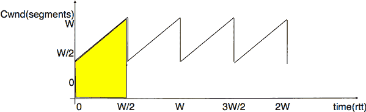

图 226 常规损失下的拥塞窗口演变#

由于损失是均匀分布的，拥塞窗口始终从某个值（$ \frac{W}{2} $）开始，并在每个往返时间内增加一个 MSS，直到达到这个值的两倍（W）。在此点，一个段被重传，周期重新开始。如果以 MSS 大小的段来衡量拥塞窗口，则一个周期持续 $ \frac{W}{2} $ 个往返时间。TCP 连接的带宽是在给定时间段内已传输的字节数。在一个周期内，TCP 连接上发送的段数等于图中黄色梯形的面积。因此，其面积为：

> $ 面积=(\frac{W}{2})² + \frac{1}{2} \times (\frac{W}{2})² = \frac{3 \times W²}{8} $

然而，考虑到我们考虑的常规损失，两个损失之间发送的段数（即在周期内）根据定义等于 $ \frac{1}{p} $。因此，$ W=\sqrt{\frac{8}{3 \times p}}=\frac{k}{\sqrt{p}} $。TCP 连接的吞吐量（以每秒字节数计算）等于发送的段数除以周期的持续时间：

> $ Throughput=\frac{面积 \times MSS}{时间} = \frac{ \frac{3 \times W²}{8}}{\frac{W}{2} \times rtt} $ 或者，在消除 W 之后，$ Throughput=\sqrt{\frac{3}{2}} \times \frac{MSS}{rtt \times \sqrt{p}} $

更详细的模型和模拟分析表明，当发生损失时，TCP 吞吐量的第一阶模型为 $ Throughput \approx \frac{k \times MSS}{rtt \times \sqrt{p}} $。这是一个重要的结果，它表明：

> +   当发生损失时，具有较短往返时间的 TCP 连接的吞吐量可以比具有较长往返时间的 TCP 连接的吞吐量更高。这表明 TCP 拥塞控制方案并不完全公平，因为它有利于具有较短的往返时间的连接。
> +   
> +   使用较大 MSS 的 TCP 连接可以达到比使用较短 MSS 的 TCP 连接更高的吞吐量。这为 TCP 连接之间创造了另一个不公平的来源。然而，应该注意的是，如今大多数主机几乎都使用相同大小的 MSS，大约为 1460 字节。

通常，在没有丢失的情况下，TCP 连接可以达到的最大吞吐量取决于其最大窗口大小和往返时间。如果有丢失，则取决于 MSS、往返时间和丢失率。

> $ Throughput<\min(\frac{window}{rtt},\frac{k \times MSS}{rtt \times \sqrt{p}}) $

注意

TCP 拥塞控制动物园

第一个 TCP 拥塞控制方案是由[Van Jacobson](https://en.wikipedia.org/wiki/Van_Jacobson)在[[Jacobson1988]](../bibliography.html#jacobson1988)提出的。除了撰写科学论文外，[Van Jacobson](https://en.wikipedia.org/wiki/Van_Jacobson)还在伯克利大学分发的 BSD Unix 的 4.3 Tahoe 版本中实现了慢启动和拥塞避免方案。后来，他在 4.3 BSD Unix 的 Reno 版本中通过添加快速重传和快速恢复机制来改进拥塞控制。从那时起，许多研究人员提出了、模拟并实现了对 TCP 拥塞控制方案的修改。其中一些修改至今仍在使用，例如：

> +   NewReno ([**RFC 3782**](https://datatracker.ietf.org/doc/html/rfc3782.html))，作为 Reno 实现中快速恢复机制的改进而提出。
> +   
> +   TCP Vegas，它使用往返时间的变化来估计拥塞以避免它 [[BOP1994]](../bibliography.html#bop1994)。这是基于延迟的拥塞控制算法的例子之一。Vegas 发送器持续测量往返时间的演变，并在往返时间显著增加时减速。这使得 Vegas 在单独使用时能够防止拥塞。不幸的是，如果 Vegas 发送器与仅对丢失做出反应的更具侵略性的 TCP 拥塞控制方案竞争，Vegas 发送器可能难以使用其应有的带宽份额。
> +   
> +   CUBIC，专为高带宽链路设计，自 Linux 2.6.19 内核以来一直是 Linux 的默认拥塞控制方案 [[HRX2008]](../bibliography.html#hrx2008)。现在它被几个操作系统使用，并正在成为默认的拥塞控制方案 [**RFC 8312**](https://datatracker.ietf.org/doc/html/rfc8312.html)。CUBIC 与本章中描述的 TCP 拥塞控制方案的一个关键区别是，CUBIC 在探测网络时更为激进。它不是在快速恢复后依赖加性增长，而是通过使用立方函数来调整拥塞。多亏了这个函数，拥塞窗口增长得更快。这在高带宽延迟网络中尤为重要。
> +   
> +   BBR，由谷歌研究人员开发，并包含在最近的 Linux 内核中 [[CCG+2016]](../bibliography.html#ccg-2016)。BBR 定期估计可用带宽和往返时间。为了适应网络条件的变化，BBR 定期尝试以当前带宽的 1.25 倍发送数据。这使 BBR 发送者能够探测网络，但也可能导致大量损失。最近的科学文章表明，在特定条件下 BBR 对其他拥塞控制方案不公平 [[WMSS2019]](../bibliography.html#wmss2019)。

科学文献中提出了广泛的拥塞控制方案，其中一些已被广泛部署。这些拥塞控制方案的详细比较超出了本章的范围。一篇最近的研究综述描述了许多已实现的 TCP 拥塞控制方案，可以在 [[TKU2019]](../bibliography.html#tku2019) 中找到。

脚注

脚注

### 基于窗口传输协议的拥塞控制#

AIMD 通过对当前拥塞水平做出反应来调整源传输速率以控制拥塞。如果网络没有拥塞，传输速率会增加。如果检测到拥塞，传输速率会乘性降低。在实践中，直接调整传输速率可能很困难，因为它需要使用细粒度计时器。在可靠的传输协议中，一种替代方法是动态调整发送窗口。这是 TCP 和 SCTP 等协议所选择的解决方案，这些协议将在稍后更详细地描述。为了了解基于窗口的协议如何调整它们的传输速率，让我们考虑一个非常简单的可靠传输协议场景，该协议使用 go-back-n。考虑图 图. 215 中所示非常简单的场景。

> 
> 
> 图. 215 一个具有主机共享瓶颈链路的基本网络

主机与路由器之间的链路带宽为 1 Mbps，而两个路由器之间的链路带宽为 500 Kbps。在这个网络中没有显著的传播延迟。为了简单起见，假设主机 A 和 B 发送 1000 比特的分组。在主机-路由器（分别. 路由器-路由器）链路上传输这样的分组需要 1 毫秒（分别. 2 毫秒）。如果没有网络流量，主机 A 测量的往返时间略大于 4 毫秒。让我们观察不同窗口大小的分组流，以了解发送窗口与传输速率之间的关系。

首先考虑一个包含一个段的窗口。这个段需要 4 毫秒才能到达主机 D。目标主机回复一个确认信息，然后下一个段可以被传输。在这样的发送窗口下，传输速率大约是每秒 250 个段或 250 Kbps。这如图图. 216 所示，其中网格的每个方格对应于 1 毫秒。

> 
> 
> 图. 216 从 A 到 D 的 Go-back-n 传输，一个段的窗口

现在考虑一个包含两个段的窗口。主机 A 可以在其 1 Mbps 链路上在 2 毫秒内发送两个段。如果第一个段在时间$ t_{0} $发送，它将在$ t_{0}+4 $时到达主机 D。主机 D 回复一个确认信息，这个确认信息打开主机 A 的发送窗口，并允许它传输一个新的段。同时，第二个段被路由器 R1 缓冲。它将在$ t_{0}+6 $时到达主机 D，并返回一个确认信息。在两个段的窗口下，主机 A 的传输速率大约是 500 Kbps，即瓶颈链路的传输速率。

> 
> 
> 图. 217 从 A 到 D 的 Go-back-n 传输，两个段的窗口

我们的最后一个例子是一个包含四个段的窗口。这些段在$ t_{0} $，$ t_{0}+1 $，$ t_{0}+2 $和$ t_{0}+3 $时发送。第一个段在$ t_{0}+4 $时到达主机 D。主机 D 通过发送一个确认信息来回复这个段，这个确认信息使得主机 A 能够发送它的第五个段。这个段在$ t_{0}+5 $时到达路由器 R1。那时，路由器 R1 正在将第三个段传输到路由器 R2，第四个段仍然在其缓冲区中。在$ t_{0}+6 $时，主机 D 收到第二个段并返回相应的确认信息。这个确认信息使得主机 A 能够发送它的第六个段。这个段在大约$ t_{0}+7 $时到达路由器 R1。那时，路由器开始将第四个段传输到路由器 R2。由于 R1-R2 链路只能支持 500 Kbps，数据包将会在 R1 的缓冲区中积累。平均来说，将有两个数据包在 R1 的缓冲区中等待。这两个数据包的存在将导致传输协议测量的往返时间的增加。虽然第一个段在 4 毫秒内得到了确认，但在$ t_{0}+4 $时发送的第五个段（数据(4)）直到$ t_{0}+11 $才得到确认。平均来说，发送方的传输速率为 500 Kbps，但大窗口的使用通过网络引入了更长的延迟。

> 
> 
> 图. 218 从 A 到 D 的 Go-back-n 传输，四个段的窗口

从上述示例中，我们可以通过调整可靠传输协议的发送窗口来调整传输速率。可靠传输协议不能以每秒超过 $ \frac{window}{rtt} $ 段的速度发送数据，其中 $ window $ 是当前发送窗口。为了控制传输速率，我们引入了拥塞窗口。此拥塞窗口限制了发送窗口。在任何时候，发送窗口都受到 $ \min(swin,cwin) $ 的限制，其中 swin 是发送窗口，cwin 是当前的拥塞窗口。当然，窗口还受到远程对端宣布的接收窗口的进一步限制。利用拥塞窗口，使用固定大小段的简单可靠传输协议可以如下实现 AIMD。

对于增量增加部分，我们的简单协议将简单地在每个往返时间增加一个段。AIMD 的乘性减少部分可以通过检测到拥塞时将拥塞窗口减半来实现。为了简单起见，我们假设由于二进制反馈而检测到拥塞，并且没有数据包丢失。我们将在后面的章节中更详细地讨论损失如何影响像 TCP 这样的实际传输协议。

为我们简单的传输协议实现拥塞控制方案可以如下进行。

```sh
# Initialisation
cwin = 1  # congestion window measured in segments

# Ack arrival
if ack_received:
    if newack:  # new ack, no congestion
        # increase cwin by one every rtt
        cwin = cwin + (1/cwin)
    else:
        # no increase

if congestion_detected:
    cwin = cwin / 2 # only once per rtt 
```

在上述伪代码中，cwin 包含存储为段数的拥塞窗口。此拥塞窗口在收到每个确认以及检测到拥塞时更新。为了简单起见，我们假设 cwin 存储为浮点数，但只能传输完整的段。

为了说明，让我们考虑上述网络场景，并假设路由器实现了 DECBit 二进制反馈方案 [[RJ1995]](../bibliography.html#rj1995)。此方案使用一种前向显式拥塞通知，当路由器的缓冲区包含一个或多个数据包时，路由器会在到达的数据包中标记拥塞位。在图图 219 中，我们用*来表示标记的数据包。

> 
> 
> 图 219 从 A 到 D 的 Go-back-n 传输，使用 AIMD 拥塞控制和 DecBit 二进制反馈方案

当连接开始时，其拥塞窗口设置为一段。S0 段在大约 $ t_{0}+4 $ 时发送确认。拥塞窗口增加一段，S1 和 S2 在 $ t_{0}+4 $ 和 $ t_{0}+5 $ 时传输。相应的确认在 $ t_{0}+8 $ 和 $ t_{0}+10 $ 时收到。在接收到最后一个确认后，拥塞窗口达到 3，可以发送段（S4 和 S5）。当段 S6 达到路由器 R1 时，其缓冲区已包含 S5。包含 S6 的数据包因此被标记以通知发送者拥塞。请注意，发送者只有在接收到 $ t_{0}+18 $ 时的相应确认后才会注意到拥塞。在此期间，拥塞窗口继续增加。在 $ t_{0}+16 $，在接收到 S5 的确认后，它达到 4。当检测到拥塞时，拥塞窗口降低到 2。这解释了从接收到 S*6 的确认到传输 S10 之间的空闲时间。

在实践中，路由器连接到多个输入链路。图 图 220 展示了两个主机的一个示例。

> 
> 
> 图 220 一个简单的网络，主机共享瓶颈
> 
> 
> 
> 图 221 不同输入之间共享瓶颈链路

通常，链路具有非零延迟。这在下图中得到了说明，其中在 R 和 C 之间的链路上添加了延迟。

> 
> 
> 图 222 不同输入之间共享瓶颈链路

### 拥塞控制#

在互联网（即由不同类型的网络（如互联网）组成的网络）中，拥塞控制可以在网络层或传输层实现。拥塞问题在 20 世纪 80 年代后期得到了明确识别，开发了解决该问题技术的研究人员选择了在传输层解决方案。在传输层添加拥塞控制是有意义的，因为这一层提供可靠的数据传输，避免拥塞是这种可靠交付的一个因素。由于我们已经描述的自时钟特性，传输层已经处理了异构网络。在本节中，我们解释了拥塞控制是如何添加到 TCP 的，以及这种机制如何在未来得到改进。

TCP 拥塞控制方案最初由[Van Jacobson](https://en.wikipedia.org/wiki/Van_Jacobson)在[[Jacobson1988]](../bibliography.html#jacobson1988)中提出。当前规范可以在[**RFC 5681**](https://datatracker.ietf.org/doc/html/rfc5681.html)中找到。TCP 依赖于增量增加和乘性减少（AIMD）。为了实现 AIMD，TCP 主机必须能够控制其传输速率。一种方法是通过定时器并根据 AIMD 施加的速率调整它们的过期时间。不幸的是，维护大量 TCP 连接的此类定时器可能很困难。相反，[Van Jacobson](https://en.wikipedia.org/wiki/Van_Jacobson)指出，可以通过限制其发送窗口来人为地控制 TCP 拥塞的速率。TCP 连接的发送数据速率不能超过$ \frac{window}{rtt} $，其中$ window $是主机发送窗口和接收者广告窗口之间的最小值。

TCP 的拥塞控制方案基于一个拥塞窗口。拥塞窗口（cwnd）的当前值存储在每个 TCP 连接的 TCB 中，发送者可以使用的窗口由$ \min(cwnd,rwin,swin) $约束，其中$ swin $是当前发送窗口，$ rwin $是最后接收到的接收窗口。TCP 拥塞控制的增量增加部分在每个往返时间通过增加 MSS 字节来增加拥塞窗口。在 TCP 文献中，这个阶段通常被称为拥塞避免阶段。TCP 拥塞控制的乘性减少部分在检测到拥塞后，将当前拥塞窗口的值除以一次。

当 TCP 连接开始时，发送主机不知道它用来到达目的地的网络部分是否拥塞。为了避免造成过多的拥塞，它必须从一个小的拥塞窗口开始。[[Jacobson1988]](../bibliography.html#jacobson1988)建议一个初始窗口为 MSS 字节。由于 TCP 拥塞控制方案的累加增加部分在每个往返时间增加 MSS 字节的拥塞窗口，TCP 连接可能需要等待多个往返时间才能有效地使用可用带宽。这在带宽乘以往返时间（$ bandwidth \times rtt $）产品较高的环境中尤为重要。为了避免在达到足够大的拥塞窗口以有效地利用网络之前等待过多的往返时间，TCP 拥塞控制方案包括慢启动算法。TCP 慢启动阶段的目标是快速达到 cwnd 的可接受值。在慢启动期间，拥塞窗口在每个往返时间翻倍。慢启动算法在 TCB 中使用一个额外的变量：ssthresh（慢启动阈值）。ssthresh 是对未引起拥塞的 cwnd 最后值的估计。它初始化为发送窗口，并在每次拥塞事件后更新。

任何拥塞控制方案都必须回答的一个关键问题是如何检测拥塞。TCP 拥塞控制方案的第一种实现选择了简单而实用的方法：数据包丢失表示拥塞。如果网络拥塞，路由器缓冲区将满，数据包将被丢弃。在有线网络中，数据包丢失主要是由拥塞引起的。在无线网络中，数据包可能由于传输错误或其他与拥塞无关的原因而丢失。TCP 已经检测到段丢失以确保可靠交付。TCP 拥塞控制方案区分两种类型的拥塞：

> +   轻度拥塞。TCP 认为如果它收到三个重复的确认并且执行快速重传，则网络轻微拥塞。如果快速重传成功，这意味着只有一个数据段丢失。在这种情况下，TCP 执行乘性减少，拥塞窗口除以 2。慢启动阈值设置为拥塞窗口的新值。
> +   
> +   严重拥塞。当 TCP 的重传计时器超时时，TCP 认为网络严重拥塞。在这种情况下，TCP 重传第一个数据段，将慢启动阈值设置为拥塞窗口的 50%。拥塞窗口重置为其初始值，TCP 执行慢启动。

下图说明了在严重拥塞时拥塞窗口的演变。在连接开始时，发送方执行慢启动，直到第一个段丢失并且重传计时器到期。此时，ssthresh 设置为当前拥塞窗口的一半，拥塞窗口重置为一个段。丢失的段在发送方再次执行慢启动并使拥塞窗口达到 ssthresh 时被重传。然后它切换到拥塞避免，拥塞窗口线性增加，直到段丢失并且重传计时器到期。

(../_images/tcp-congestion-severe.png)

图 223 严重拥塞时 TCP 拥塞窗口的评估#

下图说明了在网络轻微拥塞时拥塞窗口的演变，并且所有丢失的段都可以使用快速重传重新传输。发送方从慢启动开始。一个段丢失，但通过快速重传成功重传。由于这是轻微的拥塞，拥塞窗口减半，发送方立即进入拥塞避免状态。

(../_images/tcp-congestion-mild.png)

图 224 网络轻微拥塞时 TCP 拥塞窗口的评估#

大多数 TCP 实现会在收到确认时更新拥塞窗口。如果我们假设接收方确认每个接收到的段，并且发送方只发送 MSS 大小的段，则可以使用以下简化的伪代码 [[7]](#fwrap) 实现 TCP 拥塞控制方案。此伪代码包括在 [**RFC 3042**](https://datatracker.ietf.org/doc/html/rfc3042.html) 中提出的优化，允许发送方在收到第一个或第二个重复确认后发送新的未发送数据。接收这些确认中的每一个都表明一个段已经离开网络，因此可以发送额外的数据而不会造成更多的拥塞。请注意，在收到这些第一个重复确认时，拥塞窗口**不会**增加。

```sh
# Initialization
cwnd = MSS  # congestion window in bytes
ssthresh= swin # in bytes

# Ack arrival
if tcp.ack > snd.una:  # new ack, no congestion
    if dupacks == 0:  # not currently recovering from loss
        if cwnd < ssthresh:
            # slow-start : quickly increase cwnd
            # double cwnd every rtt
            cwnd = cwnd + MSS
        else:
            # congestion avoidance : slowly increase cwnd
            # increase cwnd by one mss every rtt
            cwnd = cwnd + MSS * (MSS / cwnd)
    else:  # recovering from loss
        cwnd = ssthresh  # deflate cwnd RFC5681
        dupacks = 0
else:  # duplicate or old ack
    if tcp.ack == snd.una:  # duplicate acknowledgment
        dupacks += 1
        if dupacks == 1 or dupacks == 2:
            send_next_unacked_segment  # RFC3042
        if dupacks == 3:
            retransmitsegment(snd.una)
            ssthresh = max(cwnd/2, 2*MSS)
            cwnd = ssthresh
        if dupacks > 3:  # RFC5681
            cwnd = cwnd + MSS  # inflate cwnd
    else:
        # ack for old segment, ignored
        pass

Expiration of the retransmission timer:
    send(snd.una)  # retransmit first lost segment
    sshtresh = max(cwnd/2, 2*MSS)
    cwnd = MSS 
```

此外，当 TCP 连接空闲时间超过其当前重传计时器时，它应将其拥塞窗口重置为连接开始时使用的拥塞窗口大小，因为它不再知道网络的当前拥塞状态。

注意

初始拥塞窗口

在 [[Jacobson1988]](../bibliography.html#jacobson1988) 中提出的原始 TCP 拥塞控制机制建议每个 TCP 连接应从设置 $ cwnd=MSS $ 开始。然而，在今天的宽带网络中，使用如此小的初始拥塞窗口严重影响了短 TCP 连接的性能，例如那些由 Web 服务器使用的连接。2002 年，[**RFC 3390**](https://datatracker.ietf.org/doc/html/rfc3390.html) 允许初始拥塞窗口约为 4 KBytes，这在许多环境中对应于 3 个段。最近，谷歌的研究人员提出了将初始窗口进一步增加到 15 KBytes [[DRC+2010]](../bibliography.html#drc-2010)。他们收集的测量数据显示，这种增加不会显著增加拥塞，但会显著减少短 HTTP 响应的延迟。不出所料，所选的初始窗口对应于搜索引擎的 HTTP 响应的平均大小。这种提出的修改已在 [**RFC 6928**](https://datatracker.ietf.org/doc/html/rfc6928.html) 中被采用，并且 TCP 实现支持它。

#### 无数据丢失地控制拥塞#

在今天的互联网中，通过定期以高于网络容量的速率发送数据包来控制拥塞。这些数据包填满了路由器的缓冲区，最终被丢弃。但不久之后，TCP 发送者会重新发送包含完全相同数据的数据包。这可能导致资源的浪费，因为这些连续的重传消耗了丢弃数据包的路由器上游的资源。数据包丢失并不是检测网络内部拥塞的唯一信号。一种替代方案是允许路由器在转发数据包时明确地指示其当前的拥塞水平。这种方法在 20 世纪 80 年代末被提出 [[RJ1995]](../bibliography.html#rj1995) 并在一些网络中使用。不幸的是，在互联网社区几乎经过十年才同意考虑这种方法。在此期间，大量的 TCP 实现和路由器被部署在互联网上。

如前所述，显式拥塞通知 [**RFC 3168**](https://datatracker.ietf.org/doc/html/rfc3168.html) 通过允许路由器在轻微拥塞时明确标记数据包来提高拥塞检测。理论上，数据包头部的一个比特 [[RJ1995]](../bibliography.html#rj1995) 就足以支持这种拥塞控制方案。当一个主机收到标记的数据包时，它会将拥塞信息返回给源主机，源主机据此调整其传输速率。尽管这个想法相对简单，但在整个互联网上部署它已被证明是具有挑战性的 [[KNT2013]](../bibliography.html#knt2013)。分析阻碍这种技术部署的不同因素是很有趣的。

在 TCP/IP 网络中添加显式拥塞通知 (ECN) 的第一个困难是修改网络数据包和传输段头的格式，以便携带所需的信息。在网络层，需要一个比特位来允许路由器在拥塞期间标记它们转发的数据包。在 IP 网络层，这个比特位被称为拥塞经历 (CE) 比特位，是数据包头部的一部分。然而，使用单个比特位来标记数据包是不够的。考虑一个有两个源、一个拥塞路由器和目的地的一个简单场景。假设第一个发送器和目的地支持 ECN，但第二个发送器不支持。如果路由器拥塞，它将标记来自两个发送器的数据包。第一个发送器将通过降低其传输速率来对数据包标记做出反应。然而，由于第二个发送器不支持 ECN，它不会对标记做出反应。此外，这个发送器可能会继续增加其传输速率，这将导致更多数据包被标记，而第一个源将再次降低其传输速率，……最终，实施 ECN 的源与未实施 ECN 的源相比会受到惩罚。这个问题的不公平性是广泛部署 ECN 在公共互联网上的主要障碍 [[8]](#fprivate)。在 [**RFC 3168**](https://datatracker.ietf.org/doc/html/rfc3168.html) 中提出的解决这个问题的方案是在网络数据包头部使用第二个比特位。这个比特位被称为 ECN 兼容传输 (ECT) 比特位，它指示数据包是否包含由支持 ECN 的传输协议产生的段。支持 ECN 的传输协议在所有数据包中设置 ECT 比特位。当一个路由器拥塞时，它首先验证 ECT 比特位是否被设置。在这种情况下，数据包的 CE 比特位被设置为指示拥塞。否则，数据包将被丢弃。这简化了 ECN 的部署 [[9]](#fecnnonce)。

第二个困难是如何让接收器通知发送器接收了带有 CE 比特位标记的网络数据包。在像 TCP 和 SCTP 这样的可靠传输协议中，可以通过确认来提供这种反馈。对于 TCP，有两种可能的选择：更改 TCP 段头中的某些比特位或定义一个新的 TCP 选项来携带此信息。ECN 的设计者选择了重用 TCP 头部中的空闲比特位。更确切地说，在 TCP 头部中添加了两个 TCP 标志来支持 ECN。ECN 反射 (ECE) 在确认中设置，当在正向路径上接收到的数据包中设置了 CE 时。


图 225 TCP 标志#

第三个困难是允许一个支持 ECN 的发送者检测远程主机是否也支持 ECN。这是一个经典的传输协议扩展协商。在 TCP 中，这可以通过在三次握手期间定义一个新的 TCP 选项来解决。为了避免在 TCP 选项中浪费空间，ECN 的设计者在 [**RFC 3168**](https://datatracker.ietf.org/doc/html/rfc3168.html) 中选择了使用 TCP 头部的 ECN-Echo 和 CWR 位来进行这种协商。最终，结果是相同的，但交换的位数更少。

多亏了 ECT、CE 和 ECE，路由器可以在拥塞期间标记数据包，接收者可以将拥塞信息返回给 TCP 发送者。然而，这三个位不足以允许服务器可靠地将 ECE 位发送给 TCP 发送者。TCP 确认信息不是可靠发送的。TCP 确认信息总是包含下一个期望的序列号。由于 TCP 确认信息是累积的，一个确认信息的丢失可以通过后续正确接收的确认信息来恢复。

如果 TCP 确认信息超载以携带 ECE 位，情况就不同了。考虑下面图中的示例。一个客户端通过路由器向服务器发送数据包。在下面的示例中，第一个数据包被标记。服务器返回一个设置了 ECE 位的确认信息。不幸的是，这个确认信息丢失了，并且从未到达客户端。不久之后，服务器发送了一个也携带累积确认信息的数据段。这个确认信息确认了数据已到达客户端，但它没有通过 ECE 位接收到拥塞信息。

> ![msc {
> 
> 客户端 [标签="客户端", 线颜色=黑色],
> 
> 路由器 [标签="路由器", 线颜色=黑色],
> 
> 服务器 [标签="server", 线颜色=黑色];
> 
> 客户端=>路由器 [ 标签 = "数据[seq=1,ECT=1,CE=0]", arcskip="1" ];
> 
> 路由器=>服务器 [ 标签 = "数据[seq=1,ECT=1,CE=1]", arcskip="1"];
> 
> |||;
> 
> 服务器=>路由器 [ 标签 = "ack=2,ECE=1", arcskip="1" ];
> 
> 路由器配置 -x 客户端 [标签="ack=2,ECE=1", arcskip="1" ];
> 
> |||;
> 
> 服务器=>路由器 [ 标签 = "数据[seq=x,ack=2,ECE=0,ECT=1,CE=0]", arcskip="1" ];
> 
> 路由器=>客户端 [ 标签 = "数据[seq=x,ack=2,ECE=0,ECT=1,CE=0]", arcskip="1"];
> 
> |||;
> 
> 客户端->服务器 [线颜色=白色];
> 
> }](../Images/d2ed1589241adeb9e699082587d1916d.png)

为了解决这个问题，[**RFC 3168**](https://datatracker.ietf.org/doc/html/rfc3168.html) 在 TCP 头部使用了一个额外的位：拥塞窗口减少 (CWR) 位。

> ![msc {
> 
> 客户端 [标签="客户端", 线颜色=黑色],
> 
> 路由器 [标签="路由器", 线颜色=黑色],
> 
> 服务器 [标签="服务器", 线颜色=黑色];
> 
> 客户端=>路由器 [ 标签 = "数据[seq=1,ECT=1,CE=0]", arcskip="1" ];
> 
> 路由器=>服务器 [ 标签 = "数据[seq=1,ECT=1,CE=1]", arcskip="1"];
> 
> |||;
> 
> 服务器=>路由器 [ 标签 = "ack=2,ECE=1", arcskip="1" ];
> 
> 路由器 -x 客户端 [标签="ack=2,ECE=1", arcskip="1" ];
> 
> |||;
> 
> server=>router [ label = "data[seq=x,ack=2,ECE=1,ECT=1,CE=0]", arcskip="1" ];
> 
> router=>client [ label = "data[seq=x,ack=2,ECE=1,ECT=1,CE=0]", arcskip="1"];
> 
> |||;
> 
> client=>router [ label = "data[seq=1,ECT=1,CE=0,CWR=1]", arcskip="1" ];
> 
> router=>server [ label = "data[seq=1,ECT=1,CE=1,CWR=1]", arcskip="1"];
> 
> |||;
> 
> client->server [linecolour=white];
> 
> }](../Images/36533b7c4d47ba50cac29ebf6ebcc1f1.png)

TCP 头部的 CWR 位为 ECE 位提供了一种形式的确认。当一个 TCP 接收器检测到一个标记了 CE 位的包时，它会将其返回给发送者的所有段中的 ECE 位置位。当收到一个设置了 ECE 位的确认时，发送器将其拥塞窗口减少以反映轻微的拥塞，并设置 CWR 位。只要接收到的段中设置了 ECE 位，此位将保持设置状态。发送器应该只在每个往返时间对标记的包做出一次反应。

关于显式拥塞通知需要讨论的最后一个问题是路由器用来检测拥塞的算法。在路由器上，拥塞通过路由器缓冲区中存储的包的数量来体现。正如之前所解释的，我们需要区分两种类型的路由器：

> +   拥有一个单个 FIFO 队列的路由器
> +   
> +   由循环调度器服务的多个队列的路由器

使用单个队列的路由器将它们的缓冲区占用量测量为队列中存储的数据包字节数 [[10]](#fslot)。检测拥塞的第一种方法是测量瞬时缓冲区占用量，并在占用量超过阈值时立即认为路由器拥塞。阈值的典型值可能是总缓冲区的 40%。测量瞬时缓冲区占用量很简单，因为它只需要一个计数器。然而，从控制角度来看，这个值是脆弱的，因为它会频繁变化。一个更好的解决方案是测量*平均*缓冲区占用量，并在平均占用量过高时认为路由器拥塞。随机早期检测（RED）[[FJ1993]](../bibliography.html#fj1993) 是一种旨在支持显式拥塞通知的算法。除了测量平均缓冲区占用量外，它还使用概率标记。当路由器拥塞时，到达的数据包会以随平均缓冲区占用量增加的概率被标记。与标记所有到达的数据包相比，使用概率标记的主要优点是，流量将被按其传输的数据包数量成比例地标记。如果路由器在拥塞时标记 10%的到达数据包，那么每秒发送一百个数据包的大流量将被标记 10 次，而每秒只发送一个数据包的流量则不会被标记。这种概率标记允许按数据包对网络资源使用的比例进行标记。

如果路由器使用由调度器服务的多个队列，情况就不同了。当大流量和小流量竞争带宽时，调度器会优先考虑未使用其公平份额带宽的小流量。小流量的队列几乎为空，而大流量的队列则会逐渐增加。在采用此类调度器的路由器上，一种标记数据包的好方法是设置每个队列的占用阈值，并在特定队列的占用超过配置阈值时立即标记进入该队列的数据包。

#### 模型化 TCP 拥塞控制#

多亏了其拥塞控制方案，TCP 能够根据网络中发生的损失来调整其传输速率。直观地说，当损失百分比增加时，TCP 的传输速率会降低。研究人员已经提出了详细的模型，允许预测 TCP 连接在发生损失时的吞吐量 [[MSMO1997]](../bibliography.html#msmo1997)。为了对影响 TCP 性能的因素有所了解，让我们考虑一个非常简单的模型。它的假设并不完全现实，但它能给我们提供良好的直觉，而不需要复杂的数学。

该模型考虑了一个假设的 TCP 连接，该连接遭受均匀间隔的段丢失。如果 $ p $ 是段丢失率，那么 TCP 连接成功传输 $ \frac{1}{p}-1 $ 个段，下一个段丢失。如果我们忽略连接开始时的慢启动，由于只有可以通过快速重传恢复的孤立丢失，因此在此环境中 TCP 始终处于拥塞避免状态。因此，拥塞窗口的演变如图所示。请注意，该图的 x 轴表示以往返时间为单位的测量时间，在模型中应保持恒定，而 y 轴表示以 MSS 大小的段为单位的拥塞窗口大小。


图 226 拥塞窗口在常规丢失下的演变#

由于丢失是均匀间隔的，拥塞窗口始终从某个值（$ \frac{W}{2} $）开始，并在每个往返时间内增加一个 MSS，直到达到这个值的两倍（W）。此时，一个段被重传，周期再次开始。如果拥塞窗口以 MSS 大小的段来衡量，一个周期持续 $ \frac{W}{2} $ 个往返时间。TCP 连接的带宽是在给定时间段内已传输的字节数。在一个周期内，TCP 连接上发送的段数等于图中黄色梯形的面积。因此，其面积为：

> $ 面积=(\frac{W}{2})² + \frac{1}{2} \times (\frac{W}{2})² = \frac{3 \times W²}{8} $

然而，考虑到我们考虑的常规丢失，两个丢失之间的段数（即在周期内）根据定义等于 $ \frac{1}{p} $。因此，$ W=\sqrt{\frac{8}{3 \times p}}=\frac{k}{\sqrt{p}} $。TCP 连接的吞吐量（以每秒字节数计）等于传输的段数除以周期的持续时间：

> $ Throughput=\frac{面积 \times MSS}{时间} = \frac{ \frac{3 \times W²}{8}}{\frac{W}{2} \times rtt} $ 或者，在消除 W 之后，$ Throughput=\sqrt{\frac{3}{2}} \times \frac{MSS}{rtt \times \sqrt{p}} $

更详细的模型和模拟分析表明，当发生丢失时，TCP 吞吐量的第一阶模型为 $ Throughput \approx \frac{k \times MSS}{rtt \times \sqrt{p}} $。这是一个重要的结果，它表明：

> +   当发生丢失时，具有较短往返时间的 TCP 连接比具有较长往返时间的 TCP 连接能实现更高的吞吐量。这表明 TCP 拥塞控制方案并不完全公平，因为它有利于具有较短的往返时间的连接。
> +   
> +   使用较大 MSS 的 TCP 连接可以比使用较短 MSS 的 TCP 连接实现更高的吞吐量。这为 TCP 连接之间创造了另一个不公平的来源。然而，应该注意的是，如今大多数主机几乎都使用相同大小的 MSS，大约为 1460 字节。

通常，在没有损失的情况下，TCP 连接能够达到的最大吞吐量取决于其最大窗口大小和往返时间。如果有损失，则取决于 MSS、往返时间和损失率。

> $ Throughput<\min(\frac{window}{rtt},\frac{k \times MSS}{rtt \times \sqrt{p}}) $

注意

TCP 拥塞控制动物园

第一个 TCP 拥塞控制方案是由[Van Jacobson](https://en.wikipedia.org/wiki/Van_Jacobson)提出的 [[Jacobson1988]](../bibliography.html#jacobson1988)。除了撰写科学论文外，[Van Jacobson](https://en.wikipedia.org/wiki/Van_Jacobson)还在伯克利大学分发的 BSD Unix 的 4.3 Tahoe 版本中实现了慢启动和拥塞避免方案。后来，他在 4.3 BSD Unix 的 Reno 版本中通过添加快速重传和快速恢复机制来改进拥塞控制。从那时起，许多研究人员提出了、模拟并实现了对 TCP 拥塞控制方案的修改。其中一些修改至今仍在使用，例如：

> +   NewReno ([**RFC 3782**](https://datatracker.ietf.org/doc/html/rfc3782.html))，它被提出作为 Reno 实现中快速恢复机制的改进。
> +   
> +   TCP Vegas，它使用往返时间的变化来估计拥塞以避免拥塞 [[BOP1994]](../bibliography.html#bop1994)。这是基于延迟的拥塞控制算法的例子之一。Vegas 发送器持续测量往返时间的演变，并在往返时间显著增加时减速。这使得 Vegas 在单独使用时能够防止拥塞。不幸的是，如果 Vegas 发送器与仅对损失做出反应的更具侵略性的 TCP 拥塞控制方案竞争，Vegas 发送器可能难以使用其应有的带宽份额。
> +   
> +   CUBIC，它被设计用于高带宽链路，并且自 Linux 2.6.19 内核以来一直是 Linux 的默认拥塞控制方案 [[HRX2008]](../bibliography.html#hrx2008)。现在它被几个操作系统使用，并正在成为默认的拥塞控制方案 [**RFC 8312**](https://datatracker.ietf.org/doc/html/rfc8312.html)。CUBIC 与本章中描述的 TCP 拥塞控制方案的一个关键区别在于，CUBIC 在探测网络时更为激进。它不是依赖于快速恢复后的加性增加，而是通过使用立方函数来调整拥塞。多亏了这个函数，拥塞窗口增长得更快。这在高带宽延迟网络中尤为重要。
> +   
> +   BBR，由谷歌研究人员开发，并包含在最近的 Linux 内核中 [[CCG+2016]](../bibliography.html#ccg-2016)。BBR 定期估计可用带宽和往返时间。为了适应网络条件的变化，BBR 定期尝试以当前带宽的 1.25 倍发送数据。这使得 BBR 发送者能够探测网络，但也可能导致大量数据丢失。最近的研究文章表明，在特定条件下，BBR 对其他拥塞控制方案是不公平的 [[WMSS2019]](../bibliography.html#wmss2019)。

科学文献中已经提出了各种各样的拥塞控制方案，其中一些已经被广泛部署。对这些拥塞控制方案的详细比较超出了本章的范围。一篇最近的研究综述描述了许多已实现的 TCP 拥塞控制方案，可以在 [[TKU2019]](../bibliography.html#tku2019) 中找到。

脚注

脚注

#### 控制拥塞而不丢失数据#

在今天的互联网中，通过定期以高于网络容量的速率发送数据包来控制拥塞。这些数据包填满了路由器的缓冲区，最终被丢弃。但是，在不久之后，TCP 发送者会重新发送包含完全相同数据的数据包。这可能导致资源的浪费，因为这些连续的重传消耗了丢弃数据包的路由器上游的资源。数据包丢失并不是检测网络内部拥塞的唯一信号。一种替代方案是允许路由器在转发数据包时明确地指示其当前的拥塞水平。这种方法在 20 世纪 80 年代末被提出 [[RJ1995]](../bibliography.html#rj1995) 并在一些网络中使用。不幸的是，在互联网社区几乎经过十年才同意考虑这种方法。在此期间，大量的 TCP 实现和路由器被部署在互联网上。

如前所述，显式拥塞通知 [**RFC 3168**](https://datatracker.ietf.org/doc/html/rfc3168.html) 通过允许路由器在数据包轻微拥塞时明确标记数据包来提高拥塞检测。理论上，数据包头部的一个比特 [[RJ1995]](../bibliography.html#rj1995) 就足以支持这种拥塞控制方案。当一个主机接收到标记的数据包时，它会将拥塞信息返回给源主机，源主机相应地调整其传输速率。尽管这个想法相对简单，但在整个互联网上部署它已被证明是具有挑战性的 [[KNT2013]](../bibliography.html#knt2013)。分析阻碍这种技术部署的不同因素是很有趣的。

在 TCP/IP 网络中添加显式拥塞通知（ECN）的第一个困难是修改网络数据包和传输段头的格式以携带所需信息。在网络层，需要一个位允许路由器在拥塞期间标记它们转发的数据包。在 IP 网络层，这个位被称为拥塞经历（CE）位，是数据包头部的一部分。然而，使用单个位来标记数据包是不够的。考虑一个有两个源、一个拥塞路由器和目标节点的简单场景。假设第一个发送者和目标节点支持 ECN，而第二个发送者不支持。如果路由器拥塞，它将标记来自两个发送者的数据包。第一个发送者将通过降低其传输速率来对数据包标记做出反应。然而，由于第二个发送者不支持 ECN，它不会对标记做出反应。此外，这个发送者可能会继续增加其传输速率，这将导致更多数据包被标记，而第一个源节点将再次降低其传输速率，……最终，实现 ECN 的源节点与未实现 ECN 的源节点相比会受到惩罚。这个不公平问题是在公共互联网上广泛部署 ECN 的主要障碍[8]。在[**RFC 3168**](https://datatracker.ietf.org/doc/html/rfc3168.html)中提出的解决这个问题的方案是使用网络数据包头部的第二个位。这个位被称为 ECN 能力传输（ECT）位，表示数据包是否包含由支持 ECN 的传输协议产生的段。支持 ECN 的传输协议在所有数据包中设置 ECT 位。当路由器拥塞时，它首先验证 ECT 位是否设置。在这种情况下，数据包的 CE 位被设置为指示拥塞。否则，数据包将被丢弃。这简化了 ECN 的部署[9]。

第二个困难是如何让接收方通知发送方已接收带有 CE 位的网络数据包。在 TCP 和 SCTP 等可靠传输协议中，可以通过确认信息提供这种反馈。对于 TCP 来说，有两种可能的选择：改变 TCP 段头中的某些位或定义一个新的 TCP 选项来携带这些信息。ECN 的设计者选择了在 TCP 头中重用空闲位。更确切地说，TCP 头中增加了两个标志来支持 ECN。当接收到的数据包在正向路径上设置了 CE 位时，ECN 回声（ECE）会在确认信息中设置。

](../_images/tcp-enc.svg)

图 225 TCP 标志#

第三个困难是允许一个 ECN（显式拥塞通知）能力的发送者检测远程主机是否也支持 ECN。这是一个经典的传输协议扩展的协商。在 TCP 中，这可以通过在三次握手期间定义一个新的 TCP 选项来解决。为了避免在 TCP 选项中浪费空间，ECN 的设计者选择了在[**RFC 3168**](https://datatracker.ietf.org/doc/html/rfc3168.html)中使用 TCP 头中的 ECN-Echo 和 CWR（拥塞窗口减少）位来进行这种协商。最终，结果是相同的，但交换的位数更少。

多亏了 ECT、CE 和 ECE，路由器可以在拥塞期间标记数据包，接收者可以将拥塞信息返回给 TCP 发送者。然而，这三个位不足以允许服务器可靠地将 ECE 位发送给 TCP 发送者。TCP 确认信息不是可靠发送的。TCP 确认信息总是包含下一个期望的序列号。由于 TCP 确认信息是累积的，一个确认信息的丢失可以通过后续正确接收的确认信息来恢复。

如果 TCP 确认信息超载以携带 ECE 位，情况就不同了。考虑下面图中的示例。一个客户端通过路由器向服务器发送数据包。在下面的示例中，第一个数据包被标记。服务器返回一个设置了 ECE 位的确认信息。不幸的是，这个确认信息丢失了，并且从未到达客户端。不久之后，服务器发送了一个也携带累积确认信息的数据段。这个确认信息确认了数据已到达客户端，但它没有通过 ECE 位接收到拥塞信息。

> ![msc {
> 
> client [label="client", linecolour=black],
> 
> router [label="router", linecolour=black],
> 
> server [label="server", linecolour=black];
> 
> client=>router [ label = "data[seq=1,ECT=1,CE=0]", arcskip="1" ];
> 
> router=>server [ label = "data[seq=1,ECT=1,CE=1]", arcskip="1"];
> 
> |||;
> 
> server=>router [ label = "ack=2,ECE=1", arcskip="1" ];
> 
> router -x client [label="ack=2,ECE=1", arcskip="1" ];
> 
> |||;
> 
> server=>router [ label = "data[seq=x,ack=2,ECE=0,ECT=1,CE=0]", arcskip="1" ];
> 
> router=>client [ label = "data[seq=x,ack=2,ECE=0,ECT=1,CE=0]", arcskip="1"];
> 
> |||;
> 
> client->server [linecolour=white];
> 
> }](../Images/d2ed1589241adeb9e699082587d1916d.png)

为了解决这个问题，[**RFC 3168**](https://datatracker.ietf.org/doc/html/rfc3168.html)在 TCP 头中使用了额外的位：拥塞窗口减少（CWR）位。

> ![msc {
> 
> client [label="client", linecolour=black],
> 
> router [label="router", linecolour=black],
> 
> server [label="server", linecolour=black];
> 
> client=>router [ label = "data[seq=1,ECT=1,CE=0]", arcskip="1" ];
> 
> router=>server [ label = "data[seq=1,ECT=1,CE=1]", arcskip="1"];
> 
> |||;
> 
> server=>router [ label = "ack=2,ECE=1", arcskip="1" ];
> 
> router -x client [label="ack=2,ECE=1", arcskip="1" ];
> 
> |||;
> 
> 服务器=>路由器 [标签 = "data[seq=x,ack=2,ECE=1,ECT=1,CE=0]", arcskip="1" ];
> 
> 路由器=>客户端 [标签 = "data[seq=x,ack=2,ECE=1,ECT=1,CE=0]", arcskip="1"];
> 
> |||;
> 
> 客户端=>路由器 [标签 = "data[seq=1,ECT=1,CE=0,CWR=1]", arcskip="1" ];
> 
> 路由器=>服务器 [标签 = "data[seq=1,ECT=1,CE=1,CWR=1]", arcskip="1"];
> 
> |||;
> 
> 客户端->服务器 [线路颜色=白色];
> 
> }](../Images/36533b7c4d47ba50cac29ebf6ebcc1f1.png)

TCP 头部中的 CWR 位为 ECE 位提供了一种确认形式。当 TCP 接收方检测到标记了 CE 位的分组时，它会将其返回给发送方的所有段中的 ECE 位置位。当收到 ECE 位已置位的确认后，发送方将其拥塞窗口减小以反映轻微的拥塞，并设置 CWR 位。只要接收到的段包含已置位的 ECE 位，此位将保持置位状态。发送方应仅在往返时间内对标记的分组做出一次反应。

需要讨论的最后一个关于显式拥塞通知的问题是路由器用于检测拥塞的算法。在路由器上，拥塞通过路由器缓冲区中存储的分组数量来体现。如前所述，我们需要区分两种类型的路由器：

> +   只有一个 FIFO 队列的路由器
> +   
> +   由轮询调度器服务的多个队列的路由器

使用单个队列的路由器将它们的缓冲区占用量测量为队列中存储的数据包字节数 [[10]](#fslot)。检测拥塞的一种方法是测量瞬时缓冲区占用量，并在占用量超过阈值时认为路由器处于拥塞状态。阈值的典型值可能是总缓冲区的 40%。测量瞬时缓冲区占用量很简单，因为它只需要一个计数器。然而，从控制角度来看，这个值是脆弱的，因为它会频繁变化。一个更好的解决方案是测量*平均*缓冲区占用量，并在平均占用量过高时认为路由器处于拥塞状态。随机早期检测（RED）[[FJ1993]](../bibliography.html#fj1993) 是一种旨在支持显式拥塞通知的算法。除了测量平均缓冲区占用量外，它还使用概率标记。当路由器拥塞时，到达的数据包会以随平均缓冲区占用量增加的概率被标记。使用概率标记而不是标记所有到达数据包的主要优点是，流量将被按其传输的数据包数量成比例标记。如果路由器在拥塞时标记了 10%的到达数据包，那么每秒发送一百个数据包的大流量将被标记 10 次，而每秒只发送一个数据包的流量则不会被标记。这种概率标记允许按数据包对网络资源的使用比例进行标记。

如果路由器使用由调度器服务的多个队列，情况就不同了。当大流量和小流量竞争带宽时，调度器会优先考虑未使用其公平份额带宽的小流量。小流量的队列几乎为空，而大流量的队列则会逐渐增加。在采用此类调度器的路由器上，一种标记数据包的好方法是设置每个队列的占用阈值，并在特定队列的占用超过配置阈值时立即标记进入该队列的数据包。

#### 模型化 TCP 拥塞控制#

多亏了其拥塞控制方案，TCP 能够根据网络中发生的损失调整其传输速率。直观地说，当损失百分比增加时，TCP 的传输速率会降低。研究人员已经提出了详细的模型，可以预测 TCP 连接在发生损失时的吞吐量 [[MSMO1997]](../bibliography.html#msmo1997) 。为了对影响 TCP 性能的因素有所了解，让我们考虑一个非常简单的模型。它的假设并不完全现实，但它能给我们提供良好的直觉，而不需要复杂的数学。

此模型考虑了一个假设的 TCP 连接，该连接遭受均匀分布的段丢失。如果 $ p $ 是段丢失率，那么 TCP 连接成功传输 $ \frac{1}{p}-1 $ 个段，下一个段丢失。如果我们忽略连接开始时的慢启动，在此环境中 TCP 总是处于拥塞避免状态，因为只有可以通过快速重传恢复的孤立丢包。因此，拥塞窗口的演变如图所示。请注意，此图的 x 轴表示以一个往返时间为单位的测量时间，在模型中假设是恒定的，y 轴表示以 MSS 大小的段来衡量的拥塞窗口的大小。


图 226：常规丢包下拥塞窗口的演变#

由于丢包均匀分布，拥塞窗口始终从某个值（$ \frac{W}{2} $）开始，并在每个往返时间增加一个 MSS，直到达到这个值的两倍（W）。此时，一个段被重传，周期重新开始。如果拥塞窗口以 MSS 大小的段来衡量，一个周期持续 $ \frac{W}{2} $ 个往返时间。TCP 连接的带宽是在给定时间段内已传输的字节数。在一个周期内，TCP 连接上发送的段数等于图中黄色梯形的面积。因此，其面积为：

> $ area=(\frac{W}{2})² + \frac{1}{2} \times (\frac{W}{2})² = \frac{3 \times W²}{8} $

然而，考虑到我们考虑的常规丢包，两个丢包之间发送的段数（即在周期内）根据定义等于 $ \frac{1}{p} $。因此，$ W=\sqrt{\frac{8}{3 \times p}}=\frac{k}{\sqrt{p}} $。TCP 连接的吞吐量（以每秒字节数计）等于传输的段数除以周期的持续时间：

> $ Throughput=\frac{area \times MSS}{time} = \frac{ \frac{3 \times W²}{8}}{\frac{W}{2} \times rtt} $ 或，在消除 W 之后，$ Throughput=\sqrt{\frac{3}{2}} \times \frac{MSS}{rtt \times \sqrt{p}} $

更详细的模型和模拟分析表明，当发生丢包时，TCP 吞吐量的首阶模型为 $ Throughput \approx \frac{k \times MSS}{rtt \times \sqrt{p}} $。这是一个重要的结果，它表明：

> +   当发生丢包时，具有较短往返时间的 TCP 连接比具有较长往返时间的 TCP 连接能实现更高的吞吐量。这意味着 TCP 拥塞控制方案并不完全公平，因为它有利于具有较短往返时间的连接。
> +   
> +   使用较大 MSS 的 TCP 连接可以比使用较短 MSS 的 TCP 连接实现更高的吞吐量。这为 TCP 连接之间创造了另一个不公平的来源。然而，需要注意的是，如今大多数主机几乎都使用相同大小的 MSS，大约为 1460 字节。

通常情况下，TCP 连接能够达到的最大吞吐量取决于其最大窗口大小和往返时间，在没有丢包的情况下。如果有丢包，则取决于 MSS、往返时间和丢包率。

> $ Throughput<\min(\frac{window}{rtt},\frac{k \times MSS}{rtt \times \sqrt{p}}) $

注意

TCP 拥塞控制动物园

第一个 TCP 拥塞控制方案是由[Van Jacobson](https://en.wikipedia.org/wiki/Van_Jacobson)提出的 [[Jacobson1988]](../bibliography.html#jacobson1988)。除了撰写科学论文外，[Van Jacobson](https://en.wikipedia.org/wiki/Van_Jacobson)还在伯克利大学分发的 BSD Unix 的 4.3 Tahoe 版本中实现了慢启动和拥塞避免方案。后来，他在 4.3 BSD Unix 的 Reno 版本中通过添加快速重传和快速恢复机制来改进拥塞控制。从那时起，许多研究人员提出了、模拟了并实现了对 TCP 拥塞控制方案的修改。其中一些修改至今仍在使用，例如：

> +   NewReno（[**RFC 3782**](https://datatracker.ietf.org/doc/html/rfc3782.html)），它被提出作为 Reno 实现中快速恢复机制的改进。
> +   
> +   TCP Vegas，它使用往返时间的变化来估计拥塞，以避免拥塞 [[BOP1994]](../bibliography.html#bop1994)。这是基于延迟的拥塞控制算法的例子之一。Vegas 发送器持续测量往返时间的演变，并在往返时间显著增加时减速。这使得 Vegas 在单独使用时能够防止拥塞。不幸的是，如果 Vegas 发送器与仅对丢包做出反应的更具侵略性的 TCP 拥塞控制方案竞争，Vegas 发送器可能难以使用其应有的带宽份额。
> +   
> +   CUBIC，它被设计用于高带宽链路，并且自 Linux 2.6.19 内核以来成为 Linux 的默认拥塞控制方案 [[HRX2008]](../bibliography.html#hrx2008)。现在它被几个操作系统使用，并正在成为默认的拥塞控制方案 [**RFC 8312**](https://datatracker.ietf.org/doc/html/rfc8312.html)。CUBIC 与本章中描述的 TCP 拥塞控制方案的一个关键区别在于，CUBIC 在探测网络时更为激进。它不是在快速恢复后依赖于增量增加，而是通过使用立方函数来调整拥塞。多亏了这个函数，拥塞窗口增长得更快。这在高带宽延迟网络中尤为重要。
> +   
> +   BBR，由谷歌研究人员开发，并包含在最近的 Linux 内核中[[CCG+2016]](../bibliography.html#ccg-2016)。BBR 定期估计可用带宽和往返时间。为了适应网络条件的变化，BBR 定期尝试以当前带宽的 1.25 倍发送数据。这使得 BBR 发送者能够探测网络，但也可能导致大量损失。最近的研究文章表明，在特定条件下，BBR 对其他拥塞控制方案是不公平的[[WMSS2019]](../bibliography.html#wmss2019)。

在科学文献中已经提出了多种拥塞控制方案，其中一些已经被广泛部署。对这些拥塞控制方案的详细比较超出了本章的范围。一篇最近的研究综述论文描述了许多已实现的 TCP 拥塞控制方案，可以在[[TKU2019]](../bibliography.html#tku2019)中找到。

脚注

脚注
