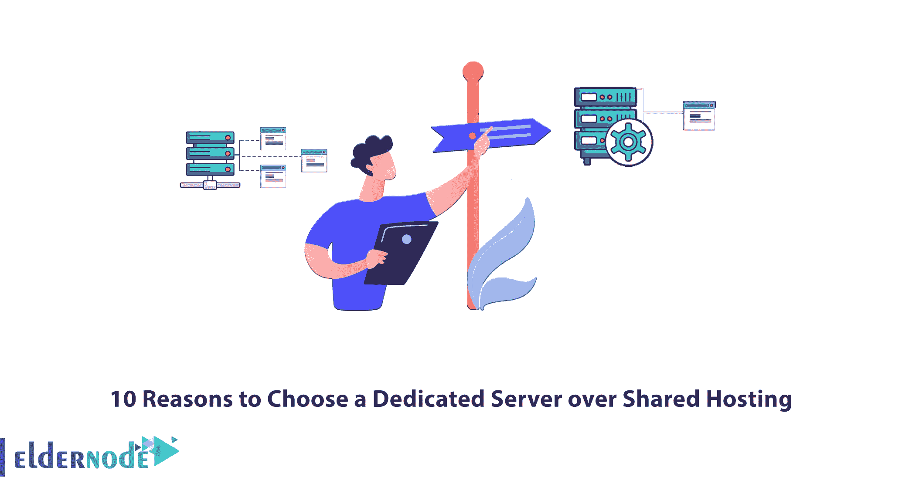

# 选择专用服务器而非共享主机的 10 大理由

> 原文：<https://blog.eldernode.com/10-reasons-to-choose-dedicated-server/>

随着网站的发展，知道何时将网站转移到强大的高级服务器上是很重要的。在这方面有很多选择，你可以把你的网站转移到不同的服务器上。要选择合适的服务器，你需要找到想要升级的理由。您可能会体验到流量的立即增加，或者预期将来站点流量会增加。专用服务器绝对是这方面的理想之选，因为它们具有强大的安全特性，并且对页面加载时间有潜在的积极影响。在本教程中，我们将向您介绍选择专用服务器而不是共享主机的 10 个理由。你可以访问 [Eldernode](https://eldernode.com/) 网站上的套装，购买一台 [**廉价专用服务器**](https://eldernode.com/dedicated-server/) 。

## **2022 年选择专用服务器的理由**

[专用服务器](https://eldernode.com/dedicated-server/)是一个虚拟主机选项，物理服务器专用于特定客户。事实上，客户端独占使用服务器的所有功能，完全控制服务器，并可以根据自己的需要优化服务器。它在数据中心 24 小时开启，并连接到万维网。由于专用服务器非常敏感，因此它们应该由专业的管理员来管理，以便服务器上的网站和文件在安全性和质量方面处于适当的水平。这台电脑让您可以更好地控制您的网站，其他网站不会影响您的网站。

在这篇来自[专用服务器培训](https://blog.eldernode.com/tag/dedicated-server/)系列的文章的续篇中，我们将解释选择专用服务器而不是共享主机的 10 个理由。

### **1-专用服务器比共享托管** 更安全

在共享主机中，服务器由几个用户共享，由于这个原因，他们比专用服务器更容易受到网络攻击。专用服务器运行几乎所有类型的脚本和软件，您可以安装任何安全软件来为您的服务器增加额外的可靠性。

在专用服务器中，您的网站只处理您的服务器，安全风险较小。它配备了配置的 DDoS 保护、IP 地址阻止和其他服务器级安全功能。

### **2——它是最昂贵的服务器之一**

由于[专用服务器](https://blog.eldernode.com/buy-dedicated-server-with-bitcoin/)完全专用于您的网站，所有维护费用由您负责。专用服务器的成本是共享主机的 15 倍。它有先进的选择，正因为如此，它的高价格是合理的。但是在共享主机中，服务器管理者管理服务器，网站所有者不参与管理。所以花费更少。

### **3-专用服务器比共享托管** 更快更可靠

一台服务器的性能取决于您的托管服务器中使用的技术，如 SSD 硬盘、收银软件、CDN 等。网站性能在吸引新访客和增加流量方面起着关键作用。高网站性能导致网站优化。

专用服务器更快、更可靠，并为你的网站提供更多的资源，如 CPU、RAM 等。它们提供了硬件的全部潜力，而共享主机服务器在同一硬件上托管多个客户端，并且仅提供其部分功能。

### **4 台专用服务器为您的主机需求提供高带宽**

带宽是指每单位时间的信息量，是一种网络度量，它显示了无线通信链路在给定时间段内通过网络连接传输数据的最大容量。专用服务器允许您选择想要的带宽，并随时升级/降级。共享主机上可供您使用的带宽是有限的，由所有用户共享。它的连接速度较慢。

### **5-专用服务器具有极高的可扩展性**

可伸缩性是系统或应用程序处理增加的用户流量的能力。这种管理应该以用户不会注意到系统中任何变化的方式进行。一些主机提供商提供有限的可伸缩性，但是在许多情况下，它们是不可伸缩的。专用服务器不会竞争服务器上的资源，并且具有很好的可伸缩性。

您可以通过向您的主机提供商发送请求来升级您的专用服务器硬件。如果您在特定时间段需要较少的流量，您甚至可以缩小规模。

### **6-专用服务器提供快速加载时间**

网站的速度被认为是 SEO 和用户满意度中非常重要的一个类别，这使得网站所有者开始重视这个问题。你可以用很多方法来降低网站的速度，但是很多方法需要编码和技术知识。专用服务器提供快速加载时间，即使你有繁忙的交通。共享主机限制了您可以使用的资源数量，从而降低了您网站的整体速度。

### **7-可以定制专用服务器**

您可以根据自己的意愿定制不同模式的专用服务器。专用服务器没有任何限制，可以根据您的需要以不同的方式使用。但是，如果您对共享主机服务器的后端进行任何更改，它将适用于所有用户。所以你不能定制共享主机服务器。

### **8-专用服务器允许你访问服务器的所有资源**

专用服务器没有共享的服务器资源和其他共享您的空间的应用程序，会阻塞服务器的 RAM 或 CPU。但是在共享托管服务器里，你会和其他用户共享资源，它不属于你。所以，你不会独占资源。

### **9-公司可以将专用服务器用于各种目的**

组织和公司可以将专用服务器用于各种目的，例如运行敏感软件、运行互联网网站、建立高流量网站、托管多个网站、实施专用防火墙以及托管私有云。大多数虚拟主机服务提供商在专用服务器上运行他们的产品或计划。托管需要大量资源的网站是专用服务器最常见的用途之一。

### **10-可以自行配置服务器的人最好选择**

专用服务器适合能单独管理服务器，有技术经验的人。使用专用的服务器，你可以完全控制每一个方面，你可以选择安装的软件，操作系统等。

但是如果你在服务器管理方面没有太多的技术技能，并且你想创建一个在线状态，那么共享服务器更适合你。在共享主机中，您将拥有有限的管理访问权限，并且无法配置软件。

## 结论

你可以从一个专门的服务器提供商那里租用一个专门的服务器来满足你的虚拟主机需求。在本文中，我们介绍并解释了选择专用服务器而不是共享主机的 10 个原因。我希望这篇教程对你有帮助。如果您有任何问题或建议，可以在评论区联系我们。