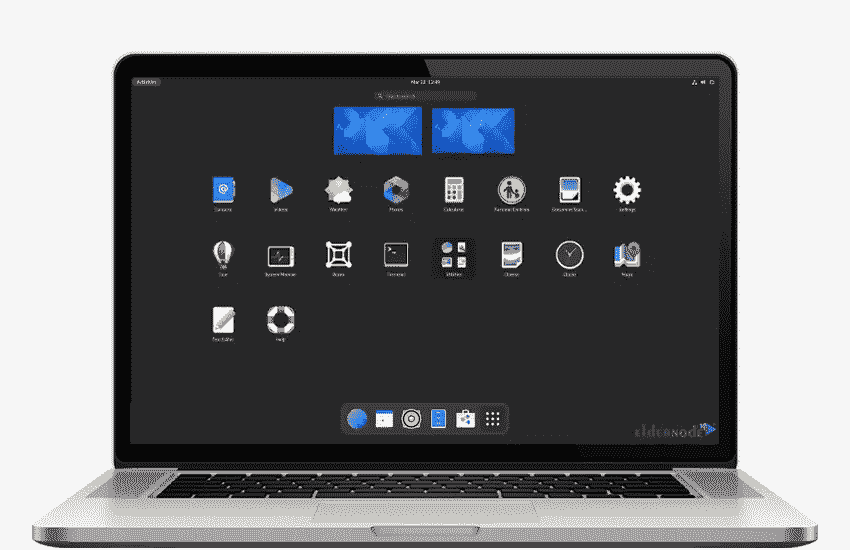

# 选择 Gnome 而非 KDE 的十大理由

> 原文：<https://blog.eldernode.com/10-reasons-to-choose-gnome-over-kde/>

与 Windows 和 macOS 不同，Linux 令人兴奋的一个方面是它有大量的桌面环境。此功能使用户能够根据自己的兴趣和任务选择合适的桌面环境。KDE 等离子和 Gnome 是两个最好的 Linux 桌面环境。这篇文章将解释选择 Gnome 而不是 KDE 的 10 大理由。如果你打算购买一台 Linux VPS 服务器，你可以在 [Eldernode](https://eldernode.com/) 网站上查看提供的软件包。

## **为什么选择 Gnome 而不是 KDE？**

Gnome 是一个为开源应用程序编写的桌面环境。它是专门为 [Linux](https://blog.eldernode.com/tag/linux/) 编写的，由 Gnome 项目开发。这个桌面环境是一个国际项目，旨在开发软件框架，也被认为是 GNU 项目的一部分。但是 KDE 代表 K 桌面环境，是基于 Linux 的操作系统的桌面环境。它提供了一个图形界面来选择自己定制的桌面环境。使用这种环境使您能够完全访问和控制桌面环境的所有部分。

### **1- GNOME 是自由软件**

Gnome 桌面环境是 100%自由软件。用户可以用 [Gnome](https://blog.eldernode.com/install-gnome-environment-on-debian-8/) 拥有最美的桌面体验，无需支付任何费用。它也允许用户改变他们的桌面环境，如果他们不喜欢 Gnome，而不会招致经济损失。

### **2- GNOME 有一个大型社区**

Gnome 有一个非常大且活跃的互动社区，可以帮助开发用于工作、教育和娱乐的高级软件。它为开发人员提供了构建现代项目所需的所有工具和资源。还有，这个社区帮助新用户毫不犹豫地适应平台。如果你对 GNOME 有疑问或问题，你可以直接使用他们的官方讨论社区。也可以参考一下最新的公告和开发进度消息。

### **3- GNOME 易于安装和配置**

安装和配置 Gnome 桌面环境比 KDE 等离子桌面环境更容易。只需打开终端，输入安装和配置命令。此外，它有一个最小的用户界面，没有额外的功能，易于使用。GNOME 的设计语言更接近你在手机和平板电脑上的体验。

### **4-侏儒快**

拥有一个在可用系统资源下高效、快速工作的桌面环境非常重要。如果你想进行多任务处理，又没有重型配置支持，这一点尤为重要。性能和速度取决于您正在做的事情和可用的系统资源。Gnome 比 KDE 更高效、更快，而且更加可定制。它也有一个现代和干净的外观。

### **5-侏儒轻巧**

Gnome 是轻量级的，快速的，并且易于定制。它还具有许多开箱即用的功能。你可以通过 Ubuntu 软件中心轻松安装其他软件。

### **6-侏儒更安全**

如果你正在寻找一个安全的操作系统，GNOME 是你最好的选择。GNOME 比 KDE 更安全。虽然两种桌面环境都提供了安全特性，GNOME 比 KDE 提供了更多的安全优势。

### **7- GNOME 有更好的搜索工具**

GNOME 有比 KDE 更好的搜索工具。这意味着在使用 GNOME 时，你会更快更容易地找到你需要的东西。GNOME 搜索工具是一个在你的系统中查找文件的工具。要执行基本搜索，您可以键入带或不带通配符的文件名。此外，您可以应用其他搜索选项。

### **8- GNOME 有一个好得多的文件管理器**

与 KDE 相比，GNOME 有一个更好的文件管理器。而且，它比 KDE 有更多的特色。Gnome 的文件管理器管理你的文件、文件夹和硬件，并允许你移动、创建、重命名、复制和删除它们。

### **9-侏儒有一个很棒的音乐播放器**

Rhythmbox 是一款免费的开源音乐播放器软件，适用于 Linux 和基于 Unix 的操作系统上的 GNOME 桌面，GNOME 将 Rhythmbox 作为其默认的音乐播放器。这个程序有许多功能，非常容易使用。如果你需要别的，像 Amarok 和 Banshee 这样的其他玩家都有。

### **10- GNOME 对 Linux 用户的支持更好**

GNOME 是基于红帽开发的 X Windows 系统的开源项目和系统。大多数桌面环境都使用这个系统。任何人都可以下载和修改。

## 结论

KDE 和 Gnome 都是 Linux 最流行的桌面环境。在这篇文章中，我们解释了选择 Gnome 而不是 KDE 桌面环境的十大理由。我希望这篇教程对你有用。如果您有任何问题或建议，可以在评论区联系我们。