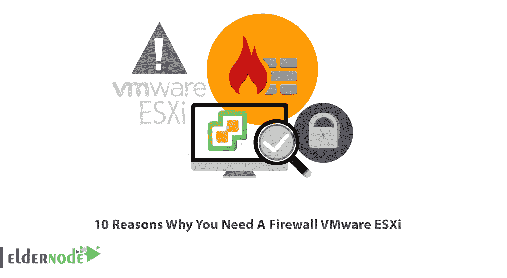

# 需要防火墙的 10 大理由 VMware ESXi - Eldernode

> 原文：<https://blog.eldernode.com/10-reasons-why-you-need-a-firewall-vmware-esxi/>

ESXi 是 VMware 虚拟机管理程序软件套件的最新版本，独立于操作系统，直接安装在硬件上。该软件中使用了裸机技术，它提供了管理硬件和系统资源的可能性。使用该软件，您可以创建虚拟机，还可以执行向虚拟机分配资源的过程。事实上，可以说 ESXi 控制和管理虚拟机之间的硬件资源。在本文中，我们打算向您介绍您需要 VMware ESXi 防火墙的 10 个原因。如果你想[购买即时 VPS](https://eldernode.com/vps/) 服务器，你可以访问 [Eldernode](https://eldernode.com/) 网站上提供的计划。

## **为什么需要防火墙 VMware ESXi？**

### **1。防范恶意软件攻击**

虚拟防火墙通常是软件定义的网络(SDN)的关键组件。防火墙 VMware ESXi 通常部署为私有云(如 ESXi 或公共云)中的虚拟设备，以监控和保护物理和虚拟网络中的流量，并防范任何恶意软件攻击。

### **2。**防止数据丢失

防火墙 VMware ESXi 确保通过网络连接传输的数据的安全性和完整性。这些防火墙定义了保护网络数据以及任何破坏或丢失网络数据的企图的过程和方法。

### **3。安全应用**

您的网络中存在符合 VMware ESXi 防火墙规则(作为标准)的自定义应用程序和软件，这使得能够根据防火墙策略确保应用程序的安全性。

### **4。保护虚拟机免受拒绝服务攻击**

如今，DDoS 攻击被用来获取数据、危害竞争对手的业务、破坏操作系统等等。通常，DDoS 攻击是由一个或多个特定的 IP 进行的，并且不容易检测到它们。但是您可以通过防火墙 VMware ESXi 轻松防止这些攻击的发生。

### **5。防止虚拟机欺骗**

如果您使用防火墙 VMware ESXi，将会阻止欺骗攻击。欺骗攻击实际上是未经授权的用户通过伪造信息作为授权用户进入网络。这些攻击降低了网络性能，干扰了网络安全。

### **6。检测和补救网络入侵**

防火墙 VMware ESXi 在拥有大量服务器和计算机的大型组织中发挥着至关重要的作用。因为有必要限制用户对所有 web 内容的访问，以防止对系统的渗透和对整个网络的破坏，并且只有必要和必需的站点才应该是可访问的。

### **7。保持安全态势**

随着攻击数量的不断增加，网络安全团队需要处理许多复杂问题，包括漏洞管理、安全控制、攻击检测、事件响应、恢复、合规性、报告等。因此，使用防火墙 VMware ESXi 对维护安全态势有很大影响。

### **8。保证业务连续性**

大多数公司会在没有互联网的情况下挣扎一天。虽然互联网极大地改善了商业交流和生产力，但我们不应该忽视这种对技术的过度依赖。充分的安全措施对所有运营公司都至关重要，无论其规模和行业如何。现代公司必须使用的确保业务连续性的最重要的安全方法之一是使用防火墙 VMware ESXi。

### **9。降低成本**

对于个人使用或降低成本，使用防火墙 VMware ESXi 更经济、更合适。但当涉及到大型组织或安全性和更高的速度时，更好、更可靠的硬件型号肯定会满足您的系统需求。

### **10。减少硬件资源的使用**

您可以使用防火墙 VMware ESXi 来最大限度地减少运行虚拟机管理程序所需的硬件资源，并更有效地抵御各种攻击。

## 结论

ESXi 主要在组织中使用，管理者可以通过配置文件上传必要的信息。因此，在本文中，我们试图向您介绍您需要 VMware ESXi 防火墙的 10 个原因。如果你有任何问题，你可以在评论区和我们分享。