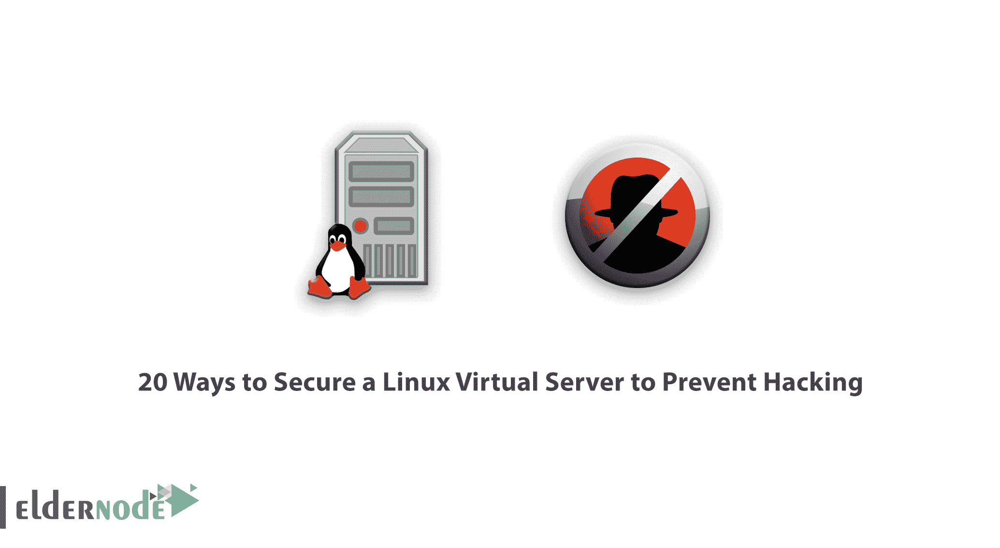

# 20 种保护 Linux 虚拟服务器防止黑客入侵的方法

> 原文：<https://blog.eldernode.com/20-ways-to-secure-a-linux-virtual-server-to-prevent-hacking/>

Linux 虚拟服务器有很多优点。事实上， [Linux VPS](https://eldernode.com/linux-vps/) 比 Windows 等其他操作系统更安全，因为它安装了 LSM (Linux 的安全模型)。但是这个系统是不够的，不能完全保护你的虚拟服务器。在这篇文章中，我们将教你 20 种方法来保护 Linux 虚拟服务器，防止黑客入侵。

## 20 种保护 Linux 虚拟服务器防止黑客入侵的方法

默认情况下，Linux 比它的竞争对手更安全，但是仍然存在需要解决的漏洞。我们今天教你的使 Linux 更加安全的技术不需要太多的专业知识来设置，你可以很容易地使用这些方法。

### 1。禁用根用户的登录

想要一个安全的 VPS？永远不要以 root 用户的身份登录。

默认情况下，每个 Linux 虚拟服务器都有一个“root”作为主要用户名，因此黑客试图通过他们执行的[暴力攻击](https://blog.eldernode.com/ftp-configuration-to-prevent-brute-force-attacks-on-windows-server-2012/)来获取和访问密码。禁用从“root”用户名登录为您的服务器增加了另一个安全级别，并防止黑客进入 root 用户。

您需要创建另一个用户名，并使用“sudo”命令来执行根级别的命令，而不是以根用户身份登录。Sudo 是一种特殊的访问权限，可以授予经过身份验证的用户，这样他们就可以执行管理命令，并且不再需要 root 访问权限。

在禁用 root 用户之前，请确保您指定了想要使用的用户权限。当您准备好这样做时，在服务器控制台中，打开 nano 或 vi 中的命令并找到" **PermitRootLogin** "参数。

默认情况下，其值等于“是”。将其更改为“否”并保存更改。

### 2。更改 SSH 端口

黑客用来连接 SSH 服务器的第一个端口是端口 22。如果您更改了这个端口，就在很大程度上阻止了他们对 SSH 的访问。为此，您需要打开它，在此部分进行适当的设置。

当然，在这样做之前，要确保您选择的端口没有被服务器上的其他服务使用。

### 3。保持服务器软件最新

保持服务器软件最新并不困难。您可以轻松地使用 rpm / yum [1]或 apt-get (Ubuntu / Debian)软件包管理器来更新已安装软件、模块和元素的较新版本。

您甚至可以将操作系统配置为通过电子邮件发送 yum 软件包更新警报。这使得跟踪更改变得更加容易。如果你想自动执行任务，你可以设置 cronjob 来应用你这边的所有安全更新。

如果你使用像 **DirectAdmin** 或 **Cpanel** 这样的面板，你应该经常更新它们，尽管这些面板中的大多数都有自动更新功能，没什么好担心的。

您应该总是尽早安装安全补丁，因为侵入服务器的风险会随着时间的推移而增加。

### 4。禁用未使用的网络端口

您不使用的开放网络端口是黑客的好目标，关闭它们可以保护您免受攻击。

使用“ **netstat** ”命令显示所有打开的网络端口。

使用“ **iptables** ”设置关闭所有端口，或者使用“ **chkconfig** 命令禁用不需要的服务。如果您使用的是 CSF 之类的防火墙，您可以自动化 iptables 规则。

### 5。删除不需要的模块/包

您的服务器上可能有并非所有 Linux 服务器都需要的服务。请注意，您从服务器上移除的每个服务都会减轻您的一些安全顾虑，因此请确保您在服务器上使用了您真正需要的服务。

以后一定要避免安装不必要的软件，以免出现安全问题。

### 6。禁用 IPv6

IPv6 比 IPv4 有很多优势，但是你用的可能性很小，因为用的人很少，但是黑客用 IPv6 的很多。如果您不使用 IPv6，请将其禁用。

他们通常通过 IPv6 发送恶意流量，发布该协议会给他们带来风险。要解决此问题，请单击 edit /etc/sysconfig/ network 并更新设置，使其显示 NETWORKING_ IPV6 = no 和 IPV6INIT = no。

### 7。使用 GnuPG 加密

黑客通常在数据通过网络传输时攻击数据。这就是为什么必须使用密码、密钥和证书对传输到服务器的数据进行加密。GnuPG 是一种流行的工具，一种用于加密通信的基于密钥的认证系统。这个系统使用一个“**公钥**，这个公钥只能被一个“私钥”解密，而这个“私钥”只能在接收方获得。

### 8。设置强密码

弱密码总是对安全性的一大威胁。不要让您的服务器用户使用容易被发现的弱密码。

选择密码时，最好使用大小写字母、数字和符号。您还可以指定一个特定的时间段，以便用户在该时间后必须更改密码。

还可以使用“faillog”命令来设置登录失败限制，并在尝试保护系统免受暴力攻击失败后关闭用户帐户。

### 9。防火墙配置

如果你真的想要一个安全的 VPS，你需要一个防火墙。

**NetFilter** 是一款与 Linux 内核集成的防火墙，您可以配置它来过滤掉不想要的流量。使用 NetFilter 和 iptables，您可以抵御拒绝服务(DDos)攻击。

防火墙调整不够，确保配置正确。

**TCPWrapper** 是另一个有用的应用，基于主机的访问控制列表系统，用于过滤各种应用的网络访问。它还提供主机名验证、标准化日志记录和间谍保护，所有这些都有助于提高您的安全性。

其他流行的防火墙包括 CSF 和 APF，它们都有 cPanel 和 Plesk 等流行面板的插件。

### 10。使用磁盘分区

为了提高安全性，最好对磁盘进行分区，将操作系统文件与用户文件、tmp 文件和第三方程序分开。您可以在操作系统分区上禁用 SUID / SGID (nosuid)访问并运行二进制文件(noexec)。

### 11。开机只是读取

在 Linux 服务器上，所有内核文件都存储在“ **/boot** ”目录中。

但是这个目录的默认访问级别是“读写”。要防止对服务器性能至关重要的引导文件进行未经授权的更改，请将访问级别更改为“只读”。

为此，只需编辑/ etc / fstab 文件，并在底部添加默认标签= / boot / boot ext2，ro 1 2。如果将来需要更改内核，可以很容易地将其重置为“读写”模式。然后，您可以进行更改，并在完成后将其返回到“只读”模式。

### 12。使用 SFTP 而不是 FTP

即使使用加密的“TLS 上的 FTP”(FTPS)连接，FTP 文件传输协议也不再安全。

当计算机程序干预和监控网络流量时，FTPS 和 FTP 都容易受到攻击。FTP 是干净的，FTPS 文件传输是干净的，这意味着只有证书是加密的。

SFTP，即“通过 SSH 的 FTP”(也称为“安全 FTP”)，完全加密所有数据，使您的服务器安全。

### 13。使用防火墙

您的防火墙是一个网关，它允许和阻止对服务器的访问，是您抵御黑客的第一道防线。安装和配置防火墙是您在安装和保护 VPS 或裸机服务器时需要做的第一件事。

### 14。安装杀毒软件

防火墙或防火墙的主要工作是防止对服务器信息的访问，是您抵御黑客的第一道防线，但没有防火墙是完全安全的，许多恶意软件可以绕过它，因此需要其他安全措施。。

许多服务器管理员不在他们的服务器上安装防病毒软件，因为他们发现它有局限性。他们不这样做，因为安装这些抗病毒药物需要一些专业知识和费用。因为这些人不想为他们服务器的安全性付费。

但是如果你没有足够的钱购买付费杀毒软件，你可以使用免费版本，比如 ClamAV T1 和 T2 Maldet T3，它们可以扫描你的服务器并显示可疑文件。

### 15。CMS 自动更新

黑客总是试图找到安全漏洞。特别是在内容管理系统方面，最著名的是 Joomla、Drupal 和 WordPress，大多数网站都使用这些内容管理系统。这些 CMS 的大多数开发者发布了很多安全更新。在这些内容管理系统中，WordPress 发布的更新最多。这个内容管理系统还允许你随着新版本的发布而自动更新，如果你使用的是旧版本的 WordPress，现在就更新它以防止黑客的渗透。

### 16。激活 WHM 的 cPHulk

除了防火墙，cPanel 还有一个“cPHulk”蛮力安全系统。

防火墙并非没有缺陷，有时会出错，黑客也能闯入，这往往是由于防火墙设置不正确。同时，cPHulk 充当二级防火墙，防止对服务器的暴力攻击。

我们知道，cPHulk 首先阻止了登录功能，防火墙后来阻止了它，并阻止了整个 IP。要启用它，你需要去 WHM 安全中心并选择 cPHulk 蛮力保护。

### 17。防止匿名 FTP 上传

cPanel 和 Plesk 都默认禁用匿名 FTP 上传，但其他服务默认可以启用。

允许匿名用户通过 FTP 上传是一个主要的安全风险。因为它允许任何人上传任何他们想上传的东西到你的网络服务器上。你可以想象，这是完全不推荐的，这意味着你把你的钥匙给了一个小偷。要禁用来宾上传，请编辑 FTP 服务器配置设置。

### 18。安装一个 rootkit 扫描器

最危险的恶意软件之一是 rootkit。

Rootkit 存在于操作系统级别，低于其他正常的安全软件，并允许未被发现的访问服务器。幸运的是，您可以使用开源工具 chrootkit 来确定您的服务器是否被感染。但是 rootkits 并不总是容易移除，移除它们的最好方法是重新安装操作系统。

### 19。定期备份

有许多人忘记定期备份，并在出现问题时后悔，因为他们没有数据的副本。不管你有多小心，不管你的服务器有多安全，总有出错和麻烦的可能。

不要冒危险的风险，例如不要备份，也不要过于依赖主机来备份。备份你自己是最好的方法，即使你的主机提供商每天都备份你。将副本保存到不同的位置，并考虑使用备份空间或 Google Drive。

### 20。使用强密码

糟糕的密码对您的 Linux 服务器是一个安全威胁。当然，这也适用于 Windows 服务器！尽量选择复杂的密码，由大小写字母、不同数字和符号组成的密码就很好了。尽可能选择长而复杂的密码。

当然，CPanel 和 Plesk 都可以应用强密码策略，并定期使密码过期。

## 结论

全世界有数百万黑客在研究你的 VPS 中最小的漏洞。你需要保护你的 VPS 免受这些威胁，因为黑客迟早会找上你。企业网站和在线商店是全世界黑客的最佳目标。虽然大多数公司都有基本的安全标准，但它们通常很容易被攻破。本文试图解释保护 Linux VPS 服务器和防止黑客攻击的大多数方法。