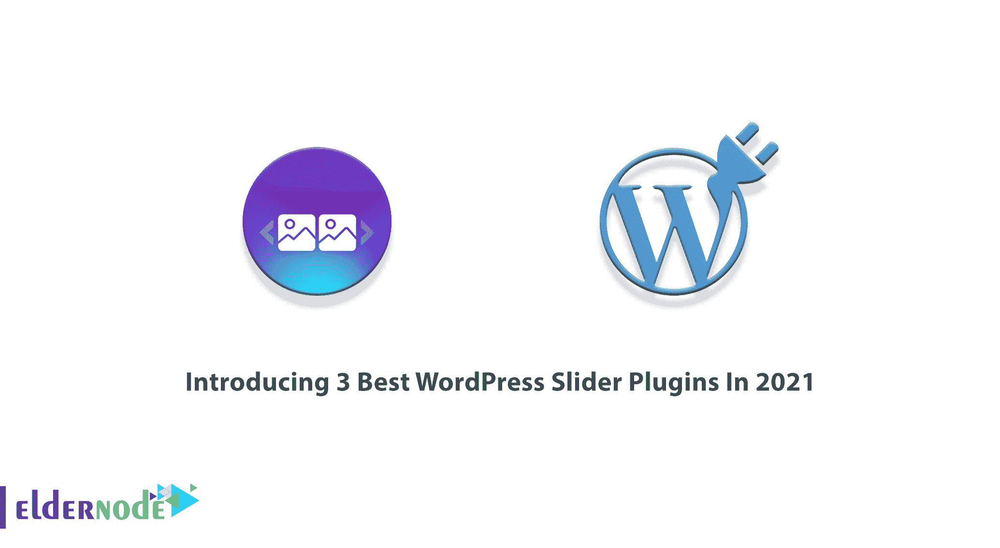
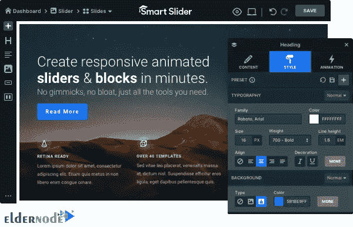
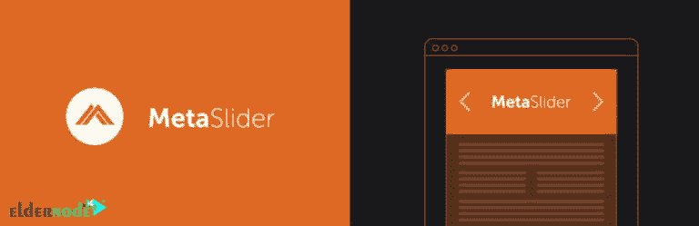

# 2021 年推出 3 款最佳 WordPress 滑块插件

> 原文：<https://blog.eldernode.com/3-best-wordpress-slider-plugins/>

如果你对网页设计感兴趣，Slider 应该介绍给你。滑块允许您展示图像、视频和其他内容。要创建你自己的滑块并把它们添加到你的主页或登陆页面，你需要使用 WordPress 滑块插件。本教程是**介绍 2021 年 3 个最好的 WordPress 滑块插件**。由于 WordPress 滑块运行缓慢，你需要购买一个好的 [VPS](https://eldernode.com/vps/) 来防止增加你的页面加载时间。联系 [Eldernode](https://eldernode.com/) 支持团队，订购您认为合适的托管方案。

## **介绍 WordPress 滑块插件**

这篇文章将指导你找到最好的 WordPress 滑块插件来实现性能和质量。由于市面上有几十个 WordPress 滑块插件，你需要能够**比较**选择最合适的一个。所以，首先加入我们来了解滑块插件。

得益于大量的插件， [WordPress](https://blog.eldernode.com/tag/wordpress/) 已经成为一个强大的平台。WordPress 滑块插件帮助你创建滑块，**改善你网站的访客体验。滑块插件允许你添加视频，使用图层来组合图像、文本和按钮，甚至包括元素和动画的混合。你将能够在各种网站上使用滑块。但是商业网站或者专业的投资组合网站大多都在使用滑块。**

作为一名*设计师* ，你会喜欢滑块，它们很灵活，可以帮助你使用滑块插件的视觉元素讲述一个引人入胜的故事。而**作为*网站老板*** ，可以将**亮点**快速展现给用户。Slider 将所有重要内容以视觉上吸引人的交互式幻灯片形式放在页面顶部的主要内容之前。

使用这种插件并不难，但是要在你的网站上找到最合适的一个却很有挑战性。滑块插件是不一样的，它们中的大多数可能会**减慢**你的网站，因为它们加载了太多的脚本。那么，解决办法是什么呢？回顾下一节，了解什么是**选择一个理想的滑块插件**的重要参数。

### **如何选择最好的 WordPress 滑块插件**

当你决定使用一个滑块插件时，你需要知道如何比较顶级的插件，并根据它们的**速度**、**易用性**和**整体**特性找出哪个更好。

正如所料，**滑块速度**在比较中名列前茅。滑块会降低网站速度，影响用户体验和搜索引擎优化。

另一方面，WordPress slider 插件的用户界面使用了太多的技术语言。所以，建议你选择一个初学者友好的插件来简化滑块创建。

乍一看，您认为滑块可以创建简单的图像幻灯片。但是一些滑块插件包含更多的功能。它们可以是完全响应的滑块，在所有设备和屏幕尺寸上看起来都一样漂亮。此外，特色滑块插件支持视频幻灯片，HTML 5 视频，特色内容幻灯片，主题，动画和过渡。所以，最好还是用插件，界面简单且**易用的**。

根据以上解释，我们对滑块插件进行了类比，从**响应度**、**易用性**和**速度**的角度进行了检验。请继续关注我们，以下是这项研究的结果，**前三名 WordPress 滑块插件**。

## **2021 年 3 款最佳 WordPress 滑块插件**

让我们来看看排名前三的 WordPress 滑块插件:

### **1-自言自语滑块插件**

独白是最好的响应 WordPress 滑块插件，帮助你创建漂亮的响应滑块。它也被认为是一个简单而强大的插件。使用独白的绝妙之处在于，你永远不需要雇佣开发人员来创建一个 WordPress 滑块。自言自语为用户提供了愉快的体验，因为幻灯片在所有设备上都看起来很棒。速度很重要！独白是最快最好的轻量级插件。它对网络和服务器性能进行了高度优化，并将改善 T2 的搜索引擎优化。

如果你愿意，你可以从 WordPress 插件库中 **[下载独白](https://downloads.wordpress.org/plugin/soliloquy-lite.zip)** 插件。

**自言自语滑块插件功能**

这个插件有超过 100 个可配置的钩子和过滤器。让我们回顾一下这个强大且用户友好的 WordPress 滑块插件的主要特性和插件:

1-拖放生成器

2-响应迅速的移动友好型

3 滑块主题

4-woo 商务

5-特色内容

6 个灯箱

7-简单且用户友好的界面

8-图像缩略图

还有更多。

### **2-智能滑块 3 滑块插件**

第二个选择的滑块插件是一个强大的、**易用的**和**直观的** WordPress 插件。智能滑块 3 是完全响应的**， **SEO 优化的**，可以和任何 WordPress 主题一起工作。你将体验到一个快速有效的幻灯片创建及其漂亮的界面。好消息是，你不需要任何技术技能和代码来创建一个幻灯片，因为你只能选择一个漂亮的(或空白的)模板，并创建一个图像层，视频和帖子滑块。智能滑块 3 允许您在发布前预览内容。它还提供了一个触摸友好的设计和多个风格和位置的滑块控件。**

**如果你愿意，你可以从 WordPress 插件库中 [**下载** **智能滑块 3**](https://downloads.wordpress.org/plugin/smart-slider-3.3.4.1.17.zip) 插件。**

****

****智能滑块 3 功能****

**这个插件使用不同的用户界面，在初学者中很受欢迎。以下是智能滑块 3 的主要功能:**

**单张幻灯片库**

**2-与 WordPress 完全集成**

**3 模板滑块**

**4 张幻灯片背景**

**5-隐藏特定设备上的层**

**6 张幻灯片切换动画:水平、垂直、淡入淡出**

**还有更多。**

### ****3- MetaSlider 滑块插件****

**对于第三个也是最后一个演示，选择了一个广泛使用和流行的插件。MetaSlider 帮助你创建一个**强大的**、 **SEO 优化的**滑块、幻灯片、旋转木马或图库。使用 MetaSlider 允许您以一种更轻量级的方式构建响应性更强、支持触摸的滑块。网站所有者、开发者和主题开发者发现这个强大的插件非常有用。虽然 MetaSlider 提供了选择不同滑块脚本和滑块主题和样式的选项，但初学者可以使用 shortcode、Gutenberg block、widget 或 template 标记在站点上的任何地方简单地插入滑块。**

**如果你愿意，你可以从 WordPress 插件库中 [**下载 MetaSlider**](https://downloads.wordpress.org/plugin/ml-slider.3.20.3.zip) 插件。**

****

****MetaSlider 特性****

**这个插件广受好评和欢迎。看看它的主要特性列表:**

**1- 4 滑块设计:Flexslider、响应式滑块、Nivo 滑块和硬币滑块**

**2-动态幻灯片**

**3-专为台式机和移动设备打造**

**4-智能图像裁剪**

**5-缩略图导航**

**6-实时主题编辑器**

**7-预定滑块**

**还有更多。**

## **结论**

**在这篇文章中，向你介绍了 WordPress 滑块插件，你已经熟悉了 3 个最好的滑块插件。毫无疑问，在他们的 pro 版本中，你会发现更多有趣的功能和能力。如果您正在使用其中任何一款，请在[社区](https://community.eldernode.com/)上与您的朋友分享您的体验。**