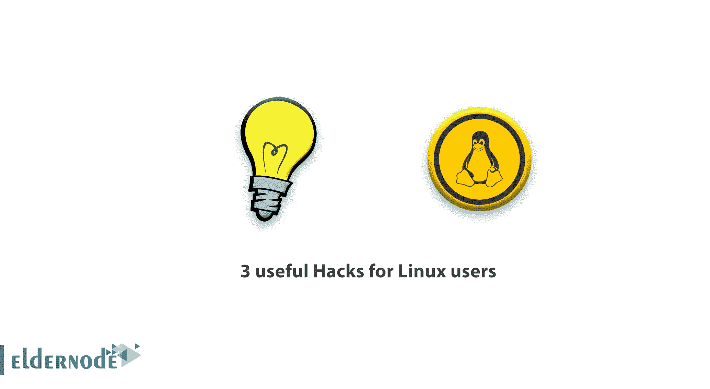

# 3 个对 Linux 用户有用的技巧——Linux 有用的命令

> 原文：<https://blog.eldernode.com/3-useful-hacks-linux/>



一个 Linux 系统管理员需要知道一些 Linux 技巧。在这篇文章中，你将学习到对 Linux 用户有用的 3 个技巧。当然，你证实了 Linux 的世界充满了如此多有趣的东西，你越深入，我们发现的东西就越多。为了给你带来让你与众不同的小窍门和小技巧，我们想出了三个小窍门。

## 对 Linux 用户有用的三招

简短但重要。加入我们来学习这 3 个对 Linux 用户有用的技巧。

### 如何在没有 Cron 的情况下调度 Linux 作业

先来了解一下这个标题基本是什么意思？在 Linux 中调度作业/命令是 cron 的缩写。每当你需要安排一项工作时，你就打电话给 cron，但是你知道你可以在没有玉米的情况下安排一项工作吗？你可以按照下面的建议去做。

每隔 **5 秒**运行一次命令(比如 **date** ，并将输出写入一个文件(比如 **date.txt** )。您需要直接在命令提示符下运行下面的[一行脚本](https://en.wikipedia.org/wiki/One-liner_program)。

```
while true; do date >> date.txt ; sleep 5 ; done &
```

为了解释得更详细，请看一下上面一行脚本的结构:

1.  **while true**–要求脚本运行当条件为真时，它充当一个循环，使命令反复运行或循环执行。
2.  **做**——做下面的事情，即。，执行位于 do 语句前面的一个或一组命令。
3.  **date>>date.txt**–这里 date 命令的输出被写入一个文件 date . txt。另外，请注意，我们使用了 **> >** 而不是 **>** 。
4.  **> >** **确保** 文件(date.txt)不会在每次脚本执行时被覆盖。它只是追加更改。而 **>** 则反复覆盖文件。
5.  **sleep 5**–它要求 shell 在再次执行之前保持 5 秒的时间差。请注意，这里的时间总是以秒为单位。比方说如果你想每 6 分钟执行一次命令，你应该使用( **6*60** ) 360，在连续睡眠中。
6.  **完成**–标志着 while 循环的结束。
7.  **&**——把整个流程循环到后台。

同样，您可以用同样的方式执行任何脚本。下面是在某个时间间隔(比如说 **100 秒**)后调用脚本的命令，脚本的名称是 **script_name.sh** 。

**请记住**上面的脚本应该在要调用的脚本所在的目录下运行，否则需要提供一个完整的路径(/home/$ USER/…/script _ name . sh)。以上述时间间隔调用脚本的语法是:

```
while true; do /bin/sh script_name.sh ; sleep 100 ; done & 
```

根据您最近在本指南中的研究，您可以猜到上面的一行程序不是 Cron 的替代程序，因为 Cron 实用程序支持大量选项，并且非常灵活和可定制。然而，如果我们想要运行某些测试用例或 I/O 基准，那么上面的 singe 命令就可以达到目的。

[用 **比特币**](https://eldernode.com/bitcoin-vps/) 购买虚拟机

### 2-如何在不使用‘Clear’命令的情况下清除终端

其次，要回答我们做什么来清除屏幕的问题，你可能会说大家都知道这是' **clear** 命令。但是请考虑一下，如果我们养成使用组合键' **ctrl+l** '来清空终端的习惯，我们会节省很多时间。

组合键' **Ctrl+l** '与' **clear** 命令效果相同。所以从下次开始使用 **ctrl+l** 来清除你的 Linux 命令行界面。

**总之、** 由于 **ctrl+l** 是组合键，所以不能在脚本内部使用。如果你需要在一个 shell 脚本中清除屏幕，调用命令“clear”，对于我现在能想到的所有其他情况，ctrl+l 已经足够了。

### 3-运行一个命令，自动回到当前工作目录。

最后，要学习一个没多少人知道的惊人技巧，请遵循本教程的最后一步。

您可以运行一个命令，不管它返回到当前目录。你需要做的就是运行括号中的命令，即在(和)之间。

让我们看看这个例子，

```
[[email protected]](/cdn-cgi/l/email-protection):~$ (cd /home/avi/Downloads/) 
```

(样本)输出

```
[[email protected]](/cdn-cgi/l/email-protection):~ 
```

首先，它 **cd** 到目录**下载**，然后再一次返回到主目录。如果您认为由于某种原因命令没有执行，它不会抛出错误，因为提示符没有变化。让我们再做一点调整。

```
[[email protected]](/cdn-cgi/l/email-protection):~$ (cd /home/avi/Downloads/ && ls -l) 
```

(样本)输出

```
-rw-r-----  1 avi  avi     54272 May  3 18:37 text1.txt  -rw-r-----  1 avi  avi     54272 May  3 18:37 text2.txt  -rw-r-----  1 avi  avi     54272 May  3 18:37 text3.txt  [[email protected]](/cdn-cgi/l/email-protection):~$ 
```

所以在上面的命令中，它首先将当前目录改为 **Downloads。然后在返回当前目录之前列出该目录的内容。此外，它还证明该命令执行成功。您可以运行括号中的任何命令，并顺利返回到当前的工作目录。**

**好样的** ！你成功地学习了更多的 [Linux 命令](https://eldernode.com/tag/linux-commands-tutorial/) 并保存了更多的 [Linux 技巧](https://eldernode.com/tag/linux-tricks/) 以便更好地工作。

亲爱的用户，我们希望这篇教程《Linux 用户的 3 个有用的技巧》能对你有所帮助，要问任何问题或回顾我们的用户关于这篇文章的谈话，请访问 [提问页面](https://eldernode.com/ask) 。也为了提高自己的见识，准备了这么多有用的教程给 [Eldernode 培训](https://eldernode.com/blog/) 。

**不要错过一些相关文章:**

**[Linux A 到 Z 命令概述及示例](https://eldernode.com/linux-commands-with-examples/)**