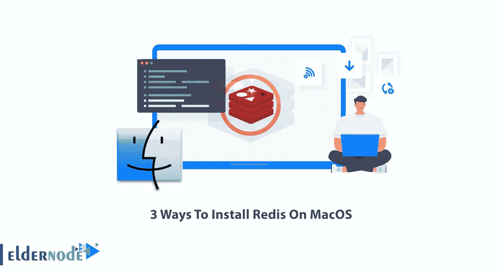
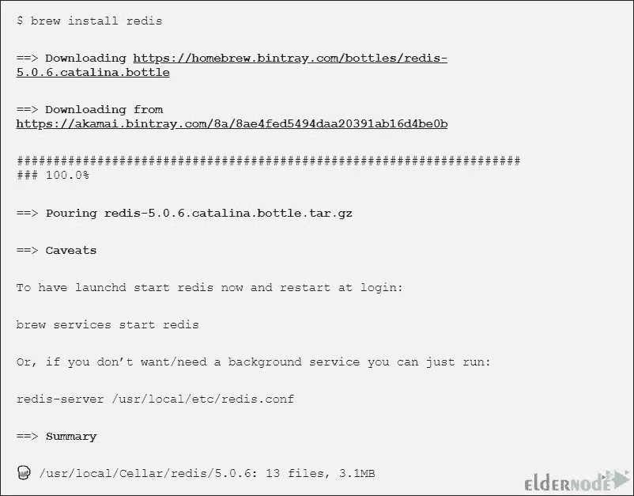
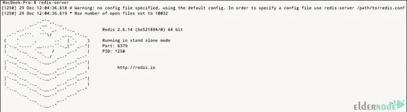

# 3 种方式在 MacOS 上安装 Redis

> 原文：<https://blog.eldernode.com/3-ways-to-install-redis-on-macos/>



运行在服务器端的应用程序有更多的联系人。这些程序的机制应该能够在最短的时间内响应服务器端的大量请求。所以，最好的解决方案是使用 NoSQL 数据库。Redis 是最流行和最有效的数据库服务器之一。本文将教你 3 种在 MacOS 上安装 Redis 的方法。如果你打算购买自己的 [VPS](https://eldernode.com/vps/) 服务器，你可以查看 [Eldernode](https://eldernode.com/) 网站上提供的软件包。

[Redis](https://blog.eldernode.com/configure-redis-on-linux-ubuntu-20-04/) 代表远程字典服务器，是一个开源的、内存中的、键值数据存储。它被放置在 RAM 中，信息被临时存储在其中。开发人员将 Redis 用作数据库、缓存、流引擎和消息代理。该数据存储提供亚毫秒级响应时间，每秒钟可处理数百万个实时应用请求，应用领域包括游戏、广告技术、金融服务、医疗保健和物联网。

你可以用两种方法在 MacOS 上安装 Redis:用自制软件安装 Redis 和不用自制软件安装 Redis。

### **在 MacOS 上使用自制软件安装 Redis**

如果你还没有安装家酿软件，请按照下面的步骤操作。

打开您的终端，使用下面的命令安装 Xcode :

```
xcode-select --install
```

输入以下命令**下载家酿**安装脚本:

```
/bin/bash -c "$(curl -fsSL https://raw.githubusercontent.com/Homebrew/install/master/install.sh)"
```

一旦你的安装完成，你可以用自制软件**安装 Redis** 。为此，请运行以下命令:

```
brew install redis
```



### **在 MacOS 上安装不带自制软件的 Redis**

不使用家酿就可以在 mac 上安装 Redis。为此，首先创建一个文件夹，然后使用以下命令移动到新创建的文件夹:

```
mkdir redis
```

```
cd redis
```

现在**通过运行以下命令下载 Redis** 安装脚本:

```
curl -O http://download.redis.io/redis-stable.tar.gz
```

解压缩下载的文件，如下所示:

```
tar xzvf redis-stable.tar.gz
```

要转到解压缩后的文件夹，请输入以下命令:

```
cd redis-stable
```

最后，运行以下命令来完成安装过程:

```
make  make test  sudo make install
```

## **如何在 MacOS** 上开始重定向

根据安装方法的不同，有两种方法可以在 mac 操作系统上启动 Redis。

### **用自制软件启动 Redis**

如果您使用 Homebrew 在 MmacOS 上安装 Redis，您可以使用下面的命令启动它:

```
brew services start redis
```

以上命令将启动 Redis，并在您登录时重新启动它。

要检查 Redis 状态，请输入以下命令:

```
brew services info redis
```

您应该会看到以下输出:

```
redis (homebrew.mxcl.redis)  Running: ✔  Loaded: ✔  User: Marilyn  PID: 67975
```

### **无自制软件启动 Redis**

但是，如果您选择第二种方法来安装 Redis，请运行以下命令来启动它:

```
redis-server
```

应该会出现以下输出:



如果您想在系统引导时启动 Redis，以下命令可以帮助您:

```
ln -sfv /usr/local/opt/redis/*.plist ~/Library/LaunchAgents
```

## **3-连接 MacOS 上的 Redis**

在这一步中，首先，启动 Redis 服务器。您可以使用 launchctl 和 Redis 配置文件来实现这一点。

要使用 launchctl 启动 Redis 服务器，请运行以下命令:

```
launchctl load ~/Library/LaunchAgents/homebrew.mxcl.redis.plist
```

要使用配置文件启动 Redis，只需输入以下命令:

```
redis-server /usr/local/etc/redis.conf
```

***注意:*** 默认情况下，Redis 配置文件位置在**/usr/local/etc/Redis . conf**。

使用以下命令在 Redis 运行后对其进行测试:

```
redis-cli
```

《理想国》就要开张了。

就是这样！

## 结论

Redis 是一种放置在 RAM 中的数据结构，信息临时存储在其中。在本文中，我们用 3 种方法教你如何在 MacOS 上安装 Redis。我希望这篇教程对你有用，能帮助你在 macOS 上安装 Redis。如果你面临任何问题，你可以在评论区联系我们。