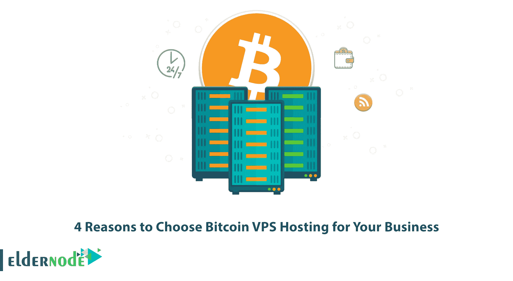
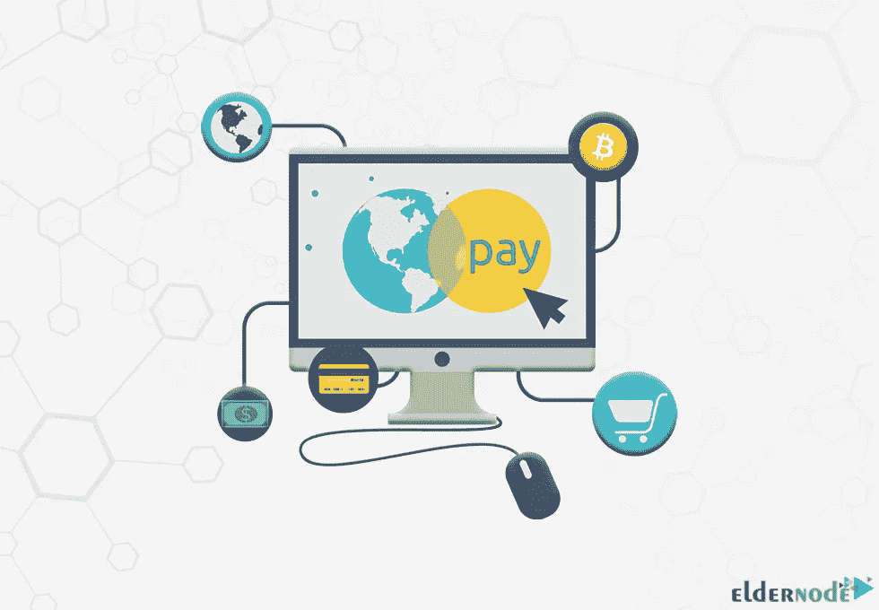
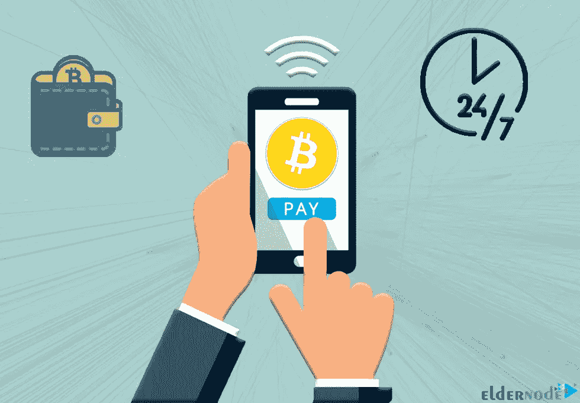

# 为您的企业选择比特币 VPS 托管的 4 个理由

> 原文：<https://blog.eldernode.com/4-reasons-to-choose-bitcoin-vps-hosting/>

你们很多人还不知道比特币 VPS 托管的概念。您可以使用它提供最简单、最安全的支付方式，这是一种安全的数字支付方式。以加密货币为核心的支付系统保护您的身份。本文将向您介绍为您的企业选择比特币 VPS 托管的 **4 个理由。如果你想购买自己的 [**比特币 VPS**](https://eldernode.com/bitcoin-vps/) 主机，可以查看 [Eldernode](https://eldernode.com/) 网站上提供的套餐。**

## **比特币 VPS 托管安全，保护隐私**

不使用比特币支付方式的 VPS 服务器提供商要求您提供信用卡、身份验证、物理地址、电子邮件验证等信息，然后您才能订购 VPS 托管服务器。如果使用 Bitocin VPS 托管，不需要提供这些信息，也不需要信任。使用比特币 VPS 托管会自动移除数据收集。Bitocin 是一个分散的不可变网络，您可以验证支付，而无需提供您的私人信息。

比特币地址曾经使用过，用户应该注意不要泄露自己的地址。每次收到新的付款时，您可以使用新的比特币地址来保护您的隐私。比特币 VPS 托管通过消除易受攻击的点，删除了一组信息，减少了与您个人的联系。

## **您可以使用比特币 VPS 主机** 跟踪您的交易历史

比特币区块链保留了网络上发生的每一笔交易的记录。交易信息包含交易数据、转移的货币金额、发送方和接收方的地址、时间戳。如果你有互联网连接，你可以在世界任何地方自由地获取交易信息。

你需要做的就是在任何一个比特币区块链浏览器中搜索你支付的钱包地址，并查看历史记录。在它的帮助下，支付管理变得非常简单和有条理。主机和用户将来查找支付信息将不会有问题。

### **你可以完全控制你的服务器**

虚拟专用服务器是一种虚拟机服务，它允许您完全控制您的服务器。这意味着你将完全有权安装任何软件和操作系统，托管你的文件和网站，运行应用程序等。您可以不受任何限制地使用它，访问您想要的服务，并在其上启动您想要的服务。

## **比特币 VPS 托管没有工作时间和周末，全天候可用**

许多支付网关，如银行，有工作时间，下班后和周末关闭。在这种情况下，你的存款将被冻结，直到下一个工作日开始。比特币 VPS 托管没有工作时间，一年 365 天，一周 7 天，一天 24 小时可用。如果您选择在一天或一年中的任何时间都可用的比特币 VPS 托管，将确保您永远不会错过付款。你可以使用多个比特币钱包来支付一台 VPS 服务器。

### **服务免费**

**比特币是一个去中心化的网络，没有交易费用。这意味着使用比特币虚拟主机不需要付费。你可以免费加入比特币交易所，获得一个比特币钱包。你应该把你的钱包和你的银行账户连接起来，然后购买一枚比特币。你只需要在购买比特币时付款，其余的过程不需要任何费用。**

## ****比特币可兑换，使用方便****

**比特币在数字领域有点对点的价值交换，可以用它来交换你想要的任何东西。你可以不通过银行这样的中介来做到这一点。如果你使用[以太坊](https://blog.eldernode.com/introducing-ethereum-and-get-a-vps-with-it/)、美元或任何其他数字资产，你能够很容易地将它们兑换成比特币。你应该有一个加密货币钱包才能使用比特币。比特币被接受为支付网关，钱包里有私钥。**

### ****无需成为技术大师****

**使用比特币 VPS 主机，你不需要成为技术大师。即使每个人都不懂技术，每个人都可以使用它。你所要做的就是选择你的比特币钱包，并从交易所网站获取，然后选择比特币支付方式购买 VPS 主机。**

## **结论**

**比特币 VPS 托管保护你的身份。比特币是一种多功能货币，你可以在几分钟内轻松转账。在这篇文章中，我们解释了你应该知道的为你的企业选择比特币 VPS 托管的 4 个原因。我希望这篇文章对你有用，它给了你需要的信息。如果你有任何疑问或问题，可以在评论区联系我们。**