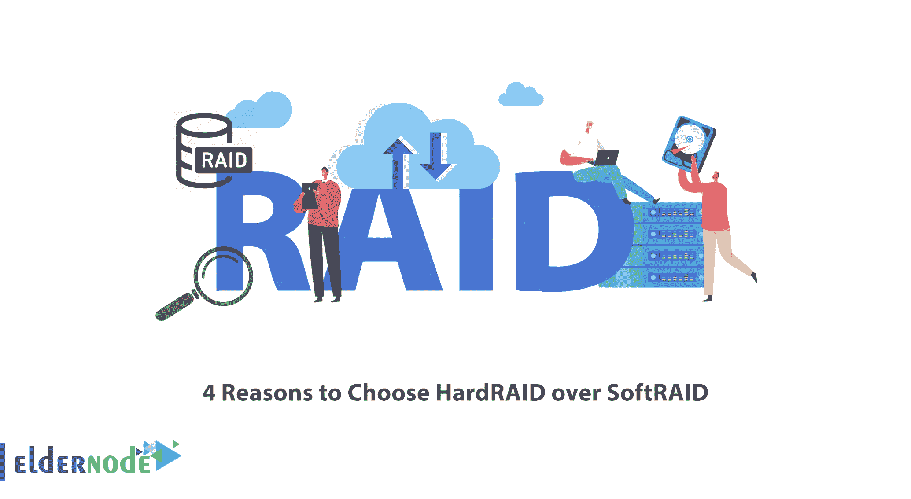
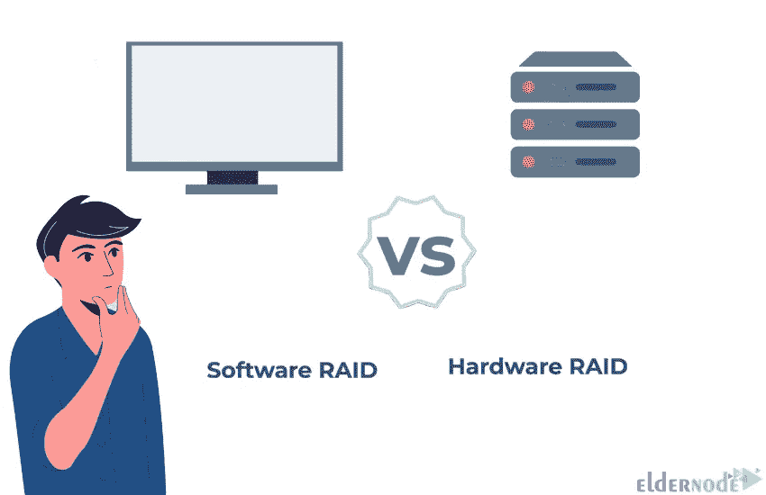

# 选择 HardRaid 而非 SoftRaid 的 4 个理由

> 原文：<https://blog.eldernode.com/4-reasons-to-choose-hardraid-over-softraid/>

RAID 代表独立磁盘冗余阵列，是一种数据存储虚拟化技术。事实上，它是一种在多个硬盘上存储数据的方法，目的是保护数据免受硬盘故障的影响。您可以通过软件和硬件执行 RAID。本文将解释选择 HardRaid 而不是 SoftRaid 的 4 个原因。如果你打算购买一台[专用服务器](https://eldernode.com/dedicated-server/)服务器，你可以查看 [Eldernode](https://eldernode.com/) 网站上提供的套装。

## **为什么选择 HardRaid 而不是 SoftRaid？**

SoftRAID 是一种跨多个硬盘驱动器提供数据冗余的技术。它几乎可以在任何操作系统上工作，并且不需要任何额外的硬件。这项技术通过部署在操作系统上的软件来执行。但是 HardRAID 是一种在单独的 RAID 卡或主板上进行处理的方法和形式。它使用一个[专用服务器](https://blog.eldernode.com/10-reasons-to-choose-dedicated-server/) RAID 控制器来管理 RAID 配置。RAID 控制器独立于操作系统管理和执行所有与 RAID 相关的任务。

### **1- HardRAID 比 SoftRAID 快**

硬件 RAID 有一个专用的 RAID 系统，用于独立于操作系统的 RAID 管理。因此，它比软件 RAID 速度更快，性能更高。附加 RAID 控制器接管 RAID 阵列的管理，是处理能力有限的旧设备的理想选择。正因如此，这些突袭对系统 CPU 的压力较小。

### **2-更换故障磁盘** 很容易

如果硬盘驱动器在 HardRAID 中出现故障，您可以轻松地移除损坏的驱动器并更换新的驱动器。但是在 SoftRAID 中这是非常困难和复杂的，你必须首先停止故障驱动器，然后插入新的磁盘。它允许您承受一个或多个驱动器的故障而不丢失数据，并且在许多情况下不会导致任何故障。

### **3- HardRAID 兼容不同操作系统**

硬件 RAID 与不同的操作系统兼容，并提供比软件 RAID 更好的跨操作系统兼容性。如果选择硬件 RAID 配置，您可以从 Mac 和 [Windows](https://blog.eldernode.com/tag/windows/) 操作系统访问您的 RAID 系统。但是在软件 RAID 中，连接的设备应该与相关的操作系统兼容。您不能将它用于由不同操作系统共享的磁盘。

### **4- HardRAID 具有额外的配置，使用较少的系统资源**

当硬件 RAID 通过专用 RAID 系统执行备份或恢复操作等过程时，它会减轻系统 CPU 的压力。通常，它比 SoftRAID 使用更少的系统资源。硬件 RAID 通过主控制器提供额外的 RAID 配置。因此，最好投资购买硬件 RAID 卡，因为主板通常提供的选项很少。

## 结论

在硬 RAID 中，称为 RAID 控制器的专用硬件安装在系统中以管理 RAID，但在软件 RAID 中，软件负责管理 RAID。在本文中，我们解释了选择 HardRAID 而不是 SoftRAID 的 4 个原因。我希望这篇教程对你有用，并帮助你找到选择 HardRAID 而不是 SoftRAID 的理由。如果您有任何问题或建议，可以在评论区联系我们。