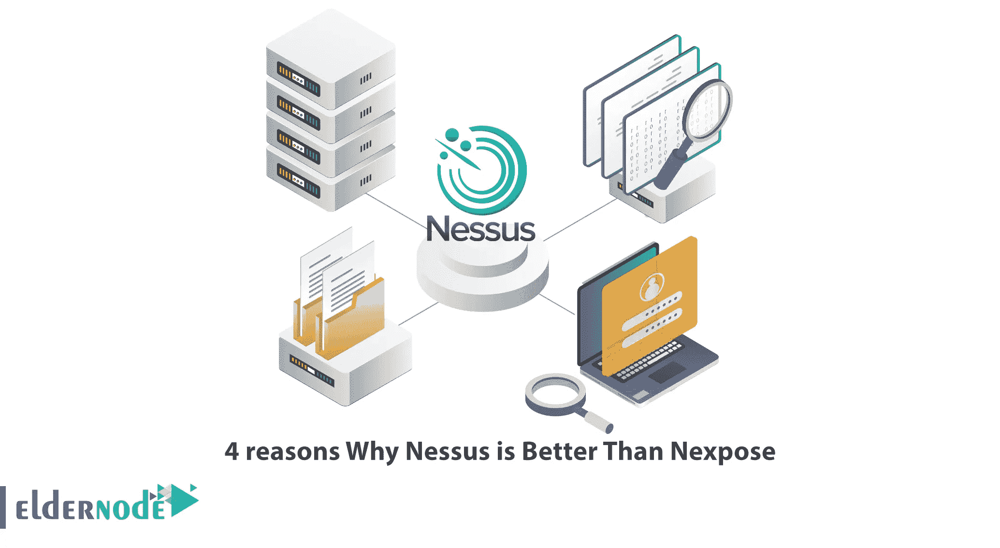

# Nessus 优于 Nexpose 的 4 个理由

> 原文：<https://blog.eldernode.com/4-reasons-why-nessus-is-better-than-nexpose/>

在新发现的漏洞发布后，攻击者正在寻找利用这些漏洞进一步实施恶意活动的方法。因此，在识别和修复软件漏洞方面的任何延迟都给了攻击者足够的机会来渗透和征服易受攻击的机器并访问其有价值的信息。您可以使用 Web 漏洞扫描工具扫描您的网络，Nessus 和 Nexpose 就是其中之一。本文将向您介绍 Nessus 优于 Nexpose 的 4 个原因。如果你打算购买自己的 **[Linux VPS](https://eldernode.com/linux-vps/)** 服务器，请查看 [Eldernode](https://eldernode.com/) 网站上提供的软件包。

## **为什么 Nessus 比 Nexpose 好？**

Nessus 是一个漏洞扫描器，用于漏洞评估和渗透测试冲突，包括恶意攻击。该扫描器由 Tenable for Unix、Linux 和 FreeBSD 推出，提供全面的覆盖，扫描超过 59000 个 CVE。

Nexpose 可以扫描网络、操作系统、web 应用程序、数据库和虚拟环境。您可以将它安装在 Windows、Linux 或虚拟机上，并提供基于 web 的 GUI 环境。此外，通过该工具的 web 门户，您可以创建站点并定义要扫描的 IP 和 URL。

### **1- Nessus 更实惠**

Nessus 比 Nexpose 更实惠，并以较低的成本提供针对无限 IP 的无限扫描的全面漏洞扫描。它每年仅收到大约 2990 美元。您可以扫描现代攻击面，找到任何漏洞，并保护资产免受相同的。但 Nexpose 采用基于数量的定价，这意味着每项资产的定价因资产总数而异。比如 128 IP 大概 2000 美金。

### **2-它识别已知的 Web 应用漏洞**

Nexpose 识别操作系统(Windows、Linux 和 macOS)、桌面攻击媒介(Java、Acrobat、Flash、Quicktime、Adobe Reader 和浏览器)、Web (PHP、SQL Injection、Apache、浏览器、IIS、XSS 和 OWASP Top 10)、识别供应商漏洞(Microsoft、Apple 和 Adobe)和数据库(Microsoft SQL Server、MySQL 和 Oracle)。而 Nessus 识别已知的 web 应用程序漏洞。

### **3-能够快速扫描，零误报**

他们两个都有认证扫描。但是 Nessus 扫描速度快，误报率低，这使您可以快速识别需要首次清理的漏洞。虽然 Nexpose 不能保证审查扫描的假阳性为零。

### **4- Nessus 简单易用，扩展性很强**

Nessus 测试计算机上的每个端口以确定正在运行什么服务，然后测试该服务以确保没有漏洞。它是高度可扩展的，并为您提供了一种编程语言。您可以使用编程语言编写特定于您的系统的测试。该扫描仪还提供了一个插件接口，这是常见的病毒或漏洞检测。

我们的网站正在运行经济实惠的 Linux VPS 服务器，如果你需要的话，你可以购买。

## 结论

Nessus 会扫描计算机，并在发现任何漏洞时发出警报。Nexpose 也是一个漏洞扫描器，但 Nessus 更受欢迎，功能也更多。在本文中，我们解释了 Nessus 优于 Ubuntu 上的[NEX expe 的 4 个原因。我希望这篇教程对你有用，并且你喜欢它。如果您有任何问题或建议，可以在评论区联系我们。](https://blog.eldernode.com/setup-and-configure-nessus-on-ubuntu/)