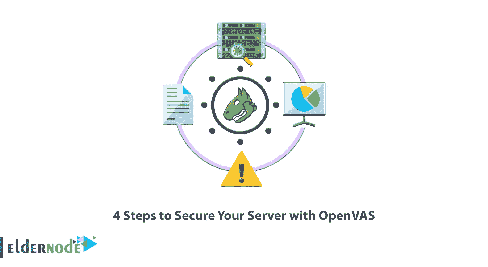
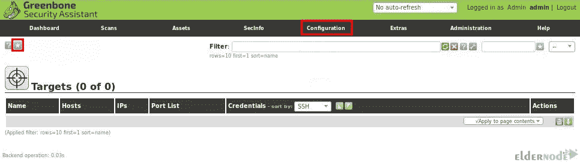
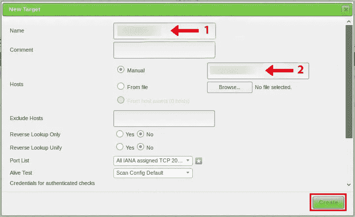
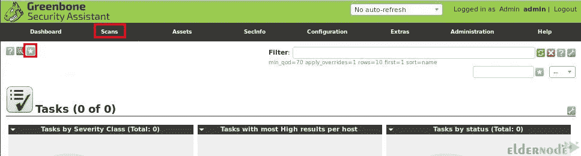
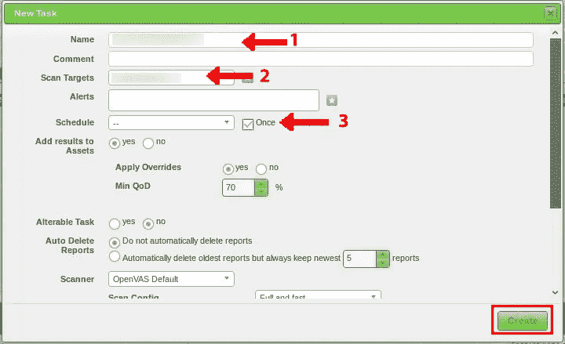
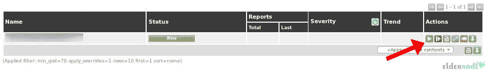
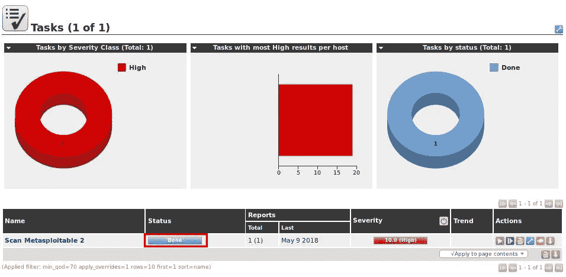

# 使用 OpenVAS 保护服务器的 4 个步骤

> 原文：<https://blog.eldernode.com/4-steps-to-secure-your-server-with-openvas/>



如果你是网络或网站管理员，你应该注意安全规则和原则的执行。但是您可能无法控制和监控所有漏洞。漏洞扫描器是在自动安全管理中发挥重要作用的工具。最著名的安全扫描器之一是 OpenVAS，它具有扫描各种漏洞的能力。本文将介绍用 OpenVAS 保护您的服务器的 4 个步骤。如果你打算[购买 VPS](https://eldernode.com/vps/) 服务器，你可以查看 [Eldernode](https://eldernode.com/) 网站上提供的套装。

## **什么是 OpenVAS？**

[OpenVAS](https://blog.eldernode.com/install-and-configure-openvas-on-ubuntu/) 代表开放漏洞评估系统，是一款开源的免费扫描工具。它可以检测各种服务器和网络设备的安全问题。这个扫描器是在 GNU/GPL 许可下提供的，它从一个有着悠久历史和每日更新的提要中获取检测漏洞的测试。Greenbone Network 在 2006 年开发了 OpenVAS。web 服务器使用 OpenVAS 来防止对网站或服务器的未授权访问。它还允许用户访问各种 Web 应用程序。

## **OpenVAS 功能**

以下是一些高级 OpenVAS 功能:

–未经认证的测试

–各种高级和低级互联网协议

–针对大规模扫描的性能调整

–强大的内部编程语言

## **使用 OpenVAS** 保护您的服务器安全 

在这一步中，我们将向您介绍使用 OpenVAS 保护您的服务器的 4 个步骤。这 4 个步骤是 OpenVAS 安装、OpenVAS 配置、OpenVAS 监控和 OpenVAS 管理。

### **1-在您的服务器上安装 open vas**

首先，使用以下命令更新您的系统软件包:

```
sudo apt update
```

一些 OpenVAS 组件在默认的存储库中可用，但是最好使用 PPAs 来维护软件包的更新版本。因此，首先，您应该安装 python-software-properties 包，它允许您轻松地使用 PPA。为此，请运行以下命令:

```
sudo apt install python-software-properties
```

现在使用下面的命令将最新的稳定版本添加到系统中:

```
sudo add-apt-repository ppa:openvas/openvas6
```

再次更新您的系统:

```
sudo apt update
```

是时候**安装 OpenVAS** 了。只需输入以下命令来安装所需的组件:

```
sudo apt install openvas-manager openvas-scanner openvas-administrator openvas-cli greenbone-security-assistant sqlite3 xsltproc texlive-latex-base texlive-latex-extra texlive-latex-recommended htmldoc alien rpm nsis fakeroot
```

### **2-在您的服务器上配置 open vas**

OpenVAS 的 SSL 证书可以使用默认可用的包装工具生成。您应该使用管理权限调用它，如下所示，以将其放在文件系统的受限部分:

```
sudo openvas-mkcert
```

出现提示时，您可以按 **Enter** 接受默认值。然后为名为“marilyn”的用户创建另一个客户端证书:

```
sudo openvas-mkcert-client -n marilyn -i
```

在这一步中，您需要构建数据库信息，以便我们的本地工具能够识别不同类型的威胁和漏洞。为此，请通过运行以下命令来更新网络漏洞测试数据库:

```
sudo openvas-nvt-sync
```

然后，您将看到最新的定义被下载到您的本地设备。

使用下面的命令停止管理器和扫描仪应用程序，以便能够暂时调用命令而不发生冲突:

```
sudo service openvas-manager stop
```

```
sudo service openvas-scanner stop
```

您可以在不使用 init 文件中的参数的情况下启动 scanner 程序，通常使用以下命令调用这些参数:

```
sudo openvassd
```

现在，使用以下命令重建扫描器生成的数据库:

```
sudo openvasmd --rebuild
```

通过输入以下命令，下载并更新您的安全内容自动化协议数据，即 SCAP 数据:

```
sudo openvas-scapdata-sync
```

现在，您应该对证书数据运行类似的同步操作，如下所示:

```
sudo openvas-certdata-sync
```

如果这是您第一次运行上述命令，您可能会得到以下错误:

```
Error: no such table: meta
```

此错误可能是由于丢失了一些其他版本中打包的一些文件。您可以从管理器组件的 RPM 包中获得它们。要将它下载到您的主目录中，只需输入以下命令:

```
cd  wget http://www6.atomicorp.com/channels/atomic/fedora/18/i386/RPMS/openvas-manager-4.0.2-11.fc18.art.i686.rpm
```

然后借助以下命令提取并展开 RPM 中的目录结构:

```
rpm2cpio openvas* | cpio -div
```

接下来，为新文件创建一个目录，以便 OpenVAS 可以找到它们。然后将文件移动到该目录，如下所示:

```
sudo mkdir /usr/share/openvas/cert
```

```
sudo cp ./usr/share/openvas/cert/* /usr/share/openvas/cert
```

使用以下命令再次运行证书同步命令:

```
sudo openvas-certdata-sync
```

使用以下命令从主目录中删除提取的 RPM 数据和目录:

```
rm -rf ~/openvas* ~/usr ~/etc
```

### 3-使用 OpenVAS 监控漏洞

首先，您应该使用**open vas/green bone**Security Assistant web 界面创建一个目标。为此，导航到**配置**部分，选择**目标**并点击所示图标创建一个新目标:



您将看到一个对话框，您应该在其中输入目标名称和目标 IP 主机。输入信息后，将其他设置设为默认值，并点击**创建**:



您应该在可用目标列表中看到新创建的目标。

在此步骤中，您应该在 OpenVAS 中配置扫描任务。扫描任务定义将要扫描的目标、扫描选项、扫描配置以及每台主机同时扫描的目标和 nvt。为此，导航到**扫描**，选择**任务**，点击显示的**蓝色图标**，选择**新任务**:



现在您将看到一个对话框，您应该在其中输入任务名称并选择之前创建的任务名称。然后勾选**安排一次**复选框，将其他设置设为默认，点击**创建**:



您将在任务列表中看到新创建的任务。

您可以通过单击显示的开始按钮运行 OpenVAS 漏洞扫描:



扫描任务将针对选定的目标运行。如果您重新加载页面，您可以检查进度。

完成后，您可以看到状态变为 **Done:**



### **4-管理 OpenVAS**

您需要设置 OpenVAS 用户和端口，因为您需要一个用户来进入服务。创建一个名为“marilyn”的用户，其管理员角色如下所示:

```
sudo openvasad -c add_user -n admin -r Admin
```

您将被要求提供新帐户的密码。

现在用 root 权限从您想要的文本编辑器中打开下面的文件:

```
sudo nano /etc/default/greenbone-security-assistant
```

顶部的参数指定了 web 界面将监听的地址。要允许它侦听来自互联网的连接，您应该将值从 127.0.0.1 更改为您的 VPS 的公共 IP 地址:

```
<pre> GSA_ADDRESS=<span class=“highlight”>your_server_IP_address</span> </pre>
```

**保存**并关闭文件。

某些服务正在以某些容量运行，借助以下命令终止所有正在运行的 OpenVAS scanner 进程:

```
sudo killall openvassd
```

您可以使用以下命令检查进程是否仍在运行:

```
ps aux | grep openvassd | grep -v grep
```

如果服务被返回，您应该等待进程完成。

该过程完成后，通过运行以下命令重新启动所有服务:

```
sudo service openvas-scanner start
```

```
sudo service openvas-manager start
```

```
sudo service openvas-administrator restart
```

```
sudo service greenbone-security-assistant restart
```

就是这样！我们提供不同的 [Linux VPS](https://eldernode.com/linux-vps/) 服务器包。如果你正在寻找一个经济的 Linux VPS 服务器，我们的网站是最好的选择之一。

## 结论

OpenVAS 是一个工具集合，这些工具协同工作，使用已知漏洞和弱点的数据库对客户端计算机执行测试。在本文中，我们向您介绍了使用 OpenVAS 保护服务器的 4 个步骤。我希望这篇文章能帮助你用 OpenVAS 保护你的服务器，并对你有用。如果您有任何问题或建议，可以在评论区联系我们。