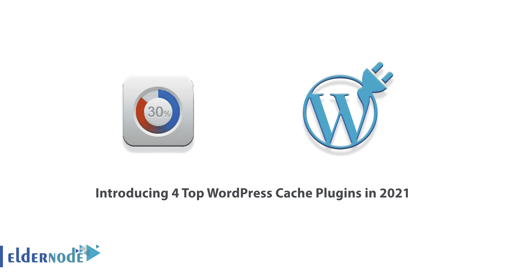
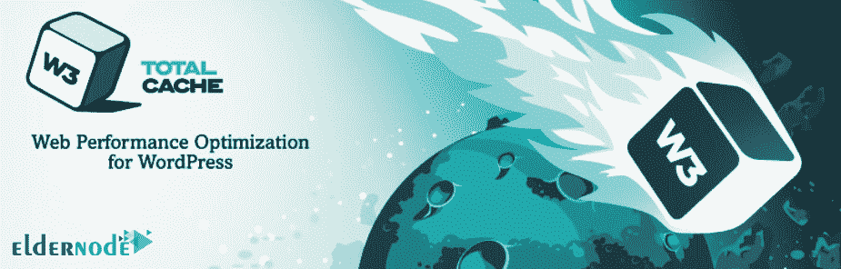

# 介绍 2021 年 4 大 WordPress 缓存插件- Eldernode

> 原文：<https://blog.eldernode.com/4-top-wordpress-cache-plugins/>

加快 WordPress 和优化网站速度是用户寻求的最重要的问题。这样做的原因是，首先，用户能够更快地访问网站，其次，搜索引擎认为这是该网站的一个特殊优势。在 WordPress 中，各种各样的解决方案总是被用来提高速度。其中一个方法是使用 WordPress 缓存和更好的站点缓存管理。这就是为什么我们要在本文中讨论**在 2021 年推出 4 个顶级 WordPress 缓存插件**。需要注意的是，如果你想购买一台 [WordPress VPS](https://eldernode.com/wordpress-vps/) 服务器，你可以访问 [Eldernode](https://eldernode.com/) 中的软件包。

## **WordPress 缓存插件介绍**

WordPress 缓存包含临时存储在系统内存中的文件。当在站点和浏览器上启用缓存时，从您以 HTML 格式接收的站点的每个页面，指定的文件将在指定的时间段内临时存储在缓存文件夹中。这些文件通常包含不改变的和固定的文件。例如，不变的 CSS 文件或图像。

当这些文件临时存储在系统中，当你看到之前访问过的站点时，它不是加载所有文件，而是从系统中读取缓存在你系统中的文件，并不向服务器发送读取请求。由于这个原因，该文件将可以更快地获得，并将提高网站的速度。

在这篇文章中，我们将介绍 2021 年最好的 WordPress 缓存插件。使用本教程，你可以熟悉 [WordPress](https://blog.eldernode.com/tag/wordpress/) 中最流行的缓存插件，并安装和使用一个最适合 WordPress 缓存的插件。因此，如果你也在寻找这个话题，看看什么是最好的 WordPress 缓存插件，请和我们一起坚持到最后。

## **2021 年排名前 4 的 WordPress 缓存插件有哪些？**

WordPress 知识库充满了不同的插件，每个插件都用于特定的任务。这些插件之间存在差异，一个插件可能使用一种方法，而另一个插件可能使用另一种方法来执行其任务。这使得其中一个插件工作得更好，或者两个插件做同样的事情。

这正是 WordPress 缓存所发生的，根据网络服务器的类型和服务器上使用的软件，有不同的缓存方法，插件可能会工作得更好。所以你应该根据你的服务器类型使用一个最好的插件作为 WordPress 的缓存。下面，我们将介绍 4 个最好的 WordPress 缓存插件。

### **1) W3 总缓存插件**

W3 Total Cache 拥有超过 100 万的活跃安装，是最受欢迎和最好的 WordPress 缓存插件之一。该插件通过支持各种缓存方法以及连接到 CDN(内容交付网络)的能力，显著提高了您的服务器性能。

W3 Total Cache 插件已经被无数知名公司使用和推荐。这个插件，不管你的主机是共享的还是专用的，都提高了你的站点的性能，增加了站点的加载速度。目前，W3 Total Cache 是唯一一个优化所有运行主机环境的插件。

这个插件支持 Google AMP 技术和 SSL。此外，W3 Total Cache 插件有一个 Minify 选项，可以减少静态文件的大小，降低网站加载速度。W3 Total Cache 插件的开发者声称使用压缩选项可以节省高达 80%的带宽。

如果你愿意，你可以从 WordPress 插件库中 [**下载 W3 总缓存插件**](https://downloads.wordpress.org/plugin/w3-total-cache.2.1.3.zip) 。

**W3 总缓存插件特性**

在这一节中，我们将提到 W3 总缓存插件的一些重要特性。这些功能包括:

_ 提高站点性能

_ 兼容 SSL 共享主机、VPS 和 CDN

_ 完全支持手机和 AMP

_ 压缩和缓存页面

_ 浏览器缓存

_ 删除缓存的能力

_ 各种安全功能

_ 提供缓存

### **2) Wp 超级缓存插件**

另一个最好的 WordPress 缓存插件是 WP Super Cache，它有超过 200 万的活跃安装。这个插件是由 WordPress 开发团队 Automattic 设计的。

这个插件被认为是 w3 总缓存插件的竞争对手，用户在选择这两个插件中的一个时总是有疑问。在 GTmetrix 网站进行的测试中，该插件能够将网站加载速度提高到 0.85 秒，使网站速度提高了约 28.7%。

WP 超级缓存插件以三种方式缓存文件:

**1。简单:**在这个方法中，您不必编辑 PHP 文件，也不必配置。htaccess 文件。这是最推荐的文件缓存方式。

**2。高级:**这是为用户提供高度压缩的 HTML 文件的最快缓存方式。但是它需要修改。htaccess 文件。

**3。WP 超级缓存:**在这种方法中，站点的页面是为已知用户(那些在你的站点注册，留下评论等的用户)缓存的。).虽然这是最灵活的缓存方法，但比其他方法稍慢。

WP 超级缓存插件有能力适应和选择 CDN 和移动缓存控制。此外，这个插件有一个调试模式，当你没有从插件获得必要的性能，你想知道错误来自哪里时，这个模式非常有用。

如果你愿意，你可以从 WordPress 插件库中 [**下载 Wp 超级缓存插件**](https://downloads.wordpress.org/plugin/wp-super-cache.1.7.3.zip) 。

**Wp 超级缓存插件功能**

在这一节，我们将提到 Wp 超级缓存插件的一些重要特性。这些功能包括:

_ 缓存页面

_ 压缩页面

_ 提高网站速度

_ 删除缓存

_ 从缓存中删除特定页面

_ 设置缓存过期时间

_ CDN 支持

### **3) WP 最快缓存插件**

我们在第三类最好的 WordPress 缓存插件中介绍的插件被称为最快的 WordPress 缓存或 WP 最快缓存。这个插件的下载统计是 100 多万份。插件中提供了非常有限的设置。在插件的免费版本中，它的许多功能都是禁用的。如果你正在寻找一个简单设置的免费 WordPress 缓存插件，并且你有一个超级缓存的问题，你可以使用 WP 最快缓存。

像其他缓存插件一样，WP 最快缓存插件从你的动态 WordPress 站点创建静态 HTML 文件，并将它们存储在服务器上。该插件还集成了内容交付网络(CDN ),可以通过 CDN 提供脚本和图像等静态文件，从而减少网站打开时间。

WP 最快的缓存插件可以压缩或缩小 CSS 和 HTML 文件，并减少它们的大小。它还允许你在你的网站上禁用表情符号。这个插件还提供了一个浏览器缓存方法来减少用户的站点加载时间。

如果你愿意，你可以从 WordPress 插件库中 [**下载 Wp 最快缓存插件**](https://downloads.wordpress.org/plugin/wp-fastest-cache.0.9.1.9.zip) 。

**Wp 最快缓存插件特性**

在这一节，我们将提到 Wp 最快缓存插件的一些重要特性。这些功能包括:

_ 构建用于缓存的静态页面

_ 通过各种事件或计数器清除缓存的能力

_ HTML 和 CSS 代码的压缩以及 CSS 和 JS 文件合并的可能性(JS 压缩在免费版中是没有的！)

_ 设置自动缓存清除时间

_ 禁用移动缓存或站点成员的能力

WordPress 中的 _ Gzip 压缩管理

_ 支持 SSL 和 CDN

_ 禁用 WordPress 表情图标的能力

### **【4】升速缓存插件**

这个插件是最好的 WordPress 缓存插件之一，有两个特点:

**通用特性**，适用于 LiteSpeed、Nginx、Apache 等任何 web 服务器。

**特色功能**，需要 OpenLiteSpeed，LiteSpeed 商业产品，或者基于 LiteSpeed 的主机。

一般功能包括对象缓存、多 CDN 支持、有损或无损图像优化、浏览器缓存、操作码缓存、CSS/JS 的 HTTP/2 推送、默认 DNS 补丁、多任务支持和 Cloudflare API。此外，您可以最小化 CSS、JavaScript 和 HTML，包括内联 CSS 和 JavaScript，并自动生成关键的 CSS。

LiteSpeed 缓存插件允许缓慢加载图片/iframe 和异步加载 CSS/JS。此外，您还可以获得数据库优化器、对 WebP 图像格式模板的支持、输入/输出设置、初始/高级设置的显示以及 PageSpeed 分数优化。

您可以在一个美观易用的用户界面中配置所有这些优秀的设置。LiteSpeed 的独特功能包括页面的自动清除和缓存、登录用户的私有缓存、WordPress REST API 缓存、移动检测、缓存清除计划、WP CLI 支持等等。

如果你愿意，你可以从 WordPress 插件库中下载 LiteSpeed 缓存插件 。

**LiteSpeed 缓存插件特性**

在这一节，我们将提到 LiteSpeed 缓存插件的一些重要特性。这些功能包括:

_ 浏览器缓存、对象、操作代码等

_ 支持 WebP 格式的图像优化

_ 清除并修复 WordPress 数据库

_ 压缩 CSS、JavaScript 和 HTML 并合并文件

_ 加载的可能性

_ CDN 和 Cloudflare 支持

_ DNS 预取

_ WordPress 网络支持

_ 简单的用户界面

## 结论

除了在主机上缓存页面，WordPress 缓存插件还管理用户的浏览器缓存。在这篇文章中，我们试图向你介绍 2021 年的 4 个顶级 WordPress 缓存插件。如果你愿意，可以参考文章[如何降低负载和提高站点速度](https://blog.eldernode.com/reduce-load-and-increase-site-speed/)。