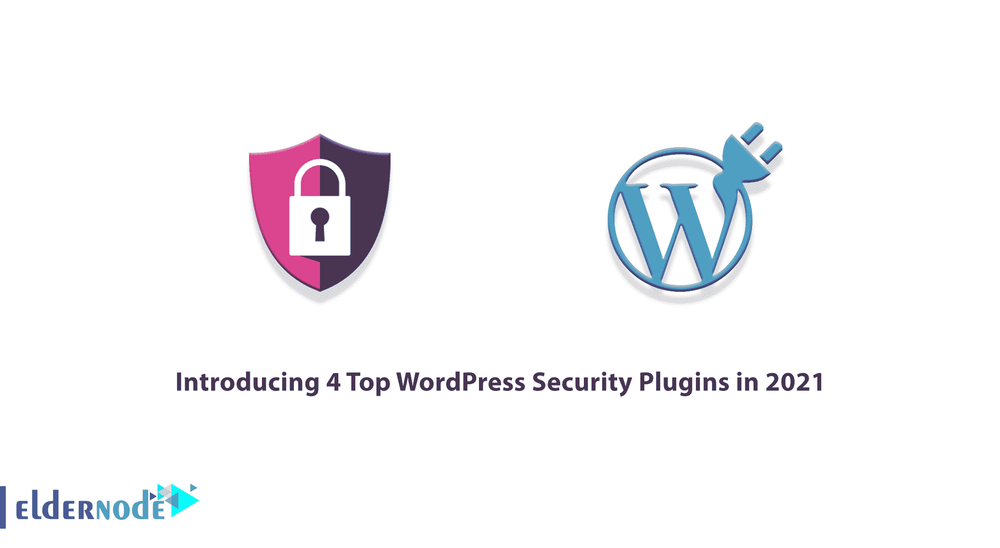
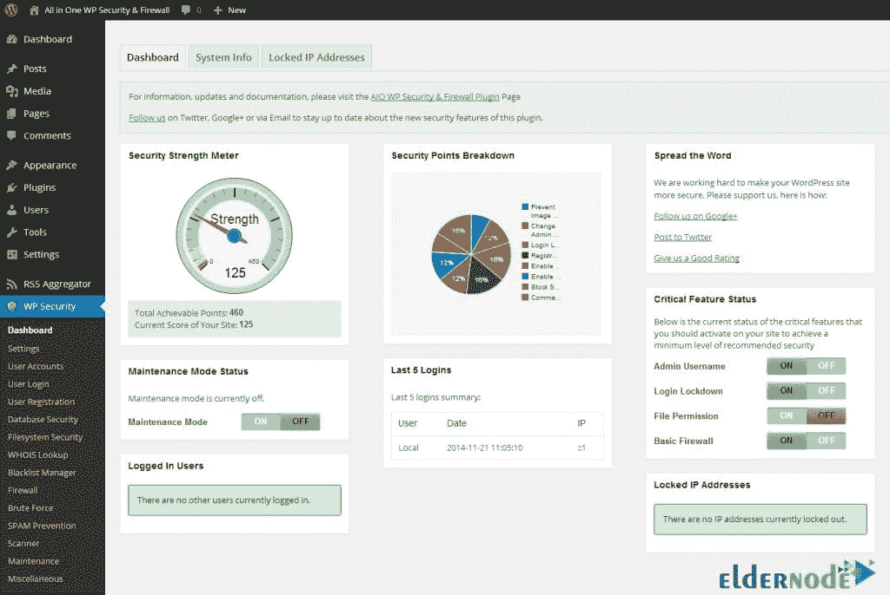
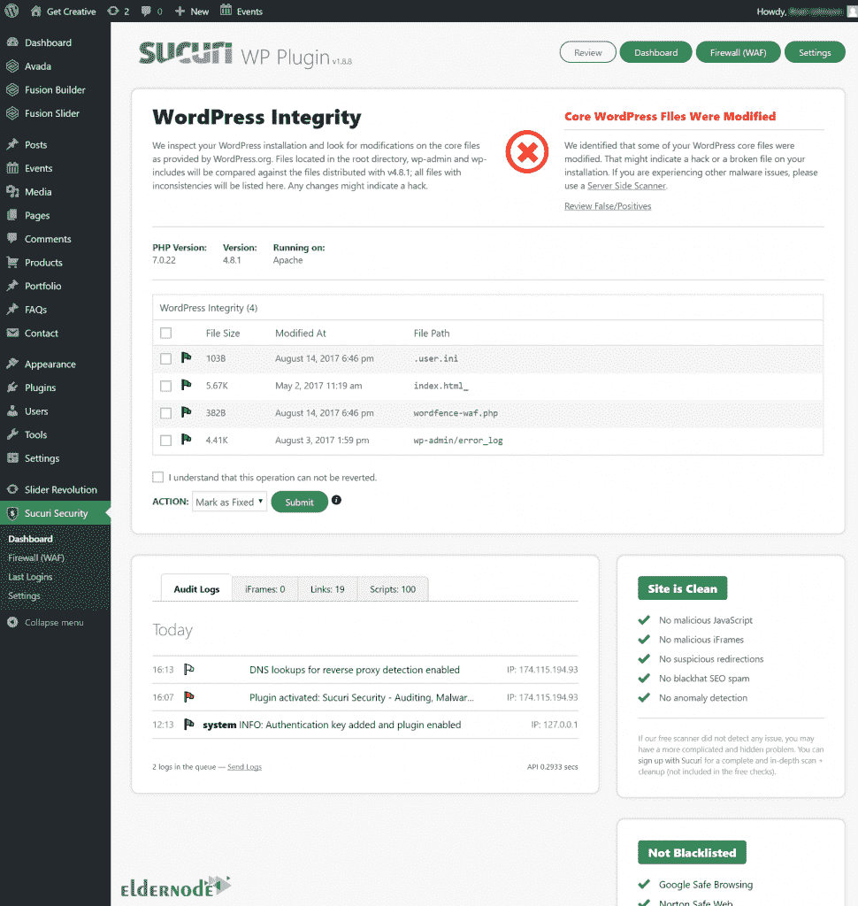
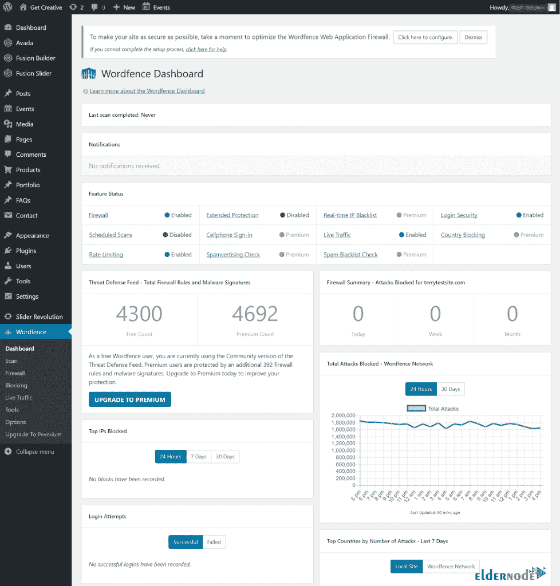
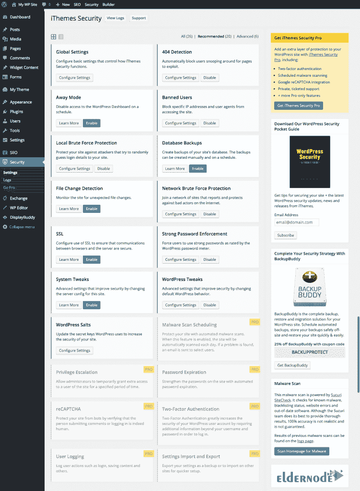

# 介绍 2021 年 4 大 WordPress 安全插件- Eldernode

> 原文：<https://blog.eldernode.com/4-top-wordpress-security-plugins/>

因为 WordPress 是最流行的内容管理系统，所以它经常受到黑客和恶意垃圾邮件发送者的攻击。不幸的是，许多网站所有者陷入了认为黑客只针对大公司或热门博客的陷阱。所以他们很少关注网站的安全性。但事实是，黑客攻击网站不仅是为了窃取个人信息和创建反向链接，也是为了娱乐。如果你不采取必要的安全措施来防止对你网站的攻击，你就让黑客破坏了你的搜索排名，破坏了你的在线业务。在这篇文章中，我们想一步一步地向你介绍 2021 年的 **4 个顶级 WordPress 安全插件。需要注意的是，如果您想购买一台 [VPS](https://eldernode.com/vps/) 服务器，您可以访问 [Eldernode](https://eldernode.com/) 中提供的软件包。**

## **2021 年 4 大 WordPress 安全插件**

当你意识到 [WordPress](https://blog.eldernode.com/tag/wordpress/) 的重要性时，熟悉 WordPress 安全插件的重要性会变得更加清晰。确保 WordPress 网站的安全是很困难的，尤其是当人们没有这方面的专业知识的时候。但是使用 WordPress 安全插件可以轻松解决这个问题。

有很多方法可以增加 WordPress 的安全性。但是保证你的网站安全的最基本的步骤是在你的网站上安装一个最好的 WordPress 安全插件。在这篇文章中，我们将介绍 2021 年最好的 4 个 WordPress 安全插件，并解释它们的功能和特点。请加入我们。

## **2021 年 4 大 WordPress 安全插件是什么？**

有许多不同类型的最流行的 WordPress 安全插件。因此，在下面，我们将介绍一些 WordPress 安全插件。

请记住，仅仅安装和使用最好的 WordPress 安全插件不足以创建 WordPress 安全。所以除此之外，你需要特别注意更新 WordPress 内核、模板和插件。此外，下面介绍的免费 WordPress 安全插件由于其免费性质，不提供任何关于 WordPress 安全的保证或[安全](https://blog.eldernode.com/tag/security/)。最终，WordPress 安全是 WordPress 网站所有者/设计者的责任。

在这篇文章的后续部分，我们将在 2021 年推出 4 个 WordPress 安全插件。

### **1。一体式 WP 安全&防火墙**

一个 WP 安全和防火墙插件是最好的 WordPress 安全插件，也是一个免费插件，将你的网站安全提升到一个全新的水平。该插件有超过 900，000 个活跃安装，得分为 4.8 分(满分 5 分)。

这个插件最大的优点是它的所有特性都分为三类:基础、中级和高级。这使得任何人都可以在不破坏网站的情况下轻松激活一组功能。

通过安装一个 WP 安全和防火墙插件，你可以在你的 WordPress 仪表盘中找到你的网站安全力量的正确测量。这个插件让你知道你的网站有多安全，基于一个安全等级系统。在一个 WP 安全和防火墙插件中还附带了另一个仪表板部件，建议你在你的网站上启用某些功能，以达到最低可接受的安全水平。

如果你愿意，你可以从 WordPress 插件库中 [**下载所有的 WP 安全&防火墙**](https://downloads.wordpress.org/plugin/all-in-one-wp-security-and-firewall.zip) 。

**多合一 WP 安全&防火墙功能**

在这一节中，我们想介绍这个插件的一些最重要的特性。这些功能包括:

1.保护用户的用户帐户

2.维护进入网站的安全性

3.维护网站会员部分的安全

4.维护数据库安全

5.保护 WordPress 中的文件

6.保护。htaccess 和 wp-config.php

7.它有防火墙设置

### **2。苏库里安全**

Sucuri 安全插件是一个完整的网站安全解决方案，保护您的网站免受恶意软件，暴力攻击和其他潜在的漏洞。该插件的免费版本有超过 800，000 个活跃安装，得分为 4.4 分(满分 5 分)。

当您启用 Sucuri 插件时，您网站的所有流量都将通过他们的 CloudProxy 服务器进行路由，所有请求都将被扫描以过滤掉恶意请求。由于这个原因，Sucuri 可以通过不允许恶意流量到达您的服务器来减少服务器负载并提高您的网站性能。

这个插件保护您的网站免受 XSS、SQL 和其他已知攻击。此外，Sucuri 团队积极向 WordPress 核心团队以及第三方插件报告潜在的安全威胁。

Sucuri 插件的用户界面很吸引人，很容易引用它的不同部分。即使在您的网站受到攻击的情况下，它也会用必要的提示来帮助您消除攻击。

如果你愿意，你可以从 WordPress 插件库中 [**下载 Sucuri Security**](https://downloads.wordpress.org/plugin/sucuri-scanner.1.8.26.zip) 。

**Sucuri 安全特性**

现在我们想提一下这个插件的一些最重要的特性。这些功能包括以下内容:

1.此插件的防病毒包每 4 小时监控您的网站，以确保您的网站没有潜在的漏洞和恶意软件。

2.这个插件跟踪你的站点上发生的所有事情，包括文件更改、上次登录、失败的登录尝试等等。

3.Sucuri 插件允许你扫描服务器端来保护你的网站免受服务器端病毒的攻击。

4.安全活动审计

5.文件完整性监控

6.远程恶意软件扫描

7.黑名单监控

8.有效的安全强化

9.黑客攻击后的安全措施

10.安全通知

### **3。**安全围栏

Wordfence 安全插件是最全面和最好的 WordPress 安全插件之一。这个插件的免费精简版可以在官方的 WordPress 插件库中找到，到目前为止已经有超过 400 万次的活跃安装，得分超过 4.8 分(满分 5 分)。

免费版本具有重要的功能，如 Web 应用程序防火墙(WAF)、恶意软件扫描器和防止暴力攻击。Wordfence 插件监控暴力攻击，并防止许多登录尝试。您可以锁定使用无效用户名的任何人，甚至可以在专业版中启用两步验证来增加安全性。

您可以通过使用该插件的区域阻止功能来防止特定地理区域的内容攻击和窃取。根据模式和 IP 范围，您可以阻止所有看似可疑的恶意网络和人类活动。这个插件允许你检查你的 IP 地址的有效性。这样，您可以确保客户的电子邮件不会被标记为垃圾邮件。

Wordfence 的缺点是它运行在你自己的服务器上，而不是基于云的提供商。此外，该插件的一些功能，如区域封锁，预定扫描，两步认证，可在其专业版。

如果你愿意，你可以从 WordPress 插件库中 [**下载 Wordfence Security**](https://downloads.wordpress.org/plugin/wordfence.7.5.2.zip) 。

**Wordfence 安全特性**

Wordfence 安全插件的一些最重要的功能包括:

1.保护网站免受攻击

2.能够创建两步验证来进入 WordPress 仪表盘

3.强迫所有用户在 WordPress 中使用强密码

4.扫描网站，检测 WordPress 模板或插件中被感染的文件

5.抵御暴力攻击

6.在线查看 WordPress 流量和统计数据的能力

7.防止 DDOS 攻击

### **4。iThemes 安全**

iThemes 安全插件，以前叫做“更好的 WP 安全”，是另一个最好的 WordPress 安全插件，它提供了几种方法来保护你的 WordPress 网站。该插件的免费版本拥有超过 100 万的活跃安装量，得分为 4.7 分(满分 5 分)。

这个插件通过限制登录失败的次数来保护你的网站免受暴力攻击。您可以收到带有最新文件更新的电子邮件提醒，以了解您的网站是否遭到黑客攻击。

iThemes 安全插件根据您自己设置的限制锁定任何扫描您网站漏洞的可疑 IP。你甚至可以为你的站点设置一个不可访问的模式，使你的 WordPress dashboard 基于你应用的设置不可访问。此外，您可以配置插件，将数据库备份保存到网站外部的所需位置。

如果你愿意，你可以从 WordPress 插件库中 [**下载 iThemes Security**](https://downloads.wordpress.org/plugin/better-wp-security.7.9.1.zip) 。

**这是安全特性**

iThemes 安全插件最重要的特性是:

1.能够在 WordPress 中使用两步登录

2.能够在 WordPress 中更新安全密钥

3.网站的自动和每日扫描

4.能够在 WordPress 中使用强密码

5.能够在 WordPress 中设置密码的失效日期，并要求用户在指定时间后更改密码

6.能够使用谷歌验证码

## 结论

许多 WordPress 网站用户关心的问题之一是它的安全性。有很多插件可以修复 WordPress 的安全问题。在这篇文章中，我们试图向你介绍 4 个 2021 年最好的 WordPress 安全插件。