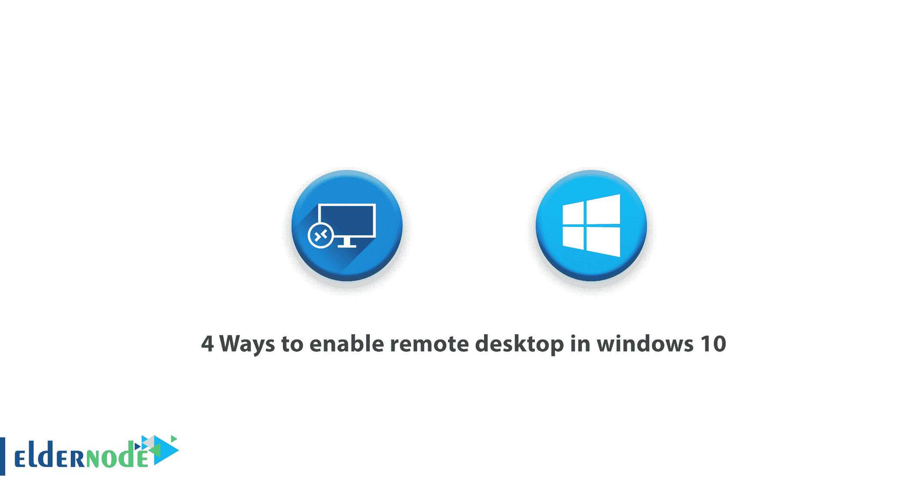

# 在 windows 10 中启用远程桌面的 4 种方法- Eldernode

> 原文：<https://blog.eldernode.com/4-ways-to-enable-remote-desktop/>



您肯定处于这样一种情况:您需要在一台计算机上检查、安装软件、支持和各种服务，而该系统离您很远，甚至可能在另一个城市。因此，您没有对它的物理访问权。在这篇文章中，我们想向您介绍在 windows 10 中启用远程桌面的 4 种方法，其中包括**组策略**、 **PowerShell** 、**T5、** 等等。

即使是 Windows 操作系统中最专家和所谓的极客，有时也需要到远程桌面系统进行管理。作为专业使用 Windows 操作系统的人，您肯定知道可以通过系统属性在 Windows 中启用远程桌面。事实上，这是最简单和最容易的方法。但是，如果您想在远程桌面网络上运行远程系统，您必须首先在该系统上启用远程桌面，因为出于安全原因，默认情况下在 Windows 中禁用此功能。在 Eldernode 市场上有几个 [RDP 管理服务器](https://eldernode.com/buy-rdp/)服务。你可以选择其中一个计划。

## 在 windows 10 中启用远程桌面的 4 种方式

远程桌面功能是 Windows 的功能特性之一。远程桌面的目的是使人们能够远程连接到其他计算机。如果你是 Windows 10 用户，想使用这个功能，就加入我们吧。要学习 Windows 10 中的远程桌面，您需要对电脑设置进行更改。这里有四种方法允许您的计算机接受此连接。

### 1。通过组策略对象或 GPO 启用远程桌面

为此，请打开组策略管理控制台并转到以下路径:

```
Computer Configuration > Administrative Templates > Windows Components >Remote Desktop Services > Remote Desktop Session Host > Connections 
```

双击**允许用户使用远程桌面服务**远程连接并启用它。

现在，您需要指定可以访问远程桌面远程系统的 IP 地址范围。

首先转到以下路径:

```
Computer Configuration > Policies > Administrative Templates > Network > Network Connections > Windows Firewall > Domain Profile 
```

双击 **Windows 防火墙:允许入站远程桌面例外** 策略 并启用。然后在 IP 范围框中输入所需的 IP 地址。

### 2。通过 PowerShell 激活远程桌面

通过 PowerShell 激活远程桌面有点困难。

首先， **PowerShell Remoting** 必须在目标系统上启用，以便能够通过 **PowerShell** 管理客户端和服务器系统。我们假设 PowerShell 远程处理在目标系统上是活动的。现在，您可以通过执行以下命令在目标系统上激活远程桌面:

```
Invoke-Command -Computername  -ScriptBlock {Set-ItemProperty -Path "HKLM:\System\CurrentControlSet\Control\Terminal Server" -Name "fDenyTSConnections" –Value 0 } 
```

您需要输入目标计算机名，而不是**计算机名**。我们使用了**调用命令**来使用**设置项目属性**命令。该命令将注册表项 **fDenyTSConnections** 的值更改为零。

最有可能的是， [Windows 防火墙](https://eldernode.com/open-a-port-on-a-windows-firewall/)将阻止 **RDP 流量**，因此您必须使用以下命令来允许 RDP 流量进入目标系统:

```
Invoke-Command -Computername  -ScriptBlock {Enable-NetFirewallRule -DisplayGroup "Remote Desktop"} 
```

### 3。通过 WMI 启用远程桌面

如果目标系统上没有启用 PowerShell Remoting，您仍然可以通过 WMI 使用 **PowerShell。当您希望在大量客户端上启用 RDP 时，此方法会很有用。使用以下脚本，您可以在目标系统上管理 PowerShell 远程处理，而无需激活它。**

```
[cmdletbinding()]  param(      [parameter(ValueFromPipeline=$true,ValueFromPipelineByPropertyName=$true)]      [string[]]$ComputerName = $env:computername,      [ValidateScript({Test-Path $_})]      [string]$OutFolder = "c:\"  )     begin {  $SuccessComps = Join-Path $OutFolder "Successcomps.txt"  $FailedComps = Join-Path $OutFolder "FailedComps.txt"  }     process {      foreach($Computer in $ComputerName) {             try {              $RDP = Get-WmiObject -Class Win32_TerminalServiceSetting `                                  -Namespace root\CIMV2\TerminalServices `                                  -Computer $Computer `                                  -Authentication 6 `                                  -ErrorAction Stop                                            } catch {              Write-Host "$Computer : WMIQueryFailed"              "$Computer : WMIQueryFailed" | Out-File -FilePath $FailedComps -Append              continue          }                    if($RDP.AllowTSConnections -eq 1) {              Write-Host "$Computer : RDP Already Enabled"              "$Computer : RDP Already Enabled" | Out-File -FilePath $SuccessComps -Append              continue          } else {              try {                  $result = $RDP.SetAllowTsConnections(1,1)                  if($result.ReturnValue -eq 0) {                      Write-Host "$Computer : Enabled RDP Successfully"                      "$Computer : RDP Enabled Successfully" | Out-File -FilePath $SuccessComps -Append                  } else {                      Write-Host "$Computer : Failed to enabled RDP"                      "$Computer : Failed to enable RDP" | Out-File -FilePath $FailedComps -Append                     }                            } catch {                  Write-Host "$computer : Failed to enabled RDP"                  "$Computer : Failed to enable RDP" | Out-File -FilePath $FailedComps -Append              }          }      }     }     end {} 
```

将该脚本保存在后缀为 **ps1** 的文件中。

***例如*** ，我们将这个文件命名为 Enable-RDPAccess.ps1 .现在运行以下命令:

```
.\Enable-RDPAccess.ps1 -ComputerName 
```

您需要输入目标计算机名，而不是**计算机名**。如果要在大量客户端系统上启用 RDP，请将系统的计算机名称保存在文本文件中，并运行以下命令:

```
Get-Content  | Enable-RDPAccess.ps1 
```

通过执行以下命令，您还可以**允许 RDP 流量**进入目标系统:

```
wmic /node: process call create "cmd.exe /c netsh firewall set service RemoteDesktop enable" 
```

您也可以使用 **wmic 工具**在客户端 : 上启用远程桌面

```
`wmic /node: process call create 'cmd.exe /c reg add "HKEY_LOCAL_MACHINE\SYSTEM\CurrentControlSet\Control\Terminal Server" /v fDenyTSConnections /t REG_DWORD /d 0 /f'` 
```

**请注意，在远程系统的防火墙设置中，您必须允许 **WMI 流量**进入。您可以使用组策略来做到这一点。要在**组策略**中执行此操作，请转到以下路径:**

```
`Computer Configuration > Policies > Windows Settings > Security Settings > Windows Firewall with Advanced Security` 
```

**右键点击**入站规则**，选择**预定义**，从**下拉菜单**中选择 **Windows 管理规范**或 **WMI** 。**

### **4。通过 PsExec 激活远程桌面**

**另一个可以用来在客户端系统上启用远程桌面的选项是使用免费的 **PsExec 工具** 。使用该工具不需要在远程系统上激活 **PowerShell Remoting** 。这个工具唯一的缺点是不像 PowerShell 中的 **Invoke-Command** 那么容易使用。要使用 PsExec，远程系统中的文件和打印机共享必须对入站开放。这可能比 WMI 端口或 PowerShell Remoting 更开放。如果它未激活，您可以从以下路径在组策略中激活它:**

```
`Computer Configuration > Policies > Administrative Templates > Network > Network Connections > Windows Firewall > Domain Profile > Windows Firewall: Allow inbound file and printer sharing exception` 
```

**现在转到**psexec.exe**工具所在的文件夹，然后在命令提示符下运行以下命令:**

```
`psexec.exe \\ reg add "HKEY_LOCAL_MACHINE\SYSTEM\CurrentControlSet\Control\Terminal Server" /v fDenyTSConnections /t REG_DWORD /d 0 /f` 
```

**使用以下命令，您必须允许 [RDP](https://eldernode.com/buy-rdp/) 流量进入目标系统:**

```
`psexec.exe \\ netsh firewall set service RemoteDesktop enable` 
```

## **结论**

**RDP 协议允许用户远程访问桌面和其中的应用程序。事实上，您可以远程访问远程桌面组织内的服务器，并使用其中的应用程序。在本文中，我们教你如何在 Windows 10 中用 4 种方法激活远程桌面，分别是 GPO、PowerShell、WMI 和 PsExec。**