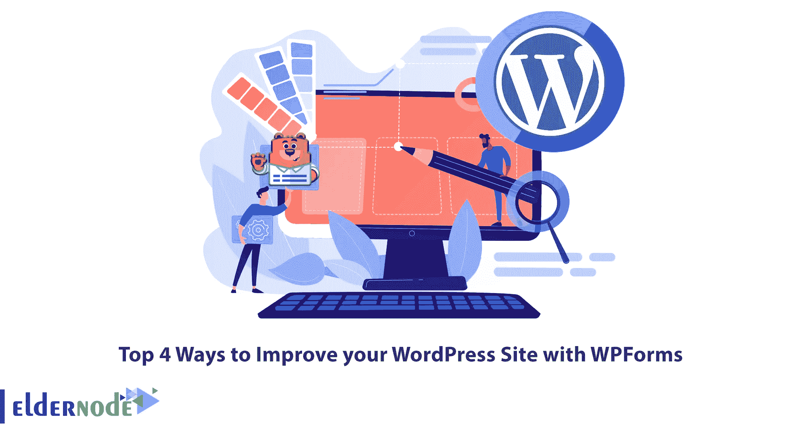
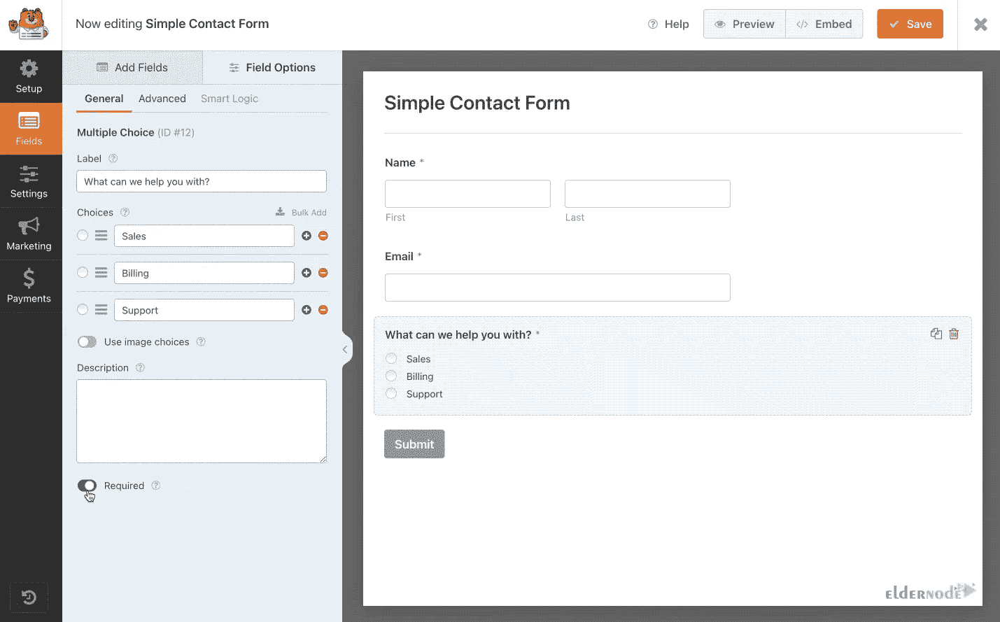

# 用 WPForms 改进你的 WordPress 站点的 4 大方法

> 原文：<https://blog.eldernode.com/4-ways-to-improve-wordpress-with-wpforms/>

表单是从用户那里收集信息的主要工具之一，通过它可以向网站提供有用的信息。它有助于网站管理员拥有一个关于用户及其兴趣的丰富数据库。WordPress 是能够在其他系统和优秀的专业插件出现之前发展这些工具的系统之一。这个领域中最著名和最流行的插件之一是 WPForms 插件。这篇文章将教你如何用 WPForms 改进你的 WordPress 站点。 [Eldernode](https://eldernode.com/) 网站提供经济实惠的 [VPS](https://eldernode.com/vps/) 套餐，如果你打算购买，这可能是最好的选择。

## **如何用 WPForms 改进你的 WordPress 站点**

WPForms 是一个用于 WordPress 网站的拖放式表单生成器。它被认为是最入门级的联系人表单插件。因为您还可以轻松地为您的站点创建漂亮的联系表单、订阅表单、支付表单和其他类型的表单，而无需编写代码或雇用开发人员。该插件于 2016 年推出，受到了博客、企业主、设计师和开发者的欢迎。WPForms 插件有专业版和免费版。WPForms 插件的免费版本，也称为 WPForm Lite，能够为您的站点实现所有需要的表单。

### **1-创建自定义字段**

WPForms 有许多字段类型，允许您轻松创建和填写表单。每个 WPForms 字段都有一组内置控件，允许您构建满足特定需求的表单。您可以使用许多选项来自定义表单中的字段。此外，您可以使用表单生成器添加、删除和编辑字段。

### **2-设置邮件通知**

设置接收通知和信息的电子邮件地址。这意味着，如果你设置了电子邮件通知，你可以从你的电子邮件中收到所有的信息。您将提供一个电子邮件地址，通知电子邮件将被发送。此外，它允许您配置多个电子邮件地址。为此，请用逗号分隔每个电子邮件地址。

### **3-整合社交媒体**

如果你将 WPForms [插件](https://blog.eldernode.com/most-important-wordpress-plugins/)整合到社交网络中，网站流量会增加。将社交网络添加到 WPForms 插件非常简单，并且对改进你的 WordPress 站点有很大帮助。这将允许你在侧边栏、文章下方或文章之前显示社交图标。你可以选择在你的 WordPress 站点上显示它们的位置。

### **4-添加多个联系人表单**

如果您想在有人填写您的表单时向多人发送通知，您可以使用 WPForms 插件来完成。使用 WPForms，很容易定制谁接收什么消息。在 WPForms 插件的帮助下，您可以创建不同类型的表单，如简单的联系表单、调查表单、员工信息表单，以及几乎任何您想要的东西。

## 结论

WPForms 是一个 WordPress 插件，可以让你轻松创建网站联系表单。它有一些有用的功能，可以改善你的 WordPress 网站，让你的企业在网上赚更多的钱。在这篇文章中，我们教了你 4 种用 WPForms 改进你的 WordPress 站点的方法。我希望这篇教程对你有用，并帮助你改进你的 WordPress 站点。如果您有任何问题或建议，可以在评论区联系我们。