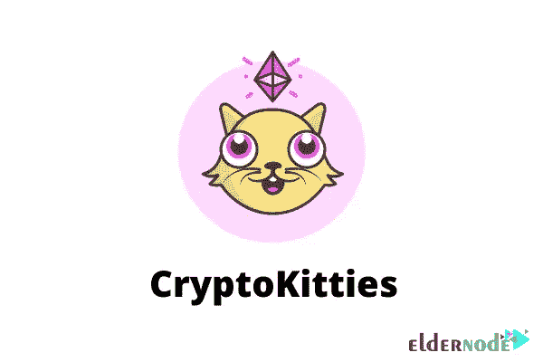

# 5 个交易替代硬币的最佳 NFT 机器人- Eldernode 博客

> 原文：<https://blog.eldernode.com/5-best-nft-bots-for-trading-altcoins/>

NFT 机器人将购买你想要的数字文件，直到它们被出售。然后你可以在二级市场上以更高的价格出售它们。有趣的是，如果你花时间在正确的市场上销售，你可以通过这些机器人获得大量利润。在这篇文章中，我们将向您介绍 5 个最好的交易替代硬币的 NFT 机器人。还需要注意的是，您可以 [**购买**](https://eldernode.com/vps/) **[Eldernode](https://eldernode.com/) 网站上提供的 VP**进行自己的交易。

## **一些交易山寨币的 NFT 机器人**

在这篇来自[营销](https://blog.eldernode.com/tag/marketing/)培训系列的文章的续篇中，我们将向您介绍一些用于交易替代硬币的 NFT 机器人。

### **1)隐猫**

[CryptoKitties](https://www.cryptokitties.co/) 是一种区块链游戏，允许用户收集可爱的卡通猫，并最终在一个特殊的平台上进行买卖。这款游戏在用户群体中的受欢迎程度如此之高，以至于在它发布的时候，以太坊网络非常慢。这个游戏的发行增加了很多，带来了超过一百万美元的金融交易。

这款游戏由一家名为 Axiom Zen 的区块链公司开发，是一款以娱乐为目的的 DAPP。该游戏因其有趣的角色而非常吸引人，但该游戏的目标是证明区块链在提高安全级别和简化数字资产交易方面的效果和潜在应用。这个游戏的主要焦点是支付，这就是为什么这个游戏的开发者相信通过扩展他们的视野，他们会更好地了解区块链能做什么。

#### **基于以太坊网络的平台**

大多数区块链的项目都是用数字货币发布的，这是一种具有功能价值的交易代币，可以用来交换各自公司的股份。提供代币已经成为资助创业公司最成功的工具之一，在很多情况下，这个项目的预算已经超过了数百万美元。

Cryptokitties 游戏平台基于[以太坊](https://blog.eldernode.com/introducing-ethereum-and-get-a-vps-with-it/)网络，因此通过智能合约，它管理所有基于 CryptoKitties 的创建和交换的工作。因此，没有任何力量直接负责中央监督和控制你们的资产。每一个拥有代币的人，小猫也是为他准备的，他可以保留代币或交换代币。

因为加密货币使用以太坊网络，所有的支付都是通过以太进行的。因此，使用传统货币购买 CryptoKitties 是不可能的，但这个项目的开发团队打算向其用户提供这一功能。

为了存储和维护这些类型的令牌，您需要一个可以在 web 浏览器上执行的以太坊钱包。

### **2)密码机器人**

我们将在本节中向您介绍的第二个机器人称为加密机器人。 [CryptoBots](https://cryptobots.me/) 是最受欢迎的 NTF 机器人平台之一。CryptoBots 是一个非常成功的平台，创建于 2014 年。需要注意的是，这个机器人向用户提供免费和付费账户。拥有免费账户的用户每天最多可以交易 100 美元，没有最低存款额。此外，拥有付费账户的用户每天最多可以交易 1000 美元，最低存款额为 50 美元。

创世纪是第一代机器人。这些机器人将在未来几年为所有未来一代的密码机器人释放基因。

以下是加密机器人的特征:

–X2 构建速度加快了新机器人的创建速度

–使用 BITS 代币奖励进行预发行投注

–+70%的生产限制，以生产更多的机器人

–为新玩家创建初始资源的第一代机器人

### **3)隐型丧尸**

我们将在本节中介绍的第三个机器人名为 CryptoZombies。 [CryptoZombies](https://cryptozombies.io/) 是一个创新的新机器人，让交易者只需玩玩就能赚钱。CryptoZombies bot 重要而有趣的一点是，使用这个 bot 不需要花钱。您只需要输入一次您的详细信息，然后您就可以开始赚取。CryptoZombies 是区块链发展最大的教育平台。CryptoZombies 是一个交互式学校，教你关于区块链的一切技术。需要注意的是，通过制作简单的游戏，你可以很容易地学会编写区块链程序。

CryptoZombies 主要专注于以太坊和 Solidity 开发，但对其他连锁店如币安、创甚至 Chainlink 等项目的内容有巨大的需求。

CryptoZombies 的一步一步的教程将带你通过坚实的基础，建立自己的全功能的区块链游戏。即使在第 1 课结束时，您也可以成为一名区块链开发人员。

### **4)密码本** 

NFT 是在区块链上运行的数字财产令牌，支持像以太坊这样的智能合约。请注意，NFT 是不可替代的，类似于现实世界中的合同，在现实世界中，您不能用一个合同交换另一个合同。我们将在本节中解释的第四个 NFT 机器人叫做 Cryptoticker。Cryptoticker 是 NTF 最受欢迎的交易机器人平台之一。Cryptoticker 允许用户轻松交易加密货币。用户还可以用它来跟踪各种替代硬币的价格走势。

### **【5】密码锁**

我们将在本节中解释的第五个 NFT 机器人名为 Cryptokitty。请注意，使用 NFTs 有几种不同的方式。NFT 可以用作收藏品、游戏，甚至是投资工具。大多数收集 NFT 的人这样做是因为拥有它们很有趣。但是，也有用户将 NFTs 作为一种投资。altcoin 交易更是如此。

## 结论

大多数 NFT 是以太坊区块链的一部分。然而，以太坊是一个区块链，支持 NFTs，通过可编程的“智能合约”存储附加信息。所以它们以不同的方式工作，就像买卖一枚 ETH 硬币。最后，有趣的是，不同的区块链可以实现他们自己版本的 NFTs，因为其他区块链提供了提高交易速度、规模和费用的新机会。在这篇文章中，我们试图向您介绍 5 个最好的交易替代硬币的 NFT 机器人。