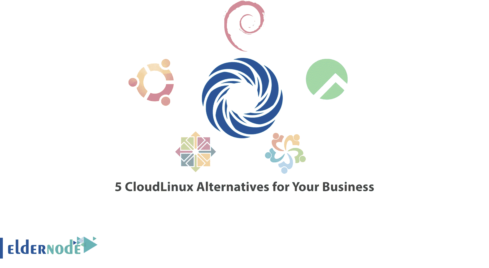

# 适用于您企业的 5 种云 Linux 替代方案

> 原文：<https://blog.eldernode.com/5-cloudlinux-alternatives-for-your-business/>

CloudLinux 是一个实用程序，它使 Linux 对于世界各地的主机和数据中心来说更加安全、稳定和有利可图。CloudLinux 使用现代技术使数据更接近服务器工具。通过这样做，您将能够监控性能。在本文中，我们将向您介绍适用于您企业的 5 种 CloudLinux 替代方案。如果你想买一台 [Linux VPS](https://eldernode.com/linux-vps/) 服务器，你可以访问 [Eldernode](https://eldernode.com/) 网站上提供的套装。

## **cloud Linux 简介**

## **适合您业务的云 Linux 替代品**

**在本文的其余部分，请和我们一起介绍 CloudLinux 的 5 种替代方案。**

### ****①厘斯****

**一个 [Linux](https://blog.eldernode.com/tag/linux/) 发行版是一套随 Linux 内核发布的软件。通常，Linux 发行版包括 GNU 工具链。因此，有些发行版被称为 GNU/Linux 发行版。**

**从这个意义上说，CentOS 和 RHEL 是 GNU/Linux 发行版。然而，现代 Linux 发行版包含了许多 GNU 内核和工具链之外的程序。**

**目前，CentOS 是虚拟主机和 vps 服务器行业中最流行的 Linux 发行版之一。由于 Cent OS 与 RHEL 的二进制兼容性，它与大多数 Linux 软件高度兼容。大多数主机控制面板使用 CentOS 作为顶级专用服务器 Linux 发行版。**

****CentOS 的特征****

**当您考虑使用 CentOS 作为您的虚拟主机或网络服务器时，有许多优势可供您使用。这些功能包括:**

**1.安全**

**2.广泛的支持**

**3.包装管理**

**4.拥有广泛的论坛和文档社区**

**5.对管理面板的支持**

### ****2)Ubuntu****

**与专有软件不同，Ubuntu 是一个拥有数百万用户的开源免费操作系统。这意味着用户可以修改它的代码，创建和安装任意数量的副本，并在任何地方进行必要的定制。还有一点就是使用 Ubuntu 不需要付费购买许可证。**

**事实上，Ubuntu 是一个流行的操作系统，你可以在你的 PC 或 Linux VPS 上使用。这是一个庞大的项目，它帮助世界上数百万人在各种设备上运行由免费和开源软件构建的机器。**

****使用 Ubuntu 的优势****

**使用 Ubuntu 的原因有很多，但以下是最重要的几个:**

**这个程序是免费和开源的。**

**2-易于安装和测试。事实上，你不需要成为安装它的专家。**

**3-它漂亮、时尚且用户友好。**

**4-它稳定而快速，在现代计算机上通常不到一分钟就能加载完毕。**

**5-它不包含任何重要的病毒，对有害的 Windows 病毒免疫。**

**6-它是受支持的，你可以从全球 FOSS 社区和 Canonical 获得你需要的所有备份和指导。在 Linux 操作系统的不同版本中，Ubuntu 得到的支持最多。**

### ****3)德比安****

**Debian 是 Linux 操作系统中最古老、使用最广泛的免费发行版之一。这个操作系统可以在网络的服务器和个人电脑上看到。**

**这种操作系统的简单安装是它受欢迎的另一个原因。选择安装语言、国家、网络、域、分区、根用户密码、创建完整的用户名、密码以及标准和桌面选项是为此需要采取的唯一步骤。**

**Debian 能够在许多不同架构的处理器上运行、安装和操作。这些体系结构从个人计算机中使用的 Intel 和 AMD 的 32 位和 64 位版本到 ARM 和 IBM 的 Z 系列 eServer 大型计算机。**

**图形化和对用户有吸引力的环境是这个操作系统的另一个吸引人的特点。GNOME 桌面环境包括许多应用程序。这些程序包括 OpenOffice.org，Iceweasel，Evolution 电子邮件系统，刻录 CD 和 DVD，播放音乐和视频，查看照片，编辑文本和查看 PDF 文件的程序。**

**Debian 的优势**

**Debian 是一个重要而强大的 Linux 发行版，具有非常高的稳定性和稳定性，可以在操作环境中为你提供一个安全的平台。Debian 的一些特性是:**

**1-非常稳定**

**2-耐用**

**3-与服务器兼容**

**4-强大的支持**

**5-打开文本**

### ****4)洛基 Linux****

**Rocky Linux 是一个开源的企业操作系统。这个操作系统被设计成与 Red-Hat Enterprise Linux 完全兼容。Rocky Linux 操作系统的目标是企业，通过定期更新和 10 年的支持生命周期提供完全的稳定性。由于对该项目的长期投资，该项目将留在社区中是有保证的。由于提供了免费且易于使用的迁移脚本，您可以轻松地从其他 Linux 发行版迁移到 Rocky Linux 操作系统。**

****洛基 Linux 的优势****

**1-得到支持团队的信任**

**2-可持续性**

**Rocky Linux 与 RedHat Enterprise Linux 的兼容性**

**4-易于迁移的可能性**

**5-二进制和开源**

### ****5) AlmaLinux****

**自从红帽宣布 2021 年底不开发 CentOS 8 操作系统的消息后，许多人对该公司为了专注于 CentOS Stream 而停止开发 CentOS 8 的决定表示不满。与此同时，开发人员社区为它想到了一个替代方案。**

**为了满足这一需求，维护 CloudLinux 发行版(一个商业发行版)的 CloudLinux 公司在支持社区的支持下构建了 AlmaLinux，作为 CentOS 的有效替代方案。**

**AlmaLinux 是 Redhat Enterprise Linux 或 REHL 的对等二进制分叉。这个发行版是稳定发布版，并且这些包被放在稳定更新中，这比滚动发布版更适合服务器。**

****alma Linux 的优势****

**AlmaLinux 操作系统的一些显著特性是:**

**1-易于使用**

**2-易于安装**

**3-免费**

## **结论**

**CloudLinux 操作系统是为共享主机提供商设计的。操作系统将每个客户端隔离在一个单独的“轻型虚拟环境”(LVE)中，该环境对内存、CPU 等服务器资源进行分区、分配和限制。在本文中，我们试图为您的企业介绍 5 种 CloudLinux 替代方案。如果你有任何问题，你可以在评论区和我们分享。**