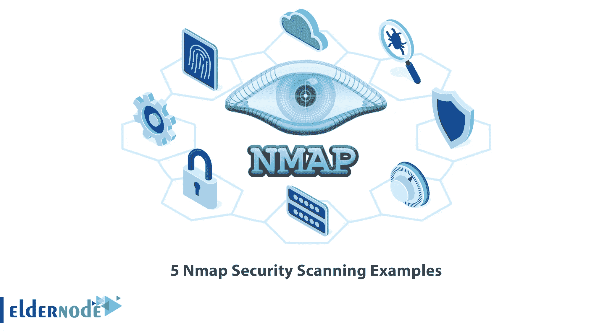

# 5 Nmap 安全扫描示例- ElderNode 博客

> 原文：<https://blog.eldernode.com/5-nmap-security-scanning-examples/>



如今，网络攻击增加了，组织和公司应该定期进行网络安全扫描。为此，有许多监测工具和软件，Nmap 是最好的监测工具之一，没有什么可以取代它的有用和实用的功能。本文将向您介绍 **5 个 Nmap 安全扫描实例**。如果你想购买一台 [**Linux VPS**](https://eldernode.com/linux-vps/) 服务器，你可以查看 [Eldernode](https://eldernode.com/) 网站上提供的软件包。

## **介绍 Nmap 安全扫描**

### **什么是 Nmap？**

[Nmap](https://blog.eldernode.com/install-nmap-on-linux/) 代表网络映射器，是一个开源的多功能 [Linux](https://blog.eldernode.com/tag/linux/) 命令行工具，用于安全审计和网络探测。您可以使用 Nmap 来自动化许多重复的和预定的任务，例如程序监控和服务更新，它是由 Gordin Lyon 开发的。此外，网络管理员使用此工具来探索网络、网络审计、查找开放端口和执行安全扫描。

Nmap 收集网络细节并确定系统中的安全漏洞。它是独立于操作系统的，可以在许多流行的操作系统上运行，比如 Linux、Windows、Mac 和 BSD。

## **2022 年 5 个 Nmap 安全扫描实例**

本节包括 [Nmap](https://blog.eldernode.com/tag/nmap/) 安全扫描示例。为了节省带宽，每天对该主机的扫描不应超过 12 次。

1.您可以使用下面的命令**扫描**scanme.nmap.org**机器上所有保留的 TCP 端口**:

```
nmap -v scanme.nmap.org
```

**-v 选项**用于启用详细模式。

2.如果您想**对 Scanme 所在的 24 规模网络上的 256 个 IP 中的任何设备启动秘密 SYN 扫描**,或者确定每个正在运行的主机上运行的是什么操作系统，请使用以下命令:

```
nmap -sS -O scanme.nmap.org/24
```

***注意:*** 你要用 root 权限扫描 SYN，检测操作系统。

3.以下命令在 198.116.0.0/16 地址空间中 255 个可能的 8 位子网的前半部分启动**主机枚举和 TCP 扫描**。此外，您可以使用此选项测试系统是否在其标准端口上运行 SSH、DNS、POP3 或 IMAP，或者在端口 4564 上运行任何内容:

```
nmap -sV -p 22,53,110,143,4564 198.116.0-255.1-127
```

对于每个打开的端口，您可以通过版本检测来确定正在运行的程序。

4.以下命令告诉 Nmap**随机选择 100000 台主机**和**扫描 web 服务器**(端口 80):

```
nmap -v -iR 100000 -Pn -p 80
```

**-Pn** 选项禁用主机枚举，因为首先发送几个探测来确定，因为当您无论如何只探测每个目标主机上的一个端口时，主机启动是一种浪费。

5.要**扫描 4096 IPs 中的任何 web 服务器**(不 ping 它们)并将输出保存为 grepable 和 XML 格式，请使用以下命令:

```
nmap -Pn -p80 -oX logs/pb-port80scan.xml -oG logs/pb-port80scan.gnmap IP_Server/20
```

就是这样！

## 结论

您可以使用 Nmap Linux 命令行工具扫描网络中的 IP 地址和端口，并检测已安装的应用程序。在本文中，我们介绍了 Nmap，并解释了 5 个 Nmap 安全扫描示例，从简单到稍微复杂和深奥。我希望你喜欢这个教程。如果你面临任何问题或者有任何疑问，可以在评论区联系我们。