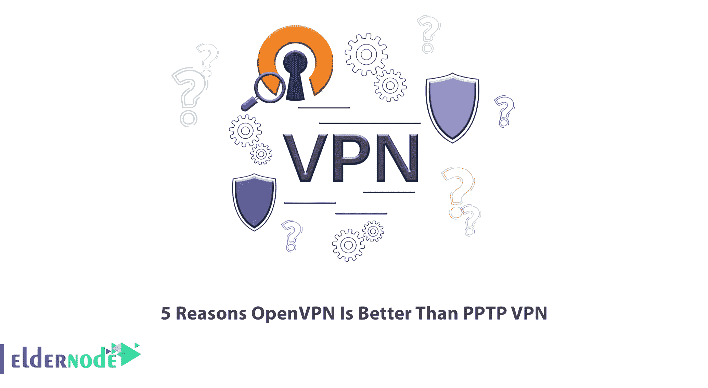

# OpenVPN 优于 PPTP VPN 的 5 个理由

> 原文：<https://blog.eldernode.com/5-reasons-openvpn-is-better-than-pptp-vpn/>

在当今的现代和在线世界中，VPN 协议是普遍使用的。互联网正成为我们生活中必不可少的一部分；在它的帮助下，你可以从你的工作场所连接到世界的另一个角落。互联网最重要的部分是保护你的隐私。当你在没有任何 VPN 的情况下使用互联网时，间谍正在监视你。OpenVPN 和 PPTP VPN 都是 VPN 协议，本文将解释 OpenVPN 优于 PPTP VPN 的 5 个原因。如果你想购买自己的 [**VPS**](https://eldernode.com/vps/) **服务器**，可以查看 [Eldernode](https://eldernode.com/) 网站上提供的套装。

## **为什么 OpenVPN 比 PPTP VPN 好？**

VPN 可以隐藏你的真实身份，也可以加密你的数据。所以大部分人都用。如果你想保护你的敏感文件和维护你的在线隐私，你应该使用 VPN。使用 VPN 的另一个原因是绕过基于地理区域的限制来访问一些站点或服务。

OpenVPN 是由 OpenVPN 技术公司开发的用于建立 VPN 连接的最先进的协议。您可以通过第三方客户端在所有主要设备上使用 OpenVPN。该协议可以使用 TCP 和 UDP 端口，是安全和绕过地理块和防火墙的最佳选择。PPTP VPN 是一种连接专用网络的方法，代表点对点隧道协议。它受大多数 VPN 提供商的支持，由微软开发。该协议通过安全的互联网连接为 VPN 提供服务器访问，并且比其他协议更容易设置。

### **1- OpenVPN 提供最高的安全性**

与 L2tp 等其他基于 IPSec 的隧道协议不同，OpenVPN 依靠 SSL/TLS 进行数据认证和加密。在 [OpenVPN](https://blog.eldernode.com/setup-an-openvpn-server-on-ubuntu-22-04/) 中，使用数字证书对数据进行认证。这种标准安全技术创建了从一个位置到另一个位置或从一点到另一点的安全连接。

PPTP VPN 使用 MPPE 来支持 RC4 加密，并且具有各种安全漏洞。它将通信和发送的数据置于被安全组织泄露的风险中。事实上，它提供了基本的安全保障。如果你的连接安全对你很重要， [OpenVPN](https://blog.eldernode.com/set-up-openvpn-debian-10/) 是个不错的选择。

### **2-它提供了最高的性能**

OpenVPN 提供了高性能，并有配置选项，允许您定制它以获得更高的速度或性能。TCP 上的这种协议提供了比 UDP 更快的速度。事实上，OpenVPN 比 PPTP VPN 更一致，并且具有快速恢复不稳定连接的能力。

### 3- OpenVPN 与大多数操作系统兼容

OpenVPN 适用于大多数操作系统，包括 Windows、Mac OS X、Linux、Android、iOS、OpenBSD、Solaris、FreeBSD 等。但是 PPTP VPN 内置于台式电脑、平板电脑和移动设备中。它支持 Android，Windows，iOS，Linux，macOS，DD-WRT，番茄等。该协议很难在少数路由器上设置。

### **4-使用 OpenVPN 不需要付费，因为它是免费的**

OpenVPN 是免费的，不需要付费。不管需要什么平台，这个程序都可以在不同的操作系统上免费运行，比如 Android，Windows，Mac 等等。您可以使用 OpenVPN 免费连接到 VPN 服务器。另一方面，你必须支付少量费用才能使用 PPTP 虚拟专用网。但你不必为它购买额外的硬件或安装其他功能。

### **5-比 PPTP VPN** 拥有更多的支持选项

OpenVPN 比 PPTP VPN 有更多的支持选项。例如，它有自己的网站，用户可以在那里找到帮助和教程，但 PPTP VPN 没有这样的选项。可以从其[官网](https://openvpn.net/community-downloads/)下载 OpenVPN。

## 结论

PPTP 虚拟专用网有很多缺陷。OpenVPN 在注重隐私的互联网用户中是一个流行的协议选项，它应该出现在每个设备上。在本文中，我们解释了 OpenVPN 优于 PPTP VPN 的 5 个原因。我希望这个教程对你有用。如果您有任何问题或建议，可以在评论区联系我们。