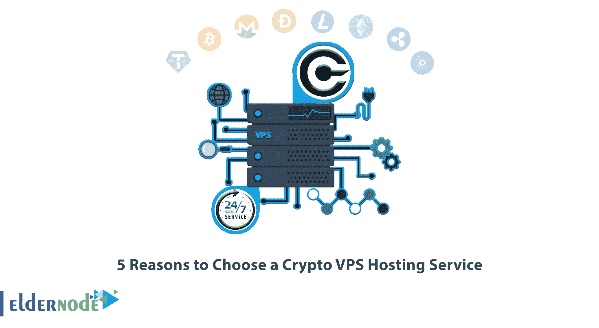
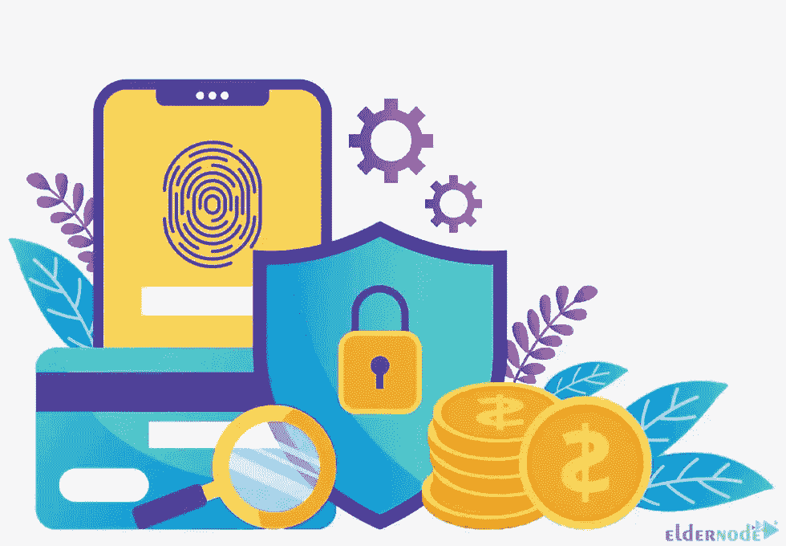
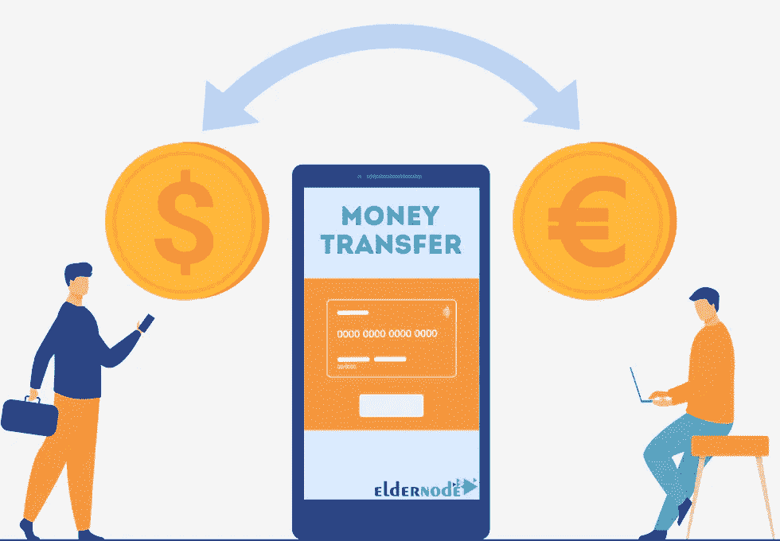
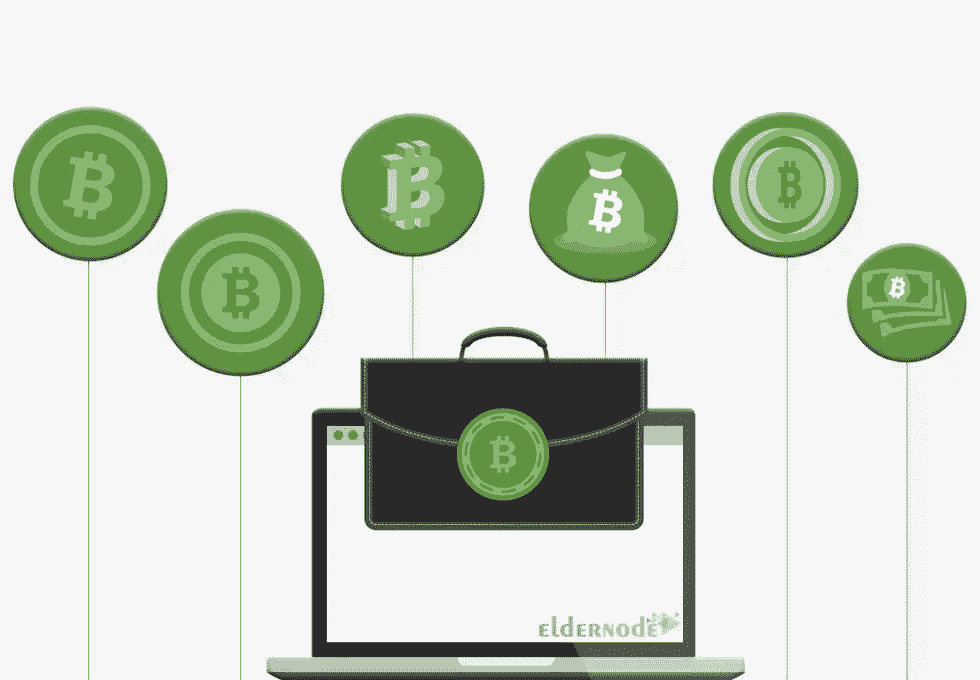

# 选择加密 VPS 托管服务的 5 个理由

> 原文：<https://blog.eldernode.com/5-reasons-to-choose-a-crypto-vps-hosting/>

当你决定创业的时候，你要考虑很多方面。包括购买一个可靠的虚拟专用服务器，让您可以完全控制和根访问您的系统。最安全的 VPS 托管类型之一是加密 VPS 托管。这篇文章将向你介绍选择加密 VPS 托管服务的 5 个理由。

## **介绍 Crypto VPS 托管服务**

密码或加密货币是基于区块链技术并以虚拟或数字形式存在的任何形式的货币。它使用密码术来保护交易，并且是在许多开发者的支持下开发的。加密货币使用分散系统来记录交易和发行新单位。他们没有一个中央发布或管理机构。以加密货币为核心的支付系统保护您的身份。

### **Crypto VPS 托管可以保持一定程度的隐私**

如果使用[托管](https://eldernode.com/bitcoin-vps/)的加密货币 VPS，就不需要在金融机构注册账户，这样就保护了隐私。否则，您应该提供信用卡、身份验证、实际地址、电子邮件验证等信息来订购 VPS 主机。您在加密货币中进行的交易在区块链中有一个标识符，即您钱包的地址。他们没有关于你的信息。你可以使用你的钱包地址一次，你应该注意不要泄露你的地址。但是如果有人获得了你的加密钱包的私钥，他们就可以访问你的资金。

### **Crypto VPS 托管允许跟踪交易历史**

加密货币交易记录在一个公开发行的区块链账本中，你可以用它来跟踪交易的历史。加密区块链记录了网络上的每一笔交易。您可以使用一些工具来搜索交易数据，并通过在任何比特币区块链浏览器中搜索您支付的钱包地址来检查交易历史。这可以减少欺诈交易。

### **使用方便，提供直接兑换，无需中介**

加密货币是点对点的，减少了第三方参与的需要。这意味着区块链的技术为他们提供了动力，这将排除银行等中介机构。由于这个原因，交易双方之间的加密货币转移更快。没有支付处理费用。通过使用您的加密货币钱包发送和接收付款，您可以轻松使用托管的 [Crypto VPS。您应该选择和使用与您选择使用的加密货币兼容的钱包。](https://blog.eldernode.com/how-to-buy-linux-vps-bitcoin/)

### **任何人都可以使用 Crypto VPS 托管**

你可以使用加密 VPS 主机，即使你不是一个技术大师，不了解这项技术。加密货币可以在世界任何地方进行交易。购买加密 VPS 主机只需选择你的加密钱包，从交易网站购买你想要的加密，最后选择加密支付方式购买 VPS 主机。

### **Crypto VPS 主机拥有 24/7 支持**

Crypto VPS 主机没有工作时间和周末。它一年 365 天，一周 7 天，一天 24 小时都可以使用，你不会错过任何付款。加密市场分布在一个分散的计算机网络中，而不是像股票和商品那样受监管的交易所。

## 结论

加密货币是货币的数字版本。可以使用[以太坊](https://blog.eldernode.com/introducing-ethereum-and-get-a-vps-with-it/)、Litecoin、Dogecoin、Monero、Tether 等从 Eldernode 网站购买 VPS 主机。在这篇文章中，我们向您介绍了选择加密 VPS 托管服务的 5 个理由。我希望这个教程能帮助你选择加密 VPS 主机，你会发现它很有用。如果您有任何问题或建议，可以在评论区联系我们。