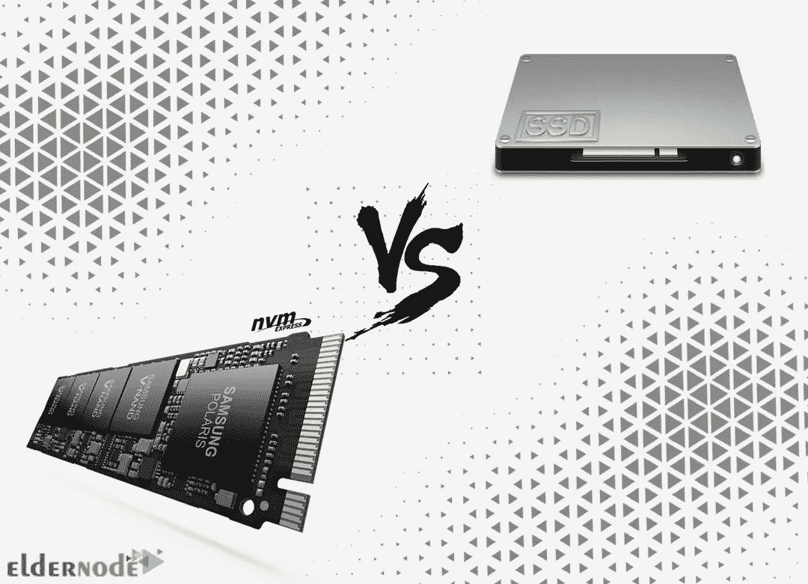
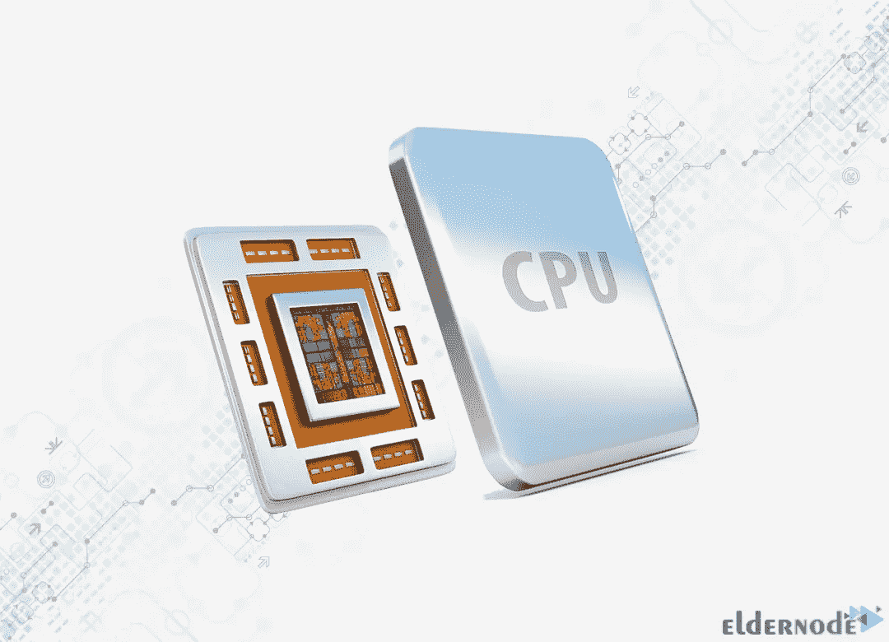

# 选择 Windows VPS 托管计划的五大理由

> 原文：<https://blog.eldernode.com/5-reasons-to-choose-a-windows-vps-hosting/>

VPS hosting 代表虚拟专用服务器，使用虚拟化技术将一个强大的服务器划分为多个虚拟服务器。每台 VPS 服务器都有自己的 CPU、RAM 和存储器。VPS 提供了根据您的业务需求配置您的环境的灵活性。根据服务器使用的操作系统，VPS 托管可以分为两种类型，即 Linux VPS 托管和 Windows VPS 托管。如果你觉得很难选择一个可靠和便宜的 Windows VPS 主机，你可以从这个教程中得到帮助。本文将向您介绍选择 Windows VPS 托管计划的**五大理由。如果您打算购买自己的 **[Windows VPS](https://eldernode.com/windows-vps/)** 服务器，请查看 [Eldernode](https://eldernode.com/) 网站上提供的软件包。**

## **介绍选择 Windows VPS 托管方案的理由**

Windows VPS 主机是一种使用 Windows 界面和 Windows 服务器管理的操作系统。您可以在 Windows VPS 服务器上安装您自己的自定义软件，并根据您的业务需求使用它。如果您的业务需要您一天 24 小时在线或安装自己的软件，那么 [Windows VPS 服务器](https://eldernode.com/windows-vps/)是您的好选择，因为它没有预装程序。它允许您在网站的任何领域使用 Windows VPS。

### **Windows VPS 托管功能**

让我们列出 Windows VPS 托管的主要功能:

–云托管

–价格合理

–高性能

–确保您网站的安全性

–提供对服务器的高级访问

在这篇来自 [Windows 培训](https://blog.eldernode.com/tag/windows/)系列的文章的续篇中，我们将讨论选择 Windows VPS 托管的原因。

## **2022 年选择 Windows VPS 托管的 5 个理由**

[Windows VPS 托管](https://eldernode.com/windows-vps/)是在一台服务器上运行多个站点的一种经济实惠的方式。它也易于设置和管理。在这一部分，我们将讨论有助于您选择 Windows VPS 托管计划的原因。

### **1-更快的带硬盘(SSD 或 NVMe)的服务器**

**NVMe 硬盘**是硬盘和计算机硬件中的一种新型架构，通过放置在 PCI Express 端口中为系统创造了极高的速度。这些硬盘提供的速度比其他硬盘高得多，而且这些硬盘使用的技术也非常先进，被认为是计算机世界的成功标准。NVMe 的高功率使得在硬盘上读写信息的速度极高。

**SSD 硬盘**是老 HDD 硬盘的更新技术。事实上，SSD 硬盘被认为是一种使用 USB 闪存技术的固态硬盘。这些硬盘的能耗低得多，并且更能抵抗溢出和功率波动。它使用控制器执行读写操作，该控制器是 SSD 硬盘的主控制器。SSD 不需要进行碎片整理，这些硬盘驱动器的结构也完全不会变慢。

### **2-位置**

当选择 Windows VPS 托管位置时，您应该注意的第一件事是服务器位置是否靠近您的国家。您的国家与服务器所在国家之间的距离越小，数据包通过互联网传输的速度就越快，延迟就会减少，连接质量也会更好。

另一点你在选择地点时要注意的是你的目标用户来自哪个国家。要设置只在一个国家工作的本地服务器，您需要从同一个国家获得服务器。在这种情况下，对于目标用户来说，站点的加载速度会更快。但是为了建立一个国际化的网站，你需要从一个硬件最好、故障最少的地方获得服务器。

### **3- Windows VPS 操作系统**

在选择 Windows VPS 操作系统时，可以使用 Windows Server 2012、Windows Server 2016、Windows Server 2019、Windows 10。Windows Server 操作系统的第六个版本是 Windows Server 2012 R2 版。此版本的 Windows Server 基于 Windows 8.1。

Windows Server 2016 是 Windows Server 的第七个版本，是 Windows NT 系列操作系统的一部分。该操作系统是 Windows Server 2012 R2 版的继任者。它有各种内部服务，高安全性和运行重型软件的能力，以提供更好的服务。

Windows Server 操作系统的第八个版本是 Windows Server 2019。该版本的 Windows server 接替了 Windows Server 2016，比前几代更快、更安全、更完整、质量更好。它托管不同的 Windows 软件，其中的一些附加服务已被新服务取代。

Windows 10 是一系列操作系统，是 Windows 8.1 的继任者。软件的流畅运行，Windows 10 的最优性能，图形或分析软件的快速执行，其性能都是可以提及的积极点。

### **4-为多个网站提供更多空间**

选择 Windows VPS 托管服务的最大优势之一是，与共享虚拟主机服务相比，你可以使用更多的空间。这意味着，当您向帐户添加更多站点时，您不必担心磁盘空间不足。

#### **A- CPU**

CPU 代表中央处理器，是每个数字设备的基本组件之一。它监督所有排队的进程，并以最快的方式逐一执行它们。每个内核一次可以处理一个进程。多核处理器可以并行处理多个计算指令。服务器中需要的处理器内核数量与您打算在服务器上运行的操作类型直接相关。一些操作使用 2 个内核运行良好，而一些较重的处理需要 4 个 CPU 内核。核心的数量使得程序的工作范围更广，效果更好。例如，电子邮件服务器可以使用 4-8 个内核，甚至更多内核来提高性能。

#### **B 带宽**

在[购买 VPS](https://eldernode.com/vps/) 时，估算网站所需带宽是最重要的事情之一。带宽是对进出 VPS 的总位数的定量测量。每个进入你网站的访问者都会下载网站页面的所有组件。这些组件包括图像、CSS 和 HTML 代码以及 JavaScript 文件。服务器和用户之间的所有这些数据传输包括数据传输或带宽。如果你获得了 Windows VPS 的无限带宽，你可以在任何时间从任何地点远程访问服务器活动。

### **5-更好的安全与 24/7 支持**

因为你的数据存储在自己的分区上，你不必担心黑客会访问你网站的数据库。

此外，如果你正在寻找一个可靠的虚拟主机提供商，那么你应该考虑选择 Windows VPS 托管计划。有了我们全天候的支持团队，您将永远不必担心网站的技术问题。

## 结论

Windows VPS 服务器附带了增强的服务，如高内存、充足的存储空间、宽带宽等。在本文中，我们解释了选择 Windows VPS 托管计划的五大理由。如果你有任何疑问或问题，可以在评论区联系我们。我希望你喜欢这篇文章，它对你有用。