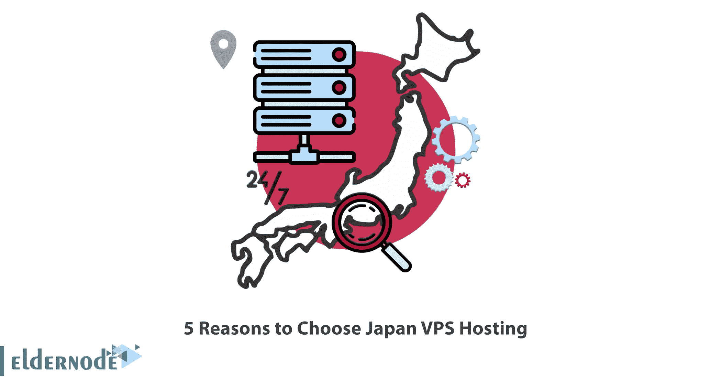
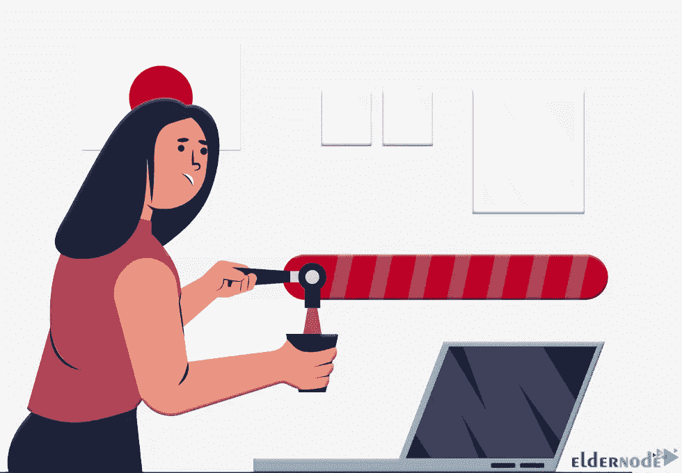
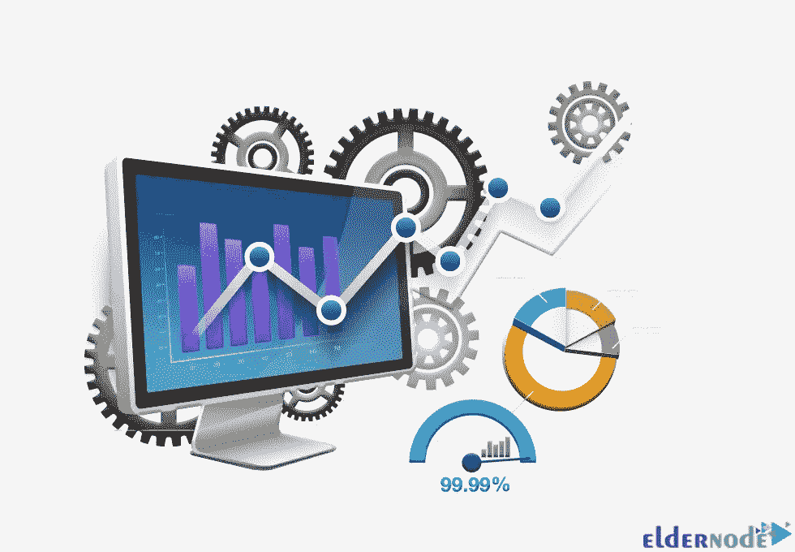
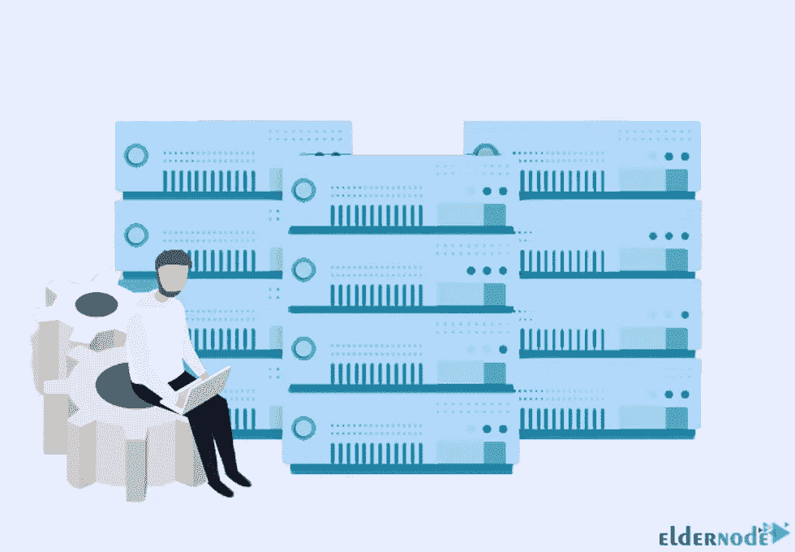
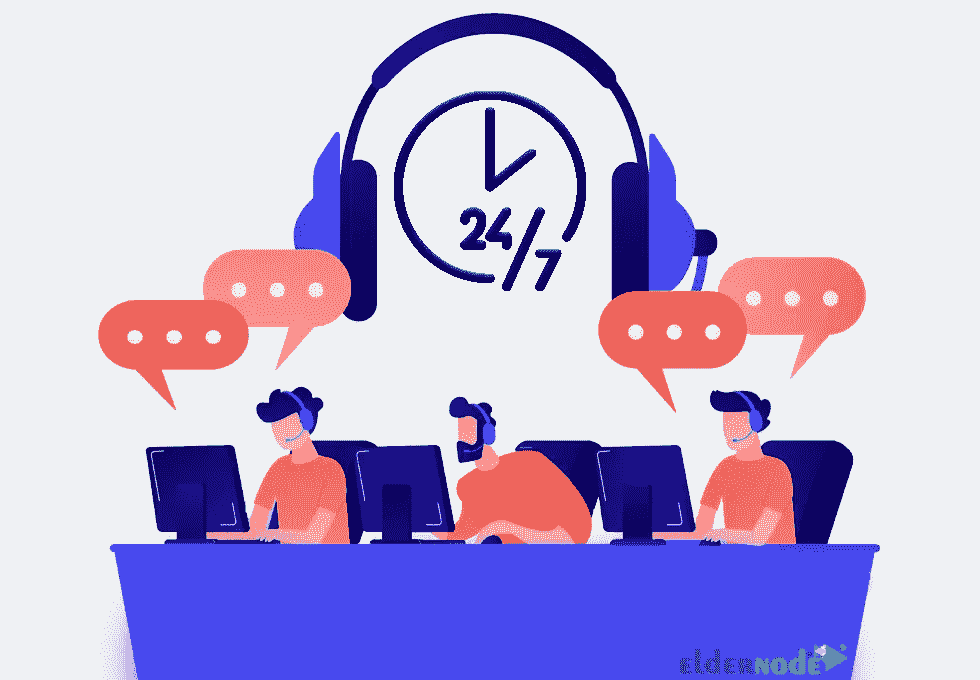

# 选择日本 VPS 主机的 5 个理由

> 原文：<https://blog.eldernode.com/5-reasons-to-choose-japan-vps/>

如果你想自己创业，你可以选择日本 VPS 主机。日本 VPS 帮助您更好地经营您的企业，并能解决您的所有问题。这篇文章将向你介绍选择日本 VPS 主机的 5 个理由。

## **介绍日本 VPS 主持**

VPS 或虚拟专用服务器是一个专用服务器，它使用虚拟化技术被分成几个虚拟服务器。这些部分在使用硬件方面是一样的，虚拟服务器的价格比其他服务器便宜。事实上， [VPS](https://eldernode.com/vps/) 只是服务器的一小部分。当你有了 VPS，虚拟服务器的所有空间都由你单独支配。但是网络和对服务器的访问是共享的。日本 VPS 主机是常规虚拟主机的发展，提供了更高的灵活性。

在这篇文章的继续，我们将讨论选择日本 VPS 主机的 5 个原因。

### **速度快**

在 [Eldernode 网站](https://eldernode.com/)上提供的日本 VPS 主机提供网络终极带宽和安全连接，为您的企业提供高速连接。这将有助于访问者获得最佳的用户体验。我们提供最高的[日本 VPS](https://blog.eldernode.com/how-to-buy-japan-vps-with-kvm/) 主机连接 1-10gb。无论您身在何处，都可以享受流畅的浏览体验。

### **99.9%的正常运行时间保证**

每个网站所有者都希望他们的网站总是对访问者开放。虚拟主机提供商通常在他们的服务条款中包含正常运行率保证。[正常运行时间](https://blog.eldernode.com/analyze-uptime-on-windows-server/)是服务可用的时间百分比。它让你知道虚拟主机服务有多可靠，以及你希望你的网站在大部分时间都能被访问者访问的频率。

我们可用的日本 VPS 主机有 99.9%的正常运行时间保证。这意味着它应该在 99%的时间里对用户可用。用户不可用的 1%是由于 DDoS 攻击、电源故障或其他不可预测事件导致的计划维护窗口或短暂中断。

### **高性能**

VPS 服务器性能就是你网站的加载速度。托管服务提供商，计划，以及你选择的位置对你的网站性能有很大的影响。亚洲地区性能最好的 VPS 服务器是日本。我们可用的日本 VPS 主机具有高性能，允许您利用日本的高速互联网连接。此外，它有助于您从您的网站获得更好的性能。

### **高可靠性**

用户可以从您选择的 VPS 托管服务中获得可靠性。您应该确保您将可以使用的服务器的可靠性水平，以便您可以大致猜测更新时间的水平。服务器的可靠性取决于服务器管理。我们的日本 VPS 主机有很高的可靠性。

### **我们专家团队的全天候支持**

**我们可用的日本 VPS 主机提供 24/7 的专门支持，这意味着一旦出现问题，您可以获得帮助并找到答案。Eldernode 网站上的售票系统和实时聊天一年 365 天、一周 7 天、一天 24 小时开放。这意味着您可以从我们的专家团队获得快速响应。**

****

## **结论**

**日本 VPS 主机是常规网络主机的发展，可以在虚拟化平台上运行。无论虚拟空间有多大，您都可以轻松管理它。在这篇文章中，我们介绍并解释了选择日本 VPS 主机的 5 个原因。希望这篇文章对你有用，对你有帮助。如果你有任何疑问或者有任何问题，可以在评论区联系我们。**