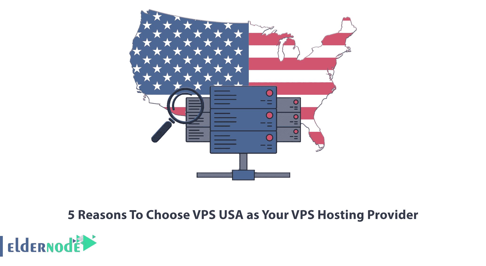
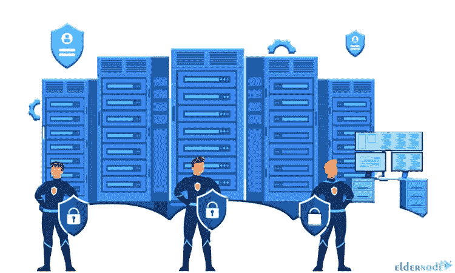
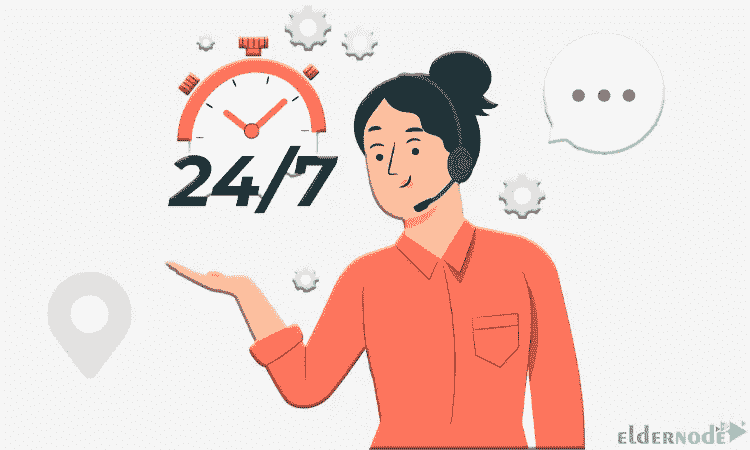

# 选择 VPS USA 作为您的 VPS 托管提供商的 5 个理由

> 原文：<https://blog.eldernode.com/5-reasons-to-choose-vps-usa/>

如今，在世界各地，拥有一个网站对所有企业都是必不可少的。因为信任虚拟空间并在网上购物和订购的人数每天都在增加。另一方面，对于国外的商家或身在国外的客户来说，拥有一个固定的、专属的国外 IP，本质上是有效的，对人的生意是积极的。吸引众多客户的国外 IP 之一是独家美国 VPS。这篇文章将解释选择美国 VPS 作为你的 VPS 主机提供商的 5 个理由。

## **选择美国 VPS 作为您的 VPS 托管提供商**

VPS USA 是指位于特定地理位置的虚拟服务器。这些服务器用于特殊情况下，用户需要显示他们的身份在该位置做事情，或者用于优化搜索引擎的网站和在目标国家更多地显示网站等主题。美国虚拟专用服务器有一个专用的 IP 地址，这个 IP 属于同一个国家。只要你更新你的美国 VPS 服务，IP 将由你支配，不会改变。

### **1-您的数据将安全存放在美国 VPS 主机**

只有你可以访问你的数据，这确保了信息的安全性。您可以设置防火墙来保护您的数据免受欺诈。防火墙可以阻止不必要的服务器连接，同时允许正常访问者访问网站。其他虚拟主机服务无法在其服务器上设置防火墙，容易受到攻击。在这种情况下，恶意软件可以攻击您的网站。在[美国](https://blog.eldernode.com/get-a-usa-vps-with-digital-currency/) VPS 服务器部件被隔离，这种情况不会发生。

此外，您可以使用 cPanel 病毒扫描程序等工具来检查和扫描您的 VPS 是否有恶意软件和病毒。用户可以通过选择 CDN 来避免黑客攻击。使用 CDNs，所有可疑和恶意的请求在到达主服务器之前被中间服务器识别和阻止。

### **2-美国 VPS 允许你扩展你的网站**

主机影响网站成长的一个重要特征就是可扩展性的程度。您可以随着业务的增长扩展您的服务能力，并且只需点击几下鼠标和额外的费用就可以增加[廉价美国 VPS](https://eldernode.com/usa-vps/) 中的资源。可伸缩性允许你不时地检查你的网站的性能，更有效地利用你的资源。

### **3-美国 VPS 速度快**

高正常运行时间的美国 VPS 对于关心系统和网站速度的人来说是一个很好的选择。它可在 Eldernode 网站上获得，并提供 1-10 千兆字节的最高美国 VPS 连接。此外，VPS 托管在美国提供安全的连接和网络终极带，你可以连接到您的业务与快速使用此 VPS。

### **4-它提供了使用管理计划** 的可能性

美国虚拟专用服务器提供了使用管理或非管理计划的可能性。非托管设计就像是你可以使用的部件，你最终必须将它们组合在一起，管理和配置这些部件的任务将由你来完成。但是在管理计划中，专家会为你做这些。出于这个原因，大多数人欢迎托管计划，我们在 Eldernode 网站上提供托管 VPS。

### **5-我们的专家团队提供全天候支持**

Eldernode USA VPS 提供 24/7 全天候专门支持。这意味着我们一年 365 天，一周 7 天，一天 24 小时回答您的问题。任何时候你面临任何问题或有疑问，我们的专家团队随时准备解决你的问题。如果您从我们这里购买 VPS，我们会提供不同的地点，包括:芝加哥、纽约、洛杉矶、迈阿密、西雅图和凤凰城。

## 结论

美国 VPS 是吸引众多客户的国外 IP 之一。在这篇文章中，我们解释了选择 VPS USA 作为您的 VPS 主机提供商的 5 个原因。我希望这篇教程能帮助你选择美国 VPS，并对你有用。如果你有任何关于购买 VPS 的问题，你可以在评论区联系我们。