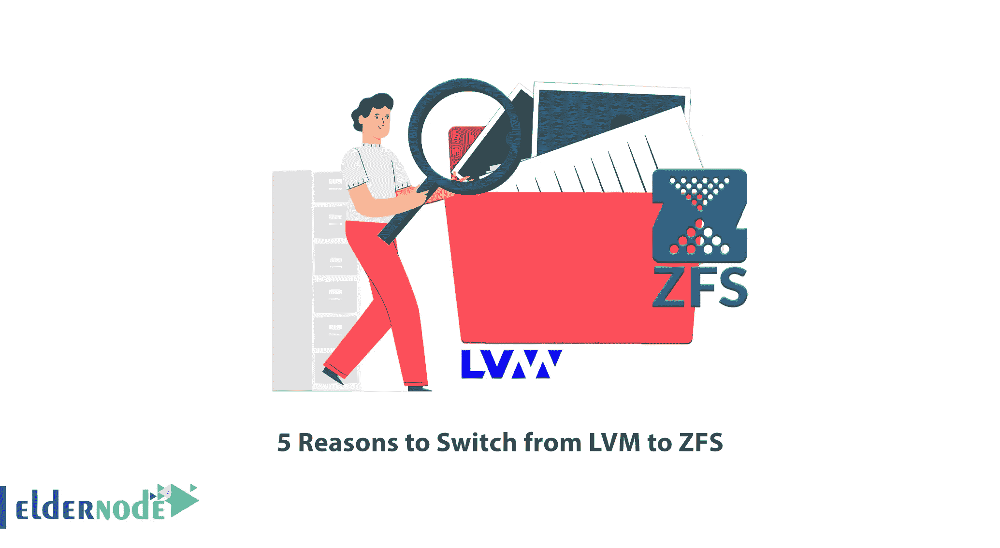

# 从 LVM 转到 ZFS 的 5 个理由

> 原文：<https://blog.eldernode.com/5-reasons-to-switch-from-lvm-to-zfs/>

文件系统是一个组织数据并检查信息如何在磁盘上写入和读取的系统。没有文件系统，你将不能做任何与文件相关的事情。有不同类型和数量的文件系统，它们在各个方面互不相同，这可以称为操作系统对该文件系统的支持。ZFS 和 LVM 也是文件系统的类型，这篇文章将向你介绍从 LVM 转到 ZFS 的 5 个理由。你可以查看 [Eldernode](https://eldernode.com/) 网站上提供的软件包，购买自己的 [Linux VPS](https://eldernode.com/linux-vps/) 服务器。

## **介绍 LVM&ZFS**

ZFS 代表 zettabyte 文件系统，是一个逻辑卷管理器和本地文件系统。太阳微系统公司创建了 [ZFS](https://blog.eldernode.com/install-zfs-file-on-centos-8/) 来指导和控制企业级计算系统中数据的放置、存储和检索。该文件系统支持写入时复制和卷管理器，它们具有强大的功能，并包括方便的功能，如快照和克隆。

LVM 代表逻辑卷管理，是存储虚拟化的一种形式。它用于系统中硬盘数量增加的情况，并在硬盘分区领域为您提供许多功能。这种文件系统允许操作系统在多个硬盘上集中、分布式或组合地创建和管理分区。

### **1-** **ZFS 比 LVM** 更容易管理

ZFS 的管理简单易行。它使用分层文件系统和自动 NFS 共享管理，从而可以轻松创建和管理文件系统，而无需使用多个命令或编辑配置文件。您可以轻松设置或调度、启用或禁用压缩。随时都有可能拍快照。

### **2-它集成了卷管理和文件系统**

ZFS 可以执行基本文件系统无法执行的各种与卷相关的任务。通常，它将卷管理与文件系统集成在一起。该文件系统为您提供数据文件管理，如分层存储和缓存管理、数据压缩和重复数据删除，以实现最高的操作系统速度和性能。

### **3-读写效率高**

ZFS 会自动写入文件系统中具有最多可用磁盘空间的区域。它的高级卷管理有助于提高读写效率。在 ZFS 的帮助下，文件系统知道底层的磁盘结构。当向池中添加更多磁盘时，这种意识允许现有文件系统自动增长。

### **4-它具有可扩展性和更好的性能**

ZFS 文件系统的一个关键设计元素是可伸缩性和更好的性能。文件系统本身是 128 位，允许 256 万亿兆字节的存储空间。所有元数据都是动态分配的，因此在分配或扩展之前不需要创建文件系统。目录可以有无限多的条目，文件系统的数量或者可以放入一个文件系统的文件的数量没有限制。

### **5-** **ZFS 镜像协议兼容较新的 SSD 设备**

镜像由多个设备组成，所有数据都写入所有成员设备。在镜像中，您需要在几个设备上工作，但是对于一批数据，所有注册的设备都可以访问一批数据。ZFS 和 LVM 都有镜像协议，但 ZFS 镜像协议可以顺利地与较新的 SSD 设备配合使用。这使得 ZFS 比 LVM 更受欢迎。

我们的网站提供经济实惠的 Linux VPS 包，如果你需要的话可以提供。

## 结论

ZFS 是一种新的文件系统，具有任何其他文件系统都不具备的功能和优势。在这篇文章中，我们解释了从 LVM 转到 ZFS 的 5 个原因。我希望这篇教程对你有帮助。如果您有任何问题或建议，可以在评论区联系我们。