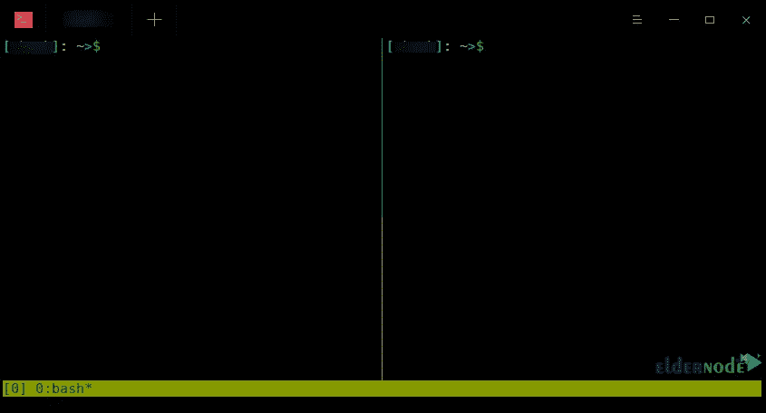
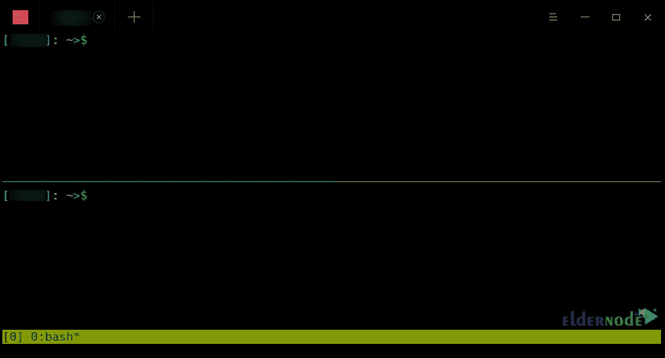

# 5 个 Tmux 快捷方式加快您的工作流程

> 原文：<https://blog.eldernode.com/5-tmux-shortcuts-to-speed-up-your-workflow/>

通过快捷方式使用 Tmux 要容易得多。Tmux 有许多您可以使用的快捷方式，学习一些快捷方式会非常有用。本文将向您介绍 5 种 Tmux 快捷方式来加快您的工作流程。如果你打算购买自己的 [VPS](https://eldernode.com/vps/) 服务器，你可以查看 [Eldernode](https://eldernode.com/) 网站上提供的软件包。

## **如何加快工作流程**

Tmux 是 Unix 操作系统的终端多路复用器。您可以从单个终端创建几个伪终端，并运行单独的进程或命令，同时预览输出。事实上，它允许你在同一个终端中创建多个窗口和窗格，并在一个终端中的多个程序之间轻松切换。这个终端会话将你的程序从主终端上解耦，以防止它们意外断开。

### **1-分割窗格**

Tmux 管理终端，为您提供方便。您可能经常需要在终端中同时运行几个命令，并同时监控命令的输出。Tmux 不需要打开多个终端窗口，而是允许您将一个终端分割成多个部分，在分割的终端中运行命令，并在一个终端中查看输出。要垂直拆分页面，请使用 **Ctrl+b+%** 键:

要水平分割页面，使用 **Ctrl+b+"** 键:

### **2-导航并选择一个窗格**

有三种方法可以在面板之间导航。第一种方法是按下 **Ctrl+b** 键，然后使用**箭头键**移动到所需面板。

第二种方法是使用快捷键 **Ctrl+b+o** 。每次完成后，活动面板会切换到下一个面板。

第三种方法是使用每个面板的编号。这种方法适用于在屏幕上同时打开许多面板的情况。

### **3-切换全屏放大/缩小窗格**

您可以使用 **Ctrl+b+z** 键放大特定面板或全屏显示面板。按下此组合键一次，活动面板将以全屏模式显示。如果您重复相同的命令，即 Ctrl+b+z，它将退出缩放和全屏模式。

### **4-关闭窗格**

如果您使用完一个窗格并打算永久关闭它，您可以使用 **Ctrl+b+x** 。此时，您将被要求确认，确认时，按下 **Y** 键，取消时，按下 **N** 键。

可以使用 **Ctrl+b+d** 暂时退出 Tmux 环境。这样，您将退出该会话，而不会关闭 Tmux 中打开的程序，也不会中断它们的执行。

### **5-创建和关闭窗口**

除了不同的面板，Tmux 还允许您创建不同的窗口，每个窗口可以包含几个窗格。按 **Ctrl+b+c** 创建窗口， **Ctrl+b+w** 查看窗口列表， **Ctrl+b+ &** 关闭窗口。你可以用 **Ctrl+b+n** 移动到下一个窗口，用 **Ctrl+b+p** 移动到上一个窗口。

## 结论

Tmux 是一个终端多路复用器，有许多快捷方式。在本文中，我们向您介绍了 5 种 Tmux 快捷方式来加快您的工作流程。我希望这篇教程对你有用，并帮助你找到 Tmux 快捷方式来加速你的工作流程。如果您有任何问题或建议，可以在评论区联系我们。