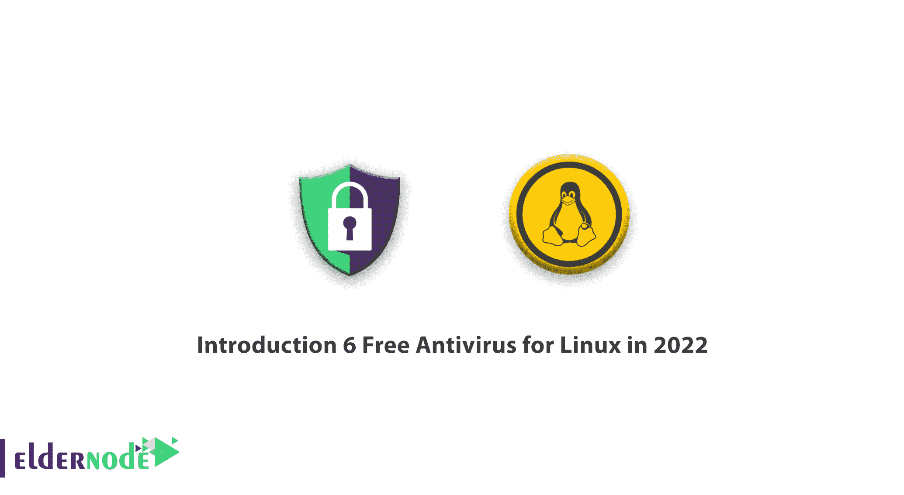
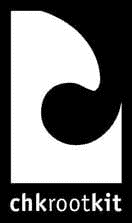
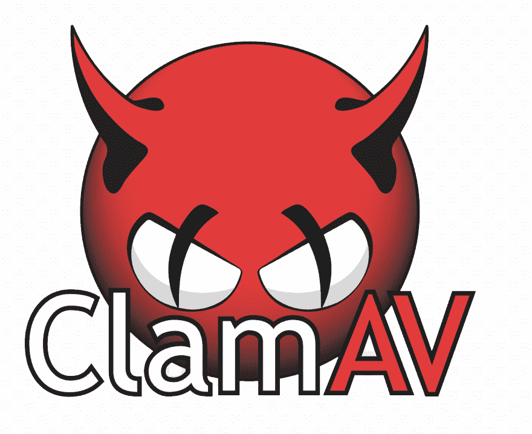

# 简介 6 2022 年 Linux 免费杀毒- Eldernode 博客

> 原文：<https://blog.eldernode.com/6-free-antivirus-for-linux/>

从 20 世纪 90 年代早期开始，反病毒被认为是计算机系统的强制和默认工具。随着时间的推移，随着网络罪犯的出现和更专业的黑客工具的发展，反病毒软件变得越来越复杂和先进。本文将介绍 2022 年 Linux 的 6 款免费杀毒。另外，如果你想购买一个 [**Linux VPS**](https://eldernode.com/linux-vps/) 主机，你可以访问 [Eldernode](https://eldernode.com/) 中可用的软件包。

## **2022 年 6 款 Linux 免费杀毒**

### **什么是杀毒？**

防病毒软件是一种工具，它可以监控个人电脑上的应用程序，并找出不应该安装在您的设备上的匿名应用程序。反病毒病毒使用各种方法来区分个人文件，如文本文件和恶意文件和应用程序。一些防病毒软件具有即时功能，可以自动阻止病毒和恶意软件运行。此外，他们甚至会阻止恶意网站浏览或打开包含恶意软件的电子邮件。属于修复工具类别的其他工具应该定期运行以扫描系统。事实上，它们是在系统被感染后才行动的。

## **Linux 服务器前 6 名免费杀毒**

### **1。chroot kit**

Chkrootkit 是免费和开源的，用于检测 rootkit 的存在。Rootkit 是 Linux 操作系统上的一个恶意程序，它在用户不注意的情况下控制了系统。这意味着 rootkit 可以执行文件和更改系统设置。chkrootkit 是一个流行的安全扫描器，帮助管理员检查他们的系统，并找出系统是否感染了 rootkit 恶意软件。你可以[从其官网下载 chkrootkit](http://www.chkrootkit.org/) 。

Chkrootkit 功能:

*   适用于多个 Linux 发行版
*   检测最新的 rootkits 和各种恶意软件和木马，如后门，TinyNDS
*   便携式轻量级程序
*   修改 wtmp 和 lastlog 文件，向管理员发出攻击警告

### **2。Rootkit 猎人**

Rootkit Hunter 是 Linux 操作系统上的一个小工具，它使用后门和其他本地实用程序来检测特洛伊木马和病毒。Rootkit Hunter 通过扫描文件的未指定更改来检测 Rootkit。你可以从官方网站下载 Rootkit Hunter。

Rootkit Hunter 功能:

*   便携、轻量和快速的程序
*   支持许多 Linux 发行版
*   使用命令行界面
*   使用 SHA-1 哈希比较来扫描和检测恶意软件

### **3。叫**

ClamAV 是用于 Linux 操作系统的开源命令行扫描程序，可以检测病毒、特洛伊木马、恶意软件和其他威胁。ClamAV 支持多种文件格式，并使用多线程扫描仪功能。可以从其官网[下载 ClamAV](https://www.clamav.net/) 。

ClamAV 功能:

*   支持多语言
*   支持兼容的 POSIX
*   可移植的免费程序
*   扫描多种文件格式和邮件网关
*   提供病毒数据库更新

### **4。sophos**

Sophos 是一款反病毒软件，它可以检测并清除各种 Linux 发行版中的病毒，包括特洛伊木马。Sophos 还检测和阻止可能存储在您计算机上的非 Linux 病毒，防止您的 Linux 系统受到来自您可能正在使用的其他操作系统的恶意软件的影响。你可以从 Sophos 的官方网站下载 Sophos。

Sophos 的特点:

*   通过按需扫描来检测和阻止恶意软件
*   以 root 用户身份从命令行界面执行所有命令
*   使用实时防护实时查找恶意文件
*   扫描本地和网络驱动器的配置
*   保护您的 Linux 免受 Android、Windows 和 Mac 的病毒和恶意软件的侵害
*   具有强大的启发式检测和实时扫描功能

### **5。f-Prot**

F-Prot 是一个免费的反病毒程序，为 Linux 家庭用户提供按需扫描程序，使他们的系统远离恶意软件。F-Prot 扫描勒索软件、引导扇区病毒和其他恶意威胁。可以从其官网[下载 F-Prot](http://www.f-prot.com/products/home_use/linux/) 。

F-Prot 功能:

*   使用图形用户界面或命令行
*   可移植程序
*   扫描已知威胁及其类型的庞大数据库
*   执行预设扫描
*   检测不同类型的危险，包括靴子部分
*   确保抵御宏病毒、引导扇区病毒和特洛伊木马的安全性

### **6。魔岛**

Comodo 是用于 Linux 的免费杀毒软件，也称为 CALV，包括按需扫描程序、实时行为分析和反网络钓鱼保护。默认情况下，Comodo 会自动改变浏览器和原来的搜索引擎。Comodo 保护电脑免受所有外来威胁。它会自动更新，以保持病毒库最新，以确保定期安全。你可以从 Comodo 的官方网站下载 Comodo。

魔岛特色:

*   自定义扫描配置文件
*   定期和自动更新
*   针对零日恶意软件提供基于云的 360 度防护

## 结论

在本文中，我们介绍了 6 款免费的 Linux 杀毒软件。Linux 的安全环境比 Windows 好，但杀毒软件对任何电脑都是必不可少的，随着恶意软件和病毒的传播，你应该有最大的安全性。我希望这篇教程有助于找到适合 Linux 的杀毒软件。