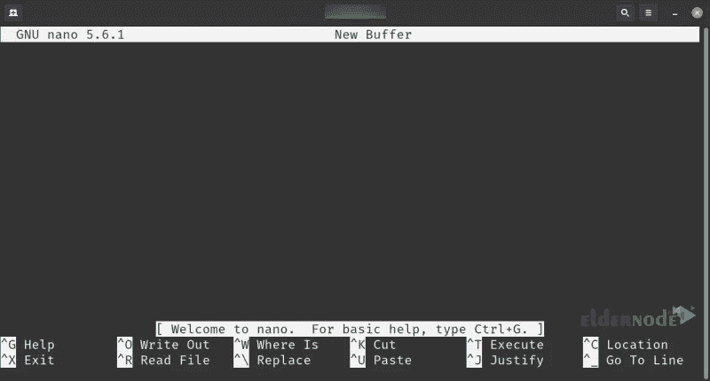

# 从 Vim 转向 Nano 的 7 个理由

> 原文：<https://blog.eldernode.com/7-reasons-to-switch-from-vim-to-nano/>

在命令行上工作时，您经常需要创建或编辑文本文件。Vim 和 Nano 是两个最强大和最流行的命令行编辑器。但是有些人更喜欢用 nano 而不是 vim。本文将向您介绍从 Vim 转向 Nano 的 7 个理由。如果你打算购买一台 Linux VPS 服务器，你可以在 [Eldernode](https://eldernode.com/) 网站上查看提供的软件包。

## **介绍从 Vim 切换到 Nano 的原因**

Linux 发行版有不同的编辑器，其中一些编辑器由于其通用性和易用性而比其他编辑器更受欢迎。在这个领域的杰出编辑中，我们可以提到 [Vim](https://blog.eldernode.com/use-vi-full-text-editor/) 和 Nano。最流行的 Linux 编辑器之一是 Nano。Nano 是一个简单的基于终端的文本编辑器，创建于 1999 年，用于 Unix 和 Linux 操作系统。

Vim 代表 Vi 改进版，是一个基于终端的 Unix 文本编辑器，于 1991 年随 Linux、BSD 和 macOS 一起推出。它是 Vi 的增强版，可以帮助你编辑程序文件和纯文本文件。

### **1- Nano 简单易用**

Nano 最适合初学者，可以让他们很快上手。它足以编辑测试文件。但是为了能够使用 Vim，您应该是一个稍微有经验的 Linux 用户。初学者可能会对 Vim 的编辑和命令模式感到困惑。一般来说，Vim 使用起来很复杂，很先进，但是 Nano 很简单。

### **2-它在单模式下工作**

Nano 在单一模式下工作，并且是无模式编辑器。而 Vim 是一个基于模式的文本编辑器，有模式。Vim 文本编辑器的不同命令模式让初学者感到困惑。在基于模型的文本编辑器中，您应该在将文本写入文件之前进入插入模式。

### **3- Nano 有交互的基本接口**

Nano 是用户友好的，它的主界面在窗口底部给你重要的信息。您不需要参考手册页或任何文档来执行基本步骤。要开始，你要做的就是参考 [Nano 编辑指南](https://blog.eldernode.com/how-to-install-and-use-nano-text-editor/)。

### **4——它比维姆**T3 小

Nano 在计算机上占用的空间更少。这使得使用 Nano 更加容易。因为它不占用太多的硬盘空间，你也不需要担心你的硬盘空间。而 Vim 占用了你硬盘上的大量空间，这使得它很难使用。

### **5- Nano 有更好的语法高亮**

Nano 是一个更强大的编辑器，具有更好的语法突出显示。它为多种编程语言和脚本提供了语法突出显示，并且比 Vim 具有更好的语法突出显示。对于语法突出显示，您所要做的就是指定一行语法名称和您希望语法突出显示的文件。

### **6-它支持更多的编程语言**

Nano 支持不同的编程语言，如 Python、C、PHP、Perl、Ruby、Java、JavaScript、SQL、HTML、XML、Bash、Makefiles 等。此外，它还为多种语言提供了默认规则。虽然核心 Vim 的所有扩展都是用 VIM 脚本编写的，但插件可以利用其他编程语言，如 Python、Perl、Ruby、Lua、Racket 和 Tcl。您可以手动或通过插件管理器安装插件。

### **7- Nano 更自由更快**

Nano 是一个免费的命令行文本编辑器，在 GNU 通用公共许可证版本 3 下发布。你可以使用它而不需要付费。你可以用它做任何事情。此外，它使用的内存更少，并且比 Vim 更快。通常，Nano 每行文本需要一个字节，但是 Vim 每行文本需要 16 个字节。

## 结论

纳米文本编辑器有更多的功能，更容易使用。它是 Unix 系统中最流行的文本编辑器之一。在本文中，我们解释了从 Vim 转向 Nano 的 7 个原因。我希望这篇教程对你有用，并且你喜欢它。如果您有任何问题或建议，可以在评论区联系我们。